# 大规模交直流电网电磁暂态数模混合仿真平台构建及验证

# (一)整体构架及大规模交直流电网仿真验证

朱艺颖1 ,于 钊2 ,李柏青1 ,郭 强1 ,刘 翀1 ,董 鹏1 ,王薇薇1 ,胡 涛1

( 电网安全与节能国家重点实验室(中国电力科学研究院有限公司),北京市 ;

国家电网有限公司,北京市 )

摘要:随着中国特高压交直流电网快速发展,交直流、多直流之间相互影响加剧,电网安全运行面临严峻挑战,对仿真工具的性能提出了更高的要求。对接入实际直流工程的控制保护装置进行数模混合仿真是当前对大规模交直流系统动态特性进行仿真所采用的较为准确的仿真手段。文中在原有数模混合仿真技术基础上,提出了适用于研究大规模交直流混联电网运行特性的新一代数模混合仿真平台构建方案。该方案以大规模电磁暂态实时仿真软件 和超级并行计算机为数字仿真核心,接入全部在运直流工程的控制保护装置及其他类型电力电子控制保护装置,解决了大规模特高压交直流电网高精度仿真试验研究的难题,并且实现了同时接入 回直流工程控制保护装置、电磁暂态仿真规模超过 节点的数模混合实时仿真。通过对实际电网故障的反演和结果对比,验证了所构建仿真平台方案的有效性。

关键词:大规模交直流电网;电磁暂态;实时仿真;建模;模型验证

# 0 引言

近年来 中国特高压交直流电网快速发展 新一级电压等级逐渐形成 风电 光伏等新能源大规模并网 电力系统加速重构 电力资源大范围优化配置能力大幅提高[1] 与此同时 交直流 多直流以及源网荷之间的相互影响加剧,直流输电规模不断扩大且日趋复杂 电网安全运行面临严峻挑战 未来 年内 西南水电基地 北方火电基地 可再生能源基地等大型能源基地的建设开发将继续深入进行。随着中国特高压骨干网架逐步建成 特高压直流回数不断增加 落点更为密集 交直流混联特征更加突出大电网稳定特性将更加复杂[2]

特高压电网的快速发展对仿真工具提出了更高的要求 特高压电网的形成使其内部各节点间电气距离进一步缩小 交流与直流之间 直流通过交流与其他直流之间的相互联系更为密切 交流系统谐波畸变、直流快速调节变化等电磁暂态时间尺度的物理过程将在更大范围内相互作用 交直流连锁反应影响面有可能波及整个电网 传统以研究机电暂态过程为主的大电网分析和仿真方法,已不能准确描述当前及未来电网的物理特性 电网运行边界将极

大地取决于仿真精度,对仿真工具的精度提出了更高要求[3]

电力系统数模混合仿真兼有物理和数字仿真技术特点 可进行从电磁暂态到机电暂态的全过程实时仿真研究 能较精确地模拟交 直流电网的运行特性和动态过程[4] 在进行大规模交直流电网仿真研究中 对接入多个直流工程的控制保护装置进行数模混合仿真是目前对交直流电网动态特性仿真较为准确的仿真手段[5]

为满足未来电网对仿真精度的要求 并具备支撑电网安全稳定运行的能力 数模混合仿真技术需要从以下两方面进行提升

需要进一步扩大电磁暂态的仿真规模 机电暂态仿真工具由于采用基于相量的准稳态模型 无法准确描述大功率电力电子与交流电网间的交互影响 因此在解决交直流电网准确分析问题时具有局限性 而离线的电磁暂态仿真软件适用工程分析和小规模电网研究 其计算效率较低 不适合大电网计算 且难以精确模拟基于电力电子技术的复杂控制保护系统 从而影响电网仿真结果的准确性  
需要接入大规模实际控制保护装置 提升数模混合仿真的技术能力 直流输电系统的控制保护装置特性直接影响故障连锁反应效果 与发电机励磁调节器等传统控制器相比 直流控制保护装置在

控制环节 板卡数量 指令速度 控制精度等方面更复杂 其模拟精度将极大影响交直流连锁故障仿真的准确性 目前采用的控制保护装置数字模型主要是对控制保护逻辑进行理想化建模 而对实际装置实现全部数字化建模仍需探索 根据电网运行实际 借鉴国内外经验 需要接入实际控制保护装置实现数模混合仿真 提升仿真精度 从而解决控制保护装置数字化精确建模困难等问题[6]

本文在原有数模混合仿真技术基础上 提出了适用于研究大规模交直流混联电网运行特性的新一代数模混合仿真平台构建方案 以解决大规模特高压交直流混联电网高精度仿真试验研究的难题

大规模交直流电网电磁暂态数模混合仿真平台构建及验证内容将分为 篇文章进行描述 本篇主要描述仿真平台整体构架及大规模交直流电网仿真验证 后续文章主要描述直流输电工程数模混合仿真建模及验证。

利用新一代数模混合仿真平台可实现特高压交直流混联大电网的数模混合实时仿真 能够对中国任一区域电网 及以上交直流电网进行电磁暂态实时仿真 电磁暂态仿真规模超过 节点并接入全部在运实际直流工程的控制保护装置 该平台还具备随时支撑实际电网运行方式校核的功能 已成为其他数字仿真软件的 校准钟

# 1 新一代数模混合仿真平台整体构架

为满足未来电网对仿真精度的要求 针对现有仿真技术需要扩大电磁暂态的仿真规模以及接入大规模实际控制保护装置两大迫切需求 结合中国电网发展 提出新一代数模混合仿真平台的总体构建方案 参见图 即采用通用架构的高性能并行计算机技术对交直流电网进行数字实时仿真 通过数模连接技术接入直流输电线路 静止无功补偿装置统一潮流控制器 新能源发电等电力电子设备的控制保护装置 实现大规模电网电磁暂态数字模型和大量实际物理控制保护装置闭环仿真[6]。解决电磁暂态实时仿真规模不断扩大的难题 需要实现基于多处理器且核间高速通信的超级并行计算机的电磁暂态实时仿真技术 提升软件仿真实时性 实现大规模电磁暂态电网自动化建模等 本文对这一方面进行了详细描述 解决同时接入大规模实际控制保护装置的难题,需要研究直流输电工程控制保护装置简化原则 深度优化数模混合仿真接口技术 规范直流输电系统一次建模要求及模型校核试验等 这一方面内容将在下一篇中进行详细描述

新一代数模混合仿真平台应该具备对中国多直

流落点地区电网的精确仿真 即电磁暂态实时仿真规模应该达到中国区域电网 及以上骨干网架 能够接入落点区域内的全部在运直流输电工程的控制保护装置。

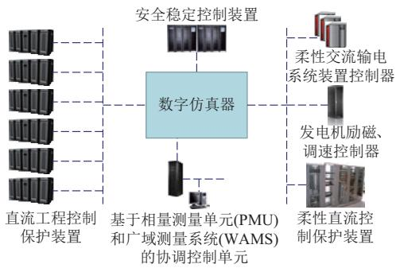  
图 新一代数模混合仿真平台总体构架  
Fig.1 General structure of a new generation digita-l analog hybrid simulation platform

# 2 大规模电网电磁暂态实时仿真技术

# 2 1 应用软件

从各类电磁暂态实时仿真工具的应用领域来看,主要包括 类:一类是大电网稳定分析的系统级仿真 另一类是单一工程的设备级仿真 目前国内外应用较为广泛的有加拿大曼尼托巴直流研究中心公司研发的电力系统全数字实时仿真系统加 拿 大 魁 北 克 水 电 研 究 所 研 发 的加拿大魁北克 公司研发的以及中国电力科学研究院有限公司研发的主要应用于单一工程的设备及其仿真 尚未应用到系统级研究 目前主要采用机电暂态 电磁暂态混合仿真 其应用于大规模电磁暂态实时仿真的技术正在完善之中 和均应用于设备级仿真和系统级仿真南方电网科学研究院采用 进行系统级仿真最大仿真规模达到 节点[7] 中国电力科学研究院有限公司国家电网仿真中心采用进行系统级仿真 最大仿真规模达到 节点新一代数模混合仿真平台要求能够对复杂大电网进行电磁暂态实时仿真 目前选择 作为数模混合仿真平台的数字仿真应用软件。国家电网仿真中心已经与加拿大魁北克水电局签署长期合作协议 联合开发 不断提升仿真能力

是一种基于并行计算技术、模块化设计 面向对象编程的电力系统全数字实时仿真软件 该系统既可以进行单处理器或多处理器的离线仿真 也可以进行基于多核的并行实时仿真的 软 件 核 心 为 电 磁 暂 态 程 序

仿真精度为 位双精度 它在代码产生编译和仿真过程中使用的都是真 位双精度浮点数 数值稳定 代码生成器用来分析网络拓扑 并将线路 母线 控制元件及其子系统分解为不同的任务 然后自动将任务合理分配给各并行处理器进行处理 从而使各任务之间的通信负担最小 通过代码生成模块产生的 语言代码在实时与离线状态下都完全相同 仿真结果也完全一致[8]。

HYPERSIM支持通过模数（A/D）、数模（D/接口及通信协议接口与硬件设备连接 能够实现数模混合实时仿真 中子任务在多个计算核中的自动平均分配功能非常灵活 在自动任务映射后 还可结合实际情况手动调整单个任务预估执行时间 也可手动调整单个任务所在的计算核还提供了多个参数供用户根据所仿真电网模型的具体情况进行合理调整 确保仿真的实时性 例如处理器的负载率 可通过它调整分配到一个计算核中的任务量 处理器不平衡率 可通过它调整每个计算核中所分配任务量的不平衡度 所需仿真总内核数（requested numberof CPUs），通过它可人工指定参与计算的总核数。通过对以上参数的综合调整 能够对多个任务进行更合理的优化分配 对于实现大规模电磁暂态实时仿真来说 实用性很强

# 2 2 硬件平台

电力系统实时仿真的硬件平台通常包括专用平台 计算机群和商用超级并行计算机[9] 对于大规模电网电磁暂态实时仿真来说 硬件平台的关键因素并不是单处理器的计算能力 而是整个计算机的通信性能[1 0] 单处理器的计算能力限制了单个任务量的最大处理时间 而通信性能则限制了同时运算的处理器最大数量 由于其仿真计算步长通常在左右 这就要求各个处理器之间的通信能力要能做到在一个计算步长内完成全部通信任务 包括与数模接口的通信 由于新一代数模混合仿真平台需要与多种多套实际控制保护装置连接 还需要实时仿真器能够具备可便利地扩展连接多个接口装置的能力 新一代数模混合仿真平台的硬件平台对并行处理器的规模、处理器之间的通信能力、数据带宽等相关指标提出较高要求 选择采用超级并行计算机 SGIUV300。

系列为单一节点 单一操作系统超级计算 服 务 器 具 有 灵 活 多 变 的 资 源 划 分 方 式为 公司近年来新开发的商用产品 采用最先进的分布式共享内存 架构 能够确保核

心关键业务的稳定运行 使机器具有持续稳定的高性能和可靠性 为了确保大电网仿真实时性 硬件平台选择了单核主频更高 缓存更大 速度更快 延迟更少的 系列的处理器 更加适合高速计算分析任务 在多计算核互联方式上采用的是基于最新的 高速互联技术的性能更高的 连接方式 所有处理器之间均能直接对话 无需跳转 与之前的基于高速互联技术的 的连接方式相比 大大提高了多处理器之间的通信速率[11] 还采用了机箱内置 插槽的方式来保证系统的可靠性 大大提升了连接外部装置的扩展能力和可靠性 图 为含 个处理器的拓扑结构示意图 其中 至代表 个处理器机箱 每个机箱中有 个处理器

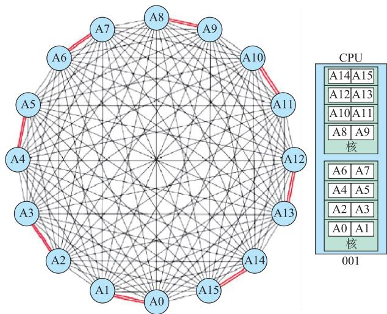  
图 2 SGI UV300 全互联拓扑结构示意图  
Fig.2 Schematic diagram of al-l to-all topology based on SGI UV300

# 2 3 大规模电网电磁暂态实时仿真建模

通用的电磁暂态仿真软件均采用图形界面,需要通过人机交互界面输入每个元件各项参数 并手工连接每个元件 结合网架结构和个人习惯完成整个仿真电网模型的图形布局。对于搭建工程级测试网模型来说 这样的方式是可行的 但对于搭建大规模交直流互联电网的电磁暂态仿真模型来说 这样的方式将带来巨大工作量、极高出错率、超长时间等问题 建模效率极低 新一代数模混合仿真平台通过开发基于机电暂态 电磁暂态转换的自动化建模工具 极大地提升了电磁暂态仿真建模效率

自动化建模工具的主要功能包括 电网元件模型参数转换 仿真电网拓扑结构自动生成 网络辅助解耦及解耦方案自动继承 仿真电网潮流

结果自动校核 发电机控制器模型的智能转换及 赋初值 故障仿真模型自动构建 监测量的自动 配置

电网元件模型中发电机模型 变压器模型 负荷模型等多数模型均可从机电暂态模型中读取参数并通过转换计算转为电磁暂态模型所需参数 发电机控制器模型与机电暂态模型保持一致 线路模型中按传输距离转换为分布参数模型和集中参数模型对于直流输电线路等含电力电子设备的线路不在自动转换范围内 而是直接复用与工程实际参数保持一致的详细模型

对于大规模电网电磁暂态实时仿真建模来说网络的合理化解耦方案是确保实时性的关键中对于带有子系统的元件 子系统之间也是解耦的 即分成不同子任务进行并行计算 在一个步长结束前完成数据交互 例如发电机模型其控制器为子系统 发电机本体与控制器之间是解耦的。

对于电磁暂态仿真来说 利用分布参数的线路模型可以实现自然解耦[1 2] 以恒定参数单相线路为例 图 为其等效电路示意图 图 中电流源的电流计算公式为:

$$
J _ {m K} (t) = \left(\frac {1 - h}{2}\right) \left(\frac {V _ {m K} (t - \tau)}{R _ {\mathrm {e q}}} + h I _ {m K} (t - \tau)\right) +
$$

$$
\left(\frac {1 + h}{2}\right) \left(\frac {V _ {m M} (t - \tau)}{R _ {\mathrm {e q}}} + h I _ {m M} (t - \tau)\right) \tag {1}
$$

$$
R _ {\mathrm {e q}} = Z _ {\mathrm {c}} + \frac {R _ {\mathrm {T}}}{4} \tag {2}
$$

$$
h = \frac {Z _ {\mathrm {c}} - \frac {R _ {\mathrm {T}}}{4}}{Z _ {\mathrm {c}} + \frac {R _ {\mathrm {T}}}{4}} \tag {3}
$$

式中 $: m$ 为代表正负零序的变量 $Z _ { \mathrm { ~ c ~ } }$ 为线路特征阻抗 τ 为沿线传输延时 $: R _ { \mathrm { ~ T ~ } }$ 为线路损耗 $\textit { J } _ { m K }$ 为 K 端电流源电流m 序分量 $I _ { { \scriptscriptstyle m K } }$ 为线路 K 端输入电流m序分量 $\boldsymbol { V } _ { m K }$ 为 K 端电压m 序分量

端电流源电流 m 序分量 $J _ { \mathbf { \Gamma } _ { m M } }$ 的表达式与$\textit { J } _ { m K }$ 相似,其中 $I _ { \mathbf { \Phi } _ { m M } }$ 为线路 M 端输入电流 m 序分量; $\boldsymbol { \cdot } \boldsymbol { V } _ { m M }$ 为M 端电压m 序分量。

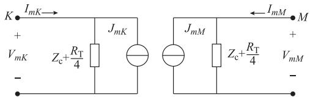  
图 分布参数线路模型等效电路  
Fig.3 Equivalent circuit of distributed-parameter-based transmission line model

从图 可看出 线路被简化成电流源和阻抗并联的 个隔离电路 电流源的电流与过去的电压 电流相关,两端电路分别在不同的计算内核中进行计算 通过交换节点电压和线路电流以便在下一个步长内求解线路等效电路 从而实现解耦 对于频率相关线路模型来说 原理一样但等效电路更为复杂然而 分布参数线路模型所能模拟的线路长度与仿真步长相关 线路传输延时 τ 必须要大于一个仿真步长,如果电磁波传输速度按近似光传播速度($1 0 ^ { 8 } \ \mathrm { m / s } )$ )来计算,则当仿真步长为 $5 0 ~ \mu \mathrm { s }$ 时,对应的能 用 分 布 参 数 模 型 模 拟 的 最 短 线 路 长 度 约 为短于 的线路只能采用集中参数模型进行模拟。

当 个子网之间出现分布参数解耦与集中参数不解耦的矛盾时 需要结合实际电网拓扑结构 判断子网计算量确定解耦方案,通常可以选择改变解耦路径 对于仍然需要解耦的短线路 可以采用强制解耦元件模拟该短线路 如果需要解耦的是变压器 也可用强制变压器解耦元件 强制解耦元件利用线路电抗或变压器漏抗 将线路或变压器简化为诺顿及戴维南等效电路实现解耦 强制解耦元件的原理也是采用线路贝瑞隆模型,按照式()计算出对应电容值

$$
C = \frac {d ^ {2}}{L} \tag {4}
$$

式中 $: d$ 为仿真步长 ${ \bf { ; } } L$ 为线路电感值

由于短线路的电感值较小 使用强制解耦元件会增加对地电容 因此可以通过外接对地电感来进行一定的误差补偿 但采用强制解耦元件在暂态过程中仍会带来一定的误差 通常是在 个子网实际构架无法由长度满足要求的分布参数线路模型解耦 而连在一起运算又会造成子任务超时的情况下才采用强制解耦元件

# 3 数模接口方案

新一代数模混合仿真平台需要接入国家电网全部直流工程控制保护装置以及其他电力电子设备的控制保护装置 其数模接口量巨大[1 3] 经过对比测试和分析 确定采用分布式光纤数字通信技术实现电网全数字实时仿真装置与控制保护装置的连接,该技术将具有不同功能的多台数模接口装置通过通信网络连接起来 在仿真服务器的统一管理控制下协调地完成大规模信息处理任务 多台接口装置的时间同步采用软同步技术 通过 串行通信线将所有接口装置的时间源从仿真主机上获取 采用同样的 光纤和通信技术保证同步信号的稳定

性和精确性 在后续文章中 将重点描述接入直流输电工程控制保护装置的数模混合接口技术

# 4 现场故障反演及波形对比

为验证大规模电磁暂态数模混合仿真平台在应用于交直流相互影响研究时的准确性 本文收集了华东电网近期的 个实际故障的信息和波形 以及故障发生时刻电网状态数据 在数模混合仿真平台上搭建了对应的华东电网仿真模型 模拟相同的故障 通过波形对比验证数模混合仿真平台仿真结果与实际系统的一致性[1 4] 。

# “· ”故障反演

# 4 1 1 电网模型

根据华东电网 故障时刻电网数据建立了交直流数模混合仿真模型 并将仿真模型数据与实际电网在线数据进行了对比 主要节点电压及骨干线路功率对比见附录 。结果证明仿真系统潮流与实际电网潮流一致

对华东电网 及以上网架进行了详细的电磁暂态实时仿真,其中落点华东的全部直流工程均接入了与实际工程特性一致的控制保护装置,仿真步长为 。“· ”故障仿真电网规模如下:整个电网仿真节点数为 个三相节点 发电机总出力为 发电机总数 台 直流模型 回

# 4 1 2 第一次故障反演分析

第一次故障发生时间为 年 月日 故障地点为凤岩线 故障现象是凤岩线 相发生短路接地故障 保护正确动作跳开相开关 后 相发生短路接地故障 相相开关同时跳开 故障造成灵绍直流 宾金直流双极换相失败 图 为宾金直流工程故障仿真波形与实际录波波形 故障点波形比较图见附录 从图 中可以看出 故障期间宾金直流交流母线电压受到扰动 直流电压迅速下降 直流电流迅速上升直流功率跌落至 双极发生换相失败

# 4 1 3 第二次故障反演分析

第二次故障发生时间为 年 月日 故障地点是兰仪线 故障现象为兰仪线 相短路接地故障,保护正确动作跳开 相开关 重合闸不成功跳三相开关 故障造成灵绍直流宾金直流发生换相失败 图 为灵绍直流工程故障仿真波形与实际录波波形的对比图 故障点及宾金直流波形对比图见附录 在故障及重合闸过程中 灵绍直流和宾金直流均受到 次扰动 灵绍直流在 次扰动中直流功率均跌落至 即双极发生换

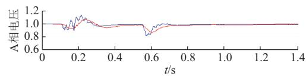

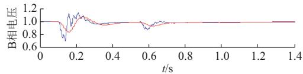

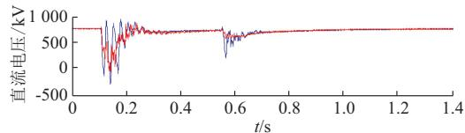

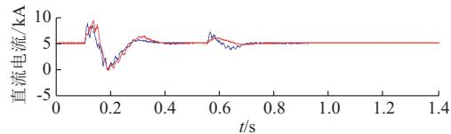

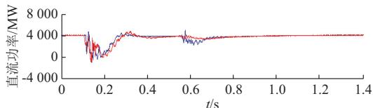  
-# ##   
图 4 宾金直流工程 A 相和 B 相交流电压,以及直流电压、电流、功率  
Fig.4 Phase A and B voltage,as well as DC voltage, current and power of Binjin HVDC Link

相失败 宾金直流在故障期间受扰动发生换相失败在重合闸期间受扰动直流电压和电流均有较大波动但并未发生双极换相失败

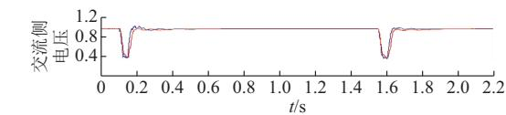

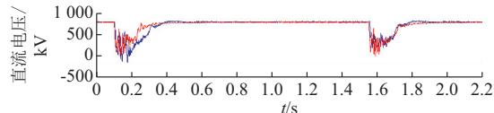

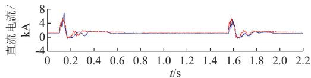

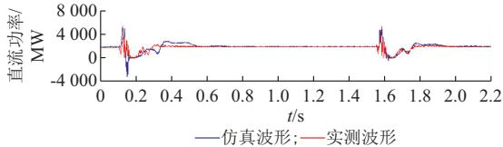  
图 灵绍直流工程交流侧电压,以及直流电压、电流、功率  
Fig.5 AC voltage,DC voltage,current and power of Lingshao HVDC Link

# 4 2 “9·22”故障反演

# 4 2 1 电网模型

根据华东电网 故障时刻电网数据建立

了交直流数模混合仿真模型 并将仿真模型数据与实际电网在线数据进行了对比 结果证明仿真系统潮流与实际电网潮流一致 主要节点电压及骨干线路功率对比见附录 在本次试验中 电磁暂态实时仿真规模突破了 个交流三相节点 含 回接入实际控制保护装置的直流输电数模混合仿真模型 故障仿真电网规模如下 节点数 交流三相 为5173(3721)个；发电机总出力为135097.22MW；发电机总数 台 直流模型 回

# 4 2 2 故障反演分析

故障发生时间为 年 月 日故障地点是练塘站特高压母线 故障现象为吴塘 线 相保护跳闸 重合成功 故障造成复奉直流 宾金直流 葛南直流 宜华直流 林枫直流双极同时发生换相失败 由图 可见 故障期间 复奉直流直流电压和电流波形为比较典型的换相失败波形 故障清除后均恢复到故障前运行状态 故障点波形对比及宾金直流电压和电流波形见附录

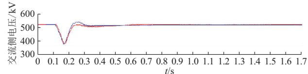

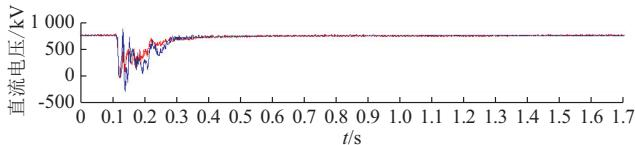

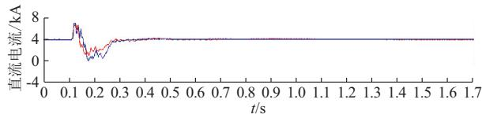

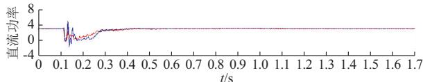  
-# ##   
图 6 复奉直流交流侧电压、直流电压、直流电流、直流功率  
Fig.6 AC voltage,DC voltage,current and power of Fufeng HVDC Link

# 故障反演小结

第一次 第二次故障反演以及故障反演完整再现了故障所在地及全部落点华东地区直流工程的故障响应特性 次故障过程中各直流换相失败发生情况的仿真结果与实际电网完全一致 直流电压 电流的扰动波形也与实际录波一致结果表明 新一代数模混合仿真平台能够准确仿真多直流落点地区交直流相互影响问题 可以用于精细化研究大规模交直流电网运行特性 为特高压交直流电网安全稳定运行提供可靠技术支撑[15]

# 5 结语

新一代数模混合仿真平台建成了世界上仿真规模最大的交直流混联电网电磁暂态数模混合仿真系统 实现了多回直流工程控制保护装置与大规模数字电网联合实时仿真 并在华东电网得到实际应用经过多次与实际交直流电网故障的对比检验 仿真结果与实际电网特性保持一致 新一代数模混合仿真平台的建成 标志着电力系统数模混合实时仿真进入了新的时代,数模混合仿真能力大幅提升,从而能够更加准确地反映实际系统特性 可以用于深入研究多直流馈入地区电网运行特性 为特高压交直流电网发展规划和安全稳定运行提供技术支撑,同时可以作为其他电力系统仿真软件的 校准钟

后续文章中 将描述通过直流输电工程数模混合仿真结果与工程现场调试结果对比 验证直流模型的准确性。本文描述的是通过与实际电网故障的对比验证大规模交直流电网数模混合仿真模型的准确性 本阶段主要侧重于交流故障引起的多回直流工程换相失败过程,今后数模混合仿真平台将继续捕捉实际电网严重故障数据 对严重故障后电网响应特性进行深入对比 从而进一步提升仿真精度

附 录 见 本 刊 网 络 版 ( :/// / / )。

# 参 考 文 献

刘振亚 中国电力与能源 北京 中国电力出版社38-65.  
LIU Zhenya. Power and energy in China[M].Beijing：China Electric Power Press，2012:38-65.   
李明节 大规模特高压交直流混联电网特性分析与运行控制电网技术，2016，40(4)：985-990.  
LI Mingjie. Characteristic analysis and operational control of large-scale hybrid UHV AC/DC power grid[J].Power System Technology，2016，40(4)：985-990.   
汤涌 印永华 电力系统多尺度仿真与试验技术 北京 中国电力出版社，2013：184-188.  
TANG Yong，YIN Yonghua.Multi-scale simulation and test technology of power systems[M].Beijing:China Electric Power Press，2013：184-188.   
中国电力百科全书 编辑委员会 中国电力百科全书 北京中国电力出版社  
Editorial Board of “China Power Encyclopedia”.China PowerEncyclopedia[M].Beijing：China Electric Power Press，2014：145-146.  
朱艺颖 蒋卫平 印永华 电力系统数模混合仿真技术及仿真中心建设[J].电网技术，2008，32(22)：35-38.  
ZHUYiying，JIANGWeiping，YINYonghua.General situation of power system hybrid simulation center[J].Power System Technology，2008，32(22)：35-38.   
朱艺颖 电力系统数模混合仿真技术及发展应用 电力建设

2015,36(12):42-47.   
ZHU Yiying. Development and application of power system digital-analog hybrid simulation technology[J]. Electric Power Construction，2015，36(12)：42-47.   
郭琦 交直流混联电网运行控制实时仿真技术研究 南方电网技术, , ():  
GUO Qi. Research on real-time simulation technology ofoperation control of AC&DC hybrid power system[J].SouthernPower System Technology，2017，11(3)：59-64.  
[8] PAREI D，TURMELI G，SOUMAGNEI J C.Validation tests of the Hypersim digital real time simulator with a large AC-DC network [C]// International Conference on Power Systems Transients（IPST 2003），September 28-October 2，New Orleans，USA.   
[9]LAROSE C,GUERETTE S,GUAY F.A fully digital real-timepower system simulator based on PC-cluster[J].Mathematicsand Computers in Simulation，2003，63(3/4/5)：151-159.  
周俊 郭剑波 交直流大电网数模混合仿真系统的并行计算效率研究 电网技术  
ZHOU Jun，GUO Jianbo.Parallel computing efficiency of digital/analog hybrid simulation system for large-scale AC/DC [ ] , , ( ):   
[11]LE-HUY P，WOODACRE M，GUERETTE S，et al. Massively parallel real-time simulation of very-large-scale ower s stems [C ]// International Conference on Power Systems Transients（IPST2017)，June 26-29，2017，Seoul, Korea.   
张民 交直流系统电磁暂态模型研究及仿真验证 北京 中国水利水电出版社  
ZHANG Min. Study on electromagnetic transient model of AC

DC system and simulation verification[M].Beijing：China Water Conservancy and Hydropower Press，2ol4：9-12   
胡涛 朱艺颖 印永华 等 含多回物理直流仿真装置的大电网数模混 合 仿 真 建 模 及 研 究 中 国 电 机 工 程 学 报32(7):68-75.  
HU Tao，ZHU Yiying，YIN Yonghua，et al.Modeling and study of digital/analog hybrid simulation for bulk grid with multi-analog HVDC simulators[J].Proceedings of the CSEE, 2012，32(7):68-75.   
[14] DO V Q，SOUMAGNE JC S，SYBILLE G. Hypersim：an integrated real-time simulator for power networks and control systems[C]// International Conference on Digital Power System Simulators(ICDS 99)，May 25-28，1999,Vasteras, Sweden.   
新一代特高压交直流电网数模混合仿真实验室建设技术报告[ ]北京:中国电力科学研究院有限公司,  
Technical report on construction of new generation power system digital-analog hybrid simulation laboratory for ultra high voltage AC and DC combined grid[R].Beijing：China Electric Power Research Institute，2017.

朱艺颖( —),女,通信作者,博士,教授级高级工程师,主要研究方向:电力系统实时仿真、直流输电及电磁暂态分析。E-mail：wzhyyf@epri.sgcc.com.cn

于 钊( —),男,硕士,高级工程师,主要研究方向:大电网安全稳定运行及调度。

李柏青( —),男,教授级高级工程师,主要研究方向:电力系统分析与控制。

(编辑 顾晓荣)

# Construction and Validation of Electromagnetic Transient Digita-l Analog Hybrid Simulation Platform for Large-scale AC/DC Power Grids

# Part One General Configuration and Simulation Validation of Large Scale AC/DC Power Grids

HU Yiying 1 ,YU Zhao 2 , LI Baiqing 1 , GUO Qiang 1 , LIU Chong 1 , DONG Peng 1 , WANG Weiwei1 , HU Tao 1

(1. State Key Laboratory of Power Grid Safety and Energy Conservation

(China Electric Power Research Institute)，Beijing lOo192,China;

2． State Grid Corporation of China，Beijing 10o031,China)

Abstract:With thefastdevelopmentof ultra-highvoltage power grids，and more and more serious interaction efects between AC/DC and DC/DC,the power grid safety faces serious chalenges，and the higher-level performance requirements are put forward for powersystem simulation tool.Tillnow,thedigital-analoghybridsimulationof thecontroland protectiondevices in real hi h volta e direct current HVDC ro ects is the more accurate mean to be ado ted for stud in the d namic characteristic of the large-scale AC/DC power grids.Based on the existed digita-l analog hybrid simulation technology,a construction scheme for a new eneration di ita-l analo h brid simulation latform is ro osed to stud the o eration characteristicsoflarge-scaleAC/DC powergrids.In this scheme，theelectromagnetic-transient real-time simulationsoftware HYPERSIMand super paralelcomputer SGIare usedforthe digital simulation,and thecontrol and protection devices of ll the existed HVDC and other ower electronic ro ects are able to be connected to the di ital simulation ower rid.Thus,the high-precisionsimulationproblems oflargescale AC/DCpower gridsare solved，and thereal-time simulationof large-scale AC/DC power grids with 8setsof HVDC projects controland protection devices and more than6O nodes is achieved.By actual faultsreproductionsanddetailedcomparisons betweenthedigital-analoghybrid simulation testandthefield test，the effectiveness of the proposed construction scheme of simulation platform are verified.

Key words: large scale AC/DC power grid; electromagnetic transient;real-time simulation; modeling; model validation