Published in IET Generation, Transmission & Distribution

Received on 24th July 2012

Revised on 5th October 2012

Accepted on 10th October 2012

doi: 10.1049/iet-gtd.2012.0425

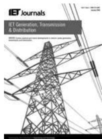  
ISSN 1751-8687

# Analytical study of the frequency-dependent earth conduction effects on underground power cables

Theofilos A. Papadopoulos, Andreas I. Chrysochos, Grigoris K. Papagiannis

Power Systems Laboratory, Department of Electrical and Computer Engineering, Aristotle University of Thessaloniki, P.O. Box 486, GR-54124 Thessaloniki, Greece

E-mail: grigoris@eng.auth.gr

Abstract: In electromagnetic transient analysis, one major issue is the influence of the imperfect earth on the propagation characteristics of transmission line conductors. Extensive research has been published for overhead lines, whereas the corresponding literature for underground cables is significantly less. Recently, new expressions for the calculation of the ground impedance and admittance have been proposed for the homogeneous and the stratified earth case. However, most transient simulation programs still use approximate earth representations. Scope of this study is to compare the proposed formulation with the corresponding approximations, in order to introduce a frequency limit for the use of the approximate earth models, as well as criteria that dictate the use of a stratified earth model. The resulting propagation characteristics are used in transient calculations, in order to validate the effect of the differences by the various approaches and the need to include a more accurate model in the simulation of underground cable transients.

# 1 Introduction

The accurate representation of the imperfect earth in the calculation of the electrical parameters of power system conductors is a topic covering almost a century of research effort. Conductors in power systems may be a part of overhead transmission lines (OHTLs) or underground cable systems.

For OHTLs many papers can be found in the literature, one of the most known is the original work of Carson [1] representing the influence of the imperfect homogeneous earth on series impedances of conductors at lower frequencies, using proper correction terms. This approach was improved later by Sunde [2], including earth permittivity in the series impedances and by Wise [3] introducing admittance earth correction terms, in order to calculate accurately the propagation characteristics of OHTLs at higher frequencies [4]. The validity of the approximate Carson’s model and the need of a generalised model, such as that proposed in [3, 4], has been investigated in [5], utilising Semlyen’s criteria [6]. The above-mentioned semi-infinite homogeneous earth models have also been extended to the stratified earth case [7, 8]. In [9], the influence of earth stratification on wave propagation is examined thoroughly, using the earth impedance of [7]. Furthermore, significant differences from the homogeneous earth assumption are observed, showing the necessity of stratified earth models in the calculation of the propagation characteristics of transmission lines (TL).

Based on the same assumptions as Carson, Pollaczek [10] derived ground earth correction expressions for underground cables. Similarly, Sunde [2] included earth permittivity in the original Pollaczek’s formula as a contribution to a more

accurate formulation at higher frequencies. A decade later, Vance [11] proposed a simplified expression for the ground admittance of a single conductor cable. Then, after two decades of almost no research activity on the topic, scientific interest was increased again, because of the spreading use of underground power cables.

In recent papers [12, 13], an extensive comparison is presented on the different homogeneous earth impedance formulas. Also in [12, 13], Vance’s ground admittance formula is adopted and its influence on the transient responses of underground cables is investigated. In [14], proper earth impedance formulas for the two-layer earth topology are derived, but with limited validity in the kHz frequency range. At the same time, more accurate earth models for the homogeneous and the two-layer earth case have been proposed in [15, 16], respectively. A main advantage of the new models is that they are both suitable for multiconductor cable arrangements, utilising the generalised methodology of [17]. Furthermore, earth conduction effects are calculated accurately for a wide-frequency range, since ground admittances are also considered. A proper propagation term is also included in the formulation of the ground impedance [18, 19]. The significance of these two terms on the accurate calculation of underground cable propagation characteristics has also been identified in [20, 21]. However, most transient simulation packages, such as alternative transients program/ electromagnetic transients program (ATP/EMTP) [22], still use the approximate model of [10] for the calculation of electromagnetic (EM) transient responses, leading to results, which can be inaccurate in cases of high-frequency transients.

Scope of this paper is to compare the proposed formulation for the homogeneous and the stratified earth case with the

respective approximate models. Differences are analysed and according to the frequency-dependent behaviour of the earth, a frequency-limit criterion is introduced, above which the proposed formulation should be used. The investigation also includes the influence of earth stratification, marking its significance in cases where the penetration depth of the EM field extends in both earth layers. The results are used for slow and fast transient response calculations in a single conductor arrangement.

# 2 System under study

The examined cable configuration consists of a single core (SC) cable buried in a two-layer earth as shown in Fig. 1. The EM properties, that is, conductivity, permittivity and permeability of the first and second earth layers, are $\sigma _ { 1 } , \varepsilon _ { 1 }$ $\mu _ { 1 }$ and $\sigma _ { 2 } , \varepsilon _ { 2 } , \mu _ { 2 } , \quad$ , respectively, while the first layer has a depth d and the second layer is of infinite depth. The SC cable consists of a conductor with resistivity $\rho _ { \mathrm { c } }$ and a lossless insulation with relative permittivity $\varepsilon _ { \mathrm { r } }$ –ins.

The cable is of variable length from 100 to 1500 m. At the cable sending end S a double exponential voltage source is connected, whereas the receiving end R is open-ended. The typical switching impulse (SI) 250/2500 μs and lighting impulse (LI) 1.2/50 μs waveforms of 1 pu amplitude are applied, in order to simulate slow and fast transients, respectively. The cable transient response is calculated solving the TL equations in the frequency domain for each discrete frequency up to 10 MHz and then is transformed to the time domain, using the inverse fast Fourier transform (IFFT) [23].

# 3 TL modelling

# 3.1 Per-unit-length parameters

Assuming quasi-transverse electromagnetic (TEM) propagation, the per-unit-length (pul) series impedance and shunt admittance parameters for the SC cable of Fig. 1, are defined in (1) and (2), respectively [17].

$$
Z _ {\text {t o t}} ^ {\prime} = Z _ {w} ^ {\prime} + Z _ {\text {i n s}} ^ {\prime} + Z _ {\mathrm {g}} ^ {\prime} \tag {1}
$$

$$
Y _ {\text {t o t}} ^ {\prime} = Y _ {\text {i n s}} ^ {\prime} / / Y _ {\mathrm {g}} ^ {\prime} \tag {2}
$$

In the above equations, the involved terms are:

† $Z _ { \mathrm { w } } ^ { \prime }$ representing the internal impedance of the conductor, as calculated by the skin effect formula [17].

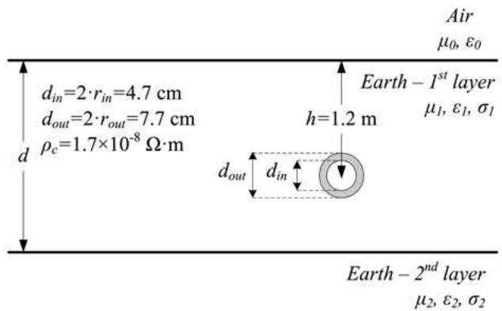  
Fig. 1 Cross-section view of a cable buried in a two-layer earth

† $Z _ { \mathrm { i n s } } ^ { \prime }$ and $Y _ { \mathrm { i n s } } ^ { \prime }$ are because of the magnetic and electric field in the insulation, respectively, calculated using the corresponding well–known formulas [17].   
$\bullet Z _ { \mathrm { { g } } } ^ { \prime }$ and $Y _ { \mathrm { { g } } } ^ { \prime }$ are the ground impedance and admittance of the cable, respectively, representing the influence of the imperfect earth. The pul ground impedance and admittance expressions for the two–layer earth topology have the form of (3) and (4) [16].

pul self-ground impedance:

$$
Z _ {\mathrm {g}} ^ {\prime} = \frac {\mathrm {j} \omega \mu_ {1}}{2 \pi} \int_ {0} ^ {+ \infty} F (\lambda) \cos \left(\lambda \cdot r _ {\text {o u t}}\right) \cdot \mathrm {d} \lambda \tag {3}
$$

pul self-ground admittance:

$$
Y _ {\mathrm {g}} ^ {\prime} = \mathrm {j} \omega P _ {\mathrm {g}} ^ {- 1} \tag {4a}
$$

$$
P _ {\mathrm {g}} = \frac {\mathrm {j} \omega}{2 \pi \left(\sigma_ {1} + \mathrm {j} \omega \varepsilon_ {1}\right)} \int_ {0} ^ {+ \infty} [ F (\lambda) + G (\lambda) ] \cos (\lambda \cdot r _ {\text {o u t}}) \cdot \mathrm {d} \lambda \tag {4b}
$$

where λ is the integration variable, P is the ground potential coefficient and functions F(λ) and G(λ) are given in the Appendix. If both earth layers have the same EM properties, (3) and (4) are reduced to the corresponding expressions for the homogeneous earth case [15].

The proposed pul ground impedance and admittance expressions have a generalised form, since all EM properties of the propagation media take arbitrary values. Furthermore, the term $k _ { x }$ defined in (A.15) of the Appendix represents the propagation in the first earth layer and is inserted in the formulation of F(λ) and G(λ) as occurs from the rigorous solution of the EM field equations [15, 16, 18, 19]. This term differentiates the integrand form of (3) from the Pollaczek [10] and Sunde’s [2] expressions for the homogeneous earth case and from the formula derived in [14] for the stratified topology, since in all above approaches $k _ { x }$ is taken equal to zero. The influence of $k _ { x }$ is significant, especially at higher frequencies, where earth dielectric properties affect the wave propagation. This is analysed in Fig. 2 for the stratified earth topology, where the real and the imaginary parts of F(λ) are plotted at 50 and 500 kHz, respectively. The relative permittivity of both earth layers is 10, whereas the corresponding value for the insulation is 3.5.

The proposed ground impedance formula is compared with the corresponding of [14], characterised as ‘approximate’. Several values of the first-to-second earth layer resistivity ratio $\rho _ { 1 } / \rho _ { 2 }$ are examined. The effect of $k _ { x }$ term becomes noticeable as the frequency increases and in cases where at least one of the two earth layers has high earth resistivity. This is not the case for topologies where both earth layer resistivities are low, that is, $\rho _ { 1 } = 5 0 \Omega { \cdot } \mathrm { m } , \ \rho _ { 2 } = 1 0 0 \Omega { \cdot } \mathrm { m }$ , where differences are small even at 500 kHz. A similar analysis for the homogeneous earth case has been conducted in [21], showing that differences between the proposed and the approximate formula of Sunde also increase with frequency and earth resistivity.

However, the most significant contribution of the proposed model is the inclusion of the influence of the imperfect earth on the cable shunt admittance, using the potential coefficient term of (4b). In most cases, only the insulation admittance is taken into account, limiting the model accuracy at the

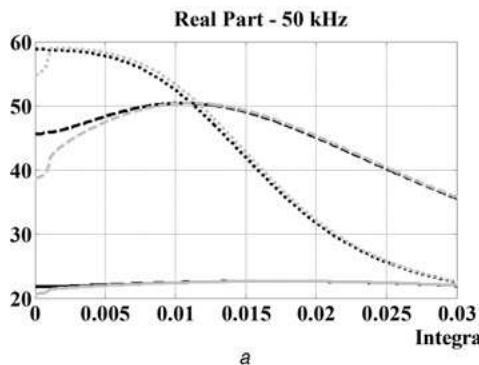  
—Prop.50/100--Prp0/100·Po10/100Apr.50/00Appr10/100Ap0/100

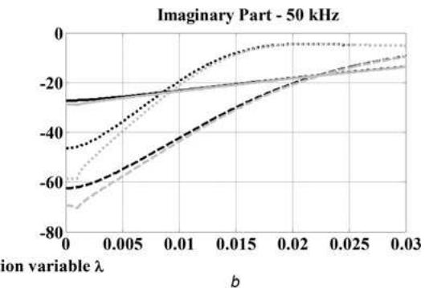

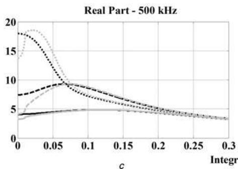

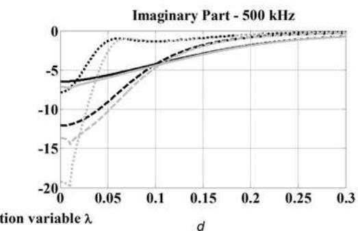  
Fig. 2 Function F(λ) for the stratified earth case

a Real part at 50 kHz   
b Imaginary part at 50 kHz   
c Real part at 500 kHz   
d Imaginary part at 500 kHz

low-frequency (LF) region [18, 19]. Ground admittance formulas have also been proposed in [11, 12], but only for the homogeneous earth case, neglecting the burial depth of the cable.

# 3.2 Propagation characteristics analysis

Using the proposed formulation for the calculation of the SC cable pul parameters, the characteristic impedance and the propagation constant terms are derived by (5a) and (5b), respectively.

$$
Z _ {\mathrm {c h}} = \sqrt {\frac {Z _ {\mathrm {t o t}} ^ {\prime}}{Y _ {\mathrm {t o t}} ^ {\prime}}} = \sqrt {\frac {\left(Z _ {\mathrm {w}} ^ {\prime} + \mathrm {j} \omega L ^ {\prime} + Z _ {\mathrm {g}} ^ {\prime}\right) \cdot \left(\mathrm {j} \omega C ^ {\prime} + Y _ {\mathrm {g}} ^ {\prime}\right)}{\mathrm {j} \omega C ^ {\prime} \cdot Y _ {\mathrm {g}} ^ {\prime}}} \tag {5a}
$$

$$
\begin{array}{l} \gamma = \sqrt {Z _ {\mathrm {t o t}} ^ {\prime} \cdot Y _ {\mathrm {t o t}} ^ {\prime}} \\ = \sqrt {\left(Z _ {\mathrm {w}} ^ {\prime} + \mathrm {j} \omega L ^ {\prime} + Z _ {\mathrm {g}} ^ {\prime}\right) \cdot \left(\frac {\mathrm {j} \omega C ^ {\prime} \cdot Y _ {\mathrm {g}} ^ {\prime}}{\mathrm {j} \omega C ^ {\prime} + Y _ {\mathrm {g}} ^ {\prime}}\right)} \tag {5b} \\ \end{array}
$$

For a homogeneous earth of $\rho _ { 1 } = 1 0 0 0 \Omega { \cdot } \mathrm { m }$ and a two-layer earth case of $\rho _ { 1 } = 1 0 0 0 \Omega { \cdot } \mathrm { m }$ , $\rho _ { 2 } = 5 0 0 \Omega { \cdot } \mathrm { m }$ , the attenuation and phase constants are illustrated in Figs. 3a and $^ { b , }$ respectively. The relative permittivities of all earth layers in both homogeneous and stratified earth representation are equal to 10, the relative permittivity of the insulation is 3.5, whereas all propagation media have relative permeability equal to 1. In both figures, the corresponding terms of the propagation constants $\gamma _ { 1 } = \sqrt { \mathrm { j } \omega \mu _ { 1 } \mathopen { } \mathclose \bgroup \left( \sigma _ { 1 } + \mathrm { j } \omega \varepsilon _ { 1 } \aftergroup \egroup \right) }$ and $\gamma _ { \mathrm { i n s } } = \mathrm { j } \omega \sqrt { \mu _ { \mathrm { i n s } } \varepsilon _ { \mathrm { i n s } } }$ are also presented, as boundaries of the calculated propagation constant γ [15, 16]. For the stratified

earth case, the parameters of the upper earth layer are used in the calculation of $\gamma _ { 1 }$ .

The SC cable propagation characteristics are analysed considering the frequency-dependent behaviour of earth [13, 21]. For OHTLs, proper criteria are defined by Semlyen [6], while similarly in [21] the corresponding frequency limit is proposed for underground cables. Therefore the SC cable propagation characteristics can be classified according to the EM properties of earth into three frequency ranges, using the definition of (6) for the critical frequency $f _ { \mathrm { c r } }$

$$
f _ {\mathrm {c r}} = \frac {\sigma}{2 \pi \varepsilon_ {0} \varepsilon_ {\mathrm {r}}} \tag {6}
$$

For the homogeneous earth topology σ and ɛr of (6) are equal to the EM values of earth, similarly to the OHTL case [6], while for the stratified earth, $f _ { \mathrm { c r } }$ is defined by the properties of the second earth layer. The proposed frequency ranges are:

LF range: for $f < f _ { \mathrm { c r - m i n } }$ [21], (5a) and (5b) can be approximated with (7a) and (7b), respectively. The minimum critical frequency $f _ { \mathrm { c r - m i n } } = 0 . 0 0 1 \cdot \dot { f } _ { \mathrm { c r } }$ is similarly defined as in [6] for OHTLs.

$$
Z _ {\mathrm {c h} - \mathrm {L F}} \simeq \sqrt {\frac {\left(Z _ {\mathrm {w}} ^ {\prime} + \mathrm {j} \omega L ^ {\prime} + Z _ {\mathrm {g}} ^ {\prime}\right)}{\mathrm {j} \omega C ^ {\prime}}} \tag {7a}
$$

$$
\gamma_ {\mathrm {L F}} \simeq \sqrt {\left(Z _ {\mathrm {w}} ^ {\prime} + \mathrm {j} \omega L ^ {\prime} + Z _ {\mathrm {g}} ^ {\prime}\right) \cdot \mathrm {j} \omega C ^ {\prime}} \tag {7b}
$$

In this case, $Y _ { \mathrm { t o t } } ^ { \prime } \simeq \mathrm { j } \omega C ^ { \prime } \ [ 2 , 1 1 ] ;$ since the earth behaves as a conductor and also the influence of the $k _ { x }$ term in the ground impedance formulation is almost negligible as shown previously. Therefore for the homogeneous earth case, the

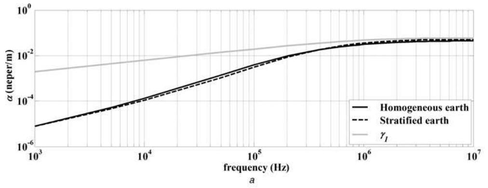

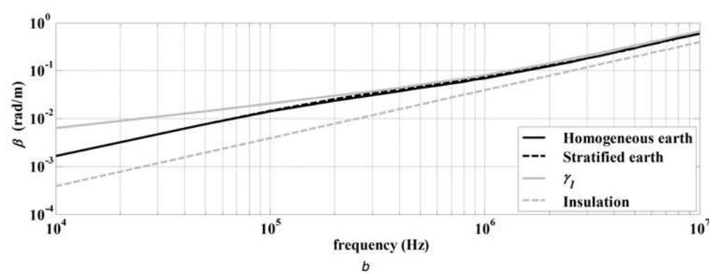  
Fig. 3 Propagation constants for the two-layer and the homogeneous earth case

a Attenuation and b Phase constant

propagation characteristics calculated, using the proposed formulation [15, 16] are the same to those obtained by Sunde’s approach [2]. Neglecting further the influence of earth permittivity, leads to results that are identical to those calculated using Pollaczek’s approach [10]. In the case of the stratified earth, the proposed formulation gives results in compliance with the approximate model of [14].

Mid-frequency (MF) range: for $f _ { \mathrm { c r - m i n } } < f < f _ { \mathrm { c r } } [ 2 1 ] .$ . In this frequency range, the effect of the propagation constant term $k _ { x }$ on the ground impedance becomes significant and also the ground admittance becomes comparable with the insulation admittance [11]. The influence of the earth is characterised by the combined effect of the conducting and dielectric properties of the soil. The propagation characteristics calculated with the proposed formulation begin to diverge from the corresponding of the approximate approaches [2, 14].

High-frequency (HF) range: for $f _ { \mathrm { c r } } < f < f _ { \mathrm { T L - l i m i t } } ,$ where $f _ { \mathrm { T L - l i m i t } }$ defined in (8) is the upper frequency limit of the quasi-TEM propagation [24].

$$
f _ {\mathrm {T L} - \text {l i m i t}} = \frac {\sigma_ {1} \cdot \pi}{\varepsilon_ {1} \sqrt {1 + 4 \pi^ {2}}} \tag {8}
$$

The propagation characteristics of the insulated cable can be approximated with those of the bare wire configuration in (9a) and (9b), since $Z _ { \mathrm { t o t } } ^ { \prime } \simeq Z _ { \mathrm { g } } ^ { \prime }$ and $Y _ { \mathrm { t o t } } ^ { \prime } \simeq Y _ { \mathrm { g } } ^ { \prime } \ [ 2$ , 11].

$$
Z _ {\mathrm {c h - H F}} \simeq \sqrt {\frac {Z _ {\mathrm {g}} ^ {\prime}}{Y _ {\mathrm {g}} ^ {\prime}}} \tag {9a}
$$

$$
\gamma_ {\mathrm {H F}} \simeq \gamma_ {\text {b a r e}} = \sqrt {Z _ {\mathrm {g}} ^ {\prime} \cdot Y _ {\mathrm {g}} ^ {\prime}} \tag {9b}
$$

An additional approximation in the HF range is to neglect the cable burial depth [2] when the cable depth is increased beyond a ‘few’ times the penetration depth δ in the soil [2, 19]. The integral terms contribution becomes negligible and the propagation constant becomes equal to $\gamma _ { 1 } ,$ as confirmed also by the results of Fig. 3 in this frequency range. The penetration depth is defined as [24]

$$
\delta = \frac {1}{\omega \sqrt {\left(\varepsilon_ {1} \mu_ {1} / 2\right) \cdot \left(\sqrt {1 + \left(\sigma_ {1} ^ {2} / \left(\omega^ {2} \cdot \varepsilon_ {1} ^ {2}\right)\right)} - 1\right)}} \tag {10}
$$

# 3.3 Limitations of the proposed model

Although the proposed formulation significantly improves the representation of earth conduction effects on underground cables, it relies on the assumption of the quasi-TEM field propagation. Under this approximation, only the TL mode of propagation is taken into account for the calculation of voltages and currents along conductors, ignoring the higher order modes included in the full-wave Maxwell’s equations [4]. Therefore the application range of the proposed model, as well as of the TL-based simulation programs, such as ATP/EMTP, is limited up to the $f _ { \mathrm { T L - l i m i t } } .$ For this frequency range, the wavelength of the EM field is greater than the penetration depth in the soil [24]. As occurs from (8), the TL approach can be a satisfactory approximation for frequencies up to the MHz frequency range, assuming values of earth resistivity not exceeding 1000 Ω·m. In this frequency range, almost all types of power engineering transient phenomena can be included.

# 4 Homogeneous earth

The propagation characteristics of the SC cable of Fig. 1 are calculated for the homogeneous earth topology. The proposed [15] and the approximate LF approach of Sunde are compared highlighting the $f _ { \mathrm { c r - m i n } }$ limit, above which the two approaches present significant differences.

The ratio of the propagation characteristics, defined in (11), is used to compare the results between the two approaches.

$$
\text {r a t i o} = \frac {\left| \text {p r o p a g a t i o n} - \operatorname {c h a r} _ {\text {p r o p o s e d}} \right|}{\left| \text {p r o p a g a t i o n} - \operatorname {c h a r} _ {\text {a p p r o x i m a t e}} \right|} \tag {11}
$$

where ‘propagation-char’ can be the characteristic impedance magnitude $Z _ { \mathrm { c h } } ,$ the attenuation constant α or the phase constant $\beta .$

# 4.1 Influence of earth EM properties

First, the influence of the homogeneous earth EM properties on the ratio of the propagation characteristics is investigated. In Figs. 4a and b, the ratio of the attenuation and phase constants is presented for different earth resistivities, while earth relative permittivity $\varepsilon _ { \mathrm { r 1 } }$ is 10. In Figs. $_ { 4 c }$ and $d ,$ the same ratios are presented, assuming earth resistivity $\rho _ { 1 }$ constant and equal to 500 Ω·m, while $\varepsilon _ { \mathrm { r 1 } }$ is variable. In all examined topologies the insulation relative permittivity $\varepsilon _ { \mathrm { r - i n s } }$ is assumed equal to 3.5.

The ratios of the attenuation and phase constant terms differentiate significantly from unity at frequencies higher than $f _ { \mathrm { c r - m i n } } ,$ verifying the proposed definition of the minimum critical frequency limit. For example, for $\rho _ { 1 } = 5 0 0 \Omega { \cdot } \mathrm { m }$ and $\varepsilon _ { \mathrm { r 1 } } = 1 0 , f _ { \mathrm { c r - m i n } }$ is 3.6 kHz. Furthermore, as earth resistivity increases and earth permittivity

decreases, all ratios of propagation characteristic acquire higher peak values, as in the case of OHTLs [25]. The deviation in the phase constant starts at higher frequencies than the corresponding for the attenuation constant. Therefore the attenuation constant defines the minimum critical frequency limit, since its ratio becomes higher than unity at frequencies higher than $f _ { \mathrm { c r - m i n } } .$ . At frequencies higher than $f _ { \mathrm { c r } }$ the attenuation constant ratio becomes lower than unity [21].

The above remarks are also verified in the transient response of the SC cable, obtained for different earth topologies and source excitations. In Fig. 5a the SI response of the open-ended terminal R of a 1500 m long cable is shown, assuming $\varepsilon _ { \mathrm { r 1 } } = 1 0$ . Differences in the transient responses between the proposed and the approximate models are observed for $\begin{array} { r } { \bar { \rho } _ { 1 } = 1 0 0 0 \Omega \cdot \mathrm { m } , } \end{array}$ since the $f _ { \mathrm { c r - m i n } }$ for this case is close to 2 kHz, while the spectrum context of the transient response at the cable end includes frequencies up to some kHz.

The spectrum context of the faster LI waveform at end R of the 100 m long cable exceeds 100 kHz. Therefore remarkable differences both at the peak values and the travel time of the transient response between the two approaches are recorded in Fig. 5b, especially for $\rho _ { 1 } = 1 0 0 0 \Omega { \cdot } \mathrm { m }$ . The propagation characteristics calculated by the approximate model are slightly affected by the EM properties of the soil [11]; thus the corresponding SI and LI responses for the two earth topologies present small differences during the initial simulation period.

# 4.2 Influence of the insulation

The influence of the dielectric properties of the insulation on the propagation characteristics is investigated in Figs. 6a and b, calculating the attenuation and phase constant ratios

Fig. 4 Ratios of the attenuation and phase constant for different homogeneous earth topologies   
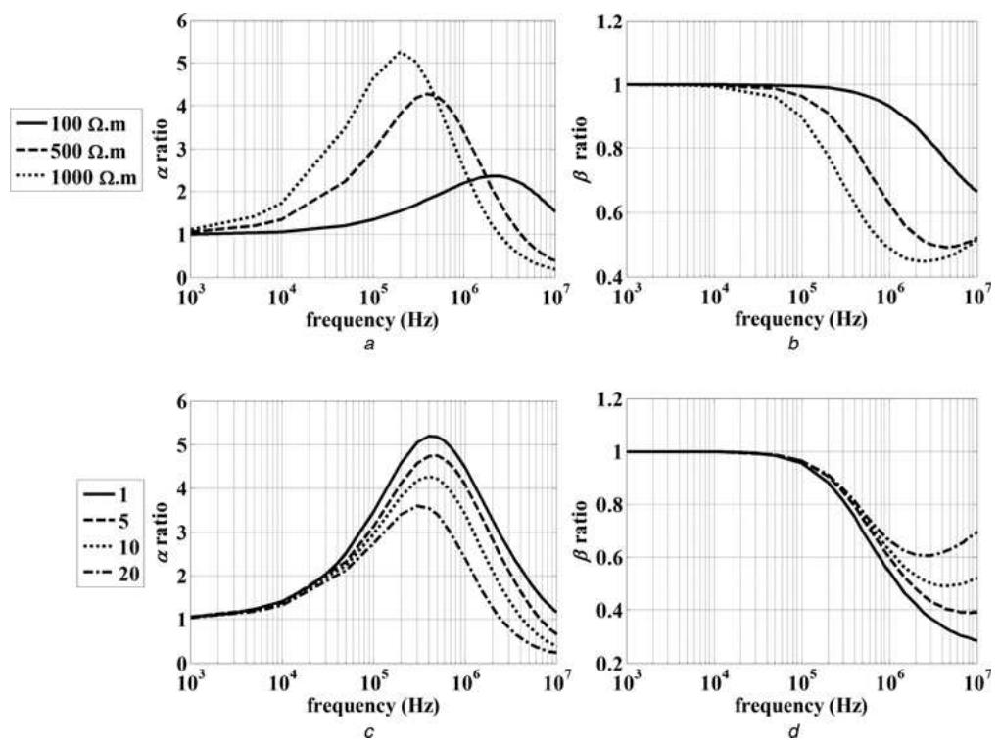  
a and c Attenuation constant   
b and d Phase constant

Proposed 100Ω.m---Proposed 1000Ω.m-Sunde100Ω.m--Sunde1000Ω.m

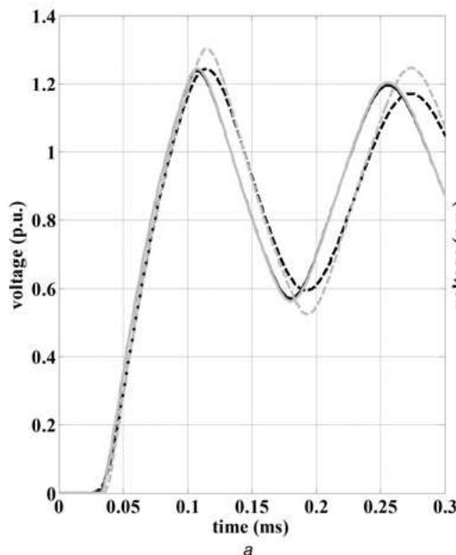

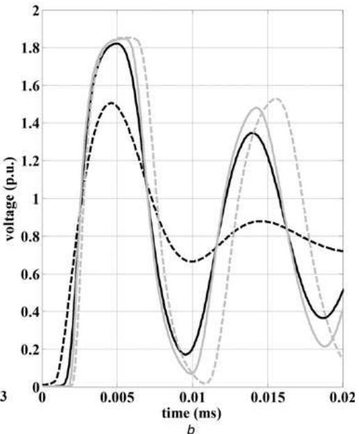  
Fig. 5 Responses for different earth resistivities, applying

a SI at cable with length 1500 m

b LI at cable with length 100 m

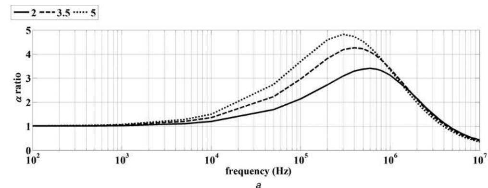

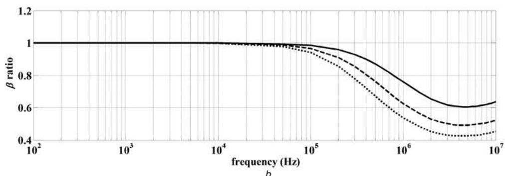  
Fig. 6 Ratios of

a Attenuation for different insulation permittivities   
b Phase constants for different insulation permittivities

for varying $\varepsilon _ { \mathrm { r - i n s } } .$ The homogeneous earth resistivity is 500 Ω·m and earth relative permittivity is 10.

The minimum critical frequency limit is practically verified again, since the propagation constant ratio differentiates from unity for frequencies higher than 5 kHz in all cases, while

$f _ { \mathrm { c r - m i n } }$ is calculated at 3.6 kHz. Differences between the two approaches increase as $\varepsilon _ { \mathrm { r - i n s } }$ increases, which is also illustrated in the LI response at end R of a 100 m long cable in Fig. 7. The peak value of the attenuation constant ratio is recorded at the kHz frequency range for the examined

Fig. 7 LI response for different insulation permittivities   
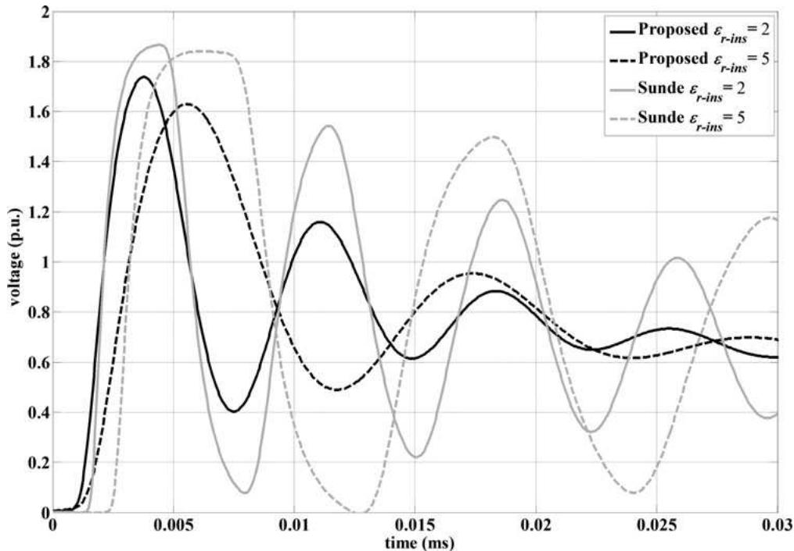  
Cable length is 100 m

cases, while the corresponding curves almost coincide after 1 MHz.

# 5 Stratified earth

# 5.1 Comparison with the approximate approach

In Fig. 8 the ratios of the propagation constant and the characteristic impedance magnitude are presented for several combinations of layer resistivities, while the relative permittivity of both layers is 10. Furthermore, in Fig. 9 different values of earth permittivity are examined, while the first and second earth layer resistivities are considered equal to 500 and 100 Ω·m, respectively. The ratios are calculated assuming as reference method in (11) the approximate formulation of [14]. In all cases, the depth of the first layer is 3 m.

The minimum critical frequency for the two-layer earth is determined by the EM properties of the second layer, especially for the attenuation constant ratio. This is attributed to the return currents, which in the LF and MF range penetrate into the second earth layer [7]. Equation (10) shows that the penetration depth acquires values >10 m at frequencies < 250 kHz for all examined cases. Therefore for greater ratios of the first to the second earth layer resistivities, higher peaks of the propagation constant ratios are recorded. Results for the characteristic impedance magnitude confirm the criterion of $f _ { \mathrm { c r - m i n } } ;$ however, the differences between the two approaches are smaller than the corresponding for the propagation constants. The calculated ratios for the stratified case acquire almost the same values as for the homogeneous earth case. In Fig. 9, it is shown that the influence of the first earth layer permittivity is significant at frequencies higher than the minimum critical frequency, since in this case the penetration depth is reduced to the first earth layer. Comparing the corresponding values of the propagation characteristics ratio in Figs. 4 and 9, it is observed that the influence of earth permittivity is more significant in the stratified earth case than in the homogeneous earth topology.

Similar remarks have also been concluded in the case of overhead conductors [7].

Differences between the proposed and the approximate formulations are also verified in transient simulations. In Fig. 10, the ratio of the recorded LI peak voltage level $( V _ { \mathrm { p e a k } } )$ at different points along the 100 m long cable to the input peak voltage $( V _ { 0 } )$ at end S is presented. Voltage levels for both earth topologies obtained by the approximate approach present small differences, especially close to the cable end R. On the contrary, results calculated with the proposed model show a significant sensitivity to earth EM properties and differences to the approximate model increase as the resistivity of the second layer increases, since $f _ { \mathrm { c r - m i n } }$ is obtained at lower frequencies.

# 5.2 Comparison with the homogeneous earth

The influence of earth stratification is examined in Fig. 11, calculating the propagation constant ratio of the stratified to the homogeneous earth case. The EM properties of the homogeneous earth are taken equal to those of the upper earth layer of the corresponding stratified earth topology.

Significant differences for the stratified case appear in the MF range, while at higher frequencies differences reduce. In the HF range, the penetration depth becomes small and return currents are limited to the upper earth layer, where the cable is buried [7]. In the HF range the first earth layer EM properties are dominant for the wave propagation and therefore the stratified case can be satisfactorily approximated by the homogeneous earth topology [5].

For topologies with $\rho _ { 1 } / \rho _ { 2 }$ greater than unity in the MF range, the attenuation constant of the stratified earth case is lower than the corresponding of the homogeneous earth, while when $\rho _ { 1 } / \rho _ { 2 }$ is lower than unity the opposite behaviour is observed. Furthermore, results indicate that the recorded differences between the stratified and the homogeneous earth topologies increase as the ratio $\rho _ { 1 } / \rho _ { 2 }$ deviates from unity.

Fig. 8 Ratios of   
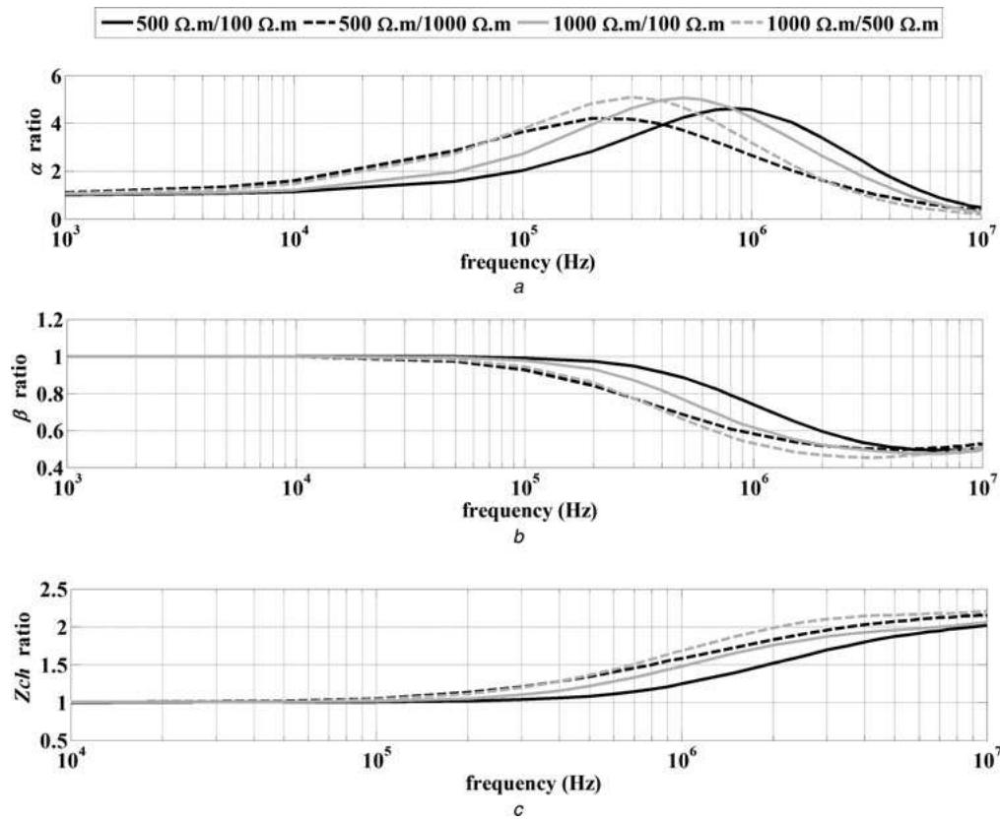  
a Attenuation constant   
b Phase constant   
c Characteristic impedance magnitude for different stratified earth topologies

Fig. 9 Ratios of   
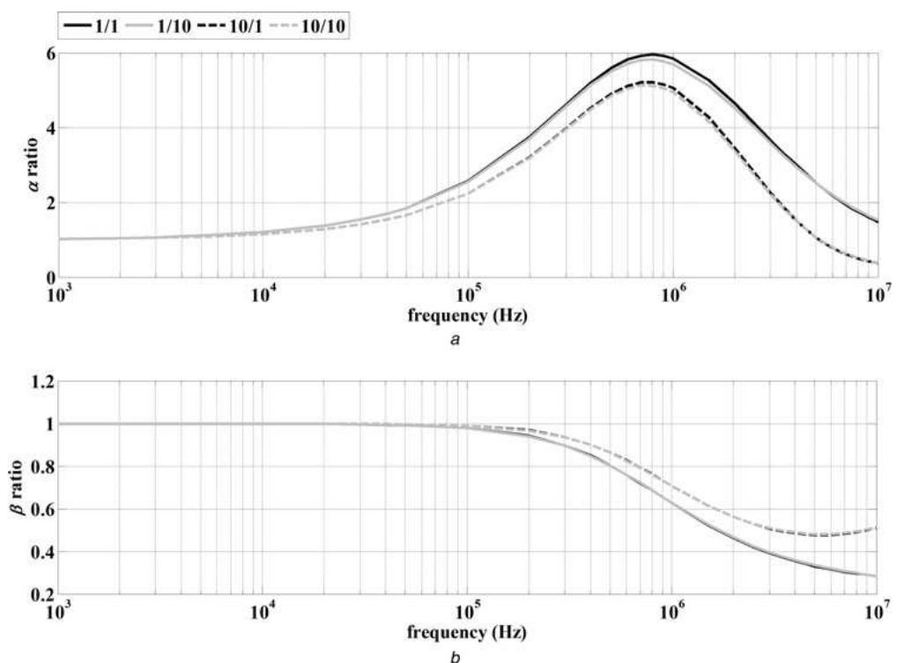  
a Attenuation constant   
b Phase constant for different values of earth permittivity   
First to second earth layer resistivity is 500/100 Ω·m

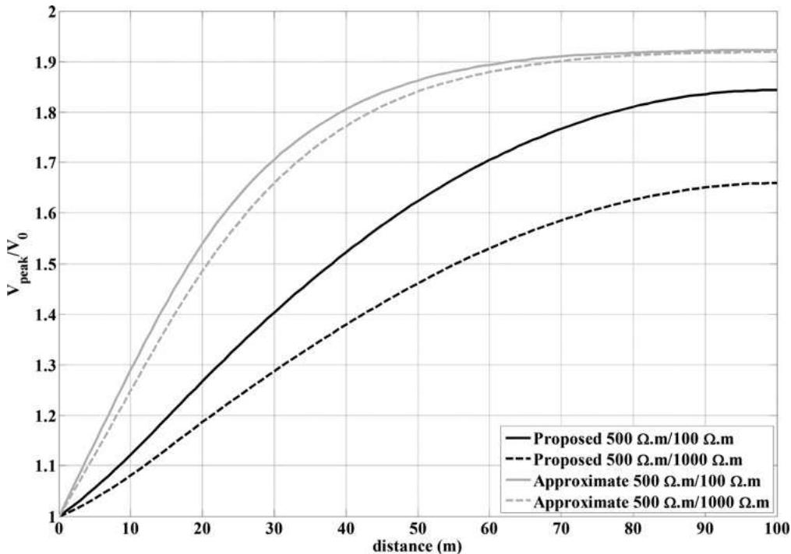  
Fig. 10 Voltage profile ratios along a 100 m underground cable Comparison between the proposed and the approximate stratified earth approach

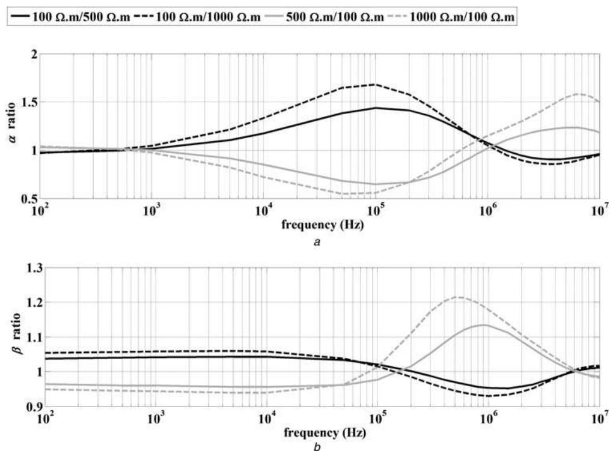  
Fig. 11 Stratified against homogeneous earth ratios of a Attenuation constant b Phase constant for different earth topologies

The above remarks are also recorded in Figs. 12a and b, for the SI and LI responses, respectively, where the peak voltage profiles along a cable are compared for the stratified and the homogeneous earth. The cable length is 1000 m for the SI response and 100 m for the LI case. The propagation characteristics are calculated using the proposed formulation for both topologies.

In the case of $\rho _ { 1 } / \rho _ { 2 } < 1$ , voltage peaks obtained by the homogeneous earth topology acquire higher values than the

stratified earth case, while the opposite happens when $\rho _ { 1 } / \rho _ { 2 } > 1$ . The above analysis indicates that earth stratification cannot be ignored, especially when the EM field penetrates deeply into the lower earth layer.

# 5.3 Influence of depth of the upper earth layer

The attenuation constant ratio of the stratified to the homogeneous earth is also calculated in Fig. 13, assuming

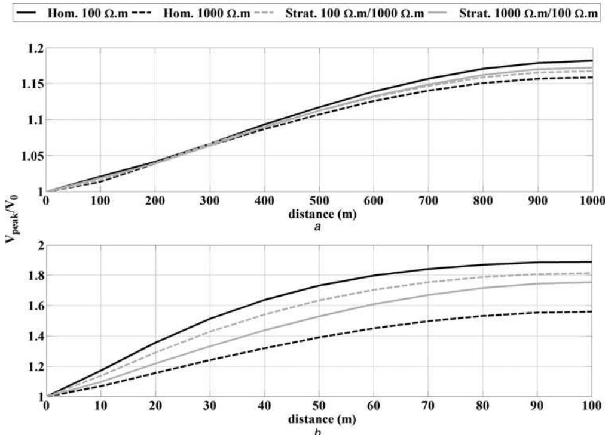  
Fig. 12 Comparison of transient responses between the stratified and the homogeneous earth topology

Voltage profile ratios for the

a SI response along a 1000 m cable

b LI response along a 100 m cable

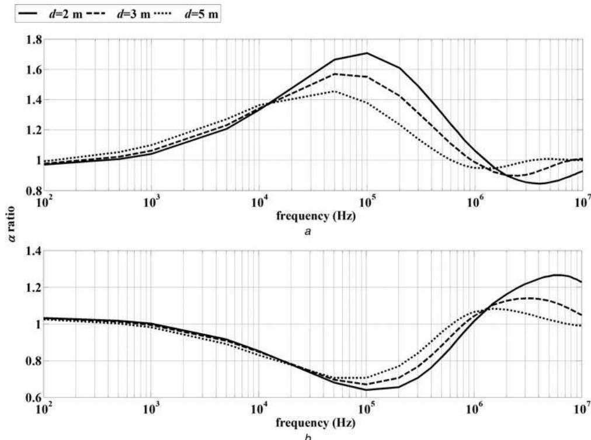  
Fig. 13 Attenuation constant ratio for different upper-layer depths

a ρ1 = 100 Ω.m, ρ2 = 1000 Ω.m

b ρ = 500 Ω.m, ρ = 100 Ω.m

variable the upper-layer depth of the stratified case. Two representative stratified earth topologies are examined, corresponding to cases where $\rho _ { 1 } / \rho _ { 2 }$ is lower or greater than unity. In the case of $\rho _ { 1 } < \rho _ { 2 } ,$ when depth d increases, then the attenuation ratio in the LF range increases; whereas in the MF range decreases. The opposite happens in the case of $\cdot _ { \rho _ { 1 } } > \rho _ { 2 }$ . As the upper-layer depth d increases, differences

between the stratified and the homogeneous earth become smaller and the calculated propagation characteristics of the two topologies coincide at lower frequencies. Results reveal that if the penetration depth of the EM field extends further from the upper earth layer, where the cables are buried, then the stratified earth cannot be approximated by a homogeneous earth model and thus the influence of the

term d cannot be omitted [5]. For this criterion the depth of the cable and the depth of the first layer are two significant parameters, which must be taken into account.

# 6 Conclusions

In this paper, the frequency-dependent behaviour of underground power cables, buried in homogeneous or stratified earth, is analysed using a new earth formulation. Differences in the ground impedance expression between the proposed and LF approximations are investigated and discussed. The major difference between the proposed formulation and the corresponding approximations is due to the fact that the influence of earth on cable shunt admittances is ignored. Therefore a proper criterion is introduced, defining the minimum critical frequency above which the proposed formulation should be taken into account. This frequency is determined by the EM properties of earth and is usually calculated in the kHz frequency range.

Starting from the homogeneous earth topology, the proposed and the Sunde’s earth approaches are compared. Different earth topologies are examined as well as varying dielectric properties of the insulation, verifying the validity of the minimum critical frequency limit in the results for propagation constants and transient responses.

The analysis is extended to the two-layer earth topology, where the proposed formulation is compared with a corresponding LF approximation. The minimum critical frequency limit is defined by the EM properties of the second earth layer, since the return currents penetrate in the kHz frequency range deeply into the second layer. Comparison of the results with those of the homogeneous earth shows that the differences are greater for increasing difference in the resistivities of the two earth layers. In general, earth stratification should be taken into account in cases where the penetration depth extends to the second earth layer.

The presented analysis on the propagation characteristics of underground cables and the introduced criteria aim to offer a suitable tool for the selection of the proper method, to include earth conduction effects accurately in transient cable models.

# 7 References

1 Carson, J.R.: ‘Wave propagation in overhead wires with ground return’, Bell Syst. Tech. J., 1926, 4, pp. 539–554   
2 Sunde, E.D.: ‘Earth Conduction effects in transmission systems’ (Dover, New York, 1968, 2nd edn.), pp. 99–139   
3 Wise, W.H.: ‘Potential coefficients for ground return circuits’, Bell Syst. Tech. J., 1948, 27, pp. 365–372   
4 Kikuchi, H.: ‘Wave propagation along an infinite wire above ground at high frequencies’, Electrotech. J., 1956, 2, pp. 73–78   
5 Papadopoulos, T.A., Papagiannis, G.K., Labridis, D.P.: ‘A generalized model for the calculation of the impedances and admittances of overhead power lines above stratified earth’, Electr. Power Syst. Res., 2010, 80, pp. 1060–1070   
6 Semlyen, A.: ‘Ground return parameters of transmission lines an asymptotic analysis for very high frequencies’, IEEE Trans. Power Syst., 1981, 100, (3), pp. 1031–1038   
7 Nakagawa, N., Ametani, A., Iwamoto, K.: ‘Further studies on wave propagation in overhead lines with earth return: Impedance of stratified earth’, Proc. Inst. Electr. Eng., 1973, 120, (12), pp. 1521–1528   
8 Ametani, A., Nagaoka, N., Koide, R.: ‘Wave propagation characteristics on an overhead conductor above snow’, Trans. Inst. Electr. Eng. Japan, 2001, 134, (3), pp. 26–33   
9 Ametani, A.: ‘Stratified earth effects on wave propagation’, IEEE Trans. Power Appar. Syst., 1974, 93, (5), pp. 1233–1239   
10 Pollaczek, F.: ‘Über das Feld einer unendlich langen wechselstromdurchflossenen Einfachleitung’, Elektr. Nachrichtentech., 1926, 3, (4), pp. 339–359

11 Vance, E.F.: ‘Coupling to shielded cables’ (John Wiley and Sons, 1978)   
12 Petrache, E., Rachidi, F., Paolone, M., Nucci, C.A., Rakov, V.A., Uman, M.A.: ‘Lightning induced disturbances in buried cables-part I: theory’, IEEE Trans. EMC, 2005, 47, (3), pp. 498–508   
13 Theethayi, N., Thottappillil, R., Paolone, M., Nucci, C.A., Rachidi, F.: ‘External impedance and admittance of buried horizontal wires for transient studies using transmission line analysis’, IEEE Trans. Dielectr. Electr. Insul., 2007, 14, (3), pp. 751–761   
14 Tsiamitros, D.A., Papagiannis, G.K., Labridis, D.P., Dokopoulos, P.S.: ‘Earth return path impedances of underground cables for the two-layer earth case’, IEEE Trans. Power Del., 2005, 20, (3), pp. 2174–2181   
15 Papadopoulos, T.A., Tsiamitros, D.A., Papagiannis, G.K.: ‘Impedances and admittances of underground cables for the homogeneous earth case’, IEEE Trans. Power Del., 2010, 25, (2), pp. 961–969   
16 Papadopoulos, T.A., Tsiamitros, D.A., Papagiannis, G.K.: ‘Earth return admittances of underground cables in non-homogeneous earth’, IET Gener. Transm. Distrib., 2011, 5, (2), pp. 161–171   
17 Ametani, A.: ‘A general formulation of impedance and admittance of cables’, IEEE Trans. Power Appar. Syst., 1980, 99, (3), pp. 902–910   
18 Wait, J.R.: ‘Electromagnetic wave propagation along a buried insulated wire’, Can J. Phys., 1972, 50, pp. 2402–2409   
19 Bridges, G.E.: ‘Transient plane wave coupling to bare and insulated cables buriedin a lossy half-space’, IEEE Trans. EMC, 1995, 37, (1), pp. 62–70   
20 Ametani, A., Yoneda, T., Baba, Y., Nagaoka, N.: ‘An investigation of earth-return impedance between overhead and underground conductors and its approximation’, IEEE Trans. EMC, 2009, 51, (3), pp. 860–867   
21 Papadopoulos, T.A., Chrysochos, A.I., Papagiannis, G.K.: ‘Comparison of earth return approaches on modeling of underground cables’. UPEC 2010, Cardiff, Wales, September 2010   
22 Dommel, H.W.: ‘ElectroMagnetic transients program (EMTP Theory Book)’ (Bonneville Power Administration, 1986)   
23 Ametani, A.: ‘The application of the fast Fourier transform to electrical transient phenomena’, Int. J. Electr. Eng. Educ., 1972, 10, pp. 277–287   
24 Theethayi, N., Baba, Y., Rachidi, F., Thottappillil, R.: ‘On the choice between transmission line equations and full-wave Maxwell’s equations for transient analysis of buried wires’, IEEE Trans. EMC, 2008, 50, (2), pp. 347–357   
25 Nakagawa, M.: ‘Admittance correction effects of a single overhead line’, IEEE Trans. Power Appar. Syst., 1981, 100, (3), pp. 1154–1161

# 8 Appendix

Functions F(λ) and G(λ) of (3) and (4) are analysed in (12) – (14) and (15) – (19) [16], respectively, for the calculation of the mutual parameters between two SC cables buried in a two-layer earth topology.

$$
F (\lambda) = F _ {1} (\lambda) + F _ {2} (\lambda) \tag {12}
$$

$$
F _ {1} (\lambda) = \frac {S _ {1 0} S _ {2 1} \mathrm {e} ^ {- a _ {1} \left| h _ {1} - h _ {2} \right|} + S _ {1 0} D _ {2 1} \mathrm {e} ^ {- a _ {1} (d - h _ {1} + d - h _ {2})}}{a _ {1} \left(S _ {1 0} S _ {2 1} + D _ {1 0} D _ {2 1} \mathrm {e} ^ {- 2 a _ {1} d}\right)} \tag {13}
$$

$$
F _ {2} (\lambda) = - \frac {D _ {1 0} S _ {2 1} \mathrm {e} ^ {- a _ {1} \left(h _ {1} + h _ {2}\right)} + D _ {1 0} D _ {2 1} \mathrm {e} ^ {- a _ {1} (2 d - | h _ {1} - h _ {2} |)}}{a _ {1} \left(S _ {1 0} S _ {2 1} + D _ {1 0} D _ {2 1} \mathrm {e} ^ {- 2 a _ {1} d}\right)} \tag {14}
$$

$$
\begin{array}{l} G (\lambda) = 2 a _ {1} \mu_ {1} \mu_ {2} \left(\gamma_ {1} ^ {2} - \gamma_ {2} ^ {2}\right) \left(G _ {1} (\lambda) + G _ {2} (\lambda)\right) \\ + 2 a _ {1} \mu_ {0} \mu_ {1} \left(\gamma_ {1} ^ {2} - \gamma_ {0} ^ {2}\right) \left(G _ {3} (\lambda) + G _ {4} (\lambda)\right) \tag {15} \\ \end{array}
$$

$$
G _ {1} (\lambda) = \frac {S _ {1 0} A _ {1 0} \mathrm {e} ^ {- a _ {1} (2 d - h _ {1} - h _ {2})} - D _ {1 0} A _ {1 0} \mathrm {e} ^ {- a _ {1} (2 d + h _ {1} - h _ {2})}}{\left(A _ {1 0} A _ {1 2} - \Delta_ {1 0} \Delta_ {1 2} \mathrm {e} ^ {- 2 a _ {1} d}\right) \left(S _ {1 0} S _ {2 1} + D _ {1 0} D _ {2 1} \mathrm {e} ^ {- 2 a _ {1} d}\right)} \tag {16}
$$

$$
G _ {2} (\lambda) = \frac {S _ {1 0} \Delta_ {1 0} \mathrm {e} ^ {- a _ {1} (2 d + h _ {2} - h _ {1})} - D _ {1 0} \Delta_ {1 0} \mathrm {e} ^ {- a _ {1} (2 d + h _ {1} + h _ {2})}}{\left(A _ {1 0} A _ {1 2} - \Delta_ {1 0} \Delta_ {1 2} \mathrm {e} ^ {- 2 a _ {1} d}\right) \left(S _ {1 0} S _ {2 1} + D _ {1 0} D _ {2 1} \mathrm {e} ^ {- 2 a _ {1} d}\right)} \tag {17}
$$

$$
G _ {3} (\lambda) = \frac {S _ {2 1} \Delta_ {1 2} \mathrm {e} ^ {- a _ {1} (2 d + h _ {1} - h _ {2})} + D _ {2 1} \Delta_ {1 2} \mathrm {e} ^ {- a _ {1} (4 d - h _ {1} - h _ {2})}}{\left(A _ {1 0} A _ {1 2} - \Delta_ {1 0} \Delta_ {1 2} \mathrm {e} ^ {- 2 a _ {1} d}\right) \left(S _ {1 0} S _ {2 1} + D _ {1 0} D _ {2 1} \mathrm {e} ^ {- 2 a _ {1} d}\right)} \tag {18}
$$

$$
G _ {4} (\lambda) = \frac {S _ {2 1} A _ {1 2} \mathrm {e} ^ {- a _ {1} \left(h _ {1} + h _ {2}\right)} + D _ {2 1} A _ {1 2} \mathrm {e} ^ {- a _ {1} \left(2 d + h _ {2} - h _ {1}\right)}}{\left(A _ {1 0} A _ {1 2} - \Delta_ {1 0} \Delta_ {1 2} \mathrm {e} ^ {- 2 a _ {1} d}\right) \left(S _ {1 0} S _ {2 1} + D _ {1 0} D _ {2 1} \mathrm {e} ^ {- 2 a _ {1} d}\right)} \tag {19}
$$

where

$$
S _ {m n} ^ {\prime} = \left(\mu_ {n} \alpha_ {m} ^ {\prime} + \mu_ {m} \alpha_ {n} ^ {\prime}\right) \tag {20}
$$

$$
D _ {m n} ^ {\prime} = \left(\mu_ {m} \alpha_ {n} ^ {\prime} - \mu_ {n} \alpha_ {m} ^ {\prime}\right) \tag {21}
$$

$$
A _ {m n} ^ {\prime} = \left(a _ {n} ^ {\prime} \gamma_ {m} ^ {2} \mu_ {n} + \alpha_ {m} ^ {\prime} \gamma_ {n} ^ {2} \mu_ {m}\right) \tag {22}
$$

$$
\Delta_ {m n} ^ {\prime} = \left(a _ {n} ^ {\prime} \gamma_ {m} ^ {2} \mu_ {n} - \alpha_ {m} ^ {\prime} \gamma_ {n} ^ {2} \mu_ {m}\right) \tag {23}
$$

$$
\gamma_ {k} ^ {2} = j \omega \mu_ {k} \left(\sigma_ {k} + j \omega \varepsilon_ {k}\right) \tag {24}
$$

$$
a _ {m} = \sqrt {\lambda^ {2} + \gamma_ {k} ^ {2} + k _ {x} ^ {2}} \tag {25}
$$

$$
k _ {x} = \omega \sqrt {\mu_ {1} \varepsilon_ {1}} \tag {26}
$$

Indices m, n take values 0, 1, 2 and $\sigma _ { m } , \mu _ { m } , \varepsilon _ { m }$ are shown in Fig. 1. For the case of one SC cable, the corresponding functions for the self parameters occur by replacing both $h _ { 1 }$ and $h _ { 2 }$ with h.