# Average-Value Model for a Modular Multilevel Converter With Embedded Storage

Nuwan Herath , Student Member, IEEE, and Shaahin Filizadeh , Senior Member, IEEE

Abstract—This article proposes an average-value model for a modular multilevel converter with sub-module level battery energy storage. The developed model is a computationally efficient representative of the converter in system-level studies; it is also shown to be useful in analytical characterization of circulating currents and sub-module capacitor voltage ripple both with and without circulating current suppression control. The model is then used to investigate the sizing of converter components under different operating regimes. The accuracy of the developed model is verified against detailed EMT models as well as against experimental results on a converter prototype.

Index Terms—Average-value modeling, energy storage, modular multilevel converters.

# I. INTRODUCTION

M ODULAR multilevel converters with embedded batteryenergy storage (MMC-ES) have attracted much attention energy storage (MMC-ES) have atracted much attention as a means of integrating energy storage in an electrical grid [1]. Their dispersed nature enables control of individual battery currents, dynamic state-of-charge (SOC) balancing, better harmonic quality of ac voltage, and flexible power control [1]–[3]. MMC-ES is viewed as a three-port converter [1], [3], [4] to integrate battery storage to dc and ac grids from a single converter. This type of application is popular in shipboard systems where both ac and dc systems exist [5]. The converter has also been studied for fault-ride-through applications in wind turbines using integrated energy storage [6]. The MMC-ES has also been modified to include both photovoltaic panels and energy storage to mitigate the fluctuations of solar power plants [7]. Contemporary literature clearly shows that MMC-ES is a promising topology with many benefits.

Studies of complex converter topologies are primarily done using computer simulation programs such as electromagnetic transient (EMT) simulators. They help to understand the converter’s operation, control, and behavior during normal and abnormal events. Detailed implementation of the MMC-ES for

Manuscript received January 13, 2020; revised June 25, 2020; accepted August 2, 2020. Date of publication August 6, 2020; date of current version May 21, 2021. This work was supported in part by the University of Manitoba, and in part by the Natural Sciences and Engineering Research Council of Canada. (Corresponding author: Shaahin Filizadeh.)

The authors are with the Department of Electrical and Computer Engineering, University of Manitoba, Winnipeg, MB R3T 5V6, Canada (e-mail: heratnmh@myumanitoba.ca; shaahin.filizaeh@umanitoba.ca).

Color versions of one or more of the figures in this article are available online at https://ieeexplore.ieee.org.

Digital Object Identifier 10.1109/TEC.2020.3014793

EMT simulations with each element represented as a companion model [8] produces highly accurate results at the expense of a massive computational burden, given the large number of switching elements and passive components in the converter. To curtail computational complexity, detailed equivalent models (DEM) of both conventional and energy-storage MMCs have been developed [9], [10] that use Thevenin equivalents for the MMC multivalve. In these models, all information at the SM level are retained. However, both the conventional EMT and DEM models are numerical in nature and do not readily lend themselves to analytical studies such as controller tuning, small-signal analysis, investigation of circulating currents and capacitor voltage ripple, and component sizing. To address these shortcomings, averaged value models (AVM) of MMC topologies have been developed.

An AVM for the conventional MMC multivalve was developed in [11]. The same authors presented a more extensive study on the AVM in [12] with more simplifications for the MMC by representing the entire converter as a single black box. This approach loses the concept of the converter multivalve. AVMs for a category of MMC-ES topologies have been developed in [13] for both the multivalve and full converter levels. In this topology the energy storage unit is directly connected across the sub-module capacitor. For better utilization and greater controllability of the energy storage units, it is common practice to use an intermediate dc-dc converter. In [3] a VSC-level AVM is developed for the MMC-ES topology in Fig. 1; however, the model in [3] amalgamates the entire converter into controlled voltage and current sources without SM-level information.

This paper develops an explicit, computationally efficient, multivalve-level AVM for a MMC-ES with dc-dc converters in each sub-module. The developed AVM is used for EMT-type simulations, analytical studies of the converter for characterization of the circulating currents and average capacitor voltage ripple, and component sizing. Extensive simulation and experimental results are presented to assess and verify the accuracy of the AVM and the ensuing studies.

The paper continues in Section II with an overview of the MMC-ES converter and its controls. The AVM is developed in Section III. A detailed analysis of the circulating currents is given in Section IV. Section V presents model validation against EMT simulations and experiments. State-of-charge (SOC) modeling and balancing is presented in Section VI. Converter parameter sizing is described in Section VII, and is followed by conclusions in Section VIII.

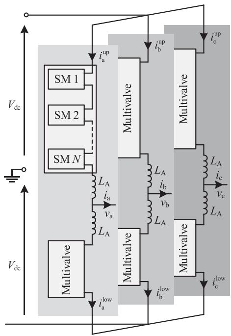  
Fig. 1. Schematic diagram of the MMC-ES.

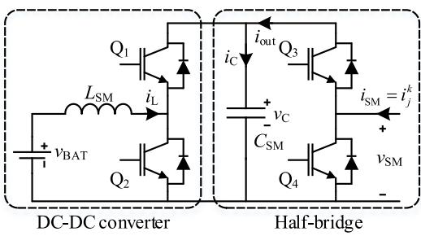  
Fig. 2. Sub-module topology.

# II. CONVERTER SYSTEM CONFIGURATION

# A. MMC-ES Structure

The structure of the MMC-ES is shown in Fig. 1. The converter is formed with six multivalves. A multivalve consists of N sub-modules in series. Arm currents are denoted as $i _ { j } ^ { k } ~ ( j \in$ {a,b,c} and k ϵ {up,low}) and the ac line current and ac terminal voltage as $i _ { j }$ and $v _ { j }$ , respectively. A schematic diagram of a SM is shown in $\operatorname { F i g } . 2 . \mathrm { Q } _ { 1 }$ and $\mathrm { Q _ { 2 } }$ form a bi-directional dc-dc converter. Complementary firing pulses are issued to $\mathrm { Q _ { 1 } }$ and $\mathrm { Q _ { 2 } } .$ , and are used to control the inductor current $i _ { \mathrm { L } }$ or capacitor voltage $\nu _ { \mathrm { C } }$ . Operation of these two switches are typically done at a high switching frequency (several kHz) to reduce the inductor current ripple, allow usage of smaller physical components, and obtain high control bandwidth. Switches $\mathrm { Q _ { 3 } }$ and $\mathrm { Q _ { 4 } }$ are issued complementary firing pulses and are used to insert or bypass the SM capacitor in the MMC multivalve. The SMs are inserted in a manner to generate a close approximation of a sinusoidal voltage waveform of desired frequency at the output using nearest level control (NLC) or pulsewidth modulation (PWM) methods [14].

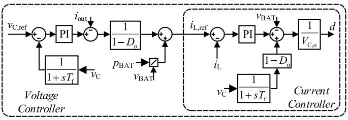  
Fig. 3. DC-DC converter controller.

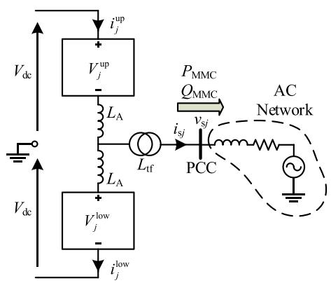  
Fig. 4. Connection to an AC grid (single-phase diagram shown for brevity).

# B. DC-DC Converter Controller

The dc-dc converter in each SM maintains the rated SM capacitor voltage. A controller can be designed using an averaged model for the dc-dc converter [15]. The capacitor voltage controller includes an inner inductor-current controller and an outer voltage controller. The outer voltage control loop creates an inductor current reference. This current reference is augmented to impose a power command $( p _ { \mathrm { B A T } } )$ that is expected from the battery within the SM. The current control loop controls the current drawn from the battery, and allows to include limiters on the battery current. Fig. 3 shows the block diagram of the controller. In this figure, $\nu _ { \mathrm { C , r e f } } , \nu _ { \mathrm { C } } , i _ { \mathrm { L , r e f } } , i _ { \mathrm { L } } , \nu _ { \mathrm { B A T } } , T _ { \mathrm { f } } , d , V _ { \mathrm { C , o } } ,$ and $D _ { \mathrm { o } }$ represent capacitor voltage reference, capacitor voltage, inductor current reference, inductor current, battery voltage, filter time-constant, duty ratio, operating point capacitor voltage, and feedforward duty ratio, respectively.

The capacitor voltage is passed through a low-pass filter to reject the line-frequency ripple component in it. Without this filter, a line-frequency component will appear in $i _ { \mathrm { L , r e f } } .$ , which could undesirably induce the same ripple in the battery current.

# C. AC Current Controller

The MMC-ES could be operated on the ac side by controlling its direct-axis and quadrature-axis currents $( i _ { \mathrm { d } }$ and $i _ { \mathrm { q } } )$ [16]. The $i _ { \mathrm { d , r e f } }$ and $i _ { \mathrm { q , r e f } }$ set-points are obtained using two outer loops to control the active power $( P _ { \mathrm { M M C } } )$ and reactive power $( Q _ { \mathrm { M M C } } )$ or ac voltage at the point of common coupling (PCC). Fig. 4 shows a diagram of the MMC-ES connected to an ac grid and Fig. 5 shows the block diagram of the controller implemented.

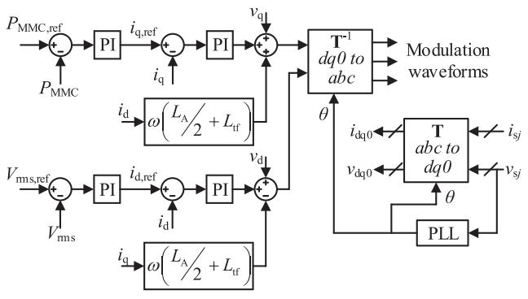  
Fig. 5. Decoupled controller.

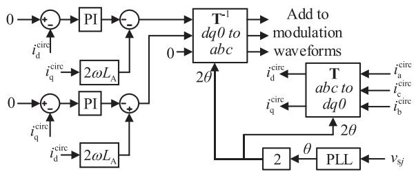  
Fig. 6. Circulating current suppression controller.

T represents the Park transformation matrix, $L _ { \mathrm { { A } } }$ is the arm inductance, $L _ { \mathrm { t f } }$ is the interconnection transformer inductance, and $i _ { \mathrm { s } j }$ and $\nu _ { { \mathrm s } j } ( j \in \{ \mathrm { a } , \mathrm { b } , \mathrm { c } \} )$ ) are the ac line current and voltage at the PCC, respectively.

# D. Circulating Current Suppression Controller (CCSC)

Circulating currents are created due to the voltage mismatch in MMC-ES phase; they do not affect the ac line current as they do not leave the converter arms. Circulating currents, however, increase the arm current and may lead to excessive losses and large capacitor voltage ripple. The analysis in Section IV shows that the fundamental-frequency circulating current can be used to balance power from SMs within an arm and hence it is useful. A controller can be designed to eliminate only the second harmonic circulating current. This concept can be further extended to eliminate or control high-order circulating currents and is used in SOC balancing in Section VI. Fig. 6 shows the block diagram of the circulating current controller.

# III. AVERAGE-VALUE MODEL OF THE MMC-ES MULTIVALVE

# A. Average-Value Model of the DC-DC Converter

The dc-dc converter formed using $\mathrm { Q _ { 1 } }$ and $\mathrm { Q _ { 2 } }$ displays two states during its operation. State 1 applies to $0 < t < d T _ { \mathrm { s } }$ and state 2 to $d T _ { \mathrm { s } } < t < T _ { \mathrm { s } }$ , where d is the duty ratio and $T _ { \mathrm { s } }$ is the switching period of the dc-dc converter. Fig. 7 shows the equivalent circuits of the dc-dc converter in these two states. Note that there are N such dc-dc converters in each arm; however, their individual quantities are not shown for clarity.

The converter’s governing equations are as follows.

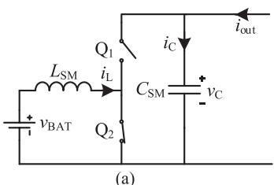

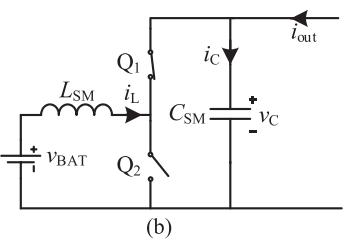  
Fig. 7. States of dc-dc converter (a) state 1, (b) state 2.

For state 1 $( 0 < t < d T _ { \mathrm { s } } ) \mathrm { : }$

$$
\frac {d i _ {\mathrm {L}}}{d t} = \frac {1}{L _ {\mathrm {S M}}} v _ {\mathrm {B A T}} \tag {1}
$$

$$
\frac {d v _ {\mathrm {C}}}{d t} = \frac {1}{C _ {\mathrm {S M}}} i _ {\text {o u t}}. \tag {2}
$$

For state $2 \left( d T _ { \mathrm { s } } < t < T _ { \mathrm { s } } \right)$ :

$$
\frac {d i _ {\mathrm {L}}}{d t} = \frac {1}{L _ {\mathrm {S M}}} v _ {\mathrm {B A T}} - \frac {1}{L _ {\mathrm {S M}}} v _ {\mathrm {C}} \tag {3}
$$

$$
\frac {d v _ {\mathrm {C}}}{d t} = \frac {1}{C _ {\mathrm {S M}}} i _ {\mathrm {L}} + \frac {1}{C _ {\mathrm {S M}}} i _ {\text {o u t}}. \tag {4}
$$

Equations (1)–(4) may be combined into two weighted averaged equations as shown in (5) and (6). In these equations, the horizontal line above variables indicates their average values over a switching period.

$$
\frac {d \overline {{i _ {\mathrm {L}}}}}{d t} = \frac {1}{L _ {\mathrm {S M}}} v _ {\mathrm {B A T}} - \frac {1}{L _ {\mathrm {S M}}} (1 - d) \overline {{v _ {\mathrm {C}}}} \tag {5}
$$

$$
\frac {d \bar {v _ {\mathrm {C}}}}{d t} = \frac {1}{C _ {\mathrm {S M}}} (1 - d) \bar {i _ {\mathrm {L}}} + \frac {1}{C _ {\mathrm {S M}}} i _ {\text {o u t}}. \tag {6}
$$

The SMs in the top and bottom arms are inserted in a sinusoidal manner. The participation of each arm can be expressed using arm modulating waveform, $m ^ { \mathrm { u p } }$ and $m ^ { \mathrm { l o w } }$ (see (7) and (8)), that are obtained from the normalized reference waveform to be generated at the converter’s ac terminals. The normalized reference waveform $( m _ { \mathrm { r e f } } )$ is sinusoidal with a magnitude of m (the modulation index of the converter).

$$
m ^ {\mathrm {u p}} = \frac {1}{2} (1 - m _ {\mathrm {r e f}}) \tag {7}
$$

$$
m ^ {\text {l o w}} = \frac {1}{2} (1 + m _ {\text {r e f}}) \tag {8}
$$

$$
m _ {\text {r e f}} = m \cos (\omega t). \tag {9}
$$

Viewed over the dc-dc converter’s switching frequency, iout can be considered as a slowly varying value. Using (7) and (8) the current $i _ { \mathrm { o u t } }$ can be represented as follows:

$$
i _ {\text {o u t}} = m _ {j} ^ {k} i _ {j} ^ {k} \tag {10}
$$

where j ϵ {a, b, c} denotes the phase, and k ϵ {up, low} denotes the arm. Based on (10) and (6), the following equation can be developed for the average capacitor voltage of arm k in phase j.

$$
\overline {{v _ {\mathrm {C} , j} ^ {k}}} = \frac {1}{C _ {\mathrm {S M}}} \int \left[ \left(1 - d _ {j} ^ {k}\right) \overline {{i _ {\mathrm {L} , j} ^ {k}}} + m _ {j} ^ {k} i _ {j} ^ {k} \right] d t \tag {11}
$$

# B. SM Capacitor Voltage Ripple

For brevity of presentation, the following derivations are shown for one phase of the converter. In general, the arm currents $( i ^ { \mathrm { u p } }$ and $i ^ { \mathrm { l o w } } )$ may be represented in terms of their harmonic contents as in (12) and (13).

$$
i ^ {\mathrm {u p}} = \sum_ {n = 0} ^ {\infty} i _ {n} ^ {\mathrm {u p}} \tag {12}
$$

$$
i ^ {\text {l o w}} = \sum_ {n = 0} ^ {\infty} i _ {n} ^ {\text {l o w}} \tag {13}
$$

Substituting (12) and (13) in (11) with (7), (8), and (9) yields:

$$
\begin{array}{l} \overline {{v _ {\mathrm {C}} ^ {\mathrm {u p}}}} = \frac {1}{C _ {\mathrm {S M}}} \int \left[ (1 - d ^ {\mathrm {u p}}) \overline {{i _ {\mathrm {L}} ^ {\mathrm {u p}}}} \right. \\ \left. + \frac {1}{2} (1 - m \cos (\omega t)) \left(\sum_ {n = 0} ^ {\infty} i _ {n} ^ {\mathrm {u p}}\right) \right] d t \tag {14} \\ \end{array}
$$

$$
\begin{array}{l} \overline {{v _ {\mathrm {C}} ^ {\mathrm {l o w}}}} = \frac {1}{C _ {\mathrm {S M}}} \int \left[ (1 - d ^ {\mathrm {l o w}}) \overline {{i _ {\mathrm {L}} ^ {\mathrm {l o w}}}} \right. \\ \left. + \frac {1}{2} (1 + m \cos (\omega t)) \left(\sum_ {n = 0} ^ {\infty} i _ {n} ^ {\text {l o w}}\right) \right] d t \tag {15} \\ \end{array}
$$

Integrating these over a fundamental-frequency cycle yields:

$$
\overline {{v _ {\mathrm {C}} ^ {\mathrm {u p}}}} = \frac {1}{C _ {\mathrm {S M}}} \int_ {0} ^ {T} \left[ \begin{array}{l} (1 - d ^ {\mathrm {u p}}) \bar {i _ {\mathrm {L}} ^ {\mathrm {u p}}} + \frac {1}{2} i _ {0} ^ {\mathrm {u p}} \\ - \frac {1}{2} \hat {i} _ {1} ^ {\mathrm {u p}} m \cos (\omega t) \cos (\omega t + \phi_ {1} ^ {\mathrm {u p}}) \end{array} \right] d t \tag {16}
$$

$$
\overline {{v _ {\mathrm {C}} ^ {\text {l o w}}}} = \frac {1}{C _ {\mathrm {S M}}} \int_ {0} ^ {T} \left[ \begin{array}{c} \left(1 - d ^ {\text {l o w}}\right) \overline {{i _ {\mathrm {L}} ^ {\text {l o w}}}} + \frac {1}{2} i _ {0} ^ {\text {l o w}} \\ + \frac {1}{2} \hat {i} _ {1} ^ {\text {l o w}} m \cos (\omega t) \cos (\omega t + \phi_ {1} ^ {\text {l o w}}) \end{array} \right] d t \tag {17}
$$

The sign ^ denotes the magnitude. Since the average voltage of capacitors must be constant in periodic steady state, the dc component of each integrand must be equal to zero; thus:

$$
(1 - d ^ {\mathrm {u p}}) \bar {i _ {\mathrm {L}} ^ {\mathrm {u p}}} + \frac {1}{2} i _ {0} ^ {\mathrm {u p}} - \frac {1}{4} \hat {i} _ {0} ^ {\mathrm {u p}} m \cos \left(\phi_ {1} ^ {\mathrm {u p}}\right) = 0 \tag {18}
$$

$$
\left(1 - d ^ {\text {l o w}}\right) \overline {{i _ {\mathrm {L}} ^ {\text {l o w}}}} + \frac {1}{2} i _ {0} ^ {\text {l o w}} + \frac {1}{4} \hat {i} _ {1} ^ {\text {l o w}} m \cos \left(\phi_ {1} ^ {\text {l o w}}\right) = 0 \tag {19}
$$

When zero average-power is drawn from the dc link, the dc component of the arm current is zero (i.e., $i _ { 0 } ^ { \mathrm { u p } } = i _ { 0 } ^ { \mathrm { l o w } } = 0 )$ ilow . 0 Hence from (18) and (19) it is concluded that the power supplied by the batteries is transferred to the fundamental component of the arm current. With the assumption of a purely sinusoidal output ac current, the fundamental component of the arm current is a combination of half of the ac line current and fundamental frequency circulating current denoted as $i _ { 1 } ^ { \mathrm { c i r c } }$ :

$$
i _ {1} ^ {\mathrm {u p}} = \frac {i _ {\mathrm {s}}}{2} + i _ {1} ^ {\mathrm {c i r c}} \tag {20}
$$

$$
i _ {1} ^ {\text {l o w}} = - \frac {i _ {\mathrm {s}}}{2} + i _ {1} ^ {\text {c i r c}} \tag {21}
$$

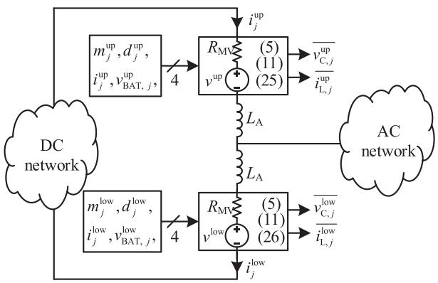  
Fig. 8. Average-value model of a multi-valve embedded in an EMT environment (single-phase view shown for brevity).

As the output current is purely sinusoidal, any other harmonic component in the arm currents does not enter the ac line; they circulate within the MMC causing losses. The nth order circulating current is represented as $i _ { n } ^ { \mathrm { c i r c } }$ . Therefore, the arm currents can be represented in general as follows:

$$
i ^ {\mathrm {u p}} = \frac {i _ {\mathrm {s}}}{2} + \sum_ {n = 1} ^ {\infty} i _ {n} ^ {\text {c i r c}} \tag {22}
$$

$$
i ^ {\text {l o w}} = - \frac {i _ {\mathrm {s}}}{2} + \sum_ {n = 1} ^ {\infty} i _ {n} ^ {\text {c i r c}} \tag {23}
$$

$$
i _ {n} ^ {\text {c i r c}} = \hat {i} _ {n} ^ {\text {c i r c}} \cos (n \omega t + \phi_ {n} ^ {\text {c i r c}}) \tag {24}
$$

With the knowledge of the capacitor voltages from (14) and (15), the voltage developed by each arm can be expressed as:

$$
v ^ {\mathrm {u p}} = N m ^ {\mathrm {u p}} \frac {1}{C _ {\mathrm {S M}}} \int \left[ (1 - d ^ {\mathrm {u p}}) \overline {{i _ {\mathrm {L}} ^ {\mathrm {u p}}}} + m ^ {\mathrm {u p}} i ^ {\mathrm {u p}} \right] d t \tag {25}
$$

$$
v ^ {\text {l o w}} = N m ^ {\text {l o w}} \frac {1}{C _ {\mathrm {S M}}} \int \left[ \left(1 - d ^ {\text {l o w}}\right) \overline {{i _ {\mathrm {L}} ^ {\text {l o w}}}} + m ^ {\text {l o w}} i ^ {\text {l o w}} \right] d t \tag {26}
$$

# C. EMT-type Average-Value Model

Based on (25) and (26), the multivalve of the MMC-ES can be represented as a controlled voltage source (see Fig. 8) and be directly embedded in an EMT simulator wherein ac and dc subsystems are modeled as well. The hybrid model shown in Fig. 8 represents the MMC-ES multivalve with an average-value model that captures the low-frequency behavior of the converter without showing switching details. $R _ { \mathrm { M V } }$ is the equivalent multivalve resistance from the conducting semiconductors. At a given instant, N switches (diodes or IGBTs) conduct in series in the multivalve; hence, with the assumption of nearly equal on-state resistance for diodes and IGBTs, $R _ { \mathrm { M V } }$ is equal to ${ \sqrt { \cdot R } } _ { \mathrm { o n } }$ where $R _ { \mathrm { o n } }$ is the on-state resistance of one semiconductor device.

The model in Fig. 8 is computationally meritorious and combines the benefits of an AVM with the ability of an EMT simulator to model the external circuitry of the converter (i.e., acand dc-side networks and converter-level controls); it is suitable for system-level studies in which switching transients may be ignored. Moreover (5) and (11) can be used to evaluate the

average battery current and the average capacitor voltage of the multivalve.

# IV. ANALYSIS OF CIRCULATING CURRENTS AND CAPACITOR VOLTAGE RIPPLE

The average-value model developed in Section III is a loworder representative of the multivalve in which switchingfrequency details are ignored. When embedded in an EMT simulator as shown in Fig. 8 it will create a voltage that is a function of the arm current as well as other variables shown in Fig. 8. With simplifying assumptions about the nature of arm currents (in terms of harmonic components present in them), the AVM may be used as an entirely analytical model to describe the steady state operation of the converter without need for an EMT simulator. Such an explicit model readily enables analysis of circulating currents and average capacitor voltage ripple. The analysis can be done to include all harmonics of the circulating current or only its dominant components. This section presents a general model; then cases considering dominant second-order harmonic circulating current and when the circulating current is suppressed are analyzed.

# A. Circulating Currents in MMC-ES

Adding (25) and (26), and substituting for mup and $m ^ { \mathrm { l o w } }$ from (7) and (8) yields (27).

$$
\begin{array}{l} \frac {2 C _ {\mathrm {S M}}}{N} \left(v ^ {\mathrm {u p}} + v ^ {\mathrm {l o w}}\right) = \int \left[ (1 - d ^ {\mathrm {u p}}) \overline {{i _ {\mathrm {L}} ^ {\mathrm {u p}}}} + \left(1 - d ^ {\mathrm {l o w}}\right) \overline {{i _ {\mathrm {L}} ^ {\mathrm {l o w}}}} \right] d t \\ - m \cos (\omega t) \int \left[ (1 - d ^ {\mathrm {u p}}) \overline {{i _ {\mathrm {L}} ^ {\mathrm {u p}}}} - (1 - d ^ {\mathrm {l o w}}) \overline {{i _ {\mathrm {L}} ^ {\mathrm {l o w}}}} \right] d t \\ + \int \left(m ^ {\mathrm {u p}} i ^ {\mathrm {u p}} + m ^ {\mathrm {l o w}} i ^ {\mathrm {l o w}}\right) d t \\ - m \cos (\omega t) \int \left(m ^ {\mathrm {u p}} i ^ {\mathrm {u p}} - m ^ {\mathrm {l o w}} i ^ {\mathrm {l o w}}\right) d t \tag {27} \\ \end{array}
$$

In steady state, the dc components of the integrands in (25) and (26) should separately be equal to zero:

$$
\begin{array}{l} \frac {1}{T} \int_ {0} ^ {T} \left[ (1 - d ^ {\mathrm {u p}}) \overline {{i _ {\mathrm {L}} ^ {\mathrm {u p}}}} + m ^ {\mathrm {u p}} i ^ {\mathrm {u p}} \right] d t \\ = \frac {1}{T} \int_ {0} ^ {T} \left[ (1 - d ^ {\mathrm {u p}}) \overline {{i _ {\mathrm {L}} ^ {\mathrm {u p}}}} + \frac {(1 - m \cos (\omega t))}{2} \left(\frac {i _ {\mathrm {s}}}{2} + \sum_ {n = 1} ^ {\infty} i _ {n} ^ {\mathrm {c i r c}}\right) \right] d t \\ = \frac {1}{T} \int_ {0} ^ {T} \left[ (1 - d ^ {\mathrm {u p}}) \overline {{i _ {\mathrm {L}} ^ {\mathrm {u p}}}} - \frac {m i _ {\mathrm {s}} \cos (\omega t)}{4} - \frac {m i _ {1} ^ {\mathrm {c i r c}} \cos (\omega t)}{2} \right] d t \\ = \left(1 - d ^ {\mathrm {u p}}\right) \overline {{i _ {\mathrm {L}} ^ {\mathrm {u p}}}} - \frac {m \hat {i} _ {\mathrm {s}} \cos \alpha}{8} - \frac {m \hat {i} _ {1} ^ {\mathrm {c i r c}} \cos \phi_ {1} ^ {\mathrm {c i r c}}}{4} = 0 \tag {28} \\ \end{array}
$$

Similarly for the lower arm:

$$
\begin{array}{l} \frac {1}{T} \int_ {0} ^ {T} \left[ \left(1 - d ^ {\text {l o w}}\right) \overline {{i _ {\mathrm {L}} ^ {\text {l o w}}}} + m ^ {\text {l o w}} i ^ {\text {l o w}} \right] d t \\ = \left(1 - d ^ {\text {l o w}}\right) \overline {{i _ {\mathrm {L}} ^ {\text {l o w}}}} - \frac {\hat {m i} _ {\mathrm {s}} \cos \alpha}{8} + \frac {\hat {m i} _ {1} ^ {\text {c i r c}} \cos \phi_ {1} ^ {\text {c i r c}}}{4} = 0 \tag {29} \\ \end{array}
$$

Subtracting (29) from (28) yields:

$$
\left(1 - d ^ {\text {l o w}}\right) \bar {i _ {\mathrm {L}} ^ {\text {u p}}} - \left(1 - d ^ {\text {u p}}\right) \bar {i _ {\mathrm {L}} ^ {\text {l o w}}} = \frac {m \hat {i _ {1} ^ {\text {c i r c}}} \cos \phi_ {1} ^ {\text {c i r c}}}{2} \tag {30}
$$

Equation (30) indicates that the unbalanced power from the upper and lower arms are balanced by the fundamental frequency circulating current. The fundamental frequency component exists without exchanging any active power when the phase angle $\phi _ { 1 } ^ { \mathrm { c i r c } } \mathrm { i s } \pm 9 0 ^ { \circ }$ . At this operating point, only reactive power is interchanged between arms.

For evaluation of (27), the following simplifications are made using (7), (8), (22), (23), (29) and (30):

$$
m ^ {\mathrm {u p}} i ^ {\mathrm {u p}} + m ^ {\mathrm {l o w}} i ^ {\mathrm {l o w}} = \sum_ {n = 1} ^ {\infty} i _ {n} ^ {\text {c i r c}} - \frac {m i _ {\mathrm {s}} \cos (\omega t)}{2} \tag {31}
$$

$$
m ^ {\mathrm {u p}} i ^ {\mathrm {u p}} - m ^ {\mathrm {l o w}} i ^ {\mathrm {l o w}} = \frac {i _ {\mathrm {s}}}{2} - m \cos (\omega t) \sum_ {n = 1} ^ {\infty} i _ {n} ^ {\mathrm {c i r c}} \tag {32}
$$

$$
\left(1 - d ^ {\mathrm {u p}}\right) i _ {\mathrm {L}} ^ {\mathrm {u p}} + \left(1 - d ^ {\mathrm {l o w}}\right) i _ {\mathrm {L}} ^ {\mathrm {l o w}} = \frac {m \hat {i} _ {\mathrm {s}} \cos \alpha}{4} \tag {33}
$$

Substituting (30), (31), (32), and (33) in (27) yields:

$$
\begin{array}{l} \frac {2 C _ {\mathrm {S M}}}{N} \left(v ^ {\mathrm {u p}} + v ^ {\mathrm {l o w}}\right) = \int \frac {m \hat {i} _ {\mathrm {s}}}{4} \cos \alpha d t \\ - m \cos (\omega t) \int \frac {m \hat {i} _ {1} ^ {\mathrm {c i r c}}}{2} \cos \phi_ {1} ^ {\mathrm {c i r c}} d t \\ + \int \left(\sum_ {n = 1} ^ {\infty} i _ {n} ^ {\text {c i r c}} - \frac {m i _ {\mathrm {s}} \cos (\omega t)}{2}\right) d t \\ - m \cos (\omega t) \int \left(\frac {i _ {s}}{2} - m \cos (\omega t) \sum_ {n = 1} ^ {\infty} i _ {n} ^ {\text {c i r c}}\right) \tag {34} \\ \end{array}
$$

An extended evaluation of the harmonic contents of the phase voltage is done in [17] for a regular MMC, i.e., one with no battery energy storage in the SMs. The same procedure can be extended to MMC-ES using (34). This process shows that including only the second-order harmonic in the circulating current of the MMC is sufficient, as higher order harmonics often have much smaller magnitudes. Existence of the fundamental frequency circulating current can also be ignored due to the balanced operation of battery modules in steady state.

# B. Second Harmonic Circulating Current

With the assumption of only second-order circulating current in the arms, (22) and (23) may be written as:

$$
i ^ {\mathrm {u p}} = \frac {1}{2} \hat {i} _ {\mathrm {s}} \cos (\omega t + \alpha) + \hat {i} _ {2} ^ {\mathrm {c i r c}} \cos (2 \omega t + \phi_ {2} ^ {\mathrm {c i r c}}) \tag {35}
$$

$$
i ^ {\text {l o w}} = - \frac {1}{2} \hat {i} _ {\mathrm {s}} \cos (\omega t + \alpha) + \hat {i} _ {2} ^ {\text {c i r c}} \cos (2 \omega t + \phi_ {2} ^ {\text {c i r c}}) \tag {36}
$$

Evaluating (11) for the upper arm yields:

$$
\begin{array}{l} v _ {\mathrm {C}} ^ {\mathrm {u p}} = \frac {1}{C _ {\mathrm {S M}}} \int \\ \times \left[ \begin{array}{l} (1 - d ^ {\mathrm {u p}}) \overline {{i _ {\mathrm {L}} ^ {\mathrm {u p}}}} \\ + \frac {1}{2} (1 - m \cos (\omega t)) \left( \begin{array}{l} - 0. 5 \hat {i} _ {\mathrm {s}} \cos (\omega t + \alpha) \\ + \hat {i} _ {2} ^ {\mathrm {c i r c}} \cos (2 \omega t + \phi_ {2} ^ {\mathrm {c i r c}}) \end{array} \right) \end{array} \right] d t \\ = \frac {1}{C _ {\mathrm {S M}}} \int \\ \times \left[ \begin{array}{l} \left(1 - d ^ {\mathrm {u p}}\right) \overline {{i _ {\mathrm {L}} ^ {\mathrm {u p}}}} \\ + \frac {\hat {i} _ {\mathrm {s}}}{4} \cos (\omega t + \alpha) + \frac {\hat {i} _ {2} ^ {\mathrm {c i r c}}}{2} \cos (2 \omega t + \phi_ {2} ^ {\mathrm {c i r c}}) \\ - \frac {m \hat {i} _ {\mathrm {s}}}{8} [ \cos (2 \omega t + \alpha) + \cos \alpha ] \\ - \frac {m \hat {i} _ {2} ^ {\mathrm {c i r c}}}{4} [ \cos (3 \omega t + \phi_ {2} ^ {\mathrm {c i r c}}) + \cos (\omega t + \phi_ {2} ^ {\mathrm {c i r c}}) ] \end{array} \right] d t \tag {37} \\ \end{array}
$$

For steady state operation, the dc terms cancel out. Thus:

$$
\left(1 - d ^ {\mathrm {u p}}\right) \overline {{i _ {\mathrm {L}} ^ {\mathrm {u p}}}} = \frac {m \hat {i} _ {\mathrm {s}} \cos \alpha}{8} \tag {38}
$$

Considering the ripple component of (37) and evaluating the integral with zero initial conditions yields:

$$
\begin{array}{l} \Delta \overline {{v _ {\mathrm {C}} ^ {\mathrm {u p}}}} = \frac {1}{C _ {\mathrm {S M}}} \\ \times \left[ \begin{array}{l} \frac {\hat {i} _ {\mathrm {s}}}{4 \omega} \sin (\omega t + \alpha) + \frac {\hat {i} _ {2} ^ {\text {c i r c}}}{4 \omega} \sin (2 \omega t + \phi_ {2} ^ {\text {c i r c}}) \\ - \frac {m \hat {i} _ {\mathrm {s}}}{1 6 \omega} \sin (2 \omega t + \alpha) - \frac {m \hat {i} _ {2} ^ {\text {c i r c}}}{1 2 \omega} \sin (3 \omega t + \phi_ {2} ^ {\text {c i r c}}) \\ - \frac {m i _ {2} ^ {\text {c i r c}}}{4 \omega} \sin (\omega t + \phi_ {2} ^ {\text {c i r c}}) \end{array} \right] \tag {39} \\ \end{array}
$$

Similarly

$$
\begin{array}{l} \Delta \overline {{v _ {\mathrm {C}} ^ {\mathrm {l o w}}}} = \frac {1}{C _ {\mathrm {S M}}} \\ \times \left[ \begin{array}{l} - \frac {\hat {i} _ {\mathrm {s}}}{4 \omega} \sin (\omega t + \alpha) + \frac {\hat {i} _ {2} ^ {\text {c i r c}}}{4 \omega} \sin (2 \omega t + \phi_ {2} ^ {\text {c i r c}}) \\ - \frac {m \hat {i} _ {\mathrm {s}}}{1 6 \omega} \sin (2 \omega t + \alpha) + \frac {m \hat {i} _ {2} ^ {\text {c i r c}}}{1 2 \omega} \sin (3 \omega t + \phi_ {2} ^ {\text {c i r c}}) \\ + \frac {m \hat {i} _ {2} ^ {\text {c i r c}}}{4 \omega} \sin (\omega t + \phi_ {2} ^ {\text {c i r c}}) \end{array} \right] \tag {40} \\ \end{array}
$$

From (39) and (40), it is seen that the capacitor voltage ripple waveforms contain fundamental frequency (v1), second-order $( \nu _ { 2 } )$ , and third-order $\left( \nu _ { 3 } \right)$ harmonics with only the second-order circulating currents present in the converter arms. An equation for the dc link voltage can be written with these expressions:

$$
2 V _ {\mathrm {d c}} = N m ^ {\mathrm {u p}} \overline {{v _ {\mathrm {C}} ^ {\mathrm {u p}}}} + N m ^ {\mathrm {l o w}} \overline {{v _ {\mathrm {C}} ^ {\mathrm {l o w}}}} + v _ {2 \mathrm {L}} \tag {41}
$$

$$
\begin{array}{l} 2 V _ {\mathrm {d c}} = N \frac {(1 - m \cos (\omega t))}{2} \left(\frac {2 V _ {\mathrm {d c}}}{N} + v _ {1} + v _ {2} + v _ {3}\right) \\ + N \frac {(1 + m \cos (\omega t))}{2} \left(\frac {2 V _ {\mathrm {d c}}}{N} - v _ {1} + v _ {2} - v _ {3}\right) + v _ {2 \mathrm {L}} \tag {42} \\ \end{array}
$$

where

$$
v _ {1} = \frac {\hat {i} _ {\mathrm {s}}}{4 \omega C _ {\mathrm {S M}}} \sin (\omega t + \alpha) - \frac {m \hat {i} _ {2} ^ {\mathrm {c i r c}}}{4 \omega C _ {\mathrm {S M}}} \sin (\omega t + \phi_ {2} ^ {\mathrm {c i r c}}) \tag {43}
$$

$$
v _ {2} = \frac {\hat {i} _ {2} ^ {\text {c i r c}}}{4 \omega C _ {\mathrm {S M}}} \sin \left(2 \omega t + \phi_ {2} ^ {\text {c i r c}}\right) - \frac {m \hat {i} _ {\mathrm {s}}}{1 6 \omega C _ {\mathrm {S M}}} \sin (2 \omega t + \alpha) \tag {44}
$$

$$
v _ {3} = - \frac {m \hat {i} _ {2} ^ {\text {c i r c}}}{1 2 \omega C _ {\mathrm {S M}}} \sin \left(3 \omega t + \phi_ {2} ^ {\text {c i r c}}\right) \tag {45}
$$

In (41) $\nu _ { \mathrm { { 2 L } } }$ is the voltage drop across the arm inductors due to the second-order circulating current. Simplifying (42) yields:

$$
v _ {2 \mathrm {L}} = N m \cos (\omega t) (v _ {1} + v _ {3}) - N v _ {2} \tag {46}
$$

Considering only the $2 ^ { \mathrm { n d } }$ harmonic component:

$$
\begin{array}{l} v _ {\mathrm {2 L}} = \frac {3 N m \hat {i} _ {\mathrm {s}}}{1 6 \omega C _ {\mathrm {S M}}} \sin (2 \omega t + \alpha) \\ - \left(\frac {2 N m ^ {2} + 3 N}{1 2 \omega C _ {\mathrm {S M}}}\right) \hat {i} _ {2} ^ {\text {c i r c}} \sin \left(2 \omega t + \phi_ {2} ^ {\text {c i r c}}\right) \tag {47} \\ \end{array}
$$

The second harmonic voltage across the arm inductors is:

$$
\begin{array}{l} v _ {\mathrm {2 L}} = 2 L _ {\mathrm {A}} \frac {d}{d t} \hat {i} _ {2} ^ {\mathrm {c i r c}} \cos \left(2 \omega t + \phi_ {2} ^ {\mathrm {c i r c}}\right) \\ = - 4 L _ {\mathrm {A}} \omega \hat {i} _ {2} ^ {\text {c i r c}} \sin \left(2 \omega t + \phi_ {2} ^ {\text {c i r c}}\right) \tag {48} \\ \end{array}
$$

Equating (47) and (48) yields:

$$
\begin{array}{l} \hat {i} _ {2} ^ {\mathrm {c i r c}} \sin \left(2 \omega t + \phi_ {2} ^ {\mathrm {c i r c}}\right) \\ = \frac {9 / 4 N m \hat {i} _ {\mathrm {s}}}{\left(2 N m ^ {2} + 3 N - 4 8 L _ {\mathrm {A}} \omega^ {2} C _ {\mathrm {S M}}\right)} \sin (2 \omega t + \alpha) \tag {49} \\ \end{array}
$$

Therefore, the second harmonic circulating current component can be expressed as follows:

$$
\hat {i} _ {2} ^ {\mathrm {c i r c}} = \frac {9 / 4 N m \hat {i} _ {\mathrm {s}}}{(2 N m ^ {2} + 3 N - 4 8 L _ {\mathrm {A}} \omega^ {2} C _ {\mathrm {S M}})} \tag {50}
$$

$$
\phi_ {2} ^ {\text {c i r c}} = \alpha \tag {51}
$$

Note that when the denominator of (50) is zero, a resonant condition may occur resulting in excessively large $2 ^ { \mathrm { n d } }$ harmonic circulating currents. To avoid this undesirable condition, the MMC-ES parameters must satisfy:

$$
\left(2 m ^ {2} + 3\right) N > 4 8 L _ {\mathrm {A}} \omega^ {2} C _ {\mathrm {S M}} \tag {52}
$$

# C. Circulating Current Suppression Control (CCSC)

When the second harmonic circulating current in the arm is suppressed the arm currents only contain half of the ac current.

$$
i ^ {\mathrm {u p}} = 0. 5 \hat {i} _ {\mathrm {s}} \cos (\omega t + \alpha) \tag {53}
$$

$$
i ^ {\text {l o w}} = - 0. 5 \hat {i} _ {\mathrm {s}} \cos (\omega t + \alpha) \tag {54}
$$

For elimination of the second harmonic component, the arm modulation waveforms are augmented with a signal $m _ { \mathrm { z } } ( t )$ , which is generated by the circulating current suppression controller:

$$
m ^ {\mathrm {u p}} = \frac {1}{2} \left(1 - m _ {\mathrm {r e f}} - m _ {\mathrm {z}}\right) \tag {55}
$$

$$
m ^ {\text {l o w}} = \frac {1}{2} \left(1 + m _ {\text {r e f}} - m _ {\mathrm {z}}\right) \tag {56}
$$

TABLE I PARAMETERS OF THE SIMULATED MMC-ES   

<table><tr><td>Description</td><td>Value</td><td>Description</td><td>Value</td></tr><tr><td>Power rating</td><td>0.5 MW</td><td>SM inductance (LSM)</td><td>7.815 mH</td></tr><tr><td>Converter ac voltage</td><td>2.75 kV1-1</td><td>Battery voltage (vBAT)</td><td>292 V</td></tr><tr><td>Grid voltage</td><td>24.9 kV1-1</td><td>Arm inductance</td><td>5.031 mH</td></tr><tr><td>DC link voltage</td><td>5 kV</td><td>SM capacitance (CSM)</td><td>4840 μF</td></tr><tr><td>No. of SMs per arm</td><td>10</td><td>Grid SCR</td><td>4 (75°)</td></tr><tr><td colspan="4">Grid-side transformer: 0.6 MVA, 2.75 kV:24.9 kV, 18%</td></tr></table>

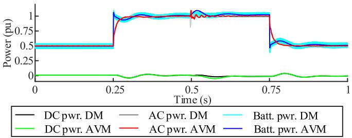  
Fig. 9. Power flow within the MMC-ES.

Substituting (53)–(56) in (11) yields:

$$
\Delta \bar {v _ {\mathrm {C}} ^ {\mathrm {u p}}} = \frac {1}{C _ {\mathrm {S M}}} \left[ \frac {\hat {i} _ {\mathrm {s}}}{4 \omega} \sin (\omega t + \alpha) - \frac {m \hat {i} _ {\mathrm {s}}}{1 6 \omega} \sin (2 \omega t + \alpha) \right] \tag {57}
$$

$$
\Delta v _ {\mathrm {C}} ^ {\text {l o w}} = \frac {1}{C _ {\mathrm {S M}}} \left[ - \frac {\hat {i} _ {\mathrm {s}}}{4 \omega} \sin (\omega t + \alpha) - \frac {m \hat {i} _ {\mathrm {s}}}{1 6 \omega} \sin (2 \omega t + \alpha) \right] \tag {58}
$$

Note that fundamental and 2nd harmonic components are generated in the capacitor ripple voltage. Since $0 \leq m \leq 1$ the fundamental component of the capacitor voltage ripple is at least four times larger than the 2nd harmonic component.

# V. EVALUATION OF THE AVERAGE-VALUE MODEL

# A. Evaluation Against Detailed EMT Simulation Models

To validate the developed AVM, a switching model of a three-phase MMC-ES along with its full control circuitry is constructed in PSCAD/EMTDC simulator. Another EMT model is also built with the AVM replacing the multivalves (similar to Fig. 8). The results of detailed model (DM) are used as the benchmark for validation of the AVM. Converter parameters are shown in Table I. Simulation time-steps for both the detailed and average-value models are $1 0 \mu \mathrm { s }$ .

In both simulations the converter is operated to steady state with a power reference of 0.5 pu and without CCSC. The power set-point is raised to 1.0 pu at $t = 0 . 2 5 \mathrm { s } ,$ followed by activation of the CCSC at $t = 0 . 5 \mathrm { ~ s ~ }$ . The power reference is reduced to 0.5 pu at $t = 0 . 7 5 ~ \mathrm { s } .$ . Simulation results are shown in Figs. 9–15.

The results clearly show that the AVM conforms well with the fully-detailed EMT model except for the very fast transients and switching details that are both ignored in the development of the AVM. Fig. 9 shows the power distribution in the converter. The power reference commands are perfectly captured

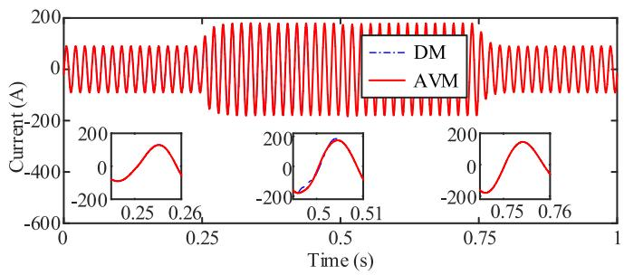  
Fig. 10. AC current from the converter.

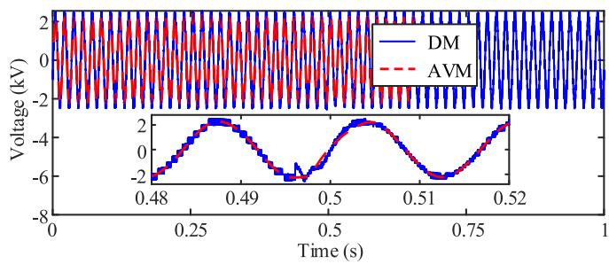  
Fig. 11. AC voltage at converter terminal.

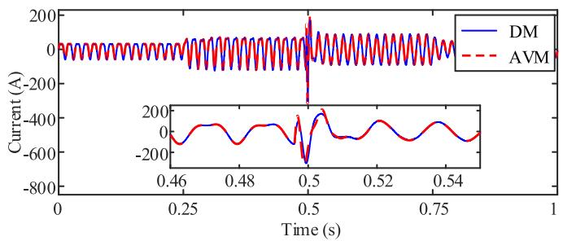  
Fig. 12. Phase-a, upper arm current.

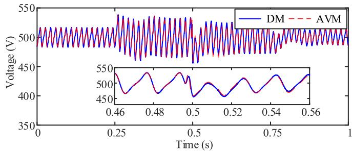  
Fig. 13. Average capacitor voltage of phase-a, upper arm.

by the two models. Slight differences between the two models are seen at the onset of CCSC at $t = 0 . 5 \mathrm { ~ s ~ } .$ Figs. 10 and 11 also show well-conforming results for ac current and voltage. Fig. 12 shows that when the CCSC is activated, the arm current becomes essentially sinusoidal, thus validating the assumptions in Section IV.C. Capacitor voltage waveforms in Fig. 13 show that with the increase in the power set-point, the ripple increases as expected. With CCSC the ripple reduces due to the removal of the second-order circulating current. Fig. 14 shows that the

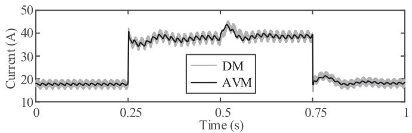  
Fig. 14. Average battery current of phase-a, upper arm.

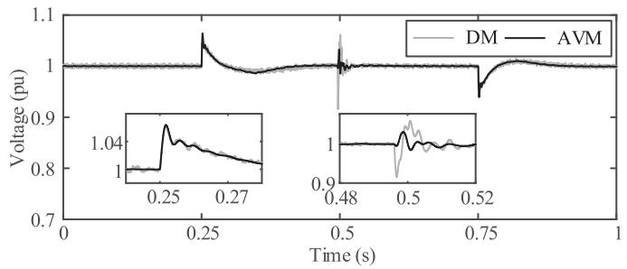  
Fig. 15. AC-side rms voltage.

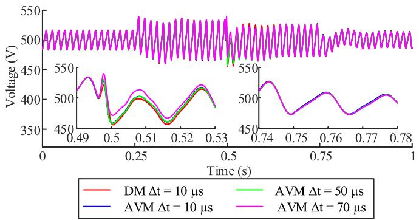  
Fig. 16. Effect of simulation time step for AVM (for average capacitor voltage).

battery current increases sharply when the power command is changed. This is due to the power command feedforward applied to the dc-dc converter control system. As a result, even with large power command increments, capacitor voltages are marginally affected. This effect can be clearly seen in Fig. 15 in the ac voltage at PCC, which shows small variations as the power command changes.

Fig. 16 shows the effect of simulation time-step on the capacitor voltage. It is seen that considerably larger time-steps could be used to simulate the steady state characteristics of the MMC-ES with the AVM. The transients due to controller command change (at t = 0.75 s) are perfectly captured even with time-steps as large as 70 μs; some deviations are observed when CCSC is turned on at t = 0.5 s. Thus the AVM is computationally efficient in controller tuning and optimization studies [18] that need a large number of simulation.

The developed AVM ignores PWM details and individual SM information. It is useful for controller tuning, and large-scale system simulation with a focus on the average behavior of the converter. The AVM has a considerable simulation time

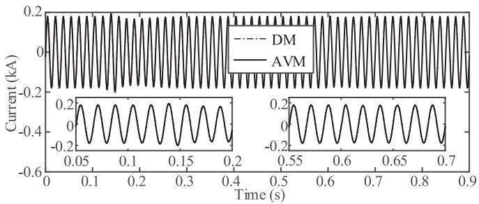  
Fig. 17. AC current waveform during remote fault test.

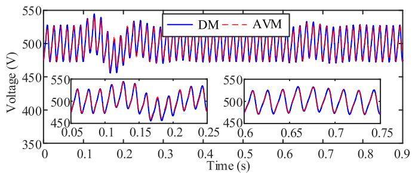  
Fig. 18. Average capacitor voltage during remote fault test.

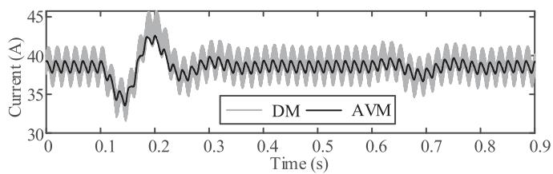  
Fig. 19. Average battery current during remote fault test.

efficiency compared to the detailed model. To simulate the considered three-phase MMC-ES for 5 s with a 10-μs time step, the detailed EMT model takes 1125.5 s while the AVM only needs 34.14 s, showing a gain of more than 30 times.

# B. Evaluation During Faulted Operation

A remote fault is simulated using both the DM and AVM. The fault is emulated with a reduction of the magnitude of the ac grid voltage by 25% for 50 ms at t = 0.1 s and changing its phase 10° for 50 ms at $t = 0 . 6 \mathrm { ~ s ~ }$ . In Figs. 17 –19 the converter’s ac current, average capacitor voltage, and average battery current are shown. It is seen that dynamics in the waveforms are well captured during both the ac voltage magnitude and phase angle changes of the ac voltage.

# C. Verification Against Experimental Results

The AVM is also evaluated against experimental results on a prototype single-phase MMC-ES shown in Fig. 20, whose parameters are given in Table II. Capacitor voltage ripple is evaluated using (39) and (40) for operation with $m = 0 . 9$ and a load resistance of 15.4 Ω. Fig. 21 shows a comparison of the average capacitor voltages from the AVM and those measured

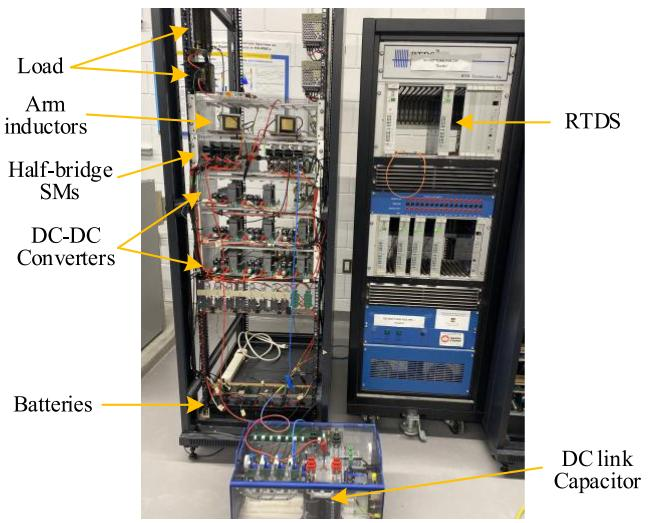  
Fig. 20. Prototype setup.

TABLE II PARAMETERS OF THE MMC-ES PROTOTYPE   

<table><tr><td>Description</td><td>Value</td><td>Description</td><td>Value</td></tr><tr><td>Power rating</td><td>300 W</td><td>SM inductance</td><td>700 μH</td></tr><tr><td>Converter ac voltage</td><td>25 V</td><td>Battery voltage</td><td>12 V</td></tr><tr><td>DC link voltage</td><td>80 V</td><td>Arm inductance</td><td>3.37 mH</td></tr><tr><td>No. of SMs per arm</td><td>4</td><td>Load resistance</td><td>10.1 Ω/15.4 Ω</td></tr><tr><td>SM capacitance</td><td>4700 μF</td><td>Load inductance</td><td>6.71 mH</td></tr></table>

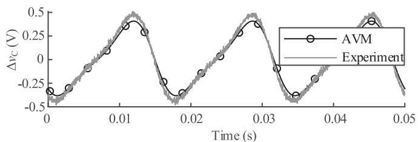  
Fig. 21. Capacitor voltage ripple (dc offset removed for clarity).

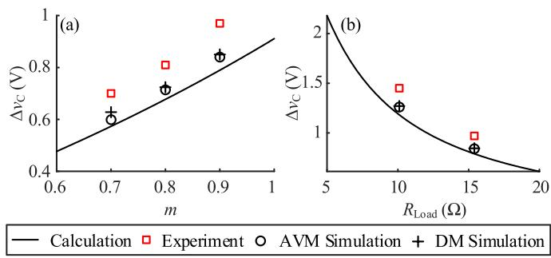  
Fig. 22. Capacitor voltage ripple variations with (a) modulation index, and (b) load resistance.

experimentally. The experimental ripple agrees well with the AVM predictions.

Capacitor ripple is analyzed with varying modulation index and load resistance, as shown in Fig. 22. The AVM generally

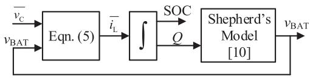  
Fig. 23. Block diagram for battery voltage evaluation.

agrees well with both EMT simulations and experimental measurements. The small discrepancies observed are chiefly due to the high-frequency circulating current components that are not included in the AVM but exist in the prototype and are accounted for in the detailed EMT model. Fig. 22 shows two sets of results from the AVM: one labelled ‘AVM simulation’, in which the AVM is used in a simulation model of the prototype converter, and one labelled ‘calculation’ using analytical calculations with the AVM with the assumption of only second-order circulating currents (see Section IV).

# D. Limitations of the AVM

From the simulation and analytical calculations presented in this section, it is observed that the AVM is able to predict steady state behavior and low-frequency variations, such as power reference command changes, accurately. Due to the averaging process, information such as individual SM capacitor voltages and battery currents are lost. Using AVM in long-run simulations such as SOC balancing are advantageous due to its simplicity and low computational load. The AVM has the capability of simulating some faults with reasonable accuracy, but has limitations in simulating solid faults, startup sequence, blocking and controller starting transients, and other transients that may cause discontinuous conduction operation of the SM dc-dc converters. However, such transients are small in duration and need to be implemented in detailed simulations to observe individual quantities.

# VI. MODELING AND BALANCING SOC

The battery voltage is used in evaluating the SM inductor current (battery current) in (5) as a variable. The battery voltage can be modeled as a function of the SOC based on different battery models [19]. In this work, the Shepherd’s model is used, and implemented as outlined in [10] in an EMT environment. Fig. 23 shows a functional block diagram of the battery voltage evaluation based on battery current. In this figure, Q is the used charge of the battery. Since an average SM capacitor voltage and SM inductor current are simulated in AVM, the SOC is also evaluated for the average SOC of a multivalve of the MMC-ES.

During normal operation, the batteries need to be charged/discharged uniformly. Power can be transferred within phases and among phase arms by introducing small dc and fundamental-frequency circulating currents [2]. Fig. 24 shows a block diagram of the SOC balancing controller for the MMC-ES. In this diagram, $S O C _ { \mathrm { B E S S } }$ is the average SOC of MMC-ES, $S O C _ { j }$ is the average SOC of phase, $S O \bar { C } _ { j } ^ { k }$ is the average SOC of a phase arm and $S O C _ { j , i } ^ { k }$ is the individual SM battery SOC where $j \in \{ \mathrm { a } , \mathrm { b } , \mathrm { c } \} , k \in \{ \mathrm { u p } , \mathrm { l o w } \}$ , and $i \in \{ 1 , 2 , . . . , N \}$ represents

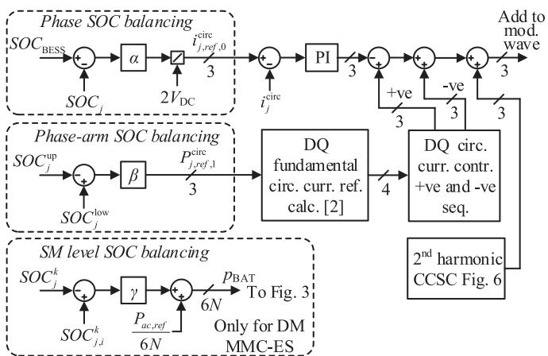  
Fig. 24. SOC balancing controller.

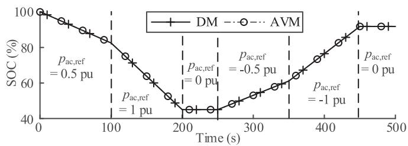  
Fig. 25. Variation of converter SOC.

SM number. $i _ { j } ^ { \mathrm { c i r c } }$ is the circulating current in phase $j ,$ and $\alpha , \beta ,$ γ are constant gains.

The effect of the SOC controller is depicted in Fig. 25. The ac power command is changed as indicated. It can be observed that both AVM and DM produce identical results in estimating the SOC. It should be noted that the energy capacity in the MMC-ES is chosen to be low so that considerable SOC drop happens within a reasonable time. When the power reference is higher, faster variations in SOC can be observed as expected. After the discharging and charging process, the SOC does not return to 100% as some resistive power losses occur.

# VII. SELECTION OF CONVERTER PARAMETERS

For proper operation, converter parameters must be selected to reduce circulating currents and capacitor voltage ripple. Large circulating currents increase conduction losses and take up the current capacity of the switches. Equations (39)-(40), (50)-(51), and (57)-(58) describe the capacitor ripple and circulating current of the MMC-ES, and can be used to determine the SM capacitance and arm inductance. Fig. 26 shows the variation of the capacitor voltage ripple with different $L _ { \mathrm { { A } } }$ and $C _ { \mathrm { S M } }$ values. The variation of second harmonic circulating current is shown in Fig. 27. This evaluation has been done for the MMC-ES whose parameters are given in Table I, but may be readily repeated for other parameter values.

Figs. 26 and 27 show that for certain values of $L _ { \mathrm { { A } } }$ and CSM the second-order circulating current magnitude becomes excessively large, thereby also resulting in high capacitor voltage

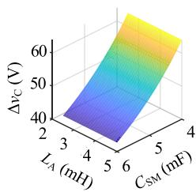  
(a)CCSC on

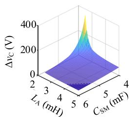  
(b) CCSC off   
Fig. 26. Capacitor voltage ripple (a) CCSC on (b) CCSC off.

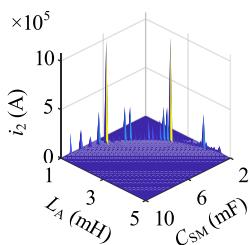

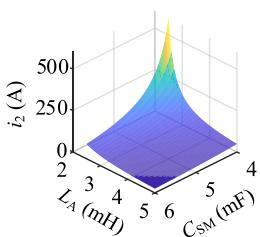  
  
Fig. 27. Second-order circulating current (a) large range (b) zoomed-in view.

ripples. This occurs when the denominator of (50) approaches zero. It is observed that the denominator is a function of converter parameters $( L _ { \mathrm { A } } , C _ { \mathrm { S M } } , N )$ as well as operating point (m and ω). In power system applications m and ω do not vary drastically. It cannot be guaranteed that use of a second-order harmonic suppression controller can avoid the resonant conditions, due to small steady state errors and other harmonic contents available in the system. Selecting converter parameters adequately far from these resonant points provides safe margins and further attenuates higher order harmonics. However, large capacitors and inductors adversely affect the dynamic response of the converter, draw high inrush currents, and increase the cost. These trade-offs need to be considered when selecting components. Fig. 28 shows capacitor voltage ripple variations with respect to the modulation index, converter load, and arm inductance. The figure shows the voltage ripple for two capacitor values. Simulated converter ripple using AVM and detailed EMT models are also plotted against the theoretically calculated values with and without CCSC.

Figs. 28(a)-(b) show that the simulated capacitor ripple agrees well with the calculated values. As expected the ripple increases with the modulation index. Figs. 28(c)-(d) show that with increasing load on the converter, the ripple increases. This is expected as the arm current increases and results in high charging and discharging of the SM capacitors. Variation of the ripple with the arm inductance is shown in Figs. 28(e)-(f). It is observed that the theoretical ripple values slightly deviate from the simulated values at low arm inductance values. This is due to higher order circulating currents that are generated when the arm inductance is small but are ignored in the AVM. Theoretical calculation can be extended to include higher order harmonics when using particularly low arm inductance values.

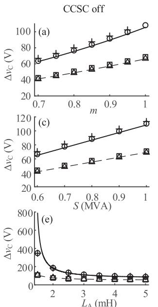

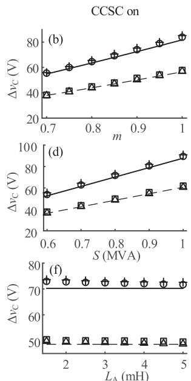  
Fig. 28. Variation of capacitor voltage ripple versus (a-b) m, (c-d) load magnitude (PF = 0.95 lag), (e-f) arm inductance.

<table><tr><td>—— Calc. 4.84 mF</td><td>○ Sim. AVM 4.84 mF</td><td>+ Sim. DM 4.84 mF</td></tr><tr><td>—— Calc.7 mF</td><td>△ Sim. AVM 7 mF</td><td>□ Sim. DM 7 mF</td></tr></table>

# VIII. CONCLUSION

The paper developed an AVM for the multivalve of a modular multilevel converter with SM-level battery energy storage. The AVM considers low-frequency dynamics of the multivalve and ignores switching details. The paper showed the application of the AVM as a replacement for a conventional detailed switching model for system-level studies, and its use as an analytical tool for the study of steady state behavior of the converter and for component sizing. The AVM was validated against detailed simulation results (which also confirmed its computational advantage), and results obtained on a laboratory-scale converter prototype.

# REFERENCES

[1] M. Vasiladiotis and A. Rufer, “Analysis and control of modular multilevel converters with integrated battery energy storage,” IEEE Trans. Power Electron., vol. 30, no. 1, pp. 163–175, Jan. 2015.   
[2] T. Soong and P. W. Lehn, “Internal power flow of a modular multilevel converter with distributed energy resources,” IEEE J. Emerg. Sel. Top. Power Electron., vol. 2, no. 4, pp. 1127–1138, Dec. 2014.   
[3] Q. Chen, R. Li, and X. Cai, “Analysis and fault control of hybrid modular multilevel converter with integrated battery energy storage system,” IEEE J. Emerg. Sel. Top. Power Electron., vol. 5, no. 1, pp. 64–78, Mar. 2017.   
[4] I. Trintis, S. Munk-Nielsen, and R. Teodorescu, “A new modular multilevel converter with integrated energy storage,” in Proc. IECON - 37th Annu. Conf. IEEE Ind. Electron. Soc., Nov. 2011, pp. 1075–1080.   
[5] R. Mo and H. Li, “Hybrid energy storage system with active filter function for shipboard MVDC system applications based on isolated modular multilevel DC/DC converter,” IEEE J. Emerg. Sel. Top. Power Electron., vol. 5, no. 1, pp. 79–87, Mar. 2017.   
[6] B. Novakovic and A. Nasiri, “Modular multilevel converter for wind energy storage applications,” IEEE Trans. Ind. Electron., vol. 64, no. 11, pp. 8867–8876, Nov. 2017.   
[7] H. Bayat and A. Yazdani, “A hybrid MMC-based photovoltaic and battery energy storage system,” IEEE Power Energy Technol. Syst. J., vol. 6, no. 1, pp. 32–40, Mar. 2019.

[8] H. W. Dommel, “Digital computer solution of electromagnetic transients in single-and multiphase networks,” IEEE Trans. Power Appar. Syst., vol. PAS-88, no. 4, pp. 388–399, Apr. 1969.   
[9] U. N. Gnanarathna, A. M. Gole, and R. P. Jayasinghe, “Efficient modeling of modular multilevel HVDC converters (MMC) on electromagnetic transient simulation programs,” IEEE Trans. Power Del., vol. 26, no. 1, pp. 316–324, Jan. 2011.   
[10] N. Herath, S. Filizadeh, and M. S. Toulabi, “Modeling of a modular multilevel converter with embedded energy storage for electromagnetic transient simulations,” IEEE Trans. Energy Convers., vol. 34, no. 4, pp. 2096–2105, Dec. 2019.   
[11] H. Saad et al., “Dynamic averaged and simplified models for MMC-based HVDC transmission systems,” IEEE Trans. Power Del., vol. 28, no. 3, pp. 1723–1730, Jul. 2013.   
[12] H. Saad et al., “Modular multilevel converter models for electromagnetic transients,” IEEE Trans. Power Del., vol. 29, no. 3, pp. 1481–1489, Jun. 2014.   
[13] A. F. Cupertino, W. C. S. Amorim, H. A. Pereira, S. I. Seleme Junior, S. K. Chaudhary, and R. Teodorescu, “High performance simulation models for ES-STATCOM based on modular multilevel converters,” IEEE Trans. Energy Convers., vol. 35, no. 1, pp. 474–483, Mar. 2020.   
[14] S. Debnath, J. Qin, B. Bahrani, M. Saeedifard, and P. Barbosa, “Operation, control, and applications of the modular multilevel converter: A review,” IEEE Trans. Power Electron., vol. 30, no. 1, pp. 37–53, Jan. 2015.   
[15] J. Zhang, J.-S. Lai, and W. Yu, “Bidirectional DC-DC converter modeling and unified controller with digital implementation,” in Proc. Twenty-Third Annu. IEEE Appl. Power Electron. Conf. Expo., Feb. 2008, pp. 1747–1753.   
[16] B. Bahrani, A. Karimi, B. Rey, and A. Rufer, “Decoupled DQ-current control of grid-tied voltage source converters using nonparametric models,” IEEE Trans. Ind. Electron., vol. 60, no. 4, pp. 1356–1366, Apr. 2013.   
[17] K. Ilves, A. Antonopoulos, S. Norrga, and H.-P. Nee, “Steady-state analysis of interaction between harmonic components of arm and line quantities of modular multilevel converters,” IEEE Trans. Power Electron., vol. 27, no. 1, pp. 57–68, Jan. 2012.   
[18] S. Arunprasanth, U. D. Annakkage, C. Karawita, and R. Kuffel, “Generalized frequency-domain controller tuning procedure for VSC systems,” IEEE Trans. Power Del., vol. 31, no. 2, pp. 732–742, Apr. 2016.   
[19] D. M. Rosewater, D. A. Copp, T. A. Nguyen, R. H. Byrne, and S. Santoso, “Battery energy storage models for optimal control,” IEEE Access, vol. 7, pp. 178357–178391, 2019, doi: 10.1109/ACCESS.2019.2957698.

Nuwan Herath (Student Member, IEEE) was born in Peradeniya, Sri Lanka. He received the BSc Eng degree in electrical and electronic engineering from the University of Peradeniya, Sri Lanka, in 2016, and the M.Sc. degree in electrical engineering from the University of Manitoba, Canada, in 2019, and is currently pursuing the Ph.D. degree in electrical and computer engineering at the University of Manitoba, Canada.

In 2016, he was a sponsored researcher at the Advanced Vehicle Engineering Centre, Cranfield Uni-

versity, United Kingdom. His research interests are EMT simulation models, energy storage on grid and auxiliary services to the power system via power electronics

Shaahin Filizadeh (Senior Member, IEEE) received the B.Sc. and M.Sc. degrees in electrical engineering the from Sharif University of Technology, Tehran, Iran, in 1996 and 1998, respectively, and the Ph.D. degree from the University of Manitoba, Winnipeg, MB, Canada, in 2004.

He is currently a Professor with the Department of Electrical and Computer Engineering, University of Manitoba. His research interests include electromagnetic transient simulation and power electronics.

Dr. Filizadeh is a Registered Professional Engineer

in the Province of Manitoba. He is active in several IEEE committees and is currently the Chair of the IEEE Task Force on Dynamic Phasor Modeling Techniques. He is an Editor of the IEEE TRANSACTIONS ON ENERGY CONVERSION AND IEEE POWER ENGINEERING LETTERS, and an Associate Editor for the IEEE SYSTEMS JOURNAL.