# Multi-layer Earth Structure Approximation by a Homogeneous Conductivity Soil for Ground Return Impedance Calculations

A. G. Martins-Britto, Member, IEEE, F. V. Lopes, Member, IEEE, S. R. M. J. Rondineau, Senior Member, IEEE

Abstract—This paper proposes a technique to approximate a multi-layer earth structure by a homogeneous conductivity soil in ground return impedance calculations. An equivalent realvalued conductivity parameter is obtained, which can be used with reasonable accuracy in a simpler expression or in commonly available EMTP software, such as the Line Constants routine of the Alternative Transients Program (ATP). Several actual soil models are evaluated at frequencies ranging from from 1 Hz to 2 MHz. Results show that the proposed method is accurate for modeling most power system problems, from steady-state conditions to transients commonly verified in electrical systems. The proposed expression is easy to use and introduces a considerable performance gain in terms of floating-point operations, compared to the analytical formulation of the general multi-layer soil structure.

Keywords—Electromagnetic transients, ground return path, line parameters, multi-layer soil, mutual impedances, soil conductivity.

# I. INTRODUCTION

ROUND RETURN impedances are present in a variety G of problems relevant to power system analysis, including transient simulations, low-frequency electromagnetic interferences, transmission line parameters, short-circuit computations and shield-wire current distribution [1]–[3]. They directly influence self and mutual impedances between conductors and depend on the system geometry, frequency and soil conductivity.

Accounting for the soil conductivity in ground return impedance models is often the most challenging part of transmission line parameters calculation. Soils are complex structures, composed of solid, liquid and gaseous elements, whose electrical conductivity is dependent on the presence of water, particle porosity, type of electrolyte and temperature [4]. Therefore, field measurements are necessary and processing the so-called apparent conductivities to build a realistic soil model requires complex calculations [5].

The first systematic approach on ground return impedances reported in the literature dates back from 1926, with the works of Carson [6]. His original contribution provides expressions in function of an uniform conductivity σ that has been studied for decades [3], [7]–[9]. The same happens with a variety of software used by power systems researchers, among which a remarkable example is the Line Constants ATP routine.

The majority of real soils are layered media, commonly composed of three to five layers [10]. Therefore, different techniques are required in order to account for the multi-layer nature of actual soil structures. The finite element method (FEM) has been increasingly applied to problems involving heterogeneous soils, as well as analytical expressions have been derived [11], [12]. Although these are precise approaches, they are computationally expensive or subject to numerical instabilities and convergence issues, besides the fact that they are not available in most industry-standard software.

A paper from 2007 published by Tsiamitros et al. proposed an approach for two-layered earth structures, which derives an equivalent homogeneous conductivity parameter [13]. However, two-layered soils are not always suitable for real earth structure representation. Thus, in this paper, an extension of [13] is proposed, in which an equivalent conductivity of the general N-layered case is obtained, by means of successively replacing pairs of layers, from bottom to top, by their homogeneous equivalent, calculated in function of the current penetration coefficient of each layer.

Given a configuration of two aboveground conductors, mutual impedances are computed using the uniform equivalent conductivity proposed with the original Carson equation and the general analytical expression for the N-layered soil model, and the relative errors are analyzed. A frequency-sweep is performed within the range from 1 Hz to 2 MHz, to verify the limits of validity of the proposed method. Tests are carried out with 20 real soil models, with structures varying from 2 to 6 layers. Results show that at the power system frequency range, errors are of the order of 1% only, with the advantage that a much simpler formula is employed, along with a significant performance gain.

Of practical interest to several power systems applications, this work is expected to contribute with a simple, yet accurate method to account for multi-layer soils in ground return problems, especially in transient analysis using EMTP programs.

# II. SOIL CONDUCTION EFFECTS

Almost all natural soils are highly variable in their properties and rarely homogeneous. Soil heterogeneities are related to lithology (thin soft/stiff layers embedded in a stiffer/softer media) and the inherent spatial soil variability, which is the variation of soil properties from one point to another in space due to different deposition conditions and different geotechnical histories [14].

A. G. Martins-Britto, F. V. Lopes and S. R. M. J. Rondineau are with University of Brasília, Distrito Federal, Brazil (e-mail: amaurigm@unb.br; felipevlopes@ene.unb.br; sebastien@unb.br).

Manuscript received January 21, 2019; revised May 17, 2019.

Soils are structures composed of three phases. The solid phase is usually made of minerals and organic matter; the liquid phase is the water solution in the form of moisture content; and the gas phase is represented by the air between solid particles [4]. The predominant conduction mechanism in soils is the electrolytic conduction in the solutions of water-bearing materials [4]. Under certain conditions, metallic conduction, electronic semiconduction and solid electrolytic conduction may also occur [15]. Moist soils at low frequencies (below 100 kHz) behave primarily as conductors with nonmagnetic properties [16].

Earth return conduction is closely associated with the induced eddy current in the soil surface [17]. In this context, soil surface means the depth range in which the energy of a propagating electromagnetic wave cannot be omitted, recalling that the wave decays with the distance along the propagation direction [17]. This region is determined analytically by the skin depth δ [18]:

$$
\delta = \sqrt {\frac {1}{\pi f \mu \sigma} \left(\sqrt {1 + \left(\frac {2 \pi f \varepsilon}{\sigma}\right) ^ {2}} + \frac {2 \pi f \varepsilon}{\sigma}\right)}, \tag {1}
$$

where $f$ is the frequency, in Hertz; $\mu$ is the magnetic permeability, in H/m; σ is the conductivity, in S/m; and ε is the electric permittivity, in F/m. Table I contains skin depth values computed for various frequencies and conductivities of common earth materials [19]. Fig. 1 shows an intensity plot of the skin depth $\delta$ as a function of frequency and conductivity. Computations assume that permittivity and permeability constants are equal to, respectively, the vacuum and free space values. It can be seen that, for power system frequencies up to the kHz range, the skin depth, or the region regarded as the earth’s surface for the sake of conduction phenomena, may reach the order of magnitude of kilometers, depending on the soil characteristics [19].

Table I SKIN DEPTH IN METERS FOR SOIL CONDUCTIVITIES AS IN [19]   

<table><tr><td rowspan="2">Soil</td><td rowspan="2">σ [mS/m]</td><td>60 Hz</td><td>1 kHz</td><td>10 kHz</td><td>100 kHz</td></tr><tr><td colspan="4">Skin depth δ [m]</td></tr><tr><td>Gravel, sand</td><td>0.1</td><td>6497.6</td><td>1592</td><td>504.69</td><td>163.64</td></tr><tr><td>Limestone</td><td>1</td><td>2054.7</td><td>503.31</td><td>159.2</td><td>50.469</td></tr><tr><td>Dolomite</td><td>10</td><td>649.75</td><td>159.16</td><td>50.331</td><td>15.92</td></tr><tr><td>Clays</td><td>100</td><td>205.47</td><td>50.329</td><td>15.916</td><td>5.0331</td></tr></table>

Soil parameters are determined by employing survey techniques commonly performed from the soil surface [20]. Actual field measurements represent the equivalent, or apparent, electrical behavior of the nonuniform medium, from which physical models are derived [13], [16], [20]. On the other hand, several authors agree that the multi-layered nature of real soils has to be accounted for in order to accurately model ground return problems [4], [7], [8], [12], [13], [17], [21], [22].

Horizontally stratified models are characterized by $( N - 1 )$ layers with finite conductivities and thicknesses on top of the $N ^ { t h }$ layer whose depth extends to infinity, representing the apparent behavior of the deep soil [23]. Of course, an infinitely

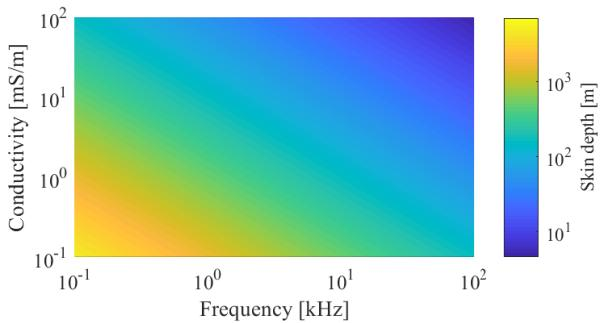  
Figure 1. Skin depth as a function of frequency and conductivity. For common earth materials and frequencies between 60 Hz and 1 kHz, values range from 5.03 m to 6.49 km.

thick bottom layer is a mathematical abstraction that only holds meaning if the constraint imposed by the skin depth is observed. A horizontally stratified soil model is a good approximation of the real earth (locally) as long as its structure is contained within the conduction region, otherwise it makes no physical sense. Hence, considering the effects of a deep soil layer in the stratified model does not contradict the notion that current flows through the surface of earth (globally). Indeed, conductivities of the deep soil layers are reported to influence ground conduction phenomena as much as the values of the surface layers [12], [24].

The uncertainties related to the soil electrical conductivity is a recognized source of error in applications that rely on ground return impedances, such as transmission line parameters [25]. Therefore, accounting for the multi-layer characteristic of real soils in such cases introduces an important accuracy gain. In the next section, the formulation of the mutual impedance over N layers is formally discussed, as well as issues arising from the equations that describe such models and possible strategies to handle these complexities.

# III. REVIEW OF SOIL MODELS FOR MUTUAL IMPEDANCE CALCULATIONS

A. Analytical expression for mutual impedances over a multilayer soil

Fig. 2 describes a system composed of two overhead conductors above a soil structure with N layers, which are defined by permeability $\mu _ { n }$ , permittivity $\varepsilon _ { n }$ and conductivity $\sigma _ { n } ,$ , being $1 \leq n \leq N$ , where n represents the $n ^ { t h }$ soil layer. As most soil types are nonmagnetic, permeability $\mu _ { n }$ is assumed to be equal to the free space value $\mu _ { 0 }$ [13].

The mutual impedance with earth return path between conductors i and $j ,$ given in ohms per-unit length, is computed using the following general equation:

$$
Z _ {i, j} = \frac {j \omega \mu_ {0}}{2 \pi} \ln \left(\frac {D _ {i , j} ^ {\prime}}{D _ {i , j}}\right) + \Delta Z _ {i, j}, \tag {2}
$$

$$
\Delta Z _ {i, j} = \frac {j \omega \mu_ {0}}{\pi} \int_ {0} ^ {\infty} e ^ {- H \lambda} \cos (\lambda D) \hat {F} (\lambda) d \lambda , \tag {3}
$$

where $\omega$ is the angular frequency, in rad/s; $\mu _ { 0 } ~ = ~ 4 \pi ~ \times$ $1 0 ^ { - 7 }$ H/m is the free space magnetic permeability con-

stant; H , D, $D _ { i , j }$ and $D _ { i , j } ^ { \prime }$ are the relative distances represented in Fig. 2, in meters, with: $H \ = \ y _ { i } + y _ { j } , \ D \ =$ $| x _ { i } - x _ { j } | , \ D _ { i , j } \ = \ { \sqrt { ( x _ { i } - x _ { j } ) ^ { 2 } + ( y _ { i } - y _ { j } ) ^ { 2 } } }$ and $D _ { i , j } ^ { \prime } \ =$ $\sqrt { ( x _ { i } - x _ { j } ^ { \prime } ) ^ { 2 } + ( y _ { i } - y _ { j } ^ { \prime } ) ^ { 2 } } ;$ ; and $\hat { F } ( \lambda )$ is a function determined by the problem boundary conditions [6], [26]. The auxiliary integration variable λ represents the spatial frequency of the Fourier spectrum and can be physically associated to the energy attenuation throughout the layers [13].

The first term of (2) may be regarded as the ground return impedance for a perfectly conductive soil [6]. The term $\Delta Z _ { i , j }$ represents the effects of the soil with finite conductivity, including losses in the earth return path [2].

The function $\hat { F } ( \lambda )$ depends on the soil structure. Assuming a semi-infinite homogeneous ground, Carson equation has $\hat { F } ( \lambda )$ with the form [6]:

$$
\hat {F} (\lambda) = \frac {1}{\lambda + \sqrt {\lambda^ {2} + j \omega \mu_ {0} \sigma - \omega^ {2} \mu_ {0} \varepsilon}}, \tag {4}
$$

where $\sigma$ is the local soil electrical conductivity, in S/m; and ε is the local soil electrical permittivity, in F/m [6].

Equation (2) with $\hat { F } ( \lambda )$ given as in (4) has been studied by several researchers over the years, with approaches that range from power series expansions to derivation of simplified formulas [3], [6]–[8]. A closed-form solution has been provided by Carson and further studied by Theodoulidis, who provided an exact solution in terms of a Struve function of first kind with complex argument [6], [9], [27]. It can be shown that the improper integral of (4) in (2) can be computed analytically, with floating-point precision and without convergence problems, by using the variable transformation:

$$
u _ {1} = \sqrt {j \omega \mu_ {0} \sigma - \omega^ {2} \mu_ {0} \varepsilon} (H - j D), \tag {5}
$$

$$
u _ {2} = \sqrt {j \omega \mu_ {0} \sigma - \omega^ {2} \mu_ {0} \varepsilon} (H + j D), \tag {6}
$$

which leads to:

$$
\int_ {0} ^ {\infty} \frac {2 e ^ {- H \lambda}}{\lambda + \sqrt {\lambda^ {2} + j \omega \mu_ {0} \sigma - \omega^ {2} \mu_ {0} \varepsilon}} \cos (\lambda D) d \lambda = \tag {7}
$$

$$
\frac {\pi}{2 u _ {1}} [ \widehat {\pmb {H _ {1}}} (u _ {1}) - \widehat {Y _ {1}} (u _ {1}) ] - \frac {1}{u _ {1} ^ {2}} + \frac {\pi}{2 u _ {2}} [ \widehat {\pmb {H _ {1}}} (u _ {2}) - \widehat {Y _ {1}} (u _ {2}) ] - \frac {1}{u _ {2} ^ {2}},
$$

where $\widehat { H _ { 1 } }$ is the Struve function of the first kind and $\widehat { Y _ { 1 } }$ is the Neumann function [9], [27]–[29].

The analytical expression for the N-layered case has been derived by Nakagawa et al. from the Helmholtz equation of the Hertzian vector [12]. The recursive solution is:

$$
\hat {F} (\lambda) = \frac {\hat {F} _ {1} (\lambda) + \hat {G} _ {1} (\lambda)}{(\lambda + \mu_ {0} b _ {1}) \hat {F} _ {1} (\lambda) + (\lambda - \mu_ {0} b _ {1}) \hat {G} _ {1} (\lambda)}, \tag {8}
$$

$$
\hat {F} _ {N - 1} (\lambda) = b _ {N - 1} + b _ {N}, \tag {9}
$$

$$
\hat {G} _ {N - 1} (\lambda) = \left(b _ {N - 1} - b _ {N}\right) e ^ {- 2 \alpha_ {N - 1} t _ {N - 1}},
$$

$$
\begin{array}{l} \hat {F} _ {m} (\lambda) = (b _ {m} + b _ {m + 1}) \hat {F} _ {m + 1} (\lambda) \\ + \left(b _ {m} - b _ {m + 1}\right) \hat {G} _ {m + 1} (\lambda) e ^ {2 \alpha_ {m + 1} t _ {m}}, \tag {10} \\ \hat {G} _ {m} (\lambda) = \left[ \left(b _ {m} - b _ {m + 1}\right) \hat {F} _ {m + 1} (\lambda) \right. \\ \left. + \left(b _ {m} + b _ {m + 1}\right) \hat {G} _ {m + 1} (\lambda) e ^ {2 \alpha_ {m + 1} t _ {m}} \right] e ^ {- 2 \alpha_ {m} t _ {m}}, \\ \end{array}
$$

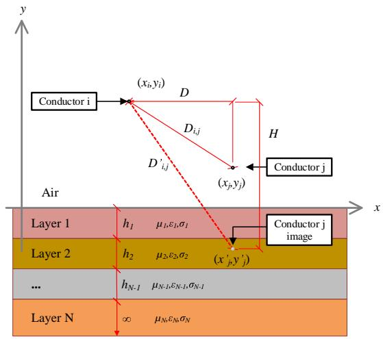  
Figure 2. Two overhead conductors above N layers of soil, with distances H, D, D’ and $h _ { n }$ given in meters. Each soil layer is described by permeability $\mu _ { n } ,$ permittivity $\varepsilon _ { n } ,$ conductivity $\sigma _ { n }$ and thickness $h _ { n }$ . Thickness of layer N extends to infinity.

$$
t _ {1} = h _ {1}, t _ {m} = \sum_ {1} ^ {m} h _ {i}, (1 \leq m \leq N - 2), \tag {11}
$$

$$
\alpha_ {i} = \sqrt {\lambda^ {2} + k _ {0} ^ {2} - k _ {i} ^ {2}}, b _ {i} = \alpha_ {i} / \mu_ {i}, \tag {12}
$$

$$
k _ {i} ^ {2} = - j \omega \mu_ {i} \left(\sigma_ {i} + j \omega \varepsilon_ {i}\right), k _ {0} ^ {2} = \omega^ {2} \mu_ {0} \varepsilon_ {0}, \tag {13}
$$

$$
(i = 1, 2, \dots , N).
$$

It is clear that as the number of layers increases, the integrand of (3) becomes progressively more complex, with successive products of exponential terms on the integration variable λ. Solving a model with more than three layers is a cumbersome process that requires specific numerical integration techniques due to the oscillating form of (3), and is subject to numerical instabilities [26]. Therefore, it is convenient to seek an approach under which these issues are mitigated, preferably one that, for practical purposes, allows the use of the simpler closed-form solution (7) with the same accuracy as the exact solution (8)-(13).

# B. Homogeneous model of a two-layered soil structure

Assuming a two-layered soil structure, where the top layer is described by the permeability $\mu _ { 1 } .$ , permittivity $\varepsilon _ { 1 }$ and conductivity $\sigma _ { 1 }$ and the bottom layer by the corresponding parameters $\mu _ { 2 } , \varepsilon _ { 2 }$ and $\sigma _ { 2 }$ , Tsiamitros et al. derived an equivalent uniform model, suitable for working with earth return path problems within the frequency range from 60 Hz up to 1 MHz [13]. The presence of a finite-thickness top layer and a deep soil layer is accounted for by replacing the uniform variable σ in (4) by the equivalent parameter $\sigma _ { e q }$ , defined as:

$$
\sigma_ {e q} = \sigma_ {1} \left[ \frac {\left(\sqrt {\sigma_ {1}} + \sqrt {\sigma_ {2}}\right) - \left(\sqrt {\sigma_ {1}} - \sqrt {\sigma_ {2}}\right) e ^ {- 2 h \sqrt {\pi f \mu_ {1} \sigma_ {1}}}}{\left(\sqrt {\sigma_ {1}} + \sqrt {\sigma_ {2}}\right) + \left(\sqrt {\sigma_ {1}} - \sqrt {\sigma_ {2}}\right) e ^ {- 2 h \sqrt {\pi f \mu_ {1} \sigma_ {1}}}} \right] ^ {2}, \tag {14}
$$

where $f$ is the power system frequency, in Hertz.

This is a convenient method that has been successfully employed in transient analysis, line parameters calculations

and interference studies between power lines and pipelines, including commercially available software that accounts for the soil as a homogeneous structure [2], [11], [13], [26]. Although this is an useful formulation for a variety of cases of interest, its application range is limited, as most actual soil models are reported to be composed of more than two layers. For instance, [4] and [10] show that most real soils are composed of three to five layers. Therefore, further enhancement and extension of (14) to the general N -layered case is desirable, as it makes possible to handle more complex structures with a relatively simple expression.

# IV. PROPOSED HOMOGENEOUS MODEL OF A MULTI-LAYER SOIL STRUCTURE

Current approaches for modeling multi-layer structures in ground return problems are based on developing suitable forms of the analytical expression (8)-(13) and employing numerical integration techniques, and are often limited to three-layered structures [12], [26]. For more than tree layers, the finite element method has been commonly used [11], [26]. The complexity and issues associated with these methods have been discussed in the previous section.

The methodology proposed in this paper consists of applying (14) recursively for each pair of layers, from bottom to top, in order to obtain an equivalent uniform soil model of any multi-layer structure. Then, the mutual impedance with earth return path may calculated using the closed-form solution of Carson equation (2)-(4) or directly used into the EMTP software.

Firstly, it is analyzed the case where the soil is composed of three layers, with respective constitutive properties $\mu _ { n } , \varepsilon _ { n } ,$ conductivity $\sigma _ { n }$ and thickness $h _ { n } , n = 1 , 2 , 3 ,$ as depicted in Fig. 2. The equivalent conductivity that represents the bottom and middle layers is:

$$
\sigma_ {2, 3} = \sigma_ {2} \left[ \frac {\left(\sqrt {\sigma_ {2}} + \sqrt {\sigma_ {3}}\right) - \left(\sqrt {\sigma_ {2}} - \sqrt {\sigma_ {3}}\right) e ^ {- 2 h _ {2} \sqrt {\pi f \mu_ {2} \sigma_ {2}}}}{\left(\sqrt {\sigma_ {2}} + \sqrt {\sigma_ {3}}\right) + \left(\sqrt {\sigma_ {2}} - \sqrt {\sigma_ {3}}\right) e ^ {- 2 h _ {2} \sqrt {\pi f \mu_ {2} \sigma_ {2}}}} \right] ^ {2}, \tag {15}
$$

and the overall equivalent conductivity is:

$$
\sigma_ {e q} = \sigma_ {1} \left[ \frac {\left(\sqrt {\sigma_ {1}} + \sqrt {\sigma_ {2 , 3}}\right) - \left(\sqrt {\sigma_ {1}} - \sqrt {\sigma_ {2 , 3}}\right) e ^ {- 2 h _ {1} \sqrt {\pi f \mu_ {1} \sigma_ {1}}}}{\left(\sqrt {\sigma_ {1}} + \sqrt {\sigma_ {2 , 3}}\right) + \left(\sqrt {\sigma_ {1}} - \sqrt {\sigma_ {2 , 3}}\right) e ^ {- 2 h _ {1} \sqrt {\pi f \mu_ {1} \sigma_ {1}}}} \right] ^ {2}. \tag {16}
$$

Assuming a soil model with four layers, the equivalent conductivity representing the fourth and third layers is:

$$
\sigma_ {3, 4} = \sigma_ {3} \left[ \frac {\left(\sqrt {\sigma_ {3}} + \sqrt {\sigma_ {4}}\right) - \left(\sqrt {\sigma_ {3}} - \sqrt {\sigma_ {4}}\right) e ^ {- 2 h _ {3} \sqrt {\pi f \mu_ {3} \sigma_ {3}}}}{\left(\sqrt {\sigma_ {3}} + \sqrt {\sigma_ {4}}\right) + \left(\sqrt {\sigma_ {3}} - \sqrt {\sigma_ {4}}\right) e ^ {- 2 h _ {3} \sqrt {\pi f \mu_ {3} \sigma_ {3}}}} \right] ^ {2}, \tag {17}
$$

The equivalent conductivity corresponding to layers 4, 3 and 2 is:

$$
\sigma_ {2, 3} = \sigma_ {2} \left[ \frac {\left(\sqrt {\sigma_ {2}} + \sqrt {\sigma_ {3 , 4}}\right) - \left(\sqrt {\sigma_ {2}} - \sqrt {\sigma_ {3 , 4}}\right) e ^ {- 2 h _ {2} \sqrt {\pi f \mu_ {2} \sigma_ {2}}}}{\left(\sqrt {\sigma_ {2}} + \sqrt {\sigma_ {3 , 4}}\right) + \left(\sqrt {\sigma_ {2}} - \sqrt {\sigma_ {3 , 4}}\right) e ^ {- 2 h _ {2} \sqrt {\pi f \mu_ {2} \sigma_ {2}}}} \right] ^ {2}. \tag {18}
$$

Finally, the overall equivalent conductivity of the fourlayered soil is:

$$
\sigma_ {e q} = \sigma_ {1} \left[ \frac {\left(\sqrt {\sigma_ {1}} + \sqrt {\sigma_ {2 , 3}}\right) - \left(\sqrt {\sigma_ {1}} - \sqrt {\sigma_ {2 , 3}}\right) e ^ {- 2 h _ {1} \sqrt {\pi f \mu_ {1} \sigma_ {1}}}}{\left(\sqrt {\sigma_ {1}} + \sqrt {\sigma_ {2 , 3}}\right) + \left(\sqrt {\sigma_ {1}} - \sqrt {\sigma_ {2 , 3}}\right) e ^ {- 2 h _ {1} \sqrt {\pi f \mu_ {1} \sigma_ {1}}}} \right] ^ {2}. \tag {19}
$$

From inspection of equations (15)-(19), extracting the recursive pattern for a general structure composed of N layers is quite straightforward, as described in (20)-(22). Calculations are not only simpler and suitable for using with the original Carson equation, but expressions have always the same form, regardless of the number of layers. The exponential terms show a familiar quantity, which is $\sqrt { \pi f \mu \sigma }$ , the reciprocal of the material penetration skin depth. Hence, the proposed homogenization technique can be understood as a correction of the earth return path impedance according to the effective current penetration in each soil layer, which holds more physical meaning than other approaches where the equivalent model is computed simply as the average of conductivities [30], [31].

# V. NUMERICAL RESULTS

To validate the proposed technique, several soil models reported in the literature, based on actual measurements, have been tested. Tables II to VI contain the soil parameters as in [13], [22], [23], [26], [32], for models from 2 up to 6 layers. Referring to distances shown in Fig. 2, two conductors are positioned at 15.24 m above the ground surface, with a horizontal separation of 21.34 m, which are the same values proposed in [26]. Permittivity and permeability are assumed to be equal, respectively, to the vacuum and free space constants.

Computations are carried out over frequencies ranging from 1 Hz to 2 MHz, in order to check the validity of the proposed technique both for steady state and transient conditions. The analytical expression from Nakagawa et al. [12] is assumed to be the reference due to the fact that it is an exact solution, derived directly from Maxwell equations. Mutual impedances are calculated using the analytical expression for the Nlayered case (9)-(13) and Carson equation (2)-(4) with the homogeneous conductivity approximation (20)-(22). Then, the impedance relative error is calculated simply as:

$$
\Delta = \left| \frac {Z _ {\text {a p p r o x i m a t i o n}} - Z _ {\text {a n a l y t i c a l}}}{Z _ {\text {a n a l y t i c a l}}} \right|. \tag {23}
$$

Table IITWO-LAYERED SOIL MODELS  

<table><tr><td>Model</td><td>σ1 [mS/m]</td><td>σ2 [mS/m]</td><td>h1 [m]</td></tr><tr><td>1</td><td>2.68</td><td>6.88</td><td>2.69</td></tr><tr><td>2</td><td>4.05</td><td>0.94</td><td>2.14</td></tr><tr><td>3</td><td>17.44</td><td>10.34</td><td>1.65</td></tr></table>

Tables VII and VIII contain the equivalent homogeneous resistivities and mutual impedance approximation relative errors, compared to the exact analytical solution, for each soil model analyzed, at frequencies 50 and 60 Hz, along with respective top and bottom layer conductivities, $\sigma _ { 1 }$ and $\sigma _ { N }$ .

For most analyzed soil models, the homogeneous approach is sufficiently accurate for practical purposes, with an average error of the order of 1%. One can notice that the lowest

$$
\sigma_ {N - 1, N} = \sigma_ {N - 1} \left[ \frac {\left(\sqrt {\sigma_ {N - 1}} + \sqrt {\sigma_ {N}}\right) - \left(\sqrt {\sigma_ {N - 1}} - \sqrt {\sigma_ {N}}\right) e ^ {- 2 h _ {N - 1} \sqrt {\pi f \mu_ {N - 1} \sigma_ {N - 1}}}}{\left(\sqrt {\sigma_ {N - 1}} + \sqrt {\sigma_ {N}}\right) + \left(\sqrt {\sigma_ {N - 1}} - \sqrt {\sigma_ {N}}\right) e ^ {- 2 h _ {N - 1} \sqrt {\pi f \mu_ {N - 1} \sigma_ {N - 1}}}} \right] ^ {2}, \tag {20}
$$

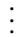

$$
\sigma_ {m - 1, m} = \sigma_ {m - 1} \left[ \frac {\left(\sqrt {\sigma_ {m - 1}} + \sqrt {\sigma_ {m - 1 , m}}\right) - \left(\sqrt {\sigma_ {m - 1}} - \sqrt {\sigma_ {m - 1 , m}}\right) e ^ {- 2 h _ {m - 1} \sqrt {\pi f \mu_ {m - 1} \sigma_ {m - 1}}}}{\left(\sqrt {\sigma_ {m - 1}} + \sqrt {\sigma_ {m - 1 , m}}\right) + \left(\sqrt {\sigma_ {m - 1}} - \sqrt {\sigma_ {m - 1 , m}}\right) e ^ {- 2 h _ {m - 1} \sqrt {\pi f \mu_ {m - 1} \sigma_ {m - 1}}}} \right] ^ {2}, \tag {21}
$$

$$
\sigma_ {e q} = \sigma_ {1} \left[ \frac {\left(\sqrt {\sigma_ {1}} + \sqrt {\sigma_ {m - 1 , m}}\right) - \left(\sqrt {\sigma_ {1}} - \sqrt {\sigma_ {m - 1 , m}}\right) e ^ {- 2 h _ {1} \sqrt {\pi f \mu_ {1} \sigma_ {1}}}}{\left(\sqrt {\sigma_ {1}} + \sqrt {\sigma_ {m - 1 , m}}\right) + \left(\sqrt {\sigma_ {1}} - \sqrt {\sigma_ {m - 1 , m}}\right) e ^ {- 2 h _ {1} \sqrt {\pi f \mu_ {1} \sigma_ {1}}}} \right] ^ {2}, (1 \leq m \leq N - 2). \tag {22}
$$

Table III THREE-LAYERED SOIL MODELS   

<table><tr><td>Model</td><td>σ1 [mS/m]</td><td>σ2 [mS/m]</td><td>σ3 [mS/m]</td><td>h1 [m]</td><td>h2 [m]</td></tr><tr><td>4</td><td>7.81</td><td>0.52</td><td>1.92</td><td>3.1</td><td>15</td></tr><tr><td>5</td><td>33.33</td><td>106.38</td><td>2</td><td>3.4</td><td>25.5</td></tr><tr><td>6</td><td>4.50</td><td>7.32</td><td>72.89</td><td>3.36</td><td>118.47</td></tr><tr><td>7</td><td>30.34</td><td>37.92</td><td>3.52</td><td>1.06</td><td>21.12</td></tr><tr><td>8</td><td>6.37</td><td>0.43</td><td>3.33</td><td>0.7</td><td>35.3</td></tr><tr><td>9</td><td>4.74</td><td>1.38</td><td>3.94</td><td>3.3</td><td>25</td></tr></table>

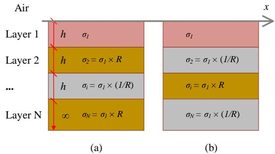  
Figure 3. Soil model composed of N equally spaced layers whose alternating conductivities differ proportionally to the contrast ratio R. On the left, $\sigma _ { N } >$ $\sigma _ { 1 }$ as R increases. On the right, $\sigma _ { N } < \sigma _ { 1 }$ with increasing R.

approximation errors occur when the equivalent conductivity results close to the bottom layer value, which agrees with reports in the literature that the deep soil conductivity plays a predominant role in problems involving ground return path [24].

Models 5, 6 and 14 show that significant errors arise when there are pairs of layers with large ratios between respective conductivities, which was also noted in [13]. Maximum conductivity ratios for these models are, respectively, 53.19, 9.95 and 112. In such cases, the equivalent homogeneous conductivity diverges from the bottom layer value.

To further investigate this effect, let R be the contrast ratio in the hypothetical system shown in Fig. 3, composed of a top layer with conductivity $\sigma _ { 1 }$ and $N - 1$ alternating layers whose conductivities differ proportionally to the factor R. Clearly two situations are possible: as R increases, (a) $\sigma _ { N } > \sigma _ { 1 } ;$ or (b) $\sigma _ { N } ~ < ~ \sigma _ { 1 }$ . Fig. 4 presents the homogeneous equivalent approximation error as a function of the contrast ratio R. If $R = 1$ , the soil model is one single homogeneous medium with conductivity $\sigma _ { 1 }$ and there is no approximation error. For $3 < R < 1 0$ , errors are kept within the range of 1% to 5% and tend to increase steeply for contrast ratios outside these boundaries, which explains the errors verified in soil models 5, 6, and 14. If better accuracy is desired in high contrast cases, the analytical solution provides more precise results. If problem constraints require the classic Carson equation (2)-(4) to be used, a technique based on non-linear fitting can also be employed in such cases [33].

Layer thicknesses are also of relevance. To verify how they affect results, let $N = 2$ in the theoretical model presented in Fig. 3. The impedance relative error as a function of the layer thickness h and the contrast ratio R is shown in Fig. 5,

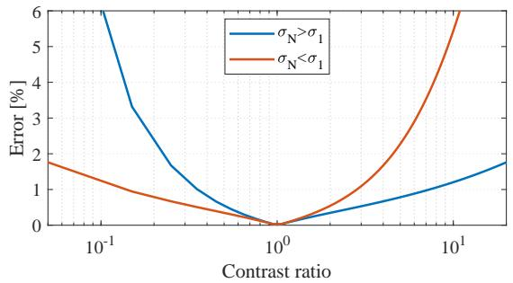  
Figure 4. Approximation error as function of the contrast ratio R. Relative error is kept below 1% for $R < 3$ and below 5% for $R < 1 0$ .

assuming top layer conductivities equal to, respectively, 0.1, 1, 10 and 100 mS/m. Thickness values are normalized with respect to the skin depth δ associated with the conductivity of the top layer $\sigma _ { 1 }$ . In the worst case, the approximation error is less than 5.45% for depths shallower than 5% of the skin depth δ.

Figs. 6 to 10 show the approximation error as a function of frequency, for all soil models, except for 5, 6 and 14, which have already been proven to provide more precise results with other techniques. Table IX summarizes the maximum values of relative error and contrast ratio, as well as the frequency associated with the maximum error.

It is clear that the proposed approach is accurate at the

Table IV   
FOUR-LAYERED SOIL MODELS   

<table><tr><td>Model</td><td>σ1 [mS/m]</td><td>σ2 [mS/m]</td><td>σ3 [mS/m]</td><td>σ4 [mS/m]</td><td>h1 [m]</td><td>h2 [m]</td><td>h3 [m]</td></tr><tr><td>10</td><td>2.17</td><td>28.61</td><td>413.22</td><td>45.51</td><td>0.9</td><td>2.6</td><td>1.5</td></tr><tr><td>11</td><td>4.25</td><td>0.28</td><td>4.87</td><td>0.66</td><td>1.2</td><td>5.33</td><td>21.06</td></tr><tr><td>12</td><td>52.36</td><td>23.98</td><td>1.91</td><td>1.75</td><td>0.3</td><td>2.4</td><td>4.6</td></tr><tr><td>13</td><td>8.23</td><td>1.197</td><td>13.35</td><td>2.99</td><td>4.5</td><td>8.02</td><td>22.67</td></tr><tr><td>14</td><td>14.77</td><td>13.21</td><td>34.72</td><td>0.31</td><td>1.2</td><td>17</td><td>61.9</td></tr></table>

Table V   
FIVE-LAYERED SOIL MODELS   
Table VI   

<table><tr><td>Model</td><td>σ1 [mS/m]</td><td>σ2 [mS/m]</td><td>σ3 [mS/m]</td><td>σ4 [mS/m]</td><td>σ5 [mS/m]</td><td>h1 [m]</td><td>h2 [m]</td><td>h3 [m]</td><td>h4 [m]</td></tr><tr><td>15</td><td>15.53</td><td>2.27</td><td>88.57</td><td>2.83</td><td>29.51</td><td>1.37</td><td>0.66</td><td>2.41</td><td>5.73</td></tr><tr><td>16</td><td>0.12</td><td>0.05</td><td>0.05</td><td>0.22</td><td>0.32</td><td>0.64</td><td>0.29</td><td>3.47</td><td>7.4</td></tr><tr><td>17</td><td>3.98</td><td>0.42</td><td>3.88</td><td>0.41</td><td>1.05</td><td>3.64</td><td>4.74</td><td>9.75</td><td>128</td></tr></table>

SIX-LAYERED SOIL MODELS   

<table><tr><td>Model</td><td>σ1 [mS/m]</td><td>σ2 [mS/m]</td><td>σ3 [mS/m]</td><td>σ4 [mS/m]</td><td>σ5 [mS/m]</td><td>σ6 [mS/m]</td><td>h1 [m]</td><td>h2 [m]</td><td>h3 [m]</td><td>h4 [m]</td><td>h5 [m]</td></tr><tr><td>18</td><td>14.7</td><td>1.6</td><td>137.2</td><td>2.6</td><td>142.2</td><td>8</td><td>1.08</td><td>0.29</td><td>1.21</td><td>2.64</td><td>2.98</td></tr><tr><td>19</td><td>0.22</td><td>3.6</td><td>1.3</td><td>0.67</td><td>1.2</td><td>10</td><td>1.86</td><td>2.80</td><td>3.17</td><td>11.95</td><td>9.99</td></tr><tr><td>20</td><td>2.36</td><td>3.32</td><td>1.15</td><td>1.59</td><td>0.17</td><td>6.65</td><td>0.44</td><td>5.31</td><td>5.63</td><td>82.23</td><td>31.17</td></tr></table>

Table VII   
SOIL CONDUCTIVITIES AND APPROXIMATION ERRORS @ 50 HZ   

<table><tr><td>Model</td><td>σeq[mS/m]</td><td>σ1[mS/m]</td><td>σN[mS/m]</td><td>Δ [%]</td></tr><tr><td>1</td><td>6.8580</td><td>2.68</td><td>6.88</td><td>0.0586</td></tr><tr><td>2</td><td>0.9502</td><td>4.05</td><td>0.94</td><td>0.0791</td></tr><tr><td>3</td><td>10.3732</td><td>17.44</td><td>10.34</td><td>0.0513</td></tr><tr><td>4</td><td>1.9199</td><td>7.81</td><td>1.92</td><td>0.0181</td></tr><tr><td>5</td><td>6.8286</td><td>33.33</td><td>2</td><td>13.2685</td></tr><tr><td>6</td><td>37.4264</td><td>4.50</td><td>72.89</td><td>8.0037</td></tr><tr><td>7</td><td>4.8574</td><td>30.34</td><td>3.52</td><td>4.3007</td></tr><tr><td>8</td><td>3.1775</td><td>6.37</td><td>3.33</td><td>0.6565</td></tr><tr><td>9</td><td>3.8326</td><td>4.74</td><td>3.94</td><td>0.3734</td></tr><tr><td>10</td><td>48.2863</td><td>2.17</td><td>45.51</td><td>1.0058</td></tr><tr><td>11</td><td>0.7311</td><td>4.25</td><td>0.66</td><td>1.1600</td></tr><tr><td>12</td><td>1.8274</td><td>52.36</td><td>1.75</td><td>0.6278</td></tr><tr><td>13</td><td>3.3727</td><td>8.23</td><td>2.99</td><td>1.5315</td></tr><tr><td>14</td><td>2.4599</td><td>14.77</td><td>0.31</td><td>16.0025</td></tr><tr><td>15</td><td>29.2935</td><td>15.53</td><td>29.51</td><td>0.1112</td></tr><tr><td>16</td><td>0.3165</td><td>0.12</td><td>0.32</td><td>0.0343</td></tr><tr><td>17</td><td>1.0103</td><td>3.98</td><td>1.05</td><td>0.3555</td></tr><tr><td>18</td><td>9.3900</td><td>14.7</td><td>8</td><td>2.4191</td></tr><tr><td>29</td><td>9.3039</td><td>0.22</td><td>10</td><td>1.0717</td></tr><tr><td>20</td><td>5.3869</td><td>2.36</td><td>6.65</td><td>2.5875</td></tr></table>

Table VIII   
SOIL CONDUCTIVITIES AND APPROXIMATION ERRORS @ 60 HZ   

<table><tr><td>Model</td><td>σeq[mS/m]</td><td>σ1[mS/m]</td><td>σN[mS/m]</td><td>Δ [%]</td></tr><tr><td>1</td><td>6.8555</td><td>2.68</td><td>6.88</td><td>0.0652</td></tr><tr><td>2</td><td>0.9508</td><td>4.05</td><td>0.94</td><td>0.0879</td></tr><tr><td>3</td><td>10.3764</td><td>17.44</td><td>10.34</td><td>0.0570</td></tr><tr><td>4</td><td>1.9196</td><td>7.81</td><td>1.92</td><td>0.0196</td></tr><tr><td>5</td><td>7.4181</td><td>33.33</td><td>2</td><td>14.1068</td></tr><tr><td>6</td><td>35.5968</td><td>4.50</td><td>72.89</td><td>8.4938</td></tr><tr><td>7</td><td>4.9935</td><td>30.34</td><td>3.52</td><td>4.7029</td></tr><tr><td>8</td><td>3.1633</td><td>6.37</td><td>3.33</td><td>0.7259</td></tr><tr><td>9</td><td>3.8230</td><td>4.74</td><td>3.94</td><td>0.4128</td></tr><tr><td>10</td><td>48.5463</td><td>2.17</td><td>45.51</td><td>1.1082</td></tr><tr><td>11</td><td>0.7375</td><td>4.25</td><td>0.66</td><td>1.2801</td></tr><tr><td>12</td><td>1.8353</td><td>52.36</td><td>1.75</td><td>0.6967</td></tr><tr><td>13</td><td>3.4080</td><td>8.23</td><td>2.99</td><td>1.6799</td></tr><tr><td>14</td><td>2.7539</td><td>14.77</td><td>0.31</td><td>16.6225</td></tr><tr><td>15</td><td>29.2748</td><td>15.53</td><td>29.51</td><td>0.1216</td></tr><tr><td>16</td><td>0.3164</td><td>0.12</td><td>0.32</td><td>0.0380</td></tr><tr><td>17</td><td>1.0073</td><td>3.98</td><td>1.05</td><td>0.3818</td></tr><tr><td>18</td><td>9.5287</td><td>14.7</td><td>8</td><td>2.6653</td></tr><tr><td>19</td><td>9.2416</td><td>0.22</td><td>10</td><td>1.1838</td></tr><tr><td>20</td><td>5.2899</td><td>2.36</td><td>6.65</td><td>2.8114</td></tr></table>

power system frequency, including transients within the kilohertz range, which are typical of surges in electrical systems. For very fast transients, such as lightning discharges, whose spectrum is often within the megahertz band, the proposed approach precision depends on the soil structure. Similarly to the 50 and 60 Hz cases studied previously, there is a correlation between the approximation error and layer contrast ratios.

However, it has to be noted that even though errors within the high-frequency range reach the order of 20%, results are consistent with what is reported in the literature [13], [26].

Table X presents the computational load imposed by each approach, measured in floating-point operations (flops). Values correspond to the average number of operations to compute the mutual impedance between conductors, evaluated for each

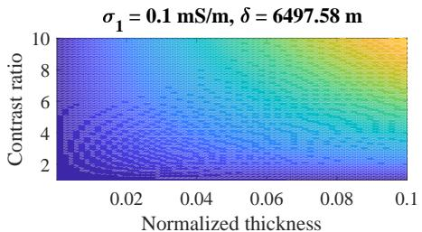

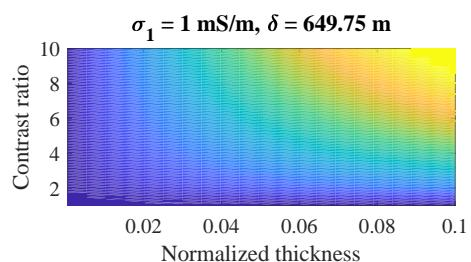  
Impedance relative error [%] 0 1 2 3 4 5

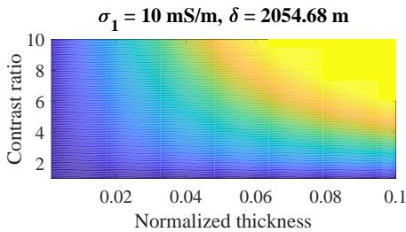

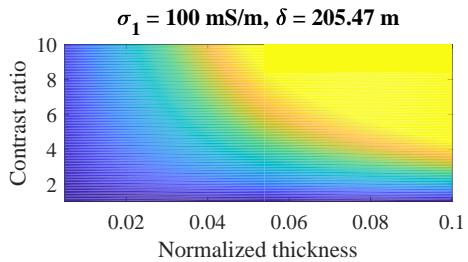  
Figure 5. Approximation error as function of the layer thickness and contrast ratio, for top layer conductivities equal to, respectively, 0.1, 1, 10 and 100 mS/m. Thickness axis is normalized with respect to the skin depth δ. Maximum error is less than 5.45% for depths shallower than 5% of the skin depth δ.

Table IX MAXIMUM ERRORS, CONTRAST RATIOS AND FREQUENCIES   

<table><tr><td>Model</td><td>Maximum Δ [%]</td><td>Maximum R</td><td>Frequency [MHz]</td></tr><tr><td>1</td><td>4.31</td><td>2.5</td><td>0.89</td></tr><tr><td>2</td><td>8.03</td><td>4.3</td><td>0.7</td></tr><tr><td>3</td><td>2.34</td><td>1.68</td><td>0.2</td></tr><tr><td>4</td><td>12.75</td><td>15.01</td><td>0.5</td></tr><tr><td>7</td><td>16.48</td><td>10.77</td><td>0.003</td></tr><tr><td>8</td><td>10.68</td><td>14.81</td><td>0.05</td></tr><tr><td>9</td><td>7.6</td><td>0.5</td><td>3.42</td></tr><tr><td>10</td><td>9.61</td><td>14.44</td><td>0.19</td></tr><tr><td>11</td><td>11.11</td><td>2.5</td><td>0.12</td></tr><tr><td>12</td><td>19.06</td><td>12.55</td><td>0.1</td></tr><tr><td>13</td><td>6.49</td><td>7.37</td><td>0.003</td></tr><tr><td>15</td><td>4.55</td><td>0.6</td><td>39.01</td></tr><tr><td>16</td><td>18.48</td><td>2.4</td><td>2</td></tr><tr><td>17</td><td>13.33</td><td>9.47</td><td>0.62</td></tr><tr><td>18</td><td>14.95</td><td>85.75</td><td>0.006</td></tr><tr><td>19</td><td>13.88</td><td>16.36</td><td>0.04</td></tr><tr><td>20</td><td>7.57</td><td>39.11</td><td>0.002</td></tr></table>

soil model presented in Tables II to VI. Results show that the proposed technique reduces the number of necessary floatingpoint operations in 98% compared with the exact analytical solution, which is mainly explained by the absence of need to perform numerical integrations.

To put the relevance of this result into proper perspective, computations shown in Table X took, respectively, 28.5729 ms and 0.4941 ms, to run on an Intel® Core i9-7900X CPU @ 3.3 GHz with 64 GB RAM. Although computational times of the order of milliseconds may seem quite acceptable for most power systems applications, there are situations, such as low-frequency interference studies, where large systems

are involved and require self and mutual impedances to be calculated several thousand times, as well as in transient studies where translations from time-domain to frequencydomain are performed for a high number of frequencies, in processes that often take hours to run [2], [3], [34]–[36]. In such cases, the achieved performance gain is not to be neglected.

Table X AVERAGE COMPUTATIONAL LOAD   

<table><tr><td>Approach</td><td>Computational load [flops]</td><td>Time [ms]</td></tr><tr><td>Analytical</td><td>34.4477 × 106</td><td>28.5729</td></tr><tr><td>Proposed</td><td>0.7158 × 106</td><td>0.4941</td></tr></table>

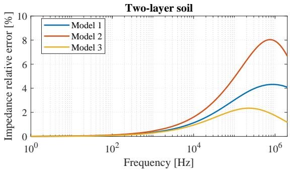  
Figure 6. Frequency response of two-layered soil models 1, 2 and 3. Errors are under 2% from the 1 Hz range up to the kHz band.

# VI. APPLICATIONS

A. Transient response of a transmission line

Figs. 11, 12 and Table XI describe the 150 kV single-circuit test system studied in [13], [26]. The transmission line is

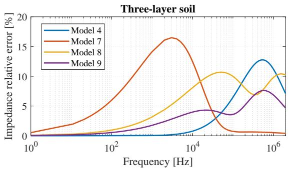  
Figure 7. Frequency response of three-layered soil models 4, 7, 8 and 9. Models 4 and 9 perform under 2% error from 1 Hz up to the kHz band.

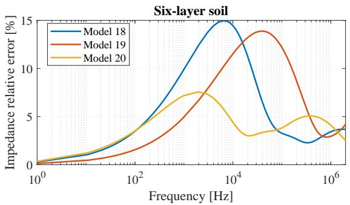  
Figure 10. Frequency response of six-layered soil models 18, 19 and 20. Errors are below 3% from 1 Hz up to the power system frequency range.

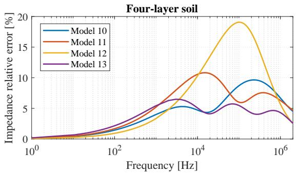  
Figure 8. Frequency response of four-layered soil models 10, 11, 12 and 13. Errors are below 2% in the range from 1 Hz to 100 Hz.

considered to be 200 km long. A line-to-ground fault through a resistance of 2 Ω is applied at the open end of phase c at t = 10 ms.

A time-domain simulation is carried out using the ATP software and two scenarios are considered: (a) the soil is assumed to be homogeneous with a conductivity equal to the value of the first layer; and (b) the soil stratification is accounted for by using the uniform equivalent approach. Since in previous studies two and three-layered soil models were already analyzed, the four-layered soil model number 12 from Table IV is chosen for this case study. The choice is justified by the fact that this model results in the most visible differences

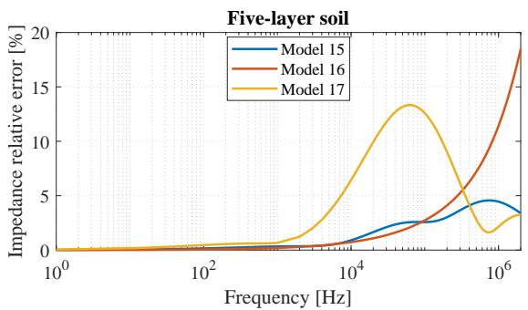  
Figure 9. Frequency response of five-layered soil models 15, 16 and 17. Errors are below 2% in the range from 1 Hz up to the kHz band.

and does not represent any loss of generality. Transmission line parameters are computed using the Line Constants routine. Transient voltages are calculated using a time-step ∆t = 1 µs, which is enough to maintain numerical stability and ensure the desired accuracy.

Fig. 13 shows the phase b open-end voltages. There is a difference of 9.4 kV, or 5.44%, between the overvoltage peak values of each soil model. This may be enough to require modifications in the design of the tower insulating supports with adding more disks, in order to avoid operating too closely to the safety limits or, in the worst case, insulation breakdown. Results show that the earth stratification has significant impacts in transient currents and voltages caused by asymmetrical faults. Furthermore, the proposed technique allows to accurately account for the soil structure in calculations using standard electromagnetic transients software.

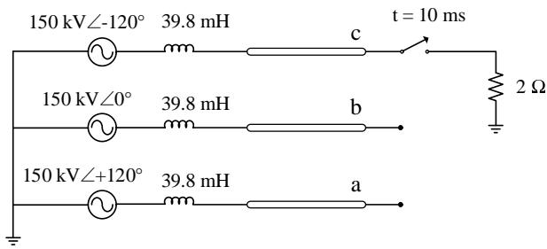  
Figure 11. Single-circuit 150 kV transmission system.

Table XI SPECIFICATIONS OF TRANSMISSION LINE CONDUCTORS   

<table><tr><td>Conductor</td><td>Diameter [cm]</td><td>R [Ω/km]</td><td>X [Ω/km]</td></tr><tr><td>Phases</td><td>2.5141</td><td>0.0924806</td><td>0.0156758</td></tr><tr><td>Neutral</td><td>0.9144</td><td>3.42313</td><td>0.261225</td></tr></table>

# B. Interference between a power line and a pipeline

Fig. 14 represents a case study adapted from [11], described by the following design parameters: a single phase

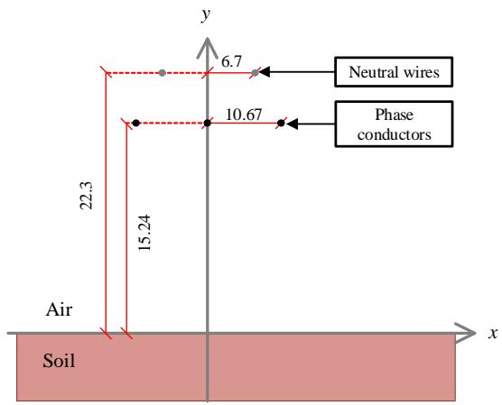  
Figure 12. Transmission line cross-section. Dimensions in meters.

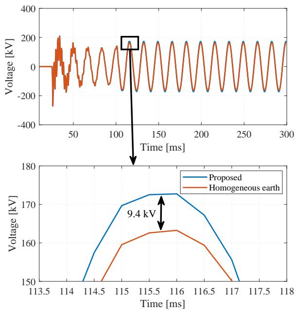  
Figure 13. Phase b open-end voltages. Peak value is 172.7 kV for the 4- layered earth and 163.3 kV for the homogeneous soil model. Difference between both models is 9.4 kV.

transmission line sharing the right-of-way with a 8" diameter underground carbon steel pipeline installed at 1.2 m depth. The pipeline runs parallel to the transmission line axis for 5 km, with a perpendicular separation of 100 m. The transmission line operates with a nominal current of 1000 A. The phase conductor is a ACSR 636 MCM 27/7 (Peacock), positioned at 17.2 m above the soil surface. Pipeline parameters are shown in Table XII. Soil is assumed to be the same as in the previous section, i.e. the four-layered structure described by model number 12 from Table IV, without loss of generality.

Simulations are carried out to determine the voltages induced on the pipeline by the energized phase conductor due to magnetic coupling. First, the finite element method is employed to compute voltages considering the actual 4-layer soil structure, using the FEMM package, which is a popular

open-source finite element modeling and analysis tool that computes electromagnetic fields distribution over a discretized domain [37]. Then, calculations are performed using the π circuit model described in [3], under two premises: (a) the soil is considered to be homogeneous with a conductivity equal to the value of the first layer; and (b) the soil stratification is accounted for by using the uniform equivalent approach. The SESTLC package is employed for this purpose, which is a specialized software designed to predict induced voltages and currents from a transmission line on a target conductor. It assumes the earth to be a uniform medium and uses a circuit theory approach, along with the complex ground return plane proposed in [8], [38].

Fig. 15 shows the pipeline induced voltages due to the parallel exposure. There is a good agreement between results produced by FEMM and the proposed technique, with a maximum error of 2%. On the other hand, errors as high as 50% arise when the soil structure is not properly accounted for. It is also relevant to observe the computational times involved: for this simple parallelism case, FEMM needed around half an hour to run calculations, whereas SESTLC took less than one minute to process the model. Thus, the proposed formula combined with a circuit theory approach provides a performance gain of more than 95% in comparison with the finite element method, which is known to be a computationally demanding technique. This performance improvement not only benefits the simulation of complex geometries, where self and mutual conductor impedances have to be computed several times, but allows for the execution of optimization studies as well.

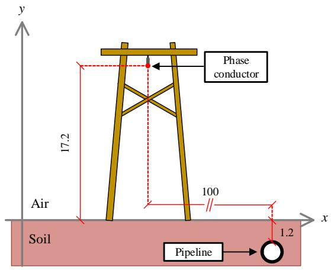  
Figure 14. Single phase line and pipeline cross-section. Dimensions in meters. Parallel length is 5 km.

Table XII PIPELINE CHARACTERISTICS   

<table><tr><td>Parameter</td><td>Value</td></tr><tr><td>Internal radius</td><td>0.1014 m</td></tr><tr><td>External radius</td><td>0.1095 m</td></tr><tr><td>Electrical resistivity</td><td>1.720 × 10-7Ω.m</td></tr><tr><td>Magnetic permeability</td><td>3.771 × 10-4H/m</td></tr></table>

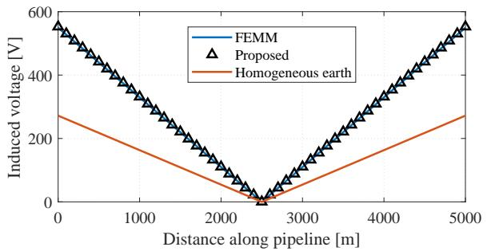  
Figure 15. Pipeline induced voltages due to magnetic coupling with the phase conductor. Maximum error between FEMM and the proposed technique is 2%. Maximum error between the 4-layered model and homogeneous earth is 50%.

# VII. ADDITIONAL REMARKS

The idea proposed in this paper of representing a multi-layer soil by its uniform equivalent agrees with the very nature of the techniques currently available for measuring and modeling soil parameters, as they describe the equivalent, or apparent, values measured from the earth surface.

The discussed formula efficiently accounts for the multilayered characteristic of real soils and the effect of the deep soil layer on ground return impedances, rather than merely defining a uniform soil structure as the average of apparent conductivities, as has become a common industry practice [30].

However, there is a limitation related to the frequency, as approximation errors rise considerably within the high-frequency spectrum. This is due to the fact that under such circumstances, the uniform equivalent formula no longer describes the effectively conductive portion of the soil, determined by the skin depth δ, nor accounts for the effects of displacement currents, expressed by the imaginary parts of the complexvalued parameters conductivity and permittivity [12]. For very fast transients with frequencies close to 1 MHz and above, earth may be regarded as a homogeneous structure having the properties of the surface layer, as demonstrated in [26].

Still, the proposed technique is a useful approach that has proven accurate for a variety of power systems applications, in special, but not restricted, to those which rely on the computation of self and mutual impedances between conductors at 50 and 60 Hz.

# VIII. CONCLUSIONS

A homogeneous conductivity approximation is provided in this paper, in order to account for multi-layer soil structures in ground return impedance calculations. The technique consists of recursively deriving equivalent layer conductivities according to the current penetration depth of each medium. The proposed homogeneous approach is suitable for using with the original Carson equation, as well as industry-standard software that expect an uniform real-valued conductivity σ to perform calculations.

Twenty soil models based on real measurements are studied, from 2 to 6 layers, with computations of the mutual

impedances between two overhead conductors. Calculations are carried out for frequencies ranging from 1 Hz to 2 MHz, with emphasis on the 50 and 60 Hz cases. Results are compared to the exact analytical expression for N layers, then the approximation errors are assessed.

Approximation errors are of the order of 1% at power system frequencies to the kHz band, proving the homogeneous approach to be accurate for steady-state conditions and surges commonly verified in electrical systems. High-frequency cases are strongly dependent on the soil structure and must be carefully observed.

Conditions for validity of the proposed formula are: power system frequencies, shallow earth models and low contrast ratios between layer conductivities. As a rule of thumb, accurate results are expected for frequencies up to the kHz band, contrast ratios lower than 10 and depths lower than 5% of the skin depth δ.

To verify the usefulness of the presented method, two case studies of practical interest to the industry are provided and discussed. First, the transient response of a transmission line subject to an asymmetrical fault is evaluated using ATP. Second, induced voltages on a pipeline due to a nearby energized conductor are computed using softwares FEMM and SESTLC. Both cases emphasize the importance of properly accounting for the multi-layered nature of actual soils. Moreover, the proposed method accuracy and performance gain are proven excellent in real-life scenarios. By means of a relatively simple equivalence formula, complex soil structures are introduced into practical applications using tools already available, tested and well-documented.

The main advantages of the method presented in this paper are: (a) the same expression is valid independently of the soil model, avoiding a kernel function whose form and complexity grows with the number of layers; (b) no numerical integrations are necessary, without concerns with stability and convergence issues; and (c) a substantial gain of performance is obtained, with a computational load reduction of 98%.

The proposed equivalence formula allows for building simple, yet accurate, models of multi-layered soil structures in ground return impedance calculations using standard EMTP or grounding software. It is of great interest to those directly or indirectly affected by phenomena dependent on transmission line parameters, such as power companies, engineers in charge of electrical studies and/or designs or pipeline operators whose facilities share the right-of-way with power lines.

# REFERENCES

[1] W. Grainger, J.J. and Stevenson, Power System Analysis, international ed. McGraw-Hill Education, 1994.   
[2] A. G. Martins-Britto, “Modeling of the Electromagnetic Interferences between Power Lines and Underground Metallic Pipelines and Impact Analysis,” Master’s Thesis, University of Brasília, 2017.   
[3] CIGRÉ WG-36.02, “Technical Brochure n. 95 - Guide on the Influence of High Voltage AC Power Systems on Metallic Pipelines,” Paris, pp. 1–135, 1995.   
[4] J. He, R. Zeng, and B. Zhang, Methodology and Technology for Power System Grounding. Singapore: John Wiley & Sons Singapore Pte. Ltd., 2013.   
[5] T. Takahashi and T. Kawase, “Analysis of Apparent Resistivity in a Multi-Layer Earth Structure,” IEEE Transactions on Power Delivery, vol. 5, no. 2, pp. 604–612, 1990.

[6] J. R. Carson, “Wave Propagation in Overhead Wires with Ground Return,” Bell Syst. Tech. J., vol. 5, pp. 539–554, 1926.   
[7] A. Ametani, T. Yoneda, Y. Baba, and N. Nagaoka, “An Investigation of Earth-Return Impedance Between Overhead and Underground Conductors and Its Approximation,” IEEE Transactions on Electromagnetic Compatibility, vol. 51, no. 3, pp. 860–867, 2009.   
[8] A. Deri, G. Tevan, A. Semlyen, and A. Castanheira, “The Complex Ground Return Plane - A Simplified Model for Homogeneous and Multi-Layer Earth Return,” IEEE Transactions on Power Apparatus and Systems, vol. PAS-100, no. 8, pp. 3686–3693, aug 1981.   
[9] T. Theodoulidis, “On the Closed-Form Expression of Carson’s Integral,” Periodica Polytechnica Electrical Engineering and Computer Science, vol. 59, no. 1, pp. 26–29, 2015.   
[10] E. Whelan, J.M; Hanratty, B.; Morgan, “Earth Resistivity in Ireland,” in CDEGS Users’ Group, Montreal, 2010, pp. 155–164.   
[11] A. G. L. Furlan, “Estudo de Interferências Eletromagnéticas entre Linhas de Transmissão e Dutos Enterrados,” Dissertação (Mestrado), Universidade Federal de Santa Catarina, 2015.   
[12] M. Nakagawa, A. Ametani, and K. Iwamoto, “Further Studies on Wave Propagation in Overhead Lines with Earth Return: Impedance of Stratified Earth,” Proceedings of the Institution of Electrical Engineers, vol. 120, no. 12, p. 1521, 1973.   
[13] D. A. Tsiamitros, G. K. Papagiannis, and P. S. Dokopoulos, “Homogenous Earth Approximation of Two-Layer Earth Structures: An Equivalent Resistivity Approach,” IEEE Transactions on Power Delivery, vol. 22, no. 1, pp. 658–666, 2007.   
[14] T. Elkateb, R. Chalaturnyk, and P. K. Robertson, “An Overview of Soil Heterogeneity: Quantification and Implications on Geotechnical Field Problems,” Canadian Geotechnical Journal, vol. 40, pp. 1–15, 2003.   
[15] A. Haddad and D. Warne, Advances in High Voltage Engineering, A. T. Johns and D. F. Warne, Eds. The Institte of Electrical and Electronics Engineers, Inc., 2009.   
[16] B. K. Steinberg and T. M. Levitskaya, “Electrical Parameters of Soils in the Frequency Range from 1 kHz to 1 GHz, Using Lumped-circuit Methods,” Radio Science, vol. 36, no. 4, pp. 709–719, 2001.   
[17] J. Lee, J. Zou, B. Li, and M. Ju, “Efficient Evaluation of the Earth Return Mutual Impedance of Overhead Conductors Over a Horizontally Multilayered Soil,” COMPEL: The International Journal for Computation and Mathematics in Electrical and Electronic Engineering, vol. 33, no. 4, pp. 1379–1395, 2013.   
[18] J. A. Stratton, Electromagnetic Theory, reissued ed. Hoboken, New Jersey: John Wiley & Sons, Inc., 2007.   
[19] I. Cousin, A. Tabbagh, A. Bruand, G. Richard, and A. Samoue, “Electrical Resistivity Survey in Soil Science: a Review,” Soil & Tillage Research, vol. 83, pp. 173–193, 2005.   
[20] IEEE Std. 81, “IEEE Guide for Measuring Earth Resistivity, Ground Impedance, and Earth Surface Potentials of a Ground System,” New York, NY, p. 54, 1984.   
[21] Y. L. Chow, J. J. Yang, and G. E. Howard, “Complex Images for Electrostatic Field Computation in Multilayered Media,” IEEE Transactions on Microwave Theory and Techniques, vol. 39, no. 7, pp. 1120–1125, 1991.   
[22] F. Dawalibi and N. Barbeito, “Measurements and computations of the performance of grounding systems buried in multilayer soils,” IEEE Transactions on Power Delivery, vol. 6, no. 4, pp. 1483–1490, 1991.   
[23] B. Zhang, X. Cui, L. Li, and J. He, “Parameter Estimation of Horizontal Multilayer Earth by Complex Image Method,” IEEE Transactions on Power Delivery, vol. 20, no. 2 II, pp. 1394–1401, 2005.   
[24] R. Southey and F. Dawalibi, “Improving the Reliability of Power Systems with More Accurate Grounding System Resistance Estimates,” Proceedings. International Conference on Power System Technology, vol. 4, pp. 98–105, 2005.   
[25] S. Das, S. Santoso, A. Gaikwad, and M. Patel, “Impedance-based Fault Location in Transmission Networks: Theory and Application,” IEEE Access, vol. 2, pp. 537–557, 2014.   
[26] G. Papagiannis, D. Tsiamitros, D. Labridis, and P. Dokopoulos, “A Systematic Approach to the Evaluation of the Influence of Multilayered Earth on Overhead Power Transmission Lines,” IEEE Transactions on Power Delivery, vol. 20, no. 4, pp. 2594–2601, oct 2005.   
[27] R. M. Aarts and A. J. E. M. Janssen, “Approximation of the Struve Function H1 Occurring in Impedance Calculations,” The Journal of the Acoustical Society of America, vol. 113, no. 5, pp. 2635–2637, 2003.   
[28] W. E. Boyce and R. C. DiPrima, Elementary Differential Equations and Boundary Value Problems, 10th ed. John Wiley & Sons, 2012.   
[29] M. Abramowitz and I. Stegun, Handbook of Mathematical Functions: with Formulas, Graphs, and Mathematical Tables, 9th ed. Dover Publications, 1965.

[30] IEEE Std. 80, “Guide for Safety In AC Substation Grounding,” p. 202, 2000.   
[31] J. M. Kindermann, G. ; Campagnolo, Aterramento Elétrico, 3rd ed., Sagra-DC Luzzato, Ed., Porto Alegre / RS, 1995.   
[32] R. E. Iserhien-Emekeme, “Electrical Resistivity Survey for Predicting Aquifer at Onicha-Ugbo, Delta State, Nigeria,” Journal of Applied Mathematics and Physics, vol. 02, no. 07, pp. 520–527, 2014.   
[33] A. G. L. Furlan, A. G. Martins-Britto, P. Kuo-Peng, and M. V. F. Luz, “Cálculo da Interferência Indutiva entre Linhas de Transmissão e Dutos Utilizando Método dos Elementos Finitos e Analíticos,” in COTEQ2015- 156. Cabo de Santo Agostinho / PE: ABENDI, ABRACO, ABCM e IBP, 2015, pp. 1–7.   
[34] J. I. R. I. Dabkowski and A. Taflove, “Mutual Design Considerations for Overhead AC Transmission Lines and Gas Transmission Pipelines Volume 1: Engineering Analysis,” pp. 1–511, 1978.   
[35] ——, “Mutual Design Considerations for Overhead AC Transmission Lines And Gas Transmission Pipelines Volume 2: Prediction and Mitigation Procedures,” pp. 1–186, 1978.   
[36] J. A. Martinez-Velasco, Transient Analysis of Power Systems. Wiley-IEEE Press, 2015.   
[37] R. Crozier and M. Mueller, “A New MATLAB and Octave Interface to a Popular Magnetics Finite Element Code,” in 2016 XXII International Conference on Electrical Machines (ICEM). Lausanne, Switzerland: IEEE, 2016, pp. 1251–1256.   
[38] F. P. Dawalibi, “Modern Computational Methods for the Design and Analysis of Power System Grounding,” in International Conference on Power System Technology, Beijing, 1998, pp. 122–126.

Amauri G. Martins-Britto (M’18) was born in Brazil, 1982. He received his B.Sc. and M.Sc. degrees in Electrical Engineering from University of Brasília (UnB), Brazil, in 2005 and 2017, respectively. He has been working as a Professional Engineer (P.Eng.) since 2005 and was involved in several projects related to electrical grounding, cathodic protection and interferences between power lines and pipelines, including development of software tools for design and analysis, at the service of the oil & gas and electricity industries. Currently he is a Professor at University of Brasília, Brazil. His research interests are soil resistivity analysis, AC and DC electrical grounding and low-frequency electromagnetic interferences.

Felipe V. Lopes (M’10) was born in Brazil, 1985. He received his B.Sc., M.Sc. and Ph.D. degrees in Electrical Engineering from Federal University of Campina Grande (UFCG), Brazil, in 2009, 2011 and 2014, respectively. He is currently an Adjunct Professor at University of Brasília (UnB), Brazil. His research interests are electromagnetic transients, fault location and power system protection.

Sébastien R. M. J. Rondineau (M’04-SM’17) was born in 1975 in France. He earned his Diplôme d’ Ingénieur en Informatique et téléCommunications, a postgraduate degree in signal processing and telecommunications, in 1999 and his Ph.D. degree in 2002 from the University of Rennes 1, France. From 2008 to 2015, he was working in various RF/Electronic Warfare Brazilian companies as technical director and/or company founder. He is now Professor at both the Aerospace Engineering and the Electronic Engineering departments of the University of Brasília, Brazil. His research interests include beam-forming, RF-optical conversion, computational electromagnetics, mode matching, conformal mapping, propagation and scattering of waves, dielectric lenses, discrete lens arrays and antennas.