# COMBINED TRANSIENT AND DYNAMIC ANALYSIS OF HVDC AND FACTS SYSTEMS

M. Sultan

Member

Hatch Associates

Mississauga, Ontario

J. Reeve

Fellow

University of Waterloo

Waterloo, Ontario

R. Adapa

Senior Member

Electric Power Research Institute

Palo Alto, CA

# Abstract

A new approach to HVDC and FACTS transient/dynamic simulation based on an interactive execution of an ac transient stability program (TSP) and the Electro-Magnetic Transients Program (EMTP) is described. Through the integration of the detailed transient model of FACTS with the transient stability program, authentic simulation is achieved without simplifications. Both HVDC and Thyristor Controlled Series Capacitor (TCSC) systems are used to validate the approach, under different coupling situations between both TSP and EMTP.

Keywords: FACTS, HVDC, EMTP, Frequency Dependent Network Equivalents, Transient Stability Simulation.

# I. INTRODUCTION

The ac transient stability programs based on fundamental frequency, single-phase, phasor modeling techniques cannot directly represent the faster transients characterizing the HVDC and FACTS systems. Nor can they accommodate the implied waveform distortion, phase imbalance, and discrete action of semiconductor switches at different time instants. The current approach to dc system or FACTS modeling in an ac transient stability program is by a quasi steady-state model which is developed for a particular disturbance, based upon physical simulation and/or detailed transient analysis.

There is a need to use a transient stability program (TSP) for extensive ac network modeling outside the domain of a disturbance and at the same time to represent the parts of the network vulnerable for a disturbance in greater detail for transient/dynamic analysis. It is necessary to have a realistic interaction between the two simulations to predict the overall performance of the system. A new approach for ac/dc and FACTS transient studies based on this concept is presented, relevant to the performance of current developments and future high power electronic controllers in power systems.

# II. REVIEW OF DETAILED ANALYSIS TRENDS

One common approach to studying HVDC and FACTS systems is by modeling them in a detailed analysis environment such as EMTP or EMTDC programs [1][2][3]. It is compromised by the limited representation of the ac system.

PE-083-PWRD-0-1-1998 A paper recommended and approved by the IEEE Transmission and Distribution Committee of the IEEE Power Engineering Society for publication in the IEEE Transactions on Power Delivery. Manuscript submitted February 18, 1997; made available for printing January 16, 1998.

A method to deal with the problem of waveform distortion was introduced in [5][6]. The approach uses interactive execution of EMTP for detailed transient analysis and TSP for external ac system representation. The problems of wave distortion and asymmetry [4] were resolved by extending the interface location between the detailed and external systems further into the external ac system.

The interface of frequency domain program with the detailed modeling of EMTP was presented in [7]. For validity of simulation the external ac system must be linear time invariant, and should be connected to the detailed system through a transmission line. Fourier transforms provide the conversion from time domain to frequency domain and vice versa. The major restrictions of this approach are inherent in the assumptions - ac machines, controls, etc are excluded.

NETOMAC [8] is an alternative to EMTP with a built-in TSP capability. The program has two separate simulation modes. The instantaneous mode models the system in three phase detail, while the transient stability mode models the system in a single phase basis. The program can switch between the two modes as required while running. In either mode, however, the entire system has to be modeled in the same way.

The program described in [9] uses an interactive facility between a TSP and EMTDC. The implementation details and interaction philosophy resemble that of [5], with the major change of using a frequency dependent equivalent for the TSP system in the EMTDC. The system faults are incorporated into the EMTDC and TSP solutions, a mechanism avoided in the work of this paper [10].

This paper describes new developments, performed at the University of Waterloo, for enhanced integration of EMTP into a transient stability program, as part of a research contract [10] with EPRI, in the context of FACTS controllers.

# III. NEW SIMULATION CONCEPT

# General concept

Variations in performing the HVDC/FACTS transient analysis are shown in Fig. 1. Fig. 1(a) shows a detailed simulation of the HVDC/FACTS system along with an over simplified ac system. In other words, the entire ac system is reduced to a simple equivalent for dynamic analysis[1]. In Fig. 1(b) the detailed simulation is constrained to be within the terminal ac buses of the detailed system model, while the ac system is modeled with a conventional transient stability program [4]. In this way, the gross impact of the ac system on the detailed system is updated at regular time intervals. The concept shown in Fig. 1(c) was adopted in [5]. The detailed system is extended outward to take into consideration more ac system for 3-phase representation. This paper has selected the new approach (indicated by the arrows marked 3PFDEM in Fig. 1 (b) and (c)) as the most versatile and accurate method. The approach uses a time varying Thevenin or Norton frequency dependent equivalent for representation of the external ac system into the detailed simulation. It has been developed with alternative variations (A) and (B) as described in section (IV).

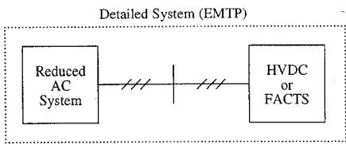  
(a)

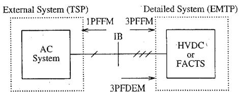  
(b)

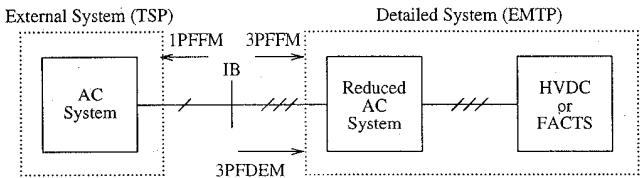  
Fig. 1: Variations for HVDC/FACTS System Transient Analysis

(c)

# LEGEND

1PFFM : Single Phase Fundamental Frequency Model

3PFFM : Three Phase Fundamental Frequency Model

3PFDEM : Three Phase Frequency Dependent Equivalent Model

IB: Interface Bus (Single or Multiple)

# Detailed and External Systems

Because of the computational problems involved in solving the entire power system network in detail, it is necessary to identify the areas of concern for a particular disturbance as the 'detailed system'. The remaining parts of the power network are named the 'external system'. The buses at which these two systems interact are designated as 'interface buses'.

The identification of a detailed system is completely dependent on the system configuration and the disturbance under study. For example, to simulate an ac fault adjacent to the dc system, the dc system has to be modeled in detail, while the amount of ac system to be included for detailed study depends upon factors such as Waveform distortion and phase imbalance at the interface buses.

In the case of an ac/dc system, if the interconnected ac systems are weak relative to the dc power rating, the harmonic distortion at the converter buses is more prevalent which rules out the possibility of taking the converter buses as interface buses. It has been found that the same considerations apply to FACTS controllers.

For unsymmetrical faults at or near to the converter buses, the problem of waveform distortion is compounded by phase imbalance. EMTP analysis cannot therefore be interfaced with TSP through a fundamental frequency equivalent model.

On the other hand, TSP simulation can be satisfied by a positive sequence, single phase equivalent, extracted from EMTP, since ac dynamics are mainly dependent on variations in power at fundamental frequency.

Problems in achieving the proper interaction of the TSP with EMTP detailed analysis are:

- Modeling of an equivalent for the external system in the detailed analysis.   
- Modeling of an equivalent for the detailed system in the transient stability program.   
- The frequency and the methodology of interaction between TSP and EMTP detailed analysis.

The methods for resolving these problems are discussed in the following sections.

# Representation of the External System in EMTP

The interaction of the external system with the detailed system is most authentic if the external system can be reduced to a Thevenin and/or Norton frequency dependent equivalents at the interface buses. This is because frequency dependent equivalents of ac networks are capable of representing the original ac system response, over a wide range of frequency spectrum [11][12]. Frequency dependent network equivalent methods are well established [11][12], and the above requirements can be achieved by such methods as detailed in [10].

The general structure of the frequency dependent equivalent model, for an ac system with $N$ series resonance points and $N - 1$ parallel resonance points, is shown in Fig. 2. The equivalent Norton source is connected to the circuit input nodes (i.e. the interface buses).

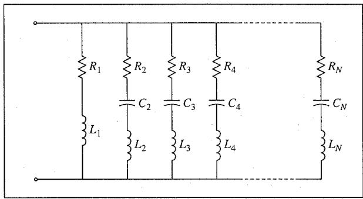  
Fig. 2: Frequency-Dependent Equivalent Model

# Representation of the Detailed System in TSP

As the EMTP solution is on a 3-phase basis, any equivalent obtained from the detailed simulation has to be converted to a single-phase phasor equivalent. In a transient stability program, loads can be variously modeled starting from simple constant impedance representation to the more complex representations (e.g. current source, exponential terms, etc.). In the TSP used for this work two options are available. The first option represents the detailed system as decoupled loads at the interface buses. Fig. 3 shows the TSP network for a general case with several interface buses. The second option is achieved by replacing the loads in Fig. 3 by current sources.

The options require the fundamental phasor currents and voltages to be derived from the detailed solution of the waveforms at the interface buses. A least squares curve fitting technique extracts the fundamental magnitude and phase from the succession of data points for all 3 phases at each interface bus. From these, positive sequence voltages and currents are computed conventionally.

# IV. COORDINATION OF TSP AND EMTP

A methodology for updating the TSP, using the EMTP solution and vice versa under two different interaction scenarios, will be described in the following section.

# Interaction Methodology (A)

It is assumed that no dynamic study is required past the first swing transient period and both TSP and EMTP will terminate simulation at the same time. The TSP/EMTP time step coordination procedure is as follows:

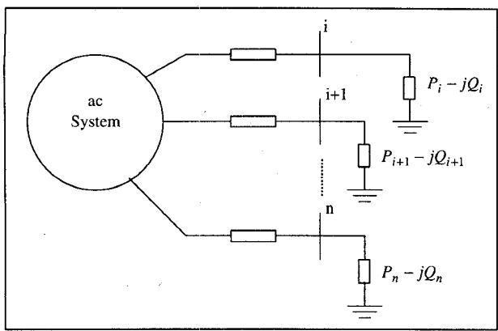  
Fig. 3: TSP System with Load Models for EMTP System

- Starting from time $t = 0$ , the EMTP and TSP time-steps are shown in Fig. 4. The procedure begins by executing the EMTP and TSP from $t = 0$ to $t = T_1$ with a steady-state initial starting point.   
- The Norton equivalents for the external system are obtained at $T_{1}$ and are transferred to EMTP.   
- The EMTP is executed for detailed simulation from $T_{1}$ to $T_{2}$ using the Norton equivalents obtained from TSP at $T_{1}$ . For updating the load representation (current source) in TSP at $T_{1}$ , the accumulated EMTP data points from $t = 0$ to $t = T_{2}$ are processed using the curve fitting algorithm to obtain a fundamental phasor value.   
- The TSP is executed one time-step (i.e. until $T_{2}$ ) starting at $T_{1}$ using the updated load representation at $T_{1}$ .   
- The Norton equivalents are obtained for the external system at $T_{2}$ and are transferred to EMTP.   
- The EMTP is executed from $T_{2}$ to $T_{3}$ using the Norton equivalents obtained from TSP at $T_{2}$ . The EMTP data points from $T_{1}$ to $T_{3}$ are processed to obtain a phasor value for updating the load representation in TSP at $T_{2}$ .   
- The above procedure is repeated until the EMTP/TSP execution are terminated.

# Interaction Methodology (B)

This simulation scenario pertains to system studies where longer term dynamic simulation of the system is required. This implies that simulation runs extending to $1 - 10\mathrm{s}$ may be required.

In this simulation strategy the user is assumed to have some a priori knowledge of the simulated system. For example, from previous experience of HVDC system simulation [16][17], and for an ac fault disturbance at the converter bus (rectifier or inverter), it is possible to restore the quasi steady-state dc system conditions in $300 - 500\mathrm{ms}$ . Based on such information, the user can set up the EMTP data case for a period of detailed transient simulation, after which it initializes a quasi steady-state model of the detailed system in TSP, and then EMTP simulation can be suspended. Assuming all the fast transients of the detailed system have settled, the slower system dynamics can then be accommodated by the TSP quasi steady-state simulation alone. EMTP simulation time of option (A) is suspended, after the detailed system quasi steady-state model in TSP has been initialized, and TSP simulation alone continues.

The major advantages expected from this option are: (a) the capability of performing both transient and long term dynamic studies using one simulation run, and (b) the approach is computationally more efficient.

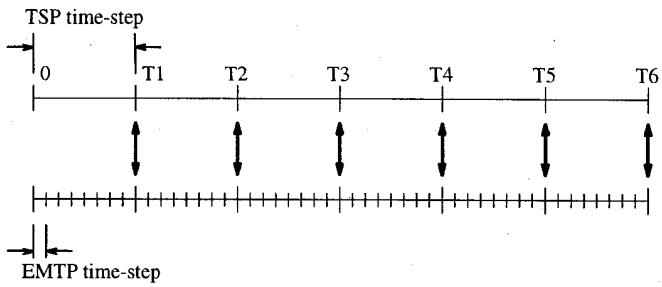  
Fig. 4: Coordination of the EMTP and TSP

# V. HVDC TEST CASES

The new concept of TSP and EMTP interactive solution is evaluated with a two terminal back-to-back dc system with an extended 8-bus ac system at the inverter side as shown in Fig. 5. The test cases described below employ the TSP/EMTP interaction based on methodology (A).

# Case (1): EMTP Simulation Alone

The entire system is modeled in EMTP. A 3-cycle three-phase fault is applied at the inverter ac bus. Selected inverter waveforms are shown in Fig. 6(a). The system recovery from the disturbance is realistic and represented in detail. This case will be used as a benchmark for the next case.

# Case (2): TSP/EMTP New Concept

The EMTP and TSP simulation domains are segregated by the dashed line on Fig. 5(b). The TSP ac system is modeled by a Norton frequency dependent equivalent (NFDE) at the interface buses. The NFDE was derived from the frequency response of the external ac system at the interface buses (3 and 8), when it is disconnected from the detailed model. The impedance-magnitude diagram as seen from the interface buses is shown by the solid line in Fig. 7. The frequency response of derived NFDE circuit is shown by the dotted line in Fig. 7. The results for this case are shown in Fig. 6(b). The transient behavior of the dc system in this case seems to be authentic, as the waveforms during the transient period have maintained a close approximation to the original system modeled in Case (1).

# VI. FACTS TEST CASES (TCSC)

The TSP/EMTP interactive simulation is evaluated with a fault study on a 12 bus ac test system including a TCSC controller as shown in Fig. 8. Test cases involving larger ac systems (e.g. the IEEE 118 bus, and 30 generator system) with TCSC controller, have also been performed and reported in [10].

# TCSC Model

Basing the TCSC on the Slatt [13] and Kayenta [14] installations provides some validation with published performance data and will perhaps place the method into more interesting perspective. The modeling details for the device and its control can be found in [10]. The TCSC circuit per phase, used for this test system, is shown in Fig. 9.

# Case (1): EMTP Simulation Alone

The test system of Fig. 8 has been initialized with the TCSC reactance of $-\mathrm{j}22.5\Omega$ (capacitive) at a thyristor conduction angle of $43^{\circ}$ . This corresponds to $15\%$ compensation of the line between buses 1 and 2, which has a reactance of $150\Omega$ . The ac machines for this case are modeled by simple voltage sources and the entire system of Fig. 8 is modeled in EMTP. The transient response to a three phase fault at bus 1, applied at $\mathfrak{t} = 250~\mathrm{ms}$ , is shown in Fig.

10(a). The fault cleared after 3 cycles. The following can be noted from the waveforms: (a) The capacitor voltage waveforms indicate the operation of the protective arrester after fault application, and re-insertion of the capacitor, in order to limit the capacitor voltage; (b) The feature of fast valving the TCSC [14], has been utilized to cancel out the induced dc offset in the line current due to capacitor re-insertion. The offset was removed in 2 cycles following fault clearance; (c) During the fault the disturbed thyristor conduction together with arrester action affects the transient amount of series compensation. The behavior is highly non-linear; (d) following the fault clearance, the TCSC has a recovery response over several cycles, comparable to an equivalent response in [14].

# Case (2): TSP/EMTP Methodology (A)

In this case only the ac line connecting buses 1 and 2, with the TCSC, are modeled in EMTP as indicated by the dotted box of Fig. 8. The rest of the system is modeled in TSP, with machines modeled in detail (d-axis transient model and with the IEEE type 1 excitation system). The TSP system has been represented by a Norton frequency dependent equivalent in EMTP, while the EMTP system is modeled by a current sources at the interface buses (1 and 2). The agreement between the transient behavior of this case with the benchmark case (1) is evident from Fig. 10(b). The recovery of the TCSC is not predictable without detailed EMTP modeling. The effect on machine dynamics are evident in the next case.

# Case (3): TSP/EMTP Methodology (B)

The simulation is run with methodology (B). Extending the simulation to $4\mathrm{~s}$ , demonstrates the impact on machine dynamics beyond the first swing. At time $0.6\mathrm{~s}$ (indicated by the dashed line in Fig. 11) the EMTP solution has been suspended and TSP simulation continued with a quasi steady-state model of TCSC, for $4\mathrm{~s}$ . As the transient waveforms are exactly the same as case 2, only the machine swings of the system generators are shown in Fig. 11. The major advantage of this methodology is its computational efficiency for long term dynamics. As shown in the next section, this aspect is much more important for typically large utility systems rather than the relatively small test system.

# VII. COMPUTATIONAL EFFICIENCY

Table 1 gives a CPU time comparison between the three cases of section (VI), for a simulation period of $4\mathrm{s}$ on Sun Sparc Station 10, running SUNOS 4.1.3. Because of the simple machine model (voltage source), the EMTP alone case has a better CPU time performance in comparison to TSP/EMTP method (A), where a detailed machine model is used. However the computational superiority of methodology (B) over the others is evident.

To further validate the computational performance of the developed methods for large ac systems, TSP/EMTP methods (A) and (B) were applied in transient studies involving the TCSC FACTS controller modeled within the IEEE 118 bus and 30 generator system. Only the transmission line with TCSC controller has been modeled in EMTP, while the rest of the system is modeled in TSP. A seventh order detailed generator model with IEEE type 1 excitation system has been used for all the 30 generators in the system. An EMTP alone simulation of such a system would be impractical, and therefore was excluded. The fault studies and the transient/dynamic behavior of the IEEE 118 bus system are available in [10].

Table 2 provides a comparison between the computation times for methods (A) and (B), for a 4 s simulation of the IEEE 118 bus system. Again the computation efficiency of TSP/EMTP method (B) is apparent.

Table 1: Computation Times for Test System of Fig. 8.   

<table><tr><td>Method</td><td>Time Step</td><td>CPU Time</td></tr><tr><td>EMTP Alone</td><td>50 μs</td><td>109.0 s</td></tr><tr><td>TSP/EMTP (A)</td><td>8 ms/50 μs</td><td>151.7 s</td></tr><tr><td>TSP/EMTP (B)</td><td>8 ms/50 μs</td><td>44.3 s</td></tr></table>

Table 2: Computation Times for IEEE 118 Bus System [10].   

<table><tr><td>Method</td><td>Time Step</td><td>CPU Time</td></tr><tr><td>TSP/EMTP (A)</td><td>10 ms/50 μs</td><td>1106.0 s</td></tr><tr><td>TSP/EMTP (B)</td><td>10 ms/50 μs</td><td>277.0 s</td></tr></table>

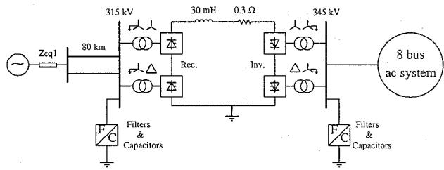  
(a)

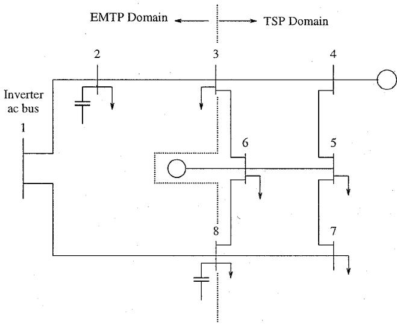  
(b)   
Fig. 5: Test System:(a) Complete System, (b) 8-Bus System Connected to the Inverter Bus

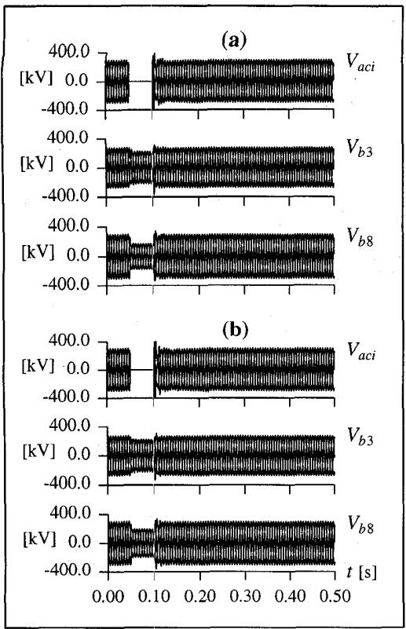

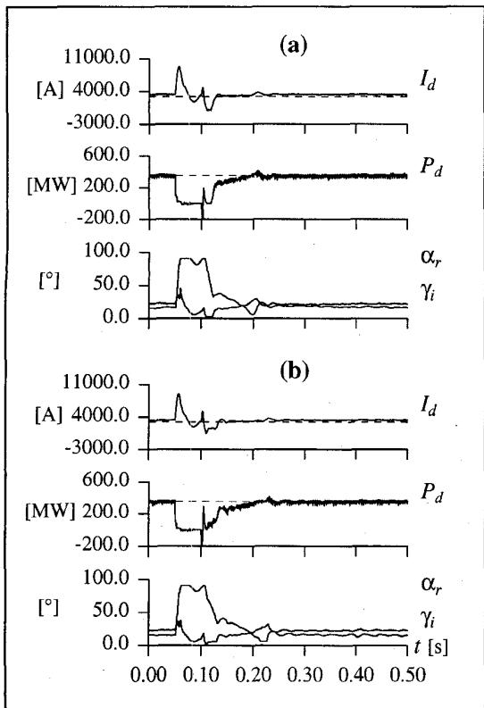  
Fig. 6: HVDC Simulation Waveforms: (a) Case (1), (b) Case 2

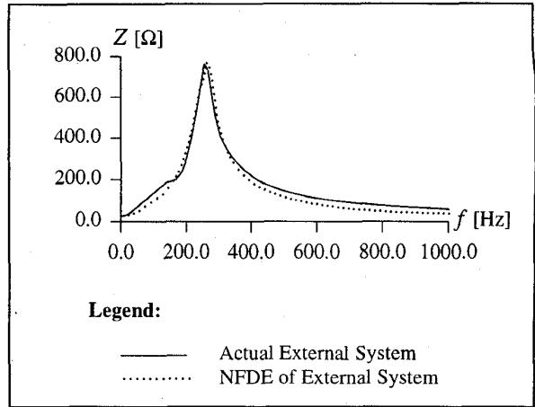  
Fig. 7: External System and its Equivalent Impedance-magnitude frequency diagram

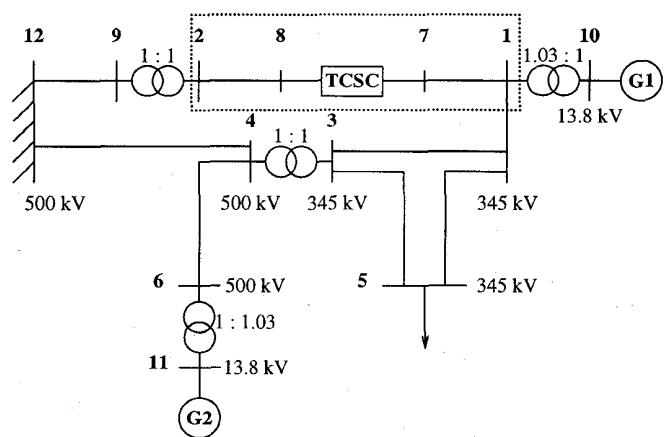  
Fig. 8: 12 Bus ac Test System with TCSC

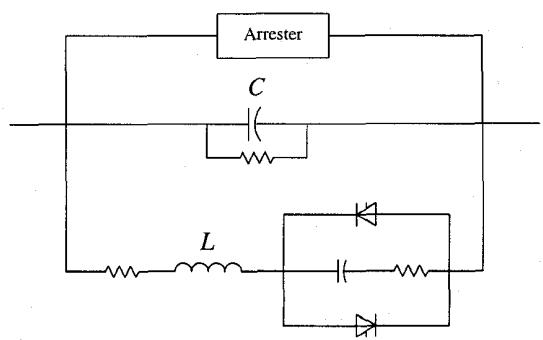  
Fig. 9: EMTP Model of TCSC per phase

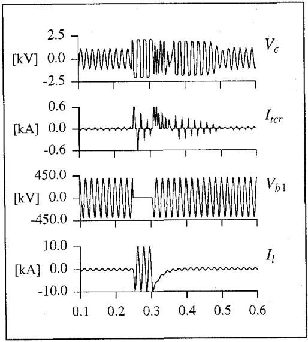  
(a)

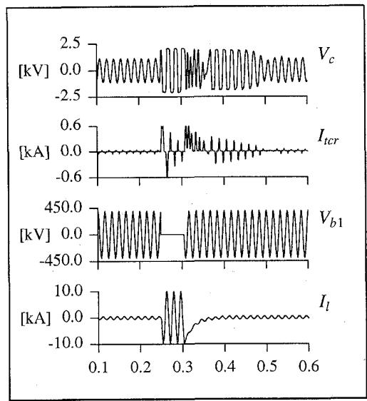  
(b)   
Fig. 10: TCSC Simulation Waveforms: (a) Case (1), (b) Case (2)

# VIII. PRINCIPAL SYMBOLS

$V_{\mathrm{aci}}$ inverter ac voltage

$V_{b3}$ bus 3 ac voltage, Fig. 5

$V_{b8}$ bus 8 ac voltage, Fig. 5

$I_{d}$ dc current

$P_{d}$ dc current

$\alpha_{r}$ rectifier firing angle

$\gamma_{i}$ inverter extinction angle

$t$ simulation time

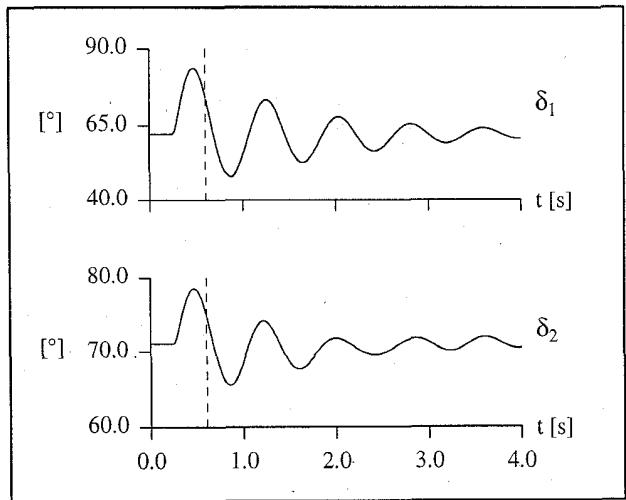  
Fig. 11: Machine angles: TCSC Case (3)

$V_{c}$ capacitor voltage, Fig. 9   
$I_{tcr}$ thyristor controlled reactor current, Fig. 9   
$V_{b1}$ bus 1 ac voltage, Fig. 8   
$I_{l}$ line current between buses 1 and 2, Fig. 8   
$\delta$ machine angle

# IX. CONCLUSIONS

The complex transient behavior of HVDC and FACTS (commutation failures, over-voltages, arrester operation, control transients, etc.) in EMTP is successfully incorporated into TSP. Recovery of FACTS device from a disturbance requires a detailed modeling. This behavior is not predictable by a fundamental frequency phasor model typical of TSP studies.

The dynamic response of the ac machines, in TSP, is authentically incorporated in EMTP by a time varying frequency dependent equivalent of the external system.

The methodology provides a means of enhancing the accuracy of transient stability programs, particularly where stability margins are critical. The ability to switch between an EMTP model and TSP model of the FACTS controller or HVDC enhances the simulation efficiency while preserving transient accuracy.

The concurrent accessibility to the TSP variables permits incorporation of control signals and modulation signals to systems such as HVDC and TCSC. A paper describing this facility for a new TCSC optimal control strategy based on TSP system states is currently under preparation for future publication.

It is clear that the future prospect of an increasingly diverse power systems, in terms of conventional equipments enhanced by an array of FACTS controllers, will require correspondingly enhanced study tools. The described new method is intended for this role.

# X. ACKNOWLEDGMENTS

The financial support of the EPRI of U.S.A. and the NSERC of Canada is acknowledged.

# XI. REFERENCES

1. J. Reeve and S.P. Lane-Smith, "Integration of Real-Time Controls and Computer Programs for Simulation of Direct Current Transmission", IEEE Paper 89 SM 789-9-PWRD, July 1989.   
2. D.A. Woodford, (et. al.) "Digital Simulation of DC Links and AC Machines", IEEE Trans. - PAS, Vol. PAS-102, No. 6, pp 1616-1623, June 1983.   
3. D.A. Woodford, "Validation of Digital Simulation of DC Links", IEEE Trans. - PAS, Vol. PAS-104, No. 9, pp 2588-2595, Sept. 1985.   
4. K. S. Turner, (et. al.) "Computation Of AC-DC Disturbances, Part II: Derivation of Power Frequency Variables From Converter Transient Response", IEEE Trans. - PAS, Vol. PAS-100 No. 11, pp 4349-4355, Nov. 1981.   
5. J. Reeve and R. Adapa, "A New Approach to Dynamic Analysis of AC Networks Incorporating Detailed Modeling of DC Systems. Part I: Principles and Implementations", IEEE Trans. - PWRD, Vol. PWRD-3, No. 4, pp 2005-2011, Oct. 1988.   
6. R. Adapa, J. Reeve, "A New Approach to Dynamic Analysis of AC Networks Incorporating Detailed Modeling of DC Systems. Part II: Application to Interaction of DC and Weak AC Systems", IEEE Trans. - PWRD, Vol. PWRD-3, No. 4, pp 2012-2019, Oct. 1988.   
7. A. Semlyen, M.R. Iravani "Frequency Domain Modeling of External Systems in an Electro-Magnetic Transients Program", IEEE Paper 92 WM 304-6 PwRS, 1992.   
8. P. Lehn, J. Rittiger, B. Kulicke "Comparison of the ATP Version of the EMTP and the NETOMAC Program For Simulation of HVDC Systems", IEEE Trans. - PWRD, Vol. 10, No. 4, pp 2048-2053, Oct. 1995.   
9. G.W.J. Anderson, (et. al.), "A New Hybrid AC-DC Transient Stability Program", International Conference on Power Systems Transients, Lisbon, 3-7 Sept. 1995.   
10. M. Sultan, J. Reeve and R. Adapa "Transient Behavior of Systems Containing FACTS Devices", EPRI Final Report, TR-108191, July 1997.   
11. N. G. Hingorani, (et. al.) "Simulation Of AC System Impedance In HVDC system Studies", IEEE Trans. - PAS, Vol. PAS-89, No. 5/6, pp 820-828, May/June 1970.   
12. A. S. Morched, (et. al.) "Transmission Network Equivalents For Electro-magnetic Transients Studies", IEEE Trans. - PAS, Vol. PAS-102, No. 9. pp 2984-2994, Sept. 1983   
13. S. Nyati, (et. al.) "Effectiveness of Thyristor Controlled Series Capacitor in Enhancing Power System Dynamics: An Analog Simulator Study", IEEE Paper 93 SM 432-5 PWRD, 1993.

14. R.A. Hedin, (et. al.) "Advanced Series Compensation (ASC) - Transient Network Analyzer Studies Compared with Digital Simulation Studies", EPRI Flexible AC Transmission Systems Conference, Boston, May 18-20, 1992.   
15. M. Sultan and J. Reeve "Developments in Detailed EMTP Representation of FACTS Devices in a Transient Stability Program", Proceedings of CIGRE International Colloquium on HVDC and FACTS, Montreal, Sept. 1995.   
16. J. Reeve and M. Sultan, "Gain Scheduling Adaptive Control Strategies For HVDC Systems to Accommodate Large Disturbances", IEEE Trans. - PwRS, July 1994.   
17. J. Reeve and M. Sultan, "Robust Adaptive Control of HVDC Systems", IEEE Trans. - PwRS, February 1994.   
18. M. Sultan, (et. al.) "Authentic Representation of HVDC and FACTS for Transient Stability Assessment", The Future of Power Delivery Conference of EPRI, Washington, DC., April 9-11, 1996.

# BIOGRAPHIES

M. Sultan (M, 97) - received the B.Sc. degree in Electrical Engineering from the University of Garyounis, Benghazi, Libya in 1985. He received the M.A.Sc. and Ph.D. degrees, in Electrical Engineering from the University of Waterloo, Ontario, Canada in 1991 and 1996 respectively. Prior to joining the University of Waterloo for graduate studies he was with the Technical Department of Sirte Oil Company of Libya. He is currently a consultant Engineer with the Advanced Systems Group of Hatch Associates, Ontario, Canada. His main areas of interest are FACTS, HVDC, and Power Quality.

J. Reeve (F, 81) - received the B.Sc., M.Sc., Ph.D. and D.Sc. degrees from the University of Manchester, England. After employment with the English Electric Company, Stafford, involved in the development of protective relays, and 6 years as a faculty member at the University of Manchester Institute of Science and Technology, he has been with the University of Waterloo, Ontario, Canada since 1967, and is currently an adjunct professor in the Department of Electrical and Computer Engineering. His research interests for 30 years have been centered mainly on aspects of dc power transmission. He is a Past Chairman of the IEEE DC Transmission Subcommittee and is currently a member of several IEEE and CIGRE Working Groups and task forces concerned with dc transmission. Dr. Reeve is President of John Reeve Consultants Ltd. He was the recipient of the IEEE Uno Lamm HVDC Award in 1996.

R. Adapa (SM) - received his B.S.in Electrical Engineering from Jawaharlal Nehru Technological University, Kakinada, India in 1979. He obtained his M.S. in Electrical Engineering from the Indian Institute of Technology, Kanpur, India in 1981. He received his Ph.D. in Electrical Engineering from the University of Waterloo, Ontario, Canada in 1986. Dr. Adapa joined the EPRI, Palo Alto, California in June 1989. At EPRI, he has been working as Manager, Power System Planning, in Grid Operations and Planning Business Area of the Power Delivery Group. Prior to joining EPRI, he was a staff Engineer in the Systems Engineering Department of McGraw-Edison Power Systems (presently known as Cooper Power Systems), Franksville, Wisconsin.