# Z-Tool: Frequency-domain characterization of EMT models for small-signal stability analysis ⋆

Francisco Javier Cifuentes Garcia a,b,∗, Jef Beerten a,b

a Department of Electrical Engineering (ESAT-ELECTA), KU Leuven, 3000, Leuven, Belgium   
b Etch by EnergyVille, 8310, Genk, Belgium

# a r t i c l e i n f o

Keywords:

AC/DC power systems

Admittance measurement

Black-box

Multi-terminal scan

MMC HVDC

# a b s t r a c t

This paper presents a novel frequency-domain identification tool based on Electromagnetic Transient (EMT) simulations: Z-tool. This is the first open source program offering a versatile automated scan and state-of-theart small-signal analysis of multi-terminal AC, DC and AC/DC power systems. The approach is introduced with an emphasis on implementation aspects and its use for stability assessment. Furthermore, the stability analysis capabilities are illustrated in a subsynchronous oscillation screening study. In addition, refinements to decrease the runtime, such as multi-frequency excitation and the exploitation of symmetry properties, are described and demonstrated for different systems. The identification error is time-step-dependent due to the nature of EMT routines. Moreover, the trade-off between significant time-savings, achieved by adopting the proposed developments, and loss of accuracy are quantified for basic power system components offering a useful guideline for their applicability and parameter selection.

# 1. Introduction

To ensure stable integration of renewable energy sources (RES) and High Voltage Direct Current (HVDC) systems interfaced via power electronic (PE) converters, detailed representation of converter dynamics is crucial, as these could negatively interact across a wider frequency range than legacy power system equipment, as demonstrated in numerous actual incidents [1]. Moreover, small-signal stability is a prerequisite for transient or large-signal stability, since it corresponds to the majority of the operational time, and most real-life interaction issues have a small-signal origin [1]. To this end, frame transformations are typically employed to describe the system dynamics by time-invariant continuous-time non-linear differential equations in a state-space (SS) model, which is then linearized for the application of modal analysis [2]. However, state-space approximations of practical converter controls, which are of discrete nature and often involve time delays, and of the electromagnetic properties of power systems assets, such as the distributed nature of transmission lines and cables, entail a high level of complexity and very high model order [3–6]. In addition, the disperse nature of RES, as opposed to large-scale centralized power plants based on synchronous generators (SG), requires more modular stability analysis methods which can handle a selective range of dynamic phenomena, different topologies and subsystem aggregation depending on the

scope of study. Furthermore, original equipment manufacturers of RES power plants and HVDC stations generally provide black-box models to preserve their intellectual property rights [7,8]. These detailed models, which might not have an available analytical counterpart, are used in Electromagnetic Transient (EMT) programs such as PSCAD and EMTP-RV to evaluate their dynamic performance via time-domain simulations. However, performing root-cause analysis of small-signal interactions via time-consuming EMT simulations is neither efficient nor always possible. Contrary to SS models, frequency-domain (FD) models can more accurately describe distributed parameter transmission assets and blackbox converter controls involving time-delays [9,10]. Additionally, FD analysis can be performed at different electrical nodes, allowing for modularity in how components are grouped together [11–13]. Moreover, specific dynamic phenomena can be studied by just selecting the frequency range of interest, e.g. subsynchronous torsional interactions. In addition, the participation factors of specific components on the oscillatory modes can be captured by FD analysis [14–16]. Therefore, FD methods appear as a scalable and proven alternative to the SS approach, unveiling insights otherwise inaccessible via time-domain simulations. Although FD analysis of power systems is well documented and it has been used successfully in actual engineering projects [13,17–21], currently there is not a standardized approach for FD characterization of EMT models. Contrary to the existing harmonic impedance calculations

in commercial EMT packages, such as DIgSILENT PowerFactory’s Frequency Sweep Calculation, which do not consider the dynamic impact of PE, electrical machines and controls, the admittance and impedance matrices for small-signal analysis need to precisely capture those dynamic characteristics.

This paper fills this gap by presenting a novel EMT-based system identification methodology for AC, DC and hybrid AC/DC systems implemented in the open-source Z-tool1. Moreover, simplifications allowing for a more efficient characterization are introduced and their accuracy discussed. Several study cases demonstrate the efficacy of the Z-tool package to seamlessly measure any FD admittance and carry-out stability analysis. Overcoming the shortcomings of other implementations, such as limitation to single-terminal analysis and overlooking of AC/DC couplings [22–26], the Z-tool is capable of fully characterizing any AC and/or DC multi-terminal system, including the 3×3 AC/DC admittance of HVDC converters, thereby enabling a flexible analysis of modern power networks with high PE penetration.

The rest of the paper is structured as follows. Section 2 introduces the proposed FD identification approach. Section 3 develops an improvement for dq-symmetric systems, studies the accuracy implications of different parameters and examines an interaction study involving a VSC connected via a long transmission line with series compensation. Section 4 validates the approach for the case of an MMC-HVDC station. Lastly, Section 5 summarizes the contributions of the paper.

# 2. System identification approach

In the following, the basic considerations for the system modeling and the proposed FD identification procedure are outlined together with their implementation aspects.

# 2.1. Frame selection for three-phase systems

The $d q$ frame is usually adopted for modeling and studying AC systems as their steady-state periodic trajectories can more conveniently be described by constant quantities [2]. Furthermore, it simplifies the analysis by inherently capturing frequency coupling effects without requiring explicit handling of frequency shifting caused by machines and controls’ asymmetries, unlike sequence quantities [19,20]. The employed amplitude-invariant ??????-to-???? transformation is (1), corresponding to a ????-frame with the ??-axis aligned to the phase ?? voltage and the ??-axis lagging the ??-axis.

$$
T _ {d q} (\theta) = \frac {2}{3} \left( \begin{array}{c c c} \cos (\theta) & \cos (\theta - 2 \pi / 3) & \cos (\theta + 2 \pi / 3) \\ \sin (\theta) & \sin (\theta - 2 \pi / 3) & \sin (\theta + 2 \pi / 3) \end{array} \right) \tag {1}
$$

# 2.2. Introduction to the proposed approach

Contrary to implementations based on shunt current injections or series voltage perturbation in [22–24,27], we propose an effective subsystem decoupling by directly connecting controlled shunt voltage sources as illustrated in Fig. 1. The voltage sources are ideal, i.e. they present zero impedance, controlled so as not to alter the operating point and inserted in the circuit through an ideal breaker. When the binary variable freeze is 1, the steady-state values are sampled and held, and the breaker is closed. After the decoupling, a snapshot is taken to speed up subsequent simulations as illustrated in the general flowchart of the tool in Fig. 2. This decoupling is a prerequisite for more detailed FD analysis since the objective is to capture the standalone or open loop dynamic characteristics of the different components and subsystems. In contrast with existing methods, the proposed approach enables the study of unstable interconnected systems as the ideal sources guarantee stable standalone operation. In addition, the voltage-based injection facilitates the selection of the perturbation amplitude because normal voltage ranges

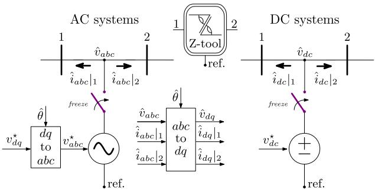

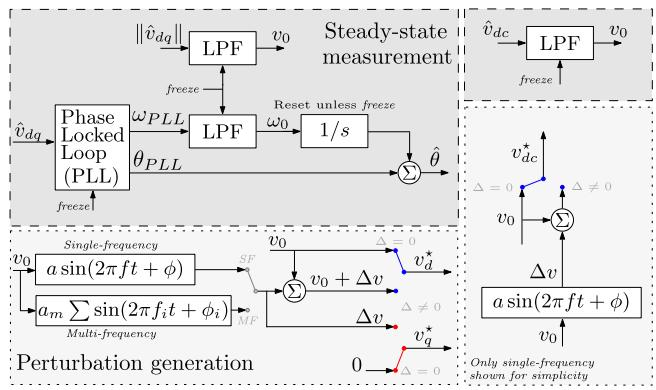  
Fig. 1. Steady-state, decoupling and perturbation generation.

in per unit are less dependent on the assets’ ratings than currents. Furthermore, among the different practical perturbation signals, e.g. pseudo random binary sequence (PRBS), chirp, etc., sinusoidal perturbations are adopted due to their limited energy band, high signal-to-noise ratio, straightforward implementation, simple relation to the Fast Fourier Transform (FFT) parameters and robustness [28].

In addition, from a linear algebra perspective, the necessary sinusoidal perturbation sets at each frequency to identify any subsystem, i.e. the number of required linearly independent perturbation vectors at every frequency, is given by its FD input/output description’s dimensionality. Since AC components are fully described by ????-frame quantities, and DC nodes by ???? quantities, these variables define an orthogonal vector space. For instance, for a single AC bus scan only two linearly independent (orthogonal) perturbations are required at each frequency, which for simplicity are selected as the standard basis, i.e. $\Delta \pmb { v } _ { 1 } = [ \Delta v , 0 ] ^ { \mathrm { T } }$ and $\Delta \boldsymbol { v } _ { 2 } = [ 0 , \Delta v ] ^ { \mathrm { T } }$ as shown in Fig. 1. Another example is an overhead line (OHL) between two buses, defined in the FD by a 4×4 ????-frame matrix relating the $d q$ voltages to the currents at both buses, which requires 4 linearly independent voltage perturbation vectors again selected as its standard basis, i.e. $\begin{array} { r } { \Delta \pmb { v } _ { 1 } = [ \Delta v , 0 , 0 , 0 ] ^ { \mathrm { T } } } \end{array}$ , $\Delta \boldsymbol { v } _ { 2 } = [ 0 , \Delta v , 0 , 0 ] ^ { \mathrm { T } } , \ldots , \Delta \boldsymbol { v } _ { 4 } = [ 0 , 0 , 0 , \Delta v ] ^ { \mathrm { T } }$ . This is generalized for any arbitrary-size AC/DC subsystem where the number and type of nodes simply add to the dimension of its FD matrix representation and its standard basis. To summarize, any ??×?? admittance can be computed via ??-independent ??×1 vectors of currents and voltages by

$$
\mathbf {Y} (j \omega) = \left[ \begin{array}{l l l} \Delta \boldsymbol {i} _ {1} & \dots & \Delta \boldsymbol {i} _ {N} \end{array} \right] \left[ \begin{array}{l l l} \Delta \boldsymbol {v} _ {1} & \dots & \Delta \boldsymbol {v} _ {N} \end{array} \right] ^ {- 1} \tag {2}
$$

Note that (2) holds for every frequency and thus several frequencies can be perturbed at the same time. Moreover, all subsystems are interfaced via a single AC and/or DC connection point. This allows to independently perturb each terminal simultaneously. Therefore, all sources/loads can be identified concurrently, which considerably improves the simulation time for characterizing only the components at the network’s edges, such as machines and power converters. The measurements used to identify the components at the network’s edge can also be employed for the calculation of the interconnecting network’s admittance. Therefore, a greedy algorithm is implemented to schedule all perturbations minimizing the runtime by employing the user-input

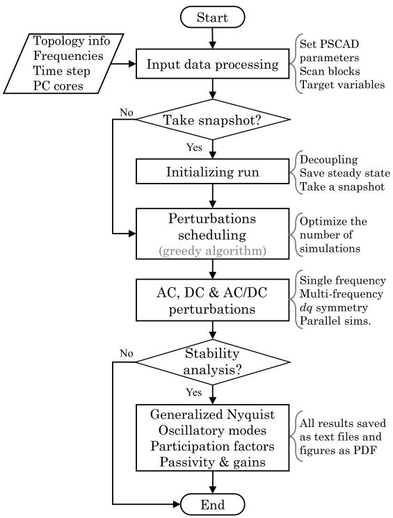  
Fig. 2. General summary of the Z-tool implementation.

topological data. Furthermore, PSCAD parallel computing capabilities are exploited by splitting the simulations across multiple processors.

# 2.3. Steady-state operating point

Since negative sequence voltage and total harmonic distortion (THD) are limited below 2 % by power systems standards [29,30], it can be considered that any normal operating point is dominated by its positive sequence waveform. The magnitude, frequency, and angle of this threephase voltage can be estimated using a conventional PLL. A simple implementation with a low-pass filter (LPF) tuned at 8 Hz is used to retrieve the average system frequency and steady-state phase-to-ground voltage magnitude as illustrated in Fig. 1. The operating point is maintained after connecting the ideal voltage source reproducing the measured voltages. Furthermore, since the PLL is only used to compute the steadystate quantities, it does not have any dynamic impact on the subsequent FD characterization. The steady-state voltage angles are used to rotate the AC and AC/DC admittances to a common frame for multi-infeed studies [31]. In the case of DC systems, the steady state is dominated by the 0 Hz or the constant average term in voltage and current waveforms and thus this low-pass filter is sufficient to remove any harmonic components. Note that, while frequency components other than the fundamental are no longer reflected on the steady-state voltage at the ideal sources, current harmonics can still exist, e.g. due to unbalances, as well as voltages harmonics everywhere in the system but where the ideal sources or analysis points are defined. In addition, the internal periodicity and frequency coupling present in PE components such as MMCs are still preserved. Future work includes retaining a predefined set of characteristic voltage harmonics to account for the impact of harmonic distortion. Subsequently, selected frequency components are added to the steady-state waveforms exciting the sub-systems’ dynamic response as explained next in Sections 2.4 and 2.5.

# 2.4. Single-frequency perturbations

The response of a linear time-invariant system to a single sinusoidal excitation as Δ??(??) = ?? sin (????) is also a sinusoidal at the same frequency

[28]. Note that the time-invariant description in terms of ????-frame quantities, and the lack of frequency coupling among ???? quantities and between $d q$ and DC systems quantities facilitates the application of standard system identification methods. The perturbation amplitude should excite the system enough to effectively register its response while respecting linearity and proximity to the operating point. To this end, a selection of the perturbation amplitude is given as a percentage of the steady-state voltage within the expected normal operating range. The maximum voltage deviation is generally no larger than $\pm 5 \% ,$ , but smaller amplitudes are recommended, specially for voltage-controlling units since this operational mode is more responsive to voltage deviations. In our experience, satisfactory results have been obtained with perturbations ranging from 0.02 % to 2 %.

# 2.5. Multi-frequency perturbations

A general multi-sine or multi-tone perturbation signal with m components is described by (3), where each ??-component has a frequency $\omega _ { i } ,$ , initial phase $\phi _ { i }$ and amplitude $a _ { i } .$ .

$$
\Delta v (t) = \sum_ {i = 1} ^ {m} a _ {i} \sin \left(\omega_ {i} t + \phi_ {i}\right) \tag {3}
$$

To maintain the linear operating regime it is important to minimize the crest factor (CF) of the perturbation signal, $\mathrm { C F } = \operatorname* { m a x } ( | \Delta v ( t ) | ) / \Delta v _ { \mathrm { R M S } } ,$ . Selecting $\omega _ { i } , \phi _ { i }$ ?? and $a _ { i }$ in (3) to minimize its CF for an arbitrary number of frequencies is a complex non-linear problem due to the difficulty in finding the maximum of $| \Delta v ( t ) |$ within its period as the infinity norm of (3) is neither convex nor differentiable [32]. Considering equal amplitude for all frequencies, $a _ { i } = a _ { m }$ , corresponds to a flat spectrum with fixed RMS value, and the infinity norm bounds of (3) given by (4), which lead to the CF range in (5).

$$
\Delta v _ {\mathrm {R M S}} = a _ {m} \sqrt {m / 2}, \quad \max  (\left| \Delta v (t) \right|) \in a _ {m} [ \sqrt {m}, m ] \tag {4}
$$

$$
\mathrm {C F} = \frac {\operatorname* {m a x} (| \Delta v (t) |)}{\Delta v _ {\mathrm {R M S}}} \in [ \sqrt {2}, \sqrt {2 m} ] \tag {5}
$$

The phase of each tone, $\phi _ { i } ,$ , can be selected to reduce the CF with respect to the random phase or zero phase options by Schroeder’s heuristic [33] as $\phi _ { i } = - \pi i ( i - 1 ) / m ,$ , or by Guillaume’s method which iteratively solves a non-linear least-squares problem [34]. In addition, setting $m = 2 ^ { z } , z \in \mathbb { N }$ enables achieving the theoretical minimum ${ \mathrm { C F } } = { \sqrt { 2 } }$ by changing both the initial phase and frequency of each tone as described in [35] for a sampling equal to the Nyquist-Shannon limit. However, attention is needed as methods for CF reduction of discrete signals, i.e. concerning the highest sampled amplitude, might not hold for the continuous case and thus the signals applied in EMT simulations could have higher CF since the integration time-step is larger than the sampling time. This is illustrated in Fig. 3 where $m = 2 ^ { 3 } = 8$ tones are generated according to [35] in blue, and by Schroeder’s heuristic in red. The blue circles representing the sampled signal do not go beyond the minimum bound in (4) while the continuous signal, more closely approximating that applied during EMT simulations, goes out of these bounds. Furthermore, Schroeder’s method shows a lower CF in Fig. 3, and because of the negligible computational time with respect to Guillaume’s method, the phase angles are subsequently chosen following Schroeder’s method. Although the CF minimization problem does not have a closed-form solution, PRBS-based perturbations possessing the lowest CF might be an even faster alternative to multi-sine signals [26].

Furthermore, excessive energy injection should be avoided to respect the small-signal assumption. This can be achieved by setting the amplitude $a _ { m }$ producing the same RMS value as a single-frequency sinusoidal, i.e. $a _ { m } = a / \sqrt { m }$ .

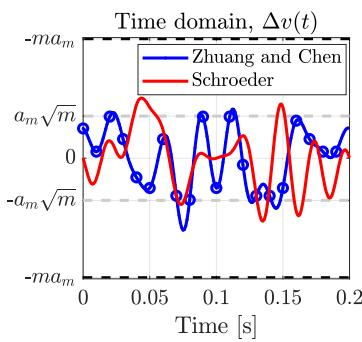

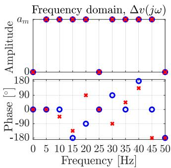  
Fig. 3. Multi-tone example with 8 components generated according to [35] (blue) and Schroeder’s method [33] (red).

# 2.6. FFT considerations

The FFT is at the core of FD identification methods. Thus, its assumptions and parameters are revisited for EMT scans.

# 2.6.1. Sampling frequency, aliasing and resolution

According to the Nyquist-Shannon sampling theorem, a sampling frequency $f _ { s } ,$ larger than twice the bandwidth of the signal ensures no aliasing. If there are frequencies above the Nyquist frequency, $f _ { s } / 2 .$ , they appear as alias in $[ 0 , f _ { s } / 2 ] .$ . Therefore, $f _ { s } \geq 2 f _ { \operatorname* { m a x } }$ ensures that $f _ { \mathrm { m a x } }$ is resolved by the FFT. Slight oversampling might be beneficial, but a too small sampling time would result in unnecessarily large time-domain result files which translate to computational time overhead in opening and reading several hundreds of such files. A recommended sampling frequency is between twice and four times the maximum frequency to be resolved, i.e. $f _ { s } \geq 4 f _ { \operatorname* { m a x } } .$ In addition, the frequency resolution of the FFT is given by the inverse of the length of the recorded signal which imposes a minimum bound on the EMT simulation time. For instance, to scan a system in intervals of 1 Hz, the sinusoidal steady-state response needs to be recorded for at least 1 s.

# 2.6.2. Window and leakage

The FFT assumes periodicity and that the sampled signals contain an integer number of periods. If these conditions are not met, spectral leakage occurs. When the transient system response has died out to negligible levels, the signal can be considered periodic and thus a rectangular window can be used. The duration of the sampled signal is selected as an integer multiple of the base period by default in the Z-tool. This also holds for multi-sine signals: if each tone is an integer multiple of a base frequency, $\omega _ { i } = k _ { i } \omega _ { b } = 2 \pi k _ { i } / T _ { b } , k _ { i } \in \mathbb { N }$ , then $T = T _ { b } / \coth ( k _ { 1 } , \dots , k _ { m } )$ is a period of the signal, where gcd(⋅) denotes the greatest common divider. Since $T \leq T _ { b } ,$ , recording the signal for periods multiples of this base period guarantees no FFT spectral leakage.

# 3. Three phase systems

This section focuses on the particularities of three-phase systems and introduces an improvement exploiting dq-frame symmetry. The method is applied to two representative study cases and several accuracy tests are presented.

# 3.1. Identification simplification for symmetric systems

For ????-symmetric systems, such as those made out symmetrical ????- frame controls and machine parameters as well as certain loads, transmission lines and cross-bonded cables, every 2×2 dq-matrix has the form in (6) [36].

$$
\mathbf {Y} _ {d q} = \left[ \begin{array}{c c} Y _ {d, d} & Y _ {d, q} \\ - Y _ {d, q} & Y _ {d, d} \end{array} \right] = Y _ {d, d} \underbrace {\left[ \begin{array}{c c} 1 & 0 \\ 0 & 1 \end{array} \right]} _ {\mathbf {I}} + Y _ {d, q} \underbrace {\left[ \begin{array}{c c} 0 & 1 \\ - 1 & 0 \end{array} \right]} _ {\mathbf {W}} \tag {6}
$$

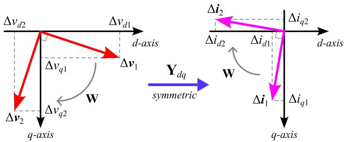  
Fig. 4. Symmetric $\mathbf { Y } _ { d q }$ action on orthogonal ????-voltages.

This symmetry can be exploited to solve for the admittance with half of the general case’s computational effort. From (6), given a first set of measurements, $\Delta \pmb { v } _ { 1 }$ and $\Delta \dot { \pmb { \imath } } _ { 1 } .$ , it follows that a second perturbation vector orthogonal with the first one, e.g. $\Delta v _ { 2 } = \mathbf { W } \Delta v _ { 1 }$ , produces a response $\Delta i _ { 2 } = Y _ { d , d } \mathbf { I } \Delta \pmb { v } _ { 2 } + Y _ { d , q } \mathbf { W } \Delta \pmb { v } _ { 2 } = \mathbf { W } ( Y _ { d , d } \mathbf { I } + Y _ { d , q } \mathbf { W } ) \Delta \pmb { v } _ { 1 } = \mathbf { W } \Delta i _ { 1 }$ . Therefore, by rotating the measurements obtained from a first perturbation, those of the second can be estimated, thus halving the computational time. This process is illustrated in Fig. 4 and can be applied to any ????-frame matrix, including those in larger ??×?? dq-matrices representing multi-terminal networks, as long as the system is approximately symmetric.

Note that ????-symmetric systems exhibit no frequency coupling between positive and negative sequence variables. Hence, under the symmetry consideration this strategy is equivalent to leveraging the relationship between sequence quantities [18] for faster identification by only applying either positive or negative sequence perturbations [27].

# 3.2. Single-terminal application case

Fig. 5 shows the SLD of a study case involving the long-distance connection of a generic two-level VSC model in grid-following (GFL) control with grid-supporting functionalities, i.e. proportional-type (droop) voltage and frequency support of 5 p.u./p.u., feeding a 350 km OHL with series capacitor compensation, which is commonly used to increase transmission capacity [2]. In this setup, subsynchronous oscillations (SSO) might arise depending on the compensation level, and thus the capabilities of the Z-tool are demonstrated via a SSO screening study. Firstly, the custom-made PSCAD library block is inserted at the PCC bus and the frequency sweep parameters are defined. Next, the Z-tool automatically runs the frequency scan of the VSC and grid-side simultaneously, returning the admittances in Fig. 6.

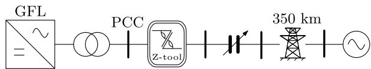  
Fig. 5. Generic 2L-VSC feeding a series-compensated OHL.

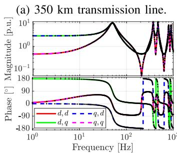

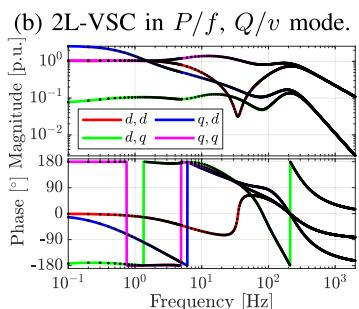  
Fig. 6. Analytical admittances (lines) & Z-tool SF (dots).

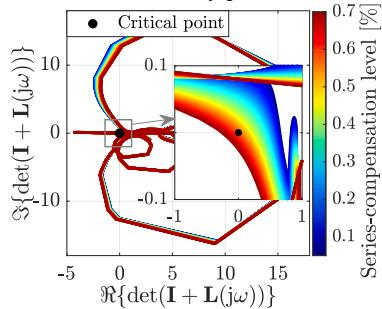  
(a) Generalized Nyquist criterion.

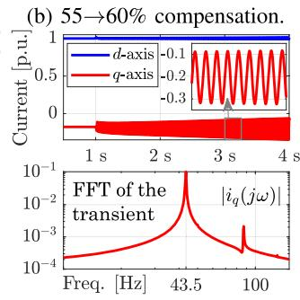  
Fig. 7. Stability analysis results and EMT validation.

Subsequently, a range of series compensation between 5 % and 70 % with 1 % increments is investigated by simply adding the corresponding impedance of the capacitors ?? to the scanned OHL impedance for every frequency $f _ { i } \neq f _ { n }$ as ${ \bf Z } _ { g } = { \bf Y } _ { O H L } ^ { - 1 } + ( j 2 \pi f _ { i } C { \bf I } + 2 \pi f _ { n } C { \bf W } ) ^ { - 1 }$ , where $f _ { n } = 5 0$ Hz is the fundamental frequency. Lastly, assuming no major operation point impact, the identified VSC admittance, $\mathbf { Y } _ { c } ,$ is used to screen for SSO by iteratively applying the GNC to the loop gain formed by the product of the different series-compensated grid-side impedance, $\mathbf { Z } _ { g } ,$ and the VSC admittance, i.e. ${ \mathbf { L } } = { \mathbf { Z } } _ { g } { \mathbf { Y } } _ { c }$ . Since both subsystems are standalone stable, i.e. $\mathbf { Z } _ { g }$ and ?? have no right-half plane poles, their interconnection is stable only if the Nyquist plot neither crosses nor encircles the critical point [37]. This is shown in Fig. 7a, where the curve is closer to encircling the critical point (black dot) as the compensation increases, and instability is predicted above 55 % series compensation. The main oscillatory frequency of 43.5 Hz is also identified by the Ztool at the peak of the eigenvalue decomposition over the frequency of the closed-loop impedance matrix $| \lambda ( \mathbf { Z } _ { g } + \mathbf { Y } _ { c } ^ { - 1 } ) |$ [31,38]. The complete SSO screening study comprising the admittance scan over 120 frequencies between 1 and 100 Hz with a simulation timestep of 10 $\mu \mathbf { S } ,$ and the iterative stability analysis took less than 1 min in a laptop with an Intel® Core™ i9-10885H CPU @ 2.40 GHz 8 cores. The code and models to replicate the study are provided in the Z-tool1 repository. Lastly, the presence of undamped oscillations is verified via non-linear PSCAD simulations in Fig. 7b after increasing the series compensation by 5 % at 1 s, proving the capability of the Z-tool for rapidly performing FD stability analysis.

# 3.3. Multi-terminal application case

In this example, the multi-terminal characterization capabilities of the Z-tool are demonstrated for the four-terminal AC grid in Fig. 8a containing one overhead line (OHL) and two cables of the same configuration but different lengths. Fig. 8 presents the results for the admittance identification for different cases. Fig. 8b displays the admittance obtained by four combinations of the alternatives introduced in Section 2 and Section 3.1: single-frequency (SF) perturbations, SF perturbations leveraging ???? symmetry (SF + sym), multi-frequency (MF) perturbations, and MF perturbations leveraging ???? symmetry (MF + sym). Due to the ????-symmetry a high degree of overlapping occurs, which together with the large number of non-zero entries, 40 out of $8 \times 8 = 6 4$ , make a visual comparison of the methods impractical. Instead, a measure of the frequency-wise error is employed: the relative error between a reference matrix $\mathbf { G } ^ { \star }$ and another matrix ?? can be computed at every frequency by

$$
\varepsilon = \bar {\sigma} (\mathbf {G} ^ {\star} - \mathbf {G}) / \bar {\sigma} (\mathbf {G} ^ {\star}) \tag {7}
$$

where the 2-norm or maximum singular value is noted by ̄?? [39]. This metric is shown in Fig. 8c considering the SF as the reference for the identified network admittance, and its inverse because of its significance for stability analysis. Fig. 8c (left) presents the case of no transposition and no cross-bonding, and Fig. 8c (right) corresponds to the ideally

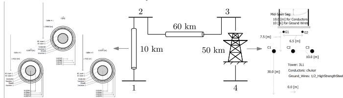  
(a) Test system data and SLD.

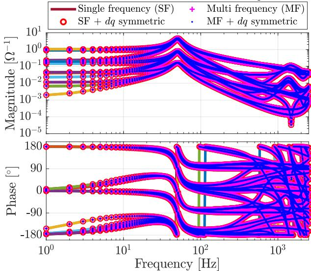  
(b) Identified 8×8 admittance matrix at 40O frequencies.

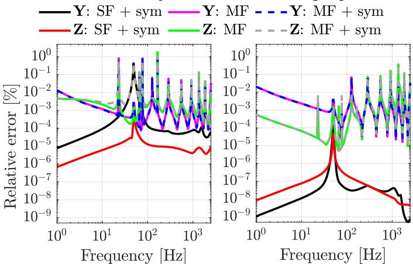  
(c) Normalized error for different frequency-sweeping options under none (left) and ideal transposition and cross-bonding (right).   
Fig. 8. 4T-AC grid admittance identification comparison.

transposed and cross-bonded case. In both cases the largest error corresponds to the multi-frequency sweep assuming symmetry which tops below 2 % in the non-symmetric system at 163 Hz, and below 0.4 % around 1360 Hz for the idealized symmetric case. These results confirm that significant runtime improvements can be achieved with no significant loss of accuracy. In addition, the impact of the EMT simulation timestep on the identification accuracy is an important aspect that needs to be quantified so as to ensure a representative characterization. To evaluate the timestep impact, Fig. 9 compares the relative error between the SF sweep obtained for 20 ??s and 40 ??s with respect to those simulating at 10 $\mu \mathbf { S } .$ Although the error stays well-below 2 % up to around 1 kHz, a peak is observed near the fundamental and a maximum error of 16 % at a double peak near 1.48 kHz and 1.58 kHz, the latter corresponding to a network parallel resonance. This timestep-dependent accuracy is expected due to the nature of EMT programs, specially at higher frequencies as observed in Fig. 9 for excessively large simulation steps.

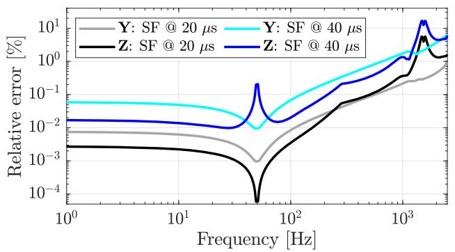  
Fig. 9. Simulation timestep impact on the accuracy.

# 3.4. Scan parameters sensitivity for a two-level VSC

The same GFL-VSC as in Section 3.2 is now adapted to the widespread constant power control mode to study the impact of the frequency sweep parameters on the scanned admittance. The analytical model (solid lines) in Fig. 10a displays little deviations with respect to the results via SF and MF perturbations over 400 frequency points. However, differences around 100 Hz are visible in the ??, ?? component as the EMT simulation timestep increases. Fig. 10b quantifies this dependency by computing the relative error via (7) with respect to the analytical model considering five different simulation timesteps for both SF (solid) and MF (dots) perturbations. The results indicate a consistent relative error increase with higher simulation timestep, while the differences due to the SF or MF remain negligible as the dots overlap the solid lines. Furthermore, Fig. 10c shows that the EMT computational time is approximately reduced by a factor equal to the number of multi-frequency components, eight in this case, while runtime sharply increases as the timestep reduces.

# 4. Hybrid AC/DC systems

The focus of this section is on HVDC converters, and the interested reader is referred to [31] for a complete hybrid AC/DC system study case. HVDC converters have both AC and DC interfaces: the AC-side dynamics can be described by two current and two voltage variables, e.g. dq-frame quantities, while the DC side requires only one current and one voltage to be represented. Therefore, the converter is characterized by a 3 × 3 admittance matrix relating the three AC/DC voltages and currents. It follows from Section 2.2 that three linearly independent voltage perturbations are needed: two at the AC-side, as for three-phase systems, and an additional one at the DC-side, while all currents are recorded. Consequently, the 3 × 3 converter admittance is computed by (2), where the subscripts refer to each linearly independent set of perturbations, here implemented as separated d, q and dc voltage perturbations.

# 4.1. HVDC converter admittance measurement

An arm-averaged MMC model with uncompensated modulation and generic GFL controls is used to evaluate the Z-tool’s built-in AC/DC scan capabilities. The non-linear model is implemented in PSCAD and an analytical multiple ????-frame model as described in [40] is used as reference. Fig. 11 presents the 3×3 AC/DC admittance in per unit between 1 Hz and 1 kHz, characterized by single-frequency (SF) perturbations simulated at 1 $\mu s$ in red dots and given by its analytical model in blue lines. The tested case corresponds to constant power control at nominal voltage and feeding ?? = 0.6 p.u. & $q = - 0 . 2$ p.u. into the AC grid. The results show an excellent match between the analytical admittance and that obtained from the Z-tool. Other tests performed for alternative control modes, e.g. DC-voltage control operation, and with different internal controllers, such as different energy controllers, exhibit a similar agreement.

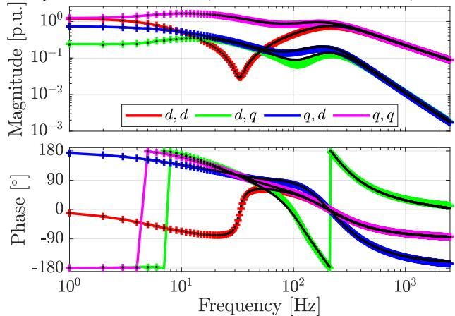  
(a)Analytical (solid), SF @ 1 μs (crosses) and MF @ 10 μs (dots).

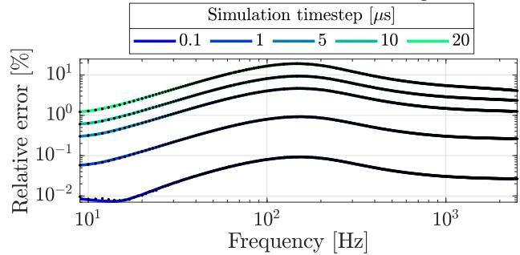  
(b) Normalized error for SF (solid) and MF (dots） perturbations.

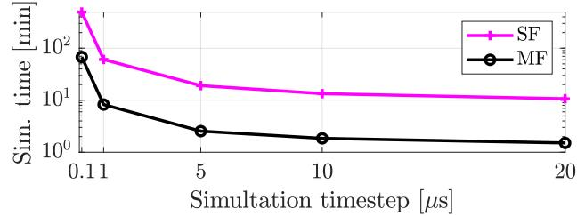  
(c) Scanning time for different timesteps and perturbation signals.   
Fig. 10. VSC admittance identification: parametric study.

# 5. Conclusions

A new frequency-domain admittance measurement method for EMT models implemented in the first open-source package Z-tool has been introduced. This Python-based tool automates the admittance identification for arbitrary systems between any specified electrical nodes, including HVDC converters and black-box models, enabling usage flexibility and simplifying small-signal analysis. Practical system identification considerations related to parameter settings, and improvements for faster computations are presented. Several study cases are covered including AC networks, AC/DC converters, and subsynchronous oscillations analysis with PE converters, validating the approach and providing guidance to other power system practitioners.

# CRediT authorship contribution statement

Francisco Javier Cifuentes Garcia: Writing – original draft, Software, Investigation, Data curation, Writing – review & editing, Validation, Formal analysis, Conceptualization, Visualization, Methodology; Jef Beerten: Writing – review & editing, Resources, Conceptualization, Supervision, Funding acquisition, Project administration.

# Data availability

Data will be made available on request.

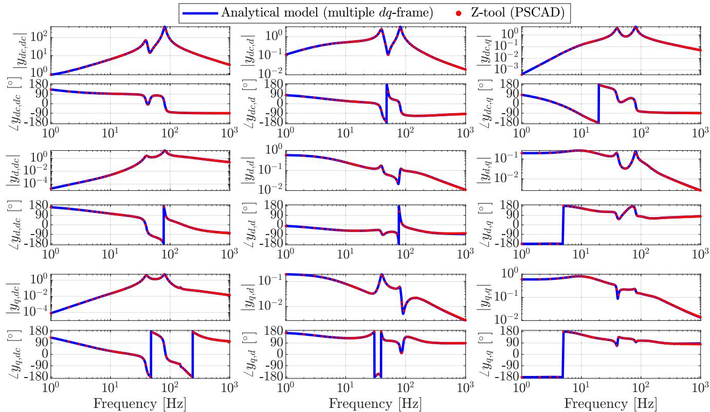  
Fig. 11. AC/DC admittance matrix identification validation for a PQ-controlled MMC-based HVDC station.

# Declaration of competing interest

The authors declare that they have no known competing financial interests or personal relationships that could have appeared to influence the work reported in this paper.

# Acknowledgement

This work was partially supported by the DIRECTIONS project through the ETF, FOD Economie Belgium and project Innovative solutions for underground high-voltage lines and grids, funded by the Flemish Government.

# References

[1] P. De Rua, T. Roose, Ö.C. Sakinci, N. de Morais Dias Campos, J. Beerten, Identification of mechanisms behind converter-related issues in power systems based on an overview of real-life events, Renewable Sustainable Energy Rev. 183 (2023) 113431. https://doi.org/10.1016/j.rser.2023.113431   
[2] P. Kundur, N.J. Balu, Power System Stability and Control, EPRI Power System Engineering Series, McGraw-Hill, 1994.   
[3] J. Beerten, S. D’Arco, J.A. Suul, Frequency-dependent cable modelling for smallsignal stability analysis of VSC-HVDC systems, IET Gener. Transm. Distrib. 10 (6) (2016) 1370–1381. https://doi.org/10.1049/iet-gtd.2015.0868   
[4] S. D’Arco, J.A. Suul, J. Beerten, Time-invariant state-space model of an AC cable by ????-representation of frequency-dependent ??-sections, in: 2019 IEEE PES Innovative Smart Grid Technologies Europe (ISGT-Europe), 2019, pp. 1–5. https://doi.org/10. 1109/ISGTEurope.2019.8905577   
[5] S. D’Arco, J.A. Suul, J. Beerten, Configuration and model order selection of frequency-dependent ?? models for representing DC cables in small-signal eigenvalue analysis of HVDC transmission systems, IEEE J. Emerg. Sel. Top. Power Electron. 9 (2) (2021) 2410–2426.   
[6] P. De Rua, Model Transformations and Periodic Trajectory Calculations for Stability Assessments of Modular Multilevel Converter-Based Systems, Ph.D. thesis, KU Leuven, 2023.   
[7] Working Group C4.56, Electromagnetic Transient Simulation Models for Large-Scale System Impact Studies in Power Systems Having a High Penetration of Inverter-Connected Generation, Technical Brochure 881, CIGRE C4, 2022.   
[8] Working Group B4.81, Interaction between Nearby VSCHVDC Converters, FACTs Devices, HV Power Electronic Devices and Conventional AC Equipment, Technical Brochure 934, CIGRE B4, 2024.

[9] A. Bayo Salas, Control Interactions in Power Systems with Multiple VSC HVDC Converters, Ph.D. thesis, KU Leuven, 2018.   
[10] T. Roose, Small-Signal Modeling and Stability Analysis of Multi-Terminal DC Systems - For Low- and High-Voltage Applications, Ph.D. thesis, KU Leuven, 2023.   
[11] M. Amin, M. Molinas, Small-signal stability assessment of power electronics based power systems: a discussion of impedance- and eigenvalue-based methods, IEEE Trans. Ind. Appl. 53 (5) (2017) 5014–5030.   
[12] H. Liu, X. Xie, W. Liu, An oscillatory stability criterion based on the unified ???? -frame impedance network model for power systems with high-penetration renewables, IEEE Trans. Power Syst. 33 (2018) 3472-3485.   
[13] C. Zhang, M. Molinas, A. Rygg, X. Cai, Impedance-based analysis of interconnected power electronics systems: impedance network modeling and comparative studies of stability criteria, IEEE J. Emerg. Sel. Top. Power Electron. 8 (3) (2020) 2520–2533.   
[14] Y. Zhu, Y. Gu, Y. Li, T.C. Green, Participation analysis in impedance models: the grey-box approach for power system stability, IEEE Trans. Power Syst. 37 (1) (2022) 343–353. https://doi.org/10.1109/TPWRS.2021.3088345   
[15] C. Zhang, H. Zong, X. Cai, M. Molinas, On the relation of nodal admittance- and loop gain-model based frequency-domain modal methods for converters-dominated systems, IEEE Trans. Power Syst. 38 (2) (2023) 1779–1782. https://doi.org/10.1109/ TPWRS.2022.3233759   
[16] L. Orellana, L. Sainz, E. Prieto-Araujo, M. Cheah-Mané, H. Mehrjerdi, O. Gomis-Bellmunt, Study of black-box models and participation factors for the positivemode damping stability criterion, Int. J. Electr. Power Energy Syst. 148 (2023) 108957.   
[17] J.M. Undrill, T.E. Kostyniak, Subsynchronous oscillations part 1: comprehensive system stability analysis, IEEE Trans. Power Apparatus Syst. 95 (4) (1976) 1446–1455. https://doi.org/10.1109/T-PAS.1976.32240   
[18] J. Sun, Two-Port characterization and transfer immittances of AC-DC converterspart i: modeling, IEEE Open J. Power Electron. 2 (2021) 440–462. https://doi.org/ 10.1109/OJPEL.2021.3104502   
[19] X. Wang, L. Harnefors, F. Blaabjerg, Unified impedance model of grid-Connected voltage-source converters, IEEE Trans. Power Electron. 33 (2) (2018) 1775–1787.   
[20] Y. Liao, X. Wang, Small-signal modeling of AC power electronic systems: critical review and unified modeling, IEEE Open J. Power Electron. 2 (2021) 424–439. https: //doi.org/10.1109/OJPEL.2021.3104522   
[21] S. Shah, L. Parsa, Impedance modeling of three-phase voltage source converters in DQ, sequence, and phasor domains, IEEE Trans. Energy Convers. 32 (3) (2017) 1139–1150. https://doi.org/10.1109/TEC.2017.2698202   
[22] D. Yang, X. Wang, M. Ndreco, W. Winter, R. Juhlin, A. Krontiris, Automation of impedance measurement for harmonic stability assessment of MMC-HVDC systems, in: 18th Wind Integration Workshop, 2019.   
[23] H. Wu, X. Wang, Y. Liao, M. Ndreko, R. Dimitrovski, W. Winter, Development of an AC/DC impedance matrix measurement toolbox for MTDC system, in: WIW 2021, 2021, 2021, pp. 442–448. https://doi.org/10.1049/icp.2021.2647

[24] S. Shah, P. Koralewicz, E. Mendiola, V. Gevorgian, R. Wallen, W. Yan, Grid impedance scan tool (GIST): software for stability analysis of ibr power systems, 2023.   
[25] C. Henderson, A. Egea-Alvarez, S. Fekriasl, T. Knueppel, G. Amico, L. Xu, The effect of grid-connected converter control topology on the diagonal dominance of converter output impedance, IEEE Open Access J. Power Energy 10 (2023) 617–628. https://doi.org/10.1109/OAJPE.2023.3316297   
[26] N. Mohammed, W. Zhou, B. Bahrani, D. Hill, F. Blaabjerg, PRBS-based impedance measurement tool for stability analysis of black-box EMT models in PSCAD, in: EsmarTA, 2024, pp. 1–8. https://doi.org/10.1109/eSmarTA62850.2024.10638870   
[27] J. Pedra, L. Sainz, L. Monjo, Review and improvements to the measurements of the VSC impedance transfer matrix, IEEE Trans. Power Del. 39 (2) (2024) 1283–1298. https://doi.org/10.1109/TPWRD.2024.3362392   
[28] R. Pintelon, J. Schoukens, System Identification: A Frequency Domain Approach, Wiley, 2012.   
[29] Electromagnetic Compatibility (EMC) - Part 3–13: Limits - Assessment of Emission Limits for the Connection of Unbalanced Installations to MV, HV and EHV Power Systems, Technical Report IEC TR 61000-3-13:2008, International Electrotechnical Commission (IEC), 2008.   
[30] IEEE Standard for harmonic control in electric power systems, IEEE Std 519–2022 (Revision of IEEE Std 519–2014) (2022) 1–31. https://doi.org/10.1109/IEEESTD. 2022.9848440   
[31] F.J. Cifuentes Garcia, T. Roose, Ö.C. Sakinci, D. Lee, L. Dewangan, E. Avdiaj, J. Beerten, Automated frequency-domain small-signal stability analysis of electrical energy hubs, IEEE PES Innovative Smart Grid Technol. Europe (ISGT Europe) 2024 (2024) 1–6.

[32] B. Sanchez, G. Vandersteen, R. Bragos, J. Schoukens, Optimal multisine excitation design for broadband electrical impedance spectroscopy, Meas. Sci. Technol. 22 (11) (2011) 115601. https://doi.org/10.1088/0957-0233/22/11/115601   
[33] M. Schroeder, Synthesis of low-peak-factor signals and binary sequences with low autocorrelation, IEEE Trans. Inf. Theory 16 (1) (1970) 85–89. https://doi.org/10. 1109/TIT.1970.1054411   
[34] P. Guillaume, J. Schoukens, R. Pintelon, I. Kollar, Crest-factor minimization using nonlinear Chebyshev approximation methods, IEEE Trans. Instrum. Meas. 40 (6) (1991) 982–989. https://doi.org/10.1109/19.119778   
[35] Y. Zhuang, D. Chen, Multi-tone Sine Wave Generation Achieving the Theoretical Minimum of Peak-To-Average Power Ratio, Springer International Publishing, 2018, pp. 127–148. https://doi.org/10.1007/978-3-319-77718-4_8   
[36] Y. Levron, J. Belikov, Modeling power networks using dynamic phasors in the dq0 reference frame, Electr. Power Syst. Res. 144 (2017) 233–242. https://doi.org/10. 1016/j.epsr.2016.11.024   
[37] S. Skogestad, I. Postlethwaite, Multivariable Feedback Control: Analysis and Design, Wiley, 2005.   
[38] W. Xu, Z. Huang, Y. Cui, H. Wang, Harmonic resonance mode analysis, IEEE Trans. Power Del. 20 (2) (2005) 1182–1190.   
[39] E. Anderson, Z. Bai, C. Bischof, S. Blackford, J. Demmel, J. Dongarra, J. Du Croz, A. Greenbaum, S. Hammerling, A. McKenney, et al., LAPACK Users’ Guide: Third Edition, Software, Environments, and Tools, Society for Industrial and Applied Mathematics, 1999.   
[40] Ö.C. Sakinci, A. Lekic,´ J. Beerten, Generalized impedance-based AC/DC power system modeling for harmonic stability analysis, Int. J. Elec. Power 143 (2022) 108456. https://doi.org/10.1016/j.ijepes.2022.108456