# Assessment of dynamic phasor extraction methods for power system co-simulation applications☆

Janesh Rupasinghe a , Shaahin Filizadeh *,a , Kai Strunz b

a Department of Electrical and Computer Engineering, University of Manitoba, Winnipeg, Canada   
b Technische Universitat ¨ Berlin, Berlin, Germany

# A R T I C L E I N F O

Keywords:

Base-frequency dynamic phasors

Generalized averaging

Shifted frequency analysis

Time-varying phasors

# A B S T R A C T

The paper examines a number of methods for extracting dynamic phasors from samples of natural waveforms that are generated using electromagnetic transient (EMT) simulators. It delves into the theory underlying each phasor extraction method and the numerical routines used for their implementation. The paper performs an indepth analysis of the properties of the extracted phasors for general power system signals that may include electromechanical oscillations, dc and harmonic components, imbalances, and arbitrary transients. Simulation results are presented to demonstrate any limitations of these methods and to assess the resulting harmonic spectra of the phasors. An EMT-dynamic phasor co-simulation example is also included, in which various phasor extraction methods are implemented. The paper’s findings are essential in selecting and implementing phasor extraction methods used in co-simulations of large power systems using EMT and dynamic phasors solvers.

# 1. Introduction

Assessment of transients is vital for design and operation of a power system. The study of transients relies chiefly on simulation tools, such as electromagnetic transient (EMT) and transient stability (TS) simulators. In the analysis of slow transients, conventional phasors have been used to represent the network dynamics based upon the quasi-steady state assumption [1]. The uptake of fast-acting systems such as HVDC, FACTS, and converter-tied distribution generation, has resulted in transients with a wider frequency spectrum for which quasi-steady state assumptions are no longer valid. Although EMT-type simulators [2,3] are able to provide detailed representations of wide-band transients, they are computationally inefficient for large system studies.

The notion of a dynamic phasor is an alternative to the quasistationary phasors and improves the bandwidth of pahsor-type transient simulations [4–6]. A dynamic phasor provides low-pass, frequency-domain representations of a band-pass, time-domain, natural signal. As a result, dynamic phasors substantially reduce the computational burden of discrete-time transient simulations by allowing sampling at a lower rate while retaining accuracy. In recent years, co-simulations using upon EMT and phasor-type solvers has been

shown to be a viable solution for accurate, computationally efficient modeling and simulation of large networks.

Conversion of signals from time-domain to dynamic phasors is a necessary step in interfacing co-simulation solvers [7–12]. This task involves creating a phasor, or a series of phasors if harmonics are included, to represent a natural waveform or a subset of its harmonics using instantaneous time-domain samples of the natural waveform. Several methods to perform this task are available. This paper provides an in-depth look into their underlying principles and studies the properties of the markedly different phasors they extract.

# 2. Steady-State phasor representation

All currents and voltages in an AC linear circuit in steady state are sinusoidal, and can be characterized by their magnitudes and phase angles on a common frequency equal to the frequency of the excitation. The aim of phasor analysis is to gain computational convenience and efficiency [13].

Consider a time-domain sinusoid x(t) with a frequency of ω0, magnitude of A, and phase angle of δ as follows.

$$
x (t) = \sqrt {2} A \cos \left(\omega_ {0} t + \delta\right) \tag {1}
$$

Using Euler’s identity, one can represent this signal as

$$
x (t) = \sqrt {2} \Re \mathrm {e} \left\{A \mathrm {e} ^ {\mathrm {j} (\omega_ {0} t + \delta)} \right\} = \sqrt {2} \Re \mathrm {e} \left\{\overrightarrow {\mathrm {X}} \mathrm {e} ^ {\mathrm {j} \omega_ {0} t} \right\} \tag {2}
$$

where, $\overrightarrow { \mathbf { X } } = A \mathbf { e } ^ { \mathrm { { j } } \delta }$ is a time-invariant complex quantity and is called the “phasor” corresponding to x(t). One of the main benefits that phasors offer is that the time-domain differential equations that describe the behaviour of elements such as inductors and capacitors become algebraic equations in the phasor domain. This is due to the following relationship between a time-domain signal and its phasor:

$$
\frac {\mathrm {d}}{\mathrm {d} t} x (t) \longleftrightarrow \mathrm {j} \omega_ {0} \overrightarrow {\mathrm {X}} \tag {3}
$$

Note that the frequency of the signal is not included in its phasor; therefore, conventional phasor analysis applies only when the frequency remains unchanged and when the circuit is in steady state. In order to improve the frequency-bandwidth of frequency-domain representation, the concept of a dynamic phasor is developed.

# 3. Fast time-varying phasors

A concept referred to as “fast time-varying phasors” was one of the earliest instances of dynamic phasors in power system applications [5]. The following provides the mathematical basis of this concept.

# 3.1. Phasor transformation

Consider an arbitrary set of balanced three-phase quantities $\underline { { \mathbf { x } } } ( t )$ with a time-varying amplitude and a time-varying phase angle at a carrier frequency of ω0 as in (4).

$$
\underline {{\mathbf {x}}} (t) = \left( \begin{array}{c} \sqrt {2} A (t) \cos \left(\omega_ {0} t + \delta (t)\right) \\ \sqrt {2} A (t) \cos \left(\omega_ {0} t + \delta (t) - \frac {2 \pi}{3}\right) \\ \sqrt {2} A (t) \cos \left(\omega_ {0} t + \delta (t) + \frac {2 \pi}{3}\right) \end{array} \right) \tag {4}
$$

The fast time-varying phasor for x(t) is defined as

$$
\overrightarrow {\mathrm {X}} (t) = A (t) \mathrm {e} ^ {\mathrm {j} \delta (t)} \tag {5}
$$

This definition for a time-varying phasor is based on the conventional phasor definition. However, conversion to a time-varying phasor is not a trivial task; therefore, a mathematical transformation to extract phasors from time-domain signals is also introduced. For this, the three-phase signal x(t) is rewritten in the following form:

$$
\underline {{\mathbf {x}}} (t) = \sqrt {3} \mathbf {B} (t) \binom {A (t) \cos (\delta (t))} {A (t) \sin (\delta (t))} \tag {6}
$$

where

$$
\mathbf {B} (t) = \sqrt {\frac {2}{3}} \left( \begin{array}{c c c} \cos \left(\omega_ {0} t\right) & - \sin \left(\omega_ {0} t\right) & \frac {1}{\sqrt {2}} \\ \cos \left(\omega_ {0} t - \frac {2 \pi}{3}\right) & - \sin \left(\omega_ {0} t - \frac {2 \pi}{3}\right) & \frac {1}{\sqrt {2}} \\ \cos \left(\omega_ {0} t + \frac {2 \pi}{3}\right) & - \sin \left(\omega_ {0} t + \frac {2 \pi}{3}\right) & \frac {1}{\sqrt {2}} \end{array} \right) \tag {7}
$$

is an orthonormal matrix and referred to as the Blondel-Park transformation. Then a phasor transformation operator, P (.), which maps the time-domain balanced three-phase signals to the time-varying phasor, is defined as

$$
\mathcal {P} \left(\underline {{\mathbf {x}}} (t)\right) = \frac {1}{\sqrt {3}} (1 \quad j \quad 0) \mathbf {B} ^ {- 1} (t) \underline {{\mathbf {x}}} (t) \tag {8}
$$

Using (4), (7), and (8) it is readily seen that

$$
\mathcal {P} \left(\underline {{\mathbf {x}}} (t)\right) = \overrightarrow {\mathbf {X}} (t) = A (t) \mathrm {e} ^ {\mathrm {j} \delta (t)} \tag {9}
$$

The phasor transformation in (8) takes balanced three-phase quantities, and decomposes them into symmetrical components to represent them as time-varying complex values. When the three-phase system is unbalanced, the transformation produces a non-zero zero-sequence component in addition to the time-varying phasor. This increases the complexity of phasor analysis; therefore, applications of this concept are strictly limited to balanced three-phase systems.

Although (8) uses the Blondel transformation matrix, it is possible to use alternative transformations as well. For example, in [14], αβ-transformation, which is based on Clark’s transformation [15], is used to produce dynamic phasors.

# 3.2. Time-Varying phasor properties

The following properties of time-varying phasors prove to be useful in the analysis of dynamic systems.

1. The operator $\mathcal { P } ( \cdot )$ is a linear transformation, $\mathrm { i . e . , }$

$$
\mathcal {P} \left(\underline {{\mathbf {x}}} (t) + \underline {{\mathbf {y}}} (t)\right) = \mathcal {P} \left(\underline {{\mathbf {x}}} (t)\right) + \mathcal {P} \left(\underline {{\mathbf {y}}} (t)\right) \tag {10}
$$

$$
\mathcal {P} \left(\alpha \underline {{\mathbf {x}}} (t)\right) = \alpha \mathcal {P} \left(\underline {{\mathbf {x}}} (t)\right) \tag {11}
$$

2. The operator $\mathcal { P } ( \cdot )$ is bijective, i.e., each real signal is paired with a unique time-varying phasor, and vice versa.

3. The phasor transformation of the derivative is given by

$$
\mathcal {P} \left(\frac {\mathrm {d}}{\mathrm {d} t} \underline {{\mathbf {x}}} (t)\right) = \frac {\mathrm {d}}{\mathrm {d} t} \mathcal {P} \left(\underline {{\mathbf {x}}} (t)\right) + \mathrm {j} \omega_ {0} \mathcal {P} \left(\underline {{\mathbf {x}}} (t)\right) \tag {12}
$$

It is seen from (12) that the conventional phasor is a subclass of dynamic phasors wherein the derivative term on the right-hand side is absent because it is either zero or negligible.

# 4. Generalized averaging method

“Generalized (state space) averaging method” (GAM), first introduced in [4] in the early1990′ s, is based on the notion that a real signal can be represented by a series of time-varying Fourier coefficients assuming quasi-periodicity of the signal.

# 4.1. Mathematical background

Consider an arbitrary time-domain signal, $x ( t )$ , with a fundamental period of T over the time window $( t - T , t )$ . The Fourier series of the signal at a particular time is as follows.

$$
x (t - T + s) = \sum_ {k = - \infty} ^ {+ \infty} \left\langle x \right\rangle_ {k} (t) \mathrm {e} ^ {\mathrm {j} k \omega_ {0} (t - T + s)} \tag {13}
$$

where $s \in ( 0 , T ]$ , k is the harmonic order, and $\omega _ { 0 } = 2 \pi / T$ is the fundamental frequency. The $k ^ { \mathrm { { t h } } }$ Fourier coefficient of x(t) is

$$
\langle x \rangle_ {k} (t) = \frac {1}{T} \int_ {0} ^ {T} x (t - T + s) \mathrm {e} ^ {- \mathrm {j} k \omega_ {0} (t - T + s)} \mathrm {d} s \tag {14}
$$

The coefficient $\langle x \rangle _ { k } ( t )$ is a time-dependent complex value and referred to as the dynamic phasor of the $k ^ { \mathrm { { t h } } }$ harmonic of x(t). Unlike the previous method, this method is able to represent all the harmonics of the waveform. Note that this method may be computationally expensive when including a large number of harmonic components as it requires to compute each coefficient individually using (14). This should be weighted, however, against the selectivity of this method to include or exclude any number of frequency components based on the desired level of accuracy. Owing to this, this notion of a dynamic phasor is used in many power system and power electronic modeling applications where several frequency components exist.

# 4.2. Extracting dynamic phasor coefficients

Assuming that the signal consists of N samples per window, the definition in (14) can be readily discretized as

$$
\left\langle x \right\rangle_ {k} (t) = \frac {1}{N} \sum_ {i = 0} ^ {N - 1} x (t - i \Delta t) \mathrm {e} ^ {- \mathrm {j} k \omega_ {0} (t - i \Delta t)} \tag {15}
$$

which needs N additions and N multiplications to extract a single coefficient at a given time. This window then slides along the time axis in discrete steps repeating the same computation. This can be done more efficiently utilizing the overlap of windows when moving from one point to the next as illustrated in Fig. 1.

Consider that the dynamic phasor coefficient at t − Δt was previously calculated and is known. Then, the dynamic phasor coefficient for the present time, t, can be extracted as

$$
\begin{array}{l} \langle x \rangle_ {k} (t) = \langle x \rangle_ {k} (t - \Delta t) \\ + \frac {1}{N} \left(x (t) \mathrm {e} ^ {- \mathrm {j} k \omega_ {0} t} - x (t - N \Delta t) \mathrm {e} ^ {- \mathrm {j} k \omega_ {0} (t - N \Delta t)}\right) \tag {16} \\ \end{array}
$$

which requires only two additions and two multiplications.

# 4.3. GAM properties

The following properties of GAM can be readily proved [4].

1. The time-derivative of the $k ^ { \mathrm { { t h } } }$ Fourier coefficient is

$$
\frac {\mathrm {d}}{\mathrm {d} t} \langle x \rangle_ {k} (t) = \left\langle \frac {\mathrm {d}}{\mathrm {d} t} x \right\rangle_ {k} (t) - \mathrm {j} k \omega_ {0} \langle x \rangle_ {k} (t) \tag {17}
$$

2. The dynamic phasors of the product of the two signals:

$$
\langle x y \rangle_ {k} = \sum_ {i = - \infty} ^ {+ \infty} \left\langle x \right\rangle_ {k - i} \left\langle y \right\rangle_ {i} \tag {18}
$$

3. Negative-frequency coefficients:

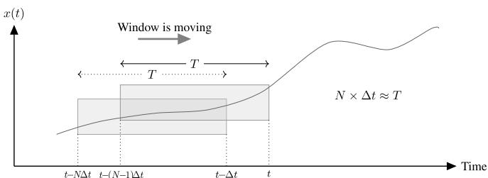  
Fig. 1. Coefficient extraction using GAM.

$$
\langle x \rangle_ {- k} (t) = \langle x \rangle_ {k} ^ {*} (t) \tag {19}
$$

where * is the complex conjugate. This method also preserves all the properties of dynamic phasors given in Section 3.2.

# 5. Shifted-frequency analysis

The relationship between “analytic signals” and dynamic phasors is well explained in [16] and later formalized in “shifted-frequency analysis” (SFA) solution framework [6,10].

# 5.1. Mathematical background

Power system waveforms, in general, are band-pass and centered around frequencies $\omega _ { 0 }$ and − ω . They can be represented in terms of two low-pass signals and two sinusoidal carriers using Fourier decomposition as:

$$
x (t) = u _ {1} (t) \cos \left(\omega_ {0} t\right) - u _ {\mathrm {Q}} (t) \sin \left(\omega_ {0} t\right) \tag {20}
$$

where uI and $u _ { \mathrm { Q } }$ are referred to as in-phase and quadrature components of x(t), respectively. These two low-pass signals provide all the information about x(t) with a frequency-spectrum shifted down by ω0 to around zero. Therefore, the dynamic phasor of x(t) can be described as follows.

$$
\mathcal {D} [ x (t) ] = u _ {\mathrm {I}} (t) + \mathrm {j} u _ {\mathrm {Q}} (t) \tag {21}
$$

Another representation of x(t) is by its analytic signal:

$$
z (t) = \mathcal {D} [ x (t) ] \mathrm {e} ^ {\mathrm {j} \omega_ {0} t} \tag {22}
$$

Substituting (21) in (22) and further simplifying yields:

$$
z (t) = x (t) + \mathrm {j} \mathcal {H} [ x (t) ] \tag {23}
$$

where

$$
\mathcal {H} [ x (t) ] = \frac {1}{\pi} \int_ {- \infty} ^ {\infty} \frac {x (\tau)}{t - \tau} d \tau \tag {24}
$$

is the Hilbert transformation [17] of x(t). The SFA procedure is illustrated in Fig. 2 wherein $\mathcal { F }$ denotes the Fourier decomposition.

# 5.2. Extracting the analytic signal

In power system simulations, all signals are unknown initially and are generated during the course of the simulation; therefore, the Hilbert transformation of the signal has to be calculated starting from steadystate initial conditions and system equations assuming that all signals are sinusoidal and have only the fundamental frequency at steady-state, as is the case virtually in all AC power system simulations [16].

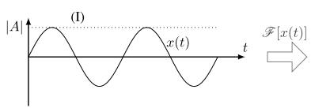

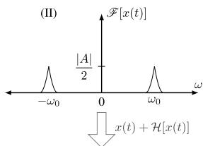

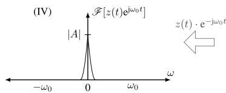

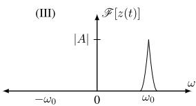  
Fig. 2. Shifted-frequency analysis illustration.

Contrary to the fast time-varying phasors, SFA can be applied to any arbitrary number of signals or phases. However, since the vast majority of applications are three-phase systems, this paper explains a method that can be used for any three-phase signal to extract its corresponding analytic signal.

Consider a three-phase signal $\underline { { \mathbf { x } } } _ { \mathrm { a b c } } = \left[ x _ { \mathrm { a } } , x _ { \mathrm { b } } , x _ { \mathrm { c } } \right] ^ { \prime }$ . Denote the corresponding analytic signal as $\underline { { \mathbf { z } } } _ { \mathrm { a b c } } = [ z _ { \mathrm { a } } , z _ { \mathrm { b } } , z _ { \mathrm { c } } ] ^ { \prime }$ and the signal in dq0-domain as $\underline { { \mathbf { x } } } _ { \mathrm { d q 0 } } = \left[ x _ { \mathrm { d } } , x _ { \mathrm { q } } , x _ { 0 } \right] ^ { \prime }$ . It is readily obvious that that

$$
\Re \mathrm {e} \left\{\underline {{\mathbf {z}}} _ {\mathrm {a b c}} \right\} = \underline {{\mathbf {x}}} _ {\mathrm {a b c}} \tag {25}
$$

$$
\Im \mathfrak {m} \left\{\underline {{\mathbf {z}}} _ {\mathrm {a b c}} \right\} = \mathcal {H} \left[ \underline {{\mathbf {x}}} _ {\mathrm {a b c}} \right] = \mathcal {H} \left[ \Re \mathrm {e} \left\{\underline {{\mathbf {z}}} _ {\mathrm {a b c}} \right\} \right] \tag {26}
$$

Taking the original signal to the $d q 0$ -domain yields:

$$
\underline {{\mathbf {x}}} _ {\mathrm {d q} 0} = \mathbf {K} (t) \underline {{\mathbf {x}}} _ {\mathrm {a b c}} \tag {27}
$$

where

$$
\mathbf {K} (t) = \frac {2}{3} \left( \begin{array}{c c c} \cos \left(\omega_ {0} t\right) & \cos \left(\omega_ {0} t - \frac {2 \pi}{3}\right) & \cos \left(\omega_ {0} t + \frac {2 \pi}{3}\right) \\ \sin \left(\omega_ {0} t\right) & \sin \left(\omega_ {0} t - \frac {2 \pi}{3}\right) & \sin \left(\omega_ {0} t + \frac {2 \pi}{3}\right) \\ 1 / 2 & 1 / 2 & 1 / 2 \end{array} \right) \tag {28}
$$

Combining (25) and (27) yields the following relationship.

$$
\Re \mathrm {e} \left\{\underline {{\mathbf {z}}} _ {\mathrm {a b c}} \right\} = \underline {{\mathbf {x}}} _ {\mathrm {a b c}} = \mathbf {K} ^ {- 1} (t) \underline {{\mathbf {x}}} _ {\mathrm {d q} 0} \tag {29}
$$

In steady-state, $x _ { \mathrm { d } }$ and $x _ { \mathrm { q } }$ are constants. Assuming that the signal consists of only the fundamental component in steady-state, the Hilbert transformation of $\underline { { \mathbf { X } } } _ { \mathrm { a b c } }$ can be derived as:

$$
\begin{array}{l} \mathfrak {I m} \left\{\mathbf {z} _ {\mathrm {a b c}} \right\} = \mathscr {H} \left[ \mathfrak {R e} \left\{\mathbf {z} _ {\mathrm {a b c}} \right\} \right] \\ = \left( \begin{array}{c c c} \sin \left(\omega_ {0} t\right) & - \cos \left(\omega_ {0} t\right) & 0 \\ \sin \left(\omega_ {0} t - \frac {2 \pi}{3}\right) & - \cos \left(\omega_ {0} t - \frac {2 \pi}{3}\right) & 0 \\ \sin \left(\omega_ {0} t + \frac {2 \pi}{3}\right) & - \cos \left(\omega_ {0} t + \frac {2 \pi}{3}\right) & 0 \end{array} \right) _ {\mathbf {X} _ {\mathrm {q d} 0}} \tag {30} \\ \end{array}
$$

Note that the Hilbert transformation of a constant is zero; thus, the zerosequence component is cancelled out in (30). Then the analytic signal can be derived as:

$$
\begin{array}{l} \mathbf {z} _ {\mathrm {a b c}} = \Re \mathrm {e} \left\{\mathbf {z} _ {\mathrm {a b c}} \right\} + \mathrm {j} \Im \mathrm {m} \left\{\mathbf {z} _ {\mathrm {a b c}} \right\} \\ = \underline {{\mathbf {x}}} _ {\mathrm {a b c}} + \mathrm {j} \left( \begin{array}{c c c} \sin (\omega_ {0} t) & - \cos (\omega_ {0} t) & 0 \\ \sin \left(\omega_ {0} t - \frac {2 \pi}{3}\right) & - \cos \left(\omega_ {0} t - \frac {2 \pi}{3}\right) & 0 \\ \sin \left(\omega_ {0} t + \frac {2 \pi}{3}\right) & - \cos \left(\omega_ {0} t + \frac {2 \pi}{3}\right) & 0 \end{array} \right) \underline {{\mathbf {x}}} _ {\mathrm {q d 0}} \tag {31} \\ = \underline {{\mathbf {x}}} _ {\mathrm {a b c}} + \mathrm {j} \left( \begin{array}{c c c} \sin (\omega_ {0} t) & - \cos (\omega_ {0} t) & 0 \\ \sin \left(\omega_ {0} t - \frac {2 \pi}{3}\right) & - \cos \left(\omega_ {0} t - \frac {2 \pi}{3}\right) & 0 \\ \sin \left(\omega_ {0} t + \frac {2 \pi}{3}\right) & - \cos \left(\omega_ {0} t + \frac {2 \pi}{3}\right) & 0 \end{array} \right) \mathbf {K} (t) \underline {{\mathbf {x}}} _ {\mathrm {a b c}} \\ \end{array}
$$

Substituting K(t) and further simplifying (31) yields

$$
\mathbf {z} _ {\mathrm {a b c}} = \left[ \widehat {\mathbf {I}} + \mathrm {j} \frac {1}{\sqrt {3}} \mathbf {M} \right] \mathbf {x} _ {\mathrm {a b c}} \tag {32}
$$

where $\widehat { \mathbf { I } }$ is the identity matrix and $\mathbf { M } = \left( \begin{array} { c c c } { 0 } & { 1 } & { - 1 } \\ { - 1 } & { 0 } & { 1 } \\ { 1 } & { - 1 } & { 0 } \end{array} \right)$ . At this point one can readily shift the analytic signal, $\underline { { \mathbf { z } } } _ { \mathrm { a b c } }$ , by multiplying it by ${ \mathrm { e } } ^ { - \mathrm { j } \omega _ { 0 } t }$ to form a dynamic phasor.

SFA provides a framework to analyze real signals with bandwidths around the carrier frequency, in shifted-frequency domain. This concept can be extended to signals consisting of multiple harmonics by calculating respective Fourier coefficients as described in Section 6.

# 6. Base-frequency dynamic phasors

“Base-frequency dynamic phasor” (BFDP) is a concept established on the notion that all the coefficients in the GAM can be combined to represent the entire frequency spectrum of a time-domain signal using a single dynamic phasor at the fundamental frequency [18]. This method, similar to the SFA, produces a low-bandwidth dynamic phasor through shifting each frequency component of the time-domain signal to a lower frequency.

# 6.1. Mathematical background

The Fourier series in (13) may be rewritten as follows:

$$
x (t - T + s) = \left\langle x \right\rangle_ {0} (t) + \Re \mathrm {e} \left\{2 \sum_ {k = 1} ^ {+ \infty} \left\langle x \right\rangle_ {k} (t) \mathrm {e} ^ {\mathrm {j} k \omega_ {0} (t - T + s)} \right\} \tag {33}
$$

This can be represented as a single dynamic phasor at the fundamental frequency as:

$$
x (t - T + s) = \Re \mathrm {e} \left\{\langle \mathrm {X} \rangle_ {\mathrm {B}} (t) \mathrm {e} ^ {\mathrm {j} \omega_ {0} (t - T + s)} \right\} \tag {34}
$$

where

$$
\langle \mathrm {X} \rangle_ {\mathrm {B}} (t) = \left(\langle x \rangle_ {0} (t) + 2 \sum_ {k = 1} ^ {+ \infty} \langle x \rangle_ {k} (t) \mathrm {e} ^ {\mathrm {j} k \omega_ {0} (t - T + s)}\right) \mathrm {e} ^ {- \mathrm {j} \omega_ {0} (t - T + s)} \tag {35}
$$

is termed the BFDP and represents the entire frequency range of x(t). This method ensures that the network needs to be modeled only for its fundamental frequency rather than for each harmonic, as is the case with GAM; therefore, it offers both efficiency and accuracy. Two algorithms for extracting the BFDP from real signals are described next.

# 6.2. Extracting a base-frequency dynamic phasor

# 6.2.1. Method-I

An obvious method for BFDP calculation is to extract the coefficients corresponding to positive-frequency and dc components of the signal individually and then merge them before shifting the spectrum down as in (35). This is depicted in Fig. 3. Recursive integration to obtain coefficients can be effectively done using (16). The drawback of this

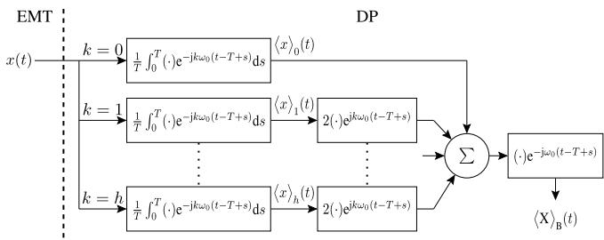  
Fig. 3. BFDP extraction: method-I.

method is that the frequency contents of the real signal are generally unknown beforehand, which may cause difficulty when deciding the number of coefficients required to achieve the desired accuracy.

# 6.2.2. Method-II

One can express the series given in (33) in the following form separating the fundamental component from the rest:

$$
\begin{array}{l} x (t - T + s) \\ = \Re \mathrm{e}\left\{2\Bigg\langle x\big\rangle _{1}(t)\mathrm{e}^{\mathrm{j}\omega_{0}(t - T + s)}\right\} +\sum_{\substack{k = -\infty \\ k\neq -1,1}}^{+\infty}\Bigg\langle x\big\rangle _{k}(t)\mathrm{e}^{\mathrm{j}k\omega_{0}(t - T + s)} \\ = \Re \mathrm {e} \left\{2 \langle x \rangle_ {1} (t) \mathrm {e} ^ {\mathrm {j} \omega_ {0} (t - T + s)} \right\} + \mathrm {X} _ {\mathrm {h}} (t) \mathrm {e} ^ {\mathrm {j} \omega_ {0} (t - T + s)} \tag {36} \\ \end{array}
$$

where

$$
\mathrm {X} _ {\mathrm {h}} (t) = \sum_ {\substack {k = - \infty \\ k \neq -1, 1}} ^ {+ \infty} \left\langle x \right\rangle_ {k} (t) \mathrm {e} ^ {\mathrm {j} (k - 1) \omega_ {0} (t - T + s)} \tag{37}
$$

is a complex signal that comprises dc component and all harmonic contents of $x ( t )$ except for the fundamental component. The steps for extracting BFDP can be described using (36) as follows and the procedure illustrated in Fig. 4.

First, the fundamental component, $\langle x \rangle _ { 1 } ( t )$ , is calculated using (16) with $k = 1$ . It is then used to form the first term on the right-hand side of $( 3 6 ) ,$ which is then subtracted from the original signal, x(t). This yields the second term on the right-hand side of (36), from which $\mathrm { X } _ { \mathrm { h } } ( t )$ is readily obtained. Finally, the BFDP is computed as:

$$
\langle \mathrm {X} \rangle_ {\mathrm {B}} (t) = 2 \langle x \rangle_ {\mathrm {I}} (t) + \mathrm {X} _ {\mathrm {h}} (t) \tag {38}
$$

While this method provides both efficiency and accuracy, if the network consists of higher order harmonics, it shifts negative frequency components of $\mathbf { X } _ { \mathrm { h } } ( t )$ further away from the imaginary axis, generating a high-frequency oscillating complex signal, which is less useful in large time-step simulations. Therefore, for systems with harmonics that need to be retained, it is recommended to extract BFDPs using method-I.

# 7. Illustrative examples

This section demonstrates the dynamic phasor extraction methods using representative power system waveforms. Firstly, a time-domain signal that illustrates a wide range of typical power system waveforms is defined as:

$$
\begin{array}{r} x (t) = a _ {0} (t) + (a (t) + a _ {\mathrm {e}} (t) \cos (2 \pi f _ {\mathrm {e}} t)) \cos (\omega_ {0} t + \delta (t)) \\ + a _ {h} \cos (h \omega_ {0} t) \end{array} \tag {39}
$$

where $a _ { 0 } , a , a _ { \mathrm { e } } ,$ and $a _ { h }$ are magnitudes of the $\mathbf { d c } ,$ , fundamental, electromechanical, and higher order harmonic components, respectively. ω0 is the fundamental frequency $, f _ { \mathrm { e } }$ is the frequency of the electromechanical component, and δ is the phase angle. During a disturbance, more than

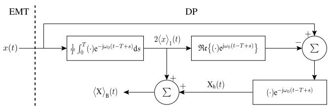  
Fig. 4. BFDP extraction: method-II.

one scenario may be exhibited in (39); however, for better understanding, each scenario is considered separately. In the following, each dynamic phasor is extracted in a causal manner; i.e., only using present and past values of the natural signal, as is the case with power system simulations.

# 7.1. Electromechanical oscillation

One of the most common scenarios in power systems is electromechanical oscillations, which typically befall in the frequency range of 0.1-3 Hz. Fig. 5 displays the representations of a decaying electromechanical oscillation with a = 20, ae, max = 15, fe = 3 Hz, and $\delta = \pi / 6$ rad using various dynamic phasor extraction techniques. It can be seen that for a signal with a frequency contents around the fundamental component, $f _ { 0 } ~ ( = \omega _ { 0 } / 2 \pi )$ , all extraction methods produce essentially identical representations of the envelope waveform. For GAM several frequency components are computed, which are unnecessary in this case as slow dynamics are attributed to the fundamental coefficient only. It is clear from the frequency spectra in Fig. 6 that the frequency spectrum of $x ( t )$ , which is originally in $f _ { 0 } \pm f _ { \mathrm { e } }$ and $- f _ { 0 } \pm f _ { \mathrm { e } }$ is now shifted to $0 \pm f _ { \mathrm { e } }$ yielding a low-pass signal.

# 7.2. DC offset and harmonics

DC offsets and harmonics commonly occur in power electronic converters and can be expected in a power system during a disturbance. Fig. 7 shows the result of each extraction technique to replicate such information in the frequency domain. The signal x(t) has a dc offset with $a _ { 0 } = 5$ , during $t \in [ 0 , 0 . 1 ]$ s and a second-order harmonic with a magnitude of $a _ { \mathrm { h } } = 1 0$ during $t \in [ 0 . 1 5 , 0 . 2 5 ]$ s. Fourier decomposition of dynamic phasor waveforms when the original signal consists of dc and harmonics are shown in Figs. 8 and 9, respectively.

A dc offset results in a zero sequence component; thus, a fast timevarying phasor, which focuses only on the positive sequence, completely ignores it and generates an envelope corresponding to the fundamental component. In GAM, the dc component is readily captured by calculating the coefficient corresponding to $k = 0$ . The frequency shifting in SFA and both BFDP methods mean that the dc component of magnitude $a _ { 0 } ( t )$ in the time domain results in $a _ { 0 } ( t ) \mathrm { e } ^ { - \mathrm { j } \omega _ { 0 } t }$ in the phasor domain (a shift of − f0); hence, oscillations at the fundamental frequency in the envelope waveforms generated by these latter methods are observed in Fig. 7.

When the real signal consists of harmonics with different phase sequences, a fast time-varying phasor faces difficulty as it is tied with positive-sequence signals only. GAM, on the other hand, shifts all its

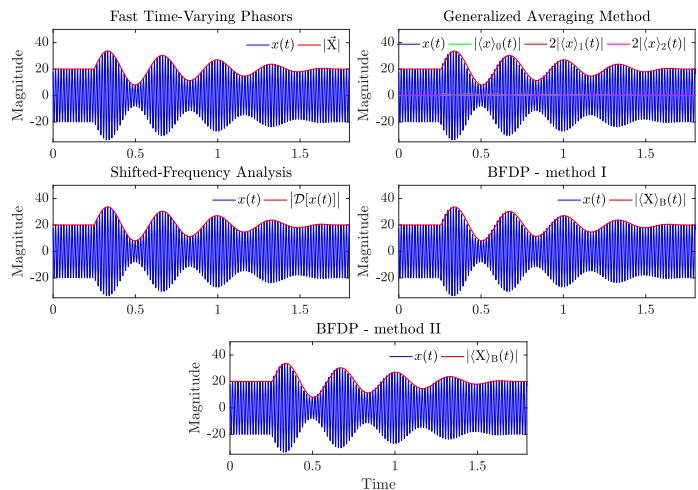  
Fig. 5. DP representations of a real signal consisting of fundamental and electromechanical oscillation frequencies

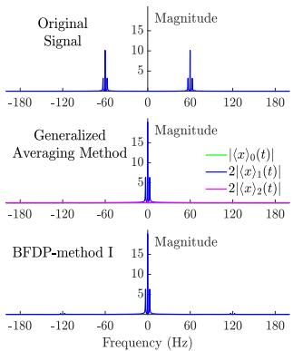

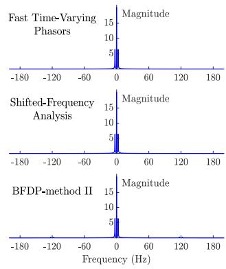  
Fig. 6. Frequency spectrum of DPs when the real signal consists of fundamental and electromechanical oscillation frequencies

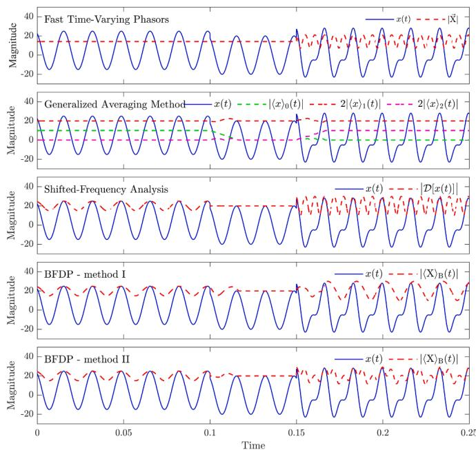  
Fig. 7. DP representations of a real signal consisting of dc offset and harmonics..

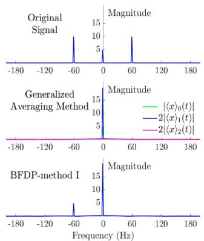

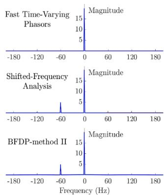  
Fig. 8. Frequency spectrum of DPs when the real signal contains a dc offset..

harmonic components to around zero, which makes it suitable in modeling power electronic systems where multiple harmonics may exist. However, each frequency component must be evaluated separately, which makes it computationally cumbersome. The analytic signal generated using (32) has a positive-frequency spectrum only when the

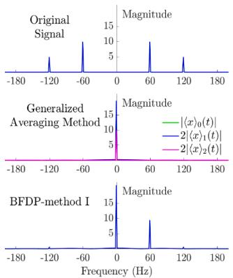

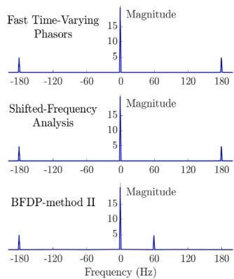  
Fig. 9. Frequency spectrum of DPs when the real signal contains harmonics.

natural signal is a periodic fundamental-frequency sinusoid. For other signals, it may generate negative-frequency components as well. Note that (32) is a computationally efficient and causal method to approximate an analytic signal during a simulation, and as such is not a universal replacement for (23). The BFDP method-I uses only the positivefrequency coefficients; this implies that the frequency shifting process always creates a low-pass spectrum in frequency domain compared to the original signal and does not yield any negative frequency component, thus, making it a favourable method for large time-step simulation of harmonic-rich systems in a single frequency frame. The BFDP method-II creates a third-order harmonic component of the dynamic phasor envelope due to the frequency shifting process of Xh.

# 7.3. Frequency variation

Consider a signal with a time-varying amplitude and phase angle at the frequency of $\omega _ { 0 } + \Delta \omega$ .

$$
x (t) = A (t) \cos \left(\left(\omega_ {0} + \Delta \omega\right) t + \delta (t)\right) \tag {40}
$$

The change in the frequency of the natural signal can represented as a phase shift to the dynamic phasor obtained in the frame of its carrier frequency as

$$
\overrightarrow {\mathrm {X}} ^ {\prime} (t) = A (t) \mathrm {e} ^ {\mathrm {j} (\delta (t) + \Delta \omega t)} = \overrightarrow {\mathrm {X}} (t) \mathrm {e} ^ {\mathrm {j} \Delta \omega t} \tag {41}
$$

This can be further verified by the following example. Consider the signal given in (42) with a frequency ramp, Δω(t) = mt, where m denotes the slope of the ramp.

$$
\begin{array}{r l} x (t) & = 2 0 \cos \left(\left(\omega_ {0} + m t\right) t + \delta (t)\right) \\ & = 2 0 \cos \left(\omega_ {0} t + m t ^ {2} + \delta (t)\right) \end{array} \tag {42}
$$

Let m = − 0.5π during the interval t ∈ [0.2, 0.4] and m = 0 otherwise. Real and imaginary parts of dynamic phasor representations of (42) is illustrated in Fig. 10. It can be seen that during the frequency ramp, the real and imaginary parts of each method’s phasor change to imitate the frequency change. Despite the changes in the phase angle, the magnitude of each dynamic phasor remains constant.

# 7.4. Unbalanced operation

Fast time-varying phasors are not readily applicable to unbalanced system representations as unbalanced conditions produce negative- and zero-sequence components. On the contrary, all other methods are defined in such a way that they can be independently used with any arbitrary number of phases. As such, they are capable of accurately replicating any unbalanced three-phase signal in the frequency domain.

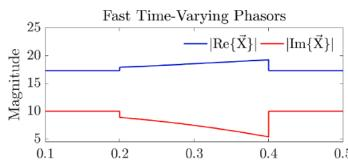

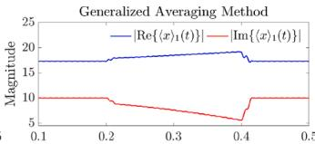

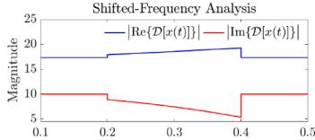

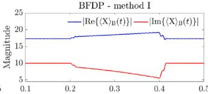

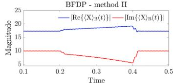  
Fig. 10. DP representations when the real signal undergoes a frequency ramp.

# 8. Co-simulation example

The performance of dynamic phasor extraction methods in cosimulation applications is further demonstrated with the simple test system given in Fig. 11, for which system parameters are listed in Table 1.

The system is partitioned into two subsystems; one subsystem is modeled with dynamic phasors while the other subsystem is modeled using time-domain EMT models. The interface between the two subsystems is formed using dependent current and voltage sources that are updated as follows.

$$
\vec {\mathrm {H}} (t) = \vec {\mathrm {I}} _ {\mathrm {m}} (t - \Delta t) + g \vec {\nabla} _ {\mathrm {k}} (t - \Delta t) \tag {43}
$$

$$
u (t) = v _ {\mathrm {k}} (t - \Delta t) - r i _ {\mathrm {m}} (t - \Delta t) \tag {44}
$$

where $\overrightarrow { \mathrm { ~ I ~ } } _ { \mathrm { ~ m ~ } }$ denotes the dynamic phasors of $i _ { \mathrm { m } }$ and $\nu _ { \mathrm { k } }$ is the time-domain representation of the dynamic phasor $\overrightarrow { \nabla } _ { \mathbf { k } }$ . In each time-step, $\overrightarrow { \mathrm { ~ I ~ } } _ { \mathrm { ~ m ~ } }$ is extracted from the time-domain EMT samples of $i _ { \mathrm { m } } .$ , while $\overrightarrow { \nabla } _ { \mathbf { k } }$ is converted to time-domain to yield $\nu _ { \mathrm { k } } .$ . Note that both the EMT and DP subsystems are modeled as three-phase systems; however, when the fasttime varying phasors are used to extract $\vec { \mathrm { ~ I ~ } } _ { \mathrm { m } } .$ only the positive-sequence is modeled for the DP subsystem.

A disturbance is given to the network by applying a line-to-ground unbalanced fault at location F in the EMT subsystem at t = 1 s. The simulation is repeated several times by changing the dynamic phasor extraction technique used to acquire $\overrightarrow { \mathrm { ~ I ~ } } _ { \mathrm { ~ m ~ } }$ at the interface. The resultant DP-side interface current, $\stackrel { \longrightarrow } { \mathrm { ~ I ~ } _ { \mathrm { k } } }$ , for each method is shown in Fig. 12. For validation purposes, the co-simulation results are compared against standalone EMT simulation results obtained using PSCAD/EMTDC.

As it can be seen, the steady-state dynamic phasor representations of $\vec { \mathrm { ~ I ~ } } _ { \bf k }$ are identical in all methods as the waveform consists of only the fundamental component. The applied disturbance causes a change in the magnitude of the fundamental component, and also introduces a decaying dc component in the magnitude of the interface current. The

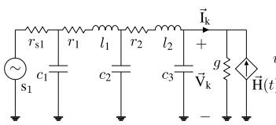  
DP subsystem

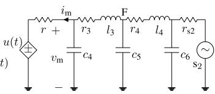  
EMT subsystem   
Fig. 11. Co-simulation test system.

Table 1 Co-Simulation Test System Specifications. .   

<table><tr><td>Component</td><td>Value</td></tr><tr><td>s1</td><td>230 kV, 60 Hz, ∠11.5°</td></tr><tr><td>s2</td><td>230 kV, 60 Hz, ∠0°</td></tr><tr><td>rs1, rs2, g, r</td><td>0.375 Ω, 0.375 Ω, 0.01 S, 0.05 Ω</td></tr><tr><td>r1, r2, r3, r4</td><td>0.6083 Ω, 1.7774 Ω, 0.8887 Ω, 0.8887 Ω</td></tr><tr><td>l1, l2, l3, l4</td><td>0.0128 H, 0.0414 H, 0.0137 H, 0.0187 H</td></tr><tr><td>c1, c2, c3</td><td>0.0459 μF, 0.1850 μF, 0.1191 μF</td></tr><tr><td>c4, c5, c6</td><td>0.0495 μF, 0.1389 μF, 0.0695 μF</td></tr></table>

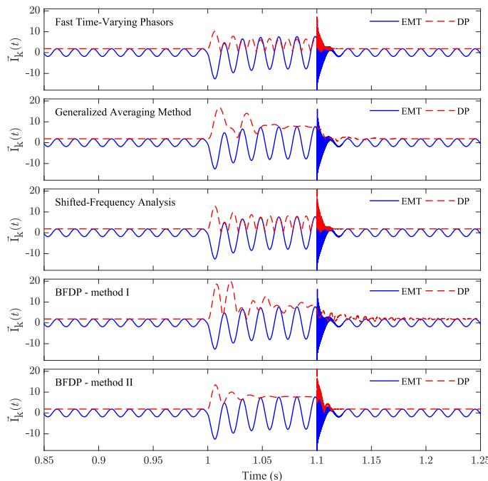  
Fig. 12. DP subsystem interface current $( \overrightarrow { \ I _ { \mathrm { k } } } ( t ) )$

clearing of the fault causes a high-frequency transient for a small period of time. It is clear from Fig. 12 that different extraction techniques provide dissimilar representations of the transient depending on their capabilities. The accuracy of each method can be examined by reconstructing the natural waveform using the simulated dynamic phasors as shown in the Fig. 13.

The inability to capture dc and high frequency contents, and to represent unbalanced scenarios using the fast-varying phasor method causes severe errors at the interface. This is clearly visible from the EMTside interface currents shown in Fig. 14. Other methods do not demonstrate such an issue since they include all three phases explicitly. For the GAM, only the fundamental frequency component is extracted as the DP subsystem is modeled in a single frequency frame. As such, the dc component and the post-fault high frequencies are not simulated in the dynamic phasor waveform. The proper way to include them is to model the DP subsystem for different frequencies and then combine them using superposition. For the BFDP-method I, the dc component and harmonics up to the third order are considered; therefore, it simulates the fault transient with a reasonable accuracy but the post-fault fast dynamics are not captured fully. This can be made more accurate by including more frequency components to the BFDP coefficients. The method used in (32) for SFA and the BFDP-method II are able to simulate all the frequency contents of the $\vec { \mathrm { ~ I ~ } } _ { \mathrm { k } }$ waveform, which make them the most accurate methods. However, as depicted in Fig. 9, they need to contain non-positive high-frequency components in dynamic phasor waveforms to represent harmonics.

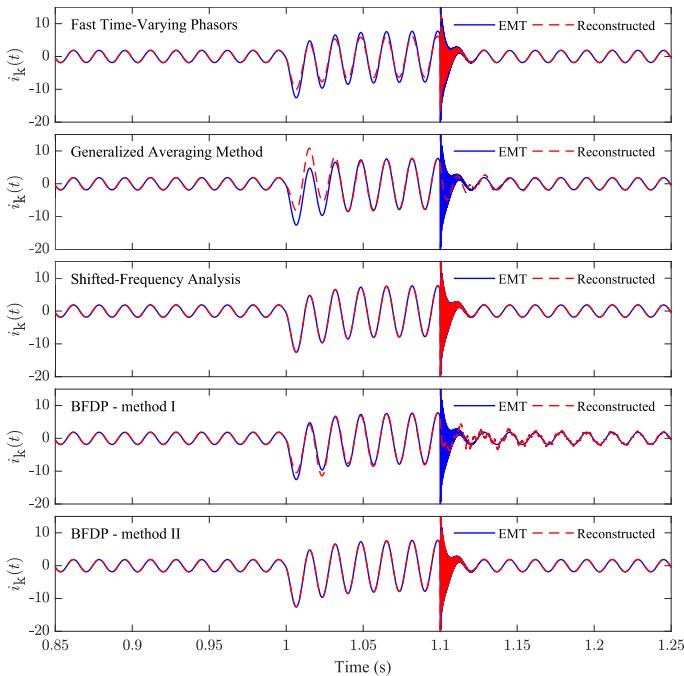  
Fig. 13. Reconstructed time-domain waveforms of $\overrightarrow { \mathrm { ~ I ~ } } _ { \mathbf { k } } ( t )$ .

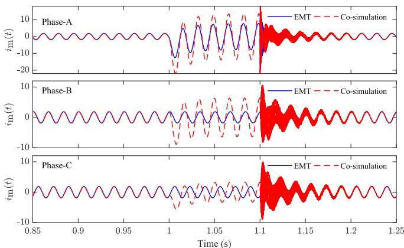  
Fig. 14. EMT-side interface current when fast time-varying phasors are used for DP subsystem.

# 9. Conclusions

This paper investigated the underlying theory of several dynamic phasor extraction methods. Merits and drawbacks of each method were assessed based on the ability to replicate general power system conditions that included electromechanical frequencies, harmonics, dc offsets, imbalance, and other transient conditions such as magnitude and frequency variations. The paper demonstrated the underlying differences that the resulting phasors have, and proved that under certain conditions phasors may emerge that do not necessarily contain positiveonly frequency components as is expected from a bona fide phasor. The co-simulation example included in the paper further demonstrated these

observations using a power system transient study. The findings of this paper are instrumental in enabling an in-depth, quantitative analysis of various phasor extraction methods that form the underlying component of EMT-dynamic phasor co-simulations of large electric networks.

# Credit Author Statement

All people who have contributed to the work reported in this paper and to the preparation of this paper are listed as co-authors.

# Declaration of Competing Interest

On behalf of the authors of the manuscript entitled Dynamic Phasors and Dynamic Phasor Extraction Methods for Power System Co-Simulation Applications submitted to IPST 2021, I would like to declare no interest of any sort with regard to the contents of this paper and any external organization of individual. Sincerely,

# References

[1] V. Venkatasubramanian, H. Schattler, J. Zaborszky, Fast time-varying phasor analysis in the balanced three-phase large electric power system,, IEEE Trans. Autom. Cont. 40 (1995) 1975–1982.   
[2] N. Watson, J. Arrillaga, Power systems electromagnetic transients simulation, IET Digital Library, London, United Kingdom, 2003.   
[3] H.W. Dommel, Digital computer solution of electromagnetic transients in singleand multiphase networks,, IEEE Trans. Power Appar. Syst. PAS-88 (1969) 388–399.   
[4] S.R. Sanders, J.M. Noworolski, X.Z. Liu, G.C. Verghese, Generalized averaging method for power conversion circuits,, IEEE Trans. Pow. Electron. 6 (1991) 251–259.   
[5] V. Venkatasubramanian, Tools for dynamic analysis of the general large power system using time-varying phasors,, Int. J. Electr. Power Energy Syst. 16 (1994) 365–376.   
[6] P. Zhang, J.R. Marti, H.W. Dommel, Shifted-frequency analysis for EMTP simulation of power-system dynamics,, IEEE Trans. Circuits Syst. Regul. Pap. 57 (2010) 2564–2574.   
[7] M. Daryabak, S. Filizadeh, J. Jatskevich, et al., Modeling of LCC-HVDC systems using dynamic phasors,, IEEE Trans. on Power Deliv. 29 (2014) 1989–1998.   
[8] J. Rupasinghe, S. Filizadeh, L. Wang, A dynamic phasor model of an MMC with extended frequency range for EMT simulations,, IEEE J. Emerg. Sel. Top. Power Electron. 7 (2019) 30–40.   
[9] Y. Xia, K. Strunz, Multi-scale induction machine model in the phase domain with constant inner impedance,, IEEE Trans. on Power Syst. 35 (2020) 2120–2132.   
[10] K. Strunz, R. Shintaku, F. Gao, Frequency-adaptive network modeling for integrative simulation of natural and envelope waveforms in power systems and circuits,, IEEE Trans. Circuits Syst. Regul. Pap. 53 (2006) 2788–2803.   
[11] M. Kulasza, Generalized dynamic phasor-based simulation for power systems, m.sc. thesis, Univ. of Manitoba, Manitoba, Canada, 2015.   
[12] J. Rupasinghe, S. Filizadeh, A. Gole, K. Strunz, Multi-rate co-simulation of power system transients using dynamic phasor and EMT solvers,, The Journal of Eng.   
[13] C. Alexander, M. Sadiku, Fundamentals of electric circuits, 4th ed, McGraw-Hill, Inc., New York, NY, USA, 2009.   
[14] H.K. Mudiyanselage, Interfacing a transient stability model to a real-time electromagnetic transient simulation using dynamic phasors, ph.d. dissertation, Univ. of Manitoba, Canada, 2020.   
[15] C.J. O’Rourke, M.M. Qasim, M.R. Overlin, J.L. Kirtley, A geometric interpretation of reference frames and transformations: dq0, clarke, and park,, IEEE Trans. Energy Convers. 34 (2019) 2070–2083.   
[16] S. Henschel, Analysis of electromagnetic and electromechanical power system transients with dynamic phasors, Ph.D. dissertation, Univ. of British Columbia,   
[17] A.D. Poularikas, The transforms and applications handbook, $2 ^ { \mathrm { n d } }$ ed, CRC Press, Boca Raton, Fla, USA, 2000.   
[18] K. Mudunkotuwa, S. Filizadeh, Co-simulation of Electrical Networks by Interfacing EMT and Dynamic-phasor Simulators,. International Conf. on Power Systems Transients, Seoul, Republic of Korea, 2017.