# Empirical Model of a Current-Limiting Fuse using EMTP

Andre Petit

Guy St-Jean

Senior Member

Institut de recherche d'Hydro-Québec (IREQ)

Varennes, Quebec, Canada J0L 2P0

Gilles Fecteau

# Abstract

The paper describes an empirical model for research on current-limiting fuses used in distribution system applications. The main characteristic of a CL fuse is that it develops a voltage at its terminals which reduces the amount of energy generated in the protected equipment during a fault. The various stages of fuse operation are modeled using electric components. The model is of limited use, but its simplicity enables a non-expert to use it without spending months to learn and program a sophisticated model. The model makes it possible to establish which closing angle of source voltage will produce the greatest value of $I^2 t$ assuming a melting time shorter than a quarter of a cycle. The model can also show how the let through value of $I^2 t$ will be influenced by the voltage vs. time profile of the fuse voltage. The Electro-Magnetic Transient Program, EMTP, proved a useful tool for this development.

Keywords: fuse, model, EMTP, current-limiting, protection, arc voltage, joule integral.

# Introduction

In circumstances where damage to fuse-protected equipment can have serious repercussions, current-limiting (CL) fuses prove invaluable. Distribution transformers provide a typical example: if an internal fault occurs, the CL fuse reduces the amount of energy dissipated in the tank far more effectively than a conventional fuse and, since the risk of explosion is directly proportional to the amount of energy released, it clearly represents an attractive form of protection.

88 WM 227-1 A paper recommended and approved by the IEEE Switchgear Committee of the IEEE Power Engineering Society for presentation at the IEEE/ PES 1988 Winter Meeting, New York, New York, January 31, - February 5, 1988. Manuscript submitted August 27, 1987; made available for printing December 11, 1987.

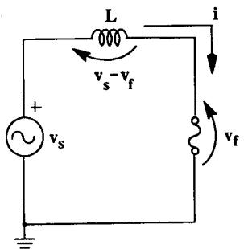  
Figure 1: Simplified diagram of a source acting on a fuse. The circuit current is defined by Eq. 1.

The operating principle is very simple. Referring to Fig. 1, where $v_{f}$ is the voltage at the fuse terminals, $v_{s}$ a sinusoidal source voltage and $L$ the source inductance, it can be seen that the instantaneous current $i$ is given by

$$
i = \int \frac {v _ {s} - v _ {f}}{L} d t. \tag {1}
$$

The main characteristic of a CL fuse is its efficiency to limit and interrupt fault current. This limitation of current is proportional to the voltage generated by the fuse after the element has melted. In other words, the higher $v_{f}$ , the faster $i$ will reduce to zero. The instantaneous value of $v_{f}$ should be higher than $v_{s}$ in order to reverse the current increase, as soon as possible after fuse melting occurs. The longer the fuse voltage remains high, the sooner the circuit current is interrupted. This is true because the fuse voltage is proportional to the fuse's resistance. Because of this phenomenon, a current limiting fuse can interrupt faults in less than the traditional half cycle of other types of interrupters. Excessively high voltage, however, risks causing operation of parallel surge arresters and/or damaging other parallel connected equipment.

Since the fuse arc voltage should be limited to a safe maximum value, the only way to upgrade the fuse performance is to ensure this voltage develops faster and remains near maximum as long as possible. Three significant parameters can therefore be defined to describe the CL fuse voltage shape: the maximum value attained by the fuse voltage, the rise time and the tail characteristics of this voltage.

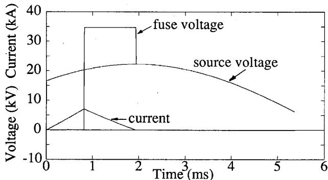  
Figure 2: Operation of an ideal fuse. The fuse terminal voltage increases instantaneously up to a limit value and remains there until current interruption.

Several models of CL fuse exist [1, 3-7], most being based on a mathematical representation of the arc physics. The semiempirical model presented here, derived from the very simple model developed by Hirose [1], have a limited usage, but is a lot more simple than those referenced. The model shows the designer how the let through value of $I^2 t$ will be influenced by the voltage vs. time profile of the fuse arc voltage. It has been designed for the specific purpose of helping research in order to improve the performance of the CL fuse. The model does not relate to different fuse parameters such as element geometry, element material and quench media, since it is an empirical model.

# Definitions

The following definitions are used in the text:

Ideal fuse: an hypothetical fuse which, after the element has melted, reaches its breaking voltage instantaneously and maintains it up to current-zero [8]. (Fig. 2)

Ultra fuse: a fuse which develops a voltage vs. time profile closer to the ideal fuse than a conventional CL fuse.

Angle $\phi$ : closing angle of the source (in degrees) measured from the zero-crossing of the sinusoidal voltage. One full cycle represents 360 degrees.

# CL Fuse Modeling

The empirical model covers two aspects of the arc voltage. The first involves the increase in voltage at

the fuse terminals following melting, while the second is related to the fuse behavior once maximum voltage has been reached. It has been observed, from test data, that the rise time of voltage across a fuse after melting is constant for a circuit where the only variable is the closing angle $\phi$ . This rise time can be represented by a ramp voltage source that reaches a peak arc voltage determined by the prospective breaking current. In order to easily code the model in EMTP, this ramp source has been replaced by a capacitor. Under constant charging current, the voltage across a capacitor follows a ramp function. This does not depend to much on the test circuit as long the capacitor impedance is high compared to the circuit impedance. Such a capacitor has been used successfully for modeling of conventional active-gap current-limiting arresters [9]. The approximate value of the capacitance required to reproduce the rise time can be calculated using Eq. 2:

$$
C _ {2} \approx \frac {i _ {\text {m e a n}} \cdot t _ {m}}{v _ {\text {m a x}}} \tag {2}
$$

where:

$C_2$ :equivalent capacitance

$i_{mean}$ : mean current in the fuse during rise time

$t_m$ : rise time

$v_{max}$ : maximum voltage reached by fuse

The second stage, reduction of the fuse voltage, is simulated using a voltage-current (V-I) characteristic [1]. A conventional CL fuse has been tested with the circuit shown in Fig. 1. From the data of such a real test, the voltage vs. time and current vs. time characteristics of a fuse (Fig. 3a) can be reproduced into a single voltage vs. current curve (Fig. 3b). The time points $\mathbf{A},\mathbf{B},\mathbf{C}$ and $\mathbf{D}$ help to describe the unfamiliar voltage vs. current curve. The plots for the ultra and ideal fuses can also be seen in the same format. If more test data is available for the same circuit, a mean V-I curve should be used since each test produces a slightly different characteristic. These two stages of model development are combined using the Electro-Magnetic Transient Program (EMTP) and the Transients Analysis of Control Systems (TACS). Figure 4 shows the circuit used to model a CL fuse. The left side of the circuit represents the test source, while the fuse itself is represented on the right. When the source is switched on, the fuse is simulated by its pre-melting resistance, $R_{3}$ . The melting time is determined from the value of the Joule integral $(I^{2}t\equiv \int_{0}^{t}i^{2}(t)dt)$ . If the source is sufficiently powerful to melt the fuse within few milliseconds, it was observed experimentally that the

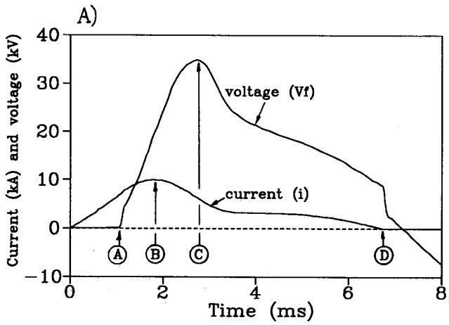

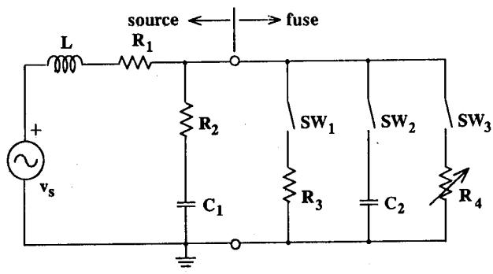

<table><tr><td>Element</td><td>Function</td></tr><tr><td>vs</td><td>60-Hz voltage</td></tr><tr><td>L</td><td>Source inductance</td></tr><tr><td>R1</td><td>Source resistance</td></tr><tr><td>R2</td><td>Stray resistance</td></tr><tr><td>C1</td><td>Stray capacitance</td></tr><tr><td>R3</td><td>Pre-melting resistance</td></tr><tr><td>C2</td><td>Rise time capacitance</td></tr><tr><td>R4</td><td>Nonlinear resistance of tail</td></tr></table>

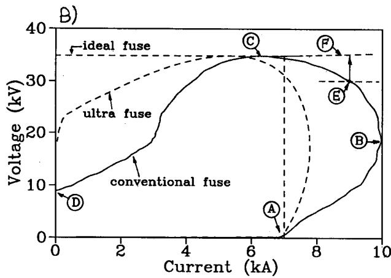  
Figure 3: V-I characteristic for a conventional, an ideal and an ultra CL fuse, all of which produce a peak voltage of 1.6 p.u.

<table><tr><td>Switch</td><td>Initial status</td><td>Closing condition</td><td>Opening condition</td></tr><tr><td>SW1</td><td>closed</td><td>—</td><td>I2t &gt; melting</td></tr><tr><td>SW2</td><td>open</td><td>I2t &gt; melting</td><td>vfuse &gt; vtrans</td></tr><tr><td>SW3</td><td>open</td><td>vfuse &gt; vtrans</td><td>current=0</td></tr></table>

Figure 4: Empirical model of CL fuse which can be used with the EMTP.

value of melting $I^2 t$ is constant. Therefore, the model assumes a constant melting $I^2 t$ , so the power source should melt the fuse in less than a quarter of a cycle. Consequently, after a time corresponding to $I^2 t_{melting}$ , $SW_1$ is opened and $SW_2$ is closed (point A in Fig. 3). The voltage rise at the fuse terminals is simulated by capacitance $C_2$ .

When the fuse voltage has reached a predetermined level, $SW_{2}$ is opened and $SW_{3}$ closed (point B). From then on, the fuse jumps to the V-I characteristic of the nonlinear resistance $R_{4}$ (point F in Fig. 3b). The purpose of this jump will be explained in the next section. When the current passes through zero, $SW_{3}$ opens and interrupts it (point D).

Between points $\mathbf{E}$ and $\mathbf{F}$ in the modeling process, the voltage rise characteristic is separated from the voltage drop. The transition between the two occurs at the moment the voltage at the fuse terminals reaches a prescribed level referred to as the transition voltage $v_{trans}$ (point $\mathbf{E}$ in Fig. 3b).

It should be pointed out that under certain circumstances, the fuse model will not interrupt the current if $v_{trans}$ is not reached by the time of zero crossing. This occurs when the source is switched on at an

A $\bullet$ prospective breaking current   
B $\bullet$ cut-off current   
C peak arc voltage   
D $\cdot$ arc extinction   
E transition voltage $v_{trans}$ used in EMTP   
F $\bullet$ V-I characteristic for $R_{4}$ in EMTP

angle near $140^{\circ}$ of the sinusoidal voltage. This region usually presents no particular interest, which is why no solution has yet been found, since this would call for a rather complicated modification of the opening-closing sequence of $SW_{2}$ and $SW_{3}$ .

# Determination of the model parameters

The model does not relate to different fuse parameters such as element geometry, element material and quench media since it is an empirical model. However, the empirical parameters are easy to determine. The values of $v_{s}$ , $L$ and $R_{1}$ , representing the source used, are always known. Components $R_{2}$ , and $C_{1}$ simulate the stray effects of the circuit but serve more to improve the numerical stability of the simulation. They can therefore be attributed values which often have little connection with reality, without affecting the accuracy of the solution.

The value of $R_{3}$ , the ohmic resistance of the fuse element, is obtained from a simple measurement whose accuracy is not critical. The value of $C_{2}$ is related to the voltage rise time $t_{m}$ , which can be determined from test data by the well known method of drawing a straight line between the points at 10% and 90% of the peak. Equation 2 can be used to determine an initial value of $C_{2}$ , and a greater accuracy of the calculated rise time can subsequently be achieved by varying $C_{2}$ around this initial value.

The variable resistance $R_{4}$ simulates the V-I characteristic of the fuse during voltage drop. Plotting such a V-I curve from at least one test on identical fuses with the same source produces a curve similar to that of the conventional CL fuse shown in Fig. 3b. The value sought by the model is the maximum value of $I^{2}t_{total}$ in a given circuit. For greater accuracy of simulation in the region where $I^{2}t$ is highest, it is preferable to select a nonlinear characteristic for $R_{4}$ similar to the V-I characteristic of a real test performed close to the angle $\phi$ giving the maximum value of $I^{2}t_{total}$ . Due to limitations in EMTP program, the modeling by $R_{4}$ in the region between maximum current and maximum voltage in Figure 3b, must produce a positive slope of the V-I characteristic. This is shown by the dotted-line curve at point $\mathbf{F}$ in Fig. 3b. Therefore, in this region, the complete computed V-I curve (points E-F-C) will usually be above and to the right of the experimental curve, because of the combined effect of $C_{2}$ , $v_{trans}$ and $R_{4}$ .

Two parameters control the switch operations: $I^2 t_{melting}$ and $v_{trans}$ . $I^2 t_{melting}$ must be determined first from test data. The second term, $v_{trans}$ , is the

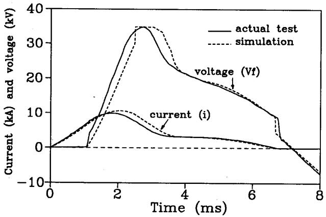  
Figure 5: Comparison between an actual test and the simulation of a conventional CL fuse at $\phi = 24.5^{\circ}$ .

voltage that determines the time at which $C_2$ , simulating the increase in voltage, is replaced by the nonlinear resistance, $R_4$ . This voltage must be chosen in such a way as to minimize the sharp change in fuse voltage due to the operation of the switches. However, to avoid an excessive peak of the voltage calculated for low values of the breaking current, it is preferable to select a lower than optimal transition voltage in the region where the angle $\phi$ produces $I^2 t$ maximum. The simulations show that the transition voltage has little influence on $I^2 t_{total}$ .

# Model Validation

The parameters of a conventional CL fuse model were determined on the basis of a single actual test. It can be seen that even if the simulated current and voltage waveshapes (Fig. 5) show occasional differences from the waveshapes for the actual test, the overall similarity is quite good. Since the current is proportional to the integral of the difference between the fuse voltage and the source voltage, local discrepancies are filtered by the circuit inductance. Thus, the peak values of current, voltage, $I^2 t_{total}$ and the arc energy do not differ by more than $15\%$ .

The model behavior was then validated by simulating an extensive series of tests on 100-A, $15\mathrm{-kV}$ CL fuses [10] while varying the angle $\phi$ of the source. Figure 6 shows that the simulation results and the test results are very similar with respect to $I^2 t_{arc}$ for $\phi$ varying between 0 and $180^{\circ}$ ; actually, their maximum values of $I^2 t_{arc}$ are very close ( $\sim 3\%$ ).

In view of the fact that this is an empirical model, users must realize that some of its parameters are liable to change when the electric circuit is modified.

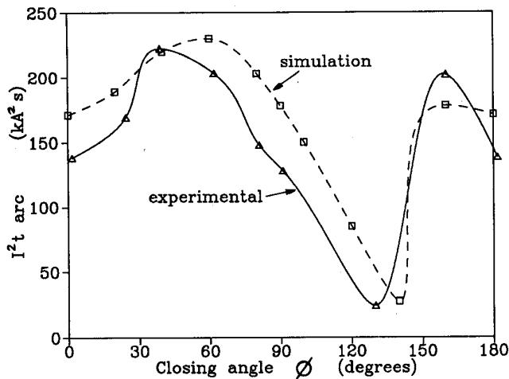  
Figure 6: Variation of $I^2 t_{\text{arc}}$ ( $I^2 t_{\text{total}} - I^2 t_{\text{melting}}$ ) vs. angle $\phi$ in a 15.8-kV rms circuit with a short-circuit capacity of 20 kA rms. Comparison of experimental results with simulation.

# Application of the model

The model will now be used to determine $I^2 t$ resulting from worst fault closing angle, and the relative merits of: reducing rise time of arc voltage, increasing of peak arc voltage and decay characteristic of arc voltage. The model will always be used to assess the current-limiting characteristic of a CL fuse as compared to an ideal device. The latter, as defined earlier, is a fuse which, for a maximum voltage at its terminals, best limits the amount of energy generated into a fault. The fault energy is equal to the fault resistance multiplied by $I^2 t_{total}$ . Naturally, the higher the voltage generated by the fuse, the more the fault energy will be reduced (eq. 1).

A sensitivity study will now be presented, focusing on three factors that describe the dynamic voltage of the fuse: the peak voltage, the rise time $t_m$ and the tail characteristic.

- The first analysis deals with the effect that the peak voltage produced by the fuse has on the $I^2 t$ into the fault. Four variants were analysed (see Fig. 7): simulation of a conventional CL fuse (1.6 p.u.); the same simulation (with the tail characteristic modified) that generate peak voltages of 1 and 2 p.u. respectively; and the ideal fuse with a peak of 1.6 p.u. It should be noted that 1 p.u. is defined as the normal peak phase-to-neutral voltage of the system to which the fuse is connected. The curves in Fig. 7 illustrate the variation of $I^2 t$ vs. angle $\phi$ of the source. In each case $I^2 t_{melting}$ is constant. These simulations

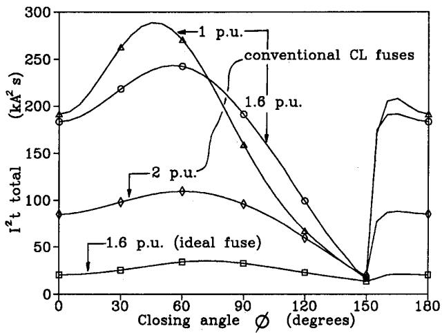  
Figure 7: Effect of peak voltage on curves of $I^2 t_{total}$ vs. angle $\phi$ for peak voltages of 1.0, 1.6 and 2.0 p.u. for the conventional CL fuse ( $t_m = 1300\mu s$ ) and 1.6 p.u. for the ideal fuse ( $t_m = 0$ ).

reveal a significant reduction of the maximum value of $I^2 t_{total}$ as the peak voltage increases (Table 1).

- The second analysis studies the effect of the rise time $t_m$ at the fuse terminals (Fig. 8). The model of the conventional CL fuse has been altered in this figure in order to obtain shorter rise times. To achieve this, only the value of $C_2$ in Fig. 4 was reduced. These simulations show also that lower rise times result in a significant reduction of the maximum value of $I^2 t_{total}$ (Table 2).

- The third study takes advantage of the model to combine the best characteristics of a CL fuse to create a so-called ultra fuse, which has both a short rise time (460 $\mu$ s) and a quasi-rectangular tail characteristic (Fig. 3). This fuse is compared to the conventional CL fuse ( $t_m = 1300\mu s$ ) and the ideal device ( $t_m = 0$ ). All three devices produce a peak voltage of 1.6 p.u. Summarized in Table 3, the simulations show that the relative values of the maximum values of $I^2 t_{total}$ for the ideal, ultra and conventional CL fuses are 1.0, 1.9 and 6.9 respectively.

Thus the simulations show to the fuse designer/user the difference in fault energy resulting from different voltage shape. However the designer must rely on his knowledge on how to modify the fuse's design to obtain the desired waveshape.

# Conclusion

An empirical model of a CL fuse has been developed. The model helps to determine the $I^2 t$ into a fault resulting from worst fault closing angle, and the relative

Table 1: Effect of CL fuse overvoltage ( $t_m = 1300 \, \mu s$ ) expressed as a relative value with respect to the maximum values of $I^2 t_{total}$ produced by the ideal fuse with a peak voltage of 1.6 p.u. ( $t_m = 0$ ).   

<table><tr><td rowspan="2">Peak voltage (p.u.)</td><td colspan="3">Conventional CL fuses</td><td>Ideal</td></tr><tr><td>1 p.u.</td><td>1.6 p.u.</td><td>2 p.u.</td><td>1.6 p.u.</td></tr><tr><td>max I2ttotal</td><td>8.5</td><td>7.1</td><td>3.2</td><td>1</td></tr></table>

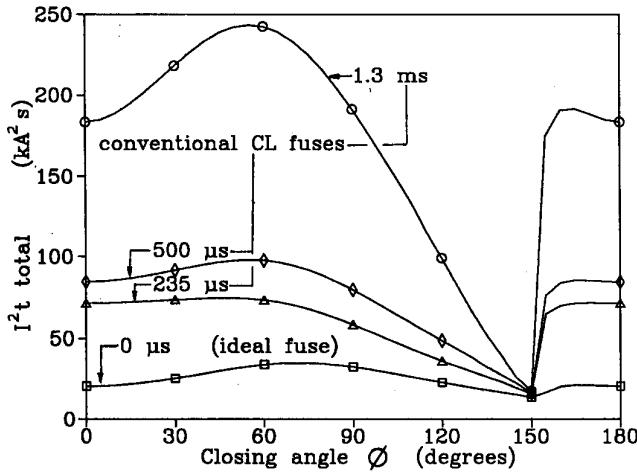  
Figure 8: Effect of $t_m$ on $I^2 t_{\text{total}}$ vs. angle $\phi$ for $t_m$ values of 1300, 500 and 235 $\mu$ s for the conventional CL fuse (peak voltage = 1.6 p.u.) and ideal fuse (1.6 p.u., $t_m = 0$ ).

Table 2: Effect of rise time $t_m$ of a 1.6-p.u. fuse vs. the maximum values of $I^2 t_{total}$ produced by the ideal fuse with an instantaneous $(t_m = 0)$ rise time (peak voltage = 1.6 p.u.).   

<table><tr><td rowspan="2">Rise time</td><td colspan="3">Conventional CL fuses</td><td>Ideal</td></tr><tr><td>1300 μs</td><td>500 μs</td><td>235 μs</td><td>0</td></tr><tr><td>max I²ttotal</td><td>7.1</td><td>2.9</td><td>2.2</td><td>1</td></tr></table>

Table 3: Comparison of maximum values of $I^2 t_{total}$ for the conventional CL and ultra fuse with respect to the ideal fuse, all of which produce a peak voltage of 1.6 p.u.   

<table><tr><td>Fuse type</td><td>Conventional CL tm=1300 μs</td><td>Ultra tm=460 μs</td><td>Ideal tm=0</td></tr><tr><td>max I²ttotal</td><td>6.9</td><td>1.9</td><td>1</td></tr></table>

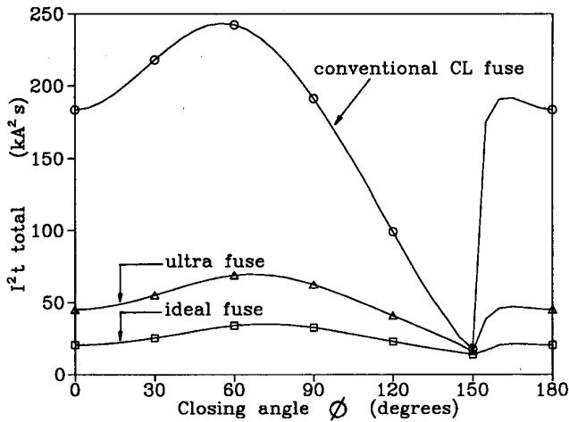  
Figure 9: Comparison curves of $I^2 t_{\text{total}}$ vs. angle $\phi$ for a conventional CL fuse ( $t_m = 1300 \mu s$ ), an ultra fuse ( $t_m = 460 \mu s$ ) and an ideal fuse ( $t_m = 0$ ), all of which produce a peak voltage of 1.6 p.u.

merits on the arc voltage of: reducing rise time, increasing of peak, and decay characteristic. When the fuse operates, the change in the voltage at the fuse terminals is represented by two events: the increase in the voltage which is simulated by a voltage ramp, and a plateau followed by the decrease of the voltage which are both modeled by a nonlinear resistance. The voltage ramp is approximated by the charging of a capacitor. The model is easy to build with available EMTP components combined with TACS control capacities.

The model parameters were determined on the basis of real tests on the fuse to be simulated, and the simulation revealed that the model manages to reproduce the reference test quite satisfactorily. Moreover, if the closing angle of the test source is varied, the model reproduces the same variations in $I^2 t$ as the tests. A sensitivity study performed with this model revealed that by raising the level of the voltage generated by the fuse and reducing the voltage rise time, the energy dissipated in the fault can be significantly reduced. Although this empirical model has inherent limitations, it is nevertheless a valuable tool for designers since it reveals the influence of the fuse voltage-time profile on the fault energy into the apparatus to be protected, as well as reducing the number of tests and development costs.

# Acknowledgments

The authors express sincere thanks to Mr. Vojislav Narancic who supplied the test results required for this study.

# References

[1] A. Hirose, “Mathematical Analysis of Breaking Performance of Current-Limiting Fuses,” Int. Conf. on Electric Fuses and their Applications, Liverpool, 7-9 April 1976, pp.182-191.   
[2] R. Wilkins, "Semiempirical Models of Arcing in Current-Limiting Fuses," 3rd Int. Symp. on Switching-Arc Phenomena, Lodtz, Poland, 1977, pp.338-342.   
[3] J.E. Daadler, "The Arcing Voltage in High-Voltage Fuses," Int. Conf. on Electric Fuses and their Applications, Trondheim, Norway, 13-15 June 1984, pp.212-219.   
[4] P.O. Leistad, H. Kongsjorden and J. Kulsetås, "Simulation of Short-Circuit Testing of High-Voltage Fuses," Int. Conf. on Electric Fuses and their Applications, 13-15 June 1984, Trondheim, Norway, pp.220-226.   
[5] S. Gnanalingam and R. Wilkins, “Digital Simulation of Fuse Breaking Tests,” Proc.IEE, Vol.127, Pt.C, No.6, November 1980, pp.434-440.   
[6] A. Wright and K.J. Beaumont, “Analysis of High-Breaking-Capacity Fuselink Arcing Phenomena,” Proc.IEE, Vol.123, No.3, March 1976, pp. 252-258.   
[7] W. Dolegowski, "Calculation of the Course of the Current and Voltage of a Current-Limiting Fuse," Int. Conf. on Electric Fuses and Their Applications, Liverpool, 7-9 April 1976, pp.218-230.   
[8] T. Lipski, “ $I^2 t$ values of Real and Ideal Semiconductor Fuses,” Int. Conf. on Electric Fuses and their Applications, Liverpool, 7-9 April 1976. Proc. pp. 233-234.   
[9] G. St-Jean and Y. Latour, "A Validated High-Voltage Arrester Model for Transient Network Analyser Applications," Electric Power Systems Research, Vol. 4, 1981, pp.181-189.   
[10] V.N. Narancic and G. Fecteau, "Arc Energy and Critical Tests for HV Current-Limiting Fuses," Int. Conf. on Electric Fuses and their Applications, Trondheim, Norway, 13-15 June 1984.   
[11] R. Wilkins, “Generalised Short-Circuit Characteristics for h.r.c. Fuses,” Proc.IEE, Vol.122, No.11, November 1975, pp.1289-1294.

# Biography

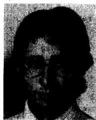

Andre Petit was born in Montréal, Canada, in 1958. He received his B.Sc.A degree in electrical engineering from Sherbrooke University in 1981. From 1982 to 1983, he worked as an engineer for Hydro-Québec until he joined the Electrical Apparatus group at IREQ in 1983. He is

now mainly involved in computer simulation of electrical circuits.

He is a member of the "Ordre des Ingénieurs du Québec".

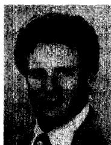

Guy St-Jean (M'76, SM'78) was born in Montréal, Canada, in 1941. He obtained his B.Sc. in mathematics and in physics in 1964 and an M.Sc. in Physics in 1977. From 1965, he worked in Hydro-Québec's power system testing division, where he took an active part

in the commissioning tests of the first Hydro-Québec 735-kV network. At IREQ since 1969, he is now Manager of Electrical apparatus division. He was responsible for the design and construction of IREQ's synthetic test circuit and has developed a new method of analysis for its design and operation.

He is senior member of IEEE, member of IEEE Switchgear Committee, Chairman of the Canadian IEC technical committee 17 on switchgear, a member of CIGRE Study Committee 13 on switching equipment, Vice-Chairman of the CSA technical committee on arresters, Chairman of the CEA working group on metal-oxide arresters and member of an IEEE working group on synthetic testing of AC circuit breakers.

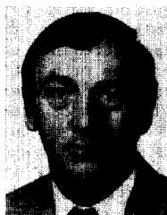

Gilles Fecteau was born in Quebec city, Canada, in 1938 and obtained his Electrical engineering technician degree from ICS, complemented by several technical courses. He worked since 1958 in distribution for The Shawinigan Water & Power Co., which has been

bought by Hydro-Québec. From 1964, he contributed to the start-up and operation of the 600 MW Tracy thermal generating station in the Electrical, Relays and Instrumentation divisions, then joined IREQ's research department on Electrical apparatus in 1975.

He was co-author of an I.R 100 Award received in 1982, and holds two patents.