# Algorithms for fast calculation of energization overvoltage of hybrid overhead line-cable transmission lines based on full frequency-dependent parameters

Borui Gu a , Han Li a , Shurong Li a , Xiaoguang Zhu a , Xuefeng Zhao b , Junbo Deng a,* Guanjun Zhang a

a State Key Laboratory of Electrical Insulation and Power Equipment, Xi’an Jiaotong University, Xi’an, 710049, China   
b Electric Power Research Institute of State Grid Shaanxi Electric Power Company, Xi’an, 710054, China

# A R T I C L E I N F O

Keywords:

Cable

Overhead line

Energization overvoltages

Modal theory

Numerical inverse Laplace transform

Full frequency-dependent parameters

# A B S T R A C T

This paper addresses the challenges associated with the time-consuming and complex nature of using electromagnetic transient (EMT) simulation software, such as PSCAD/EMTDC, for calculating transient overvoltages in complex power grids. To overcome these challenges, we propose a novel algorithm for fast calculation of energization overvoltages in hybrid overhead and cable transmission lines. The proposed algorithm begins by calculating the frequency-dependent parameters of the transmission lines in the full frequency domain. These parameters are then decoupled using phase-mode transformation. Subsequently, the algorithm derives the boundary conditions of the transmission line based on its topology, leading to corresponding complex frequencydomain voltage expressions. To obtain the calculation results of energization overvoltages along the hybrid transmission lines, the algorithm applies mode-phase transformation and an improved numerical inverse Laplace transform (NILT). To verify the accuracy and speed of the proposed algorithm, it is applied to a 330 kV hybrid overhead line and cable transmission system with a length of 56.8 km. The results demonstrate that the proposed algorithm achieves a maximum relative error of less than 0.261 % compared to the frequency-dependent phase model (FDPM) used in PSCAD. Additionally, the calculation time of the proposed algorithm is shown to be only 32.654 % – 58.649 % of the FDPM’s calculation time.

# 1. Introduction

Overhead lines (OHLs) have been partially or completely replaced by underground cables in urban areas due to increasing land costs [1]. However, the combination of OHLs and underground cables in hybrid transmission lines introduces differences in transient overvoltage behavior, particularly for no-load energization overvoltages, which can have a significant impact on insulation levels. In addition, the transient overvoltage simulation of hybrid cable and overhead transmission systems using electromagnetic transient (EMT) simulation software is time-consuming, which may significantly reduce the efficiency of engineering and research work [2]. Therefore, accurate and efficient calculation and calibration of no-load energization overvoltages are crucial for hybrid OHL and cable transmission lines.

Existing EMT models for calculating no-load energization overvoltages can be categorized into lumped parameter models and

distributed parameter models [3]. The lumped parameter model, such as the π model, is commonly used in power frequency steady-state studies but is limited for transient analysis as it does not consider wave propagation [4]. Distributed parameter models include frequency-independent and frequency-dependent models. The frequency-independent model, like the Bergeron model, offers more accurate power loss approximation compared to the π model by incorporating distributed parameters and lumped parameter resistance [5]. Frequency-dependent models, such as the J. Marti model, Noda model, and FDPM (frequency-dependent phase model), consider the frequency-dependent characteristics of transmission line parameters. The J. Marti model, based on modal theory, utilizes rational function approximation and implicit integration for time-domain response calculation. However, it can lead to calculation errors for coaxial cable lines and requires user-specified calculation frequency, introducing potential errors [6]. The Noda model is considered the most rigorous

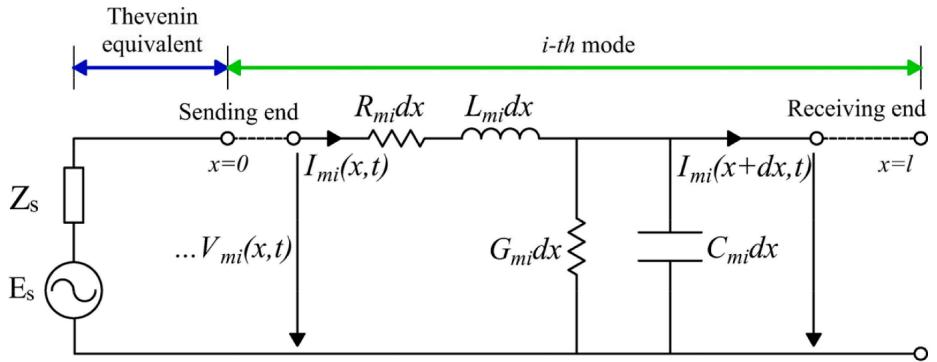  
Fig. 1. Diagram of the equivalent circuit of mode domain circuit.

frequency-dependent model but suffers from a large number of full matrices, reducing computational speed, and convergence issues in certain cases [7]. FDPM, recognized as the highly precise, advanced, and extensively employed EMT calculation model in existing software worldwide, is founded on the fundamental transmission line model theory [8]. In contrast to other models, FDPM uniquely incorporates the propagation coefficient and characteristic impedance to represent transmission lines, recognizing their frequency-dependent nature. By calculating discrete values of these parameters in the frequency domain, FDPM effectively obtains time domain results through the utilization of rational function approximation and convolution methods [9].

Additionally, researchers have proposed novel EMT models for OHLs and cables. I. Kocar et al. developed a precise frequency-dependent model based on the traveling-wave method, focusing on accurate derivation of the propagation function in the mode domain [10]. Li et al. proposed a calculation method for determining the dominant frequency of energization overvoltages in pure cables and hybrid transmission lines, improving the accuracy of dominant frequency calculation [11]. Ye et al. introduced a multiscale frequency-dependent model for OHLs, employing transient frequency adaptivity to enhance computational speed and time step in the time domain [12]. Ghazizadeh et al. proposed an algorithm for calculating energization overvoltages of DC cables and OHLs using lumped parameter transmission lines, considering frequency-dependent characteristics and skin/proximity effects [13]. Han Li et al. proposed a fast algorithm for calculating energization overvoltages of pure cables, calculating frequency-dependent parameters at the dominant frequency to improve computational speed [14].

Although FDPM and other EMT models exhibit accuracy in calculating energization overvoltages, they rely on equivalent circuits, limiting computational efficiency. Shorter transmission lines necessitate smaller time steps (Δt), significantly slowing down calculations. Additionally, existing EMT simulation software, such as PSCAD/EMTDC in volves complex modeling processes that impede efficiency in theoretical research and engineering calculations. While some EMT algorithms proposed by scholars offer computational speed advantages, they are often limited to simpler transmission line topologies and may not account for frequency-dependent characteristics or complex hybrid transmission lines.

To address these limitations, this study proposes algorithms for fast calculation of energization overvoltages in hybrid OHL and cable transmission lines based on full frequency-dependent parameters. By eliminating the requirement for the time step (Δt) to be smaller than the propagation time (τ) of voltage waves in the transmission lines, the proposed algorithm significantly improves computational speed compared to existing electromagnetic transient (EMT) models like FDPM [14]. Furthermore, the algorithm calculates the frequency-dependent parameters of the transmission line in the complete frequency domain, thereby fully considering the frequency-dependent characteristics of the transmission line parameters and enhancing the accuracy of the energization overvoltage calculation.

Additionally, the proposed algorithm simplifies the modeling process of the transmission system, resulting in improved modeling efficiency for complex transmission systems.

The structure of the paper is as follows: Section 2 provides a detailed explanation of the theoretical foundation and specific details of the proposed algorithm. Section 3 presents the establishment of a power system model based on a 330 kV hybrid transmission system located in Northwest China. In Section 4, the performance of the algorithm is compared and analyzed in terms of calculation accuracy and computational speed. Finally, Section 5 presents the conclusions drawn from the study.

# 2. Calculation of energization overvoltages of hybrid OHL and cable transmission lines

# 2.1. Modal theory and improved numerical inverse Laplace transform

Telegraph equations are commonly employed to multi-conductor transmission systems, encompassing both overhead lines and underground cables. In the complex frequency domain, these equations can be expressed as [15]

$$
\left\{ \begin{array}{l} \frac {\mathrm {d} ^ {2} V _ {\mathbf {p}} (x , s)}{\mathrm {d} x ^ {2}} = Z _ {\mathbf {p}} (s) \cdot Y _ {\mathbf {p}} (s) \cdot V _ {\mathbf {p}} (x, s) \\ \frac {\mathrm {d} ^ {2} I _ {\mathbf {p}} (x , s)}{\mathrm {d} x ^ {2}} = Y _ {\mathbf {p}} (s) \cdot Z _ {\mathbf {p}} (s) \cdot I _ {\mathbf {p}} (x, s) \end{array} \right. \tag {1}
$$

where ${ \bf { v } } _ { p } ( x , s )$ and $I _ { p } ( x , s )$ are the complex frequency-domain and phasedomain voltage and current vectors of the multi-conductor transmission system at position x, respectively, and $\mathbf { \delta } _ { Z _ { p } ( s ) }$ and $\pmb { Y _ { p } ( s ) }$ are the frequencydependent series impedance and parallel admittance matrices of the multi-conductor transmission system, respectively.

$z _ { p }$ and $\mathbf { Y } _ { p }$ are not diagonal matrices because of the electromagnetic coupling between conductors, which makes it difficult to solve the differential equations in Eq. (1). To solve this problem, the modal theory can be used to transform the phase-domain frequency-dependent parameters of the transmission line into mode-domain frequency-dependent parameters [15]. The voltage transformation matrix A and current transformation matrix $\mathbf { \delta } _ { \mathbf { \delta B } , \mathbf { \delta } }$ as shown in Eq. (2), are utilized to diagonalize $Z _ { p } ( s ) { \cdot } Y _ { p } ( s )$ or ${ \pmb Y } _ { p } ( s ) { \pmb \cdot } { \pmb Z } _ { p } ( s )$ . This decoupling process separates the coupled differential equations within the abovementioned system of differential equations, as shown in Eq. (3).

$$
\left\{ \begin{array}{l} \boldsymbol {V} _ {\mathbf {p}} (x, s) = \boldsymbol {A} \cdot \boldsymbol {V} _ {\mathbf {m}} (x, s) \\ \boldsymbol {I} _ {\mathbf {p}} (x, s) = \boldsymbol {B} \cdot \boldsymbol {I} _ {\mathbf {m}} (x, s) \end{array} \right. \tag {2}
$$

$$
\left\{ \begin{array}{l} \frac {\mathrm {d} ^ {2} \boldsymbol {V} _ {\mathbf {m}} (x , s)}{\mathrm {d} x ^ {2}} = \boldsymbol {A} ^ {- 1} \cdot \boldsymbol {Z} _ {\mathbf {p}} (s) \cdot \boldsymbol {Y} _ {\mathbf {p}} (s) \cdot \boldsymbol {A} \cdot \boldsymbol {V} _ {\mathbf {m}} (x, s) = \boldsymbol {\Lambda} (s) \cdot \boldsymbol {V} _ {\mathbf {m}} (x, s) \\ \frac {\mathrm {d} ^ {2} \boldsymbol {I} _ {\mathbf {m}} (x , s)}{\mathrm {d} x ^ {2}} = \boldsymbol {B} ^ {- 1} \cdot \boldsymbol {Y} _ {\mathbf {p}} (s) \cdot \boldsymbol {Z} _ {\mathbf {p}} (s) \cdot \boldsymbol {B} \cdot \boldsymbol {I} _ {\mathbf {m}} (x, s) = \boldsymbol {\Lambda} (s) \cdot \boldsymbol {I} _ {\mathbf {m}} (x, s) \end{array} \right. \tag {3}
$$

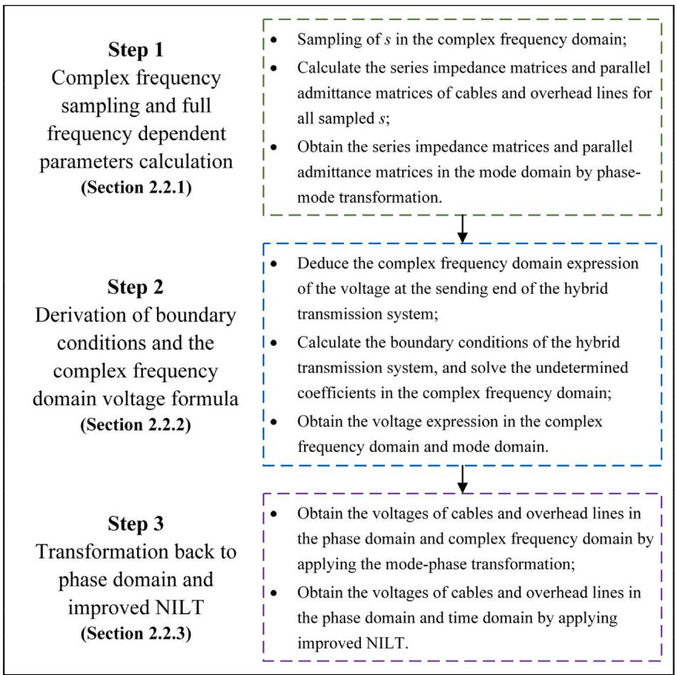  
Fig. 2. Workflow of algorithm based on full frequency-dependent parameters.

where m indicates that the parameter is in the modal domain. Λ(s) is a diagonal matrix obtained by the phase-mode transformation of $Z _ { p } ( s ) \cdot$ ⋅ $\mathbf { Y } _ { p } ( s )$ or $\pmb { Y } _ { p } ( s ) { \cdot } \pmb { Z } _ { p } ( s )$ , as shown in Eq. (5). Each diagonal element in $\Lambda ( s )$ represents a specific mode-domain circuit, the equivalent circuit of which is shown in Fig. 1.

The relationship between the voltage transformation matrix A and current transformation matrix B is shown in Eq. (4).

$$
\boldsymbol {A} = \boldsymbol {B} ^ {- \mathrm {T}} \tag {4}
$$

$$
\boldsymbol {\Lambda} (s) = \mathbf {Z} _ {\mathbf {m}} (s) \cdot \mathbf {Y} _ {\mathbf {m}} (s) = \mathbf {Y} _ {\mathbf {m}} (s) \cdot \mathbf {Z} _ {\mathbf {m}} (s) \tag {5}
$$

where $Z _ { m } ( s )$ and $\pmb { Y _ { m } ( s ) }$ represent the per-unit-length mode-domain frequency-dependent series impedance matrix and parallel admittance matrix of the multi-conductor transmission system, respectively, as shown in Eq. (6).

$$
\left\{ \begin{array}{l} Z _ {\mathrm {m}} = A ^ {- 1} \cdot Z _ {\mathrm {p}} \cdot B \\ Y _ {\mathrm {m}} = B ^ {- 1} \cdot Y _ {\mathrm {p}} \cdot A \end{array} \right. \tag {6}
$$

To transform the complex frequency-domain voltage expression obtained from solving Eq. (3) into the time domain, a numerical inverse Laplace transform (NILT) algorithm, based on the fast Fourier transform (FFT), inverse fast Fourier transform (IFFT) algorithm, and the quotientdifference (q-d) algorithm, was employed to simplify the calculation process and improve computational efficiency [16]. The principle of the n-dimensional inverse Laplace inverse transform is expressed by Eq. (7).

$$
f (t) = \frac {1}{(2 \pi j) ^ {n}} \int_ {c _ {1} - j \infty} ^ {c _ {1} + j \infty} \dots \int_ {c _ {n} - j \infty} ^ {c _ {n} + j \infty} F (s) \exp \left(s t ^ {T}\right) \prod_ {i = 1} ^ {n} d s _ {i} \tag {7}
$$

where s represents an n-dimensional complex frequency vector with its i th element si shown in Eq. (8), t represents an n-dimensional time vector, F(s) represents the n-dimensional image function to be inverted using the Laplace transform, and f(t) represents the n-dimensional original function.

$$
s _ {i} = c _ {i} + j \omega_ {i} \tag {8}
$$

By substituting $\operatorname { E q . }$ (8) into Eq. (7), as well as applying the rectangular numerical integration method and n-fold partial inverse Laplace transform, Eq. (9) can be obtained as

$$
\widetilde {F} _ {i - 1} \left(\boldsymbol {p} _ {i - 1}\right) = \frac {e ^ {c _ {i} N _ {s i} \Delta t _ {i}}}{\tau_ {i}} \sum_ {m = - \infty} ^ {\infty} \widetilde {F} _ {i} \left(\boldsymbol {p} _ {i}\right) e ^ {j 2 \pi m N _ {s i} \Delta t _ {i} / \tau_ {i}} \tag {9}
$$

where $N _ { s i }$ represents the number of time sampling points for the i th dimension of the Laplace inverse transform, Δt is the time step of the i th dimension of the Laplace inverse transform, and the expression for pi can be found in previous research [16].

By utilizing the FFT, IFFT, and q-d algorithms to solve Eq. (9), the results in the time domain can be obtained. When calculating the energization overvoltages of the transmission lines, the value of n in the above equation was set to 1.

# 2.2. Algorithms for fast calculation of the energization overvoltages of hybrid transmission lines

The algorithm based on full frequency-dependent parameters consists of three steps, as shown in Fig. 2, which will be detailed in Sections $2 . 2 . 1 { - } 2 . 2 . 3$ , respectively. Each step involves the mutual transformation between the time domain, complex frequency domain, phase domain,

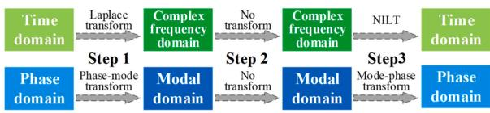  
Fig. 3. Transformation relationships between domains in each step.

and mode domain, as shown in Fig. 3.

# 2.2.1. Complex frequency sampling and full frequency-dependent parameter calculation

To solve the telegraph equations, precise calculation formulas for the parameters of the transmission lines are required. Consider an overhead line structure comprising three conductors and two overhead ground wires, with their corresponding electrical and geometric parameters presented in Fig. 4.

To obtain the series impedance matrix $z _ { p }$ of the overhead lines, it is necessary to add the internal impedance matrix Zi and the earth return impedance matrix $z _ { e } ,$ as shown in Eq. (10).

$$
\begin{array}{l} Z _ {p} = Z _ {i} + Z _ {e} \\ = \left[ \begin{array}{c c c c c} Z _ {i 1} & 0 & \dots & 0 & 0 \\ 0 & Z _ {i 2} & \dots & 0 & 0 \\ \vdots & \vdots & \ddots & \vdots & \vdots \\ 0 & 0 & \dots & Z _ {i, n - 1} & 0 \\ 0 & 0 & \dots & 0 & Z _ {i n} \end{array} \right] \\ + \left[ \begin{array}{c c c c c} Z _ {e 1 1} & Z _ {e 1 2} & \dots & Z _ {e, 1, n - 1} & Z _ {e 1 n} \\ Z _ {e 2 1} & Z _ {e 2 2} & \dots & Z _ {e, 2, n - 1} & Z _ {e 2 n} \\ \vdots & \vdots & \ddots & \vdots & \vdots \\ Z _ {e, n - 1, 1} & Z _ {e, n - 1, 2} & \dots & Z _ {e, n - 1, n - 1} & Z _ {e, n - 1, n} \\ Z _ {e n 1} & Z _ {e n 2} & \dots & Z _ {e, n, n - 1} & Z _ {e n n} \end{array} \right] \tag {10} \\ \end{array}
$$

The parallel admittance matrix $Y _ { p }$ of an OHL can be calculated using Eq. (11), where P is the potential coefficient matrix. The expressions for calculating each parameter of $z _ { p }$ and $Y _ { p }$ can be found in previous research [17].

$$
Y _ {P} = s \cdot P ^ {- 1} \tag {11}
$$

Fig. 5 illustrates the cross-sectional area of three-phase single-core cross-bonding power cables, which are commonly used as underground cables. Additionally, the sheath-bonding method is illustrated in Fig. 6.

To calculate the series impedance matrix $z _ { p }$ and parallel admittance matrix $\mathbf { Y } _ { p }$ for three-phase single-core cross-bonding power cables, it is first necessary to compute the series impedance matrix $z _ { p 0 }$ and parallel admittance matrix $Y _ { p 0 }$ of both ends of the bonded cable, as shown in Eqs. (12) and (13), respectively. The calculation formulas for each

element can be found in a previous study [18].

$$
Z _ {p 0} = Z _ {i} + Z _ {e} = \left[ \begin{array}{c c c c} Z _ {i 1} & 0 & \dots & 0 \\ 0 & Z _ {i 2} & \dots & 0 \\ \vdots & \vdots & \ddots & \vdots \\ 0 & 0 & \dots & Z _ {i n} \end{array} \right] + \left[ \begin{array}{c c c c} Z _ {e 1 1} & Z _ {e 1 2} & \dots & Z _ {e 1 n} \\ Z _ {e 1 2} & Z _ {e 2 2} & \dots & Z _ {e 2 n} \\ \vdots & \vdots & \ddots & \vdots \\ Z _ {e 1 n} & Z _ {e 2 n} & \dots & Z _ {e m n} \end{array} \right] \tag {12}
$$

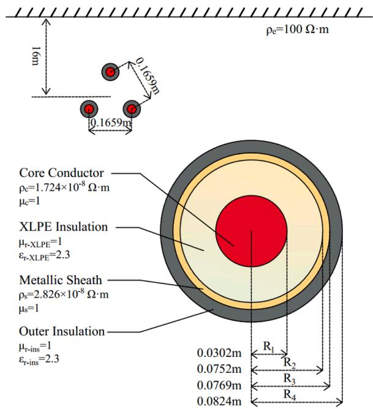  
Fig. 5. Cross-sectional view of three-phase cross-bonding underground cables.

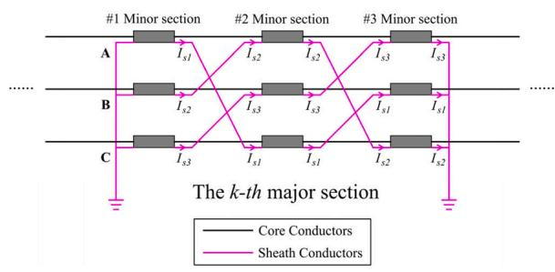  
Fig. 6. Schematic of the cross-bonding sheath for power cables.

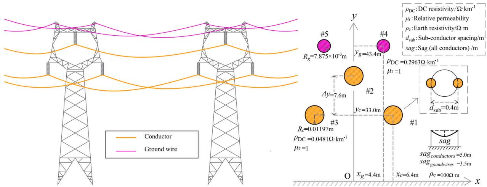  
Fig. 4. Schematic of structure and parameters of overhead lines.

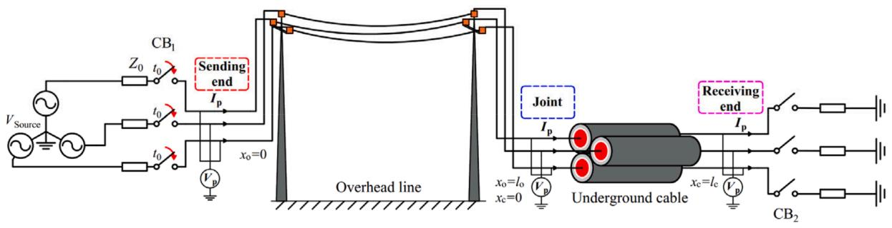

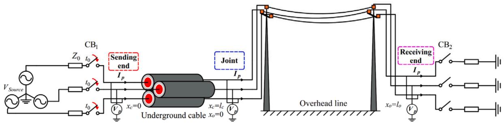  
(a) Topology of OHL-underground cable   
(b) Topology of underground cable-OHL   
Fig. 7. Diagram of hybrid transmission line structure of underground cable and OHL.

$$
Y _ {p 0} = s \cdot P ^ {- 1} = s \cdot \left[ \begin{array}{c c c c} P _ {1} & 0 & \dots & 0 \\ 0 & P _ {2} & \dots & 0 \\ \vdots & \vdots & \ddots & \vdots \\ 0 & 0 & \dots & P _ {n} \end{array} \right] ^ {- 1} \tag {13}
$$

Once the series impedance matrix $z _ { p 0 }$ and parallel admittance matrix $Y _ { p 0 }$ for both ends of the bonded cables are obtained, the series impedance matrix $z _ { p }$ and parallel admittance matrix $\mathbf { Y } _ { p }$ of the cross-bonding cables can be calculated using Eq. (14) [19].

$$
\left\{ \begin{array}{l} Z _ {p} = \left(Z _ {p 0} + C _ {r} \cdot Z _ {p 0} \cdot C _ {r} ^ {- 1} + C _ {r} ^ {- 1} \cdot Z _ {p 0} \cdot C _ {r}\right) / 3 \\ Y _ {p} = \left(Y _ {p 0} + C _ {r} \cdot Y _ {p 0} \cdot C _ {r} ^ {- 1} + C _ {r} ^ {- 1} \cdot Y _ {p 0} \cdot C _ {r}\right) / 3 \end{array} \right. \tag {14}
$$

where $C _ { r }$ is the rotation matrix shown in Eq. (15).

$$
C _ {r} = \left[ \begin{array}{l l} C _ {r 1} & 0 \\ 0 & C _ {r 2} \end{array} \right] \tag {15}
$$

where

$$
C _ {r} = \left[ \begin{array}{l l l} 1 & 0 & 0 \\ 0 & 1 & 0 \\ 0 & 0 & 1 \end{array} \right] \tag {16}
$$

$$
C _ {r 2} = \left[ \begin{array}{l l l} 0 & 0 & 1 \\ 1 & 0 & 0 \\ 0 & 1 & 0 \end{array} \right] \tag {17}
$$

After obtaining the frequency-dependent parameter formulas for the OHLs and underground cables, all complex frequency sampling points can be substituted into the corresponding formulas to yield the series impedance and parallel admittance matrices of the transmission line in the full frequency domain. Thereafter, by employing the phase-mode transformation, the series impedance matrix and parallel admittance matrix in the phase domain can be converted into the mode domain, as shown in Eq. (6), thereby achieving electromagnetic decoupling between the parameters. This section completes the transformation from

the time domain to the complex frequency domain and from the phase domain to the mode domain.

# 2.2.2. Derivation of boundary conditions and complex frequency domain voltage formula

Precise calculation of boundary conditions is crucial for achieving accurate results, which are closely related to both the parameters and topology of the transmission lines. According to the location difference of the OHL and underground cable, two different topologies are shown in Fig. 7, including the ‘OHL-underground cable’ topology and ‘underground cable-OHL’ topology. The two topologies consist of three boundary points: the sending end, joint point, and receiving end. VSource represent the source, while CB1 and CB2 denote the circuit breakers.

Before deriving and calculating the boundary conditions, it is essential to obtain the equivalent complex frequency domain and phase domain voltage $V _ { S o u r c e } ( s )$ of the three-phase power source, considering the circuit breaker closing condition in the phase domain, as illustrated in Fig. 7. The expressions for the three-phase power source voltage, $V _ { \mathrm { S o u r c e } } ( t )$ , in the time domain and phase domain are as follows:

$$
\boldsymbol {V} _ {\text {S o u r c e}} (t) = \left[ V _ {\text {S o u r c e 1}} (t), V _ {\text {S o u r c e 2}} (t), V _ {\text {S o u r c e 3}} (t) \right] ^ {\mathrm {T}} \tag {18}
$$

where

$$
\left\{ \begin{array}{l} V _ {\text {S o u r c e 1}} (t) = V _ {\max } \cdot \sin \left(\omega_ {0} t + \phi\right) \\ V _ {\text {S o u r c e 2}} (t) = V _ {\max } \cdot \sin \left(\omega_ {0} t + \phi - 1 2 0 ^ {\circ}\right) \\ V _ {\text {S o u r c e 3}} (t) = V _ {\max } \cdot \sin \left(\omega_ {0} t + \phi + 1 2 0 ^ {\circ}\right) \end{array} \right. \tag {19}
$$

where $V _ { \mathrm { m a x } }$ is the phase-voltage amplitude of the source, $\omega _ { 0 } = 2 \pi f _ { O } ,$ , where $f _ { O }$ is the power frequency, and $\phi$ is the initial phase angle.

Assuming that CB1 is closed at time $t = t _ { O } ,$ the equivalent complex frequency domain voltage vector expression of the three-phase power source in the phase domain can be derived based on the latency property of the Laplace transform, as given below:

$$
\boldsymbol {V} _ {\text {S o u r c e}} (s) = V _ {\max } \cdot \exp (- s t _ {0}) \cdot \left[ V _ {\text {S o u r c e 1}}, V _ {\text {S o u r c e 2}}, V _ {\text {S o u r c e 3}} \right] ^ {\mathrm {T}} \tag {20}
$$

where

$$
\left\{ \begin{array}{l} V _ {\text {S o u r c e 1}} = \cos \phi \cdot k _ {\mathrm {a}} + \sin \phi \cdot k _ {\mathrm {b}} \\ V _ {\text {S o u r c e 2}} = \cos (\phi - 1 2 0 ^ {\circ}) \cdot k _ {\mathrm {a}} + \sin (\phi - 1 2 0 ^ {\circ}) \cdot k _ {\mathrm {b}} \\ V _ {\text {S o u r c e 3}} = \cos (\phi + 1 2 0 ^ {\circ}) \cdot k _ {\mathrm {a}} + \sin (\phi + 1 2 0 ^ {\circ}) \cdot k _ {\mathrm {b}} \end{array} \right. \tag {21}
$$

and

$$
\left\{ \begin{array}{l} k _ {\mathrm {a}} = \frac {\omega_ {0} \cdot \cos \left(\omega_ {0} t _ {0}\right)}{s ^ {2} + \omega_ {0} ^ {2}} + \frac {s \cdot \sin \left(\omega_ {0} t _ {0}\right)}{s ^ {2} + \omega_ {0} ^ {2}} \\ k _ {\mathrm {b}} = \frac {s \cdot \cos \left(\omega_ {0} t _ {0}\right)}{s ^ {2} + \omega_ {0} ^ {2}} - \frac {\omega_ {0} \cdot \sin \left(\omega_ {0} t _ {0}\right)}{s ^ {2} + \omega_ {0} ^ {2}} \end{array} \right. \tag {22}
$$

Then, by substituting the series impedance matrix $\pmb { Z _ { \mathbf { p } } } ( s )$ and parallel admittance matrix $\pmb { Y _ { \mathfrak { p } } } ( s )$ of the OHL and underground cables, as well as the voltage and current transformation matrices obtained in Section 2.1 into the telegraph equations (3), the complex frequency domain voltage expressions for the underground cable (denoted by subscript ‘c’) and the OHL (denoted by subscript ‘o’) in the mode domain can be obtained, as presented in Eqs. (23) and (24), respectively:

$$
\left\{ \begin{array}{l} \boldsymbol {V} _ {m c} \left(x _ {c}, s\right) = \boldsymbol {E} _ {n x c} (s) \cdot \boldsymbol {F} _ {1 c} (s) + \boldsymbol {E} _ {p x c} (s) \cdot \boldsymbol {F} _ {2 c} (s) \\ \boldsymbol {I} _ {m c} \left(x _ {c}, s\right) = \boldsymbol {Z} _ {m c c} ^ {- 1} (s) \cdot \left[ \boldsymbol {E} _ {n x c} (s) \cdot \boldsymbol {F} _ {1 c} (s) - \boldsymbol {E} _ {p x c} (s) \cdot \boldsymbol {F} _ {2 c} (s) \right] \end{array} \right. \tag {23}
$$

$$
\left\{ \begin{array}{l} V _ {m o} \left(x _ {o}, s\right) = E _ {n x o} (s) \cdot F _ {1 o} (s) + E _ {p x o} (s) \cdot F _ {2 o} (s) \\ I _ {m o} \left(x _ {o}, s\right) = Z _ {m c o} ^ {- 1} (s) \cdot \left[ E _ {n x o} (s) \cdot F _ {1 o} (s) - E _ {p x o} (s) \cdot F _ {2 o} (s) \right] \end{array} \right. \tag {24}
$$

where $V _ { \mathbf { m } } ( x _ { 0 } , s )$ and $I _ { \mathrm { m } } ( x _ { 0 } , s )$ represent the complex frequency domain voltage and current vectors of the OHL/underground cable at location $x _ { o }$ in the mode domain, respectively. $F _ { 1 } ( s )$ and $F _ { 2 } ( s )$ are the undetermined coefficient vectors in the voltage and current expressions, respectively, for the OHL/underground cable. Matrices $\scriptstyle { E _ { n x } ( s ) }$ and $\pmb { { \cal E } } _ { p x } ( s )$ are diagonal matrices with their diagonal elements being $\exp ( - \gamma _ { \mathrm { m } i } x _ { 0 } )$ and exp $\cdot \gamma _ { \mathrm { m } i } x _ { 0 } ) ,$ , respectively. Here, $\gamma _ { m i } ( s )$ is the propagation constant of the i th modal loop of the OHL/underground cable, which can be calculated according to Eq. (25). $z _ { m c } ( s )$ is a diagonal matrix composed of the characteristic impedances of the modal loops of the OHL/underground cable, as expressed in Eq. (26).

$$
\gamma_ {m i} = \sqrt {\mathrm {Z} _ {m i} (s) \cdot Y _ {m i} (s)} \tag {25}
$$

$$
Z _ {m c} (s) = Z _ {m} (s) \cdot Y _ {m} ^ {- 1} (s) \tag {26}
$$

To determine the coefficient vectors $F _ { 1 } ( s )$ and $F _ { 2 } ( s )$ in Eqs. (23) and (24), it is essential to derive the boundary conditions of the transmission

$$
\left\{ \begin{array}{l} \boldsymbol {V} _ {\mathbf {p o 1 3}} (0, s) = \boldsymbol {V} _ {\text {S o u r c e}} (s) - \boldsymbol {Z} _ {\mathbf {0}} (s) \cdot \boldsymbol {I} _ {\mathbf {p o 1 3}} (0, s) \\ \boldsymbol {V} _ {\mathbf {p o 4 5}} (0, s) = \mathbf {0} \end{array} \right. \tag {27}
$$

(2) At the joint point, the voltages and currents of the three-phase conductor of the OHL and cable core must be identical. Furthermore, following Eq. (28), the voltages of the two overhead ground wires and cable sheath should be equal to zero.

$$
\left\{ \begin{array}{l} V _ {\mathrm {p o} 1 3} \left(l _ {\mathrm {o}}, s\right) = V _ {\mathrm {p c} 1 3} (0, s) \\ I _ {\mathrm {p o} 1 3} \left(l _ {\mathrm {o}}, s\right) = I _ {\mathrm {p c} 1 3} (0, s) \\ V _ {\mathrm {p o} 4 5} \left(l _ {\mathrm {o}}, s\right) = \mathbf {0} \\ V _ {\mathrm {p c} 4 6} (0, s) = \mathbf {0} \end{array} \right. \tag {28}
$$

(3) At the receiving end, the current in the cable core should be zero. Additionally, following Eq. (29), the voltage of the cable sheath must be equal to zero.

$$
\left\{ \begin{array}{l} I _ {\mathrm {p c 1 3}} \left(l _ {\mathrm {c}}, s\right) = \mathbf {0} \\ V _ {\mathrm {p c 4 6}} \left(l _ {\mathrm {c}}, s\right) = \mathbf {0} \end{array} \right. \tag {29}
$$

In Eqs. (27)–(29), the subscript ‘13’ represents the cable core or the conductor of OHL, the subscript ${ \bf \cdot } _ { 4 5 } ,$ represents the ground wire of OHL, and the subscript ‘46’ represents the cable sheath. $l _ { \mathrm { c } }$ represents cable length. $V _ { \mathrm { p c 1 3 } } ( x _ { \mathrm { c } } , s )$ , $V _ { \mathrm { p c } 4 6 } ( x _ { \mathrm { c } } , s )$ , and $I _ { \mathbf { p c } 1 3 } ( x _ { \mathrm { c } } , s )$ are defined in $\operatorname { E q } .$ . (30).

$$
\left\{ \begin{array}{l} V _ {\mathrm {p c} 1 3} \left(x _ {\mathrm {c}}, s\right) = A _ {\mathrm {c} 1 3} \cdot V _ {\mathrm {m c}} \left(x _ {\mathrm {c}}, s\right) \\ V _ {\mathrm {p c} 4 6} \left(x _ {\mathrm {c}}, s\right) = A _ {\mathrm {c} 4 6} \cdot V _ {\mathrm {m c}} \left(x _ {\mathrm {c}}, s\right) \\ I _ {\mathrm {p c} 1 3} \left(x _ {\mathrm {c}}, s\right) = B _ {\mathrm {c} 1 3} \cdot I _ {\mathrm {m c}} \left(x _ {\mathrm {c}}, s\right) \end{array} \right. \tag {30}
$$

By deducing Eqs. (27)–(30), a system of linear equations can be derived to solve for the undetermined coefficient vectors $F _ { 1 0 } ( s ) , F _ { 2 0 } ( s ) _ { \mathrm { ~ \scriptsize ~ . ~ } }$ , $F _ { 1 \mathbf { c } } ( s ) ,$ , and $\pmb { F } _ { 2 \mathbf { c } } ( s )$ . The resulting equation system consists of 22 linear equations and is presented in Eq. (31).

$$
\left[ \begin{array}{c c} C _ {1} ^ {(0 - c)} & 0 \\ \dots & \dots \\ C _ {2} ^ {(0 - c)} & C _ {3} ^ {(0 - c)} \\ \dots & \dots \\ C _ {4} ^ {(0 - c)} & 0 \\ \dots & \dots \\ 0 & C _ {5} ^ {(0 - c)} \end{array} \right] \left[ \begin{array}{c} F _ {1 \mathrm {o}} (s) \\ \dots \\ F _ {2 \mathrm {o}} (s) \\ \dots \\ F _ {1 \mathrm {c}} (s) \\ \dots \\ F _ {2 \mathrm {c}} (s) \end{array} \right] = \left[ \begin{array}{c} V _ {\text {S o u r c e}} (s) \\ 0 \end{array} \right] \tag {31}
$$

where

$$
\begin{array}{l} C _ {1} ^ {(0 - c)} = \left[ \begin{array}{c c} A _ {\mathrm {o} 1 3} + Z _ {0} (s) \cdot B _ {\mathrm {o} 1 3} \cdot Z _ {\mathrm {m c o}} ^ {- 1} (s) & A _ {\mathrm {o} 1 3} - Z _ {0} (s) \cdot B _ {\mathrm {o} 1 3} \cdot Z _ {\mathrm {m c o}} ^ {- 1} (s) \\ A _ {\mathrm {o} 4 5} & A _ {\mathrm {o} 4 5} \end{array} \right] \\ C _ {2} ^ {(0 - c)} = \left[ \begin{array}{c c} A _ {\mathrm {o} 1 3} \cdot E _ {\mathrm {n l o}} (s) & A _ {\mathrm {o} 1 3} \cdot E _ {\mathrm {p l o}} (s) \\ B _ {\mathrm {o} 1 3} \cdot Z _ {\mathrm {m c o}} ^ {- 1} (s) \cdot E _ {\mathrm {n l o}} (s) & - B _ {\mathrm {o} 1 3} \cdot Z _ {\mathrm {m c o}} ^ {- 1} (s) \cdot E _ {\mathrm {p l o}} (s) \end{array} \right] \end{array} \tag {33}
$$

system based on its topology. The boundary conditions are derived in the complex frequency and phase domains.

For the ‘OHL-underground cable’ topology illustrated in Fig. 7(a), its boundary conditions must fulfill the following conditions:

(1) At the sending end, the voltages of the three-phase conductor of the OHL must be identical to the difference between $V _ { \sf S o u r c e } ( s )$ , as defined in Eq. (20) and the voltage of the power source impedance $\scriptstyle z _ { 0 } .$ Moreover, the voltages of the two overhead ground wires at this location should be zero, as shown in Eq. (27).

$$
\boldsymbol {C} _ {3} ^ {(0 - c)} = \left[ \begin{array}{c c} - \boldsymbol {A} _ {\mathrm {c} 1 3} & - \boldsymbol {A} _ {\mathrm {c} 1 3} \\ - \boldsymbol {B} _ {\mathrm {c} 1 3} \cdot \boldsymbol {Z} _ {\mathrm {m c c}} ^ {- 1} (s) & \boldsymbol {B} _ {\mathrm {c} 1 3} \cdot \boldsymbol {Z} _ {\mathrm {m c c}} ^ {- 1} (s) \end{array} \right] \tag {34}
$$

$$
C _ {4} ^ {(0 - c)} = \left[ A _ {0 4 5} \cdot E _ {\mathrm {n l o}} (s) \quad A _ {0 4 5} \cdot E _ {\mathrm {p l o}} (s) \right] \tag {35}
$$

$$
C _ {5} ^ {(0 - c)} = \left[ \begin{array}{c c} A _ {\mathrm {c} 4 6} & A _ {\mathrm {c} 4 6} \\ B _ {\mathrm {c} 1 3} \cdot Z _ {\mathrm {m c c}} ^ {- 1} (s) \cdot E _ {\mathrm {n l c}} (s) & - B _ {\mathrm {c} 1 3} \cdot Z _ {\mathrm {m c c}} ^ {- 1} (s) \cdot E _ {\mathrm {p l c}} (s) \\ A _ {\mathrm {c} 4 6} \cdot E _ {\mathrm {n l c}} (s) & A _ {\mathrm {c} 4 6} \cdot E _ {\mathrm {p l c}} (s) \end{array} \right] \tag {36}
$$

The boundary conditions of the ‘underground cable-OHL’ topology are similar to those of the ‘OHL-underground cable’ topology. For the ‘underground cable-OHL’ hybrid transmission lines, the linear equation system used to solve for the unknown coefficient vectors is presented in Eq. (37).

$$
\left[ \begin{array}{c c} \mathbf {0} & C _ {1} ^ {(c - o)} \\ \dots & \dots \\ C _ {2} ^ {(c - o)} & C _ {3} ^ {(c - o)} \\ \dots & \dots \\ \mathbf {0} & C _ {4} ^ {(c - o)} \\ \dots & \dots \\ C _ {5} ^ {(c - o)} & \mathbf {0} \end{array} \right] \left[ \begin{array}{l} F _ {1 0} (s) \\ \dots \\ F _ {2 0} (s) \\ \dots \\ F _ {1 c} (s) \\ \dots \\ F _ {2 c} (s) \end{array} \right] = \left[ \begin{array}{c} V _ {\text {S o u r c e}} (s) \\ \mathbf {0} \end{array} \right] \tag {37}
$$

where

equation systems presented in Eqs. (31) and (37) at all complex frequency sampling points. These coefficients can then be substituted into Eqs. (23) and (24) to obtain the voltage expressions of the corresponding hybrid transmission lines at position $x _ { 0 }$ in the complex frequency and mode domains.

# 2.2.3. Transformation back to phase domain and improved NILT

The voltage expressions in both the complex frequency and mode domains at position $x _ { 0 }$ for the two types of hybrid transmission lines were derived. Subsequently, the mode-phase transformation was applied to obtain the corresponding voltage expressions in the complex frequency and phase domains, which are given by Eqs. (43) and (44), respectively:

$$
V _ {\mathbf {p o} 1 3} \left(x _ {0}, s\right) = A _ {\mathbf {o} 1 3} \cdot \left[ E _ {\mathbf {n x} 0} (s) \cdot F _ {\mathbf {l} 0} (s) + E _ {\mathbf {p x} 0} (s) \cdot F _ {\mathbf {2} 0} (s) \right] \tag {43}
$$

$$
C _ {1} ^ {(c - o)} = \left[ \begin{array}{c c} A _ {\mathrm {c} 1 3} + Z _ {0} (s) \cdot B _ {\mathrm {c} 1 3} \cdot Z _ {\mathrm {m c c}} ^ {- 1} (s) & A _ {\mathrm {c} 1 3} - Z _ {0} (s) \cdot B _ {\mathrm {c} 1 3} \cdot Z _ {\mathrm {m c c}} ^ {- 1} (s) \\ A _ {\mathrm {c} 4 6} & A _ {\mathrm {c} 4 6} \end{array} \right] \tag {38}
$$

$$
\boldsymbol {C} _ {2} ^ {\left(\mathrm {c} - \mathrm {o}\right)} = \left[ \begin{array}{l l l} - \boldsymbol {A} _ {\mathrm {o} 1 3} & & - \boldsymbol {A} _ {\mathrm {o} 1 3} \\ - \boldsymbol {B} _ {\mathrm {o} 1 3} \cdot \boldsymbol {Z} _ {\mathrm {m c o}} ^ {- 1} (s) & & \boldsymbol {B} _ {\mathrm {o} 1 3} \cdot \boldsymbol {Z} _ {\mathrm {m c o}} ^ {- 1} (s) \end{array} \right] \tag {39}
$$

$$
C _ {3} ^ {\left(\mathrm {c} - \mathrm {o}\right)} = \left[ \begin{array}{l l} A _ {\mathrm {e} 1 3} \cdot E _ {\mathrm {n l c}} (s) & A _ {\mathrm {e} 1 3} \cdot E _ {\mathrm {p l c}} (s) \\ B _ {\mathrm {e} 1 3} \cdot Z _ {\mathrm {m e c}} ^ {- 1} (s) \cdot E _ {\mathrm {n l c}} (s) & - B _ {\mathrm {e} 1 3} \cdot Z _ {\mathrm {m e c}} ^ {- 1} (s) \cdot E _ {\mathrm {p l c}} (s) \end{array} \right] \tag {40}
$$

$$
C _ {4} ^ {(c - o)} = \left[ A _ {c 4 6} \cdot E _ {\mathrm {n l c}} (s) \quad A _ {c 4 6} \cdot E _ {\mathrm {p l c}} (s) \right] \tag {41}
$$

$$
C _ {5} ^ {\left(\mathrm {c} - \mathrm {o}\right)} = \left[ \begin{array}{c c} A _ {\mathrm {o} 4 5} & A _ {\mathrm {o} 4 5} \\ B _ {\mathrm {o} 1 3} \cdot Z _ {\mathrm {m c o}} ^ {- 1} (s) \cdot E _ {\mathrm {n l o}} (s) & - B _ {\mathrm {o} 1 3} \cdot Z _ {\mathrm {m c o}} ^ {- 1} (s) \cdot E _ {\mathrm {p l o}} (s) \\ A _ {\mathrm {o} 4 5} \cdot E _ {\mathrm {n l o}} (s) & A _ {\mathrm {o} 4 5} \cdot E _ {\mathrm {p l o}} (s) \end{array} \right] \tag {42}
$$

The coefficient vectors $F _ { 1 0 } ( s ) , F _ { 2 0 } ( s ) , F _ { 1 \mathrm { c } } ( s ) ,$ , and $\pmb { F } _ { 2 \mathbf { c } } ( s )$ in the complex frequency and mode domains are obtained by solving the linear

$$
V _ {\mathbf {p c}} \left(x _ {0}, s\right) = A _ {c} \cdot \left[ E _ {\mathbf {n x c}} (s) \cdot F _ {\mathbf {1 c}} (s) + E _ {\mathbf {p x c}} (s) \cdot F _ {\mathbf {2 c}} (s) \right] \tag {44}
$$

To obtain the energization overvoltage calculation results for the hybrid transmission lines in the time domain, the NILT described in Section 2.1 can be used at various positions. However, expressing the voltage in terms of the complex frequency parameter s as the independent variable can significantly slow down the algorithm, owing to the

large number of symbolic operations involved [20]. To address this issue, an improved method is proposed that divides the conventional NILT algorithm into two parts: the complex frequency sampling part and the inverse Laplace transform part. The algorithm flow of the improved NILT is shown in Fig. 8. The complex frequency sampling part completes the complex frequency sampling process of parameter s, which has been

covered in Section 2.2.1, while the inverse Laplace transform part applies the inverse Laplace transform to the complex frequency results calculated using the sampled s values.

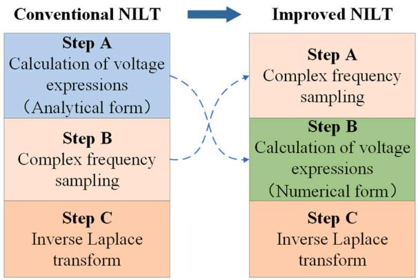  
Fig. 8. Improved NILT method to avoid symbolic operations.

Table 1 Parameters used for modeling and calculation.   

<table><tr><td>Parameters</td><td>Values</td></tr><tr><td>Power voltage (Line voltage)</td><td>345 kV</td></tr><tr><td>Impedance of the power source</td><td>5.04 + j5.40 (Ω)</td></tr><tr><td>Number of cable major sections</td><td>7</td></tr><tr><td>Number of cable minor sections</td><td>21</td></tr><tr><td>Cable length</td><td>11.8 km</td></tr><tr><td>OHL length</td><td>45 km</td></tr><tr><td>Number of sampling points</td><td>2000</td></tr><tr><td>Total calculation time</td><td>0.08 s</td></tr><tr><td>Number of sampling points</td><td>5000</td></tr><tr><td>Closing time of CB1</td><td>0.02 s</td></tr><tr><td>State of CB2</td><td>Open circuit</td></tr></table>

Table 2 Peak values of energization overvoltage at the receiving end of the transmission lines (OHL-Cable).   

<table><tr><td rowspan="2">Closing phase angle</td><td colspan="2">Voltages (kV)</td><td rowspan="2">Relative error</td></tr><tr><td>FFPA</td><td>FDPM</td></tr><tr><td>0°</td><td>306.380</td><td>306.495</td><td>0.038 %</td></tr><tr><td>15°</td><td>353.552</td><td>353.706</td><td>0.044 %</td></tr><tr><td>30°</td><td>412.821</td><td>412.996</td><td>0.042 %</td></tr><tr><td>45°</td><td>468.102</td><td>468.141</td><td>0.008 %</td></tr><tr><td>60°</td><td>534.551</td><td>534.778</td><td>0.042 %</td></tr><tr><td>75°</td><td>564.925</td><td>565.097</td><td>0.030 %</td></tr><tr><td>90°</td><td>556.801</td><td>556.994</td><td>0.035 %</td></tr></table>

The improved NILT algorithm performs complex frequency sampling at the outset, enabling all subsequent calculations to be conducted using the sampled values of s. This transformation simplifies complex symbolic operations into simple numerical calculations that can be efficiently solved by computers. The improved NILT algorithm provides numerical equivalence to conventional algorithms while significantly enhancing computational speed.

Table 3 Peak values of energization overvoltage at the receiving end of the transmission lines (Cable-OHL).   

<table><tr><td rowspan="2">Closing phase angle</td><td colspan="2">Voltages (kV)</td><td rowspan="2">Relative error</td></tr><tr><td>FFPA</td><td>FDPM</td></tr><tr><td>0°</td><td>294.670</td><td>294.634</td><td>0.012 %</td></tr><tr><td>15°</td><td>359.817</td><td>359.995</td><td>0.049 %</td></tr><tr><td>30°</td><td>426.656</td><td>426.349</td><td>0.072 %</td></tr><tr><td>45°</td><td>532.254</td><td>532.036</td><td>0.041 %</td></tr><tr><td>60°</td><td>634.160</td><td>633.922</td><td>0.038 %</td></tr><tr><td>75°</td><td>696.192</td><td>696.302</td><td>0.016 %</td></tr><tr><td>90°</td><td>711.514</td><td>711.720</td><td>0.029 %</td></tr></table>

# 3. Model construction

To verify the proposed model, the transient calculations were performed on the 330 kV OHL-underground cable hybrid transmission system in Xi’an City, China. The hybrid transmission system consists of a 2 × JL/GIA-300/40 (OHL), a JLB40–150 overhead ground wire, and a ZC-YJLW02-Z-190/330–1 × 2500 mm2 underground cable. The parameters used for modeling and calculation are listed in Table 1.

The calculation of the no-load energization overvoltage of the transmission lines was performed, considering it as one of the most critical switching overvoltages. Specifically, CB1 in Fig. 7 was closed at time $t = t _ { 0 } ,$ whereas CB2 remained open throughout the process.

# 4. Verification and comparison of the algorithms

The proposed algorithm (FFPA) was employed to calculate the transient overvoltage based on the hybrid transmission line model established in Section 3. To validate its performance, the frequencydependent phase model (FDPM) was used as a benchmark for accuracy and efficiency evaluation. The accuracy of the calculations was ensured by considering the overvoltage at the end of the transmission lines as well as along the transmission lines. The calculation speed was evaluated by considering the impact of line length and the number of voltage measurement positions on the overall calculation time.

# 4.1. Computational accuracy

# 4.1.1. Energization overvoltage at the receiving end of transmission lines

Tables 2 and 3 show the peak values of energization overvoltage in phase A at the end of the transmission lines for the ’OHL - underground cable’ and ’Underground cable - OHL’ topologies, respectively, considering different closing phase angles of CB1 between 0◦ and 90◦. Figs. 9 and 10 illustrate the energization overvoltage waveforms at the receiving end of the transmission lines for specific closing phase angles of CB1.

Tables 2 and 3 demonstrate the high accuracy of FFPA in calculating the energization overvoltage, with relative errors below 0.044 % and 0.072 % for the OHL-Cable and Cable-OHL topologies, respectively. In power system transient overvoltage calculations, errors below 2 % are considered acceptable. The FFPA algorithm demonstrates sufficient calculation accuracy for practical engineering applications. Additionally, Fig. 9 shows a good overall fit between the voltage waveform obtained by FFPA and that obtained by FDPM, further confirming the high accuracy of the algorithm in both peak values and waveforms.

In comparison to the ‘OHL-Cable’ hybrid transmission line energization overvoltage (Fig. 9), the ‘Cable-OHL’ hybrid transmission line (Fig. 10) exhibits higher peak values and more intense voltage waveform oscillations.

# 4.1.2. Energization overvoltage along the transmission lines

To verify the accuracy of FFPA’s transient overvoltage calculations at various positions, energization overvoltage values along the transmission lines were calculated. The peak values of the energization overvoltage were measured at 10 positions along the line using voltmeters, as shown in Table 4.

In general, when the closing phase angle of CB1 is increased, the magnitude of energization overvoltage and the duration of the transient process tend to increase as well. In practical engineering calculations, only the most severe cases of energization overvoltage are usually considered. Therefore, in this section, we present the peak energization overvoltage values at different positions along the hybrid transmission lines for CB1′s closing phase angles of 45◦, 60◦, 75◦, and 90◦ The calculation results of both FFPA and FDPM for the two transmission line topologies are shown in Fig. 11.

As shown in Fig. 11, for the OHL-Cable topology, the highest relative error occurs at position No. 3 (15.0 km from the sending end of the

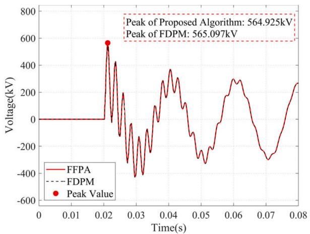  
(a) $7 5 ^ { \circ }$

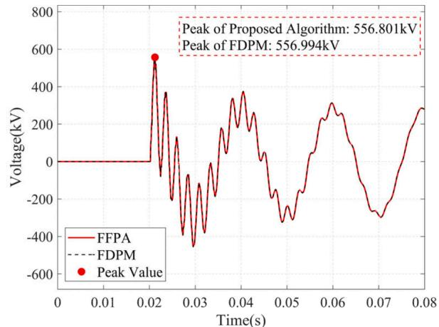  
(b) $9 0 ^ { \circ }$

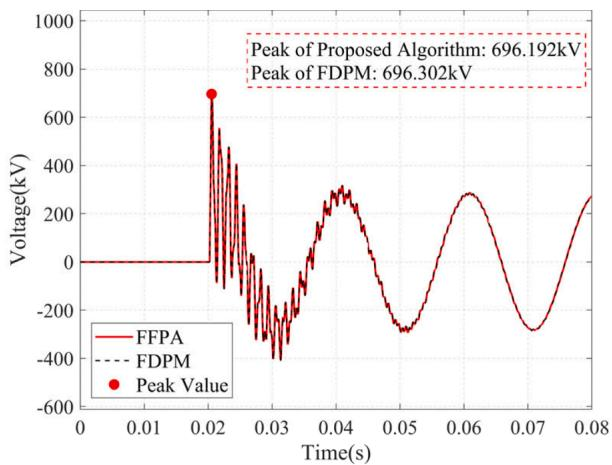  
Fig. 9. Energization overvoltage waveform at the receiving end of the transmission lines (OHL-Cable).   
(a) $7 5 ^ { \circ }$

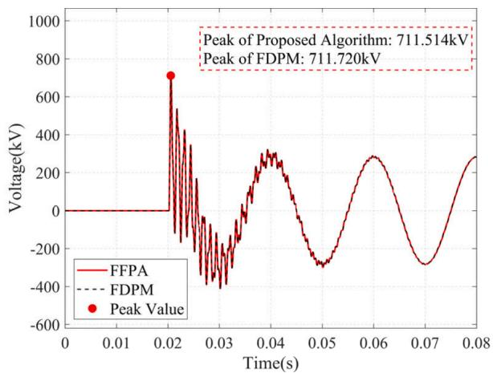  
(b) $9 0 ^ { \circ }$   
Fig. 10. Energization overvoltage waveform at the receiving end of the transmission lines (Cable-OHL).

transmission lines) when CB1 closes at the phase angle of 90◦, with absolute and relative errors of 0.930 kV and 0.182 %, respectively. For the cable-OHL topology, the maximum deviation is 1.250 kV (0.261 %) at position No. 6 (30.0 km from the sending end of the transmission lines) with a closing phase angle of 45◦. The above results indicate the high computational accuracy of FFPA for the energization overvoltage along the hybrid transmission lines. In addition, for the OHL-Cable topology, the peak value of the energization overvoltage along the transmission line was found to be the highest near the joint between the OHL and cable. In contrast, no maximum point of the peak values of the energization overvoltage was observed along the hybrid transmission lines in Fig. 11(b). Instead, the peak values of energization overvoltage for cable-OHL show an increasing trend with the distance from the sending end of the transmission lines.

Table 4 Number of voltage measurement positions along the transmission lines.   

<table><tr><td>Structure of transmission lines</td><td>OHL</td><td>Underground cable</td><td>Joint</td></tr><tr><td>OHL-Cable</td><td>5</td><td>2</td><td>3</td></tr><tr><td>Cable-OHL</td><td>5</td><td>2</td><td>3</td></tr></table>

# 4.2. Computation speed

In terms of the computational speed, the differences between FFPA and FDPM are compared in this section, considering the influence of the total length of the transmission lines and the number of voltage measurement positions. The ‘OHL-underground cable’ hybrid transmission lines were selected as a representative example owing to their similar time consumption compared to ‘underground cable-OHL’ hybrid transmission lines.

To eliminate accidental errors caused by variations in computational time, ten repeated calculations were conducted for each case, and the average computational time was determined as the final result. Computation for the proposed algorithm was performed using MATLAB R2021b, while FDPM calculations were conducted using PSCAD/ EMTDC version 4.6.3. The calculations were executed on an INTEL Core i7–11800H CPU with 16 GB of memory.

# 4.2.1. Effect of transmission line length

Fig. 12 illustrates the computational speeds of FFPA and FDPM when analyzing the cases with varying total transmission line lengths of 12, 24, 36, 48, and 60 km. In these cases, the lengths of both the overhead line (OHL) and the underground cable were equal, and 18 voltmeters were evenly distributed along the transmission lines. CB1 was closed at a

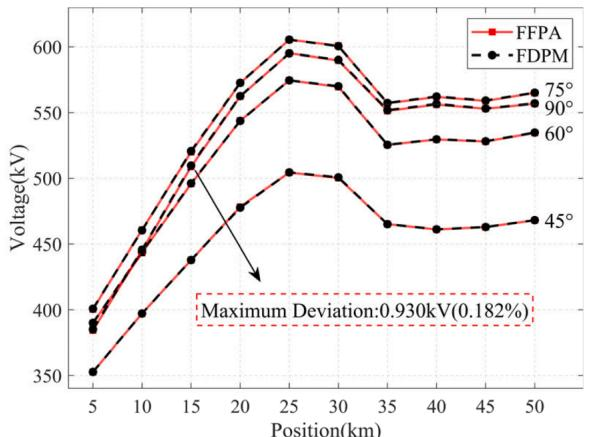  
(a) OHL-Cable

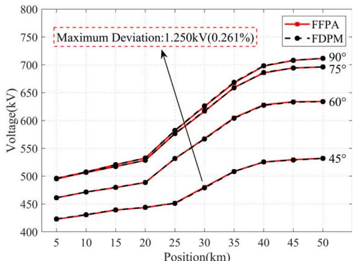  
(b) Cable-OHL

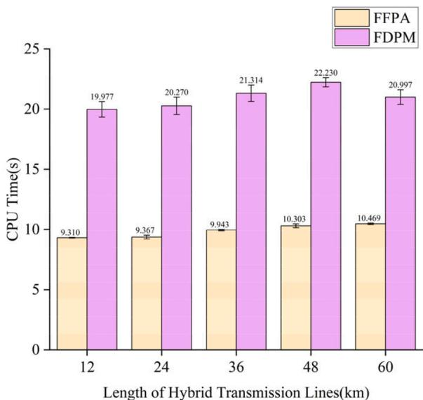  
Fig. 11. Maximum overvoltage with different closing phase angles along the hybrid transmission lines.   
Fig. 12. Comparison of algorithm computation speeds for varying total transmission line lengths.

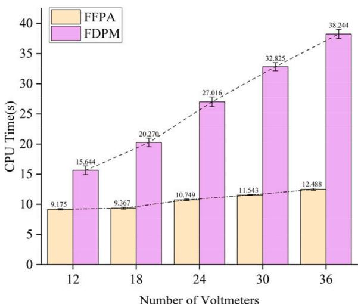  
Fig. 13. Comparison of algorithm computation speeds for varying numbers of voltage measurement positions.

phase angle of 90◦, while CB2 remained open. The plot provides a comparison of the computational speeds between FFPA and FDPM, specifically considering the variation in transmission line length as the only parameter, while keeping other parameters constant.

According to the data shown in Fig. 12, when the total length of the transmission lines is varied while keeping other parameters constant, there is no evident trend of change in the computational time for either algorithm. This suggests that the total length of the transmission lines has a minimal effect on the computational speed of the aforementioned algorithms. Furthermore, FFPA completed the calculations within a range of $9 . 3 1 0 \ s \ – 1 0 . 4 6 9 \ s ,$ which accounts for only 46.211 %–49.860 % of computational time required by FDPM. The results indicate that, for hybrid transmission lines consisting of OHL and cables, FFPA offers significantly faster computation speed than FDPM.

# 4.2.2. Effect of the number of voltage measurement positions

When keeping parameters of the transmission lines constant, cases with different numbers of evenly distributed voltage measurement positions along a 36 km transmission line were considered: 12, 18, 24, 30, and 36. The phase angle of CB1 was 90◦, whereas CB2 remained open. Fig. 13 shows a comparison of the computation speeds between FFPA and FDPM when only the number of voltage measurement positions was changed.

According to the findings in Fig. 13, increasing the number of voltage measurement positions while keeping other parameters constant results in a clear increase in computation time for both algorithms. For FFPA, the computational time ranges from 9.175 s to 12.488 s, which is only 32.654 % – 58.649 % of the computational time required by FDPM. Moreover, as the number of voltage measurement positions increases, FFPA maintains a greater computational speed advantage over FDPM. These findings indicate that the number of voltage measurement points along the transmission lines has a significant impact on the computational speed of both algorithms, with FFPA demonstrating a distinct advantage over FDPM.

The calculation times of FFPA and FDPM differ significantly owing to their different algorithmic principles, with FFPA demonstrating a significant computational speed advantage over FDPM. Specifically, the FDPM utilizes an electromagnetic transient model based on an equivalent circuit calculation that incorporates equivalent historical current sources and resistors. Given the voltage and current at a particular location on the transmission line at time t, it can solve for the voltage and current at time t + Δt using this equivalent circuit. However, to avoid inaccuracies, FDPM requires Δt to be smaller than the propagation time τ of the voltage wave on the shortest transmission line in the system. Consequently, in practical engineering applications, FDPM often necessitates very low Δt values, such as 1 μs, to accommodate the

requirements of different short transmission lines in the system.

In contrast, FFPA calculates energization overvoltages of the transmission line in the complex frequency and mode domains. The equivalent time step Δt of the resulting energization overvoltage is the quotient of the total calculation time and the number of time sampling points Ns in the NILT, which is independent of τ. This approach allows FFPA to effectively avoid the impact of a very short calculation time step on the computational speed. The equivalent calculation time step for FFPA used in this paper is 40 μs, which does not impede computational speed.

# 5. Conclusion

This study presents a novel and efficient algorithm for the fast calculation of energization overvoltages in hybrid transmission lines consisting of overhead lines (OHL) and underground cables.

The algorithm utilizes full frequency-dependent parameters and involves multiple steps, including sampling s in the complex frequency domain, phase-mode transformation, derivation of voltage in the complex frequency and mode domains, and calculations of energization overvoltages in the time and phase domains at specified locations using mode-phase transformation and NILT.

The proposed algorithm achieves high computational accuracy, with relative errors of only 0.080 % and 0.261 % for the maximum energization overvoltage at the end and along the transmission lines, respectively, when compared to FDPM. In addition, the algorithm exhibits strong fitting ability for the energization overvoltage waveform.

Moreover, the proposed algorithm offers significant advantages in terms of the computation speed. It outperforms FDPM, with calculation times ranging from 32.654 % to 58.649 % faster. This advantage becomes more pronounced as the number of voltage measurement positions increases, demonstrating its superior computational efficiency.

Overall, the proposed algorithm serves as a significant complement to existing commercial software algorithms and has great application value for simulating energization overvoltage in hybrid transmission lines.

# CRediT authorship contribution statement

Borui Gu: Conceptualization, Methodology, Software, Validation, Visualization, Formal analysis, Writing – original draft. Han Li: Methodology, Investigation. Shurong Li: Data curation. Xiaoguang Zhu: Visualization. Xuefeng Zhao: Resources. Junbo Deng: Supervision, Writing – review & editing, Funding acquisition. Guanjun Zhang: Project administration.

# Declaration of Competing Interest

The authors declare the following financial interests/personal relationships which may be considered as potential competing interests: Junbo Deng reports financial support was provided by National Natural Science Foundation of China.

# Data availability

The data that has been used is confidential

# Acknowledgements

This research was supported by the National Natural Science Foundation of China (52077167).

# References

[1] Y. Zhou, J. Zhao, R. Liu, Z.Z. Chen, Y.X. Zhang, Key technical analysis and prospect of high voltage and extra-high voltage power cable, High Voltage Eng. 40 (9) (2014) 2593–2612, https://doi.org/10.13336/j.1003-6520.hve.2014.09.001.   
[2] H. Khalilnezhad, M. Popov, L. van der Sluis, J.A. Bos, A. Ametani, Statistical analysis of energization overvoltages in EHV hybrid OHL–cable systems, IEEE Trans. Power Del. 33 (6) (2018) 2765–2775, https://doi.org/10.1109/ TPWRD.2018.2825201.   
[3] L. Marti, Simulation of transients in underground cables with frequency-dependent modal transformation matrices, IEEE Trans. Power Del. 3 (3) (1988) 1099–1110, https://doi.org/10.1109/61.193892.   
[4] N. Watson, J. Arrillaga, Power systems electromagnetic transients simulation, Inst. Eng. Technol. (2003), https://doi.org/10.1049/PBPO039E.   
[5] P.T. Caballero, E.C. Marques Costa, S. Kurokawa, Frequency-dependent multiconductor line model based on the Bergeron method, Electr. Power Syst. Res. 127 (oct) (2015) 314–322, https://doi.org/10.1016/j.epsr.2015.05.019.   
[6] J.R. Marti, Accurate modelling of frequency-dependent transmission lines in electromagnetic transient simulations, IEEE Trans. Power Apparatus Syst. PAS-101 (1) (1982) 147–157, https://doi.org/10.1109/TPAS.1982.317332.   
[7] T. Noda, N. Nagaoka, A. Ametani, Phase domain modeling of frequency-dependent transmission lines by means of an ARMA model, IEEE Trans. Power Del. 11 (1) (1996) 401–411, https://doi.org/10.1109/61.484040.   
[8] A. Morched, B. Gustavsen, M. Tartibi, A universal model for accurate calculation of electromagnetic transients on overhead lines and underground cables, IEEE Trans. Power Del. 14 (3) (1999) 1032–1038, https://doi.org/10.1109/61.772350.   
[9] F. Castellanos, J.R. Marti, Full frequency-dependent phase-domain transmission line model, IEEE. Trans. Power Syst. 12 (3) (1997) 1331–1339, https://doi.org/ 10.1109/59.630478.   
[10] I. Kocar, J. Mahseredjian, Accurate frequency dependent cable model for electromagnetic transients, IEEE Trans. Power Del. 31 (3) (2015) 1281–1288, https://doi.org/10.1109/TPWRD.2015.2453335.   
[11] J. Li, X. Chen, L. Xu, A. Zhao, J. Deng, G. Zhang, Dominant frequency characteristics analysis of reclosing transient overvoltage in 10 kV cable-overhead hybrid line, Electr. Power Syst. Res. 178 (2020), 106052, https://doi.org/10.1016/ j.epsr.2019.106052.   
[12] H. Ye, K. Strunz, Multi-scale and frequency-dependent modeling of electric power transmission lines, IEEE Trans. Power Del. 33 (1) (2017) 32–41, https://doi.org/ 10.1109/TPWRD.2016.2630338.   
[13] M. Ghazizadeh, F.B. Ajaei, A. Dounavis, Passive lumped DC line model with frequency-dependent parameters for transient studies, IEEE Trans. Power Del. 37 (5) (2022) 3947–3957, https://doi.org/10.1109/TPWRD.2022.3141706.   
[14] H. Li, P. Yu, S. Li, X. Zhao, J. Deng, G. Zhang, Algorithm for fast calculating the energization overvoltages along a power cable based on modal theory and numerical inverse Laplace transform, Electr. Power Syst. Res. 210 (2022), 108163, https://doi.org/10.1016/j.epsr.2022.108163.   
[15] F.F. Da Silva, C.L. Bak, Electromagnetic Transients in Power Cables, Springer, London, UK, 2013, pp. 47–66, https://doi.org/10.1007/978-1-4471-5236-1.   
[16] L. Branˇcík, K. Perutka, Numerical inverse Laplace transforms for electrical engineering simulation. MATLAB for Engineers—Applications in Control, Electrical Engineering, IT and Robotics, Intech, 2011, https://doi.org/10.5772/19824.   
[17] H.W. Dommel, Overhead line parameters from handbook formulas and computer programs, IEEE Power Eng. Rev. PER-5 (1985), https://doi.org/10.1109/ MPER.1985.5528874, 38–38.   
[18] A. Ametani, T. Ohno, N. Nagaoka, Cable System Transients: Theory, Modeling and Simulation, John Wiley & Sons, 2015, https://doi.org/10.1002/9781118702154. ch6.   
[19] T. Ohno, C.L. Bak, A. Akihiro, W. Wiechowski, T.K. Sorensen, Derivation of theoretical formulas of the frequency component contained in the overvoltage related to long EHV cables, IEEE Trans. Power Del. 27 (2) (2012) 866–876, https:// doi.org/10.1109/TPWRD.2011.2179948.   
[20] K.L. Kuhlman, Review of inverse Laplace transform algorithms for Laplace-space numerical approaches, Numer. Algor. 63 (2) (2013) 339–355, https://doi.org/ 10.1007/s11075-012-9625-3.