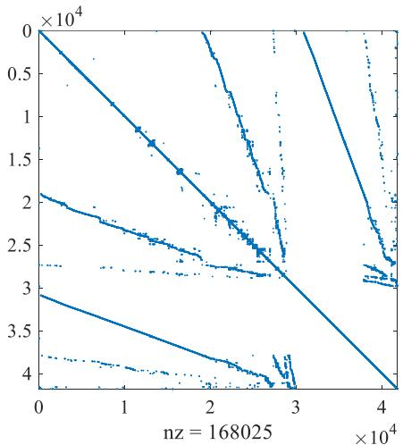
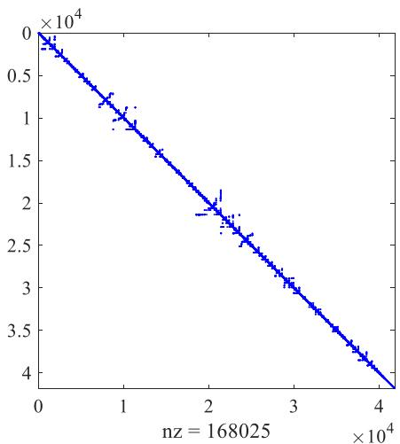
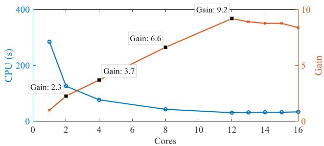
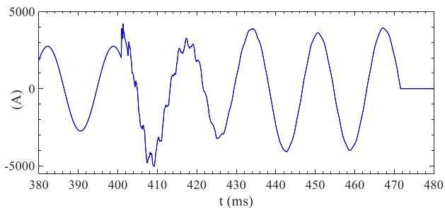
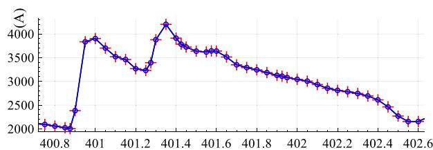
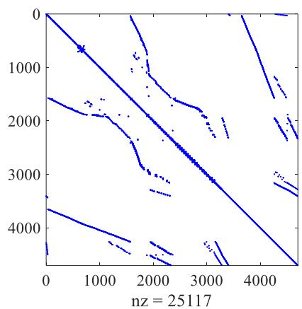
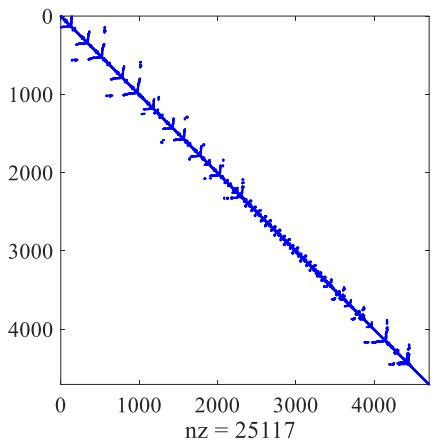
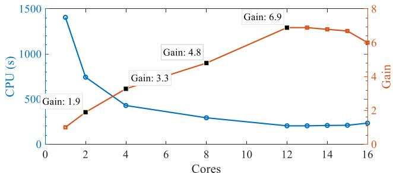
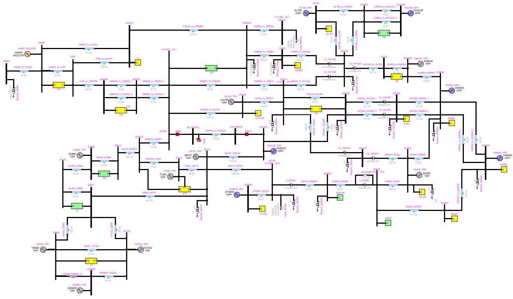
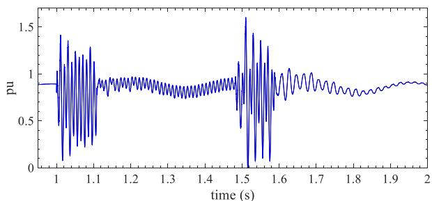

Received 27 March 2019; revised 27 July 2019; accepted 10 September 2019. Date of publication 11 November 2019; date of current version 2 January 2020.

Digital Object Identifier 10.1109/OAJPE.2019.2952776

# Accelerated Sparse Matrix-Based Computation of Electromagnetic Transients

A. ABUSALAH1, (Member, IEEE), O. SAAD2, (Member, IEEE), J. MAHSEREDJIAN , (Fellow, IEEE), U. KARAAGAC 3, (Member, IEEE), AND I. KOCAR 1, (Member, IEEE)

1Polytechnique Montréal, Campus Université de Montréal, Montréal, QC H3T 1J4, Canada 2IREQ, Hydro-Québec, Varennes, QC J3X 1S1, Canada

3Department of Electrical Engineering, The Hong Kong Polytechnic University, Hong Kong CORRESPONDING AUTHOR: J. Mahseredjian (jeanm@polymtl.ca)

This work was supported by the NSERC Industrial Research Chair, Hydro-Quebec, RTE, EDF, Opal-RT, and InnovEE.

ABSTRACT This paper is related to research on parallelization methods for the simulation of electromagnetic transients (EMTs). It presents an automatic parallelization approach based on the solution of sparse matrices resulting from the formulation of network equations. Modified-augmented-nodal analysis is used to formulate network equations. The selected sparse matrix solver is parallelized and adapted to improve performance by pivot validity testing and partial refactorization. Refactorization is needed when dealing with varying topology networks and nonlinear models. The EMT solver employs a fully iterative method for nonlinear functions. Conventional computer CPU-based parallelization is achieved and does not require any user intervention for given arbitrary network topologies. The presented approach is tested on real networks with complex models, including nonlinearities and power-electronics converters for wind generator applications.

INDEX TERMS Electromagnetic transients, modified-augmented-nodal-analysis, KLU, sparse matrix solver, parallelization.

# I. INTRODUCTION

HE computing time reduction for the simulation of electromagnetic transients [1], [2] (EMTs) is a crucial research topic. The EMT-type [2] simulation methods are circuit based and can use very accurate models for an extended frequency range of power system phenomena. This qualifies them as being of wideband type. In fact the EMT approach is applicable to both slower electromechanical transients and much faster electromagnetic transients. The computation of electromechanical transients can be achieved with EMT-type solvers for very large networks [3] and requires significant computing time when compared to phasor-domain approaches, but even for smaller networks, the computing time can become a key factor due to numerical integration time-step constraints or model complexity level. More and more challenging simulation cases are created for studying modern power systems, those include, for example, HVDC systems [4] and wind generation [4].

There are several techniques for improving computational performance in EMT-type solvers. Such techniques include

improvements in model performance using, for example, average-value models [5] for power-electronics based systems or circuit reduction [6]. Network reduction can be also achieved using frequency domain fitting [7] or through dynamic equivalents [8]. Other approaches include usage of multiple time-steps [9], waveform relaxation [10] and combinations of different methods [11].

Although for some models the numerical performance improvements can be generalized, the above methods cannot be applied automatically and require user intervention and various other manual modifications. A more direct path towards computational speed improvement in EMT-type numerical methods is through efficient sparse matrix solvers and parallelization. The latter has been initiated in realtime simulation tools [12]–[14] and followed also in off-line [2], [15], [16] applications. The network tearing approach for parallelization is based on the exact separation created by distributed parameter transmission line/cable models. Other methods [17], [18] can be applied for cutting networks at arbitrary locations.

An important problem in network solution parallelization methods, such as [16], [17], is that user intervention is required for setting the network separation locations. In [18] the derivation of bordered-block-diagonal matrices (diakoptics) allows to cut networks without using transmission line delays. But such methods are demonstrated for linear and fixed topology networks that do not require time consuming matrix updating and refactorizations. Moreover, large network test cases are created by replicating a given small network a few hundred times. Such idealistic situations do not occur for actual real power grids.

This paper targets off-line simulation methods and presents CPU-based parallelization for conventional multi-core computers using a sparse matrix solver, named KLU [19], [20]. Such a solver has been already applied for circuit simulation problems [20]–[23], including the simulation of electromagnetic transients in [22], [23]. This paper contributes several significant improvements over [22], [23]. Fully automatic parallelization is again achieved through block-triangular factorization (BTF), but new modification of the KLU solver allow to significantly improve performance. The modifications include pivot validity testing and partial refactorization for a fully iterative sparse matrix solver. Refactorization is required to account for varying topologies (switching) and nonlinear models. The capability to efficiently account for iterations and refactorization in realistic networks is a distinctive aspect in the presented research.

Another improvement in this work is more efficient implementation of parallelization through distributed thread memory.

The proposed approach is implemented in EMTP [24] and tested on realistic large scale networks. The demonstration on such networks/benchmarks constitutes another important contribution of this paper. The solution process includes seamless transition from load-flow solution to timedomain parallel computations using modified-augmentednodal analysis.

The proposed approach can be implemented in any EMT-type simulation tool. Moreover, the proposed improvements in KLU are applicable to other types of solvers.

This paper starts by reviewing the main structures of the EMT-type solver for which the sparse matrix code is being replaced. It follows by the presentation of the new parallel sparse matrix solution process and then its implementation. Test cases are presented to demonstrate the numerical performance advantages.

# II. REVIEW OF EMTP STRUCTURE AND SOLVER

The new approach proposed in this paper is implemented using the modified-augmented-nodal analysis (MANA) formulation method [24]. This method offers several advantages [25] over classical nodal analysis. Its formulation is briefly recalled here to relate to material presented in the following sections. In MANA the system of equations is generic and can use different types of unknowns in addition to voltage. In MANA the system of network equations (NEs)

is given by

$$
\mathbf {A} \mathbf {x} = \mathbf {b} \tag {1}
$$

This sparse system of equations is solved for the vector of unknowns x at each time-point in time-domain, after updating the matrix of coefficients A and the vector of known variables b. The vector b contains history terms and other independent functions, such as independent sources. The system (1) is non-symmetric and can also accommodate generic equations, such as

$$
k _ {1} v _ {k} + k _ {2} v _ {m} + k _ {3} i _ {x} + k _ {4} i _ {y} + \dots = b _ {z} \tag {2}
$$

where the terms on the left contribute coefficients $( k _ { j } )$ into the A matrix for voltage $( \nu _ { j } )$ and current $( i _ { j } )$ unknowns, and $b _ { z }$ is a cell in the b vector. This equation allows to integrate directly source and switch equations. For an ideal switch equation, for example,

$$
k v _ {k} - k v _ {m} - k _ {s} i _ {k m} = 0 \tag {3}
$$

In switch closed position, $k = 1$ and $k _ { s } = 0$ . When the ideal switch is open, $k = 0$ and $k _ { s } = 1$ . It is also possible to model non-ideal switches by setting k = 1 and replacing $k _ { s }$ by high and low resistance values. Other models, such as ideal transformers with tap control can be easily accommodated [25].

The NEs (1) are solved at each time-point after updating A for switch position changes, transformer tap changes or any other modifications in model equations. For nonlinear models (NMs), the NEs must be solved iteratively to achieve an accurate simultaneous solution. This is done by linearizing each model [25] at each operating point change and solving iteratively (1) until convergence for all nonlinear models. Model linearization results into a Norton equivalent with the Norton resistance contributing changes into A and the Norton current contributing updates into the b vector. This is a Newton method with A being the Jacobian matrix.

For time-varying models (TVMs), such as switches or transformer tap positions, it is also possible to update A iteratively without advancing to the next time-point. This accuracy option, marked as iterative time-varying method (ITVM), allows to achieve a simultaneous solution for the determination of all changes and dependencies between models at the same time-point. This process also includes the sequential re-calculation of control system equations [25].

In EMTP the NE (1) are currently solved on a single CPUcore using a non-symmetric direct sparse solver method based on minimum degree ordering [26]. The permuted matrix A does not result into decoupled blocks and cannot be used for parallelization.

The fact that many models, such as the coefficients in (3), are time-varying and also for continuous changes that may be required by model updates in A during iterations, it is necessary to recalculate the LU factors of A. The refactorization process of the complete matrix A is time-consuming. The number of refactorizations is case dependent and has fluctuating impact on numerical performance. This is an important aspect.

1. L=I   
2.for $\mathrm { j } { = } 1$ to n

a.solve $\operatorname { L x } { = } \operatorname { A } ( : , \operatorname { j } )$   
b.do partial pivoting on x   
$\mathrm { U } ( 1 { \cdot } { \mathrm { j } } , \mathrm { j } ) { = } \mathrm { x } ( 1 { \cdot } \mathrm { j } )$   
d $\scriptstyle \mathrm { L ( j : n , j ) = x ( j : n ) / U ( j , j ) }$

3.end for

FIGURE 1. KLU pseudocode for LU factorization.

The upgrading of the sparse matrix solver for accelerating computations is described in the following sections.

# III. BLOCK TRIANGULAR FACTORIZATION AND KLU

The Block Triangular Factorization (BTF) method [20], [27] can be used during symbolic analysis of A to transform it into a block-diagonal form $\mathbf { A _ { B T F } }$ . To do so, two matrices are calculated and applied, the row permutation matrix $\mathbf { P _ { R } }$ and the column permutation matrix PC, and result into

$$
\mathbf {A} _ {\mathrm {B T F}} = \mathbf {P} _ {\mathrm {R}} \mathbf {A} \mathbf {P} _ {\mathrm {C}} \tag {4}
$$

This process is able to automatically find the subnetworks decoupled by distributed parameter transmission line/cable models. The blocks in ABTF are decoupled (independent) at each solution time-point and can be solved in parallel. The resulting block sizes vary according to subnetwork sizes.

The blocks in ABTF can be solved using any efficient sparse matrix solver. Let us assume that ${ \bf A } _ { i }$ is the ith block in ABTF and there are N blocks in the network.

The sparse solver method selected here is the KLU method. It is currently one of the most efficient packages for circuitbased simulations [20]. This choice was made after testing other packages, including SuperLU [28] and [26].

The KLU solver, as other sparse matrix solvers, applies ordering to reduce the fillings in the LU-factorization. The AMD (approximate minimum degree ordering) [19] and COLAMD (column approximate minimum degree ordering) [19] ordering methods are available in KLU. AMD allowed to achieve the best performance for the test cases studied in this paper. The symbolic analysis of AMD is conducted only once at the startup of the simulation process.

The second stage in KLU is the numerical analysis stage which involves two main steps. First the Gilbert-Peierls algorithm is used to find the nonzero patterns of L and U matrices. Once the nonzero pattern is established, a left-looking numerical factorization with partial pivoting is used to calculate the L and U numerical values. This process can be expressed by

$$
\mathbf {L} _ {i} \mathbf {U} _ {i} = \mathbf {P} _ {\mathbf {R} _ {i}} \mathbf {A} _ {i} \mathbf {P} _ {\mathbf {C} _ {i}} \tag {5}
$$

where $\mathbf { P } _ { \mathbf { R } _ { i } }$ and $\mathbf { P } _ { \mathbf { C } _ { i } }$ are now permutation matrices for the ith block. The complete LU factorization process [19] of KLU is summarized (pseudocode) in Fig. 1 for an n × n matrix A . It is noticed that the matrix $\mathbf { L } _ { i }$ is calculated from left to right and column by column.

In the above code, I is the identity matrix.

In KLU it is also possible to apply a scaling matrix for the above equation, but it was not retained here since its calculation process can create inefficiencies and there were no advantages for the applications studied in this paper.

In the standard KLU approach, when at least one element of Ai is modified, it is needed to perform full re-factorization with updated pivoting. This process becomes inefficient for the refactorization needs expressed in the previous section. In KLU it is also possible to request refactorization reusing the previously calculated nonzero pattern, but in that case there is no pivot validity testing and the solution accuracy may deteriorate significantly.

To improve the performance of the existing KLU code for the EMT computation methods presented in this paper, the following enhancements are contributed in this paper: ‘‘Pivot validity test’’ and ‘‘Partial re-factorization’’ using a parallel implementation.

In the following text, the acronym SMPEMT (sparse matrix package for EMTs) refers to the enhanced KLU version presented in this paper.

# A. PIVOT VALIDITY TEST

One of the challenging problems is the refactorization process for time-varying and iterative model coefficients in $\mathbf { A } _ { i } .$ . Instead of performing full refactorization (standard KLU) as explained above, significant computational gains can be achieved by applying pivot validity testing. This algorithm is described by the following steps for $\mathbf { A } _ { i } \mathrm { : }$ :

1. First call to SMPEMT:

a. Perform symbolic analysis with AMD   
b. Perform full factorization to find $\mathbf { L } _ { i }$ and $\mathbf { U } _ { i }$   
c. Go to step 3

2. Not first call to SMPEMT:

a) Perform re-factorization using existing nonzero pattern with new enabled invalid pivot testing   
i. Invalid pivot found: go to step 1.b   
b) Go to step 3

3. Backward and Forward substitution

The step 2.a is applied when matrix Ai has changed. The structure (non-zero elements) of the matrix is established at the beginning and cannot change, only matrix cell values can change.

For the step 2, the pseudocode used in Fig. 1 starts with a modified matrix, but initially keeps the previously calculated permutations due to partial pivoting (step 2.b in Fig. 1). The pivot validity test is now applied instead of step 2.b in Fig. 1. The invalid pivot (pivot validity) test is based on a definable tolerance $\varepsilon _ { p }$ . When

$$
\varepsilon_ {p} a _ {\text {n e w}} > a _ {\text {o l d}} \tag {6}
$$

the old pivot $a _ { o l d }$ is discarded and a new pivot $a _ { n e w }$ is selected. The process restarts as shown in the step 2.a.i above. The pivot search is performed in each column of $\mathbf { L } _ { i } .$ . By default $\varepsilon _ { p } = 1 \%$ . It is noticed that for circuit equations, the diagonal

of ${ \bf A } _ { i }$ is typically dominant and consequently the number of pivot changes is small.

# B. PARTIAL RE-FACTORIZATION

To reduce the computational cost of refactorization for ${ \bf A } _ { i }$ even further, it is possible to apply partial refactorization. In a given matrix $\mathbf { A } _ { i }$ it is possible to determine the cells occupied by NMs and TVMs. Those dynamic cells may change between solution time-points and iterations at a given time-point. The changes require refactorization (recalculating $\mathbf { L } _ { i }$ and $\mathbf { U } _ { i } )$ .

The matrix $\mathbf { A } _ { i }$ is reordered using AMD and can be written as

$$
\mathbf {A} _ {i} = \left[ \begin{array}{l l} \mathbf {P} _ {\mathbf {c c}} & \mathbf {P} _ {\mathbf {c d}} \\ \mathbf {P} _ {\mathbf {d c}} & \mathbf {P} _ {\mathbf {d d}} \end{array} \right] \tag {7}
$$

where the subscripts c and d mean constant and dynamic respectively. The c columns do not have any dynamic parts, but the d columns have dynamic cells.

In the left-looking algorithm of Fig. 1, the columns of $\mathbf { L } _ { i }$ are derived one-by-one by solving for each column of $\mathbf { A } _ { i } .$ . $\operatorname { I f } ,$ for example, the lower matrix decomposition of ${ \bf A } _ { i }$ is stopped at its first dynamic column then

$$
\mathbf {L} _ {i} ^ {p} = \left[ \begin{array}{c c} \mathbf {L} _ {\mathbf {c c}} & \mathbf {0} \\ \mathbf {P} _ {\mathbf {d c}} & \mathbf {I} _ {\mathbf {d d}} \end{array} \right] \tag {8}
$$

where $\mathbf { L } _ { i } ^ { p }$ is a partially computed lower-triangular matrix, $\mathbf { L _ { c c } }$ is a lower-triangular matrix, $\mathbf { P _ { d c } }$ and $\mathbf { L _ { c c } }$ contain the columns of the static part of $\mathbf { L } _ { i } ^ { p }$ and $\mathbf { I _ { d d } }$ is the identity matrix. Once $\bf P _ { d d }$ is determined (status of time-varying devices or iterative Norton equivalent) at a given solution time-point, the calculation process is continued until the replacement of $\mathbf { I _ { d d } }$ to obtain $\mathbf { L ^ { \prime } } _ { i }$ from $\mathbf { L } _ { i } ^ { p }$ . The upper-triangular matrix $\mathbf { U } _ { i } ^ { \prime }$ is calculated within the calculation process of $\mathbf { L ^ { \prime } } _ { i }$ . For (8), the partial upper matrix factorization is available for all constant columns

$$
\mathbf {U} _ {i} ^ {p} = \left[ \begin{array}{c} \mathbf {U} _ {\mathbf {c c}} \\ \mathbf {0} \end{array} \right] \tag {9}
$$

In the above approach it is not necessary to restart the partial factorization process for the complete set of columns of $\bf { P _ { d d } }$ . Better efficiency can be gained, if partial re-factorization is applied by restarting from the first left modified column $j _ { m _ { d } }$ in $\mathbf { P _ { d d } }$ . As before, since KLU is a leftlooking solver, all unchanged columns to the left of $j _ { m _ { d } }$ can maintain the previous contributions to the LU factors.

It is also possible to apply a permutation technique that forces $\mathbf { P _ { d d } }$ to contain only NMs and TVMs (similar to [29]). But such an approach interferes with the AMD ordering and creates extra fill-ins which hinder the performance gains.

# IV. IMPLEMENTATION OF SMPEMT

Both the sequential and parallel versions of the SMPEMT described in the preceding section have been implemented in this paper. The parallel version has been programmed using the OpenMP [30] multithreading approach. It can be advantageously used in any EMT-type package as a highlevel programming method.

The parallel solver is developed based on the distributed thread memory concept that was found to be the most efficient application of OpenMP. This approach minimizes thread waiting time and memory access delays.

Parallelization is applied to the blocks found from the BTF, that is for each matrix $\mathbf { A } _ { i } .$ Each matrix $\mathbf { A } _ { i }$ has its own memory allocation that is part of designated thread memory. Each thread launches a call to the sparse matrix solver for its own $\mathbf { A } _ { i } .$ . The call allocates (done once, at startup only) memory on the thread stack and uses thread’s own cache to solve. This type of allocation helps all threads to fetch data faster and write results quicker compared to getting data and writing data to the main thread memory. All threads are launched and joined using OpenMP statements.

Since there is a limited number of CPU cores and the computing gains are limited by the largest network blocks, it is necessary to apply a balancing technique for the given number of cores. In this paper, the following approaches have been implemented.

In the first approach a pre-programmed method allows to estimate the number of floating-point operations for the solution of each block $( N F P O _ { i } )$ . The following formula is used for a matrix block of $n \times n \mathrm { : }$

$$
N F P O _ {i} = \sum_ {j = 1} ^ {n} \left[ \sum_ {m = 1} ^ {j - 1} 2 L l e n (m) + 3 L l e n (j) + 2 U l e n (j) \right] + n \tag {10}
$$

where $j$ and m are the indices of columns, Llen and Ulen are the counts of non-zeros in $\mathbf { L ^ { \prime } } _ { i }$ and $\mathbf { U } _ { i } ^ { \prime } ,$ , respectively. This formula accounts for the LU-factorization based on the initial LU nonzero patterns. It also accounts for the backwardforward substitution step.

In the second approach, the number of non-zeros in each block $( N N Z _ { i } )$ is available from its nonzero pattern. However, for all the test cases presented in this paper, using NNZi was less efficient than using $N F P O _ { i }$ .

The blocks are assigned to cores using the number of available cores $( N _ { C } )$ and the factor $k _ { d } = N F P O / N _ { C }$ , where NFPO is the total number for the entire system of equations. Since the number of blocks N could be higher than $N _ { C }$ , it is necessary to verify the limiting $k _ { d }$ for each assignment. If a given core is assigned a block with $N F P O _ { i }$ less than $k _ { d }$ then it can contain additional blocks until $k _ { d }$ is reached or exceeded. This is basically a packing procedure for populating available cores.

If a block $\mathbf { \bar { s } } N F P O _ { i }$ falls below a minimum size, then it must be packed into an assigned core since threading for such a block can become inefficient.

The same is applicable using $N N Z _ { i }$ instead of $N F P O _ { i }$ .

# V. TEST CASES

The objective of this section is to test SMPEMT for practical power system grids. The tests are conducted directly without any topological/data changes (user intervention) on existing networks. This aspect is fundamental, since it is not desirable

to ask software users to perform manipulations for helping implicated numerical issues. The presented realistic cases have different levels of complexities and allow to test different aspects. In all cases, the simulation is initialized to reach steady-state from a load-flow solution and a perturbation (fault) is applied in time-domain.

The computer used for testing was a Lenovo Intel(R) Xeon(R) CPU E5-2650 v4 @ 2.20GHz, with two clusters of 12 cores, with cache of 30MB and RAM of 32GB.

In the following tables, the tested solvers are: EMTP [24] for the existing sparse matrix package [26] programmed on single core; KLU represents the standard KLU singlecore code without the improvements presented in this paper, SMPEMT1 is the upgraded KLU solver with the above ‘‘Pivot validity test’’ and SMPEMT2 is the upgraded KLU solver with both ‘‘Pivot validity test’’ and ‘‘Partial re-factorization’’. Both SMPEMT1 and SMPEMT2 are implemented in parallel and contrary to the standard KLU, these two methods are set to refactor only the changed matrices Ai.

In all cases in this paper, SMPEMT2 was faster than SMPEMT1, but the gains depend on the presence and location of dynamic columns, which is related to the simulated case equations.

The simulation results are identical with all solvers.

The applied models are listed for each case. The synchronous generators are modeled using the dq0 approach (see [32]). Details about solution methods including the iterative process for nonlinear models, can be found in [25].

In the text below, computational gain or performance gain is actually acceleration ratio between different solution methods with different core numbers.

# A. FIRST TEST CASE: HYDRO-QUEBEC GRID

This test case is an upgraded version of the one presented in [3]. It is based on the actual Hydro-Quebec grid (HQ-grid). The summary of main power components is:

 RLC branches: 23181   
 PI/RL coupled branches, 3-phase: 860   
 Lines (distributed parameters): 1354 phases   
 Ideal transformer units (for 3-phase transformers): 6294   
 Ideal switches: 3675   
 Zinc-Oxide Arresters: 174;   
 Nonlinear inductances (transformer magnetization): 99   
 Synchronous generators (with exciters and governors): 349;   
 Loads: 2701

The initial network matrix A is shown in Fig. 2. Its BTF version is presented in Fig. 3. The size of A is 41815 × 41815 with 168025 non-zeros. The network has 29803 nodes. The BTF matrix version has 217 blocks, with the largest block size being 2898 × 2898.

The HQ-grid performance timings are presented in Table 1 for a numerical integration time-step of 1t = 50 µs and for the simulation time of 1 s. The average number of iterations per time-point is 2.0.

  
FIGURE 2. Test case HQ-grid, network matrix before BTF.

  
FIGURE 3. Test case HQ-grid, network matrix after BTF.

It is apparent that the KLU method alone does not have performance gains. It is even less efficient than the EMTP method. This is due to the fact that re-factorization is applied to all blocks without the improvements of SMPEMT1 and SMPEMT2.

For this case, SMPEMT2 and SMPEMT1 gave similar timings.

The computational gain against existing EMTP solver is 1048/31 = 33.8 with 12 cores. The gain over the standard single-core KLU solver is 1216/31 = 39 with 12 cores.

Performance plots are presented in Fig. 4. The maximum gain over the single core SMPEMT2 version is 9.2 and there are no significant gains after 12 cores. This is mainly due to the limitation imposed by the largest block, increased memory exchange and thread management costs.

Comparison of simulation results between EMTP and SMPEMT2 for a fault event are shown in Fig. 5 and Fig. 6 (zoomed version). The waveforms are identical. The studied scenario is a fault on phase-a to ground occurring at 400 ms.

  
FIGURE 4. CPU timings and gains (against 1-core), HQ-grid, SMPEMT2 method.

  
FIGURE 5. Line breaker SWm current, phase-a, EMTP and SMPEMT2 solutions.

  
FIGURE 6. Line breaker SWm current (zoom), phase-a, EMTP (circle) and SMPEMT2 (cross) solutions.

The breaker SWm on the right of a transmission line opens its phase-a at current-zero crossing near 472 ms.

# B. SECOND TEST CASE: T0-GRID

This test case is designed to stress computational performance using a system with integration of renewables. The top level view of the simulation network is presented in Fig. 10. The complete data of this network is available in [31].

This is a realistic 400 kV, 50 Hz network. The yellow boxes include the sub-transmission networks at 154 kV with pi-section models for transmission lines. The green boxes include 154 kV sub-transmission and wind generation.

There is a total of 72 synchronous generators. All generators are modeled with exciters and governors. The 10.5 kV generators connected to the 400 kV grid include total (dq) saturation data.

There is a total of 10 wind parks with aggregated wind generators. The wind parks are operating on reactive power control mode. The wind generators are of DFIG-type and include all control and protection systems. The DFIG converters are modeled using the detailed modeling (see DFIG

DM in [4]) approach which includes nonlinear IGBT models with diodes in parallel. Further details on the IGBT model also used for HVDC converters, can be found in [4], [5].

A second version of this test case with average-value models (AVMs) [4] for converters is also tested below.

In addition to the above, the network contains:

 RLC branches: 2319;   
 PI/RL coupled branches, 3-phase: 595   
 Lines (distributed parameters): 174 phases   
 Ideal transformer units (for 3-phase transformers): 606   
 Controlled switches (converter switches): 190   
 Ideal switches: 254   
 Nonlinear resistances (used for IGBT models): 270   
 Nonlinear inductances (transformer magnetization): 564   
 Loads: 1029   
 Asynchronous generators (wind parks): 10

  
FIGURE 7. Test case T0-grid, network matrix before BTF.

  
FIGURE 8. Test case T0-grid, network matrix after BTF.

The initial network matrix A is shown in Fig. 7. Its BTF version is presented in Fig. 8. The size of A is 4703 × 4703 with 25117 non-zeros. The network has 3407 nodes. The BTF matrix version has 28 blocks, with the largest block size being 573 × 573 and the smallest block size is 3 × 3. It is apparent from Fig. 8 that the presence of the sub-transmission

TABLE 1. HQ-grid performance timings (s).   

<table><tr><td></td><td colspan="7">Number of cores</td></tr><tr><td>Solver</td><td>1</td><td>2</td><td>4</td><td>8</td><td>12</td><td>13</td><td>16</td></tr><tr><td>EMTP</td><td>1048</td><td></td><td></td><td></td><td></td><td></td><td></td></tr><tr><td>KLU</td><td>1216</td><td></td><td></td><td></td><td></td><td></td><td></td></tr><tr><td>SMPEMT2</td><td>285</td><td>126</td><td>77</td><td>43</td><td>31</td><td>32</td><td>34</td></tr></table>

TABLE 2. T0-grid performance timings (s), DM converters.   

<table><tr><td></td><td colspan="7">Number of cores</td></tr><tr><td>Solver</td><td>1</td><td>2</td><td>4</td><td>8</td><td>12</td><td>13</td><td>16</td></tr><tr><td>EMTP</td><td>2580</td><td></td><td></td><td></td><td></td><td></td><td></td></tr><tr><td>KLU</td><td>4379</td><td></td><td></td><td></td><td></td><td></td><td></td></tr><tr><td>SMPEMT1</td><td>1489</td><td>797</td><td>476</td><td>311</td><td>325</td><td>326</td><td>339</td></tr><tr><td>SMPEMT2</td><td>1405</td><td>743</td><td>429</td><td>293</td><td>204</td><td>204</td><td>234</td></tr></table>

grids creates a more balanced distribution of blocks. The subtransmission networks are using pi-section type line models (short) and disable further decoupling in matrix blocks.

The complete network is initialized from its load-flow solution. The studied event is a (phase-a-to-ground) fault on the transmission line ADAPA_to_GOKCE connected between the lines ADAPA and GOKCE (see fault symbol in Fig. 10). The fault occurs at 1 s, the phase-a breaker on the left of the line receives the opening signal at 1.08 s and the one on the right at 1.1 s. The phase-a breaker on the left recloses at 1.48 s and the one on the right at 1.5 s. The reclosing is unsuccessful and all breakers (all left and right phases) receive the opening signal at 1.56 s to isolate the line.

The T0-grid performance timings are presented in Table 2 (DM) and Table 3 (AVM) for a numerical integration timestep of 1t = 10 µs and for the simulation time of 2 s. The average number of iterations per time-point is 5.91 in the DM case and 1.7 in the AVM case. The higher number in the DM case is mainly due to the nonlinear IGBT models in the converters. This is a numerically challenging benchmark.

It is observed again that the standard KLU method is slower than EMTP due to numerous refactorizations. In the DM case SMPEMT2 is able to gain over SMPEMT1 due to numerous nonlinearities. There is no difference between both methods for the AVM version.

A gain of 2580/204 = 12.6 over EMTP is achieved with 12 cores for the DM case. In the case of AVM, the gain is 253/27 = 9.4 with 8 cores. The same gains over the singlecore KLU method are 4379/204 = 21.5 and 336/27 = 12.4, respectively.

Performance plots with SMPEMT2 for the DM version are presented in Fig. 9. The maximum gain over the single core SMPEMT2 solution is 6.9 with 12 cores.

It is apparent from Table 3 that the largest block in this network (see subnetwork AI in Fig. 10) imposes a limit after 8 cores with the AVM case. The AVM converters do not require refactorization. For the case of DM converters, it is observed in Table 2 that the SMPEMT2 method is able to gain after 8 cores. This is due to partial re-factorization option of

  
FIGURE 9. CPU timings and gains (against 1-core), T0-grid, SMPEMT2 method for DM converter models.

TABLE 3. T0-grid performance timings (s), AVM converters.   

<table><tr><td></td><td colspan="7">Number of cores</td></tr><tr><td>Solver</td><td>1</td><td>2</td><td>4</td><td>8</td><td>12</td><td>13</td><td>16</td></tr><tr><td>EMTP</td><td>253</td><td></td><td></td><td></td><td></td><td></td><td></td></tr><tr><td>KLU</td><td>336</td><td></td><td></td><td></td><td></td><td></td><td></td></tr><tr><td>SMPEMT2</td><td>108</td><td>56</td><td>38</td><td>27</td><td>30</td><td>30</td><td>35</td></tr></table>

SMPEMT2. On average, the largest block is able to reduce its computing timings with repetitive re-factorizations and perform faster.

The computational performance with AVM even on a single core, is already significantly better than with DM and that is also why it becomes difficult to improve it with more cores.

Although the approach proposed in this paper is based on the complete avoidance of user intervention in simulation cases, it has been observed that inserting a one-time-step delay transmission line for decoupling the wind generator model from its sub-transmission network, allows to achieve gains up to 13 cores for both DM and AVM versions. In the case of DM the maximum gain over 1-core becomes 7.7. For AVM the same gain increases to 4.7.

The simulation results from EMTP and SMPEMT2 are compared in Fig. 11. The waveforms are perfectly overlapped and confirm the validity of SMPEMT2 computations.

# VI. DISCUSSION

The above demonstrations have been made for practical networks and it is apparent that performances of parallel computations vary according to simulated network topology and contents. In this paper the parallelization process is based on transmission line delay decoupling of networks into subnetworks. A limitative factor is the size and/or contents of resulting subnetworks. Further parallelization may be achieved by tearing subnetworks using diakoptics. This means cutting through generic branches when transmission lines are not available. It comes back to the usage of a bordered-blockdiagonal matrix in the form of

$$
\left[ \begin{array}{c c c} \mathbf {A} _ {1} ^ {i} & \mathbf {0} & \mathbf {S} _ {\mathbf {1}} \\ \mathbf {0} & \mathbf {A} _ {2} ^ {i} & \mathbf {S} _ {\mathbf {2}} \\ \mathbf {S} _ {\mathbf {1}} ^ {T} & \mathbf {S} _ {\mathbf {2}} ^ {T} & \mathbf {S} _ {\mathbf {d}} \end{array} \right] \left[ \begin{array}{l} \mathbf {x} _ {\mathbf {1}} ^ {i} \\ \mathbf {x} _ {\mathbf {2}} ^ {i} \\ \mathbf {i} _ {\mathbf {s}} ^ {i} \end{array} \right] = \left[ \begin{array}{l} \mathbf {b} _ {\mathbf {1}} ^ {i} \\ \mathbf {b} _ {\mathbf {2}} ^ {i} \\ \mathbf {b} _ {\mathbf {s}} ^ {i} \end{array} \right] \tag {11}
$$

In (11), the matrix ${ \bf A } _ { i }$ (ith subnetwork found through BTF) is decomposed, for example, into two sub-subnetworks

  
FIGURE 10. T0-grid, top view.

  
FIGURE 11. Generator 3-phase power, GOKCEHPP, EMTP (blue) and SMPEMT2 (black) solutions.

(matrices $\mathbf { A } _ { 1 } ^ { i }$ and ${ \bf A } _ { 2 } ^ { i } )$ interconnected by the border matrices S. In the MANA formulation recalled in section II, it is possible to use interconnecting wires modeled by ideal switches, in which case $\mathbf { S _ { d } } = 0$ and $\mathbf { b } _ { \mathbf { s } } ^ { i } = 0$ . The switch currents are given by $\mathbf { i } _ { \mathbf { s } } ^ { i } .$ Any number of sub-subnetworks can be created.

Equation (11) can be solved in parallel using, for example, the approach presented in [18], [34], [35], or the compensation method [29], [33]. The difficulty in such methods is that in practical networks, such as those presented in this paper, the matrices ${ \bf A } _ { j } ^ { i }$ encounter switching events and/or contain nonlinearities which require repetitive refactorizations and supplementary duplications of time-consuming matrix operations (see, for example, determination of LU factors in [18]) required to account for the border matrices $\mathbf { S } _ { j }$ . Moreover, the automatic determination of the bordered-block-diagonal system requires further research for arbitrary topology networks

used in this paper. The system used in [18] is based on duplication of a small system and does not account for realistic network topologies.

It was not possible to use the approach of (11) to achieve further gains for the test cases of this paper.

# VII. CONCLUSION

This paper presents a new sparse matrix based method for acceleration of computations in the simulation of electromagnetic transients. The proposed method accounts for varying topologies and the accurate iterative solution of nonlinear models. The proposed method is generic and demonstrated on practical systems.

The network equations are solved using a sparse matrix solver (KLU). Parallelization is programmed after applying block-triangular factorization. This is a fully automatic process and does not require any user intervention for arbitrary small and large scale power systems.

In addition to parallelization, the KLU solver is improved using pivot validity testing and partial refactorization. This is an important contribution for achieving shown significant computational gains.

The proposed method is applicable to any software tool for the computation of electromagnetic transients. Moreover, the proposed enhancements to the KLU solver are applicable to other power system computation tools.

The computational gains are demonstrated for practical and large networks. The demonstration benchmarks and

results constitute another contribution of this paper for research on practical problem solutions.

# REFERENCES

[1] J. Mahseredjian, I. Kocar, and U. Karaagac, ‘‘Solution techniques for electromagnetic transients in power systems,’’ in Transient Analysis of Power Systems: Solution Techniques, Tools and Applications, J. A. Martinez-Velasco, Eds. Hoboken, NJ, USA: Wiley, 2014.   
[2] J. Mahseredjian, V. Dinavahi, and J. A. Martinez, ‘‘Simulation tools for electromagnetic transients in power systems: Overview and challenges,’’ IEEE Trans. Power Del., vol. 24, no. 3, pp. 1657–1669, Jul. 2009.   
[3] L. Gérin-Lajoie and J. Mahseredjian, ‘‘Simulation of an extra large network in EMTP: From electromagnetic to electromechanical transients,’’ in Proc. Int. Conf. Power Syst. Transients (IPST), Kyoto, Tokyo, Jun. 2009, pp. 1–8.   
[4] U. Karaagac, J. Mahseredjian, L. Cai, and H. Saad, ‘‘Offshore wind farm modeling accuracy and efficiency in MMC-based multiterminal HVDC connection,’’ IEEE Trans. Power Del., vol. 32, no. 2, pp. 617–627, Apr. 2017.   
[5] H. Saad et al., ‘‘Dynamic averaged and simplified models for MMC-based HVDC transmission systems,’’ IEEE Trans. Power Del., vol. 28, no. 3, pp. 1723–1730, Apr. 2013.   
[6] U. N. Gnanarathna, A. M. Gole, and R. P. Jayasinghe, ‘‘Efficient modeling of modular multilevel HVDC converters (MMC) on electromagnetic transient simulation programs,’’ IEEE Trans. Power Del., vol. 26, no. 1, pp. 316–324, Jan. 2011.   
[7] B. Gustavsen, ‘‘Passivity enforcement of rational models via modal perturbation,’’ IEEE Trans. Power Del., vol. 23, no. 2, pp. 768–775, Apr. 2008.   
[8] U. D. Annakkage et al., ‘‘Dynamic system equivalents: A survey of available techniques,’’ IEEE Trans. Power Del., vol. 27, no. 1, pp. 411–420, Jan. 2012.   
[9] A. Benigni, A. Monti, and R. A. Dougal, ‘‘Latency-based approach to the simulation of large power electronics systems,’’ IEEE Trans. Power Electron., vol. 29, no. 6, pp. 3201–3213, Jun. 2014.   
[10] J. M. Bahi, K. Rhofir, and J.-C. Miellou, ‘‘Parallel solution of linear DAEs by multisplitting waveform relaxation methods,’’ Linear Algebra Appl., vols. 332–334, pp. 181–196, Aug. 2001.   
[11] Y. Zhang, A. M. Gole, W. Wu, B. Zhang, and H. Sun, ‘‘Development and analysis of applicability of a hybrid transient simulation platform combining TSA and EMT elements,’’ IEEE Trans. Power Syst., vol. 28, no. 1, pp. 357–366, Feb. 2013.   
[12] D. Paré et al., ‘‘Validation tests of the Hypersim digital real time simulator with a large AC-DC network,’’ in Proc. Int. Conf. Power Syst. Transients, New Orleans, LA, USA, 2003, pp. 1–6.   
[13] S. Abourida, C. Dufour, J. Belanger, G. Murere, N. Lechevin, and B. Yu, ‘‘Real-time PC-based simulator of electric systems and drives,’’ in Proc. 17th Annu. IEEE Appl. Power Electron. Conf. Expo. (APEC), vol. 1, Mar. 2002, pp. 433–438.   
[14] R. Kuffel, J. Giesbrecht, T. Maguire, R. P. Wierckx, and P. G. McLaren, ‘‘RTDS—A fully digital power system simulator operating in real time,’’ in Proc. EMPD, vol. 2, Nov. 1995, pp. 498–503.   
[15] R. Singh et al., ‘‘Using local grid and multi-core computing in electromagnetic transients simulation,’’ in Proc. Int. Conf. Power Syst. Transients, Vancouver, BC, Canada, 2013, pp. 1–6.   
[16] S. Montplaisir-Gonçalves, J. Mahseredjian, O. Saad, X. Legrand, and A. El-Akoum, ‘‘A semaphore-based parallelization of networks for electromagnetic transients,’’ in Proc. Int. Conf. Power Syst. Transients, Vancouver, BC, Canada, 2013, pp. 1–6.

[17] C. Dufour, J. Mahseredjian, and J. Bélanger, ‘‘A combined state-space nodal method for the simulation of power system transients,’’ IEEE Trans. Power Del., vol. 26, no. 2, pp. 928–935, Apr. 2011.   
[18] S. Fan, H. Ding, A. Kariyawasam, and A. M. Gole, ‘‘Parallel electromagnetic transients simulation with shared memory architecture computers,’’ IEEE Trans. Power Del., vol. 33, no. 1, pp. 239–247, Feb. 2018.   
[19] T. A. Davis and E. P. Natarajan, ‘‘Algorithm 907: KLU, a direct sparse solver for circuit simulation problems,’’ ACM Trans. Math. Softw., vol. 37, no. 3, pp. 36:1-36:17, Sep. 2010.   
[20] E. P. Natarajan, ‘‘KLU—A high performance sparse linear solver for circuit simulation problems,’’ M.S. thesis, Univ. Florida, Gainesville, FL, USA, 2005.   
[21] N. Kapre and A. DeHon, ‘‘Parallelizing sparse matrix solve for SPICE circuit simulation using FPGAs,’’ in Proc. Int. Conf. Field-Program. Technol., Dec. 2009, pp. 190–198, doi: 10.1109/FPT.2009.5377665.   
[22] A. Abusalah, O. Saad, J. Mahseredjian, U. Karaagac, L. Gerin-Lajoie, and I. Kocar, ‘‘CPU based parallel computation of electromagnetic transients for large scale power systems,’’ in Proc. Int. Power Syst. Transients Conf. (IPST), Seoul, South Korea, Jun. 2017, pp. 1–6.   
[23] A. Abusalah, O. Saad, J. Mahseredjian, U. Karaagac, L. Gerin-Lajoie, and I. Kocar, ‘‘CPU based parallel computation of electromagnetic transients for large power grids,’’ Electr. Power Syst. Res., vol. 160, pp. 57–63, Sep. 2018.   
[24] J. Mahseredjian, S. Dennetière, L. Dubé, B. Khodabakhchian, and L. Gérin-Lajoie:, ‘‘On a new approach for the simulation of transients in power systems,’’ Electr. Power Syst. Res., vol. 77, no. 11, pp. 1514–1520, Sep. 2007.   
[25] J. Mahseredjian, U. Karaagac, S. Dennetière, and H. Saad, ‘‘Simulation of electromagnetic transients with EMTP-RV,’’ in Numerical Analysis of Power System Transients and Dynamics, A. Ametani, Ed. Edison, NJ, USA: IET, 2015.   
[26] S. C. Eisenstat, M. C. Gursky, M. H. Schultz, and A. H. Sherman, ‘‘Yale sparse matrix package,’’ Dept. Comput. Sci., Yale Univ., New Haven, CT, USA, Res. Rep. 114, 1982.   
[27] I. S. Duff and J. K. Reid, ‘‘Algorithm 529: Permutations to block triangular form [F1],’’ ACM Trans. Math. Softw., vol. 4, no. 2, pp. 189–192, 1978.   
[28] X. S. Li, J. W. Demmel, J. R. Gilbert, L. Grigori, M. Shao, and I. Yamazaki, ‘‘SuperLU users’ guide,’’ Lawrence Berkeley Nat. Lab., Berkeley, CA, USA, Tech. Rep., Sep. 1999. [Online]. Available: http://citeseerx. ist.psu.edu/viewdoc/download?doi=10.1.1.366.2886&rep=rep1&type=pdf   
[29] H. W. Dommel, ‘‘Nonlinear and time-varying elements in digital simulation of electromagnetic transients,’’ IEEE Trans. Power App. Syst., vol. PAS-90, no. 6, pp. 2561–2567, Nov. 1971.   
[30] OpenMP Application Programming Interface, Version 4.5. Accessed: Nov. 2015. [Online]. Available: https://www.openmp.org/wp-content/ uploads/openmp-4.5.pdf   
[31] A. Haddadi and J. Mahseredjian, ‘‘Power system test cases for EMTtype simulation studies,’’ CIGRE, Paris, France, Tech. Rep. CIGRE WG C4.503, 2018, pp. 1–142.   
[32] U. Karaagac, J. Mahseredjian, and O. Saad, ‘‘An efficient synchronous machine model for electromagnetic transients,’’ IEEE Trans. Power Del., vol. 26, no. 4, pp. 2456–2465, Oct. 2011.   
[33] W. F. Tinney, ‘‘Compensation methods for network solutions by optimally ordered triangular factorization,’’ IEEE Trans. Power App. Syst., vol. PAS-91, no. 1, pp. 123–127, Jan. 1972.   
[34] F. M. Uriarte, R. E. Hebner, and A. L. Gattozzi, ‘‘Accelerating the simulation of shipboard power systems,’’ in Proc. Grand Challenges Modeling Simulation Conf., The Hague, Netherlands, Jun. 2011, pp. 22–29.   
[35] F. M. Uriarte, ‘‘On Kron’s diakoptics,’’ Electr. Power Syst. Res., vol. 88, pp. 146–150, Jul. 2012.