# Ultra-Fast Millimeter Wave Beam Steering

Romain Bonjour, Matthew Singleton, Simon Arega Gebrewold, Yannick Salamin, Student Member, IEEE, Felix Christian Abrecht, Benedikt Baeuerle, Arne Josten, Pascal Leuchtmann, Christian Hafner, and Juerg Leuthold

(Invited Paper)

Abstract— In this paper, we demonstrate ultra-fast millimeter wave beam steering with settling times below 50 ps. A phased array antenna with two elements is employed to realize beam steering. The phased array feeder is implemented with a recently introduced time delay line that provides, at the same time, an ultra-fast tunability, broadband operation, and continuous tuning. Our implementation is used to perform symbol-by-symbol steering. In our demonstration, the beam direction is switched between two sequentially transmitted symbols toward two receivers placed 30° apart. We show the successful symbol-by-symbol steering for data streams as fast as 10 GBd. The suggested scheme shows that the ultra-fast beam steering is becoming practical and might ultimately enable novel high bit-rate multiple access schemes.

Index Terms— Ultra-fast beam steering, millimeter wave communication, microwave photonics, radio access network.

# I. INTRODUCTION

communication, moving carrier frequencies towards millimeter wave (mmW) is a promising path [1]–[3]. However, higher carrier frequencies experience higher free space path loss [4], increasing the total losses of the wireless link. This drawback can be compensated by using phased array antennas (PAAs) [5]. Besides providing higher reach and reduced crosstalk [6], PAAs enable beam steering in order to direct the energy to multiple users. Non-mechanical and thus fast beam steering is achieved by implementing active feeder networks (FNs) in front of the PAAs [7]. The FNs create and delay copies of the signal using true-time delays (TTDs). If the elements used to delay the signals are not ideal, beam squint will occur, i.e. different frequencies will be steered in different directions.

Millimeter wave PAA systems call for a large fractional bandwidth which makes implementation of TTDs in electronics difficult. Conversely, microwave photonics (MWP) where the signal processing is done relying on photonic

Manuscript received October 15, 2015; revised December 2, 2015; accepted December 7, 2015. Date of publication December 17, 2015; date of current version December 31, 2015. This work was supported by the European Union within the European Research Council (ERC) Advanced Grants through the Project ERC PLASILOR under Grant 670478. (Corresponding author: Romain Bonjour.)

The authors are with the Institute of Electromagnetic Fields, ETH Zurich, Zürich 8092, Switzerland (e-mail: rbonjour@ethz.ch; matthew.singleton@outlook.com; simon.gebrewold@ief.ee.ethz.ch; yannick. salamin@ief.ee.ethz.ch; felix.abrecht@ief.ee.ethz.ch; benedikt.baeuerle@ ief.ee.ethz.ch; arne.josten@ief.ee.ethz.ch; pascal.leuchtmann@ief.ee.ethz.ch; christian.hafner@ief.ee.ethz.ch; juerg.leuthold@ief.ee.ethz.ch).

Color versions of one or more of the figures in this paper are available online at http://ieeexplore.ieee.org.

Digital Object Identifier 10.1109/JQE.2015.2509242

technologies rather than electronics offers ample bandwidth. Several MWP PAA architectures have been proposed lately. Such devices could be based on spatial light modulators (SLM) [8]–[12], ring-resonators [13]–[18], switched delays [19], [20], semiconductor optical amplifier (SOA) [21], [22], gratings [17], [23]–[29], dispersive fibers [30]–[35] and tunable phase shifters [36]. While all these devices are optimized for specific applications, none provide large bandwidth, continuous tuneability, and low settling times as needed for ultra-fast beam steering.

In this paper, we demonstrate an ultra-fast beam steering concept relying on microwave photonics processing. The delay lines in the FN are based on a novel microwave photonics true-time delay scheme called Complementary Phase Shifted Spectra (CPSS) which we recently published in [37]. The advantages of ultra-fast beam steering are demonstrated with a proof-of-concept mmW radio-access network leveraging symbol-by-symbol steering. This technique enables highly flexible bandwidth allocation. Thanks to that, the cost and power consumption of the receiver electronics can be strongly reduced. The demonstration is performed for a transmitting antenna array but the same concept could be applied to receiving arrays in a similar way. Moreover, the proposed solution can be fully integrated on photonics platforms as it only relies on standard components such as couplers, waveguides, and phase modulators.

This paper is organized as follows. A short review on the main challenges in next generation mmW communication systems is provided in Section II. In Section III, we detailed the architecture of our ultra-fast beam steering scheme. The proof of concept demonstration with beam steering between 10 GBd symbols is described in Section IV. Finally, we draw our conclusions in Section V.

# II. CHALLENGES IN MILLIMETER WAVE COMMUNICATIONS

The use of mmW carrier frequencies for communication links brings a number of challenges that will be discussed in this section.

# A. Free Space Propagation Losses

Increasing the carrier frequency comes at the price of higher free space path losses [4]. The power budget in a wireless link can be derived from the Friis formula [38]

$$
P _ {o u t} - P _ {i n} = L + G _ {t} + G _ {r} + F S P L, \tag {1}
$$

where $P _ { i n }$ and $P _ { o u t }$ are the input and output power of the transmitting and receiving antenna, respectively,

TABLE I LOSSES FOR A 60 GHz LINK   

<table><tr><td>d [m]</td><td>10</td><td>20</td><td>50</td><td>100</td><td>200</td></tr><tr><td>L [dB]</td><td>88</td><td>94</td><td>103</td><td>110</td><td>117</td></tr></table>

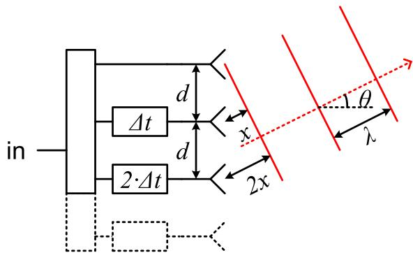  
Fig. 1. Principle of phased array antenna (PAA). In the feeder network of the PAA, the input signal is first split into n copies. Each of the copies is delayed with an appropriate value -t such that the interferences after radiation point towards the desired direction θ [39].

while L corresponds to the link losses. $G _ { t }$ and $G _ { r }$ are the gain of the transmitting and receiving antennas, respectively, whereas F S P L is the free space path loss defined as

$$
F S P L = - 2 0 \cdot \log_ {1 0} \left(\frac {4 \pi \cdot d \cdot f}{c}\right), \tag {2}
$$

where f , d and c are the carrier frequency, the distance between the antennas, and the speed of light in the propagation medium, respectively. Combining the FSPL and the atmospheric losses provides a good estimate for the required specification of the various components in the link. Assuming an attenuation of 17 dB/km for 50 mm/s rain [6], the total transmission losses for a 60 GHz system are reported in Table I for different distances. The losses are as high as 103 dB for a 50 m link. Doubling the distance further increases the losses by 7 dB.

To overcome these high losses the power margin $P _ { o u t } - P _ { i n }$ from Eq. (1) should be maximized. This can be achieved by increasing the transmitted power and reducing the minimum power required in the receiver. More importantly, high directivity antennas have to be implemented in order to focus the beam, i.e. increasing $G _ { t }$ and $G _ { r }$ in Eq. (1).

# B. Point-to-Multipoint

To support point to multipoint transmission, directive beams from high gain antennas have to be steerable in order to combine both high reach and spatial flexibility. PAAs with active FNs are a solution to this challenge [40]. PAAs are realized by driving n tunable time delay elements with an equally split source signal [39], see Fig. 1. It can be deducted from Fig. 1 that two adjacent antennas require a time delay difference $\Delta t = - x / \mathrm { c } = - \sin \theta \cdot d / \mathrm { c }$ , where c represents the speed of light [7]. The propagation direction can be controlled by adjusting the signal delay $\Delta t$ in each radiating antenna element [39].

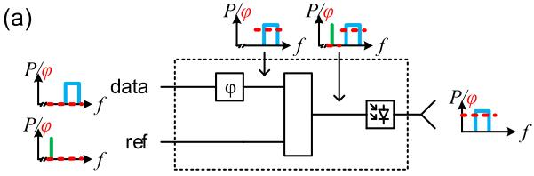

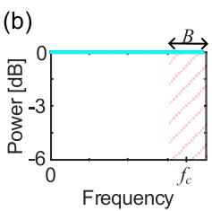

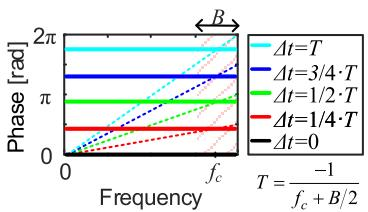  
Fig. 2. PAA feeder based on a TTD approximated by phase shifters. (a) Array element consisting of a phase modulator, a combiner and a photodiode that down-converts the optical signals into an RF signal before being fed to the antenna. (b) The TTD delay approximated by phase shifters features an ideal power frequency response (left) without any loss compared to its ideal counterpart. Yet the phase response (solid lines in right plot) shows errors when compared to the ideal TTD (dashed lines). This will lead to a beam squint in the PAA [39].

# III. ULTRA-FAST BEAM STEERING

To enable broadband ultra-fast symbol-by-symbol beam steering, a PAA is needed in which each antenna in the feeder network (FN) requires a well-defined TTD. An ideal TDD provides a frequency independent unitary power response and a linear phase response. Varying the delay value changes the slope of the phase response [37]. In practical systems, TTDs are approximated by various methods. In order to compare various TTDs implementations, we have performed simulations [39]. Our study provides a simple metric to assess the performances of FNs with the various TTDs. Here, we highlight the two most relevant approaches from [39] enabling ultra-fast steering.

# A. Array Feeder Based on Phase Shifters

FNs can be built by replacing the TTDs in each of the antenna elements with phase shifters [41]. When approximating TTD with phase shifters, the phase response as a function of frequency is constant instead of linear [37]. Due to this approximation, beam squint will occur. Different spectral components will be steered in different directions.

An element of a MWP PAA based on a phase shifter is schematically depicted in Fig. 2(a). Here, the phase shifters are placed on the input port carrying the data laser. The phase shift will delay the beating of the reference and data signal in the photodiode. Fig. 2(b) shows that the power frequency response is perfectly constant across all frequencies. The phase response corresponds to a constant phase offset applied to all frequencies equally, Fig. 2(b). In the frequency band of the signal (shaded area in Fig. 2(b)), the phase error is directly proportional to the fractional bandwidth, i.e. a system with a fractional bandwidth of e.g. 25% will have a phase error of up to 25% for $\Delta t = T$ . This error needs to be compared to the ideal TTD phase response - see dashed lines in Fig. 2(b) - and will lead to beam squint.

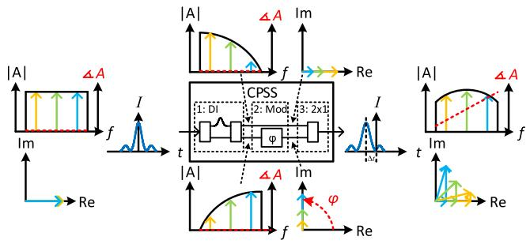  
Fig. 3. Ultra-fast tunable TTD based on complementary phase shifted spectra (CPSS). The input signal is first split into two complementary spectra using a delay interferometer (DI). Before being recombined, one of the signals is phase shifted by an optical phase modulator. The result is an almost ideal phase response [37].

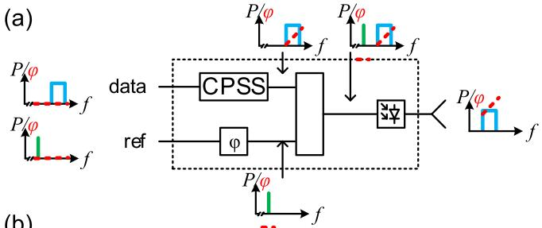

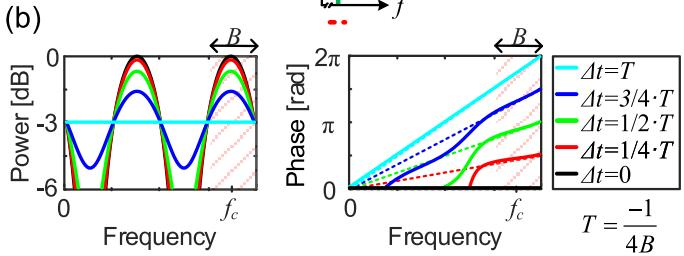  
Fig. 4. PAA feeder using CPSS-SCT. (a) An array element based on the CPSS-SCT scheme is built by applying the CPSS scheme on the laser carrying data and, in parallel, adjusting the phase of the reference laser by another phase shifter. (b) The power response (left) shows variations of about 1.5 dB in the bandwidth of interest while tuning the delay. The phase response (solid lines) is close to the ideal TDD response (dashed lines) for a designed fractional bandwidth of 25% (shaded area) [39].

# B. Array Feeder Based on CPSS-SCT

In this section we describe a FN based on tunable delay units providing ultra-fast, broadband, and continuous tuning [37]. The technique called complementary phase shifted spectra (CPSS) imitates an ideal TTD. The principle of CPSS time delay can be understood with the help of Fig. 3. In this figure we plot the amplitude and phase response as well the phasors of a signal at various stages of the TTD element. First, the input signal is spectrally split using a delay interferometer into two complementary spectra (CS), see the phase and frequency responses at the upper and lower arms behind the delay interferometer. Secondly, one of the CS receives an additional phase shift from a phase modulator. When the two CS are recombined one obtains a phase frequency response close to the ideal phase response of the ideal TTD.

Such a CPSS delay element can be arranged into a PAA feeder by combining the CPSS signal with a reference laser, see Fig. 4(a). Once both lasers are combined they are directly sent to the photodiode, generating the microwave signals.

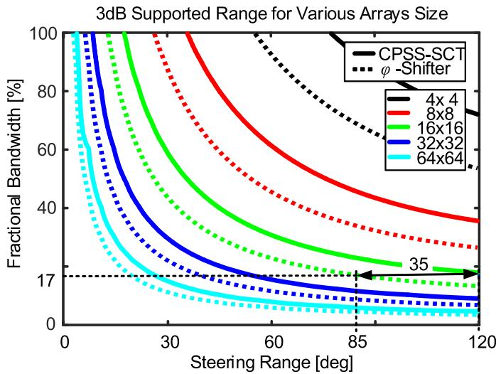  
Fig. 5. Simulated 3 dB supported range. The curves show for various array sizes (various colors), the area in which the gain flatness is better than 3 dB for a particular fractional bandwidth and steering angle. FN based on CPSS-SCT (solid curves) provides larger steering range compare to phase shifter (dashed lines) in all cases. For an exemplary V-band communication link using frequencies from 54 to 64 GHz (17% fractional bandwidth) CPSS-SCT provides steering up to 120° while phase shifter FNs are limited to 85° [39].

To improve the performance of the scheme, the CPSS scheme can be combined with a separate phase tuning of the reference laser [39]. This can be obtained by adding a phase-modulator to the reference laser. This so-called separate carrier tuning (SCT) [42], [43] technique allows to add an offset phase to each PAA elements. While the CPSS gives the possibility to control the slope of the phase response, the SCT adds and offset so that the unit can be operated at higher frequencies. The resulting power and phase frequency responses are plotted in Fig. 4(b) for a filter optimized with a fractional bandwidth of 25% (shaded area). The phase response in the shaded area is close to ideal (dashed lines) which mean that beam squint should not occur.

# C. Scheme Comparison

To assess PAA FN based on either phase-shifters or CPSS-SCT tuning we compare the 3 dB supported range [39] for both implementation and for various array sizes. We define the 3 dB supported range as the range within which beam steering for a given fractional bandwidth can be achieved with a gain flatness better than 3 dB. The dashed lines correspond to a PAA based on simple phase shifters (Fig. 2) while the solid lines corresponds to a PAA FN relying on CPSS-SCT (Fig. 5).

For a PAA with 16×16 elements (green curves) providing a gain of 24 dB, CPSS-SCT allows a steering range of 120° for a fractional bandwidth up to 17%. A PAA FN relying on simple phase shifters would only support a steering range of 85°.

In our ultra-fast beam steering demonstration we use CPSS without SCT. This simplification has been done in order to demonstrate both ultra-fast steering and CPSS with on-the-shelf components. This will not reduce the functionality but only come at the expense of the steering range [39].

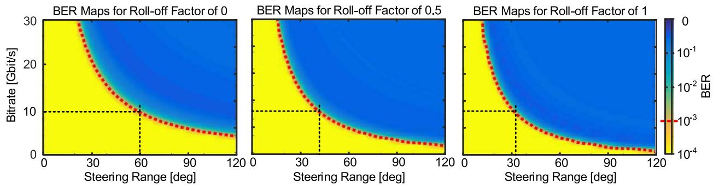  
Fig. 6. Impact of roll off factor on CPSS-SCT array feeders performances. The simulations are performed for a 16×16 element array at a carrier frequency of 35 GHz. The black dashed line corresponds to the 10 Gbit/s experiment with a fractional bandwidth of 29% as discussed further below. It can be see that increasing the roll-off factor decreases the steering range. This can be interpreted by the fact that increasing the roll-off factor increases the bandwidth of the signal.

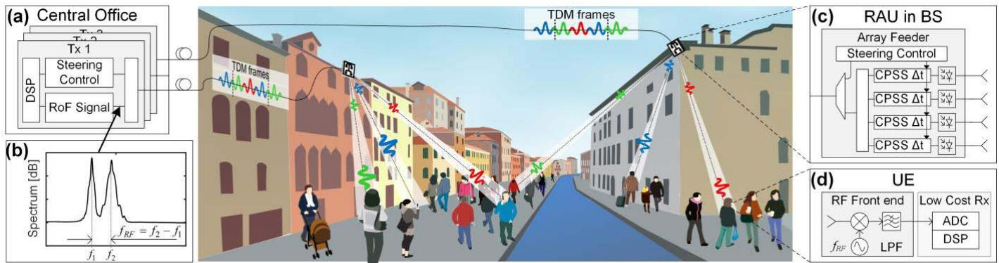  
Fig. 7. Concept of mmW RAN based on ultra-fast beam steering. The central office (CO) in (a) sends time division multiplexed (TDM) data frames to multiple users via a remote antenna unit (RAU). The radio-over-fibre (RoF) signal is shown in (b). The RAU (c) uses the steering control signal sent from the CO to steer the time slots of the symbol based TDM signal to different directions, acting as a spatial demultiplexer. The user equipment (UE) is based on an RF front end that down-converts the signal to baseband. A low pass filter (LPF) is implemented to reduce the noise level. In the receiver of the UE, low cost analog-to-digital converters (ADC) and digital signal processors (DSP) can be used as the UE only receives signals during its predefined time slot. If a 10 Gbit/s TDM is demultiplexed to 3 users, the UEs will only require 3.3 Gbit/s receivers. To prevent transmission outage if the line-of-sight condition is lost, multiple BS have to covers the same area. This also increases further the available bandwidth per area while inter-cell-interferences are prevented by the directed beams.

Another analysis of the CPSS-SCT array feeder is performed in Fig. 6. It shows how the roll-off factor of a squared root raised cosine filter in the transmitted signal impacts the performance of a communication link based on a 16×16 array at 35 GHz. The simulations are performed in time domain by transmitting for each data point 1 million symbols. The receiver has been implemented with a matched filter and the corresponding roll-off factor. The results show that the smaller the roll-off, the better. This is due to the fact that larger roll-off factors require a larger bandwidth.

# IV. DEMONTRATION OF ULTRA-FAST BEAM STEERING

Subsequently, we demonstrate ultrafast beam-steering in an access network scenario by performing symbol-by-symbol beam steering. Symbol-by-symbol beam steering is a kind of time space division multiplexing and provides two main advantages. First, it enables beamforming in the remote phased array antenna (PAA) which extends the reach of the link. Second, the data rate received by the end-user is linearly reduced by the number of user equipment (UE). Therefore, the hardware complexity and cost is strongly reduced and can rely on cheaper receiver (Rx) electronics. Ultra-fast beam steering

is achieved based on microwave photonics as explained in the previous section. For the sake of simplicity, we will confine ourselves to a PAA FN with only 2 antennas and to a CPSS implementation without a SCT-scheme. This will only limit the tuning range but not degrade the functionality.

# A. RAN Leveraging Symbol-by-Symbol Steering

Our proposed TSDM based MWP radio access network (RAN) implementation is depicted in Fig. 7 [44]. A transmitter located in the central office generates a radioover-fiber (RoF) data signal and a steering control (SC) signal, see Fig. 7(a). The spectrum of the RoF signal is displayed in Fig. 7(b). The desired microwave carrier frequency fRF corresponds to the frequency difference between a reference and a carrier laser, $f _ { 1 }$ and $f _ { 2 }$ respectively [5]. The data for the different UEs and the SC signals are generated by a digital signal processor (DSP) within the transmitter. The CO needs to know the exact position of the UEs in order to steer the signals correctly in the remote antenna unit (RAU) of the BS. This information could be provided actively by the UEs or measured in the RAU using direction of arrival (DoA) in a duplex implementation of our concept.

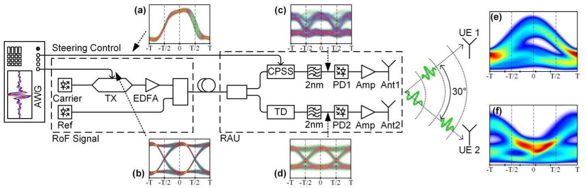  
Fig. 8. Experimental setup. An AWG generates two signals; a CPSS drive signal (a) and a PRBS15 NRZ TDM signal (b) which is encoded onto a carrier. The amplified carrier is combined with the reference line and fed to the remote antenna unit (RAU). In the RAU the signal is split into two paths, one is guided through the CPSS tuneable true time delay (c) and the second through a fixed time delay (TD) line (d). The TD compensates the path difference between the two arms. Finally, the photodiodes (PD) 1 and 2 generate the 35 GHz RF carrier through photonic mixing. (e) and (f) show exemplary eye diagrams of the received signal at the two users. They demonstrate the symbol-by-symbol switching capacity.

The RAUs, Fig. 7(c), are built using a MWP PAA with ultra-fast tunable delay line elements (CPSS). The SC is transmitted to the RAU on a separate optical channel. The time delays for each element of the PAA are set in the feeder network of the RAU using the SC signal.

As depicted in Fig. 7(d), the UEs require first an RF front end to down-convert the wireless signals. A low pass filter is included to reduce the bandwidth of the signal. The signal processing can be performed in a low-cost receiver as the UEs only receive during their assigned time slots.

As with other mmW RAN schemes, the transmission from the BS to the UEs works well with line-of-sight (LoS) conditions. If the LoS is interrupted by obstacles or simply because the users turning around, the transmission will be reduced. A solution to this problem was already proposed [45]. It relies on a multihop relaying where multiple BS covers the same area. In Fig. 7, this is exemplarily realized with BS on both side of the river. Increasing the BS density also increase the available bandwidth per area while inter-cell-interferences are prevented by the directed beams.

# B. Experimental Setup

We experimentally demonstrate ultra-fast beam steering using the setup depicted in Fig. 8. The architecture of the proposed system consists mainly of two parts, a RoF transmitter and a PAA in the RAU with two antennas. A 10 Gbit/s TDM data signal is generated by an arbitrary waveform generator (AWG M8195A). A root-raised cosine pulse shape with a roll-off of 0.8 is used. The data modulates the intensity of a cw laser with frequency f2 by means of an external lithium niobate $\left( \mathrm { L i N b } \mathrm { O } _ { 3 } \right)$ Mach-Zehnder modulator. The output of the modulator is combined with a second laser of frequency $f _ { 1 }$ . The two laser carriers are separated with a frequency difference corresponding to the desired millimeter wave carrier, i.e. $f _ { \mathrm { R F } } ~ = ~ f _ { 2 } ~ - ~ f _ { 1 } ~ = ~ 3 5$ GHz. The optical spectrum is shown in Fig. 7(b). The phase fluctuations between the two free running lasers are not impacting the results

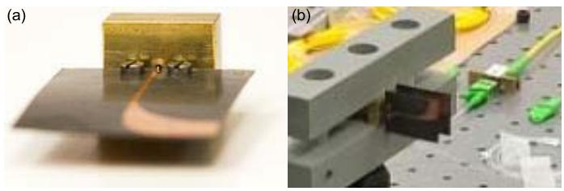  
Fig. 9. The 2×1 array of the RAU is made of two custom designed Vivaldi antennas. (a) Picture of the Vivaldi antenna used for the experimental demonstration. The antennas are designed to support frequencies from 30 to 40 GHz. (b) Antennas arranged in a 2×1 array with an antenna spacing of λ.

as this first proof-of-concept is realized with on-off-keying signal.

At the RAU, the combined signal is split and fed to a 2 1 array feeder. On antenna 1, a CPSS filter is used to tune the delay based on the control signal it receives directly from the AWG. The control signal for this proof-of-concept demonstration is transmitted through a RF cable rather than through a parallel optical channel as proposed in Fig. 7. However, proper calibration to synchronize the data and the control signal is required. On the path to antenna 2, a fixed time delay (TD) line is used to compensate any length difference between the two paths to the two antennas. In both paths, the out-of-band noise mainly from the EDFAs is removed by an optical band-pass filter. The photonic mixing of the two lasers at the two 40 GHz photodetectors (PDs) from Albis Opto generate the 35 GHz RF-signal. RF amplifiers are used to boost the electrical signals form the PDs to the required 10 dBm. Finally, the electrical signals are fed to two specially designed Vivaldi antennas, see Fig. 9. At the UEs, two horn antennas separated by 30° receive the RF signals, which are analyzed using a real-time oscilloscope (DSO-X 96204Q).

For the system to function properly, synchronization of the signals on the paths to the two transmitter antennas and the steering control is critical. The steering control signal

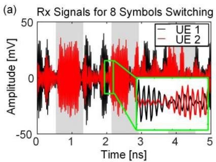

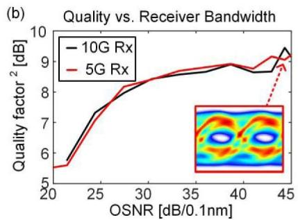

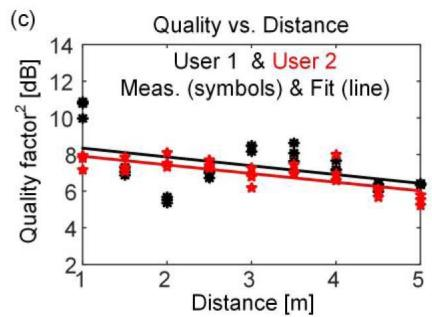  
Fig. 10. Experimental results. (a) Time signal measured at user 1 and 2 for 8-symbol frame steering. The inset shows a zoom in on the transition between the users. It can be seen how at UE2 the UE 2 dominates whereas the signal form UE1 is diminished and the other way round in UE 1. (b) Transmission of a 10 Gbit/s TSDM signal with 5 Gbit/s for UE 1 and 5 Gbit/s capacity for UE2. It is shown how the quality factor vs OSNR (of the RoF signal) for symbol-by-symbol for UE 1, with either a 10 or a 5 GHz receiver bandwidth is similar. The good match between the curves shows that a reducing the receiver bandwidth does not decrease the signal quality. In both cases the 5 GBit/s of UE 1 is received. (c) Quality factor for symbol-by-symbol steering for distances up to 5 m. The quality decreases with higher distance due to higher losses.

of inset Fig. 8(a) must be synchronized with the transmitted signal shown in the inset Fig. 8(b) to enforce steering only at the symbol transitions rather than in the middle of the symbol. After the CPSS modules, the signal (c) is an overlap of a delayed and an undelayed copy. The second signal for antenna 2, inset (d), is synchronized to that of antenna 1 using the fixed time delay (TD). Then, the PAA transmits (c) and (d) to the two UEs. The received eye diagrams are depicted by insets (e) and (f). These eye diagrams show the case of symbol-by-symbol steering as evidenced by their complementary nature. When one antenna receives a symbol, the second receives nothing. This way, the effective data rate is reduced to 5 Gbit/s corresponding to a 50% RZ signal.

# C. Results

For reference, we first measured the steering capability of our implementation with frame based TDM sequence. A 10 Gbit/s signal on a 35 GHz carrier is steered to deliver 8-symbol frames to the users. Fig. 10(a) shows the received signal for the two UEs. The white and gray backgrounds show the time slots where either only User 1 (white slots) or User 2 (gray slots) receives the signal. The inset shows a sample of the transition where the beam is steered from User 1 to 2. The slight cross talk seen in case of User 2 is due to angular misalignment which can be avoided. The power suppression between the users is of about 6 dB between User 1 and 2. This could be largely improved by using an array with more antennas.

Further, we investigated the performances of our scheme using symbol-by-symbol steering. Fig. 10(b) shows the quality factor $Q ^ { 2 }$ [dB] at UE 1 for two different receiver bandwidths while the transmitter transmits 10 Gbit/s. The black curve corresponds to a 10 Gbit/s RX and the red curve to a 5 Gbit/s Rx. The good match between the curves shows that receivers with lower bandwidths (5 GHz instead of 10 GHz) can be used without degradation of the signal quality. The small inset in Fig. 10(b) depicts the eye diagram after the 5 GBit/s Rx. Fig. 10(c) shows how the $\mathrm { Q } ^ { \bar { 2 } }$ [dB] gradually degrades when the transmission distance is increased to 5 m. The reach limitations are due to the low gain offered by the 2×1 phased array.

# V. CONCLUSION

We have introduced and demonstrated an ultra-fast beam steering scheme capable of symbol-by-symbol steering at 10 GBd. The settling time of the system while changing the steering angle is therefore below 50 ps. Such high steering speed are achieve using a microwave photonics approach to generated and delay the signals of the phased array antenna.

Our setup was exemplary used in a millimeter wave radio access network based on a new multiplexing scheme. Beside the reduced costs of the user equipment, our scheme also has the potential to increase the reach and in addition to reduce the inter-cell interference of the radio access network. Both advantages are provided by the beamforming taking place in the remote antenna unit.

The setup demonstrated in this paper could also be used in a receiving array to provide the same flexible bandwidth allocation advantages to a duplex system. Moreover, our demonstration focuses on communication links but other applications such as tracking or scanning could also benefit from ultra-fast beam steering.

# REFERENCES

[1] J. Yao, “Microwave photonics,” J. Lightw. Technol., vol. 27, no. 3, pp. 314–335, Feb. 1, 2009.   
[2] J. Wells, “Faster than fiber: The future of multi-G/s wireless,” IEEE Microw. Mag., vol. 10, no. 3, pp. 104–112, May 2009.   
[3] S. Koenig et al., “Wireless sub-THz communication system with high data rate,” Nature Photon., vol. 7, pp. 977–981, Oct. 2013.   
[4] S. Sun, T. S. Rappaport, R. W. Heath, A. Nix, and S. Rangan, “Mimo for millimeter-wave wireless communications: Beamforming, spatial multiplexing, or both?” IEEE Commun. Mag., vol. 52, no. 12, pp. 110–121, Dec. 2014.   
[5] J. Capmany and D. Novak, “Microwave photonics combines two worlds,” Nature Photon., vol. 1, no. 6, pp. 319–330, Apr. 2007.   
[6] C. Dehos et al., “Millimeter-wave access and backhauling: The solution to the exponential data traffic increase in 5G mobile communications systems?” IEEE Commun. Mag., vol. 52, no. 9, pp. 88–95, Sep. 2014.   
[7] R. J. Mailloux, Phased Array Antenna Handbook, 2nd ed. Norwood, MA, USA: Artech House, 2005.   
[8] T. Akiyama, A. Satoh, K. Nishizawa, S. Yamamoto, S. Itakura, and Y. Hirano, “Fourier transform optically controlled phased array antenna in receiving operation,” in Proc. MWP, Oct. 2009, pp. 1–4.

[9] X. Yi, T. X. H. Huang, and R. A. Minasian, “Photonic beamforming based on programmable phase shifters with amplitude and phase control,” IEEE Photon. Technol. Lett., vol. 23, no. 18, pp. 1286–1288, Sep. 15, 2011.   
[10] T. Akiyama et al., “Spatial light modulator based optically controlled beamformer for variable multiple-spot beam antenna,” in Proc. MWP, Oct. 2011, pp. 401–404.   
[11] X. Yi, L. Li, T. X. Huang, and R. A. Minasian, “Programmable multiple true-time-delay elements based on a Fourier-domain optical processor,” Opt. Lett., vol. 37, no. 4, pp. 608–610, Feb. 2012.   
[12] L. Jofre et al., “Optically beamformed wideband array performance,” IEEE Trans. Antennas Propag., vol. 56, no. 6, pp. 1594–1604, Jun. 2008.   
[13] F. Xia, L. Sekaric, and Y. Vlasov, “Ultracompact optical buffers on a silicon chip,” Nature Photon., vol. 1, pp. 65–71, Jan. 2007.   
[14] A. Meijerink et al., “Novel ring resonator-based integrated photonic beamformer for broadband phased array receive antennas—Part I: Design and performance analysis,” J. Lightw. Technol., vol. 28, no. 1, pp. 3–18, Jan. 1, 2010.   
[15] L. Zhuang et al., “Novel ring resonator-based integrated photonic beamformer for broadband phased array receive antennas—Part II: Experimental prototype,” J. Lightw. Technol., vol. 28, no. 1, pp. 19–31, 2010.   
[16] L. Zhuang et al., “Ring resonator-based on-chip modulation transformer for high-performance phase-modulated microwave photonic links,” Opt. Exp., vol. 21, no. 22, pp. 25999–26013, 2013.   
[17] L. Zhuang et al., “On-chip microwave photonic beamformer circuits operating with phase modulation and direct detection,” Opt. Exp., vol. 22, no. 14, pp. 17079–17091, 2014.   
[18] C. Roeloffzen et al., “Integrated optical beamformers,” in Proc. Opt. Fiber Commun. Conf., Los Angeles, CA, USA, 2015, p. Tu3F.4.   
[19] B.-M. Jung, D.-H. Kim, I.-P. Jeon, S.-J. Shin, and H.-J. Kim, “Optical true time-delay beamformer based on microwave photonics for phased array radar,” in Proc. 3rd Int. Synth. Aperture Radar (APSAR), Sep. 2011, pp. 1–4.   
[20] B.-M. Jung, J.-D. Shin, and B.-G. Kim, “Optical true time-delay for two-dimensional X-band phased array antennas,” IEEE Photon. Technol. Lett., vol. 19, no. 12, pp. 877–879, Jun. 15, 2007.   
[21] J. Mørk, R. Kjær, M. van der Poel, and K. Yvind, “Slow light in a semiconductor waveguide at gigahertz frequencies,” Opt. Exp., vol. 13, no. 20, pp. 8136–8145, 2005.   
[22] P. Berger, J. Bourderionnet, F. Bretenaker, D. Dolfi, and M. Alouini, “Time delay generation at high frequency using SOA based slow and fast light,” Opt. Exp., vol. 19, no. 22, pp. 21180–21188, 2011.   
[23] W. Zhang and J. Yao, “Photonic generation of millimeter-wave signals with tunable phase shift,” IEEE Photon. J., vol. 4, no. 3, pp. 889–894, Jun. 2012.   
[24] S. Blais and J. Yao, “Photonic true-time delay beamforming based on superstructured fiber Bragg gratings with linearly increasing equivalent chirps,” J. Lightw. Technol., vol. 27, no. 9, pp. 1147–1154, May 1, 2009.   
[25] C. Caucheteur et al., “All-fiber tunable optical delay line,” Opt. Exp., vol. 18, no. 3, pp. 3093–3100, 2010.   
[26] D. B. Hunter, M. E. Parker, and J. L. Dexter, “Demonstration of a continuously variable true-time delay beamformer using a multichannel chirped fiber grating,” IEEE Trans. Microw. Theory Techn., vol. 54, no. 2, pp. 861–867, Feb. 2006.   
[27] M. Burla, L. R. Cortés, M. Li, X. Wang, L. Chrostowski, and J. Azaña, “On-chip programmable ultra-wideband microwave photonic phase shifter and true time delay unit,” Opt. Lett., vol. 39, no. 21, pp. 6181–6184, 2014.   
[28] M. Burla, L. R. Cortés, M. Li, X. Wang, L. Chrostowski, and J. Azaña, “Integrated waveguide Bragg gratings for microwave photonics signal processing,” Opt. Exp., vol. 21, no. 21, pp. 25120–25147, 2013.   
[29] Z. Cao et al., “Integrated remotely tunable optical delay line for millimeter-wave beam steering fabricated in an InP generic foundry,” Opt. Lett., vol. 40, no. 17, pp. 3930–3933, Sep. 2015.   
[30] R. Soref, “Optical dispersion technique for time-delay beam steering,” Appl. Opt., vol. 31, no. 35, pp. 7395–7397, 1992.   
[31] M. Y. Chen, “Hybrid photonic true-time delay modules for quasicontinuous steering of 2-D phased-array antennas,” J. Lightw. Technol., vol. 31, no. 6, pp. 910–917, Mar. 15, 2013.   
[32] H. Lee, H.-B. Jeon, and J.-W. Jung, “Optical true time-delay beamforming for phased array antenna using a dispersion compensating fiber and a multi-wavelength laser,” in Proc. 4th Annu. Caneus Fly Wireless Workshop (FBW), Jun. 2011, pp. 1–4.   
[33] B. Vidal et al., “Simplified WDM optical beamforming network for large antenna arrays,” IEEE Photon. Technol. Lett., vol. 18, no. 10, pp. 1200–1202, May 2006.

[34] S. Namiki, “Wide-band and -range tunable dispersion compensation through parametric wavelength conversion and dispersive optical fibers,” J. Lightw. Technol., vol. 26, no. 1, pp. 28–35, Jan. 1, 2008.   
[35] N. Alic et al., “Microsecond parametric optical delays,” J. Lightw. Technol., vol. 28, no. 4, pp. 448–455, Feb. 15, 2010.   
[36] S. Shouyuan et al., “Conformal ultra-wideband optically addressed transmitting phased array and photonic receiver systems,” in Proc. Int. Topical Meeting Microw. Photon. (MWP), Oct. 2013, pp. 221–224.   
[37] R. Bonjour, S. A. Gebrewold, D. Hillerkuss, C. Hafner, and J. Leuthold, “Continuously tunable true-time delays with ultra-low settling time,” Opt. Exp., vol. 23, no. 5, pp. 6952–6964, 2015.   
[38] H. T. Friis, “A note on a simple transmission formula,” Proc. IRE, vol. 34, no. 5, pp. 254–256, May 1946.   
[39] R. Bonjour, M. Singleton, P. Leuchtmann, and J. Leuthold, “Comparison of steering angle and bandwidth for various phased array antenna concepts,” Opt. Commun., 2015, doi:10.1016/j.optcom.2015.10.032.   
[40] M. Burla et al., “On-chip, CMOS-compatible, hardware-compressive integrated photonic beamformer based on WDM,” in Proc. Int. Topical Meeting Microw. Photon. (MWP), Oct. 2013, pp. 41–44.   
[41] S. Shi, J. Bai, G. Schneider, and D. Prather, “Optical phase feed network and ultra-wideband phased array,” in Proc. IEEE Photon. Conf., Sep. 2012, pp. 372–373.   
[42] P. A. Morton and J. B. Khurgin, “Microwave photonic delay line with separate tuning of the optical carrier,” IEEE Photon. Technol. Lett., vol. 21, no. 22, pp. 1686–1688, Nov. 15, 2009.   
[43] M. Burla et al., “On-chip CMOS compatible reconfigurable optical delay line with separate carrier tuning for microwave photonic signal processing,” Opt. Exp., vol. 19, no. 22, pp. 21475–21484, 2011.   
[44] R. Bonjour et al., “Time-space division multiplexing enabled by ultra-fast beam steering,” in Proc. Int. Topical Meeting Microw. Photon. (MWP), 2015, pp. 1–3.   
[45] S. Rangan, T. S. Rappaport, and E. Erkip, “Millimeter-wave cellular wireless networks: Potentials and challenges,” Proc. IEEE, vol. 102, no. 3, pp. 366–385, Mar. 2014.

Romain Bonjour was born in Switzerland in 1986. He received the B.Sc. (Hons.) degree in industrial engineering and the M.Sc. (Hons.) degree from the University of Applied Science of Neuchatel. His M.Sc. thesis is on 3-D laser lithography. He is currently pursuing the Ph.D. degree with the Optical and Wireless Communication Group, Institute of Electromagnetic Fields, ETH Zurich. His research focus is on ultrafast microwave photonics beam steering for next-generation radio access networks. In 2012, he received a scholarship to follow the cursus of the Karlsruhe School of Optics and Photonics, Karlsruhe, Germany.

Matthew Singleton was born in U.K. in 1991. He received the M.Eng. (Hons.) degree in electrical and electronic engineering from Imperial College London, in 2014. In his final academic year, he came to ETH Zürich as an Exchange Student, where he joined the Institute of Electromagnetic Fields to complete his master’s thesis on the demonstration of ultrafast beam steering using microwave photonics. After graduating, he remained at the institute as a Research Assistant until 2015 to continue working on this topic. His research interests include radio over fiber, beam steering, and wireless communications.

Simon Arega Gebrewold received the M.Sc. degree in optics and photonics from the Karlsruhe Institute of Technology, Karlsruhe, Germany, in 2012, with a focus on orthogonal frequency division multiplexing with directly modulated laser. He is currently pursuing the Ph.D. degree with the Optical Communication Systems Group, ETH Zurich, Zurich, Switzerland. His research interests include investigation and modeling of semiconductor optical amplifiers for application is wavelength division multiplexed passive optical network access solutions.

Yannick Salamin (S’13) received the B.S. degree in system engineering from the University of Applied Science of Western Switzerland, Sion, Switzerland, in 2010, and the M.S. degree in electrical engineering from Zhejiang University, Hangzhou, China, in 2014. He is currently pursuing the Ph.D. degree with ETH Zurich, Switzerland. As a Visiting B.S. Student, he visited Zhejiang University for six months in 2010. From 2011 to 2014, he was with the Laboratory of Applied Research on Electromagnetic, Zhejiang University. Since 2014, he has been with the Institute of Electromagnetic Fields, ETH Zurich, Switzerland. His current research interests include electrooptic devices, plasmonics, microwave photonics, and metamaterials. He was a recipient of a full scholarship for post-graduate studies granted by the Ministry of Education of China (2011-2014).

Felix Christian Abrecht was born in Germany in 1988. He received the B.Sc. and M.Sc. degrees from the Karlsruhe Institute of Technology, Germany, in 2012 and 2014, respectively. He is currently pursuing the Ph.D. degree with the Institute of Electromagnetic Fields (IEF), ETH Zurich. After conducting his master’s thesis on carrier recovery algorithms for optical real-time receivers at IEF, ETH Zurich, he stayed with the IEF. His research interests include nextgeneration wireless communication systems, radio over fiber, and microwave photonics.

Benedikt Baeuerle was born in Germany in 1987. He received the B.Sc. and M.Sc. degrees in electrical engineering and information technology from the Karlsruhe Institute of Technology, Karlsruhe, Germany, in 2010 and 2013, respectively. He is currently pursuing the Ph.D. degree at the Institute of Electromagnetic Fields, ETH Zurich, Switzerland. In 2012, he visited the Photonics System Group, Tyndall National Institute, Cork, Ireland, as a Research Intern. His research interests include digital signal processing, realtime processing, digital coherent transceivers, optical transmission systems, and subsystems.

Arne Josten was born in Germany in 1986. He received the M.Sc. degree in electrical engineering and information technology from the Karlsruhe Institute of Technology, Karlsruhe, Germany, in 2013. He is currently pursuing the Ph.D. degree at ETH Zurich in the group of Prof. J. Leuthold. His research interests are digital signal processing for high-speed optical communication. Here a focus lies on the real-time capability of the developed schemes.

Pascal Leuchtmann received the Diploma degree in electrical engineering and the Ph.D. degree from the Swiss Federal Institute of Technology (ETH) in 1980 and 1987, respectively. From 1980 to 1989, he was an Assistant with the Electromagnetics Group (under Prof. H. Baggenstos), then scientific official in the same group. He was a member of RSI-B (2008-2011: Chair of commission B in Germany) and a Technical Program Chair of EMC Zurich in 2005 and 2009, respectively. Since 1991, he has been a Lecturer at ETH and is teaching courses in electromagnetics.

Christian Hafner received the Ph.D. degree from ETH Zurich for a proposition of a new method for computational electromagnetics, the multiple multipole program (MMP) in 1980. This method was also the main part of his habilitation on computational electromagnetics at ETH in 1987. In 1999, he was given the title of Professor at ETH and from 2010 to 2013, he was the Head of the Institut für Feldtheorie und Höchstfrequenztechnik at ETH. The focus of his current research is on computational electromagnetics; intelligent optimization procedures; and metamaterials, plasmonics and optical antennas, scanning nearfield microscopy, solar cells. His work was published in various international journals papers, as well as in seven books and book-software packages, which include his 2-D-MMP, 3-D-MMP, and MaX-1 codes. The latest MMP codes and 2-D and 3-D FDTD codes and are also available in the open source package OpenMaXwell. It was honored by a Seymour Cray Award for Scientific Computing in 1990.

Juerg Leuthold was born in 1966 in Switzerland. He received the Ph.D. degree in physics from ETH Zürich with a research in integrated optics and all-optical communications. From 1999 to 2004, he was with Bell Labs, and Lucent Technologies, Holmdel, USA, where he has been performing device and system research with III/V semiconductor and silicon optical bench materials for applications in high-speed telecommunications. From 2004 to 2013, he was a Full Professor at the Karlsruhe Institute of Technology, where he was the Head of the Institute of Photonics and Quantum Electronics and the Helmholtz Institute of Microtechnology. Since 2013, he has been a Full Professor at the Swiss Federal Institute of Technology.