Published in IET Generation, Transmission & Distribution

Received on 6th June 2012

Revised on 5th April 2013

Accepted on 30th May 2013

doi: 10.1049/iet-gtd.2012.0284

  
ISSN 1751-8687

# New model for overhead lossy multiconductor transmission lines

Juan C. Escamilla1, Pablo Moreno2, Pablo Gómez3

1 CENALTE de la Comisión Federal de Electricidad (CFE), Calle Violetas No. 7, Reserva Territorial Atlixcáyotl, C.P. 72197, San Andrés Cholula, Puebla, Mexico   
2 CINVESTAV del IPN, Unidad Guadalajara, Av. del Bosque 1145, Col. El Bajío, C.P. 45019, Zapopan, Jal., Mexico   
3 Electrical Engineering Department of SEPI-ESIME Zacatenco, Instituto Politécnico Nacional (IPN), U.P. ‘Adolfo López Mateos’, Edificio Z-4 Primer piso, C.P. 07738, México, D.F., Mexico

E-mail: pgomezz@ipn.mx

Abstract: A new model for time-domain electromagnetic transient analysis of overhead multiconductor transmission lines with frequency-dependent electrical parameters is presented. The model is based on the method of characteristics, which has been used before by means of the application of finite difference schemes. Conversely to the regular method of characteristics, the model presented here does not require the spatial discretisation along the line. Also, the frequency dependence of the electrical parameters is included by means of a transient resistance matrix. To validate the model, the results are compared to those from a frequency-domain method, the alternative transients program/electromagnetic transients program (ATP/EMTP) and the electromagnetic transients program-restructured version (EMTP-RV).

# 1 Introduction

Electromagnetic transient analysis of power systems usually requires line models capable of reproducing frequency-dependent effects. Although frequency-domain models are very accurate, they present difficulties when dealing with non-linearities and are impractical for interfacing with time-domain simulation programs like EMTP. On the contrary, time-domain methods possess great versatility simulating topology changes of electrical networks and non-linear elements; however, modelling the elements with frequency-dependent parameters introduces convolution procedures.

In 1982, Martí [1] developed his line model which is still in use in the EMTP. In this model, the frequency dependence of the propagation function and the characteristic impedance of the line were taken into account, but the transformation matrix was considered as real and constant.

In 1998, Gustavsen and Semlyen [2] proposed a method in the phase domain. In this work, the characteristic impedance and the propagation function were modelled by using the method of vector fitting. All the elements in each column of the transformation matrix were fitted using the same poles. Another model in phase domain, named universal line model (ULM), was proposed by Morched, Gustavsen and Tartibi in 1999 [3]. This model arose from the necessity of modelling highly frequency-dependent transformation matrices and widely different modal velocities. This model is considered today the most advanced and exact one in the time domain. Further researches have focused on improving

this model in terms of passivity enforcement, stability and symmetry preservation [4–7]. Recently, it has been shown that this model, with corresponding modifications, can be effectively applied to perform real-time simulations [8].

A different approach for the modelling of transmission lines is based on state-space techniques in lumped parameter representations [9, 10]. However, this approach requires the external inclusion of frequency dependence of the electrical parameters and the discretisation of the line in a number of segments, which can be prone to numerical oscillations. A recent paper has proposed the use of a finite impulse response digital filter to reduce this problem [11].

This work presents a new model of overhead multiconductor transmission lines (MTL) for time-domain transient analysis. The model is based on the time-domain solution of the telegrapher’s equations using the method of characteristics [12]. The aim of this method is to convert partial differential equations to ordinary differential equations and then solve the problem using finite differences. The method of characteristics has been used before in modelling non-uniform, non-linear and external field-excited transmission lines as well as cables and machine windings [13–15]. In these cases using this method requires a time–distance discretisation mesh.

In the model presented in this paper, following the results presented in [16] for single-phase frequency-dependent lines, and in [17] for multiconductor frequency independent lines, the method of characteristics is reformulated for uniform MTL with frequency-dependent electrical parameters. In this model, no discretisation mesh is required

and Norton equivalent circuits for the line ends are developed. This model possesses some important advantages in comparison with existing frequency-dependent line models:

Modal transformation matrices are constant and the frequency dependence of the electrical parameters is embedded in the convolution term of the series transmission line equation.   
† It requires only the synthesis of the transient resistance, while travelling wave models require synthesising the characteristic admittance and the propagation exponential matrices.   
† Owing to the smoothness of the transient resistance, its rational fitting is straightforward, requires only real poles and there is no need of extracting time delays.   
It only requires two matrix vector convolutions for the transmission line Norton model.

# 2 Transmission line equations

# 2.1 MTL’s equations with frequency-dependent electrical parameters

The telegrapher’s equations in the frequency domain are defined as follows

$$
\begin{array}{l} - \frac {\mathrm {d} V (x , s)}{\mathrm {d} x} = Z (s) I (x, s), \tag {1a,b} \\ - \frac {\mathrm {d} I (x , s)}{\mathrm {d} x} = Y (s) V (x, s) \\ \end{array}
$$

where s is the Laplace variable, $V ( x , s )$ and $I ( x , s )$ are the voltage and current vectors, respectively; $\pmb { Z } ( s )$ and $Y ( s )$ are the series impedance and shunt admittance matrices. For a system of n conductors with ground return, all matrices are of dimension $n \times n$ and vectors of $n \times 1$ .

The series impedance matrix $\pmb { Z } ( s )$ consists of three components [18]

$$
\boldsymbol {Z} (s) = \boldsymbol {Z} _ {\mathrm {C}} (s) + \boldsymbol {Z} _ {\mathrm {E}} (s) + \boldsymbol {Z} _ {\mathrm {G}} (s) \tag {2a}
$$

where $\pmb { Z } _ { \mathrm { C } } ( s )$ is the internal impedance of the conductors, $\pmb { Z } _ { \mathrm { E } } ( s )$ is the earth return path impedance and $\mathbf { \tilde { z } } _ { \mathrm { G } } ( s )$ is the geometrical impedance due to the physical arrangement of the conductor.

Moreover, the geometrical impedance can be expressed as follows

$$
Z _ {\mathrm {G}} (s) = s L _ {0} \tag {2b}
$$

where $L _ { 0 }$ is the matrix of inductances due to the magnetic flux in the air.

The shunt admittance is evaluated considering only the electrical field in the air. When the air is assumed to have zero conductance Y(s) is expressed as follows

$$
\boldsymbol {Y} = s \boldsymbol {C} _ {0} \tag {2c}
$$

where $C _ { 0 }$ is the capacitances matrix.

Time-domain modelling of MTL requires that (1a) and (1b) be expressed and solved in time domain. For overhead lines this involves a convolution in (1a) that can be stated in various forms. Using (2a) and (2b), (1a) can be written as

follows

$$
- \frac {\mathrm {d} V (x , s)}{\mathrm {d} x} = \left(R ^ {\prime} (s) + L _ {0}\right) s I (x, s) \tag {3a}
$$

where R′(s) is the transient resistance [19] given by

$$
\boldsymbol {R} ^ {\prime} (s) = \left(\frac {\boldsymbol {Z} _ {C} (s) + \boldsymbol {Z} _ {E} (s)}{s}\right) \tag {3b}
$$

Transforming (3a) to the time domain

$$
\frac {\partial \boldsymbol {v} (x , t)}{\partial x} + \boldsymbol {L} _ {0} \frac {\partial \boldsymbol {i} (x , t)}{\partial t} + \frac {\partial}{\partial t} \int_ {0} ^ {t} \boldsymbol {r} ^ {\prime} (t - \tau) \boldsymbol {i} (x, \tau) d \tau = 0 \tag {4a}
$$

and transforming (1b)

$$
\frac {\partial \boldsymbol {i} (x , t)}{\partial x} + \boldsymbol {C} _ {0} \frac {\partial \boldsymbol {v} (x , t)}{\partial t} = \mathbf {0} \tag {4b}
$$

where v(x,t) and $i ( x , t )$ are the time domain voltage and current vectors, respectively, and $\mathbf { } r ^ { \prime } ( t )$ is the time domain image of $\pmb { R } ^ { \prime } ( s )$ .

# 2.2 Modified MTL series equation

The frequency-domain transient resistance given by (3b) can be calculated or measured over any frequency range and, after that, it can be fitted by means of a sum of rational functions as follows

$$
\boldsymbol {R} ^ {\prime} (s) = \sum_ {i = 1} ^ {N} \frac {1}{s + p _ {i}} \boldsymbol {K} _ {i} + \frac {\boldsymbol {K} _ {0}}{s} + \boldsymbol {K} _ {\infty} \tag {5a}
$$

where N is the order of approximation, $\pmb { K } _ { i }$ is the ith residues matrix and $p _ { i }$ is the corresponding pole. $\pmb { K } _ { 0 }$ is the residues matrix at $s = 0$ and $\pmb { K } _ { \infty }$ is the residues matrix at $s = \infty .$ . In (5a) it is assumed that all elements of $\pmb { R } ^ { \prime } ( s )$ are fitted using the same poles. Expressing (5a) in time domain gives

$$
\boldsymbol {r} ^ {\prime} (t) = \boldsymbol {R} _ {\mathrm {D C}} u (t) + \boldsymbol {K} _ {\infty} \delta (t) + \sum_ {i = 1} ^ {N} \mathrm {e} ^ {- p _ {i} t} \boldsymbol {K} _ {i} \tag {5b}
$$

where $u ( t )$ is the unit step, $\delta ( t )$ is the Dirac impulse function and $R _ { \mathrm { D C } } = K _ { 0 }$ is the direct current resistance matrix.

Using (5b), (4a) yields

$$
\frac {\partial \boldsymbol {v} (x , t)}{\partial x} + \boldsymbol {D} \frac {\partial \boldsymbol {i} (x , t)}{\partial t} + \boldsymbol {R} _ {\mathrm {D C}} \boldsymbol {i} (x, t) + \frac {\partial}{\partial t} \int_ {0} ^ {t} \boldsymbol {h} (t - \tau) \boldsymbol {i} (x, \tau) \mathrm {d} \tau = \mathbf {0} \tag {6a}
$$

where

$$
\boldsymbol {D} = \boldsymbol {K} _ {\infty} + \boldsymbol {L} _ {0}, \quad \boldsymbol {h} (t) = \sum_ {i = 1} ^ {N} \boldsymbol {K} _ {i} e ^ {- p _ {i} t} \tag {6b,c}
$$

Applying the Leibniz’s rule in the convolution term of (6a), the next expression is obtained

$$
\frac {\partial \boldsymbol {v} (x , t)}{\partial x} + \boldsymbol {D} \frac {\partial \boldsymbol {i} (x , t)}{\partial t} + \boldsymbol {R} _ {x} \boldsymbol {i} (x, t) + \boldsymbol {\Psi} (x, t) = \mathbf {0} \tag {7a}
$$

where the resistance matrix is given by

$$
\boldsymbol {R} _ {x} = \boldsymbol {R} _ {\mathrm {D C}} + \sum_ {i = 1} ^ {N} \boldsymbol {K} _ {i} \tag {7b}
$$

and the convolution vector by

$$
\Psi (x, t) = - \sum_ {i = 1} ^ {N} p _ {i} \mathbf {K} _ {i} \left[ e ^ {- p _ {i} t} * \mathbf {i} (x, t) \right] \tag {7c}
$$

Equations (4b) and (7a) form the system to be solved to obtain the MTL model proposed in this work.

# 3 Method of characteristics

The goal of the method of characteristics is to change coordinates (x, t) to a new coordinate system in which partial differential equations (PDEs) become ordinary differential equations (ODEs) along certain curves in the x–t plane. Such curves are called characteristic curves or just characteristics. In order to define the characteristics for the PDEs system formed by (4b) and (7a), a modal analysis has to be performed. Let $\pmb { T } _ { V }$ and $\pmb { T } _ { I }$ be the matrices that diagonalise the products $\pmb { D } \pmb { C } _ { 0 }$ and $\mathbf { \Lambda } _ { C _ { 0 } D } ,$ , respectively, as follows

$$
\boldsymbol {T} _ {V} ^ {- 1} \boldsymbol {D} \boldsymbol {C} _ {0} \boldsymbol {T} _ {V} = \boldsymbol {\Lambda} \tag {8a}
$$

$$
\boldsymbol {T} _ {I} ^ {- 1} \boldsymbol {C} _ {0} \boldsymbol {D} \boldsymbol {T} _ {I} = \boldsymbol {\Lambda} \tag {8b}
$$

Thus modal vectors of voltage and current, $\nu _ { m } ( x , \ t )$ and $i _ { m } ( x , t ) ,$ , can be defined as follows

$$
\boldsymbol {v} (x, t) = \boldsymbol {T} _ {V} \boldsymbol {v} _ {m} (x, t), \quad \boldsymbol {i} (x, t) = \boldsymbol {T} _ {I} \boldsymbol {i} _ {m} (x, t) \tag {8c,d}
$$

Transformation matrices $\pmb { T } _ { V }$ and $\pmb { T } _ { I }$ are constant and can be interpreted as the voltage and current transformation matrices of an ideal MTL with inductance D, capacitance $C _ { 0 }$ and the same geometry of the actual line. Matrices $\pmb { T } _ { V }$ and $\pmb { T } _ { I }$ take into account the effect that line geometry has on the propagation modes and, in this sense, they are the true transformation matrices for the ideal MTL. Note that the frequency dependence of the electrical parameters due to skin effect in conductors and ground return is embedded in the convolution term given by (7c).

Substituting (8c) and (8d) into (7a) and (4b) yields

$$
\frac {\partial \boldsymbol {v} _ {m} (x , t)}{\partial x} + \boldsymbol {D} _ {m} \frac {\partial \boldsymbol {i} _ {m} (x , t)}{\partial t} + \boldsymbol {R} _ {m} \boldsymbol {i} (x, t) + \boldsymbol {\Psi} _ {m} (x, t) = \mathbf {0} \tag {9a}
$$

$$
\frac {\partial \boldsymbol {i} _ {m} (x , t)}{\partial x} + \boldsymbol {C} _ {m} \frac {\partial \boldsymbol {v} _ {m} (x , t)}{\partial t} = \mathbf {0} \tag {9b}
$$

where

$$
\boldsymbol {D} _ {m} = \boldsymbol {T} _ {V} ^ {- 1} \boldsymbol {D} \quad \boldsymbol {T} _ {I}, \quad \boldsymbol {C} _ {m} = \boldsymbol {T} _ {m} ^ {- 1} \boldsymbol {C} _ {0} \boldsymbol {T} _ {V}, \tag {9c,d,e}
$$

$$
\boldsymbol {R} _ {m} = \boldsymbol {T} _ {V} ^ {- 1} \boldsymbol {R} _ {x} \boldsymbol {T} _ {I}
$$

$$
\boldsymbol {\Psi} _ {m} (x, t) = - \boldsymbol {T} _ {V} ^ {- 1} \sum_ {i = 1} ^ {n} p _ {i} \boldsymbol {K} _ {i} \left[ \mathrm {e} ^ {- p _ {i} t} * \boldsymbol {T} _ {I} \boldsymbol {i} _ {m} (x, t) \right] \tag {9f}
$$

In the following, variables x and t of the modal voltage, current and convolution vectors will be omitted for the sake of simplicity.

It can be shown from (8) that while $\pmb { R } _ { m }$ is a full matrix, $\pmb { D } _ { m }$ and $C _ { m }$ are diagonal and satisfy the following relationship

$$
\boldsymbol {\Lambda} = \boldsymbol {D} _ {m} \boldsymbol {C} _ {m} = \boldsymbol {C} _ {m} \boldsymbol {D} _ {m} \tag {10a}
$$

Moreover, from (10a) the matrix of modal velocities can be defined as

$$
\Gamma = \sqrt {\Lambda^ {- 1}} = \operatorname {d i a g} \left(\gamma_ {1}, \dots , \gamma_ {n}\right) \tag {10b}
$$

Each modal velocity $\gamma _ { j }$ defines two families of characteristics, which can be expressed as solutions of

$$
\gamma_ {j} = \frac {1}{\sqrt {D _ {m j j} C _ {m j j}}} = \pm \frac {\mathrm {d} x _ {j}}{\mathrm {d} t} \tag {11a}
$$

where $D _ { m \ j j }$ and $C _ { m \ j j }$ are the jjth elements of $D _ { m }$ and $C _ { m } ,$ respectively. Since modal velocities are constant, the characteristics are straight lines; moreover, (10b) can be written as follows

$$
\boldsymbol {\Gamma} = \frac {\mathrm {d} \boldsymbol {X}}{\mathrm {d} t} = \operatorname {d i a g} \left(\frac {\mathrm {d} x _ {1}}{\mathrm {d} t}, \dots , \frac {\mathrm {d} x _ {n}}{\mathrm {d} t}\right) \tag {11b}
$$

Now (9a) is left multiplied by Γ and (9b) by $C _ { m } ^ { - 1 }$

$$
\boldsymbol {\Gamma} \frac {\partial \boldsymbol {v} _ {m}}{\partial x} + \boldsymbol {Z} _ {W} \frac {\partial \boldsymbol {i} _ {m}}{\partial t} + \boldsymbol {\Gamma} \boldsymbol {R} _ {m} \boldsymbol {i} _ {m} + \boldsymbol {\Gamma} \boldsymbol {\Psi} _ {m} = \mathbf {0} \tag {12a}
$$

$$
\boldsymbol {\Gamma} \boldsymbol {Z} _ {W} \frac {\partial \boldsymbol {i} _ {m}}{\partial x} + \frac {\partial \boldsymbol {v} _ {m}}{\partial t} = \mathbf {0} \tag {12b}
$$

where $\pmb { Z } _ { W }$ is the wave impedance matrix defined as

$$
\boldsymbol {Z} _ {W} = \sqrt {\boldsymbol {D} _ {m} \boldsymbol {C} _ {m} ^ {- 1}} \tag {12c}
$$

By adding and subtracting (12b) from (12a), it is obtained

$$
\begin{array}{l} \left(\frac {\partial}{\partial t} \pm \Gamma \frac {\partial}{\partial x}\right) v _ {m} \pm Z _ {W} \left(\frac {\partial}{\partial t} \pm \Gamma \frac {\partial}{\partial x}\right) i _ {m} \\ \pm \boldsymbol {\Gamma} \boldsymbol {R} _ {m} \boldsymbol {i} _ {m} \pm \boldsymbol {\Gamma} \boldsymbol {\Psi} _ {m} = \mathbf {0} \tag {13} \\ \end{array}
$$

where the plus sign corresponds to the equation resulting from the addition operation and the minus sign to that resulting from the subtraction operation.

Along the characteristic lines defined by (11b), the terms in parenthesis of (13) become total derivatives, hence it can be written as

$$
\frac {\mathrm {d} \boldsymbol {v} _ {m}}{\mathrm {d} t} \pm \boldsymbol {Z} _ {W} \frac {\mathrm {d} \boldsymbol {i} _ {m}}{\mathrm {d} t} \pm \boldsymbol {\Gamma} \boldsymbol {R} _ {m} \boldsymbol {i} _ {m} \pm \boldsymbol {\Gamma} \boldsymbol {\Psi} _ {m} = \mathbf {0} \tag {14}
$$

Equation (14) together with (11b) is an ODE system that represents the PDE system given by (9a) and (9b). The 2n equations system (14) has been solved before using finite difference by spatial discretisation [12–15], which has proved to be useful when modelling non-uniform, non-linear and external-field excited transmission lines, or whenever measuring voltages or currents at discrete points along the line is required. However, when dealing with

# www.ietdl.org

uniform transmission lines for which only the terminal voltages and currents are required, spatial discretisation makes the algorithm very inefficient and computer-time consuming. In this work an efficient method with no spatial discretisation is proposed.

# 4 Model for uniform overhead transmission lines

Consider that the solutions to (14) at time t − t are known, t being the travel time of the fastest mode

$$
\begin{array}{l} \boldsymbol {v} _ {S, m} ^ {t - \tau} = \left[ \begin{array}{c c c c} v _ {S, m 1} ^ {t - \tau} & v _ {S, m 2} ^ {t - \tau} & \dots & v _ {S, m n} ^ {t - \tau} \end{array} \right] ^ {\mathrm {T}}, \tag {15a.b} \\ \boldsymbol {i} _ {S, m} ^ {t - \tau} = \left[ \begin{array}{c c c c} i _ {S, m 1} ^ {t - \tau} & i _ {S, m 2} ^ {t - \tau} & \dots & i _ {S, m n} ^ {t - \tau} \end{array} \right] ^ {\mathrm {T}} \\ \end{array}
$$

$$
\begin{array}{l} \boldsymbol {v} _ {R, m} ^ {t - \tau} = \left[ \begin{array}{c c c c} v _ {R, m 1} ^ {t - \tau} & v _ {R, m 2} ^ {t - \tau} & \dots & v _ {R, m n} ^ {t - \tau} \end{array} \right] ^ {\mathrm {T}}, \tag {15c.d} \\ \boldsymbol {i} _ {R, m} ^ {t - \tau} = \left[ \begin{array}{c c c c} i _ {R, m 1} ^ {t - \tau} & i _ {R, m 2} ^ {t - \tau} & \dots & i _ {R, m n} ^ {t - \tau} \end{array} \right] ^ {\mathrm {T}} \\ \end{array}
$$

and the solutions at time t

$$
\begin{array}{l} \mathbf {v} _ {S, m} ^ {t} = \left[ \begin{array}{l l l l} v _ {S, m 1} ^ {t} & v _ {S, m 2} ^ {t} & \dots & v _ {S, m n} ^ {t} \end{array} \right] ^ {\mathrm {T}}, (16a,b) \\ \boldsymbol {i} _ {S, m} ^ {t} = \left[ \begin{array}{c c c c} i _ {S, m 1} ^ {t} & i _ {S, m 2} ^ {t} & \dots & i _ {S, m n} ^ {t} \end{array} \right] ^ {\mathrm {T}} \\ \boldsymbol {v} _ {R, m} ^ {t} = \left[ \begin{array}{c c c c} v _ {R, m 1} ^ {t} & v _ {R, m 2} ^ {t} & \dots & v _ {R, m n} ^ {t} \end{array} \right] ^ {\mathrm {T}}, (16c,d) \\ \boldsymbol {i} _ {R, m} ^ {t} = \left[ \begin{array}{c c c c} i _ {R, m 1} ^ {t} & i _ {R, m 2} ^ {t} & \dots & i _ {R, m n} ^ {t} \end{array} \right] ^ {\mathrm {T}} \\ \end{array}
$$

are required as line. Note that $\nu _ { S , m j } ^ { t - \tau } , \nu _ { R , m j } ^ { t - \tau } , i _ { S , m j } ^ { t - \tau }$ , whand $i _ { R , m j } ^ { t - \tau }$ is the length of theare not located at the ends of the line, thus they are calculated using linear interpolations. Applying the central finite differences method to each mode of (14) along the corresponding

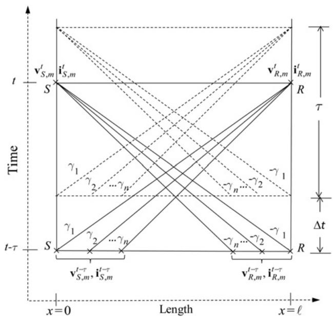  
Fig. 1 Modal voltages in the characteristics curves diagram without discretisation mesh of the line

characteristic lines given by (11b) yields (see Fig. 1)

$$
\boldsymbol {v} _ {R, m} ^ {t} - \boldsymbol {v} _ {S, m} ^ {t - \tau} + \boldsymbol {Z} _ {K} \boldsymbol {i} _ {R, m} ^ {t} - \boldsymbol {Z} _ {4} \boldsymbol {i} _ {S, m} ^ {t - \tau} + \frac {1}{2} \ell \left(\boldsymbol {\Psi} _ {S, m} ^ {t - \tau} + \boldsymbol {\varphi} _ {R, m} ^ {t}\right) = \mathbf {0} \tag {17a}
$$

$$
\boldsymbol {v} _ {S, m} ^ {t} - \boldsymbol {v} _ {R, m} ^ {t - \tau} - \boldsymbol {Z} _ {K} \boldsymbol {i} _ {S, m} ^ {t} + \boldsymbol {Z} _ {4} \boldsymbol {i} _ {R, m} ^ {t - \tau} - \frac {1}{2} \ell \left(\boldsymbol {\Psi} _ {R, m} ^ {t - \tau} + \boldsymbol {\varphi} _ {S, m} ^ {t}\right) = \mathbf {0} \tag {17b}
$$

where

$$
\boldsymbol {Z} _ {K} = \boldsymbol {Z} _ {3} - \frac {\Delta t}{2} \ell \boldsymbol {T} _ {V} ^ {- 1} \left(\sum_ {i = 1} ^ {N} \frac {p _ {i}}{1 + \Delta t p _ {i}} \boldsymbol {K} _ {i}\right) \boldsymbol {T} _ {I} \tag {18a}
$$

$$
\boldsymbol {Z} _ {3} = \boldsymbol {Z} _ {W} + \frac {1}{2} \ell \boldsymbol {R} _ {m}, \quad \boldsymbol {Z} _ {4} = \boldsymbol {Z} _ {W} - \frac {1}{2} \ell \boldsymbol {R} _ {m} \tag {18b,c}
$$

$$
\boldsymbol {\varphi} _ {S, m} ^ {t} = - \sum_ {i = 1} ^ {N} \left[ \frac {\boldsymbol {\psi} _ {S , i} ^ {t - \Delta t}}{1 + \Delta t p _ {i}} \right], \tag {18d,e}
$$

$$
\pmb {\varphi} _ {R, m} ^ {t} = - \sum_ {i = 1} ^ {N} \left[ \frac {\pmb {\psi} _ {R , i} ^ {t - \Delta t}}{1 + \Delta t p _ {i}} \right]
$$

$$
\begin{array}{l} \boldsymbol {\Psi} _ {S, m} ^ {t - \tau} = - \sum_ {i = 1} ^ {N} \left(\frac {\boldsymbol {\psi} _ {S , i} ^ {t - \tau - \Delta t}}{1 + \Delta t p _ {i}}\right) \\ - \Delta t \boldsymbol {T} _ {V} ^ {- 1} \sum_ {i = 1} ^ {N} \left(\frac {p _ {i} \boldsymbol {K} _ {i}}{1 + \Delta t p _ {i}}\right) \boldsymbol {T} _ {I} \boldsymbol {i} _ {S, m} ^ {t - \tau} \tag {18f} \\ \end{array}
$$

$$
\begin{array}{l} \boldsymbol {\Psi} _ {R, m} ^ {t - \tau} = - \sum_ {i = 1} ^ {N} \left(\frac {\boldsymbol {\psi} _ {R , i} ^ {t - \tau - \Delta t}}{1 + \Delta t p _ {i}}\right) \\ - \Delta t \boldsymbol {T} _ {V} ^ {- 1} \sum_ {i = 1} ^ {N} \left(\frac {p _ {i} \boldsymbol {K} _ {i}}{1 + \Delta t p _ {i}}\right) \boldsymbol {T} _ {I} \boldsymbol {i} _ {R, m} ^ {t - \tau} (18g) \\ \ell = \operatorname {d i a g} \left(\ell_ {1}, \dots , \ell_ {n}\right) (18h) \\ \end{array}
$$

In (18h) $\ell _ { j }$ is the distance travelled by the jth mode at time t. The convolution term $\Psi _ { m }$ has been solved with a recursive convolution procedure based on the differential equation method (see Appendix). Rearranging (17a) and (17b), the subsequent equations are obtained

$$
\boldsymbol {v} _ {R, m} ^ {t} + \boldsymbol {Z} _ {K} \boldsymbol {i} _ {R, m} ^ {t} = \boldsymbol {v} _ {H m} ^ {S} \tag {19a}
$$

$$
\boldsymbol {v} _ {S, m} ^ {t} - \boldsymbol {Z} _ {K} \boldsymbol {i} _ {S, m} ^ {t} = \boldsymbol {v} _ {H m} ^ {R} \tag {19b}
$$

where

$$
\boldsymbol {v} _ {H m} ^ {S} = \boldsymbol {v} _ {S, m} ^ {t - \tau} + \boldsymbol {Z} _ {4} \boldsymbol {i} _ {S, m} ^ {t - \tau} - \frac {\ell}{2} \left(\boldsymbol {\Psi} _ {S, m} ^ {t - \tau} + \boldsymbol {\varphi} _ {R, m} ^ {t}\right) \tag {19c}
$$

$$
\boldsymbol {v} _ {H m} ^ {R} = \boldsymbol {v} _ {R, m} ^ {t - \tau} - \boldsymbol {Z} _ {4} \boldsymbol {i} _ {R, m} ^ {t - \tau} + \frac {\ell}{2} \left(\boldsymbol {\Psi} _ {R, m} ^ {t - \tau} + \boldsymbol {\varphi} _ {S, m} ^ {t}\right) \tag {19d}
$$

Equations (19c) and (19d) represent ‘history terms’. Using the transformation matrices $\pmb { T } _ { V }$ and $\pmb { T } _ { I }$ in (19a) and (19b) and

rearranging it can be written in the phase domain

$$
\boldsymbol {i} _ {R} ^ {t} = \boldsymbol {Y} _ {\text {P h a s e}} ^ {K} \boldsymbol {v} _ {R} ^ {t} + \boldsymbol {i} _ {H} ^ {S} \tag {20a}
$$

$$
\boldsymbol {i} _ {S} ^ {t} = \boldsymbol {Y} _ {\text {P h a s e}} ^ {K} \boldsymbol {v} _ {S} ^ {t} + \boldsymbol {i} _ {H} ^ {R} \tag {20b}
$$

where

$$
\boldsymbol {i} _ {H} ^ {S} = - \boldsymbol {T} _ {t} \boldsymbol {Z} _ {K} ^ {- 1} \boldsymbol {v} _ {H m} ^ {S} \tag {21a}
$$

$$
\boldsymbol {i} _ {H} ^ {R} = - \boldsymbol {T} _ {t} \boldsymbol {Z} _ {K} ^ {- 1} \boldsymbol {v} _ {H m} ^ {R} \tag {21b}
$$

$$
\boldsymbol {Y} _ {\text {P h a s e}} ^ {K} = \boldsymbol {T} _ {t} \boldsymbol {Z} _ {K} ^ {- 1} \boldsymbol {T} _ {v} ^ {- 1} \tag {21c}
$$

Equations (20a) and (20b) represent a dual Norton model for the transmission line, as shown in Fig. 2.

The model depicted in Fig. 2 can be included into any simulation program based on the nodal or the modified nodal method. For example, when using the nodal method, the steps followed are:

1. Calculate transmission line electrical parameters over a given frequency range.   
2. Obtain the rational functions representation of $\pmb { R } ^ { \prime } ( s )$   
3.Obtain constant matrices $\pmb { T } _ { V } , \pmb { T } _ { I }$ and Λ.   
3. Obtain constant matrices 4. Calculate the constant co and Λ.nce matrix $Y _ { \mathrm { P h a s e } } ^ { K }$ given by positions corresponding to the nodes where the transmission line is connected.   
5. Provide initial conditions of the line.

Steps 1–5 are performed only once before the actual simulation process starts. In the time stepping procedure in order to solve for node voltages at the time instant t, the steps are as follows:   
6. The history current sources given by (21a) and (21b) are calculated and included in the current sources vector of the network.   
7. Solve the network system for the node voltages.   
8. Calculate network branch currents and currents injected into the transmission line ends.   
Steps 6–8 are repeated until the observation time is reached.

# 5 Application examples

As an initial validation of the model, comparison with an experimental measurement is provided. Then, different cases of transient events are used to compare the results from the proposed model to those obtained using a frequency-domain method (FDM) [20, 21], the model of Martí available in the ATP/EMTP [1, 18] and the model of Morched, Gustavsen and Tartibi available in the EMTP-RV [3, 22]. Errors in the FDM can be controlled by means of

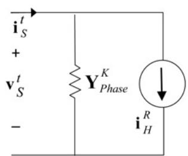

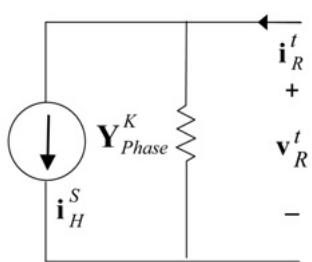  
Fig. 2 Norton model of MTL

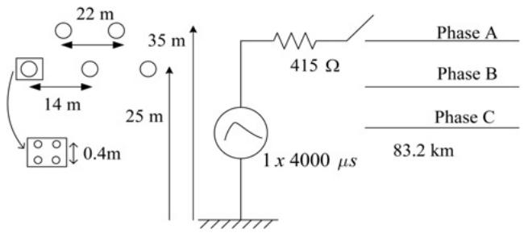  
Fig. 3 Configuration of the line for the field test [23]

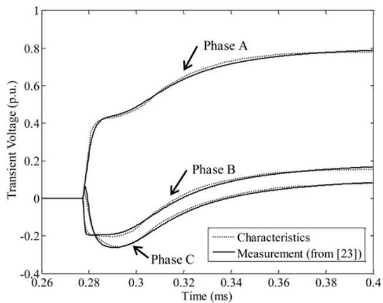  
Fig. 4 Voltages at receiving end

the number of samples and the observation time; therefore it will be considered as the base of comparison for the simulation results.

Although not included in this paper due to space restrictions, an additional set of simulations were performed for a very long observation time (up to 2 s) to assess the stability of the model, considering a sinusoidal excitation. The model showed no instability problems in any of the tests.

# 5.1 Field test

As a first example, a comparison is made with the field measurements published in [23]. The line configuration is shown in Fig. 3. The sending nodes of phases B and C and the receiving nodes for all phases are considered as open circuits. The electrical parameters are calculated using the well-known formulas published in [24]. Simulation data for this example are as follows: N = 1154 (number of samples) and $\Delta t = 0 . 3 4 6 \mu \mathrm { s }$ (discretisation step). Fig. 4 shows the transient voltages at the receiving end of the line, comparing the results from characteristics and from the field measurements. A remarkable agreement between the waveforms can be noticed.

# 5.2 Energisation of MTL

As a second application example, a system with three parallel three-phase lines is considered, as shown in Fig. 5. The length of the lines is 100 km. The radius of the conductors (1 per phase) is 0.02 m, the permeability of the ground and the conductors is $1 . 2 \dot { 5 } 6 6 \times \dot { 1 } 0 ^ { - 6 }$ H/m, the resistivities of ground and conductors are 100 and $2 . 7 1 \times 1 0 ^ { - 8 } \Omega$ m, respectively.

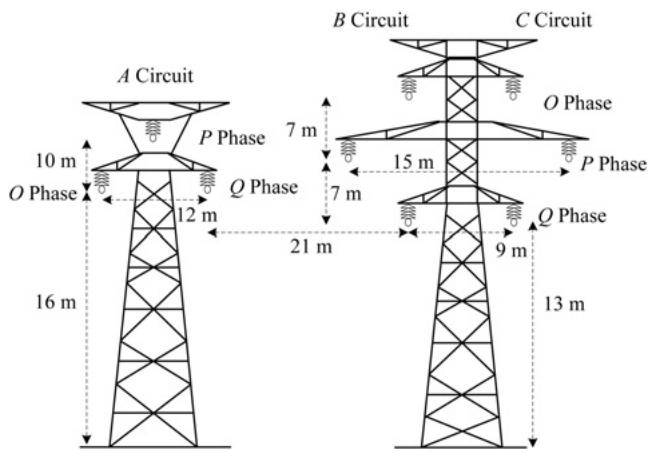  
Fig. 5 Configuration of a MTL with three circuits

Sagging between towers is not considered. Simulation data for this example are N = 1350 and Δt = 22.22 μs.

At the sending node of the A circuit, a three-phase sinusoidal source of 230 kV is connected. The times of

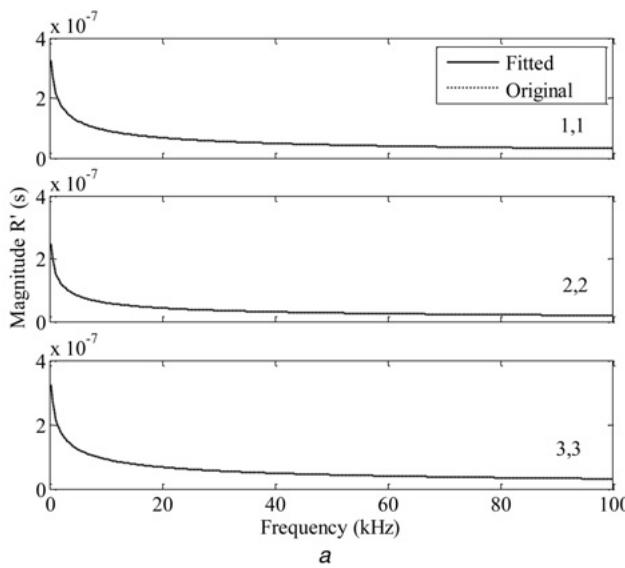

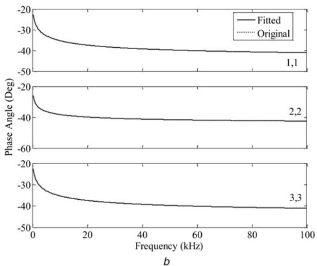  
Fig. 6 Magnitude of the self-elements of the transient resistance matrix

a Magnitude   
b Phase angle

closing are 0.002, 0.006 and 0.012 s for phases O, P and Q, respectively, and the receiving end is considered as open circuit. The B and C circuits are not energised with the sending nodes grounded, while the receiving nodes are considered as open circuits.

Figs. 6a and b depict the magnitudes and phase angles of the self-elements of the transient resistance matrix for the A circuit of Fig. 5, comparing the results obtained directly

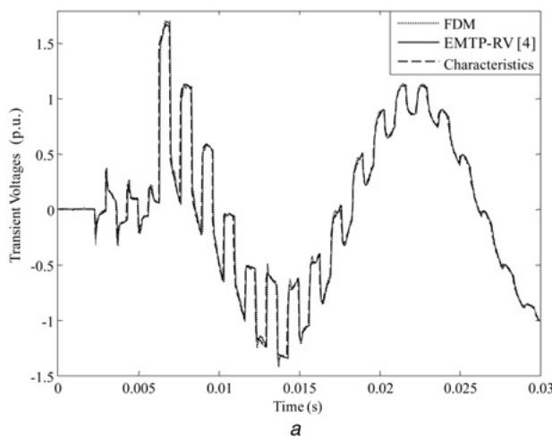

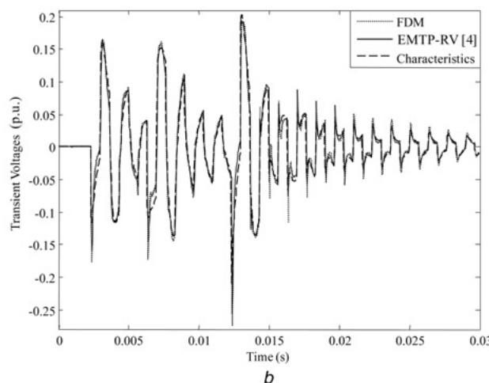

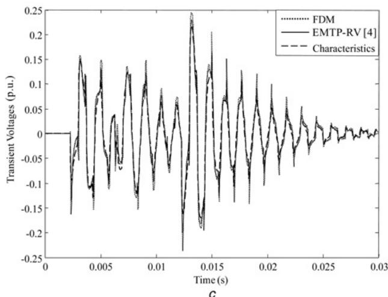  
Fig. 7 Transient voltages in the P phase, receiving node

a A circuit   
b B circuit   
c C circuit

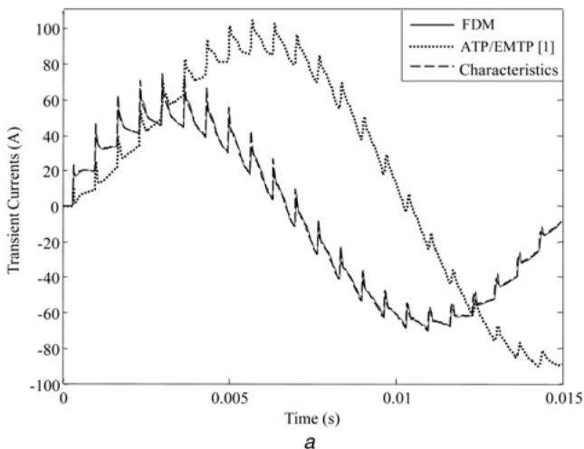

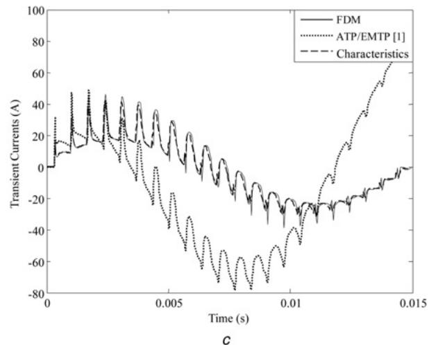

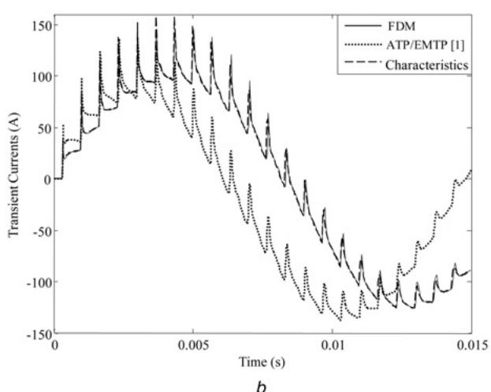

Fig. 8 Transient induced currents, receiving node (connected to ground)   
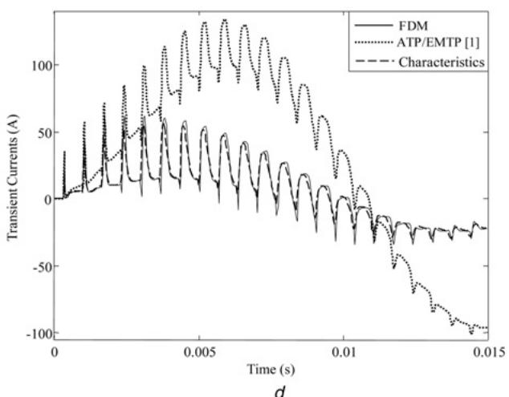  
a O phase – B circuit   
b P phase – B circuit   
c O phase – C circuit   
d P phase – C circuit

from (3b) and the fitted values computed using vector fitting [2]. It can be noticed that the functions are very smooth and that the difference between the original and the fitted functions is imperceptible. The behaviour of the mutual elements is very similar. The R′(s) was fitted with nine poles for all examples. In Fig. 7a the transient voltages in the P phase at the receiving node of the A circuit is shown. The induced per unit voltages in the P phase at the receiving ends of the B and C circuits are shown in Figs. 7b and c, respectively. As it can be seen, both the EMTP-RV model and the characteristics model provide for practical purposes results close to those from the FDM.

Consider now the case where the ends of all circuits are connected to ground through 10 Ω resistances. Figs. 8a–d show the transient induced currents in the O and P phases at the receiving ends of the B and C circuits. In this case the ATP/EMTP model does not provide the correct results. This can be attributed to the fact that this model does not take into account the frequency dependence of the transformation matrix or to the method used to synthesise the poles of the characteristic admittance and the propagation matrix. Numerical experiments show that this behaviour appears in highly asymmetrical cases in the calculation of mutual effects.

# 5.3 Lightning impulse

As a third application example, the same configuration of Fig. 5 is considered, but now with a length of 10 km. At the sending node of the O phase of the A circuit, a typical lightning voltage impulse (1.2/50 µs) is injected. The receiving end is considered as open circuit. Circuits B and C are not energised and sending nodes are grounded while receiving nodes are considered as open circuits. Simulation data for this example are N = 1200 and Δt = 1.33 μs. The transient voltages obtained in the O phase at the receiving node of the A circuit are shown in Fig. 9a. Figs. 9b and c show the transient induced voltages in the O phase at the receiving ends of the B and C circuits.

From Figs. 9a–c, it can be appreciated that the three models provide similar results, although the magnitudes are overestimated by the ATP/EMTP model.

# 5.4 Inclusion of a non-linear element

As a final example, the same configuration, excitation and simulation data of Example 5.3 are considered. The objective of this example is to demonstrate the ability of the proposed line model to manage the inclusion of a

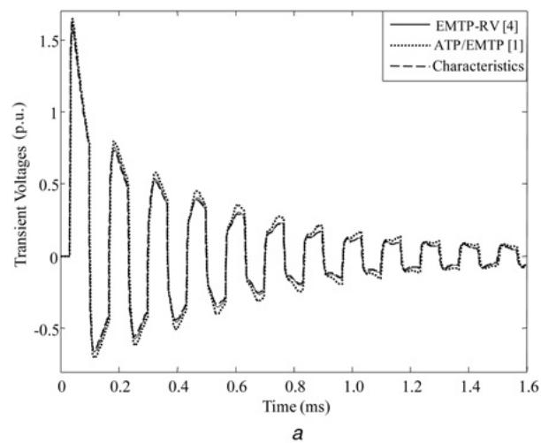

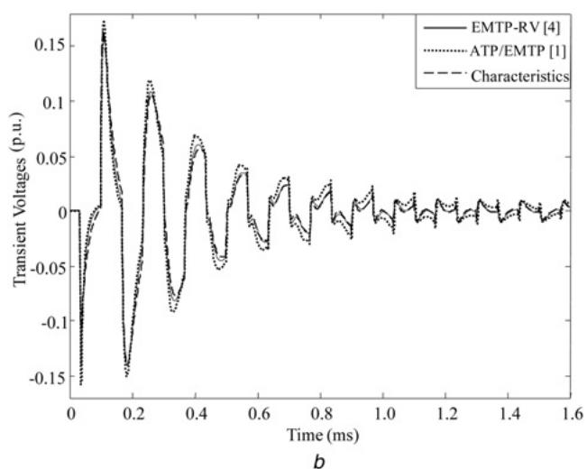

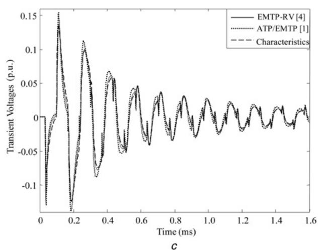  
Fig. 9 Transient voltages in the O phase, receiving node

a A circuit   
b B circuit   
c C circuit

non-linear element. A simple surge arrester is connected at the receiving node of the O phase of the A circuit. This arrester is basically a non-linear resistance modelled by means of a piece-wise linear approximation (four slopes) of its v–i characteristic, as shown in Table 1. Transient voltages at the node where the arrester is connected are shown in Fig. 10. For comparison purposes, results from the ATP/EMTP using the model of Martí [1] are also provided. The arrester

Table 1 Surge arrester’s data for Example 5.4   

<table><tr><td>Voltage range, pu</td><td>Resistance, Ω</td></tr><tr><td>0.0–1.0</td><td>10 000</td></tr><tr><td>1.0–1.2</td><td>325</td></tr><tr><td>1.2–1.3</td><td>75</td></tr><tr><td>1.3 and above</td><td>35</td></tr></table>

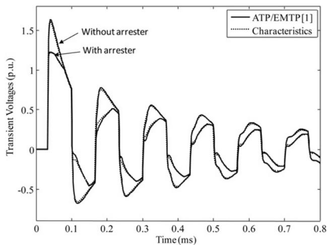  
Fig. 10 Transient voltages at the receiving node of the O phase of the A circuit, with and without arrester

model in ATP/EMTP used the same piece-wise linear approximation of Table 1. As shown in Fig. 10, results from the model proposed here are very close to those from ATP/EMTP.

# 6 Conclusions

In this work, a model for overhead MTLs with frequency-dependent electrical parameters for time-domain transient analysis has been presented.

The proposed model requires the approximation of one parameter (the transient resistance) to include the frequency dependence of the electrical parameters. In contrast, both the Martí model implemented in the ATP/EMTP and the model of Morched et al., implemented in the EMTP-RV, require the approximation of two parameters. Moreover, the model does not require the extraction of time delays. Another important contribution is that the model does not need the discretisation mesh of the line and it does not present problems with asymmetric line configurations.

Due to the fact that the frequency-dependent electrical parameters are included by means of the synthesis of the transient resistance, which is a smooth function, the technique does not present problems with the rational functions fitting and requires only real poles. Results obtained with the developed model have been compared with those from the ATP/EMTP, the EMTP-RV, a FDM program and field measurements.

# 7 References

1 Martí, J.: ‘Accurate modelling of frequency-dependent transmission lines in electromagnetic transient simulations’, IEEE Trans. Power Appar. Syst., 1982, 101, (1), pp. 147–157

2 Gustavsen, B., Semlyen, A.: ‘Combined phase domain and modal domain calculation of transmission line transients based on vector fitting’, IEEE Trans. Power Deliv., 1998, 13, (2), pp. 596–604   
3 Morched, A., Gustavsen, B., Tartibi, M.: ‘A universal model for accurate calculation of electromagnetic transients on overhead lines and underground cables’, IEEE Trans. Power Deliv., 1999, 14, (3), pp. 1032–1038   
4 Gustavsen, B.: ‘Passivity enforcement for transmission line models based on the method of characteristics’, IEEE Trans. Power Deliv., 2008, 23, (4), pp. 2286–2293   
5 Deschrijver, D., Gustavsen, B., Dhaene, T.: ‘Causality preserving passivity enforcement for traveling-wave-type transmission-line models’, IEEE Trans. Power Deliv., 2009, 24, (4), pp. 2461–2462   
6 Kocar, I., Mahseredjian, J., Olivier, G.: ‘Improvement of numerical stability for the computation of transients in lines and cables’, IEEE Trans. Power Deliv., 2010, 25, (2), pp. 1104–1111   
7 Semlyen, A., Gustavsen, B.: ‘Phase-domain transmission-line modeling with enforcement of symmetry via the propagated characteristic admittance matrix’, IEEE Trans. Power Deliv., 2012, 27, (2), pp. 626–631   
8 Ramos-Leaños, O., Naredo, J.L., Mahseredjian, J., Dufour, C., Gutierrez-Robles, J.A., Kocar, I.: ‘A wideband line/cable model for real-time simulations of power system transients’, IEEE Trans. Power Deliv., 2012, 27, (4), pp. 2211–2218   
9 Garcia, N., Acha, E.: ‘Transmission line model with frequency dependency and propagation effects: a model order reduction and state-space approach’. Proc. IEEE/PES General Meeting, Pittsburgh, USA, July 2008, pp. 1–7   
10 Costa, E.C.M., Kurokawa, S., Pissolato, J., Prado, A.J.: ‘Efficient procedure to evaluate electromagnetic transients on three-phase transmission lines’, IET Gener. Transm. Distrib., 2010, 4, (9), pp. 1069–1081   
11 Costa, E.C.M., Kurokawa, S., Shinoda, A.A., Pissolato, J.: ‘Digital filtering of oscillations intrinsic to transmission line modeling based on lumped parameters’, Int. J. Electr. Power Energy Syst., 2013, 44, (1), pp. 908–915   
12 Naredo, J.L.: ‘The effect of corona on wave propagation on transmission lines’. PhD thesis, The University of British Columbia, Vancouver, Canada, 1992   
13 Ramirez, A., Naredo, J.L., Moreno, P., Guardado, L.: ‘Electromagnetic transients in overhead lines considering frequency dependence and corona effect via the method of characteristics’, Int. J. Electr. Power Energy Syst., 2001, 23, (3), pp. 179–188   
14 Ramírez, A., Naredo, J.L., Moreno, P.: ‘Full frequency-dependent line model for electromagnetic transient simulation including lumped and distributed sources’, IEEE Trans. Power Deliv., 2005, 20, (1), pp. 292–299   
15 Moreno, P., Chavez, A.R., Naredo, J.L.: ‘A simplified model for nonuniform multiconductor transmission lines using the method of characteristics’. Proc. IEEE/PES General Meeting, Pittsburgh, USA, July 2008, pp. 1–5   
16 Moreno, P., Ambrosio, A., Gómez, P.: ‘The characteristics approach for modeling single phase transmission lines with frequency dependent electrical parameters’. IEEE/PES T&D Conf. and Exposition Latin America, Bogotá, Colombia, August 2008, pp. 1–4   
17 Escamilla, J.C., Moreno, P., Cruz, E.: ‘A new approach for modeling multiconductor transmission lines with constant electrical parameters’. Proc. North American Power Symposium (NAPS), Arlington, USA, September 2010, pp. 1–4   
18 Dommel, H.W.: ‘Electromagnetic transients program reference manual (EMTP theory book)’ (University of British Columbia, Department of Electrical Engineering, Vancouver, Canada, 1989)   
19 Radulet, R., Timotin, A., Tugulea, A., Nica, A.: ‘The transient response of the electric lines based on the equations with transient line-parameters’, Rev. Roum. Sci. Techn., 1978, 23, (1), pp. 3–19   
20 Moreno, P., Ramírez, A.: ‘Implementation of the numerical Laplace transform: a review’, IEEE Trans. Power Deliv., 2008, 23, (4), pp. 2599–2609   
21 Gómez, P., Uribe, F.A.: ‘The numerical Laplace transform: an accurate tool for analyzing electromagnetic transients on power system devices’, Int. J. Electr. Power Energy Syst., 2009, 31, (2–3), pp. 116–123

22 Mahseredjian, J., Dennetière, S., Dubé, L., Khodabakhchian, B., Gérin-Lajoie, L.: ‘On a new approach for the simulation of transients in power systems’, Electr. Power Syst. Res., 2007, 77, (11), pp. 1514–1520   
23 Nagaoka, N., Amentani, A.: ‘A development of a generalized frequency-domain transient program – FTP’, IEEE Trans. Power Deliv., 1988, 3, (4), pp. 1996–2004   
24 Martinez-Velasco, J.A.: ‘Power system transients-parameter determination’ (CRC Press, Boca Raton, FL, 2010)   
25 Semlyen, A., Dabuleanu, A.: ‘Fast and accurate switching transient calculations on transmission lines with ground return using recursive convolutions’, IEEE Trans. Power Appar. Syst., 1975, 94, (2), pp. 561–571

# 8 Appendix

# Recursive convolution

The convolution term given by (9f) can be expressed in the frequency domain as follows [25]

$$
\boldsymbol {\Psi} _ {m} (x, s) = - \boldsymbol {T} _ {V} ^ {- 1} \left(\sum_ {i = 1} ^ {N} \frac {p _ {i}}{s + p _ {i}} \boldsymbol {K} _ {i}\right) \boldsymbol {T} _ {I} \boldsymbol {I} _ {m} (x, s) \tag {22}
$$

From (22)

$$
\boldsymbol {\Psi} _ {m} (x, s) = - \sum_ {i = 1} ^ {N} \boldsymbol {\psi} _ {i} (x, s) \tag {23}
$$

where

$$
\boldsymbol {\psi} _ {i} (x, s) = \frac {p _ {i}}{s + p _ {i}} \boldsymbol {T} _ {V} ^ {- 1} \boldsymbol {K} _ {i} \boldsymbol {T} _ {I} \boldsymbol {I} _ {m} (x, s) \tag {24}
$$

From (24)

$$
(s + p _ {i}) \boldsymbol {\psi} _ {i} (x, s) = p _ {i} \boldsymbol {T} _ {V} ^ {- 1} \boldsymbol {K} _ {i} \boldsymbol {T} _ {I} \boldsymbol {I} _ {m} (x, s) \tag {25}
$$

Transforming (25) to time domain

$$
\frac {\mathrm {d}}{\mathrm {d} t} \boldsymbol {\psi} _ {i} (x, t) + p _ {i} \boldsymbol {\psi} _ {i} (x, t) = p _ {i} \boldsymbol {T} _ {V} ^ {- 1} \boldsymbol {K} _ {i} \boldsymbol {T} _ {I} \boldsymbol {i} _ {m} (x, t) \tag {26}
$$

Using Euler method

$$
\boldsymbol {\psi} _ {i} (x, t) = \frac {\boldsymbol {\psi} _ {i} ^ {t - \Delta t} (x)}{1 + \Delta t p _ {i}} + \frac {\Delta t p _ {i} \boldsymbol {T} _ {V} ^ {- 1} \boldsymbol {K} _ {i} \boldsymbol {T} _ {I} \boldsymbol {i} _ {m} (x , t)}{1 + \Delta t p _ {i}} \tag {27}
$$

Therefore

$$
\begin{array}{l} \Psi_ {m} (x, t) = - \sum_ {i = 1} ^ {N} \frac {\psi_ {i} ^ {t - \Delta t} (x)}{1 + \Delta t p _ {i}} \\ - \Delta t \boldsymbol {T} _ {V} ^ {- 1} \left(\sum_ {i = 1} ^ {N} \frac {p _ {i} \boldsymbol {K} _ {i}}{1 + \Delta t p _ {i}}\right) \boldsymbol {T} _ {I} \boldsymbol {i} _ {m} (x, t) \tag {28} \\ \end{array}
$$