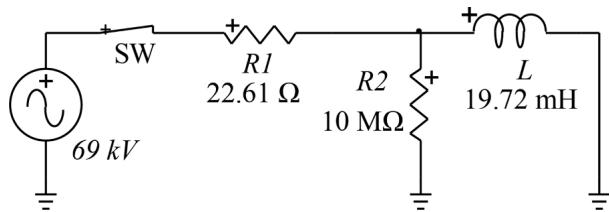
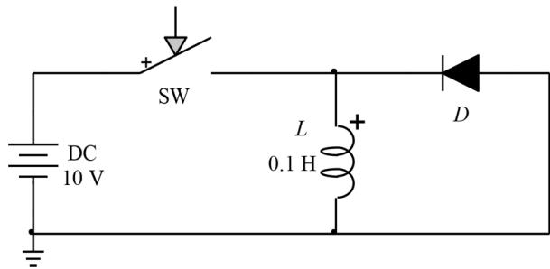
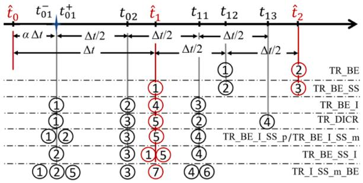
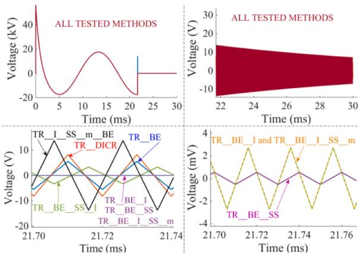
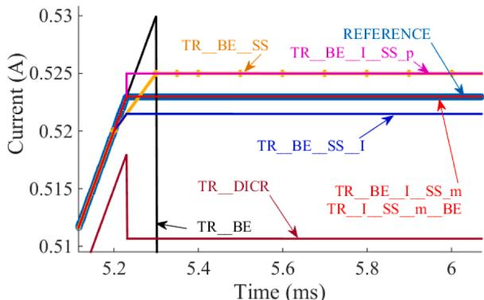
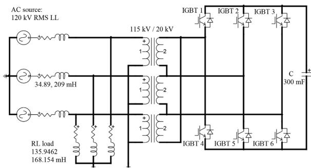
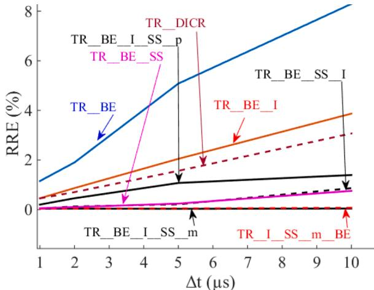
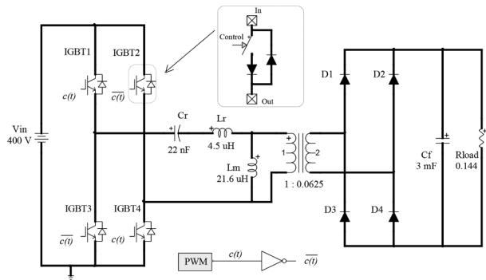
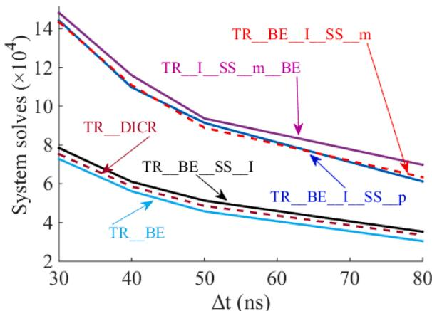

# Accurate time-domain simulation of power electronic circuits✰

Willy Nzale a,* , Jean Mahseredjian a , Xiaopeng Fu b , Ilhan Kocar a , Christian Dufour

a Polytechnique Montr´eal, Montr´eal, QC H3T 1J4, Canada   
b Key Laboratory of Smart Grid of Ministry of Education, Tianjin, China   
c Opal-RT Technologies, Montr´eal, QC H3K 1G6, Canada

# A R T I C L E I N F O

Keywords:

Accuracy

Discontinuity

Power electronic circuits

Simulation method

Time-domain simulation

# A B S T R A C T

Modern power electronic circuits contain numerous switches driven by high frequency controllers and can cause discontinuities in time-domain simulation methods. This paper presents numerical problems resulting from discontinuities when simulating power electronic circuits. Limitations in existing methods are analyzed. Three new methods are proposed to improve accuracy and computational performance.

# 1. Introduction

The trapezoidal integration method is commonly used in timedomain simulation of electromagnetic transients and power electronic circuits [1,2]. It is a one-step implicit A-stable method with second order accuracy [3,4] that can perform efficiently and accurately for a wide range of transient frequencies [4].

Trapezoidal (TR) integration causes numerical oscillations at dis continuities. Discontinuities occur due to switching in power electronics circuits or due to nonlinear functions. Several techniques are proposed in the literature to eliminate such oscillations. One of them consists in using the L-stable Backward Euler (BE) method to reinitialize TR integration [5]. Another approach consists of switching from trapezoidal (TR) integration to BE method for two half time-steps after the discontinuity occurrence [4,6]. This method is implemented in [7]. Numerical oscillations can be also eliminated using the chatter removal technique [8]. It consists in performing a half time-step interpolation after crossing a discontinuity. However, as demonstrated in this paper, the existing methods are not perfect.

Discontinuities create errors and simulation methods must adapt to guarantee accuracy. In fixed time-step simulations, discontinuities may occur between two discrete time points. Interpolation techniques [9,10] are applied to fall back to discontinuity instant and to resynchronize with simulation time-mesh. Inaccurate tracking of discontinuities may result in additional errors and even in non-characteristic harmonics for some power-electronic circuits [11,12]. Interpolation is also used to

attempt accurate tracking of multiple commutations occurring in-between consecutive time points [13].

As demonstrated in [14], a reliable time-domain simulation algorithm must incorporate a mechanism to accurately track discontinuities and a mechanism to account for instantaneous commutations. This is challenging because additional errors may be created, as demonstrated in this paper.

It is noteworthy to mention that some numerical integration algorithms [3,15-17] are oscillation-free. The focus of this paper is on the widely (major simulation tools) used trapezoidal integration method.

This paper summarizes numerical issues resulting from discontinuities in the computation of electromagnetic transients with power electronic circuits and proposes alternative solution methods. This paper is organized as follows. Section 2 describes the numerical problems. Section 3 presents existing methods and limitations. Section 4 contributes new methods. Finally, in Section 5, numerical results and practical simulation cases are presented.

# 2. Main issues with discontinuities in time-domain simulation

# 2.1. Generalities

In time-domain simulation, network components are described by differential equations in the form:

$$
\dot {x} = f (x, t) \tag {1}
$$

It is common to solve such equations using, for example, TR and BE integration (discretization) methods with fixed time-stepΔt. The methods are recalled here:

$$
x _ {t + \Delta t} = x _ {t} + \frac {\Delta t}{2} \left[ f _ {t + \Delta t} + f _ {t} \right] \tag {2}
$$

$$
x _ {t + \Delta t} = x _ {t} + \Delta t f _ {t + \Delta t} \tag {3}
$$

Discretization methods allow creating companion models [18] and to formulate network equations using, for example, modified-augmented-nodal-analysis [7]:

$$
\mathbf {A} _ {t} \mathbf {x} _ {t} = \mathbf {b} _ {t} \tag {4}
$$

where ${ \bf A } _ { t }$ is the simulated network Jacobian matrix,x is the vector of unknowns and $\mathbf { b } _ { t }$ is the vector of known quantities (includes history terms, known sources…). Eq. (4) is solved at each time-point t. Solution accuracy can be verified using the local-errore(t )of a given variable x at a given timepoint $t _ { k } .$ It is found by calculating the difference between the numerical value $x _ { k }$ and its exact solution $x ( t _ { k } )$ retrieved through a reference simulation or analytically:

$$
e \left(t _ {k}\right) = x _ {k} - x \left(t _ {k}\right) \tag {5}
$$

For a simulation between time-points $t _ { s t a r t }$ and $t _ { e n d } ,$ the error can be evaluated at every instant tk $\in [ t _ { s t a r t } , t _ { e n d } ] .$ . We quantify the overall error by the relative rms error (RRE) [3]:

$$
e _ {r m s} = \frac {1}{x _ {r m s}} \sqrt {\frac {1}{n _ {s}} \sum_ {k = 1} ^ {n _ {s}} e \left(t _ {k}\right) ^ {2}} \tag {6}
$$

where $\ell _ { r m s }$ is the rms value of the exact solution waveform and $n _ { s }$ is the number of simulation points.

The next section presents numerical problems encountered in timedomain simulation due to the occurrence of discontinuities in switching circuits.

# 2.2. Numerical oscillations

In [6], numerical oscillations resulting from TR integration are avoided by applying two halved time-step BE integrations after discontinuity detection. For an inductance $L ,$ discretization with TR and BE methods gives

$$
i _ {t + \Delta t} = \frac {\Delta t}{2 L} v _ {t + \Delta t} + \frac {\Delta t}{2 L} v _ {t} + i _ {t} \tag {7}
$$

$$
i _ {t + \Delta t} = \frac {\Delta t}{2 L} v _ {t + \Delta t} + i _ {t} \tag {8}
$$

This technique assumes that the current in L after the discontinuity instant becomes exactly zero. This may not be true in some cases and small amplitude numerical oscillations may be observed.

In the circuit of Fig. 1, the switch SW is opened at time-point $t _ { d } .$ The inductance is deenergized, but a current path remains because of the resistance in parallel. This causes numerical oscillation in the voltage across L.

At $t _ { d } ,$ the simulation technique switches from TR to BE. The BE procedure for the two following time-points gives:

  
Fig. 1. Simple RL circuit.

$$
i _ {t _ {d} + \Delta t / 2} = \frac {\Delta t}{2 L} v _ {t _ {d} + \Delta t / 2} + i _ {t _ {d}} = - \frac {v _ {t _ {d} + \Delta t / 2}}{R} \tag {9}
$$

$$
i _ {t _ {d} + \Delta t} = \frac {\Delta t}{2 L} v _ {t _ {d} + \Delta t} - \frac {v _ {t _ {d} + \Delta t / 2}}{R} = - \frac {v _ {t _ {d} + \Delta t}}{R} \tag {10}
$$

$$
v _ {t _ {d} + \Delta t} = - \frac {v _ {t _ {d} + \Delta t / 2}}{R} / \left[ - \frac {\Delta t}{2 L} - \frac {1}{R} \right] \tag {11}
$$

It is noticed that $i _ { t _ { d } }$ cannot be zero in this case. When the simulation is pursued with TR from the reached time-point t:

$$
i _ {t} = \frac {\Delta t}{2 L} v _ {t} + \frac {\Delta t}{2 L} v _ {t - \Delta t} + i _ {t - \Delta t} = - \frac {v _ {t}}{R} \tag {12}
$$

$$
i _ {t} = \frac {\Delta t}{2 L} v _ {t} + \frac {\Delta t}{2 L} v _ {t - \Delta t} - \frac {v _ {t - \Delta t}}{R} = - \frac {v _ {t}}{R} \tag {13}
$$

$$
v _ {t} = v _ {t - \Delta t} \left[ - \frac {1}{R} + \frac {\Delta t}{2 L} \right] / \left[ - \frac {\Delta t}{2 L} - \frac {1}{R} \right] \tag {14}
$$

It is apparent that when − $1 / R + \ \Delta t / ( 2 L ) > 0 ;$ , the inductance voltage shows numerical oscillations with a damping factor (less than one). This is typically the case for large resistance values. In such case, the actual first order transient can be captured by loweringΔt.When − $1 / R + \Delta t / ( 2 L ) = 0 ,$ , there will be no numerical oscillations and when − $1 / R + \Delta t / ( 2 L ) < 0 ,$ it is expected that the voltage will decay due to the RL-branch time-constant and there will be no numerical oscillations. The same conclusions can be drawn from a circuit with a capacitor in series with a resistance. A discontinuity can cause numerical oscillations in the capacitor current.

It is seen from (14) that to minimize the amplitude of oscillations $\nu _ { t - \Delta }$ tshould be minimized. That requires to minimize $\nu _ { t _ { d } + \Delta t / 2 } \mathrm { i n }$ (9). From (9):

$$
v _ {t _ {d} + \Delta t / 2} = - i _ {t _ {d}} / \left[ \frac {\Delta t}{2 L} + \frac {1}{R} \right] \tag {15}
$$

$i _ { t _ { d } }$ is the current in L before BE is applied. Minimizing $i _ { t _ { d } }$ will minimize the amplitude of oscillations. This can be achieved by applying linear interpolation to detect the instant of zero crossing current for the switch, or using simultaneous switching at $t _ { d }$ which gives a zero switch current.

# 2.3. Event localization

In fixed time-step computations, when an event such as a discontinuity occurs between two consecutive time-points, interpolation can be applied to calculate unknown variables at the discontinuity instant [9]. Interpolation can be linear or quadratic. In the case of linear interpolation:

$$
x _ {z} = (1 - \alpha) x _ {n} + \alpha x _ {n + 1} \tag {16}
$$

$$
\alpha = \left(t _ {z} - t _ {n}\right) / \left(t _ {n + 1} - t _ {n}\right) \tag {17}
$$

where $\scriptstyle ( _ { n } , x _ { n + }$ 1andxzare respectively the values of a variable x at timepoints $t _ { n } , \ t _ { n + 1 } = t _ { n } +$ Δt and at the discontinuity instant $t _ { z } \in [ t _ { n } , t _ { n + 1 } ]$ . Quadratic interpolation requires the soluti $\mathrm { o n } x _ { n - 1 } \mathrm { a t } t _ { n - 1 } \mathrm { o r }$ the solution $x _ { \gamma }$ at an intermediate point $t _ { \gamma }$ between $t _ { n }$ and $t _ { n + 1 }$ if the numerical method is of multi-step type, such as 2S-DIRK [19] or TR-BDF2 $[ 1 6 , 1 7 ]$ . Quadratic interpolation is presented in [20].

# 2.4. Re-initialization after a discontinuity

When a hard switching (ideal switch model) occurs $\mathsf { a t } t _ { d } ,$ there are two network solutions at $t _ { d } .$ The first solution, referred to as the solution at $t _ { d } ^ { - } .$ , is the solution before switching and the second solution, referred to as the solution at $t _ { d } ^ { + }$ is the solution right after switching (normally obtained by re-initialization). In this case, the history terms in (7) or in

(8) should be values at $t _ { d } ^ { + }$ . Without re-initialization attd, the solution obtained att + Δtwill not be correct. This creates additional errors that propagate in subsequent steps. The problem of re-initialization is critical with TR integration because history terms are both related to current and voltage. With BE integration, the history term for an inductance or a capacitance is related to the state variable. Since state variables cannot jump, when BE integration is applied, re-initialization is not required for state variables. Therefore, switching from TR to BE is an efficient way to simultaneously deal with numerical oscillations and re-initialization. This technique was firstly introduced in [5] where a single Δt /2-BE integration is applied to reinitialize the solution $\mathsf { a t } t _ { d } ^ { + }$ . Accuracy of this technique is however compromised for higher values of Δt. An alternative is proposed in [6] and referred to as critical damping adjustment.

# 2.5. Instantaneous commutations

In time-domain simulation, when a discontinuity occurs at a timepointtd, the network solution at $t _ { d } ^ { + }$ may require instantaneous commutation.

In the circuit of Fig. 2 (taken from [14]), the controlled switch SW is initially closed and the ideal diode D is off. The DC voltage is applied across inductance L and the current ramps through L. When SW is opened at time-pointt , D must turn on at the same moment. If D is turned on one step later, the current in L will be zero and will keep this value in all subsequent steps. This incorrect result shows the importance of handling instantaneous commutations in simulation algorithms. That is done by applying a technique named simultaneous switching (SS) [7] which consists (after every switch state change) of checking all switches for new state changes and solving the circuit again at the same time-point until no switch change is detected before moving forward in time. It is noteworthy to mention that when nonlinear models (nonlinear resistors) are used to represent semiconductor switches, the switch states can be determined by solving the nonlinear circuit equations [18].

A reliable simulation method should be able to address all disconti nuity related issues. The following section presents existing methods and limitations.

# 3. Existing methods

# 3.1. Methods with interpolation or SS

Most electromagnetic transient (EMT) type methods use TR integration with fixed Δt and various techniques to handle discontinuities. In the timeline of Fig. 3, the hatted variables are on the time-mesh and a discontinuity occurs at $t _ { 0 1 }$ . It is assumed for all presented methods that:

1 TR integration is applied to move from $\widehat { t } _ { 0 }$ to $\widehat { t } _ { 1 }$ ;   
2 the discontinuity is detected at $\widehat { t } _ { 1 } ;$ ;   
3 the simulation continues with TR integration after discontinuity correction.

The solution by switching from TR to BE $[ 6 , 7 ]$ for two halved

  
Fig. 2. Simple test circuit for instantaneous commutation.

  
Fig. 3. Simulation timeline for different solution methods.

time-steps after $\widehat { t } _ { 1 }$ is named TR_BE.

TR_BE can be modified by applying simultaneous switching (SS) at $\widehat { t } _ { 1 } .$ . This method is referred to as TR_BE_SS [7]. TR_BE can also be modified by applying interpolation to bring the simulation back tot01before switching to BE for 2 halved time-steps and finally resynchronizing with the time-mesh at $\widehat { t } _ { 1 }$ . This method is not available in the literature and is referred to as TR_BE_I.

In [8,9] the procedure from $\widehat { t } _ { 1 }$ applied with (4) is as follows:

1 node voltages and currents are linearly interpolated tot01;   
2 matrix $\mathbf { A } _ { t } \mathbf { i n }$ (4) is modified (switch position change) then TR integration is applied to move from $t _ { 0 1 }$ to $t _ { 1 1 } ;$   
3 half time-step linear interpolation is applied to eliminate numerical oscillations and obtain the solution at $t _ { 0 2 } ;$   
4 TR integration is applied to move from $t _ { 0 2 }$ to $t _ { 1 3 } ;$   
5 node voltages and currents are linearly interpolated to resynchronize with the time-mesh at $\widehat { t } _ { 1 }$ .

The above method uses the chatter removal technique [8] and is referred to as TR_DICR.

None of the methods presented above account for both event localization (through interpolation) and instantaneous commutations (through simultaneous switching). This is a serious drawback that compromises their ability to accurately simulate power electronic circuits.

# 3.2. Method with interpolation and SS (TR_BE_I_SS_p)

In [14], it is proposed to combine interpolation and SS. According to Fig. 3 and using (4) in this paper, when the discontinuity is detected at̂t1:

1 node voltages and currents are linearly interpolated to $t _ { 0 1 } |$ (this is the solution at $t _ { 0 1 } ^ { - } ) ;$ ;   
2 matrixA s modified (switch position change) and SS is executed at $t _ { 0 1 }$ , using btat $\widehat { t } _ { 1 }$ . The result is the solution at $t _ { 0 1 } ^ { + }$ ;   
3 one step Δt integration is applied to move fromt to $t _ { 1 1 }$ with $\mathbf { b } _ { t }$ built from the solution at $t _ { 0 1 } ^ { + } ;$ ;   
4 nodes voltages and currents are linearly interpolated to resynchronize with the time-mesh at $\widehat { t } _ { 1 }$ .

In the programming of the method TR_BE_I_SS_p, step 3 is replaced by two $\Delta t / 2 \cdot$ -BE integrations (to avoid numerical oscillations due to TR). This is the only difference with the method proposed in [14]. As stated in [14], this method has the advantage of correctly representing switching losses for converters. This is because it applies interpolation and SS. However, there is an issue in this method. When SS is executed in step 2, it allows to detect all instantaneous commutations, but the numerical solution at this point is mathematically incorrect since $\mathbf { b } _ { \widehat { t } _ { 1 } }$ is for a full Δt solution and does not correspond to $\mathbf { b } _ { t _ { 0 1 } }$ . Therefore, the solution obtained at $t _ { 0 1 } ^ { + }$ is incorrect and creates additional error that will propagate to subsequent steps. Combining interpolation and SS is a challenging

task that is addressed in the next part.

# 4. New methods

New solution methods are contributed in this section. They seek the best way to combine interpolation and SS to give more accurate simulation results.

# 4.1. TR_BE_SS_I method

This method applies SS before interpolation. In the timeline of Fig. $^ { 3 , }$ the discontinuity is detected at $\widehat { t } _ { 1 }$ and then :

1 matrixAtis modified (switch position change) and SS is executed at ̂t1using $\mathbf { b } _ { _ { t _ { 1 } } }$ ;   
2 node voltages and currents are linearly interpolated $\mathrm { t o } t _ { 0 1 }$   
3 twoΔt/2-BE integrations are applied to move from $t _ { 0 1 }$ to t11;   
4 node voltages and currents are linearly interpolated to resynchronize with the time-mesh at $\widehat { t } _ { 1 }$ .

# 4.2. TR_BE_I_SS_m method

This method is a variant of TR $\mathbf { B E \bot S S _ { - } P } .$ . It applies SS at $t _ { 0 1 }$ only to find the correct states for all switches. Then, btfor the next step (step 3) is built from the solution at $t _ { 0 1 } ^ { - }$ (instead of $t _ { 0 1 } ^ { + } )$ ). This variant method aims to reduce the additional error created by the use of the incorrect solution $t _ { 0 1 } ^ { + }$ in step 3 of TR_BE_I_SS_p.

# 4.3. TR_I_SS_m_BE method

For a better reduction of computation errors created in TR_BE_I_SS_p, the solution at $t _ { 0 1 } ^ { + }$ must be calculated in a more accurate way. Also, the use of BE to advance in time must be avoided, due to its only first order accuracy level [4]. With the method TR_I_SS_m_BE, TR is always applied to advance in time. BE is only applied for reinitialization $\mathtt { a t } t _ { 0 1 } ^ { + }$ . The following steps are executed from $\widehat { t } _ { 1 } \colon$ :

1 nodes voltages and currents are linearly interpolated $\mathrm { \ t o } t _ { 0 1 }$ (this is the solution at $t _ { 0 1 } ^ { - } ) ;$   
2 matrixA is modified (switch position change) and SS is executed at $t _ { 0 1 }$ using $\mathbf { b } _ { \mathbf { \Gamma } _ { t _ { 1 } } }$ ;   
3 twoΔt/2-BE integrations are applied to move from t01to t11. bt for the first BE integration is built from $t _ { 0 1 } ^ { - } ;$   
4 node voltages and currents are linearly extrapolated back to $t _ { 0 1 }$ using the solutions $\mathbf { a t } t _ { 0 2 }$ and $t _ { 1 1 }$ (this is the network solution at $t _ { 0 1 } ^ { + } ) ;$   
5 TR integration is applied to move from $t _ { 0 1 } \mathrm { t o } t _ { 1 1 }$ with $\mathbf { b } _ { t }$ built from the solution at $t _ { 0 1 } ^ { + } ;$   
6 node voltages and currents are linearly interpolated to resynchronize with the time-mesh at $\widehat { t } _ { 1 }$ .

The above methods will be tested next.

# 5. Numerical results and simulation cases

# 5.1. Sustained numerical oscillations

The case of Fig. 1 is used to show persisting numerical oscillation problems. The numerical integration time-step is $\Delta t = 1 0 \mu s$ . The switch (initially closed) is opened att = 15ms.

The voltage across inductance L for tested methods is presented in Fig. 4. When SW is opened, the voltage appears as becoming zero without oscillations (up-left figure), but when the graph is zoomed on, it shows damped numerical oscillations (up-right figure). This confirms the theoretical analysis presented in Section 2.2.

  
Fig. 4. Numerical oscillations in the voltage across inductance L.

The down left and right (the scale is using mV) hand-side figures reveal different oscillation magnitudes for shown methods. In the left, it is observed that TR_BE, TR_DICR, TR_BE_SS_I and TR_I_SS_m_BE give oscillations of similar magnitudes. The graph on the right hand-side allows us to notice that when interpolation for event localization is applied before switching to BE (TR_BE_I and TR_BE_I_SS_m), the amplitude of oscillations is significantly reduced (3000 times smaller). Best results are achieved with TR_BE_SS. This confirms the analysis in Section 2.2 for the smallest inductance current at switching instant.

TR_I_SS_m_BE, TR_DICR and TR_BE_I all use interpolation for event localization, but TR_BE_I gives much smaller oscillations in amplitude than TR_DICR. Switching to BE integration appears to be a better approach than using the chatter removal technique to eliminate numerical oscillations. TR_I_SS_m_BE, which is a variant of the method initially presented in [5], is intended to eliminate numerical oscillations by re-initializing network variables at discontinuity instants. This approach is the least efficient for this circuit case as it gives the highest oscillations in amplitude.

For a givenΔt, numerical oscillations are avoided only if the current in L is exactly zero when the switch opens. This condition cannot be satisfied for this circuit because of the resistance in parallel.

# 5.2. Accuracy of methods with interpolation and SS

This case shows how accuracy is affected with some methods discussed in this paper. The circuit of Fig. 2 is simulated withΔt = 100 μs for studying accuracy with the methods presented in Section 4. The reference for comparisons is TR_BE_SS withΔt = 1 μs. The controlled switch (initially closed) is opened at $t _ { s w } = 5 . 2 3$ ms(in between consecutive simulation time-points).

Fig. 5 shows the current in inductance L. With TR_BE, the current drops to zero when SW is opened, which is incorrect. With TR_DICR, the

  
Fig. 5. Current in inductance $\mathbf { L } ,$ see Fig. 2.

current drops to zero at $t _ { s w } + \Delta t$ when the condition for the conduction of the diode is satisfied. The exact instantt when the diode starts to conduct is obtained by interpolation and the result gives a value very close, but not equal to $t _ { s w } .$ That is why the second interpolation totDyields a current value slightly lower than its value at $t _ { s w }$ as observed in this graph. Also, TR_DICR applies TR integration at the first simulation time-pointt = Δtwith a non-initialized inductance voltage. That is why the graph of TR_DICR is slightly shifted from the other graphs.

In Fig. 5, the other tested methods apply SS, but provide different waveforms. The graph of TR_BE_I_SS_m overlaps the graph of TR_I_SS_m_BE. Those two proposed methods give most accurate results. This confirms the predictions in Sections 4.2 and 4.3. The re-initialized solution att is properly calculated, which is not the case with the other methods. TR_BE_SS applies SS at $t _ { n + 1 }$ (timepoint next to $t _ { s w } ) .$ . This implies that the state changes of SW and D occur simultaneously at $t _ { n + 1 }$ , which is not true. For this reason, the obtained solution at $t _ { n + 1 } \mathrm { i } s$ therefore inaccurate. As TR_BE_SS_I uses this solution to linearly interpolate the current value at $t _ { s w } ,$ , TR_BE_SS_I also creates an additional error at the discontinuity point. With TR_BE_I_SS_p, the interpolated solution at $t _ { s w } ^ { - }$ is correct, but the solution at $t _ { s w } ^ { + }$ is incorrect because it is obtained using the wrongb (as explained in Section 3.2).

# 5.3. Simulation of a simple STATCOM circuit

Fig. 6 presents a simple STATCOM circuit [14]. The 6 IGBTs are driven by a PWM signal generator with a frequency of 1980 Hz. Each IGBT is modeled by 2 diodes and one controlled switch. The diode model is ideal with a 0.7 V DC source in series, when closed.

A set of100 mssimulations are performed with different timesteps:1μs, 2μs, 5μsand10 μs. Eight methods are tested: TR_BE, TR_BE_I, TR_DICR, TR_BE_SS, TR_BE_I_SS_p, TR_BE_SS_I, TR_BE_I_SS_m and TR_I_SS_m_BE. The reference for comparisons is TR_BE_SS withΔt = 500 ns.

For each simulation, the RRE error in voltage across capacitor C is calculated using (6). The results are presented in Fig. 7.

From Fig. 7, we see that for this case, for all Δt, TR_BE is the least accurate method, followed by TR_BE_I and TR_DICR. The method presented in [14] (TR_BE_I_SS_p) is more accurate than TR_BE, TR_BE_I and TR_DICR, but is less accurate than any of the 3 methods proposed in this paper. TR_BE_SS gives almost the same accuracy than TR_BE_SS_I. Also, TR_BE_I_SS_m and TR_I_SS_m_BE are the most accurate methods. It is observed that for these 2 methods, that RRE does not vary significantly with Δt for studied range of time-steps. These methods, therefore, allow to use larger time-steps.

# 5.4. Simulation of a DC-AC-DC converter

The converter of Fig. 8 contains 4 IGBTs driven by a 300 kHz step signal generator with 50% width. Each IGBT is modeled as in the circuit of Fig. 6.

The circuit is simulated for 2 ms, using the following time-steps:30ns,

  
Fig. 6. Simple STATCOM circuit.

  
Fig. 7. Relative RMS error in voltage across capacitor $\mathrm { C } ,$ for tested methods.

  
Fig. 8. DC-AC-DC converter.

40ns, 50 nsand80 ns. The reference for comparisons is a TR_BE_SS simulation withΔt = 1 ns. When comparing accuracy of methods, we obtain the same conclusions as with the previous case (STATCOM circuit).

For TR_BE, TR_DICR and for the methods that apply interpolation and simultaneous switching, Fig. 9 shows the number of system solves (number of times (4) is solved) in each simulation and for eachΔt. The number of systems solves for a given method is indicative of the computation burden required to perform the entire simulation and allows to compare methods.

Fig. 9 shows that TR_I_SS_m_BE has the highest computational burden. This is due to the re-initialization process which adds 2 more system solves. TR_BE_I_SS_p and TR_BE_I_SS_m have almost the same

  
Fig. 9. Number of systems solves.

computational burden. This is normal, since the two methods only differ in the variables used in BE integration after applying SS. Finally, it is observed that TR_BE_SS_I has the lowest computational burden amongst techniques with interpolation and simultaneous switching. This method applies SS before interpolation. So, in case of multiple switchings occurring between consecutive time-points, this method accounts for all of them simultaneously and applies interpolation once. This represents a reduction of computational burden, compared to other methods. The two existing TR_DICR and TR_BE methods have the lowest computational burden because they are less sophisticated than all the other methods.

# 6. Conclusion

In this paper, we demonstrated that, with trapezoidal integration, numerical oscillations can still appear even if Backward Euler or half time-step linear interpolation are applied. We show how the amplitudes of these oscillations can be reduced by applying interpolation or simultaneous switching.

We also demonstrated that the way interpolation for event localization and simultaneous switching are combined can affect accuracy for calculated variables. We proposed 3 new methods that perform better than a previously published TR_BE_I_SS_p method. The new methods TR_I_SS_m_BE and TR_BE_I_SS_m are the most accurate. However, due to the related complexity of TR_I_SS_m_BE, we can conclude that the proposed alternative TR_BE_I_SS_m and TR_BE_SS_I are the most effective techniques to simulate power electronic circuits, the latter having the advantage of requiring less computations.

# Declaration of Competing Interest

The authors declare that they have no known competing financial interests or personal relationships that could have appeared to influence the work reported in this paper.

# Acknowledgments

This work was supported by NSERC, Hydro-Qu´ebec, RTE, EDF and OPAL-RT as part of the industrial chair “Multi time-frame simulation of transients for large scale power systems”.

# References

[1] J. Mahseredjian, V. Dinavahi, J.A. Martinez, Simulation tools for electromagnetic transients in power systems: overview and challenges, IEEE Trans. Power Delivery 24 (3) (2009) 1657–1669.   
[2] A. Ametani, Numerical Analysis of Power System Transients and Dynamics, The institution of Engineering and Technology, 2015.   
[3] J. Tant, J. Driesen, On the numerical accuracy of electromagnetic transient simulation with power electronics, IEEE Trans. Power Delivery 33 (5) (2018) 2492–2501.   
[4] X. Fu, S.M. Seye, J. Mahseredjian, M. Cai, C. Dufour, A comparison of numerical integration methods and discontinuity treatment for EMT simulations, Power Systems Computation Conference (PSCC), 2018.   
[5] B. Kulicke, Simulationsprogramm NETOMAC: differenzleitwertverfahren bei kontinuierlichen und diskontinuierlichen Systemen (Simulation program NETOMAC: difference conductance method for continuous and discontinuous systems), Siemens Forshungs- und Entwicklungsberichte 10 (5) (1981) 299–302.   
[6] J. Marti, J. Lin, Suppression of numerical oscillations in the EMTP, IEEE Trans. Power Syst. 4 (2) (1989) 739–746.   
[7] J. Mahseredjian, S. Denneti`ere, L. Dub´e, B. Khodabakhchian, L. G´erin-Lajoie, On a new approach for the simulation of transients in power systems, Electr. Power Syst. Res. 77 (11) (2007) 1514–1520.   
[8] N. Watson, J. Arrillaga, Power Systems Electromagnetic Transients Simulation, IET Power and Energy Series, London, 2003.   
[9] P. Kuffel, K. Kent, G.D. Irwin, The Implementation and Effectiveness of Linear Interpolation Within Digital Simulation, in: International Conference on Power System Transients, Lisbon, 1995.   
[10] G. Sybille, H. Le-Huy, R. Gagnon, P. Brunelle, Analysis and implementation of an interpolation algorithm for fixed Time-Step digital simulation of PWM converters, in: IEEE International Symposium on Industrial Electronics, Vigo, 2007.   
[11] M. Zou, J. Mahseredjian, G. Joos, B. Delourme, L. G´erin-Lajoie, Interpolation and reinitialization in time-domain simulation of power electronic circuits, Electr. Power Syst. Res. 76 (8) (2006) 688–694.   
[12] B. De Kelper, L.-.A. Dessaint, V.-.Q. Do, S. J. -C, An algorithm for accurate switching representation in fixed-step simulation of power electronics, in: IEEE Power Engineering Society Winter Meeting, Singapore, 2000.   
[13] O.M. Faruque, V. Dinavahi, W. Xu, Algorithms for the accounting of multiple switching events in digital simulation of power-electronic systems, IEEE Trans. Power Delivery 20 (2) (2005) 1157–1167.   
[14] G. Irwin, D. Woodford, A. Gole, Precision simulation of PWM controller, in: International Conference on Power System Transients, Rio de Janeiro, 2001.   
[15] T. Noda, K. Takenaka, T. Inoue, Numerical Integration by the 2-Stage Diagonally Implicit Runge-Kutta Method for Electromagnetic Transient Simulations, IEEE Trans. Power Delivery 24 (1) (2009) 390–399.   
[16] S. Dharmaraja, An Analysis of the TR-BDF2 integration scheme, Master of Science in Computation for Design and Optimization, Massachusetts Institute of Technology, 2007.   
[17] M. Hosea, L. Shampine, Analysis and implementation of TR-BDF2, Appl. Numerical Math. 20 (1–2) (1996) 21–37.   
[18] L.O. Chua, P.-.M. Lin, Computer-Aided Analysis Of Electronic Circuits: Algorithms And Computational Techniques, Prentice-hall, INC., New Jersey, 1975.   
[19] A. Roger, Diagonally implicit Runge-Kutta methods for stiff O.D.E.’s, SIAM J Numer Anal 14 (6) (1977) 1006–1021.   
[20] P. Li, Z. Meng, X. Fu, H. Yu, C. Wang, Interpolation for power electronic circuit simulation revisited with matrix exponential and dense outputs, Electr. Power Syst. Res. (2020) 189.