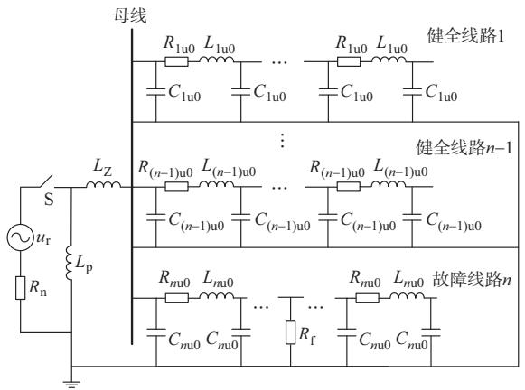
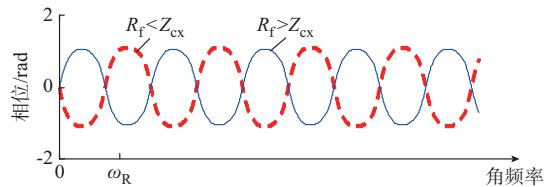
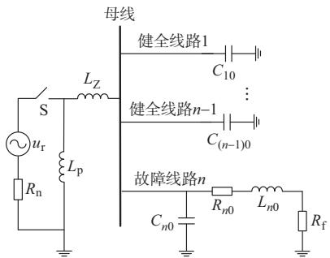
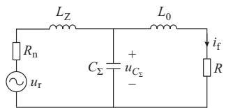
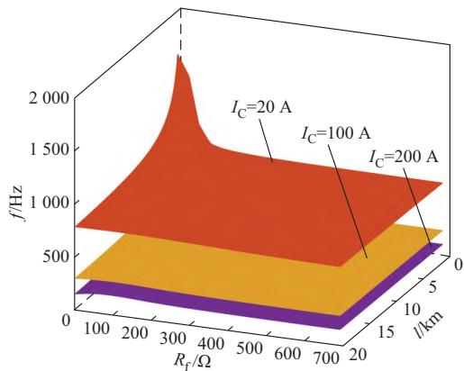
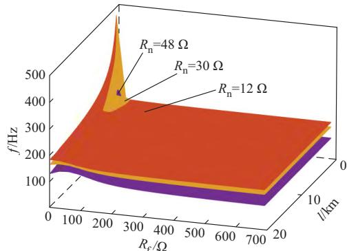
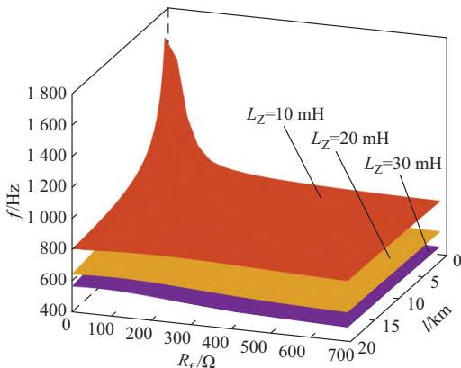
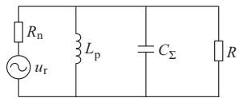
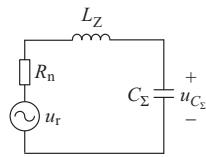
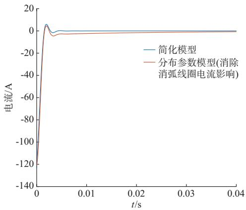

# 灵活接地系统中性点接地电阻投入暂态特征分析

刘萃萃 1，2 ，刘 晓 3 ，薛永端 2 ，徐丙垠 4

（1. 国家电网有限公司技术学院分公司，山东省济南市 250002；2. 中国石油大学（华东）新能源学院，山东省青岛市 266580；  
3. 国网山东省电力公司泰安供电公司，山东省泰安市 271000；4. 山东理工大学智能电网研究院，山东省淄博市 255049）

摘要：灵活接地系统发生永久性单相接地故障后，通过延时闭合中性点接地电阻（并联小电阻）投切开关以期可靠切除故障。目前,基于稳态信息的灵活接地系统保护方法应用效果难以达到要求，而关于小电阻投入时的暂态特征分析尚未有完整结论，制约了灵活接地系统接地故障暂态保护理论的发展。文中建立基于线路分布参数的灵活接地系统并联小电阻投入暂态分析模型，研究系统内各元件间的谐振特性，并据此提出一种简化模型。针对低阻、高阻接地故障，分别给出暂态电流、电压的解析表达式，分析其谐振频率、衰减时间常数及最大幅值等主要特征值随系统参数及故障条件的变化规律，以及各线路暂态零序电流的分布特征，并与谐振接地阶段故障时刻的暂态特征作对比。最后,利用数字仿真及现场试验数据验证了所提暂态特征分析简化模型的正确性。

关键词：灵活接地系统；永久性接地故障；中性点接地电阻；并联小电阻；暂态特征；保护

# 0 引 言

灵活接地即中性点经消弧线圈并联一个投切可控的低值电阻接地，此中性点接地电阻又常被简称为并联小电阻［1-3］。小电阻只有在接地故障发生并且持续一段时间不消失后才投入运行，以充分发挥消弧线圈补偿电流而促进故障自熄弧以及并联小电阻投入而放大故障特征使保护快速动作的作用，理论上可以兼顾谐振接地系统高供电可靠性与小电阻接地系统高保护灵敏性的优势。近年来，国家电网有限责任公司及中国南方电网有限责任公司已积极开展相关技术论证和试运行工作［1-3］ ，为灵活接地方式的推广应用奠定了基础。

灵活接地系统发生单相接地故障以后，可能经历谐振接地（故障初始）、并联小电阻投入及退出（永久性接地故障）3个阶段，现场要求继电保护装置在谐振接地阶段灵敏感知故障但不动作跳闸，而在并联小电阻投入后将故障快速切除［1］ 。目前，对于灵活接地系统接地故障的处理主要基于各阶段的稳态特征，已有保护方法的应用效果难以达到要求。

如现场采用较多的定时限零序过电流保护，方法本身耐过渡电阻能力并不高，应用于灵活接地系

统若没有小电阻投切信息的辅助，还需通过提高整定值来避免谐振接地阶段的误动风险，保护耐过渡电阻能力将进一步下降［4］。文献［5］依据线路零序电流与中性点电流幅值比在并联小电阻投入前后的变化特征实现接地故障选线，该方法不受零序电流互感器反接及测量精度的影响，可靠性高，依据中性点电流信号可有效判断并联小电阻是否投入，但难以应用于距离变电站较远的分支线保护［6］。文献［7］提出了基于负序电压变化量的故障区段定位方法，定位精度较高，但需要集中对比系统所有检测点的量测信息以及并联小电阻投切信息，对系统通信有一定要求。文献［8］依据并联小电阻投入前后各出线零序无功功率与零序有功功率比值的变化特征实现接地故障选线，该方法耐过渡电阻水平较高，但在实际应用中，由于线路对地电导的存在，选线可靠性还受消弧线圈补偿效果的影响［9］ 。

事实上，灵活接地系统不同故障阶段间的过渡过程还包含丰富的暂态信息，有利于故障检测。文献［10］通过分析并联小电阻投入后产生的电流行波的传播过程，提出基于行波线模和零模分量波速差的接地故障测距方法，精度较高，受过渡电阻影响小；但行波法仅利用了暂态信号的初始部分，持续时间很短，在配电网中难以保障其实际应用效果［11］。文献［12］构建了灵活接地系统高阻接地故障等值电路，但只分析了系统内低频暂态电气量的分布特

征。目前，对于灵活接地系统接地故障特征分析及保护方法研究仍不足，特别是针对并联小电阻投入时的暂态特征分析还未见明确结论，需不断深入和完善。

本文通过建立适于灵活接地系统并联小电阻投切暂态过程研究的等值模型，分析小电阻投入时系统各暂态电气量的基本特征，为明确已有小电流暂态保护方法在并联小电阻投入后的适应性以及灵活接地系统接地故障新型暂态保护方案研究奠定基础，以进一步提升灵活接地系统的故障处理水平。

# 1 灵活接地系统并联小电阻投入暂态分析模型

# 1. 1　模型建立

谐振接地阶段接地故障暂态特征分析已较为成熟［13-16］ ，本文不再赘述。基于 Karenbauer 变换可得，并联小电阻投入后产生的暂态电流只有零模分量沿线路传播［10］ 。因此，灵活接地系统并联小电阻投入后的暂态分析可仅在零模网络中展开，零模网络中的各线路均为独立的单条（单相）线路。

以均匀传输线为例，建立基于线路分布参数的灵活接地系统并联小电阻投入暂态零模分量模型，如图 1所示。当判定系统发生永久性接地故障时，闭合开关S，并联小电阻投入，此时产生暂态过程的虚拟电源位于中性点处；经过一定延时后，开关S断开，小电阻退出运行。

  
图1　基于线路分布参数的灵活接地系统并联小电阻投入暂态零模分量模型  
Fig. 1 Transient zero-mode component model for parallel small resistor throw-in in flexible grounded system based on line distribution parameters

该系统共有 n条线路（设出线 n为故障线路），$R _ { k \mathrm { u } 0 } \setminus L _ { k \mathrm { u } 0 } \setminus C _ { k \mathrm { u } 0 } ( k { = } 1 , 2 , \cdots , n )$ 分别为第k条线路单位长度的零模电阻、零模电感及对地分布电容，R 为

3倍的故障点接地电阻，R 为 3倍的中性点接地电阻， $L _ { \mathrm { p } }$ 为3倍的消弧线圈电感， $L _ { \mathrm { z } }$ 为接地变压器等效零模电感， $u _ { \mathrm { r } }$ 为中性点虚拟电源电压，等于小电阻投入前母线零模电压的反相电压。

# 1. 2　各线路相频特性分析

图 中，健全线路阻抗在最低频段呈容性，随着角频率 ω 的增加，等间隔交替呈感性和容性［15，17］。对于故障线路，其不同之处在于故障点存在一个接地电阻 $R _ { \mathrm { f } }$ ，可以将其看作末端带有纯电阻的均匀传输线，其入端阻抗 $Z _ { \mathrm { i n } }$ 可表示为：

$$
Z _ {\mathrm {i n}} = Z _ {\mathrm {c x}} \frac {R _ {\mathrm {f}} + \mathrm {j} Z _ {\mathrm {c x}} \operatorname {t g} \left(\omega \sqrt {L _ {\mathrm {n u 0}} C _ {\mathrm {n u 0}}} l\right)}{Z _ {\mathrm {c x}} + \mathrm {j} R _ {\mathrm {f}} \operatorname {t g} \left(\omega \sqrt {L _ {\mathrm {n u 0}} C _ {\mathrm {n u 0}}} l\right)} \tag {1}
$$

式中： $: Z _ { \mathrm { c x } } = \sqrt { L _ { n \mathrm { u } 0 } / C _ { n \mathrm { u } 0 } }$ 为零模网络中忽略线路自身电阻和对地电导时的线路波阻抗；l为线路长度。

故障时，线路入端阻抗出现电阻分量，当 $R _ { \mathrm { f } } =$ $Z _ { \mathrm { c x } }$ 时，线路入端阻抗为纯电阻，即 $Z _ { \mathrm { i n } } = Z _ { \mathrm { c x } } = R _ { \mathrm { f } } ;$ ；当$R _ { \mathrm { f } } < Z _ { \mathrm { c x } }$ 时，线路入端阻抗在 $2 n \omega _ { \mathrm { R } } { \sim } ( 2 n + 1 ) \omega _ { \mathrm { R } }$ 频段内呈感性，而在 $\left( 2 n + 1 \right) \omega _ { \mathrm { R } } \mathord { \sim } \left( 2 n + 2 \right) \omega _ { \mathrm { R } }$ 频段内呈容性， $n \in Z _ { \mathrm { { c } } }$ 。其中， $\omega _ { \mathrm { R } } { = } \pi / ( 2 \sqrt { L _ { n \mathrm { u } 0 } C _ { n \mathrm { u } 0 } } ~ \zeta )$ 为故障线路首次谐振频率， $\varXi$ 健全线路频率交替间隔表达式一致。 $R _ { \mathrm { f } } > Z _ { \mathrm { c x } }$ 时的阻抗特性与 $R _ { \mathrm { f } } < Z _ { \mathrm { c } }$ 时相反，其阻抗典型相频特性如图2所示。

  
图2 故障线路入端阻抗相频特性示意图  
Fig. 2 Schematic diagram of phase frequency characteristics of input impedance on fault line

# 1. 3　暂态谐振机理分析及模型简化

图1中，所有线路处于并联状态，当某一线路自身发生串联谐振（阻抗相频特性由容性跃变到感性）时，该线路阻抗最小，从中性点流入的暂态电流几乎全部经谐振线路返回，而其他线路电流近似为零［15］ 。但该特征与线路是否发生接地故障无关，只取决于线路长度、结构等参数，具有随机性，故不考虑该谐振机理下的暂态保护研究，并可通过限定特征频段来消除该谐振过程的影响。

另外，随着频率的变化以及故障点接地电阻大小的不同，理论上各线路及所有线路并联总阻抗可能呈容性或者感性。因此，系统中可能出现容性线路与感性线路发生并联谐振、所有线路的并联阻抗

与接地变压器零模电感发生串联谐振以及所有线路和接地变压器总阻抗与消弧线圈电感发生并联谐振3种情况。

在灵活接地系统并联小电阻投入暂态零模网络中，定义从 0到各线路首次谐振频率最小值的频段为特征频段。在特征频段内，各健全线路阻抗呈容性，可简化为对地分布电容；对于故障线路，当 $R _ { \mathrm { f } } <$ $Z _ { \mathrm { c x } }$ 时，其线路阻抗在特征频段内呈感性，当 $R _ { \mathrm { f } } > Z _ { \mathrm { c x } }$ 时，其线路阻抗呈容性，故可将其简化为线路对地电容与故障点接地电阻及线路零模电阻、零模电感并联的形式。由上述分析可得，灵活接地系统发生永久性接地故障时，并联小电阻投入暂态零模等值电路如图 3 所示。图中： $C _ { k 0 } ( k { = } 1 , 2 , \cdots , n )$ 为第 k 条线路对地电容； $R _ { n 0 } \ L _ { \setminus } L _ { n 0 }$ 为故障点到母线间线路等效零模电阻和电感。

  
图3 灵活接地系统并联小电阻投入暂态零模等值电路  
Fig. 3 Transient zero-mode equivalent circuit with parallel small resistor throw-in in flexible grounded system

低阻接地故障时，接地变压器与各出线并联后的总阻抗 $Z _ { \mathrm { i n } L _ { 2 } }$ 为：

$$
\left\{ \begin{array}{l} Z _ {\mathrm {i n} L _ {\mathrm {z}}} = \frac {\frac {1}{\mathrm {j} \omega C _ {\Sigma}} (R + \mathrm {j} \omega L _ {n 0})}{\frac {1}{\mathrm {j} \omega C _ {\Sigma}} + R + \mathrm {j} \omega L _ {n 0}} + \mathrm {j} \omega L _ {\mathrm {Z}} = R _ {\mathrm {i n} L _ {\mathrm {z}}} + \mathrm {j} X _ {\mathrm {i n} L _ {\mathrm {z}}} \\ R _ {\mathrm {i n} L _ {\mathrm {z}}} = \frac {R}{\left(1 - \omega^ {2} L _ {n 0} C _ {\Sigma}\right) ^ {2} + \left(\omega R C _ {\Sigma}\right) ^ {2}} \\ X _ {\mathrm {i n} L _ {\mathrm {z}}} = \frac {\omega L _ {n 0} - \omega R ^ {2} C _ {\Sigma} - \omega^ {3} L _ {n 0} ^ {2} C _ {\Sigma}}{\left(1 - \omega^ {2} L _ {n 0} C _ {\Sigma}\right) ^ {2} + \left(\omega R C _ {\Sigma}\right) ^ {2}} + \omega L _ {\mathrm {Z}} \end{array} \right. \tag {2}
$$

式中： $C _ { \Sigma }$ 为零模网络内所有线路对地分电容之和；R为故障线路零模电阻与3倍的故障点电阻之和。

考虑10 kV配电网一般参数（主要包括：系统对地电容电流不超过 200 A，架空线及电缆线供电半径分别不超过 20 km 和 6 km，消弧线圈脱谐度在-10%~（-5%）范围内，接地变压器零模电感不超

过 $3 0 \mathrm { \ m H ^ { [ 1 8 - 2 0 ] } }$ ）条 件 下 ，在 特 征 频 段 内 总 有$X _ { \mathrm { i n } L _ { \mathrm { z } } } { \ll } \omega L _ { \mathrm { p } }$ ，即在零模网络中消弧线圈电感不会与其并联阻抗发生谐振，不影响系统内各出线暂态电流分布，故可忽略消弧线圈电感在小电阻投入暂态过程中的作用。

高阻接地时，故障线路阻抗呈容性，可忽略线路零模电感。同时，在较低频段内，线路阻抗（R和 $C _ { \Sigma }$ 并联部分）远大于接地变压器电抗，可进一步忽略接地变压器的影响，消弧线圈电感可能与系统对地分布电容在工频附近发生并联谐振；在较高频段内，消弧线圈电抗远大于与其并联阻抗，故可忽略消弧线圈在高频暂态过程中的作用。另外，由于故障点接地电阻较大，可将故障点处看作开路，暂态信号主要由接地变压器零模电感与线路对地电容串联谐振产生。其中，低阻接地与高阻接地的临界阻值取线路波阻抗 $Z _ { \mathrm { c x } }$ 。

尽管前述暂态模型中的线路均以简单均匀传输线为分析基础，与实际运行系统并不完全相符，但混合线路、树形线路等与均匀线路的阻抗相频特性总体上是一致的，特别是在特征频段内的阻抗性质相同［15］。因此，在后文的分析中仍以均匀传输线为例，所得结论可方便地推广到实际线路中。

# 2 暂态过程计算

# 2. 1　低阻接地故障

由第 1章分析可得，系统发生永久性单相接地故障且故障点接地电阻小于临界阻值时，并联小电阻投入后的暂态零模等值电路可简化为如图4所示的 RLC 电路。图中： $: i _ { \mathrm { f } }$ 为故障点电流 $; u _ { C _ { \Sigma } }$ 为电容 $C _ { \Sigma }$ 两端电压； ${ \bf { \varepsilon } } _ { \large ; L _ { 0 } } = L _ { n 0 } { \bf { \varepsilon } } _ { \large 0 }$ 。

  
图4 低阻接地故障时并联小电阻投入暂态简化电路  
Fig. 4 Simplified transient circuit for parallel small resistor throw-in during low-resistance grounding fault

设并联小电阻投入为零时刻，虚拟电源电压为$u _ { \mathrm { r } } ( t ) { = } U _ { \mathrm { m } }$ sin $( \omega _ { \mathrm { 0 } } t + \varphi )$ ，由于暂态过程一般持续时间很短，认为并联小电阻投入之前，接地故障已进入稳态。 $U _ { \mathrm { m } }$ 为并联小电阻投入之前的系统稳态零序电压幅值， $\omega _ { 0 }$ 为工频频率， $\varphi$ 为小电阻投入时刻的零序电压相位。 $U _ { \mathrm { m } }$ 可由谐振接地阶段单相接地故障等效电路求得［13］ ，有：

$$
\begin{array}{l} U _ {\mathrm {m}} = \\ \frac {U _ {\mathrm {A}}}{\sqrt {\left(1 - \omega_ {0} ^ {2} L _ {n 0 \Sigma} C _ {\Sigma} + \frac {L _ {n 0 \Sigma}}{L _ {\mathrm {p}}}\right) ^ {2} + \left(\omega_ {0} R _ {\Sigma} C _ {\Sigma} - \frac {R _ {\Sigma}}{\omega_ {0} L _ {\mathrm {p}}}\right) ^ {2}}} \tag {3} \\ \end{array}
$$

式中： $U _ { \mathrm { A } }$ 为系统正常运行时的相电压幅值； $R _ { \Sigma }$ 为故障点到母线间线路零模、线模电阻及 3倍的故障点接地电阻之和； $L _ { n 0 \Sigma }$ 为故障点到母线间线路零模电感与线模电感之和。

根据图4建立如式（4）所示的微分方程。

$$
\begin{array}{l} L _ {\mathrm {Z}} L _ {0} C _ {\Sigma} \frac {\mathrm {d} ^ {3} i _ {\mathrm {f}}}{\mathrm {d} t ^ {3}} + C _ {\Sigma} \left(R _ {\mathrm {n}} L _ {0} + R L _ {\mathrm {Z}}\right) \frac {\mathrm {d} ^ {2} i _ {\mathrm {f}}}{\mathrm {d} t ^ {2}} + \\ (R _ {\mathrm {n}} R C _ {\Sigma} + L _ {\mathrm {Z}} + L _ {0}) \frac {\mathrm {d} i _ {\mathrm {f}}}{\mathrm {d} t} + (R _ {\mathrm {n}} + R) i _ {\mathrm {f}} = \\ U _ {\mathrm {m}} \sin (\omega_ {0} t + \varphi) \tag {4} \\ \end{array}
$$

由一元三次特征方程求解公式可得，当式（5）成立时可求得式（4）的特征根。

$$
B ^ {2} - 4 A C > 0 \tag {5}
$$

其中，

$$
\left\{ \begin{array}{l} A = C _ {\Sigma} ^ {2} \left(R _ {\mathrm {n}} L _ {0} + R L _ {\mathrm {Z}}\right) ^ {2} - \\ 3 L _ {\mathrm {Z}} L _ {0} C _ {\Sigma} \left(R _ {\mathrm {n}} R C _ {\Sigma} + L _ {\mathrm {Z}} + L _ {0}\right) \\ B = C _ {\Sigma} \left(R _ {\mathrm {n}} L _ {0} + R L _ {\mathrm {Z}}\right) \left(R _ {\mathrm {n}} R C _ {\Sigma} + L _ {\mathrm {Z}} + L _ {0}\right) - \\ 9 L _ {\mathrm {Z}} L _ {0} C _ {\Sigma} \left(R _ {\mathrm {n}} + R\right) \\ C = \left(R _ {\mathrm {n}} R C _ {\Sigma} + L _ {\mathrm {Z}} + L _ {0}\right) ^ {2} - \\ 3 C _ {\Sigma} \left(R _ {\mathrm {n}} L _ {0} + R L _ {\mathrm {Z}}\right) \left(R _ {\mathrm {n}} + R\right) \end{array} \right.
$$

求解方程式（4）的特征根，有

$$
\begin{array}{l} \left\{\begin{array}{l}p _ {1} = \frac {- C _ {\Sigma} \left(R _ {\mathrm {n}} L _ {0} + R L _ {\mathrm {Z}}\right) - \left(\sqrt [ 3 ]{Y _ {1}} + \sqrt [ 3 ]{Y _ {2}}\right)}{3 L _ {\mathrm {Z}} L _ {0} C _ {\Sigma}}\\p _ {2, 3} = \frac {- C _ {\Sigma} \left(R _ {\mathrm {n}} L _ {0} + R L _ {\mathrm {Z}}\right) +}{3 L _ {\mathrm {Z}}} \rightarrow\\\quad \leftarrow \frac {\frac {1}{2} \left(\sqrt [ 3 ]{Y _ {1}} + \sqrt [ 3 ]{Y _ {2}}\right) \pm j \frac {\sqrt {3}}{2} \left(\sqrt [ 3 ]{Y _ {1}} - \sqrt [ 3 ]{Y _ {2}}\right)}{L _ {0} C _ {\Sigma}}\end{array}\right. (6) \\ Y _ {1, 2} = A C _ {\Sigma} \left(R _ {\mathrm {n}} L _ {0} + R L _ {\mathrm {z}}\right) + \frac {3}{2} L _ {\mathrm {z}} L _ {0} C _ {\Sigma} (- B \pm \\ \sqrt {B ^ {2} - 4 A C}) (7) \\ \end{array}
$$

则流经故障点的电流 $i _ { \mathrm { f } } ( \mathbf { \Omega } _ { t } )$ 可用式（8）表示。

$$
\left\{ \begin{array}{l} i _ {\mathrm {f}} (t) = \mathrm {e} ^ {- \delta_ {\mathrm {i}} t} \left(A _ {1} ^ {\prime} \sin \omega_ {\mathrm {f}} t + A _ {2} ^ {\prime} \cos \omega_ {\mathrm {f}} t\right) + A _ {3} ^ {\prime} \mathrm {e} ^ {- \delta_ {2} t} + B _ {0} \sin \left(\omega_ {0} t + \phi\right) \\ B _ {0} = \frac {U _ {\mathrm {m}}}{\sqrt {\left[ R _ {\mathrm {n}} + R - \omega_ {0} ^ {2} C _ {\Sigma} \left(R _ {\mathrm {n}} L _ {0} + R L _ {\mathrm {Z}}\right) \right] ^ {2} + \left[ \omega_ {0} \left(R _ {\mathrm {n}} R C _ {\Sigma} + L _ {\mathrm {Z}} + L _ {0}\right) - \omega_ {0} ^ {3} L _ {\mathrm {Z}} L _ {0} C _ {\Sigma} \right] ^ {2}}} \\ \phi = \varphi - \arctan \frac {\omega_ {0} \left(R _ {\mathrm {n}} R C _ {\Sigma} + L _ {\mathrm {Z}} + L _ {0}\right) - \omega_ {0} ^ {3} L _ {\mathrm {Z}} L _ {0} C _ {\Sigma}}{R _ {\mathrm {n}} + R - \omega_ {0} ^ {2} C _ {\Sigma} \left(R _ {\mathrm {n}} L _ {0} + R L _ {\mathrm {Z}}\right)} \end{array} \right. \tag {8}
$$

式中： $\cdot \delta _ { 1 }$ 为高频振荡分量的衰减时间常数； $\delta _ { 2 }$ 为低频直流分量的衰减时间常数， $\delta _ { 2 } = - \rho _ { 1 } ; \omega _ { \mathrm { f } }$ 为振荡角频率。实际上， $1 / \delta _ { 1 }$ 是常用的暂态电路时间常数，为表述方便且不影响对暂态过程的分析，本文均称其为衰减时间常数。

根据谐振接地阶段故障等效电路易求得图4中电容 $C _ { \Sigma }$ 两端电压 $u _ { C _ { \Sigma } } \ : ,$ 、故障点电流 i 以及电感 $L _ { \mathrm { z } }$ 电流 $i _ { L _ { \mathrm { 7 } } }$ 在并联小电阻投入时刻的初始值分别为：

$$
\left\{ \begin{array}{l} u _ {C _ {\Sigma}} \left(0 _ {+}\right) = - U _ {\mathrm {m}} \sin \varphi \\ i _ {\mathrm {f}} \left(0 _ {+}\right) = \left(\omega_ {0} C _ {\Sigma} - \frac {1}{\omega_ {0} L _ {\mathrm {p}}}\right) U _ {\mathrm {m}} \sin \left(\varphi - 9 0 ^ {\circ}\right) \\ i _ {L _ {\Sigma}} \left(0 _ {+}\right) = \frac {U _ {\mathrm {m}} \sin \left(\varphi + 9 0 ^ {\circ}\right)}{\omega_ {0} L _ {\mathrm {p}}} \end{array} \right. \tag {9}
$$

进一步，可求得各暂态分量系数 $A _ { 1 } ^ { \prime } { \setminus } A _ { 2 } ^ { \prime } { \setminus } A$ （′ 见附录A式（A1））。

由前述分析及计算结果可得，并联小电阻投入后在故障点处产生的暂态零模电流由一衰减的高频振荡分量和一衰减的直流分量叠加而成。目前，现

场应用较多的小电流接地暂态保护方法主要基于低阻接地时的高频分量特征而设计。本文重点分析高频暂态分量的特征变化规律，特别是其振荡频率、暂态持续时间、最大幅值等特征可以很好地描述故障暂态过程发展，明确该系列特征值的影响因素及分布范围，以及与故障初始阶段暂态过程的特征对比结论，对研究基于暂态量的灵活接地系统接地故障检测与保护方案具有实际意义。

# 1）振荡频率特征分析

故障点暂态电流高频分量的振荡角频率表达式为：

$$
\omega_ {\mathrm {f}} = \frac {\frac {\sqrt {3}}{2} \left(\sqrt [ 3 ]{Y _ {1}} - \sqrt [ 3 ]{Y _ {2}}\right)}{3 L _ {\mathrm {Z}} L _ {0} C _ {\Sigma}} \tag {10}
$$

结合式（7）可知，该振荡角频率主要与故障点接地电阻、故障线路零模电阻和电感（故障线路类型及长度）、系统对地分布电容（电容电流）、中性点接地电阻（一般取4 $= - 1 6 \Omega ^ { [ 2 1 ] } )$ ）以及接地变压器零模电感等参数有关。根据式（10）可作出高频分量振荡频率

$f ( f { = } \omega _ { \mathrm { f } } / 2 \pi )$ ）随各影响因素变化情况，如图 5 所示。以故障发生在架空线路为例，故障发生在电缆线路时变化趋势相似。

  
(a) f随故障点接地电阻、故障线路长度及系统对地电容电流变化规律

  
(b) f 随故障点接地电阻、故障线路长度及中性点接地电阻变化规律

  
(c) f 随故障点接地电阻、故障线路长度及接地变压器零模电感变化规律   
图5 f随各影响因素变化规律  
Fig. 5 Variation of f with various influencing factors

由图 5（a）和（c）可知，系统对地电容电流 I 越大，故障线路越长，接地变压器零模电感越大，谐振频率越低；故障线路较长时，f随故障点接地电阻增大而先增大后减小，故障线路较短时，f随故障点接地电阻增大而减小。由图 5（b）可知，一般情况下 f随中性点接地电阻增大而减小。系统电容电流为20 A，中性点接地电阻为4 Ω，接地变压器零模电感

为10 mH，故障发生在1 km电缆线路且故障点接地电阻为 5 Ω的极端条件下，计算出最大谐振频率约为2 323 Hz，计算出最小谐振频率约为93 Hz。比现有小电流接地系统接地故障暂态主谐振频率变化范围稍大，但仍可有效利用特征频段内的暂态信号实现灵活接地系统并联小电阻投入后的故障检测与处理［22］ 。

# 2）衰减时间常数特征分析

高频暂态分量的衰减时间常数表达式为：

$$
\delta_ {1} = \frac {C _ {\Sigma} \left(R _ {\mathrm {n}} L _ {0} + R L _ {\mathrm {Z}}\right) - \frac {1}{2} \left(\sqrt [ 3 ]{Y _ {1}} + \sqrt [ 3 ]{Y _ {2}}\right)}{3 L _ {\mathrm {Z}} L _ {0} C _ {\Sigma}} \tag {11}
$$

由式（7）和式（11）可知，高频暂态分量持续时间与谐振频率影响因素一致。根据式（11）可作出衰减时间常数 $\delta _ { 1 }$ 随各影响因素变化情况，见附录 A 图A1。由图可知， $\delta _ { 1 }$ 随故障点接地电阻增大而先增大后减小；在接地电阻较小时，δ 随故障线路长度增加而先减小后增大，随着接地电阻的增大， $\delta _ { 1 }$ 随故障线路长度增加而减小。由图A1（a）和（b）可知，系统对地电容电流越大，中性点接地电阻越小， $\delta _ { 1 }$ 越小；由图A1（c）可知，一般情况下 $\delta _ { 1 }$ 随接地变压器零模电感增加而增大。

衰减时间常数的大小表征了暂态过程持续时间的长短，其值越大，暂态信号衰减速度越快。对于高频振荡分量，其衰减时间常数在 65.2~14 038范围内，即该暂态分量持续时间为 0.07~15 ms。

# 3）最大幅值特征分析

故障点高频暂态电流最大幅值 $I _ { \mathrm { f m } }$ 可表示为：

$$
I _ {\mathrm {f m}} = \sqrt {A _ {1} ^ {2} + A _ {2} ^ {2}} \tag {12}
$$

结合式（8）和式（11）及附录 A式（A1）可知，该值除与故障点接地电阻、故障线路类型及长度、系统对地电容电流、中性点接地电阻以及接地变压器零模电感等参数有关外，还受消弧线圈电感及并联小电阻投入时刻的影响。由于篇幅有限，本文只分析在某一确定系统中对幅值影响较为关键的两项因素即故障点接地电阻和并联小电阻投入时刻，不考虑信号衰减时的故障点高频暂态电流最大幅值随前述两项因素的变化规律，如附录 A图 A2所示。由图可知，故障点高频暂态电流最大幅值总体上随着故障点接地电阻增大而减小，且并联小电阻在零序电压峰值投入时最大，在零序电压过零时投入最小，这与现有分析结论相一致。同时，计算可得高频暂态电流幅值在5.3~434.4 A范围内分布。

# 2. 2　高阻接地故障

# 2. 2. 1 低频段暂态分析

由 1.3节分析可得，当故障点接地电阻高于临界阻值时，在较低频段内，并联小电阻投入后的暂态零模等值电路可简化为如图6所示的二阶电路。

  
图6 高阻接地故障时的低频暂态等值电路  
Fig. 6 Low-frequency transient equivalent circuit with high-resistance grounding fault

依据图 6 建立微分方程：

$$
R _ {\mathrm {n}} L _ {\mathrm {p}} C _ {\Sigma} \frac {\mathrm {d} ^ {2} i _ {L _ {\mathrm {p}}}}{\mathrm {d} t ^ {2}} + \left(\frac {R _ {\mathrm {n}} L _ {\mathrm {p}}}{R} + L _ {\mathrm {p}}\right) \frac {\mathrm {d} i _ {L _ {\mathrm {p}}}}{\mathrm {d} t} + R _ {\mathrm {n}} i _ {L _ {\mathrm {p}}} = u _ {\mathrm {r}} \tag {13}
$$

式中： $: i _ { L _ { \ p } }$ 为流经消弧线圈的电流。

在 10 kV中压配电网一般参数条件下，式（13）有两个不相等的实根［12］ ，即：

$$
\begin{array}{l} p _ {1, 2} = - \frac {1}{2 C _ {\Sigma}} \left(\frac {1}{R} + \frac {1}{R _ {\mathrm {n}}}\right) \pm \\ \sqrt {\frac {1}{4 C _ {\Sigma} ^ {2}} \left(\frac {1}{R} + \frac {1}{R _ {\mathrm {n}}}\right) ^ {2} - \frac {1}{L _ {\mathrm {p}} C _ {\Sigma}}} \tag {14} \\ \end{array}
$$

此时，流经消弧线圈的电流为：

$$
\left\{ \begin{array}{l} i _ {L _ {\mathrm {p}}} (t) = A _ {1} \mathrm {e} ^ {p _ {1} t} + A _ {2} \mathrm {e} ^ {p _ {2} t} + B _ {0} \sin \left(\omega_ {0} t + \phi\right) \\ B _ {0} = \frac {U _ {\mathrm {m}}}{\sqrt {\left(R _ {\mathrm {n}} - \omega_ {0} ^ {2} R _ {\mathrm {n}} L _ {\mathrm {p}} C _ {\Sigma}\right) ^ {2} + \omega_ {0} ^ {2} \left(\frac {R _ {\mathrm {n}} L _ {\mathrm {p}}}{R} + L _ {\mathrm {p}}\right) ^ {2}}} \\ \phi = \varphi - \arctan \frac {\omega_ {0} \left(\frac {R _ {\mathrm {n}} L _ {\mathrm {p}}}{R} + L _ {\mathrm {p}}\right)}{R _ {\mathrm {n}} - \omega_ {0} ^ {2} R _ {\mathrm {n}} L _ {\mathrm {p}} C _ {\Sigma}} \\ A _ {1} = \frac {\frac {u _ {C _ {\Sigma}} (0 _ {+})}{L _ {\mathrm {p}}} - B _ {0} \omega_ {0} \cos \phi + p _ {2} (B _ {0} \sin \phi - i _ {L _ {\mathrm {p}}} (0 _ {+}))}{p _ {1} - p _ {2}} \\ A _ {2} = i _ {L _ {\mathrm {p}}} (0 _ {+}) - A _ {1} - B _ {0} \sin \phi \\ i _ {L _ {\mathrm {p}}} (0 _ {+}) = i _ {L _ {\mathrm {z}}} (0 _ {+}) \end{array} \right. \tag {15}
$$

据计算结果可知，高阻接地时，在较低频段内消弧线圈电感实际上并不会与系统对地电容发生并联谐振从而产生高频振荡过程，其暂态部分为一衰减直流分量。

# 2. 2. 2　高频段暂态分析

在较高频段范围内，并联小电阻投入后的暂态零模等值电路可简化为如图 7所示的等值电路，此

时的暂态过程主要由接地变压器零模电感和线路对地电容的串联谐振产生。

  
图7 高阻接地故障时的高频暂态等值电路  
Fig. 7 High-frequency transient equivalent circuit with high-resistance grounding fault

依据图7所示等值电路建立微分方程：

$$
L _ {\mathrm {Z}} C _ {\Sigma} \frac {\mathrm {d} ^ {2} u _ {C _ {\Sigma}}}{\mathrm {d} t ^ {2}} + R _ {\mathrm {n}} C _ {\Sigma} \frac {\mathrm {d} u _ {C _ {\Sigma}}}{\mathrm {d} t} + u _ {C _ {\Sigma}} = u _ {\mathrm {r}} \tag {16}
$$

解得：

$$
\left\{ \begin{array}{l} u _ {C _ {\Sigma}} = \mathrm {e} ^ {- \delta_ {1} t} \left(A _ {3} \sin \omega_ {\mathrm {f}} t + A _ {4} \cos \omega_ {\mathrm {f}} t\right) + \\ B _ {1} \sin \left(\omega_ {0} t + \phi_ {1}\right) \\ \omega_ {\mathrm {f}} = \sqrt {\frac {1}{L _ {\mathrm {Z}} C _ {\Sigma}} - \left(\frac {R _ {\mathrm {n}}}{2 L _ {\mathrm {Z}}}\right) ^ {2}} \\ B _ {1} = \frac {U _ {\mathrm {m}}}{\sqrt {\left(1 - \omega_ {0} ^ {2} L _ {\mathrm {Z}} C _ {\Sigma}\right) ^ {2} + \left(\omega_ {0} R _ {\mathrm {n}} C _ {\Sigma}\right) ^ {2}}} \\ \delta_ {1} = \frac {R _ {\mathrm {n}}}{2 L _ {\mathrm {Z}}} \\ \phi_ {1} = \varphi - \arctan \frac {\omega_ {0} R _ {\mathrm {n}} C _ {\Sigma}}{1 - \omega_ {0} ^ {2} L _ {\mathrm {Z}} C _ {\Sigma}} \\ A _ {3} = \frac {\frac {i _ {L _ {\Sigma}} (0 _ {+})}{C _ {\Sigma}} + \delta_ {1} A _ {4} - B _ {1} \omega_ {0} \cos \phi_ {1}}{\omega_ {\mathrm {f}}} \\ A _ {4} = u _ {C _ {\Sigma}} (0 _ {+}) - B _ {1} \sin \phi_ {1} \end{array} \right. \tag {17}
$$

此时的暂态过程与故障初始阶段类似，其谐振频率、衰减时间常数表达式一致，只是具体参数含义不同，不再与故障条件有关，而是随系统参数变化而变化。中性点接地电阻越小，接地变压器零模电感越大，该衰减时间常数越小，暂态持续时间越长，且在 范围内分布；该谐振频率随系统对地电容电流、中性点接地电阻及接地变压器零模电感变化情况见附录A图A3。由图可以看出，系统对地电容电流、中性点接地电阻及接地变压器零模电感越小，谐振频率越高。另外，在系统对地电容电流及中性点接地电阻较大且接地变压器零模电感较小时，存在不含高频暂态过程的情况。

综上，灵活接地系统发生高阻接地故障时，多数情况下并联小电阻投入后流经故障线路的暂态零序电流由一高频振荡分量和一直流分量叠加而成，且其振荡频率不再保持与工频十分接近，这与故障初

始阶段的暂态特征有所区别。从暂态信号提取的便利性来说，并联小电阻投入后的暂态过程更有优势。

# 3 各线路暂态零序电流分布特征分析

由第 2章计算结果可知，无论故障点接地电阻大或小，并联小电阻投入后在故障点处产生的暂态零模电流均由衰减的高频分量和直流分量组成。其中，高频振荡分量是现有暂态保护方案的主要设计依据，并且经上述分析计算可发现在灵活接地系统并联小电阻投入后的暂态过程中，高频分量仍包含丰富的故障特征，且不会超出特征频段及现有采样装置的频率上限，在仿真模型和工程现场中均可通过滤波器方便得到。因此，本文后续分析其他暂态电气量特征时只针对高频暂态部分，且不再与前文分析中的全暂态量进行区分。

根据图4以及式（8），低阻接地故障时系统暂态零序电压 $u _ { C _ { \Sigma ^ { 2 } } }$ 可表示为：

$$
\begin{array}{l} u _ {C _ {z z}} (t) = R i _ {\mathrm {f}} (t) + L _ {0} \frac {\mathrm {d} i _ {\mathrm {f}} (t)}{\mathrm {d} t} = \\ \mathrm {e} ^ {- \delta_ {1} t} \left[ \left(R A _ {1} - L _ {0} \delta_ {1} A _ {1} - L _ {0} A _ {2} \omega_ {\mathrm {f}}\right) \sin \omega_ {\mathrm {f}} t + \right. \\ \left. \left(R A _ {2} + L _ {0} A _ {1} \omega_ {\mathrm {f}} - L _ {0} \delta_ {1} A _ {2}\right) \cos \omega_ {\mathrm {f}} t \right] \tag {18} \\ \end{array}
$$

健全线路暂态零序电流 $i _ { 0 k \mathrm { z } }$ （本文所提线路电流无特殊说明时，均指线路出口处的电流）为：

$$
i _ {0 k z} (t) = C _ {k 0} \frac {\mathrm {d} u _ {C _ {z} z} (t)}{\mathrm {d} t} \quad k = 1, 2, \dots , n - 1 \tag {19}
$$

在零模网络中，当故障点接地电阻较小时，并联小电阻投入后，容性健全线路将与感性故障线路发生并联谐振，暂态电流经故障点及故障点上游线路流向各健全线路。因此，故障线路暂态零序电流 $i _ { \mathrm { 0 } n z }$ 可表示为：

$$
\begin{array}{l} i _ {0 n z} (t) = - C _ {\Sigma} \frac {\mathrm {d} u _ {C _ {\Sigma} \mathrm {z}} (t)}{\mathrm {d} t} + C _ {n 0} \frac {\mathrm {d} u _ {C _ {\Sigma} \mathrm {z}} (t)}{\mathrm {d} t} = \\ - \left(C _ {\Sigma} - C _ {n 0}\right) \frac {\mathrm {d} u _ {C _ {\Sigma} \mathrm {Z}} (t)}{\mathrm {d} t} \tag {20} \\ \end{array}
$$

式中： $C _ { \Sigma } - C _ { n 0 }$ 为系统中除故障线路以外所有健全线路对地电容之和。

由式（19）和式（20）可知，故障线路暂态零序电流与健全线路暂态零序电流极性相反；当系统出线条数超过 3时，故障线路暂态零序电流幅值一定大于健全线路。

根据图 7 以及式（15）、式（17），高阻接地故障时，系统暂态零序电压可表示为：

$$
\begin{array}{l} u _ {C _ {z} z} (t) = L _ {\mathrm {p}} \left(A _ {1} p _ {1} \mathrm {e} ^ {p _ {1} t} + A _ {2} p _ {2} \mathrm {e} ^ {p _ {2} t}\right) + \\ \mathrm {e} ^ {- \delta_ {\mathrm {t}} t} \left(A _ {3} \sin \omega_ {\mathrm {f}} t + A _ {4} \cos \omega_ {\mathrm {f}} t\right) \tag {21} \\ \end{array}
$$

若只考虑高频暂态分量，健全线路暂态零序电流为：

$$
i _ {0 k z} (t) = C _ {k 0} \frac {\mathrm {d} u _ {C _ {z} z} (t)}{\mathrm {d} t} \quad k = 1, 2, \dots , n - 1 \tag {22}
$$

故障线路暂态零序电流为：

$$
i _ {0 n z} (t) = \frac {u _ {C _ {\Sigma^ {2}}} (t)}{R _ {\mathrm {f}}} + C _ {n 0} \frac {\mathrm {d} u _ {C _ {\Sigma^ {2}}} (t)}{\mathrm {d} t} \tag {23}
$$

故障点接地电阻较大时，高频暂态过程主要由接地变压器等效电感与系统对地分布电容间串联谐振产生。由式（22）和式（23）可知，健全线路暂态零序电流为线路自身对地电容电流，与系统暂态零序电压的导数成正比；故障线路暂态零序电流由两部分组成：一部分为线路自身对地电容电流，另一部分为故障点电流，由系统暂态零序电压加在故障点接地电阻产生。因此，故障线路暂态零序电流与健全线路暂态零序电流间无明显的幅值极性关系，而与系统暂态零序电压及其导数呈线性组合关系。

# 4 仿真与现场试验验证

# 4. 1　暂态特征值仿真验证

利用 MATLAB/Simulink 平台搭建 10 kV 灵活接地系统仿真模型，如附录 A图 A4所示。该系统共有8条出线，各线路类型及长度已在图中标注，线路采用分布参数模型，具体参数见附录A表A1。系统 对 地 电 容 电 流 为 58 $\operatorname { A } ;$ 消 弧 线 圈 脱 谐 度 取-10%；接地变压器等效零模电感取20 mH；除需对比中性点接地电阻大小对某一电气量的影响以外，其他情况均取 $R _ { \mathrm { n } } / 3 = 1 6 \Omega ;$ ；开关S在接地故障发生2 s后闭合，并联小电阻投入运行。

不同故障情况下基于简化模型计算所得的暂态分量振荡频率、衰减时间常数与基于线路分布参数模型的仿真结果在数值及变化规律上的对比见附录A表A2。表中：相对误差为分布参数模型数值与简化模型数值之差除以分布参数模型数值。由表A2可知，对于暂态谐振频率的模拟，本文所提简化模型与基于分布参数的仿真模型相对误差均在±7%以内，说明简化模型对暂态谐振机理描述较为精确。对于衰减时间常数的模拟，在低阻接地故障时较为精确，其相对误差基本在±10% 以内，高阻接地时误差较大，高达34%。这是由于本文高阻分析模型中为简化计算忽略了故障点接地支路所致。衰减时间常数表征的是暂态过程持续的时间，与系统内的暂态电气量分布特征无关。文献［14］所提实用性等值电路对衰减时间常数模拟的相对误差在某些故障

条件下甚至超过 100%，但实际上其对故障检测结果的准确性影响不大。另外，从表 A2中还可以看出，故障线路较长时，f随 R 增大而先增大后减小，故障线路较短时，f随 R 增大而减小；R 较小时，δ随故障线路长度增大而先减小后增大，随着R 的增大，δ 随故障线路长度增大而减小，当 R 超过临界阻值后，f及δ 基本不随故障情况改变而变化。各暂态特征值随不同故障情况变化规律均与基于分布参数模型的仿真结果吻合。

# 4. 2　暂态电气量时域波形仿真验证

由第 2章相关分析计算可知，不论故障点接地电阻大小，系统内暂态信号绝大部分情况下都是由衰减的高频振荡分量和低频直流分量叠加而成，少数情况下只包含衰减的直流分量。不同线路上发生低阻接地故障时的故障点暂态电流波形以及高阻接地故障时系统暂态零模电压波形分别见附录 A 图A5和图 A6。

由图 A5可知，故障点暂态电流多由一衰减的直流分量和一衰减的高频振荡分量叠加而成，只是不同故障条件下高频分量和低频分量占比不同，但基本在一个工频周期内衰减到零，且其发展规律与故障线路类型及长度无关，与理论分析结果完全一致。

另外，从图A5中还可以看出，随着故障点电阻的增大，本文所提简化模型与精确的分布参数模型误差愈发明显，这主要是由于简化模型忽略了中性点接地消弧线圈所致。尽管低阻接地故障时，消弧线圈电感并不会引发零模网络内的暂态谐振过程，但由于并联小电阻投入后，消弧线圈电感两端的电压发生变化，其电流也会通过接地支路（故障点）有一个缓慢的暂态过渡过程。而目前现场应用的暂态保护多基于高频振荡分量，通过带通滤波实现高频分量的提取，可避免消弧线圈电感电流的影响。设置20 km架空线上发生过渡电阻为50 Ω的永久性接地故障时，并联小电阻投入后去除消弧线圈电感电流影响后的故障点暂态电流波形如图8所示。

由图 8可以看出，若滤除消弧线圈电感电流的影响，基于本文所提简化等值模型计算出的故障点暂态电流可以很好地与仿真结果相吻合。

根据 2.2节相关分析可知，高阻接地时并联小电阻投入后的暂态是否含有高频振荡过程主要与中性点接地电阻大小有关。由附录 A图 A6可知，当中性点接地电阻较小时，开关S闭合后的暂态过程主要呈高频振荡衰减特性；当中性点接地电阻较大时，该暂态过程主要呈直流衰减特性，与理论分析结

  
图8 消除消弧线圈电流影响后的故障点暂态电流波形对比  
Fig. 8 Comparison of transient current waveforms at fault point after eliminating influence of arc suppression coil current

果相符，且与仿真波形吻合较好，证明了本文所提简 化模型的准确性。

# 4. 3　暂态电流分布特征仿真验证

附录A图A7中分别记录了线路L2在距离母线5 km处发生不同接地电阻的故障时，系统内故障线路及健全线路暂态零序电流的分布情况。由图A7可以看出，当故障点接地电阻较小时，故障发生后以及并联小电阻投入后的过渡过程中均有“故障线路暂态零序电流幅值最大且与其他健全线路暂态零序电流极性相反”的特征，而随着故障点接地电阻增大，此项特征规律不再成立，与第3章理论分析结果相一致。

# 4. 4　现场试验验证

利用某10 kV变电站人工接地故障试验记录的故障电流波形对本文所提暂态简化等值模型进行验证，发生经 100 Ω电阻接地故障时故障线路暂态电流波形对比结果见附录A图A8。

从并联小电阻投入后，人工试验测得的故障线路暂态零序电流的振荡频率、最大幅值及持续时间上可以看出，其总体特征及变化趋势仍与理论分析结果相符合。但由于试验环境受限，测量结果存在一定噪声干扰，现场录波数据受到高次谐波影响，误差较为明显，而实际工程应用中可以通过电磁干扰屏蔽、数字滤波等技术有效减轻甚至消除噪声干扰项。

# 5 结语

本文建立了灵活接地系统中性点接地电阻（并联小电阻）投入暂态零模分量模型，分析了不同故障

情况下暂态过程的形成机理，并提出适于计算分析的简化等值模型，数字仿真及现场试验均验证了该简化等值模型的正确性。

灵活接地系统发生永久性单相接地故障后，并联小电阻投入时系统内也会产生较为明显的暂态过程，有如下结论：

1）各暂态电气量均由衰减的高频振荡分量及直流分量叠加而成，且其高频分量的基本特征与谐振接地阶段相近，现有小电流暂态保护装置能够满足量测要求。  
2）低阻接地故障时，并联小电阻投入后，故障线路与健全线路的暂态零序电流幅值、极性关系仍与小电流接地系统一致。  
3）高阻接地故障时，故障线路与健全线路暂态零序电流分布与谐振接地阶段类似，暂态零序电流投影系数法、暂态能量法可能在小电阻投入后也具有良好的故障检测效果。

基于上述结论，灵活接地系统单相接地故障保护相关研究还可以从以下两个方面进一步展开：

1）分析已有暂态保护方法的适应性、改进方案以及研究新型的暂态保护方法；  
2）设计灵活接地系统故障状态辨识方案。例如，判别引起系统零序电压降低的是故障熄弧还是小电阻投入，用于难以获取小电阻投切信息的分支线保护或灵活接地系统接地故障全过程保护方案研究。

此外，灵活接地技术在实际应用中仍面临一些其他问题：

1）馈线终端原有继电保护配置可能由于无法获取并联小电阻投切信息而受其影响出现误动作；  
2）若投切开关故障或损毁使得并联小电阻无法正常投退，可能造成保护拒动或者母线被迫停运。  
3）并联小电阻投入后会增大电弧能量，一方面可能使部分间歇性接地故障转化为稳定性接地故障从而有助于检测；但另一方面，若不能及时、有效地将故障区段隔离，可能会加大发生电缆沟起火等严重事故的风险。

上述问题有必要进一步研究并得出有效的解决方案，以确保灵活接地方式在实际工程应用中的安全性和可靠性。

附录见本刊网络版（http：//www.aeps-info.com/aeps/ch/index.aspx），扫英文摘要后二维码可以阅读

# 网络全文。

# 参 考 文 献

［1］中国南方电网有限责任公司.消弧线圈并小电阻接地装置技术规 范（ 征 求 意 见 稿 ）［EB/OL］.（2017-02-06）［2023-10-27］.http：//www.Bidding.csg.cn/yjzjgg/1200039088.jhtml  
China Southern Power Grid Company Limited. Technical specification for arc suppression coil and small resistance grounding device （draft）［EB/OL］.（2017-02-06）［2023-10-27］. http：//www.Bidding.csg.cn/yjzjgg/1200039088.jhtml   
［2］金鑫 .灵活接地系统单相接地故障特征分析及保护［D］.青岛：中国石油大学（华东），2020.  
JIN Xin. Characteristic analysis and protection of single phasegrounding fault in flexible grounding system［D］. Qingdao： ChinaUniversity of Petroleum （East China），2020.  
［3］杨帆，金鑫，沈煜，等 .基于零序导纳变化的灵活接地系统接地故障方向判别算法［J］.电力系统自动化，2020，44（17）：88-94.  
YANG Fan， JIN Xin， SHEN Yu， et al. Discrimination algorithm of grounding fault direction based on variation of zerosequence admittance in flexible grounding system ［J］. Automation of Electric Power Systems，2020，44（17）：88-94.   
［4］薛永端，金鑫，刘晓，等 .灵活接地系统中配电网接地保护的适应性分析［］电力系统自动化， ，（ ）： -  
XUE Yongduan， JIN Xin， LIU Xiao， et al. Analysis onadaptability of grounding protection for distribution network inflexible grounded system ［J］. Automation of Electric PowerSystems，2022，46（5）：112-121.  
［5］周宇，汤涛，曾祥君，等 .基于零序电流幅值比倍增系数的灵活接地系统故障选线方法［J］. 电力系统保护与控制，2022，50（23）：112-120.  
ZHOU Yu， TANG Tao， ZENG Xiangjun， et al. Fault line detection method for a flexible grounding system based on a zerosequence current amplitude ratio multiplication coefficient［J］. Power System Protection and Control，2022，50（23）：112-120.   
［6］肖澍昱，林湘宁，魏繁荣，等 .面向含不可测分支配电线路不对称故障可靠辨识的负序电流比相保护判据［J］.电工技术学报，，（ ）： -  
XIAO Shuyu， LIN Xiangning， WEI Fanrong， et al. Phasecomparison protection of negative sequence current fordistribution lines with unmeasurable branches［J］. Transactions ofChina Electrotechnical Society，2023，38（9）：2435-2447.  
［ ］尹力，孔令昌，王冠华，等 基于负序电压变化量的灵活接地配电网永久性单相接地故障定位［］电力自动化设备， ，（1）：83-89.  
YIN Li， KONG Lingchang， WANG Guanhua， et al. Permanent single-phase grounding fault location in flexible grounding distribution network based on negative-sequence voltage variation ［J］. Electric Power Automation Equipment， 2023， 43（1）： 83-89.   
［ ］闫森，黄纯，刘映彤，等 基于零序功率比的灵活接地系统故障

选线方法［J］.电力系统及其自动化学报，2023，35（3）：46-52.  
YAN Sen， HUANG Chun， LIU Yingtong， et al. Flexible faultselection method of grounding system based on zero-sequencepower ratio［J］. Proceedings of the CSU-EPSA，2023，35（3）：46-52.  
［9］刘健，张薛鸿，张小庆，等 . 预防电缆沟起火的小电流接地系统单相接地故障处理［J］. 电力系统保护与控制，2023，51（6）：21-29.  
LIU Jian， ZHANG Xuehong， ZHANG Xiaoqing， et al.Treatment of a single-phase grounding fault in a small currentgrounding system to prevent fire in a cable trench［J］. PowerSystem Protection and Control，2023，51（6）：21-29.  
［10］齐郑，杭天琦，李悦悦 .消弧线圈并联小电阻接地方式下的行波故障测距［］电力系统自动化， ，（ ）： -  
QI Zheng， HANG Tianqi， LI Yueyue. Traveling wave faultlocation for arc-suppression coil in parallel with low resistancegrounding mode［J］. Automation of Electric Power Systems，2020，44（1）：175-182.  
［11］薛永端，徐丙垠，杜景远 .谐振接地系统接地故障选线技术分析［J］. 电力设备，2007（11）：5-10.  
XUE Yongduan， XU Bingyin， DU Jingyuan. The technologyanalysis of earth fault protection in resonant grounded system［J］. Electrical Equipment，2007（11）：5-10.  
［12］汤涛，周宇，曾祥君，等.基于过渡电阻评估的灵活接地系统暂态故障选线方法［］电力系统自动化， ，（ ）： -  
TANG Tao， ZHOU Yu， ZENG Xiangjun， et al. Transientfault line selection method for flexible grounded system based ontransition resistance evaluation ［J］. Automation of ElectricPower Systems，2023，47（5）：171-179.  
［13］薛永端，李娟，徐丙垠 .中性点不接地系统小电流接地故障暂态等值电路的建立［］ 中国电机工程学报， ， （ ）：206-215.  
XUE Yongduan， LI Juan， XU Bingyin. Construction oftransient equivalent circuits of single-phase earth fault forisolated neutral systems［J］. Proceedings of the CSEE，2013，33（34）：206-215.  
「14]薛永端.李娟.徐丙垠中性点经消弧线圈接地系统小电流接地故障暂态等值电路及暂态分析［］ 中国电机工程学报，，（ ）： -  
XUE Yongduan， LI Juan， XU Bingyin. Transient equivalentcircuit and transient analysis of single-phase earth fault in arcsuppression coil grounded system ［J］. Proceedings of theCSEE，2015，35（22）：5703-5714.  
［15］薛永端，薛文君，李娟，等 .小电流接地故障暂态过程的 LC谐振机理［J］. 电力系统自动化，2016，40（24）：137-145.  
XUE Yongduan， XUE Wenjun， LI Juan， et al. LC resonancemechanism of transient process of earth fault in non-solidlyearthed network［J］. Automation of Electric Power Systems，， （ ）： -  
［16］薛永端，李娟，陈筱薷，等.谐振接地系统高阻接地故障暂态选线与过渡电阻辨识［］ 中国电机工程学报， ， （ ）：

5037-5048.   
XUE Yongduan， LI Juan， CHEN Xiaoru， et al. Faulty feederselection and transition resistance identification of highimpedance fault in a resonant grounding system using transientsignals［J］. Proceedings of the CSEE，2017，37（17）：5037-5048.  
［17］薛永端 .基于暂态特征信息的配电网单相接地故障检测研究［D］.西安：西安交通大学，2003.  
XUE Yongduan. Research on single-phase grounding fault detection of distribution network based on transient characteristic information ［D］. Xi’ an： Xi’ an Jiaotong University，2003.   
［18］刘伟生.配电网层次化保护技术及工程应用［D］.济南：山东大学，2022.  
LIU Weisheng. Hierarchical protection technology of distribution network and its engineering application［D］. Jinan： Shandong University，2022.   
［19］刘屏周 .工业与民用配电设计手册［M］.北京：中国电力出版社，2016.  
LIU Bingzhou. Industrial and civil power distribution design manual［M］. Beijing： China Electric Power Press，2016.   
［20］杨帆，李广，沈煜，等.中压配电网单相接地故障熄弧后的电气特征分析［J］.电力系统自动化，2019，43（10）：134-141.  
YANG Fan， LI Guang， SHEN Yu， et al. Electricalcharacteristics of medium-voltage distribution network withsingle-phase-to-ground fault after arc extinction［J］. Automationof Electric Power Systems，2019，43（10）：134-141.  
［21］刘晓，薛永端，刘萃萃，等.基于电压-电流分区的灵活接地系统故障保护［］电力系统及其自动化学报， ，（ ）： -  
LIU Xiao， XUE Yongduan， LIU Cuicui， et al. Fault protectionof flexible grounding system based on voltage-current partition［J］. Proceedings of the CSU-EPSA，2023，35（4）：124-131.  
［22］刘宝稳，万子雄，曾祥君，等.基于有源消弧暂态衰减信息的配电网接地故障跟踪检测方法［J］.中国电机工程学报，2024，44（2）：464-475.  
LIU Baowen， WAN Zixiong， ZENG Xiangjun， et al. Groundfault tracking and detection of distribution network based ontransient attenuation information of active arc-suppressionprocess［J］. Proceedings of the CSEE，2024，44（2）：464-475.

（编辑 代长振）

# Analysis on Transient Characteristics of Neutral Point Grounding Resistor Throw-in in Flexible Grounded System

LIU Cuicui1，2 ， LIU Xiao3 ，XUE Yongduan 2 ， XU Bingyin4

(1. State Grid of China Technology College, Jinan 250002, China;

2. College of New Energy, China University of Petroleum (East China), Qingdao 266580, China;

3. Tai’an Power Supply Company of State Grid Shandong Electric Power Company, Tai’an 271000, China;

4. Research Center for Smart Grid, Shandong University of Technology, Zibo 255049, China)

Abstract: After a permanent single-phase grounding fault occurs in a flexible grounded system, the switching device of the neutral grounding resistor (a parallel small resistor) is closed with a time delay, in the hope of reliably eliminating the fault. Currently, the application effect of the protection method for the flexible grounded system based on steady-state information is difficult to meet the requirements. Moreover, there is no complete conclusion regarding the transient characteristic analysis when the small resistor is engaged, which restricts the development of the transient protection theory for grounding faults in the flexible grounded system. In this paper, a transient analysis model for the throw-in of a parallel small resistor in the flexible grounded system based on the line distribution parameters is established. The resonant characteristics among various components in the system are investigated. Based on this, a simplified model is proposed. For low-resistance and high-resistance grounding faults, analytical expressions of the transient current and voltage are provided, respectively. The variation laws of the main characteristic values such as resonant frequency, decay time constant, and maximum amplitude with system parameters and fault conditions are analyzed. And the distribution characteristics of the transient zero-sequence current of each line are also analyzed. These are compared with the transient characteristics at the fault moment at the resonant grounding stage. Finally, the correctness of the proposed simplified model for transient characteristic analysis is verified by using digital simulation and field test data.

This work is supported by National Natural Science Foundation of China (No. 52077221).

Key words: flexible grounded system; permanent grounding fault; neutral grounding resistor; parallel small resistor; transient characteristic; protection

