# 计及弓网二次燃弧的高铁车-网建模与电磁暂态影响研究

宋小翠，刘志刚

( 西南交通大学 电气工程学院，四川 成都 610031)

摘要:针对高铁弓网燃弧造成的电磁暂态现象，基于多导体传输线( MTL) 理论对计及弓网二次燃弧的牵引网回路进行车－网建模仿真研究。 推导高铁全并联自耦变压器( AT) 供电方式下牵引网 MTL 链式集总 π 型网络矩阵参数; 根据 CRH2 型动车组结构参数，结合动车组实际运行过程中车体 钢轨 牵引网三者之间的相对位置分布及电气参数关系，在 MATLAB/Simulink 上建立精确的高速铁路车－网链式参数仿真模型。 以二次燃弧为主，仿真分析燃弧对牵引网电压 动车组车体电势 轮对泄流 轮对间轨电位差的影响，结果表明: 所建模型可有效模拟高速铁路中稳定的工频工况及弓网离线期间一次燃弧和多次燃弧的电磁暂态现象。

关键词:高速铁路; 动车组; 弓网离线电弧; 电磁暂态; 建模

中图分类号: U 223．6

文献标识码:A

DOI: 10．16081 /j．issn．1006－6047．2018．04．017

# 0 引言

高速铁路通过牵引网与高速列车的良好接触实现可靠送电。 我国高速铁路多采用自耦变压器( AT) 全并联供电方式，该方式下牵引网线路交错，形成复杂电气拓扑结构; 动车组 EMU( Electric MultipleUnit) 高速运行过程中，由于弓网振动 地面不平顺等原因，会伴随弓网多次燃弧，其产生的畸变的暂态电压可能危害动车组及牵引网的安全运行 因此，建立与实际运行工况相对应的动车组运营模型，需要同时考虑牵引网和动车组之间的相对位置关系及电气联系。

国内外学者对高速铁路 AT 全并联供电方式的牵引网线路建模进行了大量研究，大体可以归纳为2 种方式: 基于 RLC 串并联等效 #型集总参数线路模型，应用于升降弓［1-2］、过分相［3-4］等暂态研究，包括牵引网相关线路( 钢轨) 电位 电流分布［5-6］，动车组［1，7-8］接地回流、电位分析、低频振荡等; 牵引网链式网络模型［9］，应用于牵引网电气特性分析［10-11］，包括线路电流分配比、网压计算、短路阻抗分析等，以及基于该模型的高铁谐波谐振研究［12-13］。 第 1 种方式在电力系统中针对单一对象的研究应用更加广泛，是一种简化的等效模型，但不能真实反映实际复杂的 AT 牵引网供电方式; 第 2 种方式较精确，可真实反映牵引网各线路间的电气关系，但是较少用于分析牵引供电系统动车组实际运行中面临的问题

针对我国高速动车组的建模研究，国内学者主要集中于分析不同工况产生的浪涌过电压对动车组车体电势、电流的影响，以及研究改进动车组综合接地系统，如文献［2，14］等分别对 CRH2、 CRH3系列动车组接地系统进行了建模研究，文献［15拓展为动车组过绝缘节及吸上线对车体回流的影响。 以上无论针对工频还是高频工况下不同系列动车组接地系统的建模研究，或以 RLC 简化电路等效牵引网模型或不考虑牵引网，均忽略了牵引网各导线间的电气耦合联系，不能反映实际高铁车-网复杂系统

针对电弧研究，国内外学者均进行了大量电弧数学建模、内部特性分析及试验验证［16-19］，均能较真实反映电弧内部特性; 基于电弧模型，国内外学者针对弓网离线一次燃弧［20-21］对 AT、受电弓头电压、车载变压器等影响分别开展研究。 然而，动车组实际运行发生的弓网燃弧与弓网离线间距、车速、受电弓及接触网间电势差等均有关系，考虑到电弧的不稳定性，有必要开展弓网多次燃弧对牵引网及动车组影响的研究。

综上，针对高铁中特定分析对象或工况，现有研究在一定程度上仅解决单一问题，无法完整实现实际动车组不同运行工况下的整个牵引供电回路分析 因此，结合高速动车组运行过程中可能发生的多次燃弧工况，考虑动车组实际运行过程中车体、钢轨、牵引网三者间相对位置分布及电气联系，基于多导体传输线( MTL) 理论，本文建立精确的车-网仿真模型，不仅可以模拟分析稳定工频下的高速铁路车-网的一般电气特性，而且还可以分析由弓网多次燃弧造成的高频电磁暂态影响，全面分析牵引网回流回路中车-网电压 电流的变化。

# 1 牵引网 MTL 链参数模型

对于 n+1 导体构成的 MTL，建立 MTL 矩阵形式

的频域方程如下:

$$
\left\{ \begin{array}{l} \frac {\mathrm {d}}{\mathrm {d} z} \boldsymbol {V} (z, \omega) = - \boldsymbol {Z} \boldsymbol {I} (z, \omega) \\ \frac {\mathrm {d}}{\mathrm {d} z} \boldsymbol {I} (z, \omega) = - \boldsymbol {Y} \boldsymbol {V} (z, \omega) \end{array} \right. \tag {1}
$$

其中，V、I 均为 n $1 维列向量，分别为 n 个传输导线上的电压、电流; Z、Y 均为 n×n 维对称矩阵，分别为n 个传输导体单位长度阻抗、导纳矩阵; z 为传输线的轴向变量;ω 为频率。

将式( 1) 一阶耦合相量 MTL 方程转化为如下所示的解耦的二阶常微分方程:

$$
\left\{ \begin{array}{l} \frac {\mathrm {d} ^ {2}}{\mathrm {d} z ^ {2}} \boldsymbol {V} (z) = \boldsymbol {Z Y V} (z) \\ \frac {\mathrm {d} ^ {2}}{\mathrm {d} z ^ {2}} \boldsymbol {I} (z) = \boldsymbol {Y Z I} (z) \end{array} \right. \tag {2}
$$

方程式( 2) 可看作具有 2n 个端口的网络，其中n 个端口在左边，n 个在右边，如图1 所示。

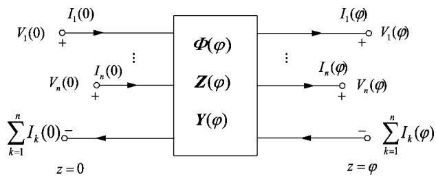  
图 1 MTL 的 2n 端口网络  
Fig．1 2n-port network of MTL

根据传输线始端 $z = 0$ 处、终端 $z = \varphi$ 处约束关系，通过相似变换对方程进行解耦，可得传输线两端$n$ 个电压构成的向量 V( 0) n 个电流构成的向量$\pmb { I } ( \mathbf { \kappa } _ { 0 } )$ 与 $n$ 个电压构成的向量 $V { \bigcirc } _ { \bigcirc } \setminus n$ 个电流构成的向量 $\pmb { I } ( \varphi )$ 间的关系式:

$$
\left[ \begin{array}{l} \boldsymbol {V} (\varphi) \\ \boldsymbol {I} (\varphi) \end{array} \right] = \left[ \begin{array}{l l} \boldsymbol {\Phi} _ {1 1} (\varphi) & \boldsymbol {\Phi} _ {1 2} (\varphi) \\ \boldsymbol {\Phi} _ {2 1} (\varphi) & \boldsymbol {\Phi} _ {2 2} (\varphi) \end{array} \right] \left[ \begin{array}{l} \boldsymbol {V} (0) \\ \boldsymbol {I} (0) \end{array} \right] \tag {3}
$$

其中， ${ \pmb { \phi } } _ { 1 1 } ( \varphi ) , { \pmb { \phi } } _ { 1 2 } ( \varphi ) , { \pmb { \phi } } _ { 2 1 } ( \varphi ) , { \pmb { \phi } } _ { 2 2 } ( \varphi ) $ 为 MTL 的链式参数矩阵。 上式各子阵计算结果如下:

$$
\left\{ \begin{array}{l} \boldsymbol {\Phi} _ {1 1} (\varphi) = \mathbf {Y} ^ {- 1} \cosh (\sqrt {\mathbf {Y Z}} \varphi) \mathbf {Y} \\ \boldsymbol {\Phi} _ {1 2} (\varphi) = - \mathbf {Z} _ {\mathrm {C}} \sinh (\sqrt {\mathbf {Y Z}} \varphi) \\ \boldsymbol {\Phi} _ {2 1} (\varphi) = - \sinh (\sqrt {\mathbf {Y Z}} \varphi) \mathbf {Y} _ {\mathrm {C}} \\ \boldsymbol {\Phi} _ {2 2} (\varphi) = \cosh (\sqrt {\mathbf {Y Z}} \varphi) \end{array} \right. \tag {4}
$$

其中， $\scriptstyle , \mathbf { Z } _ { \scriptscriptstyle \mathrm { C } } = \mathbf { Y } ^ { - 1 } { \sqrt { \mathbf { Y } \mathbf { Z } } } \ , \mathbf { Y } _ { \scriptscriptstyle \mathrm { C } } = { \sqrt { \mathbf { Y } \mathbf { Z } } } \mathbf { Z } ^ { - 1 }$ 分别为链参数矩阵的特征阻抗矩阵、特征导纳矩阵。

根据上述2n 端口网络计算结果，采用广义戴维南等效定理将2n 端口等效为集总 #型结构，如图2所示。

根据集总 π 型结构端口对应的电路拓扑，推导图2 所示的单位长度牵引网集总#型结构电路中链

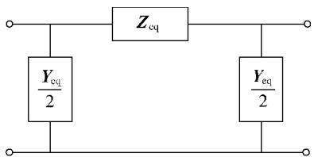  
图 2 集总 π 型结构  
Fig．2 Lumped π-type structure

式参数矩阵为:

$$
\left\{ \begin{array}{l} \mathbf {Z} _ {\mathrm {e q}} = - \boldsymbol {\Phi} _ {1 2} (\varphi) \\ \frac {\mathbf {Y} _ {\mathrm {e q}}}{2} = - \boldsymbol {\Phi} _ {1 2} ^ {- 1} (\varphi) \boldsymbol {\Phi} _ {1 1} (\varphi) + \boldsymbol {\Phi} _ {1 2} ^ {- 1} (\varphi) \end{array} \right. \tag {5}
$$

式( 5) 即为牵引网单位长度集总 #型 MTL 链参数模型，N 个集总部分串联构成整个牵引网传输线的链式参数模型 因此，计算牵引网各线路单位长度阻抗、导纳矩阵，代入上式即可得到牵引网 MTL链式集总 #型网络模型。

# 2 高速铁路车-网建模

我国高速铁路采用全并联AT 方式，其线路复杂，主要包括上下行接触线、负馈线、保护线、钢轨等，动车组由受电弓与接触线接触受流，通过列车接地系统由轮对回流至钢轨。 因此，对高速铁路车网建模主要包括牵引网和动车组接地回流系统两大部分。

# 2．1 牵引网单位长度线路参数计算

图3 为我国250 km/h 某客运专线牵引网导线安装数据( 单位为cm) ，表1 为牵引网导线主要参数。

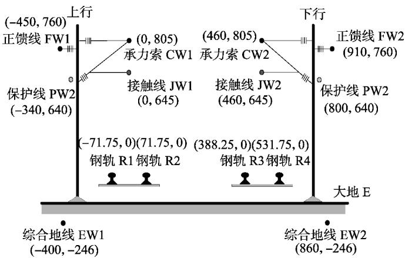  
图 3 牵引网导线分布  
Fig．3 Wire distribution in traction network   
表 1 牵引网导线参数表

Table 1 Wire parameters of traction network  

<table><tr><td>导体名称</td><td>导线符号</td><td>导线型号</td><td>导体计算半径/cm</td><td>直流电阻/ (Ω·km-1)</td></tr><tr><td>接触线</td><td>JW</td><td>CTS-150</td><td>0.72</td><td>0.15967</td></tr><tr><td>承力索</td><td>CW</td><td>JTMH-120</td><td>0.7</td><td>0.242</td></tr><tr><td>钢轨</td><td>R</td><td>60 kg</td><td>1.279</td><td>0.135</td></tr><tr><td>保护线</td><td>PW</td><td>LBJLJ-120/20</td><td>0.763</td><td>0.2382</td></tr><tr><td>综合地线</td><td>EW</td><td>DH-70</td><td>0.437</td><td>0.312</td></tr></table>

针对大地( 非良导体) 以上的架空导线，土壤电导率对其回路磁场产生一定影响。 为了准确建立较宽频率范围内的牵引网模型，本文采用 Dubanton 复镜像法对牵引网各架空导体进行电气参数计算。

根据图4 可得两架空导线的自阻抗及互阻抗计算公式如下:

$$
\left\{ \begin{array}{l} Z _ {k k} = \frac {\mathrm {j} \omega \mu_ {0}}{2 \pi} \ln \left[ \frac {2 \left(h _ {k} + p\right)}{r _ {k}} \right] \\ Z _ {k l} = \frac {\mathrm {j} \omega \mu_ {0}}{2 \pi} \ln \left(\frac {D _ {k l} ^ {\prime \prime}}{d _ {k l}}\right) \end{array} \right. \tag {6}
$$

其中， $, \mu _ { 0 }$ 为土壤磁导率，取 $4 \pi { \times } 1 0 ^ { - 7 } \mathrm { H } / \mathrm { m } ; p$ 为趋肤深度， $\mathbf { \nabla } _ { , p } = \left( \mathrm { \ j } \omega \mu _ { \mathrm { 0 } } \sigma _ { \mathrm { g } } \right) \mathbf { \nabla } ^ { - 1 / 2 } , \sigma _ { \mathrm { g } }$ 为土壤电导率，取 0．01 S /m 。

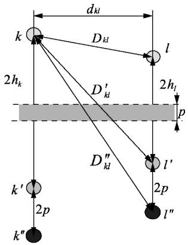  
图 4 趋肤深度 p 及导线 k、l 与其镜像间关系  
Fig．4 Relationship among skin depth p， wire k and l and their mirror image

参照文献［11］对牵引网线路单位长度阻抗矩阵 导纳矩阵进行计算，代入式( 4) 式( 5) 即可求得牵引网 MTL 链式参数矩阵。

# 2．2 CRH2 型动车组建模

CRH2 型动车组 1—4 号车体结构参数见图 5，5—8 号车体对称分布。 动车组车体全长 201．4 m，车身高3．7 m 宽 3．38 m，车顶高压电缆设置于 2 车到6 车之间，电缆跨接车厢采用电缆连接器相连，每段电缆屏蔽层采用单端接地，受电弓设于 4 车与 6车车顶。 动车组采用 4 动 4 拖编组形式，其中 2、3、6 7 为动车，其余为拖车。

CRH2 型动车组工作接地及保护接地均设置在

2、3、6、7 号车体［2］。 接地保护系统装置原理即将需要连接设备的端子通过接地电缆线连接至动车组齿轮箱的接地碳刷，接地碳刷与齿轮箱接地装置的滑动相接触由轮对将电流回流到钢轨，最终流入牵引变电所中。 其中，工作接地将车载变压器输出末端与工作接地碳刷相连，保护接地则通过保护接地碳刷接地。

综上分析，CRH2 型动车组建模主要包括车顶高压电缆、车体、接地系统 3 个部分，所建立等效模型如图6 中动车组模型所示。 根据电磁场理论，计算图6 中模型所需等值电气参数，并参考文献［22及部分实测数据，可得所建模型参数如表 2 所示。

表 2 CRH2 型动车组模型等值参数  
Table 2 Equivalent parameters of CRH2-type EMU model  

<table><tr><td>参数名称</td><td>参数计算值</td><td>参数名称</td><td>参数计算值</td></tr><tr><td>车顶电缆电阻</td><td>0.074 4 Ω/km</td><td>车体电感</td><td>0.009 2 μH/m</td></tr><tr><td>车顶电缆电感</td><td>0.000 503 H/km</td><td>车体连接电阻</td><td>0.002 Ω</td></tr><tr><td>车顶电缆电容</td><td>0.467 μF/km</td><td>接地电阻器电阻</td><td>0.5 Ω</td></tr><tr><td>车顶电缆对地电容</td><td>0.048 μF</td><td>碳刷等效电阻</td><td>0.02 Ω</td></tr><tr><td>每个车体电阻</td><td>0.047 Ω</td><td>碳刷连接电阻</td><td>0.01 Ω</td></tr></table>

表2 中，碳刷等效电阻为车体前轴或后轴工作接地碳刷及保护接地碳刷的等效电阻，分别为 $R _ { \mathrm { t } }$ 、$R _ { \mathrm { ~ t ~ } } ^ { \prime }$ ，即每个设有接地的车体均等效有 2 个泄流通道，其中前轴接地碳刷等效为一个，后轴接地碳刷等效为一个，电流经2、3、6、7 号车体，由每个车体的前轴 后轴接地系统流入钢轨，如2 车的 A B 两点

# 2．3 高速铁路车-网模型

动车组运行过程中，由于动车组各轮对通过不同位置的钢轨泄流点，因此牵引网链式参数模型需要考虑2、3、6、7 号车体轮对分布位置。 其中，2、3号车体前 后轴等效泄流轮对间相对距离参数见图5，6 7 车轮对之间参数与之相同，3 车后轴等效泄流轮对与 6 车前轴等效泄流轮对间距为 57．5 m，即CRH2 型动车组有8 个等效泄流点，分别对应图6 动车组模型中点 A—H，其相对距离依次为: $1 7 . 5 ~ \mathrm { m } ^ { - }$ $7 . 5 ~ \mathrm { m } { - 1 7 . 5 ~ \mathrm { m } { - 5 7 . 5 ~ \mathrm { m } { - 1 7 . 5 ~ \mathrm { m } { - 7 . 5 ~ \mathrm { m } { - 1 7 . 5 ~ \mathrm { m } { - 1 7 . 5 ~ \mathrm { m } } } } } } }$ ，共142．5 m。 因此，根据等效泄流轮对间间距进行划分，仅需要考虑车体方向对应牵引网 142．5 m 长的线路，即可以建立高速铁路车-网模型，如图6 所示

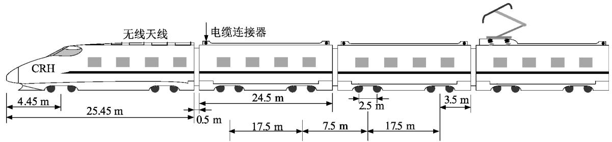  
图 5 CRH2 型动车组结构  
Fig．5 Structure of CRH2-type EMU

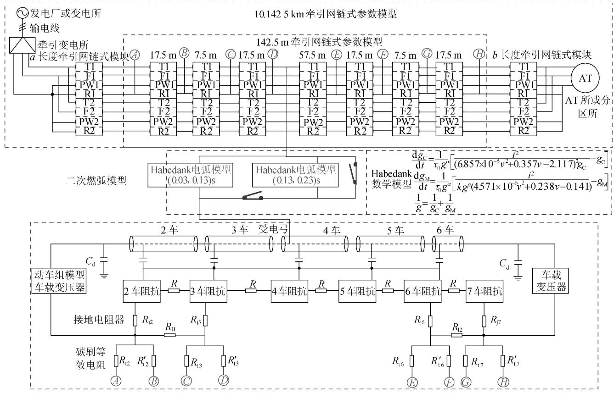  
图 6 计及二次燃弧的高速铁路车-网模型  
Fig．6 EMU-network model of high-speed railway considering second arcing

图6 中，高速铁路车-网模型包括牵引网链式模型及动车组模型两大部分

牵引网链式车-网建模考虑如下: 一般牵引变电所到 AT 所或分区所距离约为 10 km，动车组运行于线路任意位置均可能发生弓网离线燃弧现象。 首先，由式( 5) 计算参数建立 1 km 长的牵引网单位长度链式参数模型，分别组成线路长度为 a、b 的牵引网链式模块，其中 $a + b = 1 0 \ \mathrm { k m } ;$ 然后，考虑 CRH2 型动车组车体相对位置分布，即 8 个泄流轮对相对距离，建立142．5 m 长的牵引网链式参数模块; 最后，连接动车组8 个泄流点与 142．5 m 长的牵引网链式参数模块中对应钢轨位置，即图6 中A—H 相同标识对应相连接。 该模型既考虑牵引网各导线间的感性和容性耦合，更能反映实际 AT 供电各导体结构，同时结合动车组运行中轮对、受电弓、车体三者分布位置，不仅可以模拟动车组工频稳定运行工况下牵引网不同导线电压 电流分布，还可以模拟任意位置由于弓网多次燃弧对整个车网造成的电磁暂态影响。

# 3 计及二次燃弧工况的电弧特性仿真验证

高速列车运行过程中，随着速度提升，弓网离线率增高。 由于地面 接触线不平顺，以及电弧的不稳定性，高速动车组实际运行中常伴随多次燃弧现象。因此，本文针对动车组行驶过程中在任意位置处均

可能发生弓网一次燃弧熄灭再次重燃工况开展分析。

已有研究表明: Mayr 等效电弧模型主要适用于电流过零时的小电流情况; Cassie 电弧模型则适用于电流过零前大电流燃弧情况; Habedank 等效电弧模型是 Mayr 电弧模型与 Cassie 电弧模型的结合并加以修正，能较好地反映电弧特性，且能反映列车车速［16］。 因此。 本文采用 Habedank 等效电弧模型模拟实际高速运行中可能出现的燃弧现象，其中考虑动车组车速为 250 km/h 。 Habedank 等效数学模型如图6 所示。

根据 Habedank 等效电弧数学模型，在 MATLAB/Simulink 中建立 Habedank 等效电弧仿真模型，通过开关与电弧模型相配合，即可对弓网一次燃弧熄灭再次重燃现象的电弧特性曲线进行仿真 如图 6 中二次燃弧模型所示，弓网第一次燃弧设于 0．03 s 开始到0．13 s 结束，随后发生弓网再次重燃，即 0．13 s开始二次燃弧，0．23 s 二次燃弧熄灭 仿真结果如图7 所示。

从图7 可以看出，无论一次燃弧还是熄弧后再次重燃，电弧电流波形均存在零休现象，电压波形存在明显暂态波动，与文献［23-24］中国内外弓网电弧实验系统测试的电弧电气特性曲线基本一致。 因此，可认为以上基于高铁车-网模型开展计及 Habedank 等

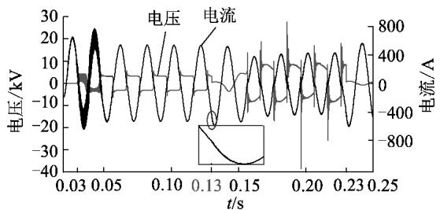  
图 7 弓网二次燃弧的电弧特性波形  
Fig．7 Characteristic waveform of pantograph-catenary second detachment arc

效燃弧影响的研究是有效的，即可以采用此仿真模型进行后文高速动车组弓网离线暂态研究。

此外，弓网电弧开始于 0．03 s 时刻，仿真电路模型中通过开关断开控制电弧模型与弓网连接，网络拓扑改变，导致 0．03～0．05 s 期间电弧电压、电流波形振荡，经过一个电弧周期，振荡消失，电弧基本稳定。 0．13 s 时刻一次燃弧熄灭，发生二次重燃过程，可以发现，电弧电压波形在过零点时刻，振荡更加明显，电流波形除了零休现象，也出现了暂态波动。 原因在于: 第一次发生弓网燃弧期间，可能导致牵引网电压产生一定振荡，若再次发生电弧重燃，由于牵引网电压未恢复正常，已畸变的牵引网电压波形继续与电弧电压、电流特性波形叠加，造成电弧特性波形振荡加剧。

# 4 计及弓网二次燃弧影响仿真研究

高速动车组弓网接触点随列车运行而动态变化。 由电弧特性波形可知，零休时刻所需维持燃弧的电压增大，若一次燃弧在零休时刻由于弓网离线距离增大使得弓网电势差不足以维持燃弧而熄灭，考虑动车组高速前进，弓网间隙缩小被击穿达到再次重燃条件，即发生弓网二次燃弧现象，依此反复，可能伴随多次燃弧。 高速铁路弓网多次燃弧可能会造成牵引网电压畸变，对电力系统造成谐波污染，若此电压经过受电弓进入车体，也可能造成车体电压、电流出现振荡现象。 为了更好地分析燃弧对牵引网及动车组的影响，基于图 6 建立的高速铁路车-网模型，仿真分析牵引网压变化及其对动车组车体电势影响，分别如图8、图9 所示。

图8( a) 为牵引网线路首端电压波形，分别对一次燃弧、二次燃弧时间段内引起的牵引网电压进行快速傅里叶变换( FFT) 分析，可得 2 种工况下谐波总畸变率分别为 1．52% 9．55%，同时对比无电弧情况下的波形，也可明显看出，一次燃弧对牵引网电压的影响并不明显，仅在电弧电流过零点附近牵引网电压有微弱的波动，电弧二次重燃后，牵引网电压产生明显畸变现象。 通过分析可知其原因如下: 一次燃弧产生的畸变电压在整个牵引网回路振荡期间，由于暂态畸变波形还未恢复，考虑牵引网回路的

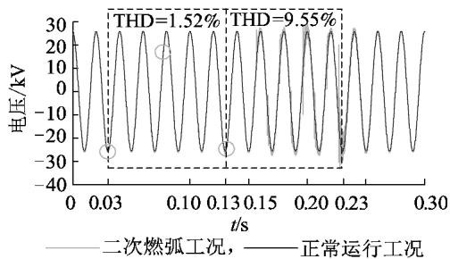

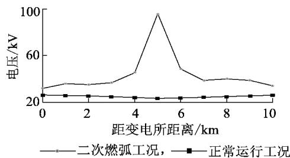  
(a）线路首端牵引网压波形  
(b）线路最大电压分布  
图 8 计及弓网二次燃弧的牵引网电压

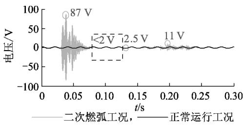  
Fig．8 Voltage of traction network considering secondary arcing of pantograph catenary   
图 9 动车组 2 号车体车顶-轮对电势差  
Fig．9 Potential difference from roof to wheel sets of NO．2 EMU bodywork

RLC 元件作用，再次燃弧将导致牵引网电压畸变更严重。 若电弧不断重复产生，注入列车的畸变电压在内部形成的 LC 电路中多次振荡，重复叠加，负荷将注入更多谐波电流，对车体内部设备及整个牵引网均易造成危害，因此，多次熄弧、燃弧将使得牵引网电压畸变更加严重 这与上述电弧特性波形分析结果一致。

图8( b) 为计及二次燃弧下的牵引网沿线最大过电压分布。 由于一次燃弧牵引网电压波形并不明显，与无电弧时的牵引网电压分布曲线基本一致，即动车组受流处牵引网电压有所降低，两端逐渐升高，这与文献［10］结果基本一致; 二次燃弧在动车所在位置处引起暂态过电压最大，高达 95 kV，然后沿线路两侧逐渐衰减，但根据图 8( a) ，牵引网首端仍有畸变分量，若进入电力系统，可能造成谐波污染 由此可推断，随着燃弧次数增加，过电压现象及谐波分量都将更加显著

图9 所示为以动车组 2 号车体为例，车顶至车轮对两端的电势差波形 国标 GB/T3805—93 《特低电压( ELV) 限值》规定干燥和潮湿环境下长时允许

的最大接触电压分别为 33 V、16 V［1］。 图9 中，动车组正常运行情况下保持稳态车体电势差为 1．5 V 左右; 第一次产生电弧时，车体电压剧烈振荡，达87 V，超出正常范围，随后慢慢恢复; 电磁暂态过程更加明显的二次燃弧发生时，最高暂态电压为11 V，在规定范围内。 通过分析可知其原因如下: 一次燃弧时弓网分离到间隙达到击穿电压产生电弧，相当于车体从与接触线分离到再连接的过程，线路拓扑结构在此期间发生2 次变化; 而二次燃弧在一次燃弧基础上重燃，即弓网通过电弧保持连接状态，但由于二次燃弧电弧特性随之改变，引起车体电势差改变，并无线路拓扑改变，因此二次燃弧振荡减小。

此外，燃弧造成的电磁暂态除了影响车体电势差，还影响动车组车体不同泄流轮对回流及不同轮对位置处轨电位。 利用本文所建立的模型还可以直接分析动车组接地车体中每个泄流点的电流大小，如图10 所示。

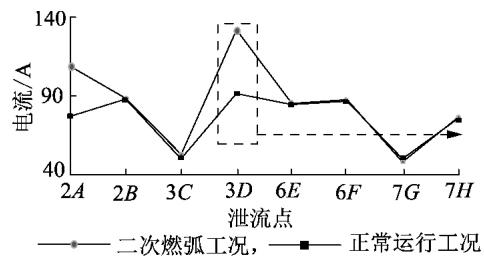  
(a)动车组泄流点最大电流分布

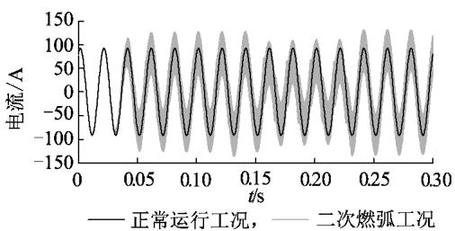  
(b)3D等效泄流点电流波形  
图 10 动车组泄流点电流  
Fig．10 Currents at discharge point of EMU

由图10( a) 可见，考虑二次燃弧工况下，对 2 车后半轴( 2B，其中 2 表示车体编号，B 表示车体泄流点，其他类似) 3 车前半轴( 3C) 6 车及 7 车泄流点最大电流值影响不大，主要影响 2 车前半轴( 2A) 和3 车后半轴( 3D) 因此，若以其中任一泄流点为分析对象，如3 车后半轴等效轮对，图 10( b) 仿真出 3车后半轴等效泄流点 2 种工况下的电流波形，从图中可以明显看出，一 二次燃弧均对该泄流点的电磁暂态产生影响，且差别不大。 由此可推测，弓网燃弧暂态电流主要由 2A、3D 这2 个泄流点泄放。

考虑动车组轮对通过与钢轨接触将电流回流至变电所过程中，由于一小部分电流通过钢轨可能会回流至其他车体，引起车体电位升高，因此，有必要对不同位置泄流轮对间电势差进行分析，即动车组

运行于某一位置处的轨电位差。 根据图 6 模型，动车组共8 个泄流点，即可仿真得到 7 组相邻泄流点间的最大电势差，如图11 所示。

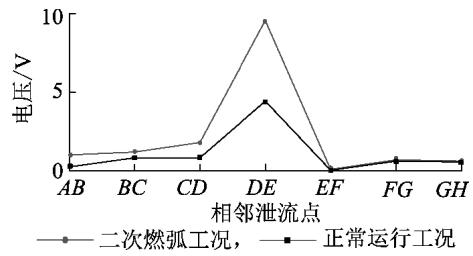  
图 11 泄流点最大电势差  
Fig．11 Maximum potential difference at discharge point

从图11 可以看出，计及电弧的轨电位电势差与正常运行工况相比，基本一致，二次燃弧产生暂态电流，导致沿钢轨分布的 DE 点电势有所增大，但差别基本可以忽略。 因此可以认为，二次燃弧不会导致较多的回流上车的现象。

# 5 结论

牵引网与动车组是高速铁路牵引供电回路的重要组成部分，为了更有效地全面分析实际高铁不同运行工况，本文从车、网两方面展开建模研究。 首先建立更精确的牵引网链式模型，该模型可同时适用于分析稳定工频及高频分量下牵引网各导线电压、电流变化; 然后根据实际 CRH2 型动车组接地系统，考虑动车组运行过程中轮对、钢轨、受电弓、接触网四者之间的相对位置关系; 最后建立完整的高铁车-网链式分析模型。 基于此模型，结合实际高速铁路弓网多次燃弧现象，本文开展弓网离线一次及二次燃弧对车、网的影响研究，仿真及对比验证可知，本文所建立的车-网模型可有效模拟高速铁路中稳定的工频工况及弓网离线期间一次燃弧和多次燃弧的电磁暂态现象，且弓网多次燃弧是造成牵引网暂态过电压 动车组接地回路暂态过电流 电力系统谐波污染的重要因素。

此外，本文所建立的仿真模型不受单一分析对象限制，既包含整个牵引网，又精确于动车组接地系统，可推广用于高铁动车组其他运行工况，如过分相，也可用于研究列车出站 进站等建模及其对整个电力系统影响。

# 参考文献:

［1］黄可，刘志刚，王英，等． 计及高速铁路站内工况的车体过电压分布特性分析［J］． 铁道学报，2016，38( 9) : 38-45．  
HUANG Ke，LIU Zhigang，WANG Ying，et al． Analysis on railcar ’ s body over-voltage distributional characteristics considering operating conditions of high-speed railway station ［J］． Journal of the China Railway Society，2016，38( 9) : 38-45．   
［2］高国强，刘耀银，万玉苏，等． 高速动车组升弓浪涌过电压研究［J］． ，2016，42( 9) : 2909-2915．

GAO Guoqiang，LIU Yaoyin，WAN Yusu，et al． Study of surge overvoltage when rising pantograph for high-speed electric multiple unit ［J］． High Voltage Engineering，2016，42( 9) : 2909-2915．   
［3］ GUO Xiaoxu，WEI Jianzhong，XU Long，et al． Study on electromagnetic transient condition of EMU passing by phase-separation with electric load in high-speed railway［J］． Energy and Power Engineering，2013，5( 4) : 1061．   
［4］许龙，崔艳龙，高仕斌，等． 动车组不分闸过分相时牵引变压器差动保护误动分析［J］． 电力自动化设备，2013，33( 4) : 105-109．  
XU Long，CUI Yanlong，GAO Shibin，et al． Transient stability calculation considering traction load model ［J］． Electric Power Automation Equipment，2013，33( 4) : 105-109．   
［5］ BRENNA M，FOIADELLI F． Sensitivity analysis of the constructive parameters for the 2×25-kV high-speed railway lines planning ［J］． IEEE Transactions on Power Delivery，2010，25( 3) : 1923-1931．   
［6］ CHOU C J，HSIAO Y T，WANG J L，et al． Distribution of earth leakage currents in railway systems with drain auto-transformers ［J］． IEEE Transactions on Power Delivery，2001，16( 2) : 271-275．   
［7］向川，刘志刚，张桂南，等． 基于多变量控制的高铁低频振荡过电压阻尼方法［J］． 电力自动化设备，2016，36( 8) : 63-69．  
XIANG Chuan，LIU Zhigang，ZHANG Guinan，et al． Research on the overvoltage damping of high-speed railway low frequency oscillation based on multivariable control［J］． Electric Power Automatic Equipment，2016，36( 8) : 63-69．   
［8］张桂南，刘志刚，向川． 交-直-交电力机车接入的牵引供电系统电压波动特性［J］． 电力自动化设备，2018，38( 1) : 121-128．  
ZHANG Guinan，LIU Zhigang，XIANG Chuan． Voltage fluctuation characteristics of traction power supply system considering AC-DC-AC electric locomotives accessed［J］． Electric Power Automation Equipment，2018，38( 1) : 121-128．   
［9］吴命利． 电气化铁道牵引网的统一链式电路模型［J］． 中国电，2010，30( 28) : 52-58．  
WU Mingli． Uniform chain model for traction network of electric railways［J］． Proceedings of the CSEE，2010，30( 28) : 52-58．   
［10］ CELLA R，GIANGASPERO G，MARISCOTTI A． Measurement of AT electric railway system currents and validation of a multi-conductor transmission line model［J］． IEEE Transactions on Power Delivery，2006，21( 3) : 1721-1726．   
［11］张桂南，刘志刚，郭晓旭，等． 高速铁路隧道及高架桥路段牵引网建模与分析［J］． 铁道学报，2015，37( 11) : 16-24．  
ZHANG Guinan，LIU Zhigang，GUO Xiaoxu，et al． Modeling and analysis of traction network of high-speed railway tunnel /viaduct sections ［J］． Journal of the China Railway Society，2015，37( 11) : 16-24．   
［12］王斌，高仕斌，黄文，等． 高速列车再生制动工况时牵引供电系统谐波传输特性分析［J］． 电网技术． 2014，38( 2) : 489-494．  
WANG Bin，GAO Shibin，HUANG Wen，et al． Analysis on harmonic transmission characteristics of traction power supply system during regenerative braking of high speed train［J］． Power System Technology，2014，38( 2) : 489-494．   
［13］ LEE H，LEE C，JANG G，et al． Harmonic analysis of the Korean high-speed railway using the eight-port representation model［J］． IEEE Transactions on Power Delivery，2006，21( 2) : 979-986．   
［14］刘磊，胡洋，张永波，等． CRH3 型动车组接地系统仿真分析与研究［J］． 铁道车辆，2016，54( 4) : 9-12．  
LIU Lei，HU Yang，ZHANG Yongbo，et al． Simulation analysis and

research on the grounding system for CRH3 multiple units［J］． Rolling Stock，2016，54( 4) : 9-12．   
［15］王忆莛． 高速动车组运行工况对车体回流的影响机制［D］． 成都: 西南交通大学，2016．  
WANG Yiting． The influence mechanism of high-speed EMU traction return current for operation conditions［D］． Chengdu: Southwest Jiaotong University，2016．   
［16］ WANG Ying，LIU Zhigang，MU Xiuqing，et al． An extended Habedank ’ s equation-based EMTP model of pantograph arcing considering pantograph-catenary interactions and train speeds［J］． IEEE Transactions on Power Delivery，2016，31( 3) : 1186-1194．   
［17］AHMETHODZIC A，KAPETANOVIC M，SOKOLIJA K，et al． Linking a physical arc model with a black box arc model and verification［J］． IEEE Transactions on Dielectrics and Electrical Insulation，2011，18( 4) : 1029-1037．   
［18］王晓远，高淼，赵玉双． 阻性负载下低压故障电弧特性分析［J］．电力自动化设备，2015，35( 5) : 106-110．  
WANG Xiaoyuan，GAO Miao，ZHAO Yushuang． Characteristic analysis of low-voltage arc fault in resistive load conditions［J］． Electric Power Automatic Equipment，2015，35( 5) : 106-110．   
［19］王尧，韦强强，葛磊蛟，等． 基于电弧电流高频分量的串联交流电弧故障检测方法［J］． 电力自动化设备，2017，37( 7) :191-197．  
WANG Yao，WEI Qiangqiang，GE Leijiao，et al． Series AC arc fault detection based on high-frequency components of arc current［J］． Electric Power Automation Equipment，2017，37( 7) : 191-197．   
［20］ LIN Guohua，ZHANG Yerong，ZHI Yongjian． Effects of pantograph arcing on railway systems with auto transformers［J］． Journal of Electromagnetic Waves and Applications，2013，27 ( 13 ) : 1686- 1693．   
［21］黄昌萍． 弓网离线对高速列车的影响分析［D］． 成都: 西南交通大学，2013．  
HUANG Changping． Effect of contact loss between the pantograph and catenary on the high-speed train［D］． Chengdu: Southwest Jiaotong University，2013．   
［22］刘东来． 高速动车组接地技术研究［D］． 成都: 西南交通大学，2013．  
LIU Donglai． Study on grounding technology of high-speed trains ［D］． Chengdu: Southwest Jiaotong University，2013．   
［23］ MIDYA S，BORMANN D，SCHUTTE T，et al． Pantograph arcing in electrified railways-mechanism and influence of various parameterspart Ⅱ : with AC traction power supply［J］． IEEE Transactions on Power Delivery，2009，24( 4) : 1940-1950．   
［24］王万岗，吴广宁，高国强，等． 高速铁路弓网电弧试验系统［J］．铁道学报，2012，34( 4) : 22-27．  
WANG Wangang，WU Guangning，GAO Guoqiang，et al． The pantograph-catenary arc test system for high-speed railways ［J］． Journal of the Chinese Railway Society，2012，34( 4) : 22-27．

# 作者简介:

  
宋小翠

宋小翠( 1993—) ，女，湖北襄阳人，硕士研究生，主要研究方向为电气化铁路车-网耦合暂态( E-mail: 13183857890@ 163．com) ;

刘志刚( 1975—) ，男，河南巩义人，教授，博士研究生导师，主要研究方向为信号处理与计算智能及在电力系统及轨道交通中的应用( E-mail: liuzg_cd@ 126．com)

# EMU-traction network modeling of high speed railway and electromagnetic transient influence considering secondary arcing of pantograph catenary

SONG Xiaocui，LIU Zhigang

( School of Electrical Engineering，Southwest Jiaotong University，Chengdu 610031，China)

Abstract: Aiming at the electromagnetic transient phenomenon caused by the pantograph catenary arcing of high speed railway，the research on EMU ( Electric Multiple Unit) -traction network modeling considering the secondary arcing is carried out based on the MTL( Multi-conductor Transmission Line) theory． The parameters of chain lumped #-type network matrix of traction network MTL under all-parallel AT( AutoTransformer) power supply mode are deduced． According to the structural parameters of CRH2-type EMU and the relative location and electrical parameters of vehicle，rail and traction network during the practical operation of EMU，the accurate simulation model of EMUtraction network with chain parameters is built on MATLAB /Simulink． The secondary arcing is taken as the research subject to simulate its influence on the traction network voltage，the electric potential of the car body，the discharge of the wheel，and the rail potential difference between the wheels，and the results show that the proposed model can effectively simulate the steady power frequency condition of the high speed railway and the electromagnetic transient phenomenon of the primary arcing and multiple arcing during off line of the pantograph catenary．

Key words: high speed railway; electric multiple unit; arc of off line pantograph catenary; electromagnetic transient; model buildings

( 上接第 88 页 continued from page 88)

# Critical node identification of power grid based on voltage anti-interference factors and comprehensive influence factors

WANG Xuandan1 ，LI Huaqiang1 ，LIAO Fengran2 ，LI Chunhai1 ，WANG Yujia3 ，LI Yan2

( 1． School of Electrical Engineering and Information，Sichuan University，Chengdu 610065，China;   
2． State Grid Yantai Electric Power Supply Company，Yantai 264003，China;   
3． State Grid Chengdu Electric Power Supply Company，Chengdu 610042，China)

Abstract: To solve the problems of existing node identification methods such as single evaluation and too one-sided selection of index weights，a multi-level and multi-angle power grid critical node identification method is proposed from aspects of anti-interference capability and comprehensive influence． Based on the operational reliability theory， the node voltage anti-interference factors under branch outage contingency are established，overcoming the shortage of traditional node anti-interference capability evaluation method which only considers load fluctuations． Based on the electrical betweenness and impact entropy of power flow，the topological structure influence factors considering the social property of nodes and operational status influence factors considering the capacity margin of branches are established，to characterize the effects of nodes comprehensively． The multiple indexes are evaluated comprehensively by grey relation projection model to obtain the rank of node importance degree，which considers both the subjective favoritism and objective information． Simulative results of IEEE 30-bus system and a practical area power network verify the scientificalness and completeness of the proposed method．

Key words: critical nodes; voltage anti-interference factors; comprehensive influence factors; static energy function; electrical betweenness; impact entropy of power flow; grey relation projection