Received 19 July 2022, accepted 2 August 2022, date of publication 16 August 2022, date of current version 22 August 2022.

Digital Object Identifier 10.1109/ACCESS.2022.3198677

# RESEARCH ARTICLE

# Transient Analysis on Multiphase Transmission Line Above Lossy Ground Combining Vector Fitting Technique in ATP Tool

JAIMIS SAJID LEON COLQUI 1, ANDERSON RICARDO JUSTO DE ARAÚJO1, TAINÁ FERNANDA GARBELIM PASCOALATO 2, SÉRGIO KUROKAWA 2, (Member, IEEE), AND JOSÉ PISSOLATO FILHO1

1School of Electrical and Computer Engineering, State University of Campinas-UNICAMP, Campinas 13083-852, Brazil   
2Department of Electrical Engineering, São Paulo State University-UNESP, Ilha Solteira 15385-000, Brazil

Corresponding author: Jaimis Sajid Leon Colqui (jaimis.leon@unesp.br)

This work was supported in part by the Coordenação de Aperfeiçoamento de Pessoal de Nível Superior (CAPES) under Grant 001; and in part by the São Paulo Research Foundation (FAPESP) under Grant 2019/01396-1, Grant 2020/10141-4, and Grant 2021/06157-5.

ABSTRACT Several approaches to calculate the ground-return impedance and admittance matrices are proposed in the literature. Carson’s approach assumes a lossy ground modeled by frequency-independent conductivity where displacement currents and non-perfectly conducting ground effects are neglected. However, Nakagawa’s approach considers both characteristics and also the frequency-dependent (FD) soil electrical parameters that can be incorporated into his formulations. This paper investigates the influence of Nakagawa’s approach and Carson’s approach on the transient responses using the ATP tool. First, the performances of the Bode’s method and Vector Fitting (VF) technique for approximating the characteristic impedance $\mathbf { Z } _ { \mathrm { c } } ( s )$ and propagation H(s) are also investigated for the JMarti’s line model. Then, lightninginduced voltages (LIVs) developed for a lightning striking at the shield wire of an overhead transmission line (OHTL) on a high-resistive FD soil are investigated. Results demonstrated a much higher accuracy using the VF for approximating $\mathbf { Z } _ { \mathrm { c } } ( s )$ and $H ( s )$ than Bode’s method. Transient voltages on the OHTL calculated with Nakagawa’s approach showed notable differences compared to those obtained with Carson’s approach. The voltage peaks are reduced when Nakagawa’s approach is utilized, especially when transmission lines are located on high-resistive soils.

INDEX TERMS Electromagnetic transient analysis, transmission lines, lightning-induced voltages, rational fitting techniques, frequency-dependent soil electrical parameters.

# I. INTRODUCTION

Computation of the transient responses on OHTLs depends on the adequate models to represent these components under disturbances in power systems [1]. In this context, the longitudinal impedance Z and transversal admittance Y matrices must take into account the frequency dependence on the soil electrical parameters and electric field penetration effect in the soil, especially when involving the lightning strikes on overhead power lines [2], [3], [4]. Besides that, the

The associate editor coordinating the review of this manuscript and D approving it for publication was Ali Raza

lightning-induced voltages (LIVs) may cause to temporary or permanent faults leading to outages in power lines [5].

JMarti’s line model [6] is incorporated in the Electromagnetic Transient Programs (EMTP)-type programs, such as ATP tool [7], the frequency-dependent (FD) characteristic impedance $\mathbf { Z } _ { \mathrm { c } }$ and wave propagation H matrices are approximated by rational functions using Bode’s method. This method uses real poles and zeros to synthesize the $\mathbf { Z } _ { \mathrm { c } }$ and H matrices which the zeros are enforced to be in left size of the complex plane. However, another fitting tool is the Vector Fitting (VF) technique developed by Gustavsen and Semlyen in [8] which presents a better accuracy in the rational approximation of the FD responses. The VF

synthesizes a FD response into a rational function based on its poles and residues [8]. As detailed by Bañuelos et al. in [9], the absolute deviation in the FD $\mathbf { Z } _ { \mathrm { c } }$ and H curves with VF technique are much lower than those computed using the Bode’s fitting method. In the EMTP-type programs, the ground-return impedance matrix $\mathbf { Z } _ { \mathrm { g } }$ is done by using Carson’s approach [10]. In this approach, he assumes that the lossy ground is modeled by frequency-independent conductivity where displacement currents are neglected (the relative permittivity is assumed to the same of the air) [10]. He also disregarded the non-perfectly conducting ground effect which is computed by the ground-return admittance [3], [10]. However, a more realistic approach must consider the frequency dependence of the soil electrical parameters (resistivity and permittivity) especially when high-resistive soils and highfrequency content phenomena (lightning discharges) are involved in the simulations [3]. Many authors have been dedicating their efforts to measure the FD ground parameters (resistivity and relative permittivity) with different methodologies in the last years such as [11], [12], [13], and [14]. In their works, the FD ground models consider the soil as a dispersive medium which takes into account the several polarization processes in the soil particles.

Based on the Wise’s work, Nakagawa in [4] provided a more realistic approach for the ground-return impedance and admittance, since the soil resistivity $\rho _ { \mathrm { g } }$ and relative permittivity $\varepsilon _ { \mathrm { r g } }$ were included in his formulations. Furthermore, Nakagawa’s approach allows that the FD soil electrical parameters be included in his expressions. Concerning the FD ground-return impedance and admittance, Nakagawa’s approach takes into account more realistic soil modeling and accurate OHTL representation in comparison with the formulas proposed by Carson. Many authors have considered the influence of the FD soil resistivity and relative permittivity on the transient responses such as [15], [16], and [17]. In these works, different approaches to compute the ground-return impedance are employed, however, no implementation in ATP program is carried out in details. In [15], [17], and [3], the authors carried out the transient analysis in time domain using Numerical Inverse Laplace Transform (NILT). On the other hand, non-linear components such as surge arresters and loads cannot be inserted in the OHTL using this approach. Besides that, a high number of frequency samples is required to obtain a good accuracy in the responses using the NILT which may demand high computational cost for the computation. In [18], an OHTL model was utilized to study the influence of the frequency effect on the soil parameters. In this work, only one- and two-phase distribution lines on high-resistive grounds were investigated where the FD soil parameters have a significant influence on the transient voltages generated by a lightning strike.

This paper investigates the influence of the Nakagawa’s approach in the JMarti’s line model to study the transient responses in power system. Furthermore, this work provides an updated tool to implement Nakagawa’s approach combined with the VF technique incorporated directly in the ATP

tool for transient analysis. Transient responses are computed for a OHTL subjected to lightning striking at the shield wire where the Carson’s approach and Nakagawa’s approach are used to compute the impedance and admittance matrices. The functions $Z _ { \mathrm { c } } ( s )$ and $H ( s )$ are calculated for a frequency range of 0.01 Hz up to 2 MHz. The OHTL is located on three different grounds whose low-frequency resistivities $( \rho _ { 0 } )$ of 1000, 3000 and 10,000 .m are used assuming that the soil is modeled by its frequency-dependent electrical parameters. It is shown that VF method presents a much higher accuracy when used to fit the $Z _ { \mathrm { c } } ( s )$ and $H ( s )$ . Results demonstrated that a significant difference with Nakagawa’s approach on the LIVs is obtained in comparison with those computed by Carson’s approach. Results indicated that FD soil electrical parameters must be considered for a precise transient analysis on OHTL generated for lightning strikes. As a contribution, this work provides an easy-to-implement model that can be integrated in any ATP tool that implements Nakagawa’s approach for the ground-return impedance and admittance to compute the transients directly in the time domain. This model does not employ any conversion tools from the frequency to time domain, such as NILT to assess the transient responses.

As advantages, this transmission line model can incorporate any ground-return approach such as Petterson, Noda, Nakagawa [19] combining with different type of electrical components (string of insulators, Line surge arresters and loads) to transient analysis. In this circuit representation, transient responses can be assessed for any disturbance (faults and lightning strikes). Besides that, many approaches for the soil models for frequency-dependent electrical parameters (resistivity and permittivity) can be considered for adequate transient analysis in power systems.

# II. PHASE-DOMAIN TRANSMISSION LINE MODELING

An OHTL of n conductors of length ` [km] can be generically represented as depicted in Fig. 1. The voltage V and current I are ruled by the Telegrapher’s equations relating the sending (k) and receiving (m) ends, in the frequency domain, as follows [6]

$$
\frac {d \boldsymbol {V} (\omega)}{d x} = - \boldsymbol {Z} (\omega) \boldsymbol {I} (\omega), \tag {1}
$$

$$
\frac {d \boldsymbol {I} (\omega)}{d x} = - \boldsymbol {Y} (\omega) \boldsymbol {V} (\omega), \tag {2}
$$

where x [km] is the horizontal distance from the sending end, ω [rad/s] is the angular frequency, Z(ω) [/km] is longitudinal impedance matrix and Y(ω) [S/km] is the transversal admittance matrix, in per-unit-length, given by

$$
\mathbf {Z} (\omega) = \mathbf {Z} _ {\mathrm {i}} (\omega) + \mathbf {Z} _ {\mathrm {e}} (\omega) + \mathbf {Z} _ {\mathrm {g}} (\omega), \tag {3}
$$

$$
\boldsymbol {Y} (\omega) = \left[ \boldsymbol {Y} _ {\mathrm {e}} ^ {- 1} (\omega) + \boldsymbol {Y} _ {\mathrm {g}} ^ {- 1} (\omega) \right] ^ {- 1}, \tag {4}
$$

where $\mathbf { Z } _ { \mathrm { i } } ( \omega ) , \mathbf { Z } _ { \mathrm { e } } ( \omega )$ and $\mathbf { \delta Z } _ { \mathrm { g } } ( \omega )$ are the internal, the external and the ground-return impedance matrices, respectively and $Y _ { \mathrm { e } } ( \omega )$ and $Y _ { \mathrm { g } } ( \omega )$ are the external and ground-return admittance matrices, respectively. Both Z(ω) and $Y ( \omega )$ are $n \times \ n$

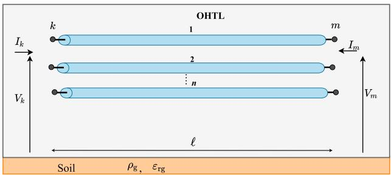  
FIGURE 1. Generic multiphase OHTL of length `.

matrices whereas $V ( \omega )$ and I(ω) are vectors of length $n \times 1$ . In order to find an analytical solution for V (ω) and I(ω), (1) and (2) are differentiated with respect to x and with some substitutions to eliminate one variable [20], it yields

$$
\frac {d ^ {2} \boldsymbol {V} (\omega)}{d x ^ {2}} = \boldsymbol {Z} (\omega) \boldsymbol {Y} (\omega) \boldsymbol {V} (\omega), \tag {5}
$$

$$
\frac {d ^ {2} \boldsymbol {I} (\omega)}{d x ^ {2}} = \boldsymbol {Y} (\omega) \boldsymbol {Z} (\omega) \boldsymbol {I} (\omega). \tag {6}
$$

The solutions for the currents and voltages related to the sending end k and receiving m end are given by [20]

$$
\boldsymbol {I} _ {\mathrm {k}} - \boldsymbol {Y} _ {\mathrm {c}} \boldsymbol {V} _ {\mathrm {k}} = - \boldsymbol {H} \left[ \boldsymbol {I} _ {\mathrm {m}} + \boldsymbol {Y} _ {\mathrm {c}} \boldsymbol {V} _ {\mathrm {m}} \right], \tag {7}
$$

$$
\boldsymbol {I} _ {\mathrm {m}} - \boldsymbol {Y} _ {\mathrm {c}} \boldsymbol {V} _ {\mathrm {m}} = - \boldsymbol {H} \left[ \boldsymbol {I} _ {\mathrm {k}} + \boldsymbol {Y} _ {\mathrm {c}} \boldsymbol {V} _ {\mathrm {k}} \right], \tag {8}
$$

where $V _ { \mathrm { { k } } }$ and $\boldsymbol { I _ { \mathrm { k } } }$ are the voltage and current vectors at the sending end k, $V _ { \mathrm { m } }$ and $I _ { \mathrm { m } }$ are the voltage and current vectors at the receiving end of the line m. The $Y _ { \mathrm { c } }$ and H are the characteristic admittance matrix function and wave propagation function, respectively, expressed by [20]

$$
\boldsymbol {Y} _ {\mathrm {c}} = \boldsymbol {Z} _ {\mathrm {c}} ^ {- 1} = \boldsymbol {Z} ^ {- 1} \sqrt {\boldsymbol {Z Y}}; \quad \boldsymbol {H} = e ^ {- \sqrt {Y Z} \ell}, \tag {9}
$$

where $\mathbf { Z } _ { \mathrm { c } }$ [] is the characteristic impedance matrix function. These equations establish the relation between the voltages and currents at both ends of a certain OHTL. For a n-phase OHTL, a modal decomposition can be applied as described in [21]. In the traditional JMarti’s line model [6], a real transformation matrix is used to decompose the n-phase OHTL into n independent lines, so-called propagation modes. Then, in each propagation mode, the modal functions $\mathbf { Z } _ { \mathrm { c } } ( s )$ and $H ( s )$ can be approximated by rational function as expressed in (10) and (11) using the following fitting method

$$
Z _ {\mathrm {c}} (s) \approx \sum_ {k = 1} ^ {N} \frac {c _ {\mathrm {k}}}{s - p _ {\mathrm {k}}} + d, \tag {10}
$$

$$
H (s) \approx \sum_ {k = 1} ^ {M} \frac {c _ {\mathrm {k}}}{s - p _ {\mathrm {k}}} e ^ {- s \tau}, \tag {11}
$$

where N and M are the fitting order number, $c _ { \mathrm { k } }$ is the residue, d is the constant term, pk is the pole, τ is the traveling time and $s = j \omega$ [rad/s] is the complex angular frequency. This fitting procedure is the Bode’s method, so-called the asymptotic approximation method, which consists of a numerical implementation of the graph technique using Bode’s diagram [22].

The traditional JMarti’s line model using Bode’s method is incorporated in the ATP tool using real poles to fit Zc(s) and H (s) with the Bode’s method [7], [9], [23], [24]. Another rational approximation tool is the Vector Fitting (VF) which has is very popular method due to its precision [8]. The VF method fits either measured or calculated FD responses into a rational function based on the pole-residue form using the using the least square approach. Then, a synthesized equivalent circuit is obtained [8], [25]. VF method utilizes real and/or complex conjugate poles to fit the FD responses. For this implementation in the ATP tool, the complex poles are replaced by real poles based on the non-predominance of complex poles for smooth functions and the fitting procedure must respect the conditions established in [8] and [24]. The performances of the Bode’s and VF’s methods were compared in [1] and [24], where lower deviations in the Zc(s) and $H ( s )$ are obtained using the VF.

# III. GROUND-RETURN IMPEDANCE AND ADMITTANCE

The ground-return effect on the longitudinal impedance Z(ω) and transversal admittance Y(ω) of a certain OHTL can be calculated by several approaches proposed in the literature as [4], [10], [15], [26], [27], and [28]. In this work, Carson’s approach and Nakagawa’s approach are described as follows.

# A. CARSON’s APPROACH

Carson was the first to investigate the ground-return impedance where he considered that infinite-length phase conductors are above ground modeled by frequencyindependent conductivity $\sigma _ { \mathrm { g } }$ and neglected the displacement currents in this medium [3], [10]. The self and mutual ground-return impedance elements are given by

$$
Z _ {\mathrm {g} _ {\mathrm {i i}}} (\omega) = j \frac {\omega \mu_ {0}}{\pi} \int_ {0} ^ {\infty} \frac {e ^ {- 2 h _ {\mathrm {i}} \lambda}}{\lambda + \sqrt {\lambda^ {2} + j \omega \mu_ {0} \sigma_ {\mathrm {g}}}} d \lambda , \tag {12}
$$

$$
Z _ {\mathrm {g} _ {\mathrm {i j}}} (\omega) = j \frac {\omega \mu_ {0}}{\pi} \int_ {0} ^ {\infty} \frac {e ^ {- (h _ {\mathrm {i}} + h _ {\mathrm {j}}) \lambda}}{\lambda + \sqrt {\lambda^ {2} + j \omega \mu_ {0} \sigma_ {\mathrm {g}}}} \cos \left(r _ {\mathrm {i j}} \lambda\right) d \lambda , \tag {13}
$$

where $\omega ~ = ~ 2 \pi f$ [rad/s] is the angular frequency, f [Hz] is the frequency, $\mu _ { 0 }$ is the vacuum magnetic permeability $\mu _ { 0 } = 4 \pi \times 1 0 ^ { - 7 }$ H/m, $h _ { \mathrm { i } }$ and $h _ { \mathrm { j } }$ [m] are the conductor’s height above the soil, $\sigma _ { \mathrm { g } }$ [S/m] is the soil conductivity, $r _ { \mathrm { i j } }$ [m] is the distance between the conductors. Due to the presence of the improper integrals, (12) and (13) can be expanded in terms of infinite series [10] which are implemented into most of the EMTP-like simulators.

# B. NAKAGAWAS’s APPROACH

Nakagawa proposed other equations to calculate groundreturn impedance in 1981 [4]. It is assumed an infinite-length phase conductors running on lossy ground, however, an correction factor given by $j \omega \varepsilon _ { \mathrm { g } } , ( \varepsilon _ { \mathrm { g } } = \varepsilon _ { \mathrm { r g } } \varepsilon _ { 0 } )$ must be inserted in the complex function of the self and mutual ground-return

impedance formulas, as follows [4]

$$
Z _ {\mathrm {g} _ {\mathrm {i i}}} (\omega) = j \frac {\omega \mu_ {0}}{\pi} \int_ {0} ^ {\infty} \frac {e ^ {- 2 h _ {\mathrm {i}} \lambda}}{\alpha_ {1} + \lambda} d \lambda , \tag {14}
$$

$$
Z _ {\mathrm {g} _ {\mathrm {i j}}} (\omega) = j \frac {\omega \mu_ {0}}{\pi} \int_ {0} ^ {\infty} \frac {e ^ {- (h _ {\mathrm {i}} + h _ {\mathrm {j}}) \lambda}}{\alpha_ {1} + \lambda} \cos \left(r _ {\mathrm {i j}} \lambda\right) d \lambda , \tag {15}
$$

with the term $\alpha _ { 1 }$ and the propagation constants of the soil $\gamma _ { \mathrm { g } }$ and air $\gamma _ { \mathrm { a } }$ are given by

$$
\alpha_ {1} = \sqrt {\lambda^ {2} + \gamma_ {\mathrm {g}} ^ {2} - \gamma_ {\mathrm {a}} ^ {2}}, \tag {16}
$$

$$
\gamma_ {\mathrm {g}} ^ {2} = j \omega \mu_ {0} \left(j \omega \varepsilon_ {\mathrm {r g}} \varepsilon_ {0} + \sigma_ {\mathrm {g}}\right); \quad \gamma_ {\mathrm {a}} ^ {2} = - \omega^ {2} \mu_ {0} \varepsilon_ {0}, \tag {17}
$$

where $\varepsilon _ { 0 }$ is the vaccum permittivity $\varepsilon _ { 0 } = 8 . 8 5 \times 1 0 ^ { - 1 2 }$ [F/m]. Assuming that the ground is not a perfect conductive medium, the potential at the surface of the ground is not expected to be equal to zero [4]. Due to the electric field penetrating in the ground, there should be corrections on shunt admittances, even though these factors might be small [3], [4], [26].

Then, the self and mutual ground-return admittance elements are given by

$$
P _ {\mathrm {g} _ {\mathrm {i i}}} (\omega) = \frac {1}{\pi \varepsilon_ {0}} \int_ {0} ^ {\infty} \frac {e ^ {- 2 h _ {\mathrm {i}} \lambda}}{\left(\lambda \gamma_ {\mathrm {g}} ^ {2} / \gamma_ {\mathrm {a}} ^ {2} + \alpha_ {1}\right)} d \lambda , \tag {18}
$$

$$
P _ {\mathrm {g} _ {\mathrm {i j}}} (\omega) = \frac {1}{\pi \varepsilon_ {0}} \int_ {0} ^ {\infty} \frac {e ^ {- (h _ {\mathrm {i}} + h _ {\mathrm {j}}) \lambda}}{\left(\lambda \gamma_ {\mathrm {g}} ^ {2} / \gamma_ {\mathrm {a}} ^ {2} + \alpha_ {1}\right)} \cos \left(r _ {\mathrm {i j}} \lambda\right) d \lambda , \tag {19}
$$

where $Y _ { \mathrm { g } } ( \omega ) = j \omega P _ { \mathrm { g } } ^ { - 1 } ( \omega )$ .

# C. METHODOLOGY TO FIT THE FUNCTIONS $Z _ { \mathsf { C } }$ AND H

The steps to carry out the frequency and time-domain simulations using Bode’s and Vector Fitting’s methods are described in Fig. 2-(a) and Fig. 2-(b), respectively.

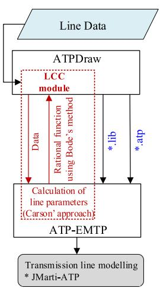  
(a)

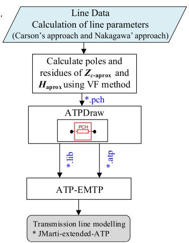  
(b)   
FIGURE 2. Flow-cart to the: (a) classical JMarti-ATP and (b) extended JMarti.

As shown in Fig. 2-(a), the pre-processor is employed to generate the files to enter the ATP tool. Using the module

LCC, the parameters of the line and of the soil are chosen. Then, the routine LINE CONSTANTS computes the line parameters where the Carson’s approach is employed to compute the ground-return impedance. This routine also compute automatically the rational functions $\mathbf { Z } _ { \mathrm { c } } ( s )$ and H (s) employing the Bode’s method with the JMarti’s line model. Once all these elements are computed and a test case is compiled, two types of files are generated (*.lib and *.atp) which are included in the ATP tool and the voltages and currents can be calculated in time domain.

As shown in Fig. 2-(b), the transient responses are computed using the JMarti’s line model employing the Vector Fitting’s method. In this case, the OHTL is inserted and its line parameters are computed using with an external code and the ground-return impedance can be calculated using the either Carson’s or Nakagawa’s models. Then, the rational functions $\mathbf { Z } _ { \mathrm { c } } ( s )$ and H(s) are fitted by the VF method where the poles and residues of this procedure are included in ATPdraw using a *.pch file. This extended JMarti model is directly implemented in the ATP tool which is a updated tool for this program.

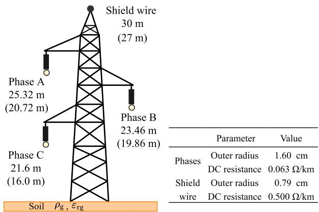

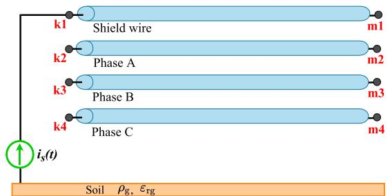  
  
(b)   
FIGURE 3. Multiphase OHTL for the simulations: (a) Line configuration and (b) Line subjected to the lightning strike at the shield wire with open-circuit receiving end.

# IV. NUMERICAL RESULTS

# A. PERFORMANCE OF THE RATIONAL FITTING METHODS

To investigate the performance of the Bode and VF methods for fitting the $Z _ { \mathrm { c } } ( s )$ and $H ( s )$ , in each propagation mode, an OHTL with length ` of 100-km depicted in Fig. 3-(a) is employed for the simulations. The conductor heights and

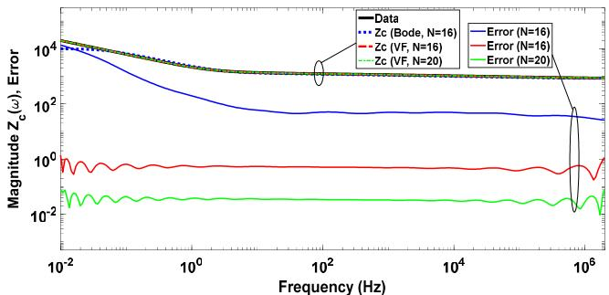  
(a) Characteristic impedance $Z _ { \mathrm { c } }$ for the phase A

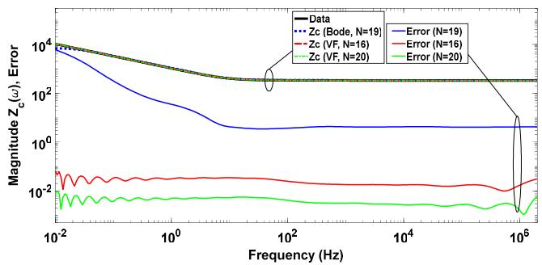  
(c) Characteristic impedance Zc for the phase B

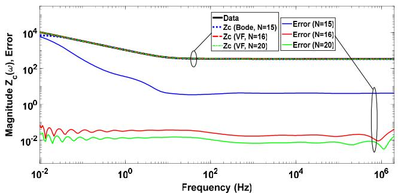  
(e) Characteristic impedance $\boldsymbol { z } _ { \mathrm { c } }$ for the phase C

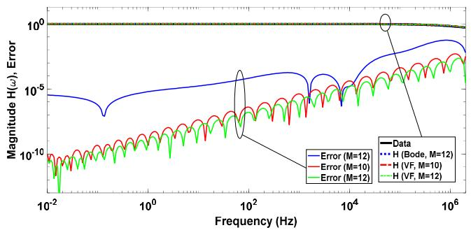  
(b) Propagation function H for the phase A

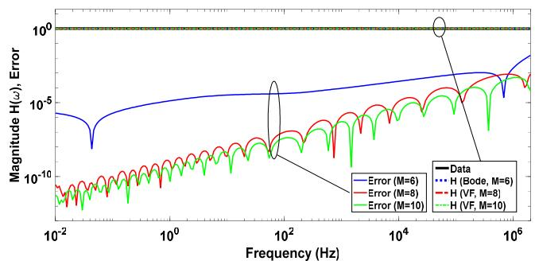  
(d) Propagation function H for the phase B

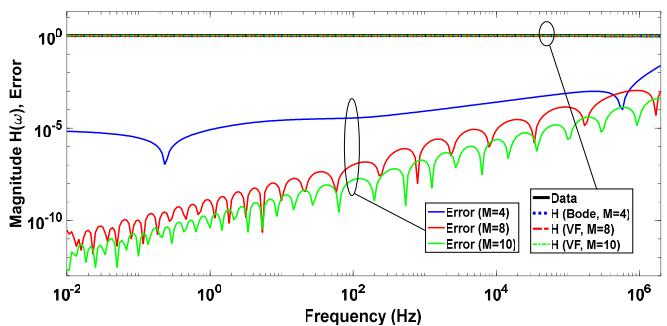  
(f) Propagation function H for the phase C   
FIGURE 4. Characteristic impedance $\mathbf { z _ { c } }$ (left-hand side column) and wave propagation function H (right-hand side column) for the OHTL from Fig. 3-(a) on a soil of $\rho _ { 0 } = 3 \mathrm { k } \Omega . \mathrm { m }$ .

mid-span values, shown in parentheses, are indicated. For these simulations, the OHTL on a soil with the low-frequency resistivity $( \rho _ { 0 } = \sigma _ { 0 } ^ { - 1 } )$ of 3 k.m for frequency range of 0.01 Hz to 2 MHz is considered.

The functions in (9) are computed with ATP tool and labeled here as Data (black line). They are assumed as the reference functions where the errors with the fitting methods are calculated. The fitted $Z _ { \mathrm { c } } ( s )$ for each phase (A, B and C) computed for Carson’s approach and using Bode and VF methods for different values of poles (N ) and its respective error is plotted in Fig. 4 (on the left-hand side column). It can be seen that the $Z _ { \mathrm { c } } ( s )$ has presented good agreement for the VF method for all frequency range, as the errors are much lower, especially from 0.01 Hz to 500 Hz, when compared with those provided by Bode’s method (blue lines). Furthermore, the VF method with N = 20 poles has presented the lowest error in this frequency range.

The function H (s) fitted for both methods is plotted in Fig. 4 (on the right-hand side). It is seen that VF method using M poles has provided the lowest error in comparison

with those calculated using the Bode’s method in practically all frequency range (red and green lines). As general observation, the VF method has improved considerably the approximation of the $Z _ { \mathrm { c } } ( s )$ and H(s) in relation to the Bode’s method which may lead to significant deviation (errors) during the approximation procedure and inaccuracies in the time domain responses. Using the optimization algorithms, the numbers of poles in each frequency function (N and M) can be determined in order to have the lowest error in the Vector Fitting method.

# B. FITTING THE OHTL PARAMETERS

The OHTL is located on a FD ground where the soil conductivity $\sigma _ { \mathrm { g } } ( f )$ and relative permittivity $\varepsilon _ { \mathrm { r g } } ( f )$ were computed by the Alípio and Visacro’s [11], given by

$$
\sigma_ {\mathrm {g}} (f) = \sigma_ {0} + \sigma_ {0} \times h (\sigma_ {0}) (f / 1 \mathrm {M H z}) ^ {\xi}, \tag {20}
$$

$$
\varepsilon_ {\mathrm {r g}} (f) = \varepsilon_ {\mathrm {r} \infty} + \frac {\tan (\pi \xi / 2) \times 1 0 ^ {- 3}}{2 \pi \varepsilon_ {0} (1 \mathrm {M H z}) ^ {\xi}} \sigma_ {0} \times h \left(\sigma_ {0}\right) f ^ {\xi - 1}, \tag {21}
$$

where $\sigma _ { 0 }$ is the low-frequency conductivity in [mS/m], $\varepsilon _ { \mathrm { r g } }$ is the relative permittivity in [F/m], $\varepsilon _ { \mathrm { r \infty } }$ is the relative permittivity at higher frequencies. In these simulations, the values of: $\xi = 0 . 5 4 , \varepsilon _ { \mathrm { r } \infty } = 1 2$ and $h ( \sigma _ { 0 } ) = 1 . 2 6 \mathrm { x } \sigma _ { 0 } ^ { - 0 . 7 3 }$ are adopted. The matrices Z and Y can be expressed as follows

$$
\mathbf {Z} (\omega) = \mathbf {Z} _ {\mathrm {i}} (\omega) + \mathbf {Z} _ {\mathrm {e}} (\omega) + \mathbf {Z} _ {\mathrm {g}} (\omega) = \left[ R _ {\mathrm {i j}} + j \omega L _ {\mathrm {i j}}, \right] _ {n \times n} \tag {22}
$$

$$
\boldsymbol {Y} (\omega) = \left[ \boldsymbol {Y} _ {\mathrm {e}} ^ {- 1} (\omega) + \boldsymbol {Y} _ {\mathrm {g}} ^ {- 1} (\omega) \right] ^ {- 1} = j \omega \left[ C _ {\mathrm {i j}}, \right] _ {n \times n} \tag {23}
$$

where $R _ { \mathrm { i j } } , \ L _ { \mathrm { i j } }$ and $C _ { \mathrm { i j } }$ are the equivalent p.u.l resistance, inductance and capacitance, respectively. The indexes i and j varies from 1 to n (n = 4 in this work). The procedure to compute the matrices Z and Y are described in [17]. These equivalent series parameters $( R _ { \mathrm { i j } }$ and $L _ { \mathrm { i j } } )$ are calculated using the approaches proposed by:

• Carson (CA) with no displacement currents [10];   
• Nakagawa (NA) with $\rho _ { \mathrm { g } } ( f )$ and $\varepsilon _ { \mathrm { r g } } ( f ) \left[ 4 \right]$ .

The equivalent shunt $C _ { \mathrm { i j } }$ computed by Carson (CA) uses only the term $Y _ { \mathrm { e } }$ in (24) employing frequency-constant soil resistivity $\rho _ { \mathrm { g } } .$ On the other hand, the shunt $C _ { \mathrm { i j } }$ calculated with Nakagawa (NA) includes the ground-return admittance $Y _ { \mathrm { g } }$ assuming frequency-dependent soil parameters $\rho _ { \mathrm { g } } ( f )$ and $\varepsilon _ { \mathrm { r g } } ( f )$ in (23). The conductance is neglected in this analysis. To compute these line parameters, three different soils with low-frequency resistivities $( \rho _ { 0 } )$ of 1000, 3000 and 10,000 .m for a frequency range of 0.01 Hz and 2 MHz. Furthermore, the percentage deviation δ(%) is given by

$$
\delta_ {\mathrm {R}, \mathrm {L}, \mathrm {C}} (f) = \frac {p _ {\mathrm {ij}} ^ {\mathrm {CA}} - p _ {\mathrm {ij}} ^ {\mathrm {NA}}}{p _ {\mathrm {ij}} ^ {\mathrm {CA}}} \times 100 \%, \tag{24}
$$

where $p _ { \mathrm { i j } }$ can be the resistance (R), inductance (L) or capacitance (C). The elements $( R _ { 1 1 } , \ R _ { 2 3 } , \ R _ { 4 4 } )$ and $( L _ { 1 1 } , \ L _ { 2 3 }$ , $L _ { 4 4 } )$ for the p.u.l. resistances and inductances are shown in Figs. 5 and 6, respectively. For a frequency range of 0.01 Hz to few hundreds of Hz, the resistance and inductance elements computed by both approaches present a good agreement, as confirmed by deviation curves plotted in Fig. 5-(d) and Fig. 6-(d). However, above a certain frequency, the FD $\rho _ { \mathrm { g } } ( f )$ and $\varepsilon _ { \mathrm { r g } } ( f )$ assume notable values which result in significant resistance R and inductance L computed with Nakagawa (NA) compared to those calculated with Carson (CA), resulting in a pronounced deviation as depicted in Fig. 5-(d) and Fig. 6-(d) at the high frequencies (around 50% and 30%, respectively for the soil of 10 km). This occurs due to the fact that in the Carson’s approach, the displacement currents are neglected and in the Nakagawa’approach these currents are included as seen in the (16) and (17). Then, at high frequencies, the soil is into a transition region between conductor and insulator medium which the effect of the displacement currents is significant. The capacitance $C _ { 1 1 } , \ C _ { 2 3 }$ and $C _ { 4 4 }$ are plotted considering the ground-return admittance with Nakagawa (NA) are shown in Fig. 7. As seen, the capacitance with both approaches has presented the lowest deviation, especially at the high frequencies, showing that the FD $\rho _ { \mathrm { g } } ( f )$ and $\varepsilon _ { \mathrm { r g } } ( f )$ have a small influence on this line parameter.

# C. TIME-DOMAIN RESPONSES

The influence of the rational approaches using the Bode and VF methods incorporated into JMarti’s line model, for the transient voltages developed on the 100-km OHTL for a lightning strike is investigated. For this, an OHTL located on a FD lossy ground with low-frequency resistivities of 1000, 3000 and 10,000 .m were considered. The ground-return impedance is calculated with the approaches of Carson (CA) and Nakagawa (NA). The lightning strikes at the shield wire as depicted in Fig. 3-(b). The injected current is 45-kA lightning first return stroke (see Fig. 2-(a) and Table 1 in paper [29]). The transient responses are calculated by three different scenarios (S), as follows:

• S1: JMarti’s model with the Carson’s approach and fitted with Bode’s method-labeled as ‘‘JMarti-Carson (Bode)’’.   
• S2: JMarti’s model with with the Carson’s approach and fitted with Vector Fitting’s method-labeled as ‘‘JMarti-Carson $\mathrm { ( V F ) } ^ { \mathrm { , } }$   
• S3: JMarti’s model with the Nakagawa’s approach and fitted with Vector Fitting’s method-labeled as ‘‘JMarti-Nakagawa (VF)’’

The developed voltages on the shielding wire and the LIVs generated on the phases A, B and C at the receiving ends (m1, m2, m3 and m4) are plotted in Figs. 8, 9 and 10, respectively. The percentage deviation δ(t) for the simulations are calculated by

$$
\delta (t) = \frac {v (t) _ {\mathrm {B o d e}} - v (t) _ {\mathrm {C A , N A}}}{v (t) _ {\mathrm {B o d e}}} \times 100 \%, \tag{25}
$$

where $\nu ( t ) _ { \mathrm { B o d e } }$ is the voltage with Bode’s method and v(t) is the voltage using the VF method with Carson (CA) or Nakagawa (NA). The percentage deviation is added to scenario as depicted in Figs. 8, 9 and 10.

The generated voltages on the shield wire have presented similar results for the three different approaches, where the peak value is around 18.4 MV, as seen in Figs. 8-(a), 9-(a) and 10-(a). The percentage deviation in these cases are lower than 2% showing that the generated voltages at the shield wires are not significantly affected by the FD $\rho _ { \mathrm { g } } ( f )$ and $\varepsilon _ { \mathrm { r g } } ( f )$ parameters. However, the LIVs are dependent on the approach and on the ground electrical parameters $\rho _ { \mathrm { g } } ( f )$ and $\varepsilon _ { \mathrm { r g } } ( f )$ . The LIVs in phase A is higher due to the shorter distance to the shield wires and higher coupling between the phase A and the shield wire. On the other hand, LIVs at the phase C are the lowest due to the highest distance from the shield wire. Furthermore, the highest percentage deviation δ(t) (black line) is seen for the soil of 10 k.m reaching around 10% considering the Nakagawa’s approach with the VF method (see Fig. 10-(b) and 10-(d)). To analyze the difference between these two Carson (CA) and Nakagawa (NA) approaches, the voltage peaks are organized in Table 1, which the relative variation 1V(%) is calculated

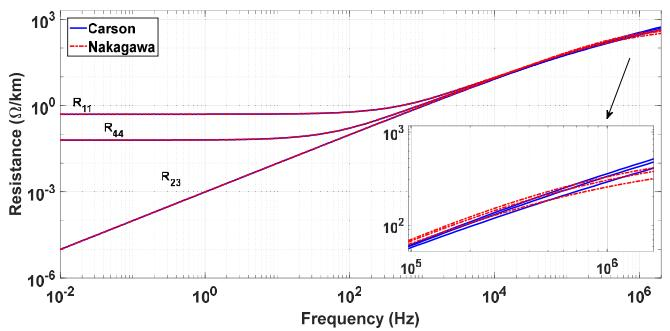  
(a)

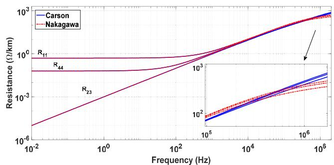  
(b)

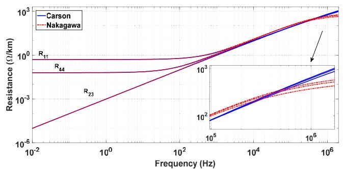  
（c）

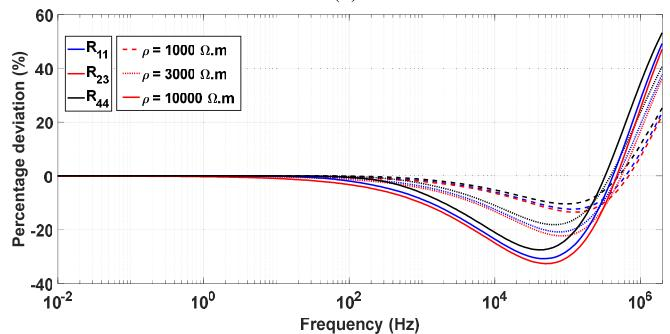  
(d)

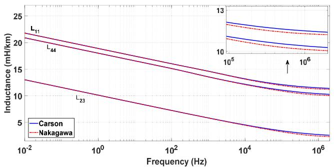  
FIGURE 5. Resistance (/km) for the studied soils: (a) 1 k.m (b) 3 k.m (c) 10 k.m (d) percentage deviation.   
(a)

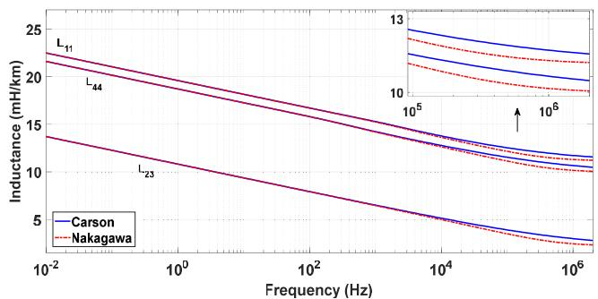  
(b)

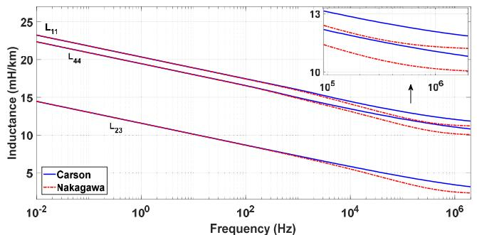

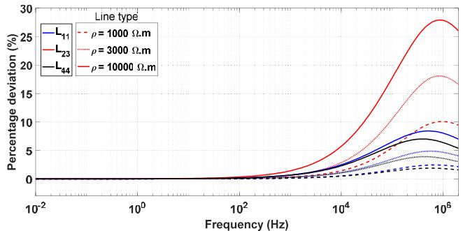  
(d)   
FIGURE 6. Inductance (H/km) for the studied soil: (a) 1 k.m (b) 3 k.m (c) 10 k.m (d) percentage deviation.

for each soil. The 1V(%) is computed as follows

$$
\Delta V (\%) = \left| \frac {V _ {\mathrm {S} 1} ^ {p} - V _ {\mathrm {S} 2 , \mathrm {S} 3} ^ {p}}{V _ {\mathrm {S} 1} ^ {p}} \right| \times 100 \%, \tag{26}
$$

where $V _ { \mathrm { S 1 } }$ is the voltage peak for the computed at the scenario S1 and $V _ { \mathrm { S } 2 , \mathrm { S } 3 }$ is the voltage peak for scenarios S2 or S3. It can be noted from this table that the $\Delta \mathrm { V } ( \% )$ increases as the soil resistivity increases. The highest $\Delta \mathrm { V } ( \% )$ is obtained for the soil resistivity of 10 k.m which results in

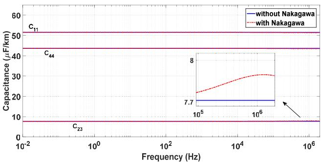  
(a)

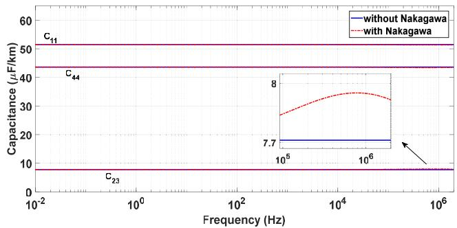  
(b)

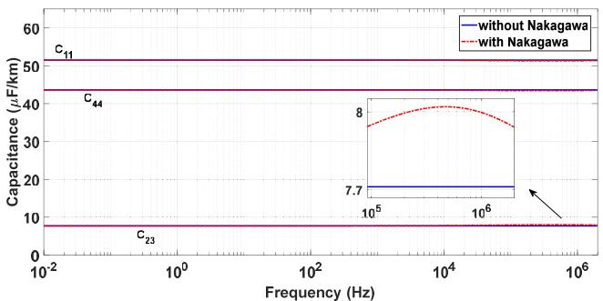  
(c)

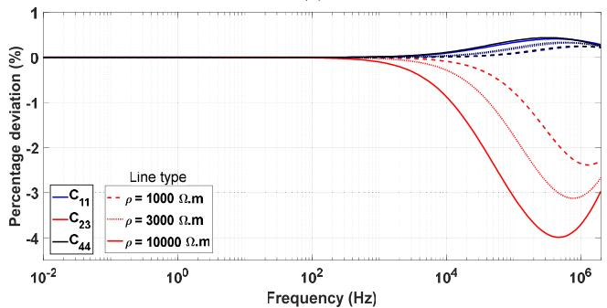  
(d)

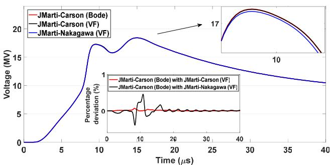  
FIGURE 7. Capacitance (µF/km) for the studied soils: (a) 1 k.m (b) 3 k.m (c) 10 k.m (d) percentage deviation.   
(a)

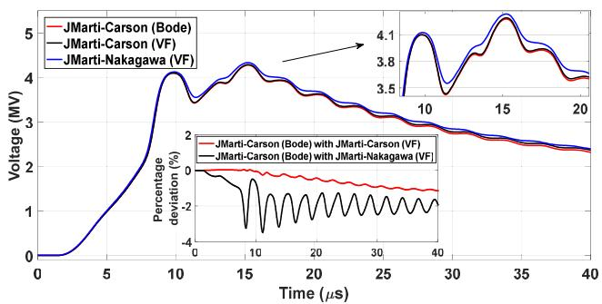  
(b)

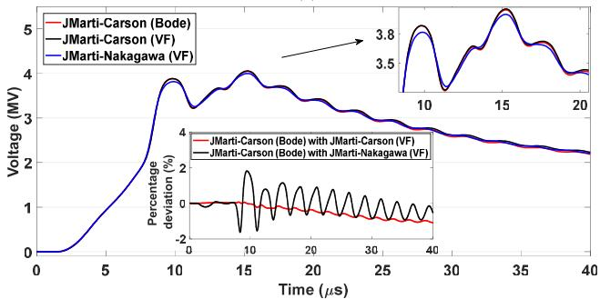

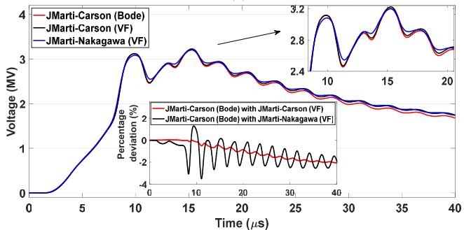  
(d)   
FIGURE 8. Transient voltage $v _ { \mathrm { m } } ( t )$ generated by the lightning strike for a soil of 1 k.m: (a) shield wire (b) phase A (c) phase B and (d) phase C.

a relative variation of 9.917% at the phase A. This notable variation is due to pronounced influence of the frequency on the soil electrical parameters especially at high-resistive grounds [30]. Carson’s approach has been used to assess ground-return impedance in the transmission line models

available in most of the EMTP-like simulators. Based on the simulations of this paper, Carson’s approach may lead to inaccuracies in the transient responses, especially when lightning strikes are involved in the simulations. These differences may either overestimate the insulation design of the

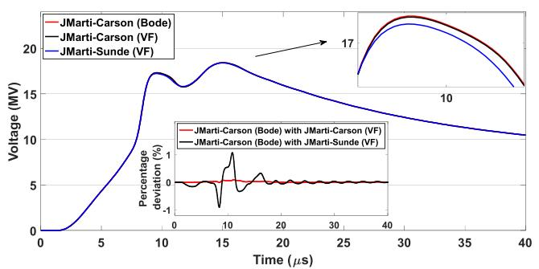  
(a)

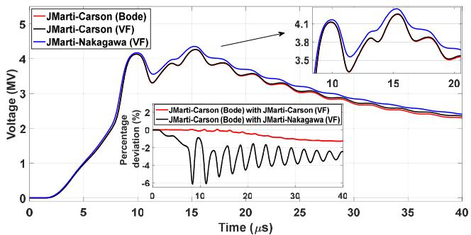  
(b)

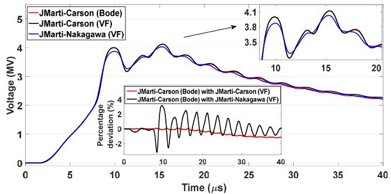  
（c）

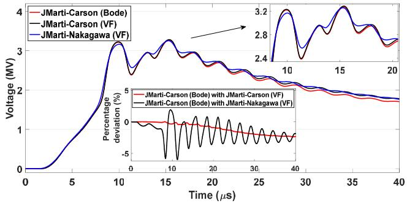  
(d)

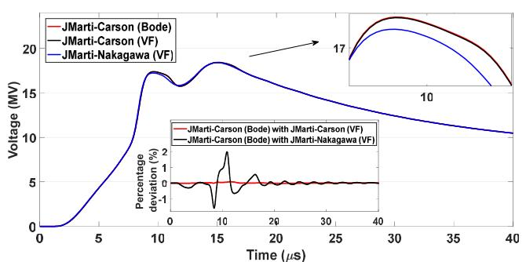  
FIGURE 9. Transient voltage $v _ { \mathrm { m } } ( t )$ generated by the lightning strike for a soil of 3 k.m: (a) shield wire (b) phase A (c) phase B and (d) phase C.   
(a)

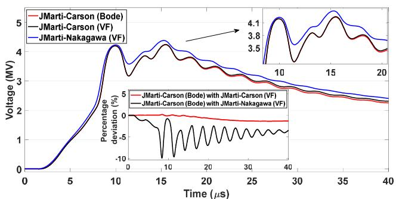  
(b)

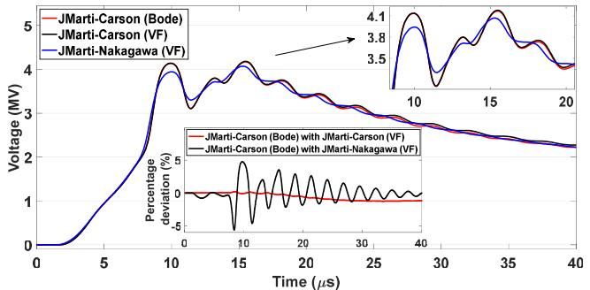

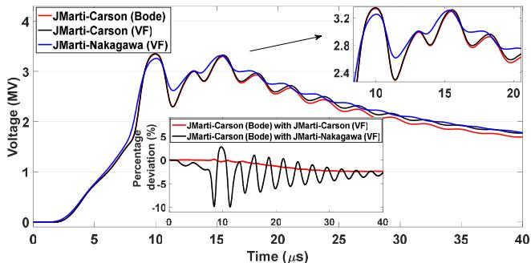  
(d)   
FIGURE 10. Transient voltage $v _ { \ m } ( t )$ generated by the lightning strike for a soil of 10 k.m: (a) shield wire (b) phase A (c) phase B and (d) phase C.

electrical equipment or component, such as the string of insulators, pre-insertion resistors and surge arresters in the power system [31]. Including the real characteristics of soil (frequency effect on the soil electrical parameters-resistivity and permittivity) has demonstrated that significant differences

are obtained when ground-return impedance is calculated with Nakagawa’s approach using FD soil electrical parameters. Several approaches to include the soil effect in the ground-return parameters (impedance and admittance) such as those presented by Sunde, Pettersson, Tesche, Dubanton

TABLE 1. Voltage peaks and 1V(%) obtained in the simulations.   

<table><tr><td rowspan="3">Approach</td><td colspan="3">Vpeak(MV)</td><td colspan="3">ΔV(%)</td></tr><tr><td colspan="3">ρ0g(Ω.m)</td><td colspan="3">ρ0g(Ω.m)</td></tr><tr><td>1000</td><td>3000</td><td>10,000</td><td>1000</td><td>3000</td><td>10,000</td></tr><tr><td>S1 (Phase A)</td><td>4.276</td><td>4.259</td><td>4.232</td><td>-</td><td>-</td><td>-</td></tr><tr><td>S1 (Phase B)</td><td>4.046</td><td>4.119</td><td>4.169</td><td>-</td><td>-</td><td>-</td></tr><tr><td>S1 (Phase C)</td><td>3.205</td><td>3.270</td><td>3.340</td><td>-</td><td>-</td><td>-</td></tr><tr><td>S2 (Phase A)</td><td>4.288</td><td>4.266</td><td>4.245</td><td>1.398</td><td>1.455</td><td>1.368</td></tr><tr><td>S2 (Phase B)</td><td>4.055</td><td>4.122</td><td>4.180</td><td>1.258</td><td>1.283</td><td>1.259</td></tr><tr><td>S2 (Phase C)</td><td>3.225</td><td>3.284</td><td>3.351</td><td>2.650</td><td>2.729</td><td>2.411</td></tr><tr><td>S3 (Phase A)</td><td>4.332</td><td>4.351</td><td>4.382</td><td>3.493</td><td>6.159</td><td>9.917</td></tr><tr><td>S3 (Phase B)</td><td>3.999</td><td>4.029</td><td>4.069</td><td>1.809</td><td>3.193</td><td>5.624</td></tr><tr><td>S3 (Phase C)</td><td>3.200</td><td>3.256</td><td>3.313</td><td>3.596</td><td>5.999</td><td>9.907</td></tr></table>

and others in the literature as detailed in [19] can be included using the proposed method in this work. Furthermore, the VF method has presented a better approximation for $Z _ { \mathrm { c } } ( s )$ and H(s) functions for all frequency range.

# V. CONCLUSION

This paper has presented a comparison between the Vector Fitting method and Bode’s method to synthesize the frequency-dependent functions $Z _ { \mathrm { c } } ( s )$ and $H ( s )$ for a 100-km overhead transmission line located on a ground modeled by its frequency-dependent electrical parameters.

The Vector Fitting method has fitted the characteristic impedance matrix function $Z _ { \mathrm { c } } ( s )$ and propagation function $H ( s )$ with a lower number of poles and with a lower deviation in comparison with those fittings using the Bode’s method. Then, the poles and residues from the Vector Fitting method are incorporated into ATP tool to compute with more precision the transient responses generated by lightning strike using the JMarti’s line model.

The p.u.l. resistance and inductance of the studied transmission line have presented high deviations when Nakagawa’s approach is employed due to predominance of the displacement currents at higher frequencies in comparison with those calculated using Carson’s approach. It is worth mentioning that Carson’s approach neglects the displacement currents in his formulations, generating these high differences. On the other hand, the p.u.l. capacitance has presented a small impact with the Nakagawa’s approach. In relation to lightning-induced voltages, results demonstrated that the responses developed on the shield wire by a lightning direct strike are not significantly affected by the frequency-dependent soil model or even the fitting methods used for the functions $Z _ { \mathrm { c } } ( s )$ and $H ( s )$ . However, the lightning-induced voltage waveforms have presented a pronounced variation, especially when the Carson’s approach combined with the Bode’s method is employed to compute the transient responses. Carson’s approach has presented the highest voltage peaks which can lead to overestimation in the insulation design of the electrical components (string of insulators, pre-insertion resistors and surge arresters) in power systems.

The Nakagawa’s approach used to assess the ground-return parameters (impedance and admittance) in the JMarti’s line

model, combined with the Vector Fitting method, has demonstrated to be an interesting tool to calculate lightning-induced voltages on OHTLs located on frequency-dependent soil models. As an advantage, the ground-return admittance of the OHTL and the frequency-dependent soil electrical parameters (resistivity and permittivity) are taken into account in these calculations. The transient responses are computed directly in the time domain without employing any conversion tools from the frequency to time domain such as Numerical Inverse Laplace Transform and a more realistic soil is used to assess the ground-return parameters.

# REFERENCES

[1] J. S. L. Colqui, A. R. J. Araujo, T. F. G. Pascoalato, and S. Kurokawa, ‘‘Transient analysis of overhead transmission lines based on fitting methods,’’ in Proc. 14th IEEE Int. Conf. Ind. Appl. (INDUSCON), Aug. 2021, pp. 180–187.   
[2] A. Piantini, Lightning Interaction With Power Systems: Fundamental and Modelling, vol. 1, 1st ed. Edison, NJ, USA: IET, 2020.   
[3] F. A. Diniz, R. S. Alípio, and R. A. R. D. Moura, ‘‘Assessment of the influence of ground admittance correction and frequency dependence of electrical parameters of ground of simulation of electromagnetic transients in overhead lines,’’ J. Control, Autom. Electr. Syst., vol. 33, pp. 1066–1080, Jan. 2022.   
[4] M. Nakagawa, ‘‘Admittance correction effects of a single overhead line,’’ IEEE Trans. Power App. Syst., vol. PAS-100, no. 3, pp. 1154–1161, Mar. 1981.   
[5] A. Andreotti, R. Araneo, J. B. Faria, J. He, E. Petrache, A. Pierno, and E. Stracqualursi, ‘‘On the role of shield wires in mitigating lightninginduced overvoltages in overhead lines—Part I: A critical review and a new analysis,’’ IEEE Trans. Power Del., early access, Jul. 8, 2022, doi: 10.1109/TPWRD.2022.3189311.   
[6] J. Marti, ‘‘Accurate modelling of frequency-dependent transmission lines in electromagnetic transient simulations,’’ IEEE Trans. Power App. Syst., vol. PAS-101, no. 1, pp. 147–157, Jan. 1982.   
[7] (2019). The ATPDraw Simulation Software, Version 7.0. [Online]. Available: https://www.atpdraw.net/   
[8] B. Gustavsen and A. Semlyen, ‘‘Rational approximation of frequency domain responses by vector fitting,’’ IEEE Trans. Power Del., vol. 14, no. 3, pp. 1052–1061, Jul. 1999.   
[9] E. S. Bañuelos-Cabral, J. A. Gutierrez-Robles, and B. Gustavsen, ‘‘Rational fitting techniques for the modeling of electric power components and systems using MATLAB environment,’’ in Rational Fitting Techniques for the Modeling of Electric Power Components and Systems Using MATLAB Environment. London, U.K.: IntechOpen, 2017.   
[10] J. R. Carson, ‘‘Wave propagation in overhead wires with ground return,’’ Bell Syst. Tech. J., vol. 5, no. 4, pp. 539–554, Oct. 1926.   
[11] R. Alípio and S. Visacro, ‘‘Modeling the frequency dependence of electrical parameters of soil,’’ IEEE Trans. Electromagn. Compat., vol. 56, no. 5, pp. 1163–1171, Oct. 2014.   
[12] J. P. L. Salvador, R. Alipio, A. C. S. Lima, and M. T. C. de Barros, ‘‘A concise approach of soil models for time-domain analysis,’’ IEEE Trans. Electromagn. Compat., vol. 62, no. 5, pp. 1772–1779, Oct. 2020.   
[13] D. Cavka, N. Mora, and F. Rachidi, ‘‘A comparison of frequencydependent soil models: Application to the analysis of grounding systems,’’ IEEE Trans. Electromagn. Compat., vol. 56, no. 1, pp. 177–187, Feb. 2014.   
[14] C. M. Portela, ‘‘Measurement and modeling of soil electromagnetic behavior,’’ in Proc. IEEE Int. Symp. Electromagn. Compat., vol. 2. Piscataway, NJ, USA: Institute of Electrical and Electronics Engineers, Aug. 1999, pp. 1004–1009.   
[15] M. M. Y. Tomasevich and A. C. S. Lima, ‘‘Impact of frequency-dependent soil parameters in the numerical stability of image approximationbased line models,’’ IEEE Trans. Electromagn. Compat., vol. 58, no. 1, pp. 323–326, Feb. 2016.   
[16] A. C. S. de Lima and C. Portela, ‘‘Inclusion of frequency-dependent soil parameters in transmission-line modeling,’’ IEEE Trans. Power Del., vol. 22, no. 1, pp. 492–499, Jan. 2007.

[17] T. F. G. Pascoalato, A. R. J. de Araújo, P. T. Caballero, J. S. L. Colqui, and S. Kurokawa, ‘‘Transient analysis of multiphase transmission lines located above frequency-dependent soils,’’ Energies, vol. 14, no. 17, p. 5252, Aug. 2021.   
[18] A. De Conti and M. P. S. Emídio, ‘‘Extension of a modal-domain transmission line model to include frequency-dependent ground parameters,’’ Electr. Power Syst. Res., vol. 138, pp. 120–130, Sep. 2016.   
[19] T. A. Papadopoulos, A. I. Chrysochos, C. K. Traianos, and G. Papagiannis, ‘‘Closed-form expressions for the analysis of wave propagation in overhead distribution lines,’’ Energies, vol. 13, no. 17, p. 4519, Sep. 2020. [Online]. Available: https://www.mdpi.com/1996-1073/13/17/4519   
[20] O. Ramos-Leaños, J. L. Naredo, and J. A. Gutierrez-Robles, ‘‘An advanced transmission line and cable model in MATLAB for the simulation of power-system transients,’’ in MATLAB: A Fundamental Tool for Scientific Computing and Engineering Applications. Rijeka, Croatia: InTech, 2012, pp. 269–304.   
[21] P. T. Caballero, E. C. M. Costa, and S. Kurokawa, ‘‘Modal decoupling of overhead transmission lines using real and constant matrices: Influence of the line length,’’ Int. J. Electr. Power Energy Syst., vol. 92, pp. 202–211, Nov. 2017.   
[22] H. W. Bode, Network Analysis and Feedback Amplifier Design. New York, NY, USA: Van Nostrand, 1945.   
[23] H. W. Dommel, EMTP Theory Book. Vancouver, BC, Canada: Microtran Power System Analysis Corporation, 1996.   
[24] E. S. Bañuelos-Cabral, J. A. Gutiérrez-Robles, J. L. García-Sánchez, J. Sotelo-Castañón, and V. A. Galván-Sánchez, ‘‘Accuracy enhancement of the JMarti model by using real poles through vector fitting,’’ Electr. Eng., vol. 101, no. 2, pp. 635–646, Jun. 2019.   
[25] B. Salarieh and H. M. J. De Silva, ‘‘Review and comparison of frequencydomain curve-fitting techniques: Vector fitting, frequency-partitioning fitting, matrix pencil method and Loewner matrix,’’ Electr. Power Syst. Res., vol. 196, Jul. 2021, Art. no. 107254.   
[26] W. H. Wise, ‘‘Potential coefficients for ground return circuits,’’ Bell Syst. Tech. J., vol. 27, no. 2, pp. 365–371, 1948.   
[27] E. D. Sunde, Earth Conduction Effects in Transmission Systems. New York, NY, USA: Dover, 1968.   
[28] Z. Li, J. He, B. Zhang, and Z. Yu, ‘‘Influence of frequency characteristics of soil parameters on ground-return transmission line parameters,’’ Electr. Power Syst. Res., vol. 139, pp. 127–132, Oct. 2016.   
[29] A. De Conti and S. Visacro, ‘‘Analytical representation of single- and double-peaked lightning current waveforms,’’ IEEE Trans. Electromagn. Compat., vol. 49, no. 2, pp. 448–451, May 2007.   
[30] Impact of Soil-Parameter Frequency Dependence on the Response of Grounding Electrodes and on the Lightning Performance of Electrical Systems, Working Group CIGRE C4.33, Tech. Brochure 781, Paris, France, 2019, pp. 1–66.   
[31] E. Stracqualursi, G. Pelliccione, S. Celozzi, and R. Araneo, ‘‘Tower models for power systems transients: A review,’’ Energies, vol. 15, no. 13, p. 4893, Jul. 2022. [Online]. Available: https://www.mdpi.com/1996- 1073/15/13/4893

ANDERSON RICARDO JUSTO DE ARAÚJO received the B.Sc., M.Sc., and Ph.D. degrees in electrical engineering from São Paulo State University (UNESP), Brazil, in 2012, 2014, and 2018, respectively. Currently, he is a Postdoctoral Researcher with the School of Electrical and Computer Engineering (FEEC), State University of Campinas (UNICAMP). His current research interests include transmission tower, line and grounding system modeling for

electromagnetic transient analysis in power systems.

TAINÁ FERNANDA GARBELIM PASCOALATO received the B.Sc. degree in electrical engineering from Votuporanga University Center, in 2017, and the M.Sc. degree in electrical engineering from São Paulo State University, in 2020, where she is currently pursuing the Ph.D. degree in electrical engineering with São Paulo State University. Her research interests include transmission line modeling and soil modeling with frequency-dependent electrical parameters.

SÉRGIO KUROKAWA (Member, IEEE) received the B.Sc. degree in electrical engineering from São Paulo State University (UNESP), in 1990, the M.Sc. degree from the Federal University of Uberlandia (UFU), in 1994, and the Ph.D. degree from the University of Campinas (UNICAMP), in 2003. Since 1994, he has been working as a Professor and a Researcher with UNESP, Campus of Ilha Solteira. His current interests include electromagnetic transients in power systems and transmission line modeling.

JAIMIS SAJID LEON COLQUI received the B.Sc. degree in electrical engineering from National University Engineering (UNI), Peru, in 2014, and the M.Sc. and Ph.D. degrees in electrical engineering from São Paulo State University, in 2017 and 2021, respectively. Currently, he is a Postdoctoral Researcher with the State University of Campinas, Campinas, Brazil. His research interests include transmission tower and line modeling for electromagnetic transient simulations in power systems.

JOSÉ PISSOLATO FILHO was born in Campinas, São Paulo, Brazil. He received the Ph.D. degree in electrical engineering from Université Paul Sabatier, France, in 1986. Since 1979, he has been with the Department of Energy and Systems, UNICAMP. His main research interests include high-voltage engineering, electromagnetic transients, and electromagnetic compatibility.