# Measurement-based frequency-dependent model of a HVDC transformer for electromagnetic transient studies

Bjørn Gustavsen*, Yannick Vernay

SINTEF Energy Research, P.O. Box 4761 Sluppen, Trondheim, NO-7465, Norway

# A R T I C L E I N F O

Keywords:

HVDC transformer

Measurements

Black box model

Electromagnetic transients

# A B S T R A C T

A wide-band, frequency-dependent five-terminal model is developed that represents one HVDC transformer unit in the French-English IFA2000 HVDC interconnection. Three such interconnected 1-ph units constitute one 3-ph transformer bank needed in 12-pulse conversion. The model is obtained via admittance frequency sweep measurements on the transformer's terminals, including common-mode measurements to capture the high-impedance coupling to earth at lower frequencies. The data set is modified to reduce the magnetizing current to a realistic level by a novel eigenvalue scaling procedure. The final data set is subjected to modeling by a stable and passive rational model while utilizing a mode-revealing transformation to retain the accuracy of the small eigenvalues that are related to the high-impedance coupling to earth. The paper describes details related to the measurements and modeling steps as well as the many intermediate accuracy validations that were done. Also is described challenges in the measurements that resulted due to interference of the measurements by a nearby 400 kV overhead line. The model is applied in a time domain simulation of the complete HVDC link in normal operation where voltage waveforms resulting from line commutations are compared against those by a classical model with added stray capacitances.

# 1. Introduction

HVDC transformers are together with thyristor valves the fundamental components in any LCC-type HVDC converter. The protection of these transformers is therefore essential for the reliable operation of the HVDC link. Overvoltages due to switching events, lightning impulses and in-station flashovers on the AC side result in steep-fronted overvoltages that stress the transformer AC side insulation parts, and voltages are also transferred to the DC-side where they stress and interfere the thyristor components [1]. Conversely, line faults and lightning strokes to a DC overhead line may result in overvoltages that impose stresses on the transformer DC-side terminals. The protection of HVDC substation against overvoltages therefore requires insulation co-ordination studies to be performed to determine the appropriate location of surge arresters [1].

Insulation co-ordination studies requires the use of models with adequate accuracy up to several hundred kHz in order to represent the actual waveshapes of the overvoltages. The representation of the HVDC transformer is a main obstacle in such studies since frequency-dependent transformer models are in general not available. Therefore, simplified models are usually employed, often consisting of a 50 Hz model in combination with lumped capacitors.

To overcome the accuracy limitation of simplified transformer models, one must use of either a detailed white-box transformer model [2–7] supplied by the manufacturer, or one may extract a black-box model [8–12] of the transformer from terminal measurements. The latter is of course only possible if the transformer has already been built, or if there is a sister unit available. The use of black-box models is attractive because a high level of accuracy can often be achieved compared to a white-box models calculated from detailed design data.

In this work we demonstrate for the first time the use of black-box modeling to an HVDC transformer. The transformer is a single-phase unit belonging to the French-English IFA2000 interconnection. Using a dedicated equipment for frequency sweep measurements of the transformer's terminal voltage/current characteristics, we obtain a multiport admittance description under the assumption of linear behavior. From the admittance description we extract a stable and passive rational model (state-space) which is amenable for inclusion in general simulation programs of electromagnetic transients such as EMTP-RV, PSCAD and ATP. We demonstrate the many steps in the measurement and modeling process, including the required validation of measurement accuracy and consistency in both frequency domain and time domain, as well as in the model extraction step. The challenges due to interference from a nearby 400 kV HVAC line are also demonstrated.

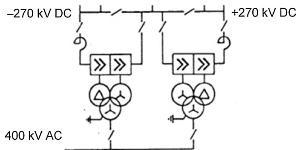  
Fig. 1. HVDC transformers utilized in bipolar 12-pulse configuration.

Two important contributions in this work are (1) handling of two ungrounded windings (which leads to widely different modal components towards lower frequencies), and (2) a procedure to obtain a realistic magnetizing current at 50 Hz (since small-signal measurements give unrealistically large magnetizing currents). Finally, we demonstrate the application of the model in a simulation of the complete HVDC link where we compare the effect of commutation induced voltage waveforms against those by a simplified model.

# 2. HVDC transformer

The modeled transformer is a spare unit belonging to the French station of the HVDC-LCC France-England link IFA2000. This interconnection was commissioned in 1986 and is composed of two HVDC bipole ± 270 kV of 1000 MW each. A refurbishment of the converter valves and of the control and protection system has been realized in 2011/2012. However the other HV equipment of the HVDC station including the transformer have been preserved. The transformer is a single-phase (1-ph) 206 MVA unit with rated voltage 400/ 3 , 118, 118/ 3 kV at 50 Hz. Three 1-ph-units are connected to form the required 3-ph YNyd unit needed in a 12-pulse converter, see Fig. 1.

The winding configuration of each 1-ph transformer is shown in Fig. 2. The high-voltage (HV) 400 kV winding has its end point grounded while the two low-voltage (LV) windings are ungrounded. The transformer core has four limbs with the secondary Y and D windings placed on the second and third limb, respectively. The objective is to create a five-terminal model of the transformer that is valid over a wide frequency band, including the mutual coupling between terminals. The terminal numbering is as shown in Fig. 2.

The 1-ph spare unit is located in the Les Mandarins (Calais) substation, in open air as shown in Fig. 3. A live 400 kV AC overhead runs in the vicinity of the transformer as can be observed in the figure. The interference from this line caused difficulties in the measurements as described in later sections.

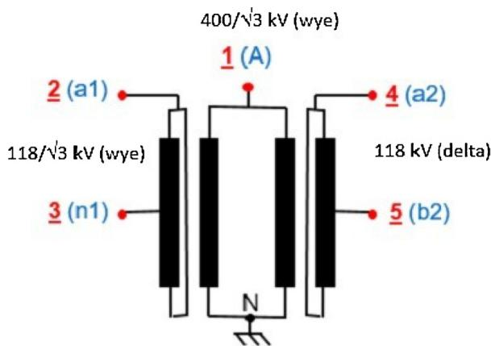  
Fig. 2. 1-ph HVDC transformer windings and terminals.

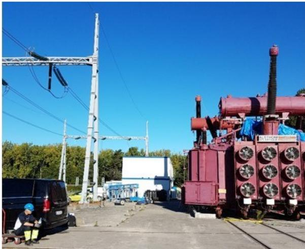  
Fig. 3. HVDC 1-ph transformer measurement object.

# 3. Work strategy

The transformer was available for a total of five days. Within this time frame, it was required to connect the measurement equipment, perform measurements, create a model, validate the model's accuracy, and finally to disconnect all the measurement equipment. The limited time frame made it necessary to measure, validate and model in a very effective and disciplined manner. This was achieved by the following strategy.

1 All measurements and required reconnections are performed on a conveniently located “connection box” (Section 4.1). That way, one avoids to do do any reconnections on the transformer's terminals which could only be accessed by a lift.

2 The modeling is based on admittance matrix frequency sweep measurements (Section 4.2). The accuracy of these measurements is checked by calculating a set of voltage transfer functions (on the connection box) that can be verified by use of (passive) voltage probe measurements. Necessary adjustments to the admittance measurements are made until an acceptable validation is achieved.

3 A passive and stable model is “itted” to the measured admittance matrix frequency responses (Section 5). The approach permits to extract a suitable model in approximately one minute CPU time. The model's terminal admittance matrix is used for calculating voltage transfer functions that are compared against the measurements in Step 2.

4 As a final validation, a set of time domain step voltage measurements are performed (on the connection box) and compared against time domain simulations Section 6). The simulation program is a Matlab implementation that can read in the measurement files, run the simulation, and make comparative plots, all within a few seconds.

# 4. Measurements, validation (frequency domain)

# 4.1. Setup

The measurement setup is similar to the one presented in Ref. [9]. It consists of a vector network analyzer (VNA) with gain-phase capability in combination with connection box that includes a wide-band current sensor. Additional equipment includes insulated conductors, coaxial cables and a ground reference plane. The insulated conductors were connected to the external terminals (bushing ends), strapped along the bushings and brought down to the artificial ground plane. The ground plane consisted of braided, flat wires that were taped to the tank lid and connected to the neutral N-point in Fig. 2, as well as to several

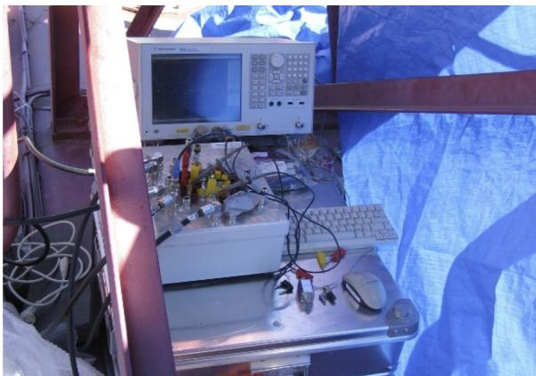  
Fig. 4. Measurement equipment on top of transformer.

grounding points on top of the transformer. The bottom ends of the insulated conductors were connected to the connection box (on top of the transformer) via 3-m long coaxial cables whose shields were connected to the artificial ground plane at one end and the connection box at the other end. That way, the transformer's terminals were available on the connection box. The actual measurements were performed on the connection box using the VNA instrument and the built-in current sensor, with necessary grounding of terminals performed on the connection box. The setup permits measurements of individual terminal admittance measurements, as well as voltage transfer functions with the use of voltage probes. The actual use of the connection box is explained in Ref. [9]. Fig. 4 shows the connection box and VNA instrument located on top of the transformer. The five coaxial cables that connect to the transformer's external terminals are visible on the left side of the connection box.

# 4.2. Admittance matrix measurements

The admittance matrix $\mathbf { Y } ( 5 ~ \times ~ 5 )$ defines the relation between terminal voltages $\mathbf { v } ( 5 \times 1 )$ and currents $\mathbf { i } ( 5 \times 1 )$ by the matrix-vector Eq. (1).

$$
\mathbf {i} _ {(5 \times 1)} (\omega) = \mathbf {Y} _ {(5 \times 5)} (\omega) \mathbf {v} _ {(5 \times 1)} (\omega) \tag {1}
$$

The 25 elements of Y were measured between 5 Hz and 10 MHz using using 401 logarithmically spaced samples. Each frequency sweep required 98 s using Agilent E5061B-3L5. Fig. 5 shows the magnitude function of the 25 elements, after enforcement of symmetry by (2). It is observed that the measurements are affected by noise at 50 Hz, which is due to the nearby 400 kV AC overhead line in Fig. 3.

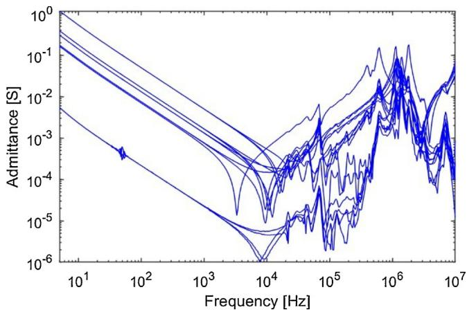  
Fig. 5. Elements (magnitude functions) of admittance matrix $\mathbf { Y } _ { ( 5 \mathrm { ~ \times ~ } 5 ) } .$

$$
\mathbf {Y} \rightarrow \frac {1}{2} (\mathbf {Y} + \mathbf {Y} ^ {T}) \tag {2}
$$

# 4.3. Common mode behavior

It is well known that the presence of ungrounded windings poses an accuracy challenge in the admittance measurement. In each measurement, the voltage is applied to one terminal j with all other terminals grounded. Element $\mathbf { Y } _ { i j }$ is obtained as the (measured) current in terminal i divided by the applied voltage on terminal j. Since the measurements are performed with grounded terminals, it follows that the information about the (small) capacitive charging currents at lower frequencies tend to become lost in the (large) short-circuit current component. The consequence is poor representation of the transformer behavior when applied with high-impedance terminations, including open terminals as the extreme case. A procedure for overcoming this problem has been demonstrated for a 1-ph 3-winding transformer where one of the windings was ungrounded [12]. In the following we extend the approach in Ref. [12] to be applicable also for the given 1-ph 3-winding transformer which has two ungrounded windings.

The main idea is to measure the common-mode behavior of the two ungrounded windings and enforce this behavior into the original $\mathbf { Y } _ { ( 5 \mathrm { ~ \times ~ } }$ 5). To achieve this, we bond the two terminals of each ungrounded winding (on the connection box), giving a three-terminal component as shown in Fig. 6.

Using the same measurement procedure, the admittance matrix ${ \bf Y } _ { ( 3 }$ $\times \ 3 )$ is measured as function of frequency and subjected to symmetry enforcement by (2). Fig. 7 shows with blue trace the nine magnitude functions of the direct measurements. All elements but element (1,1) of $\mathbf { Y } _ { ( 3 \mathrm { ~ \times ~ } 3 ) }$ tend to approach zero at low frequencies by a linear trace in the log-log plot, indicating the expected capacitive behavior. However, at low frequencies the magnitude functions become too small to be accurately measured, and they are affected by 50 Hz interference from the 400 kV AC line. At frequencies below 300 Hz we therefore replace these (noisy) elements with the expected capacitive behavior, $Y _ { i j } ( \omega ) = j \omega C _ { i j }$ with the capacitances chosen such that Im $\{ Y _ { i j } ( \omega ) \} = \omega C _ { i j }$ at 300 Hz. The result of this modification is shown by the red traces in Fig. 7.

The next step is to merge the elements of $\mathbf { Y } _ { ( 3 \mathrm { ~ \times ~ } 3 ) }$ into $\mathbf { Y } _ { ( 5 \mid \times 5 ) } .$ . This merging process is applied only below $f _ { 0 } = 1$ kHz since the capacitive currents are well observable in $\mathbf { Y } _ { ( 5 \mathrm { ~ \times ~ } 5 ) }$ at higher frequencies. To see how this is done, we consider a partitioning of $\mathbf { Y } _ { ( 5 \times \ 5 ) }$ associated with $\mathbf { Y } _ { ( 3 \mathrm { ~ \times ~ } 3 ) }$ as shown in Fig. 8.

The common mode behavior defined by $\mathbf { Y } _ { ( 3 \mathrm { ~ \times ~ } 3 ) }$ is enforced into $\mathbf { Y } _ { ( 5 }$ × 5) by the procedure in Fig. 9 which is based on an assumption of equal current division between winding terminals. For instance, if one applies a common mode voltage to terminal 2' in Fig. 6, it is assumed that an identical current flows into terminals 2 and 3, and that an identical current flows into terminals 4 and 5. This is a simplification, in part because the low-frequency capacitive current coupled from each of the two LV windings to the HV winding is not constant along the windings.

Fig. 10 shows the effect of the common mode enforcement on the admittance elements $\mathbf { Y } _ { ( 5 \times 5 ) } ,$ when applied at frequencies below 1 kHz. The magnitude curves are seen to be practically unchanged. A closer inspection shows that the noise at 50 Hz is much reduced.

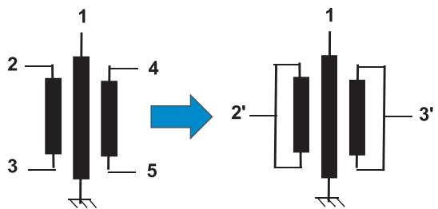  
Fig. 6. Terminals for common mode measurements.

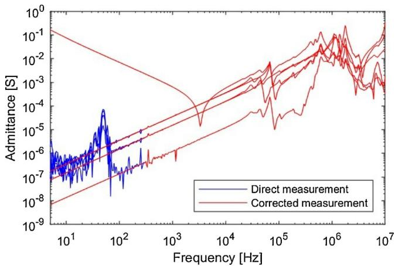  
Fig. 7. Replacing elements of $\mathbf { Y } _ { ( 3 \mathrm { ~ \times ~ } 3 ) }$ with capacitive behavior, y = jωC.

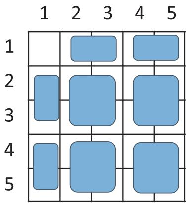  
Fig. 8. Partitioning of $\mathbf { Y } _ { ( 5 \mathrm { ~ \times ~ } 5 ) } .$

# 2x2 blocks in Y(5x5)

1.For each column,subtract the column average.   
2.For each row,subtract the row average.   
3. Add toallelements thecoresponding element inY(3x3) divided by four.

# 2x1 blocks in Y(5x5)

1. Subtract the column average   
2.Addtoall emntstheoresponinelemtin) divided by two.

# 1x2 blocks in Y(5×5)

1. Subtract the row average   
2. Add toall elements thecorresponding element in Y(3x3) divided by two.

Fig. 9. Enforcement of common mode behavior.

Fig. 11 shows the corresponding result for the eigenvalues of $\mathbf { Y } _ { ( 5 \mathrm { ~ \times ~ } }$ 5). The physical interpretation of the eigenvalues at low frequencies is indicated in the plot: two short-circuit currents, one magnetizing current, and two capacitive charging currents. It is seen that the common mode enforcement changes the charging currents into the expected capacitive behavior.

# 4.4. Validation against voltage transfer functions

The accuracy of the modified $\mathbf { Y } _ { ( 5 \mathrm { ~ \times ~ } 5 ) }$ was verified by means of frequency sweep measurement of voltage transfer functions using 10 MΩ voltage probes. We show here one example (Fig. 12) where the voltage is applied to terminal #1 with terminal #2 grounded and terminals #3 and #5 open. The intention was to keep also terminal #4

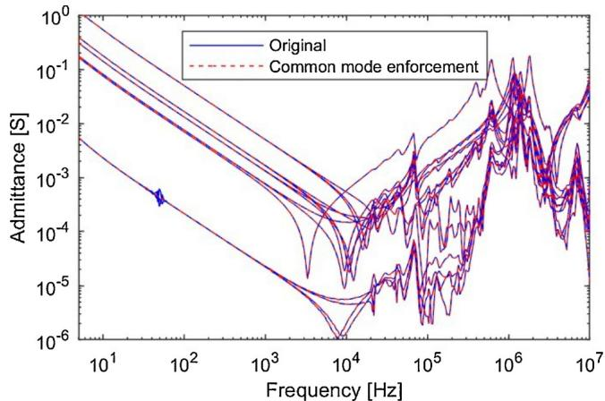  
Fig. 10. Effect on elements of $\mathbf { Y } _ { ( 5 \mathrm { ~ \times ~ } 5 ) } .$

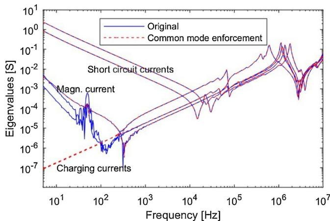  
Fig. 11. Effect on eigenvalues of $\mathbf { Y } _ { ( 5 \mathrm { ~ \times ~ } 5 ) } .$

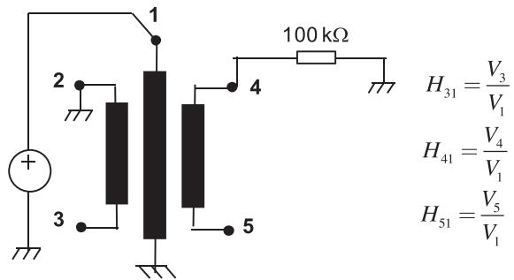  
Fig. 12. Voltage exciation on HV terminal with high impedance loading.

open so that the winding between #4 and #5 has only a capacitive coupling to earth. However, the strong 50 Hz interference from the nearby 400 kV line caused the VNA to trip on overload. Therefore, a 100 kΩ resistor was connected between terminal #4 and ground to limit the voltage on the winding. By employing $\mathbf { Y } _ { ( 5 \mathrm { ~ \times ~ } 5 ) }$ in a nodal analysis of the circuit in Fig. 12, the voltage transfer from node #1 to nodes #3, #4 and #5 was calculated. The calculation was done using the original $\mathbf { Y } _ { ( 5 \mathrm { ~ \times ~ } \ 5 ) }$ and the one obtained after enforcement of the common-mode behavior.

Fig. 13 shows a direct comparison of the calculated and directly measured voltage transfer functions. The following remarks can be made.

• The original $\mathbf { Y } _ { ( 5 \times 5 ) }$ leads to a voltage transfer function which is vey noisy below 1 kHz, and in particular around 50 Hz. Furthermore, the voltage transfer to terminals #3 and #4 is incorrect below 1 Hz. The

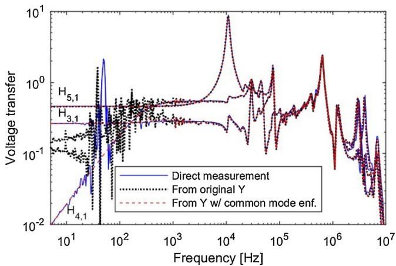  
Fig. 13. Calculated voltage transfer function in the frequency domain, with and without enforcement of common mode behavior.

reason is error magnification [13] due to the inaccurate representation of small eigenvalues in $\mathbf { Y } _ { ( 5 \times 5 ) }$ that relate to capacitive charging currents, see Fig. 11.

• With the use of the modified $\mathbf { Y } _ { ( 5 \times \ 5 ) }$ (common mode enforcement), the accuracy is excellent at all frequencies. Another salient feature is that the frequency response does not have any noise around 50 Hz. In that sense, it is more accurate than the directly measured voltage transfer function which is seen to be noisy around 50 Hz.

# 5. Modeling, validation (frequency domain)

# 5.1. Model formulation

The next step is to calculate a model suitable for time domain simulation in an EMTP-type circuit simulator. The model is required to reproduce the terminal behavior as defined by $\mathbf { Y } _ { ( 5 \mathrm { ~ \times ~ } 5 ) } ( \omega )$ as closely as possible. For that purpose we "fit" a rational model (3) to the given K samples,

$$
\mathbf {Y} _ {(5 \times 5)} (\omega_ {k}) \cong \mathbf {R} _ {0} + \sum_ {n = 1} ^ {N} \frac {\mathbf {R} _ {n}}{j \omega_ {k} - a _ {n}}, k = 1, 2 \dots , K \tag {3}
$$

The model (3) is required to be reciprocal, have stable poles and be passive. Also, the model's coefficients are required to be real-valued or come in complex conjugate pairs, thus complying with the causality requirement.

# 5.2. Mitigating error magnification

For the model extraction (3) we will employ the method known as vector fitting (VF) [14]. This method fits a model to the given data while minimizing the deviation in the least squares sense, with the employment of user-defined weighting. However, a direct least squares fitting (3) will not be able to reproduce the small eigenvalues buried in $\mathbf { Y } _ { ( 5 \times \textrm { ~ 5 } ) } ,$ even with the use of inverse magnitude weighting. We therefore employ the so-called mode-revealing transformation (MRT) introduced in Ref. [13]. This is a passivity preserving similarity transformation which makes the small eigenvalues in $\mathbf { Y } _ { ( 5 \times 5 ) }$ more visible in the transformed matrix, $\mathbf { Y _ { M R T ( 5 } } \times \mathbf { \mu } _ { 5 } ) .$ . The transformation matrix Q is calculated from the eigenvector matrix of $\mathbf { Y } _ { ( 5 \mathrm { ~ \times ~ } 5 ) }$ at a low frequency where $\mathbf { Y } _ { ( 5 \mathrm { ~ \times ~ } 5 ) }$ has a large ratio between the biggest and smallest eigenvalue. Q is real-valued and orthogonal. We refer to Ref. [13] for details about its calculation.

The transformation is applied to $\mathbf { Y } _ { ( 5 \times 5 ) }$

$$
\mathbf {Y} _ {\mathrm {M R T} (5 \times 5)} (\omega) = \mathbf {Q} ^ {\mathrm {T}} \mathbf {Y} _ {\mathrm {M R T} (5 \times 5)} (\omega) \mathbf {Q} \tag {4}
$$

Using VF, we fit a model (5) to YMRT(5 × 5) employing inverse

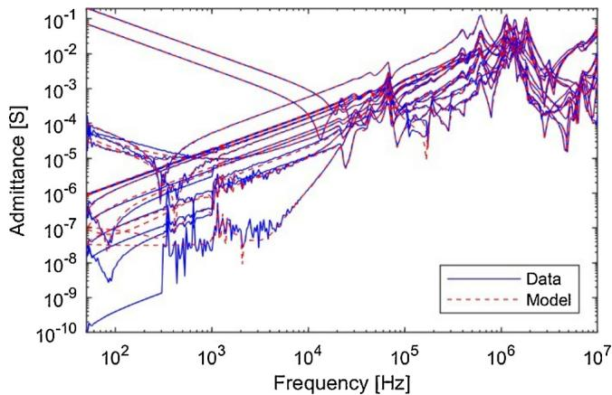  
Fig. 14. Admittance elements of transformed model, $\mathbf { Y } _ { \mathrm { M R T } }$ .

magnitude weighting. In the actual implementation of VF we used a version with improved convergence [15] and computational efficiency [16].

$$
\mathbf {Y} _ {\mathrm {M R T} (5 \times 5)} (\omega_ {k}) \cong \mathbf {R} _ {\mathrm {M R T}, 0} + \sum_ {n = 1} ^ {N} \frac {\mathbf {R} _ {\mathrm {M R T} , n}}{j \omega_ {k} - a _ {\mathrm {M R T} , n}}, k = 1, 2 \dots , K \tag {5}
$$

The model (5) is next subjected to passivity enforcement by a sequential first-order iterative perturbation of the residue matrices [17]. In each iteration, this process seeks to enforce passivity while minimizing the change to $\mathbf { Y } _ { \mathrm { M R T } }$ in the least squares sense. Inverse magnitude frequency weighting was used in the cost function. Finally, the model is subjected to a back-transformation (6) to get the final model (3).

$$
\mathbf {R} _ {n} = \mathbf {Q} \mathbf {R} _ {\mathrm {M R T}, n} \mathbf {Q} ^ {T}, n = 0, 2 \dots , N \tag {6}
$$

Fig. 14 shows the elements of $\mathbf { Y _ { M R T ( 5 \mid } } \times \mathbf { \mu } _ { 5 ) } \mathbf { : }$ data and the extracted model with $N = 6 0$ . It is observed that this transformed matrix contains information about the small eigenvalues in Fig. 11 that are masked in the the original Y in Fig. 10. The extracted model gives a good reproduction of the elements of $\mathbf { Y _ { M R T ( 5 \times \ 5 ) } } ,$ except for the very smallest elements.

Fig. 15 shows the elements of the original data $\mathbf { Y } _ { ( 5 \mathrm { ~ \times ~ } 5 ) }$ in Fig. 10, together with the model's admittance elements after back-transformation by (6). The elements are in general fitted quite accurately, except for some small elements between 100 kHz and 300 kHz.

Fig. 16 shows the eigenvalues associated with Fig. 15. It can be seen that all eigenvalues are well represented over the full frequency range.

The entire model extraction process required 1.8 s for extracting an initial model with $\mathrm { ~ N ~ } = \ 6 0$ poles and another 95 s for enforcement of passivity. The initial model was obtained by VF with 20 iterations. The passivity enforcement was achieved by the “robust iterations” approach

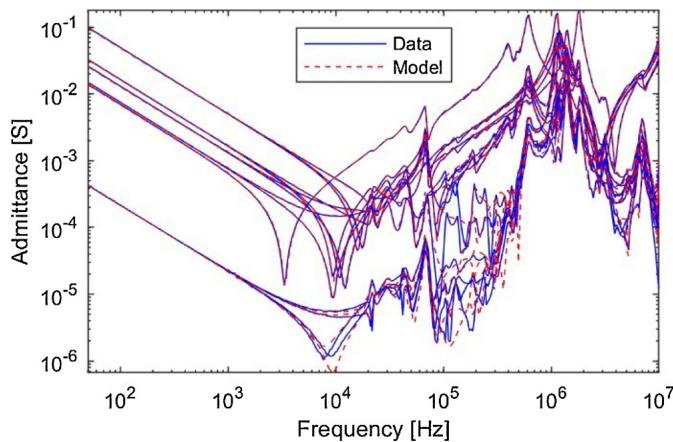  
Fig. 15. Admittance elements of back-transformed model.

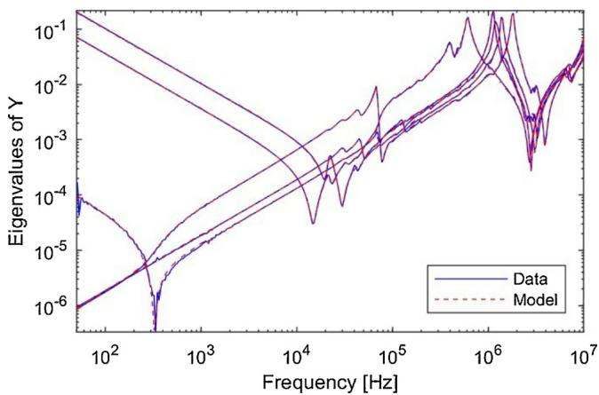  
Fig. 16. Admittance eigenvalues of back-transformed model.

in [17] using 3 iterations for the inner loop.

# 5.3. Validation in frequency domain

Using the extracted model, we calculated via its terminal admittance matrix the voltage transfer functions corresponding to the example in Fig. 12. Fig. 17 compares the calculated voltage transfer function with the direct measurement, similarly as in Fig. 13. It can be observed that a very good agreement has been achieved, which is due the preservation of the small eigenvalues in the model as is evident from Fig. 16.

# 6. Time domain validation

A number of time domain tests were performed where the transformer was subjected to step voltage excitations (on the connection box) using low voltage. We report results for the four tests in Fig. 18. These tests made use of an off-the shelf function generator with 50 output impedance, a storage oscilloscope and passive 10 MΩ voltage probes. In the following we show results from the four tests..

# 6.1. Low impedance grounding of DC-side windings

# 6.1.1. Voltage excitation from ideal voltage source (Test 1)

The upper left case in Fig. 18 is a case where the step voltage is applied to terminal #1 when both terminals #2 and #4 are grounded. Fig. 19 shows the measured voltage response on terminal #1 (Excitation) and on #3 and #5. The measured voltage on terminal #1 was applied to terminal #1 of the model as an ideal voltage source, in a time domain simulation using an EMTP-like implementation [18]. The

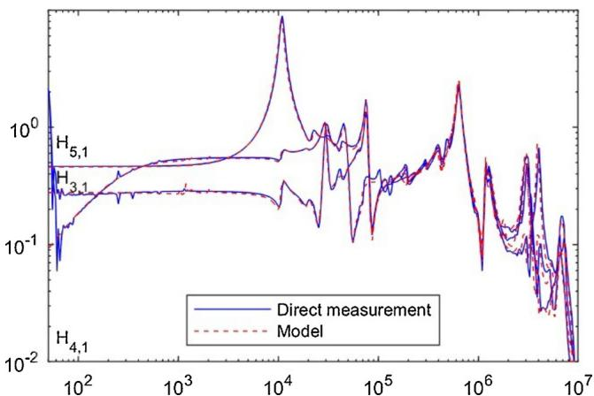  
Fig. 17. Voltage transfer.

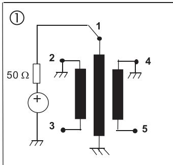

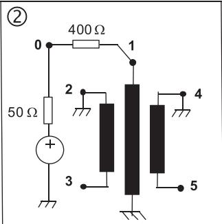

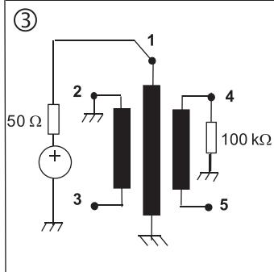

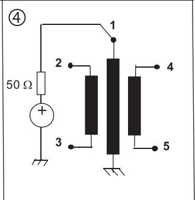  
Fig. 18. Four alternative time domain voltage excitation tests.

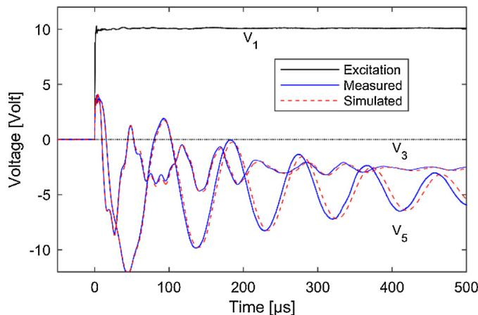  
Fig. 19. Measured and simulated voltage responses (Test 1).

simulated response on terminals #3 and #5 are included in Fig. 19, showing a very good agreement with the measured result.

# 6.1.2. Voltage excitation by non-ideal voltage source (Test 2)

The upper right case in Fig. 18 is similar to the previous case, except that a 400 Ω resistor is placed between the function generator output (node #0) and terminal #1. This resistor approximately corresponds to the characteristic impedance of a connected overhead line, thereby permitting to see the transformer's loading effect on the impinging overvoltage. The 400 Ω resistor is included in the circuit simulation and the measured voltage on node #0 is realized as an ideal voltage source. Fig. 20 shows that the simulation closely resembles the measured result. Compared to the previous example, it is observed that the 400 Ω resistor has the effect of reducing the steepness of the overvoltage that impinges the HV terminal (V1), and that the transferred voltage oscillations become more damped.

# 6.2. High impedance grounding of DC-side windings

# 6.2.1. 100 kΩ loading on terminal #4 (Test 3)

This test (lower left case in Fig. 18) corresponds directly to the frequency domain test in Fig. 12. The winding between terminals #4

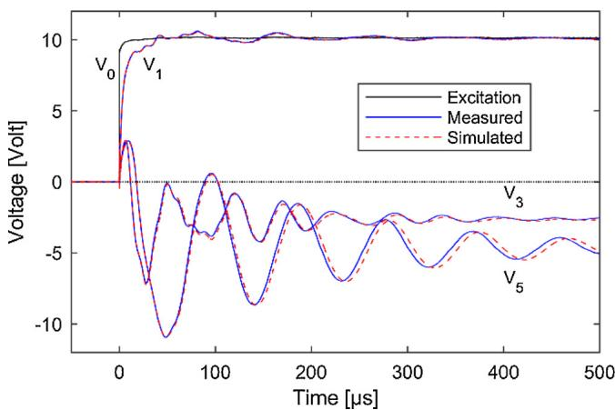  
Fig. 20. Measured and simulated voltage responses (Test 2).

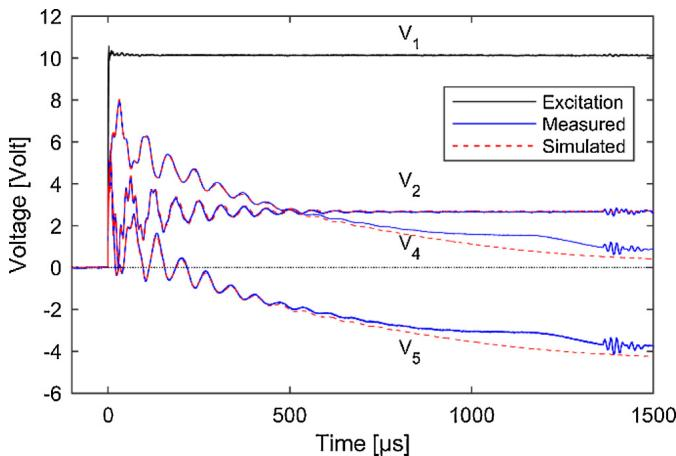  
Fig. 21. Measured and simulated voltage responses, after removal of offset in measured voltages (Test 3).

and #5 has only a high-impedance (100 kΩ) connection to earth. Fig. 21 shows a comparison between measured and simulated voltage responses, similarly to the result in Fig. 19. The result is shown after subtracting an offset of −7 Volt in the measured $\mathrm { V } _ { 3 }$ and $\mathrm { V } _ { 5 } .$ This voltage offset is due to electrostatic coupling from the 400 kV AC overhead line to the transformer windings.

# 6.2.2. No load on DC-side windings (Test 4)

The effect of the electrical coupling from the 400 kV overhead line became even more evident without the presence of the 100 kΩ resistor, see lower-right case in Fig. 18. Fig. 22 shows the measured voltage on terminals #1, #2, #4 and #5 over a full 20 ms time window, without removal of any voltage offset. It is observed that there are present induced voltages from 20 to 40 V peak value. These induced voltages makes it difficult to perform validating time domain measurements when the windings are ungrounded.

# 7. Transferred voltage at 50 Hz

The model was included in the EMT circuit simulation program known as EMTP-RV in the form of a sparse state space model. Three such 1-ph transformers were interconnected (Fig. 23) to give a 3-ph bank as used in each HVDC pole (Fig. 1).

Fig. 24 shows a simulation example where the transformer is energized from an ideal 3-ph voltage source with 400 kV line voltage (rms). The transformer was in the measurements in tap position N°1 such that the voltage ratio is 440:118. Fig. 25 compares the simulated phase-ground voltages on the two LV windings the theoretical peaks values, shown with dotted horizontal lines. It is seen that the 3-ph bank

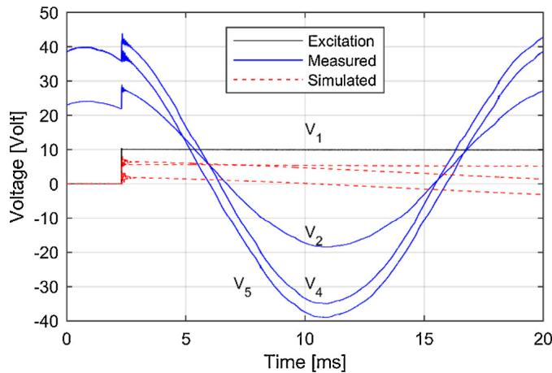  
Fig. 22. Measured and simulated voltage responses with unloaded DC-side windings. (Test #4).

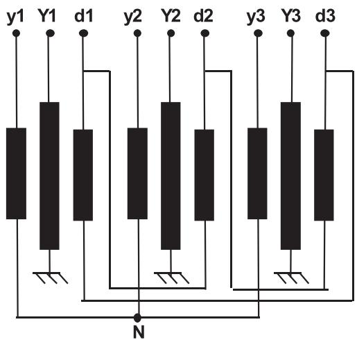  
Fig. 23. Connecting three 1-ph transformers into a 3-ph bank.

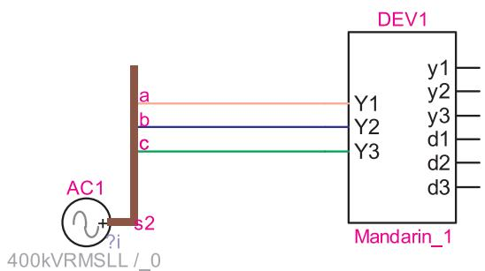  
Fig. 24. Excitation from ideal three-phase voltage source (EMTP-RV simulation).

gives an excellent representation of the predicted 50 Hz voltage. It is further observed that the expected 30° phase shift between the two LV winding voltages is properly represented as well.

# 8. Magnetizing current

# 8.1. Inaccuracies

Because the sweep measurements are done in short-circuit conditions and with a very low voltage, the steel core is not properly magnetized. As a result, the apparent magnetizing current associated with the admittance matrix becomes unrealistically high. The test report states 4.4 A (rms) when measured on the $1 1 8 / \sqrt { 3 } \mathrm { k V }$ winding with

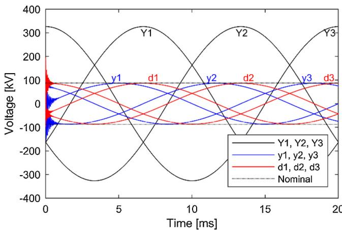  
Fig. 25. Simulated voltages (EMTP-RV).

nominal voltage, while the model predicts about 106 A. It was found that the high magnetizing current leads to a significant MVAR consumption which is undesirable in simulations of a complete HVDC terminal.

# 8.2. Reducing the magnetizing current

The magnetizing current corresponds to one of the small eigenvalues as indicated in Fig. 11. The associated eigenvector is observed to be nearly orthogonal to the other eigenvalues. The magnetizing current is reduced from 106 A to its target value of 4.4 A by scaling the eigenvalue λ (ω) by a first order high-pass filter,

$$
f (\omega) = \frac {j \omega}{j \omega - a} \tag {7}
$$

The pole-value a that achieves the desired scaling K at 50 Hz is

$$
a = - \frac {\omega_ {5 0}}{K} \sqrt {1 - K ^ {2}} \tag {8}
$$

After performing the scaling, the (modified) admittance matrix was calculated and a model was extracted using the same procedure as in Section 5. Fig. 26 shows the effect of the scaling by (7) on the eigenvalue. Fig. 27 shows all eigenvalues, before and after model extraction. It can be observed that the modeling process has somewhat increased the magnitude of the magnetizing current at low frequencies, which was due to the passivity enforcement. Table 1 shows the effect of the scaling on the magnetizing current, as calculated from Y at 50 Hz. It can be observed that the scaling has reduces the magnetizing current by more than a factor of 10.

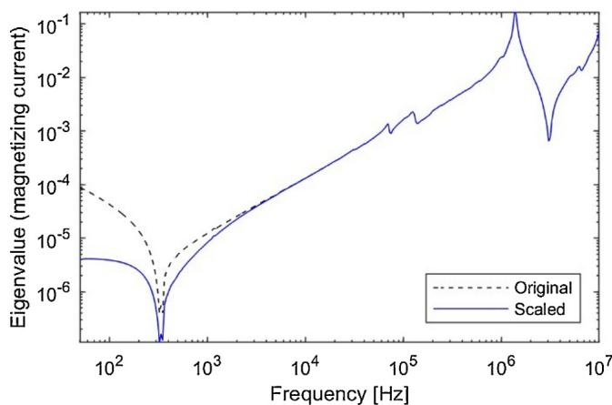  
Fig. 26. Reducing eigenvalue corresponding to magnetizing current.

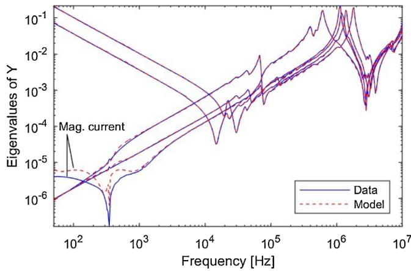  
Fig. 27. Eigenvalues of passive model.

Table 1 Magnetizing current @ 50 Hz.   

<table><tr><td>Original data</td><td>96 A</td></tr><tr><td>Data after modifying eigenvalue</td><td>4.7 A</td></tr><tr><td>Final model</td><td>7.6 A</td></tr></table>

# 8.3. Impact on the model’s accuracy

A side-effect of the eigenvalue modification was a slight reduction in the model's overall accuracy, in particular in simulation cases where a winding has only a weak connection to ground. As examples we show the ditto simulations of Figs. 19 and 21, given in Figs. 28 and 29.

# 9. Comparison against simplified model

The transformer model (3-ph unit with reduced magnetizing current) was converted into an EMTP-compatible state-space model. In EMTP, it was connected to a detailed model of the HVDC converter that includes the control system. To achieve this, the transformer model was adapted to take into account the position of the tap changer. As shown in Fig. 30, an ideal transformer with variable voltage ratio is connected in series with the transformer model to simulate the effect of the tap changer. This solution induces some inaccuracies as the tap changer should have an impact on the voltage ratio but also on the impedance of the transformer. However, the evaluation of the frequency dependent admittance for all transformer tap positions was not compatible with the duration of measurement.

Time domain simulations of the HVDC link with frequency

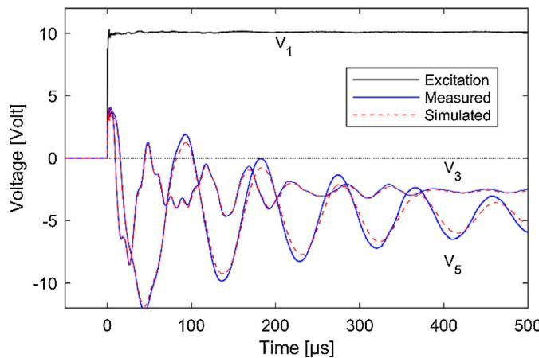  
Fig. 28. Measured and simulated voltage responses (Test 1).

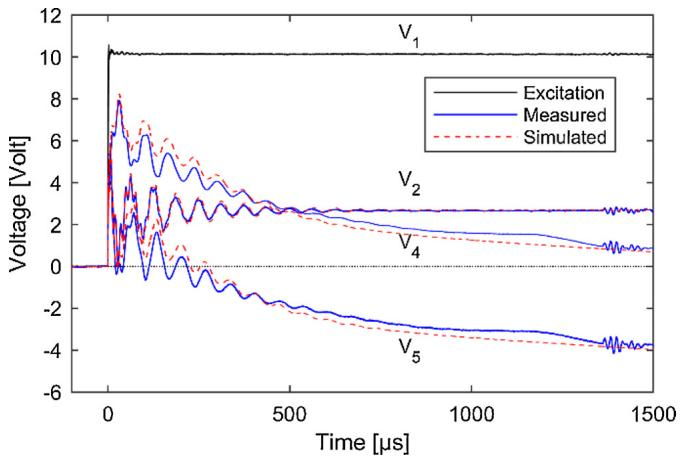  
Fig. 29. Measured and simulated voltage responses (Test 3).

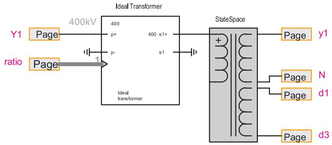  
Fig. 30. Connecting three 1-ph transformers into a 3-ph bank (EMTP).

dependent transformer model have been conducted and compared to similar simulations with the basic transformer model of the EMTP components library with a star circuit representation of the 3 windings single phase transformer. This model, also called Saturable Transformer Component (STC) [19], uses fixed value of leakage inductances and winding resistances and therefore has a limited validity for high frequency transients. A comparison is also performed with STC model with added stray capacitances from transformer test report to extend the high frequency validity of this simplified model. In this simulation the HVDC transformer is operating in tap position N°12 which is the middle position.

Fig. 31 shows a comparison of simulation results for the voltage at the 118 kV Y-connection side of the transformer. Although this comparison does not provide a direct validation of the developed transformer model, we observe that this model has a much closer behavior to the STC model with stray capacitance than the STC model without stray capacitance. The high frequency oscillations damping of the frequency dependent transformer is expected to be more realistic as it takes into account the frequency dependency of the transformer windings, which is not the case for the other type of transformer models which consider only the low resistance winding value measured at direct current.

# 10. Discussion

# 10.1. Significance of common-mode measurements and MRT

The measurements and model extraction procedure emphasized the need for properly accounting for the small capacitive coupling effects at lower frequencies, which manifests as two small eigenvalues. This was achieved by the use of common mode measurements and a mode-revealing similarity transformation (MRT) in the model extraction step. The accurate representation of these small capacitive effects is important in simulation cases that involve high-impedance terminal conditions, for instance between terminals an earth. A typical example is the simulation of transferred overvoltages when energizing an unloaded

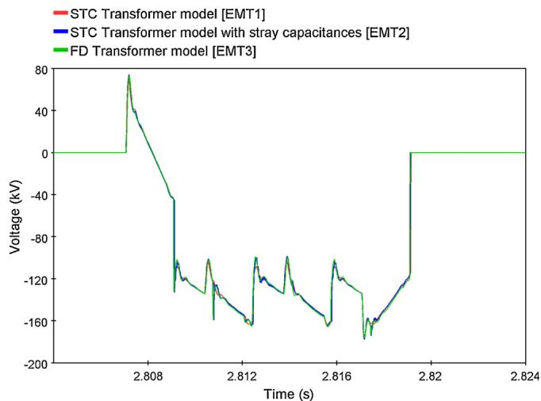

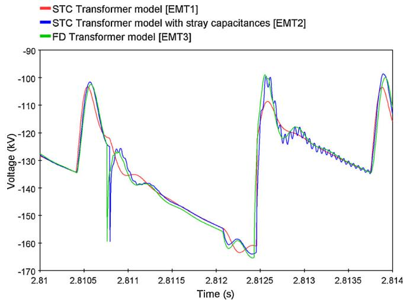  
Fig. 31. Simulation results for secondary 118 kV Y-connection side of the transformer over one period (top) and zoom (bottom).

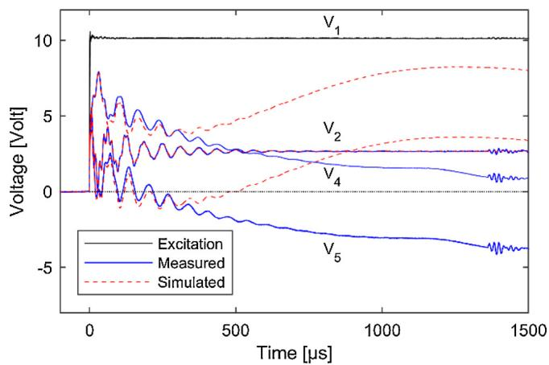  
Fig. 32. Measured and simulated voltage responses (Test 3), without common mode enforcement and MRT.

transformer. Fig. 32 shows a simulation which corresponds to the lower-left case in Fig. 18, when the model was obtained without the use of common-mode measurements and MRT. Compared to the previous result in Fig. 26, one can see that the model gives large errors after the initial fast transient.

# 10.2. Interference challenges

In order to successfully model a transformer from measurements, it is essential to validate both the measurement and modeling steps. The (admittance) measurements are validated by calculating voltage transfer functions which are compared against directly measured voltage transfers. This testing was made difficult by the presence of a nearby 400 kV AC line (Fig. 3) which induced a voltage of about 40 V peak value on the two LV windings when these had no connection to ground. As explained in Section $4 . 4 ,$ this voltage was so high that the VNA could not be used for measuring transferred voltages from the HV winding to floating LV windings. This problem was solved by using a 100 kΩ resistor in these measurements as shown in Fig. 12.

# 10.3. Robustness challenges

A direct measurement of the terminal admittance matrix $\mathbf { Y } _ { ( 5 \mathrm { ~ \times ~ } 5 ) }$ followed by model extraction without MRT offers the easiest way of extracting a model. The additional use of common-mode measurements and MRT gives certain challenges as the procedure becomes less robust. For instance, when merging $\mathbf { Y } _ { ( 3 \mathrm { ~ \times ~ } 3 ) }$ into $\mathbf { Y } _ { ( 5 \times \ 5 ) }$ one has to choose an upper frequency $f _ { 0 }$ for the merging so as to avoid loss of accuracy at higher frequencies. The fidelity of the resulting model depends on the choice of $f _ { 0 }$ and may therefore be subject to trials, making the procedure somewhat time consuming. Nevertheless, a very good end result was achieved for this transformer.

# 10.4. Computational efficiency

As explained in Section $^ { 5 , }$ we used vector fitting for extracting an initial model that was subjected to passivity enforcement by a sequential perturbation of the residue matrix eigenvalues. This approach permits a model to be extracted in a relatively short time (about one minute). Other passivity enforcement approaches based on convex optimization can lead to a slightly more accurate result but the calculation time is then much longer [20]. Since it is in practice necessary to try alternative model orders and frequency weightings, it is essential that the computational efficiency of each model extraction attempt (including passivity enforcement) is very high. In this particular case we also tried several alternative modeling strategies (without commonmode measurements, without MRT), each case requiring the extraction of a passive model.

# 10.5. Magnetizing currents

As demonstrated in Section 8, the magnetizing current associated with the measured admittance matrix turned out to be too high by factor of about 20. The resulting model therefore consumed too much reactive power in a simulation which in certain cases is undesirable. This problem was alleviated by scaling the eigenvalue of Y that is associated with the magnetizing current. The scaling was done with a high-pass filter such that the desired magnetizing current was obtained. This approach lead to some loss of accuracy of the final model when applied in high-frequency transient simulations.

# 10.6. Comparison against simplified model

The final model was in Section 9 applied in a simulation of the complete HVDC link, including the converters and control system. When comparing the simulated voltage on the 118 kV Y-connection side against those by a basic model with added capacitances, very similar wave shapes were obtained. However, the wide-band model gave a much stronger damping of high-frequency oscillations, implying a more realistic model.

# 10.7. Tap setting

The model was developed based on measurements with the tap setting in position N°1. In the EMTP simulation of the complete HVDC link (Section 9), it was therefore necessary to combine the model with an ideal transformer to obtain the correct voltage ratio for the HVDC point of operation (position N°12). The tap changer position will to some extent also affect the high-frequency behavior as was demonstrated in Ref. [12] for a 1-ph 3-winding transformer.

# 11. Conclusions

In order to simulate high-frequency overvoltages with a high accuracy, a wide-band model should be applied that is compatible with EMTP-type simulation programs. In this work we presented a measurement-based black-box model that is suitable for that purpose. The final model was demonstrated to reproduce measured time domain step responses (at low voltage) with a high degree of accuracy, and it compared favorably with a simplified model with added stray capacitances for a simulation of the HVDC link in normal operation.

The development of such model can be quite challenging, requiring an efficient procedure for measurements, model extraction and intermediate accuracy validations. Special challenges that were solved onsite included the representation of two ungrounded windings, interference from a 400 kV AC overhead line, and the excessive magnetizing current that resulted from the low core excitation during the measurements. The extracted model is valid for only a single tap position. Ideally, several measurement sets should be made so as to obtain models for a range of tap positions.

# Conflict of interest

None.

# Acknowledgement

The authors would like to thank RTE and the consortium participants of the SINTEF-led project “ProTrafo” (project no. 207160/E20) for sponsoring this research project.

# References

[1] Technical Brochure 34, Guidelines for the application of metal oxide arresters without gaps for HVDC converter stations, CIGRE WG 33/14.05.   
[2] W.J. McNutt, R.A. Hinton, Response of transformer windings to system transient voltages, IEEE Trans. Power Apparatus Syst. PAS-93 (2) (1974) 457–467.   
[3] P.I. Fergestad, T. Henriksen, Transient oscillations in multiwinding transformers, IEEE Trans. Power App. Syst. PAS-93 (March (2)) (1974) 500–509.   
[4] A. Semlyen, F. De León, Eddy current add-on frequency dependent representation of winding losses in transformer models used in computing electromagnetic transients, IEE Proc. Gener. Transm. Distrib. 141 (May (N°3)) (1994) 209–214.   
[5] S.M.H. Hosseini, M. Vakilian, G.B. Gharehpetian, Comparison of transformer detailed models for fast and very fast transient studies, IEEE Trans. Power Deliv. 23 (April (2)) (2008) 733–741.   
[6] E. Bjerkan, H.K. Hoidalen, High frequency FEM-based power transformer modeling: Investigation of internal stresses due to network initiated overvoltages, Proc. Int. Conf. Power Syst. Trans. (June) (2005) 19–23 Montreal, Canada.   
[7] B. Gustavsen, Á. Portillo, A damping factor-based white-box transformer model for network studies, IEEE Trans. Power Deliv. 33 (December (6)) (2018) 2956–2964.   
[8] A. Morched, L. Marti, J. Ottevangers, A high frequency transformer model for the EMTP, IEEE Trans. Power Deliv. 8 (July (3)) (1993) 1615–1626.   
[9] B. Gustavsen, Wide band modeling of power transformers, IEEE Trans. Power Deliv. 19 (January (1)) (2004) 414–422.   
[10] A. Borghetti, A. Morched, F. Napolitano, C.A. Nucci, M. Paolone, Lightning-induced overvoltages transferred through distribution power transformers, IEEE Trans. Power Deliv. 24 (January (1)) (2009) 360–372.   
[11] B. Filipovic-Grcic, I. Filipovic-Grcic, Uglesic, High-frequency model for the power transformer based on frequency-response measurements, IEEE Trans. Power Deliv. 30 (1) (2015) 34–42.   
[12] B. Gustavsen, A. Portillo, R. Ronchi, A. Mjelve, High-frequency resonant overvoltages in transformer regulating winding caused by ground fault initiation on feeding cable, IEEE Trans. Power Deliv. 33 (April (2)) (2018) 699–708.   
[13] B. Gustavsen, Rational modeling of multiport systems via a symmetry and passivity

preserving mode-revealing transformation, IEEE Trans. Power Deliv. 29 (1) (2014) 199–206.   
[14] B. Gustavsen, A. Semlyen, Rational approximation of frequency domain responses by vector fitting, IEEE Trans. Power Deliv. 14 (July (3)) (1999) 1052–1061.   
[15] B. Gustavsen, Improving the pole relocating properties of vector fitting, IEEE Trans. Power Deliv. 21 (July (3)) (2006) 1587–1592.   
[16] D. Deschrijver, M. Mrozowski, T. Dhaene, D. De Zutter, Macromodeling of multiport systems using a fast implementation of the vector fitting method, IEEE Microw. Wireless Compon. Lett. 18 (June (6)) (2008) 383–385.   
[17] B. Gustavsen, Fast passivity enforcement for pole-residue models by perturbation of residue matrix eigenvalues, IEEE Trans. Power Deliv. 23 (October (4)) (2008) 2278–2285.   
[18] B. Gustavsen, H.M.J. De Silva, Inclusion of rational models in an electromagnetic transients program — Y-parameters, Z-parameters, S-parameters, transfer functions, IEEE Trans. Power Deliv. 28 (April (2)) (2013) 1164–1174.   
[19] H.W. Dommel, EMTP Theory Book, Bonneville Power Administration, Portland, 1986.   
[20] L.P.R.K. Ihlenfeld, G.H.C. Oliveira, On the optimality of passive and symmetric high-frequency n-terminal transformer models, IEEE Trans. Power Deliv. 34

(February (1)) (2019) 129–136.

Bjørn Gustavsen was born in Norway in 1965. He received the M.Sc. degree and the Dr. Ing. degree in Electrical Engineering from the Norwegian Institute of Technology in Trondheim, Norway, in 1989 and 1993, respectively. Since 1994 he has been working at SINTEF Energy Research, currently as Chief Research Scientist. His interests include simulation of electromagnetic transients and modeling of frequency dependent effects. He spent 1996 as a Visiting Researcher at the University of Toronto, Canada, and the summer of 1998 at the Manitoba HVDC Research Centre, Winnipeg, Canada. He was Marie Curie Fellow at the University of Stuttgart, Germany, August 2001–August 2002. He is convenor of CIGRE JWG A2/C4.52.

Yannick Vernay (M’2010) was born in France in 1987. He graduated from Institut National des Sciences Appliquées de Lyon (INSA Lyon) in France in 2010. He joined the French TSO RTE (Réseau de Transport d'Electricité) where he is currently involved in EMT simulation using off-line and real-time simulation tools for HVDC and FACTS projects.