# Extension of a modal-domain transmission line model to include frequency-dependent ground parameters


Alberto De Conti ∗, Maique Paulo S. Emídio

LRC – Lightning Research Center, UFMG – Federal University of Minas Gerais, Av. Antônio Carlos, 6627, Pampulha, 31.270-901 Belo Horizonte, MG, Brazil

# a r t i c l e i n f o

Article history:

Available online 11 March 2016

Keywords:

Transmission line modeling

Modal domain

Frequency-dependent ground parameters

Ground admittance correction

Time-domain simulations

# a b s t r a c t

This paper investigates the effect of frequency-dependent ground parameters on the simulation of electromagnetic transients on overhead power distribution lines using a modal-domain based transmission line model available in popular electromagnetic transient programs. The line parameters are calculated considering a soil model that is based on field measurements of ground conductivity and permittivity in a wide frequency range. An assessment is made of the errors associated to assuming constant or frequency-dependent ground parameters in the calculation of the ground-return impedance and the ground admittance correction in the case of a poorly conducting ground. The propagation function and the characteristic impedance of the transmission lines are fitted in the frequency domain as the sum of rational functions. The associated poles and residues are written in a .pch file that is interpreted by the Alternative Transients Program (ATP) as a frequency-dependent line model. Time domain simulations are performed considering different types of transients on typical overhead power distribution lines. The results indicate that the consideration of frequency-dependent ground parameters can be relevant in the simulation of high-frequency transients on transmissions lines if the ground is a poor conductor, although the presence of line branches is likely to minimize the observed effects. It is also shown that constant values of ground conductivity and permittivity are able to lead to results comparable to those obtained with a dispersive ground model provided a suitable value is selected for the ground relative permittivity.

© 2016 Elsevier B.V. All rights reserved.

# 1. Introduction

The representation of the ground as a dispersive medium has been attracting a lot of attention in recent years. This is apparent from the increasing number of methodologies to measure and model the variation with frequency of the ground conductivity (-) and permittivity (ε) [1–4], as well as from the current efforts to study the effect of such variation on switching and lightning transients in power systems [5–16]. A renewed interest has also been shown in the calculation of the shunt admittance of overhead transmission lines considering the effect of a finitely conducting ground [17,18]. However, the transmission line models available in popular transient simulators still rely on the use of Carson’s integrals [19] or some suitable approximation [20] to calculate the transmission line parameters, assuming constant ground parameters and ultimately

neglecting the effect of a non-perfectly conducting ground in the calculation of the shunt admittance of the line. Since these approximations are valid for -  ωε, where ω is the angular frequency, inaccuracies are expected in the simulation of transients in cases involving poor ground conductivities, high-frequency transients, or a combination of both.

In this paper, an attempt is made to investigate the possible inaccuracies associated with assuming constant ground parameters in the time-domain simulation of electromagnetic transients on power distribution lines. For such, the transmission line model proposed by Marti [21] is adapted to consider the influence of frequency-dependent ground parameters. The paper is organized as follows. Section 2 discusses the calculation of the ground return impedance and of the ground admittance of overhead transmission lines assuming constant or frequency-dependent ground parameters. Section 3 proposes a procedure to extend Marti’s model [21] for calculating transients on power distribution lines considering the effect of frequency-dependent ground parameters. Results and analysis are presented in Section 4, followed by conclusions in Section 5.

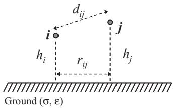  
Fig. 1. Problem geometry.

# 2. Calculation of transmission line parameters including ground-return effects

# 2.1. Ground-return impedance

The self and mutual terms of the ground-return impedance matrix of the overhead transmission line shown in Fig. 1 can be calculated with

$$
Z _ {g _ {i i}} ^ {\prime} = \frac {j \omega \mu_ {0}}{\pi} \int_ {0} ^ {\infty} \frac {e ^ {- 2 h _ {i} \lambda}}{\sqrt {\lambda^ {2} + \gamma_ {g} ^ {2}} + \lambda} d \lambda \tag {1}
$$

$$
Z _ {g _ {i j}} ^ {\prime} = \frac {j \omega \mu_ {0}}{\pi} \int_ {0} ^ {\infty} \frac {e ^ {- (h _ {i} + h _ {j}) \lambda}}{\sqrt {\lambda^ {2} + \gamma_ {g} ^ {2} + \lambda}} \cos \left(r _ {i j} \lambda\right) d \lambda \tag {2}
$$

where

$$
\gamma_ {g} = \sqrt {j \omega \mu_ {0} [ \sigma + j \omega (\varepsilon_ {r} - k) \varepsilon_ {0} ]} \tag {3}
$$

in which $\mu _ { 0 } = 4 \pi \times 1 0 ^ { - 7 } \mathrm { H } / \mathrm { m } , \varepsilon _ { 0 } = 8 . 8 5 \times 1 0 ^ { - 1 2 } \mathrm { F } / \mathrm { m }$ , ω is the angular frequency, in rad/s, - is the ground conductivity, in $S / \mathrm { m } , \varepsilon _ { r }$ is the ground relative permittivity, $r _ { i j }$ is the horizontal separation between conductors i and j, in m, $h _ { i }$ and $h _ { j }$ are the heights of conductors i and j, in m, and k is a constant that selects the desired ground-return model. If $k = 0 ,$ , Eqs. (1) and (2) reduce to Sunde’s equations $[ 2 2 ] ; \mathrm { i f } k = 1$ , they reduce to Nakagawa’s equations for the particular case of a homogeneous ground [23], which are reportedly more accurate than Sunde’s ones [18]; finally, $\mathrm { f } k = \varepsilon _ { r } ,$ meaning that ground and air have the same permittivity, Eqs. (1) and (2) reduce to Carson’s equations [19].

Suitable approximations to (1) and (2) in logarithmic form are given by [22,24]

$$
Z _ {\mathrm {g} _ {i i}} ^ {\prime} = \frac {j \omega \mu_ {0}}{2 \pi} \ln \left[ \frac {h _ {i} + \dot {p}}{h _ {i}} \right] \tag {4}
$$

$$
Z _ {g _ {i j}} ^ {\prime} = \frac {j \omega \mu_ {0}}{2 \pi} \ln \left[ \frac {\sqrt {\left(h _ {i} + h _ {j} + 2 \dot {p}\right) ^ {2} + r _ {i j} ^ {2}}}{\sqrt {\left(h _ {i} + h _ {j}\right) ^ {2} + r _ {i j} ^ {2}}} \right] \tag {5}
$$

where

$$
\dot {p} = \gamma_ {g} ^ {- 1} \tag {6}
$$

If $k = \varepsilon _ { r }$ in (3), Eqs. (4) and (5) reduce to the approximate formulas of Deri et al. [20], which are known to reproduce Carson’s equations within an accuracy of 10% in a wide frequency range. In [25] it is shown that (4) and (5) can also reproduce (1) and (2) with good accuracy if $k = 0$ , that is, if Sunde’s equations are assumed, even for a ground conductivity as low as 0.0001 S/m, which can be considered representative of critical conditions involving poorly conducting soils. For example, in the soil samples considered in the derivation of the ground model proposed in [4], at least 29 out of 63 measured values of low-frequency soil conductivity were equal to or lower than 0.001 S/m, with three samples reaching values below 0.0001 S/m. Here, it is shown that Eqs. (4) and (5) are also good approximations to (1) and (2) if k = 1 is considered in (3), that is, if

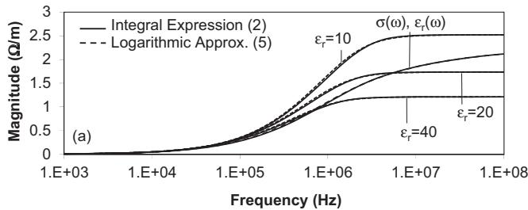

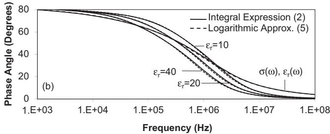  
Fig. 2. Comparison between the integral expression (2) with k = 1 in (3) (Nakagawa’s equation) and its logarithmic approximation (5) for hi = 8.4 m, hj = 7.2 m, $r _ { i j } = 2 \mathrm { \ m }$ , - = 0.0001 S/m and different values of $\varepsilon _ { r } .$ Also included are curves obtained for frequency-dependent values of ground conductivity and permittivity according to (9) and $( 1 0 ) ,$ , obtained for $\sigma _ { 0 } = 0 . 0 0 0 1 \Omega \mathrm { m }$ .

Nakagawa’s equations are assumed, even for $\sigma { = } 0 . 0 0 0 1 \mathrm { S / m }$ . This is illustrated in Fig. 2, which shows the magnitude and phase angle of the mutual term of the ground-return impedance associated with two conductors with radius of 5 mm, one located 8.4 m and the other 7.2 m above the ground, with a horizontal separation of 2 m, for different values of $\varepsilon _ { r } .$ . Although not shown, a similar agreement is observed if the ground conductivity is varied in the range 0.0001 < - < 0.01 S/m, also for the self-term of the ground-return impedance expressed by (1) and (4). This confirms the accuracy of (4) and (5) for conductor heights and separations that are typical of power distribution line configurations.

Carson’s equations [19] or Deri et al.’s approximations [20] can also be obtained from (1) to (6) regardless of the value of k if the conduction currents are much higher than the displacement currents in the ground, that is, if -  ωε. This means that Carson’s theory should not be used in the analysis of high-frequency transients if the ground is poorly conducting. For example, for a relatively high conductivity of $\sigma { = } 0 . 0 1 S / \mathrm { m }$ , it can be shown that Carson’s integrals are accurate up to few MHz, which is the frequency range of most power system transients. However, for a ground conductivity of $\sigma { = } 0 . 0 0 1 \ : \mathrm { S / m }$ inaccuracies are observed in the phase angle of Carson’s ground-return impedance in frequencies of few hundreds kHz [24]. This is because for such frequencies and such value of ground conductivity the assumption -  ωε may no longer hold.

In a worst case scenario involving a lower ground conductivity of 0.0001 S/m, the validity of Carson’s integrals is even more limited. This is shown in Fig. 3, which illustrates the percentage error in the magnitude and phase angle of the mutual term of the ground impedance calculated with Carson’s equation taking as reference Nakagawa’s equation for the case corresponding to Fig. 2. It is seen that the errors can be very significant for frequencies above 100 kHz. These errors are directly related to the impossibility to include in Carson’s equations a ground permittivity other than that of the air. Since Carson’s equations or their logarithmic approximations (4) and (5) are implemented in popular electromagnetic transient simulators, the use of the transmission line models available in these programs is therefore limited to cases in which the condition - ωε is satisfied.

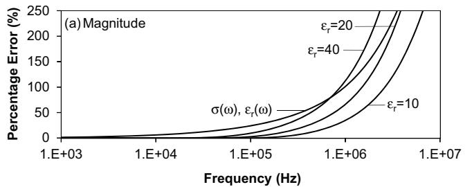

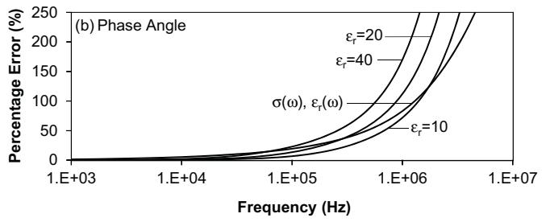  
Fig. 3. Percentage error in the (a) magnitude and (b) phase angle of the mutual term of the ground impedance calculated with Carson’s expression [(2) with k = εr in (3)], taking as reference the more general formula of Nakagawa [(2) with k = 1 in (3)] for $h _ { i } = 8 . 4 , h _ { j } = 7 . 2 \mathrm { m } , r _ { i j } = 2 \mathrm { m } , \sigma = 0 . 0 0 0 1$ 1 S/m and different values of ε . Also included is the error curve obtained for frequency-dependent values of ground conductivity and permittivity according to (9) and (10), obtained for $\sigma _ { 0 } = 0 . 0 0 0 1 \Omega \mathrm { m }$ .

# 2.2. Ground admittance correction

The shunt admittance of an overhead transmission line can be written as

$$
Y = j \omega P ^ {- 1} = Y _ {0} + Y _ {g} \tag {7}
$$

where P is the matrix of coefficients of potential, $Y _ { 0 }$ is the admittance matrix obtained assuming a perfectly conducting ground, and $Y _ { g }$ is the correction term associated with a non-perfectly conducting ground.

Several expressions have been proposed to calculate (7) including the ground admittance correction term $Y _ { g }$ (e.g., $[ 1 7 , 1 8 , 2 3 , 2 6 - 2 8 ] )$ . However, the condition $\sigma \to \infty$ is assumed for calculating Y in popular electromagnetic transient programs, which means that $Y _ { g }$ is neglected and $Y = Y _ { 0 }$ is ultimately considered. This is certainly a good approximation for studying transients on overhead transmission lines in the cases where the condition - ωε is satisfied, that is, in cases where the ground-return impedance can be calculated with Carson’s approximation. However, there is some debate whether this simplification would still be valid for heights and spacings typically associated with overhead distribution lines if a poorly conducting ground is assumed.

One of the expressions available for calculating the shunt admittance of overhead lines including ground effects was proposed by Wise [23,26]. If the magnetic permeability of the ground is assumed equal to that of the vacuum, the elements of matrix P as proposed by Wise [23,26] can be written as

$$
p _ {i j} = \frac {1}{2 \pi \varepsilon_ {0}} \left[ \ln \frac {D _ {i j}}{d _ {i j}} + 2 \int_ {0} ^ {\infty} \frac {\cos \left(r _ {i j} \lambda\right) e ^ {- \left(h _ {i} + h _ {j}\right) \lambda}}{\left(1 + \gamma_ {g} ^ {2} / \gamma_ {0} ^ {2}\right) \lambda + \sqrt {\lambda^ {2} + \gamma_ {g} ^ {2}}} d \lambda \right] \tag {8}
$$

where $d _ { i j }$ is the direct distance between conductors i and j (see Fig. 1), $D _ { i j }$ is the distance between conductor i to the image of conductor j assuming a perfectly conducting ground, $r _ { i j }$ is the horizontal separation between conductors i and j (all distances in meters), $\gamma _ { g }$ is given by (3) with $k = 1$ , and $\gamma _ { 0 } = j \omega / c ,$ , where c is the speed of light. If only the first term of (8) is considered, the inverse of P leads to the per-unit-length capacitance of the line assuming a perfectly conducting ground. The second term in (8) therefore incorporates into P the effect of a non-perfectly conducting ground.

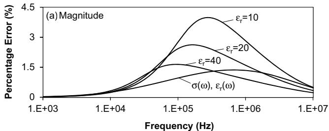

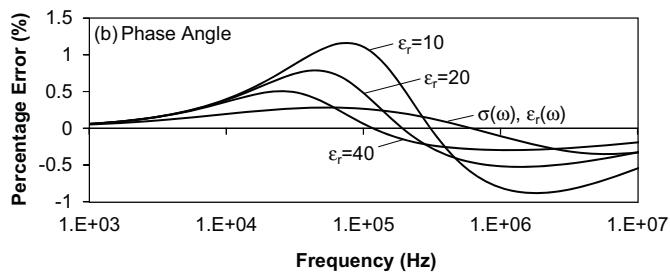  
Fig. 4. Percentage error in the (a) magnitude and (b) phase angle of the self term of the ground admittance calculated with 100 $Y _ { g } / Y _ { 0 } ) \times$ 100% for $h _ { i } = 8 . 4 \mathrm { m } , h _ { j } = 7 . 2 \mathrm { m } ,$ , $r _ { i j } = 2 \mathrm { m }$ , conductor radius of 5 mm, and $\sigma = 0 . 0 0 0 1$ 1 S/m. Also included are curves obtained for frequency-dependent values of ground conductivity and permittivity according to (9) and (10), obtained for $\sigma _ { 0 } = 0 . 0 0 0 1 \Omega$ m.

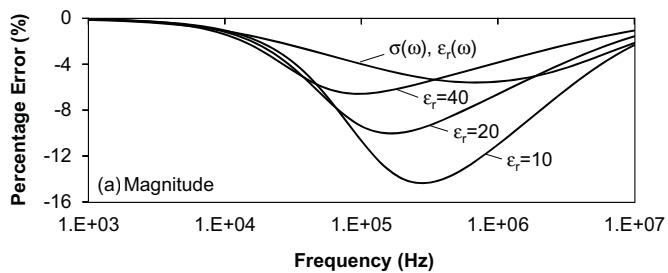

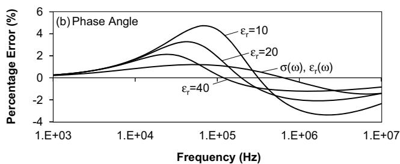  
Fig. 5. Same as Fig. 4, but for the mutual term of the ground admittance.

To investigate the effect of including $Y _ { g }$ in (7) using Wise’s expression (8), the same two-conductor line previously considered for obtaining the results shown in Figs. 2 and 3 was used. The results are illustrated in Figs. 4 and 5, which respectively show the percentage error in the calculation of the self and mutual terms of Y using the expression $( Y _ { g } / Y _ { 0 } ) \times 1 0 0 \%$ for different values of $\varepsilon _ { r } ,$ assuming a ground conductivity of 0.0001 S/m. It is seen that the errors in magnitude are below 5% and 15% for the self and mutual admittance terms, respectively. The errors in the phase angle are below 5% in both cases. By comparing Figs. 4 and 5 with Fig. 3, which shows the errors related to using Carson’s formula in the calculation of the ground-return impedance for $\sigma { = } 0 . 0 0 0 1 \mathrm { S / m }$ , it is seen that the impact of neglecting $Y _ { g }$ in the calculation of Y is not as significant. Since the influence of $\mathbf { \bar { \nabla } } Y _ { g }$ is even lower for higher values of ground conductivity, the usual assumption of neglecting $Y _ { g }$ in the calculation of transients is also considered here for simplicity.

# 2.3. Frequency-dependent ground parameters

The analysis in the previous sections assumed both - and ε as constants. However, it is known that - increases with increasing frequency while ε correspondingly decreases [3,4]. Some authors suggest that such variation can affect switching and lightning transients in frequencies as low as tens of kHz, depending on the soil characteristics [2]. Nevertheless, popular electromagnetic transient simulators assume constant ground parameters in the calculation of transmission line parameters.

In recent years, different methodologies have been proposed for measuring and modeling the variation of - and ε with frequency (e.g., [1–4]). In this paper, the soil model of Alipio and Visacro [4] is considered. This model is based on the measurement of the frequency response of 65 types of soils, which presented lowfrequency resistivity values ranging from 60 to about 18 000 	 m. In all cases, a strongly frequency-dependent behavior was observed in both - and ε.

By considering a statistical approach to account for the natural dispersion of the measured values of ground conductivity and permittivity and using Kramers–Kronig’s equations [29] to include the dependence that exists in their frequency variation, Alipio and Visacro [4] proposed the following causal expressions to represent the frequency-dependent behavior of $\sigma ( \omega )$ and $\varepsilon _ { r } ( \omega )$

$$
\sigma (\omega) = \sigma_ {0} + \sigma_ {0} \times h \left(\sigma_ {0}\right) \left(\frac {f}{1 0 ^ {6}}\right) ^ {n} \tag {9}
$$

$$
\varepsilon_ {r} (\omega) = \frac {\varepsilon_ {\infty} ^ {\prime}}{\varepsilon_ {0}} + \frac {\tan (n \pi / 2) \times 1 0 ^ {- 3}}{2 \pi \varepsilon_ {0} 1 0 ^ {6 n}} \sigma_ {0} \times h \left(\sigma_ {0}\right) f ^ {n - 1} \tag {10}
$$

where $\sigma ( \omega )$ is the frequency-dependent ground conductivity, in mS/m, $\sigma _ { 0 }$ is the low-frequency ground conductivity determined at 100 Hz, in mS/m, εr(ω) is the frequency-dependent relative permittivity, $\varepsilon _ { \infty } ^ { \prime } / \varepsilon _ { 0 }$ is the relative permittivity at higher frequencies, f is the frequency, and $h ( \sigma _ { 0 } )$ is a weighting constant that controls the variation of $\sigma ( \omega )$ and $\varepsilon _ { r } ( \omega )$ with frequency. In [4], three different weighting constants are proposed, each corresponding to a given level of variation of $\sigma ( \omega )$ and $\varepsilon _ { r } ( \omega )$ . Here $h ( \sigma _ { 0 } ) = 1 . 2 6 \times \sigma _ { 0 } ^ { - 0 . 7 3 }$ 1 is assumed, which leads to a variation in $\sigma ( \omega )$ that approaches the mean relative increase of ground conductivity with frequency observed in the 65 different soils studied in [4]. This equation is used in (9) and (10) considering $\varepsilon _ { \infty } ^ { \prime } / \varepsilon _ { 0 } = 1 2$ and $n { = } 0 . 5 4$ , as recom-∞mended in [4]. Application examples of (9) and (10) are illustrated in the curves labeled as $\sigma ( \omega )$ and $\varepsilon _ { r } ( \omega )$ shown in Figs. $^ { 2 - 5 , }$ where $\sigma _ { 0 } = 0 . 0 0 0 1$ S/m is assumed. It is seen that the consideration of values of - and $\varepsilon _ { r }$ varying with frequency affects considerably both magnitude and phase angle of the calculated parameters. In particular, it reduces even further the errors incurred in neglecting $Y _ { g }$ in the calculation of the shunt admittance of the line, as seen in Figs. 4 and 5.

# 3. Marti’s transmission line model considering frequency-dependent ground parameters

The transmission line model proposed by Marti [21] is possibly the most popular model for the digital simulation of electromagnetic transients on overhead lines. It is a distributed-parameter model that includes the variation of the line parameters with frequency. The solution of the transmission line equations is performed in the modal domain, where a system of n coupled conductors is represented as n independent single-phase lines by means of a similarity transformation. For the computation of the voltages and currents in time domain, a constant and real transformation matrix is considered [21]. Although more accurate transmission line models are currently available (e.g., [30]), Marti’s model can be successfully applied in the simulation of transients

on overhead lines in most practical cases without significant errors [31].

The JMarti setup available in the LCC routine of ATPDraw [32] considers Carson’s equations for calculating the parameters of overhead transmission lines. For this reason, an alternative implementation of Marti’s model was necessary to evaluate the effect of frequency-dependent ground parameters in the time domain simulation of electromagnetic transients. This implementation consists in calculating the ground-return impedance with Nakagawa’s equations [(1)–(2) with k = 1 in (3)] and in assuming the ground parameters to vary as described in (9) and (10). The vector fitting technique [33] is used for synthesizing the characteristic impedance and the propagation function of each transmission line mode using a dedicated set of poles and residues. The real transformation matrix necessary for the time domain simulations is calculated at a selected frequency. As mentioned earlier, the effect of the ground admittance correction is neglected for simplicity.

A full code with a version of Marti’s model extended to deal with complex poles and residues was written in MATLAB. An alternative implementation in ATP was also investigated. It consists in fitting the characteristic impedances and propagation functions of the line modes with sets of real poles and residues. The obtained poles and residues are written, together with the time delays of each mode and a real transformation matrix, in the form of a .pch file that is interpreted by ATP as transmission line model of Marti type. Transmission line voltages and currents were calculated for different line configurations in ATP using the proposed approach. The ATP results presented an overall excellent agreement with the results obtained with the full code implemented in MATLAB. The MATLAB code used to write .pch files from a given set of real poles and residues is listed in Appendix A for the particular case of single- or two-phase lines.

# 4. Results and analysis

This section presents simulation results of switching and lightning transients on overhead lines considering different approaches for including the effect of a non-perfectly conducting ground in the calculation of the transmission line parameters. Conductor heights and spacings typical of power distribution lines are considered.

# 4.1. Single-phase line

Fig. 6 illustrates voltages calculated at the receiving end of a 600- m long overhead line subjected to a unit step voltage at the sending end. The line is 10-m high and consists of a single copper wire with 5 mm radius. The internal impedance of the wire was calculated using the traditional formulation based on Bessel’s functions. An ideal voltage source was connected to the sending end, while the receiving end was left open. Three values were assumed for $\sigma _ { 0 } ,$ namely 0.01, 0.001 or 0.0001 S/m. Three different possibilities were considered for the calculation of the transmission line parameters, namely: $( \mathrm { i } ) Z _ { g }$ calculated with Carson’s equation for constant - and $Y _ { g } = 0 \ ( \mathrm { A T P }$ approach, labeled as $" \sigma _ { 0 } ,$ Carson”, in Fig. 6); (ii) $Z _ { g }$ calculated with Nakagawa’s equation for constant $\sigma , \varepsilon _ { r } = 4 0$ , and $\bar { Y _ { g } } = 0$ (labeled as $^ { * } \sigma _ { 0 } , \varepsilon _ { r } = 4 0$ , Nakagawa”); and (iii) $Z _ { g }$ calculated with Nakagawa’s equation assuming frequency-dependent ground conductivity and permittivity, with $Y _ { g } = 0$ (labeled as $\ " \sigma ( \omega ) , \varepsilon ( \omega )$ , Nakagawa”).

As expected, it is seen in Fig. 6 that all modeling possibilities lead to nearly identical results if $\sigma _ { 0 } = 0 . 0 1 \ : \mathrm { S / m }$ is assumed and to very similar results if $\sigma _ { 0 } = 0 . 0 0 1 S /$ m is considered. For a poorer ground conductivity of $\sigma _ { 0 } = 0 . 0 0 0 1 \mathrm { { } S / m } ,$ , however, more noticeable differences are observed, especially if Carson’s formula is used for

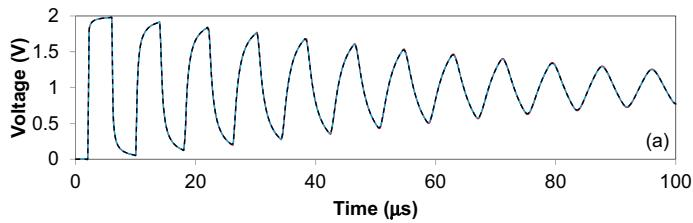

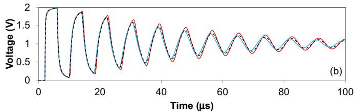

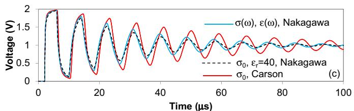  
Fig. 6. Voltages at the receiving end of a 600-m long single-phase line for the application of a unit step voltage at the sending end, considering different modeling approaches (see text for details): (a) $\sigma _ { 0 } = 0 . 0 \dot { 1 }$ 1 S/m; (b) $\sigma _ { 0 } = 0 . 0 0 1 \mathrm { { } } S / \mathrm { { m } ; }$ and (c) -0 = 0.0001 S/m.

calculating $\cdot Z _ { g }$ with constant ground parameters. As seen in Fig. $6 ( \mathbf { c } ) ,$ , the voltage waveform associated with the use of Carson’s formula is less attenuated and presents a lower oscillation frequency than the remaining curves for the considered line length of 600 m. This observation is consistent with Fig. 7(a), which shows that the phase velocity associated with the use of Carson’s formula with constant ground parameters approaches the speed of light slower than the other curves at high frequencies. Also, Fig. 7(b) shows that the attenuation constant associated with the use of Carson’s formula with constant ground parameters is lower than the ones calculated with the other modeling approaches up to about 1 MHz, which explains the behavior observed in the tail of the waveforms shown Fig. 6(c). It is to be noted that at higher frequencies the attenuation constant associated with Carson’s formula is larger than the ones calculated with the remaining equations. However, for the

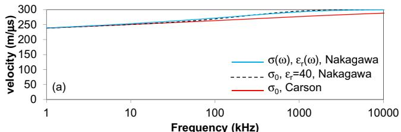

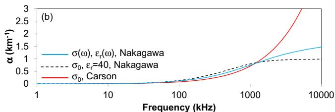  
Fig. 7. (a) Phase velocity and (b) attenuation constant associated with the considered single-phase line for $\sigma _ { 0 } = 0 . 0 0 0 1$ 1 S/m and different modeling approaches.

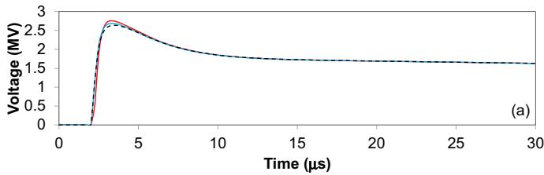

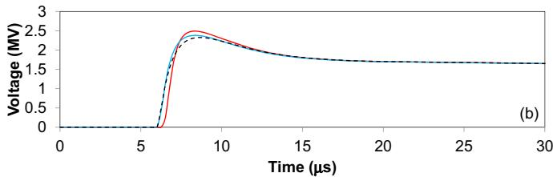

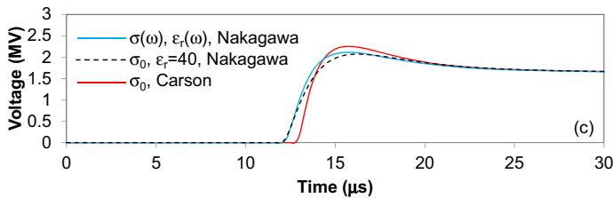  
Fig. 8. Voltages at the receiving end of a single-phase line with length of (a) 600 m, (b) 1800 m o $( { \mathsf { c } } )$ 3600 m assuming the injection of a lightning current at the sending end and considering $\sigma _ { 0 } = 0 . 0 0 0 1 \ : S / 1$ m. Both line ends were connected to a matching resistance of 497.6 	.

considered line length of 600 m and a ground conductivity of 0.0001 S/m most of the high-frequency content associated with the applied step voltage is dissipated before arriving at the sending end. Consequently, the differences in the attenuation constants for frequencies above 1 MHz are not significant in the illustrated case. They would be more relevant only if a much shorter transmission line were considered. Interestingly, Fig. 6 indicates that the voltage waveforms calculated assuming frequency-dependent ground parameters are very similar to those calculated assuming constant ground parameters with $\varepsilon _ { r } = 4 0$ .

Fig. 8 illustrates voltages calculated at the receiving end of the considered single-phase line if a lightning current is injected at its sending end. Due to its higher frequency content compared to a first stroke current, a subsequent stroke current with peak value of 12 kA representative of negative downward lightning measured at Mount San Salvatore, Switzerland, was considered [34,35]. This was made to emphasize the differences between the investigated models, which would be probably less apparent if a first stroke current were assumed. Three different line lengths were considered, namely 600, 1800 and 3600 m. In all cases, the line was grounded at both ends by means of a matching resistance of 497.6 	. A low-frequency ground conductivity of 0.0001 S/m was assumed. As before, three different possibilities were considered for calculating the transmission line parameters [conditions (i)–(iii) described above]. For reference, the .pch file used for simulating in ATP the 1800-m line with frequency-dependent ground parameters is listed in Appendix B.

By analyzing the voltage waveforms illustrated in Fig. 8, it is seen that the calculation of the transmission line parameters with Carson’s formula considering constant ground parameters once again leads to higher amplitudes and slower wave propagation compared to the other modeling approaches for the assumed ground conductivity. As in Fig. 6, a good agreement is observed between voltages calculated assuming constant ground parameters with $\varepsilon _ { r } = 4 0$ and voltages calculated considering frequency-dependent ground parameters.

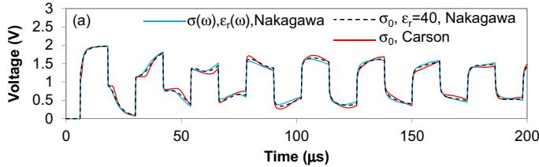

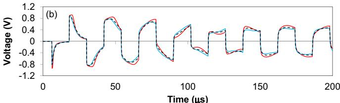  
Fig. 9. Voltages at the receiving end of a two-phase line with length of 1800 m for the application of a unit step voltage at the top conductor with the other conductor grounded. The receiving end of both conductors was left open: (a) voltages at the top conductor and (b) voltages at the bottom conductor. Ground conductivity: $\sigma _ { 0 } = 0 . 0 0 0 1 \mathrm { { } S / m }$ .

# 4.2. Two-phase line

Fig. 9 illustrates voltages calculated at the receiving end of a typical two-phase distribution line consisting of two vertically-stacked conductors with heights of 8.4 m and 7.2 m, respectively, and length of 1800 m. In the calculations, a unit step voltage was applied at the sending end of the top conductor by an ideal voltage source, while the other conductor was grounded. The receiving ends of both conductors were left open. In the calculations, a 5-mm conductor radius was assumed together with $\sigma _ { 0 } = 0 . 0 0 0 1$ S/m. The same conditions of the previous section were assumed for the calculation of the transmission line parameters. The .pch file obtained assuming frequency-dependent ground parameters is listed in Appendix C.

It is seen in Fig. 9 that the voltage waveforms calculated with Carson’s expressions are again the ones presenting the largest deviations. However, the observed differences are not as significant as in the single-phase case. It is also observed that assuming constant ground parameters with $\varepsilon _ { r } = 4 0$ leads once again to voltage waveforms in very good agreement with those calculated assuming frequency-dependent ground parameters.

The analysis is now repeated considering a ground-mode excitation of the line with a unit step voltage. This is performed by connecting an ideal voltage source to both conductors at the

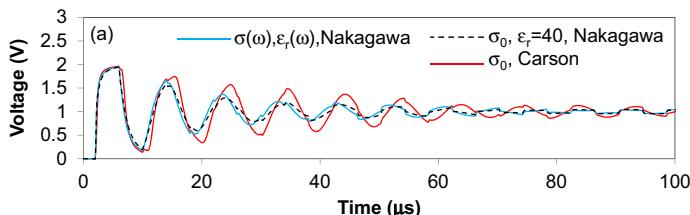

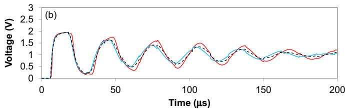  
Fig. 10. Voltages at the receiving end of a two-phase line (top conductor) assuming a ground-mode excitation with a unit step voltage. The receiving end of both conductors was left open: (a) line length of 600 m; (b) line length of 1800 m. Ground conductivity: $\sigma _ { 0 } = 0 . 0 0 0 1$ S/m.

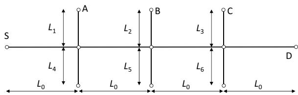  
Fig. 11. Simulated branched distribution line.

sending end while the receiving end is left open. Fig. 10 illustrates the voltages calculated at the receiving end of the top conductor for line lengths of 600 m and 1800 m. If the results are compared with Fig. 9, larger deviations are observed between the voltage waveforms calculated considering Carson’s expressions and the voltage waveforms calculated with the other modeling approaches, especially for the shorter line. This is due to the ground-mode excitation, which makes this case analogous to the single-phase line case studied in Section 4.1.

# 4.3. Two-phase line with branches

Most of the literature dealing with the influence of frequencydependent ground parameters on switching and lightning transients on overhead lines disregards the presence of line branches. Since this condition is typical of power distribution lines, a final case is presented in which the branched distribution line illustrated in Fig. 11 is subjected to a unit step excitation at point S for a ground conductivity of 0.0001 S/m. Once again, a two-phase line with vertically-stacked conductors is considered, with $L _ { 0 } = L _ { 2 } = L _ { 4 } = 3 0 0 \mathrm { m }$ and $L _ { 1 } = L _ { 3 } = L _ { 5 } = L _ { 6 } = 1 5 0 \mathrm { m }$ . The points A, B, C, and D, which could represent the points of installation of

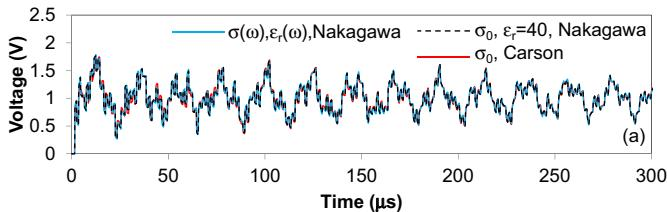

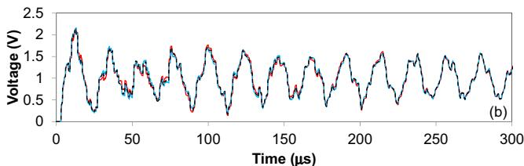

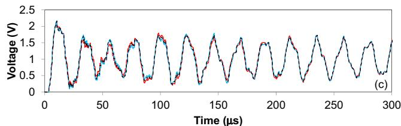

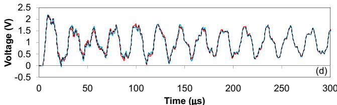  
Fig. 12. Voltages at points (a) A, (b) B, (c) C, and (d) D of the power distribution line of Fig. 11 for the application of a unit step voltage at the top conductor with the other conductor grounded at point S.

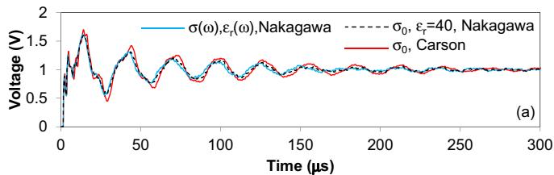

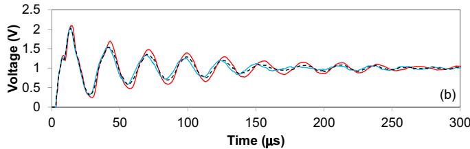

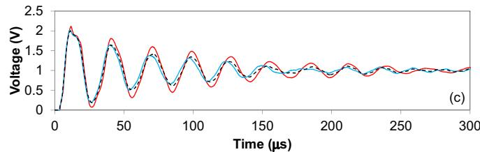

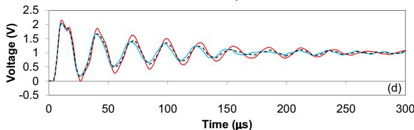  
Fig. 13. Voltages at points (a) A, (b) B, (c) C, and (d) D of the power distribution line of Fig. 11 for the application of a unit step voltage at both conductors at point S.

distribution transformers, were left open. The same possibilities considered in the previous sections [conditions (i)–(iii) described in Section 4.1] were assumed for calculating the transmission line parameters. The .pch file corresponding to a line length of 150 m considering frequency-dependent parameters is listed in Appendix D.

Fig. 12 shows voltages calculated at points A, B, C, and D assuming the connection of the top conductor to an ideal voltage source at point S while the bottom conductor was grounded at that point. Fig. 13 repeats the analysis, but considering a ground-mode excitation in which an ideal voltage source was connected to both conductors at point S. It is seen in both cases that the presence of multiple branches is likely to reduce the relative importance of the

model assumed to include the effect of a non-perfectly conducting ground in the transmission line parameters. This result suggests the possibility of using simplified models in certain types of analysis even for a ground conductivity as low as 0.0001 S/m. Once again the assumption of constant ground conductivity and $\varepsilon _ { r } = 4 0$ leads to voltage waveforms nearly coincident with the ones calculated assuming frequency-dependent ground parameters.

# 5. Conclusions

In this paper, a modal-domain transmission line model was extended to calculate transients in time domain considering frequency-dependent ground parameters. Tests performed with single- and two-phase power distribution lines indicated that the consideration of frequency-dependent ground parameters can be relevant to the study of high-frequency phenomena on overhead lines located above a poorly conducting ground $( \mathbf { e . g . , } \sigma < 0 . 0 0 1 \varsigma / \mathrm { m } )$ . It was also shown that frequency-dependent ground parameters are likely to reduce the errors incurred in neglecting the ground admittance correction in the calculation of the shunt admittance of overhead transmission lines.

By taking as reference a specific soil model that includes the variation of the ground conductivity and permittivity with frequency, it was shown that assuming a constant value for - together with a suitable value for ε is able to lead to voltage waveforms in good agreement with those obtained with the frequency-dependent ground model. In the particular cases considered in this paper, the use of εr = 40 together with the low-frequency value of the ground conductivity was seen to lead to good results. In all simulated cases, the effect of considering the ground admittance correction was neglected, although the proposed methodology could also be used to investigate it.

The obtained results suggest that the presence of line branches contributes to reduce the relative importance of the model assumed to include the influence of the ground in the simulation of transients on power distribution lines. In the investigated case, the use of Carson’s equations with constant ground parameters was seen to lead to results comparable to those obtained with a more complete model with frequency-dependent ground parameters.

# Acknowledgments

This work was supported by The State of Minas Gerais Research Foundation (FAPEMIG), under grants TEC PPM-00066-15 and TEC APQ-02399-13, and in part by the National Council for Scientific and Technological Development (CNPq), under grant 306195/2013-5.

# Appendix A. Code used to write .pch files from a given set of real poles and residues for single or two-phase lines

```matlab
%Prof. Alberto De Conti (conti@cpdee.ufgm.br)  
%LRC - Lightning Research Center  
%UFMG - Federal University of Minas Gerais  
%NZC: (1xNPhases) array containing the number of poles used to fit the characteristic impedance (Zc)  
%NP: (1xNPhases) array containing the number of poles used to fit P(w)=A(w)exp(tau*s)  
%residZc: 2x(max(NZc)+1) array containing the residues of Zc plus one independent term  
%polesZc: 2x(max(NZc)) array containing the poles of Zc  
%residP: 2x(max(Np)) array containing the residues of P(w)  
%polesP: 2x(max(Np)) array containing the poles of P(w)  
%TI: 2x2 transformation matrix  
filename='FDLine.pch';  
fid = fopen(filename,'wt');  
for mode=1:NPhases  
switch mode  
case 1  
fprintf(fid,'-%1.0fIN_AOUT_A 2. 0.00 -2 %1.0f\n',mode,NPhases);  
case 2  
fprintf(fid,'-%1.0fIN_BOUT_B 2. 0.00 -2 %1.0f\n',mode,NPhases);  
end  
%Write the residues of Zc  
fprintf(fid,' %2.0f %25.19E\n',NZc(mode), residZc(mode,1));  
k=1; col=0;  
while k<=NZc(mode)  
fprintf(fid,' %24.17E',residZc(mode,k+1); col=col+1;  
if or(col==3,k==NZc(mode),fprintf(fid,'\n'); end  
if col==3, col=0; end  
k=k+1;  
end  
%Write the poles of Zc  
k=1; col=0;  
while k<=NZc(mode)  
fprintf(fid,' %24.17E',-polesZc(mode,k); col=col+1;  
if or(col==3,k==NZc(mode),fprintf(fid,'\n'); end  
if col==3, col=0; end  
k=k+1;  
end  
%Write the residues of P(w)  
fprintf(fid,' %2.0f %25.19E\n',NP(mode), tau(mode));  
k=1; col=0;  
while k<=NP(mode)  
fprintf(fid,' %24.17E',residP(mode,k); col=col+1;  
if or(col==3,k==NP(mode),fprintf(fid,'\n'); end  
if col==3, col=0; end  
k=k+1;  
end  
%Write the poles of P(w)  
k=1; col=0;  
while k<=NP(mode)  
fprintf(fid,' %24.17E',-polesP(mode,k); col=col+1;  
if or(col==3,k==NP(mode),fprintf(fid,'\n'); end  
if col==3, col=0; end  
k=k+1;  
end  
%Write the transformation matrix  
k=1;  
while k<=NPhases  
col=1;  
while col<=NPhases, fprintf(fid,' %11.8f',TI(k,col)); col=col+1;  
end  
fprintf(fid,'\n'); col=1;  
while col<=NPhases, fprintf(fid,' %11.8f',0); col=col+1;  
end  
fprintf(fid,'\n'); k=k+1;  
end  
fclose(fid); 
```

# Appendix B. PCH file of the 1800-m long single-phase line of Section 4.1 considering frequency-dependent ground parameters

<table><tr><td colspan="4">-1IN _AOUT _A 12 4.97518813246000060000E+02</td></tr><tr><td>7.62294902872565840E+07</td><td>1.04623415994704160E+08</td><td>3.92987990100649220E+07</td><td></td></tr><tr><td>9.82826817761254500E+06</td><td>2.13804090589577100E+06</td><td>4.38164204705574430E+05</td><td></td></tr><tr><td>8.73052033035165220E+04</td><td>1.51956662953717000E+04</td><td>4.61614920183334560E+03</td><td></td></tr><tr><td>8.44996143211887100E+03</td><td>7.03794150781468400E+03</td><td>6.54121889291730710E+03</td><td></td></tr><tr><td>2.52866982623538750E+07</td><td>5.63690496673086840E+06</td><td>1.49640436482905270E+06</td><td></td></tr><tr><td>3.70646792789121270E+05</td><td>8.61411421074648390E+04</td><td>1.86496173122758770E+04</td><td></td></tr><tr><td>3.86592654620929170E+03</td><td>7.19065136925436260E+02</td><td>1.16442139350183980E+02</td><td></td></tr><tr><td>3.22801029706228920E+01</td><td>1.09123695615007840E+01</td><td>3.64942069553188640E+00</td><td></td></tr><tr><td colspan="4">12 6.0009579348198744000E-06</td></tr><tr><td>-1.51359429411465790E+08</td><td>6.73408550664292720E+07</td><td>1.69496707903753220E+06</td><td></td></tr><tr><td>2.14111112702680400E+05</td><td>9.93785017695561520E+05</td><td>4.01429664004130230E+05</td><td></td></tr><tr><td>5.10220668652505850E+04</td><td>3.94354379710252310E+03</td><td>2.17058026557060090E+02</td><td></td></tr><tr><td>7.69501814326229280E+00</td><td>9.18668876031060730E-02</td><td>3.66952589002696950E-03</td><td></td></tr><tr><td>2.98696019277215290E+09</td><td>7.34199552719500300E+08</td><td>7.13852159545704280E+07</td><td></td></tr><tr><td>1.23100258244972690E+07</td><td>2.63067083481484050E+06</td><td>1.10360140533707270E+06</td><td></td></tr><tr><td>3.88244074494021480E+05</td><td>1.13621830957084120E+05</td><td>2.68988780764475560E+04</td><td></td></tr><tr><td>4.80778755485290910E+03</td><td>4.42847251123484910E+02</td><td>2.23066525229304520E+01</td><td></td></tr><tr><td colspan="4">1.00000000</td></tr><tr><td colspan="4">0.00000000</td></tr></table>

# Appendix C. PCH file of the 1800-m long two-phase line of Section 4.2 considering frequency-dependent ground parameters

<table><tr><td>-1IN_AOUT_A</td><td>2.0.00</td><td>-2 2</td></tr><tr><td>7 3.2948573876702483000E+02</td><td></td><td></td></tr><tr><td>7.78452290121418770E+05</td><td>1.09692363548247930E+05</td><td>1.61817540455491510E+04</td></tr><tr><td>1.06935656306628010E+04</td><td>9.26270979933812490E+03</td><td>6.13850069692725080E+03</td></tr><tr><td>5.52233277779119540E+03</td><td></td><td></td></tr><tr><td>7.06849076511145570E+05</td><td>3.59880992126282360E+04</td><td>4.22334603971366600E+03</td></tr><tr><td>1.01963947824772210E+02</td><td>3.28352842246313660E+01</td><td>1.01390923882290260E+01</td></tr><tr><td>2.75042514722666940E+00</td><td></td><td></td></tr><tr><td>7 6.0017128234949401000E-06</td><td></td><td></td></tr><tr><td>5.00049947984113340E+08</td><td>2.22201448918351020E+06</td><td>1.84820536371367870E+05</td></tr><tr><td>1.88929019083900060E+04</td><td>1.13899599366537950E+03</td><td>3.54595453135296170E+01</td></tr><tr><td>2.82617148396447850E-02</td><td></td><td></td></tr><tr><td>5.53749032752236250E+08</td><td>3.82103774700258000E+07</td><td>9.08706120068887990E+06</td></tr><tr><td>1.64282738572139220E+06</td><td>2.40364138494535090E+05</td><td>2.20346442677264350E+04</td></tr><tr><td>6.71418872747907610E+01</td><td></td><td></td></tr><tr><td>-2IN BOUT_B</td><td>2.0.00</td><td>-2 2</td></tr><tr><td>12 6.3380672727100011000E+02</td><td></td><td></td></tr><tr><td>3.14087792161017060E+08</td><td>2.36720098694215090E+08</td><td>6.96970329492859540E+07</td></tr><tr><td>1.62109635947037860E+07</td><td>3.40240037960889380E+06</td><td>7.03913067969027670E+05</td></tr><tr><td>1.47632246143072260E+05</td><td>2.90924776767656040E+04</td><td>6.64226897052501140E+03</td></tr><tr><td>5.99334194057003610E+03</td><td>7.46521045000359570E+03</td><td>7.27363208141719220E+03</td></tr><tr><td>1.83330471281633450E+07</td><td>5.15853358613096180E+06</td><td>1.37257399132944180E+06</td></tr><tr><td>3.46966310716155510E+05</td><td>8.29740463851897950E+04</td><td>1.87907671976294880E+04</td></tr><tr><td>4.14533712362000460E+03</td><td>8.70480629326854110E+02</td><td>1.76970409141258190E+02</td></tr><tr><td>3.35834146110032070E+01</td><td>1.20340999505734720E+01</td><td>4.44745027740406140E+00</td></tr><tr><td>10 5.9985958118320055000E-06</td><td></td><td></td></tr><tr><td>1.90036657402708630E+05</td><td>-1.54838435237465120E+06</td><td>1.11705219160436580E+06</td></tr><tr><td>3.32149195982245500E+05</td><td>4.21973053204217360E+04</td><td>3.75615516561413550E+03</td></tr><tr><td>2.61663838296392440E+02</td><td>1.28855241707985040E+01</td><td>2.90300445153636290E-01</td></tr><tr><td>2.97248861527072030E+03</td><td></td><td></td></tr><tr><td>1.03765478847837560E+07</td><td>4.26004292691764050E+06</td><td>1.57566937228188590E+06</td></tr><tr><td>7.48902555446788900E+05</td><td>2.96964889287606580E+05</td><td>9.87230768163658650E+04</td></tr><tr><td>2.69890965573511200E+04</td><td>5.74844131147563710E+03</td><td>7.78543604640922690E+02</td></tr><tr><td>2.56783636145531520E+01</td><td></td><td></td></tr><tr><td>0.73356765 0.64237332</td><td></td><td></td></tr><tr><td>0.0000000 0.0000000</td><td></td><td></td></tr><tr><td>-0.67959889 0.76633922</td><td></td><td></td></tr><tr><td>0.0000000 0.0000000</td><td></td><td></td></tr></table>

# Appendix D. PCH file of the 150-m long two-phase line of Section 4.3 considering frequency-dependent ground parameters

<table><tr><td>-1IN_AOUT_A</td><td>2.0.00</td><td>-2 2</td></tr><tr><td colspan="3">6 3.2954227599885650000E+02</td></tr><tr><td>5.60375919770010630E+05</td><td>5.60684983527628570E+04</td><td>8.68586209409457840E+03</td></tr><tr><td>1.04446279831815390E+04</td><td>6.90364882683920220E+03</td><td>5.98178562537197920E+03</td></tr><tr><td>2.86927597020803430E+05</td><td>1.05440285190285670E+04</td><td>1.2373171180938900E+02</td></tr><tr><td>4.09677975021784490E+01</td><td>1.18032863267463260E+01</td><td>2.91038751384857440E+00</td></tr><tr><td colspan="3">5 5.0010557299204994000E-07</td></tr><tr><td>6.62097393156501390E+09</td><td>2.26968998942662170E+06</td><td>1.55437976660690740E+05</td></tr><tr><td>4.91938432912280040E+03</td><td>6.92642099798498240E+01</td><td></td></tr><tr><td>6.7387932961444040E+09</td><td>2.25154505592686980E+08</td><td>3.05083713603059610E+07</td></tr><tr><td>2.84798403911513320E+06</td><td>1.31723278894893270E+05</td><td></td></tr><tr><td>-2IN BOUT_B</td><td>2.0.00</td><td>-2 2</td></tr><tr><td colspan="3">10 6.3320821565831727000E+02</td></tr><tr><td>3.20066242357570770E+08</td><td>1.86839450723225000E+08</td><td>4.10011556205518840E+07</td></tr><tr><td>7.15723708712723010E+06</td><td>1.11061495857083590E+06</td><td>1.63567317771943520E+05</td></tr><tr><td>2.2154636294934840E+04</td><td>5.70964525757436060E+03</td><td>8.89566063436015610E+03</td></tr><tr><td>8.42966438459606800E+03</td><td></td><td></td></tr><tr><td>1.42852744769229610E+07</td><td>3.37492303194171240E+06</td><td>7.06331774540335990E+05</td></tr><tr><td>1.35047575988800530E+05</td><td>2.32434764469176370E+04</td><td>3.66883201565543730E+03</td></tr><tr><td>5.15005842062026200E+02</td><td>6.10951074074594300E+01</td><td>1.55910428146519010E+01</td></tr><tr><td>4.75667104210345390E+00</td><td></td><td></td></tr><tr><td colspan="3">8 5.0005110148704030000E-07</td></tr><tr><td>2.75036376348327830E+09</td><td>5.61202880934140640E+06</td><td>1.91372309257613240E+06</td></tr><tr><td>1.00597693346302990E+06</td><td>1.20604501240089840E+05</td><td>5.56735213848653620E+03</td></tr><tr><td>1.06419288016670880E+02</td><td>3.91496984667422940E-01</td><td></td></tr><tr><td>4.60489762248157980E+09</td><td>1.30454909924944770E+08</td><td>2.01898329060622270E+07</td></tr><tr><td>5.86166762255954740E+06</td><td>1.62372949388602000E+06</td><td>3.37589579347300980E+05</td></tr><tr><td>4.52378234848985670E+04</td><td>2.31201457925520620E+03</td><td></td></tr><tr><td colspan="3">0.73460760 0.64016808</td></tr><tr><td colspan="3">0.00000000 0.0000000</td></tr><tr><td colspan="3">-0.67848999 0.76822828</td></tr><tr><td colspan="3">-0.00000000 0.0000000</td></tr></table>

# References

[1] C.M. Portela, Measurement and modeling of soil electromagnetic behavior, in: Proc. IEEE Int. Sym. Electromagn. Compat., Seattle, USA, 1999, pp. 1004–1009.   
[2] C. Portela, M.C. Tavares, J. Pissolato, Accurate representation of soil behaviour for transient studies, IEE Proc. Gener. Transm. Distrib. 150 (6) (2003) 734–744.   
[3] S. Visacro, R. Alipio, Frequency dependence of soil parameters: experimental results, predicting formula and influence on the lightning response of grounding electrodes, IEEE Trans. Power Deliv. 27 (2) (2012) 927–935.   
[4] R. Alipio, S. Visacro, Modeling the frequency dependence of electrical parameters of soil, IEEE Trans. Electromagn. Compat. 56 (5) (2014) 1163–1171.   
[5] S. Visacro, R. Alipio, M.H. Murta Vale, C. Pereira, The response of grounding electrodes to lightning currents: the effect of frequency-dependent soil resistivity and permittivity, IEEE Trans. Electromagn. Compat. 53 (2) (2011) 401–406.   
[6] R. Alipio, S. Visacro, Frequency dependence of soil parameters: effect on the lightning response of grounding electrodes, IEEE Trans. Electromagn. Compat. 55 (1) (2013) 132–139.   
[7] R. Alipio, S. Visacro, Impulse efficiency of grounding electrodes: effect of frequency-dependent soil parameters, IEEE Trans. Power Deliv. 29 (2) (2014) 716–723.   
[8] D. Cavka, N. Mora, F. Rachidi, A comparison of frequency-dependent soil models: application to the analysis of grounding systems, IEEE Trans. Electromagn. Compat. 56 (1) (2014) 177–187.   
[9] A.C.S. Lima, C. Portela, Inclusion of frequency-dependent soil parameters in transmission-line modeling, IEEE Trans. Power Deliv. 22 (January (1)) (2007) 492–499.   
[10] J.B. Gertrudes, M.C. Tavares, C. Portela, Transient performance analysis on overhead transmission line considering the frequency dependent soil representation, in: Proc. IPST’2011 – Int. Conf. Power Syst. Transients, Delft, The Netherlands, 2011.   
[11] F.H. Silveira, S. Visacro, R. Alipio, A. De Conti, Lightning-induced voltages over lossy ground: the effect of frequency dependence of electrical parameters of soil, IEEE Trans. Electromagn. Compat. 56 (1) (2014) 1129–1136.   
[12] M. Akbari, K. Sheshyekani, M.R. Alemi, The effect of frequency dependence of soil electrical parameters on the lightning performance of grounding systems, IEEE Trans. Electromagn. Compat. 55 (4) (2013) 739–746.   
[13] M. Akbari, K. Sheshyekani, A. Pirayesh, F. Rachidi, M. Paolone, A. Borghetti, C.A. Nucci, Evaluation of lightning electromagnetic fields and their induced voltages on overhead lines considering the frequency dependence of soil electrical parameters, IEEE Trans. Electromagn. Compat. 55 (5) (2013) 1210–1219.   
[14] K. Sheshyekani, M. Akbari, Evaluation of lightning-induced voltages on multiconductor overhead lines located above a lossy dispersive soil, IEEE Trans. Power Deliv. 29 (2) (2014) 683–690.

[15] R.A.R. Moura, M.A.O. Schroeder, P.H.L. Menezes, L.C. Nascimento, A.T. Lobato, Influence of the soil and frequency effects to evaluate atmospheric overvoltages in overhead transmission line – Part I: The influence of the soil in the transmission lines parameters, in: Proc. XV Int. Conf. Atmospheric Electricity, Norman, USA, 2014.   
[16] R.A.R. Moura, M.A.O. Schroeder, P.H.L. Menezes, L.C. Nascimento, A.T. Lobato, Influence of the soil and frequency effects to evaluate atmospheric overvoltages in overhead transmission line – Part II: The influence of the soil in atmospheric overvoltages, in: Proc. XV Int. Conf. Atmospheric Electricity, Norman, USA, 2014.   
[17] T.A. Papadopoulos, G.K. Papagiannis, D.P. Labridis, A generalized model for the calculation of the impedances and admittances of overhead power lines above stratified earth, Electr. Power Syst. Res. 80 (2010) 1160–1170.   
[18] A. Ametani, Y. Miyamoto, Y. Baba, N. Nagaoka, Wave propagation on an overhead multiconductor in a high-frequency region, IEEE Trans. Electromagn. Compat. 56 (6) (2014) 1638–1648.   
[19] J.R. Carson, Wave propagation in overhead wires with ground return, Bell Syst. Tech. J. 5 (1926) 539–556.   
[20] A. Deri, G. Tevan, A. Semlyen, A. Castanheira, The complex ground return plane – a simplified model for homogeneous and multi-layer earth return, IEEE Trans. Power Appar. Syst. 100 (8) (1981) 3686–3693.   
[21] J.R. Marti, Accurate modelling of frequency-dependent transmission lines in electromagnetic transient simulations, IEEE Trans. Power Appar. Syst. 101 (1) (1982) 147–157.   
[22] E.D. Sunde, Earth Conduction Effects in Transmission Systems, Dover Publications, New York, 1968.   
[23] M. Nakagawa, Admittance correction effects of a single overhead line, IEEE Trans. Power Appar. Syst. 100 (3) (1981) 1154–1161.   
[24] F. Rachidi, C.A. Nucci, M. Ianoz, Transient analysis of multiconductor lines above a lossy ground, IEEE Trans. Power Deliv. 17 (1) (1999) 294–302.   
[25] A. De Conti, M.P.S. Emídio, Simulation of transients with a modal-domain based transmission line model considering ground as a dispersive medium, in: Proc. IPST’2015 – Int. Conf. Power Syst. Transients, Cavtat, Croatia, 2015.   
[26] W. Wise, Potential coefficients for ground return circuits, Bell Syst. Tech. J. 27 (1948) 365–371.   
[27] F.M. Tesche, Comparison of the transmission line and scattering models for computing the HEMP response of overhead cables, IEEE Trans. Electromagn. Compat. 34 (2) (1992) 93–99.   
[28] M. D’Amore, M.S. Sarto, A new formulation of lossy ground return parameters for transient analysis of multiconductor dissipative lines, IEEE Trans. Electromagn. Compat. 12 (1) (1997) 303–314.   
[29] V.V. Daniel, Dielectric Relaxation, Academic, London, UK, 1967.   
[30] A. Morched, B. Gustavsen, M. Tartibi, A universal model for accurate calculation of electromagnetic transients on overhead lines and underground cables, IEEE Trans. Power Deliv. 14 (3) (1999) 1032–1038.

[31] A. Tavighi, J.R. Marti, J.A.R. Robles, Comparison of the fdLine and ULM frequency dependent EMTP line models with a reference Laplace solution, in: Proc. IPST’2015 – Int. Conf. Power Syst. Transients, Cavtat, Croatia, 2015.   
[32] L. Prikler, H.K. Hoidalen, ATPDraw Manual, Version 5.6, 2009.   
[33] B. Gustavsen, A. Semlyen, Rational approximation of frequency domain responses by vector fitting, IEEE Trans. Power Deliv. 14 (3) (1999) 1052–1061.

[34] C.A. Nucci, F. Rachidi, M.V. Ianoz, C. Mazzetti, Lightning-induced voltages on overhead lines, IEEE Trans. Electromagn. Compat. 35 (1) (1993) 75–86.   
[35] A. De Conti, S. Visacro, Analytical representation of single- and double-peaked lightning current waveforms, IEEE Trans. Electromagn. Compat. 49 (2) (2007) 448–451.