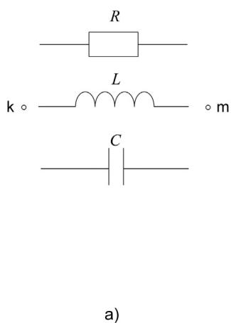
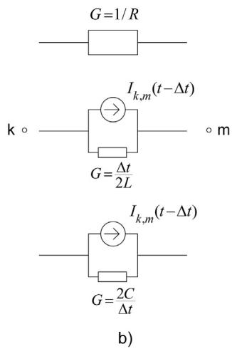
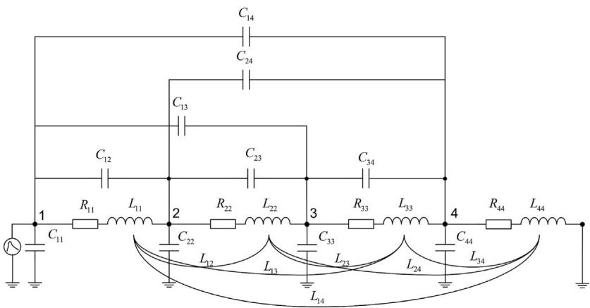
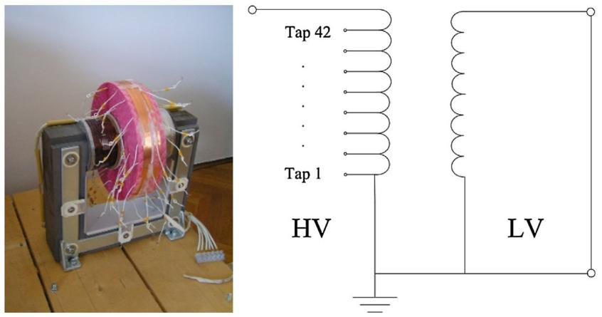
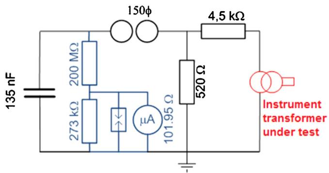
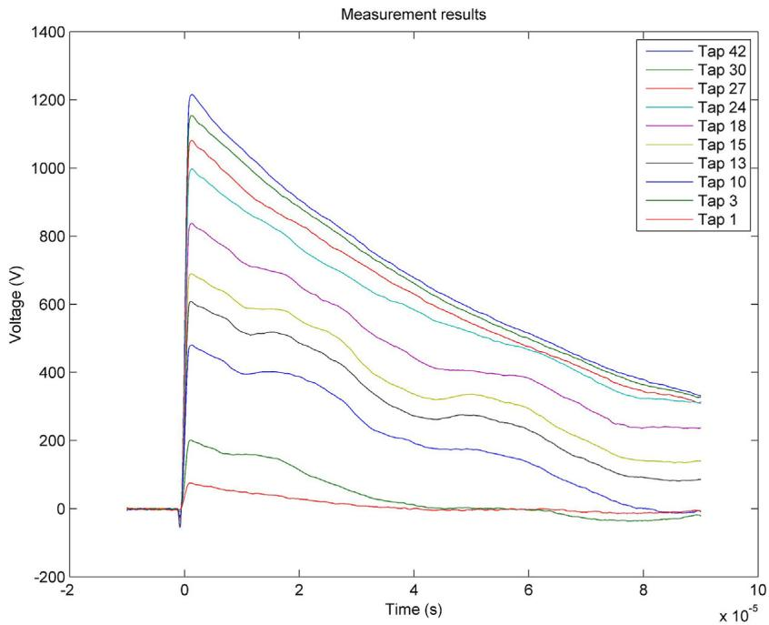
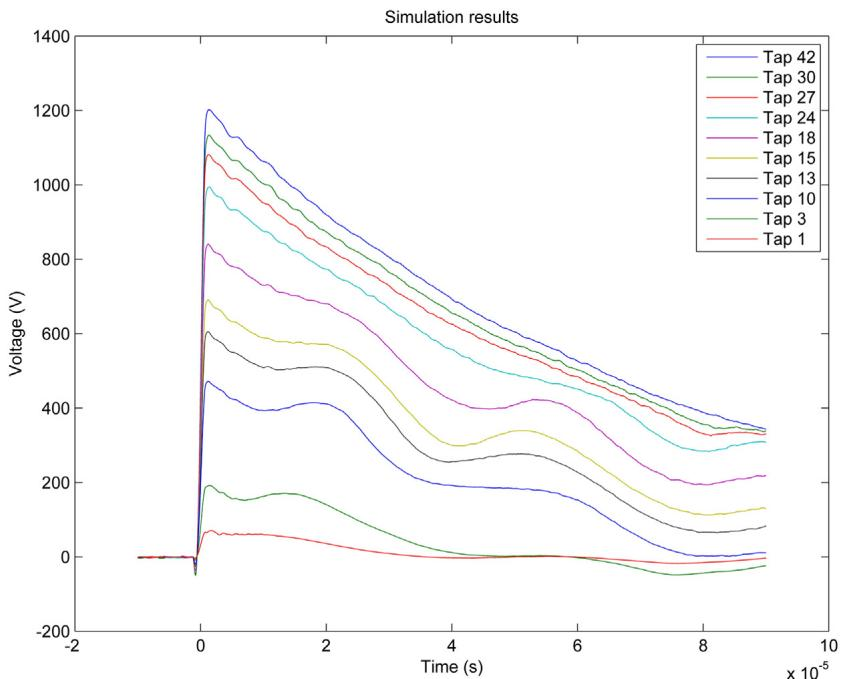
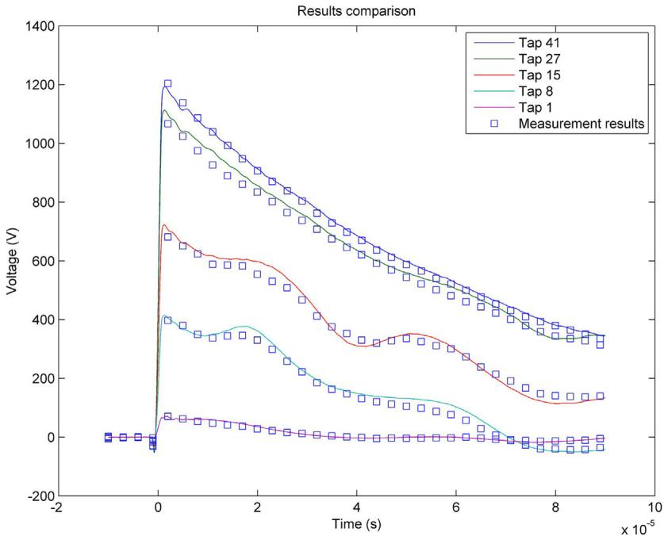
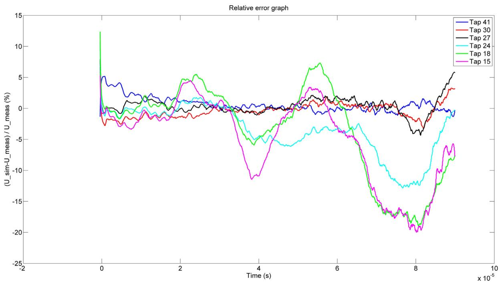

# Lightning impulse voltage distribution over voltage transformer windings — Simulation and measurement

Bojan Trkulja a, Ana Drandic´ a,∗, Viktor Milardic´ a, Tomislav Zupan ˇ a, Igor Ziger ˇ b, Dalibor Filipovic-Gr´ ciˇ c´ c

a University of Zagreb, Faculty of Electrical Engineering and Computing, University of Zagreb, 10000 Zagreb, Croatia   
b Koncarˇ — Instrument Transformers Inc, 10000 Zagreb, Croatia   
c Koncarˇ Electrical Engineering Institute, 10000 Zagreb, Croatia

# a r t i c l e i n f o

Article history:

Received 25 August 2016

Received in revised form 17 February 2017

Accepted 22 February 2017

Keywords:

Voltage transformers

Numerical simulation

Electromagnetic transients

Impulse testing

Coils

Internal overvoltages

# a b s t r a c t

This paper presents a fast and precise method for the calculation of internal voltage transients over the voltage instrument transformer windings. Lumped circuit parameters of the transformer winding are calculated using self-developed solvers based on the boundary element method and integral equations approach. A detailed equivalent circuit of the transformer winding is solved in time domain. Test model of the voltage instrument transformer is constructed with a number of measurement points along the windings. Results of the calculation are in a good agreement with the measured voltages.

© 2017 Elsevier B.V. All rights reserved.

# 1. Introduction

Voltage transformers in a power system are designed to transform voltages from high voltage on a transmission level to low voltage necessary for relays and measurement equipment. During their operation, the voltage transformer’s windings are subjected to high frequency transient overvoltages due to switching operations and lightning strikes. Transient overvoltages can potentially lead to excessive electric stress in the transformer windings and insulation and consequently result in insulation failure and breakdown. In order to adequately dimension the transformer windings and interturn or interlayer insulation, the transient voltage distribution needs to be obtained on a design level. Considering the typical winding geometry of a voltage transformer, which normally entails a very large number of turns and discrete interlayer insulations, this is a complex task.

In order to model and simulate the transient voltage distribution, an equivalent electric circuit representation of distributed or lumped parameters is developed [1]. It is of great interest to calculate the equivalent parameters accurately since they have a major influence on transient voltages. They are commonly cal-

culated using simple analytical formulas [1–3] or finite element method (FEM) based calculations [4–7]. Calculation of lumped circuit parameters can be performed using genetic algorithm [8]. Due to a complex geometry of system model, order reduction techniques can be employed [9]. In this paper, boundary element method and integral equations approach are employed to calculate the equivalent electric circuit parameters. The solvers for evaluating the parameters are self-developed and presented in Section 2.

The system of equations is often formulated using the methods based on Dommel’s approach [10–14]. Transient analysis can be performed in frequency domain [15,16] and time domain [4]. In this paper, a transient solver specially developed for this purpose, and based on formulations made by Dommel, is presented. Measurement based analysis of transformers can be based on frequency response analysis (FRA) methods [17].

Analysis of very fast transient overvoltages is of great interest and it has been the topic of various papers which mostly revolve around power transformers [18–26]. Even though some of those methods can be used in voltage transformers, their specific design differences make the transient analysis approach slightly different. The position of voltage transformers in substations and the large number of turns in the high voltage winding can lead to highly nonlinear voltage distribution during fast transients. This can result in high interturn voltages which can be hazardous to the insulation.

The purpose of this paper is to present the methodology for simulating the overvoltage distribution along the high voltage winding of the voltage transformer. As such, its goal is different from most of the EMTP (Electromagnetic Transients Program)-type programs used for simulation of the transferred overvoltages between the power transformers’ windings that are beneficial to network operators. Presented method relies on the detailed geometry and material data of the transformer. Obtaining the interturn voltages can help transformer manufacturers during the design stage of the voltage transformer production.

The results of the presented calculation approach are benchmarked against the measurements. For testing purposes, a special model of an inductive, $S \mathrm { F } _ { 6 }$ insulated voltage transformer active part was acquired. The model consists of the magnetic core, secondary winding and a primary winding with a large number of custommade measurement points.

# 2. Calculation methods

In order to calculate the voltage distribution over the transformer winding, a lumped parameter circuit model of the winding is applied. Methods used to obtain the capacitance and the inductance matrices are described in the following subsections. Resistance matrix consists of resistances at 50 Hz. Since the large number of high-voltage winding turns have to be grouped in order to model the winding, it is possible to simulate them as solid thick conductors that behave as a stranded coil in which the current density is uniform. Due to the nature of the winding configuration in instrument transformers, the simple DC calculation, omitting the influence of skin effect and proximity effect is sufficient.

# 2.1. Capacitance calculation

Capacitances are calculated by a method based on the boundary element method (BEM). As a result of a boundary-only discretization, usage of BEM enables the reduction of the problem by one dimension. Capacitances of the transformer winding can be assumed to be independent of frequency and are calculated using the electrostatic analysis.

Electric field potential $\varphi \left( \vec { r } \right)$ at any point r due to the distribution of the surface charge density $\sigma \left( \vec { r } ^ { \prime } \right)$ is represented by Ref. [27]:

$$
\varphi (\vec {r}) = \frac {\int_ {S ^ {\prime}} \sigma (\vec {r} ^ {\prime}) \mathrm {d} S ^ {\prime}}{4 \pi \varepsilon | \vec {r} - \vec {r} ^ {\prime} |}, \tag {1}
$$

where r is the vector distance of a calculation point, ${ \vec { r } } ^ { \prime }$ is the vector distance of a referent point on a source, and $S ^ { \prime }$ is the surface of two-dimensional elements.

Constant surface charge density is assumed on each segment. The expression for the electric field potential on the surface segments can be written as:

$$
\varphi (\vec {r}) = \sum_ {k = 1} ^ {N} \frac {\int_ {\Delta S _ {k}} \sigma_ {k} (\vec {r} ^ {\prime}) \mathrm {d} S ^ {\prime}}{4 \pi \varepsilon | \vec {r} - \vec {r} ^ {\prime} |}, \tag {2}
$$

where N is the number of segments, and $\varDelta S _ { k }$ is the surface of each segment.

Unknown coefficients $\sigma _ { k }$ are obtained from known potentials by using the collocation method which gives a densely populated system matrix.

Total charge on the j-th conductor influenced by the charge on the i-th conductor $Q _ { i j }$ is:

$$
Q _ {i j} = \int_ {S _ {j}} \sigma_ {j} d S _ {j} = \sum_ {k = 1} ^ {N} \sigma_ {k j} S _ {k j}, \tag {3}
$$

where $\sigma _ { k j }$ is the surface charge density on the k-th segment of the j-th conductor and $S _ { k j }$ is its surface, while N is the number of the finite segments of j-th conductor.

Capacitance matrix elements are calculated with equation:

$$
C _ {i j} = \frac {Q _ {i j}}{\varphi_ {i} - \varphi_ {j}}, i \neq j. \tag {4}
$$

Here, $\varphi _ { i }$ and ϕj are the potentials of i-th and j-th conductor.

# 2.2. Inductance calculation

Inductance calculation is based on the method for calculating inductances of coaxial circular coils in air with rectangular cross section and uniform current densities presented in Ref. [28]. The influence of the iron core on the inductance is essentially negligible since the secondary winding is short-circuited during the lightning impulse test. The problem is therefore considered linear.

Assuming that the current densities are uniform over windings’ conductor cross sections, energy W stored in the magnetic field is:

$$
W = \frac {\mu_ {0} I ^ {2}}{4 \left(Z _ {2} - Z _ {1}\right) ^ {2} \left(R _ {2} - R _ {1}\right) ^ {2}} \tag {5}
$$

$$
\int_ {\varphi = 0} ^ {\pi} \int_ {z = Z _ {1}} ^ {Z _ {2}} \int_ {Z = Z _ {1}} ^ {Z _ {2}} \int_ {r = R _ {1}} ^ {R _ {2}} \int_ {R = R _ {1}} ^ {R _ {2}} \frac {\cos \varphi r R d r d R d z d Z d \varphi}{\sqrt {r ^ {2} + R ^ {2} - 2 r R \cos \varphi + (z - Z) ^ {2}}}.
$$

Using quintuple integration, both height and thickness of the observed conductor is taken into account. Here, $\left( Z _ { 2 } - Z _ { 1 } \right)$ represents the height of the coil, $R _ { 1 }$ is the inner and $R _ { 2 }$ the outer radius of the coil, and ϕ is the angular coordinate in a cylindrical coordinate system.

Eq. (5), when compared with $\begin{array} { r } { W = \frac { 1 } { 2 } L I ^ { 2 } } \end{array}$ , gives the term for the self-inductance L of the coaxial circular coil with rectangular cross section:

$$
L = \frac {\mu_ {0}}{\left(Z _ {2} - Z _ {1}\right) ^ {2} \left(R _ {2} - R _ {1}\right) ^ {2}} \tag {6}
$$

$$
\int_ {\varphi = 0} ^ {\pi} \int_ {z = Z _ {1}} ^ {Z _ {2}} \int_ {Z = Z _ {1}} ^ {Z _ {2}} \int_ {r = R _ {1}} ^ {R _ {2}} \int_ {R = R _ {1}} ^ {R _ {2}} \frac {\cos \varphi r R d r d R d z d Z d \varphi}{\sqrt {r ^ {2} + R ^ {2} - 2 r R \cos \varphi + (z - Z) ^ {2}}}.
$$

Similarly, the equation for the total energy stored in the magnetic field gives the expression for the mutual inductance M of a pair of coaxial circular turns [28]:

$$
M = \frac {\mu_ {0}}{\left(Z _ {2} - Z _ {1}\right) \left(Z _ {4} - Z _ {3}\right) \left(R _ {2} - R _ {1}\right) \left(R _ {4} - R _ {3}\right)}
$$

$$
\int_ {\varphi = 0} ^ {\pi} \int_ {r = R _ {1}} ^ {R _ {2}} \int_ {R = R _ {3}} ^ {R _ {4}} \int_ {z = Z _ {1}} ^ {Z _ {2}} \int_ {Z = Z _ {3}} ^ {Z _ {4}} \frac {\cos \varphi r R d r d R d z d Z d \varphi}{\sqrt {r ^ {2} + R ^ {2} - 2 r R \cos \varphi + (z - Z) ^ {2}}} \tag {7}
$$

where $R _ { 1 }$ and $R _ { 2 }$ are the inner and the outer radii of the first coil, $R _ { 3 }$ and $R _ { 4 }$ are the inner and the outer radii of the second coil, $\left( Z _ { 2 } - Z _ { 1 } \right)$ represents the height of the first coil, and $\left( Z _ { 4 } - Z _ { 3 } \right)$ represents the height of the second coil. Therefore, r and z are radial and axial coordinates of source field point varied over the cross section of one coil, while R and Z are the coordinates of the field influencing point varied over the cross section of the other coil. When calculating the diagonal elements (self-inductance), the bounds of the two

  
Fig. 1. (a) Basic electrical circuit elements; (b) Equivalent circuit in Dommel-method representation.

integrals in radial direction (over r and R) are the same since both points defined by coordinates refer to the same coil. This is true for the bounds of the two integrals in axial direction (over z and Z) as well.

The integrals in Eqs. (6) and (7) are solved analytically, except for the integral over ϕ. Use of the L’Hopital rule resolves the problem with singularities in two points when numerical integration over ϕ is performed.

The obtained [L] matrix is a fully populated matrix consisting of mutual inductances and self-inductances calculated as explained above, where self-inductances are the diagonal, and mutual inductances the off-diagonal elements.

# 2.3. Voltage distribution calculation

The solution for transients is obtained by using the method developed by Dommel [10]. This method replaces inductances and capacitances by an equivalent electric circuit using resistances and current sources. The numerically A-stable trapezoidal rule is used for integration of the ordinary differential equations of lumped inductances and capacitances thus converting them to algebraic equations. Unknown node voltages are obtained by solving the system of linear algebraic equations in time domain in fixed time steps t.

Lumped electrical circuit elements between the nodes k and m and their equivalent representation consisting of current source and parallel conductance can be seen in Fig. 1.

Branch equation for the resistance branch between the nodes k and m is:

$$
i _ {k, m} (t) = \frac {1}{R} \left(u _ {k} (t) - u _ {m} (t)\right). \tag {8}
$$

Differential equation for the inductance of a branch between the nodes k and m is:

$$
u _ {k} - u _ {m} = L \frac {\mathrm {d} i _ {k , m}}{\mathrm {d} t}. \tag {9}
$$

Integration using the trapezoidal rule gives the following equation:

$$
i _ {k, m} (t) = \frac {\Delta t}{2 L} \left(u _ {k} (t) - u _ {m} (t)\right) + I _ {k, m} (t - \Delta t), \tag {10}
$$

where $I _ { k , m } ( t - \Delta t )$ is determined from the previous time step:

$$
I _ {k, m} (t - \Delta t) = i _ {k, m} (t - \Delta t) + \frac {\Delta t}{2 L} \left(u _ {k} (t - \Delta t) - u _ {m} (t - \Delta t)\right). \tag {11}
$$

Correspondingly, capacitance equations for the branch between the nodes k and m are:

$$
i _ {k, m} (t) = \frac {2 C}{\Delta t} \left(u _ {k} (t) - u _ {m} (t)\right) + I _ {k, m} (t - \Delta t), \tag {12}
$$

$$
I _ {k, m} (t - \Delta t) = - i _ {k, m} (t - \Delta t) - \frac {2 C}{\Delta t} \left(u _ {k} (t - \Delta t) - u _ {m} (t - \Delta t)\right). \tag {13}
$$

Four-turn coil equivalent circuit is shown in Fig. 2 as an example of the modeled system. One end of the winding is grounded, while the impulse signal is injected at the other end.

Application of the nodal analysis to a system with n nodes results in a system of n linear algebraic equations that describe the state of the system:

$$
[ G ] [ u (t) ] = [ i (t) ] - [ I ] \tag {14}
$$

where [G] is the nodal conductance matrix, [u(t)] is the node voltage vector over time t, [i(t)] is injected node currents vector over time t, and [I] is the vector of equivalent current sources known from the previous time step.

The modeled system is comprised of C and RL branches, as shown in Fig. 2. RL branch equations are obtained by combining Eqs. (8), (10), and (11), and are written in their matrix form, as well as the equations for the capacitance branch:

$$
\left[ i _ {R L} (t) \right] = \left([ R ] + \frac {2}{\Delta t} [ L ]\right) ^ {- 1} [ D ] [ u (t) ] + \left[ I _ {R L} (t - \Delta t) \right] \tag {15}
$$

$$
\left[ I _ {R L} (t - \Delta t) \right] = \left([ R ] + \frac {2}{\Delta t} [ L ]\right) ^ {- 1} \left[ \begin{array}{l} \left(\frac {2}{\Delta t} [ L ] - [ R ]\right) \left[ i _ {R L} (t - \Delta t) \right] + \\ [ D ] [ u (t - \Delta t) ] \end{array} \right] \tag {16}
$$

  
Fig. 2. Four-turn transformer coil equivalent circuit.

  
Fig. 3. Custom-made instrument transformer’s active part (left) and its scheme showing the taps on the HV winding (right).

$$
\left[ i _ {C} (t) \right] = \frac {2}{\Delta t} [ C ] [ u (t) ] + \left[ I _ {C} (t - \Delta t) \right] \tag {17}
$$

$$
\left[ I _ {C} (t - \Delta t) \right] = - \left[ i _ {C} (t - \Delta t) \right] - \frac {2}{\Delta t} [ C ] [ u (t - \Delta t) ]. \tag {18}
$$

Here, [D] is a topological matrix used to derive the equations based on the winding configuration. For the equivalent circuit in Fig. 2.,

$$
[ D ] \text {i s g i v e n a s :} D = \left[ \begin{array}{c c c c} 1 & - 1 & 0 & 0 \\ 0 & 1 & - 1 & 0 \\ 0 & 0 & 1 & - 1 \\ 0 & 0 & 0 & 1 \end{array} \right].
$$

Taking into account the equivalent circuit in Fig. 2, it can be written:

$$
[ i (t) ] = [ D ] ^ {T} \left[ i _ {R L} (t) \right] + \left[ i _ {C} (t) \right]. \tag {19}
$$

Unknown voltages are therefore calculated from Eq. (14) when $\begin{array} { r } { [ G ] = [ D ] ^ { T } \left( [ R ] + \frac { 2 } { \varDelta t } \left[ L \right] \right) ^ { - 1 } [ D ] + \frac { 2 } { \varDelta t } \left[ C \right] , \ [ i ( t ) ] = 0 , } \end{array}$ and [I] = $[ D ] ^ { T } \left[ I _ { R L } ( t - \Delta t ) \right] + [ I _ { C } ( t - \Delta t ) ] .$ .

# 3. Numerical results and measurements

Using the aforementioned methods, RLC matrices of the instrument transformer windings are calculated in FORTRAN parallel code developed for that purpose. Based on the calculated equivalent parameters, procedures developed in programming language Python [29] are used to compute lightning voltage distribution over transformer windings in time domain utilizing method developed by Dommel [10]. Computation time was 5.5 h using the 12-core HP ProLiant server for a system modeled with RLC matrices of size 952 952. This is significantly lower in comparison with the time necessary when using the FEM based commercial solvers on the same workstation.

Numerical simulation results are verified by comparison with the measured results. Measurements were made on a custom-made instrument transformer active part acquired in collaboration with Koncar—Instrumentˇ transformers Inc., which is shown in Fig. 3. The model has a number of taps distributed along the high voltage coil, which were made to enable an adequate model verification. The length of the tap leads was made as short as possible, and the taps have been uniformly divided along the windings, both length-wise and angularly symmetric so that their influence on the winding was kept to a minimum. Basic parameters of the model are given in Table 1.

# 3.1. Measurement method

Measurements were done in order to validate the simulation results.

Table 1 Model parameters.   

<table><tr><td>Insulation level
Number of turns</td><td colspan="4">145/275/650 kV
44,030</td></tr><tr><td></td><td>Length
[mm]</td><td>Height
[mm]</td><td>Width
[mm]</td><td>Outer diameter
of the HV coil
[mm]</td></tr><tr><td colspan="2">Dimensions of the active part 450</td><td>365</td><td>95</td><td>285</td></tr></table>

  
Fig. 4. Handmade impulse generator (˚ denotes the diameter).

Handmade impulse generator, shown in Fig. 4., was used to generate the impulse voltage. The impulse generator can produce a $1 . 2 / 5 0 \mu s$ voltage waveform in the range of 1–100 kV. The generator impulse capacitance is 135 nF, parallel resistance is 520  and series resistance is 4.5 k. The oscilloscope LeCroy LT354, 500 MHz, 1 GS/s and two high voltage probes LeCroy PPE 2 kV 100:1, 400 MHz, 50 M were used for measuring the surge distribution on the instrument transformer windings.

Impulse voltage was measured simultaneously on the first turns and the taps along the coil.

# 3.2. Model verification

Results obtained by measurements in the laboratory, shown in Fig. 5., can be compared with numerical results depicted in Fig. 6.

Accurate results were obtained when each of the 238 layers was modeled using four elements per layer. Each of these layers consists of 185 turns. These simulation results, where the high voltage winding is modeled using a total of 952 elements, exhibit excellent agreement when compared with the measured results, as shown in Fig. 7. The fact that results gained from measurement and simula-

  
Fig. 5. Measurement results for different taps along the high voltage transformer winding.

tion match in oscillating frequency, amplitude and phase confirms the accuracy of the calculation of RLC parameters.

The differences between the calculation and measurement results can be represented by the error graph in Fig. 8. Relative error does not exceed more than 20% during the length of the simulation and is less than 10% for the first half of the input signal. Moreover, it can be seen from Fig. 8 that the proposed model is very accurate for the top part of the winding, the one that exhibits most of the overvoltage stress. The relative error becomes more pronounced

during the end of the observed signal when the voltage levels are a fraction of the initial impulse. This further validates the accuracy and applicability of the model.

# 4. Conclusion

The method for calculation of the equivalent electric circuit parameters and the distribution of transient voltages presented in this paper is stable and efficient in modeling of instrument transformers for fast overvoltage transients.

  
Fig. 6. Simulation results for different taps along the high voltage transformer winding when modeling with four elements per layer was performed.

  
Fig. 7. Comparison of simulation and measurement results for different taps along the high voltage transformer winding.

  
Fig. 8. Relative error graph of the modeled problem.

The method is limited to two-dimensions and since the parameter calculation is based on BEM the storage requirements and computational time grow according to the square of the problem size. Parallel implementation of the solver in FORTRAN improves parallelized BEM solver significantly.

Calculation results of lightning impulse transient voltage distribution were tested against measurements on an inductive voltage transformer developed by Koncar—Instrumentˇ transformers Inc. Calculated and measured voltage distribution are in very good

agreement, thus validating the presented method as an accurate, robust and practical tool which can be used at the industry level.

Future work includes the development of algorithms based on adaptive cross approximation (ACA) in order to reduce the memory requirements and computation time.

# Acknowledgment

This work was supported in part by the Croatian Science Foundation under the project number IP-2013-1118.

# References

[1] A. Theocharis, M. Popov, Modelling of foil-type transformer windings for computation of terminal impedance and internal voltage propagation, IET Electr. Power Appl. 9 (February (2)) (2015) 128–137.   
[2] X.M. Lopez-Fernandez, C. Alvarez-Marino, Computation method for transients in power transformers with lossy windings, IEEE Trans. Magn. 45 (March (3)) (2009) 1863–1866.   
[3] M. García-Gracia, M. Villén, M.A. Cova, N. El Halabi, Detailed three-phase circuit model for power transformers over wide frequency range based on design parameters, Electr. Power Syst. Res. 92 (2012) 115–122.   
[4] J. Smajic, T. Steinmetz, M. Ruegg, Z. Tanasic, R. Obrist, J. Tepper, B. Weber, M. Carlen, Simulation and measurement of lightning-impulse voltage distributions over transformer windings, IEEE Trans. Magn. 50 (February (2)) (2014) 553–556.   
[5] Z. Azzouz, A. Foggia, L. Pierrat, G. Meunier, 3D finite element computation of the high frequency parameters of power transformer windings, IEEE Trans. Magn. 29 (March (2)) (1993) 1407–1410.   
[6] E. Bjerkan, H. Høidalen, High frequency FEM-based power transformer modeling: Investigation of internal stresses due to network-initiated overvoltages, Electr. Power Syst. Res. 77 (11) (2007) 1483–1489.   
[7] M. Eslamian, B. Vahidi, S. Hosseinian, Combined analytical and FEM methods for parameters calculation of detailed model for dry-type transformer, Simul. Model. Pract. Theory 18 (3) (2010) 390–403.   
[8] V. Rasthchi, E. Rahimpour, E.M. Razapour, Using a genetic algorithm for parameter identification of transformer R-L-C-M model, Electr. Eng. 88 (2006) 417–422.   
[9] R. Degeneff, M. Gutierrez, M. Vakilian, Nonlinear, lumped parameter transformer model reduction technique, IEEE Trans. Power Deliv. 10 (April (2)) (1995) 862–868.   
[10] H.W. Dommel, Digital computer solution of electromagnetic transients in single and multiphase networks, IEEE Trans. PAS 88 (April (4)) (1969) 388–399.   
[11] N. Watson, J. Arrilaga, Power Systems Electromagnetic Transients Simulation, IET, London, UK, 2003.   
[12] B. Gustavsen, A. Portillo, A black-box approach to interfacing white-box transformer models with electromagnetic transients programs, IEEE PES General Meeting (2014) 1–5.   
[13] A.M. Miri, Z. Stojkovic, Transient electromagnetic phenomena in the secondary circuits of voltage and current transformers in GIS (measurements and calculations), IEEE Trans. Power Deliv. 16 (October (4)) (2001) 571–575.   
[14] J. Sakamuri, D. Yesuraj, Modeling and simulation of capacitor voltage transformer transients using PSCAD/EMTDC, in: IEEE PowerTech, Trondheim, June, 2011, pp. 1–8.

[15] M. Florkowski, J. Furgal, P. Pajak, Frequency method for identification of resonance overvoltages in transformer windings, in: 10th IEEE International Conference on Solid Dielectrics, July, 2010, pp. 1–4.   
[16] M. Florkowski, J. Furgal, P. Pajak, Analysis of fast transient voltage distributions in transformer windings under different insulation conditions, IEEE Trans. Dielectr. Electr. Insul. 19 (December (6)) (2012) 1991–1998.   
[17] D. Filipovic-Grcic, B. Filipovic-Grcic, I. Uglesic, High-frequency model of the power transformer based on frequency-response measurements, IEEE Trans. Power Deliv. 30 (February (1)) (2015) 34–42.   
[18] S. Fujita, N. Hosokawa, Y. Shibuya, Experimental investigation of high frequency voltage oscillation in transformer windings, IEEE Trans. Power Deliv. 13 (October (4)) (1998) 1201–1207.   
[19] S. Hosseini, M. Vakilian, G. Gharehpetian, Comparison of transformer detailed models for fast and very fast transient studies, IEEE Trans. Power Deliv. 23 (April (2)) (2008) 733–741.   
[20] M. Popov, L. van der Sluis, R. Smeets, J. Roldan, Analysis of very fast transients in layer-type transformer windings, IEEE Trans. Power Deliv. 22 (January (1)) (2007) 238–247.   
[21] M. Popov, L. van der Sluis, G.C. Paap, H. De Herdt, Computation of very fast transient overvoltages in transformer windings, IEEE Trans. Power Deliv. 18 (October (4)) (2003) 1268–1274.   
[22] Z. Zhongyuan, L. Fangcheng, L. Guishu, A high-frequency circuit model of a potential transformer for the very fast transient simulation in GIS, IEEE Trans. Power Deliv. 23 (October (4)) (2008) 1995–1999.   
[23] X. Zhu, H. Dong, G. Liang, C. Ji, A new hybrid model of transformer windings under very fast transient overvoltages, in: International Conference on Electrical Machines and Systems, October, 2008, pp. 4296–4301.   
[24] T. Zupan,ˇ B. Trkulja, R. Obrist, T. Franz, B. Cranganu-Cretu, J. Smajic,´ Transformer windings’ RLC parameters calculation and lightning impulse voltage distribution simulation, IEEE Trans. Magn. 52 (March (3)) (2016) 1–4.   
[25] Q. Yang, et al., Measurement and analysis of transient overvoltage distribution in transformer windings based on reduced-scale model, Electr. Power Syst. Res. 140 (2016) 70–77.   
[26] A. Theocharis, M. Popov, V. Terzija, Computation of internal voltage distribution in transformer windings by utilizing a voltage distribution factor, Electr. Power Syst. Res. 138 (2016) 11–17.   
[27] B. Trkulja, Z.ˇ Stih,ˇ Computation of electric fields inside large substations, IEEE Trans. Power Deliv. 24 (October (2)) (2009) 1898–1902.   
[28] T. Zupan,ˇ Z.ˇ Stih,ˇ B. Trkulja, Fast and precise method for inductance calculation of coaxial circular coils with rectangular cross section using the one-dimensional integration of elementary functions applicable to superconducting magnets, IEEE Trans. Appl. Supercond. 24 (April (2)) (2014) 81–89.   
[29] G. van Rossum, F.L. Drake (Eds.), Python Reference Manual, PythonLabs, Virginia, USA, 2001, Available at: http://www.python.org.