# MSEMT: An Advanced Modelica Library for Power System Electromagnetic Transient Studies

Alireza Masoom , Jean Mahseredjian , Fellow, IEEE, Tarek Ould-Bachir , Member, IEEE, and Adrien Guironnet

Abstract—Electromagnetic Transient (EMT) simulation tools are typically developed using conventional procedural programming languages. On the other hand, modern high-level and equation-based programming languages, such as Modelica, are currently available. Modelica allows formulating models that are easy to develop, maintain and understand by expressing what needs to be computed without stating how it should be computed. This paper presents a Modelica-based simulator for electromagnetic transients. It is demonstrated that this approach offers significant advantages for developing sophisticated models. Computational performance and accuracy are compared to a conventional EMTtype simulation tool.

Index Terms—Declarative modeling, equation-based modeling, object-oriented modeling, MSEMT library, modelica, EMT-type simulation, power system transients.

# I. INTRODUCTION

P OWER system simulation is based on component modelsthat can be described mathematically with Ordinary Differ- that can be described mathematically with Ordinary Differential Equations (ODEs). The classic approach for the simulation of electromagnetic transients uses lumped circuits combined into a system of equations for formulating electrical network constraints. In EMTP [1], for example, modified-augmented-nodal analysis is used to connect lumped companion-circuits [2] resulting from the conversion of differential equations from models.

Existing and widely used EMT software packages (see [3], [4]) are typically based on computer programming languages (Fortran, C++ …) for delivering compiled computer code. Such code allows simulating large-scale and complex power systems very efficiently by providing to users powerful graphical user interfaces for drawing simulated schematics and entering data. Such packages maintain a large set of hard-coded models that

Manuscript received February 2, 2021; revised July 17, 2021; accepted September 3, 2021. Date of publication September 13, 2021; date of current version July 25, 2022. This work was supported by NSERC, Hydro-Québec, RTE, EDF, and OPAL-RT as a part of the industrial chair “Multi time-frame simulation of transients for large scale power systems.” Paper no. TPWRD-00202-2021. (Corresponding author: Alireza Masoom.)

Alireza Masoom and Jean Mahseredjian are with the Department of Electrical Engineering, Polytechnique Montreal, Montreal QC H3T 1J4, Canada (e-mail: alireza.masoom@polymtl.ca; jean.mahseredjian@polymtl.ca).

Tarek Ould-Bachir is with the Department of Computer and Software Engineering, Polytechnique Montreal, Montreal QC H3T 1J4, Canada (e-mail: tarek.ould-bachir@polymtl.ca).

Adrien Guironnet is with the R&D Department, Réseau de Transport d’Electricité (RTE), Paris, France (e-mail: adrien.guironnet@rte-france.com).

Color versions of one or more figures in this article are available at https://doi.org/10.1109/TPWRD.2021.3111127.

Digital Object Identifier 10.1109/TPWRD.2021.3111127

remain typically inaccessible to users. In such packages, it is also possible to develop/integrate powerful user-defined models either through block diagrams or through high-level languages and external access. User-defined models must typically account for underlying software procedures and numerical methods.

In the Simscape Electrical [5] and Simscape Electrical Specialized Power Systems [6] packages, the block-diagram approach of Simulink is extended to include the state-space representation of linear electrical networks with externally connected components, such as nonlinear devices or synchronous generators in the block-diagram representation. Although it offers increased accessibility to users for native models, the resulting block diagrams do not deliver a high-level modeling environment. Some numerical limitations may also result from delays between external components and circuit representation.

Attempts have been also made to develop an EMT-type simulation tool [7] using the higher-level MATLAB programming language in an open-source-code approach. Although this approach elevates the abstraction level, it remains that the models must be programmed using given numerical methods and actual equations become submerged in detailed codes.

The existing EMT-type software packages deliver advanced simulation environments to engineers and can be also interfaced with high-level programming environments [8]. Although interfacing and co-simulation methods can become powerful, they typically suffer from numerical delays and simultaneous solution issues. But such closed-code approaches do not allow to provide high-level modeling environments that can be used for the development of advanced models by simply expressing model differential equations without consideration of underlying numerical solution methods.

This paper proposes to explore the Modelica approach for delivering a full EMT-type simulation environment with the models expressed directly through high-level equations. The choice of Modelica is justified by the following. Modelica [9] is an object-oriented declarative equation-based non-proprietary language, that can conveniently model the dynamic behavior of complex physical systems. In Modelica, models can be described as Differential-Algebraic Equations (DAE) and block diagrams. The model becomes decoupled from the solver. Modelica also supports discrete systems as opposed to continuous systems.

Modelica can be interfaced with traditional software (e.g., MATLAB and C) and to a variety of computing libraries, such as LAPACK [10], KLU [11], etc. as well. Modelica supports

dynamic model exchange and co-simulation through the Functional Mock-up Interface (FMI) standard [8] and can be linked to various EMT-type codes.

Modelica supports a graphical user interface for both drawing network diagrams and visualizing results and simplifies the process of building graphical tools such as component symbols, component input, documentation, and observing the results.

In power system applications, Modelica is frequently used for developing phasor time-domain libraries such as ObjectStab library [12], iPSL [13], and PowerGrids [14]; all used in voltage stability and electromechanical stability analysis. An electrical library of Modelica is available [9], but it provides only basic models with several limitations and does not allow to perform EMT simulations for power systems.

Preliminary work on EMTs with Modelica has been carried out in [15], [16] for transmission line modeling. The objective of this paper is to extend it to a full package named Modelica Simulator of Electromagnetic Transients (MSEMT). In this paper, MSEMT is presented and tested for its abstraction levels, accuracy, and performance.

The remainder of this paper is organized as follows. In Section II, the Modelica solution is introduced. Section III explains the implementation of EMT-detailed models in Modelica. Simulation results are presented and compared against reference results in Section IV. Section V presents the conclusions of the paper.

# II. MODELICA SOLUTION METHODS

# A. Execution of Modelica Code

Fig. 1 shows the typical Modelica workflow from model to executable simulation code. The procedure might slightly change for different Modelica environments.

Block 1 is the mathematical representation of a model at highlevel abstraction. In Block 2, these codes are first flattened as a set of acausal equations and conditional statements. The inherited classes are collapsed hierarchically. For each sub-component of a model, one copy of all equations is generated with distinguished identifiers. For example, if our model is composed of two resistors R1 and R2 whose resistances are 5 Ω and 10 Ω, two equations are generated: v1 = 5 i1 and $\mathrm {  ~ v } 2 ~ = ~ 1 0 ~ *$ i2. For each connection between two or more nodes, potential variables are set to be equal and flow variables are summed to zero. As a result, the output of Block 2 is a set of implicit DAEs. In Block 3, a structural analysis [17] is carried out on the equations, then they are sorted in Block Lower Triangular (BLT) form [18]. BLT partitioning reveals the structure of a problem and decomposes it into sub-problems that can be solved separately and in sequence. In this process, efficient graph theory algorithms are used to select states that generate minimal algebraic loops. The first step in the structural representation of a system is to create a structure Jacobian that describes the dependency of each equation on its variables and their derivatives (Matching). The aim is to categorize the knowns and unknowns in each equation. Then, the equations are sorted into blocks using Tarjan’s algorithm [19], [20], such that an evaluation sequence is achieved (sorting). Two main jobs are usually required in the

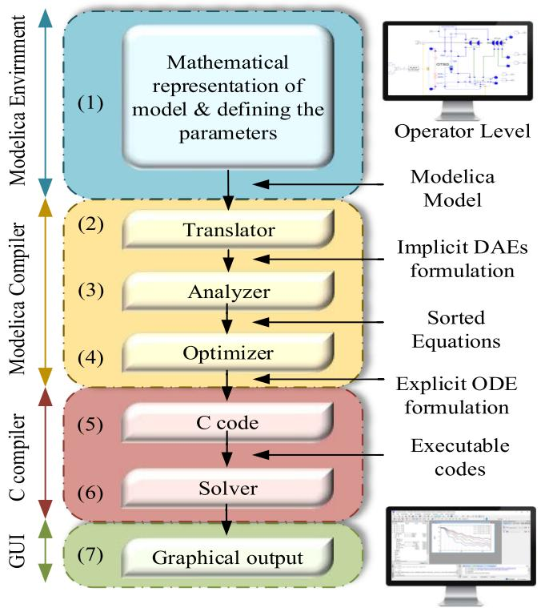  
Fig. 1. The typical workflow of translation of Modelica model [9].

causalization procedure: (1): removing structural singularities that need index reduction algorithms such as Pantelides [21]; (2): removing algebraic loops, i.e., subsets of coupled equations (whether linear or non-linear) that must be solved simultaneously. In such cases, the solution is found efficiently by the Tearing algorithm [22], [23] aimed to break algebraic loops into smaller parts. The generic idea is to select intelligently some variables (called tearing variables) and change them to known variables. Then the equations (inner equations) are causalized with this assumption, and the remaining equations appear as residue equations. For electrical circuits, the equations describing algebraic loops are quite large, usually nonlinear, and very sparse.

A Modelica model has many trivial equations, being the result of connections; thus, an optimization procedure is applied to eliminate the trivial equations in Block 4. Finally, C code is generated and linked to a numeric solver in Blocks 5 and 6 respectively. Data output and plotting are easily handled through available Modelica functions through Block 7.

Modelica uses acausal modeling, which relies on equationbased programming on true equations instead of assignment statements or conventional input/output block diagrams.

# B. Integration Methods

In EMT analysis, the core algorithm is numerical integration. A variety of integration methods such as trapezoidal, backward Euler, implicit Runge-Kutta, DASSL [24], and IDA [25], [26] are currently available in Modelica simulators. The two latter solvers are based on the backward differentiation formula (BDF) [27] and are widely used in the Modelica simulators such as

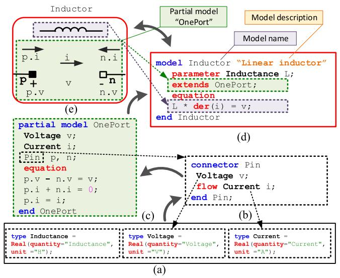  
Fig. 2. Implementation of a linear inductor model in Modelica. Arrows show the hierarchical order of modeling. (a) Declaration of variables and parameters of the model. (b) Defining the connector pin. (c) Partial model OnePort. (d) Modelica code of an inductor. (e) Graphical description of inductor model.

OpenModelica [28] and Dymola [29] owing to their stability and accuracy. The solvers yield very good stability due to the conservative selection method in order and step-size control. In practice, they successfully solve stiff DAEs and ODEs.

The most important feature of DASSL and IDA solvers is that besides the ODE mode, they can simulate models in DAE mode. In general, the entire equation system of a model is passed to the DAE integrator, including all algebraic loops. This decreases the amount of work that requires to be performed in the postoptimization phase [30].

Handling of discontinuities is a major challenge in the integration schemes of EMT simulation. OpenModelica uses a root-finding mechanism that searches for the exact moment corresponding to the event and stops at this moment to rearrange the equations. Searching for the exact event moment enables us to achieve better accuracy but is costly in terms of simulation time [31].

# C. Graphical User Interface (GUI)

Modelica provides high-level functions to enable the programming of a GUI. Modelica allows to categorize and group the parameters graphically. Variables and parameters can have physical units associated with them. Any new component icon or sub-circuits can be created through block masking.

# III. IMPLEMENTATION OF EMT-TYPE SIMULATION TOOL IN MODELICA

Systematic formulation of an electrical circuit in Modelica is not analogous to the methods used in classic EMT simulators. To show the Modelica approach, an example of linear inductor modeling is illustrated in Fig. 2. Foremost, the variables and parameters of the model must be identified. The model variables, such as voltage and current, and the model parameters, such as

inductance, can be declared by a restricted class type which is useful when a variable contains information that can help the modeler to identify it (see Fig. 2(a)). The preliminary part of an electrical component is the pin. As demonstrated in Fig. 2(b), the pin is programmed by the specific class, connector, and defines the variables that are part of the communication interface. Therefore, it is coded by a non-flow variable, voltage, denoted by v, and a flow variable, current, indicated by i. Then partial model “OnePort” which represents the generic properties of one-port devices is built. The keyword partial means that this is not a complete model due to the unequal number of variables and equations. The partial model OnePort can be reused for modeling all one-port devices, e.g., resistor, capacitor, etc. just by recalling it using the keyword extends. As illustrated in Fig. 2(c), every one-port device is defined by a positive and negative pin denoted by p and n and a set of equations. Finally, the inductor model is completed by inserting the constructive equation based on Faraday’s law to establish a relationship between component non-flow and flow variables. Now the model can be instantiated (see Fig. 2(d)).

# A. Assembling the Models

Physical interconnection of components models is carried out by the keyword connect in the equation part. Graphically, it is possible simply to drag and drop the constructed models into the simulation page, attribute a name to them, change the parameters, and connect their terminals. Let us assume that the positive pin of the resistor (R1) is connected to the negative pin of the inductor (L1) graphically through a physical connection. The following code is entered:

connect(R1.p, L1.n);

Modelica automatically translates the above code into two algebraic equations based on the definition of the pin in Fig. 2(b), i.e., equality coupling for non-flow variable and sum-to-zero coupling for flow-defined variable according to KVL and KCL respectively:

$$
R 1. p. v = L 1. n. v;
$$

$$
R 1. p. i + L 1. n. i = 0;
$$

# B. Exploring Nonlinearity

The models of nonlinear resistor and inductor have been developed in Modelica for the representation of surge arresters and transformer core saturation respectively. The characteristics of a nonlinear inductor are expressed by monotonically increasing piecewise linear curves. Exponential segments are used for representing the properties of surge arresters. There is no limitation to use polynomial representations for expressing nonlinearities.

The characteristic of a nonlinear inductor is specified as:

$$
\varphi = f (i) \tag {1}
$$

$$
v = \frac {d \varphi}{d t} \tag {2}
$$

where ϕ, v, and i are the flux, voltage, and current of the nonlinear inductor, respectively, and f represents a piecewise linear

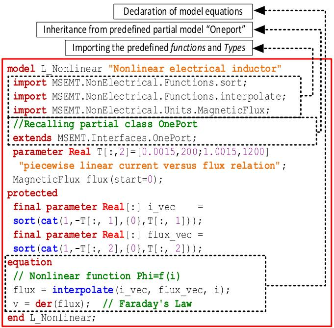  
Fig. 3. Nonlinear inductor model implemented in Modelica.

function. The Modelica code describing a nonlinear inductor is shown in Fig. 3.

In the same procedure as the inductor model, it is firstly required to identify and declare the variables. The keyword import is used to import the predefined mathematical functions, e.g., sort, interpolate, and physical type of MagneticFlux. This spares the developer from having to constantly describe things in the local model. By contrast, the modeler can place definitions in packages and then recall those packages. The extends statement is employed to specify inheritance from the pre-defined partial model “OnePort” into the model. The piecewise linear relationship of current versus flux is represented as a parameter of the model by a 2D array ${ \bf T } _ { n \times 2 }$ . it is possible to partition the curve in n-sections. flux 2is a state variable of this model and is declared by the type “MagneticFlux”. Its initial value is set to zero by default, but it is possible to change the initial value in the GUI of the model. In the protected section, the array elements are sorted and arranged to define a symmetric variable (i_vec and flux_vec). In the equation section, only equations (1) and (2) are directly expressed. The function interpolate(i_vec, flux_vec, i), which represents (1), interpolates linearly in vectors (i_vec, flux_vec) and returns the value flux that corresponds to the i. The second equation implies Faraday’s law, (2).

As it is seen, the modeler has absolutely nothing to do with concerns of how that model is going to be used by the simulation engine. There is not any input/output orientation. There is no need to define how the model equations are inserted into the main network equations.

# C. Saturable Transformer Component (STC) Model

The transformer model is divided into two main parts. The first part represents the windings resistance and inductance (RL1 and

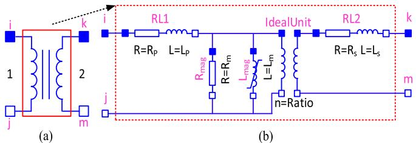  
Fig. 4. Implementation of the saturable transformer model in Modelica. (a) Transformer model icon. (b) The sub-model of transformer model.

RL2) and contains linear elements. The second part models the magnetizing behavior of the transformer core (losses and saturation) and is represented with linear resistance $\mathrm { ( R _ { m a g } ) }$ in parallel with nonlinear inductance $\mathrm { ( L _ { m a g } ) }$ mag. The magnetic saturation is magcharacterized by a piecewise linear inductor.

Fig. 4(a) illustrates the GUI symbol of the single-phase transformer in Modelica. Fig. 4(b) shows the implementation of the model. The model is a combination of pre-defined models, which are linked to each other, then packaged to construct a new model. The input parameters of the model include the RL-branch values $( \mathrm { R _ { p } } , \mathrm { L _ { p } } , \mathrm { R _ { s } } , \mathrm { L _ { s } } ) .$ , the turn ratio (Ratio), and the p pmagnetizing branch $\mathrm { ( R _ { m } , \quad L _ { m } ) }$ . Nonlinear data is entered for $\operatorname { L } _ { \mathrm { m } }$

m.The model can be extended to a three-phase or three-winding transformer model. In MSEMT, different configurations of three-phase two-winding and three-winding transformers already exist.

# D. Transmission Line Models

The transmission line (TL) is a fundamental component in EMT modeling. A comprehensive description for TL modeling including wideband (WB) and Constant Parameter (CP) models was presented in [15]. The programming of a TL model requires the implementation of derivation and interpolation in history and Norton classes. Modelica avoids this complexity by using the der and delay built-in operators.

# E. Synchronous Machine Model

In this paper, the classical dq model of a balanced wyegrounded synchronous machine (SM) is implemented. Damper winding effects are represented with three damper windings: one on the d-axis, kd, and two on the q-axis, kq1, and kq2. The q-axis is assumed to be leading the d-axis by 90 deg and the direction of the positive stator current is out of the terminals [32].

Implementation of the SM model in Modelica is directly based on its state space equations without providing solution procedures, predictions, and supplementary codes as in traditional software tools [33]. The dq model equations are linked to the main network equations with the interface of Park’s transformation and provide a simultaneous solution. It is demonstrated that this method is numerically stable and yields the same results as EMTP.

Fig. 5 illustrates the equation section of the implemented SM model. Because of space limitations, the pieces of code used to declare the variables, parameters, and parameter conversions

model SM "Synchronous Machine 6 order"  
// Declaration of variables and parameters are hidden due to space limitations.  
equation  
vabc = {Pk.pin[1].v, Pk.pin[2].v, Pk.pin[3].v} / Vsbase;  
// Conversion from abc frame to dq0 frame  
vdq0 = P(theta) * vabc;  
// State space electrical equations  
der(Phi) = Wb * (A * Phi + u);  
A = -(R * inv(L) + W);  
i = inv(L) * Phi;  
// Conversion from dq0 to abc frame  
iabc = inv(P(theta)) * idq0;  
// Calculations of actual current  
Pk.pin[1].i = -iabc[1] * Isbase;  
Pk.pin[2].i = -iabc[2] * Isbase;  
Pk.pin[3].i = -iabc[3] * Isbase;  
// Mechanical equations  
Te = Phi[2] * idq0[1] - Phi[1] * idq0[2];  
Tnet = Tm - Te - D * dw;  
Tm = Pm_pu / Wr;  
der(dw) = Tnet * (1 / 2 / H);  
Wr = 1 + dw;  
der(d_theta) = dw * Wb;  
theta = d_theta + Wb * time;  
// where  
// u = {Vq, Vd, Vfd, Vkd, Vkq1, Vkq2}  
u = {vdq0[1], vdq0[2], vfd, 0, 0, 0, 0};  
// Phi = {Phi, Phid, Phidf, Phikd, Phikglu, Phikq2}  
Phi = {Phi[1], Phi[2], Phi[3], Phi[4], Phi[5], Phi[6]};  
// i = {iq, id, ifd, ikd, ikq1, ikq2}  
i = {i[1], i[2], i[3], i[4], i[5], i[6]};  
// Change of sign due to generating mode  
idq0 = {-i[1], -i[2], 0};  
W[6, 6] = [0, Wr, 0, 0, 0, 0, 0];  
-Wr, 0, 0, 0, 0, 0, 0];  
0, 0, 0, 0, 0, 0, 0];  
0, 0, 0, 0, 0, 0, 0];  
0, 0, 0, 0, 0, 0, 0];  
R[6, 6] = diagonal{Rs, Rs, Rfd, Rkd, Rkql, Rkq2});  
end SM;

Fig. 5. Implementation of the synchronous machine model in Modelica.

have been hidden. The SM terminal, Pk, is connected to the network using three pins, pin[1], pin[2], and pin[3] representing respectively phase-a, b, and c. P(theta) represents the pre-defined function for the Park’s transformation calculations. Equation (4) is used as a differential equation for the implemented model; the state vector Phi represents fluxes and the input vector u the voltages. The system matrix A is a time-dependent variable computed as per (5). Stator physical currents are represented by Pk.pin[1].i, Pk.pin[2].i and Pk.pin[3].i for the phases, a, b and c, respectively. The input and output pins respectively for field voltage and current are based on the non-reciprocal per unit.

The operational parameters are used as input parameters of the Modelica model, then the fundamental parameters are computed using the classical method [34]. In the following, the six-order state-space model and the mechanical equations based on a single mass sorted from (3) to (20) are implemented. In these equations, bold uppercase represents matrices, bold lowercase denotes vector and operator p is $\textstyle { \frac { d } { d t } }$ . The per-unit (pu) electrical equations are expressed in the rotor reference frame as following:

$$
\mathbf {v} _ {d q 0} = \mathbf {P} (\theta) \mathbf {v} _ {a b c} \tag {3}
$$

$$
p \boldsymbol {\psi} = \omega_ {b} (\mathbf {A} \boldsymbol {\psi} + \mathbf {u}) \tag {4}
$$

$$
\mathbf {A} = - \left(\mathbf {R L} ^ {- 1} + \mathbf {W}\right) \tag {5}
$$

$$
\mathbf {i} = \mathbf {L} ^ {- 1} \boldsymbol {\psi} \tag {6}
$$

$$
\mathbf {i} _ {a b c} = \mathbf {P} ^ {- 1} (\theta) \mathbf {i} _ {d q 0} \tag {7}
$$

$$
\mathbf {i} _ {a b c, a c t u a l} = \mathbf {i} _ {a b c}. I _ {s t a t o r, b a s e} \tag {8}
$$

the mechanical equations in pu form that describe the dynamics of the rotor are given as:

$$
\mathrm {T} _ {e} = \psi_ {d} \mathrm {i} _ {q} - \psi_ {q} \mathrm {i} _ {d} \tag {9}
$$

$$
\mathrm {T} _ {\text {n e t}} = \mathrm {T} _ {m} - \mathrm {T} _ {e} - \mathrm {D} \Delta \omega \tag {10}
$$

$$
\mathrm {T} _ {m} = \mathrm {P} _ {m} / \omega_ {r} \tag {11}
$$

$$
p \Delta \omega = \mathrm {T} _ {\text {n e t}} \frac {1}{2 \mathrm {H}} \tag {12}
$$

$$
\omega_ {r} = 1 + \Delta \omega \tag {13}
$$

$$
p \Delta \theta = \omega_ {b} \Delta \omega \tag {14}
$$

$$
\theta = \Delta \theta + \omega_ {b} t \tag {15}
$$

where

$$
\mathbf {u} = \left[ v _ {q}, v _ {d}, v _ {f d}, 0, 0, 0 \right] ^ {T} \tag {16}
$$

$$
\boldsymbol {\Psi} = \left[ \begin{array}{l l l l} \psi_ {q}, & \psi_ {d}, & \psi_ {f d}, & \psi_ {k d}, \\ & & \psi_ {k q 1}, & \psi_ {k q 2} \end{array} \right] ^ {T} \tag {17}
$$

$$
\mathbf {i} = \left[ \mathrm {i} _ {q}, \mathrm {i} _ {d}, \mathrm {i} _ {f d}, \mathrm {i} _ {k d}, \mathrm {i} _ {k q 1}, \mathrm {i} _ {k q 2} \right] ^ {T} \tag {18}
$$

$$
\mathbf {i} _ {d q 0} = \left[ - \mathrm {i} _ {q}, - \mathrm {i} _ {d}, 0 \right] ^ {T} \tag {19}
$$

$$
\mathbf {R} = \operatorname {d i a g} \left(\mathrm {R} _ {a}, \mathrm {R} _ {a}, \mathrm {R} _ {f d}, \mathrm {R} _ {k d}, \mathrm {R} _ {k q 1}, \mathrm {R} _ {k q 2}\right) \tag {20}
$$

The vector $\mathbf { v } _ { a b c }$ is the terminal voltage, $\mathbf { v } _ { d q 0 }$ is the voltage in the $d q$ frame, $\mathbf { P } ( \boldsymbol { \theta } )$ 0is the Park’s transformation, the vectors $\mathbf { u } ,$ i, and ψ denote the stator and rotor voltages, currents, and flux linkages in the $d q$ frame and $\mathbf { i } _ { a b c }$ is the stator current. $\mathbf { W } _ { 6 \times 6 }$ is 6 6the rotor speed-dependent matrix; all elements are zero except $w ( 1 , 2 ) = \omega _ { r }$ and w $\mathbf { \Pi } ( 2 , 1 ) = \mathbf { \Pi } - \omega _ { r } , \mathbf { L } _ { 6 \times 6 }$ is the symmetrical 6 6matrix of self and mutual inductances in the rotor reference frame, ${ \bf R } _ { 6 \times 6 }$ is the stator and rotor resistance matrix. $\Delta \omega$ is the 6 6rotor speed deviation in pu, Δθ denotes the rotor angle deviation in pu, θ is the electrical rotor angle in radians, $\omega _ { b }$ is the base electrical angular velocity in radian per second and H represents the inertia constant in pu-s. The mechanical, electrical torque, and the damping factor in pu are denoted respectively by $\mathrm { T } _ { m }$ , $\mathrm { T } _ { e }$ and D.

For the initialization of SM, the initial flux and rotor angle are calculated from given steady-state values of terminal voltage and current.

It is observed that the code structure is entered exactly as equations (3)–(20) without any further consideration of order, solution procedures, sequences, and other lower-level details. Moreover, it indicates that only a small number of code lines are needed to elaborate state-space equations through readily available Modelica functions and constructs. This is a drastic improvement and distinctive advantage over classical coding for performing similar tasks.

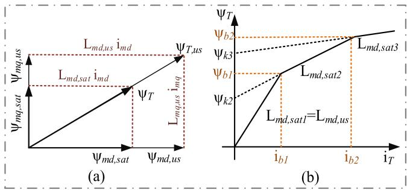  
Fig. 6. (a) Saturated and unsaturated magnetizing flux linkages in the dq axes of a synchronous machine and (b) magnetic saturation characteristic (piecewiselinear approximation).

# F. Synchronous Machine Model With Magnetic Saturation

To demonstrate model development efficiency and easiness in model modification, the SM model presented in the previous section is now extended to include magnetic saturation [33]. The mathematical equations of saturation for SM are introduced by [33]:

$$
\psi_ {T} = f \left(\psi_ {T, u s}\right) = f \left(\sqrt {\psi_ {m d , u s} ^ {2} + \psi_ {m q , u s} ^ {2}}\right) \tag {21}
$$

$$
\psi_ {m d, u s} = \mathrm {L} _ {m d, u s} \mathrm {i} _ {m d} \tag {22}
$$

$$
\mathrm {i} _ {m d} = \mathrm {i} _ {d} + \mathrm {i} _ {f d} + \mathrm {i} _ {k d} \tag {23}
$$

$$
\psi_ {m q, u s} = \mathrm {L} _ {m q, u s} \mathrm {i} _ {m q} \tag {24}
$$

$$
\mathrm {i} _ {m d} = \mathrm {i} _ {q} + \mathrm {i} _ {k q 1} + \mathrm {i} _ {k q 2} \tag {25}
$$

where $\psi _ { T }$ is the total air-gap flux, $\psi _ { T , u s }$ is the total unsaturated air-gap flux, ψ $\prime _ { m d , u s }$ and $\Psi _ { m q , u s }$ are the unsaturated magnetizing flux linkages, $\mathrm { L } _ { m d , u s }$ and $\mathrm { L } _ { m q , u s }$ are the unsaturated magnetizing inductances, and $\mathrm { i } _ { m d }$ and $\mathrm { i } _ { m q }$ are the magnetizing currents. The subscripts sat and us mean saturated and unsaturated, respectively.

The values of saturated magnetizing flux linkages on the dq axis $( \Psi _ { m d , s a t }$ and $\Psi _ { m d , s a t } )$ can be corrected by a ratio of corresponding unsaturated values as illustrated in Fig. 6(a).

In Modelica (as in EMTP), magnetic saturation is represented by a piecewise linear curve as shown in Fig. 6(b). For the $j ^ { \mathrm { t h } }$ operating segment, $\Psi _ { T }$ is given by:

$$
\psi_ {T} = \psi_ {k j} + b _ {j} \mathrm {L} _ {m d, u s} \mathrm {i} _ {T} \tag {26}
$$

$$
\mathrm {i} _ {T} = \sqrt {\mathrm {i} _ {m d} ^ {2} + \left(\frac {\mathrm {L} _ {m q , u s}}{\mathrm {L} _ {m d , u s}}\right) ^ {2} \mathrm {i} _ {m q} ^ {2}} \tag {27}
$$

$$
\mathrm {b} _ {j} = \frac {\mathrm {L} _ {m d , s a t j}}{\mathrm {L} _ {m d , u s}} \tag {28}
$$

where $\mathrm { b } _ { j }$ is the saturation factor and $\psi _ { k j }$ is the residual flux. The saturated values $\mathrm { L } _ { m d , s a t }$ and $\mathrm { L } _ { m q , s a t }$ are computed as:

$$
\mathrm {L} _ {m d, s a t} = \mathrm {b} _ {j} \mathrm {L} _ {m d, u s}
$$

$$
\mathrm {L} _ {m q, s a t} = \mathrm {b} _ {j} \mathrm {L} _ {m q, u s} \tag {29}
$$

For the salient pole machine, because of large airgap path along the q-axis, it is only required to correct the $\psi _ { m d } .$ Thus:

$$
\mathrm {L} _ {m d, s a t} = \mathrm {b} _ {j} \mathrm {L} _ {m d, u s}
$$

$$
\mathrm {L} _ {m q, s a t} = \mathrm {L} _ {m q, u s} \tag {30}
$$

Therefore, we can reformulate the inductance matrix L as (31) shown at the bottom of this page. In the case of no saturation, the relationship between field current $( \mathrm { i } _ { f d } )$ , and terminal voltage $\left( \mathrm { v } _ { t } \right)$ , is linear and the magnetizing inductances are constant $( \mathrm {  ~ q } _ { j } = \mathrm { d } _ { j } \mathrm {  ~ = ~ } 1 )$ . If saturation is selected, it is required to compute the magnetizing inductances for each time point; thus, the matrix L is time-variant $( \mathrm { q } _ { j } = \mathrm { d } _ { j } \mathrm { ~ = ~ } \mathrm { b } _ { j }$ for round rotor and ${ \mathrm { q } } _ { j } = 0 , { \mathrm { d } } _ { j } = { \mathrm { b } } _ { j }$ for salient pole machine).

Fig. 7 shows the Modelica code for SM with saturation. LinearInterplate(SD1PU, SD2PU, iT) is a function to interpolate iT by the two vectors of field current (SD1PU) and armature voltage (SD2PU) which both are calculated in the nonreciprocal per unit. The function returns the total flux (PhiT) and Lmdsat which is used for the calculation of coefficient b as per (28). The inductance matrix L is modified as per (31).

The comparison of Fig. 7 with Fig. 5 demonstrates that the implementation of magnetic saturation is achieved with minimal manipulation in the original code. It is observed that in the new implementation, only the codes describing the magnetic saturation equations (21)–(31), are modularly added (distinguished by blue dashed outline in Fig. 7) and the other electrical and mechanical codes remained intact. The comparison of codes with corresponding mathematical equations demonstrates easiness in implementation and readability.

# G. Control Systems Model

In Modelica, the control systems are represented by a combination of transfer functions, limiters, gains, summers, integrators, and many other mathematical functions. Control system and main network equations are combined into a unique system of equations and solved with one solver at the same time-step. In most EMT-type tools, the control system equations are solved separately from the main network equations, which causes an artificial one-step delay.

$$
\mathbf {L} = \left( \begin{array}{c c c c c c} \mathrm {L} _ {l s} + \mathrm {q} _ {j} \mathrm {L} _ {m q, u s} & 0 & 0 & 0 & \mathrm {q} _ {j} \mathrm {L} _ {m q, u s} & \mathrm {q} _ {j} \mathrm {L} _ {m q, u s} \\ 0 & \mathrm {L} _ {l s} + \mathrm {d} _ {j} \mathrm {L} _ {m d, u s} & \mathrm {d} _ {j} \mathrm {L} _ {m d, u s} & \mathrm {d} _ {j} \mathrm {L} _ {m d, u s} & 0 & 0 \\ 0 & \mathrm {d} _ {j} \mathrm {L} _ {m d, u s} & \mathrm {L} _ {l f d} + \mathrm {d} _ {j} \mathrm {L} _ {m d, u s} & \mathrm {d} _ {j} \mathrm {L} _ {m d, u s} & 0 & 0 \\ 0 & \mathrm {d} _ {j} \mathrm {L} _ {m d, u s} & \mathrm {d} _ {j} \mathrm {L} _ {m d, u s} & \mathrm {L} _ {l k d} + \mathrm {d} _ {j} \mathrm {L} _ {m d, u s} & 0 & 0 \\ \mathrm {q} _ {j} \mathrm {L} _ {m q, u s} & 0 & 0 & 0 & \mathrm {L} _ {l k q 1} + \mathrm {q} _ {j} \mathrm {L} _ {m q, u s} & \mathrm {q} _ {j} \mathrm {L} _ {m q, u s} \\ \mathrm {q} _ {j} \mathrm {L} _ {m q, u s} & 0 & 0 & 0 & \mathrm {q} _ {j} \mathrm {L} _ {m q, u s} & \mathrm {L} _ {l k 2 1} + \mathrm {q} _ {j} \mathrm {L} _ {m q, u s} \end{array} \right) \tag {31}
$$

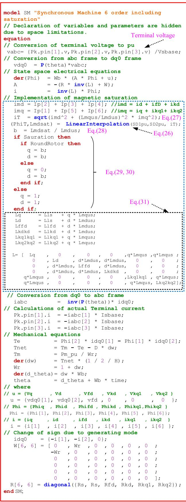  
Fig. 7. Implementation of synchronous machine model with magnetic saturation in Modelica. The saturation formulation is distinguished with the blue dashed outline.

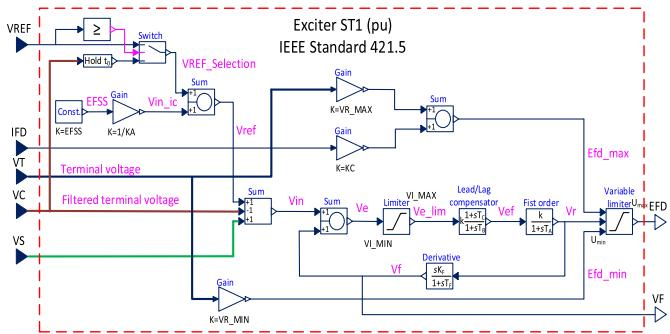  
Fig. 8. Implementation of exciter system in Modelica using block-diagram approach; type ST1 (PU). A combination of block functions such as adders, first-order integrators, limiters, and gains.

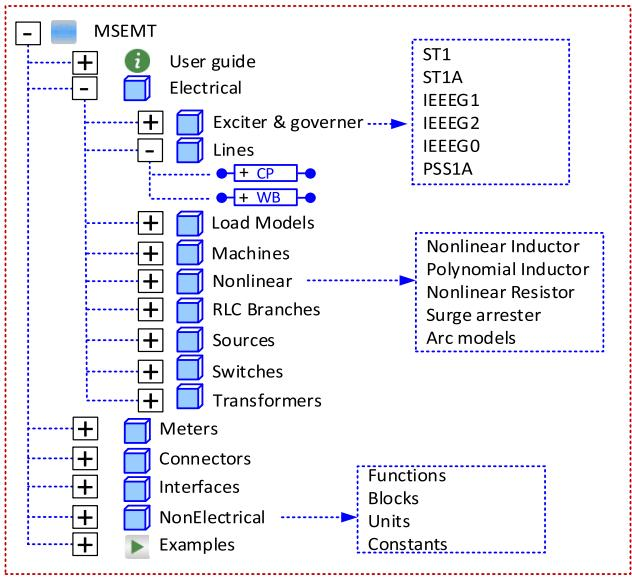  
Fig. 9. MSEMT structure and library of EMT-detailed components.

Due to space limitations, only the static exciter type ST1 [35] is shown in Fig. 8. The model is packaged, iconized, and illustrated as a block component with 5 inputs and 2 outputs.

# H. Architecture of MSEMT

Fig. 9 shows the top-level structure of MSEMT, a library containing linear and nonlinear power elements. The framework of the library is based on the interconnection of individual modules and objects. it contains the following functional packages (each package also contains several classes): Exciters and governors, Lines, Load models, Machines, RLC Branches, Sources, Switches, and Transformers. The Connectors package includes commonly used blocks such as electric bus, bus selector, etc. The Interface package contains the generic models e.g., Pin, OnePort. Models and components are open and can be modified, making them easy to reuse, customize, and extend. The library contains both electrical and non-electrical components. The non-electrical components are the usual mathematical blocks, transformations, functions used in the design of controllers and electrical components.

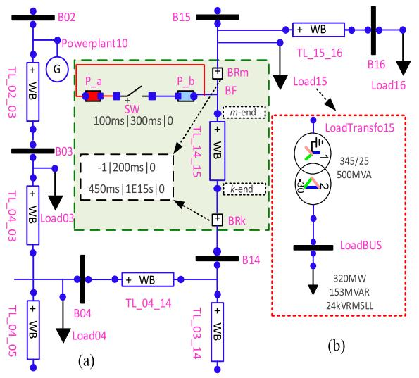  
Fig. 10. (a) Schematic diagram of the faulted zone in the IEEE 39-bus network sketched in Modelica graphical interface and (b) the sub-circuit of Load15; circuit contains a three-phase YgD-30 load transformer (STC model), and a constant impedance load model.

# IV. NUMERICAL RESULTS AND DISCUSSION

This section presents simulation results of the modified IEEE 39-bus benchmark system [36] to validate the accuracy of the proposed models. The same test case is also simulated with EMTP [1] as reference software. The results are compared using the WB line models. Only the faulted zone of the network is sketched here.

The IEEE 39-bus embeds 34 transmission lines, 10 power plants each including a synchronous machine, machine controls, and transformer. There are 19 load transformers with static load models. The circuit contains 87 nonlinear inductors.

The generators are represented by a single-mass Wye grounded configuration. Machine controls include exciter ST1 [35] and governor IEEEG1[37]. Load models are based on constant impedance calculated using the voltage obtained by the load-flow solution (Table 2–13 of [36]) of EMTP. There is no initialization for the simulations with Modelica.

The models of all three-phase transformers consist of singlephase units (STC model). The magnetization branch including nonlinear saturation is placed on the high-voltage side. The model uses a piecewise linearly interpolated curve to represent saturation.

The transient response scenario is illustrated in Fig. 10(a). A temporary phase-to-phase fault occurs on phases $\cdot _ { a } ,$ and $\cdot _ { b } ,$ of TL_14_15 near B15 at t = 100 ms followed by the isolation of the line at t = 200 ms (i.e., breakers BRm and BRk open simultaneously after 6 cycles). The fault is cleared at t = 300 ms, then the line is reconnected at t = 450 ms.

Re-energizing the TL introduces high-frequency transient oscillations and allows us to investigate the accuracy of transformer models in nonlinear operation. For this purpose, the curve of flux versus current for load transformer 15 which is located near the faulted bus, is compared with EMTP.

Numerical tests are performed using the variable-step IDA solver with the tolerance of 1e-6 in OpenModelica and Trapezoidal/Backward Euler integrator in EMTP with a step size

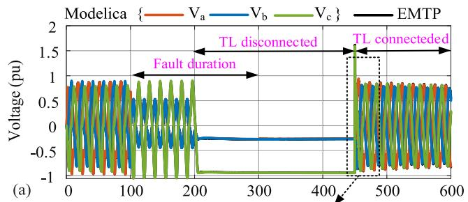

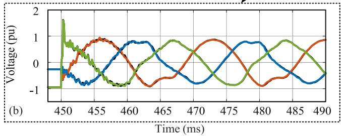  
Fig. 11. (a) Voltage waveforms at the m-end of TL_14_15 and (b) close-up view after re-energization of TL_14_15.

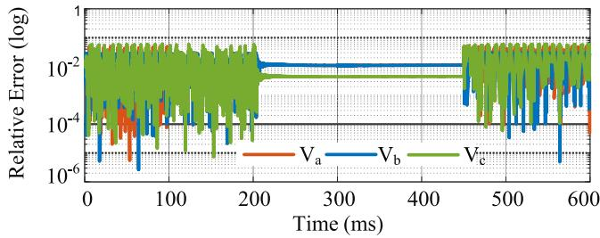  
Fig. 12. Assessment of accuracy for Modelica-based simulation: relative errors of phase voltages at the m-end of TL_14_15.

of 25 μs. The Modelica network contains 24 735 acausal DAEs.

# A. IEEE 39-Bus Incorporating WB Line Models

Vector fitting is an efficient method used in the WB line model to approximate the frequency-dependent matrices for propagation, H, and characteristic admittance, $\mathbf { Y } _ { c } ,$ with rational functions as this allows a recursive convolution [15], [38]. The vector fitting parameters of the WB model for TLs of IEEE 39- bus are calculated in EMTP for 8 decades starting at $f _ { m i n } = 0 . 1$ Hz. The maximum orders of fitting for the propagation matrix, $N _ { i } ^ { \mathbf { H } }$ , and admittance matrix, $N _ { \mathbf { Y } _ { c } }$ , are 7 and 9, respectively.

Fig. 11(a) shows the simulation results presenting the waveforms of phase voltage at the m-end of TL_14_15. The close-up plot of phase voltages during re-energization of the line after clearing the fault is observed in Fig. 11(b). As it can be seen from the plots, the results obtained with the Modelica match perfectly the EMTP results.

Accuracy assessment is carried out in Fig. 12 by drawing the graph of relative errors for voltage waveforms in Fig. 11(a). The reasonable slight difference is justified by the different methods of discontinuity handling, control system implementation, and numerical accuracy of the solver in each simulation tool.

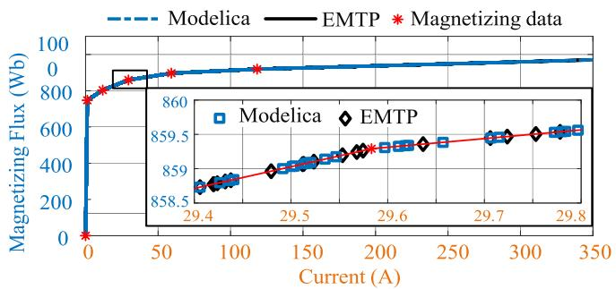  
Fig. 13. Superimposition of magnetizing inductance in LoadTransfo15; zoomin view of knee-point solutions.

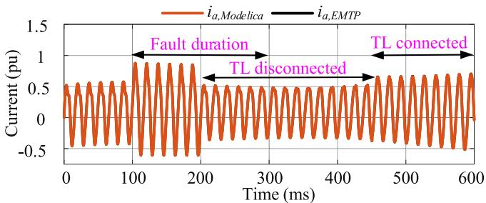  
Fig. 14. Stator current in phase-a, $i _ { a } ,$ for the generator in PowerPlant_03.

# B. Solution Evaluation for STC Model

The simultaneous solution for nonlinear functions in Modelica can be verified by demonstrating that all solution points remain on the same nonlinear characteristic segments for both simulations. This is carried out in Fig. 13 for the nonlinear inductor of the transformer (TR) 15 (LoadTransfo15 in Fig. 10(b)). It is observed both solutions are exactly on the magnetization curve of TR 15 and no overshooting or other instabilities are observed in the boundary points of linear segments.

In both simulations, the problem is solved through an iterative method and the need for changing the segment is realized before the last point has been within its improper range. Mathematically speaking, IDA is an adaptive solver and when simulation reaches a breakpoint (either state event or time event), it reduces the step size, once the last point of the current segment is solved, the segment change is accepted.

# C. Solution Evaluation for SM Model

In this section, the behavior of the proposed SM model in an unbalanced operation is examined. For this purpose, the generator connected to the B32 in PowerPlant_03 is selected as the nearest generator to the fault point. The resulting transients of the stator current in phase-a, $i _ { a } ,$ is depicted in Fig. 14. As it can be observed, the transient responses produced by Modelica match the reference solutions.

To compare the EMT responses of damper windings, the transient current computed in the damper kq1 is shown in Fig. 15. One can observe that all transients fit the reference solution obtained by EMTP.

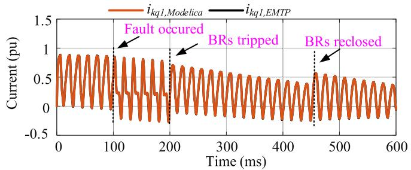  
Fig. 15. Damper winding current, $i _ { k q 1 }$ , for the generator in PowerPlant_03.

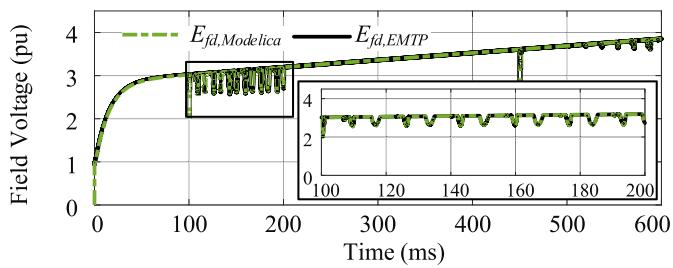  
Fig. 16. Field voltage, $E _ { f d } ,$ regulated by the exciter in PowerPlant_03.

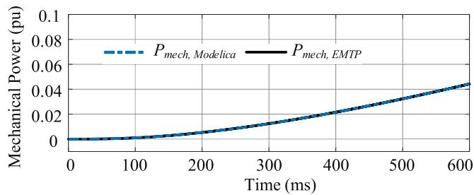  
Fig. 17. Mechanical power, $P _ { m e c h }$ , regulated by the governor in Power-Plant_03.

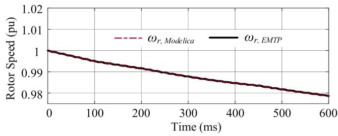  
Fig. 18. Rotor angular velocity, ωr, for the generator in PowerPlant_03.

# D. Solution Evaluation for Controllers

Fig. 16 shows the output of the exciter in PowerPlant_03 which controls the field voltage of the generator connected to the B32. As one can observe, both solutions are indistinguishable.

Similarly, the mechanical power regulated by the governor in PolwerPlant_03 is compared in Fig. 17. It is observed that the governor regulates the output power proportionally to rotor speed and both simulation results are in excellent agreement. Fig. 18 illustrates the rotor angular velocity of the same generator. Simulation results are perfectly identical.

TABLE I COMPARISON OF SIMULATION PERFORMANCE INCORPORATING WB MODEL   

<table><tr><td>Simulator</td><td>OpenModelica</td><td>Simulink (SPS)</td><td>EMTP</td></tr><tr><td>Solver</td><td>IDA</td><td>Trap/BE / ode23tb</td><td>Trap/BE</td></tr><tr><td>Solver type</td><td>variable step</td><td>discrete / variable step</td><td>fixed step</td></tr><tr><td>Tolerance/Δt</td><td>Tol:1e-6</td><td>Δt: 25 μs / Tol:1e-6</td><td>Δt: 25 μs</td></tr><tr><td>CPU time (s)</td><td>9 657</td><td>10 620</td><td>23.8</td></tr><tr><td># of timesteps</td><td>317 315</td><td>24 000</td><td>34 741</td></tr><tr><td>CGI (ms)</td><td>30.43</td><td>442.5</td><td>0.68</td></tr></table>

TABLE II COMPARISON OF SIMULATION PERFORMANCE INCORPORATING CP MODEL   

<table><tr><td>Simulator</td><td>OpenModelica</td><td>Simulink (SPS)</td><td>EMTP</td></tr><tr><td>Solver</td><td>IDA</td><td>TBE / ode23tb</td><td>Trap/BE</td></tr><tr><td>Solver type</td><td>variable step</td><td>discrete / variable step</td><td>fixed step</td></tr><tr><td>Tolerance/Δt</td><td>Tol:1e-6</td><td>Δt: 25 μs / Tol:1e-6</td><td>Δt: 25 μs</td></tr><tr><td>CPU time (s)</td><td>366</td><td>1801</td><td>13</td></tr><tr><td># of timesteps</td><td>38945</td><td>24000</td><td>34704</td></tr><tr><td>CGI (ms)</td><td>9.39</td><td>75.04</td><td>0.37</td></tr></table>

# E. Simulation Performance

The objective is to evaluate the efficiency of the Modelica environment compared with the Simscape Electrical Specialized Power Systems (SPS) library in Simulink (R2020b) which has the functionality and solution method similar to Modelica, and EMTP as a specific-domain simulator. Simulation in Simulink is carried out in discrete mode [6] with the ode23tb [39] solver.

For the efficiency of a solver, three parameters are considered: total CPU time, the number of timesteps, and CPU-time for one grid interval (CGI), i.e., CPU time divided by the number of timesteps. Table I presents the numerical details of the simulation employing the WB line model. The simulation is repeated with the CP line model as well; the solver and performance details are given in Table II. As one can see, the CPU time of the Modelica environment is not satisfactory compared to EMTP in both cases; however, the Modelica offers a better runtime than Simulink. Modelica has the lowest CPU time per timestep after EMTP as well.

# V. CONCLUSION

This paper contributed a new approach to the simulation of electromagnetic transients. It is based on the high-level programming environment of Modelica. The new approach is based on modern concepts of programming such as declarative, equation-based, object-oriented paradigms, which are all unified in Modelica.

In this paper, MSEMT an EMT-detailed library containing linear and nonlinear power electric components was introduced. The models yield results identical to those from the EMTP with similar numeral stability and accuracy. It was demonstrated that the proposed models are implemented in a few lines of code, are simply modifiable, expandable, and highly legible. The formulation of models is explicitly based on their true mathematical equations. This achievement has a significant impact on model development efficiency and standards. It is also noted that MSEMT is a powerful environment for power system transients

education. Also, Modelica is compatible with the FMI and can be used for co-simulation and model exchange.

Although Modelica offers computational speed advantages over existing environments, such as Simscape Electrical (Specialized Power System), its performance is not yet comparable to specialized simulation packages, such as EMTP. Further research is carried out to improve performance and will be the subject of a sequel paper.

# REFERENCES

[1] J. Mahseredjian, S. Dennetière, L. Dubé, B. Khodabakhchian, and L. Gérin-Lajoie, “On a new approach for the simulation of transients in power systems,” Electric Power Syst. Res., vol. 77, no. 11, pp. 1514–1520, 2007.   
[2] L. O. Chua, Computer-Aided Analysis of Electronic Circuits: Algorithms and Computational Techniques. Upper Saddle River, NJ, USA: Prentice-Hall, 1975.   
[3] A. Ametani, Numerical Analysis of Power System Transients and Dynamics. Stevenage, U.K.: The Institution of Engineering and Technology, 2015.   
[4] J. Mahseredjian, V. Dinavahi, and J. A. Martinez, “Simulation tools for electromagnetic transients in power systems: Overview and challenges,” IEEE Trans. Power Del., vol. 24, no. 3, pp. 1657–1669, Jul. 2009.   
[5] Simscape Electrical User’s Guide, Release 2020b, MathWorks, Sep. 2020. [Online] Available: www.mathworks.com   
[6] Simscape Electrical User’s Guide (Specialized Power Systems), Release 2020b, Hydro-Quebec and Math Works, Sep. 2020.   
[7] J. Mahseredjian and F. Alvarado, “Creating an electromagnetic transients’ program in MATLAB: Matemtp,” IEEE Trans. Power Del., vol. 12, no. 1, pp. 380–388, Jan. 1997.   
[8] Functional Mock-up Interface. [Online]. Available: https://fmistandard. org/   
[9] P. Fritzson, Principles of Object-Oriented Modeling and Simulation With Modelica 3.3: A Cyber-Physical Approach. Hoboken, NJ, USA: Wiley, 2014.   
[10] E. Angerson et al., “LAPACK: A portable linear algebra library for highperformance computers,” in Proc. ACM/IEEE Conf. Supercomput., New York, NY, USA, 1990, pp. 2–11.   
[11] T. A. Davis and E. P. Natarajan, “Algorithm 907: KLU, a direct sparse solver for circuit simulation problems,” ACM Trans. Math. Softw., vol. 37, no. 3, pp. 36:1–36:17, Sep. 2010.   
[12] M. Larsson, “ObjectStab-an educational tool for power system stability studies,” IEEE Trans. Power Syst., vol. 19, no. 1, pp. 56–63, Feb. 2004.   
[13] L. Vanfretti, T. Rabuzin, M. Baudette, and M. Murad, “iTesla power systems library (iPSL): A modelica library for phasor time-domain simulations,” SoftwareX, vol. 5, pp. 84–88, 2016.   
[14] A. Guironnet, M. Saugier, S. Petitrenaud, F. Xavier, and P. Panciatici, “Towards an open-source solution using modelica for time-domain simulation of power systems,” in Proc ISGT-Eur., 2018, pp. 1–6.   
[15] A. Masoom, T. Ould-Bachir, J. Mahseredjian, A. Guironnet, and N. Ding, “Simulation of electromagnetic transients with modelica, accuracy and performance assessment for transmission line models,” Electric Power Syst. Res., vol. 189, Dec. 2020, Art. no. 106799.   
[16] A. Masoom, A. Guironnet, A. A. Zeghaida, T. Ould-Bachir, and J. Mahseredjian, “Modelica-based simulation of electromagnetic transients using dynawo: Current status and perspectives,” Electric Power Syst. Res., vol. 197, Aug. 2021, Art. no. 107340.   
[17] P. Bunus and P. Fritzson, “Methods for structural analysis and debugging of modelica models,” in Proc. 2nd Int. Modelica Conf., 2002, pp. 157–165.   
[18] I. S. Duff, A. Erisman, and J. Reid, Direct Methods for Sparse Matrices. Oxford, U.K.: Oxford Univ. Press, 2017, pp. 108–136.   
[19] R. Tarjan, “Depth-first search and linear graph algorithms,” SIAM J. Comput., vol. 1, no. 2, pp. 146–160, 1972.   
[20] I. S. Duff and J. K. Reid, “An implementation of tarjan’s algorithm for the block triangularization of a matrix,” ACM Trans. Math. Softw., vol. 4, no. 2, pp. 137–147, 1978.   
[21] C. C. Pantelides, “The consistent initialization of differential-algebraic systems,” SIAM J. Sci. Statist. Comput., vol. 9, no. 2, pp. 213–231, 1988.   
[22] G. Kron, Diakoptics: The Piecewise Solution of Large-Scale Systems. London, UK: MacDonald, 1963.   
[23] H. Elmqvist and M. Otter, “Methods for tearing systems of equations in object-oriented modeling,” in Proc. ESM, 1994, pp. 326–332.

[24] L. R. Petzold, “Description of DASSL: A differential/algebraic system solver,” Sandia Nat. Labs., Livermore, CA, USA, Tech. Rep. SAND-82- 8637, 1982.   
[25] A. C. Hindmarsh et al., “Sundials: Suite of nonlinear and differential/algebraic equation solvers,” ACM Trans. Math. Softw., vol. 31, no. 3, pp. 363–396, 2005.   
[26] A. C. Hindmarsh, R. Serban, and A. Collier, “User documentation for IDA v2. 2.0,” Dept. Energy, USA, 2004.   
[27] G. Wanner and E. Hairer, Solving Ordinary Differential Equations I. Berlin, Germany: Springer, 1996, pp. 364–367.   
[28] P. Fritzson et al., “The openmodelica integrated environment for modeling, simulation, and model-based development,” Model., Identification Control, vol. 41, no. 4, pp. 241–295, 2020.   
[29] M. Dempsey, “Dymola for multi-engineering modelling and simulation,” in Proc. IEEE Veh. Power Propulsion Conf., 2006, pp. 1–6.   
[30] W. Braun, F. Casella, and B. Bachmann, “Solving large-scale modelica models: New approaches and experimental results using openmodelica,” in Proc. Int. Modelica Conf., 2017, pp. 557–563.   
[31] H. Lundvall, P. Fritzson, and B. Bachmann, “Event handling in the openmodelica compiler and runtime system,” Programming Environ. Lab., Linköping Univ., Swede, Tech. Rep. 2008:2, 2008.   
[32] P. C. Krause, O. Wasynczuk, S. D. Sudhoff, and S. Pekarek, “Synchronous machines,” in Analysis of Electric Machinery and Drive Systems, 3rd ed. New York, NY, USA: IEEE Press, 2013.   
[33] U. Karaagac, J. Mahseredjian, and O. Saad, “An efficient synchronous machine model for electromagnetic transients,” IEEE Trans. Power Del., vol. 26, no. 4, pp. 2456–2465, Oct. 2011.   
[34] P. Kundur, “Synchronous machine parameters,” in Power System Stability and Control, New York, NY, USA: McGraw-Hill, 1994.   
[35] IEEE Recommended Practice for Excitation System Models for Power System Stability Studies, IEEE Standard 421.5-2016, 2016.   
[36] A. Haddadi et al., “Power system test cases for EMT-type simulation studies,” CIGRE, Paris, France, Tech. Rep. CIGRE WG C 4, Aug. 2018, pp. 1–142.   
[37] P. Pourbeik et al., “Dynamic models for turbine-governors in power system studies,” IEEE Task Force on Turbine-Governor Modeling, 2013.   
[38] I. Kocar and J. Mahseredjian, “Accurate frequency dependent cable model for electromagnetic transients,” IEEE Trans. Power Del., vol. 31, no. 3, pp. 1281–1288, Jun. 2016.   
[39] M. E. Hosea and L. F. Shampine, “Analysis and implementation of TR-BDF2,” Appl. Numer. Math., vol. 20, no. 1, pp. 21–37, 1996.

Alireza Masoom received the M.A.Sc. degree in electrical engineering in 2017 from Polytechnique Montréal, Montréal, QC, Canada, where he is currently working toward the Ph.D. degree with the Department of Electrical Engineering. From 2003 to 2015, he was with industrial companies holding various positions in the electrical protection and SCADA projects. His research interests include electromagnetic transients modeling, computations, and simulation with highlevel languages. He is a Registered Engineer in the Province of Quebec and holds MBA degree.   
Jean Mahseredjian (Fellow, IEEE) received the M.A.Sc. and Ph.D. degrees in electrical engineering from Polytechnique Montréal, Montreal, QC, Canada, in 1985 and 1991, respectively. From 1987 to 2004, he was with IREQ (Hydro-Quebec), Quebec, Canada, working on research-and-development activities related to the simulation and analysis of electromagnetic transients. In 2004, he joined the Faculty of Electrical Engineering, Polytechnique Montréal.   
Tarek Ould-Bachir (Member, IEEE) received the M.A.Sc. and Ph.D. degrees in electrical engineering from Polytechnique Montréal, Montreal, QC, Canada, in 2008 and 2013, respectively. From 2007 to 2018, he was with OPAL-RT Technologies, the R&D department, holding various positions. From 2018 to 2020, he was a Research Associate with Polytechnique Montréal. He is currently an Assistant Professor with the Department of Computer Engineering and Software Engineering, Polytechnique Montréal.   
Adrien Guironnet received the M.A.Sc. degree from the KTH Royal Institute of Technology, Stockholm and Ecole Supérieure d’Electricite, Paris, in 2012. Since then, he has been with Réseau de Transport d’Electricité (RTE), R&D department, holding different positions around power system simulation tools. He is currently Leading the RTE effort for the development of a new open-source suite of simulation tools based on Modelica (Dynawo).