# Electro-mechanical transient modeling of MMC based multi-terminal HVDC system with DC faults considered

Liang Xiao, Zheng Xu, Huangqing Xiao⁎ , Zheren Zhang, Guoteng Wang, Yuzhe Xu

College of Electrical Engineering, Zhejiang University, Hangzhou, Zhejiang 310027, PR China

# A R T I C L E I N F O

Keywords:

DC fault simulation

Electro-mechanical transient model

Modular multilevel converter

Multi-terminal HVDC system

Transient stability

# A B S T R A C T

Modeling different types of DC faults in modular multilevel converter based multi-terminal HVDC (MMC-MTDC) systems for transient stability analyses has not been well studied. In this paper, an improved electro-mechanical model of MMC-MTDC system which is feasible for a variety of DC fault simulations is proposed. Firstly, the improved MMC electro-mechanical model with a second-order DC side circuit is derived theoretically. Then a method based on preset DC fault information for studying the impacts of DC faults on the stability of large-scale AC/DC power systems is proposed, with which the DC faults can be handled efficiently without reconstructing the DC topology. Theoretical and simulation studies show that the DC-side equivalent circuit of the MMC should be established as a second-order circuit when DC faults are considered for transient stability studies. Simulations of various types of DC faults in the modified IEEE 39-bus system incorporating a four-terminal MMC-HVDC system are carried out on PSS/E for validating the proposed method.

# 1. Introduction

With the advancement and wide range application of power electronics technology [1–8], MMC-based multi-terminal HVDC (MTDC) systems have drawn more and more attention both from academic and industrial fields. Currently, the four-terminal MMC-based HVDC grid (Zhangbei Project) [9] adopting overhead lines is under construction in the North China Power Grid. Due to the high line fault rate, the impacts of various types of DC faults on the stability of power systems should be paid special attention. However, modeling different types of DC faults in MMC-MTDC systems for transient stability analyses has not been well studied. The goal of this paper is to provide a method for modeling an improved MMC-MTDC electro-mechanical model with DC faults considered, which is useful for transient stability studies of large-scale AC/ DC systems.

Time-domain simulation method is widely used for transient stability study of large-scale AC/DC power systems [10]. The basic process is to solve the system differential-algebraic equations (DAEs) with appropriate numerical integration method, so as to obtain the dynamic response of the power system under a specific disturbance. Consequently, developing a computationally efficient and accurate model to describe the dynamic characteristic of an equipment is the prime work for transient stability study.

Researchers have developed plenty of MMC models for different

application scenarios [11–16]. Extraordinarily, the CIGRE Working Group B4.57 released a guide for the development and usage of MMC models in the year 2014 [14]. According to its definition, there are seven types of MMC models, varying from the most complex Full Physics Based Models with detailed semiconductor devices to the computational efficient Average Value Models (AVM, Type 5) based on switching functions, etc. Among these models, the most widely used Detailed Equivalent Circuit Model (DECM, Type 4) was first proposed in [11]. The Type 4 DECM has the benefit of high efficiency as well as good accuracy but can only be implemented in electro-magnetic transient (EMT) tools. There are some common features in the Type 5 AVMs and Type 6 Electro-mechanical Models (also called Phasor Models, RMS Models, etc.), e.g. the large number of IGBTs are not explicitly modeled and their DC and AC side circuits are modeled as controlled current and voltage sources, thus both of them have the advantage of computational efficiency. However, harmonic contents from the modulation control are generally considered for the Type 5 AVMs [14]. The Type 6 Electromechanical Models are developed by neglecting all harmonics and are implemented in phasor-frame electro-mechanical simulation tools. Obviously, for long time range and large-scale power system transient stability studies, the Electro-mechanical Models are preferred to the EMT-type MMC models. This is because on one hand, in commonly used transient stability simulation tools (e.g. PSS/E), the AC networks are represented by complex phasors without considering any harmonics; on

the other hand, the interactions of the MMCs with the host AC grids are dominated by the external dynamic characteristics rather than the internal dynamics of the MMCs.

The demand to analyze the stability of AC-MTDC systems has led to ongoing efforts in developing the MMC/VSC electro-mechanical model with DC faults considered [17–26]. A generalized dynamic VSC MTDC model valid for arbitrary DC network topology was first developed in [17] and further addressed in [18] and [19]. The proposed model enabled the simulations of events such as the loss of DC lines by reconstructing DC bus admittance matrix, however, the DC grounding short-circuit faults were not considered. The interaction between AC system and a VSC-MTDC system and the stability of the combined AC-MTDC system were well studied in [20]. A new and general reference frame for dynamic solutions of VSC-MTDC systems using the Newton-Raphson method was proposed in [21], but the dynamics in the DC network were ignored since only the DC line resistances were considered. Although there are lots of works on the VSC dynamic models, the models developed are based on two-level or three-level VSC, which are mathematically different from the MMC. Also, different types of DC faults cannot be handled efficiently with existing methods.

Simplified steady-state and dynamic models of MMC were developed in [22]. Nevertheless, the mathematical equations were not detailed and DC faults were not considered. The first generalized electromechanical MMC-MTDC model was then proposed in [23]. A simplified MMC model which could capture the average internal dynamic characteristic was proposed in [24]. A generic RMS model of the MMC-MTDC system was developed in [25], based on which, a linearized model for analytical analysis was also investigated. In [26], a point-topoint MMC-HVDC dynamic model was developed with an additional control method to improve the transient stability. However, the dynamic of the equivalent inductor on the DC side of the MMC, as well as the modeling of DC faults were not considered in the above MMC electro-mechanical models. In summary, the following two aspects need to be further improved:

The DC-side equivalent circuit of the MMC in electro-mechanical field has not been well established.   
• Modeling of different types of DC faults in an MMC-MTDC system for electro-mechanical transient stability studies has not been well studied.

To tackle these issues, an improved electro-mechanical model of MMC-MTDC system which is feasible for a variety of DC fault simulations is proposed. The contributions are summarized as follows:

(1) An improved MMC electro-mechanical model with a second-order circuit on the DC side is derived theoretically. It reveals that the DCside model of the MMC should be established as a second-order circuit when considering DC fault simulations, rather than a conventional first-order circuit, which gives a guideline for the modeling of MMC in electro-mechanical field from a theoretical point of view.   
(2) After establishing the differential-algebraic equations of the MMC-MTDC system, a method based on preset DC fault information for studying the impacts of DC faults on the stability of large-scale AC/ DC power systems is proposed, with which different types of DC faults can be handled efficiently without reconstructing the DC topology.

# 2. Limitations of the conventional electro-mechanical model of MMC-MTDC system

In this section, the limitations of the widely used conventional MMC electro-mechanical models proposed in [14,23,25,26] will be discussed. These MMC electro-mechanical models are mathematically similar,

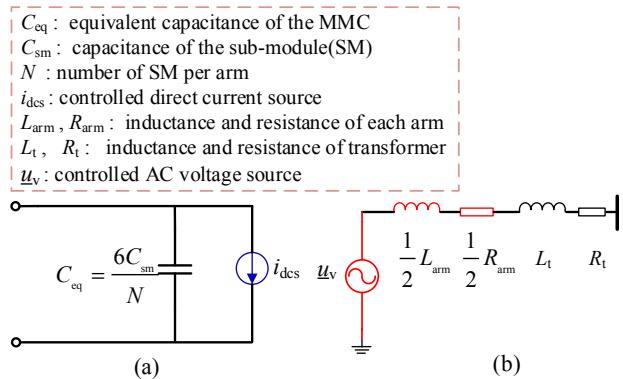  
Fig. 1. Equivalent circuit of the conventional MMC model. (a) DC-side equivalent circuit of the MMC. (b) AC-side equivalent circuit of the MMC.

where the DC and AC side circuits are modeled as controlled current and voltage sources, as shown in Fig. 1.

# 2.1. Limitation of the MMC DC-side equivalent circuit

The main limitation of these MMC models lies in the DC-side equivalent circuit, as shown in Fig. 1(a). The conventional DC-side model of the MMC is established as a first-order model without exception, in which only the dynamic of the equivalent capacitor $C _ { \mathrm { e q } }$ of the MMC is considered. However, it is believed that an equivalent inductor and resistor should be included on the DC-side model since the DC current flows through the arm inductor of the MMC. This limitation has been identified by [13] though, no strict mathematical derivations are given. To fill this gap, an improved MMC electro-mechanical model with a second-order circuit on the DC side will be derived theoretically in Section 3.

# 2.2. Limitation of the DC fault modeling in MMC-MTDC systems

None of the aforementioned references [14,23,24,25,26] deal with the modeling and simulation of DC faults in MMC-MTDC electro-mechanical models, which impede a complete stability study of the AC/DC systems. It is believed that modeling different types of DC faults (e.g. the outage of DC lines, DC grounding short-circuit faults as well as the combination of them) in a generic MMC-MTDC system, and the incorporation of these functions into commercial-grade transient stability simulation tools (e.g. PSS/E) are of enormous practical demands.

# 3. Improved electro-mechanical model of MMC-MTDC system for transient stability studies

In this section, the general idea of modeling will be illustrated firstly; then the improved MMC electro-mechanical model will be derived theoretically; lastly, the method for modeling a generic MMC-MTDC system feasible for different types of DC faults analyses will be provided.

# 3.1. General idea of modeling

Mathematically, to develop the MMC-MTDC electro-mechanical model is to establish the differential-algebraic equations describing its dynamic behaviors. The whole structure of the MMC-MTDC electromechanical model is shown in Fig. 2 (Note that all the symbols will be explained in subsequent sections and the subscript d/q denotes the daxis /q-axis component of the signals under dq synchronous rotating frame). The modeling tasks are mainly divided into three parts:

• Modeling of MMC: DC-side model, and AC-side model.   
• Modeling of a generic MTDC network.

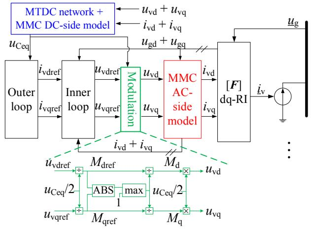  
Fig. 2. The whole structure of the MMC-MTDC electro-mechanical model.

• Modeling of control loops: outer control loop, inner control loop, and modulation loop, etc.

The first two parts will be covered in detail in Sections 3.2 and 3.3. The control loops are based on the well-known cascaded controller [23,27], except for an improved modulation loop taking the maximum modulation index into consideration.

Once the model is established, the next important task is to handle the interface between the MMC station and the AC system. Since in most electro-mechanical transient simulation tools, the electrical quantities of the AC network are represented by the positive sequence fundamental-frequency phasors in the common network frame (RIframe) rotated with rated angular frequency $\omega _ { \mathrm { n } }$ [14], a dq-frame to RIframe transformation is needed. Besides, the dynamic sources, e.g. generators are all represented as injected current sources in the form of Norton equivalents [10]. So the MMCs which are considered as dynamic sources, also need to be converted into injected current sources to facilitate a unified solution of the power systems.

# 3.2. Modeling of the MMC station

The schematic diagram of the MMC is shown in Fig. 3. Each arm contains N half-bridge sub-modules (SMs), an inductor $L _ { \mathrm { a r m } }$ and a lumped resistor $R _ { \mathrm { a r m } }$ accounting for loss. The arm voltage and arm current are denoted by $u _ { r j }$ and $i _ { r j } ,$ respectively $( r = { \mathfrak { p } } ,$ , n denotes the

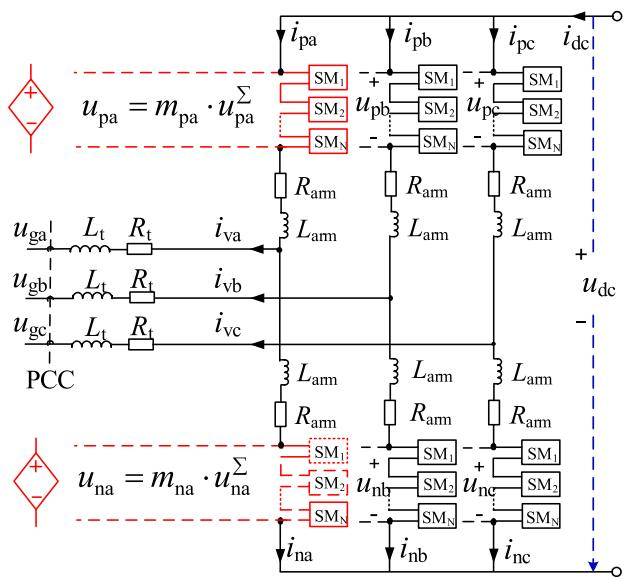  
Fig. 3. Schematic circuit of the MMC station.

upper and lower arm; $j = \mathbf { a } ,$ , b, c denotes the three phases throughout this paper); $i _ { \mathrm { v } j }$ is the output current of the MMC; $u _ { \mathrm { g } j }$ is the AC system voltage at the point of common coupling (PCC); $L _ { \mathrm { t } }$ and $R _ { \mathrm { t } }$ are the transformer leakage inductance and resistance.

Applying the Kirchhoff’s current law and voltage law, the differential equations describing the DC-side and AC-side dynamic behaviors of the MMC are given in (1) and (2), respectively [28]. These are the key equations to establish the electro-mechanical model of MMC.

$$
L _ {\mathrm {a r m}} \frac {\mathrm {d} i _ {\mathrm {c i r j}}}{\mathrm {d} t} + R _ {\mathrm {a r m}} i _ {\mathrm {c i r j}} = \frac {u _ {\mathrm {d c}}}{2} - u _ {\mathrm {c o m j}} \tag {1}
$$

$$
\left(L _ {\mathrm {t}} + \frac {L _ {\mathrm {a r m}}}{2}\right) \frac {\mathrm {d} i _ {\mathrm {v j}}}{\mathrm {d} t} + \left(R _ {\mathrm {t}} + \frac {R _ {\mathrm {a r m}}}{2}\right) i _ {\mathrm {v j}} = u _ {\mathrm {v j}} - u _ {\mathrm {g j}} \tag {2}
$$

where the circulating current $i _ { \mathrm { c i r } j } ,$ the common mode voltage $u _ { \mathrm { c o m } j }$ and the MMC output voltage $u _ { \mathrm { v } j }$ are expressed as:

$$
i _ {\mathrm {c i r j}} = \frac {1}{2} \left(i _ {\mathrm {p j}} + i _ {\mathrm {n j}}\right) \tag {3}
$$

$$
u _ {\mathrm {c o m} j} = \frac {1}{2} \left(u _ {\mathrm {p} j} + u _ {\mathrm {n} j}\right) \tag {4}
$$

$$
u _ {\mathrm {v j}} = \frac {1}{2} \left(u _ {\mathrm {n j}} - u _ {\mathrm {p j}}\right) \tag {5}
$$

# (1) Modeling assumptions

In electro-mechanical simulation tools, the harmonic-free AC power system is symmetrical and balanced [14]. In addition, the external dynamic characteristics rather than the internal dynamics of the MMC are of more interest during the transient stability study [23], which means that the dynamic of individual SM capacitor could be neglected. Consequently, to develop an MMC electro-mechanical model with fundamental frequency, the following assumptions are made:

• The sampling frequency and SM capacitance of the MMC are large enough to allow SM capacitor voltages to be balanced ideally [28–30]; and second harmonic circulating currents are suppressed perfectly [13].   
• The number of SMs in each arm is large enough to allow a harmonicfree arm voltage [29].   
• The fundamental-frequency modulation signals are symmetric and balanced. The signal of phase j is:

$$
m _ {j} = M \cos \left(\omega_ {\mathrm {g}} t + \varphi_ {j}\right) \tag {6}
$$

where M $( 0 < M \leq 1 )$ is the modulation index, $\omega _ { g }$ and φj stand for the fundamental angular frequency and initial phase.

Accordingly, combining (4) and (5) with (6), the SM insertion indices [30] of upper and lower arms are then derived as:

$$
\left\{ \begin{array}{l} m _ {\mathrm {p j}} = \frac {1 - M \cos \left(\omega_ {\mathrm {g}} t + \varphi_ {j}\right)}{2} \\ m _ {\mathrm {n j}} = \frac {1 + M \cos \left(\omega_ {\mathrm {g}} t + \tilde {\varphi} _ {j}\right)}{2} \end{array} \right. \tag {7}
$$

It is seen that the insertion indices describe the relation between the number of inserted SMs and the total number of SMs per arm.

# (2) DC-side model of the MMC

Now the DC-side equivalent circuit of the MMC will be derived. Firstly, the summation of arm currents in three phases yeilds:

$$
\sum_ {j = \mathrm {a}, \mathrm {b}, \mathrm {c}} i _ {\mathrm {p j}} = \sum_ {j = \mathrm {a}, \mathrm {b}, \mathrm {c}} i _ {\mathrm {n j}} = \sum_ {j = \mathrm {a}, \mathrm {b}, \mathrm {c}} i _ {\mathrm {c i r j}} = i _ {\mathrm {d c}} \tag {8}
$$

Next, combined with (8), summing the DC-side dynamic equation (1) over three phases yields the MMC’s DC-side equivalent model:

$$
\frac {2}{3} L _ {\text {a r m}} \frac {\mathrm {d} i _ {\mathrm {d c}}}{\mathrm {d} t} + \frac {2}{3} R _ {\text {a r m}} i _ {\mathrm {d c}} = u _ {\mathrm {d c}} - u _ {\mathrm {C e q}} \tag {9}
$$

where $\scriptstyle u _ { \mathrm { C e q } }$ is defined as the equivalent capacitor voltage of the MMC, its physical meaning is the average of the sum of capacitor voltages over three phase units:

$$
u _ {\mathrm {C e q}} = \frac {2}{3} \sum_ {j = \mathrm {a}, \mathrm {b}, \mathrm {c}} u _ {\mathrm {c o m} j} \tag {10}
$$

Further, the dynamic characteristic of the equivalent capacitor voltage $u _ { \mathrm { C e q } }$ will be revealed. Take the above assumptions into consideration, as well as the relation between the instantaneous power and the stored energy of the SM per arm [30,31], the following formulas hold:

$$
\left\{ \begin{array}{l} u _ {\mathrm {p j}} = m _ {\mathrm {p j}} u _ {\mathrm {p j}} ^ {\sum} \\ u _ {\mathrm {n j}} = m _ {\mathrm {n j}} u _ {\mathrm {n j}} ^ {\sum} \end{array} \right. \tag {11}
$$

$$
\left\{ \begin{array}{l} \frac {\mathrm {d} u _ {\mathrm {p j}} ^ {\sum}}{\mathrm {d} t} = \frac {N m _ {\mathrm {p j}}}{C _ {\mathrm {s m}}} i _ {\mathrm {p j}} \\ \frac {\mathrm {d} u _ {\mathrm {n j}} ^ {\sum}}{\mathrm {d} t} = \frac {N m _ {\mathrm {n j}}}{C _ {\mathrm {s m}}} i _ {\mathrm {n j}} \end{array} \right. \tag {12}
$$

where $u _ { \mathsf { p } j } ^ { \sum }$ and $u _ { \mathrm { n } j } ^ { \sum }$ are the sum of the SM capacitor voltage of the upper and lower arm; $\dot { C } _ { \mathrm { s m } }$ is the capacitance of the SM.

Substituting (7) into (11) yields:

$$
\begin{array}{l} u _ {\mathrm {c o m} j} = \frac {1}{2} \left(u _ {\mathrm {p} j} + u _ {\mathrm {n} j}\right) \\ = \frac {1}{4} \left(u _ {\mathrm {p j}} ^ {\sum} + u _ {\mathrm {n j}} ^ {\sum}\right) + \frac {1}{4} M \cos \left(\omega_ {\mathrm {g}} t + \varphi_ {j}\right) \left(u _ {\mathrm {n j}} ^ {\sum} - u _ {\mathrm {p j}} ^ {\sum}\right) \tag {13} \\ \end{array}
$$

Considering the assumption that capacitor voltages are balanced ideally, we get $\begin{array} { r } { u _ { \mathrm { p } j } ^ { \sum } = u _ { \mathrm { n } j } ^ { \sum } ; } \end{array}$ then substituting (13) into (10) yields:

$$
u _ {\mathrm {C e q}} = \frac {2}{3} \sum_ {j = \mathrm {a}, \mathrm {b}, \mathrm {c}} u _ {\mathrm {c o m} j} = \sum_ {j = \mathrm {a}, \mathrm {b}, \mathrm {c}} \frac {1}{6} \left(u _ {\mathrm {p} j} ^ {\Sigma} + u _ {\mathrm {n} j} ^ {\Sigma}\right) \tag {14}
$$

Taking the derivative of (14) and combining with (12) gives:

$$
\begin{array}{l} \frac {\mathrm {d} u _ {\mathrm {C e q}}}{\mathrm {d} t} = \frac {\mathrm {d}}{\mathrm {d} t} \sum_ {j = \mathrm {a}, \mathrm {b}, \mathrm {c}} \frac {1}{6} \left(u _ {\mathrm {p j}} ^ {\Sigma} + u _ {\mathrm {n j}} ^ {\Sigma}\right) \\ = \frac {N}{6 C _ {\mathrm {s m}}} \sum_ {j = \mathrm {a}, \mathrm {b}, \mathrm {c}} \left(m _ {\mathrm {p j}} i _ {\mathrm {p j}} + m _ {\mathrm {n j}} i _ {\mathrm {n j}}\right) \tag {15} \\ \end{array}
$$

Eq. (15) can be rewritten with intuitive physical meaning by combining (7) and considering the relation between arm current and the AC/DC current through the MMC:

$$
\begin{array}{l} C _ {\mathrm {e q}} \frac {\mathrm {d} u _ {\mathrm {C e q}}}{\mathrm {d} t} = \sum_ {j = \mathrm {a}, \mathrm {b}, \mathrm {c}} \frac {i _ {\mathrm {p j}} + i _ {\mathrm {n j}}}{2} \\ - \sum_ {j = \mathrm {a , b , c}} \frac {M \cos (\omega_ {\mathrm {g}} t + \varphi_ {j})}{2} (i _ {\mathrm {p j}} - i _ {\mathrm {n j}}) \\ = i _ {\mathrm {d c}} - \frac {\sum_ {j = \mathrm {a} , \mathrm {b} , \mathrm {c}} u _ {v j} i _ {v j}}{u _ {\mathrm {C e q}}} \\ = i _ {\mathrm {d c}} - i _ {\mathrm {d c s}} \tag {16} \\ \end{array}
$$

where $C _ { \mathrm { e q } } = 6 C _ { \mathrm { s m } } / N$ is defined as the equivalent capacitance of the MMC. $i _ { \mathrm { d c s } } ,$ known as the controllable DC source of the MMC’s DC-side equivalent model, is derived based on the power balance principle. Under the dq synchronous rotating frame, $i _ { \mathrm { d c s } }$ can be expressed as follows.

$$
i _ {\mathrm {d c s}} = \frac {3}{2} \frac {u _ {\mathrm {v d}} i _ {\mathrm {v d}} + u _ {\mathrm {v q}} i _ {\mathrm {v q}}}{u _ {\mathrm {C e q}}} = \frac {3}{4} \left(i _ {\mathrm {v d}} M _ {\mathrm {d}} + i _ {\mathrm {v q}} M _ {\mathrm {q}}\right) \tag {17}
$$

where $M _ { \mathrm { d } }$ and $M _ { \mathrm { q } }$ denote the d-axis and q-axis component of the modulation index M, respectively. $i _ { \mathrm { v d } }$ and ${ i _ { \mathrm { v q } } } \left( { u _ { \mathrm { v d } } } \right.$ and $u _ { \mathrm { v q } } )$ are the d-axis and q-axis component of the output current (voltage) of the MMC, respectively.

So far, the dynamic behaviors of the MMC’s DC-side model are described by the differential equations (9) and (16). Based on these equations, the DC-side equivalent circuit of the MMC is derived completely, as shown in Fig. 4(a).

control signal: $M _ { \mathrm { d } }$ $M _ { \mathfrak { q } }$

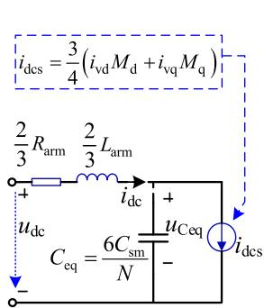  
(@)

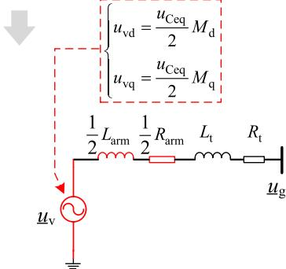  
(b)   
Fig. 4. Equivalent circuit of the improved MMC model. (a) DC-side circuit of the MMC. (b) AC-side circuit of the MMC.

The second-order differential equations of the DC-side model are summarized as:

$$
\left\{ \begin{array}{l} \frac {2}{3} L _ {\mathrm {a r m}} \frac {\mathrm {d} i _ {\mathrm {d c}}}{\mathrm {d} t} = u _ {\mathrm {d c}} - u _ {\mathrm {C e q}} - \frac {2}{3} R _ {\mathrm {a r m}} i _ {\mathrm {d c}} \\ C _ {\mathrm {e q}} \frac {\mathrm {d} u _ {\mathrm {C e q}}}{\mathrm {d} t} = i _ {\mathrm {d c}} - i _ {\mathrm {d c s}} \end{array} \right. \tag {18}
$$

Remark: some interesting properties can be observed during the deviation of the MMC DC-side model.

• Unlike the conventional model, the DC-side model of the MMC is proposed as a second-order circuit, with the dynamic of the equivalent arm inductor $\left( 2 L _ { \mathrm { a r m } } / 3 \right)$ on the DC-side considered.   
• The equivalent capacitance of the MMC is derived as $C _ { \mathrm { e q } } = 6 C _ { \mathrm { s m } } / N$ through (7)–(16), which is consistent with the result obtained by the energy conservation principle as given in [14,23,26], etc.   
• Without considering the internal SM dynamics of the MMC, it is shown that the equivalent capacitor voltage $\scriptstyle u _ { \mathrm { C e q } }$ reveals the operation status of the proposed MMC model: under steady state, $u _ { \mathrm { C e q } }$ keeps constant because of the power balance principle; during transient state, the power imbalance will be compensated by the energy stored in (or released from) the equivalent capacitor, leading a variation of $u _ { \mathrm { C e q } } , $ which eventually affects the DC voltage of the system. By controlling $\scriptstyle u _ { \mathrm { C e q } }$ (or $u _ { \mathrm { d c } }$ by adding $\scriptstyle u _ { \mathrm { C e q } }$ with the voltage component caused by the DC-side equivalent resistor 2/ ${ 3 R _ { \mathrm { a r m } } } ) ,$ , the MTDC system can operate stably.

(3) AC-side model of the MMC

The AC-side equivalent circuit of the MMC is not new compared with the existing literatures [14,23], etc. as shown in Fig. 4(b). A brief review of the MMC’s AC-side model is given for completeness. With the PCC voltage aligned with the d-axis as shown in Fig. 5, the dq-frame dynamic equation of the AC-side model after Park’s transformation is given as:

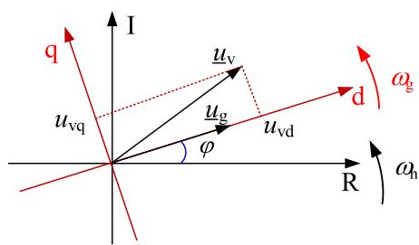  
Fig. 5. The relationship between the dq synchronous rotating frame and the RI frame.

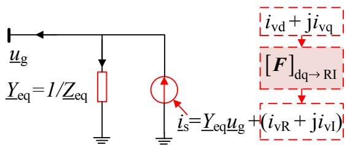  
Fig. 6. The Norton equivalent current source of the MMC’s AC-side model.

$$
L \frac {\mathrm {d}}{\mathrm {d} t} \left[ \begin{array}{l} i _ {\mathrm {v d}} \\ i _ {\mathrm {v q}} \end{array} \right] = \left[ \begin{array}{l} u _ {\mathrm {v d}} \\ u _ {\mathrm {v q}} \end{array} \right] - \left[ \begin{array}{l} u _ {\mathrm {g d}} \\ u _ {\mathrm {g q}} \end{array} \right] + \left[ \begin{array}{c c} - R & \omega_ {\mathrm {g}} L \\ - \omega_ {\mathrm {g}} L & - R \end{array} \right] \left[ \begin{array}{l} i _ {\mathrm {v d}} \\ i _ {\mathrm {v q}} \end{array} \right] \tag {19}
$$

where $L = L _ { \mathrm { t } } + ( 1 / 2 ) L _ { \mathrm { a r m } } , R = R _ { \mathrm { t } } + ( 1 / 2 ) R _ { \mathrm { a r m } } .$ . Thus, the equivalent impedance of the MMC on the AC-side is $\underline { { Z } } _ { \mathrm { e q } } = R + j \omega _ { \mathrm { g } } L$ .

As stated in Section 3.1, the AC-side model of MMC needs to be converted into the injected current sources. Thus the final form of the AC-side model represented in electro-mechanical tools is shown in Fig. $^ { 6 , }$ with the dq to RI frame transformation matrix F given in (20).

$$
\boldsymbol {F} = \left[ \begin{array}{c c} \cos \varphi & - \sin \varphi \\ \sin \varphi & \cos \varphi \end{array} \right] \tag {20}
$$

where the frame transformation angle φ is equal to the angle of PCC bus under steady operation [22].

# 3.3. Modeling of the DC network with DC faults considered

A generic MTDC network feasible for DC faults stability studies should at least meet the following requirements:

• The DC network is generic, which means that users can create a DC network with any topology.   
• The DC grounding short-circuit fault can be applied at any location of any line.   
• The outage and reclosure of DC lines can be applied at any line.   
• Different types of DC faults at different lines can be sequentially (or simultaneously) performed in a case.

It is still an open problem to incorporate these functions into commercial stability simulation tools since there is no systematic solution currently. Especially the topology of a DC network will change constantly when different faults happen at different times. For example, the DC grounding short-circuit fault will lead to another branch and node added to the prefault topology, and the outage of a DC line will cut down the branch numbers of the network. By reconstructing the network topology at every DC fault instant during the simulation process is a straightforward approach though, it is not practical considering computational burdens.

To tackle these issues, a method based on preset DC fault information is proposed to allow various types of DC faults simulations. The preset DC fault information includes the fault time, fault type and fault location, with which the generalized topology of the DC network can be obtained before simulation. The most important feature of this method is that the topology of the DC network will remain constant during the whole simulation regardless of DC faults happen or not. The applying or clearing a DC fault is realized by modifying the parameters of a DC line according to the fault time sequence, which will be described later in this section.

The proposed mathematical model of the generalized DC network is shown in Fig. 7. It is a π-line based [25] DC network with arbitrary topology. The reason to select the π-equivalent line model is that the accuracy of this model has been sufficiently demonstrated [32] in the low-frequency range of interest for transient stability study. However, when focusing on the stability issues (e.g. resonance-related instability) of the DC system, detailed frequency-dependent DC line models should be used [33,34].

Considering the advantages and possibility of expansion to a bipolar configuration, the asymmetric monopole with ground return [35] is adopted to demonstrate the modeling philosophy. The method can be extended to other configurations easily.

# (1) Definition of the generalized MTDC network

The concept of the generalized MTDC network will be illustrated by a four-terminal MMC-MTDC system that we think is generic enough for modeling various DC faults, as shown in Fig. 7. It can be seen that the generalized MTDC network contains three types of nodes, namely MMC nodes directly connected to the converter station, joint nodes, and fault nodes corresponding to the DC line ground short-circuit fault. In addition, the generalized MTDC network contains two types of branches, which are π-equivalent DC lines and grounding branches composed of grounding resistors and inductors.

A generalized MTDC network with arbitrary topoloty consisting of n nodes plus b branches can be described by an incidence matrix T of size $n \times b ,$ with element $T _ { i k } = 1$ if branch k leaves node $i , \ T _ { i k } = - 1$ if branch k enters node i, and $T _ { i k } = 0$ if there is no direct connection between branch k and node i. Especially, if there are DC grounding short-circuit faults scheduled for simulation, the fault nodes will be numbered in the end of matrix $^ { T , }$ with element $T _ { i k } = 1$ .

(2) Differential equations of the MTDC network

• For the ith node:

$$
\sum_ {k \in i} C _ {\mathrm {b r k}} \frac {\mathrm {d} u _ {\mathrm {d c i}}}{\mathrm {d} t} = i _ {\mathrm {d c i}} - \sum_ {k \in i} i _ {\mathrm {b r k}} \tag {21}
$$

where $i _ { \mathrm { b r } k }$ and $C _ { \mathrm { b r } k }$ are the current and single-ended capacitance of the kth branch directly associated with node i; $u _ { \mathrm { d c } i }$ is DC voltage of the ith node; if node i belongs to an MMC node, $i _ { \mathrm { d } \mathrm { c } i }$ is the DC current fed from the MMC, otherwise $i _ { \mathrm { d c } i }$ is zero for the ith joint node (as well as the fault node) in a DC network.

• For the kth branch between node i and node k:

$$
L _ {\mathrm {b r k}} \frac {\mathrm {d} i _ {\mathrm {b r k}}}{\mathrm {d} t} = u _ {\mathrm {d c i}} - u _ {\mathrm {d c k}} - R _ {\mathrm {b r k}} i _ {\mathrm {b r k}} \tag {22}
$$

where $R _ { \mathrm { b r } k }$ and $L _ { \mathrm { b r } k }$ are the resistance and inductance.

• Rewriting the differential equations in matrix form:

For efficient modeling, rewriting the network differential equations in matrix form yields:

$$
\operatorname {d i a g} \left(| T | C _ {\mathrm {b r}}\right) \frac {\mathrm {d} u _ {\mathrm {d c}}}{\mathrm {d} t} = i _ {\mathrm {d c}} - T i _ {\mathrm {b r}} \tag {23}
$$

$$
\operatorname {d i a g} \left(\boldsymbol {L} _ {\mathrm {b r}}\right) \frac {\mathrm {d} \boldsymbol {i} _ {\mathrm {b r}}}{\mathrm {d} t} = \boldsymbol {T} ^ {\mathrm {T}} \boldsymbol {u} _ {\mathrm {d c}} - \operatorname {d i a g} \left(\boldsymbol {R} _ {\mathrm {b r}}\right) \boldsymbol {i} _ {\mathrm {b r}} \tag {24}
$$

where $\pmb { i } _ { \mathrm { b r } } = [ i _ { \mathrm { b r 1 } } , . . . , i _ { \mathrm { b r f } b } ] ^ { \mathrm { T } }$ and $\boldsymbol { C } _ { \mathrm { b r } } = [ C _ { \mathrm { b r } 1 } , . . . , C _ { \mathrm { b r f } b } ] ^ { \mathrm { T } }$ are the vectors of branch current and single-ended capacitance; $\pmb { u } _ { \mathrm { d c } } = [ u _ { \mathrm { d c 1 } } , . . . , u _ { \mathrm { d c } n } ] ^ { \mathrm { T } }$ and $\boldsymbol { i } _ { \mathrm { d c } } = [ i _ { \mathrm { d c 1 } } , . . . , i _ { \mathrm { d c } n } ] ^ { \mathrm { T } }$ are the vectors of DC node voltage and injected DC current; $\boldsymbol { L } _ { \mathrm { b r } } = [ L _ { \mathrm { b r 1 } } , . . . , L _ { \mathrm { b r f } b } ] ^ { \mathrm { T } }$ and $\pmb { R } _ { \mathrm { b r } } = [ R _ { \mathrm { b r 1 } } , . . . , R _ { \mathrm { b r f } b } ] ^ { \mathrm { T } }$ are the vectors of branch inductance and resistance; $\pmb { T } ^ { \mathrm { T } }$ is the transposed matrix of matrix T.

(3) Handling different types of DC faults   
• For DC grounding short-circuit faults:

The DC grounding short-circuit fault can be applied at any location of any line. Take the four-terminal system (as shown in Fig. 7) as an example, there are two grounding short-circuit faults scheduled to occur at different locations of different lines in a single case. One of the grounding short-circuit faults is scheduled to occur at one-third of the

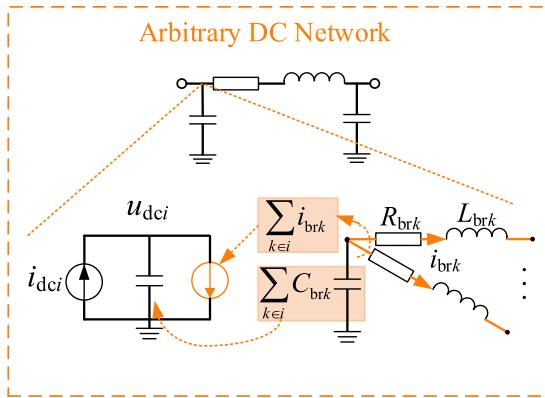

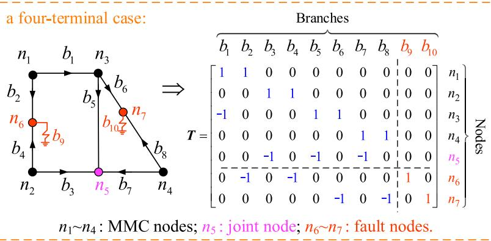  
Fig. 7. Mathematical model of the generic MTDC network.

branch between node 3 and node 4. Then $R _ { \mathrm { b r 6 } }$ (or $R _ { \mathrm { b r 8 } } )$ is equal to 1/3 (or 2/3) of the original branch $R _ { \mathrm { b r } }$ between node 3 and node 4, the same principle applies to inductance and capacitance of the branch, also the other faulted branches.

The grounding branch is modeled as an RL circuit with grounding resistance $R _ { \mathrm { b r f } }$ and grounding inductance $L _ { \mathrm { b r f } } ,$ thus $C _ { \mathrm { b r f } }$ is set to zero. Before the grounding fault occur, the grounding resistance $R _ { \mathrm { b r f } }$ is set to a huge value, e.g. $1 0 ^ { 6 } \Omega$ [20], and the grounding inductance $L _ { \mathrm { b r f } }$ is set to zero, which means that the grounding branch is out of service. During this stage, the fault current through the grounding branch is treated as zero, and no integration is applied to the grounding branch. When the preset grounding fault time is coming, the grounding resistance $R _ { \mathrm { b r f } }$ and inductance $L _ { \mathrm { b r f } }$ are set back to their preset values, which means the DC fault is detected and the grounding branch is put into service.

The clearing of a DC grounding short-circuit fault is realized by tripping the faulted branches associated with the fault node. Firstly we need to locate those faulted branches during simulations. This can be done easily with the help of the incidence matrix T, e.g. the positions of non-zero values in the last row of matrix T indicate those faulted branches associated with fault node 7. After then, all those faulted branch resistances are set to ${ 1 0 } ^ { 6 } \ \Omega ,$ together with the inductances and capacitances set to zero, representing the clearance of DC grounding short-circuit fault.

• For outage and reclosure of DC lines:

The modeling of outage of DC line is realized by setting the branch resistance to $1 0 ^ { 6 } \Omega ,$ , together with the inductances and capacitances set to zero. Similarly, the reclosure of DC line is realized by setting the branch resistance, inductances and capacitances back to their original values.

Clearly, with this method, different types of DC faults can be handled efficiently without reconstructing the DC topology.

# 3.4. Practical implementation

General procedures to incorporate the proposed modeling framework into commercial simulation tools are shown in Fig. 8. The initialization of the pre-fault MMC-MTDC system is similar to that in [23]. A two-time step approach [36] is applied during the numerical integration.

As depicted in Fig. 8, the calculation process within every network solution time step $( \Delta t _ { \mathrm { a c } } )$ consists of four steps:

①The newly obtained converter bus voltages are passed to the userdefined MMC model for numerical calculation;

②During each internal small time step $( \Delta t _ { \mathrm { d c } } ) ,$ , the DC control information (e.g. modification of reference or control strategy) should be updated first; next the detection and processing of DC faults

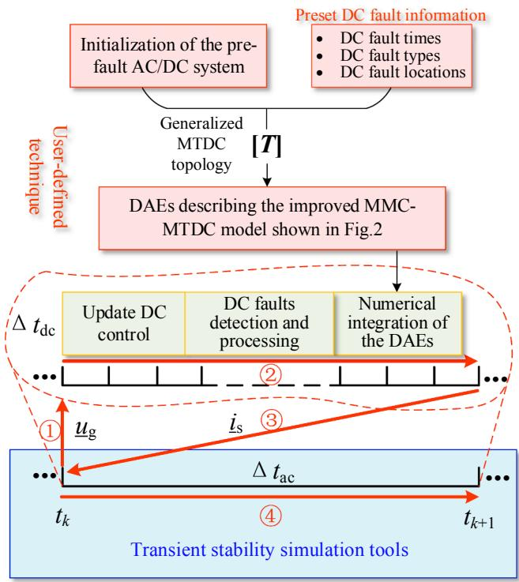  
Fig. 8. General procedures to incorporate the proposed modeling framework into commercial transient simulation tools via the user-defined technique.

should be completed as described in Section 3.3; then internal numerical integration of the MMC-MTDC model are performed;

③Once the MMC-MTDC model has been processed completely, the updated current injections from the MMC stations should be passed to the transient simulation program for AC network solution;

④The transient simulation program automatically calculates new state variable time derivatives and performs numerical integration for the AC system.

It should be noted that the purpose of using small time step is to develop an MMC-MTDC model with detailed DC controls and DC line dynamics considered. In the two-time step approach, the internal small step $\Delta t _ { \mathrm { d c } } ~ ( { \bf e . g . } ~ 2 0 \mu s )$ is only applied to the user-defined MMC-MTDC model; while the typical network solution step $\Delta t _ { \mathrm { a c } }$ (e.g. 10 ms for AC system with 50 Hz) is used for the positive-sequence AC system. Furthermore, the numerical calculation of the MTDC model will not be a burden since the scale of MTDC system tends to be much smaller than the AC system. As a result, the simulation efficiency is guaranteed in the proposed simulation framework based on the two-time step approach.

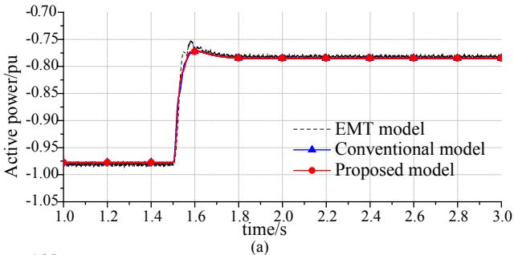

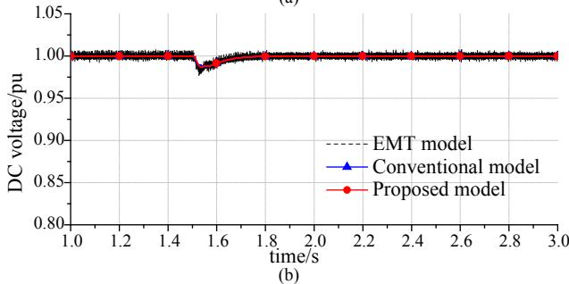  
Fig. 9. Comparisons of the improved/conventional MMC electro-mechanical model with the detailed EMT model under step change of the active power reference of MMC1: (a) active power of MMC2, (b) DC voltage of MMC2.

# 4. Validation and DC fault studies

# 4.1. Validation of the improved MMC model

Firstly, the proposed MMC model implemented in PSS/E will be validated by the detailed EMT type-4 model created in PSCAD/EMTDC. Tables 1 and 2 from the Appendix A gives the parameters and control modes of a monopole point-to-point MMC-HVDC link. Under the initial status, the MMC1 is of constant power control with command $P _ { \mathrm { g r e f 1 } } = 1 . 0$ pu, $Q _ { \mathrm { g r e f 1 } } = 0 . 0$ pu; and MMC2 is of constant DC voltage control with command $u _ { \mathrm { d c r e f 2 } } = 1 . 0 ~ \mathrm { p u } , Q _ { \mathrm { g r e f 2 } } = 0 . 0 ~ \mathrm { p u }$ .

# (1) Step change of the active power reference

In order to validate the proposed MMC electro-mechanical model, the active power reference of MMC1 is stepped down from 1.0 pu to 0.8 pu at 1.5 s both in PSS/E and PSCAD/EMTDC. A comparison with the conventional elector-mechanical MMC model is also made. Please noted that all electrical quantities are positive in the direction of rectifier.

From Fig. 9, it is shown that the responses of the MMC2 are acceptable compared with those of the EMT model. Thus the accuracy of the proposed MMC electro-mechanical model is verified. Besides, it can also be found that the responses of the conventional MMC electro-mechanical model are nearly identical to those of the improved one, which means both of the two MMC electro-mechanical models show good performances without considering any DC faults. This is understandable since on the one hand, their AC-side models are identical; on the other hand, both of them have the same equivalent capacitance on the DC side, which is the key factor that influences the energy exchanged between the AC and DC systems.

# (2) DC grounding fault simulation

In order to demonstrate the advantage of the proposed model over the conventional MMC electro-mechanical model, and to discuss the limitations of them, a DC grounding short-circuit fault (with $R _ { \mathrm { b r f } } = 0 . 0 5 \Omega , L _ { \mathrm { b r f } } = 2 . 0$ mH) is applied at the middle of the DC line at 1.5 s during simulation.

Here, two situations are considered.

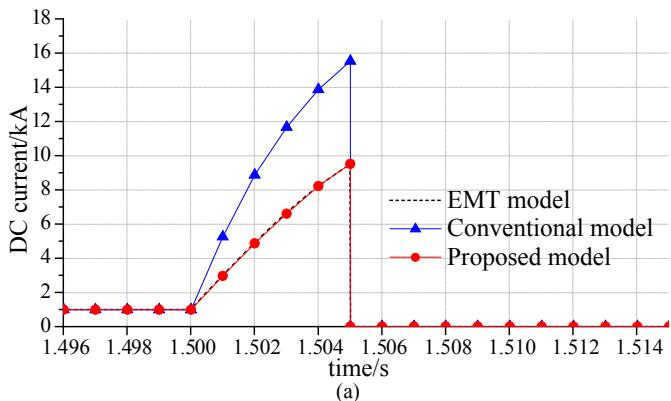

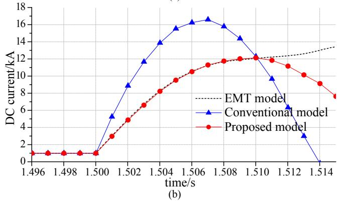  
Fig. 10. Comparisons of the improved/conventional MMC electro-mechanical model with the detailed EMT model under a DC grounding fault: (a) DC current with DC line tripping, (b) DC current without DC line tripping.

(a) The DC fault is cleared 5 ms later by tripping the DC line, which is intended to mimic a realistic operation.   
(b) Retaining the DC fault without tripping the DC line or triggering any protections (even if it is not realistic), which is intended to discuss the limitations of these two kinds of MMC electro-mechanical model.

Please note that since the IGBTs and diodes are not explicitly represented, the MMC electromechanical models cannot reproduce the dynamic behaviors of the blocked state accurately [13]. So all the study cases are carried out under the assumption that the action of the protection system is fast enough to avoid the MMC being blocked.

The simulation results are shown in Fig. 10(a) and (b), respectively.

From Fig. 10(a), it is evidenced that the DC current response of the proposed MMC electro-mechanical model is nearly identical to that of the EMT model in PSCAD. However, due to the lack of equivalent arm inductance on the DC side, the DC current response of the conventional MMC model is much faster than the EMT model, which is inaccurate. Obviously, the proposed MMC model is more accurate than the conventional electro-mechanical model under DC-side disturbances.

From Fig. 10(b), it is shown that the DC current response of the proposed MMC electro-mechanical model is nearly identical to that of the EMT model established in PSCAD/EMTDC, before the current reaches its maximum value (at about 10 ms) without considering any protection schemes. However, the DC current response becomes inaccurate the moment it surpasses the maximum value. From these studies, it can be inferred that the proposed MMC electro-mechanical model can only reproduce the response characteristics within about 10 ms during DC short-circuit faults. Similar conclusions can be found in [37]. This is because if the DC short-circuit fault lasts too long, the MMC capacitors will continue to discharge, so the DC voltage will collapse eventually. At this point, the assumptions based on which the MMC electro-mechanical model is built have been destroyed, thus the

dynamics characteristics of the MMC can no longer be described by the AC/DC equivalent circuits.

However, as the simulation results show, due to the inherent lowinertia characteristics of the DC system [1], the fault current soars to the order of 10 kA within a few milliseconds after the short-circuit fault happens, which seriously threatens the DC system and equipment safety. As a result, it is generally required that the DC fault clearing time should be less than 5 ms to avoid malfunction of the MMC-HVDC system [1,9]. Under this circumstance, the accuracy of the improved MMC electro-mechanical model can be guaranteed.

# (3) Summarization on the model in terms of application

Through the above simulation analyses, the following two conclusions can be drawn.

• If DC fault simulation is not considered for transient stability study, the accuracy between the proposed MMC electro-mechanical model and the conventional one is not much different and both of them show good performances; however, if DC fault is considered, the proposed model is preferred.   
• When DC fault simulation is considered for transient stability study, the protection system should be properly modeled to clear the DC fault. Only in this way can the accuracy of proposed MMC electromechanical model be guaranteed.

# 4.2. Impact of power reversal on the transient stability of the modified twoarea system

In this part, the aforementioned point-to-point MMC-HVDC link is applied to the two-area benchmark system [10] for further validating the proposed MMC model, as well as studying the impact of power reversal on the transient stability of the two-area system.

The diagram of the modified two-area system is shown in Fig. 11. Before modification, the power delivered from area 1 to area 2 through the AC lines is about 400 MW [10]. Here we assume that the loads in area 2 are growing and more power is needed from area 1 to area 2. So changes to the original two-area system will be made as follows. First, the active load at bus 9 is increased from 1767 MW to 1880 MW. Then the active load at bus 7 is reduced from 967 MW to 880 MW to ensure that the modifications have little impacts on the output of the generators. Meanwhile, the power delivered from area 1 to area 2 through the MMC-HVDC link is set as 300 MW $( P _ { \mathrm { g r e f 1 } } = 0 . 7 5$ pu). After power flow calculations, we get that the total power delivered by the AC/DC lines from low-loaded area 1 to heavy-loaded area 2 is about 483 MW.

At 3.0 s, the active power reference of MMC1 is changed from 0.75 pu to −0.125 pu both in PSS/E and PSCAD/EMTDC to make the MMC-HVDC link in reversed operation. The dynamic responses of the AC/DC power systems are shown in Fig. 12.

From Fig. 12(b), it is shown that the power reversal of the MMC-HVDC link leads to a temporary DC voltage dip. This is because the power injected to MMC1 is decreased the moment MMC1 changed from rectifier to inverter. And the temporary power deficiency is compensated by the energy released from the MMC capacitors, thus resulting in a DC voltage dip. Afterwards, under the constant DC voltage control by

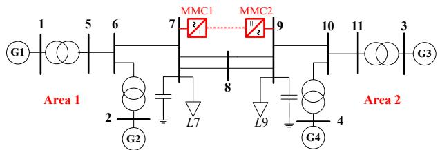  
Fig. 11. The modified two-area system.

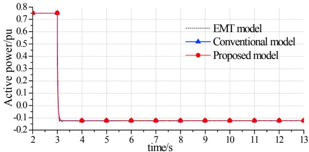

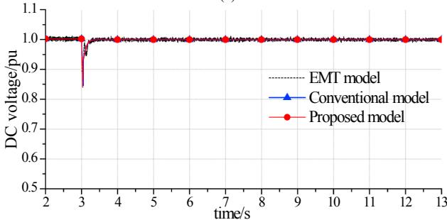  
(a)

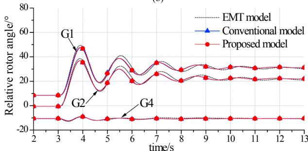  
(c)   
Fig. 12. Dynamic responses of AC/DC systems under power reversal: (a) active power of MMC1, (b) DC voltage of MMC1, (c) generator relative rotor angles with reference to G3.

MMC2 station, the DC voltage of the MMC-HVDC system is quickly recovers to the level near the rated value.

From Fig. 12(c), it can be seen that the power reversal of the MMC-HVDC link leads to an increased angle of the generator in the sendingend system (area 1) significantly, while has little impacts on the angle of the generator in the receiving-end system (area 2). This is because, for the sending-end system, the reduced power absorbed by the MMC1 leads to a remarkable increased speed of the generators in the lowloaded area 1. However, for the receiving-end system, since the power deficiency has been compensated by the power transferred form area 1 through the AC lines, the power reversal of MMC-HVDC link only has little impacts on the speed of the generator in the heavy-loaded area 2.

Again, from Fig. 12(a)–(c), it is verified that the proposed MMC electro-mechanical model is accurate enough for electro-mechanical transient stability studies. And both of the proposed and conventional models show good performances when DC fault simulation is not considered.

# 4.3. Impacts of various types of DC faults on the stability of the modified IEEE-39 bus system

In this part, various types of DC faults will be carried out to study their impacts on the transient stability of the AC system. First, the standard IEEE New England 39-bus system [38] is built on PSS/E. Then, the four-terminal MMC-HVDC system (shown in Fig. 7) is incorporated into it. The modified IEEE 39-bus system is shown in Fig. 13. In the modified IEEE 39-bus system, the active load at bus 26, 16 and 15 are

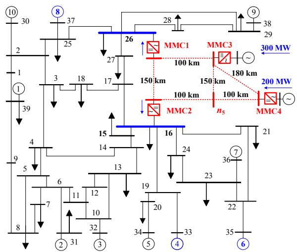  
Fig. 13. The modified New England 39 bus system.

increased by 100 MW, 200 MW, and 180 MW respectively to compensate the powers delivered through the MTDC system.

The main circuit and control system parameters of the four MMCs are identical to those of the point-to-point MMC-HVDC link. Under the initial status, the MMC1, MMC3 and MMC4 are of constant power control with command $P _ { \mathrm { g r e f 1 } } = - 0 . 2 5$ pu, $Q _ { \mathrm { g r e f 1 } } = 0 . 0$ pu, $P _ { \mathrm { g r e f 3 } } = 0 . 7 5$ pu, $Q _ { \mathrm { g r e f 3 } } = 0 . 0 \ \mathrm { p u } _ { \mathrm { \ i } }$ and $P _ { \mathrm { g r e f } 4 } = 0 . 5$ pu, $Q _ { \mathrm { g r e f } 4 } = 0 . 0$ pu, respectively; and MMC2 is of constant DC voltage control with command $u _ { \mathrm { d c r e f 2 } } = 1 . 0 ~ \mathrm { p u } , Q _ { \mathrm { g r e f 2 } } = 0 . 0 ~ \mathrm { p u }$ .

Other simulation parameters are described below. It has been verified in Section 4.1 that the proposed MMC model is accurate enough for AC/DC transient stability studies, and when DC fault simulation is considered, the protection system should be properly modeled. Because of the rapidly rising DC fault currents in the low-impedance DC grids, DC fault currents are required to be quickly detected and interrupted within a few milliseconds [1,14]. Studies have shown that the travelingwave protection scheme can detect a DC fault within 1–2 ms, plus 2–3 ms breaking time of the hybrid DC breaker, resulting 3–5 ms to clear a DC fault [1,9]. Consequently, the required time to clear a DC fault is set as 4 ms in the following simulations. Besides, the internal DC time step is set to $2 0 \mu \mathbf { s } .$ . The PSS/E time step is set to 1 ms to mimic the fast tripping of faulted lines but is switched back to a typical time step (e.g. 10 ms) when the DC faults are cleared.

# (1) Case 1: single temporary grounding fault

In case 1, a temporary grounding short-circuit fault (with $R _ { \mathrm { b r f } } = 0 . 1 \Omega , L _ { \mathrm { b r f } } = 1 . 0$ mH) is scheduled at the middle of the DC branch between MMC1 and MMC2 at 1.0 s to study its impact on the stability of the combined AC/DC system. The fault is cleared 4 ms later by tripping the faulted branches and 100 ms later, the DC branch is reclosed. The dynamic responses of the AC/DC system are shown in Fig. 14.

From Fig. 14(a) and (b), it is shown that the DC grounding shortcircuit fault leads to voltage dips both on the AC and DC sides in the fault duration. This is because for the entire MMC-MTDC system, the grounding branch introduces additional power consumption, resulting in power deficiency of the entire MTDC system. Then the power deficiency is mainly compensated by the energy released from the MMC capacitors, resulting in rapid DC current increases, as well as DC voltage dips. Furthermore, the DC voltage dips lead to the dips of MMC modulated output voltages. Thus it can be inferred that a DC grounding fault occur at the monopole MTDC system is approximately equal to a

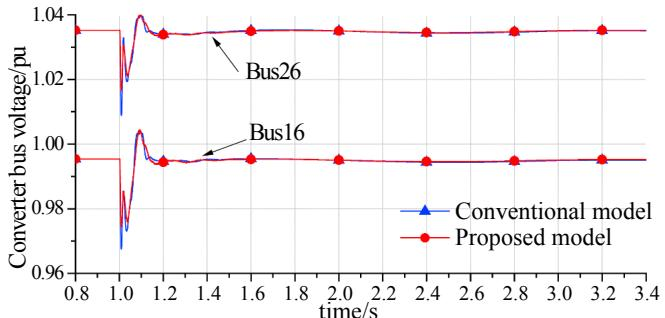

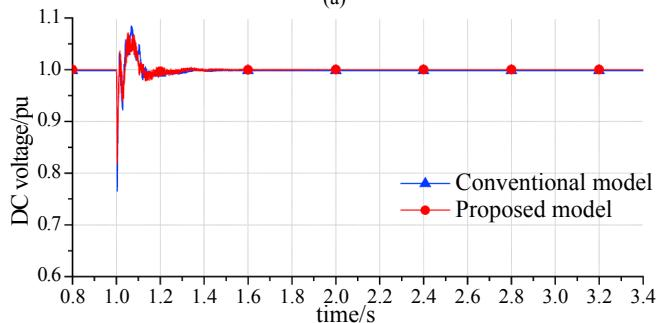  
(a)

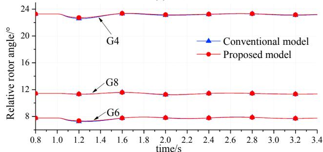

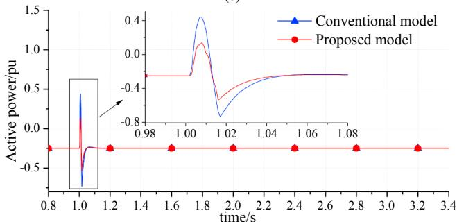

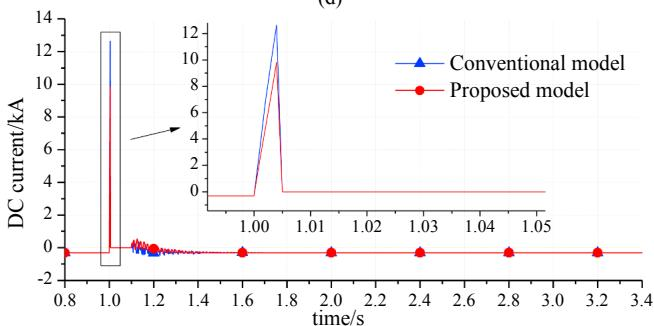  
(d)   
  
Fig. 14. Dynamic responses of the AC/DC system under a temporary grounding fault occurring at the DC branch between MMC1 and MMC2: (a) converter bus voltages, (b) DC voltage of MMC2, (c) generator relative rotor angles with reference to G2, (d) active power of MMC1, (e) DC current of branch 4.

short-circuit fault at the AC side. This phenomenon can be further verified by the decreasing generator rotor angles shown in Fig. 14(c), as well as the decreasing power injected into the AC system shown in Fig. 14(d). However, it should be noted that since the DC fault duration is just a few milliseconds, such impacts on the rotor angle stability are very limited.

The DC current of branch 4 (as marked in Fig. 7) is shown in Fig. 14(e). It is seen that before the fault happens, the DC current is flowing into node 2 of MMC2. However, when the grounding fault occurs, each DC branch current will be forced to flow into the grounding branch. Thus DC current of branch 4 reverses rapidly in a few milliseconds during the fault, and then drops to zero with the tripping of the faulted branches. By reclosing the DC branch, the DC current recovers to the pre-fault level.

The DC current response of the conventional MMC model is much faster than the proposed model, which has been explained in Section 4.1. And the peak values of all the simulation curves are greater than those of the proposed model. Thus, the performances of the proposed model are better than the conventional one when considering DC faults.

# (2) Case 2: two permanent grounding faults

In case 2, a grounding short-circuit fault is scheduled at the middle of the DC branch between MMC1 and MMC2 at 1.0 s, and the other is at onethird of the branch between MMC3 and MMC4 at 2.0 s, both with 0.1 Ω grounding resistance and 1.0 mH grounding inductance. The faults are both cleared 4 ms later by permanently tripping the faulted branches. The dynamic responses of the AC/DC system are shown in Fig. 15.

From Fig. 15(a) and (b), it is shown that the DC grounding shortcircuit faults lead to voltage dips both on the AC and DC sides in the fault durations. And the DC grounding short-circuit faults eventually result in generator rotor angle decreasing as shown in Fig. 14(c), as well as MMC output power decreasing as shown in Fig. 15(d), which have been explained in case 1 of Section 4.3. Besides, it is clearly seen that the dynamic responses of the AC/DC system under grounding shortcircuit faults are similar regardless of the fault locations. Thanks to the fast clearing of DC faults, even under the situations that two DC branches (branch 2 and branch 5 as marked in Fig. 7) are faulted and have been tripped, their impacts on the rotor angle stability of the AC system are limited as shown in Fig. 15(c).

However, it should be paid special attention that the currents within the MTDC system will redistribute due to the outage of the faulted branches, e.g. as Fig. 15(e) shows, the steady-state DC current of branch 5 is increased so as to maintain the expected delivered power. In this case, those healthy branches may be tripped by the relay protection devices due to their heavy currents, which in turn causes an entire blackout of the MTDC network probably.

From the above simulations and analyses, it can be concluded that the feasibility of the proposed method for various types of DC faults simulations is verified.

# 5. Conclusion

In this paper, an improved electro-mechanical model of MMC-MTDC system which is feasible for a variety of DC fault simulations is proposed.

If DC fault simulation is not considered for transient stability study, the accuracy between the proposed MMC electro-mechanical model and the conventional one is not much different and both of them show good performances.

Theoretical and simulation studies show that the proposed MMC model with a second-order circuit on the DC side is preferred when DC

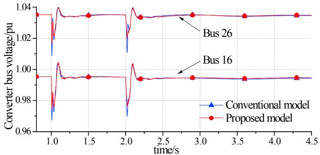

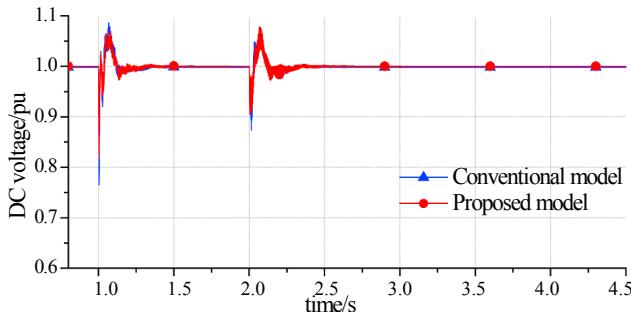

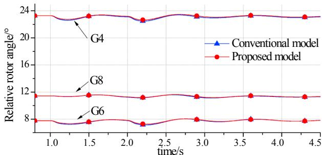  
(c)

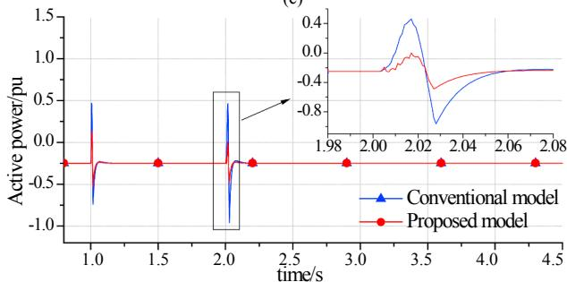

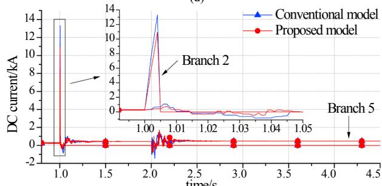  
(d)   
(e)   
Fig. 15. Dynamic responses of the AC-DC system when two permanent grounding faults occur sequentially: (a) converter bus voltages, (b) DC voltage of MMC2, (c) generator relative rotor angles with reference to G2, (d) active power of MMC1, (e) DC currents of branch 2 and branch 5.

fault simulations are considered. However, it is noted that the protection system should be properly modeled to clear the DC faults. Only in this way can the accuracy of proposed MMC electro-mechanical model be guaranteed.

A method based on preset DC fault information is proposed to allow simulations with various types of DC faults in an MMC-MTDC system, allowing researchers to perform complete transient stability studies for large-scale AC/DC power systems efficiently.

# Acknowledgements

This work is supported by the State Grid Corporation of China through headquarter of science and technology project: Research on flexible transmission network planning evaluation method and key technologies for its application (SGTYHT/15-JS-191).

# Appendix A

The parameters of the point-to-point MMC-HVDC link are given in Tables 1 and 2.

Table 1 Parameters of the two-terminal MMC-HVDC system.   

<table><tr><td>Item</td><td>Value</td></tr><tr><td>AC equivalent source voltage</td><td>220 kV</td></tr><tr><td>AC system impedance</td><td>0.484 + j4.84 Ω</td></tr><tr><td>Converter rated capacity</td><td>400 MVA</td></tr><tr><td>Rated DC voltage</td><td>400 kV</td></tr><tr><td>Transformer nominal ratio</td><td>220 kV: 210 kV</td></tr><tr><td>Transformer rated capacity</td><td>480 MVA</td></tr><tr><td>Transformer inductance</td><td>35 mH</td></tr><tr><td>Transformer resistance</td><td>0.66 Ω</td></tr><tr><td>Arm inductance Larm</td><td>76 mH</td></tr><tr><td>Arm resistance Rarm</td><td>0.48 Ω</td></tr><tr><td>Number of SM per arm</td><td>200</td></tr><tr><td>SM capacitance Csm</td><td>6667 μF</td></tr><tr><td>DC reactor Ldc</td><td>100 mH</td></tr><tr><td>DC line length</td><td>100 km</td></tr><tr><td>DC line resistance</td><td>0.0114 Ω/km</td></tr><tr><td>DC line inductance</td><td>0.9356 mH/km</td></tr><tr><td>DC line capacitance</td><td>0.0123 μF/km</td></tr></table>

Table 2 Parameters of the control system.   

<table><tr><td>Item</td><td>Gain of the proportioner</td><td>Gain of the integrator</td></tr><tr><td>d-axis inner current controller</td><td>1.1</td><td>18.5</td></tr><tr><td>q-axis inner current controller</td><td>1.1</td><td>18.5</td></tr><tr><td>Reactive power controller</td><td>0.4</td><td>34.5</td></tr><tr><td>Active power controller</td><td>0.6</td><td>60.5</td></tr><tr><td>DC voltage controller</td><td>10.0</td><td>125.0</td></tr><tr><td>Phase lock loop controller</td><td>100.0</td><td>200.0</td></tr></table>

# References

[1] CIGRE WG B4-52. HVDC grid feasibility study. CIGRE Tech Brochure TB.533; 2013.   
[2] Jovcic D, Khaled A. High voltage direct current transmission: converters, systems and DC grids. Hoboken,New Jersey: IEEE Press/Wiley; 2015.   
[3] Sharifabadi K, Harnefors L, Nee HP, Norrga S, Teodorescu R. Design, control and application of modular multilevel converters for HVDC transmission systems. Chichester, United Kingdom: John Wiley & Sons Ltd; 2016.   
[4] Liu H, Xie X, Liu W. An oscillatory stability criterion based on the unified dq-frame impedance network model for power systems with high-penetration renewables. IEEE Trans Power Syst 2018;33(3):3472–85.   
[5] Wen B, Burgos R, Boroyevich D, Mattavelli P, Shen Z. AC stability analysis and DQ frame impedance specifications in power electronics based distributed power systems. IEEE J Emerg Sel Top Power Electron 2017;5(4):1455–65.   
[6] Rakhshani E, Rodriguez P. Inertia emulation in AC/DC interconnected power systems using derivative technique considering frequency measurement effects. IEEE Trans Power Syst 2017;32(5):3338–51.   
[7] Xiao L, Xu Z, An T, Bian Z. Improved analytical model for the study of steady state performance of droop-controlled VSC-MTDC systems. IEEE Trans Power Syst 2017;32(3):2083–93.   
[8] Jia L, Ruan X, Zhao W, Lin Z, Wang X. An adaptive active damper for improving the stability of grid-connected inverters under weak grid. IEEE Trans Power Electron 2018;33(11):9561–74.   
[9] An T, Tang G, Wang W. Research and application on multi-terminal and DC grids based on VSC-HVDC technology in China. High Volt 2017;2(1):1–10.

[10] Kundur P. Power system stability and control. New York: McGraw-Hill; 1994.   
[11] Gnanarathna UN, Gole AM, Jayasinghe RP. Efficient modeling of modular multilevel HVDC converters (MMC) on electromagnetic transient simulation programs. IEEE Trans Power Del 2011;26(1):316–24.   
[12] Saad H, Peralta J, Dennetière S, Mahseredjian J, Jatskevich J, Martinez JA, et al. Dynamic averaged and simplified models for MMC-based HVDC transmission systems. IEEE Trans Power Del 2013;28(3):1723–30.   
[13] Saad H, Dennetière S, Mahseredjian J, Delarue P, Guillaud X, Peralta J, et al. Modular multilevel converter models for electromagnetic transients. IEEE Trans Power Del 2014;29(3):1481–9.   
[14] CIGRE WG B4-57. Guide for the development of models for HVDC converters in a HVDC grid. CIGRE Tech Brochure TB.604; 2014.   
[15] Beddard A, Sheridan CE, Barnes M, Green TC. Improved accuracy average value models of modular multilevel converters. IEEE Trans Power Del 2016;31(5):2260–9.   
[16] Lopez AM, Quevedo DE, Aguilera RP, Geyer T, Oikonomou N. Limitations and accuracy of a continuous reduced-order model for modular multilevel converters. IEEE Trans Power Electron 2018;33(7):6092–303.   
[17] Cole S, Beerten J, Belmans R. Generalized dynamic VSC-MTDC model for power system stability studies. IEEE Trans Power Syst 2010;25(3):1655–62.   
[18] Cole S, Belmans R. A proposal for standard VSC HVDC dynamic models in power system stability studies. Elect Power Syst Res 2011;81(4):967–73.   
[19] Beerten J, Cole S, Belmans R. Modeling of multi-terminal VSC HVDC systems with distributed DC voltage control. IEEE Trans Power Syst 2014;29(1):34–42.   
[20] Chaudhuri NR, Majumder R, Chaudhuri B, Pan J. Stability analysis of VSC MTDC grids connected to multimachine AC systems. IEEE Trans Power Del

2011;26(4):2774–84.   
[21] Castro LM, Acha E. A unified modelling approach of multi-terminal VSC-HVDC links for dynamic simulations of large-scale power systems. IEEE Trans Power Syst 2016;31(6):5051–60.   
[22] Teeuwsen SP. Simplified dynamic model of a voltage-sourced converter with modular multilevel converter design. In: Proc 2009 IEEE/PES power syst conf expo; 2009. p. 1–6.   
[23] Liu S, Xu Z, Hua W, Tang G, Xue Y. Electromechanical transient modelling of modular multilevel converter based multi-terminal HVDC systems. IEEE Trans Power Syst 2014;29(1):72–83.   
[24] Freytes J, Papangelis L, Saad H, Rault P, Van Cutsen T, Guillaud X. On the modeling of MMC for use in large scale dynamic simulations. In: Proc 2016 IEEE power syst comput conf; 2016. p. 1–7, Genoa, Italy.   
[25] Trinh NT, Zeller M, Wuerflinger K, Erlich I. Generic model of MMC-VSC-HVDC for interaction study with AC power system. IEEE Trans Power Syst 2016;31(1):27–34.   
[26] Kou L, Zhu L, Li F. Electromechanical transient model of HVDC grids based on modular multilevel converter. In: Proc energy internet and energy system integration (EI2) Conf; 2017. p. 1–6, Beijing, China.   
[27] Lu S, Xu Z, Xiao L, Jiang W, Bie X. Evaluation and enhancement of control strategies for VSC stations under weak grid strengths. IEEE Trans Power Syst 2018;33(2):1836–47.   
[28] Xiao H, Xu Z, Tang G, Xue Y. Complete mathematical model derivation for modular multilevel converter based on successive approximation approach. IET Power Electron 2015;8(12):2396–410.   
[29] Tu Q, Xu Z. Impact of sampling frequency on harmonic distortion for modular

multilevel converter. IEEE Trans Power Del 2011;26(1):298–306.   
[30] Harnefors L, Antonopoulos A, Norrga S, Ängquist L, Nee HP. Dynamic analysis of modular multilevel converters. IEEE Trans Ind Electron 2013;60(7):2526–37.   
[31] Ahmed N, Ängquist L, Norrga S, Antonopoulos A, Harnefors L, Nee HP. A computationally efficient continuous model for the modular multilevel converter. IEEE J Emerg Sel Top Power Electron 2014;2(4):1139–48.   
[32] Wang W, Barnes M, Marjanovic O, Cwikowski O. Impact of DC breaker systems on multiterminal VSC-HVDC stability. IEEE Trans Power Del 2016;31(2):769–79.   
[33] Beerten J, D'Arco S, Suul JA. Frequency-dependent cable modelling for small-signal stability analysis of VSC-HVDC systems. IET Gener Transm Distrib 2016;10(6):1370–81.   
[34] Pinares G, Bongiorno M. Methodology for the analysis of dc-network resonancerelated instabilities in voltage-source converter-based multi-terminal HVDC systems. IET Gener Transm Distrib 2018;12(1):170–7.   
[35] Kontos E, Pinto RT, Rodrigues S, Bauer P. Impact of HVDC transmission system topology on multiterminal DC network faults. IEEE Trans Power Del 2015;30(2):844–52.   
[36] Brandt RM, Annakkage UD, Brandt DP, Kshatriya N. Validation of a two-time step HVDC transient stability simulation model including detailed HVDC controls and DC line L/R dynamics. Proc IEEE Power Eng Soc Gen Meeting 2006:1–6.   
[37] Li C, Zhao C, Xu J, Ji Y, Zhang F, An T. A pole-to-pole short-circuit fault current calculation method for DC grids. IEEE Trans Power Syst 2017;32(6):4943–53.   
[38] Power System Dynamic Performance Committee. Benchmark systems for smallsignal stability analysis and control. IEEE Tech Report, PES-TR18; 2015.