# A Hierarchical Low-Rank Approximation Based Network Solver for EMT Simulation

Lu Zhang, Student Member, IEEE, Bin Wang, Member, IEEE, Xiangtian Zheng Student Member, IEEE, Weiping Shi, Fellow, IEEE, P. R. Kumar, Fellow, IEEE, and Le Xie, Senior Member, IEEE

Abstract—In electromagnetic transient (EMT) simulation, 80- 97% of the computational time is devoted to solving the network equations. A key observation is that the sub-matrix representing the interaction between two far-away groups of buses is usually sparse and can be approximated by a low-rank matrix. Based on this observation, we propose a novel low-rank approximation method which permits O(N log N)-time matrix-vector multiplication for each network solution time step. Comprehensive numerical studies are conducted on a 39-bus system and a 179- bus system from the literature, and large cases created from the two systems. The results demonstrate that the proposed approach is up to 2.8× faster than the state-of-the-art sparse LU factorization based network solution, without compromising simulation accuracy. Since our low-rank approximation is highly parallelizable, further speedup may be possible.

Index Terms—Electromagnetic transient (EMT), network solution, graphic partition, hierarchical low-rank approximation.

# I. INTRODUCTION

HE significant increase of variable energy resources in T the power grid, coupled with the substantial growth of electrified vehicles, lead to a more stressed grid with much higher variability at the operational stage. Such variability together with today’s lack of accurate online simulation capabilities lead to the difficulty in predicting the transient dynamics across the grid. This, combined with lower operating reserves, pose significant challenges to online security assessment. To address this requires a capability to accurately predict the future transient behavior of the grid in a faster than realtime manner, taking all factors, such as electromechanical and electromagnetic, into account. Present operating practice considering only electromechanical transients is already slow, which may have been acceptable in the past when there were sufficient operating reserve buffers, but is insufficient for the next-generation grid transformed by the reliance on many more variable resources and serving many more varying demands, with a much lower reserve margin [1], [2], [3]. Fig. 1 shows an incomplete list of growing physical anomaly partially induced by electromagnetic transients (EMTs) over the past five decades.

This paper targets at speeding up the challenging EMT simulation. It is motivated by the fact that a commercial EMT simulator today takes up to 80 hours to simulate one second of transient for an 87, 000-node system [4], with the majority of the time cost, 80 − 97% [5][6], being taken by the network

Preferred address for correspondence: Le Xie, Dept. of ECE, Texas A&M Univ., 3128 TAMU, College Station, TX 77843-3128.

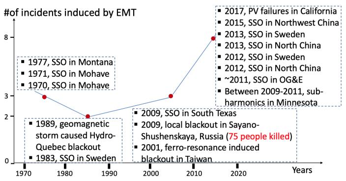  
Fig. 1: EMT-related events in the power grid where SSO(sub-synchronous oscillations) is the main concern

solution. Thus, the network solution is a bottleneck of the EMT simulation. Among different network solvers, sparse LU based solver seems to be the most efficient for large grids [7]. However, its performance is insufficient to meet the challenge, and LU-based solvers are sequential in nature and difficult to parallelize for additional speedup. If any network delay exists, it can be naturally used to decompose the network to achieve a limited parallelization. However, the resulting improvement is limited when there exist large blocks, e.g., of greater than 13K dimensions, representing dense regions [8].

There are also an excellent line of work based on hardware approach using multi-core CPUs, GPUs, and FPGAs [6][7][8][9][10][11][12], achieving significant speedup.

In this paper, we propose a novel approach to accelerate EMT simulation by taking advantage of the network topological structure and achieve fast matrix-vector multiplication by low-rank approximation. The low-rank approximation significantly reduces the computational time and speeds up the network solution to O(N log N) outperforming previous network solvers, including sparse LU based solvers. The key contributions of this paper are summarized below.

1) We propose a hierarchical low-rank approximation algorithm to solve the network equation for fast EMT simulation.   
2) We present the time complexity, memory and error analyses of the proposed approach.   
3) We benchmark the accuracy of the proposed approach by comparing with the commercial software EMTP-RV.   
4) We conduct extensive performance tests and compare with the state-of-the-art sparse LU-based network solver.

Our approach is parallelizable in similar way as [13], but

the parallelization is not explored in this paper. The rest of the paper is organized as follows: Section II briefly reviews EMT simulation and how the network solution is a major bottleneck. Section III introduces the hierarchical low-rank approximation method. Section IV describes a network partition method. Section V provides the network solution by fast matrixvector multiplication. Section VI provides a comprehensive numerical study using a 39-bus system and a 179-bus system. Conclusions are drawn in Section VII.

# II. REVIEW OF EMT SIMULATION

# A. Framework of EMT Simulation

The nodal formulation [14] is adopted to integrate all the models, e.g., generators, transformers, lines and loads. After numerical discretization by an integration method and a choice of the time step, the electrical network equations can be formulated as in (1),

$$
G \mathbf {v} (t) = \mathbf {i} _ {\text {i n}} (t) + \mathbf {i} _ {\text {h i s}} (t - \Delta t), \tag {1}
$$

where G is the network conductance matrix, $\mathbf { v } ( t )$ is the vector of nodal voltages, $\mathbf { i } _ { \mathrm { i n } } ( t )$ is the vector of current injections, and $\mathbf { i } _ { \mathrm { h i s } } ( t - \Delta t )$ is the vector of historical currents, and all values are real. A common flowchart of EMT simulation is shown in Fig. 2, which our method is based on. In each simulation time step, $\mathbf { i } _ { \mathrm { h i s } } ( t - \Delta t )$ is calculated first using historic states. Then the current injection vector $\mathbf { i } _ { \mathrm { i n } } ( t )$ is calculated by using electromagnetic generator equations. Following that, v(t) is solved from the network equation. Finally, states associated with the controls are updated.

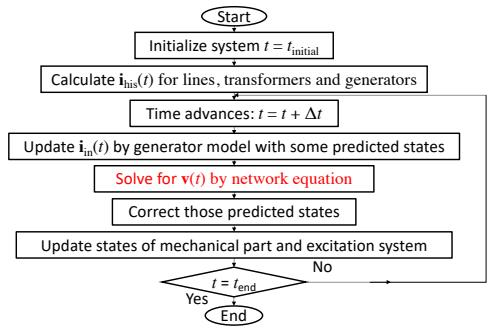  
Fig. 2: EMT simulation flow

# B. Modeling of Lines, Transformers, Generators and Loads

The network solver to be proposed in this paper accepts any device models that fit into the nodal formulation. In all tested cases in this paper, the following modeling is adopted: lumped π-circuit model for all transmission lines; saturable model [15], containing a nonlinear inductor in the magnetizing branch to represent the saturation effect, for all transformers; Brandwajn model [16] for all generators; and constant impedance model for all loads.

# C. Bottleneck of EMT Simulation − Network Solution

Reference [7] compares three types of network solution methods: (1) dense inversion and matrix-vector products, (2) direct dense solver, and (3) direct sparse solver, and shows that the LU factorization-based direct sparse solver always outperforms the other two for systems with ${ > } 2 \mathbf { K }$ dimensions. This explains why the sparse LU method is the most widely used solver in commercial EMT simulation software. Still, the network equation solved once at each time step takes majority, $\mathrm { e . g . } ~ > ~ 8 0 \%$ [5][6], of the total simulation time cost, therefore, is the bottleneck of EMT simulation, since the involved computation tasks can hardly be parallelized.

This paper will introduce a highly-parallelizable network solver based on the hierarchical low-rank approximation, which is also more efficient even when computed sequentially.

# III. HIERARCHICAL LOW-RANK APPROXIMATION

Traditionally, solving the EMT network equation (1) consists of a pre-processing step where G is LU-factored, followed by repeated forward-backward substitutions at each time step. We rewrite the (1) from requiring forward-backward substitution to requiring matrix-vector multiplication:

$$
\mathbf {v} (t) = G ^ {- 1} \mathbf {i} (t),
$$

$$
\mathbf {i} (t) = \mathbf {i} _ {\text {i n}} (t) + \mathbf {i} _ {\text {h i s}} (t - \Delta t). \tag {2}
$$

Now the bottleneck lies in the fast matrix-vector multiplication (mat-vec). Traditionally, mat-vec takes $O ( N ^ { 2 } )$ time, however we will propose a novel approach that performs mat-vec in O(N log N ) time. Just like previous approaches, our proposed approach also requires a pre-processing step where G is inverted. To handle scenarios where G changes, e.g., topology change caused by loss of line, we prepare all involved $G ^ { - 1 }$ matrices in advance and load them online when needed. More efficient handling methods which only consider modified entries caused by changes deserve further explorations. Since mat-vec is more efficient than forward-backward substitution, the overall performance improves when the number of time steps is high, as confirmed by experimental results.

The fast matrix-vector multiplication (mat-vec) approach is based on two key concepts: low-rank approximation and hierarchical approximation, which are explained in the following subsections.

# A. Low-Rank Approximation

Fig. 3 illustrates the key idea of using low-rank approximation to speed up the network solution. Fig. 3(a)-(c) shows the traditional approach to compute the impact of current in group S on voltage in group T, where buses in each group are closely connected but loosely connected between groups. Fig. 3(d)-(f) shows the proposed approach where the pairwise interaction matrix A, not necessarily square, represents any sub-matrix of $G ^ { - 1 }$ which is approximated by a low-rank matrix $A _ { r }$ , thus significantly reducing the computation time.

There are a few ways to perform low-rank approximation. We will use Singular Value Decomposition (SVD). The SVD of a matrix $A _ { m \times n }$ is given by $A \ = \ U \Sigma V ^ { * }$ , where U is an $m \ \times \ m$ orthogonal matrix, Σ is an $m \ \times \ n$ diagonal

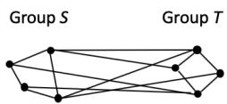  
(a) Two groups of buses

$$
A = \left[ \begin{array}{c c c c} * & * & * & * \\ * & * & * & * \\ * & * & * & * \\ * & * & * & * \end{array} \right]
$$

(b) Interaction between groups in a fullmatrix of size O(n2)

$$
\mathbf {v} _ {\mathrm {T}} = \left[ \begin{array}{l l l l} * & * & * & * \\ * & * & * & * \\ * & * & * & * \\ * & * & * & * \end{array} \right] \mathbf {i} _ {\mathrm {s}}
$$

(c) Compute the impact of group S on group Tin time O(n2)

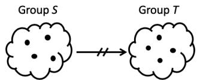  
Fig. 3: Using low-rank approximation to speed up the network solution between two groups

(d) Two groups of buses

$$
A \approx A _ {r} = \left[ \begin{array}{l} * \\ * \\ * \end{array} \right] [ * ] [ * * * * ]
$$

(e) Interaction between groups in low-rank approximation of size O(n)

$$
\mathbf {v} _ {\mathrm {T}} = \left[ \begin{array}{l} * \\ * \\ * \end{array} \right] \left[ * \right] \left[ \begin{array}{l l l l} * & * & * & * \end{array} \right] \dot {\mathbf {i}} _ {\mathrm {s}}
$$

(f) Compute the impact of group S on group Tin time O(n)

matrix whose diagonal elements are non-zero singular values in decreasing order, and V is an $n \times n$ orthogonal matrix. In EMT simulation, A representing the relation between input current variables and output voltage variables. When we write $A = U \Sigma V ^ { * }$ , V represents a mapping from input current variables to an orthogonal current basis, Σ represents a diagonal matrix converting current basis to voltage basis, and U represents a mapping from orthogonal voltage basis back to output voltage variables. The SVD is a powerful technique for low-rank approximation, numerically stable, and applicable to non-square matrices which are common in EMT simulation.

The matrix format of SVD can be rewritten in a summation form as

$$
A = \sum_ {i = 1} ^ {p} \sigma_ {i} u _ {i} v _ {i} ^ {*}, \tag {3}
$$

where $\sigma _ { i }$ is the i-th singular value of $A , p$ is the rank of A and equals the total number of non-zero singular values, while $u _ { i }$ and $v _ { i }$ are the i-th left-singular vector and right-singular vector, respectively. Instead of summing over p terms in (3), we may take only the first r terms in (4) to approximate A, which is called the truncated SVD.

$$
A \approx A _ {r} = \sum_ {i = 1} ^ {r} \sigma_ {i} u _ {i} v _ {i} ^ {*}. \tag {4}
$$

We use the truncation error ε given by Eckart–Young–Mirsky theorem (5) as the indicator for the approximation error

$$
\varepsilon = \| A - A _ {r} \| _ {\mathrm {F}} = \sqrt {\sigma_ {r + 1} ^ {2} + \cdots + \sigma_ {p} ^ {2}}, \tag {5}
$$

where $\Vert . \Vert _ { \mathrm { F } }$ is a Frobenius norm of a matrix.

The number of the left singular vectors u and right singular vector v of the truncated SVD are both r. In general, the less the value of $r ,$ the more we reduce the matrix and the max-vec time, but the higher the approximation error. Since ε is a good indicator for the approximation error, we select the r such that the corresponding ε is less than a pre-defined threshold $\varepsilon _ { \mathrm { t h } }$ .

To calculate truncated SVD, we first compute the full SVD, and then use (4) to truncate the first r terms. For large dense matrices derived from the EMT, the truncated SVD can be computed by techniques like alternating-subspace methods [17], without calculating the full SVD.

# B. Hierarchical Approximation

The low-rank approximation is based on the observation that interactions between buses that are loosely connected, meaning the resistance between the buses are great or the connection between the buses is through multiple intermediate steps, can be approximated. However, the definition of closeness is relative: every bus has some buses that has close and some that are not. In order to systematically exploit the benefit of low-rank approximation, we propose the concept of hierarchically approximation, which is illustrated in Fig. 4(d)- (e). In comparison, Fig. 4(a)-(c) shows the traditional approach to compute the impact of the network.

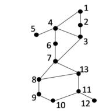  
(a) Network of N buses

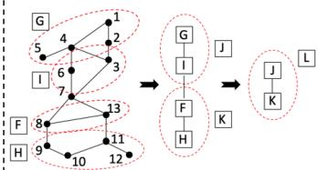  
(d) Network of N buses

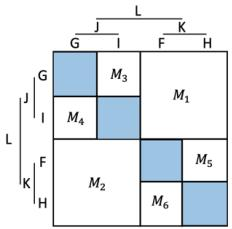  
(e) Interaction matrix of size NlogN

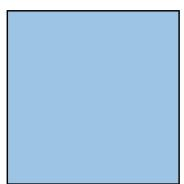  
(b) Interaction matrix of size N2

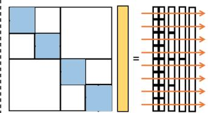  
(f) Compute impact in time O(NlogN)

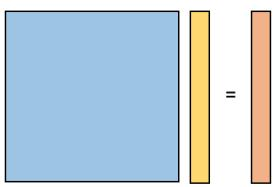  
(c) Compute impact in time O(N2)   
Fig. 4: Using hierarchical low-rank approximation to speed up the network solution for whole network

The interaction matrix among the buses is $G ^ { - 1 }$ , which we want to approximate. However, it is more difficult to tell which buses are close in $G ^ { - 1 }$ than in G: if two buses share a transmission line in $G ,$ they are close. Therefore, we use G as the first criteria to select groups of buses that are may be partitioned. Nevertheless, we need a second criteria to determine if the interaction matrix between the two groups have a rank-r approximation, for a pre-defined threshold $r _ { \mathrm { t h } } .$ . If so, then the interaction can be approximated. If not, consider the sub-networks.

The interaction between buses is expressed by $G ^ { - 1 }$ . Since group J consists of 7 buses and group K consists of 6 buses, the interaction between J and $K$ is a $7 \times 6$ sub-matrix of

$G ^ { - 1 }$ , which is the $M _ { 1 }$ sub-matrix in Fig. 4(e). The rows of $M _ { 1 }$ correspond to buses in J and the columns correspond to buses in K. The algorithm first checks if interactions between J and K can be approximation with a matrix of rank no greater than $r _ { \mathrm { t h } } .$ . In our example, the answer is yes, and $M _ { 1 }$ is approximated by a truncated SVD. (If the answer were no, we would check interactions between G and F , G and H, I and F , and I and $H . )$ The algorithm then recursively applies the same process to all sub-matrices, i.e., we check interactions between G and I, and between $F$ and H. In general, if any connection has a low rank approximation, we save the approximation and stop the process for that branch. If not, we continue to its sub-networks. The process is continued until the entire network is either approximated or remains the same. Fig. 4(e) is the final hierarchical low-rank approximation, where white squares represent approximated matrices, and blue squares represent non-approximated matrices.

The detailed algorithm is presented next. The inputs is the conductance matrix $G ^ { - 1 }$ , which has been recursively partitioned into four sub-matrices. The details of the partition are introduced in Section IV. The outputs are the truncated SVDs. For each $m \times n$ matrix, the truncated SVD results are $U _ { m \times r } , V _ { n \times r }$ and $\Sigma _ { r \times r }$ , where $r \leq r _ { \mathrm { t h } }$ .

Algorithm 1: Hierarchical low rank approx $( G ^ { - 1 } )$   
1 if dimension $(G^{-1})\leq r_{\mathrm{th}}$ , then   
2 return $G^{-1}$ 3 end   
4 Calculate SVD of $G^{-1}$ ; Use $\varepsilon_{\mathrm{th}}$ to select the first $r$ terms; Let the results be $U,\Sigma ,V^{*}$ 5 if $r\leq r_{\mathrm{th}}$ then   
6 return $U,\Sigma ,V^{*}$ 7 else   
8 Partition the row index of $G^{-1}$ into $R_{1},R_{2}$ , and column index of $G^{-1}$ into $C_1,C_2$ 9 for all four sub-matrix $G_{ij}^{-1}$ , where $i\in \{R_1,R_2\} ,j\in \{C_1,C_2\}$ , do   
10 Hierarchical_low_rank_approx $(G_{ij}^{-1})$ 11 end   
12 end

The benefit of the hierarchical low-rank approximation is illustrated in Fig. 4(f), where an O(N log N ) time mat-vec can be performed. We will explain the mat-vec algorithm in more details in Section V.

# IV. POWER NETWORK PARTITION

The hierarchical low-rank approximation requires the inverse of conductance matrix $G ^ { - 1 }$ be partitioned. The partition expresses $G ^ { - 1 }$ as a hierarchy, where each sub-matrix, including $G ^ { - 1 }$ itself, is further divided into 4 sub-matrices, until the rank of each sub-matrix is at most $r _ { \mathrm { t h } } .$ .

Buses that are close to each other will have similar interactions with far way buses. Therefore, the partition should place buses that are close to each other in the same sub-matrix. Because the closeness of buses are reflected in the network,

we will use a network graph $\mathbf { H } = ( V , E )$ to guide the partition, where V is the set of vertices, representing the buses or a group of buses, and E is the set of edges, representing transmission lines or paths of transmission lines.

To reduce the computation time, the hierarchy should be balanced. Therefore, we propose a balanced bottom-up merging process, i.e., the buses are merged level by level from individual buses to the whole network. Two principles are used to guide the merging process. The first principle is to merge vertices with neighbors of highest conductance. This guarantees buses that are close will be in the same submatrix. The second principle is to merge each vertex only once during each level of the bottom-up process. This guarantees the partition is balanced.

The interaction between two sets of buses $S _ { 1 }$ and $S _ { 2 }$ can be measured by a weight function W , which is essentially the average conductance between $S _ { 1 }$ and $S _ { 2 }$ . Formally,

$$
W \left(S _ {1}, S _ {2}\right) = \frac {\sum_ {v _ {1} \in S _ {1} , v _ {2} \in S _ {2}} G _ {v _ {i} , v _ {j}}}{\max  \left\{\left| S _ {1} \right| , \left| S _ {2} \right| \right\}}, \tag {6}
$$

where G is the conductance matrix for the entire power system. Note that the denominator is max $\{ | S _ { 1 } | , | S _ { 2 } | \}$ instead of $| S _ { 1 } | +$ $| S _ { 2 } |$ , because we want to assign higher weight for pairs of $S _ { 1 } , S _ { 2 }$ that are more balanced.

Following these principles, we perform the following actions at each level. First, we pick vertices of degree one and merge them, i.e., a vertex connected to only one neighbor is merged with its only neighbor. Then, for the rest of the vertices of degree greater than one, we repeatedly select pairs with the highest weight and merge each such pair, until no pair can be found. No vertex is merged twice at each level. If a vertex has only neighbors that were merged with other vertices, that vertex is left to be processed at the next level. After a level is completed, we go up to the next level, until the whole network is merged into one vertex. The detailed algorithm is presented below.

The graph partition algorithm thereby builds a binary tree data structure where the root represents the whole network, each internal node $v _ { k } ^ { \prime }$ which has two children represents a group of buses $v _ { k } ^ { \prime }$ merged from two groups $v _ { i } , v _ { j }$ , and leaves represent individual buses in network.

An example of how the algorithm works is illustrated in Fig. 4(d). The vertices in the network graph are labeled with numbers, representing buses. The vertices labeled with uppercase letters represent groups of buses during the merging process. The process starts with merging individual buses into groups $G , I , F$ and H. It then merges the pair G and I, and the pair F and H. Finally the pair J and K are merged into one group L, which contains all buses in the entire network. The buses or groups of buses in all merging steps are represented as nodes in a hierarchical partition tree, shown in Fig. 5, where leaves are buses, the root is the power grid. Apply Algorithm 1 starting from the root, the row and column indices of $G ^ { - 1 }$ are derived from the partition hierarchically. The sub-matrices in Fig. 4(e), which are stored by U and V , are represented as red dotted arrows in Fig 5.

Algorithm 2: Network partition   
Input: Graph: $\mathrm{H} = (V,E)$ $G^{-1}$ Output: Tree root   
1 $V_{0} = V$ . $E_0 = E$ .   
2 i = 0; // bottom-up merging, level by level.   
3 while $|V_i| > 1$ do   
4 $(V_{i + 1},E_{i + 1}) =$ Level_merge(Vi,Ei);   
5 i= i+1;   
6 end   
7 return $V_{i}$ 1 Subroutine Level_merge(V,E)   
2 $\begin{array}{rl} & {\mathrm{V}^{\prime} = \emptyset ;\mathrm{E}^{\prime} = \emptyset ;}\\ & {\mathrm{for~each~}v_{i}\in V\mathrm{~with~only~one~neighb}}\\ & {\mathrm{merge~}v_{i}\mathrm{~and~}v_{j}\mathrm{~into~a~new~vertex~}v_{k}^{\prime};}\\ & {\mathrm{V}^{\prime} = \mathrm{V}^{\prime}\cup \{v_{k}^{\prime}\} ;\mathrm{V} = \mathrm{V} - \{v_{i},v_{j}\} ;}\\ & {\mathrm{end}}\\ & {\mathrm{while~there~are~}v_{i},v_{j}\in V\mathrm{~and~}(v_{i},v_{j})\in E\mathrm{~do}}\\ & {\mathrm{pick~}e = (v_{i},v_{j})\mathrm{with~max~weight};}\\ & {\mathrm{merge~}v_{i}\mathrm{~and~}v_{j}\mathrm{~into~a~new~vertex~}v_{k}^{\prime};}\\ & {\mathrm{V}^{\prime} = \mathrm{V}^{\prime}\cup \{v_{k}^{\prime}\} ;\mathrm{V} = \mathrm{V} - \{v_{i},v_{j}\} ;} \end{array}$ 8   
9   
10   
11   
12 $V^{\prime} = V^{\prime}\cup V$ // add rest vertices   
13 $E^{\prime} = \{(v_{i}^{\prime},v_{j}^{\prime})|$ where $v_{i}^{\prime},v_{j}^{\prime}$ are merged from $v_{i},v_{j}$ respectively, and $(v_{i},v_{j})\in E\}$ 14 return $V^{\prime},E^{\prime}$

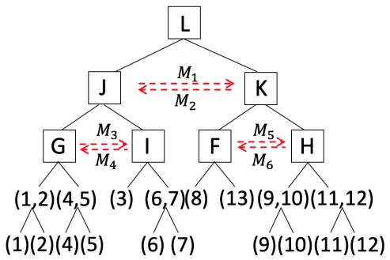  
Fig. 5: A hierarchical partition tree.

Theorem 1. Given an N-bus power system network graph $\mathbf { H } = ( V , E )$ where V is a set of vertices, representing buses, and E is a set of edges, representing transmission lines, Algorithm 2 produces a partition tree which has following properties,

1) The tree has one root which represents the whole network and N leaves which represents individual buses.   
2) Each internal node represents a group of buses that are closely connected and has two children.   
3) The height of the tree h is ${ \cal O } ( \log N )$ .

Proof. According to the Algorithm 2, the proposed partition process starts from merging individual buses and ended up with merging into the whole network. During the merging, two groups of buses with high conductance are merged into one group. Therefore, the property 1), 2) and 3) holds.

According to property 1) and 3), the number of vertices in the bottom partition level is $2 ^ { h }$ , thus $2 ^ { h } = N$ . Therefore, the height of the partition tree h is ${ \cal O } ( \log N )$ . □

Remark When there is a change in the topology, the network partition result may potentially be re-used, while the low-rank approximation has to be re-calculated.

# V. FAST NETWORK SOLUTION

At each time step of EMT simulation, a network equation (2) needs to be solved, which is the most time consuming part of the entire EMT simulation. This section introduces a fast matrix-vector multiplication approach based on the hierarchical low-rank approximation of $G ^ { - 1 }$ to solve the network equations. The analysis of time and error are also presented.

# A. Fast Matrix-Vector Multiplication

Multiplication of $G ^ { - 1 }$ with a vector i of bus current gives a vector v of bus voltage, which is the solution of the network equation. Traditionally, mat-vec is done in time $O ( N ^ { 2 } )$ , where $N$ is the number of buses. In our algorithm, the mat-vec is done in time $O ( N$ log N ), as shown in Fig. 4(f), which is called fast mat-vec. The fast mat-vec is made possible through the hierarchical low-rank approximation of matrix $G ^ { - 1 }$ constructed in Section 3. The approximation represents matrix $G ^ { - 1 }$ hierarchically in one of three forms: i) as an explicit matrix of dimension at most $r _ { \mathrm { t h } } .$ which corresponds to the direct interaction among the buses, ii) as a low-rank approximation matrix of rank at most $r _ { \mathrm { t h } }$ in the form of $U , V , \Sigma ,$ , or iii) as a combination of its sub-matrices.

In the fast mat-vec, the output v is calculated hierarchically, level by level depending on the form of the sub-matrix. If the sub-matrix is represented in form i), then compute the output v directly. If the sub-matrix is represented in form ii), then compute the output v by first multiplying Σ(V i), followed by multiplying the previous product with U . If the sub-matrix is represented in form iii), the output v is computed by first multiplying i with children of the sub-matrix, followed by combing the results of the lower level. The algorithm is given below, where $G _ { i j } ^ { - 1 }$ is the sub-matrix, $\mathbf { i } _ { i }$ and $\mathbf { v } _ { j }$ are the corresponding input and output vectors, respectively.

# B. Time Complexity Analysis

Theorem 2. Given a N-bus power system, the time complexity of solving network solution by Algorithm 3 is O(N log N ).

Proof. Let $T ( N )$ be the time complexity of mat-vec in Algorithm 3, then

$$
T (N) \leq \left\{ \begin{array}{c c} C N ^ {2} & \text {i f} N \leq r _ {\text {t h}} \\ C N r _ {\text {t h}} & \text {i f r a n k} (G ^ {- 1}) \leq r _ {\text {t h}} \\ 2 T (\frac {N}{2}) + 2 C (\frac {N}{2}) r _ {\text {t h}} + N & \text {o t h e r w i s e}, \end{array} \right.
$$

where C is a constant and $r _ { \mathrm { t h } }$ is the user-defined rank threshold. Note that, in Algorithm 3, the time complexity of $\mathbf { M a t \_ V e c } ( G _ { 1 1 } ^ { - 1 } , \mathbf { i } _ { 1 } )$ and Mat $\underline { { \mathrm { V e c } } } ( G _ { 2 2 } ^ { - 1 } , \mathbf { i } _ { 2 } )$ are $T ( N / 2 )$ , while the time complexity of both Mat $. \mathsf { V e c } ( G _ { 1 2 } ^ { - 1 } , \mathbf { i } _ { 2 } )$ and $\mathrm { M a t \_ V e c } ( G _ { 2 1 } ^ { - 1 } , \ \mathbf { i } _ { 1 } )$ are $C ( N / 2 ) r _ { \mathrm { t h } }$ due to the low-rank

Algorithm 3: Mat_Vec $(G^{-1},\mathbf{i})$ 1 if $G^{-1}$ is stored as explicit matrix then   
2 $\mathbf{v} = G^{-1}\mathbf{i};$ 3 else if $G^{-1}$ is stored as $(U,V,\Sigma)$ then   
4 $\mathbf{v} = \sum_{i = 1}^{r}u_{i}(\sigma_{i}v_{i}^{*}\mathbf{i});$ where $r$ is the truncated rank of $G^{-1}$ 5 else   
6 $\mathbf{v}_1 = \mathrm{Mat\_Vec}(G_{11}^{-1},\mathbf{i}_1) + \mathrm{Mat\_Vec}(G_{12}^{-1},\mathbf{i}_2);$ 7 $\mathbf{v}_2 = \mathrm{Mat\_Vec}(G_{21}^{-1},\mathbf{i}_1) + \mathrm{Mat\_Vec}(G_{22}^{-1},\mathbf{i}_2);$ 8 $\mathbf{v} = [\mathbf{v}_1;\mathbf{v}_2];$ 9 end   
10 return v

approximation. The term $T ( N / 2 )$ for $\mathbf { M a t \_ V e c } ( G _ { 1 1 } ^ { - 1 } )$ and Mat $\underline { { \mathsf { V e c } } } ( G _ { 2 2 } ^ { - 1 } )$ is due to the balanced partition in Section IV.

$$
\begin{array}{l} T (N) \leq 2 T (N / 2) + 2 C (N / 2) r _ {\mathrm {t h}} + N \\ = 2 T (N / 2) + \left(C r _ {\mathrm {t h}} + 1\right) N \\ = 4 T (N / 4) + 2 \left(C r _ {\mathrm {t h}} + 1\right) N / 2 + \left(C r _ {\mathrm {t h}} + 1\right) N \\ = \dots = \sum_ {i = 1} ^ {\log N} \left(C r _ {\text {t h}} + 1\right) N = O (N \log N). \\ \end{array}
$$

The sum from i = 1 to log N is due to the fact that the height of the partition tree is log N , proved in Theorem 1. □

# C. Parallelism of Fast Network Solution

The proposed approach partitions the whole network hierarchically into O(log N ) levels, where N is the number of buses. At each level, the computation involves mat-vec multiplications of total time $O ( N r _ { \mathrm { t h } } )$ , where $r _ { \mathrm { t h } }$ is the userdefined rank threshold. Therefore, with N processor units in parallel, the computation can be reduced to $O ( r _ { \mathrm { t h } } )$ . Since $r _ { \mathrm { t h } }$ is a constant, the proposed approach guarantees a network solution time of ${ \cal O } ( \log N )$ using parallel techniques. This provides a significant advantage over LU based approaches.

# D. Error Analysis

Theorem 3. Let $\varepsilon _ { \mathrm { t h } }$ be the pre-defined error tolerance in the low rank approximation, such that

$$
\frac {\left\| \widetilde {M _ {i}} - M _ {i} \right\| _ {\mathrm {F}}}{\left\| M _ {i} \right\| _ {\mathrm {F}}} \leq \varepsilon_ {\mathrm {t h}}, \tag {7}
$$

where $M _ { i }$ is the i-th sub-matrix and $\widetilde { M _ { i } }$ is the approximation matrix of $M _ { i }$ . The relative error of the bus voltages in the EMT simulation is $o \big ( \varepsilon _ { \mathrm { t h } } \big )$ .

Proof. Denote the partition and approximation of $G ^ { - 1 }$ as

$$
G ^ {- 1} = \left[ \begin{array}{c c} M _ {1} & M _ {2} \\ M _ {3} & M _ {4} \end{array} \right] \text {a n d} \widetilde {G} ^ {- 1} = \left[ \begin{array}{c c} M _ {1} & \widetilde {M _ {2}} \\ \widetilde {M _ {3}} & M _ {4} \end{array} \right].
$$

The relative error of bus voltage of the EMT simulation is bounded as follows,

$$
\frac {\left\| \widetilde {\mathbf {v}} - \mathbf {v} \right\| _ {\mathrm {F}}}{\left\| \mathbf {v} \right\| _ {\mathrm {F}}} = \frac {\left\| \mathbf {i} \left(\widetilde {G} ^ {- 1} - G ^ {- 1}\right) \right\| _ {\mathrm {F}}}{\left\| \mathbf {v} \right\| _ {\mathrm {F}}} \leq \frac {\left\| \mathbf {i} \right\| _ {\mathrm {F}} \left\| \widetilde {G} ^ {- 1} - G ^ {- 1} \right\| _ {\mathrm {F}}}{\left\| \mathbf {v} \right\| _ {\mathrm {F}}}. \tag {8}
$$

Since $\begin{array} { r } { \left\| G ^ { - 1 } \right\| _ { \mathrm { F } } ^ { 2 } = \sum _ { i = 1 } ^ { n } \left\| M _ { i } \right\| _ { \mathrm { F } } ^ { 2 } } \end{array}$ , the squared error of $G ^ { - 1 }$ is

$$
\left\| \widetilde {G} ^ {- 1} - G ^ {- 1} \right\| _ {\mathrm {F}} ^ {2} = \sum_ {i = 1} ^ {k} \left\| \widetilde {M _ {i}} - M _ {i} \right\| _ {\mathrm {F}} ^ {2},
$$

where k is the total number of approximation matrices. Then (8) is rewritten as

$$
\frac {\| \widetilde {\mathbf {v}} - \mathbf {v} \| _ {\mathrm {F}}}{\| \mathbf {v} \| _ {\mathrm {F}}} \leq \frac {\| \mathbf {i} \| _ {\mathrm {F}}}{\| \mathbf {v} \| _ {\mathrm {F}}} \sqrt {\sum_ {i = 1} ^ {k} \left\| \widetilde {M _ {i}} - M _ {i} \right\| _ {\mathrm {F}} ^ {2}}.
$$

Recall the definition of $\varepsilon _ { \mathrm { t h } }$ in $( 7 )$ ,

$$
\begin{array}{l} \frac {\left\| \widetilde {\mathbf {v}} - \mathbf {v} \right\| _ {\mathrm {F}}}{\left\| \mathbf {v} \right\| _ {\mathrm {F}}} \leq \frac {\left\| \mathbf {i} \right\| _ {\mathrm {F}}}{\left\| \mathbf {v} \right\| _ {\mathrm {F}}} \sqrt {\sum_ {i = 1} ^ {k} \left\| M _ {i} \right\| _ {\mathrm {F}} ^ {2}} \varepsilon_ {\text {t h}} \tag {9} \\ \leq \frac {\left\| \mathbf {i} \right\| _ {\mathrm {F}}}{\left\| \mathbf {v} \right\| _ {\mathrm {F}}} \left\| G ^ {- 1} \right\| _ {\mathrm {F}} \varepsilon_ {\text {t h}}. \\ \end{array}
$$

Since the coefficient in front of $\varepsilon _ { \mathrm { t h } }$ in (9) only relies on the power system, the relative error of bus voltage of EMT simulation is proportionate to $\varepsilon _ { \mathrm { t h } }$ , which can be controlled through the appropriate choice of $\varepsilon _ { \mathrm { t h } }$ . □

# VI. CASE STUDIES

This section presents comprehensive case studies on two series of large power networks based on a 39-bus system and a 179-bus system (whose data and one-line diagrams can be found in [18][19]) to evaluate the accuracy, speed and scalability of the proposed Hierarchical Low-rank approximation approach, named “HiLap” hereafter. We compare our method against previous best method on both the accuracy and the speed. In addition, error - runtime tradeoff will also be presented. Details on the setup of tested cases and testing environment are provided below:

• Generation of large cases: To create large cases involving thousands of buses, we make multiple copies of a 39- bus system or a 179-bus system, and connect the copies in an array. This is the same approaches adopted [7][20]. To make the 39-bus system comparable with the 179-bus system, all the large cases of 39-bus system start from $3 9 \times 5 \times 1$ buses, whose G has a dimension starting from 585.   
• Accuracy test: A large case based on the 179-bus system is created in EMTP-RV using Javascript, whose simulation results are used as reference. Both the error in system response and the error in $| G V - I |$ are checked at each simulation step.   
• Speed test: The CSPARSE package [21] is used as the sparse LU solver, named $\mathrm { \Omega ^ { 6 6 } S L U ^ { 5 } }$ hereafter. The SLU EMT simulation provides a reference result in all speed tests. In SLU, cs lsolve and cs usolve functions are used for the forward-backward substitution, and cs amd are used

for the natural ordering. The data structure used in SLU is Compressed Column Storage.

• Simulation setting: A 20ms simulation length and a $2 0 \mu \mathrm { s }$ time step are used in all tests.   
• Simulation implementation and testing environment: All EMT simulations are programmed in C and conducted on an Intel Core i5 2.7GHz laptop, except the EMTP-RV simulation in Section VI-D1 is performed on an Intel Core i7 3.47GHz desktop.

# A. G and Approximated $G ^ { - 1 }$

In our test cases, we set a rank threshold $r _ { \mathrm { t h } } = 6$ and relative error tolerance $\varepsilon _ { \mathrm { t h } } = 1 0 ^ { - 6 }$ , which are sufficient to maintain both the computational performance and the precision of final results. These choices are made through experiments and the fact that the interaction between any pair of three-phase buses is a rank-6 matrix.

Fig. 6 depicts the approximated $G ^ { - 1 }$ after applying Algorithms 1 and 2 for the for the 39-bus and 179-bus systems. The dimensions of $G ^ { - 1 }$ are $1 1 7 \times 1 1 7$ and 537 × 537, respectively. In both cases, $G ^ { - 1 }$ is divided into multiple sub-matrices with the rank of each sub-matrix no greater than 6. The approximated sub-matrices are high-dimensional and located in the off-diagonal, while the non-approximated sub-matrices are low-dimensional and located in the diagonal.

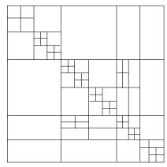  
(a) 39-bus system

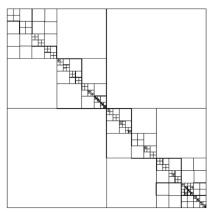  
(b) 179-bus system   
Fig. 6: Hierarchical low-rank approximation of $G ^ { - 1 }$ .

# B. One-Step Network Solution

1) FLOPS: In order to measure the speed, we count the FLOPS involved in the solution of network equation for one time step. The FLOPS count includes total numbers of floating point addition and multiplication operations per step. The results are shown in Fig. 7. In the series of 39-bus based systems with up to 1950 three-phase buses, the maximum FLOPS of SLU is $2 . 4 8 \times 1 0 ^ { 6 }$ , while the maximum FLOPS of HiLap is $1 . 3 6 \times 1 0 ^ { 6 }$ , leading to a 45% reduction. In the series of 179-bus based systems with up to 2148 three-phase buses, the maximum FLOPS of SLU is $5 . 5 6 \times 1 0 ^ { 6 }$ , while the maximum FLOPS of HiLap is only $1 . 4 3 \times 1 0 ^ { 6 }$ , leading to an 74% reduction.   
2) Memory: Fig. 8 shows the memory requirements of SLU and HiLap. For SLU approach, only non-zero elements in L and U are taken into account, while for HiLap, the U , V , Σ, and the non-approximated matrices are taken into account.

In the series of 39-bus based systems with up to 1950 threephase buses, the maximum memory cost of SLU is 5.57MB,

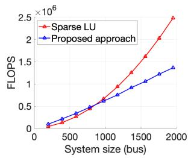  
(a) Series of 39-bus based systems

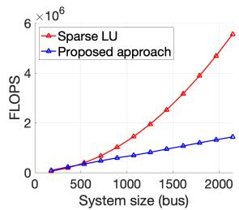  
(b) Series of 179-bus based systems   
Fig. 7: FLOPS in one-step network solution

while it is 5.46MB for HiLap, a 2% reduction. In the series of 179-bus based system with up to 2148 three-phase buses, the maximum memory cost of SLU is 11.65MB, while it is only 5.73MB for HiLap, a 51% reduction.

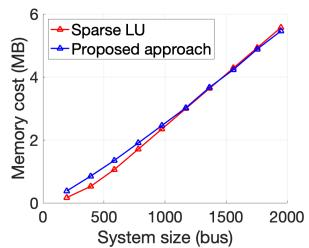  
(a) Series of 39-bus based systems

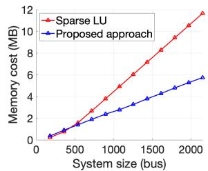  
(b) Series of 179-bus based systems   
Fig. 8: Memory requirements in one-step network solution

# C. Runtime of Overall EMT Simulation

This subsection compares the runtime of network solution and overall EMT simulation. Fig. 9 shows the runtimes for series of 39-bus based systems. As shown in Fig. 9(a) and 9(b), the proposed HiLap outperforms SLU when the system size is larger than 975-bus. The maximum speedup ratios of network runtime is 1.7× and the EMT runtime is 1.4× with 1950 three-phase buses.

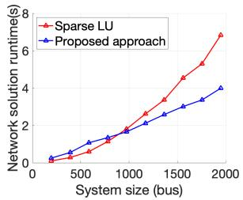  
(a) Network solution only

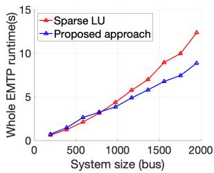  
(b) Overall EMT simulation   
Fig. 9: EMT runtimes test on serious of 39-bus systems

Fig. 10 shows the runtimes for series of 179-bus based systems. In the 2148-bus system, our approach is 2.8× faster than SLU for the network solution part, and 1.85× faster than SLU in the overall EMT simulation. Moreover, the runtime of solving for the network solution of our approach grows much slower than SLU, as Fig. 9 and Fig. 10 shows.

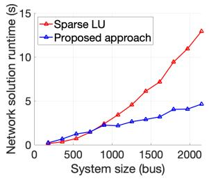  
(a) Network solution only

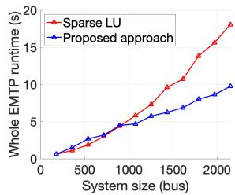  
(b) Overall EMT simulation   
Fig. 10: EMT runtime test on series of 179-bus systems

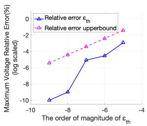  
(a) Relative error v.s. εth

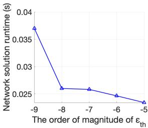  
(b) Network runtime v.s. εth   
Fig. 13: Impact of error tolerance on accuracy and speed

# D. Accuracy

1) Benchmark with EMTP-RV: In this test, a 20ms simulation is conducted with a time step of 20µs. A 358-bus system created from the 179-bus system is simulated in EMTP-RV to provide a reference result. The same system is simulated by the proposed method and compared with this reference. It is observed that the HiLap result matches the reference well. Fig. 11 shows the three-phase bus voltages of bus 255. Fig. 12 shows the |GV − I| error of bus 255 in this case, where the largest error turns out to be as small as $4 . 2 \times 1 0 ^ { - 6 } \mathrm { ~ A ~ }$ .

  
(a) Proposed method

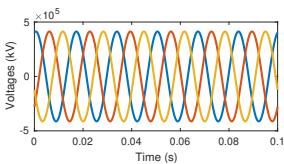  
(b) EMTP-RV

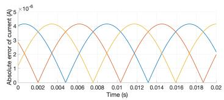  
Fig. 11: Accuracy comparison to EMTP-RV   
Fig. 12: Approximation error in |GV − I|

2) Trade-off Between Error and Runtime: According to the analysis in Section V, the user-specified error tolerance $\varepsilon _ { \mathrm { t h } }$ in the proposed approach has a significant impact on the simulation accuracy and runtime. Fig. 13 show that, as expected, εth is proportional to the maximum voltage error defined in (9), and inversely proportional to the runtime of network solution. In Fig. 13(a), there is a critical threshold of $\varepsilon _ { \mathrm { t h } } = 1 0 ^ { - 7 }$ , since below this threshold, the voltage error is small enough and drops fast as $\varepsilon _ { \mathrm { t h } }$ decreases, while above this threshold, the voltage error increases slowly. For the runtime of the network solution as shown in Fig. 13(b), no significant improvement can be observed when $\varepsilon _ { \mathrm { t h } } \geq 1 0 ^ { - 8 }$ . However, the runtime drops fast when $\varepsilon _ { \mathrm { t h } } < 1 0 ^ { - 8 }$ .

# E. Discussions

The experiments show the proposed approach exhibits great speed improvement compared with SLU, and with high accuracy. As the size of the power network increases, the speed up

also increases. When decreasing the user-defined error bound $\varepsilon _ { \mathrm { t h } } ,$ our simulation error decreases accordingly, while the run time increases slightly. Therefore, our proposed approach scales much better than previous approaches.

The experiments show that the topology of the power network has an impact on the performance of the proposed approach. To explain the difference in performance between the two series of systems, we compare a number of graph theoretic parameters, including number of edges, average degree, maximum degree, diameter, and average distance. We found the average distance between buses is a key indicator determining how tightly the buses are coupled. The average distance for the 39-bus system is 6, while for the 179-bus system is 14. As a result, the former has more non-approximated sub-matrics, while the latter has more approximated sub-matrics.

The time of the off-line step to compute $G ^ { - 1 }$ and the low rank approximation in the experiment is not counted, so is the LU factorization for the previous SLU approach. Since an EMT simulation needs to solve the network equation for hundreds of thousand of time steps, the time for the off-time step is amortized over all time steps.

# VII. CONCLUDING REMARKS

This paper proposes algorithms to accelerate the EMT simulation in a new direction through hierarchical low-rank approximation of the power network. Analysis for the performance and accuracy are presented. Case studies are performed on small- and large-scale systems. It is observed that the proposed approach can speed up the network solution by up to 2.8 times compared to the sparse LU factorization based direct solver and shows great scalability.

Compared with SLU which is inherently sequential in natural and not amenable to parallelization, the proposed approach has a hierarchical structure and thus highly parallelizable, using methods similar to [13]. Such parallelization may provide further speedup by high performance hardware such as multi-core CPUs, GPUs, FPGAs or an Application-Specific Integrated Circuit (ASIC).

# ACKNOWLEDGMENT

This work is supported in part by NSF OAC-1934675, ECCS-1760554, CCF-0939370, ECCS-1611301, ECCS-1839616, and the Power Systems Engineering Research Center (PSERC).

# REFERENCES

[1] R. Huang et al., “Faster than real-time dynamic simulation for large-size power system with detailed dynamic models using high-performance computing platform,” in IEEE PES General Meeting, Jul. 2017.   
[2] X. Zhang, A. J. Flueck, and S. Abhyankar, “Implicitly coupled electromechanical and electromagnetic transient analysis using a frequencydependent network equivalent,” IEEE Transactions on Power Delivery, vol. 32, no. 3, pp. 1262–1269, June 2017.   
[3] A. Flueck, “High fidelity “faster than real-time” simulator for predicting power system dynamic behavior,” may 2019. [Online]. Available: https://www.energy.gov/sites/prod/files/2014/07/f17/4-2014- AGM-Review-Flueck 2.pdf   
[4] V. Spitsa et al., “Three-phase time-domain simulation of very large distribution networks,” IEEE Transactions on Power Delivery, vol. 27, pp. 677–687, April 2012.   
[5] L. Gerin-Lajoie and J. Mahseredjian, “Simulation of an extra large net- ´ work in EMTP: From electromagnetic to electromechanical transients,” Int. Conf. Power Syst. Transients, Jun. 2019.   
[6] Y. Chen et al., “GPU-based techniques of parallel electromagnetic transient simulation for large-scale distribution network,” Automation of Electric Power Systems, vol. 41, no. 19, pp. 82–88, Oct. 2017.   
[7] Y. Song et al., “Fully GPU-based electromagnetic transient simulation considering large-scale control systems for system-level studies,” IET Generation, Transmission Distribution, vol. 11, no. 11, pp. 2840–2851, 2017.   
[8] A. Abusalah et al., “CPU based parallel computation of electromagnetic transients for large power grids,” Electric Power Systems Research, vol. 162, pp. 57–63, May 2018.   
[9] F. M. Uriarte, Multicore Simulation of Power System Transients. The Institution of Engineering and Technology, 2013.   
[10] Z. Zhou and V. Dinavahi, “Fine-grained network decomposition for massively parallel electromagnetic transient simulation of large power systems,” IEEE Power and Energy Technology Systems Journal, vol. 4, no. 3, pp. 51–64, Sep. 2017.   
[11] C. Yang, Y. Xue, and X. Zhang, “FPGA-based detailed EMTP,” in 2017 IEEE Manchester PowerTech, Manchester, 2017, pp. 1–6.   
[12] M. Matar and R. Iravani, “The reconfigurable-hardware real-time and faster-than-real-time simulator for the analysis of electromagnetic transients in power systems,” IEEE Trans. on Power Delivery, vol. 28, no. 2, pp. 617–627, Apr. 2013.   
[13] L. Greengard and W. D. Gropp, “A parallel version of the fast multipole method,” Computers & Mathematics with Applications, vol. 20, no. 7, pp. 63–71, 1990.   
[14] H. W. Dommel, EMTP Theory Book. Bonneville Power Administration, 1981.   
[15] Manitoba HVDC Research Centre, “User’s guide – a comprehensive resource for EMTDC,” 2016.   
[16] V. Brandwajn, “Synchronous generator models for the analysis of electromagnetic transients,” Ph.D. dissertation, Univ. British Columbia, Canada, 1977.   
[17] G. Golub and C. V. Loan, Matrix Computations. Johns Hopkins University Press, 3 editions, 2012.   
[18] T. Athay, R. Podmore, and S. Virmani, “A practical method for the direct analysis of transient stability,” IEEE Transactions on Power Apparatus and Systems, vol. PAS-98, no. 2, pp. 573–584, 1979.   
[19] S. Maslennikov et al., “A test cases library for methods locating the sources of sustained oscillations,” in IEEE PES General Meeting, Boston, 2016, pp. 1–5.   
[20] Y. Chen and V. Dinavahi, “Hardware emulation building blocks for real-time simulation of large-scale power grids,” IEEE Transactions on Industrial Informatics, vol. 10, no. 1, pp. 373–381, Feb 2014.   
[21] T. Davis, “Summary of available software for sparse direct methods,” 01 2009.

Lu Zhang received the B.S. and M.S. degrees from Harbin Institute of Technology, in 2010 and 2012, respectively. She is currently pursuing the Ph.D. degree with the Electrical and Computer Engineering Department, Texas A&M University, College Station, TX, USA, under the guidance of Dr. Shi. Her current research interests include model and simulation, applied numerical methods, and VLSI circuit design.

Bin Wang (S’14-M’18) received the B.S. and M.S. degrees from Xi’an Jiaotong University, in 2011 and 2013, respectively, and the Ph.D. degree from the University of Tennessee in 2017, all in electrical engineering. He joined the Department of Electrical and Computer Engineering at Texas A&M University in 2018 as a postdoc. He is currently a postdoc with the Power Systems Engineering Center at National Renewable Energy Laboratory. His research interests include power system dynamics, stability and control.

Xiangtian Zheng (S’18) was born in Zhejiang, China. He received the B. Eng. Degree in electrical engineering from Tsinghua University, Beijing, China in 2017. He is pursuing Ph.D. in the Department of Electrical and Computer Engineering in Texas A&M University, starting from 2018. With the knowledge of power systems and machine learning, he is currently working on the data-driven methods that can improve power systems analysis, operation and control to meet the demands by modern system development.

Weiping Shi (S’91-M’92-SM’02) received B.S. and M.S. from Xian Jiaotong University, Xian, China, and Ph.D. from University of Illinois at Urbana-Champaign. He was with University of North Texas from 1992 to 2000, and has been with Texas A&M University since 2000, where he is now a Professor. His research interests include computer algorithms, modeling and simulation, and VLSI circuits and system. He is a Fellow of IEEE.

P. M. Kumar (LF’18) currently focuses on Cybersecurity, Cyberphysical Systems, Privacy, Unmanned Aerial System Traffic Management, 5G, Wireless Networks, Machine Learning, and Power Systems. He studied at IIT Madras and Washington Univ., St. Louis. He was a faculty member in the Math Dept at UMBC (1977-84), and ECE and CSL at UIUC (1985-2011). He is currently at Texas A&M Univ., where he is a Regents Professor. He is a member of the U.S. National Academy of Engineering, The World Academy of Sciences, and Indian National

Academy of Engineering. He was awarded a Doctor Honoris Causa by ETH, Zurich. He received the IEEE Field Award for Control Systems, Eckman Award of AACC, Ellersick Prize of IEEE ComSoc, Outstanding Contribution Award of ACM SIGMOBILE, Infocom Achievement Award, SIGMO-BILE Test-of-Time Paper Award, and COMSNETS Outstanding Contribution Award. He is a Fellow of IEEE and ACM. He is a Gandhi Distinguished Visiting Professor at IIT Bombay, a Honorary Professor at IIT Hyderabad, and was Leader of a Guest Chair Professor Group at Tsinghua University, Beijing. He was awarded a Distinguished Alumnus Award from IIT Madras, Alumni Achievement Award from Washington University, St. Louis, and Drucker Eminent Faculty Award from the University of Illinois, Urbana-Champaign.

Le Xie (S’05-M’10-SM’16) received the B.E. degree in electrical engineering from Tsinghua University, Beijing, China, in 2004, the M.S. degree in engineering sciences from Harvard University, Cambridge, MA, USA, in 2005, and the Ph.D. degree from the Department of Electrical and Computer Engineering, Carnegie Mellon University, Pittsburgh, PA, USA, in 2009. He is currently a Professor with the Department of Electrical and Computer Engineering, Texas A&M University, College Station, TX, USA. His research interests include modeling and control

of large-scale complex systems, smart grids application with renewable energy resources, and electricity markets.