# 基于模块化双有源桥变流器的直流变电站设计方案

管敏渊，沈建良，楼 平

（国网浙江省电力有限公司湖州供电公司，浙江省湖州市 313000）

摘要：文中提出了一种基于模块化双有源桥变流器的直流变电站方案，将双有源桥模块按照输入端并联、输出端串联的结构级联而成，可以将输入端的直流低压升压至输出端的直流中高压，并且具备功率双向流动能力。模块化双有源桥变流器的直流高压出线连接到高压直流电网，各个模块的直流低压出线可分别连接到低压分布式电源和负荷。双有源桥模块内部使用结构紧凑的高频变压器实现输入端和输出端的电气隔离。提出了适用于模块化双有源桥变流器的串并联均衡控制，具有高效可靠且无需通信的特点，各模块的串联输出端的电压和并联输入端的电压保持相同的斜率关系。电磁暂态仿真结果表明该直流变电站总有功功率在各模块之间均匀分配，各模块的输入直流电流和输出直流电压能够保持均衡。

关键词：直流变电站；均衡控制；双有源桥变流器；输入并联输出串联；串并联均衡控制

# 0 引 言

光伏电池、风机、微型燃气轮机、燃料电池等分布式能源设备以及电化学电池和飞轮等储能设备产生的是直流或非工频交流电，这些设备接入直流电网比接入传统工频交流电网更为方便。直流电网没有交流电网的频率稳定和波形畸变等问题，在大功率输配电和高质量供电等方面也具有优势。近年来，直流功率变换、直流输配电和直流断路器等技术已逐渐成熟［1-2］ ，直流互联电网将成为未来电网的发展趋势之一。

交流变压器基于电磁感应原理可以方便可靠地完成交流电压变换。以交流变压器为核心构成的交流变电站在规范交流电压等级和构建交流互联电网等方面发挥了关键作用，推动了交流电网的发展成熟。但是，直流电压元法通过电磁感应原理实现电压变换，基于电力电子设备的直流变压器技术不如交流变压器成熟。目前，直流输配电系统之间多为孤立运行，没有形成标准化电压等级和互联规范。

构建直流变电站是规范直流电压等级和实现直流电网互联的关键，对直流电网的发展具有重要意义［3-4］。传统直流变压器先将直流电能转化为交流电能，再通过交流变压器实现不同电压等级电网互

联［5］ 。模块化结构的直流变压器由于扩展方便适合用于高压大功率领域，并巨能实现较为规范的直流升压降压比。模块化双有源桥变流器作为实现分布式能源灵活接入和直流电网互联的新技术得到关注［6-8］ 。文献［9］的双有源桥变流器通过提升中间交流链的工作频率至中高频率，降低了交流变压器的体积和重量。文献［10-11］对双有源桥变流器进行模块化级联构建直流变压器，通过一端并联、另一端串联的结构实现较大范围的直流电压变比，满足高压大功率电网应用需求。并联端的电流均衡和串联端的电压均衡是保障各个模块正常工作的基础。由于高压大功率的模块化双有源桥变流器中模块级联数量众多巨各个模块的进线输入功率很不平衡，所以模块主动均衡控制对变流器的稳定工作具有重要意义。文献［12］通过对各模块串联端电压与电压平均值进行比较，然后对各模块并联端输入电流进行调节以实现主动均衡控制。文献［13］对模块化双有源桥变流器的模块均衡控制的取电方式和物理实现进行了深入研究。模块均衡控制一般需要借助模块间通信来实现［14-15］ 。

本文基于模块化双有源桥变流器，提出了一种与传统交流变电站相似的直流变电站架构。该架构具有从1到数路高压出线和多路低压出线。对模块化直流变电站的技术特点和控制策略等内容进行了分析，提出了一种高效可靠巨元需通信的模块主动均衡控制策略。

# 1 直流变电站方案

# 1. 1 系统架构

基于模块化双有源桥变流器的直流变电站架构如图1所示，直流变电站一般包括1至3台模块化双有源桥变流器。每个模块化变流器由相同的隔离式双有源桥变流器作为基本模块级联构成，具备功率双向流动能力。假设左侧为输入端，右侧为输出端，则各模块左侧输入端相互并联连接，右侧输出端依次串联连接。模块化双有源桥变流器可以将输入端的低压直流升压为输出端的中高压直流。

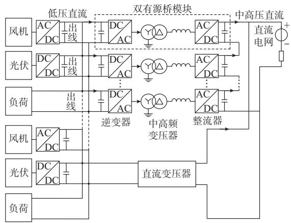  
图1 基于模块化双有源桥变流器的直流变电站架构  
Fig.1Framework of DC substation based on modular dual-active-bridge converter

单个双有源桥模块内部，从左至右分别为桥式逆变器、中高频隔离变压器和桥式整流器。该直流变电站主要特点如下。

1）基于模块化双有源桥变流器构建的直流变电站具有与传统交流变电站类似的结构特征。站内一般设置1至3台模块化双有源桥变流器，每个模块化双有源桥变流器作为 1台直流变压器，完成直流电压变换。  
2）对单台模块化双有源桥变流器，其低压侧含有多个相同的低压模块，每个低压模块连接至低压直流母线后再通过1路低压直流出线连接至低压直流电源和负荷。不同模块化双有源桥变流器的低压直流母线可以构成低压分段母线。  
3）模块化双有源桥变流器的高低压直流出线具有与传统交流变压器的1路高压出线和多路低压出线相似的结构特征，模块化变流器的高压直流出线连接至上一级直流电网。不同高压直流出线可以构成双母线、单母线分段和桥式等常见变电站高压配电结构。  
4）双有源桥模块使用中高频隔离变压器实现高压侧和低压侧的电气隔离，确保高低压设备正常运

行。直流升压主要通过模块串并联实现，中高频变压器可选择较低的变比和较高的频率，变压器结构设计相对简便、紧凑［16-17］ 。

5）输入端并联和输出端串联的模块化结构实现了较为灵活的直流升压降压比，易于维护更换。  
6）当低压直流出线发生故障时，可以通过直流断路器和变流器主动控制来消除或切除故障，不影响整个模块化变流器的连续运行。当模块化变流器内部模块发生故障时，可立即接入备用模块替换故障模块，快速恢复供电。

除升压方式外，模块化直流变电站与传统交流变电站具有相似的结构。由于不同低压线路的输入功率往往差异很大，并巨接入的分布式电源和直流负荷功率波动也很大，保证各模块内直流电压平稳是确保直流变电站正常运行的关键。忽略功率损耗，任意第m个双有源桥模块的输入和输出功率关系可表示为：

$$
P _ {m} = U _ {\mathrm {i}} I _ {\mathrm {i}, m} = U _ {\mathrm {o}, m} I _ {\mathrm {o}} \tag {1}
$$

式中： $P _ { m }$ 为第 m个模块的传输功率；U 为各模块并联输入端的电压； $I _ { \mathrm { i } , m }$ 为第 m个模块的输入端电流；$U _ { \mathrm { o } , m }$ 为第m个模块的输出端电压；I 为各模块串联输出端的电流。

由于各模块输入端并联巨输出端串联，根据式(1)可知，各模块输入端均流、输出端均压和传输功率均衡3个条件是等价的。各模块输入端并联可以为平衡模块输入端电流提供通路。另外，高效可靠的模块主动均衡控制对确保各模块传输功率均匀分配，保障模块直流电压均衡具有重要意义。

# 1. 2 单个模块介绍

由于双有源桥模块的研究已经较为成熟［18-20］，这里仅对单个模块的结构及其功率控制做简要介绍。不同的双有源桥模块均可使用相似的串并联方式构成模块化双有源桥变流器。

单个双有源桥模块包含一组桥式逆变器和桥式整流器，桥式变流器既可使用 H桥变流器，也可使用三相桥变流器。这2种变流器各有优势。H桥模块使用的电力电子器件数量较少，其中高频交流链为单相结构，设备成本较低，但是单相交流传输的瞬时功率是不断波动的，导致流过中高频交流变压器和 H 桥变流器电容的有功功率也会不断波动［17］。三相桥式变流器的缺点是使用的电力电子器件数量较多，但是三相交流传输的瞬时功率是平稳的，流过中高频交流变压器和桥式变流器电容的有功功率也基本平稳，传输功率密度较大。

双有源桥模块的控制主要是对单个模块的传输

功率进行控制。矢量电流控制是一种传统的三相桥式变流器的功率控制，通过快速改变变流器输出的正弦交流电压来调节变流器输出的电流和功率。缺点为电力电子器件开关频率偏低，输出正弦波形功率损耗偏大。移相控制通过调节2个桥式变流器输出电压的相角差，对双有源桥模块传输功率进行控制。在移相控制下，桥式变流器输出电压为高频方波，可显著提升交流链的工作频率［18］。同时，通过引入软开关技术，可显著减少电力电子器件的功率损耗［19］ 。尽管移相控制和矢量控制的原理不同，但是两者的控制目标均是模块的传输功率。

# 2 模块均衡控制及分析

模块化双有源桥变流器正常运行的前提是各模块电压的均衡和稳定。为实现这一目标，除了输入并联输出串联外，还需要设计专门的直流变电站模块均衡控制。现有模块化双有源桥变流器的模块均衡控制可以分为两大类［14，21］ 。第1类均衡控制的机理是使用通信装置将各串联模块的电压传输至中央控制器，由中央控制器计算各模块电压的平均值，再将该平均值反馈回各模块作为模块电压控制的参考值。第 1类均衡控制属于集中式控制，需要装设中央控制器以及模块间通信装置。第2类均衡控制的机理是选取 1个模块控制其并联端电压在额定值，其余模块控制各自的串联端电压在额定值。第 2 类均衡控制可以取消模块通信装置，但是由于模块的均衡控制规律存在差异，相应的模块电压动态响应也存在差异，属于非对称控制。随着级联模块数量的增多，第2类均衡控制的效果将变弱。

与小型模块化变流器相比，高压大容量模块化直流变电站的模块级联数量更多，各模块线路输入功率的差异和波动都更大，均衡控制难度也随之增大。建立分布式和对称式的高效可靠模块均衡控制是模块化直流变电站的关键技术之一。首先，分布式控制不需要额外的模块间通信和中央控制器，可靠性高；其次，对称式控制下各模块均有相同的控制规律和动态响应，适合用于模块数量很多的场景。

# 2. 1 串并联均衡控制

本文提出一种模块的串并联均衡控制，通过调节模块传输功率指令值使每个模块的串联端输出电压和并联端输入电压保持相同的斜率关系。由于输入并联结构使模块输入电压基本相等，在均衡控制作用下，模块串联端输出电压也可保持平衡。以第$m$ 个模块为例，串并联均衡控制中该双有源桥模块的有功功率指令值 $\boldsymbol { P } _ { m } ^ { * }$ 由以下比例-积分（PI）控制规

律确定：

$$
P _ {m} ^ {*} = k _ {\mathrm {p}} ^ {\prime} e + k _ {\mathrm {i}} ^ {\prime} \int e \mathrm {d} t \tag {2}
$$

式中： $k _ { \mathrm { p } } ^ { \prime }$ 和k'分别为PI控制的比例系数和积分系数；误差信号e选取如式（3）所示。

$$
e = k _ {\mathrm {a}} \left(U _ {\mathrm {i}} - U _ {\mathrm {i}} ^ {*}\right) + k _ {\mathrm {b}} \left(U _ {\mathrm {o}, m} ^ {*} - U _ {\mathrm {o}, m}\right) \tag {3}
$$

式中 ： $k _ { \mathrm { a } }$ 和 $k _ { \mathrm { b } }$ 均为参数 ，巨均为小于 1 的正数 ，$k _ { \mathrm { a } } + k _ { \mathrm { b } } { = } 1 ; U _ { \mathrm { o } , m }$ 和 $U _ { \mathrm { o , i } } ^ { * }$ 分别为第 m 个模块串联输出端的实际电压和额定电压；U 和U* 分别为该模块的并联输入端的实际电压和额定电压。串并联均衡控制框图如图2所示。

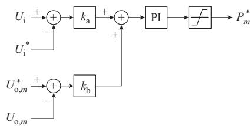  
图2 模块均衡控制器的结构框图  
Fig. 2 Structure diagram of module balancing controller

在积分环节的持续作用下，误差信号 e的数值将被调节至零。

$$
k _ {\mathrm {a}} \left(U _ {\mathrm {i}} - U _ {\mathrm {i}} ^ {*}\right) + k _ {\mathrm {b}} \left(U _ {\mathrm {o}, m} ^ {*} - U _ {\mathrm {o}, m}\right) = 0 \tag {4}
$$

这样，模块输出端电压和输入端电压可以表示为如式（5）所示的斜率关系。

$$
U _ {\mathrm {o}, m} = U _ {\mathrm {o}, m} ^ {*} + \frac {k _ {\mathrm {a}}}{k _ {\mathrm {b}}} \left(U _ {\mathrm {i}} - U _ {\mathrm {i}} ^ {*}\right) \tag {5}
$$

不同模块的均衡控制是互相独立的，不需借助模块间的通信。同时，各模块的均衡控制规律相同，确保模块的动态响应基本一致，可以高效可靠实现大量模块的均衡控制。在串并联均衡控制作用下，各模块串联输出端的电压可以保持平衡巨各模块的串联输出端的电流总是相等的，根据式（1）可得各模块的输送功率也可保持平衡。

# 2. 2 运行分析

对单个模块化双有源桥变流器的运行特性进行研究，由于每个模块都使用相同的均衡控制，各模块电压的动态响应基本一致。因为各模块的输入端并联，模块输入电压基本相等。

$$
U _ {\mathrm {i}, 1} = U _ {\mathrm {i}, 2} = \dots = U _ {\mathrm {i}, n} = U _ {\mathrm {i}} \tag {6}
$$

式中： $U _ { \mathrm { i , 1 } } , U _ { \mathrm { i , 2 } }$ 和 $U _ { \mathrm { i , } }$ 分别为模块序号为 1，2和 n的模块输入电压。在均衡控制作用下，各模块输出电压也可保持平衡，有

$$
U _ {\mathrm {o}, 1} = U _ {\mathrm {o}, 2} = \dots = U _ {\mathrm {o}, n} \tag {7}
$$

式中： $U _ { \mathrm { o , 1 } } , U _ { \mathrm { o , 2 } }$ 和 $U _ { \mathrm { o , } }$ 分别为模块序号为1，2和n的模块输出电压。

如图 1所示，模块化双有源桥变流器高压直流输出端与高压直流电网相连，变流器高压直流输出端的电压 $U _ { \mathrm { d c } }$ 可以表示为

$$
U _ {\mathrm {d c}} = \sum_ {m = 1} ^ {n} U _ {\mathrm {o}, m} = U _ {\mathrm {d}} + I _ {\mathrm {o}} R \tag {8}
$$

式中： $U _ { \mathrm { d } }$ 为高压直流电网电压；R为高压直流线路等值电阻。

将式(6)和式(7)代入式(8)，得到 $U _ { \mathrm { o } , m }$ 为：

$$
U _ {\mathrm {o}, m} = \frac {U _ {\mathrm {d}}}{n} + \frac {I _ {\mathrm {o}} R}{n} \tag {9}
$$

可见任意模块的输出端电压与高压直流电网电压和模块化变流器输出直流电流成正比关系。根据式（8）可知，I 为：

$$
I _ {\mathrm {o}} = \frac {U _ {\mathrm {d c}} - U _ {\mathrm {d}}}{R} \tag {10}
$$

# 3 仿真测试

如图 1所示，直流变电站仿真测试系统由 2个模块化双有源桥变流器并联组成，每个模块化变流器由 10个模块级联构成。模块并联输入端的额定电压为1.5kV，模块串联输出端的额定电压为3kV。逆变器和整流器的直流电容值均为 0.01 F，逆变器和整流器的电抗值均为0.2 mH，交流链额定频率为250 Hz。隔离变压器接线组别为星形接线/三角形接线，额定电压变比为0.69 kV/1.5 kV，额定容量为2 MVA，漏抗为1%。

第1个模块化变流器中10个模块分为4组。第1组模块序号为11-13；第2组模块序号为14-16。前2组模块出线连接分布式直流电源和负荷。第3组模块序号为 17-19，其出线仅连接直流负荷；第 4组模块序号为 10，是备用模块，其出线没有连接电源或负荷。第 2 个模块化变流器中 10 个模块分为3组。第1组模块序号为21-23；第2组模块序号为24-26。前 2组模块出线连接分布式直流电源和负荷；第3组模块序号为20和27-29，其出线仅连接直流负荷。为使分析直观简便，同一组内模块出线连接的电源或负荷的功率曲线相同。该仿真测试系统中的各组模块线路输入功率处于严重不平衡状态，以此来测试串并联均衡控制的效果。直流变电站通过中高压直流线路连接到直流电网，直流电网用直流电压源和等值电阻模拟。仿真测试中，双有源桥模块采用三相双有源桥，模块功率控制采用矢量电流控制［22-23］ ，详见附录 A。

图3为直流变电站中第一个模块化双有源桥变流器内部模块相应电压和功率的仿真波形。图3（a）为

4组模块中首个模块的线路输入功率，其中， $P _ { \mathrm { g , 1 1 } }$ 为第1个模块化变流器中第1组首个模块的低压线路输入功率，每组中其余模块的线路输入功率与该组首个模块的线路输入功率相同。 $P _ { \mathrm { g , 1 4 } } , P _ { \mathrm { g } } ,$ ，17 和 $P _ { \mathrm { { g } } }$ ，10 分别为第1个模块化变流器中第2组、第3组和第 4 组首个模块的低压线路输入功率。图 3（b）和（c）分别为各组首个模块的输入电压和输出电压， $U _ { \mathrm { i , 1 1 } }$ 和 $U _ { \mathrm { o , 1 1 } }$ 分别为第1个模块化变流器中第1组首个模块的输入电压和输出电压。其中， $U _ { \mathrm { i , 1 4 } } , U _ { \mathrm { i , 1 7 } }$ 和 $U _ { \mathrm { i , 1 0 } }$ 分别为第1个模块化变流器中第2组、第3组和第4组首个模块的输入电压； $U _ { \mathrm { o , 1 4 } } , U _ { \mathrm { o , 1 7 } }$ 和 $U _ { \mathrm { o , 1 0 } } ^ { }$ 分别为第1个模块化变流器中第2组、第3组和第4组首个模块的输出电压。图 3（d）为该模块化变流器的总输送功率。

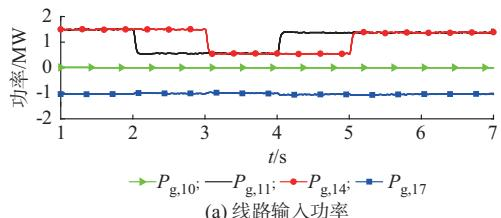

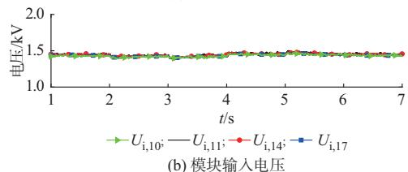

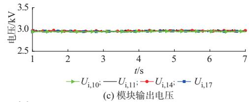

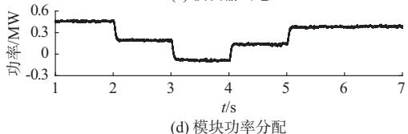  
图3 模块化双有源桥变流器1的模块电压、功率仿真波形  
Fig. 3 Simulation waveforms of module voltages and powers in modular dual-active-bridge converter 1

图4为直流变电站中第2个模块化双有源桥变流器内部模块相应电压和功率的仿真波形，图4（a）为3组模块中首个模块的线路输入功率， $P _ { \mathrm { g , 2 1 } }$ 为第2个模块化变流器中第一组首个模块的低压线路输入功率，每组中其余模块的线路输入功率与该组首个模块的线路输入功率相同。 $P _ { \mathrm { g } , 2 4 }$ 和 $P _ { \mathrm { g , 2 7 } }$ 分别为第 2个模块化变流器中第2组和第3组首个模块的低压线路输入功率。图 4（b）和图 4（c）分别为各组首个

模块的输入电压和输出电压。其中， $U _ { \mathrm { i , 2 1 } }$ 和 $U _ { \mathrm { o , 2 1 } }$ 分别为第2个模块化变流器中第1组首个模块的输入电压和输出电压； $U _ { \mathrm { i , 2 4 } }$ 和 $U _ { \mathrm { i , 2 7 } }$ 分别为第 2个模块化变流器中第 2 组和第 3 组首个模块的输入电压； $U _ { \mathrm { o , 2 4 } }$ 和 $U _ { \mathrm { o , 2 7 } }$ 分别为第 2个模块化变流器中第 2组和第 3组首个模块的输出电压。图 4（d）为该模块化变流器的总输送功率。

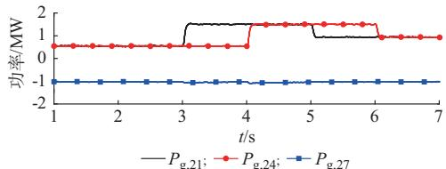

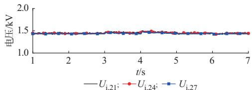  
(a) 线路输入功率

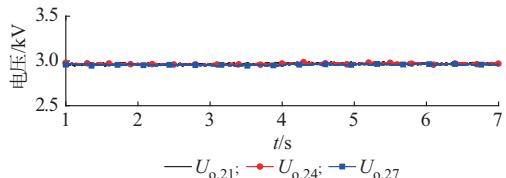  
(b) 模块输入电压

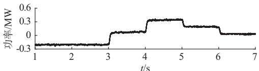  
(c) 模块输出电压   
(d) 模块功率分配   
图 模块化双有源桥变流器 的模块电压、功率仿真波形  
Fig. 4 Simulation waveforms of module voltages and powers in modular dual-active-bridge converter 2

可见，即使各模块线路的输入功率差异和波动均很大，但是在输入端并联结构和模块均衡控制的共同作用下，模块化双有源桥变流器内部各模块的输入直流电压和输出直流电压能够很好地保持均衡和稳定，有力地保障双有源桥变流器的稳定运行。模块化双有源桥变流器的串并联均衡控制可以将严重不平衡的输入功率平均分配到各个模块，充分利用各模块的功率传输能力。

图 5（a）和图 5（b）分别为整个直流变电站输出的总直流电压和总有功功率。直流变电站输出的总有功功率为各个模块的有功功率之和，并巨有功功率具有双向流动能力。直流变电站输出的总直流电压基本保持稳定，但会随着总有功功率的变化呈现对应的变化，这与式（8）的分析结果一致。

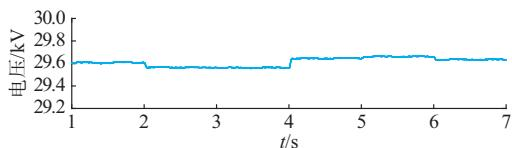

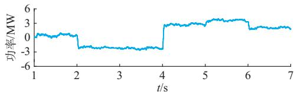  
(a) 直流变电站输出的总直流电压  
(b) 直流变电站输出的总有功功率  
图5 直流变电站输出的总直流电压和总有功功率仿真波形  
Fig.5Simulation waveforms of overall DC voltage and activepowerfromDCsubstation

# 4 结 语

构建直流变电站对规范直流电网电压等级，实现直流电网互联具有重要意义。本文对直流变电站进行了探索性研究，设计了一种基于模块化双有源桥变流器的直流变电站架构，具有与传统交流变电站类似的结构特征，提出了元需通信的模块串并联均衡控制，通过仿真验证了直流变电站的工作模式。

但是，直流变电站的研究仍处于起步阶段，其在成本、效率和可靠性等方面与传统交流变电站存在较大差距，直流变电站后续需要重点研究的内容有：①优化直流变电站拓扑结构，降低装置总体成本；②完善直流变电站控制策略，通过移相控制和高频软开关等技术降低电力电子器件损耗；③提升电力电子器件耐压和通流能力，降低器件成本；④研究具有较强开断能力的低成本直流断路器；⑤设计直流变电站相应的系统保护方案。

本文受到国网浙江省电力有限公司集体企业科技项目资助（2019-HUZJTKJ-19），特此感谢！

附录见本刊网络版（http：//www.aeps-info.com/aeps/ch/index.aspx），扫英文摘要后二维码可以阅读网络全文。

# 参 考 文 献

［1］管敏渊，张静，刘强，等 .柔性直流输电系统的联网和孤岛运行通用控制策略［J］.电力系统自动化，2015，39（15）：103-109.  
GUAN Minyuan，ZHANG Jing，LIU Qiang，et al. Generalizedcontrol strategy for grid-connected and island operation of VSC-HVDC system［J］. Automation of Electric Power Systems，2015，39（15）：103-109.  
［2］许烽，陆翌，裘鹏，等 .基于二极管钳位的电流转移型高压直流断路器［J］.电力系统自动化，2019，43（4）：205-214.  
XU Feng， LU Yi， QIU Peng， et al. Diode clamping based

current-transferring high voltage DC breaker［J］. Automation ofElectric Power Systems，2019，43（4）：205-214.  
［3］严胜，罗湘，贺之渊.直流电网核心装备及关键技术展望［J］.电力系统自动化， ，（ ）： -  
YAN Sheng，LUO Xiang，HE Zhiyuan. Prospect of core equipment and key technology for DC power grid ［J］. Automation of Electric Power Systems，2019，43（3）：289-300.   
［4］李梦柏，向往，左文平，等 . 具备元闭锁穿越直流故障能力的直流自耦变压器［J］.电力系统自动化，2018，42（4）：82-88.  
LI Mengbo，XIANG Wang，ZUO Wenping，et al. DC-DCautotransformer with uninterrupted operating capability duringDC fault［J］. Automation of Electric Power Systems ，2018 ，42（4）：82-88.  
［5］索之闻，李庚银，迟永宁，等 .适用于海上风电的多端口直流变电站及其主从控制策略［J］.电力系统自动化，2015，39（11）：16-23.  
SUO Zhiwen，LI Gengyin，CHI Yongning，et al. Multi-port DCsubstation for offshore wind farm integration and its master-slavecontrol［ J］. Automation of Electric Power Systems ， 2015 ，39（11）：16-23.  
［6］HUANG A Q，CROW M L，HEYDT G T，et al. The future renewable electric energy delivery and management（FREEDM） system： the energy internet［J］. Proceedings of the IEEE， 2010，99（1）：133-148.   
［7］IOV F，BLAABJERG F，CLARE J，et al. Uniflex-PM：a keyenabling technology for future european electricity networks［J］. EPE Journal，2009，19（4）：6-16.   
［8］GUAN Minyuan. A series-connected offshore wind farm basedon modular dual-active-bridge（DAB）isolated DC-DC converter［J］. IEEE Transactions on Energy Conversion，2019，32（3）：1422-1431.  
［9］QIN H， KIMBALL J W. Solid-state transformer architectureusing AC-AC dual-active-bridge converter ［J］. IEEETransactions on Industrial Electronics， 2013， 60（9）： 3720-3730.  
［10］刘海洋，刘闯，姚航，等.高频谐振型直流变压器模块设计与研究［J］. 电力电子技术，2016，50（9）：58-63.  
LIU Haiyang，LIU Chuang，YAO Hang，et al. Design andresearch of high-frequency resonant DC-transformer module［J］.Power Electronics，2016，50（9）：58-63.  
［ ］孙谦浩，宋强，王裕，等 基于 - 的高频链直流变压器实时仿真研究［J］.电力系统保护与控制，2017，45（5）：80-87.  
SUN Qianhao，SONG Qiang，WANG Yu，et al. Real-time simulation research of high frequency link DC solid state transform based on RT-LAB［J］. Power System Protection and Control，2017，45（5）：80-87.   
［ ］贾祺，赵彪，严干贵，等 基于高频链直流变压器的柔性中压直流配电系统分析［J］. 电力系统保护与控制，2016，44（16）：90-98.  
JIA Qi，ZHAO Biao，YAN Gangui，et al. Analysis of flexible medium voltage DC power distribution system based on highfrequency-link DC solid state transformer［J］. Power System Protection and Control，2016，44（16）：90-98.   
［ ］李建国，赵彪，宋强，等 直流配电网中高频链直流变压器的电压平衡控制策略研究［］中国电机工程学报， ， （ ）：

327-334.   
LI Jianguo，ZHAO Biao，SONG Qiang，et al. DC voltagebalance control strategy of high frequency link DC transformer inDC distribution system［J］. Proceedings of the CSEE ，2016 ，36（2）：327-334.  
［14］AYYANAR R， GIRI R， MOHAN N. Active input-voltageand load-current sharing in input-series and output-parallelconnected modular DC-DC converters using dynamic input-voltage reference scheme［J］. IEEE Transactions on PowerElectronics，2004，19（6）：1462-1473.  
［15］LIAN Y，ADAM G，HOLLIDAY D，et al. Modular input-parallel output-series DC/DC converter control with faultdetection and redundancy［J］. IET Generation， Transmission& Distribution，2016，10（6）：1361-1369.  
［16］HOLTSMARK N，BAHIRAT H J，MOLINAS M，et al. An all-DC offshore wind farm with series-connected turbines： an alternative to the classical parallel AC model？［J］. IEEE Transactions on Industrial Electronics，2013，60（6）：2420- 2428.   
［17］BAHMANI M A， THIRINGER T， RABIEI A， et al.Comparative study of a multi-MW high-power density DCtransformer with an optimized high-frequency magnetics in all-DCoffshore wind farm ［J］. IEEE Transactions on PowerDelivery，2016，31（2）：857-866.  
［18］ENGEL S P，SOLTAU N，STAGGE H，et al. Dynamic and balanced control of three-phase high-power dual-active bridge DC-DC converters in DC-grid applications ［J］. IEEE Transactions on Power Electronics，2013，28（4）：1880-1889.   
［19］ENGEL S P， STIENEKER M， SOLTAU N， et al.Comparison of the modular multilevel DC converter and thedual-active bridge converter for power conversion in HVDC andMVDC grids［J］. IEEE Transactions on Power Electronics，2014，30（1）：124-137.  
［20］TODORČEVIĆ T， VAN K R， BAUER P， et al. Amodulation strategy for wide voltage output in DAB-basedDC-DC modular multilevel converter for DEAP wave energyconversion［J］. IEEE Journal of Emerging and Selected Topics， ，（ ）： -  
［21］ZUMEL P， ORTEGA L， LAZARO A， et al. Controlstrategy for modular dual active bridge input series outputparallel［C］// IEEE 14th Workshop on Control and Modelingfor Power Electronics （COMPEL），June 23-26，2013，SaltLake City，USA.  
［22］YAZDANI A， IRAVANI R. A unified dynamic model andcontrol for the voltage-sourced converter under unbalanced gridconditions［J］. IEEE Transactions on Power Delivery，2006，21（3）：1620-1629.  
［23］COLE S，BEERTEN J，BELMANS R. Generalized dynamicVSC MTDC model for power system stability studies［J］.IEEE Transactions on Power Systems，2010，25（3）：1655-1662.

hanren@zju.edu.cn

沈建良（1971-），男，高级工程师，主要研究方向：电气工程及其自动化。

楼 平（1967-），男，教授级高级工程师，主要研究方向：电气工程及其自动化。

（编辑 杨松迎）

# Design Scheme of DC Substation Based on Modular Dual-active-bridge Converter

GUAN Minyuan，SHEN Jianliang，LOU Ping

(Huzhou Power Supply Company of State Grid Zhejiang Electric Power Co., Ltd., Huzhou 313000, China)

This paper presents a DC substation design scheme based on the modular dual-active-bridge (DAB) converter. The DAB modules are cascaded in input-parallel output-series (IPOS) structure with bidirectional power-flow capability, in which the low DC voltage at the input terminal can be raised to the medium or high DC voltage at the output terminal. The output terminal with high DC voltage of modular DAB converter is connected to the high-voltage DC grid, while the input terminal of each module with low DC voltage is connected to low-voltage distributed generators and loads. A compact high-frequency transformer is adopted in the DAB module，enabling the galvanic isolation between the input terminal and the output terminal. The serial-parallel balancing control is presented for the modular DAB converter, which is efficient, reliable and communication-free. As a result, there is the same droop relationship between the output-series voltage and the input-parallel voltage in each module. The electromagnetic transient simulation results show that the power of the DC substation is equally distributed among the DAB modules, so the input DC currents and output DC voltages of the modules can be kept balanced.

Key words: DC substation; balance control; dual active bridge (DAB) converter; input-parallel output-series (IPOS); serial-parallel balancing control

