# ParaEMT: An Open Source, Parallelizable, and HPC-Compatible EMT Simulator for Large-Scale IBR-Rich Power Grids

Min Xiong , Student Member, IEEE, Bin Wang , Senior Member, IEEE,

Deepthi Vaidhynathan , Senior Member, IEEE, Jonathan Maack , Matthew J. Reynolds,

Andy Hoke , Senior Member, IEEE, Kai Sun , Fellow, IEEE, and Jin Tan , Senior Member, IEEE

Abstract—The electromagnetic transient (EMT) simulation is an essential tool for studying power grids dominated by inverter-based resources (IBRs). However, due to small simulation time steps and increasing problem sizes, performing EMT simulations for large-scale power grids becomes computational-intensive, and often impractical. To address this challenge, we developed ParaEMT, an open-source Python-based EMT simulator that is parallelizable and compatible with high-performance computing (HPC) systems for simulating large-scale power grids with a significant presence of IBRs. Its key features include: 1) utilizing parallel computation for network solution by decomposing the network conductance matrix into the bordered block diagonal form; 2) enabling parallel updates of device states and network historical currents; 3) leveraging HPC to further accelerate simulation through a developed generic interface. The accuracy of ParaEMT has been validated on the reduced 240-bus (720-node) Western Electricity Coordinating Council system by benchmarking the EMT dynamics against PSCAD. Furthermore, ParaEMT achieves a notable speedup of approximately 25 to 36 times on a synthetic 10,080-bus (30240-node) system by leveraging the HPC resource named Eagle at the National Renewable Energy Laboratory. A regional 100% renewable case of the reduced 240-bus system has been developed for simulating system-wide IBRs’ interactions in large-scale power grids using ParaEMT.

Index Terms—Power system dynamics, electromagnetic transient simulation, inverter-based-resource, large-scale systems,

Manuscript received 28 June 2023; revised 11 October 2023; accepted 4 December 2023. Date of publication 13 December 2023; date of current version 26 March 2024. This work was supported in part by the National Renewable Energy Laboratory (NREL), operated by Alliance for Sustainable Energy, LLC, for the U.S. Department of Energy (DOE) under Contract DE-AC36-08GO28308 through the Laboratory Directed Research and Development (LDRD) Program and in part by the U.S. DOE’s of Energy Efficiency and Renewable Energy (EERE) under the Solar Energy Technologies Office under Award 38457. Paper no. TPWRD-00902-2023. (Corresponding author: Jin Tan.)

Min Xiong is with National Renewable Energy Laboratory, Golden, CO 80401 USA, and also with the University of Tennessee, Knoxville, TN 37996 USA (e-mail: mxiong3@vols.utk.edu).

Bin Wang was with National Renewable Energy Laboratory, Golden, CO 80401 USA. He is now with the University of Texas at San Antonio, San Antonio, TX 78249 USA (e-mail: bin.wang2@utsa.edu).

Deepthi Vaidhynathan, Jonathan Maack, Matthew J. Reynolds, Andy Hoke, and Jin Tan are with National Renewable Energy Laboratory, Golden, CO 80401 USA (e-mail: deepthi.vaidhynathan@nrel.gov; jonathan.maack@nrel.gov; matthew.reynolds@nrel.gov; andy.hoke@nrel.gov; jin.tan@nrel.gov).

Kai Sun is with the University of Tennessee, Knoxville, TN 37996 USA (e-mail: kaisun@utk.edu).

Color versions of one or more figures in this article are available at https://doi.org/10.1109/TPWRD.2023.3342715.

Digital Object Identifier 10.1109/TPWRD.2023.3342715

nodal formulation, bordered block diagonal matrix, parallel computation, high-performance computing.

# I. INTRODUCTION

W ITH the proliferation of inverter-based resources (IBRs)in power grids in recent decades, there is a broad con- in power grids in recent decades, there is a broad consensus that electromagnetic transient (EMT) simulation is a critical element for addressing IBR integration, especially in bulk power grids with high levels of IBRs [1]. Some of notable drivers of performing EMT studies for bulk power grids include sub-synchronous oscillations [2], sub-synchronous control interactions [3], integration of IBRs into a weak grid, unbalanced fault’s impact on grids, and potential misoperation of protection systems [2], [4], [5], [6]. To better study and understand the impact of IBRs on system-level dynamics of power grids, offline numerical simulations provide an economical alternative to the digital real-time simulators and transient network analyzers [6]. Among the offline tools, phasor-based electromechanical transient simulations focus on slower dynamics, e.g., <5 Hz, and use time steps of around milliseconds to simulate positivesequence states. Although phasor simulations are relatively fast, they cannot accurately capture the complex dynamics of IBRs that cover a wide range of frequencies, up to tens or hundreds of hertz. In comparison, three-phase instantaneous value-based electromagnetic transient (EMT) simulations utilize fundamental circuit models without assumptions on system frequencies and can accurately represent fast and detailed dynamics [6], [7], and thus they can be used to de-risk the integration of high penetration levels of IBRs. Implementing fundamental circuit models and ensuring the model accuracy and numerical stability require small time steps of approximately 50–100 microseconds or smaller, which makes EMT simulations extremely timeconsuming, especially for large-scale applications where the dimensions of three-phase systems become very high. Therefore, accelerating EMT simulations has been of great interest and significance for evaluating fast dynamic risks in practical planning and operations of power grids [8].

As multicore processors have become commonplace, considerable effort has been directed toward parallel computations for EMT simulations of large power grids [9]. Traditionally, the parallelization of EMT simulations relied on exploiting the natural decoupling between subnetworks that arises from the traveling wave propagation delay across long-distance distributed parameter transmission lines and cables in a manual way; however, the performance of this approach is constrained

by the number, location, and length of transmission lines, and it becomes infeasible when the delay is too small [9], [10], [11], [12]. An alternative, which does not rely on the time delay of lines, is to automatically reformulate the network conductance matrix into a bordered block diagonal (BBD) form, which is not fully decoupled but still amenable to parallelization [13].

Following the pioneering work [14] in 2011, many studies have been carried out to advance the acceleration of device-level or system-level EMT simulations by incorporating graphics processing unit (GPU) technology [15], [16], [17], [18]. The single instruction multiple thread execution mode facilitated by GPUs allows for an effortless implementation of thread-level parallelization in EMT simulations, leading to a speedup factor up to 6 [17] and 40 [18] compared to conventional central processing unit (CPU)-based simulations.

Meanwhile, as a user-configurable device capable of achieving inherent hardwired parallelism with pipelined architecture, field programmable gate arrays (FPGAs) have been effectively employed for hardware-in-the-loop-based real-time EMT simulations [19], [20], [21], [22]. Also, hybrid EMT and phasor domain simulations have been investigated to reduce overall computational costs [23], [24], [25]. In [26], an EMT simulation platform, called CloudPSS, is introduced, which uses cloud service and heterogeneous parallel computing to efficiently perform EMT simulations.

High-performance computing (HPC) is another advanced and promising technique for handling computationally intensive power systems studies, such as contingency analysis, reliability analysis, state estimation, and transient stability simulation. With rich computing resources, multiple subtasks can be simultaneously processed with superior efficiency [27], [28]. Leveraging HPC clusters at the Pacific Northwest National Laboratory and the National Renewable Energy Laboratory (NREL), transmission and distribution phasor-domain co-simulations of large systems were performed and presented in [29] and [30], respectively.

To efficiently simulate EMT dynamics of large-scale IBR-rich power grids, the authors of this paper developed a Python-based open-source EMT simulator, named ParaEMT, that can execute parallel computations on HPC clusters [31]. ParaEMT employs the conventional nodal formulation-based EMT simulation strategy outlined in [32] and integrates the generic IBR model detailed in [33] to emulate IBR-related dynamics.

To the best of the authors’ knowledge, this is the first work on parallel EMT simulation of large-scale systems (e.g., with 240-10080 buses) leveraging the HPC clusters. Also, ParaEMT is the first open-source EMT simulator for large-scale systems that can be easily integrated with HPC clusters. Although multiple commercial software, such as PSCAD, EMTP-ATP, EMTP-RV, XTAP, OPAL-RT, and RTDS, are dominating the EMT simulation, the Python-based simulator ParaEMT supplements those tools by providing an open and transparent platform for educational and research purposes. For example, users can modify the code to implement different parallel simulation strategies, test performance of numerical approaches, and simulate dynamics of user-defined models in the EMT domain on large-scale systems.

The rest of this paper is organized as follows. Section II introduces the simulation strategy, the developed element library, and the utilized initialization approach of ParaEMT. Section III presents the BBD matrix-based parallelization of the network solution, and the natural decoupling-based parallelization of

the device state updates and network historical current updates implemented in ParaEMT. Case studies conducted the reduced 240-bus (720-node) Western Electricity Coordinating Council (WECC) system [34], [35] and a modified version of it that features a 100% renewable energy penetration level in the California region are presented in Sections IV and ${ \mathrm { V } } ,$ respectively. Section VI evaluates the time performance of ParaEMT on simulating a large-scale, 10080-bus (30240-node) system, leveraging the supercomputer Eagle at NREL. Finally, conclusions and discussions are provided in Section VII.

# II. INTRODUCTION OF THE OPEN-SOURCE EMT SIMULATOR PARAEMT

# A. Simulation Framework

To simulate the network generally represented by R-L-C circuits, different approaches have been developed in commercial tools to formulate the network equation, including mainly the traditional nodal formulation used in [32], the modified nodal formulation utilized in SPICE [36], the modified augmented nodal analysis employed in EMTP-RV [37], [38], and the sparse tableau formulation adopted in XTAP [39].

The traditional nodal approach based on the trapezoidal rule method is employed in ParaEMT. The differential equation of any R-L-C circuit is discretized by the trapezoidal-rule method, which is numerically A-stable. Subsequently, the original circuit can be represented by an equivalent resistor and a historical data-determined current source:

$$
i (t) = \frac {v (t)}{R _ {e q}} + i _ {h i s t} (t - \Delta t)
$$

$$
i _ {h i s t} (t - \Delta t) = a i (t - \Delta t) + b v (t - \Delta t) \tag {1}
$$

Moreover, in ParaEMT, to mitigate undesired fictitious numerical oscillations, artificial resistors $R _ { p } { \approx } 4 0 L / ( 3 \Delta t )$ and $R _ { s } { \approx } 3 \Delta t / ( 4 0 C )$ are added in parallel/series with L/C, respectively, while maintaining high simulation accuracy [40].

The coefficients corresponding to the companion circuits of various types of network circuits are summarized in Table IV in the appendix. Finally, based on the companion circuit representation, the network equation can be formulated with Kirchhoff’s current law as a real-valued nodal equation:

$$
\mathbf {G} \mathbf {v} (t) = \mathbf {i} (t) + \mathbf {i} _ {\text {h i s t}} (t - \Delta t) \tag {2}
$$

where G is the network conductance matrix comprised of all equivalent resistors, v(t) is the three-phase instantaneous nodal voltage vector, i(t) is the three-phase instantaneous current injection vector, and $\mathbf { i } _ { h i s t } ( t - \Delta t )$ is the historical current vector of the companion circuits [32], [41].

The simulation process is illustrated in Fig. 1. The three aqua boxes include the tasks that are naturally decoupled for different devices or network circuits. Instead, as marked in the purple box, the network equation is coupled between different nodes unless advanced techniques are taken to decouple it to some extent.

# B. Element Library and Device Modeling

ParaEMT currently supports a variety of typical power system devices, which are summarized in Table I [33], [34], [42]. Additional component models—such as grid-forming converterbased resources, distributed parameter transmission lines, and

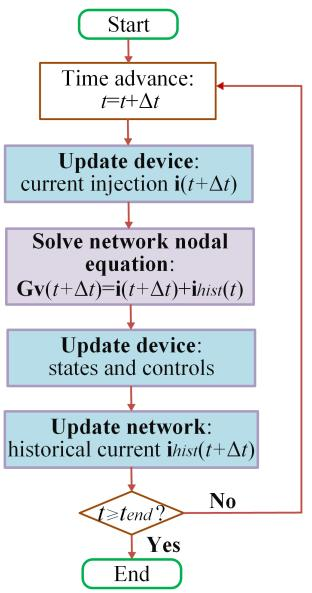  
Fig. 1. EMT simulation flowchart.

TABLE I DEVICE MODELS FOR EMT SIMULATION IN PARAEMT   

<table><tr><td>Powe system device</td><td>Model</td></tr><tr><td>Synchronous machine</td><td>EMT-type machine</td></tr><tr><td>Excitation control</td><td>SEXS</td></tr><tr><td>Governor control</td><td>TGOV1/ GAST/ HYGOV</td></tr><tr><td>Power system stabilizer</td><td>IEEEEST</td></tr><tr><td>Renewable energy generator/converter</td><td>REGC-A [33]</td></tr><tr><td>Renewable energy electrical control</td><td>REEC-B [33]</td></tr><tr><td>Renewable energy plant control</td><td>REPC-A [33]</td></tr><tr><td>Phase-locked loop</td><td>2nd-order</td></tr><tr><td>Transmission line</td><td>Lumped Pi section</td></tr><tr><td>Load/ Two winding transformer</td><td>Resistor-Inductor</td></tr><tr><td>Shunt</td><td>Capacitor</td></tr></table>

dynamic loads—can readily be incorporated to meet future needs.

As an important nonlinear element, synchronous generators typically need to be modeled and interfaced with the network in a well-designed way for EMT simulations. Among multiple modeling and interfacing approaches presented in [43], ParaEMT employed the qd machine model along with the Thevenin prediction-based interfacing strategy [32], [43]. In this model, the terminal voltages and currents of a machine at the next time step are calculated based on linear extrapolation of rotor speed $\omega ,$ , armature currents $i _ { d }$ and $i _ { q } ,$ armature flux linkages $\lambda _ { d }$ and $\lambda _ { q } ,$ and field winding voltage $e _ { f d } .$ . Additionally, the averaged constant resistance of the abc frame Thevenin equivalent circuits are interfaced with the network, to avoid re-factorization of the entire network G matrix at every time step. Interested readers can refer to [32] and [43] for detailed derivations and illustrations.

Meanwhile, [43] shows that other machine models and interfacing techniques could provide better efficiency, accuracy, or stability, and those can be incorporated into ParaEMT in future development.

# C. Simulation Initialization

Proper initialization is critical for attaining a normal operation condition and saving simulation time for reaching a converged steady state. Unlike the blocking and releasing method utilized in PSCAD, ParaEMT initializes the system with a positive sequence power flow solved by the Newton-Raphson method, and then converts the voltages into three-phase waveforms following:

$$
v _ {a} = V _ {\text {m a g}} \cos (V _ {\text {a n g}})
$$

$$
v _ {b} = V _ {m a g} \cos (V _ {a n g} - 2 \pi / 3)
$$

$$
v _ {c} = V _ {\text {m a g}} \cos \left(V _ {\text {a n g}} + 2 \pi / 3\right) \tag {3}
$$

where $\nu _ { a } , \nu _ { b } ,$ , and $\nu _ { c }$ are three-phase voltages, and $V _ { m a g }$ and $V _ { a n g }$ are the magnitude and angle of positive sequence phasor voltages. The same conversion strategy is applied to currents.

Because a fully automatic initialization does not exist yet, the dynamic models, including synchronous generators, machine controls, and IBRs, are initialized through pre-coded backward propagation of variables following the control diagram equations under initial conditions [6].

Currently, ParaEMT’s initialization considers balanced steady state. Future work can be directed towards initialization of distributed line models, un-transposed line models, and power electronics with harmonics when those models are incorporated [6], [44].

# D. Process of Conducting EMT Simulations Using ParaEMT

To execute an EMT simulation in ParaEMT and save the results, the following steps are followed:

1) Step 1. Initialize the System Power Flow: The preestablished PSSE raw file of a system is loaded, after which the power flow is calculated using the Python application programming interface, and then the data is recorded as a JSON source file.   
2) Step 2. Run the Time Domain EMT Simulation: In this step, the JSON file that contains the power flow information is loaded, followed by the loading of dynamic parameters from a preconfigured Excel file. Subsequently, the three-phase currents and voltages of the network are initialized using phasor values obtained from the power flow results, and state variables of IBRs and synchronous generators, along with their controllers, are also initialized.

Once the initialization is complete, the simulation is conducted following the procedure presented in Fig. 1 for each time step until a predefined simulation time length is reached.

3) Step 3. Save the Results: In the final step, the simulation results of the network and devices are first saved as a pickle file and then exported as Excel files, which are easy to read and analyze.

Note that ParaEMT is a Python-based simulator, and Python 3.7 is recommended for optimal performance. Also, several indispensable Python packages, such as NumPy and SciPy, are required. In addition, auxiliary features including down-sampling and snapshot, which are widely implemented in existing EMT simulators, are also incorporated in ParaEMT.

# III. PARALLELIZATION OF EMT SIMULATIONS

It is widely recognized that a significant amount of time cost, typically up to 80%–97% for large systems, in EMT simulations

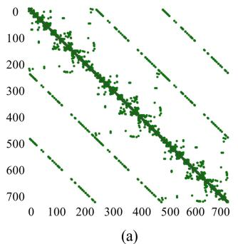

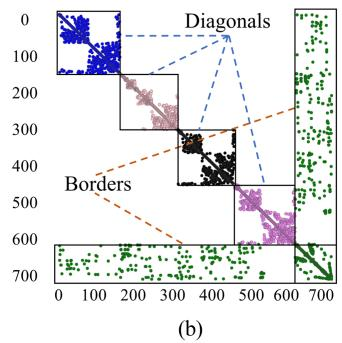  
Fig. 2. Graph representation of the 240-bus WECC system. (a) Original representation. (b) BBD representation.

is consumed by solving the network nodal equation [45], [46], [47]. Traditionally, the LU decomposition of the sparse G matrix has been used to solve the network nodal voltage vector, v, through forward and backward substitutions; however, such a sequential approach is not easily parallelizable, leading to a bottleneck that limits the speed of EMT simulations. To tackle this challenge and to speed up EMT simulations, ParaEMT has incorporated parallel computations to take advantage of the abundant computational resources that are now more readily available. This is primarily achieved by using the BBD form and block matrix LU decomposition of the G matrix for the network solution, and by leveraging naturally decoupled updates of device states, device current injection, and network historical currents.

# A. BBD Form of the Network Conductance Matrix

To efficiently parallelize the network solution, a graph representation of the network is automatically obtained and partitioned into multiple subregions using the METIS software package. Subsequently, each partition is internally reordered using a nested dissection to reduce the number of nonzero elements during the future LU factorization [13].

Taking the 240-bus WECC system as an example, as illustrated in Fig. 2, a graph representation of the original network is shown on the left, and its BBD form with four partitions is shown on the right.

The partitioning process ultimately transforms the network conductance matrix into the BBD form, with n = m+1:

$$
\mathbf {G} = \left[ \begin{array}{c c c c c} \mathbf {G} _ {1 1} & & & & \mathbf {G} _ {1 n} \\ & \mathbf {G} _ {2 2} & & & \mathbf {G} _ {2 n} \\ & & \dots & & \vdots \\ & & & \mathbf {G} _ {m m} & \mathbf {G} _ {m n} \\ \mathbf {G} _ {n 1} & \mathbf {G} _ {n 2} & \dots & \mathbf {G} _ {n m} & \mathbf {G} _ {n n} \end{array} \right] \tag {4}
$$

# B. Parallelizing the Network Nodal Equation Solution

Based on the block matrix LU decomposition, which is conducted before the time-loop simulation, the forward and backward substitutions for solving the network equation can be parallelized [13], as shown in Fig. 3, where $y _ { 1 } , y _ { 2 } , . . . , y _ { \mathrm { n } }$ are intermediate variables. More details can be found in [13].

Through the utilization of the BBD form-based network parallel computation, ParaEMT has an automatic flexible control over the number of zones for parallelism. In comparison, the

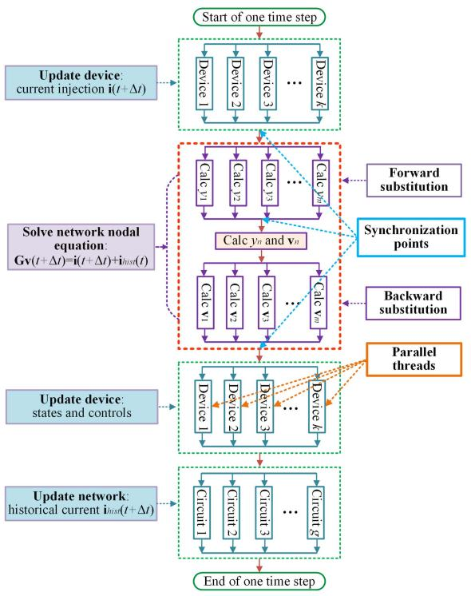  
Fig. 3. Parallel EMT simulation strategy in ParaEMT.

number of zones for parallelization is limited in many proprietary software packages.

While the block LU factorization using the Schur complement, as well as the forward and backward substitutions described in [13] were implemented in ParaEMT, the work in [13] explored only on shared memory parallelism on a single machine. In comparison, a distributed memory paradigm using Message Passing Interface (MPI) [48] is exploited for EMT simulation on HPC in this paper. This paradigm based on MPI allows computations to be distributed across a computer network while necessitating passing information between separate processes, i.e., MPI ranks. Particularly, this design enabled us to use multiple compute nodes on a high-performance supercomputer.

Specifically, the BBD matrix blocks of the network G matrix are distributed to MPI ranks in a round-robin fashion [49] and each LU factorization is computed in parallel. This is done prior to the time loop and the factors are reused for each parallel forward and backward substitution phase.

To access MPI in Python, the mpi4py package is utilized [50]. This package wraps an existing MPI library and enables the passing of arbitrary Python objects across MPI ranks. For computing the LU factors and block matrix solutions in the algorithm, the SuperLU solver [51] is implemented using the SciPy package [52].

Additionally, the LU factors of the BBD matrix contain many non-zeros which are small in magnitude, particularly in the LU factors of the corner block. To increase simulation speed, ParaEMT can drop those non-zeros with magnitudes below a pre-defined threshold. This introduces negligibly small errors into the simulation but can significantly decrease time cost for the network solution.

In addition, although the BBD technique can partition the network G matrix into an arbitrary number of blocks, it is

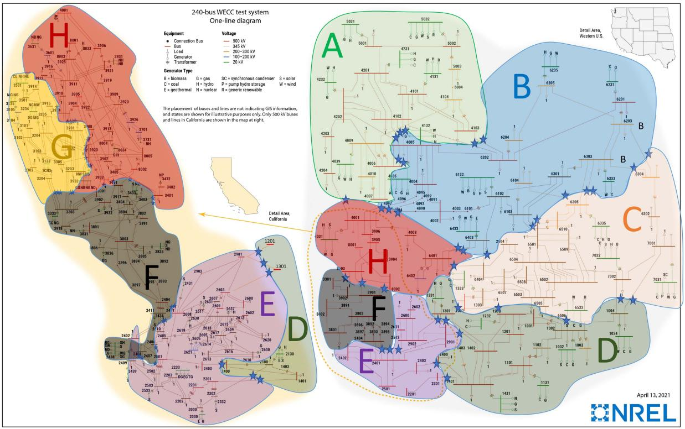  
Fig. 4. One-line diagram of the reduced 240-Bus WECC system divided into 8 zones.

not straightforward to know the exact number with the best performance for a given system. In practice, for this work, different numbers of partitions are tried for simulation of a short time length, and the number of partitions that has the best performance is then obtained through a time cost comparison.

# C. Parallelizing the Update of Device States and Network Historical Currents

Except the ability to leverage both shared and distributed compute node to accelerate EMT simulations on HPC for the network solution, ParaEMT can further improve computational efficiency by effortlessly parallelizing natural independent tasks, including critical simulation steps such as updating device current injections, updating device states, and updating branch historical currents, across components, as marked by aqua boxes in Figs. 1 and 3.

To exploit this, the devices and branches are divided into blocks and each MPI rank is assigned with one. The blocks are created to be as equal in size as possible for better performance. Each MPI rank computes the states and currents for the devices and branches in its assigned blocks. Immediately before solving the network nodal voltages, the current injections of devices and historical currents of branches are synchronized across all MPI ranks.

To reduce the computational time of the device states and current updates, the Python Numba package [53] for just-intime (JIT) compilation of Python code is used in ParaEMT. This allowed us to keep the readability of standard Python code while getting similar computation time to the NumPy [54] vectorized operations.

# IV. CASE STUDY ON THE REDUCED 240-BUS WECC SYSTEM

To assess the accuracy and efficiency of ParaEMT against commercial software, a case study is conducted in this section using the dynamic model of the 240-bus WECC system developed in [35], which reflects the actual generation resource mix in the year 2018 and has succeeded in system-level frequency response validations against three recorded real events. A oneline diagram of the 240-bus WECC system is presented in Fig. 4. Basic information of the system with 20% total IBR capacity is listed in Table II. Interested readers may refer to [34] and [35] for more details.

# A. Benchmark Against PSCAD on the 240-Bus WECC System

Without loss of generality, a disturbance is posted at t = 1 s by tripping the nuclear power generator at the Palo Verde substation in the Arizona area, causing a power loss of 2.25 GW. The simulation duration is 15 s, and the time step is 50 μs. Simulation results of the generator rotor speed, the generator active power output, and the bus voltage magnitude provided by ParaEMT are compared with those from PSCAD [34], as shown in Figs. 5 –7.

Figs. 5–7 show that the ParaEMT simulation results align with those of the PSCAD in terms of system-level dynamics. Minor errors may arise from unpublished details of model implementations and automatic parameter corrections within commercial tools.

# B. Time Performance on the 240-Bus WECC System

Additionally, the time performance of ParaEMT on the 240- bus WECC system is compared with that of PSCAD [34].

TABLE IIBASIC INFORMATION OF THE 240-BUS WECC SYSTEM  

<table><tr><td>Element</td><td>Number</td><td>Total capacity (GW)</td></tr><tr><td>Load</td><td>139</td><td>142.67</td></tr><tr><td>Distributed PV plant</td><td>59</td><td>10</td></tr><tr><td>Utility-scale PV plant</td><td>45</td><td>28</td></tr><tr><td>Wind plant</td><td>17</td><td>21</td></tr><tr><td>Synchronous generator</td><td>104</td><td>220</td></tr><tr><td>Synchronous condenser</td><td>5</td><td>0</td></tr><tr><td>SEXS exciter</td><td>109</td><td>/</td></tr><tr><td>IEEEST stabilizer</td><td>10</td><td>/</td></tr><tr><td>GAST governor</td><td>47</td><td>/</td></tr><tr><td>HYGOV governor</td><td>25</td><td>/</td></tr><tr><td>TGOV1 turbine-governor</td><td>37</td><td>/</td></tr><tr><td>REGC-A</td><td>121</td><td>/</td></tr><tr><td>REEC-B</td><td>121</td><td>/</td></tr><tr><td>REPC-A</td><td>121</td><td>/</td></tr><tr><td>Bus</td><td>243</td><td>/</td></tr><tr><td>Line</td><td>329</td><td>/</td></tr><tr><td>Transformer</td><td>122</td><td>/</td></tr></table>

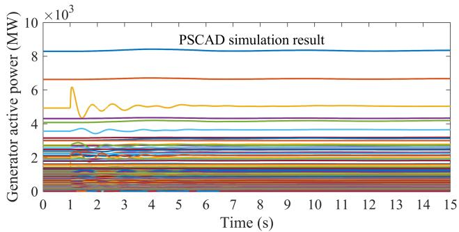

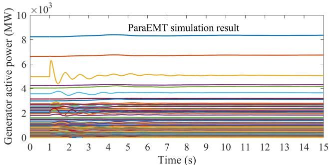  
Fig. 5. Validation of generator active power output simulation results.

Table III summarizes the time cost for a 1-second simulation using a 50-μs time step. The developed PSCAD model is roughly divided into eight subsystems of the same size connected by distributed model transmission lines [34], as shown in the labeled zones in Fig. 4. Hence, the tests are conducted using 1 or 8 CPU processor cores, i.e., with series or parallel computation. Correspondingly, series simulation with 1 core and parallel simulation with 8 cores are tested with ParaEMT for comparison.

Note that PSCAD can only run on Windows. Thus, for fair comparisons, the tests are conducted on a Windows machine equipped with two Intel Xeon(R) Platinum 8280 2.7-GHz CPUs and 512-GB RAM.

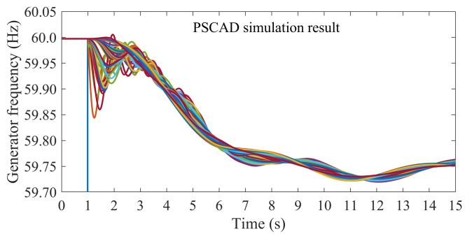

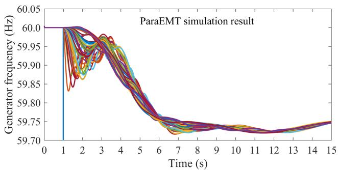  
Fig. 6. Validation of generator rotor frequency simulation results.

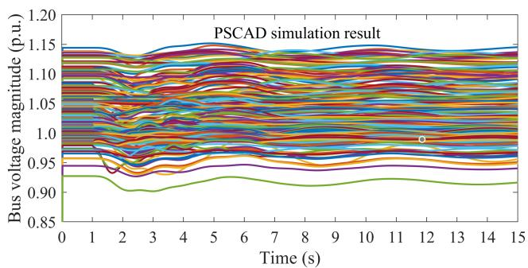

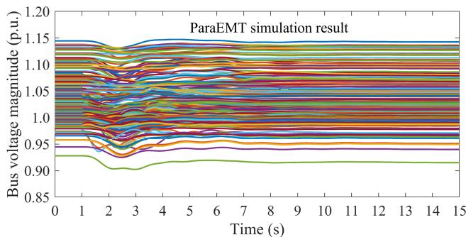  
Fig. 7. Validation of bus voltage magnitude simulation results.

TABLE IIICOMPARISON OF TIME COSTS ON THE 240-BUS WECC SYSTEM FOR A1-SECOND SIMULATION USING A 50-µS TIME STEP  

<table><tr><td>Tool</td><td>Series simulation
1 processor core</td><td>Parallel simulation
8 processor cores</td></tr><tr><td>PSCAD</td><td>90 s</td><td>15 s</td></tr><tr><td>ParaEMT</td><td>29 s</td><td>28 s</td></tr></table>

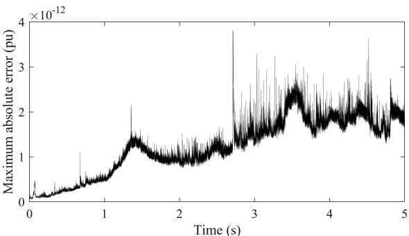  
Fig. 8. Maximum absolute error of parallel simulation on the 240-bus system.

As presented in Table III, ParaEMT has much smaller time cost under series simulation, benefiting from utilization of the JIT Numba compiler in Python [53], because the same simulation run in ParaEMT with JIT Numba compiling disabled costs 752 seconds. However, because of the relatively modest size of the 240-bus system and the inability of the BBD technique to fully decouple the network, the required synchronization process undermines the merit of parallelization, and thus ParaEMT does not show a significant speedup under parallel simulation for this system. In contrast, using the time delay caused by distributed model transmission lines, PSCAD fully decoupled the network and greatly improved the simulation efficiency through parallel simulation.

Due to the above limitation of the BBD technique for parallel simulation on a medium size system, the authors will incorporate the distributed line model-based parallel simulation functionality in our future work.

Nevertheless, the BBD technique is fully automatic and does not require any manual process like that for PSCAD parallelization, and it may have great potential for acceleration on large-scale systems with thousands of buses or more.

# C. Accuracy Validation of the Parallel Simulation

To validate accuracy of the implemented BBD-based parallel simulation, the maximum absolute error of all three-phase network voltages is calculated by comparing parallel simulation results with series simulation results for each time step. The error for a 5 s simulation is presented in Fig. 8.

As illustrated in Fig. 8, the maximum absolute error is below $4 \times 1 0 ^ { - 1 2 }$ pu, which is small enough to show that the parallel simulation does not degrade the accuracy.

# V. SIMULATING IBR-INDUCED FAST DYNAMICS ON A MODIFIED 240-BUS WECC SYSTEM WITH 100% RENEWABLE ENERGY IN THE CALIFORNIA REGION

In this section, the original 240-bus WECC system [35] is modified by increasing the renewable energy penetration level in the California region to 100%. On this modified system, simulations conducted under disturbances did not show any IBR-induced fast dynamics at first. Then, advanced power and frequency controls in IBR REPC-A models are enabled [33], with the reactive power proportional-integral (PI) control proportional gain, the reactive power PI control integral gain, and

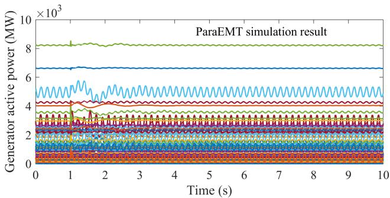  
Fig. 9. Simulation results of the generator active power on the modified 240- bus system with 100% renewable energy in the California region.

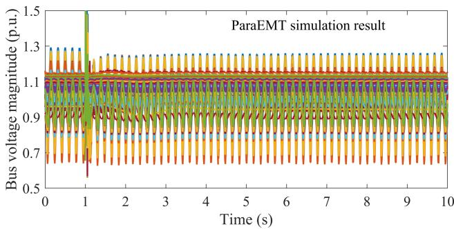  
Fig. 10. Simulation results of the bus voltage magnitude on the modified 240- bus system with 100% renewable energy in the California region.

the droop for frequency control set at 18, 5, and 3%, respectively [33]. The ParaEMT simulation captures an unstable mode induced by IBRs.

Figs. 9 and 10 show the system response simulated by ParaEMT when tripping the coal plant at Bus 1032 in the New Mexico region, which has a power output of 693 MW.

As can be observed, ParaEMT captured 5.7 Hz oscillations induced by IBR controllers among IBRs at different locations, and the oscillations can be observed in both bus voltages and active power outputs. To notice, the 5.7 Hz oscillation can be observed before the disturbance, the reason is that EMT simulations do not start directly from perfect stable conditions and need to run through initial transients before reaching the steady state, and such initial transients could excite inherent unstable modes.

Hence, these case studies validate that ParaEMT can capture both the slow electromechanical dynamics and fast subsynchronous dynamics in IBR-rich grids.

# VI. PARALLEL EMT SIMULATION LEVERAGING HPC

In this section, to investigate the performance of ParaEMT on handling large-scale system simulations, the efficiency of ParaEMT leveraging HPC is studied on a synthetic, large-scale, 10080-bus system created by connecting 6×7 replications of the 240-bus WECC system as a large array through newly added transmission lines between neighboring replications [47], as shown in Fig. 11.

The Eagle supercomputer at NREL is set as the HPC platform for the simulation tests. As a cluster comprising 2618 compute nodes connected by a high-speed, 100-Gb/s EDR InfiniBand

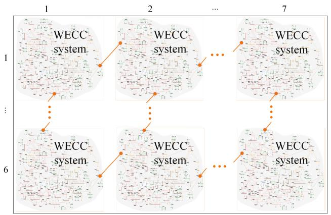  
Fig. 11. Synthetic, large-scale, 10080-bus system created by connecting 6×7 replications of the 240-bus WECC system.

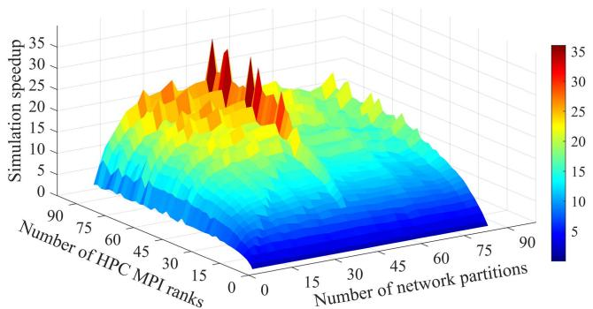  
Fig. 12. Simulation speedup under 1–84 partitions with 1–84 ranks.

network, Eagle is configured to run computationally intensive and parallel computing jobs on the Linux operating system [55].

To comprehensively investigate the performance of ParaEMT parallel simulations, a series of case studies was conducted with varying numbers of network partitions and HPC MPI ranks. The simulation speedup results are summarized in Fig. 12.

As shown in Fig. 12, when the simulation is performed with only 1 MPI rank, no speedup is achieved because the simulation is conducted in a serial manner without parallelization, regardless of the number of partitions. As more MPI ranks are used for the parallel simulations, the simulation speedup generally gradually increases before saturating.

The number of network partitions also has a significant impact on the performance. When 42 network partitions are employed, a maximum speedup of 36 is achieved. Generally, a speedup of approximately 25 to 35 can be achieved when the number of partitions is between 25 and 45.

Additionally, for the network solution, using more MPI ranks than the number of network partitions will not accelerate the computation at all. However, updating device states, device current injections, and branch historical currents may benefit from additional MPI ranks since these tasks have been fully decoupled. This explains why we see additional speed up when using more MPI ranks than partitions.

Moreover, Fig. 13 presents the average time cost required for simulating 1 s EMT dynamics using a 50-μs time step. When 28–48 network partitions are used, the simulation

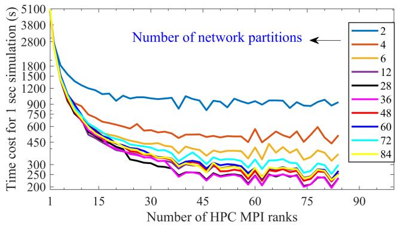  
Fig. 13. Time cost for 1 s simulation under 1–84 partitions with 1–84 ranks.

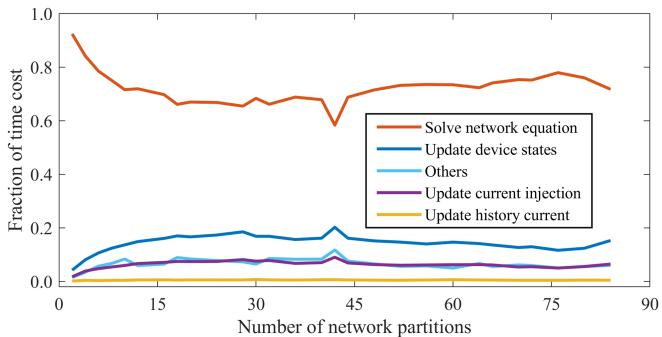  
Fig. 14. Time cost fraction of sub-tasks under 1–84 partitions with 84 ranks.

cost is only approximately 130 to 200 s, which is significantly less than the 5200 s required for a non-parallelized simulation.

Fig. 14 shows the time cost fraction of the main subtasks when 84 MPI ranks are used. The results indicate that the network solution takes more than 60% of the overall computation time and is the major limitation in achieving greater speedups. The update of historical currents takes a very low portion because the involved computation is relatively simple.

In both Figs. 13 and 14, it can be observed that the simulation time cost is saturated and may even go up when the number of partitions is increased beyond approximately 42, regardless of the number of MPI ranks used. This is because the number of non-zeros in the BBD corner matrix increases with dimension of the corner matrix, and with the number of partitions, as shown in Fig. 15. With the increase of non-zeros in this corner matrix, the computational cost of the synchronization process within the BBD-based parallelization increases, and eventually undermines the benefits brought by parallel simulation. This phenomenon also explains the unusually good results for 42 partitions.

Fig. 16 demonstrates the simulation speedup of the main subwork. As shown, the naturally decoupled tasks—including update of device states, update of device current injections, and update of branch historical currents—could achieve very large speedups. Also, the speedup of the network solution reaches its maximum value of approximately 20 and then becomes almost saturated. This underscores the importance of addressing the network solution as a bottleneck in EMT simulations that limits their speed.

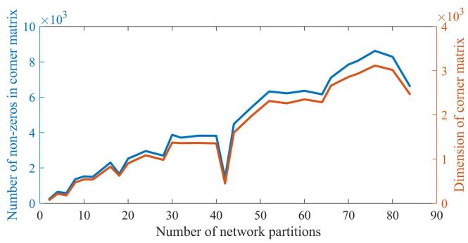  
Fig. 15. Information of BBD corner matrix under 1–84 network partitions.

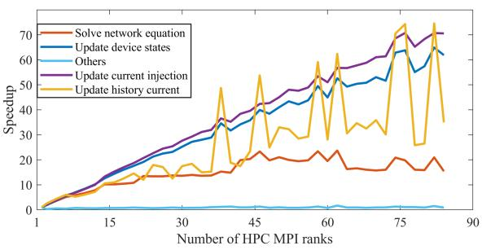  
Fig. 16. Speedup of subtasks under 42 partitions with 1–84 ranks.

Another practical problem is how to address the impact of saving and outputting a substantial volume of data. Obviously, this increases the overall time costs. This problem is not well considered in this work because our primary purpose was to establish the computational scalability of the algorithms. As such, the implementation of saving results in ParaEMT is rather straightforward by syncing the necessary data to a single MPI rank which writes out the results at the end of the run. The dominant cost of this is writing the files to a disk at the end of the simulation. This can be improved in future development using HPC oriented packages which allow parallel input/output operations, such as H5py [56], which is a Python package that uses MPI to handle writing terabytes of data. Such a solution would remove the need to sync the data to a single MPI rank while also enabling checkpointing of long-time simulations.

# VII. CONCLUSION

This paper developed an open-source, parallelizable, and HPC-compatible EMT simulator, ParaEMT, that incorporates several common power system models for simulating the EMT dynamics of large-scale IBR-rich power grids. The accuracy of ParaEMT is validated through case studies on the 240-bus WECC system against the commercial software PSCAD. A 100% renewable energy case in the California region has been developed and corroborates that ParaEMT is capable of capturing both slow electromechanical dynamics and fast electromagnetic dynamics.

Decomposing and parallelizing network solutions based on the BBD matrix formulation as well as parallelizing updates of device states and historical currents are enabled in ParaEMT to improve the simulation efficiency. Tests on NREL’s HPC

Eagle demonstrate significant speedups by factors of 25–36 on a synthetic 10080-bus system.

Future work will focus on: (1) improving the efficiency of the parallel network solution by investigating approaches to minimize the total number of nonzero elements in the LU matrices; (2) incorporating more detailed grid-following and grid-forming IBR models for EMT studies; (3) implementing more fault modeling in addition to the existing generator loss and control reference step changes; (4) implementing the parallel simulation strategy based on network decoupling using distributed model transmission lines; (5) improving efficiency for saving and outputting a substantial volume of data. In addition, as an open-source tool, any suggestions and bug reports about ParaEMT are welcome.

# VIII. CODE AVAILABILITY

The parallelizable and HPC-compatible EMT simulator, ParaEMT, developed and used in the current study is available in GitHub:

http://github.com/NREL/ParaEMT_public

# ACKNOWLEDGMENT

The U.S. Government retains and the publisher, by accepting the article for publication, acknowledges that the U.S. Government retains a nonexclusive, paid-up, irrevocable, worldwide license to publish or reproduce the published form of this work, or allow others to do so, for U.S. Government purposes. The views expressed herein do not necessarily represent the views of the U.S. Department of Energy or the United States Government.

A portion of the research was performed using computational resources sponsored by the Department of Energy’s Office of Energy Efficiency and Renewable Energy and located at the National Renewable Energy Laboratory.

# APPENDIX

TABLE IV COMPANION CIRCUIT PARAMETERS OF COMMON BRANCHES   

<table><tr><td>Branch Type</td><td>\( R_{eq} \)</td><td>a</td><td>b</td></tr><tr><td>L</td><td>\( \frac{2L}{\Delta t} \)</td><td>1</td><td>\( \frac{\Delta t}{2L} \)</td></tr><tr><td>C</td><td>\( \frac{\Delta t}{2C} \)</td><td>-1</td><td>\( \frac{-2C}{\Delta t} \)</td></tr><tr><td>R-L</td><td>\( R + \frac{2L}{\Delta t} \)</td><td>\( \frac{2L - \Delta tR}{2L + \Delta tR} \)</td><td>\( \frac{\Delta t}{R\Delta t + 2L} \)</td></tr><tr><td>R||L</td><td>\( \frac{2LR}{\Delta tR + 2L} \)</td><td>1</td><td>\( \frac{\Delta tR - 2L}{2LR} \)</td></tr><tr><td>R-C</td><td>\( R + \frac{\Delta t}{2C} \)</td><td>\( \frac{2CR - \Delta t}{2CR + \Delta t} \)</td><td>\( \frac{-2C}{2CR + \Delta t} \)</td></tr><tr><td>R||C</td><td>\( \frac{\Delta tR}{\Delta t + 2CR} \)</td><td>-1</td><td>\( \frac{\Delta t - 2CR}{\Delta tR} \)</td></tr><tr><td rowspan="2">R-(L||Rp)</td><td rowspan="2">\( R + \frac{1}{\frac{\Delta t}{2L} + \frac{1}{Rp}} \)</td><td>\( 1 - R(\frac{\Delta t}{2L} - \frac{1}{Rp}) \)</td><td>\( \frac{\Delta t}{2L} - \frac{1}{Rp} \)</td></tr><tr><td>\( 1 + R(\frac{\Delta t}{2L} + \frac{1}{Rp}) \)</td><td>\( 1 + R(\frac{\Delta t}{2L} + \frac{1}{Rp}) \)</td></tr></table>

# REFERENCES

[1] NERC, Reliability Guideline: Electromagnetic transient Modeling For BPS-connected Inverter-Based Resources—Recommended Model Requirements and Verification Practices, Atlanta, CA, USA: NERC, 2023.   
[2] Y. Cheng et al., “Real-world subsynchronous oscillation events in power grids with high penetrations of inverter-based resources,” IEEE Trans. Power Syst., vol. 38, no. 1, pp. 316–330, Jan. 2023.   
[3] S. Dong et al., “Analysis of November 21, 2021, Kauai Island power system 18-20 Hz oscillations,” 2023, arXiv:2301.05781v2.   
[4] L. Fan et al., “Real-world 20-hz IBR subsynchronous oscillations: Signatures and mechanism analysis,” IEEE Trans. Energy Convers., vol. 37, no. 4, pp. 2863–2873, Dec. 2022.   
[5] Y. Song, Y. Chen, S. Huang, Y. Xu., Z. Yu, and J. R. Marti, “Fully GPUbased electromagnetic transient simulation considering large-scale control systems for system-level studies,” IET Gener., Transmiss., Distrib., vol. 11, no. 11, pp. 2840–2851, Jul. 2017.   
[6] J. Mahseredjian, V. Dinavahi, and J. A. Martinez, “Simulation tools for electromagnetic transients in power systems: Overview and challenges,” IEEE Trans. Power Del., vol. 24, no. 3, pp. 1657–1669, Jul. 2009.   
[7] A. Hoke, V. Gevorgian, S. Shah, P. Koralewicz, R. W. Kenyon, and B. Kroposki, “Island power systems with high levels of inverter-based resources: Stability and reliability challenges,” IEEE Electrific. Mag., vol. 9, no. 1, pp. 74–91, Mar. 2021.   
[8] S. Subedi et al., “Review of methods to accelerate electromagnetic transient simulation of power systems,” IEEE Access, vol. 9, pp. 89714–89731, 2021.   
[9] B. Bruned, P. Rault, S. Dennetière, and I. M. Martins, “Use of efficient task allocation algorithm for parallel real-time EMT simulation,” Electric Power Syst. Res., vol. 189, Dec. 2020, Art. no. 106604.   
[10] B. Bruned, S. Dennetière, J. Michel, M. Schudel, J. Mahseredjian, and N. Bracikowski, “Compensation method for parallel real-time EMT studies,” Electric Power Syst. Res., vol. 198, Sep. 2021, Art. no. 107341.   
[11] A. Abusalaha, O. Saadb, J. Mahseredjiana, U. Karaagacc, L. Gerin-Lajoieb, and I. Kocara, “CPU based parallel computation of electromagnetic transients for large power grids,” Electric Power Syst. Res., vol. 162, pp. 57–63, May 2018.   
[12] D. M. Falcao, E. Kaszkurewicz, and H. L. S. Almeida, “Application of parallel processing techniques to the simulation of power system electromagnetic transients,” IEEE Trans. Power Syst., vol. 8, no. 1, pp. 90–96, Feb. 1993.   
[13] S. Fan, H. Ding, A. Kariyamasam, and A. M. Gole, “Parallel electromagnetic transients simulation with shared memory architecture computers,” IEEE Trans. Power Del., vol. 33, no. 1, pp. 239–247, Feb. 2018.   
[14] J. K. Debnath, W. K. Fung, A. M. Gole, and S. Filizadeh, “Simulation of large-scale electrical power networks on graphics processing units,” in Proc. IEEE Elect. Power Energy Conf., 2011, pp. 199–204.   
[15] W. Wu, P. Li, X. Fu, Z. Wang, J. Wu, and C. Wang, “GPU-based power converter transient simulation with matrix exponential integration and memory management,” Int. J. Elect. Power Energy Syst., vol. 122, Nov. 2020, Art. no. 106186.   
[16] N. Lin and V. Dinavahi, “Variable time-stepping modular multilevel converter model for fast and parallel transient simulation of multiterminal DC grid,” IEEE Trans. Ind. Electron., vol. 66, no. 9, pp. 6661–6670, Sep. 2019.   
[17] J. K. Debnath, A. M. Gole, and W. K. Fung, “Graphics-processing-unitbased acceleration of electromagnetic transients simulation,” IEEE Trans. Power Del., vol. 31, no. 5, pp. 2036–2044, Oct. 2016.   
[18] Z. Zhou and V. Dinavahi, “Parallel massive-thread electromagnetic transient simulation on GPU,” IEEE Trans. Power Del., vol. 29, no. 3, pp. 1045–1053, Jun. 2014.   
[19] Y. Chen and V. Dinavahi, “FPGA-based real-time EMTP,” IEEE Trans. Power Del., vol. 24, no. 2, pp. 892–902, Apr. 2009.   
[20] X. Ma, C. Yang, X. P. Zhang, Y. Xue, and J. Li, “Real-time simulation of power system electromagnetic transients on FPGA using adaptive mixed-precision calculations,” IEEE Trans. Power Syst., vol. 38, no. 4, pp. 3683–3693, Jul. 2023.   
[21] L. F. Pak, M. O. Faruque, X. Nie, and V. Dinavahi, “A versatile clusterbased real-time digital simulator for power engineering research,” IEEE Trans. Power Syst., vol. 21, no. 2, pp. 455–465, May 2006.   
[22] Y. Chen and V. Dinavahi, “Multi-FPGA digital hardware design for detailed large-scale real-time electromagnetic transient simulation of power systems,” IET Gener. Transmiss. Distrib., vol. 7, no. 5, pp. 451–463, May 2013.   
[23] M. D. Heffernan, K. S. Turner, J. Arrillaga, and C. P. Arnold, “Computation of AC-DC system disturbances: Part I, II, and III,” IEEE Trans. Power App. Syst., vol. PAS–100, no. 11, pp. 4341–4363, Nov. 1981.

[24] Y. Zhang, A. Gole, W. Wu, B. Zhang, and H. Sun, “Development and analysis of applicability of a hybrid transient simulation platform combining TSA and EMT elements,” IEEE Trans. Power Syst., vol. 28, no. 1, pp. 357–366, Feb. 2013.   
[25] Q. Huang and V. Vittal, “Advanced EMT and phasor-domain hybrid simulation with simulation mode switching capability for transmission and distribution systems,” IEEE Trans. Power Syst., vol. 33, no. 6, pp. 6298–6308, Nov. 2018.   
[26] Y. Song, Y. Chen, Z. Yu, S. Huang, and C. Shen, “CloudPSS: A high performance power system simulator based on cloud computing,” Energy Rep, vol. 6, no. 9, pp. 1611–1618, Dec. 2020.   
[27] R. C. Green, L. Wang, and M. Alam, “Applications and trends of high performance computing for electric power systems: Focusing on smart grid,” IEEE Trans. Smart Grid, vol. 4, no. 2, pp. 922–931, Jun. 2013.   
[28] J. Zhang, L. Razik, S. H. Jakobsen, S. D’Arco, and A. Benigni, “An opensource many-scenario approach for power system dynamic simulation on HPC clusters,” Electronics, vol. 10, no. 11, Jan. 2021, Art. no. 1330.   
[29] Y. Liu, R. Huang, W. Du, A. Singhal, and Z. Huang, “High-performance transmission and distribution co-simulation with 10,000+ inverter-based resources,” in Proc. IEEE Ind. Appl. Soc. Annu. Meeting, 2022, pp. 1–5.   
[30] W. Wang, X. Fang, H. Cui, F. Li, Y. Liu, and T. J. Overbye, “Transmission and-distribution dynamic co-simulation framework for distributed energy resource frequency response,” IEEE Trans. Smart Grid, vol. 13, no. 1, pp. 482–495, Jan. 2022.   
[31] ParaEMT GitHub repository. Accessed: Oct. 10, 2023. [Online]. Available: http://github.com/NREL/ParaEMT_public   
[32] H. W. Dommel, EMTP Theory Book. Portland, OR, USA: Bonneville Power Admin., 1986.   
[33] P. Pourbeik, “Model user guide for generic renewable energy system models,” Elect. Power Res. Inst., Palo Alto, CA, USA, Tech. Rep. EPRI 3002006525, 2015.   
[34] B. Wang, R. W. Kenyon, and J. Tan, “Developing a PSCAD model of the reduced 240-bus WECC test system,” Nat. Renewable Energy Lab., Golden, CO, USA, Tech. Rep. NREL/CP-6A40-82287, Apr. 2022.   
[35] H. Yuan, R. S. Biswas, J. Tan, and Y. Zhang, “Developing a reduced 240-bus WECC dynamic model for frequency response study of high renewable integration,” in Proc. IEEE/PES Transm. Distrib. Conf. Expo., 2020, pp. 1–5.   
[36] C. W. Ho, A. Ruehli, and P. Brennan, “The modified nodal approach to network analysis,” IEEE Trans. Circuits Syst., vol. 22, no. 6, pp. 504–509, Jun. 1975.   
[37] J. Mahseredjian and F. Alvarado, “Creating an electromagnetic transients program in MATLAB: MatEMTP,” IEEE Trans. Power Del., vol. 12, no. 1, pp. 380–388, Jan. 1997.   
[38] H. Haneda, T. Maruhashi, and S. Kusumoto, “Digital simulation of thyristor circuits via tableau approach,” Trans. Inst. Elect. Engineers Jpn., vol. 99-B, no. 7, pp. 433–440, 1979.   
[39] G. Hachtel, R. Brayton, and F. Gustavson, “The sparse tableau approach to network analysis and design,” IEEE Trans. Circuit Theory, vol. 18, no. 1, pp. 101–113, Jan. 1971.   
[40] F. Alvarado, “Eliminating numerical oscillations in trapezoidal integration,” EMTP Newslett., vol. 2, no. 3, pp. 20–32, Feb. 1982.   
[41] N. Watson and J. Arrillaga, Power Systems Electromagnetic Transients Simulation. Stevenage, U.K.: IET, 2003.   
[42] Siemens Power Technologies International, PSS/E Model Library PSSE/34.4, Apr. 2018.   
[43] L. Wang et al., “Methods of interfacing rotating machine models in transient simulation programs,” IEEE Trans. Power Del., vol. 25, no. 2, pp. 891–903, Apr. 2010.   
[44] T. Noda and K. Takenaka, “A practical steady-state initialization method for electromagnetic transient simulations,” in Proc. Int. Conf. Power Syst. Transients, 2011, pp. 1–7.   
[45] L. Gérin-Lajoie and J. Mahseredjian, “Simulation of an extra large network in EMTP: From electromagnetic to electromechanical transients,” in Proc. Int. Conf. Power Syst. Transients, 2009, pp. 2–6.   
[46] Y. Chen, Y. Song, S. Huang, Z. Yu, and W. Wei, “GPU-based techniques of parallel electromagnetic transient simulation for large-scale distribution network,” Automat. Electric Power Syst., vol. 41, no. 19, pp. 82–88, Oct. 2017.   
[47] L. Zhang, B. Wang, X. Zheng, W. Shi, P. R. Kumar, and L. Xie, “A hierarchical low-rank approximation based network solver for EMT simulation,” IEEE Trans. Power Del., vol. 36, no. 1, pp. 280–288, Feb. 2021.   
[48] F. Nielsen, Introduction to HPC With MPI For Data Science. Berlin, Germany: Springer, 2016.   
[49] B. V. Protopopov and A. Skjellum, “A multithreaded message passing interface (MPI) architecture: Performance and program issues,” J. Parallel Distrib. Comput., vol. 61, no. 4, pp. 449–466, Apr. 2001.

[50] M. Rogowski, S. Aseeri, D. Keyes, and L. Dalcin, “mpi4py.Futures: MPI-based asynchronous task execution for Python,” IEEE Trans. Parallel Distrib. Syst., vol. 34, no. 2, pp. 611–622, Feb. 2023.   
[51] J. W. Demmel et al., “A supernodal approach to sparse partial pivoting,” SIAM J. Matrix Anal. Appl., vol. 20, no. 3, pp. 720–755, 1999.   
[52] SciPy. Accessed: Sep. 21, 2023. [Online]. Available: https://scipy.org   
[53] Numba. Accessed: Sep. 12, 2023. [Online]. Available: https://numba. pydata.org   
[54] NumPy. Accessed: Sep. 18, 2023. [Online]. Available: https://numpy.org   
[55] Eagle Computing System. Accessed: Jun. 29, 2023. [Online]. Available: https://www.nrel.gov/hpc/eagle-system.html   
[56] HDF5 for Python. Accessed: Sep. 18, 2023. [Online]. Available: https: //www.h5py.org

Min Xiong (Student Member, IEEE) received the B.S. and M.S. degrees in electrical engineering from Wuhan University, Wuhan, China, in 2013 and 2016, respectively. He is currently working toward the Ph.D. degree with the Department of Electrical Engineering and Computer Science, University of Tennessee, Knoxville, TN, USA. From 2016 to 2019, he was an Engineer with the State Grid Hubei Power Supply Company. He is also a Graduate Researcher with National Renewable Energy Laboratory, Golden, CO, USA. His research interests include electrical param-

eter measurement, power system simulation, transient stability analysis, relay protection, and integration of renewable resources.

Bin Wang (Senior Member, IEEE) received the B.S. and M.S. degrees in electrical engineering from Xi’an Jiaotong University, Xi’an, China, in 2011 and 2013, respectively, and the Ph.D. degree in electrical engineering from the University of Tennessee, Knoxville, TN, USA, in 2017. He is currently an Assistant Professor with the Department of Electrical and Computer Engineering, The University of Texas at San Antonio (UTSA), San Antonio, TX, USA. Before joining UTSA, he worked in various roles with ISO New England, Texas A&M University, and National

Renewable Energy Laboratory. His research interests include the oscillation and stability analysis of renewable-rich power grids, and power system transient stability and electromagnetic transient simulations.

Deepthi Vaidhynathan (Senior Member, IEEE) received the M.B.A. and M.S. degrees in electrical, computer, and energy from the University of Colorado at Boulder, Boulder, CO, USA. She is currently a Senior Researcher with the Computational Science Center, National Renewable Energy Laboratory, Golden, CO. Her research interests include in energy system integration, grid modeling and simulation, and performance optimization for scientific software.

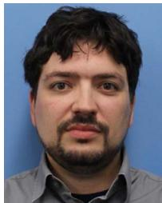

Jonathan Maack received the B.S. and M.S. degrees from the Colorado School of Mines in Applied and Computational Mathematics, Golden, CO, USA, in 2008 and 2009, respectively, and the Ph.D. degree in applied mathematics from the University of Massachusetts Amherst, Amherst, MA, USA, in 2018. From 2008 to 2013, he was a Software Engineer with Lockheed Martin, Bethesda, MD, USA. He is currently an Applied and Computational Mathematics Researcher with the Computational Science Center, National Renewable Energy Lab. His research in-

terests include complex systems modeling and simulation, parallel algorithm development, optimization under uncertainty, and uncertainty quantification.

Matthew J. Reynolds received the Ph.D. degree in applied mathematics from the University of Colorado Boulder, Boulder, CO, USA, in 2012. He is currently an Applied Mathematics Researcher with the Computational Science Center, National Renewable Energy Laboratory, Golden, CO, USA. His research interests include computational harmonic analysis, uncertainty quantification, machine learning, and optimization under uncertainty.

Andy Hoke (Senior Member, IEEE) received the M.S. and Ph.D. degrees in electrical, computer, and energy engineering from the University of Colorado Boulder, Boulder, CO, USA, in 2016 and 2013, respectively. He is currently a Principal Engineer with the Power Systems Engineering Center, National Renewable Energy Laboratory, Golden, CO, USA, where he has worked for the past 13 years. His expertise is in the grid integration of power electronics and inverter-based renewable and distributed energy. His work includes advanced inverter controls design,

hardware-in-the-loop testing and model development, power systems modeling and simulation, and standards development. He was the Chair of IEEE 1547.1 and P2800.2, which contain the test and verification procedures to ensure DERs and inverter-based resources conform to the grid interconnection requirements of IEEE Standards 1547 and 2800, respectively. He is a registered professional Engineer in the State of Colorado.

Kai Sun (Fellow, IEEE) received the B.S. degree in automation and the Ph.D. degree in control science and engineering from Tsinghua University, Beijing, China, in 1999 and 2004, respectively. He is currently a Professor with the Department of Electrical Engineering and Computer Sciences, University of Tennessee, Knoxville, TN, USA. From 2007 to 2012, he was a Project Manager in grid operations and planning with the Electric Power Research Institute, Palo Alto, CA, USA. Dr. Sun is an Associate Editor for IEEE TRANSACTIONS ON POWER SYSTEMS and

IEEE OPEN ACCESS JOURNAL OF POWER AND ENERGY.

Jin Tan (Senior Member, IEEE) received the B.E. and Ph.D. degrees in electrical engineering from Southwest Jiaotong University, Chengdu, China, in 2007 and 2014, respectively. From 2009 to 2011, she was a visiting Ph.D. student with the Department of Energy Technology, Aalborg University, Aalborg, Denmark. In 2014, she was a Postdoctoral Researcher with the Department of Electrical Engineering and Computer Science, University of Tennessee, Knoxville, TN, USA. She is currently a Principal Engineer and a Distinguished Member of the Research Staff with the

Power Systems Engineering Center, National Renewable Energy Laboratory, Golden, CO, USA. She has more than ten years of experience in large-scale renewable integration study. Her research interests include power system stability and control with large-scale renewable integration, multi-timescale modeling and simulation of inverter-based resources in grids, and energy storage for grid applications.