# Mode Domain Multiphase Transmission Line Model - Use in Transient Studies

M.C.Tavares J.Pissolato   
UNICAMP- State University of Campinas Campinas,   
e-mail: cristina@dsce.fee.unicamp.br

C. M. Portela  
COPPE - Federal University of Rio de Janeiro  
Rio de Janeiro,  
e-mail: portela@vishnu.coep.ufrj.br  
AZIL

Abstract - This paper presents a new model to represent multiphase transmission lines in transient studies, including the frequency dependence of longitudinal parameters. The model uses the exact modes, for ideally transposed lines, and "quasi-modes" for non-transposed lines. For the latter it is necessary to have a vertical symmetry plane. The frequency dependence is represented with synthetic circuits, with one $\pi$ -circuit for each mode. The transformation matrix used for the entire frequency range is the Clarke's one and as it is a real matrix it is modeled through ideal transformers. The model is described for three-phase lines and double three-phase lines.

An application of the methodology is presented for a $440\mathrm{kV}$ single three-phase transmission line where it is made mode analysis, statistical energization and frequency scan analysis. The simulations are performed in EMTP with the proposed model and with a frequency dependent EMTP line model, the Semlyen one, supposing the line transposed and nontransposed.

Keywords: Transmission line model, frequency dependence, mode domain, transformation matrix, EMTP.

# I. INTRODUCTION

One of the main difficulties when dealing with transient simulation studies in a digital simulator program like EMTP [1] is the correct representation of transmission lines. The EMTP works in the time domain and the network elements are generally represented by their phase quantities. Nevertheless, the transmission line parameters, namely the longitudinal parameters, varies with distance and frequency.

The former can be well represented through the hyperbolic function in the distributed parameter model or through $\pi$ -circuits. To model the frequency dependence it is more

PE-430-PWRD-0-04-1998 A paper recommended and approved by the IEEE Transmission and Distribution Committee of the IEEE Power Engineering Society for publication in the IEEE Transactions on Power Delivery. Manuscript submitted August 11, 1997; made available for printing April 24, 1998.

complex, for the impedance matrix varies with frequency. As a program like EMTP works in time domain, the frequency dependence of an element is not a straight model.

It is proposed then model the lines by their modes and deal with several uncoupled cascade of $\pi$ -circuits representing the modes. Each mode circuit can have its frequency dependence fully described through synthetic circuits.

However, there is the transformation matrix, that makes the link between phase and mode domain, which also varies with frequency. In the present model it is proposed to use Clarke transformation matrix as the unique transformation matrix for the entire frequency range. As Clarke matrix is a real one, all its elements are real, it can be represented in EMTP through ideal transformers. This model can be applied to ideally transposed lines, transposed in short distance compared with a quarter of wave length, or non-transposed lines with a vertical symmetry plane. For the former this is an exact solution and for non-transposed lines this is a very good approximation, as shown.

The theory is described for a three-phase and a double three-phase line, but can also be applied for dc-lines and six-phase lines. [2]

The methodology is exemplified with a $440\mathrm{kV}$ single three-phase transmission line and it is made a validation with an established frequency dependent EMTP line model, the Semlyen method incorporated in EMTP [3]. The line is supposed both transposed and non-transposed. First the modes are analyzed, supposing a step in the generation end. Then a transient phenomena is studied, the line energization. A statistical energization is performed and the worst case is reproduced. To conclude, a frequency scan analysis is done, pointing out the differences between the two models.

# II - THREE-PHASE TRANSMISSION LINE MODEL

The proposed model is described for a three-phase transmission line. The first step is to transform the line parameters from phase domain to mode domain. This is done using Clarke transformation matrix, as shown. Later the transformation matrix itself is included in EMTP, to make the link between the network represented in phase domain and the line represented in mode domain. This is described in detail at the next items.

# 2.1 - Mode Domain

Suppose a three-phase transmission line with the ground wires already reduced, as shown in Fig. 1. Note that this line has a vertical symmetry plane. With this symmetry for non-transposed line, as is shown below, Clarke components separate two groups of modes, $\beta$ (exact mode), and other two modes represented by $\alpha -0$ components. However till if the non-transposed line has not this symmetry plane the model will still give a good approximation.

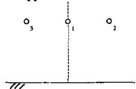  
Figure 1 - Schematic representation of a single three-phase line

Once the electrical parameters (longitudinal and transversal impedance) have been properly calculated in phase domain, the line can be represented to start the desired simulations. It is proposed then to work with mode components, or eventual good approximation of modes, in a way adequate for an easy, real and frequency independent phase-mode transformation.

The impedance matrix, in phase component, for nontransposed line with vertical symmetry plane is:

$$
\left| Z _ {p h} \right| = \left[ \begin{array}{l l l} A & D & D \\ D & B & F \\ D & F & B \end{array} \right] \tag {1}
$$

Note that due to this symmetry plane some matrix elements are equal and Clarke's [4] transformation can be applied with some advantages. The currents in the conductors are divided as shown in Fig. 2, for each component:

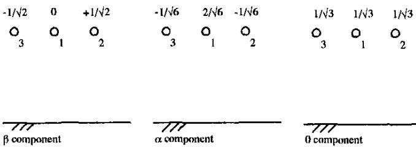  
Figure 2 - Current in the conductors, for Clarke's components, in rationalized form

Clarke transformation matrix is

$$
\left[ T _ {C l} \right] = \left[ \begin{array}{c c c} 2 / \sqrt {6} & - 1 / \sqrt {6} & - 1 / \sqrt {6} \\ 0 & 1 / \sqrt {2} & - 1 / \sqrt {2} \\ 1 / \sqrt {3} & 1 / \sqrt {3} & 1 / \sqrt {3} \end{array} \right] \tag {2}
$$

The impedance matrix in mode domain is [2]:

$$
\left| Z _ {\alpha \beta 0} \right| = \left[ Z _ {C l} \right], \left| Z _ {p h} \right|, \left[ Z _ {C l} \right] ^ {- 1} \tag {3}
$$

and

$$
\left| Z _ {\alpha \beta 0} \right| = \left[ \begin{array}{c c c} z _ {\alpha} & 0 & z _ {\alpha 0} \\ 0 & z _ {\beta} & 0 \\ z _ {0 \alpha} & 0 & z _ {0} \end{array} \right] \tag {4}
$$

where

$$
z _ {\alpha} = \frac {1}{3} (2 A + B - 4 D + F) \tag {5}
$$

$$
z _ {\beta} = B - F \tag {6}
$$

$$
z _ {\alpha 0} = z _ {0 \alpha} = \frac {\sqrt {2}}{3} \left((A - B) + (D - F)\right) \tag {7}
$$

$$
z _ {0} = \frac {1}{3} (A + 2 B + 4 D + 2 F) \tag {8}
$$

From the impedance matrix in mode domain (4) it can be seen that:

- $\beta$ is an exact mode, as there is no coupling between it and the others.   
- The same is not true for $\alpha$ and zero components because there is a coupling term $z_{\alpha(t)}$ . However, this term is formed by the difference of the self impedance terms and the difference of the mutual impedance terms.

For non-transposed lines the self impedance terms are almost the same. The mutual impedance term, although different, are also similar, and the difference is small in the frequency range of transient analysis. Therefore, the coupling term $(z_{\alpha 0})$ can be discarded and the components $\alpha$ and zero can be treated as "quasi-modes" for non-transposed lines with the restriction of a vertical symmetry plane. A more detailed analysis is presented at Appendix A.

If the line is ideally transposed, with transposition sections short when compared with a quarter of wavelength, then both self and mutual impedances terms are equal, which results in null coupling between $\alpha$ and zero components, that in this case are exact modes. For ideally transposed lines there are only two distinct modes, $\alpha$ equal $\beta$ , and zero. Any linear combination of $\alpha - \beta$ modes is also one mode, such as positive and negative components.

The line can be modeled through cascade of $\pi$ -circuits, one for each mode. The frequency dependence of longitudinal parameters can be synthesized with series and parallel resistors and inductors, as shown in Fig. 1 [5].

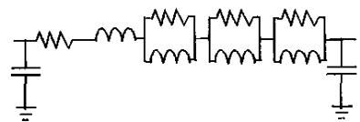  
Figure 3 - $\pi$ -circuit for a mode

# 2.2 - Transformation matrix modeling

The system represented in EMTP is generally in phase components, then there will be phase elements and mode elements, linked by the transformation matrix, as shown in Fig. 4.

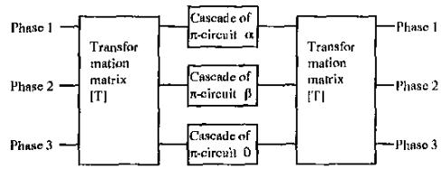  
Figure 4 - Schematic representation of three-phase line in EMTP

The transformation matrix used in the proposed model is the Clarke one. This matrix is real, that is, all its elements are real, as described in (2).

To model it a group of ideal transformers is used. They are connected in a way that they reproduce the relation between the phases and modes currents and voltages, as is presented in Figs. 5 to 7. As the matrix is composed of only real elements they can be represented by the transformers ratio and polarity. For instance, in Fig. 5, where there is the link between the phases and mode $\alpha$ , the current

$i_{\alpha} = \frac{2i_1}{\sqrt{6}} -\frac{i_2}{\sqrt{6}} -\frac{i_3}{\sqrt{6}}$ and the voltage $u_{\alpha} = \frac{2u_1}{\sqrt{6}} -\frac{u_2}{\sqrt{6}} -\frac{u_3}{\sqrt{6}}$ are described.

This can easily be implemented in a time domain program like EMTP just using simple ideal transformers, as shown.

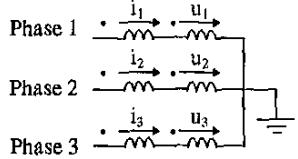

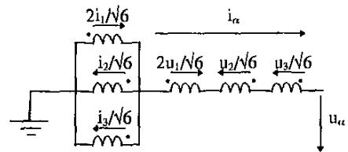

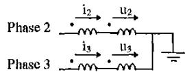  
Figure 5 - Link between phases and mode $\alpha$

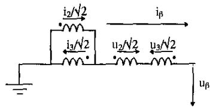  
Figure 6 - Link between phases and mode $\beta$

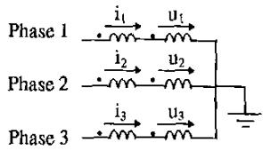

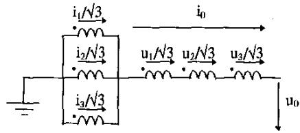  
Figure 7 - Link between phases and mode 0   
III - DOUBLE THREE-PHASE LINE MODEL

In Fig. 8 it is presented a schematic representation of a double three-phase transmission line, with it's ground wires already reduced. One line is formed by conductors 2 3 4 and the other by conductors 1 6 5. Again the vertical symmetry plane is respected for non-transposed line.

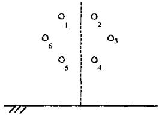  
Figure 8 - Schematic representation of a double three-phase transmission line

This line is first transformed in two uncoupled "media" and "antimedia" lines because of its geometrical properties. The currents in $\mathfrak{m} / \mathfrak{a}$ components can be written as:

$$
i _ {m 1} = \frac {1}{\sqrt {2}} \left(i _ {1} + i _ {2}\right) \quad i _ {a 1} = \frac {1}{\sqrt {2}} \left(i _ {1} - i _ {2}\right) \tag {9}
$$

$$
i _ {m 2} = \frac {1}{\sqrt {2}} \left(i _ {3} + i _ {6}\right) \quad i _ {a 2} = \frac {1}{\sqrt {2}} \left(i _ {3} - i _ {6}\right) (1 0)
$$

$$
i _ {m 3} = \frac {1}{\sqrt {2}} \left(i _ {5} + i _ {4}\right) \quad i _ {a 3} = \frac {1}{\sqrt {2}} \left(i _ {5} - i _ {4}\right) (1 1)
$$

Note that the new currents are formed by sum and difference of opposite conductors' currents [5]. The impedance matrix, in phase components for non-transposed line, can be described as:

$$
\left| Z _ {p h} \right| = \left[ \begin{array}{c c c c c c} A & D & E & C & G & H \\ D & A & H & G & C & E \\ E & H & B & J & L & M \\ C & G & J & I & N & L \\ G & C & L & N & I & J \\ H & E & M & L & J & B \end{array} \right] \tag {12}
$$

Applying the m/a transformation the impedance matrix in new components is:

$$
\left| Z _ {m a} \right| = \left[ \begin{array}{l l} \left[ Z _ {m} \right] & \left[ 0 \right] \\ \left[ 0 \right] & \left[ Z _ {a} \right] \end{array} \right] \tag {13}
$$

where

$$
\left| Z _ {m} \right| = \left[ \begin{array}{l l l} A + D & E + H & G + C \\ E + H & B + M & L + J \\ G + C & L + J & I + N \end{array} \right] \tag {14}
$$

$$
\left| Z _ {a} \right| = \left[ \begin{array}{c c c} A - D & E - H & G - C \\ E - H & B - M & L - J \\ G - C & L - J & I - N \end{array} \right] \tag {15}
$$

The double three-phase line has been separated in two uncoupled three-phase lines, the "media" and the "antimedia" ones [6]. Note that up to now no approximation has been made. Any power system program could represent a double three-phase line (matrix order 6) by two uncoupled lines, just representing the media/antimedia through ideal transformers that will sum and make difference of voltages and currents.

If the double three-phase line is transposed in a way that each circuit is completely transposed, but there is a coupling between both circuits, then Clarke transformation matrix can be applied to the m/a components, resulting in:

$$
\left| Z m _ {\alpha \beta 0} \right| = \left[ \begin{array}{c c c} A - H & 0 & 0 \\ 0 & A - H & 0 \\ 0 & 0 & A + 3 D + 2 H \end{array} \right] \tag {16}
$$

$$
\left| Z a _ {a \phi 0} \right| = \left[ \begin{array}{c c c} \frac {3 A - 8 D + 5 H}{3} & 0 & \frac {2 \sqrt {2}}{3} (D - H) \\ 0 & A - H & 0 \\ \frac {2 \sqrt {2}}{3} (D - H) & 0 & \frac {3 A - D - 2 H}{3} \end{array} \right] \tag {17}
$$

For the media "line" the modes are exact, while for the antimedia one there is a coupling term between "α" and "0" quasi-modes, just like the non-transposed three-phase line.

# IV - SINGLE THREE-PHASE LINE APPLICATION

In Fig. 9 it is presented the data of the three-phase line used to illustrate the model.

The line parameters were calculated in the range of $10\mathrm{Hz}$ to $10\mathrm{kHz}$ . As it is a single line, to represent its modes (exact ones for transposed line and quasi-modes for non-transposed line) it was applied Clarke's transformation matrix, as explained. With the longitudinal and transversal impedance in mode domain, the synthetic circuits were calculated. It is one cascade of $\pi$ -circuits for each mode, each representing $10\mathrm{km}$ length. The line was modeled in ATP, with the transformation matrix real and frequency independent represented through ideal transformers.

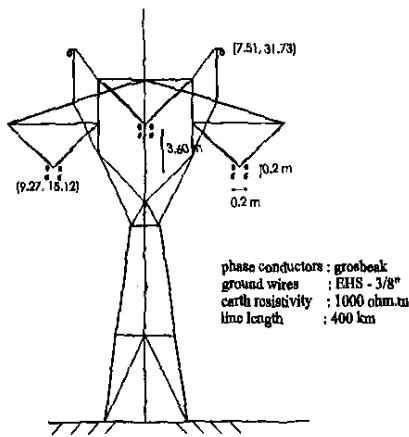  
Figure 9 - Schematic representation of the $440\mathrm{kV}$ tree-phase line

The line was treated as transposed and non-transposed. It was also represented using Semlyen internal EM'P model. Four tests were then applied.

# 4.1 - The Modes

To analyze the mode behavior, an ideal retangular pulse of $1\mathrm{V}$ , $1\mathrm{ms}$ was applied for each of the three modes $\alpha$ , $\beta$ and zero. The reception end was opened. Some results are presented in Figs 10 to 14 for transposed and non-transposed for both quasi-mode and Semlyen model.

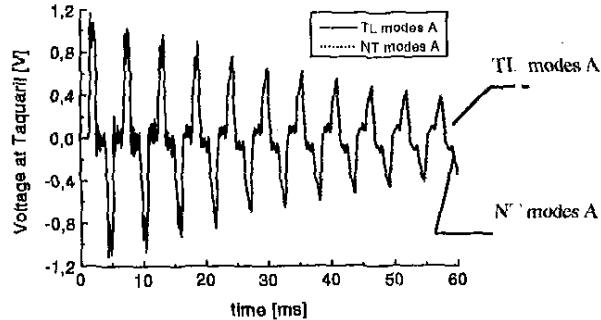  
Figure 10 - Step response for mode $\beta$ for Quasi-mole model for transposed and non-transposed line

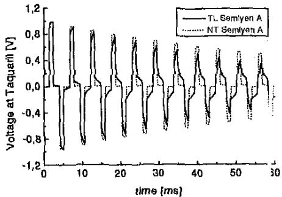  
Figure 11 - Step response for mode $\beta$ for Semlyen model for transposed and non-transposed line

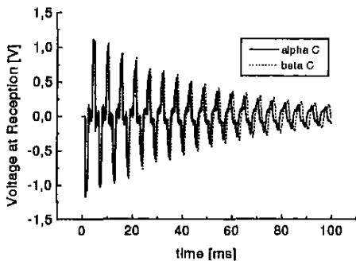  
Figure 12 - Step response for mode $\alpha$ and $\beta$ for Quasi-model model for non-transposed line

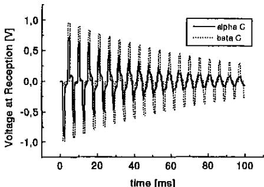  
Figure 13 - Step response for mode $\alpha$ and $\beta$ for Semlyen model for non-transposed line

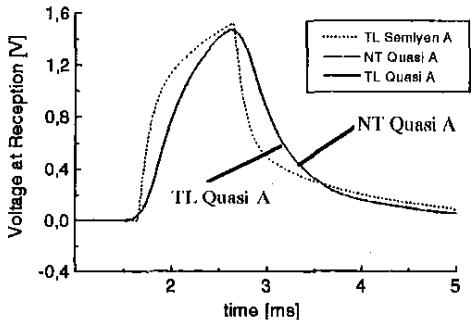  
Figure 14 - Step response for zero mode

It is expected that:

- the mode $\beta$ is an exact one, for both transposed and nontransposed line. This mode is not the same, but very similar, for the two lines. The distinction between them is the difference between the self terms for transposed and nontransposed line and the difference between the mutual terms for both lines, that are very small.   
- the mode $\alpha$ and zero are quasi-modes for non-transposed line and exact modes for transposed line. Again the difference among these modes for both lines should not be very high.   
- modes $\alpha$ and $\beta$ should be equal for the transposed lines and, although different, should be similar for non-transposed lines.

Analyzing the results it can be seen that the proposed model has a very good mode performance, which can be due to the very accurate frequency dependence representation.

Note that the $\beta$ mode for both lines is almost equal for the quasi-mode model while this does not happen with Semlyen. The same happened with modes $\alpha$ and zero.

The modes $\alpha$ and $\beta$ for quasi-mode model are quite the same, but for Semlyen method they are rather different. This is explained by the more precise longitudinal parameters representation, as will be shown later in the frequency domain analysis.

# 4.2 - Statistical Energization

To verify the performance of the model for a transient phenomenon, a statistical energization study was realized. To have a strict basis for comparison a 200 shots switching with the same seed was done. The line was opened at the reception end. The generation equivalent system used was :

base power : 170 MVA; $\mathbf{U}_{\text {generator }}: 0.95 \mathrm{pu}; \mathbf{X}(\text { generator }+$ transformer): 0,3618 pu; X/R: 11.4; $\mathbf{X}_{+} / \mathbf{X}_{0}: 4.41$

The results for the transposed line should be similar for both models, while, for non-transposed line, as the mode behavior showed so much differences, they are not expected so similar. In Figs. 15 and 16 the results for transposed and non-transposed lines are shown.

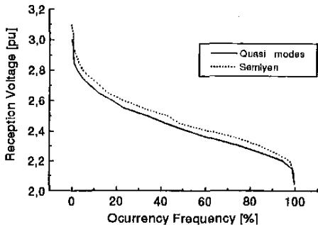  
Figure 15 - Statistical energization of transposed line for both models (200 shots, same seed)

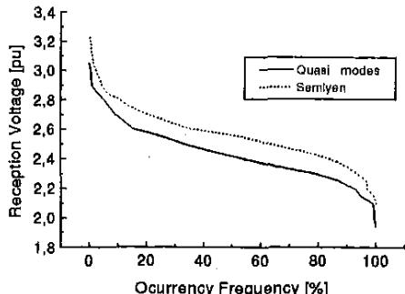  
Figure 16 - Statistical energization of non-transposed line for both models (200 shots, same seed)

Note that for both lines there are differences between the models. The proposed model results in lower maximum

values around 0.1 pu for transposed line and 0.2 pu for nontransposed line. For the latter, this is a notable difference that can affect an optimized line project and its costs.

The difference for the non-transposed line was expected from the mode analysis. Also, from the zero mode response (Fig. 14) some discrepancies were awaited for the transposed line.

# 4.3 - Single Energization

The worst energization case was reproduced for both models in Figs. 17 and 18.

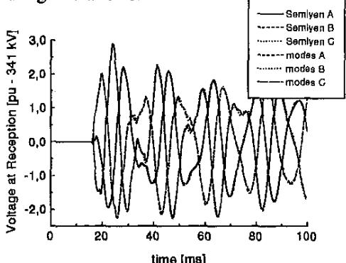  
Figure 17 - Energization of transposed line

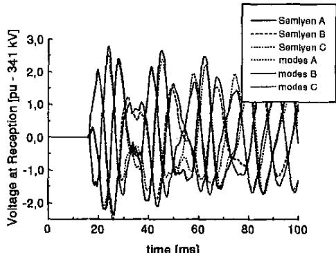  
Figure 18 - Energization of non-transposed line

The wave forms are similar, but the proposed model has lower results for both lines.

# 4.4 - Frequency Scan Analysis

In order to identify the reason for such different results a frequency scan analysis was performed for both models. The sending terminal had a $1\mathrm{V}$ source and the receiving end was opened. The relation between the line ends were analyzed in the range of $10\mathrm{Hz}$ to $10\mathrm{kHz}$ . An exact calculation, in what concerns the aspects compared in the paper, was also realized so the models could be more properly confronted, as shown in Figs 19 and 20. This so called exact calculation was performed by computing the line quadripole for each

frequency in mode domain and obtaining the exact eigenvectors to transform the mode quantities into phase.

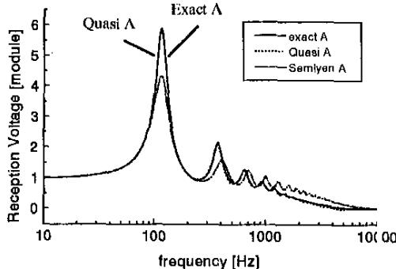  
Figure 19 - Zero sequence - Transposed line

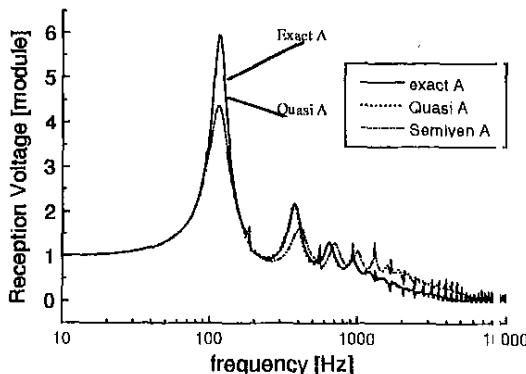  
Figure 20 - Zero sequence - Non-transposed line

The results for the positive sequence were quite the same for both models and lines. However, for the zero sequence, for which the proposed model was more precise, the curves for exact and quasi modes are quite coincident. This can explain the results obtained in the previous sections, where some differences were found between the models. As the zero sequence is synthesized it can be made very precise.

It can be said then that the use of Clarke transformation matrix as the unique transformation matrix, constant for the entire frequency range, has a good response, even better than the use of a single transformation matrix calculated for a single frequency chosen "a priori".

A detailed comparison has been done, in frequency domain, of quasi-mode model, and a constant transformation matrix, equal to the matrix for a previously chosen frequency (in ATP Semlyen model). For typical frequency spectrum of switching transients, the quasi-mode method is a better average, avoiding the "amplification" of a particular frequency behavior, that can happen with a single frequency.

Of course, for some particular conditions, a frequency analysis may be justified, but, anyhow, avoiding one "a priori" and somehow arbitrary choice of a particular frequency.

# V - CONCLUSIONS

This paper presents a new model to represent multiphase transmission lines including the frequency dependence of longitudinal parameters. The model uses the exact modes, for ideally transposed lines, and quasi-modes for nontransposed lines, the last with a vertical symmetry plane.

The longitudinal impedance is represented in the mode domain through synthetic circuits, and the frequency dependence can be modeled with high accuracy. The line is represented through cascade of $\pi$ -circuits, one for each mode.

For double three-phase lines, taking advantage of the line geometry, it is made a former transformation from phase to media/antimedia components, transforming the double circuits in two uncoupled three-phase "lines". For transposed circuits with a coupling among the two circuits, Clarke transformation can be applied, obtaining 6 quasi-modes that can be represented through cascade of $\pi$ -circuits. Again the transformation matrices used are real and frequency independent.

For a single three-phase line only Clarke transformation is necessary to obtain quasi-modes for a non-transposed line with a vertical symmetry plane or exact modes for ideally transposed lines. The later does not have to respect this symmetry.

The important contribution of this paper is the representation of the transformation matrix. It was modeled in a time domain program like EMTP using ideal transformers. As the matrix elements are real ones they can be represented by ideal transformers, with adequate ratio and polarity. It is shown that Clarke transformation can be used for the entire frequency spectrum of a transient study as the unique transformation matrix. This is an exact solution for transposed line and a good approximation for nontransposed lines with a vertical symmetry plane.

It was observed that for the non-transposed line with a vertical symmetry plane, for typical switching transients with a large frequency spectrum, in most cases, the use of Clarke transformation matrix has a better result than the use of a single transformation matrix calculated for a single frequency chosen "a priori". This can be explained by the fact that Clarke's transformation matrices conduct to good averages, avoiding the amplification of a particular frequency behavior.

The methodology was exemplified with a $440\mathrm{kV}$ single three-phase transmission line and it was made a comparison with an established frequency dependent EMTP line model, the Semlyen method incorporated in EMTP. The line was supposed both transposed and non-transposed. First the modes were analyzed, supposing a step in the generation end. Then a transient phenomena was studied, the line energization. A statistical energization was performed and the worst case was reproduced. To conclude, a frequency

scan analysis was done, pointing out the differences between the two models.

It could be seen that the proposed model had a very precise representation of the modes, as shown in the frequency scan analysis. For the transposed line the two modes, $\alpha$ and $\beta$ , are the same as could be seen with both models. But, for non-transposed line, $\beta$ is an exact mode and "α" a quasi-mode. In examples presented, with quasi-modes, the "α" and $\beta$ have different, but similar behavior. With Semlyen model, the difference between the two corresponding modes is much higher. The difference between homopolar mode, or zero sequence mode, in proposed model and in Semlyen model, for non-transposed lines, is also important.

For the energization cases again the transposed line had very similar results for both models, what did not happen with non-transposed line, reinforcing the differences between the models. The quasi-mode model had lower maximum values, around 0.2 pu.

This can be explained by the better representation of the zero sequence mode in the quasi-mode model, as verified at the frequency scan analysis. The positive sequence had similar response for both models and lines.

In typical large frequency spectrum transient conditions, for several examples, with non-transposed lines, results obtained, with proposed method and with Semlyen method, have shown important differences. For some examples analyzed with detail, the proposed method has shown some advantages.

# VI - APPENDIX

The main assumption of the proposed model is that, for non-transposed lines with a vertical symmetry plane, the coupling term between quasi-modes $\alpha$ and zero could be discarded. This can only be achieved if the self impedance terms are similar and also the mutual impedance terms.

Usually, the height of the phases are similar, but the horizontal distance among them can vary from $2:1$ between the external phases and two adjacent ones. Analyzing the impedance formulation, for the self terms, this results in almost the same values. However, for the mutual terms there is a difference that is not in the same ratio $2:1$ . The mutual impedance is calculated by the sum of the external impedance (in this example 1.93) and the earth contribution (almost equal), that dominates for lower frequencies.

In Fig. A.1 it is shown the self and mutual impedance modulus.

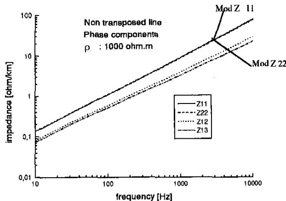  
Figure A.1 - Impedance modulus in phase domain

In Fig A.2 it is shown the quasi-modes impedance modulus and the coupling term. It can be seen that this term is lower than $10\%$ of "alpha" mode. Therefore this coupling term can be discarded as done in the proposed model, with a small error accepted.

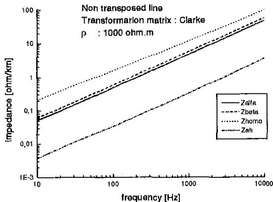  
Figure A.2 - Impedance modulus in mode domain

# VII - REFERENCES

[1] H.W. Dommel, "Electromagnetic Transients Program - Rule Book", Oregon, 1984.   
[2] M.C. Tavares, J. Pissolato and C.M. Portela, “Quasi-Modes Multiphase Transmission Line Model”, 2nd International Power System Conference, Seattle, USA, 1997.   
[3] A. Semlyen, "Stability Analysis and Stabilizing Procedure for a Frequency Dependent Line Model", IEEE Transactions on PAS, Vol PAS-103, No 12, December 1984, pp 3579-3586.

[4] E. Clarke, "Circuit Analysis of AC Power S/stems", Volume I, Wiley, New York, 1950.   
[5] C.M. Portela and M.C. Tavares, "Six Phase Transmission Line - Propagation Characteristics and New Three-Phase Representation", IEEE Transactions on Power Delivery, Vol. 8, No 3, July 1993, pp 1470-1483.   
[6] C.M. Portela, M.C. Tavares and R.M. Azevedo, “A New Line Representation for Transient Studies - Application to a Six Phase Transmission Line”, 8th International Symposium on High Voltage Engineering (ISH), Yokohama, Japan, 1993, pp 245-248.

# VIII-BIOGRAPHIES

Maria C. Tavares Electrical engineering (1984) a: UFRJ - Federal University of Rio de Janeiro, Brazil, M.Sc. (1991) at COPPE/UFRJ. Worked as consulting engineering in consulting firms, with power systems analysis, HVDC studies (developed at ABB Power Systems, Sweden), models development at EMTP and electrical transmission planning. She developed DESTRO, a graphical preprocessor for ATP. At the present is finishing her D.Sc. at Campiras State University, São Paulo, and working as a research professor at São Paulo University. Her main research interests are power system analysis, long distance transmission and computer application to analysis of power systems transients.

Jose Pissolato Filho was born in Campinas, Sao Paulo, Brazil, in 1951. He received the D.Sc. degree in electrical engineering from Universite Paul Sabatier, France, 1986. Since 1979 he has been with Department of Energy and Control of Campinas State University, Brazil. His main research interests are in high voltage engineering, electromagnetic transients and electromagnetic compatibility.

Carlos M. Portela, Electrical engineering (1958) at IST, UTL - Lisbon Technical University, Portugal, D.Sc (1963) at IST-UTL. Cathedratic Professor (from 1972) at 1ST-UTL. Was responsible for Portuguese electrical network studies and planning and for Portuguese electrical network operation, and for several other studies and projects in Portugal. Was responsible for some of major studies and projects in Brazil, and some projects in other countries, in electric power and industry sectors. Presently titular professor of COPPE/UFRJ (Federal University of Rio de Janeiro, Brazil), working in research projects in transmission systems and equipment.

# Discussion

J. Ronne-Hansen (Department of Electric Power Engineering, Technical University of Denmark, Lyngby, Denmark):

The authors are congratulated with a fine paper presenting interesting ideas when modelling frequency dependent, not fully transposed lines or double circuit lines. The authors introduce the designation: quasi mode for a modal form in which the modes are not totally decoupled, but where the couplings between the modes are small enough to be neglected. An interesting fact is that the concept "quasi mode" since long has been used in antenna strip theory but here the technique begins with a totally arbitrary set of "modes". Using an iterative approach the very strong couplings between the "modes" from the beginning of the process gradually are relieved, however, never reach zero. Seemingly, even comparatively strong couplings are often neglected in this context and still reasonable accuracy can be achieved!

Another interesting fact is the renewed attention to the simple Clarke transformation matrix. For decades the attention has been almost fully concentrated on the Fortescue matrix as long as the transient stability problems were in focus concentrating on the positive sequence scheme as the only mode having active components.

This picture has changed when dealing with transients and very complicated transformations have been developed taking into account the frequency dependence of the parameters. Thus the paper presents a very simple solution to slightly unsymmetric components where the Clarke transformation gives a modest coupling between two of the three modes. The paper reports results for untransposed lines having vertical symmetry and double circuit lines, also presenting vertical symmetry for the total system. The accuracy of the presented method indeed exceeds that of the well known Semlyen transformation.

The authors are kindly requested to comment on the following topics:

1. The reported analysis covers only the frequency domain 10 Hz - 10 kHz. Is the behaviour of the model also good above this upper frequency, i.e. up to a few MHz?   
2. The model proposed will now merely be compared to modern phase-domain methods displaying good accuracy even above 1 MHz. Do the authors have any comparisons concerning accuracy and efficiency for such methods?   
3. It is stated in the paper that the method is limited to deal with cases showing vertical symmetry. It is not clear whether this limitation as a matter of fact is necessary! The double circuit lines also ought to have the same self and mutual impedances for the two systems, unless they have different conductors.   
4. The modelling of the Clarke matrix by means of transformers is straight forward, however, the figures 5 - 7 in the paper present to the reader an unnecessarily complicated structure since the function of the transformers is divided in independent coils for the voltages and the currents. Actually, three transformers, each connecting one mode to two or three phases

would give a picture much easier to understand. And the same coil takes care of both voltage and current as in a real case.

Manuscript received July 28, 1998.

J. A. Brandão Faria, (CETME - Centro de Electrotecnia Teórica e Medidas Eléctricas, Instituto Superior Técnico, Av. Rovisco Pais, 1049-001 Lisboa, Portugal):

This paper presents a valuable addition to the area of transmission line representation for power system studies; the authors are to be congratulated for the interesting work they have done. The few comments and questions that follow have the sole purpose of permitting the clarification of some details.

In this paper, as well as in two other contributions by the same authors [1-2], a model representing multiphase transmission lines is developed using the Clarke transformation between phase and mode domain for the entire frequency range of interest in transient studies. Although the idea of employing Clarke's transformation for achieving a quasi-decoupling of three-phase transmission line wave equations has been dealt with before [3-4], it is always worth emphasizing the multifold advantages stemming from the use of such a transformation.

1) The authors state, in Section I, that Clarke's transformation provides exact results for ideally transposed lines, whereas for nontransposed lines (with a vertical plane of symmetry) very good approximate results are obtained. We would like to point out that, even in the latter case, exact results can be obtained too —provided certain circumstances are met. In fact, it has been recently shown [5] that non-transposed line configurations exist (the so-called pseudobalanced lines) for which the ZY product matrix can be exactly diagonalized via Clarke's transformation.   
2) In Subsection 2.1 it is stated that for ideally transposed lines there are only two distinct modes: the zero mode and another one coinciding with the $\alpha$ or $\beta$ mode (or a linear combination of both). We think we understand what the authors mean, yet the assertion can be misleading. The correct statement should be that there are three distinct modes (three different eigenvectors) two of them being degenerate (two equal eigenvalues).   
3) In Section III, when dealing with an example of a double circuit line (Fig. 8), the authors state that it can be separated into two uncoupled "media" and "antimedia" three-phase lines, to which Clarke's transformation can then be applied. The problem here is that double circuit lines with a vertical plane of symmetry can have conductor arrangements different from the one suggested in the paper. For instance, consider the configuration below

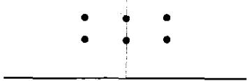

This double circuit power line configuration cannot be decoupled into two three-phase lines. Now, the modal decomposition yields one set of two anti-symmetric modes plus one set of four symmetric modes. Could the authors generalize their analysis method so that it can cope with the configuration above? Will Clarke's transformation be of any use in this new case?

4) Section IV is concerned with several applications. The insets appearing in Figs 10-14 and Figs. 18-20 invoke a set of symbols denoted by A, B, and C. However, neither the figure captions nor

the text itself explain the meaning of these symbols. Could the authors clarify what did they have in mind?

5) From the applications presented in Section IV it is not completely clear in which case or cases the authors' approach compares advantageously with Semlyen's approach. In any case, the authors apparently claim that their method performs better because of a more precise representation of the line longitudinal parameters ( $\pi$ -circuits). If our understanding is correct, we would say that the comparison seems inappropriate. If the paper's main goal is to assess the adequacy and advantages of using a real frequency independent transformation matrix (the Clarke transformation) as opposed to other matrices calculated at a single "a priori" chosen frequency, then the complexity of the $\pi$ -circuits will have to be the same for both approaches being compared; otherwise, conclusions about the use of Clarke's transformation itself hardly can be draw.

The authors reply to these comments will be highly appreciated.

# References:

[1] M. C. Tavares, J. Pissolato, and C. M. Portela, "New mode-domain representation of transmission line — Clarke transformation analysis," Proceedings of ISCAS '98, Vol. 3, pp. 497-500, Monterey, May/June 1998.   
[2] M. C. Tavares, J. Pissolato, and C. M. Portela, "New mode-domain representation of transmission line for power systems studies," Proceedings of ISCAS '98, Vol. 3, pp. 501-504, Monterey, May/June 1998.   
[3] J. A. Brandão Faria and J. H. Briceño Mendez, "Modal analysis of untransposed bilateral three-phase lines. A perturbation approach," IEEE Transactions on PWRD, Vol. 12, No. 1, Jan. 1997, pp. 497-504.   
[4] J. A. Brandão Faria and J. Hildemaro Briceño, "On the modal analysis of asymmetrical three-phase transmission lines using standard transformation matrices," IEEE Transactions on PWRD, Vol. 12, No. 4, Oct. 1997, pp. 1760-1765.   
[5] J. A. Brandão Faria, "Synthesis of pseudo-balanced three-phase line configurations," European Transactions on Electrical Power, Vol. ETEP-8, No. 4, July/August 1998, pp. 293-297.

Manuscript received September 14, 1998.

# M. C. Tavares, J. Pissolato, and C. M. Portela:

The authors thank Prof. Jan Ronne-Hansen for his interesting discussion, pointing out the simple solution proposed in our paper of using Clarke transformation matrix as the only transformation matrix of a single three phase transmission line.

In order to answer each of his comments, we would like to say that:

1. We have analyzed the line parameters in the range of $10\mathrm{Hz}$ to $1\mathrm{MHz}$ . However, the frequency dependence of the longitudinal parameters was synthesized up to $10\mathrm{kHz}$ because this is the range of interest for the transients we were studying. If the phenomena to be studied had dominant frequency in a higher range, then the line parameters should be adjusted.   
2. Up to now we have been studying the new phasedomain methods, and we still do not have a final

position about them. However it can be said that for higher frequencies, above $1\mathrm{MHz}$ , the phase components tend to behave as modes. This asymptotic behavior varies with the earth resistivity. For low resistivity, such as $10\Omega \cdot \mathrm{m}$ near $1\mathrm{MHz}$ this behavior can be seen, while for higher resistivity this asymptotic behavior will be noticed for even higher frequencies. Some care should be taken with the earth representation in the high frequency range (above $100\mathrm{kHz}$ ) because, ahead of soil conductivity, $\sigma$ , soil permittivity, $\varepsilon$ , must be considered, as $\omega \cdot \varepsilon$ (being $\omega = 2\pi f$ ) effects are not negligible, compared with those of soil conductivity. The frequency dependence of $\sigma$ and $\omega$ must also be considered [1, 2]. Moreover, in the range above $1\mathrm{MHz}$ some of the assumptions, such as quasi stationary electromagnetic fields, normally made in the line parameters calculations, are not valid.

3. Talking about the vertical symmetry plane, as a matter of fact we could say that almost all EHV transmission lines have a vertical symmetry plane, which implies that this model can be used quite widely. If, however, there is a special line without the symmetry, there would be coupling terms among all three quasi-modes $(\alpha, \beta, 0)$ . These terms would be a function of the line geometry and therefore could be taken into account or disregarded, according to the specific line

4. For instance, for a double circuit line where each circuit has a different conductor, with a line configuration similar to that presented in Fig. 8, there would be no symmetry plane, and therefore the transformation media/antimedia would not generate two uncoupled lines. Nevertheless, the coupling terms could be disregarded or not, according to the line configuration.

5. There are several ways of representing the transformation matrix through the ideal transformers [3, 4]. Clarke transformation matrix representation can be performed connecting the ideal transformers to model the relation between phase and mode voltage and current. To do so the transformers are connected to the coils in the positive polarity if the matrix element is positive or to negative polarity if the element is negative. The transformation ratio reproduces the matrix value. Two basic models are described below:

- one coil on the primary side (phase) and three coils on the mode side, making up a four-coil transformer;   
- three transformers with one coil for phase and one for mode.

These models are presented in Figs D.1 and D.2 and lead to the same result. The difference between them is the number of used transformcs and the way of connecting them.

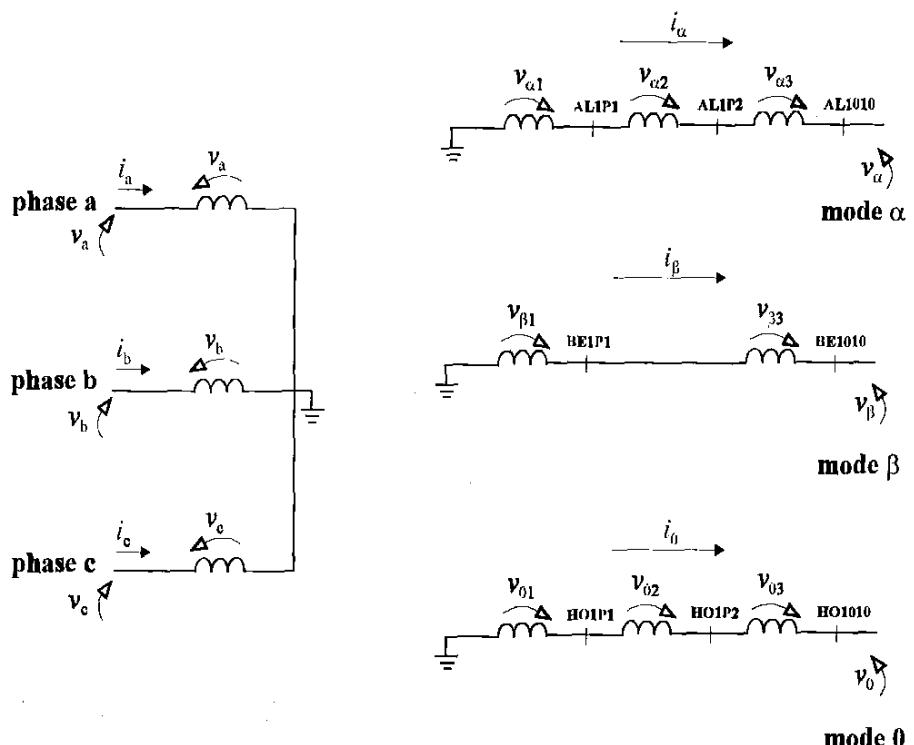  
Figure D.1 - Transformation matrix representation - one transformer per phase

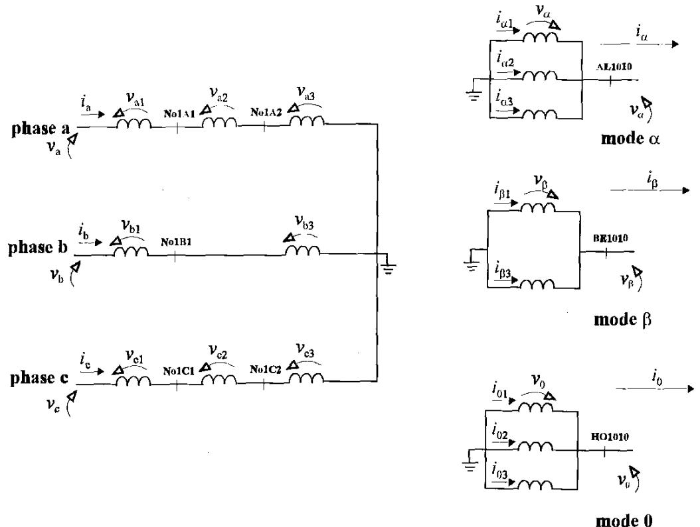  
Figure D.2 - Transformation matrix representation - three transformers per phase

The authors thank Prof. J. Brandão Faria, and would like to answer his very interesting questions.

1. As we stated, for ideally transposed lines, the quasi-modes are exact modes and our model is exact. If the line is untransposed and has a vertical symmetry plane, as is usual for EHV lines, then the quasi-modes can be divided in two groups, in one group there is the exact mode (beta) and in the other group two quasi-modes, alpha and homopolar (or zero). We agree with Prof. Brandão that if there is a line with a special configuration where the coupling term can be nil, then all quasi-modes are exact modes. However this can not be a restriction when defining the line geometry, but a consequence of the optimized tower configuration.   
2. For ideally transposed lines there are three distinct eigenvectors, and two distinct eigenvalues, one associated to homopolar mode and a pair of equal (degenerated) eigenvalues associated to modes alpha and beta, or any pair of linear combinations of modes alpha and beta (as they are associated to equal eigenvalues). There will be three uncoupled mode circuits, with two of them having the same parameters (alpha and beta). When only an alpha signal is applied, the beta circuit will not respond. The same will happen when a beta signal is inputted.   
3. For this specific double circuit configuration presented by Prof. Brandão, where there is one circuit above the other, the modal decomposition results in two groups of uncoupled modes, one formed by two antisymmetric modes (central conductors), and the other by four symmetric modes (sum and difference of external phases). These modes can be thought of "beta" modes (antisymmetrical group), and the symmetric modes which have a "alpha" and "homopolar" behavior. Within each group there are mutual terms, and some data are necessary in order to analyze the coupling terms which exist in each group. The transformation media/antiimedia and Clarke have both been applied, but in a rather different way.   
4. The symbols A, B and C are associated with the phases, as could have been R, S and T. Due to space constraint, instead of writing phase A, phase B and phase C, only the phase letters were written.   
5. The quasi-modes model has a more robust response when we analyze the mode behavior, as shown in

Figs. 10 and 11, and in Figs. 12 and 13, where our model response is coherent with the theory, while in the Semlyen model this analysis shows an inaccuracy. Again the frequency scan and lysis also shows how near the proposed model is from the exact result, while the other model presented higher differences. In the transient analysis slown, the different results reinforce the above statements, and it is possible that if a great number of cases were simulated the difference would be seen more drastically. It should be said that, although the Semlyen model does not use pi-circuits, the longitudinal parameters dependence with frequency is represented within its model in mode domain quite properly, and the model approximation is due to the transformation matrix representation. The transformation matrix is assumed constant, and it is exactly calculated for a single frequency. If it is assumed that both models have a proper representation of the frequency dependence of the longitudinal parameters in mode domain, then the difference among the models could be credited to the used transformation matrix.

We would like to thank both professors for the points they raised, which helped us to clarify the paper.

# REFERENCES

[1] C. Portela, "Frequency and Transient Behavior of Grounding Systems - I Physical and Methodological Aspects", Proceedings 1997 International Symposium on Electromagnetic Compatibility, Austin, Texas, USA, August 1997.   
[2] C. Portela, "Frequency and Transient Behavior of Grounding Systems - II Practical Application Examples", Proceedings 1997 International Symposium on Electromagnetic Compatibility, Austin, Texas, USA, August 1997.   
[3] M. C. Tavares, J. Pissolato and C. M. Por cla, "New Mode Domain Multiphase Transmission Line Model - Transformation Matrix Modeling", International Conference on Power System Technology (POWERCON'98), Beijing, China, Augus: 1998.   
[4] M. C. Tavares, J. Pissolato and C. M. Pontela, “New Multiphase Transmission Line Model” - 8th International Conference on IIharmonics and Quality of Power (ICHQP'98), Athens, Greece, October 1998.