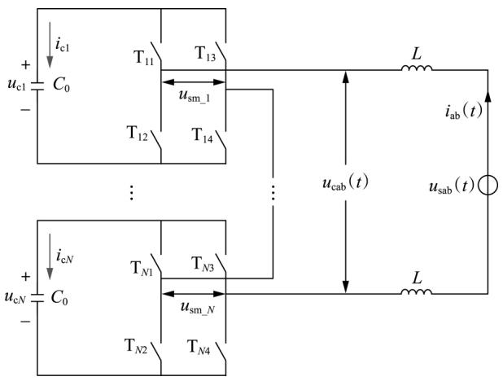
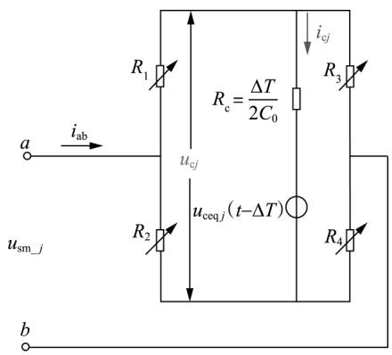
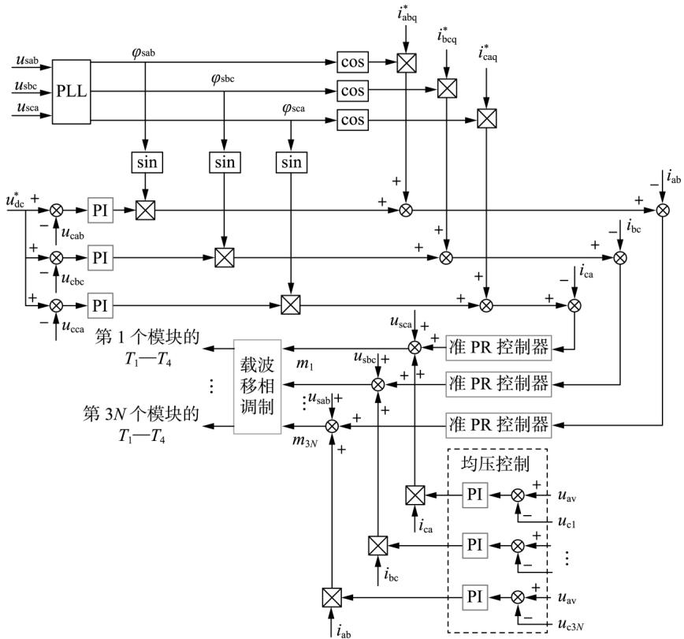
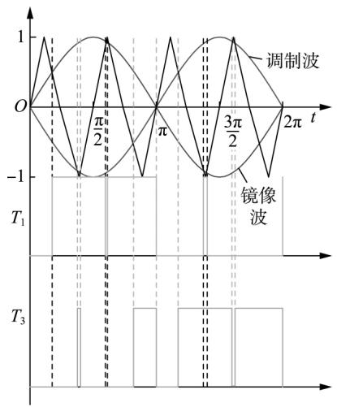
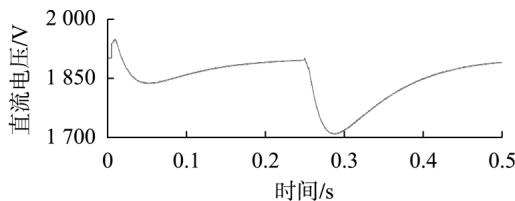
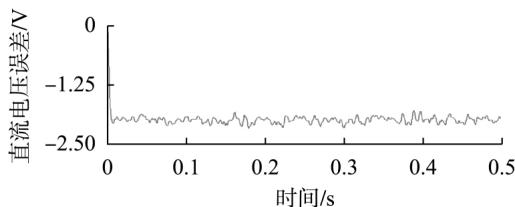
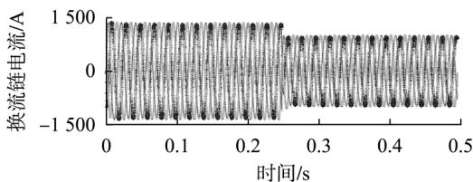
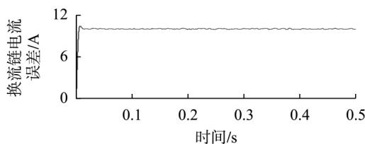
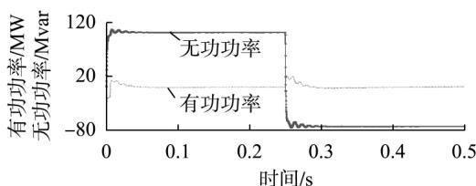
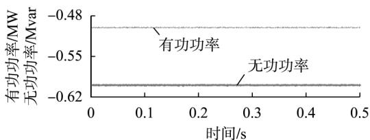

# 大功率链式 STATCOM 电磁暂态快速等效建模和误差评估

张 扬1，2 ，万安平3

( 1． 南昌工程学院 机械与电气工程学院，江西 南昌 330099;

2． 国网江西省电力有限公司电力科学研究院，江西 南昌 330000;

3． 浙江大学 机械工程学院，浙江 杭州 310027)

摘要:针对含有大量模块的大功率链式静止同步补偿器( STATCOM) 存在的电磁暂态仿真速度缓慢的问题，提出一种链式 STATCOM 级联 H 桥拓扑的等效建模方法，以提高仿真效率。 主要开展了以下的研究: 对比分析了经典电磁暂态建模和快速等效建模的原理; 推导出级联 H 桥换流链电压 电流之间的数学模型; 结合换流链数学模型及其控制方法，设计出基于 MATLAB/Simulink 的仿真流程; 分析主要电气量如功率模块直流电压、换流链电流和功率等的理论误差。 比较精确模型和等效模型的仿真精度和仿真速度，结果表明所提的等效模型与精确模型的仿真误差小于 1．2%，仿真时间缩短了 80%。 可见所提的大功率链式 STATCOM 电磁暂态快速等效建模和误差评估方法，可以在精度允许范围内大幅降低仿真时间并精确评估模型，具有较强的科学和工程应用价值。

关键词:级联 H 桥; 大功率链式 STATCOM; 快速等效建模; 仿真精度; 仿真速度

中图分类号: TM 762; TM 714．3

文献标识码:A

DOI: 10．16081 /j．issn．1006－6047．2019．03．015

# 0 引言

根据“十三五”发展战略，我国将继续建设以特高压输电线路为主干线的全国电力传输网络［1］。 特高压输电将能源产地与能源消费地紧密联系起来，能够有效缓解能源分布不均造成的供需矛盾。 特高压输电需要消耗大量的无功功率，因此大功率无功补偿设备是其必备的绿色能源设备［2］。 链式静止同步补偿器( STATCOM) 是目前最先进的动态无功补偿设备［3］，国内多个厂家相继研发出大功率链式STATCOM 并应用于特高压输电线路中［4］。 其在投入实际工程之前，首先需要对大功率链式 STATCOM进行电磁暂态离线仿真，以验证所涉及的硬件参数及控制方法的可行性［5］ 这类仿真包括高频开关电力电子器件的动作，因此必须设置较短的仿真步长，以保证仿真精度。

当采用 MATLAB/Simulink 等离线仿真软件计算时，首先需要对整个电路网络的导纳矩阵求逆，进

收稿日期: 2018－03－06; 修回日期: 2018－12－23

基金项目:国家高技术研究发展计划( 863 计划) 项目( 2015-

AA050104) ; 国 家 自 然 科 学 基 金 资 助 项 目 ( 51705455，

51867019) ; 中国博士后科学基金资助项目( 2017M621916，

2018T110587) ; 江西省自然科学基金资助项目( 20171BAB-216036)

Project supported by the National High-Technology R＆D Program of China ( 863 Program) ( 2015AA050104) ，the National

Natural Science Foundation of China ( 51705455，51867019) ，

China Postdoctoral Science Foundation Funded Project ( 2017-

M621916，2018T110587) and the Natural Science Foundation of

Jiangxi Province( 20171BAB216036)

而分别求解每个节点的电气量［6］。 然而，大功率链式 STATCOM 功率模块数量很多，其导纳矩阵维数高 求逆复杂，离线仿真速度缓慢，因此需要采用快速等效建模方法提高大功率链式 STATCOM 仿真分析的效率。 国内外在快速等效建模方面，已经开展了一系列相关的研究，但是没有具体研究链式STATCOM。 文献［7］采用矩阵化简法研究了柔性直流输电系统 H 桥子模块、半桥子模块以及箝位双子模块3 种拓扑下的快速建模。 文献［8］提出的柔性直流输电系统的戴维南等效方法，能够有效简化换流链结构，从而降低等效建模的难度，对本文研究有重要的借鉴意义。 文献［9］主要研究了一般的离散化方法以及矩阵观点下的降阶理论。 文献［10］提出了等效参数的提取算法。

本文提出一种大功率链式 STATCOM 电磁暂态快速等效模型，利用 H 桥功率模块的特征得到其电压和电流的代数关系，将整体网络模型转化成可以独立计算的模块，从而通过简单运算避免网络的求逆运算 通过理论计算，分析了所提快速等效模型的误差。 在 MATLAB/Simulink 仿真平台中，分别搭建了三相共 120 个模块的精确仿真模型和等效模型，并对比了仿真精度和仿真速度。

# 1 链式 STATCOM 经典电磁暂态建模的原理

以 ab 换流链为例说明经典算法的原理［11-12］，其在电磁暂态仿真软件中的简化电路见图 1。 图中$\mathrm { T } _ { 1 1 } \setminus \mathrm { T } _ { 1 2 } \setminus \cdots \setminus \mathrm { T } _ { N 4 } ( \ : N$ 为最大模块数) 为开关，有导通和关断2种状态， $i _ { \mathrm { c } j } ( j = 1 , 2 , \cdots , N )$ 为功率模块的节点电流。

  
图 1 电磁暂态仿真软件中的简化电路  
Fig．1 Simplified circuit in electromagnetic transient simulation software

对于第 j 个子模块，有:

$$
\left\{ \begin{array}{l} C _ {0} \frac {\mathrm {d} u _ {\mathrm {c j}} (t)}{\mathrm {d} t} = i _ {\mathrm {c j}} (t) \\ \operatorname {s i g n} \left(T _ {\mathrm {m j}}\right) u _ {\mathrm {c j}} = u _ {\mathrm {s m} - j} \end{array} \right. \tag {1}
$$

其中， $, \mathrm { s i g n } ( \mathrm { \Delta } T _ { \mathrm { m } j } )$ 为第 j 个模块的运行状态。 大功率链式 STATCOM 功率模块的运行状态见表 1。

表 1 大功率链式 STATCOM 功率模块的运行状态  
Table 1 Operating states of high power chain circuit STATCOM's modules   

<table><tr><td>运行状态</td><td>T1</td><td>T2</td><td>T3</td><td>T4</td><td>sign(Tmj)</td><td>usm_j</td></tr><tr><td rowspan="4">正常</td><td>1</td><td>0</td><td>0</td><td>1</td><td>1</td><td>ucj</td></tr><tr><td>1</td><td>0</td><td>1</td><td>0</td><td>0</td><td>0</td></tr><tr><td>0</td><td>1</td><td>0</td><td>1</td><td>0</td><td>0</td></tr><tr><td>0</td><td>1</td><td>1</td><td>0</td><td>-1</td><td>-ucj</td></tr><tr><td>故障</td><td>—</td><td>—</td><td>—</td><td>—</td><td>0</td><td>0</td></tr></table>

对于整条换流链( 以 ab 换流链为例) ，其电流满足:

$$
\left\{ \begin{array}{l} 2 L \frac {\mathrm {d} i _ {\mathrm {a b}}}{\mathrm {d} t} = u _ {\mathrm {s a b}} - u _ {\mathrm {c a b}} \\ u _ {\mathrm {c a b}} = \sum_ {i = 1} ^ {N} u _ {\mathrm {s m} - j} \end{array} \right. \tag {2}
$$

当 $\mathbf { \boldsymbol { Y } } ( \mathbf { \boldsymbol { \tau } } _ { t } ) \mathbf { \boldsymbol { \tau } } = \int \mathbf { \boldsymbol { X } } ( \mathbf { \boldsymbol { \tau } } _ { t } ) \ \mathrm { d } t$ 时， $\begin{array} { r } { \textbf {  { Y ( } } t ) = \textbf {  { Y ( } } t - \Delta T ) \ + X ( \mathbf {  { \xi } } t - \Delta T ) } \end{array}$ $\Delta T ) \Delta T$ 。 根据附录 A，可以证明式( 3) 成立。

$$
\begin{array}{l} \left[ \begin{array}{c} \boldsymbol {U} _ {\mathrm {c} [ N \times 1 ]} (t) \\ i _ {\mathrm {a b}} (t) \end{array} \right] = \left[ \begin{array}{c} \boldsymbol {C} _ {0 [ N \times N ]} ^ {- 1} (t - \Delta T) \boldsymbol {I} _ {\mathrm {c} [ N \times 1 ]} (t - \Delta T) \Delta T \\ A \end{array} \right] + \\ \left[ \begin{array}{c} \boldsymbol {U} _ {\mathrm {c} [ N \times 1 ]} (t - \Delta T) \\ i _ {\mathrm {a b}} (t - \Delta T) \end{array} \right] \tag {3} \\ \end{array}
$$

$$
\begin{array}{l} A = \frac {\Delta T}{2 L} u _ {\mathrm {s a b}} (t - \Delta T) - \\ \frac {\Delta T}{2 L} \boldsymbol {E} _ {[ 1 \times N ]} (t - \Delta T) \boldsymbol {T} _ {[ N \times N ]} (t - \Delta T) \boldsymbol {U} _ {\mathrm {e} [ N \times 1 ]} (t - \Delta T) \\ \end{array}
$$

其中， $\pmb { { \cal E } } _ { [ 1 \times N ] } = \left[ \begin{array} { l l l } { 1 } & { 1 } & { \cdots } & { 1 } \end{array} \right] _ { 1 \times N }$ ，为单位向量; $\pmb { T } _ { [ N \times N ] } =$ $\mathrm { d i a g } ( \mathrm {  ~ \ s i g n } ( T _ { _ \mathrm { m l } } ) , \mathrm { s i g n } ( T _ { _ \mathrm { m 2 } } ) , \cdots , \mathrm { s i g n } ( T _ { _ \mathrm { m N } } ) )$ 。 根据初始值可以通过迭代计算出各个变量。 显然 $C _ { 0 [ N \times N ] } ^ { - 1 }$ ］是一个稀疏矩阵的求逆运算，其计算复杂度不低于 o( N2 )

# 2 链式 STATCOM 电磁暂态快速等效建模的理论

# 2．1 电磁暂态快速等效建模的前提条件

H 桥子模块的等效电路如图2 所示。 针对图2，链式 STATCOM 具有以下的前提条件时可以方便开展模型等效:

a． 所有功率模块的电容 $C _ { 0 }$ 相等;  
b． 每个功率模块的端口电压 $u _ { \mathrm { s m } _ { - } j }$ 相互独立;  
c． 电容中的电压不会突变，可以等效为电压源;  
d． 所有电力电子器件都可以采用可变电阻表示 。

  
图 2 H 桥子模块的等效电路  
Fig．2 Equivalent circuit of H-bridge sub-module

# 2．2 换流链的电磁暂态快速等效建模

满足条件 a 和条件 b 时，可以独立计算功率模块的数学方程。 而根据条件 c，利用双线性变换方法，图1 中功率模块直流电容电压的表达式为:

$$
\begin{array}{l} u _ {c j} (t) = \frac {\Delta T}{2 C _ {0}} i _ {c j} (t) + \left[ \frac {\Delta T}{2 C _ {0}} i _ {c j} (t - \Delta T) + u _ {c j} (t - \Delta T) \right] = \\ R _ {\mathrm {e}} i _ {\mathrm {c j}} (t) + u _ {\mathrm {c e q} j} (t - \Delta T) \tag {4} \\ \end{array}
$$

$$
\begin{array}{l} u _ {\mathrm {c e q} j} (t - \Delta T) = \frac {\Delta T}{2 C _ {0}} i _ {\mathrm {e} j} (t - \Delta T) + u _ {\mathrm {e} j} (t - \Delta T) \\ R _ {\mathrm {c}} = \frac {\Delta T}{2 C _ {0}} \\ \end{array}
$$

第 j 个模块的电容可以等效为 1 个历史电压源$u _ { \mathrm { c e q } } ( \mathbf { \xi } _ { t - \Delta t } )$ 和1 个等效电阻 $R _ { \mathrm { c } }$ 的串联。 利用条件d，将电力电子器件等效为可变电阻 $R _ { 1 } \setminus R _ { 2 } \setminus R _ { 3 }$ 和 $R _ { 4 }$ ，如图2 所示。

根据 $\not \equiv ( 4 )$ ，利用节点电压法可得:

$$
\left\{ \begin{array}{l} u _ {\mathrm {s m} - j} (t) = R _ {\mathrm {a j}} i _ {\mathrm {a b}} (t) + R _ {\mathrm {b j}} u _ {\mathrm {c e q} j} (t - \Delta T) \\ i _ {\mathrm {c j}} (t) = R _ {\mathrm {p j}} i _ {\mathrm {a b}} (t) + R _ {\mathrm {q j}} u _ {\mathrm {c e q} j} (t - \Delta T) \end{array} \right. \tag {5}
$$

$$
R _ {a j} = \frac {R _ {1} R _ {2} \left(R _ {\mathrm {c}} + R _ {3} + R _ {4}\right) + R _ {1} R _ {\mathrm {c}} R _ {4}}{\left(R _ {1} + R _ {2}\right) \left(R _ {3} + R _ {4}\right) + R _ {\mathrm {c}} \left(R _ {1} + R _ {2} + R _ {3} + R _ {4}\right)} +
$$

$$
\frac {R _ {3} R _ {4} \left(R _ {1} + R _ {2} + R _ {\mathrm {c}}\right) + R _ {3} R _ {\mathrm {e}} R _ {2}}{\left(R _ {1} + R _ {2}\right) \left(R _ {3} + R _ {4}\right) + R _ {\mathrm {c}} \left(R _ {1} + R _ {2} + R _ {3} + R _ {4}\right)}
$$

$$
R _ {\mathrm {b j}} = \frac {R _ {3} R _ {2} - R _ {1} R _ {4}}{\left(R _ {1} + R _ {2}\right) \left(R _ {3} + R _ {4}\right) + R _ {\mathrm {c}} \left(R _ {1} + R _ {2} + R _ {3} + R _ {4}\right)}
$$

$$
R _ {p j} = \frac {R _ {2} R _ {3} - R _ {4} R _ {1}}{\left(R _ {1} + R _ {2}\right) \left(R _ {3} + R _ {4}\right) + R _ {\mathrm {c}} \left(R _ {1} + R _ {2} + R _ {3} + R _ {4}\right)}
$$

$$
R _ {\mathrm {e j}} = \frac {- \sum_ {i = 1} ^ {4} R _ {i}}{\left(R _ {1} + R _ {2}\right) \left(R _ {3} + R _ {4}\right) + R _ {\mathrm {c}} \left(R _ {1} + R _ {2} + R _ {3} + R _ {4}\right)}
$$

将所有有关功率模块的方程写成矩阵形式，简记为:

$$
\begin{array}{r l} \boldsymbol {R} _ {\mathrm {a} [ N \times N ]} \boldsymbol {I} _ {\mathrm {a b} [ N \times 1 ]} (t) + \boldsymbol {R} _ {\mathrm {b} [ N \times N ]} \boldsymbol {U} _ {\mathrm {c e q} [ N \times 1 ]} (t - \Delta T) = & \\ \boldsymbol {U} _ {\mathrm {s m} [ N \times 1 ]} (t) & (6) \end{array}
$$

同理对于 $i _ { \mathrm { c } j }$ 有:

$$
\begin{array}{r} \boldsymbol {R} _ {\mathrm {p} [ N \times N ]} \boldsymbol {I} _ {\mathrm {a b} [ N \times 1 ]} (t) + \boldsymbol {R} _ {\mathrm {q} [ N \times N ]} \boldsymbol {U} _ {\mathrm {c e q} [ N \times 1 ]} (t - \Delta T) = \\ \boldsymbol {I} _ {\mathrm {c} [ N \times 1 ]} (t) \end{array} \tag {7}
$$

根据图2 和式( 2) ，同样有:

$$
i _ {\mathrm {a b}} = \int \left(\frac {1}{2 L} u _ {\mathrm {s a b}} (t) - \frac {1}{2 L} \boldsymbol {E} _ {[ 1 \times N ]} \boldsymbol {U} _ {\mathrm {s m} [ N \times I ]} (t)\right) \mathrm {d} t
$$

其矩阵形式可写为:

$$
i _ {\mathrm {a b}} = \int \frac {u _ {\mathrm {s a b}} (t)}{2 L} \mathrm {d} t - \int \frac {1}{2 L} \boldsymbol {E} _ {[ 1 \times N ]} \boldsymbol {R} _ {\mathrm {a} [ N \times N ]} \boldsymbol {I} _ {\mathrm {a b} [ N \times 1 ]} (t) \mathrm {d} t -
$$

$$
\int \frac {1}{2 L} \boldsymbol {E} _ {[ 1 \times N ]} \boldsymbol {R} _ {\mathrm {b} [ N \times N ]} \boldsymbol {U} _ {\mathrm {c e q} [ N \times 1 ]} (t - \Delta T) \mathrm {d} t \tag {8}
$$

同样利用 $\pmb { Y } ( \ t ) = \pmb { Y } ( \ t - \Delta T ) \ + \pmb { X } ( \ t - \Delta T ) \ \Delta T$ ，综合式( 6) 和( 8) ，可得:

$$
\begin{array}{l} \left[ \begin{array}{c} \boldsymbol {U} _ {\mathrm {s m} [ N \times 1 ]} (t) \\ i _ {\mathrm {a b}} (t) \end{array} \right] = \\ \left[ \begin{array}{c} \boldsymbol {R} _ {\mathrm {a} [ N \times N ]} \boldsymbol {I} _ {\mathrm {a b} [ N \times 1 ]} (t) + \boldsymbol {R} _ {\mathrm {b} [ N \times N ]} \boldsymbol {U} _ {\mathrm {e e q} [ N \times 1 ]} (t - \Delta T) \\ B \end{array} \right] + \\ \left[ \begin{array}{c} 0 \\ i _ {\mathrm {a b}} (t - \Delta T) \end{array} \right] \tag {9} \\ B = \frac {\Delta T}{2 L} u _ {\mathrm {s a b}} (t - \Delta T) - \frac {\Delta T}{2 L} E _ {[ 1 \times N ]} R _ {\mathrm {a} [ N \times N ]} (t - \Delta T) \times \\ \boldsymbol {I} _ {\mathrm {a b} [ N \times 1 ]} (t - \Delta T) - \frac {\Delta T}{2 L} \boldsymbol {E} _ {[ 1 \times N ]} \boldsymbol {R} _ {\mathrm {b} [ N \times N ]} (t - \Delta T) \times \\ \boldsymbol {U} _ {\mathrm {e q} [ N \times 1 ]} (t - \Delta T) \\ \end{array}
$$

式( 9) 中的 $R _ { \mathrm { a } } \cdot R _ { \mathrm { b } } \cdot R _ { \mathrm { p } }$ 和 $\pmb { R } _ { \mathrm { q } }$ 可在关断电阻时取$R _ { \mathrm { o f f } } ,$ ，导通电阻时取 0 来近似得到。 ${ \pmb R } _ { \mathrm { a } \left[ N \times N \right] } \ \cdot { \pmb R } _ { \mathrm { b } \left[ N \times N \right] } \ ,$ 、$I _ { \mathrm { a b } \left[ N \times 1 \right] } \setminus U _ { \mathrm { c e q } \left[ N \times 1 \right] }$ 各含有 N 个变量，其计算复杂度近似为 o( 4N) 。 因此采用本文所提快速建模方法能够提高仿真速度。

# 2．3 控制系统的数学建模

根据文献［13］，大功率链式 STATCOM 的控制框图如图 3 所示。 图中 $i _ { \mathrm { a b q } } ^ { * } \setminus i _ { \mathrm { b c q } } ^ { * } \setminus i _ { \mathrm { c a q } } ^ { * }$ 为换流链电流指令， $\boldsymbol { u } _ { \mathrm { d c } } ^ { * }$ 为换流链直流电压指令， $u _ { \mathrm { c a b } } \cdot u _ { \mathrm { c b c } } \cdot u _ { \mathrm { c c a } }$ 为三相换流链各个功率模块电压的平均值， $u _ { \mathrm { a v } }$ 为所有功率

  
图 3 大功率链式 STATCOM 的控制框图  
Fig．3 Control block diagram of high power chain circuit STATCOM

模块电压的平均值， $m _ { i } ( { \mathrm { \Omega } } i = 1 , 2 , \cdots , 3 N )$ 为经过控制器计算得到的每个模块的调制波。

根据载波移相调制原理［14-15］，通过 $m _ { i } \cdot \cdot - m _ { i }$ 与三角载波进行比较可以得到 $T _ { \scriptscriptstyle 1 }$ 和 $T _ { 3 }$ ，而 $T _ { 1 }$ 和 $T _ { \phantom { } _ { 2 } } , T _ { \phantom { } _ { 3 } }$ 和 $T _ { 4 }$ 互为相反，因此能够计算出每个功率模块的状态 $T _ { 1 } { \cdot } T _ { 2 } { \cdot } T _ { 3 }$ 和 $T _ { 4 }$ ，载波移相调制原理如图 4 所示。图中三角波为载波，2 条正弦波分别为调制波及其镜像波。

  
图 4 载波移相调制的原理  
Fig．4 Principle of carrier wave phase shift modulation

# 3 等效建模误差分析

考虑到导通电阻 $R _ { \mathrm { o n } }$ 不为0 造成的误差，其值为$1 0 ^ { - 3 } \sim 4 \times 1 0 ^ { - 3 } \Omega$ ，假定子模块 IGBT 中 $\mathrm { T } _ { 1 }$ 的导通电阻$R _ { \mathrm { o n } } > 0$ ，当 $R _ { 1 } = R _ { \mathrm { o n } } \neq R _ { 4 } , R _ { 2 } = R _ { 3 } = R _ { \mathrm { o f f } } , R _ { 4 } = 0$ 时，令 $R _ { \mathrm { o n } } =$ $\eta _ { 1 } R _ { \mathrm { o f f } }$ ，可得功率模块的端口电压的误差满足:

$$
\begin{array}{l} \Delta u _ {\mathrm {s m} - j} \leqslant \left(\frac {\eta_ {1} R _ {\mathrm {c}} + \eta_ {1} R _ {\mathrm {o f f}} ^ {2} + R _ {\mathrm {o f f}} R _ {\mathrm {c}}}{R _ {\mathrm {o f f}} + 2 R _ {\mathrm {c}}} - \frac {R _ {\mathrm {o f f}} R _ {\mathrm {c}}}{R _ {\mathrm {o f f}} + 2 R _ {\mathrm {c}}}\right) \sqrt {2} I _ {\text {r a t e}} + \\ \frac {\eta_ {1} R _ {\mathrm {c}} R _ {\text {o f f}} + \eta_ {1} R _ {\mathrm {c}} R _ {\text {o f f}} ^ {2}}{\left(R _ {\text {o f f}} + 2 R _ {\mathrm {c}}\right) \left(\eta_ {1} R _ {\mathrm {c}} R _ {\text {o f f}} + R _ {\text {o f f}} + \eta_ {1} R _ {\mathrm {c}} + 2 R _ {\mathrm {c}}\right)} V _ {\mathrm {d c}} <  \\ \left(\frac {\eta_ {1} R _ {\mathrm {c}} + \eta_ {1} R _ {\mathrm {o f f}} ^ {2}}{R _ {\mathrm {o f f}} + 2 R _ {\mathrm {c}}}\right) \sqrt {2} I _ {\text {r a t e}} + \frac {\eta_ {1} R _ {\mathrm {c}} R _ {\mathrm {o f f}} + \eta_ {1} R _ {\mathrm {c}} R _ {\mathrm {o f f}} ^ {2}}{\left(R _ {\mathrm {o f f}} + 2 R _ {\mathrm {c}}\right) \left(2 R _ {\mathrm {c}} + R _ {\mathrm {o f f}}\right)} V _ {\mathrm {d c}} \approx \\ \sqrt {2} \eta_ {1} R _ {\text {o f f}} I _ {\text {r a t e}} + \eta_ {1} V _ {\mathrm {d c}} \tag {10} \\ \end{array}
$$

其中， $\boldsymbol { , I } _ { \mathrm { r a t e } }$ 为电网额定电流; $V _ { \mathrm { d c } }$ 为额定直流电压。

功率模块的直流电容电压的误差满足:

$$
\Delta u _ {\mathrm {c j}} \approx \Delta u _ {\mathrm {s m} - j} / m \approx \Delta u _ {\mathrm {s m} - j} V _ {\mathrm {d c}} / (\sqrt {2} V _ {\mathrm {r a t e}}) \tag {11}
$$

其中，m 为调制比，且 $m { \approx } \sqrt { 2 } V _ { \mathrm { r a t e } } / V _ { \mathrm { d c } } , \sqrt { 2 } V _ { \mathrm { r a t e } }$ 为电网额定电压峰值。

换流链电压满足:

$$
\Delta u _ {\mathrm {c a b}} <   N \Delta u _ {\mathrm {s m} _ {- j}} = N \sqrt {2} \eta_ {1} R _ {\text {o f f}} I _ {\text {r a t e}} + N \eta_ {1} V _ {\mathrm {d c}} \tag {12}
$$

如果考虑到电压和电流都与时间呈正弦关系，则电抗器的阻抗近似为恒值 2ωL，故电流误差为:

$$
\Delta i _ {\mathrm {a b}} \approx \Delta u _ {\mathrm {c a b}} / (2 \omega L) <   N (\sqrt {2} \eta_ {1} R _ {\mathrm {o f f}} I _ {\mathrm {r a t e}} + \eta_ {1} V _ {\mathrm {d c}}) / (2 \omega L) \tag {13}
$$

根据视在功率 $S = \sqrt { 3 } u _ { \mathrm { c a b } } i _ { \mathrm { a b } }$ ，可得:

$$
\Delta S <   \sqrt {3} \Delta u _ {\mathrm {c a b}} I _ {\mathrm {r a t e}} + \sqrt {3} \Delta i _ {\mathrm {a b}} V _ {\mathrm {r a t e}} \tag {14}
$$

# 4 仿真验证

# 4．1 参数设置

采用 Simulink 离线仿真进行对比分析。 仿真模型见附录 A。 本文中装置的基本参数如附录 B 中表B1 所示 。

采用 Simulink 自带模型库搭建精确仿真。 设置$\mathrm { T } _ { 1 }$ 和 $\mathrm { T } _ { 4 }$ 的导通电阻为0，关断电阻 $R _ { \mathrm { o f f } } = 1 0 ^ { 6 } \Omega , \mathrm { T } _ { 2 }$ 和$\mathrm { T } _ { 3 }$ 的导通电阻 $R _ { \mathrm { o n } } = 1 0 ^ { - 3 } ~ \Omega$ ，关断电阻 $R _ { \mathrm { o f f } } = 1 0 ^ { 6 } ~ \Omega$ ，则$\eta _ { 1 } = 1 0 ^ { - 9 }$ 。 另外利用 Simulink 以及所提迭代算法搭建等效数学仿真模型。 设置 $\mathrm { T } _ { 1 } { \cdot } \mathrm { T } _ { 2 } { \cdot } \mathrm { T } _ { 3 }$ 和 $\mathrm { T } _ { 4 }$ 的导通电阻为0，关断电阻 $R _ { \mathrm { o f f } } = 1 0 ^ { 6 } ~ \Omega$ 。 结合附录 B 中表 B1 中的参数，根据式( $1 0 ) { \longrightarrow } ( 1 3 )$ ，可得理论误差为:

$$
\left\{ \begin{array}{l} \Delta u _ {c j} <   2. 3 5 5 \mathrm {V} \\ \Delta i _ {\mathrm {a b}} <   1 2. 2 4 7 5 \mathrm {A} \\ \Delta S <   8 3 1. 1 2 \mathrm {k V} \cdot \mathrm {A} \end{array} \right. \tag {15}
$$

# 4．2 仿真分析

为了测试精确模型和等效数学仿真模型的动态性能是否一致，当仿真步长为 $1 0 ^ { - 5 } \mathrm { ~ s ~ } , t = 0 . 2 5 \mathrm { ~ s ~ }$ 时控制无功功率从感性 100 Mvar 阶跃变化为容性 75Mvar。 对比精确模型和等效数学仿真模型的仿真结果如图5 所示。

图5( a) 和图5( b) 为精确模型和等效模型的功率模块直流电容电压及其误差，可以看出其误差大约在 2．2 V 以内，相对误差为 0．11% 。 图 5( c) 和图 5( d) 为2 种模型的换流链电流波形及其误差，其误差在 11 A 以内，相对误差为 1．15% 图 5( e) 和图 5( f) 为功率的波形及其误差，有功功率误差为 500kW 左右，无功功率误差为 600 kvar，则视在功率误差为800 kV·A，相对误差为 0．8%，因此该模型的总误差小于 1．2%

综上，当仿真步长为 $1 0 ^ { - 5 } \mathrm { ~ s ~ }$ 时，精确模型和等效模型的仿真结果非常接近。

# 4．3 3 种模型下的仿真时间对比

3 种模型下的仿真时间对比如表 2 所示，对比了仿真步长分别为 $1 0 ^ { - 4 } \mathrm { s } . 1 0 ^ { - 5 } \mathrm { s }$ 和 $1 0 ^ { - 6 } \mathrm { ~ s ~ }$ 这3 种不同

表 2 仿真时间对比  
Table 2 Comparison of simulation time   

<table><tr><td>仿真步长/s</td><td>精确模型下的
仿真时间/s</td><td>等效模型下的
仿真时间/s</td></tr><tr><td>10-4</td><td>183</td><td>38</td></tr><tr><td>10-5</td><td>1598</td><td>331</td></tr><tr><td>10-6</td><td>15567</td><td>3452</td></tr></table>

  
（a）功率模块的直流电压对比

  
（b）功率模块的直流电压误差

  
（c）三相换流链电流对比

  
（d）ab换流链电流误差

  
（e）功率对比

  
（f）功率误差  
一精确模型,---等效模型  
图 5 精确模型和等效模型的仿真结果对比  
Fig．5 Comparison of simulative results between accurate model and equivalent model

情况下的仿真时间，可见采用等效模型时大约缩短了80%的时间

# 5 结论

本文针对大功率链式 STATCOM 存在电磁暂态离线仿真速度缓慢的问题，分析了采用经典建模方法计算缓慢的原因 利用 H 桥功率模块的电路特征对换流链等效建模，以提高仿真速度。 并且着重

分析了等效前后的仿真精度，通过功率模块直流电压、换流链电流和功率等主要电气量计算了等效模型的理论误差

为验证本文所提的等效模型和误差计算方法在实际装置中的可行性，对 35 kV 高压链式 STATCOM进行仿真验证，基于精确模型和等效模型比较了仿真精度和仿真速度。 结果表明，采用所提等效模型时仿真误差小于 1．2%，仿真时间缩短了 80%，理论与仿真模型基本一致。

附录见本刊网络版( http: ∥www．epae．cn) 。

# 参考文献:

［1］杜忠明． 贵广第二回直流输电工程换流站无功补偿的研究［J］．电网技术，2006，30( 10) : 69-74．DU Zhongming． Study on reactive power compensation for the sec-ondary HVDC project form Guizhou to Guangdong［J］． Power SystemTechnology，2006，30( 10) : 69-74．  
［2］刘青，张立娜． 多机系统发电机时滞反馈励磁与 STATCOM 的非线性鲁棒协调控制［J］． 电力自动化设备，2017，37( 4) :102-108．LIU Qing，ZHANG Lina． Nonlinear robust coordinated control oftime delay feedback excitation and STATCOM for multi machinepower system［J］． Electric Power Automation Equipment，2017，37( 4) : 102-108．  
［3］FARIVAR G，TOWNSEND C D，HREDZAK B，et al． Low－capacitance cascaded H-bridge multilevel statcom［J］． IEEE Transactions on Power Electronics，2017，32( 3) : 1744-1754．   
［4］ HU P，JIANG D，ZHOU Y，et al． Energy－balancing control strategy for modular multilevel converters under submodule fault conditions ［J］． IEEE Transactions on Power Electronics，2014，29( 9) : 5021- 5030．   
［5］ TU Q，XU Z． Impact of sampling frequency on harmonic distortion for modular multilevel converter［J］． IEEE Transactions on Power Delivery，2010，26( 1) : 298-306．   
［6］许建中，赵成勇，刘文静． 超大规模 MMC 电磁暂态仿真提速模型［J］． 中国电机工程学报，2013，33( 10) : 114-120．XU Jianzhong，ZHAO Chengyong，LIU Wenjing． Accelerated modelof ultra － large scale MMC in electromagnetic transient simulations［J］． Proceedings of the CSEE，2013，33( 10) : 114-120．  
［7］许烽，翁华，徐政，等． 基于 PSCAD/EMTDC 的大规模交直流系［J］． ，2013，39 ( 11) :2762-2772．XU Feng，WENG Hua，XU Zheng，et al． Rapid modeling and validityanalysis of large-scale AC /DC power systems based on PSCAD /EMTDC［J］． High Voltage Engineering，2013，39( 11) : 2762-2772．  
［8］GNANARATHNA U N，GOLE A M，JAYASINGHE R P． Efficient modeling of Modular Multilevel HVDC Converters( MMC) on electromagnetic transient simulation programs［J］． IEEE Transactions on Power Delivery，2011，26( 1) : 316-324．   
［9］BONATTO B D，ARMSTRONG M L，MARTI J R，et al． Current and voltage dependent sources modelling in MATE－Multi-Area Thevenin Equivalent concept［J］． Electric Power Systems Research，2016， 138: 138-145．   
［10］ BHESANIYA M，SHUKLA A． Norton equivalent modeling of current source MMC and its use for dynamic studies of back-to-back converter system［J］． IEEE Transactions on Power Delivery，2016，32

( 4) : 1935-1945．   
［11］ LI C，XU J，ZHAO C． A coherency－based equivalence method for MMC inverters using virtual synchronous generator control［J］． IEEE Transactions on Power Delivery，2016，31( 3) : 1369-1378．   
［12］ DOMMEL H W． Digital computation of electromagnetic transients in single and multi－phase networks［J］． IEEE Transactions on Power Appalications，1969，88( 4) : 388-399．   
［13］周林，廖波，龙崦平，等． 基于幅值积分的光伏并网功率调节系统研究［J］． 电力自动化设备，2013，33( 1) : 104-109．ZHOU Lin，LIAO Bo，LONG Yanping，et al． Grid－connected photo-voltaic power conditioner system based on amplitude integral［J］．Electric Power Automation Equipment，2013，33( 1) : 104-109．  
［14］张扬，常亮，杨小品． ±100 Mvar 高压 STATCOM 直接电流分相谐振控制参数整定方法及 RTDS 仿真实验［J］． 电力系统保护与控制，2016，44( 15) : 27-32．  
ZHANG Yang，CHANG Liang，YANG Xiaopin． Parameter setting on independent phase resonant control of STATCOM under higher vol－ tage and RTDS simulation experiment［J］． Power System Protection

and Control，2016，44( 15) : 27-32．  
［15］吕敬，蔡旭，张建文． 模块化多电平换流器的交直流侧阻抗模型［J］． 电力自动化设备，2017，37( 1) : 131-136．  
L Jing，CAI Xu，ZHANG Jianwen． AC － and DC-side impedance models of modular multilevel converter［J］． Electric Power Automation Equipment，2017，37( 1) : 131-136．

作者简介:

  
张 扬

张 扬( 1985—) ，男，河南南阳人，讲师，博士，从事大功率电力电子变换器的建模与控制方面的研究 ( E-mail: rxzhangyang @foxmail．com) ;

万安平( 1983—) ，男，江西南昌人，副研究员，博士，通信作者，从事发电设备寿命预测与维修决策等方面的研究( E-mail:

anpingwan@zju．edu．cn) 。

# Electromagnetic transient equivalent fast modeling and error estimate of high power chain circuit STATCOM

ZHANG Yang1，2 ，WAN Anping3

( 1． School of Mechanical and Electric Engineering，Nanchang Institute of Technology，Nanchang 330099，China;

2． State Grid Jiangxi Electric Power Research Institute，Nanchang 330000，China;   
3． School of Mechanical Engineering，Zhejiang University，Hangzhou 310027，China)

Abstract: Aiming at the slow speed of electromagnetic transient simulation of high power chain circuit STATCOM ( STATic synchronous COMpensator) with a large number of modules，an equivalent modeling method for chain circuit STATCOM with cascaded H-bridge topology is proposed to improve the simulation efficiency． Firstly，the principles of classical electromagnetic transient modeling and fast equivalent modeling are compared and analyzed，and the mathematical model between voltage and current of the cascaded H-bridge converter chain are formulated． Secondly， the simulation process based on MATLAB /Simulink is designed with the mathematical model and control method of the converter chain． Then，the theoretical errors of main electrical quantities such as power module DC voltage，commutation chain current and power are analyzed． Finally，by comparing the simulation accuracy and speed of the exact model and the equivalent model，the results indicate that the simulation error between the proposed equivalent model and the exact model is less than 1．2%，while the simulation time is reduced by 80%． Therefore，the proposed electromagnetic transient fast equivalent modeling and error estimate method of high power chain circuit STATCOM greatly reduce the simulation time and accurately evaluate the model within the allowable range of accuracy，which has promising scientific and engineering application value．

Key words: cascaded H-bridge; high power chain circuit STATCOM; fast equivalent modeling; simulation accuracy; simulation efficiency