# Efficiently computing the electrical parameters of cables with arbitrary cross-sections using the method-of-moments

M. Shafieipour a,∗, Z. Chen b, A. Menshov c, J. De Silva a, V. Okhmatovski b

a Manitoba Hydro International Ltd., Winnipeg, Canada   
b Department of Electrical and Computer Engineering, University of Manitoba, Winnipeg, Canada   
c Department of Electrical and Computer Engineering, The University of Texas at Austin, USA

# a r t i c l e i n f o

Article history:

Received 15 December 2017

Received in revised form 30 March 2018

Accepted 17 April 2018

Available online 24 May 2018

Keywords:

Cable modeling

Per-unit-length (p.u.l.) electrical

parameters

Surface-volume-surface electric field

integral equation (SVS-EFIE)

Method-of-moments (MoM)

Electromagnetic transient program (EMTP)

Inductance and capacitance extraction

# a b s t r a c t

In a recent work, a proximity- and skin-effect aware formulation known as the surface-volume-surface electric field integral equation discretized with 2-D method-of-moments (MoM) was optimized to efficiently extract the frequency dependent series impedance matrix of cables with arbitrary shapes. However, it was only applied to sector-shaped and coaxial cables due to the constraints on computing the shunt admittance matrix using closed-form approximations. This work presents formulation, discretization, and optimization techniques, for fast computation of the shunt admittance matrix of arbitrary-shaped cables by discretizing the problem of the quasi-electrostatics using 2-D MoM. With the proposed MoM techniques and optimization strategies, it is possible to accurately compute all the electrical parameters of arbitrary-shaped cables required in electromagnetic transient programs (EMTP) using today’s typical computer power and with reasonable computational times. This provides an efficient modeling tool for any desired cable design. Frequency domain solutions of the proposed technique are compared against the finite-element method as well as the classical approximate formulas available for pertinent cable models. The resulting time domain transient simulations in EMTP are also investigated.

© 2018 The Author(s). Published by Elsevier B.V. This is an open access article under the CC

BY-NC-ND license (http://creativecommons.org/licenses/by-nc-nd/4.0/).

# 1. Introduction

Electromagnetic transient programs (EMTP) rely on transmission line models [1–3] for representing the frequency dependent behavior of multiconductor transmission lines (MTLs) such as overhead lines and underground cable systems. In order to account for the geometry and material properties of such systems over the power system frequencies spanning from DC to several MHz, these models require the per-unit-length (p.u.l.) series impedance matrix [Z] and the shunt admittance matrix [Y] of the system at different frequency points. This makes computation of the electrical parameters of cables and transmission lines an integral part of any EMT analysis involving transmission and distribution of electric power.

In the case of overhead lines, computationally efficient closedform approximations [4] are accurate as they assume a symmetrical distribution of current which models the skin-effect while neglecting the proximity-effect. This is because overhead lines can be represented in symmetrical canonical form (i.e. circular crosssection) and are typically located far enough apart that neglecting

the proximity-effect is a valid assumption. On the other hand when modeling underground cables, the aforementioned assumptions may not be valid as a function of the considered frequency and/or the cable design. Underground cables usually consist of several closely situated conductors which are separated by insulation materials as exemplified in Fig. 1. At higher frequencies, this can cause the proximity-effect to have a large impact on the [Z] and [Y] matrices of the system [8,10,11]. Furthermore, underground cables have been introduced and used with various types of geometrical shapes such as pipe-type [7] (Fig. 1(a)), sector-shaped [5,19] (Fig. 1(b) and (c)), umbilical [8], and other practical examples such as the one shown in Fig. 1(d) [9]. Thus assuming circular crosssection can lead to errors more than 5% in computing [Y] and [Z] matrices where the cable cross-section is not confined to circular boundaries [8,10]. Such error levels in computing the electrical parameters of the cable system may result in modeling of the transmission line with unacceptable EMT simulations1 as reported in [11] and shown in this paper.

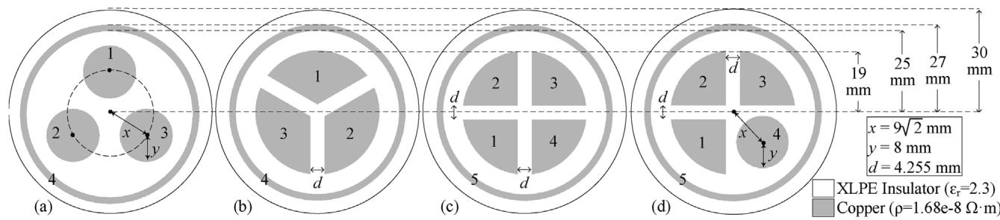  
Fig. 1. The 2-D cross-section of the cables under study drawn to scale. All conductors are copper with resistivity of - = 1.68e 8  m, and all insulators are made of cross-linked polyethylene (XLPE) with dielectric constant of $\epsilon _ { r } = 2 . 3 $ and negligible dielectric loss (tanı = 0). In (a) and (b), adjacent core conductors (circular or sector-shaped) are 120◦ apart with respect to the center of the cable while in (c) and (d) 90◦ rotation is performed. No ferromagnetic material is used and so the relative permeability is $\textstyle \mu _ { r } = 1$ everywhere. Cable conductors are numbered $\alpha = 1 , 2 , . . . , 5 ,$ , in accordance with the results presented in Section 5.

Since underground cables are increasingly being preferred over the traditional overhead lines due to political and environmental constraints, there has been a growing interest in accurate and computationally efficient techniques to extract parameters of various types of underground cables where both the proximity and skin effects are considered. Closed-form approximations such as [11] are fast but limited to certain canonical geometries. Numerical methods such as the partial sub-conductor equivalent circuit method [6,13–15], the finite element method (FEM) [8,16], and the methodof-moments (MoM) [10,17,18] are applicable to cables with any desired geometry but suffer from long computational times. Such computations are required to be done only once for a specific type of cable system and the resulting [Y] and [Z] matrices can be saved in a lookup table and used in subsequent EMT simulations. Nevertheless, an EMTP is expected to compute such parameters in reasonable time and with commonly available computer power. Therefore, it is important to investigate optimization techniques for numerically-based impedance and admittance extraction techniques.

In our previous work [19], optimization techniques for the MoM solution of the surface-volume-surface electric field integral equation (SVS-EFIE) [17] for efficiently computing the impedance matrix [Z] of arbitrary-shaped cables was introduced but was only applied to model coaxial and sector-shaped cables. The restriction on the shape of the cable was stemmed from the fact that the [Y] matrix was left to be computed using closed-form approximations based on certain geometrical aspects of the studied cables. However, as was mentioned earlier, underground cables may be investigated and/or manufactured with various types of geometry. In this paper, we apply the integral equation of the quasi-electrostatics discretized with the MoM for modeling arbitrary-shaped cables and we introduce optimization techniques analogous to that of [19] for extracting the admittance matrix [Y] of underground cables. Along with [19], this work can be used as an efficient and accurate technique to provide all electrical parameters (i.e. [Z] and [Y]) of arbitrary-shaped cables required in EMTP.

# 2. Use of computational electromagnetic (CEM) techniques in power systems cable modeling

Differential and integral equation techniques of CEM such as the finite-difference time-domain (FDTD) [20], FEM [21], MoM [23], and the Nyström scheme [24], can be used to numerically solve a general electromagnetic (scattering) problem in the 3-D medium based on the set of four Maxwell’s Equations with prescribed accuracy [25]. Depending on the engineering needs and the assumptions made, these methods can also be used to model other (simpler) problems of electromagnetics.

In the transmission line models used in EMTP [1–3] the following assumptions are made for the electromagnetic fields [26].

(1) there is no full-wave phenomena in the cross-sections outside the conductors, (2) longitudinal component of the magnetic field is neglected, (3) inside the conductors, only the longitudinal current component (i.e. flowing along the direction of the conductors) is present, and (4) longitudinal currents in the dielectrics surrounding the conductors are neglected (transversal currents are present and accounted for by the imaginary part of the capacitance matrix, i.e. conductance matrix). These assumptions are typically referred to as the quasi-transverse electromagnetic (TEM)2 approximation [18,16]. In this work we also assume low-frequency regime $( \sigma \gg \epsilon _ { 0 } \omega )$ , in which the conduction current E in the conductors is substantially larger than the displacement current $j \epsilon _ { 0 } \omega { \bf E } .$ . This leads to the assumption of constant electric potential in the transmission line cross-sections. Note, that this assumption is violated in the highfrequency regime $\sigma \cong \epsilon _ { 0 } \omega$ and the electric potential can no longer be assumed to remain constant in the cross-sections. Therefore, the proposed methodology may not be applicable to studies with very high-frequency transients which typically occur at several MHz frequencies such as the oscillating frequency of the switching surges in gas insulated systems [27].

The above assumptions reduce the Maxwell’s Equations to the Telegrapher’s Equations accompanied by two scalar 2-D problems, each of which can be solved independently [26]. One, is the 2- D problem of quasi-electrostatics with respect to the transversal components of the electric field $\pmb { E } _ { t }$ outside the conductors, governed by the following Laplace equation for the electric potential  and transversal gradient relationship of the transversal field components $\pmb { E } _ { t }$

$$
\nabla_ {t} ^ {2} \phi (\rho) = 0, \quad \boldsymbol {E} _ {t} = - \nabla_ {t} \phi , \quad \rho \in S _ {\infty}, \tag {1}
$$

where $S _ { \infty }$ denotes the entire cross-section of the transmission line including conductor cross-sections area and the area outside the conductors. The other, is the 2-D problem of quasi-magnetostatics with respect to the longitudinal component of the electric field $\pmb { E } _ { z }$ inside the conductors governed by the Helmholtz equation

$$
\nabla_ {t} ^ {2} E _ {z} (\boldsymbol {\rho}) - j \omega \mu_ {0} \sigma E _ {z} (\boldsymbol {\rho}) = 0, \quad \rho \in S _ {\alpha}, \quad \alpha = 1, \dots , n, \tag {2}
$$

where $S _ { \alpha }$ denotes the cross-section of the ˛th conductor, and n denotes the total number of conductors (excluding the reference conductor).

The above 2-D differential equations of quasi-electrostatics and quasi-magnetostatics can be either discretized directly using FEM or FDTD method, or converted to the equivalent integral equa-

tions [26] and solved using MoM or the Nyström method. The solution of the quasi-electrostatics problem produces the admittance matrix [Y] and its corresponding p.u.l. conductance [G] and capacitance [C] matrices, i.e. $[ Y ] = [ G ] + j \omega [ C ]$ . The solution of the quasi-magnetostatics problem, produces impedance matrix [Z] and its corresponding resistance [R] and inductance [L] matrices, i.e. $[ Z ] = [ R ] + j \omega [ L ]$ . Hence, computing accurate results for [Z] and [Y] matrices of power cable systems can be done through CEM methods for which commercial software (e.g. [28]) are available. The computational time, however, becomes a challenge, as for a cable with ˛ conductors, one needs to run ˛ CEM experiments and over multiple (typically about 100) frequencies.3 This gives motivation to optimize CEM techniques for extracting parameters of power cable systems as presented in the subsequent sections.

# 3. Numerical evaluation of the quasi-magnetostatics problem

In this work, we adopt the MoM discretization of the quasimagnetostatics derived from the single-source SVS-EFIE [17]. Due to the frequency dependent nature of the solution, it was shown in [19] that such numerical computations need to be optimized for desired efficiency. Further, is was found that an analogous optimized Volume-EFIE (V-EFIE) [29] can be more efficient than the optimized SVS-EFIE [19] at lower frequencies $( { \bf e . g . } f _ { \textstyle \leq } 1 0 0 \mathrm { H z } )$ . At such frequencies, not much efficiency is gained by transforming the unknowns from the cross-sectional area to the boundary of the conductor (as is done in the SVS-EFIE) as the cross-sectional area is small compared to the skin-depth. Hence, the complexities involving integral operator products between the cross-sectional area and the boundaries of the conductor leads to more computational time compared with the classical V-EFIE. Hence in this paper, we use SVS-EFIE for frequencies above 100 Hz. For frequencies less than or equal to 100 Hz, the MoM discretization of the V-EFIE is optimized for cable modeling with the techniques introduced in sections II-A, II-B, II-D, and II-E of [19] where adaptive mesh refinement is performed over the 2-D elements.

# 4. Numerical evaluation of the quasi-electrostatics problem

In this section, details of the MoM discretization of the boundary value problem of quasi-electrostatics [30] is presented for efficient extraction of the shunt admittance matrix of power cable systems. A general configuration of an n-conductor MTL can be illustrated as in Fig. 2(a) where there are (n 1) arbitrary shaped internal conductors $( \alpha { = } 1 , . . . . , n - 1 )$ and a sheath conductor $\scriptstyle ( { \alpha = n } )$ . As in almost all practical cases, the outer sheath conductor is assumed to have a circular cross-section and in order to simplify discussion, only one sheath layer is present. As discussed in Section 4.2, generalization to multiple circular outer layers is possible using the classical approach [7,9].

In practical cable designs, the internal region $S _ { i }$ and the external region $S _ { e }$ are filled with dielectrics of the insulation featuring complex permittivities

$$
\hat {\epsilon} _ {i, e} = \epsilon_ {i, e} + \frac {\sigma_ {i , e}}{j \omega \epsilon_ {0}}, \tag {3}
$$

where $\epsilon _ { i }$ and $\sigma _ { i }$ are respectively, the permittivity and conductivity of the dielectric filling the internal region $S _ { i } .$ Similarly, $\epsilon _ { e }$ and $\sigma _ { e }$ are the permittivity and conductivity of the dielectric filling the external region $S _ { e } .$ Typically in EMTP simulations, such dielectrics are assumed to be homogeneous. This allows for evaluation of the complex capacitance matrices of the internal and external regions

by simply multiplying their values computed in the absence of the dielectric $\big [ C ^ { i , e } \big ] \big ( \mathrm { i } . e \big . $ . in free-space) with the dielectric permittivity as follows

$$
\left[ C _ {\hat {\epsilon}} ^ {i, e} \right] = \left[ C ^ {i, e} \right] \left(\epsilon^ {i, e} + \frac {\sigma^ {i , e}}{j \omega \epsilon_ {0}}\right). \tag {4}
$$

Furthermore, due to the fact that the internal region of the cable $S _ { i }$ is decoupled from the external region of the cable $S _ { e }$ by the sheath conductor $\scriptstyle ( \alpha = n )$ , the surface charge over the internal region $S _ { i }$ is independent of the surface charge in the external region $S _ { e } .$ Hence, as shown in Fig. 2, the problem of capacitance extraction decomposes into the following two independent problems. (1) The internal capacitance problem corresponding to the charge storage on the inner surface of the sheath conductor $\ell _ { n }$ and the surfaces of the inner conductors $\ell _ { 1 } , . . . , \ell _ { n - 1 } ( \mathrm { F i g } . 2 ( \mathbf { b } ) ) . ( 2 )$ The external capacitance problem corresponding to the charge storage on the outer surface of the sheath conductor (Fig. 2(c)). In Fig. 2, $q _ { e }$ and $q _ { i }$ are the charges corresponding to the external and internal problems, respectively.

# 4.1. The internal capacitance extraction problem

# 4.1.1. Formulation

In the internal region $S _ { i } ( \mathrm { F i g . } 2 ( \mathbf { b } ) )$ , the scalar potential  satisfies Laplace equation

$$
\nabla^ {2} \phi = 0, \tag {5}
$$

at all points of the internal region $\pmb { \rho } \in S _ { i }$ excluding its boundaries (i.e. the boundaries of the conductors $\ell _ { \alpha } , \alpha = 1 , . . . , n )$ . In order to obtain the ˛th column of the p.u.l. capacitance matrix, the boundary conditions on the potential  in $S _ { i }$ are enforced as follows. The value of the potential on the ˛th conductor $\ell _ { \alpha }$ is set to 1V

$$
\left. \phi \right| _ {\ell \alpha} = V _ {\alpha}. \tag {6}
$$

The potential values are set to zero on the remaining conductors. The sought internal region capacitance matrix element $[ C ^ { i } ] _ { \alpha , \alpha } , \alpha ,$ , $\alpha ^ { \prime } { = } 1 , . . . . , n$ is then calculated from the charge $[ Q ] _ { \alpha }$ stored on the ˛th conductor defined as the integral of the surface charge density $q _ { \alpha }$

$$
[ C ^ {i} ] _ {\alpha , \alpha^ {\prime}} = [ Q ] _ {\alpha} = \int_ {\ell_ {\alpha}} q _ {\alpha} (l) d l, \quad V _ {\alpha^ {\prime}} = 1 V, \quad V _ {\alpha} = 0 V, \tag {7}
$$

where $\alpha , \alpha ^ { \prime } { = } 1 , . . . , n .$ . Hence, to obtain the capacitance matrix elements we need to determine charge densities $q _ { \alpha } , \alpha = 1 , . . . , n$ on the conductor boundaries (Fig. 2(b)) under the above described boundary conditions. To solve the problem using MoM (a.k.a. boundary element method) the pertinent boundary value problem is first cast into the form of an integral equation using the following Green’s theorem applied to the region $S _ { i } .$ Substitution of (5) and (6) in the scalar Green’s theorem [31] gives

$$
\int_ {S _ {i}} \left(G \nabla^ {2} \phi - \phi \nabla^ {2} G\right) d s = \sum_ {\alpha = 1} ^ {n} \oint_ {\ell_ {\alpha}} \left(G \nabla \phi - \phi \nabla G\right) \cdot \hat {\boldsymbol {n}} d l, \tag {8}
$$

where nˆ is the outer normal to the boundaries of the conductors $\ell _ { \alpha }$ . By choosing

$$
G \left(\boldsymbol {\rho}, \boldsymbol {\rho} ^ {\prime}\right) = - \frac {1}{2 \pi} \ln | \boldsymbol {\rho} - \boldsymbol {\rho} ^ {\prime} |, \tag {9}
$$

which is the Green’s function of the free-space and satisfies

$$
\nabla^ {2} G (\boldsymbol {\rho}, \boldsymbol {\rho} ^ {\prime}) = - \frac {1}{\epsilon_ {0}} \delta (\boldsymbol {\rho} - \boldsymbol {\rho} ^ {\prime}), \tag {10}
$$

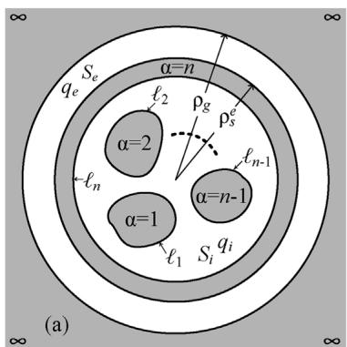

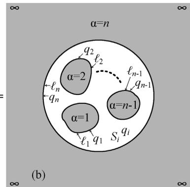

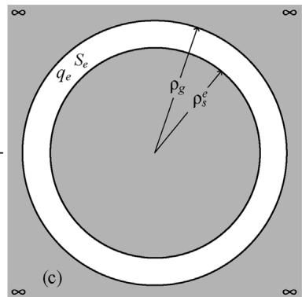  
Fig. 2. Full transmission line cross-section (a) discretizes into internal cross-section (b) and external cross-section (c) which can be solved independently.

we obtain the following integral representation for the potential at the points in the interior region $S _ { i }$

$$
\phi (\boldsymbol {\rho}) = \sum_ {\alpha = 1} ^ {n} \int_ {\ell_ {\alpha}} G \left(\boldsymbol {\rho}, \boldsymbol {\rho} ^ {\prime}\right) q _ {\alpha} \left(\boldsymbol {\rho} ^ {\prime}\right) d l ^ {\prime}, \quad \boldsymbol {\rho} \in S _ {i}. \tag {11}
$$

In derivation of (11) it is taken into account that the surface charge density $q _ { \alpha }$ on the ˛th conductor is equal to the normal derivative of the electric flux D

$$
q _ {\alpha} (\boldsymbol {\rho}) = \hat {\boldsymbol {n}} (\boldsymbol {\rho}) \cdot \boldsymbol {D} (\boldsymbol {\rho}) = - \epsilon_ {0} \nabla \phi (\boldsymbol {\rho}) \cdot \hat {\boldsymbol {n}} (\boldsymbol {\rho}), \quad \boldsymbol {\rho} \in \ell_ {\alpha} \tag {12}
$$

and that due to constant value V of potential on ˛ the integral over the closed surface ˛ containing $\phi \nabla ^ { \prime } G$ in (8) vanishes

$$
\int_ {\ell_ {\alpha}} \phi (\boldsymbol {\rho} ^ {\prime}) \nabla^ {\prime} G (\boldsymbol {\rho}, \boldsymbol {\rho} ^ {\prime}) \cdot \hat {\boldsymbol {n}} \left(\boldsymbol {\rho} ^ {\prime}\right) d l ^ {\prime} = V \int_ {\ell_ {\alpha}} \nabla^ {\prime} G (\boldsymbol {\rho}, \boldsymbol {\rho} ^ {\prime}) \cdot \hat {\boldsymbol {n}} \left(\boldsymbol {\rho} ^ {\prime}\right) d l ^ {\prime} = 0. \tag {13}
$$

Placement of the observation location $\pmb { \rho }$ in (11) on the surfaces of the conductors $\ell _ { \alpha } ,$ , produces the following n coupled integral equations with respect to the sought charge densities $q _ { \alpha ^ { \prime } }$

$$
\sum_ {\alpha^ {\prime} = 1} ^ {n} \int_ {\ell_ {\alpha^ {\prime}}} G \left(\boldsymbol {\rho}, \boldsymbol {\rho} ^ {\prime}\right) q _ {\alpha^ {\prime}} \left(\boldsymbol {\rho} ^ {\prime}\right) d l ^ {\prime} = V _ {\alpha}, \quad \boldsymbol {\rho} \in \ell_ {\alpha}, \tag {14}
$$

where $\alpha { = } 1 , ~ . . . . , n .$ . This provides the contribution from surface charge densities $q _ { \alpha ^ { \prime } }$ on the ˛
 th conductor to the electrical potential $V _ { \alpha }$ on the ˛th conductor.

# 4.1.2. MoM Discretization

To solve the system of integral equations (14) using MoM, the surface of each ˛th conductor is approximated with $M _ { \alpha }$ first-order elements (straight lines) as shown in Fig. 3. The radius-vector on the mth straight element of the mesh discretizing boundaries $\ell _ { \alpha }$ is defined parametrically as

$$
\boldsymbol {\rho} _ {m} ^ {\alpha} (t) = \boldsymbol {v} _ {m} ^ {\alpha , 1} + t \left(v _ {m} ^ {\alpha , 2} - v _ {m} ^ {\alpha , 1}\right), \quad t \in [ 0, 1 ], \quad \alpha = 1, \dots , n \tag {15}
$$

is its length where $\pmb { \nu } _ { m } ^ { \alpha , 2 }$ 2 and v˛,1 m $| \pmb { \nu } _ { m } ^ { \alpha , 2 } - \pmb { \nu } _ { m } ^ { \alpha , 1 } |$ $\pmb { \nu } _ { m } ^ { \alpha , 1 }$ m are the vertices of the mth element on , and $m = 1 , . . . . , M _ { \alpha }$ . T harge density $\ell _ { \alpha } , L _ { m } ^ { \alpha }$ $q _ { \alpha }$ $M _ { \alpha }$ functions as follows:

$$
q _ {\alpha} \left(\boldsymbol {\rho} ^ {\prime}\right) \cong \sum_ {m = 1} ^ {M _ {\alpha}} q _ {m} ^ {\alpha} P _ {m} ^ {\alpha} \left(\boldsymbol {\rho} ^ {\prime}\right), \quad P _ {m} ^ {\alpha} \left(\boldsymbol {\rho} ^ {\prime}\right) = \left\{ \begin{array}{l l} 1, & \boldsymbol {\rho} ^ {\prime} = \boldsymbol {\rho} _ {m} ^ {\alpha} \\ 0, & \boldsymbol {\rho} ^ {\prime} \neq \boldsymbol {\rho} _ {m} ^ {\alpha} \end{array} , \right. \tag {16}
$$

where $q _ { m } ^ { \alpha }$ are the unknown weighting coefficients over each mth element. Substitution of the charge density expansions (16) into the

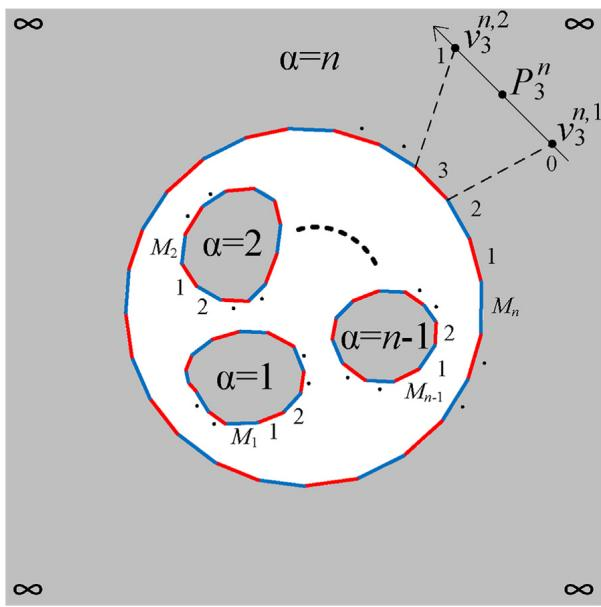  
Fig. 3. Contour meshes used in the MoM discretization of the internal problem of Fig. 2(b). All mesh elements are 1-D straight lines with piece-wise basis functions defined in (16) and different colors are solely used for visualization purposes.

system of integral equations (14), produces the following system of n functional equations with $\begin{array} { r } { N = \sum _ { \alpha = 1 } ^ { n } M _ { \alpha } } \end{array}$ unknowns $q _ { m } ^ { \alpha \prime } ,$

$$
\sum_ {\alpha^ {\prime} = 1} ^ {n} \sum_ {m ^ {\prime} = 1} ^ {M _ {\alpha}} q _ {m ^ {\prime}} ^ {\alpha^ {\prime}} \int_ {0} ^ {1} G (\boldsymbol {\rho}, \boldsymbol {\rho} _ {m ^ {\prime}} ^ {\alpha^ {\prime}} (t ^ {\prime})) d t ^ {\prime} = V _ {\alpha}, \quad \boldsymbol {\rho} \in \ell_ {\alpha}, \tag {17}
$$

where $\alpha = 1 , . . . . , n .$ . Testing each ˛th equation in (17) with $M _ { \alpha }$ ı- functions [22,23]

$$
T _ {m} ^ {\alpha} (\boldsymbol {\rho}) = \delta \left(\boldsymbol {\rho} - \boldsymbol {\rho} _ {m} ^ {\alpha} (1 / 2)\right), \tag {18}
$$

positioned at the centroid of the mth element in the surface discretization of the conductor boundary $\ell _ { \alpha }$ expands the system of n functional equations (17) to the system of N linear algebraic equations (SLAE) with respect to N unknowns $q _ { m ^ { \prime } } ^ { \alpha ^ { \prime } }$

$$
\sum_ {\alpha^ {\prime} = 1} ^ {n} \sum_ {m ^ {\prime} = 1} ^ {M _ {\alpha}} q _ {m ^ {\prime}} ^ {\alpha^ {\prime}} \int_ {0} ^ {1} G \left(\boldsymbol {\rho} _ {m} ^ {\alpha} (1 / 2), \boldsymbol {\rho} _ {m ^ {\prime}} ^ {\alpha^ {\prime}} \left(t ^ {\prime}\right)\right) d t ^ {\prime} = V _ {\alpha}, \tag {19}
$$

where $\alpha = 1 , . . . , 1$ n and $m = 1 , . . . . , M _ { \alpha }$ . In every conductor $\alpha ,$ centroid point of each element collects electrostatic potential contributions from all other elements that discretize the conductors (including itself) in the system. The SLAE (19) is constructed by setting each conductor as an observation conductor while treating all other con-

ductors (including itself) as the source conductors producing the following SLAE in the matrix form

$$
\left[ \begin{array}{c c c} {[ Z ^ {1, 1} ]} & {\dots} & {[ Z ^ {1, n} ]} \\ {\vdots} & {\ddots} & {\vdots} \\ {[ Z ^ {n, 1} ]} & {\dots} & {[ Z ^ {n, n} ]} \end{array} \right] \cdot \left[ \begin{array}{c} {[ q ^ {1} ]} \\ {\vdots} \\ {[ q ^ {n} ]} \end{array} \right] = \left[ \begin{array}{c} {[ V ^ {1} ]} \\ {\vdots} \\ {[ V ^ {n} ]} \end{array} \right]. \tag {20}
$$

Setting proper right-hand side voltage excitations for each conductor $[ V ^ { 1 } ] , . . . . , [ V ^ { n } ]$ , the unknown charges of [qn] can be computed by solving the SLAE in (20). The inner products defining the matrix elements in (20) are

$$
\left[ Z ^ {\alpha , \alpha^ {\prime}} \right] _ {m, m ^ {\prime}} = \int_ {0} ^ {1} G \left(\boldsymbol {\rho} _ {m} ^ {\alpha} (1 / 2), \boldsymbol {\rho} _ {m ^ {\prime}} ^ {\alpha^ {\prime}} \left(t ^ {\prime}\right)\right), d t ^ {\prime}, \tag {21}
$$

where $\alpha , \alpha ^ { \prime }$ are indexes of conductor’s surfaces, $\begin{array} { r } { m = 1 , . . . , M _ { \alpha } , } \end{array}$ and $m ^ { \prime } = 1 , . . . , M _ { \alpha ^ { \prime } }$ are the indexes of the basis and testing functions on the ˛th and ˛
 th conductors, respectively, $M _ { \alpha }$ and $M _ { \alpha ^ { \prime } }$ being the total number of linear elements on the pertinent conductor boundaries. The evaluation of line integrals in (21) is done to the desired precision by analytically solving the singular part ln - -
 /2 [32], and applying the standard Gauss-Legendre K-point quadrature rule [33]

$$
\begin{array}{l} [ Z ^ {\alpha , \alpha^ {\prime}} ] _ {m, m ^ {\prime}} = L _ {m ^ {\prime}} ^ {\alpha^ {\prime}} \int_ {0} ^ {1} \frac {\ln | \pmb {\rho} _ {m} ^ {\alpha} (1 / 2) - \pmb {\rho} _ {m ^ {\prime}} ^ {\alpha^ {\prime}} (t ^ {\prime}) |}{2 \pi} d t ^ {\prime} \\ - L _ {m ^ {\prime}} ^ {\alpha^ {\prime}} \sum_ {k = 1} ^ {K} w _ {k} \left[ G \left(\boldsymbol {\rho} _ {m} ^ {\alpha} (1 / 2), \boldsymbol {\rho} _ {m ^ {\prime}} ^ {\alpha^ {\prime}} \left(t _ {k} ^ {\prime}\right)\right) \right. \tag {22} \\ \left. + \frac {\ln | \rho_ {m} ^ {\alpha} (1 / 2) - \rho_ {m ^ {\prime}} ^ {\alpha^ {\prime}} \left(t _ {q} ^ {\prime}\right) |}{2 \pi} \right] \\ \end{array}
$$

where $t _ { k }$ and $w _ { k }$ are the abscissas and weights of the K-point quadrature rule, respectively $( k = 1 , . . . , K ) . ^ { 4 }$ Upon solution of the SLAE (20), the coefficients of charge density expansions $q _ { m } ^ { \alpha } , \alpha = 1$ , . . ., $n ; m = 1 , . . . , M _ { \alpha }$ in (16) become available. The elements of the internal region $( n \times n )$ capacitance matrix

$$
[ C ^ {i} ] = \left[ \begin{array}{c c c} C _ {1, 1} ^ {i} & \dots & C _ {1, n} ^ {i} \\ \vdots & \ddots & \vdots \\ C _ {n, 1} ^ {i} & \dots & C _ {n, n} ^ {i} \end{array} \right] \tag {23}
$$

are calculated through substitution of (16) into (7) as

$$
[ C ^ {i} ] _ {\alpha , \alpha^ {\prime}} = [ Q ] _ {\alpha} = \int_ {\ell_ {\alpha}} q _ {\alpha} (l) d l = \sum_ {m = 1} ^ {M _ {\alpha}} L _ {m} ^ {\alpha} q _ {m} ^ {\alpha}, \quad V _ {\alpha^ {\prime}} = 1 V, \quad V _ {\alpha} = 0 V, \tag {24}
$$

where $\alpha , \alpha ^ { \prime } { = } 1 , . . . , n .$

# 4.2. The external capacitance extraction problem

The electrostatic field in the external region $S _ { e } ~ ( \mathrm { F i g . } ~ 2 ( \mathrm { c } ) )$ is independent from the electrostatic field in the internal region $S _ { i }$ (Fig. 2(b)). The external region $S _ { e }$ is bounded by two co-centric circular surfaces of the sheath conductor and the circular ground conductor, having radii $\rho _ { s } ^ { e }$ and $\rho _ { g } ,$ , respectively. Therefore, the external capacitance can be found analytically

$$
\mathbb {C} ^ {e} = \frac {2 \pi \epsilon_ {0}}{\ln \left(\rho_ {g}\right) - \ln \left(\rho_ {s} ^ {e}\right)}. \tag {25}
$$

Customarily, the external region capacitance $C ^ { e }$ is arranged into an (n  n) external capacitance matrix [Ce] with all of its elements

equal to zero except for the element $[ C ^ { e } ] _ { n , n }$ which is assigned $C ^ { e }$ value of (25) as follows

$$
\left[ \mathbf {C} ^ {e} \right] = \left[ \begin{array}{c c c} 0 & \dots & 0 \\ \vdots & \ddots & \vdots \\ 0 & \dots & \mathbf {C} ^ {e} \end{array} \right]. \tag {26}
$$

From the canonical form of the external problem and its analytical solution, one can realize that it can be generalized to multiple outer circular conductors similar to that of the classical method [7,9]. Therefore, by having more circular conductor/insulator layers around the internal region in MTL, the increase in computational complexity of the proposed capacitance extraction technique is negligible, as the internal problem and its MoM discretization remain unchanged.

# 4.3. Shunt admittance matrix computation

Once the internal [Ci ] and external [Ce] capacitance matrices are evaluated for free-space using (23) and (26), respectively, the resultant complex capacitance matrix $\big [ C _ { \widehat { \epsilon } } ^ { \Sigma } \big ]$ in the presence of the external and internal region dielectrics is evaluated as a sum of the internal complex capacitance matrix $[ C _ { \hat { \epsilon } } ^ { i } ]$ ] and the external one from (4)

$$
\begin{array}{l} \left[ C _ {\hat {\epsilon}} ^ {\Sigma} \right] = \left[ C _ {\hat {\epsilon}} ^ {i} \right] + \left[ C _ {\hat {\epsilon}} ^ {e} \right] \tag {27} \\ = (\epsilon^ {i} [ C ^ {i} ] + \epsilon^ {e} [ C ^ {e} ]) + \frac {1}{j \omega \epsilon_ {0}} (\sigma^ {i} [ C ^ {i} ] + \sigma^ {e} [ C ^ {e} ]). \\ \end{array}
$$

The resulting complex capacitance matrix $[ C _ { \hat { \epsilon } } ^ { \Sigma } ]$ is then used to form the sought p.u.l. admittance matrix [Y] as

$$
[ Y ] = j \omega [ C _ {\hat {\epsilon}} ^ {\Sigma} ]. \tag {28}
$$

Since $[ Y ] = [ G ^ { \Sigma } ] + j \omega [ C ^ { \Sigma } ] ,$ , where $[ C _ { \Sigma } ]$ is the p.u.l. capacitance matrix and $\left[ G _ { \Sigma } \right]$ is the p.u.l. conductance matrix, $\bar { [ \cal C } _ { \hat { \epsilon } } ^ { \Sigma } ]$ can be written as

$$
\left[ C _ {\hat {\epsilon}} ^ {\Sigma} \right] = \frac {1}{j \omega} \left[ G _ {\Sigma} \right] + \left[ C _ {\Sigma} \right], \tag {29}
$$

and hence the p.u.l. parameter matrices $[ C ^ { \Sigma } ]$ and $[ G ^ { \mathcal { Z } } ]$ may be seen as

$$
[ C _ {\Sigma} ] = [ C ^ {i} ] \cdot \epsilon^ {i} + [ C ^ {e} ] \cdot \epsilon^ {e}, \tag {30}
$$

$$
\left[ G _ {\Sigma} \right] = \frac {\sigma^ {i}}{\epsilon_ {0}} \cdot \left[ C ^ {i} \right] + \frac {\sigma^ {e}}{\epsilon_ {0}} \cdot \left[ C ^ {e} \right]. \tag {31}
$$

One can see from (30) and (31) that the dependence of the resultant capacitance and conductance matrices $[ C _ { \Sigma } ]$ ] and $[ G _ { \Sigma } ]$ is defined by the frequency dependence of the relative permittivities $\epsilon ^ { i , e }$ and conductivities $\sigma ^ { i , e }$ . For practical cable models however, these parameters are only available for the rated operating frequency (i.e. 50 Hz or 60 Hz) in terms of the dielectric constant $\epsilon _ { r }$ and loss tangent (tanı) as

$$
\hat {\epsilon} = \epsilon + \frac {\sigma}{j \omega \epsilon_ {0}} = \epsilon_ {0} \epsilon_ {r} (1 - j \tan \delta). \tag {32}
$$

Thus in practical problems both $\epsilon ^ { i , e }$ and $\sigma ^ { i , e }$ are independent of the frequency making frequency dependence of $[ C _ { \Sigma } ]$ ] and $\left[ G _ { \Sigma } \right]$ matrices negligible. This is consistent with the observations made in [6]. It is important to note that in the event that both $\epsilon _ { r }$ and tanı are available for different frequencies, the proposed method can provide the resultant frequency dependent capacitance and conductance matrices as defined in (30) and (31), respectively. In either case, the MoM solution for computing [Ci ] is independent of the frequency making the MoM solution of admittance matrix considerably faster than that of impedance matrix as exemplified in Table 2.

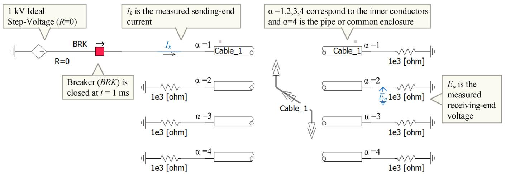  
Fig. 4. Open-circuit test network configuration in the commercial EMTP software [34] where the cable has 4 conductors $( \alpha = 1 , . . . . 4 )$ as in Figs. 1(a) and (b). In this configuration for performing open circuit test, non-energized conductors are separated from ground via a 1 k resister. For short circuit tests, 1 m resisters are used to connect nonenergized conductors to ground. The first conductor of the cable (˛ = 1) is energized using a step voltage. During short circuit tests, the sending-end curren $I _ { k }$ is measured over the first conductor while the receiving-end voltage $E _ { a }$ induced on the second conductor is observed during open-circuit tests. Total simulation time is 0.02 s and the time step is selected as 10 -s. The length of the cable is 20 km.

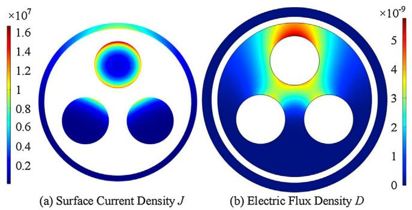  
Fig. 5. With a 1 kHz excitation of the first conductor in the pipe-type cable shown in Fig. 1(a), the surface current density J $\left( \mathsf { A } / \mathsf { m } ^ { 2 } \right) \left( \mathsf { a } \right)$ , and the electric flux density D (C/m2) (b) are induced on the conductors and insulators, respectively.

# 4.4. Optimization

The MoM discretization of the electrostatics for extracting the shunt capacitance and conductance matrices explained in Section 4.1.2 can be optimized using the techniques introduced in [19]. In particular, in addition to shared-memory parallelization (Section II-D of [19]) and using Intel C++ compiler (Section II-E of [19]), it is possible to gain efficiency and at the same time guarantee reliable results for [Y] computations, by adaptively refining the contour mesh and comparing the results with the last iteration (Section II-B of [19]). In the sequel, this is demonstrated through numerical results.

# 5. Results and discussion

In this section, we study the performance of obtaining the electrical parameters of the realistic cable models shown in Fig. 1 using different techniques. In addition to the proposed techniques of impedance and admittance extraction based on the MoM, results from the classical closed-form approximations [5,7] and the commercial FEM software (COMSOL [28]) are included for comparison. Appendices A and B explain how the p.u.l. parameter matrices can be formed from the results of FEM and MoM with several experiments. In all examples herein, the dielectric loss is zero $( \sigma ^ { i , e } = 0 )$ . Thus accord-

ing to (31), all elements of the conductance matrix [G] are zero.

The extracted parameters are first studied in the frequency domain, and then used in time domain transient analysis using the commercial EMTP software, PSCAD/EMTDC [34]. Time domain simulations involving several cable configurations are performed. The network configuration for the cables with 4 conductors (i.e. Figs. 1(a) and (b)) are depicted in Fig. 4. Cables with 5 conductors are analyzed with similar configuration. The frequency dependent wide-band model (Universal transmission line model [3]) is used for the transient study and the MoM and FEM parameters are entered through the manual data entry method (multiple frequency option) in PSCAD/EMTDC. In all the transient simulations herein, 101 frequency samples are considered in the range of $( 0 . 5 \mathrm { H z } \leq f \leq 1 \mathrm { M H z } )$ .

# 5.1. Pipe-type cable: Fig. 1(a)

The classical method of parameter extraction for the pipe-type cable shown in Fig. 1(a) was introduced in 1980 [7,9] based on closed-form approximations of the parameters that neglect the proximity-effect. As shown in [11], neglecting the proximity-effect may lead to inaccurate results in both frequency and time domain simulations. Fig. 5 plots the surface current density ${ \mathsf { I } } ( { \mathsf { A } } / { \mathsf { m } } ^ { 2 } )$ induced on the conductors of the pipe-type cable and the electric flux density $D \left( { \mathsf { C } } / { \mathsf { m } } ^ { 2 } \right)$ accumulated in its insulators due a 1 kHz excitation of the upper inner conductor (˛ = 1). From this figure, one can see the effect of conductors in proximity of the excited conductor on J and D which directly influence the extracted series impedance [17] and shunt admittance (12) of the cable, respectively. Although closed-form approximate formulas have been proposed for canonical geometries [11], such complex behavior of the pertinent fields, makes it difficult to come up with similar approximations for different types of cable geometries.

In order to numerically compare the effect of the proximityeffect on the computed p.u.l. resistance [R] and inductance [L] matrices, we compute these $( 4 \times 4 )$ matrices using MoM discretization of the SVS-EFIE [19] and a commercial EMTP software [34] which uses the classical approach [7]. Several frequencies spanning the power systems spectrum $( 0 . 5 { \le } f { \le } 1  { \mathrm { M H z } } )$ are considered.

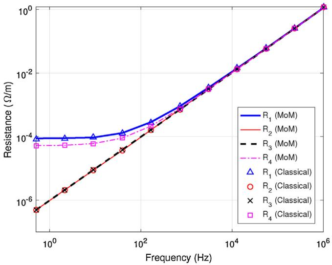  
Fig. 6. The extracted [R] values of the cable shown in Fig. 1(a) using the classical [7] and the proposed MoM techniques.

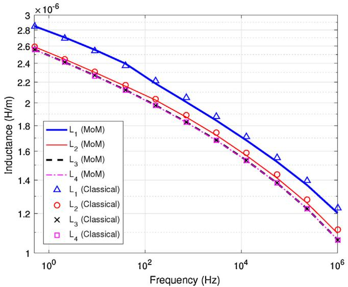  
Fig. 7. The extracted [L] values of the cable shown in Fig. 1(a) using the classical [7] and the proposed MoM techniques.

Due to symmetry, the parameter matrices [R], [L], and [C] have the following form

$$
[ C ] = \left[ \begin{array}{l l l l} C _ {1} & C _ {2} & C _ {2} & C _ {3} \\ C _ {2} & C _ {1} & C _ {2} & C _ {3} \\ C _ {2} & C _ {2} & C _ {1} & C _ {3} \\ C _ {3} & C _ {3} & C _ {3} & C _ {4} \end{array} \right] \tag {33}
$$

where it is noticed that only 4 unique numbers are present. The capacitance matrix in (33) is arranged consistent with the conductor numbers ˛ = 1, . . ., 4 depicted in Fig. 1(a). Thus $[ C ] _ { 1 , 1 } = C _ { 1 }$ is the self capacitance of conductor 1, $[ C ] _ { 1 , 2 } = C _ { 2 }$ is the mutual capacitance of conductors 1 and 2, etc. In this paper, this convention has been used in all p.u.l. matrices in relation to the cables and their corresponding conductor numbers depicted in Fig. 1.

Figs. 6 and 7, plot the four values in (33) for [R] and [L], respectively. Except for $L _ { 1 }$ , the difference is not visually obvious and a more rigorous error analysis is required. Fig. 8 plots the relative error (equation (2) of [19]) in the p.u.l. resistance R where the proposed proximity-effect aware MoM technique is used as the

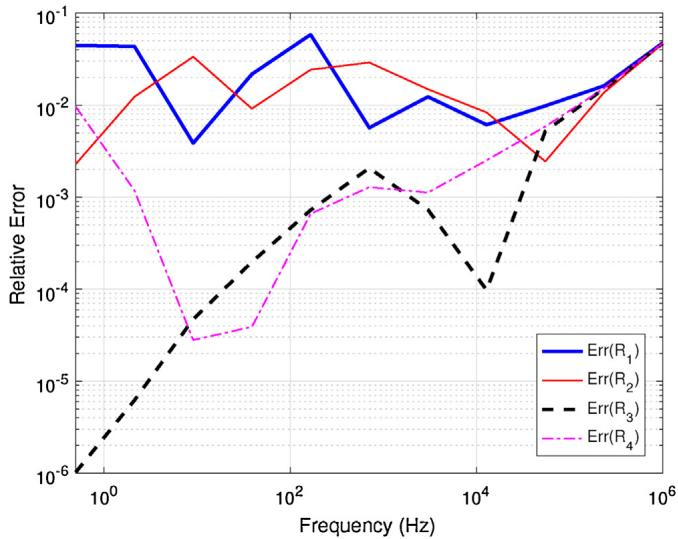  
Fig. 8. The relative error in the [R] matrix of the cable shown in Fig. 1(a) computed by the classical proximity-blind approximate formula [7]. The proximity-aware SVS-EFIE discretized with MoM is used as the reference solution.

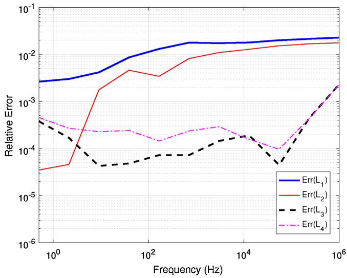  
Fig. 9. The relative error in the [L] matrix of the cable shown in Fig. 1(a) computed by the classical proximity-blind approximate formula [7]. The proximity-aware SVS-EFIE discretized with MoM is used as the reference solution.

reference solution. In Fig. 8, the maximum relative error is about 6.2% and the average relative error is about 1.2%. Similarly, Fig. 9 compares results for the inductance matrix [L] computed by the classical formula and the MoM technique. The maximum relative error is about 2.2% while the average relative error is at about 0.5%.

Next, the computed capacitance matrices are compared. Table 1 tabulates the results obtained by the classical approach, the FEM, and the MoM technique proposed herein. The relative errors are also given as percentage values computed using equation (2) of [19] where FEM is used as the reference solution. It is clear that the MoM and FEM techniques are in close agreement with maximum relative error of about 0.2%, while the classical approximate formula provides results plagued with errors up to about 26.7%.

In order to study the effect of such error levels in the p.u.l. [R], [L], and [C] parameters on the resulting transient simulations, three sets of $[ Z ] = [ R ] + j \omega [ L ]$ and [Y] = jω[C] are considered. The first set uses the classical method for computing both [Z] and [Y]. The second set uses the MoM solution proposed in this work to compute both [Z] and [Y], and the third set computes [Z] and [Y] using MoM and FEM, respectively.

Table 1 The p.u.l. capacitance values (F/m) computed using different techniques for the cables shown in Fig. 1. The relative error is computed using equation (2) of [19] as a percentage with FEM being the reference solution. Arrangement of the entries of matrices are consistent with the numbering of conductors shown in Fig. 1.   

<table><tr><td>Cable model</td><td>Method</td><td>C1in (33)</td><td>C2in (33)</td><td>C3in (33)</td><td>C4in (33)</td><td></td></tr><tr><td rowspan="5">Pipe-type in Fig. 1(a)</td><td>Classical [7]</td><td>1.8008e-10</td><td>-4.3457e-11</td><td>-9.3166e-11</td><td>1.4939e-09</td><td></td></tr><tr><td>(Relative error)</td><td>(10.95%)</td><td>(15.69%)</td><td>(26.70%)</td><td>(6.38%)</td><td></td></tr><tr><td>Proposed MoM</td><td>2.0214e-10</td><td>-3.7536e-11</td><td>-1.2707e-10</td><td>1.5990e-09</td><td></td></tr><tr><td>(Relative error)</td><td>(0.04%)</td><td>(0.07%)</td><td>(0.03%)</td><td>(0.20%)</td><td></td></tr><tr><td>FEM [28]</td><td>2.0223e-10</td><td>-3.7562e-11</td><td>-1.2711e-10</td><td>1.5958e-09</td><td></td></tr><tr><td rowspan="5">Three-sector in Fig. 1(b)</td><td>Aprx. [5,6]</td><td>3.3728e-10</td><td>-9.0935e-11</td><td>-1.5541e-10</td><td>1.6807e-09</td><td></td></tr><tr><td>(Relative error)</td><td>(0.06%)</td><td>(1.26%)</td><td>(1.38%)</td><td>(0.38%)</td><td></td></tr><tr><td>Proposed MoM</td><td>3.3704e-10</td><td>-9.1926e-11</td><td>-1.5319e-10</td><td>1.6774e-09</td><td></td></tr><tr><td>(Relative error)</td><td>(0.13%)</td><td>(0.19%)</td><td>(0.06%)</td><td>(0.18%)</td><td></td></tr><tr><td>FEM [28]</td><td>3.3749e-10</td><td>-9.2102e-11</td><td>-1.5329e-10</td><td>1.6743e-09</td><td></td></tr><tr><td>Cable model</td><td>Method</td><td>C1in (34)</td><td>C2in (34)</td><td>C3in (34)</td><td>C4in (34)</td><td></td></tr><tr><td rowspan="5">Four-sector in Fig. 1(c)</td><td>Aprx. (35)</td><td>2.9843e-10</td><td>-9.0935e-11</td><td>0.0000e+00</td><td>-1.1656e-10</td><td></td></tr><tr><td>(Relative error)</td><td>(1.95%)</td><td>(4.66%)</td><td>(100%)</td><td>(1.86%)</td><td></td></tr><tr><td>Proposed MoM</td><td>2.9213e-10</td><td>-8.6648e-11</td><td>-4.4920e-12</td><td>-1.1434e-10</td><td></td></tr><tr><td>(Relative error)</td><td>(0.19%)</td><td>(0.27%)</td><td>(0.02%)</td><td>(0.07%)</td><td></td></tr><tr><td>FEM [28]</td><td>2.9270e-10</td><td>-8.6884e-11</td><td>-4.4931e-12</td><td>-1.1443e-10</td><td></td></tr><tr><td>Cable model</td><td>Method</td><td colspan="4">[C]</td><td></td></tr><tr><td rowspan="3">Mixed in Fig. 1(d)</td><td>Proposed MoM</td><td colspan="5">[2.9371e-10 -8.7060e-11 -5.6367e-12 -8.2185e-11 -1.1882e-10 -8.7060e-11 -2.9198e-10 -8.7060e-11 -3.5199e-12 -1.1434e-10 -5.6367e-12 -8.7060e-11 -2.9371e-10 -8.2187e-11 -1.1882e-10 -8.2185e-11 -3.5202e-12 -8.2187e-11 -2.7330e-10 -1.0541e-10 -1.1882e-10 -1.1434e-10 -1.1882e-10 -1.0541e-10 -1.6752e-09</td></tr><tr><td>(Relative error)</td><td colspan="5">[0.17% 0.28% 0.50% 0.13% 0.12% 0.28% 0.19% 0.28% 0.53% 0.08% 0.50% 0.28% 0.17% 0.13% 0.12% 0.13% 0.54% 0.13% 0.07% 0.01% 0.12% 0.08% 0.12% 0.01% 0.18%</td></tr><tr><td>FEM [28]</td><td colspan="5">[2.9422e-10 -8.7306e-11 -5.6653e-12 -8.2294e-11 -1.1896e-10 -8.7306e-11 2.9254e-10 -8.7306e-11 -3.5012e-12 -8.2294e-11 -1.1896e-10 -8.2294e-11 -3.5012e-12 -8.2294e-11 2.7349e-10 -1.0540e-10 -1.1896e-10 -1.1443e-10 -1.1896e-10 -1.0540e-10 1.6722e-09</td></tr></table>

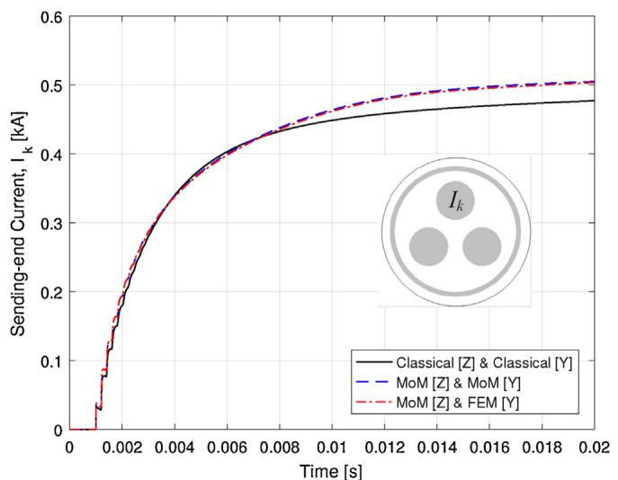  
Fig. 10. The sending-end current Ik during short-circuit test for the pipe-type cable. The conductor that carries Ik is shown in the inset (Conductor 1 in Fig. 1(a)).

Fig. 10 compares the sending-end current for short-circuit study while Fig. 11 compares the open-circuit induced voltage. Although transient simulation results follow somewhat the same behavior, a noticeable difference is observed between the first set of parameters and the other two set, as the classical method does not consider the proximity-effect. The simulation results from the two latter cases are in a good agreement showing the accuracy of the proposed MoM capacitance extraction technique in capturing the proximity-

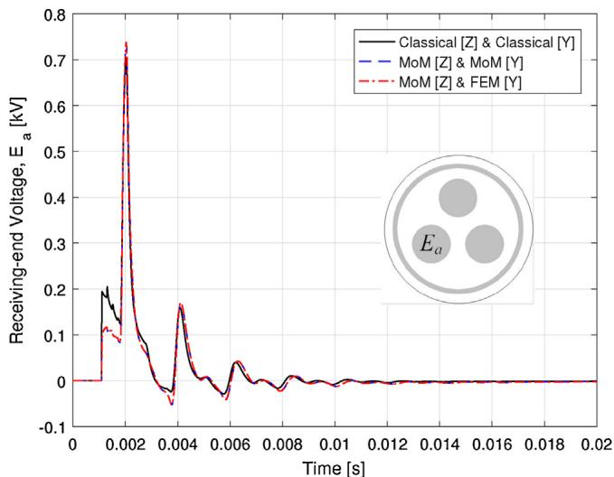  
Fig. 11. The receiving-end voltage E during open-circuit test for the pipe-type cable. The inset shows the conductor in which Ea is induced (Conductor 2 in Fig. 1(a)).

effect. Such error behavior in the transient simulations is consistent with the error levels in the computed p.u.l. parameters observed above.

Depending on the system of interest and the nature of the study, the above mentioned errors caused by neglecting the proximityeffect, may or may not alter the accuracy of EMTP simulations. That is, despite the fact that the classical approximate closed-form expressions are susceptible to producing the error levels demon-

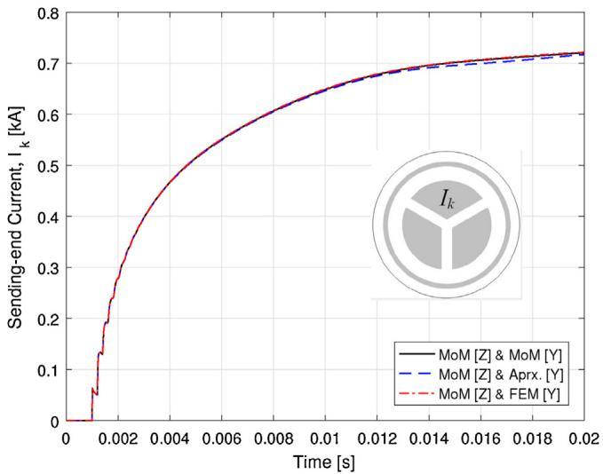  
Fig. 12. The sending-end current Ik during short-circuit test for the three-sector cable. The conductor that carries Ik is shown in the inset (Conductor 1 in Fig. 1(b)).

strated above, they have been adopted by EMTP software and successfully applied to many transient studies over several decades. However, as demonstrated above, the need for more accurate cable modeling capabilities including the proximity-effect is becoming increasingly evident in recent years. Particularly, in simulations involving sensitivity analysis it is reasonable to expect 2 to 3 digits of precision form the EMTP computations. Furthermore, accurate modeling of the proximity-effect have been shown to be important in high-frequency transient simulations such as lightening studies [35], as well as modeling of umbilical cables used to control and monitor sub-sea equipment [8].

# 5.2. Three-sector cable: Fig. 1(b)

The parameter matrices of this cable are also subject to symmetry similar to the one in (33). It was suggested in [5,6] to use approximate formulas for extracting the capacitance matrix of the 3-sector cable depicted in Fig. 1(b). Along with such closedform approximations, Table 1 presents results computed with the proposed MoM capacitance extraction technique, as well as FEM results. It is noticed that both the MoM and approximate closed-form expressions agree with the FEM results. The maximum relative error due to the approximate formulas is about 1.38% while MoM has computed the capacitance values with no more than 0.19% error in the solution.

For transient simulations, the three sets of [Z] and [Y] matrices all use the same impedance matrices computed by the proposed MoM but they use three different admittance extraction techniques of MoM, approximate formulas used in [6], and FEM. Figs. 12 and 13 show the transient simulation results. The sending-end current as well as the induced voltage on the receiving-end are in a good agreement for all cases. However, in Fig. 12 a small deviation of the set containing closed-form approximate values of [C] from the other two is observed, after 0.014 s. This may be caused by the small errors (about 1%) in the extracted parameters computed by closed-form approximate formulas.

From the above simulation results, one can see that both the approximate formulas and the MoM can produce accurate p.u.l. capacitance matrix for this three-sector cable and the resulting transient simulations match in all cases. This is consistent with the findings in [5,6] for the same three-sector cable which showed accuracy of the approximate formulas for computing the capacitance matrix. This may be seen as an example where the classical formulations can produce reliable capacitance matrix [C] and the

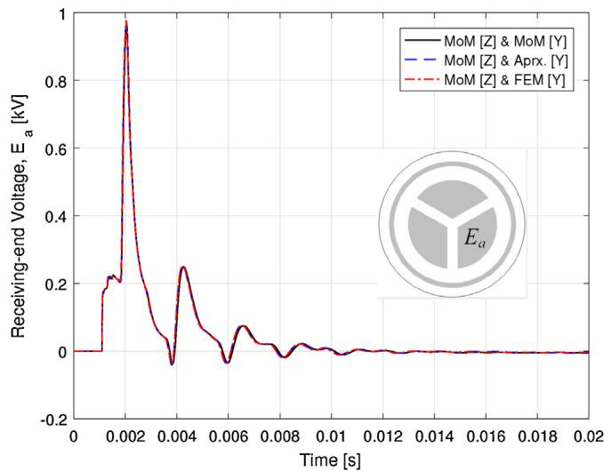  
Fig. 13. The receiving-end voltage $E _ { a }$ during open-circuit test for the three-sector cable. The inset shows the conductor in which Ea is induced (Conductor 2 in Fig. 1(b)).

proposed MoM may be used as a validation tool with reasonable computing time.

# 5.3. Four-sector cable: Fig. 1(c)

The parameter matrices for this cable are all (5 5) matrices. Due to symmetry, the capacitance matrix [C] has only 5 unique numbers and have the following form

$$
[ C ] = \left[ \begin{array}{l l l l l} C _ {1} & C _ {2} & C _ {3} & C _ {2} & C _ {4} \\ C _ {2} & C _ {1} & C _ {2} & C _ {3} & C _ {4} \\ C _ {3} & C _ {2} & C _ {1} & C _ {2} & C _ {4} \\ C _ {2} & C _ {3} & C _ {2} & C _ {1} & C _ {4} \\ C _ {4} & C _ {4} & C _ {4} & C _ {4} & C _ {5} \end{array} \right]. \tag {34}
$$

Similar to the approximate formulas defined in [5,6], it is possible to derive approximate closed-form expressions for (34) as

$$
\begin{array}{l} C _ {1} = 2 C _ {c} + C _ {s}, \quad C _ {2} = - C _ {c}, \quad C _ {3} = 0, \tag {35} \\ C _ {4} = - C _ {s}, \quad C _ {5} = 4 C _ {s} + C _ {g} \\ \end{array}
$$

where

$$
C _ {c} = \frac {\epsilon_ {0} \epsilon_ {r} r _ {1}}{d _ {c}}, \quad C _ {s} = \frac {2 \pi \epsilon_ {0} \epsilon_ {r}}{4 \cdot \ln \left(\frac {r _ {2}}{r _ {1}}\right)}, \quad C _ {g} = \frac {2 \pi \epsilon_ {0} \epsilon_ {r}}{\ln \left(\frac {r _ {4}}{r _ {3}}\right)}. \tag {36}
$$

Fig. 14, depicts such approximations. To the best of our knowledge no closed-form expression for the mutual capacitance of two nonadjacent sectors (e.g.  = 1,3 in Fig. 1(c)) are available, and thus we neglect these values (i.e. $C _ { 3 } = 0 )$ . The p.u.l. capacitance values are tabulated in Table 1. For the approximate formula (35), 100% error in $C _ { 3 }$ and 4.66% error in $C _ { 2 }$ are notable while MoM exhibits maximum relative error of 0.27% in $C _ { 2 } .$ .

Results from the pertinent time-domain simulations are plotted in Figs. 15 and 16. In all cases, MoM is used to produce [Z], but results from different techniques are used for the [Y] matrix. The sendingend current (Fig. 15) as well as the receiving-end induced voltage (Fig. 16) are in close agreement where MoM and FEM capacitance extractions are used. The approximated [Y] matrix using (35) has resulted in transient simulations similar to the reference solution but deviations are seen after about 0.005 s in Fig. 15. This may be the result of setting $C _ { 3 } = 0$ in (35) or 4.66% error in $C _ { 2 }$ .

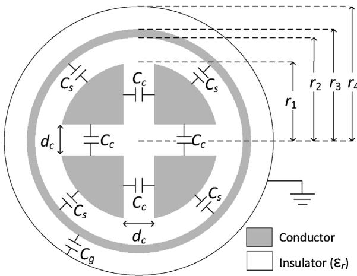  
Fig. 14. Approximating the capacitances of a four-sector cable similar to the techniques used for three-sector cables [5,6].

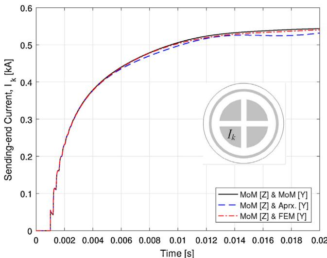  
Fig. 15. The sending-end current I during short-circuit test for the four-sector cable. The conductor that carries $I _ { k }$ is shown in the inset (Conductor 1 in Fig. 1(c)).

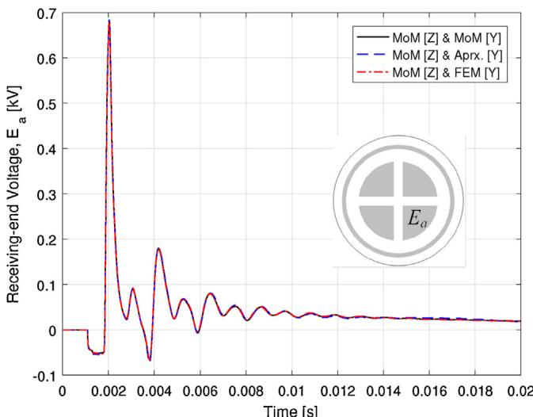  
Fig. 16. The receiving-end voltage E during open-circuit test for the four-sector cable. The inset shows the conductor in which Ea is induced (Conductor 4 in Fig. 1(c)).

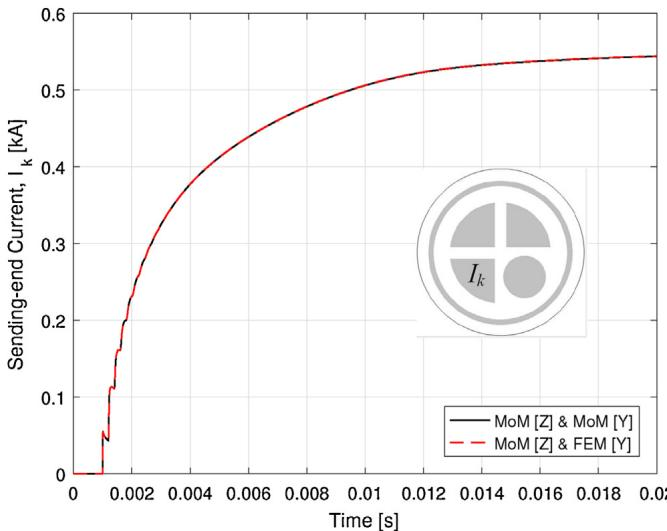  
Fig. 17. The sending-end current Ik during short-circuit test for the mixed cable. The conductor that carries Ik is shown in the inset (Conductor 1 in Fig. 1(d)).

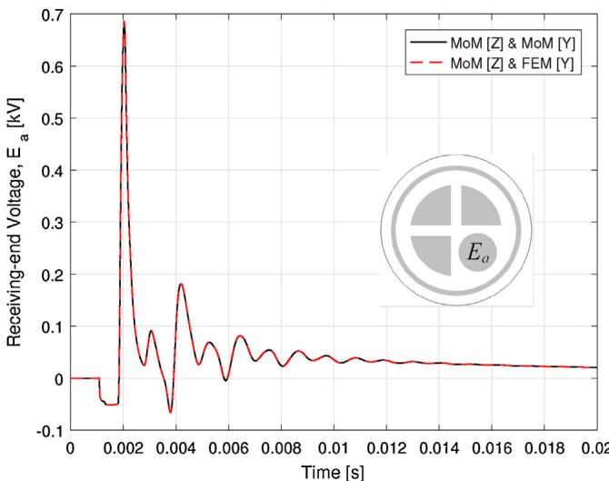  
Fig. 18. The receiving-end voltage Ea during open-circuit test for the mixed cable. The inset shows the conductor in which Ea is induced (Conductor 4 in Fig. 1(d)).

# 5.4. Mixed cable: Fig. 1(d)

For this example, no analytical formulas for capacitance parameters are available. The $( 5 \times 5 )$ capacitance matrices computed using FEM and MoM are given in Table 1. The agreement between the extracted parameters are satisfactory with maximum relative error of 0.54%.

For transient simulations, both sets use MoM computed [Z] with different admittance matrices. The first set uses MoM computed [Y] while the second set uses the [Y] computed by FEM. The sendingend currents and the receiving-end induced voltages are plotted in Figs. 17 and 18. The simulation results are in close agreement which is consistent with matching p.u.l. parameters in Table 1 for this cable.

# 5.5. Study of computational efficiency

In order to analyze the efficiency of the proposed MoM parameter extraction mechanisms, Table 2 presents the computational time taken for extracting parameters of the cables shown in Fig. 1. Simulations are done on the same laptop that was used in [19]. It has Intel Core i7-3920XM CPU with 3.1 GHz max frequency and

Table 2 Runtime detail for a total of 101 frequencies when computing the electrical parameters of cables shown in Fig. 1 using the proposed MoM techniques. Reported times are rounded to 1s precision.   

<table><tr><td>Cable model</td><td>[Z]</td><td>[Y]</td><td>Total</td><td>Avrg. per freq.</td></tr><tr><td>Pipe-type in Fig. 1(a)</td><td>5 m</td><td>2 s</td><td>5 m : 3 s</td><td>3 s</td></tr><tr><td>Three-sector in Fig. 1(b)</td><td>5 m : 33 s</td><td>2 s</td><td>5 m : 35 s</td><td>3.3 s</td></tr><tr><td>Four-sector in Fig. 1(c)</td><td>5 m : 11 s</td><td>2 s</td><td>5 m : 14 s</td><td>3.1 s</td></tr><tr><td>Mixed in Fig. 1(d)</td><td>5 m : 46 s</td><td>2 s</td><td>5 m : 49 s</td><td>3.4 s</td></tr></table>

equipped with 4 physical cores and 8 threads with 16 GB of memory. From Table 2, it can be seen that the impedance extraction has taken the majority of the total time and computing the admittance matrix as explained in this paper, takes only about 2 s. This is expected as the MoM solution of the impedance matrix [19] should be computed at 101 different frequency points while computing the admittance matrix requires MoM independent of the frequency as discussed in Section 4.3. This is also partially achieved due to the adaptive refining of the contour mesh as discussed in Section 4.4 which also guarantees converged numerical results. As explained in Appendix A, symmetry can be used to reduce the number of MoM computations. Nevertheless, to have a consistent comparison for all cases, for each cable with  conductors,  MoM experiments are performed when collecting the computational times reported in Table 2.

It is important to note that by using the MoM discretization of the V-EFIE for frequencies under 100 Hz (Section 3), the CPU time has dropped from 11 m : 29 s in TABLE III of [19] to 5 m : 11 s in Table 2 herein.

# 6. Conclusion

It is shown in this paper that both impedance and admittance matrices of power cable systems can efficiently and accurately be computed using the proposed MoM technique. For the realistic examples studied in this paper, computations are done under 6 min. Considering that these types of computations are done only once for a power cable system, it is reasonable to suggest the use of such efficient and accurate numerical techniques in power systems cable modeling. This not only provides capability for modeling both the skin- and proximity-effects for any arbitrary cable design, it also guarantees reliable results by iteratively solving for the pertinent unknowns numerically until a desired accuracy is achieved. The time domain EMTP analysis reveals that using classical closedform approximations can lead to errors in the transient analysis, making use of efficient CEM techniques (such as the one proposed) in cable modeling imperative to reliable EMTP studies. That is, for unconventional cable designs where no classical formulas are available, such CEM techniques can provide reliable data with reasonable computing resources. For conventional cable designs for which approximate formulas do exist, the CEM techniques can be used to estimate the accuracy of such closed-form approximations and provide guidelines as to whether classical approximation techniques are reliable or otherwise. Numerical results studied in this paper demonstrate both scenarios.

# Appendix A. Series impedance [Z] extraction using CEM over multiple frequencies

Consider a power cable consisting of four inner core conductors and an outer sheath as depicted in Fig. 1(d) where conductors are labeled with $\alpha = 1 , 2 , . . . , 5$ . The corresponding power cable system can be characterized by $\mathsf { a } \left( 5 \times 5 \right)$ impedance matrix [Z]. However, in numerical experiments, it is common to obtain the columns of the inverse of [Z]. Each column of $[ Z ] ^ { - 1 }$ can be obtained by a separate numerical experiment, when one of the conductors is excited by

a voltage drop $V _ { \mathrm { p . u . l } }$ and others are connected to ground. Thus, for the cable in Fig. 1(d), the first column of $[ Z ] ^ { - 1 }$ is calculated as [30]

$$
\left[ \begin{array}{l} Z _ {1, 1} ^ {- 1} \\ Z _ {2, 1} ^ {- 1} \\ Z _ {3, 1} ^ {- 1} \\ Z _ {4, 1} ^ {- 1} \\ Z _ {5, 1} ^ {- 1} \end{array} \right] = \left[ \begin{array}{l} I _ {1, 1} / V _ {\mathrm {p . u . l .}} \\ I _ {2, 1} / V _ {\mathrm {p . u . l .}} \\ I _ {3, 1} / V _ {\mathrm {p . u . l .}} \\ I _ {4, 1} / V _ {\mathrm {p . u . l .}} \\ I _ {5, 1} / V _ {\mathrm {p . u . l .}} \end{array} \right], \tag {A.1}
$$

where $I _ { \alpha , 1 }$ is the resulting current in the ˛th conductor due to p.u.l. voltage drop excitation of the first conductor, $\alpha = 1 , . . . , 5 .$ The column in $( \mathsf { A } . 1 ) ,$ , corresponds to the condition where the core conductor with $\alpha = 1$ is driven by $V _ { \mathrm { p . u . l } }$ . voltage drop (e.g. 1 V) and the core conductors with $\alpha = 2 , 3$ , 4 plus the sheath $\left( \alpha = 5 \right)$ ) are connected to ground. The current $I _ { \alpha , 1 }$ is calculated from the volume current density $j _ { \alpha , 1 }$ obtained from either FEM or MoM simulation. In (A.1), $Z _ { \alpha , 1 } ^ { - 1 }$ is the ˛th element in the first column of $[ Z ] ^ { - 1 }$ and it is important to note that in order to obtain [Z], all elements o $: [ Z ] ^ { - 1 }$ has to be evaluated first. In addition to the experiment described above, 4 more similar experiments should be carried out where other conductors $( \alpha = 2 , 3 , 4 , 5 )$ are excited and the rest grounded. The resulting $[ Z ] ^ { - 1 }$ is then inverted to obtain [Z].

Notice, that FEM simulation produces the volume current density $j ^ { ( \mathrm { F E M } ) }$ directly; thus it can be simply integrated over the discretized domain of the ˛th conductor. As such, the volume current density j is approximated by a constant in each triangle

$$
I _ {\alpha , 1} ^ {(\mathrm {F E M})} = \sum_ {n = 1} ^ {N ^ {\alpha}} j _ {n} ^ {\alpha , 1 (\mathrm {F E M})} S _ {\Delta n} \tag {A.2}
$$

where $N ^ { \alpha }$ is the number of triangles discretizing the ˛th conductor and $S _ { \Delta _ { n } }$ is the area of the nth triangle. In the commercial FEM software COMSOL [28], this is done by the following configurations:

• Space Dimension: 2-D   
• Physics: AC/DC, Magnetic and Electric Fields (mef)   
• Study: Frequency Domain   
• Derived Values: Surface Integration

where the initial value (excitation) on the ˛th conductor is set to “External Current Density” with $J _ { \mathrm { e } } ^ { \mathrm { x } } = J _ { \mathrm { e } } ^ { \mathrm { y } } = 0$ and $J _ { \mathrm { e } } ^ { z } = \mathbf { \sigma } \mathbf { \sigma } \mathbf { \cdot } \mathbf { V } _ { \mathrm { p . u . l } } =$ $5 . 8 \mathrm { e } 7 ( \mathrm { A } / \mathrm { m } ^ { 2 } )$ where $\sigma _ { \updownarrow }$ is the conductivity of copper. As was discussed in [19], the air surrounding the cable is bound to a 1 m radius ring conductor which is sometimes referred to as the return path or the (n + 1)th conductor.

In contrast to the volume current density $j ^ { ( \mathrm { F E M } ) }$ produced by FEM, the SVS-EFIE formulation produces the auxiliary surface current density $J _ { s } ^ { ( \mathrm { S V S - E F I E } ) }$ . Therefore, applying surface-to-volume operator is required to convert surface current density into its corresponding volume current density

$$
I _ {\alpha , 1} ^ {(\text {S V S - E F I E})} = \sum_ {n = 1} ^ {N ^ {\alpha}} \underbrace {\left(\left[ \left[ Z _ {\sigma_ {\alpha}} ^ {S ^ {\alpha} , \partial S ^ {\alpha}} \right] _ {n , 1} \dots \left[ Z _ {\sigma_ {\alpha}} ^ {S ^ {\alpha} , \partial S ^ {\alpha}} \right] _ {n , M ^ {\alpha}} \right] J _ {n} ^ {\alpha , 1 (\text {S V S - E F I E})}\right)} _ {J _ {n} ^ {\alpha , 1, (\text {S V S - E F I E})}} S _ {\Delta n} \tag {A.3}
$$

In (A.3), $\left[ Z _ { \sigma _ { \alpha } } ^ { S ^ { \alpha } , \partial S ^ { \alpha } } \right] _ { n , 1 }$ is the first element of the nth row of the discretized surface-to-The detailed discussto-volume operator operator the numecan be fo $Z _ { \sigma _ { \alpha } } ^ { S ^ { \alpha } , \partial S ^ { \alpha } }$ for the ˛th conductor.aluation of the surface-[17,36]. After applying $Z _ { \sigma _ { \alpha } } ^ { S ^ { \alpha } , \partial S ^ { \alpha } }$ ˛ it to the auxiliary surface current density $J _ { s } ^ { ( \mathrm { S V S - E F I E } ) }$ , it produces

volume current density j (SVS−EFIE) that is integrated over the ˛th conductor similar to FEM (A.2).

Assuming reciprocity holds, the impedance matrix [Z] and its inverse $[ Z ] ^ { - \overline { { 1 } } }$ are symmetric, so $[ Z ] _ { \alpha , \beta } ^ { - 1 } = [ Z ] _ { \beta , \alpha } ^ { - 1 }$ and $[ Z ] _ { \alpha , \beta } = [ Z ] _ { \beta , \alpha } .$ Moreover, due to symmetry, not all entries of $[ Z ] ^ { - 1 }$ and the corresponding [Z] are unique as exemplified in (33) and (34). This can further reduce the total number of the required numerical experiments. For example, for the cables shown in Figs. 1(a)—(c), two numerical experiments are sufficient for each cable, one where an internal conductor is energized, and the other when the sheath is energized. Notice, that due to numerical nature of the methods and usage of finite-precision arithmetic, the exact symmetry of $[ Z ] ^ { - 1 }$ and [Z] is difficult to achieve. More accurate numerical solutions can be obtained by using higher-order methods [18]. It is important to note that these computations are frequency dependent and typically EMTP requires about 100 frequency points spanning from 0.5 Hz up to 1 MHz uniformly distributed over the logarithmic scale.

# Appendix B. Shunt admittance [Y] extraction using CEM

The shunt admittance matrix [Y] for the cable discussed in Appendix A can be extracted similarly. Now, each column of the internal capacitance matrix [Ci ] (23) can be found via (20) by exciting one of the conductors with a voltage drop $V _ { \mathrm { p . u . l } }$ . and connecting the remaining conductors to ground. Therefore, the first column of the $( 5 \times 5 )$ matrix [Ci ] is calculated as follows

$$
\left[ \begin{array}{l} C _ {1, 1} ^ {i} \\ C _ {2, 1} ^ {i} \\ C _ {3, 1} ^ {i} \\ C _ {4, 1} ^ {i} \\ C _ {5, 1} ^ {i} \end{array} \right] = \left[ \begin{array}{l} q _ {1, 1} / V _ {\mathrm {p . u . l .}} \\ q _ {2, 1} / V _ {\mathrm {p . u . l .}} \\ q _ {3, 1} / V _ {\mathrm {p . u . l .}} \\ q _ {4, 1} / V _ {\mathrm {p . u . l .}} \\ q _ {5, 1} / V _ {\mathrm {p . u . l .}} \end{array} \right] \tag {B.1}
$$

where $q _ { \alpha , 1 }$ is the resulting charge in the ˛th conductor due to the p.u.l. voltage drop excitation of the first conductor. The column in (B.1), corresponds to the first core conductor driven by $V _ { \mathrm { p . u . l . } }$ and the other three core conductors and the sheath connected to ground. The charge in the ˛th conductor is found by integrating over the charges produced on piece-wise basis function discretizing the contour of the conductor by means of (16). Once [Ci ] of (23) is found as explained above, the matrix [Ce] in (26) is computed analytically and therefore the shunt admittance matrix [Y] in (28) can be computed as discussed in Section 4.3. In the commercial FEM software COMSOL [28], this is done by the following configurations:

• Space Dimension: 2-D   
• Physics: AC/DC, Electrostatics (es)   
• Study: Stationary   
• Derived Values: Global Evaluation

where V = 1 V terminal voltage excitation is enforced on the contour surrounding conductor ˛.

The shunt admittance matrix [Y] has the same symmetry pattern as the impedance matrix [Z]. Hence, the total number of experiments to obtain all the unique entries can be reduced. In addition, since [Ci ] is frequency independent, a single set of the above explained numerical experiments is sufficient in EMTP (see Section 4.3).

# References

[1] L. Marti, Simulation of transients in underground cables with frequency-dependent modal transformation matrices, IEEE Trans. Power Deliv. 3 (July (3)) (1988) 1099–1110.

[2] T. Noda, N. Nagaoka, A. Ametani, Phase domain modeling of frequency-dependent transmission lines by means of an ARMA model, IEEE Trans. Power Deliv. 11 (January (1)) (1996) 401–411.   
[3] A. Morched, B. Gustavsen, M. Tartibi, A universal model for accurate calculation of electromagnetic transients on overhead lines and underground cables, IEEE Trans. Power Deliv. 14 (July (3)) (1999) 1032–1038.   
[4] L.M. Wedepohl, D.J. Wilcox, Transient analysis of underground power-transmission systems. System-model and wave-propagation characteristics, Proc. Inst. Electric. Eng. 120 (February (2)) (1973) 253–260.   
[5] J. Dickinson, P.J. Nicholson, Calculating the high frequency transmission line parameters of power cables, Proc. IEEE Int. Symp. Power Line (April) (1997) 127–133.   
[6] K.K.M.A. Kariyawasam, A.M. Gole, B. Kordi, H.M.J.S.P. De Silva, Accurate electromagnetic transient modelling of sector-shaped cables, Proc. Int. Conf. Power Syst. Transients Delft, The Netherlands, (June) (2011) 1–6.   
[7] A. Ametani, A general formulation of impedance and admittance of cables, IEEE Trans. Power Appar. Syst. PAS-99 (May (3)) (1980) 902–910.   
[8] B. Gustavsen, A. Bruaset, J.J. Bremnes, A. Hassel, A finite-element approach for calculating electrical parameters of umbilical cables, IEEE Trans. Power Deliv. 24 (October (4)) (2009) 2375–2384.   
[9] A. Ametani, T. Ohno, N. Nagaoka, Impedance and Admittance Formulas, Cable System Transients: Theory, 1st ed., Modeling and Simulation Wiley-IEEE Press, 2015, pp. 21–62.   
[10] U.R. Patel, P. Triverio, Skin effect modeling in conductors of arbitrary shape through a surface admittance operator and the contour integral method, IEEE Trans. Microw. Theory Tech. 64 (September (9)) (2016) 2708–2717.   
[11] T. Asada, Y. Baba, N. Nagaoka, A. Ametani, J. Mahseredjian, K. Yamamoto, A study on basic characteristics of the proximity effect on conductors, IEEE Trans. Power Deliv. 32 (August (4)) (2017) 1790–1799.   
[12] A. Ametani, History of Transient Analysis and EMTP, IRC Seminar, University of Manitoba Winnipeg, Canada, 2017.   
[13] A. Ametani, I. Fuse, Approximate method for calculating impedance of multiconductor with arbitrary cross-section, Electric. Eng. Jpn. 112 (2) (1992) 117–123.   
[14] P. de Arizón, H.W. Dommel, Computation of cable impedances based on subdivision of conductors, IEEE Trans. Power Delivery 2 (January (1)) (1987) 21–27.   
[15] R. Lucas, S. Talukdar, Advances in finite element techniques for calculating cable resistances and inductances, IEEE Trans. Power Appar. Syst. 3 (May/June) (1978) 875–883.   
[16] S. Habib, B. Kordi, Calculation of multiconductor underground cables high-frequency per-unit-length parameters using electromagnetic modal analysis, IEEE Trans. Power Deliv. 28 (January (1)) (2013) 276–284.   
[17] A. Menshov, V. Okhmatovski, New single-source surface integral equations for scattering on penetrable cylinders and current flow modeling in 2-D conductors, IEEE Trans. Microw. Theory Tech. 61 (January (1)) (2013) 341–350.   
[18] F. Sheikh Hosseini Lori, M.S. Hosen, A. Menshov, M. Shafieipour, V.I. Okhmatovski, New higher order method of moments for accurate inductance extraction in transmission lines of complex cross sections, IEEE Trans. Microw. Theory Tech. 65 (December (12)) (2017) 5104–5112.   
[19] M. Shafieipour, J. De Silva, A. Kariyawasam, A. Menshov, V. Okhmatovski, Fast computations of the electrical parameters of sector-shaped cables using single-source integral equation and 2D moment-method discretization, Proc. Int. Conf. Power Syst. Transients Seoul, South Korea, (June) (2017) 1–6.   
[20] A. Taflove, S.C. Hagness, The Finite-Difference Time-Domain Method, Artech House, Norwood, MA, USA, 2005.   
[21] J.-M. Jin, The Finite Element Method in Electromagnetics, Wiley, Hoboken, NJ, USA, 2002.   
[22] A. Peterson, S. Ray, R. Mittra, Computational Methods for Electromagnetics, IEEE Press, 1998.   
[23] R. Harrington, Field Computation by Moment Methods, IEEE Press, 1993.   
[24] L.F. Canino, J.J. Ottusch, M.A. Stalzer, J.L. Visher, S.M. Wandzura, Numerical solution of the Helmholtz equation in 2D and 3D using a high-order Nyström discretization, J. Comput. Phys. 146 (2) (1998) 627–663.   
[25] M. Shafieipour, Efficient Error-Controllable High-Order Electromagnetic Modelling of Scattering on Electrically Large Targets with the Locally Corrected Nyström Method, Ph. D. dissertation, Dept. Elect. Comput. Eng., Univ. Manitoba, Winnipeg, MB, Canada, 2016 [Online]. Available: http://hdl. handle.net/1993/31181.   
[26] D. De Zutter, Accurate broadband modelling of multiconductor line RLCG-parameters in the presence of good conductors and semiconducting substrates, IEEE Electromagn. Compat. Magn. 3 (February (2)) (2014) 76–84.   
[27] A. Ametani, T. Goto, N. Nagaoka, H. Omura, Induced surge characteristics on a control cable in a gas-insulated substation due to switching operation, IEEJ Trans. Power Energy 127 (January (12)) (2007) 1306–1312.   
[28] COMSOL Inc (January 18, 2017), COMSOL Multiphysics, [Online]. Available: https://www.comsol.com/comsol-multiphysics.   
[29] W.C. Chew, Waves and Field in Inhomogeneous Media, IEEE Press, Piscataway, NJ, 1995.   
[30] S. Ramo, J.R. Whinnery, T. Van Duzer, Fields and Waves in Communication Electronics, 2nd ed., Wiley, New York, 1984.   
[31] J. Van Bladel, Electromagnetic Fields, Reprinted by Hemisphere Publishing Corp., Washington/New York/London, 1985.

[32] D. Wilton, S. Rao, A. Glisson, D. Schaubert, O. Al-Bundak, C. Butler, Potential integrals for uniform and linear source distributions on polygonal and polyhedral domains, IEEE Trans. Antennas Propag. 32 (3) (1984) 276–281.   
[33] W.H. Press, et al., Numerical Recipes: The Art of Scientific Computing, Cambridge University Press, 2007.   
[34] Manitoba Hydro International Ltd. (December 4, 2017), PSCAD/EMTDC, [Online]. Available: https://hvdc.ca/pscad/.

[35] I.A. Metwally, F.H. Heidler, Reduction of lightning-induced magnetic fields and voltages inside struck double-layer grid-like shields, IEEE Trans. Electromagn. Compat. 50 (November (4)) (2008) 905–912.   
[36] A. Menshov, V. Okhmatovski, Method of moment solution of surface-volume-surface electric field integral equation for two-dimensional transmission lines of complex cross-sections, in: Proc. IEEE 16th Work. Signal Power Integrity, Sorrento, Italy, (May), 2012, pp. 31–34.