# An Electromagnetic Transient Simulation Model of MMC-BESS for Various Operating Conditions

Shunliang Wang , Member, IEEE, Minghao Huang , Hao Tu , Senior Member, IEEE, Rui Zhang , Graduate Student Member, IEEE, Junpeng Ma , Member, IEEE, Guangqiang Peng, and Tianqi Liu , Senior Member, IEEE

Abstract—Existing electromagnetic transient (EMT) simulation models of the modular multilevel converter with an embedded battery energy storage system (MMC-BESS) often suffer from computational inefficiencies and difficulties in accurately simulating fault behaviors. To address these issues, this paper proposes an efficient EMT model for the MMC-BESS. The proposed model improves the detailed equivalent model (DEM) by accounting for the complex scenarios where both switches in the same leg are simultaneously turned off. The converter blocked state is simulated by incorporating auxiliary PSCAD switches and leveraging its built-in interpolation algorithms, while the battery disconnection is simulated by using supplementary decision formulas. Furthermore, a speedup calculation method is introduced to further optimize simulation efficiency. Evaluation of the proposed model is performed in the context of an HVDC system in PSCAD/EMTDC simulation environment, encompassing steady-state operation, transient responses, and faulted operating conditions. The results confirm the simulation accuracy and efficiency of the proposed model.

Index Terms—Electromagnetic transients (EMT) simulation, high-voltage direct current (HVDC) system, modular multilevel converter (MMC).

# I. INTRODUCTION

IN recent years, the world has witnessed a remarkable surge in the penetration rate of sustainable energy sources, including wind turbines and solar photovoltaics [1]. Owing to their inherent fluctuations and unpredictability [2], [3], the battery energy storage system (BESS), which possesses the capability of power smoothing, peak shaving, load balancing, and frequency regulation, has become an indispensable component in modern power systems [4], [5], [6]. Among existing BESS technologies, the modular multilevel converter with an embedded BESS (MMC-BESS) has emerged as one promising option, owing to its

Received 20 January 2025; revised 14 June 2025; accepted 14 August 2025. Date of publication 18 August 2025; date of current version 25 September 2025. This work was supported by Smart Grid-National Science and Technology Major Project under Grant 2024ZD0801600. Paper no. TPWRD-00095-2025. (Corresponding author: Hao Tu.)

Shunliang Wang, Minghao Huang, Hao Tu, Rui Zhang, Junpeng Ma, and Tianqi Liu are with the College of Electrical Engineering, Sichuan University, Chengdu 610031, China (e-mail: slwang@scu.edu.cn; huangminghao2023@stu.scu.edu.cn; htu@ieee.org; rui_zhang@stu.scu.edu.cn; jma@scu.edu.cn; tqliu@scu.edu.cn).

Guangqiang Peng is with the China Southern Power Grid Extra High Voltage Power Transmission Company, Guangzhou 510663, China (e-mail: pengguangqiang@ehv.csg.cn).

Color versions of one or more figures in this article are available at https://doi.org/10.1109/TPWRD.2025.3599870.

Digital Object Identifier 10.1109/TPWRD.2025.3599870

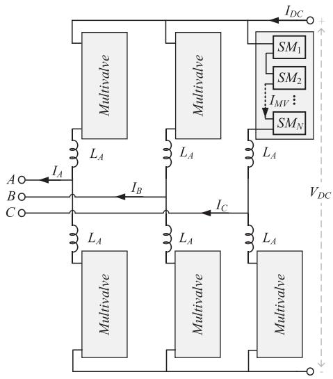

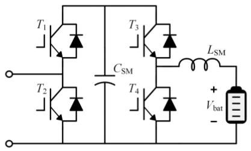  
Fig. 1. The topology of an MMC-BESS.   
Fig. 2. The topology of SMs in the MMC-BESS.

advantages including high efficiency, large capacity, commendable modularity, and the flexibility of energy storage capacity adjustment [7], [8].

The topology of an MMC-BESS is depicted in Fig. 1, where every phase leg comprises a multivalve and an arm inductor. Each multivalve is constructed by multiple series-connected submodules (SMs), whose topology is shown in Fig. 2 [9], [10], [11], [12]. The battery is connected to the SM capacitor through a Buck-Boost converter, reducing the DC filtering requirement, enabling control of the battery current, and potentially increasing the lifespan of the battery [13], [14]. The extensive use of switching devices in the MMC-BESS poses challenges to electromagnetic transient (EMT) simulations, which are widely used in practice to verify the MMC-BESS’s dynamic behaviors for various operating conditions, particularly during faults.

Conventionally, the detailed switching model (DSM) of the MMC-BESS is used for EMT simulations. In DSM, every circuit component is modeled as a parallel combination of an admittance and a current source. The entire system is then represented as an admittance matrix and current source matrix, with which the node voltages are solved for each time step [15]. To accurately simulate the switching operation of power electronics devices, the admittance matrix must be updated whenever there is a change in the switching state, a process known as re-triangulation [16]. Owing to the numerous switching devices and their high-frequency switching characteristics, conventional EMT modeling methods become exceedingly time-consuming and inefficient for simulating power systems with the MMC-BESS.

To mitigate computational complexity, efficient models including detailed equivalent models (DEM) and average-value models (AVM) have been developed. The AVM simplifies the model by treating the multivalve or the entire MMC as a closed box. In [17], the AVM of MMC is incorporated into the EMT environment and validated in an existing HVDC system. In [18] and [19], a specialized module called Blocking Module (BM) is incorporated in the AVM, allowing it to simulate the dynamics of a blocked MMC during DC faults. The author in [20] proposes an AVM of MMC-BESS that uses average SM capacitor voltages and battery current, and models the multivalve as a controlled voltage source. By ignoring the internal dynamics of the multivalve and the switching characteristics of power electronic devices, AVMs are unable to simulate the internal electrical variables of the SMs and could potentially lead to inaccurate simulation results.

The DEM models each multivalve as a Thevenin equivalent circuit, such that the system admittance matrix’s dimension is significantly reduced. Further, it can preserve the SM internal information by back-calculating the electrical variables inside the equivalent model. This solution is widely used for modeling the MMC [21] and solid-state transformers (SST) [22], [23]. In [24], the DEM is proposed for MMCs consisting of multi-port SMs based on generalized Norton Equivalents. The work in [25] merges the DEM and AVM in a universal arm equivalent circuit and dynamically adjusts the models used for simulation.

In the DEMs of MMC proposed in the above literature, the internal parameters of the Thevenin equivalent are adjusted based on the firing pulses of the switches, which remains valid if the firing pulses for the upper and lower switches are complementary. However, during fault conditions, emergency control actions may result in both switches in a leg being simultaneously turned off, thereby invalidating the existing models. To address this issue, the work in [26] introduces an enhanced DEM of MMC that incorporates additional switches to select appropriate model branches corresponding to different operating conditions.

In the MMC-BESS SM shown in Fig. 2, not only can both $T _ { 1 }$ and $T _ { 2 }$ be switched off during faults, but also both $T _ { 3 }$ and $T _ { 4 }$ can be switched off simultaneously in the battery disconnection scenarios, resulting in more complex operation modes. In [27], the DEM of MMC-BESS that follows the idea of replacing SMs by Thevenin circuits is proposed and validated against DSM under normal operating conditions. However, this model also

does not cover scenarios involving converter blocking and battery disconnection. Therefore, it necessitates further extensions of the DEM to accurately represent these additional operational conditions.

To address the above issues, an improved DEM (IDEM) of MMC-BESS is developed in this paper. Compared to existing methods, the novelty and contribution of the proposed IDEM are summarized as follows.

- A modeling framework is established for MMC-BESS, enabling the development of an EMT model for simulating MMC-BESS’s response under various operating conditions.   
The IDEM accounts for the complex scenarios where both switches in the same leg are simultaneously turned off: by leveraging auxiliary PSCAD switches and its built-in interpolation algorithms, it enables simulation of the converter blocked state; by introducing supplementary decision formulas, it facilitates the simulation of battery disconnection.   
A speedup calculation method is proposed based on the IDEM by simplifying the model considering the operation condition, which significantly reduces the number of addition and multiplication operations and thereby improves simulation efficiency.   
- The simulation accuracy and efficiency of the IDEM are demonstrated through MMC-BESS responses under AC faults, DC faults, and battery disconnection scenarios.

The remainder of this paper is structured as follows. Section II presents the operation modes of MMC-BESS. Section III presents the modeling framework. Section IV presents the proposed IDEM. In Section V, results verify the acceleration ratio and accuracy of the IDEM. In Section VI, the conclusion is presented.

# II. OVERVIEW OF MMC-BESS OPERATION

This section begins with an overview of the operating modes of an MMC-BESS. Then, it introduces the Dommel algorithm for EMT simulation, emphasizing the challenges associated with using the DSM of MMC-BESS in such simulations.

# A. Operating Modes of the MMC-BESS

As illustrated in Fig. 2, the battery is integrated into the SM of the MMC-BESS through a Buck-Boost converter. According to the IGBT firing pulse $F P _ { 1 - 4 }$ for the four switches $T _ { 1 - 4 } ,$ the operation conditions of the SM can be divided into 9 states, as shown in Table I. When $F P _ { N } = 1$ , it indicates that IGBT $T _ { N \ i s }$ turned on, while $F P _ { N } = 0$ indicates that it is turned off. To avoid shoot-through, $T _ { 1 } ~ ( T _ { 3 } )$ and $T _ { 2 } ~ ( T _ { 4 } )$ are not turned on simultaneously.

When the system operates under normal conditions, the firing pulses for IGBTs of $T _ { 1 }$ and $T _ { 2 }$ are complementary, and the SM can be either inserted or bypassed. The battery operates in one of the four modes: discharging, charging, freewheeling, and disconnection. Fig. 2 shows the combination of the two operation states of the SMs with the four operation modes of the battery under system normal operation conditions with positive

TABLE IOPERATION STATES OF SM BASED ON THE FIRING PULSES  

<table><tr><td></td><td>FP1=1</td><td>FP1=0</td><td>FP1=0</td></tr><tr><td></td><td>FP2=0</td><td>FP2=1</td><td>FP2=0</td></tr><tr><td>FP3=1</td><td>A</td><td>D</td><td>G</td></tr><tr><td>FP4=0</td><td></td><td></td><td></td></tr><tr><td>FP3=0</td><td>B</td><td>E</td><td>H</td></tr><tr><td>FP4=1</td><td></td><td></td><td></td></tr><tr><td>FP3=0</td><td>C</td><td>F</td><td>I</td></tr><tr><td>FP4=0</td><td></td><td></td><td></td></tr></table>

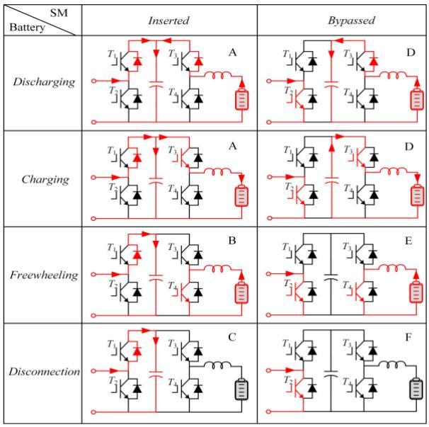  
Fig. 3. Normal operation states of SMs in MMC-BESS.

current flowing into the SM. In Fig. 3, labels A-F correspond to the states A-F in Table I.

The operation mode of the battery is primarily controlled by the connected Buck-Boost converter. Typically, the voltage of the capacitor exceeds that of the battery, with the Buck-Boost converter operating in boost mode. If $F P _ { 3 } = 1 , F P _ { 4 } = 0$ , the battery is charging or discharging through the Buck-Boost converter. During charging, the current flows through the IGBT of $T _ { 3 }$ to charge the battery; during discharging, the current flows through the diode of $T _ { 3 }$ to discharge externally. When $F P _ { 3 } { = } 0$ , $F P _ { 4 } = 1$ , the battery is in freewheeling mode, and the current flows through the inductor and the IGBT of $T _ { 4 }$ .

When $F P _ { 3 } = 0$ and $F P _ { 4 } = 0$ , the battery becomes disconnected from the system, and the converter functions as a conventional MMC. This operational mode is advantageous for minimizing switching losses during normal conditions or accommodating scenarios such as battery failure or depletion.

When $F P _ { 1 } = 0$ and $F P _ { 2 } = 0$ , the IGBTs are turned off, and the switch pairs $T _ { 1 }$ and $T _ { 2 }$ act as diodes. The inserted and bypassed states of SMs depend on the current flow direction. This operation condition corresponds to the states G, H, and I in Table I and typically arises when a DC fault occurs and the batteries are disconnected due to failure or depletion, where it is essential to block the converter by turning $T _ { 1 }$ and $T _ { 2 }$ of the SMs off.

# B. Challenges of Using the DSM of the MMC-BESS for EMT Simulation

The nodal analysis method is the most common method for solving electromagnetic transient problems, with its foundation being the Dommel algorithm. This algorithm discretizes the system through numerical integration substitution and transforms each dynamic component into a Norton equivalent circuit comprising a conductance and a current source. Within each time step, the equivalent current source is updated, which is a function of the network’s historical values, while node voltage of the network is obtained by solving (1) using the nodal analysis method.

$$
Y U = I \tag {1}
$$

In (1), U denotes the nodal voltage vector, and I denotes the nodal current injection vector, which is composed of the inherent current sources in the circuit and the historical current sources obtained from discretization. Y denotes the system admittance matrix, whose dimension is identical to the node number.

With the DSM, when there are switching actions in the system, the system topology and therefore its admittance matrix Y change accordingly. Consequently, it is necessary to perform the inverse operation (re-triangulation) on the new admittance matrix to solve for the voltage. In an MMC-BESS system, due to the large number of switches that operate at high frequencies, the admittance matrix changes frequently. Since the inversion of a large admittance matrix is computationally intensive and inefficient, the DSM of MMC-BESS poses significant computation burden on the EMT program, rendering it impractical for use in many cases.

# III. DEVELOPMENT OF THE DETAILED EQUIVALENT MODEL

This section first presents the proposed modeling framework based on the nodal analysis method. Then, by deriving the Thevenin equivalent for the multivalve and updating the internal variables at each time step, the DEM of MMC-BESS is developed.

# A. The Proposed Modeling Framework

Fig. 4 depicts the proposed modeling framework for MMC-BESS. It first partitions the original system into non-switching subsystems and switching subsystems. The non-switching subsystem is characterized by a time-invariant admittance matrix, whereas the switching subsystem involves switches operating at high frequencies, resulting in a time-varying admittance matrix.

For every simulation time step, the Thevenin equivalents of the switching subsystems are derived. Each switching subsystem is represented as a combination of a time-varying resistor and a time-varying voltage source, simplifying it into a 3-node equivalent circuit. This approach replaces the switching subsystem with a non-switching Thevenin equivalent, maintaining a fixed structure while incorporating time-varying parameters. Consequently, the system’s admittance matrix is transformed into a fixed-structure matrix with a significantly reduced number of dimensions, which can be efficiently solved using an EMT solver

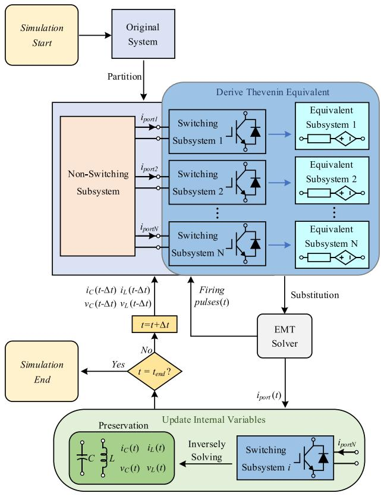  
Fig. 4. Framework of the proposed modeling method.

to compute the system-level variables including the current $i _ { p o r t }$ flowing into the switching subsystems.

Then, by exploiting $i _ { p o r t }$ and the internal variables from the last time step $t \mathrm { - } \Delta t ,$ the internal variables of the switching subsystems at time step t can be obtained. Using the calculated internal variables and the firing pulses at time step t, the Thevenin equivalent of the switching subsystem for the subsequent time step t+Δt is obtained. The procedure repeats until the simulation duration is reached.

In the modeling framework, each multivalve in the MMC-BESS is treated as a switching subsystem since the SMs within a multivalve can be combined as a single equivalent circuit. This method reduces the number of switching subsystems to 6 regardless of the number of SMs, greatly reducing the computation time.

# B. Derive Thevenin Equivalent for the Multivalves

Considering the SM shown in Fig. 2, we first present its modeling method when the firing pulses for IGBTs of $T _ { 1 } ( T _ { 3 } )$ and $T _ { 2 } ( T _ { 4 } )$ are complementary. The modeling method when $T _ { 1 } ( T _ { 3 } )$ and $T _ { 2 } ( T _ { 4 } )$ are turned off simultaneously will be discussed in the next section.

In simulations, the pair of an IGBT with an antiparallel diode, acting as a bidirectional switch with alternating conduction paths, can be considered as a resistor with two states. The state of the resistor depends on the firing pulses received by the IGBT in each pair. When the IGBT is turned on, its equivalent resistance

is a small value in milliohms; conversely, when the IGBT is turned off, its equivalent resistance is a large value in megaohms. Therefore, the switch pairs $T _ { 1 - 4 }$ can be modeled as two-state resistors $R _ { 1 - 4 }$ , respectively.

According to the Dommel method and trapezoidal integration method, a dynamic component can be discretized and represented as a voltage source in series with a resistor. Taking the capacitor $C _ { \mathrm { S M } }$ in the SM of Fig. 2 as an example, the trapezoidal integration approach is used to approximate the integration of the capacitor’s current, as indicated by (2). In (2), $v _ { C }$ denotes the capacitor voltage, $i _ { C }$ denotes the capacitor current, C refers to the capacitance value, and $\Delta t$ refers to the time step in a fixed-step simulation setting.

$$
\begin{array}{l} v _ {C} (t) - v _ {C} (t - \Delta t) = \frac {1}{C} \int_ {t - \Delta t} ^ {t} i _ {C} (\tau) \\ \approx \frac {\Delta t}{2 C} \cdot \left(i _ {C} (t) + i _ {C} (t - \Delta t)\right) \tag {2} \\ \end{array}
$$

Defining

$$
R _ {C} = \frac {\Delta t}{2 C}, V _ {C, \text {h i s}} = v _ {C} (t - \Delta t) + R _ {C} \cdot i _ {C} (t - \Delta t) \tag {3}
$$

By substituting (3) into (2), $v _ { C } ( \mathfrak { t } )$ is expressed as

$$
v _ {C} (t) = R _ {C} \cdot i _ {C} (t) + V _ {C, \text {h i s}} \tag {4}
$$

Therefore, the capacitor can be modeled as a series circuit comprising a resistor $R _ { C }$ connected and a controlled voltage source $V _ { C , \mathrm { h i s } } ,$ whose value is computed from the capacitor voltage and current from the last time step. Meanwhile, $R _ { C }$ is calculated based on the capacitance value and the simulation time step, and it is constant in a fixed-step simulation.

Similarly, the inductor $L _ { \mathrm { S M } }$ in the SM of Fig. 2 can also be equivalent to a resistor and a controlled voltage source, with the process shown in (5)–(7), where $v _ { L }$ represents the inductor voltage, $i _ { L }$ represents the inductor current, L denotes the inductance value, $R _ { L }$ denotes the resistance of the equivalent resistor, and $V _ { L , \mathrm { h i s } }$ denotes the controlled voltage source whose value is computed from the inductor voltage and current from the last time step.

$$
\begin{array}{l} i _ {L} (t) - i _ {L} (t - \Delta t) = \frac {1}{L} \int_ {t - \Delta t} ^ {t} v _ {L} (\tau) \\ \approx \frac {\Delta t}{2 L} \cdot \left(v _ {L} (t) + v _ {L} (t - \Delta t)\right) \tag {5} \\ \end{array}
$$

$$
R _ {L} = \frac {2 L}{\Delta t}, V _ {L, \text {h i s}} = - v _ {L} (t - \Delta t) - R _ {L} \cdot i _ {L} (t - \Delta t) \tag {6}
$$

$$
v _ {L} (t) = R _ {L} \cdot i _ {L} (t) + V _ {L, \text {h i s}} \tag {7}
$$

Additionally, the battery is represented by the Rint model, consisting of an equivalent internal resistance $R _ { \mathrm { b a t } }$ and a voltage source $V _ { \mathrm { b a t } }$ [28], [29], [30]. The battery State of Charge (SOC) is computed as

$$
\operatorname {S O C} (T) = \operatorname {S O C} _ {0} - \frac {1}{Q} \int_ {0} ^ {T} i _ {\text {b a t}} d t \tag {8}
$$

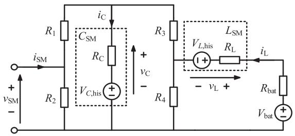  
Fig. 5. Equivalent circuit of SM in MMC-BESS.

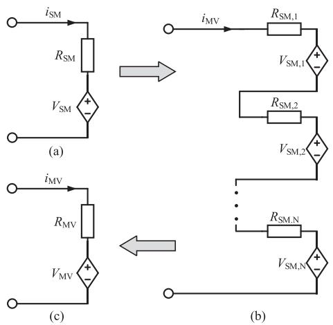  
Fig. 6. Development of the equivalent circuit for the multivalve: (a) Equivalent circuit of an SM; (b) Equivalent SMs connected in series; (c) Equivalent circuit of a multivalve.

where SOC(T) denotes the SOC at time $T , { \mathrm { S O C } } _ { 0 }$ denotes the initial SOC, $i _ { \mathrm { b a t } }$ denotes the current that flows out from the positive terminal of the battery, and Q denotes the battery capacity.

It is worth noting that the proposed MMC-BESS modeling framework is compatible with other advanced battery model such as the one in [30] with minor modifications. However, since the focus of the paper is the EMT model of the MMC-BESS, advanced battery models are not discussed.

With the above equivalent models for the capacitor, inductor, IGBT-diode switch pairs, and the battery, the SM circuit diagram can be transformed into an equivalent circuit as shown in Fig. 5. Moreover, the equivalent circuit can be externally modeled as a two-port network comprising an equivalent resistor connected in series with a voltage source according to Thevenin theorem, as shown in Fig. 6(a). The resistor $R _ { \mathrm { S M } }$ and voltage $V _ { \mathrm { S M } }$ are given as:

$$
R _ {\mathrm {S M}} = R _ {2} \| \left\{R _ {1} + R _ {C} \| \left[ R _ {3} + R _ {4} \| \left(R _ {L} + R _ {\mathrm {b a t}}\right) \right] \right\} \tag {9}
$$

$$
\begin{array}{l} V _ {\mathrm {S M}} = \frac {R _ {2}}{R _ {1} + R _ {2}} \cdot \left(V _ {C, \mathrm {h i s}} \cdot \frac {b}{R _ {C} + b} \right. \\ \left. + \left(V _ {\mathrm {b a t}} - V _ {L, \mathrm {h i s}}\right) \cdot \frac {d}{R _ {\mathrm {b a t}} + R _ {L} + d} \cdot \frac {c}{R _ {3} + c}\right) \tag {10} \\ \end{array}
$$

where

$$
\begin{array}{l} a = R _ {3} + \left[ R _ {4} \right\| \left(R _ {\mathrm {b a t}} + R _ {L}\right) ] b = a \| \left(R _ {1} + R _ {2}\right) \\ c = R _ {C} \parallel (R _ {1} + R _ {2}) d = R _ {4} \parallel (R _ {3} + c) \tag {11} \\ \end{array}
$$

and $^ { 6 6 } \| ^ { 3 }$ means parallel connection between components.

The equivalent circuit of a multivalve can be obtained by connecting the SMs in series, as shown in Fig. 6(b). Equation (12) and (13) gives Thevenin equivalent resistance $R _ { \mathrm { M V } }$ and Thevenin equivalent voltage $V _ { \mathrm { M V } }$ of a multivalve, where N is the number of SMs in a multivalve.

$$
V _ {\mathrm {M V}} = \sum_ {i = 1} ^ {N} V _ {\mathrm {S M}, i} \tag {12}
$$

$$
R _ {\mathrm {M V}} = \sum_ {i = 1} ^ {N} R _ {\mathrm {S M}, i} \tag {13}
$$

The above treatment simplifies the original complex and time-varying network into a simple 3-node network, drastically reducing the dimensions of system admittance matrix. The computational effort required for deriving the Thevenin equivalent at each time step is negligible compared to inverting a large admittance matrix. Therefore, this method can greatly accelerate the simulation speed for MMC-BESS, particularly when the number of SMs is large.

# C. Update Internal Variables for the Multivalve

As indicated by (2) and (5), to update the internal information of each SM at every simulation time step, it is necessary to not only preserve the capacitor voltage $v _ { C } ( t - \Delta t )$ and current $i _ { C } ( t - \Delta t )$ , inductor voltage $v _ { L } ( t - \Delta t )$ and current $i _ { L } ( t - \Delta t )$ from the previous simulation time step, but also obtain the capacitor current $i _ { C } ( t )$ and inductor current $i _ { L } ( t )$ at the current time step.

After substituting the equivalent circuits, the EMT solver can compute the node voltages and the multivalve current $i _ { \mathrm { M V } }$ at time step t. As all SMs are in series, the SM current $i _ { \mathrm { S M } }$ is identical to the multivalve current, i.e., $i _ { \mathrm { S M } } = i _ { \mathrm { M V } }$ . Considering the topology of each SM is fixed, the capacitor current $i _ { C } ( t )$ and inductor current $i _ { L } ( t )$ can be calculated using $( 1 4 ) \div ( 1 6 )$ , where $i _ { \mathrm { S M } } ( t )$ is provided by the EMT solver, $R _ { 1 - 4 }$ are determined to the firing pulses of each SM, $R _ { L }$ and $R _ { C }$ are constant values, $V _ { C , \mathrm { h i s } }$ and $V _ { L , \mathrm { h i s } }$ are historical value information that is preserved, and $R _ { \mathrm { b a t } }$ and $V _ { \mathrm { b a t } }$ are given by the battery model.

$$
\begin{array}{l} i _ {C} (t) = i _ {\mathrm {S M}} (t) \cdot \frac {R _ {2}}{R _ {2} + R _ {R 2 e q}} \cdot \frac {R _ {D C 2}}{R _ {C} + R _ {D C 2}} - \frac {V _ {C , \mathrm {h i s}}}{R _ {V C e q}} \\ + \frac {V _ {\text {b a t}} - V _ {L , \text {h i s}}}{R _ {V L e q}} \cdot \frac {R _ {4}}{R _ {4} + \left(R _ {D C 1} + R _ {3}\right)} \cdot \frac {R _ {1} + R _ {2}}{R _ {C} + R _ {1} + R _ {2}} \tag {14} \\ \end{array}
$$

$$
\begin{array}{l} i _ {L} (t) = - i _ {\mathrm {S M}} (t) \cdot \frac {R _ {2}}{R _ {2} + R _ {R 2 e q}} \cdot \frac {R _ {C}}{R _ {C} + R _ {D C 2}} \cdot \frac {R _ {4}}{R _ {4} + R _ {\mathrm {b a t}} + R _ {L}} \\ - \frac {V _ {C , \mathrm {h i s}}}{R _ {V C e q}} \cdot \frac {R _ {1} + R _ {2}}{R _ {1} + R _ {2} + R _ {D C 2}} \cdot \frac {R _ {4}}{R _ {4} + R _ {\mathrm {b a t}} + R _ {L}} \\ + \frac {V _ {\text {b a t}} - V _ {L , \text {h i s}}}{R _ {V L e q}} \tag {15} \\ \end{array}
$$

where

$$
R _ {D C 1} = R _ {C} \parallel (R _ {1} + R _ {2})
$$

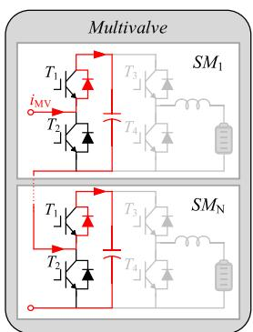  
(a）

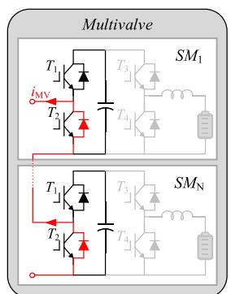  
  
Fig. 7. Current conduction paths. (a) Positive current. (b) Negative current.

$$
R _ {D C 2} = R _ {3} + R _ {4} \| \left(R _ {\mathrm {b a t}} + R _ {L}\right)
$$

$$
R _ {V L e q} = R _ {\text {b a t}} + R _ {L} + R _ {4} \parallel \left(R _ {D C 1} + R _ {3}\right)
$$

$$
R _ {V C e q} = R _ {C} + \left(R _ {1} + R _ {2}\right) \| R _ {D C 2}
$$

$$
R _ {R 2 e q} = R _ {1} + R _ {C} \| R _ {D C 2} \tag {16}
$$

By deriving the Thevenin equivalent and updating the internal variables of SMs at each time step, the proposed method can significantly increase the simulation speed while preserving all information inside the SMs.

# IV. IMPROVED DEM OF THE MMC-BESS

In the modeling framework presented in the last section, the equivalent resistance of the switch pair is determined by the firing pulses. However, this is not true if the upper and lower switches are simultaneously turned off, which occurs when it is desired to block the MMC-BESS, e.g., during faults. In this case, the SM turns into an uncontrolled diode rectification circuit, where the conducting device (and thus the equivalent resistance) is governed by the current direction, as shown in Fig. 7.

As a result, the equivalent resistance $R _ { 1 }$ and $R _ { 2 }$ of $T _ { 1 }$ and $T _ { 2 }$ are governed by the current direction. However, determining $R _ { 1 }$ and $R _ { 2 }$ at time $t { + } \Delta t$ by measuring the multivalve current $i _ { \mathrm { M V } } ( t )$ in simulation can lead to significant errors. As the current rate of change can be very large during faults, it is easy for the current to cross zero between t and $t { + } \Delta t .$ Under such circumstances, the switches’ state and their corresponding equivalent resistance $R _ { 1 }$ and $R _ { 2 }$ should change accordingly. However, in fixed-step simulations, the current zero-crossing point might not be accurately captured, leading to discrepancies in the calculated node voltage at time $t { + } \Delta t .$ . Consequently, the calculated $i _ { \mathrm { M V } } ( t )$ might not cross zero, leading to incorrect equivalent resistance at the next time step. Over time, the cumulative errors can lead to a substantial deviation from the expected simulation results, causing significant inaccuracies.

In the following, the equivalent model for the MMC-BESS in the blocked state is first presented. Then, an IDEM is proposed, which enables the simulation of the converter’s normal operation, the blocked state, and battery disconnection. Finally, a speedup calculation method of the IDEM is presented.

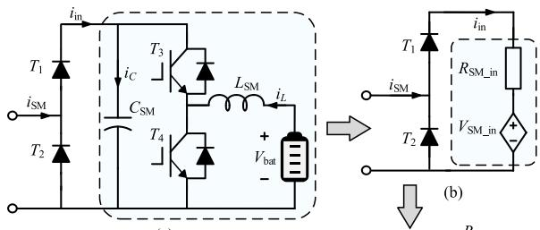

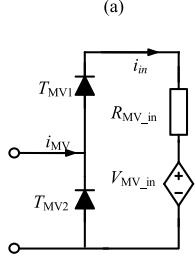  
(d）

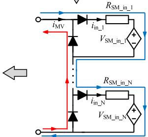  
（C）  
Fig. 8. Development of the equivalent circuit for the multivalve in the blocked state: (a) SM topology in the blocked state; (b) Equivalent circuit of an SM; (c) Equivalent SMs connected in series; and (d) Equivalent circuit of a multivalve.

# A. Equivalent Model in Converter Blocked State

As shown in Fig. 8, the switches $T _ { 1 }$ and $T _ { 2 }$ can be reduced to diodes when the converter is blocked state. The SM internal components, including the capacitor, switches $T _ { 3 }$ and $T _ { 4 , }$ the inductor $L _ { \mathrm { S M } }$ , and the battery, can be equivalent to a resistance $R _ { S M \_ i n }$ and voltage $V _ { S M \_ i n }$ given by

$$
R _ {\mathrm {S M} _ {- \text {i n}}} = R _ {C} \| \left[ R _ {3} + R _ {4} \right. \| \left(R _ {L} + R _ {\mathrm {b a t}}\right) ] \tag {17}
$$

$$
\begin{array}{l} V _ {\mathrm {S M} _ {-} i n} = V _ {C, \mathrm {h i s}} \cdot \frac {b}{R _ {C} + b} + \left(V _ {\mathrm {b a t}} - V _ {L, \mathrm {h i s}}\right) \\ \times \frac {d}{R _ {\mathrm {b a t}} + R _ {L} + d} \cdot \frac {c}{R _ {3} + c} \tag {18} \\ \end{array}
$$

where

$$
\begin{array}{l} a = R _ {3} + \left[ R _ {4} \right\| \left(R _ {\mathrm {b a t}} + R _ {L}\right) \quad b = a \\ c = R _ {C} \quad d = R _ {4} \| (R _ {3} + c) \tag {19} \\ \end{array}
$$

The equations for updating the internal variables, i.e., capacitor current $i _ { C } ( t )$ and inductor current $i _ { L } ( t )$ are as given by

$$
\begin{array}{l} i _ {C} (t) = i _ {\mathrm {i n}} (t) \cdot \frac {R _ {D C 2}}{R _ {C} + R _ {D C 2}} - \frac {V _ {C , \mathrm {h i s}}}{R _ {V C e q}} \\ + \frac {V _ {\text {b a t}} - V _ {L , \text {h i s}}}{R _ {V L e q}} \cdot \frac {R _ {4}}{R _ {4} + \left(R _ {D C 1} + R _ {3}\right)} \tag {20} \\ \end{array}
$$

$$
\begin{array}{l} i _ {L} (t) = - i _ {\mathrm {i n}} (t) \cdot \frac {R _ {C}}{R _ {C} + R _ {D C 2}} \cdot \frac {R _ {4}}{R _ {4} + R _ {\mathrm {b a t}} + R _ {L}} \\ - \frac {V _ {C , \text {h i s}}}{R _ {V C e q}} \cdot \frac {R _ {4}}{R _ {4} + R _ {\text {b a t}} + R _ {L}} + \frac {V _ {\text {b a t}} - V _ {L , \text {h i s}}}{R _ {V L e q}} \tag {21} \\ \end{array}
$$

where

$$
R _ {D C 1} = R _ {C}
$$

$$
R _ {D C 2} = R _ {3} + R _ {4} \| \left(R _ {\mathrm {b a t}} + R _ {L}\right)
$$

$$
R _ {V L e q} = R _ {b a t} + R _ {L} + R _ {4} \parallel \left(R _ {D C 1} + R _ {3}\right)
$$

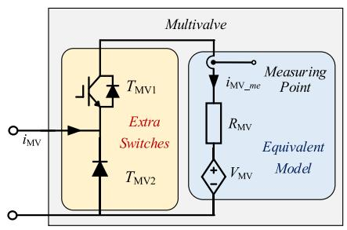  
Fig. 9. Structure of the improved equivalent model.

$$
R _ {V C e q} = R _ {C} + R _ {D C 2}
$$

$$
R _ {R 2 e q} = R _ {C} \| R _ {D C 2} \tag {22}
$$

As all the SMs have the same current $i _ { \mathrm { s m } } ,$ the diodes of all SMs exhibit consistent conduction behavior. This allows the equivalent representation of series-connected SMs as shown in Fig. 8(c) with model parameters are given by

$$
R _ {\mathrm {M V} \_ \mathrm {i n}} = \sum_ {i = 1} ^ {N} R _ {\mathrm {S M} \_ \mathrm {i n}, i}
$$

$$
V _ {\mathrm {M V} _ {-} \mathrm {i n}} = \sum_ {i = 1} ^ {N} V _ {\mathrm {S M} _ {-} \mathrm {i n}, i} \tag {23}
$$

where $R _ { M V \_ i n }$ represents the multivalve equivalent resistance and $V _ { M V \_ i n }$ represents the equivalent voltage.

# B. Proposed Improved Equivalent Model

To obtain the proposed improved equivalent model, an auxiliary IGBT is added in anti-parallel configuration with diode $T _ { \mathrm { M V 1 } }$ as depicted in Fig. 9. In the improved model, the auxiliary IGBT allows both normal and blocked state operation, while the diodes of $T _ { \mathrm { M V 1 } }$ and $T _ { \mathrm { M V 2 } }$ are implemented using PSCAD switches with built-in interpolation algorithms.

During normal operation, the auxiliary IGBT is switched on. If $i _ { M V } > 0 $ , the multivalve current flows into the equivalent model through the diode of $T _ { \mathrm { M V 1 } }$ , with $i _ { i n } = i _ { M V } . \mathrm { I f } i _ { M V } < 0$ , the diode $T _ { \mathrm { M V 2 } }$ remains reverse-biased, forcing the multivalve current to exit via the IGBT of $T _ { \mathrm { M V 1 } }$ , maintaining $i _ { i n } = i _ { M V }$ Thus, $i _ { i n } = i _ { M V }$ holds regardless of current polarity. The model updates its internal variables and external equivalence through (9)–(15), where the equivalent resistances $R _ { 1 }$ and $R _ { 2 }$ are determined by the firing pulses of $T _ { 1 }$ and $T _ { 2 }$ .

During the blocked state, the auxiliary IGBT turns off, and the circuit topology transitions to the configuration shown in Fig. 8(d). The PSCAD diodes of $T _ { \mathrm { M V 1 } }$ and $T _ { \mathrm { M V 2 } }$ enable the accurate detection of zero-crossing moments and the conduction path. When $i _ { M V } > 0$ , the multivalve current flows through the diode of $T _ { \mathrm { M V 1 } }$ , giving $i _ { i n } = i _ { M V }$ . When $i _ { M V } < 0 .$ , the multivalve current flows through the diode of $T _ { \mathrm { M V 2 } } .$ resulting in $i _ { i n } \neq i _ { M V }$ . Therefore, the current measuring point for the proposed equivalent model is positioned internally as iMV _me. The internal measurement ensures applicability in both normal and blocked states, while the external measurement would fail to maintain validity during blocked states.

In contrast to $T _ { 1 }$ and $T _ { 2 } ,$ which are connected to the external nodes of the Thevenin equivalent circuit, $T _ { 3 }$ and $T _ { 4 }$ are located inside the equivalent circuit. This position makes it impossible to add external PSCAD switches to detect the current direction and simulate the disconnection mode of the battery, where the IGBTs of $T _ { 3 }$ and $T _ { 4 }$ are simultaneously turned off. However, the ability of the equivalent model to obtain all internal electrical information of SMs, including the voltages and currents of the battery, inductor, and capacitor, enables the calculation of the voltage across the diode. This calculation allows for the determination of the diode conduction state. Given that the diode’s forward voltage drop is vf , (24) illustrates the approach to calculating the equivalent resistance $R _ { 3 }$ and $R _ { 4 }$ when $T _ { 3 }$ and $T _ { 4 }$ are simultaneously turned off.

$$
R _ {3} \approx \left\{ \begin{array}{l} R _ {o n} V _ {b a t} - v _ {L} - i _ {L} \cdot R _ {b a t} - v _ {C} \geq v _ {\mathrm {f}} \\ R _ {o f f} V _ {b a t} - v _ {L} - i _ {L} \cdot R _ {b a t} - v _ {C} <   v _ {\mathrm {f}} \end{array} \right.
$$

$$
R _ {4} \approx \left\{ \begin{array}{l} R _ {o n} v _ {L} + i _ {L} \cdot R _ {b a t} - V _ {b a t} \geq v _ {\mathrm {f}} \\ R _ {o f f} v _ {L} + i _ {L} \cdot R _ {b a t} - V _ {b a t} <   v _ {\mathrm {f}} \end{array} \right. \tag {24}
$$

By taking into account the aforementioned conditions, the model proposed in this paper is capable of simulating any switching combinations of the SM, which overcomes the limitations of the conventional DEM.

# C. Speedup Calculation Method of the Equivalent Model

As discussed in the previous subsections, the proposed equivalent model has two separate sets of equations for normal operation and blocked states, i.e., (9)–(16) gives (17)–(23), respectively. In the following, a speedup calculation method is proposed to reduce computational load, which can be implemented as a lookup table, as shown in Table II.

In the speedup calculation method, all six allowable cases of equivalent resistance $( R _ { 1 } , R _ { 2 } , R _ { 3 } , R _ { 4 } )$ are listed by assuming that $R _ { i } ( i = 1 , 2 , 3 , 4 )$ is 0 when conducting and infinite when turned off. Note that only six cases are allowed, while other combinations are invalid. Further, it is noteworthy that substituting $R _ { 1 }$ to $0 , R _ { 2 } {  } { \infty } , i _ { s m } \tan$ into (9)–(11) and (14)–(16) gives $( 1 7 ) - ( 2 2 )$ . Considering the above factors, during each simulation time step, the case of $( R _ { 1 } , R _ { 2 } , R _ { 3 } , R _ { 4 } )$ is determined by 1) setting $R _ { i } ~ ( i = 1 , 2 , 3 , 4 )$ based on its gate firing pulse in normal operation; 2) overwriting $R _ { 1 }$ to $0 , R _ { 2 }$ to - if converter is in blocked operation; 3) overwriting $R _ { 3 }$ and $R _ { 4 }$ according to (24) if the battery is disconnected.

Once the case of $( R _ { 1 } , R _ { 2 } , R _ { 3 } , R _ { 4 } )$ is determined, the expressions for equivalent model parameters $R _ { \mathrm { S M } } , V _ { \mathrm { S M } } , i _ { C } ( t )$ , and $i _ { L } ( t )$ can be simplified accordingly. The simplified expressions are given in Table II, which is selected and used to update the equivalent model for the next time step.

To update $R _ { \mathrm { S M } } , V _ { \mathrm { S M } } , i _ { C } ( t )$ , and $i _ { L } ( t )$ with the simplified expressions, intermediate variables $K _ { f i x e d 1 - 5 }$ and $K _ { r u n ` 1 - 2 }$ are required. Here, $K _ { f i x e d 1 - 5 }$ are the pre-calculated variables computed only once at the start of the simulation, while $K _ { r u n ` 1 - 2 }$ are runtime variables that require updating every time step.

The proposed method reduces the number of addition and multiplication operations by over 10 times compared to the

TABLE II SIMPLIFIED CALCULATION FORMULAS ACCORDING TO EQUIVALENT RESISTANCE   

<table><tr><td>Variable type</td><td>Symbol</td><td colspan="6">Expression</td></tr><tr><td>Switch Equivalent Resistance</td><td>Case of (R1,R2,R3,R4)</td><td>Case I (0,∞,0,∞)</td><td>Case II (0,∞,∞,0)</td><td>Case III (∞,0,0,∞)</td><td>Case IV (∞,0,∞,0)</td><td>Case V (0,∞,∞,∞)</td><td>Case VI (∞,0,∞,∞)</td></tr><tr><td rowspan="4">Equivalent Model Parameters</td><td>RSM</td><td>Kfixed_1</td><td>RC</td><td>0</td><td>0</td><td>RC</td><td>0</td></tr><tr><td>VSM</td><td>VC,his·Kfixed_4 +Krun_1·Kfixed_3</td><td>VC,his</td><td>0</td><td>0</td><td>VC,his</td><td>0</td></tr><tr><td>iC(t)</td><td>Krun_2/Kfixed_3 +iSM(t)·Kfixed_5</td><td>iSM(t)</td><td>Krun_2/Kfixed_3</td><td>0</td><td>iSM(t)</td><td>0</td></tr><tr><td>iL(t)</td><td>Krun_2/Kfixed_3 -iSM(t)·Kfixed_4</td><td>Krun_1/Kfixed_2</td><td>Krun_2/Kfixed_3</td><td>Krun_1/Kfixed_2</td><td>0</td><td>0</td></tr><tr><td rowspan="3">Intermediate Variable</td><td rowspan="2">Kfixed_1-5</td><td colspan="6">Kfixed_1=(RL+Rbat)∥RC, Kfixed_2=Rbat+RL, Kfixed_3=RC+Rbat+RL</td></tr><tr><td colspan="6">Kfixed_4=RC/(RC+Rbat+RL), Kfixed_5=(Rbat+RL)/(RC+Rbat+RL)</td></tr><tr><td>Krun_1-2</td><td colspan="6">Krun_1=Vbat-VL,his, Krun_2=Vbat-VL,his-Vc,his</td></tr></table>

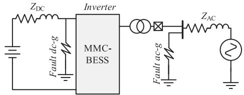  
Fig. 10. The test system used for validation.

TABLE III PARAMETERS FOR THE TEST SYSTEM   

<table><tr><td colspan="2">MMC-BESS Parameters</td></tr><tr><td>SM capacitance (CSM) 5mF</td><td>Arm inductance (LA) 13.5mH</td></tr><tr><td>SM inductance (LSM) 10mH</td><td>No. of SMs per multivalve 4</td></tr><tr><td>Battery voltage (vbat) 1.375kV</td><td>Transformer reactance (Xrf) 0.168pu</td></tr><tr><td colspan="2">Network Parameters</td></tr><tr><td>AC voltage (VAC, rms) 3.11 kV</td><td>AC impedance (ZAC) 0.1+0.006jΩ</td></tr><tr><td>DC voltage (VDC) 11 kV</td><td>DC impedance (ZDC) 0.1Ω</td></tr><tr><td colspan="2">EMT Environment Parameters</td></tr><tr><td colspan="2">Simulation time step (Δt) 10μs</td></tr></table>

original equations. Moreover, due to the small number of cases, the computational effort involved in the look-up table is minimal. Consequently, this method can effectively increase the simulation speed.

# V. MODEL VALIDATION

# A. Test System

This paper employs the test system depicted in Fig. 10 for validating the performance of the IDEM, with its parameters given in Table III. Faults applied at the AC-side PCC and the DC bus are simulated. Simulations are carried out in the EMT

TABLE IV POWER SETPOINT CHANGES   

<table><tr><td>Time(s)</td><td>\( {P}_{\mathrm{{AC}},\text{ ref }} \) (MW)</td><td>\( {P}_{\mathrm{{DC}},\text{ ref }} \) (MW)</td><td>\( {P}_{\text{bat,ref }} \) (MW)</td></tr><tr><td>0</td><td>2</td><td>2</td><td>0</td></tr><tr><td>2.0</td><td>1.5</td><td>2</td><td>-0.5</td></tr><tr><td>3.0</td><td>1.5</td><td>1.8</td><td>-0.3</td></tr><tr><td>4.0</td><td>1.5</td><td>1.2</td><td>0.3</td></tr><tr><td>5.0</td><td>1.8</td><td>1.2</td><td>0.6</td></tr></table>

simulation software PSCAD, employing the following three models: (i) DSM, (ii) DEM, and (iii) the proposed IDEM. The DSM simulation results provide the reference benchmark for validating the other models. The simulations are conducted with a 10 μs time step unless otherwise specified.

# B. Control System for the MMC-BESS

The control block diagram for the MMC-BESS is illustrated in Fig. 11. Functioning as a three-port system, the MMC-BESS interfaces with the DC side, AC side, and BESS side. The main controller manages the power flow of the AC and DC sides. On the AC side, an outer-loop power control combined with a conventional inner-loop current control is employed. On the DC side, the power regulation is achieved by controlling the DC bus current, while the capacitor voltage balance is achieved through circulating current control. Carrier Phase-Shift SPWM (CPS-SPWM) is used as the modulation method.

The BESS controller manages the operation of the batteries in the SMs. The average value of the SMs’ capacitor voltages is obtained. It is then fed to a PI controller to generate the average current reference, which is further apportioned to each SM through SOC Balancing control. A mode-check module decides whether the battery should be connected or disconnected depending on operating requirements.

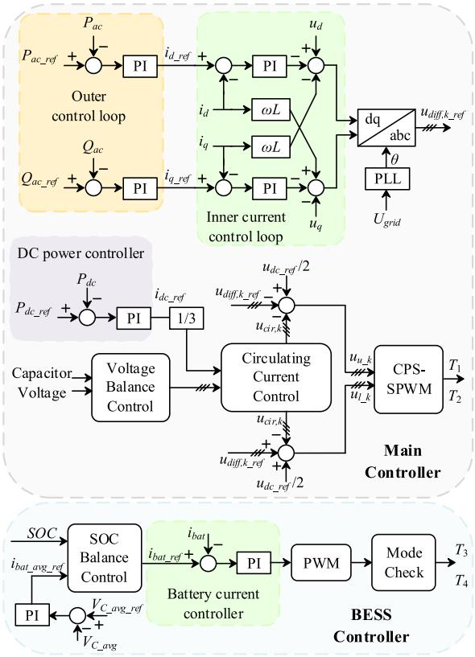  
Fig. 11. Control block diagram of the MMC-BESS.

# C. Normal Operation Condition

To demonstrate the performance of the IDEM during the steady state and power set-point changes, the power references for AC power $( P _ { \mathrm { A C , r e f } } )$ and DC power $( P _ { \mathrm { D C , r e f } } )$ are configured based on Table IV. The results in Fig. 12 show that both the IDEM and the DEM match the trajectory of the benchmark DSM well, demonstrating the ability to accurately simulate the MMC-BESS’s response.

# D. AC Three-Phase Fault

To validate the accuracy of the ID EM to simulate AC faults, a three-phase-to-ground fault at PCC is triggered at 1s, lasting 0.05 s. The results in Fig. 13 show that both the IDEM and the DEM align well with the trajectory of the benchmarking DSM, demonstrating their ability to accurately simulate the system’s response during the AC fault.

# E. DC Line-to-Ground Fault

At 1s, a line-to-ground fault on the DC line is triggered, and the DC side breaker opens after 5 ms. Simulation results in Fig. 14 show the power distribution within the system. Upon the DC circuit breaker opening, the power transmission on the DC side is interrupted, and the BESS is capable of supplying the necessary power to the AC side. Both the IDEM and the DEM accurately simulate this process.

Similarly, a line-to-ground fault on the DC line is triggered at 1s, while the batteries are disconnected. The converter is blocked

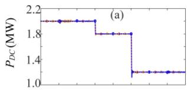

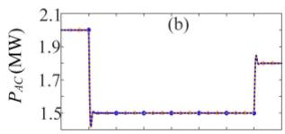

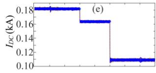

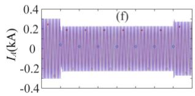

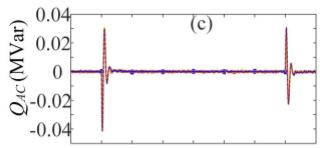

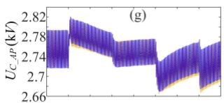

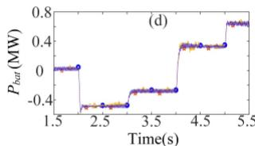

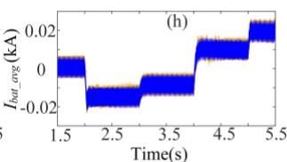

  
Fig. 12. Responses to power set-point changes. (a) DC side active power; (b) AC side active power. (c) AC side reactive power. (d) Battery side active power. (e) DC current. (f) AC side A phase current. (g) Average SM capacitor voltage of A-phase upper multivalve. (h) Average battery current.

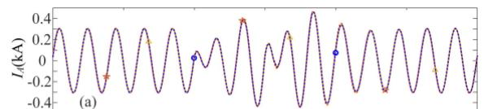

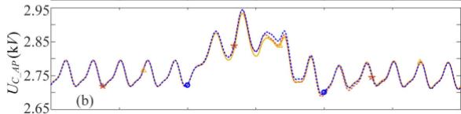

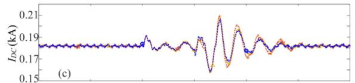

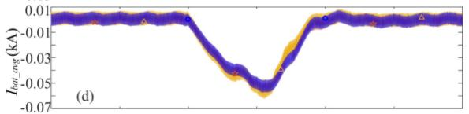

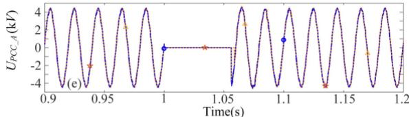

  
Fig. 13. Three-phase-to-ground fault at PCC. (a) AC side A phase current. (b) Average SM capacitor voltage of A-phase upper multivalve. (c) DC current. (d) Average battery current. (e) A phase PCC voltage.

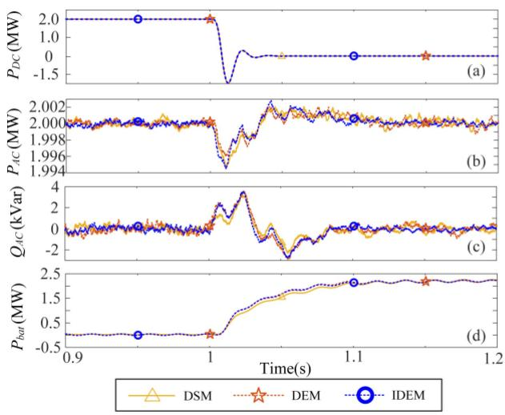  
Fig. 14. DC line-to-ground fault. (a) DC side active power. (b) AC side active power. (c) AC side reactive power. (d) Battery side active power.

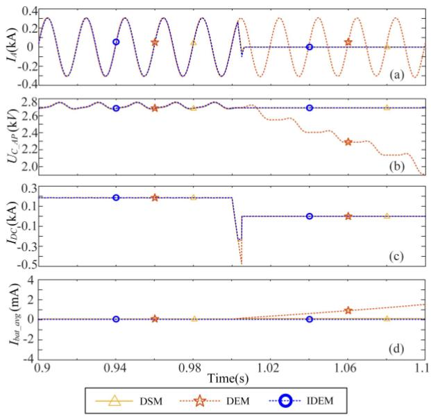  
Fig. 15. DC line-to-ground fault when the batteries are disconnected. (a) DC side active power. (b) AC side active power. (c) AC side reactive power. (d) Battery side active power.

at 1.003s, and the DC side breaker opens at 1.005s. As shown in Fig. 15, the IDEM accurately captures the behavior of the converter during and after the fault, whereas the DEM deviates significantly from the actual behavior.

# F. Disconnections of the Batteries

To demonstrate the performance of the IDEM under different battery modes, the batteries are disconnected at 2s, and the converter operates as a conventional MMC. As illustrated in Fig. 16, the IDEM accurately simulates this process while the conventional DEM is unable to simulate the battery disconnection mode and deviates significantly from the actual behavior.

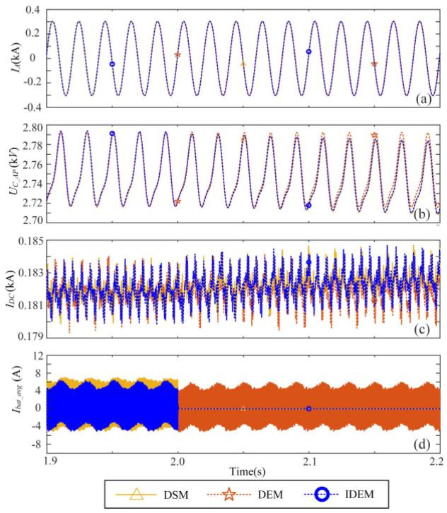  
Fig. 16. Switching to conventional MMC operation mode. (a) AC side A phase current. (b) Average SM capacitor voltage of A-phase upper multivalve. (c) DC current. (d) Average battery current.

TABLE V COMPUTATIONAL TIMES OF DIFFERENT MODELS   

<table><tr><td rowspan="2">Time step (μs)</td><td rowspan="2">Num. of SMs</td><td colspan="3">Comp. Time(s)</td><td colspan="2">Acceleration ratio</td></tr><tr><td>DSM</td><td>DEM</td><td>IDEM</td><td>DEM</td><td>IDEM</td></tr><tr><td rowspan="2">10</td><td>4</td><td>1274</td><td>47</td><td>41</td><td>27.1</td><td>31.1</td></tr><tr><td>10</td><td>3201</td><td>54</td><td>46</td><td>59.3</td><td>69.5</td></tr><tr><td rowspan="2">1</td><td>4</td><td>2203</td><td>276</td><td>244</td><td>8.0</td><td>9.0</td></tr><tr><td>10</td><td>6144</td><td>389</td><td>346</td><td>15.8</td><td>17.8</td></tr></table>

Note.Acceleration ratio = (Comp.Time of the model)/(Comp. Time of the DSM).

# G. Computational Efficiency Comparison

Table V shows the computational times of different models under different simulation time steps and the number of SMs in a multivalve. The results are obtained by running the simulations for 6 seconds, which were conducted on a computer using an Intel i9-10900F CPU and 64GB RAM.

Compared to the DSM, all the models significantly improve the simulation speed without losing any information within the SMs. Despite the increased number of nodes of the IDEM in comparison with the DEM, the proposed IDEM has the highest acceleration ratio owing to the internal algorithm optimization. Moreover, IDEM can simulate the blocked state of the MMC and the disconnection mode of the batteries, which are indispensable for MMC-BESS.

# VI. CONCLUSION

A modeling method to develop an IDEM of the MMC-BESS for electromagnetic transient simulations is presented. The proposed IDEM can achieve the same accuracy as the DSM while greatly enhancing the simulation efficiency. Meanwhile, the proposed IDEM is capable of simulating various operating conditions, including the converter blocking operation and battery disconnection mode, making it highly adaptable for investigating different control strategies for the MMC-BESS.

The proposed IDEM has been validated against a DSM in PSCAD/EMTDC simulations under various conditions, including normal operation, AC faults, DC faults, and battery disconnection scenarios. Results confirm the IDEM’s capability in replicating the DSM’s accuracy while significantly improving simulation speed, with demonstrated acceleration ratios that outperform both DSM and DEM approaches.

# REFERENCES

[1] X. Li, L. Wang, N. Yan, and R. Ma, “Cooperative dispatch of distributed energy storage in distribution network with PV generation systems,” IEEE Trans. Appl. Supercond., vol. 31, no. 8, Nov. 2021, Art. no. 0604304.   
[2] Z. Guo, W. Wei, L. Chen, Z. Y. Dong, and S. Mei, “Impact of energy storage on renewable energy utilization: A geometric description,” IEEE Trans. Sustain. Energy, vol. 12, no. 2, pp. 874–885, Apr. 2021.   
[3] R. M. Elavarasan et al., “A comprehensive review on renewable energy development, challenges, and policies of leading indian states with an international perspective,” IEEE Access, vol. 8, pp. 74432–74457, 2020.   
[4] X. Yang et al., “Reverse-blocking modular multilevel converter for battery energy storage systems,” J. Modern Power Syst. Clean Energy, vol. 5, no. 4, pp. 652–662, Jul. 2017.   
[5] M. Eskandari, A. Rajabi, A. V. Savkin, M. H. Moradi, and Z. Y. Dong, “Battery energy storage systems (BESSs) and the economy-dynamics of microgrids: Review, analysis, and classification for standardization of BESSs applications,” J. Energy Storage, vol. 55, Nov. 2022, Art. no. 105627.   
[6] M. Koller, T. Borsche, A. Ulbig, and G. Andersson, “Review of grid applications with the Zurich 1 MW battery energy storage system,” Electric Power Syst. Res., vol. 120, pp. 128–135, Mar. 2015.   
[7] C. Jin, J. Zhao, and Z. Ji, “An active control scheme for MMC based energy storage device,” in Proc. IEEE Int. Conf. Ind. Electron. Sustain. Energy Syst., 2018, pp. 88–93.   
[8] Y. Xu, Z. Zhang, G. Wang, and Z. Xu, “Modular multilevel converter with embedded energy storage for bidirectional fault isolation,” IEEE Trans. Power Del., vol. 37, no. 1, pp. 105–115, Feb. 2022.   
[9] T. Soong and P. W. Lehn, “Assessment of fault tolerance in modular multilevel converters with integrated energy storage,” IEEE Trans. Power Electron., vol. 31, no. 6, pp. 4085–4095, Jun. 2016.   
[10] N. Li, F. Gao, T. Hao, Z. Ma, and C. Zhang, “SOH balancing control method for the MMC battery energy storage system,” IEEE Trans. Ind. Electron., vol. 65, no. 8, pp. 6581–6591, Aug. 2018.   
[11] Z. Wang, H. Lin, Y. Ma, and T. Wang, “A prototype of modular multilevel converter with integrated battery energy storage,” in Proc. IEEE Appl. Power Electron. Conf. Expo., 2017, pp. 434–439.   
[12] S. Ali, Z. Ling, K. Tian, and Z. Huang, “Recent advancements in submodule topologies and applications of MMC,” IEEE J. Emerg. Sel. Topics Power Electron., vol. 9, no. 3, pp. 3407–3435, Jun. 2021.   
[13] Q. Chen, R. Li, and X. Cai, “Analysis and fault control of hybrid modular multilevel converter with integrated battery energy storage system,” IEEE J. Emerg. Sel. Topics Power Electron., vol. 5, no. 1, pp. 64–78, Mar. 2017.   
[14] T. Soong and P. W. Lehn, “Evaluation of emerging modular multilevel converters for BESS applications,” IEEE Trans. Power Del., vol. 29, no. 5, pp. 2086–2094, Oct. 2014.   
[15] S. Gao, Y. Chen, Y. Song, Z. Yu, and Y. Wang, “An efficient half-bridge MMC model for EMTP-type simulation based on hybrid numerical integration,” IEEE Trans. Power Syst., vol. 39, no. 1, pp. 1162–1177, Jan. 2024.   
[16] S. Gao, Y. Song, Y. Chen, Z. Yu, and R. Zhang, “Fast simulation model of voltage source converters with arbitrary topology using switch-state prediction,” IEEE Trans. Power Electron., vol. 37, no. 10, pp. 12167–12181, Oct. 2022.

[17] J. Peralta, H. Saad, S. Dennetiere, J. Mahseredjian, and S. Nguefeu, “Detailed and averaged models for a 401-level MMC–HVDC system,” IEEE Trans. Power Del., vol. 27, no. 3, pp. 1501–1508, Jul. 2012.   
[18] A. Beddard, C. E. Sheridan, M. Barnes, and T. C. Green, “Improved accuracy average value models of modular multilevel converters,” IEEE Trans. Power Del., vol. 31, no. 5, pp. 2260–2269, Oct. 2016.   
[19] H. Saad et al., “Modular multilevel converter models for electromagnetic transients,” IEEE Trans. Power Del., vol. 29, no. 3, pp. 1481–1489, Jun. 2014.   
[20] N. Herath and S. Filizadeh, “Average-value model for a modular multilevel converter with embedded storage,” IEEE Trans. Energy Convers., vol. 36, no. 2, pp. 789–799, Jun. 2021.   
[21] U. N. Gnanarathna, A. M. Gole, and R. P. Jayasinghe, “Efficient modeling of modular multilevel HVDC converters (MMC) on electromagnetic transient simulation programs,” IEEE Trans. Power Del., vol. 26, no. 1, pp. 316–324, Jan. 2011.   
[22] M. Feng, C. Gao, J. Xu, C. Zhao, and G. Li, “Modeling for complex modular power electronic transformers using parallel computing,” IEEE Trans. Ind. Electron., vol. 70, no. 3, pp. 2639–2651, Mar. 2023.   
[23] S. Xia, J. Xu, L. Guo, S. Li, and H. Guo, “Real-time modeling method for large-scale photovoltaic power stations using nested fast and simultaneous solution,” IEEE Trans. Ind. Electron., vol. 72, no. 3, pp. 2679–2689, Mar. 2025.   
[24] J. Xu, S. Fan, C. Zhao, and A. M. Gole, “High-speed EMT modeling of MMCs with arbitrary multiport submodule structures using generalized norton equivalents,” IEEE Trans. Power Del., vol. 33, no. 3, pp. 1299–1307, Jun. 2018.   
[25] X. Meng et al., “Combining detailed equivalent model with switchingfunction-based average value model for fast and accurate simulation of MMCs,” IEEE Trans. Energy Convers., vol. 35, no. 1, pp. 484–496, Mar. 2020.   
[26] F. B. Ajaei and R. Iravani, “Enhanced equivalent model of the modular multilevel converter,” IEEE Trans. Power Del., vol. 30, no. 2, pp. 666–673, Apr. 2015.   
[27] N. Herath, S. Filizadeh, and M. S. Toulabi, “Modeling of a modular multilevel converter with embedded energy storage for electromagnetic transient simulations,” IEEE Trans. Energy Convers., vol. 34, no. 4, pp. 2096–2105, Dec. 2019.   
[28] V. Johnson, “Battery performance models in advisor,” J. Power Sources, vol. 110, no. 2, pp. 321–329, Aug. 2002.   
[29] Y. Wang et al., “A comprehensive review of battery modeling and state estimation approaches for advanced battery management systems,” Renewable Sustain. Energy Rev., vol. 131, Oct. 2020, Art. no. 110015.   
[30] S. M. Mousavi and M. Nikdel, “Various battery models for various simulation studies and applications,” Renewable Sustain. Energy Rev., vol. 32, pp. 477–485, Apr. 2014.

Shunliang Wang (Member, IEEE) received the B.S. and Ph.D. degrees in electrical engineering from Southwest Jiaotong University, Chengdu, China, in 2010 and 2016, respectively. From 2017 to 2018, he was a Visiting Scholar with the Department of Energy Technology, Aalborg University, Aalborg, Denmark. He is currently a Professor with the College of Electrical Engineering, Sichuan University, Chengdu, China. His current research interests include high voltage direct current transmission, power electronics based power system, topology, control, modulation,

and modeling of power converters. Dr. Wang was the recipient of the Best Paper Award at the IEEE International Electrical and Energy Conference 2019, 18th international conference on AC and DC Power Transmission 2022, and the Outstanding Young Person Award for DC Power from the Chinese Society of Electrical Engineering.

Minghao Huang received the B.S. degree in 2023, from Sichuan University, Chengdu, China, where he is currently working toward the M.S. degree with the College of Electrical Engineering. His research focuses on the EMT simulation models.

Hao Tu (Senior Member, IEEE) received the bachelor’s degree in electrical engineering from Xi’an Jiaotong University, Xi’an, China, in 2012, the master’s, degree in electrical engineering from RWTH Aachen University, Aachen, Germany, in 2015, and the Ph.D. degree in electrical engineering from North Carolina State University, Raleigh, NC, USA, in 2020. From 2018 to 2019, he was a Research Intern with GE Global Research Center, Niskayuna, NY, USA. From 2020 to 2023, he was a Research Assistant Professor with the FREEDM Systems Center, North Carolina

State University, Raleigh, NC, USA. Since 2024, he has been a tenure-track Associate Professor with the College of Electrical Engineering, Sichuan University, Chengdu, China. His research interests include control of power electronics converters, energy storage systems, microgrids, and machine learning. He was the recipient of the Second Prize Best Paper Award from IEEE Transactions on Transportation Electrification in 2021. He has been an Associate Editor for the IEEE TRANSACTIONS ON TRANSPORTATION ELECTRIFICATION since 2024.

Rui Zhang (Graduate Student Member, IEEE) received the B.S. and M.S. degrees in electrical engineering, in 2015 and 2018, respectively, from Sichuan University, Chengdu, China, where he is currently working toward the Ph.D. degree in electrical engineering with the College of Electrical Engineering. His research interests include power electronics, renewable energy power generation system, and electromagnetic transient simulation.

Junpeng Ma (Member, IEEE) received the B.S. and Ph.D. degrees in electrical engineering from Southwest Jiaotong University, Chengdu, China, in 2013 and 2018, respectively. He was a Guest Ph.D. Stu dent with Aalborg University, from 2017 to 2018. He is currently an Associate Professor with Sichuan University, Chengdu, China. His research interests include the modeling and control of grid connected converters applied in the new energy and the HVdc system. Dr. Ma was the recipient of the Best Paper Award from the International Conference twice.

Guangqiang Peng received the B.S. and M.S. degrees from Wuhan University, Wuhan, China, in 2009 and 2012. He is currently a Senior Engineer with China Southern Power Grid Extra High Voltage Power Transmission Company. His research interests include HVdc control and protection and simulation technology.

Tianqi Liu (Senior Member, IEEE) received the B.S. and M.S. degrees in electrical engineering from Sichuan University, Chengdu, China, in 1982 and 1986, respectively, and the Ph.D. degree in electrical engineering from Chongqing University, Chongqing, China, in 1996. She is currently a Professor with the College of Electrical Engineering, Sichuan University. Her research interests include power system analysis and stability control, HVdc, optimal operation, dynamic security analysis, dynamic state estimation, and the load forecast.