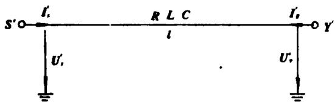
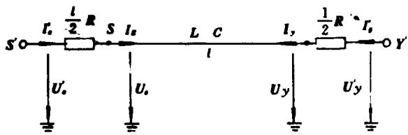
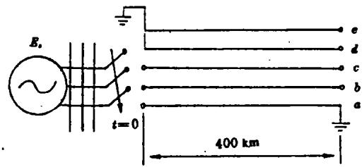
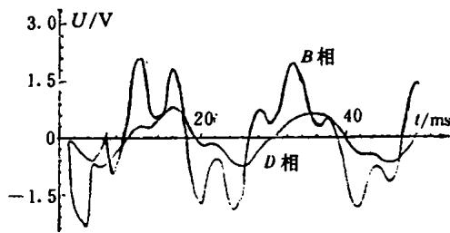
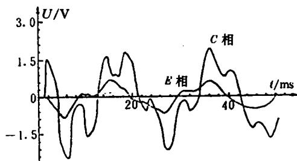
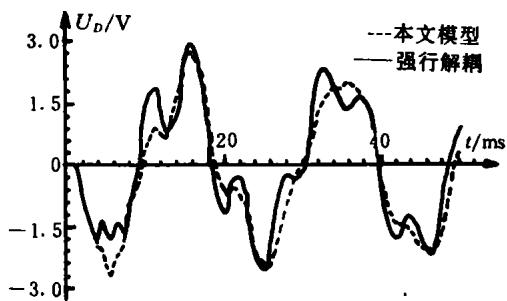

# 耦合长线电磁暂态分析的扩展 Bergeron 模型

徐政

（浙江大学电机系 杭州 310027）

提要本文将多相耦合输电线路分解成集中电阻和无损线路两个部分，分别在不同的坐标系中进行处理。由此导出了用于输电线路电磁暂态计算的扩展Bergeron模型，较好地解决了不计参数频率特性时任何结构多相耦合输电线路的电磁暂态计算问题。

关键词：输电线路 电磁暂态 数学模型

# 1 引言

当参数取某一频率下的固定值时，多相耦合输电线路的电磁暂态计算一般采用相模变换的方法来解决。即将在相坐标下相互耦合的相量波动方程变换到模坐标下相互独立的模量波动方程，再对各模量波动方程分别进行求解。当不考虑输电线路的损耗时，上述方法总能凑效。但当考虑输电线中的电阻损耗时，相模变换方法实际上包含了一个很重要的前提条件：即输电线路的单位长度电阻参数矩阵 $\pmb{R}$ 在相模变换矩阵 $\pmb{Q}$ 的作用下

$$
\boldsymbol {R} _ {m} = \boldsymbol {Q} ^ {T} \boldsymbol {R} \boldsymbol {Q} \tag {1}
$$

也能解耦。即 $R_{m}$ 变为对角矩阵或至少变为近似的对角矩阵（同一行或列上的非对角元素绝对值比对角元素绝对值小1到2个数量级）。这里 $\pmb{Q}$ 的意义和求法见文献[1]。由于 $\pmb{Q}$ 的计算并不依赖于 $\pmb{R}$ ，因此从数学上来看，一般情况下要使 $\pmb{R}_{m}$ 变为对角矩阵是不可能的，除非对输电线路结构加以某种限制。因此，对任意结构的输电线路，上述前提条件是很难满足的。例如，当考虑地线在内时， $500\mathrm{kV}$ 平武输电线路的单位长度参数矩阵为[2]

$$
\boldsymbol {R} = \left[ \begin{array}{l l l l l} 0. 0 7 6 3 4 8 & & & & \\ 0. 0 4 9 3 4 8 & 0. 0 7 6 3 4 8 & & \text {对 称} & \\ 0. 0 4 9 3 4 8 & 0. 0 4 9 3 4 8 & 0. 0 7 6 3 4 8 & & \\ 0. 0 4 9 3 4 8 & 0. 0 4 9 3 4 8 & 0. 0 4 9 3 4 8 & 0. 0 4 2 4 3 4 8 & \\ 0. 0 4 9 3 4 8 & 0. 0 4 9 3 4 8 & 0. 0 4 9 3 4 8 & 0. 0 4 9 3 4 8 & 0. 0 4 2 4 3 4 8 \end{array} \right] (\Omega / \mathrm {k m}) \tag {2}
$$

$$
\boldsymbol {L} = \left[ \begin{array}{l l l l l} 1. 7 0 3 & & & & \\ 0. 8 5 5 & 1. 7 0 3 & & \text {对 称} & \\ 0. 7 1 6 & 0. 8 5 5 & 1. 7 0 3 & & \\ 0. 9 4 7 & 0. 8 4 3 & 0. 7 2 0 & 2. 3 9 4 & \\ 0. 7 2 0 & 0. 8 4 3 & 0. 9 4 7 & 0. 7 4 5 & 2. 3 9 4 \end{array} \right] \quad (\mathrm {m H / k m})
$$

(3)

$$
\begin{array}{l} \boldsymbol {C} = \left[ \begin{array}{l l l l l} 0. 0 1 1 7 6 4 4 & & & & \\ - 0. 0 0 1 8 2 2 1 & 0. 0 1 1 8 8 9 3 & & \text {对 称} & \\ - 0. 0 0 0 4 6 4 5 & - 0. 0 0 1 8 2 2 1 & 0. 0 1 1 7 6 4 4 & & \\ - 0. 0 0 1 9 1 6 0 & - 0. 0 0 1 0 0 8 0 & - 0. 0 0 0 3 6 6 0 & 0. 0 0 6 8 3 7 & \\ - 0. 0 0 0 3 6 6 0 & - 0. 0 0 1 0 0 8 0 & - 0. 0 0 1 9 1 6 0 & - 0. 0 0 0 3 6 1 & 0. 0 0 6 8 3 7 \end{array} \right] \\ (\mu \mathrm {F} / \mathrm {k m}) \tag {4} \\ \end{array}
$$

由 $\pmb{L}$ 和 $\pmb{c}$ 可以算得

$$
\boldsymbol {Q} = \left[ \begin{array}{l l l l l} 0. 5 6 7 4 2 2 & - 0. 4 4 1 8 2 6 & - 0. 6 6 2 7 5 0 & - 0. 3 1 0 0 9 5 & 0. 4 3 5 2 2 6 \\ 0. 5 0 6 5 2 8 & 0. 7 7 7 5 7 1 & 0. 0 0 0 0 0 0 & - 0. 4 3 3 4 5 9 & 0. 0 0 0 0 0 0 \\ 0. 5 6 7 4 4 2 & - 0. 4 4 1 8 2 6 & 0. 6 6 3 2 7 5 & - 0. 3 1 0 0 9 5 & - 0. 4 3 5 2 2 6 \\ 0. 2 2 2 9 9 0 & 0. 0 4 9 8 1 5 & - 0. 2 4 5 0 8 4 & 0. 5 5 6 6 8 5 & - 0. 5 5 7 2 9 5 \\ 0. 2 2 2 9 9 0 & 0. 0 4 9 8 1 5 & 0. 2 4 5 0 8 4 & 0. 5 5 6 6 8 5 & 0. 5 5 7 2 9 5 \end{array} \right]
$$

(5)

由此算得

$$
\boldsymbol {R} _ {m} = \left[ \begin{array}{l l l l l} 0. 2 7 6 6 2 8 & & & & \\ 0. 0 0 4 7 6 3 & 0. 0 2 8 7 2 9 & & (\text {对 称}) & \\ 0. 0 0 0 0 0 0 & 0. 0 0 0 0 0 0 & 0. 0 6 8 8 0 6 & & \\ 0. 0 8 3 8 2 3 & 0. 0 1 9 0 7 8 & 0. 0 0 0 0 0 0 & 0. 2 4 2 8 6 5 & \\ 0. 0 0 0 0 0 0 & 0. 0 0 0 0 0 0 & 0. 0 8 6 8 5 0 & 0. 0 0 0 0 0 0 & 0. 2 4 3 1 6 \end{array} \right] (\Omega / \mathrm {k m})
$$

(6)

显示 $\pmb{R}_{m}$ 不是对角阵，也不满足近似对角阵的条件。

本文以单根无损线的 Bergeron 模型为基础，推导出了考虑电阻损耗的适用于任意结构多相耦合输电线路的扩展 Bergeron 模型。

# 2 耦合长线的扩展 Bergeron 模型

考虑的 $\pmb{n}$ 相耦合输电线路如图1所示。设线路总长为 $l$ 单位长度的电阻矩阵、电感矩阵和电容矩阵分别为 $\pmb{R},\pmb{L}$ 和 $\pmb{C}$ 。

$$
I _ {s} ^ {\prime} = \left[ i _ {s 1} ^ {\prime}, i _ {s 2} ^ {\prime}, \dots , i _ {s n} ^ {\prime} \right] ^ {T} \tag {7}
$$

$$
\begin{array}{l} \boldsymbol {U} _ {s} ^ {\prime} = \left[ u _ {1} ^ {\prime}, u _ {2} ^ {\prime}, \dots , u _ {m} ^ {\prime} \right] ^ {T} (8) \\ I _ {r} ^ {\prime} = \left[ i _ {r 1} ^ {\prime}, i _ {r 2} ^ {\prime}, \dots , i _ {r n} ^ {\prime} \right] ^ {T} (9) \\ \boldsymbol {U} _ {r} ^ {\prime} = \left[ u _ {r 1} ^ {\prime}, u _ {r 2} ^ {\prime}, \dots , u _ {r n} ^ {\prime} \right] ^ {T} (10) \\ \end{array}
$$

分别为线路送端 $s^{\prime}$ 和受端 $\pmb{r}^{\prime}$ 的相电流列向量和相电压列向量。

  
图1 $n$ 相耦合输电线路示意图

  
Fig.1 a coupled n-phase transmission line scheme   
图2 $n$ 相耦合输电线路之等值电路  
Fig.2 Equivalent circuit of coupled n-phase transmission line

首先作一次近似，将沿线路均匀分布的电阻集中到线路的两端。由此得到 $n$ 相耦合输电线路的等值电路如图2所示。图2中，从 $s$ 端到 $r$ 端的 $n$ 相耦合输电线路长度仍为 $l$ ，但已变为无损线路，其单位长度电感矩阵和电容矩阵仍然为 $L$ 和 $C$ 。

$$
\boldsymbol {I} _ {s} = \left[ \begin{array}{l l l l} i _ {s 1} & i _ {s 2} & \dots & i _ {s n} \end{array} \right] ^ {T} \tag {11}
$$

$$
\boldsymbol {U} _ {s} = \left[ \begin{array}{l l l l} u _ {s 1} & u _ {s 2} & \dots & u _ {s n} \end{array} \right] ^ {T} \tag {12}
$$

$$
\boldsymbol {I} _ {r} = \left[ \begin{array}{l l l l} i _ {r 1} & i _ {r 2} & \dots & i _ {r n} \end{array} \right] ^ {T} \tag {13}
$$

$$
\boldsymbol {U} _ {r} = \left[ \begin{array}{l l l l} u _ {r 1} & u _ {r 2} & \dots & u _ {r n} \end{array} \right] ^ {T} \tag {14}
$$

分别为 $s$ 端和 $r$ 端的相电流列向量和相电压列向量。对于无损的 $n$ 相耦合输电线路相模变换方法总是成立的，详细的论证见文献[1]，本文将其主要结果归纳如下：

描述多相耦合无损线路的波动方程为

$$
\frac {\partial \boldsymbol {U}}{\partial x} = - \boldsymbol {L} \frac {\partial \boldsymbol {I}}{\partial t} \tag {15}
$$

$$
\frac {\partial \boldsymbol {I}}{\partial x} = - \boldsymbol {C} \frac {\partial \boldsymbol {U}}{\partial t} \tag {16}
$$

作相模变换

$$
\boldsymbol {I} = \boldsymbol {Q} \boldsymbol {I} ^ {(m)} \tag {17}
$$

$$
\boldsymbol {U} = \boldsymbol {Q} ^ {- T} \boldsymbol {U} ^ {(m)} \tag {18}
$$

则相坐标下的波动方程(15)、(16)变到模坐标下为

$$
\frac {\partial \boldsymbol {U} ^ {(m)}}{\partial x} = - \boldsymbol {Q} ^ {T} \boldsymbol {L} \boldsymbol {Q} \frac {\partial \boldsymbol {I} ^ {(m)}}{\partial t} = - \boldsymbol {L} _ {m} \frac {\partial \boldsymbol {I} ^ {(m)}}{\partial t} \tag {19}
$$

$$
\frac {\partial I ^ {(m)}}{\partial x} = - Q ^ {- 1} C Q ^ {- T} \frac {\partial U ^ {(m)}}{\partial t} = - C _ {m} \frac {\partial U ^ {(m)}}{\partial t} \tag {20}
$$

相模变换能否成功的关键是寻找变换矩阵 $\pmb{Q}$ 使

$$
\boldsymbol {L} _ {m} = \boldsymbol {Q} ^ {T} \boldsymbol {L} \boldsymbol {Q} \tag {21}
$$

$$
\boldsymbol {C} _ {m} = \boldsymbol {Q} ^ {- 1} \boldsymbol {L} \boldsymbol {Q} ^ {- T} \tag {22}
$$

变为对角矩阵。可以证明，这样的变换矩阵 $\pmb{Q}$ 总是存在的[1]下面给出求 $\pmb{Q}$ 矩阵的步骤：

(1)对 $\pmb{L}$ 矩阵进行平方根分解 $L = H^{\mathrm{T}}H$   
(2)求 $\pmb{H}\pmb{C}\pmb{H}^{T}$

(3)用Jacobi方法化对称阵 $\pmb{H}\pmb{C}\pmb{H}^T$ 为对角阵，记相应的变换矩阵为 $\pmb{x}$   
(4) 由此求得 $Q = H^{-1}X$ 。为计算方便，通常将 $\pmb{Q}$ 矩阵规格化，即使 $\pmb{Q}$ 矩阵的列向量为单位长度。

用上述方法以求得 $\pmb{Q}$ 矩阵，必能使 $L_{m}$ 和 $C_m$ 对角化。例如，对于由(3)、(4)给出的 $500\mathrm{kV}$ 平武输电线路参数矩阵，可以求得相应的变换矩阵 $\pmb{Q}$ 如(5)所示。而 $L_{m}$ 和 $C_m$ 可以算得为

$$
\begin{array}{l} L _ {m} = \left[ \begin{array}{c c c c c} 4. 5 1 4 4 9 2 & & & & \\ & 0. 7 9 8 5 7 7 & & & \\ & & 1. 2 1 4 1 3 0 & & \\ & & & 1. 2 2 5 6 9 3 & \\ & & & & 1. 1 7 7 9 7 0 \\ & & & (\mathrm {m H / k m}) \end{array} \right] (23) \\ \boldsymbol {C} _ {m} = \left[ \begin{array}{c c c c c} 0. 0 0 6 1 8 7 & & & & \\ & 0. 0 1 4 1 3 5 & & & \\ & & 0. 0 0 9 7 1 8 & & \\ & & & 0. 0 0 9 3 4 3 & \\ & & & & 0. 0 0 9 7 0 9 \\ & & & (\mu \mathrm {F} / \mathrm {k m}) \end{array} \right] (24) \\ \end{array}
$$

由于 $L_{m}$ 和 $C_{m}$ 为对角矩阵，因此方程(19)，(20)皆可分解为 $\pmb{n}$ 个独立的模量方程。例如对于第 $\pmb{k}$ 个模量，相应的模量波动方程为

$$
\frac {\partial u _ {k} ^ {(m)}}{\partial x} = - L _ {m k} \frac {\partial i _ {k} ^ {(m)}}{\partial t} \tag {25}
$$

$$
\frac {\partial i _ {k} ^ {(m)}}{\partial x} = - C _ {m k} \frac {\partial u _ {k} ^ {(m)}}{\partial t} \tag {26}
$$

其中 $L_{mk}$ 和 $C_{mk}$ 分别为 $L_{m}$ 和 $C_{m}$ 主对角线上的第 $k$ 个元素。由此得到第 $k$ 个模量的 Bergeron 模型[3]为

$$
i _ {k} ^ {(m)} (t) = u _ {k} ^ {(m)} (t) / Z _ {k} - \operatorname {h i s t} _ {r k} ^ {(m)} (t - \tau_ {k}) \tag {27}
$$

$$
i _ {r k} ^ {(m)} (t) = u _ {r k} ^ {(m)} (t) / Z _ {k} - \operatorname {h i s t} _ {s k} ^ {(m)} (t - \tau_ {k}) \tag {28}
$$

这里

$$
\operatorname {h i s t} _ {r k} ^ {(m)} (t - \tau_ {k}) = u _ {r k} ^ {(m)} (t - \tau_ {k}) / Z _ {k} + i _ {r k} ^ {(m)} (t - \tau_ {k}) \tag {29}
$$

$$
\operatorname {h i s t} _ {s k} ^ {(m)} \left(t - \tau_ {k}\right) = u _ {s k} ^ {(m)} \left(t - \tau_ {k}\right) / Z _ {k} + i _ {s k} ^ {(m)} \left(t - \tau_ {k}\right) \tag {30}
$$

$$
Z _ {k} = \sqrt {L _ {m k} / C _ {m k}} \tag {31}
$$

$$
\tau_ {k} = l \cdot \sqrt {L _ {m k} \cdot C _ {m k}} \tag {32}
$$

将各模量的 Bergeron 模型集中写成矩阵形式, 对于 s 端有:

$$
\begin{array}{l} \left[ \begin{array}{l} i _ {r 1} ^ {(m)} (t) \\ i _ {r 2} ^ {(m)} (t) \\ \dots \\ i _ {m} ^ {(m)} (t) \end{array} \right] = \left[ \begin{array}{c c c c} \frac {1}{Z _ {1}} & & & \\ & \frac {1}{Z _ {2}} & & \\ & & \ddots & \\ & & & \frac {1}{Z _ {n}} \end{array} \right] \left[ \begin{array}{l} u _ {r 1} ^ {(m)} (t) \\ u _ {r 2} ^ {(m)} (t) \\ \dots \\ u _ {m} ^ {(m)} (t) \end{array} \right] \\ - \left[ \begin{array}{l} \operatorname {h i s t} _ {r 1} ^ {(m)} (t - \tau_ {1}) \\ \operatorname {h i s t} _ {r 2} ^ {(m)} (t - \tau_ {2}) \\ \vdots \\ \operatorname {h i s t} _ {r n} ^ {(m)} (t - \tau_ {n}) \end{array} \right] \tag {33} \\ \end{array}
$$

采用矩阵符号，方程(33)可改写为

$$
I _ {s} ^ {(m)} (t) = Y ^ {(m)} U _ {s} ^ {(m)} (t) - \mathbf {H I S T} _ {r} ^ {(m)} (t - \tau) \tag {34}
$$

上式中各量的意义参照(33)自明。同理，对 $\mathbf{r}$ 端，也有方程

$$
\boldsymbol {I} _ {r} ^ {(m)} (t) = \boldsymbol {Y} ^ {(m)} \boldsymbol {U} _ {r} ^ {(m)} (t) - \mathbf {H I S T} _ {s} ^ {(m)} (t - \tau) \tag {35}
$$

将方程(34)和(35)变回到相坐标系统中，

$$
\boldsymbol {I} _ {s} ^ {(m)} (t) = \boldsymbol {Q} \boldsymbol {Y} ^ {(m)} \boldsymbol {Q} ^ {T} \boldsymbol {U} _ {s} (t) - \boldsymbol {Q} \cdot \mathbf {H I S T} _ {r} ^ {(m)} (t - \tau) \tag {36}
$$

$$
I _ {r} ^ {(m)} (t) = Q Y ^ {(m)} Q ^ {T} U _ {r} (t) - Q \cdot \mathbf {H I S T} _ {t} ^ {(m)} (t - \tau) \tag {37}
$$

至此，已得到图2中 $s$ 端到 $\pmb{r}$ 端之间 $\pmb{n}$ 相无损线路在相坐标下的模型。下面导出整条线路的模型。由图2可知

$$
\boldsymbol {I} _ {t} (t) = \boldsymbol {I} _ {t} ^ {\prime} (t) \tag {38}
$$

$$
\boldsymbol {U} _ {t} (t) = \boldsymbol {U} _ {t} ^ {\prime} (t) - 0. 5 l \boldsymbol {R} \boldsymbol {I} _ {t} (t) \tag {39}
$$

将上两式代入方程(36)，可得

$$
\begin{array}{l} \boldsymbol {I} _ {t} ^ {\prime} (t) = (\boldsymbol {I} + 0. 5 l \boldsymbol {Q} \boldsymbol {Y} ^ {(m)} \boldsymbol {Q} ^ {T} \boldsymbol {R}) ^ {- 1} \boldsymbol {Q} \boldsymbol {Y} ^ {(m)} \boldsymbol {Q} ^ {T} \cdot \boldsymbol {U} _ {t} ^ {\prime} (t) \\ - \left(\boldsymbol {I} + 0. 5 l Q \boldsymbol {Y} ^ {(m)} \boldsymbol {Q} ^ {T} \boldsymbol {R}\right) ^ {- 1} \boldsymbol {Q} \cdot \mathbf {H I S T} _ {r} ^ {(m)} (t - \tau) \tag {40} \\ \end{array}
$$

$$
\begin{array}{l} \boldsymbol {I} _ {r} ^ {\prime} (t) = (\boldsymbol {I} + 0. 5 l \boldsymbol {Q} \boldsymbol {Y} ^ {(m)} \boldsymbol {Q} ^ {T} \boldsymbol {R}) ^ {- 1} \boldsymbol {Q} \boldsymbol {Y} ^ {(m)} \boldsymbol {Q} ^ {T} \cdot \boldsymbol {U} _ {r} ^ {\prime} (t) \\ - \left(I + 0. 5 l Q Y ^ {(m)} Q ^ {T} R\right) ^ {- 1} Q \cdot \mathbf {H I S T}; ^ {(m)} (t - \tau) (4 1) \\ \end{array}
$$

上二式中， $\pmb{I}$ 表示单位矩阵。令

$$
\boldsymbol {Y} = (\boldsymbol {I} + 0. 5 l \boldsymbol {Q} \boldsymbol {Y} ^ {(m)} \boldsymbol {Q} ^ {T} \boldsymbol {R}) ^ {- 1} \boldsymbol {Q} \boldsymbol {Y} ^ {(m)} \boldsymbol {Q} ^ {T} \tag {42}
$$

$$
\boldsymbol {P} = (\boldsymbol {I} + 0. 5 l \boldsymbol {Q} \boldsymbol {Y} ^ {(m)} \boldsymbol {Q} ^ {T} \boldsymbol {R}) ^ {- 1} \boldsymbol {Q} \tag {43}
$$

可以证明 $\pmb{Y}$ 为对称矩阵，而 $\pmb{P}$ 一般为非对称矩阵。将 $\pmb{Y}$ 和 $\pmb{P}$ 代入方程(40)和(41)可得

$$
\boldsymbol {I} _ {s} ^ {\prime} (t) = \boldsymbol {Y} \boldsymbol {U} _ {s} ^ {\prime} (t) - \boldsymbol {P} \cdot \mathbf {H I S T} _ {r} ^ {(m)} (t - \tau) \tag {44}
$$

$$
\boldsymbol {I} _ {r} ^ {\prime} (t) = \boldsymbol {Y} \boldsymbol {U} _ {r} ^ {\prime} (t) - \boldsymbol {P} \cdot \mathbf {H I S T} _ {s} ^ {(m)} (t - \tau) \tag {45}
$$

方程(44)和(45)即为考虑电阻的多相耦合输电线路的扩展 Bergeron模型。值得指出的是，由于历史项 $P \cdot \mathrm{HIST}_r^{(m)}(t - \tau)$ 和 $P \cdot \mathrm{HISP}_i^{(m)}(t - \tau)$ 决定于端点 $r$ 和 $s$ 上当前时刻 $t$ 之前某些时间点上的电流量和电压量，因此每步计算完之后必须附加计算端点 $s$ 和 $r$ 上的电流量和电压量，这是容易办到的。例如对于端点 $s$ 有

$$
\boldsymbol {U} _ {s} (t) = \boldsymbol {U} _ {s} ^ {\prime} (t) - 0. 5 l \boldsymbol {R} \boldsymbol {I} _ {s} ^ {\prime} (t) \tag {46}
$$

$$
I _ {t} (t) = I _ {t} ^ {\prime} (t) \tag {47}
$$

而

$$
\boldsymbol {U} _ {t} ^ {(m)} (t) = \boldsymbol {Q} ^ {T} \boldsymbol {U} _ {s} (t) \tag {48}
$$

$$
\boldsymbol {I} _ {t} ^ {(m)} (t) = \boldsymbol {Q} ^ {- 1} \boldsymbol {I} _ {t} (t) \tag {49}
$$

$$
\operatorname {h i s t} _ {s k} ^ {(m)} (t) = u _ {s k} ^ {(m)} (t) / Z _ {k} + i _ {s k} ^ {(m)} (t), k = 1, 2, \dots , n \tag {50}
$$

对于端点 $\mathbf{r}$ , 相应的方程为

$$
\boldsymbol {U} _ {r} (t) = \boldsymbol {U} _ {r} ^ {\prime} (t) - 0. 5 l \boldsymbol {R} \boldsymbol {I} _ {r} ^ {\prime} (t) \tag {51}
$$

$$
\boldsymbol {I} _ {r} (t) = \boldsymbol {I} ^ {\prime} _ {r} (t) \tag {52}
$$

$$
\boldsymbol {U} _ {r} ^ {(m)} (t) = \boldsymbol {Q} ^ {T} \boldsymbol {U} _ {r} (t) \tag {53}
$$

$$
\boldsymbol {I} _ {r} ^ {(m)} (t) = \boldsymbol {Q} ^ {- 1} \boldsymbol {I} _ {r} (t) \tag {54}
$$

$$
\operatorname {h i s t} _ {r k} ^ {(m)} (t) = u _ {r k} ^ {(m)} (t) / Z _ {k} + i _ {r k} ^ {(m)} (t), k = 1, 2 \dots , n \tag {55}
$$

# 3 算例

算例采用 $500\mathrm{kV}$ 平武输电线路作为模型。假定线路全长 $400\mathrm{km}$ ，两根地线只在送端接地，全线未换位，计算线路末端单相接地，送端空载合闸时（见图3），线路末端各相电压的波形。已知送端系统等值电势和各序等值电感为：线路单位长度的电阻、电感和电容参数矩阵见式(2)、(3)和(4)。为了考察本文所述模型的适用性，计算过程中将 $400\mathrm{km}$ 的线路分别等分成4段、2段和1段进行计算，发现计算结果几乎没有差别。因此可以认为，本文所作的一项近似：将沿线均匀分布的电阻集中到线路两端，对一般长度的输电线路而言并不会对计算

精度产生很大影响。计算结果见图4和图5。

  
图3 空载合闸过电压计算等值电路

  
Fig.3 Equilant circuit for calculating noload switching overvoltage   
图4 线路末端B相和D相的电压波形

  
Fig. 4 Voltage waveforms at B- and D-Phase line end   
图5 线路末端C相和E相的电压波形

Fig. 5 Voltage waveforms at C- and E-Phase line end   
图6两种算法所得的 $D$ 相电压波形  
Fig. 6 D-phase voltage waveforms obtained by two calculating methods   
  
--forced decoupling; -- present method

如果将式(6)中的 $\pmb{R}_{m}$ 强行解耦，即将 $\pmb{R}_{m}$ 的非对角元素置零。再用文献[1]所述的基于Dommel小损耗线路模型[4]的方法进行计算，则所得波形与图4和图5中的波形有一定的

差别。其中以 $D$ 相的差别为最大，如图6所示。

# 4 结论

(1)本文提出的近似假定：将沿线均匀分布的电阻集中到线路两端来处理，对一般长度的多相耦合输电线路的电磁暂态计算是适用的。  
(2)本文导出的扩展bergeron模型，保持了原Bergeron模型特别易于计算机实现的特点，适用于任何结构的多相耦合输电线路的电磁暂态计算。

# 5 参考文献

1 吴维韩, 张芳榴, 刁颐民. 多导线输电线路上波过程的贝杰龙计算方法。高电压技术, 1981;(4): $9 \sim 24$   
2 吴维韩, 张芳榴等编著. 电力系统过电压数值计算. 北京: 科学出版社, 1989, 第一章.  
3 Dommel H W. Computation of Electromagnetic Transients. Proc IEEE, July 1974; 62(7):983~993   
4 Dommel H W. Digital computer Solutions of Electromag-

netic Transients in Single and Multiphase Networks. IEEE Trans PAS, April 1969;88(4):388~399

# The Extended Bergeron Model for Electromagnetic Transient Analysis in Multiphase Transmission Lines

Xu Zheng

(Zhejiang Univ., Hangzhaou 310027 China)

Abstract In this paper, the coupled multiphase transmission line is divided into lumped resistors in series with lossless transmission line. The two parts are treated in different coordinate systems. Thus, the extended Bergeron model is developed, which can be used to compute the electromagnetic transients in multiphase transmission line of any structure more accurately.

Key Words: transmission line electromagnetic transients mathematical model

（上接第345页。continued from page 345）

# 4 结论

本文提出并论述了微分反馈补偿物理精确线性化的基本理论及方法，并用它设计了双励机的微分反馈非线性最优励磁控制规律。该方法数学过程简单，物理概念清晰，容易被工程人员所掌握。而且设计的控制规律对系统结构参数变化具有较强的鲁棒性，因此具有广阔的工程应用前景。

# 5 参考文献

1 Murthi MR. Stability of synchronous machines with 2-axis excitation systems. Proc. IEE 117(9):1799~1808   
2 Moussa H A. Power system damping enhancement by two-axis supplementary control of synchronous generators. IEEE Trans. PAS 104(5):998~1004.   
3 常鲜戎, 王仁洲, 杨以涵. 双轴励磁同步发电机的线性最优励磁控制. 华北电力学院学报, 1990, (3): 16~24  
4 卢强, 孙元章. 电力系统非线性控制. 北京: 科学出版社, 1993.  
5 李华, 张宝霖, 周荣光. 用直接大范围线性化方法设计发电机的励磁控制器. 第一部分: 基本理论. 中国电机工程学报, 1992; 12(2): 29~34

# Derivation-Feedback Nonlinear Optimal Excitation Control of Dual-Excited Synchronous Generators

Huang Jian, Tu Guangyu, Chen Deshu

(Huazhong University of Science and Technology, Wuhan Hubei 430074 China)

Abstract a novel practical and concise design method called physical exact linearization via derivation-feedback compensation, which is based on the differential geometric method, for multi-input nonlinear system is presented in this paper. The method overcomes the difficulties in controller design caused by strong nonlinearity of the power system and the designed controllers are quite robust for the changeability of the operation point and the configuration of the power system. Using this approach, a derivation-feedback nonlinear optimal excitation controller (DNLOEC) of dual-excited synchronous generator is designed. The computer simulation results on a one-machine infinite-bus power system show that the proposed controller can largely improve both dynamic stability and transient stability of the power system.

Key Words: dual-excited synchronous generators derivation-feedback compensation nonlinear state control excitation control