# An Equivalent Dynamic Phasor Model for a Single-Phase Boost Power-Factor-Correction Converter

UDOKA C. NWANETO 1,2 (Senior Member, IEEE), SEYED ALI SEIF KASHANI 3 (Graduate Student Member, IEEE), AND ANDREW M. KNIGHT 3 (Senior Member, IEEE)

1Electrical and Software Engineering Department, University of Calgary, Calgary, AB T2N 1N4, Canada 2Department of Electrical Engineering, University of Nigeria, Nsukka 410105, Nigeria 3Electrical and Software Engineering Department, University of Calgary, Calgary, AB T2N 1N4, Canada

CORRESPONDING AUTHOR: UDOKA C. NWANETO (e-mail: udoka.nwaneto1@alumni.ucalgary.ca)

The work of Udoka C. Nwaneto was supported in part by the Natural Sciences and Engineering Research Council of Canada (NSERC) and in part by Alberta Innovates.

ABSTRACT To mitigate harmonic current flow in distribution systems, single-phase diode-bridge rectifiers (DBRs) are commonly equipped with active power factor correction (PFC) controllers. Achieving high power quality and dynamic performance in PFC controller design demands a precise understanding of PFC converter behavior. While detailed electromagnetic transient (EMT) simulations provide accurate insights, they are time-consuming. To address this, the dynamic phasor (DP) method offers a more efficient modeling approach for power converters. This paper introduces and explores the DP model of a single-phase boost PFC converter, along with guidelines to integrate it with existing simulation platforms. To overcome challenges arising from differing driving frequencies (line frequency for the DBR and switching frequency for the DC-DC converter) in the DP modeling of boost PFC converters, we employ the sign function to transform the dynamic model of the single-phase DBR and boost DC-DC converter into an equivalent single-phase active rectifier model. Subsequently, we convert this equivalent model into a DP model for the single-phase boost PFC converter. Utilizing small-signal analysis, we establish a systematic design procedure for using the proposed DP model to tune and optimize PFC controller gains. Simulations conducted in MATLAB/Simulink, along with error calculations, demonstrate a strong correlation between the proposed DP model and the detailed EMT model results, while also highlighting significant numerical simulation advantages of the DP model over the detailed EMT model. Experimental results further validate the practical utility of the proposed DP model in tuning control systems for single-phase boost PFC converters.

INDEX TERMS AC–DC converter, boost converter, dynamic phasor (DP), power factor correction (PFC), single-phase active rectifier.

# I. INTRODUCTION

IN RECENT times, utilities and regulators have leveraged several standards (e.g., IEC61000-3-2 standard) to impose stringent limits on harmonics that can be injected into utility grids [1], [2] in order to reduce grid losses and prevent malfunctioning of consumer equipment sensitive to harmonics. To adhere to these standards, single-phase ac/dc converters, serving as front-end converters in wireless power transfer system and onboard charger of electric vehicles, laptop

computers, and mobile phone chargers, are usually equipped with power factor correction (PFC) control functionality to limit harmonics injection into the grid [3], [4], [5], [6], [7], [8], [9], [10]. Among several PFC topologies for ac/dc power supplies, the boost-type PFC converter is prevalent due to its low component count, low device stress, and continuous nature of its input current. In a single-phase boost PFC converter, two converters are used to interface the load to the utility grid. The first converter is an uncontrolled diode-bridge rectifier

(DBR) which converts the input AC voltage to a pulsating DC. The DBR’s output terminals are coupled to a second converter; a boost DC-DC converter. Therefore, the input voltage of the DC-DC converter in a boost-type PFC converter is a rectified sinusoidal voltage obtained from the DBR. The rectified voltage contains even-harmonic components of which double-line frequency component is the dominant one. Two widely-used control methods in boost-type PFC converters are the peak-mode current control and average-current-mode (ACM) control [11], with the ACM control being ubiquitous in commercial products.

To design boost PFC converters that are reliable and complaint to total harmonic distortion (THD) limits prescribed in standards, accurate modeling and simulation are essential. Time-domain electromagnetic transient (EMT) simulations in commercial EMT simulators such as PSCAD, EMTP, give accurate behavior and harmonic performance of boost-type PFC converters. However, EMT simulators take relatively long time to produce accurate results due to a need to use a small simulation step size (e.g., 5 μs). In addition, EMT models offer little insight required for control system design and system-level analyses. Conventionally, the long simulation time imposed by detailed models are overcome by leveraging the average-value modeling technique wherein the high-frequency components of currents and voltages are neglected. However, the dilemma associated with using the average modeling technique in boost-type PFC converters is the excitation frequency to use in performing the averaging since a boost PFC converter has two main excitation frequencies namely (a) the line frequency: dominant in the DBR, and (b) the high switching frequency: dominant in the DC-DC converter. The methods widely reported in literature to overcome this modeling challenge are based on using the timescale of interest to perform averaging. These two averaging methods are line period (Tl)-method and switching period- $- ( T _ { s w } )$ method [13], [14], [15], [16]. In [13], both $T _ { l ^ { - } }$ and $T _ { s w } .$ -averaged boost PFC circuits are proposed and analyzed. In developing the $T _ { s w }$ -averaged boost PFC model, it is assumed that the inner current loop works ideally to reduce computation burden. The $T _ { l } .$ -averaged boost PFC converter model is based on averaging the $T _ { s w }$ -averaged boost PFC model over $T _ { l } .$ The $T _ { l } .$ -averaged boost PFC-converter model is reported to be suitable for static ac and transient analyses. Another approach to obtain an average-value model discussed extensively in [14] involves three steps: (1) Assume that grid voltage and grid current are in phase; (2) Compute the average output voltage of the DBR on the grid voltage period; (3) Render the complete boost PFC average model to the timescale of the boost DC-DC converter switching period while assuming that the DBR’s output voltage is constant [14]. The described average models are mostly suitable for control design as well as visualizing the average dc voltage and fundamental input current. However, one of the demerits of these average models is that the boost inductor current dynamics, which is necessary to evaluate the harmonic performance of PFC converters, are neglected. In addition, the magnitude of the double-line

frequency ripple in the load voltage, which is often relied upon, to size the dc bus capacitor and is also the main metric considered in the trade-off between dynamic performance and ac-side current quality of the PFC converter [15], is often neglected in the formulation of conventional average-value models.

To solve this problem, this paper proposes the use of dynamic phasor (DP) method to develop the average model of a single-phase boost PFC converter [17], [18], [19], [20], [21], [22]. The DP method offers a way to overcome the simulation inefficiency of detailed EMT time-domain models and the inaccuracy of conventional average models. However, applying the DP method to model single-phase boost PFC converters is challenging due to the presence of multiple excitation frequencies, as noted in [12]. The authors of [12] proposed a 2D convolution-based extended generalized average modeling (EGAM) technique to accurately capture the dynamics of converters with multiple excitation frequencies. However, the EGAM method is relatively complex, as it requires the inclusion of numerous harmonic terms to achieve acceptable accuracy.

To this end, this paper introduces a new and simplified approach for deriving the average model of a boost PFC converter. This approach involves shifting the boost inductor’s dynamic equation from the dc side to the ac side using the sign function as a transformation mechanism. Transforming the inductor’s dynamic equation effectively converts the mathematical model of the boost PFC converter into an equivalent model of an H-bridge active rectifier. This allows the DP method to be readily applied to the equivalent boost PFC converter model, enhancing simulation speed. For example, by leveraging the DP method, the dominant second harmonic in the load voltage and the key dynamics of the rectified current can be incorporated into the average model while maintaining a relatively short simulation time. Additionally, by linearizing the large-signal DP model and applying reasonable assumptions, controllers can be accurately designed within the DP domain and subsequently used to tune practical single-phase boost PFC converters.

The contributions of this paper are summarized as follows.

1) An equivalent DP model of a single-phase boost PFC converter is developed, which enables the second harmonic component of the load voltage capacitor and the boost inductor current dynamics to be analyzed and visualized without relying on time-consuming EMT simulation of a detailed single-phase boost PFC converter model.

2) A DP-based small-signal model of the single-phase boost PFC converter is derived, and its equivalence with the conventional state-space averagevalue-model-based small-signal model is highlighted and analyzed. Unlike the conventional average-value model-based small-signal model, the DP-based smallsignal model captures harmonics, sub-harmonics and inter-harmonics, encompasses a broader frequency range, preserves transient harmonic dynamics, and is

inherently suitable for designing harmonic resonant compensators.

3) A systematic control design procedure is formulated to show how to calculate control gains using the DP model and how to use the calculated control gains to tune the control systems of detailed switching model and hardware prototype of a single-phase boost PFC converter.   
4) Guidelines to integrate the proposed DP model of a single-phase boost PFC converter into existing simulation platforms (fundamental frequency phasor simulator or EMT simulator) are given.

The remainder of this paper is structured as follows: Section II introduces the DP modeling method and the conventional average-value and DP models of a single-phase boost PFC converter. Section III explores the use of smallsignal method to develop transfer functions for control system design and uncovers the links/relationships between the DP model and the average-value model. Section IV gives the simulation results. In Section V, the proposed DP model is validated experimentally. Conclusions are drawn up in Section VI. More detailed info is given in Appendix A–E.

# II. DP MODEL OF A SINGLE-PHASE BOOST PFCCONVERTER

# A. THE DP MODELING METHOD

The DP method relies on the fact that a quasi-periodic waveform, x(τ ) with a fundamental frequency, f and potential high-order harmonics, can be represented in the interval τ ∈(t − T, t] using a time-dependent Fourier series given by [16], [17], [18], [19], [20], [21], [22]:

$$
x (\tau) = \sum_ {k = - \infty} ^ {\infty} \left\langle x \right\rangle_ {k} (t) e ^ {j k \omega \tau}, \tag {1}
$$

where ω is the fundamental frequency of x(τ ) in rad $/ \mathrm { s } ,$ and T is the sliding window length. Since x(τ ) may be aperiodic, $\langle x \rangle _ { k } ( t )$ , which is a complex Fourier coefficient, has varying amplitude and it is therefore called the kth DP [16], [17], [18], [19], [20], [21], [22]. The kth DP is computed via an averaging operation:

$$
\langle x \rangle_ {k} (t) = 1 / T \left[ \int_ {t - T} ^ {t} x (\tau) e ^ {- j k \omega \tau} d \tau \right] = X _ {k} (t). \tag {2}
$$

The kth DP, $\langle x \rangle _ { k } ( t )$ obtained from (2) is a low-frequency version of the original nearly periodic waveform, x(τ ). Thus, large step sizes can be used to simulate DP models. More information about the DP method can be found in [16], [17], [18], [19], [20], [21], [22].

# B. DP MODEL OF A SINGLE-PHASE BOOST PFCCONVERTER

To derive the DP model of the single-phase boost PFC converter, we first explore the conventional average-value model to ascertain its suitability to the DP modeling task.

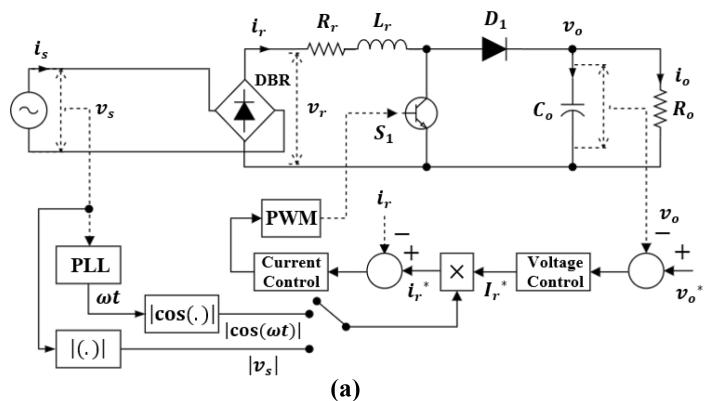

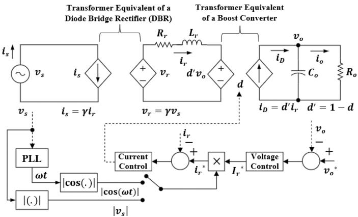  
(b)

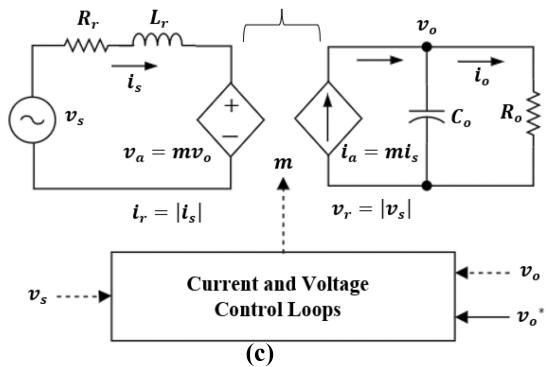  
Transformer Equivalent of both the Diode Bridge Rectifier (DBR) and the Boost Converter   
FIGURE 1. Single-phase boost PFC converter with a dual-loop linear control scheme: (a) the structure of a detailed model built in Simulink/Simscape; (b) an average model of Fig. 1(a) suitable for control design; (c) an equivalent model used in deriving the proposed DP model.

1) AVERAGE-VALUE MODEL OF THE BOOST PFC CONVERTER Fig. 1(a) shows the structure of the detailed model of a singlephase boost PFC converter. To obtain the average-value model of the single-phase boost PFC converter, the switching details of the DBR and the boost converter, in addition to the boost PWM stage shown in Fig. 1(a) are not modeled. Instead, the DBR and the boost dc-dc converter are replaced with their corresponding transformer equivalents as depicted in Fig. 1(b). The DBR’s algebraic equations are:

$$
i _ {s} = \gamma i _ {r} \tag {3a}
$$

$$
v _ {r} = \gamma v _ {s} \tag {3b}
$$

where $\gamma$ is the switching function, $v _ { s } = ~ V _ { s }$ cos ωt, $V _ { s }$ is the grid voltage amplitude, and ω is the grid frequency in rad/s.

The state-space equations of the boost converter are:

$$
L _ {r} \frac {d i _ {r}}{d t} = v _ {r} - i _ {r} R _ {r} - d ^ {\prime} v _ {o} \tag {4a}
$$

$$
C _ {o} \frac {d v _ {o}}{d t} = d ^ {\prime} i _ {r} - v _ {o} / R _ {o} \tag {4b}
$$

where d is the duty cycle and $d ^ { \prime } = 1 - d .$

Two cascaded controllers are used as shown in Fig. 1. It consists of a slower outer dc voltage loop and a faster inner current loop.

For the outer voltage control loop, two control loop topologies are widely used. The first topology involves using only a proportional-integral (PI) controller to regulate the output voltage. Its dynamical model is given by:

$$
\left\{ \begin{array}{c} \frac {d \psi}{d t} = v _ {o} ^ {*} - v _ {o} \\ I _ {r} ^ {*} = K _ {p v} \left(v _ {o} ^ {*} - v _ {o}\right) + \psi K _ {i v} \end{array} \right. \tag {5}
$$

where $K _ { p v }$ and $K _ { i v }$ are the proportional and integral gains, ψ is a state variable, ${ v _ { o } } ^ { * }$ is the reference output voltage, and $I _ { r } { ^ { * } }$ is the amplitude of the rectified current setpoint. This control strategy is effective in achieving a unity power factor, provided that the 2ω ripple in $v _ { o }$ remains negligible (owing to a presence of large $C _ { o } )$ . Otherwise, $i _ { s }$ will contain high-order harmonics. When the 2ω ripple in $v _ { o }$ is non-negligible (due to a reduced $C _ { o } )$ , a second strategy is employed, involving a cascaded connection of a notch filter and a PI controller. See the Appendix B for the additional equations describing this dc voltage control strategy.

For the inner current loop, assume a PI controller is used (this may result in a nonzero steady-state error). Then, the dynamic equation of the current loop is:

$$
\left\{ \begin{array}{c} \frac {d \phi}{d t} = i _ {r} ^ {*} - i _ {r} \\ d = K _ {p i} \left(i _ {r} ^ {*} - i _ {r}\right) + \phi K _ {i i} \end{array} \right. \tag {6}
$$

where $K _ { p i }$ and $K _ { i i }$ are the proportional and integral gains, respectively of the rectified current controller, $\phi$ is a state variable, and ${ i _ { r } } ^ { * } = { I _ { r } } ^ { * } | \cos \omega t |$ .

# 2) THE LIMITATIONS OF THE AVERAGE-VALUE MODEL

To derive the DP model of a single-phase PFC converter, (3)–(6) which describe the average behavior of the singlephase boost PFC converter should generally suffice. However, the challenge lies in selecting an appropriate sliding average window length for these equations, T . DBR’s algebraic equations are derived based on averaging variables on the linefrequency timescale whereas the boost converter equations are derived based on averaging variables on the high-switchingfrequency timescale. Recall that the sliding window length depends on the type of converter being modeled. For dc-dc converters, the sliding window length is the switching period while for dc-ac and ac-dc converters, the sliding window length is the line (mains) period [23].

# 3) OVERCOMING LIMITATIONS OF THE AVERAGE-VALUE MODEL

To overcome the limitations of using the average-value model in the DP-based modeling of a single-phase boost PFC converter, the boost inductor’s dynamic equation is shifted from dc side to the ac side via a transformation. Recall that:

$$
i _ {s} = \operatorname {s g n} \left(v _ {s}\right). i _ {r} \tag {7a}
$$

$$
v _ {r} = \operatorname {s g n} \left(v _ {s}\right). v _ {s} \tag {7b}
$$

$$
\left(\operatorname {s g n} \left(v _ {s}\right)\right) ^ {2} = 1 \tag {8}
$$

where sgn(.) represents the standard sign function wherein $\operatorname { s g n } ( p ) = - 1$ for $p < 0$ and 1 for $p > 0$ [24]. Multiplying (4a) by sgn(vs), and replacing $d ^ { \prime } i _ { \jmath }$ r term in (4b) with {sgn(vs ). $d ^ { \prime } \} . \{ \mathrm { s g n } ( v _ { s } ) . i _ { r } \}$ while considering (7) results in:

$$
L _ {r} \frac {d i _ {s}}{d t} = v _ {s} - i _ {s} R _ {r} - m v _ {o} \tag {9a}
$$

$$
C _ {o} \frac {d v _ {o}}{d t} = m i _ {s} - v _ {o} / R _ {o} \tag {9b}
$$

where $m = \{ \mathrm { s g n } ( v _ { s } ) . d ^ { \prime } \}$ is the signed value of $d ^ { \prime }$ (and equivalently, the modulation index). Eq. (9) is equivalent to the state-space average model of a single-phase active rectifier. Therefore, by transforming (3)–(4) into (9) using the sign function, the single-phase boost PFC converter is transformed to an equivalent single-phase active rectifier. This transformation results in the elimination of the intermediate dc level. This contrasts with the approach to modeling the DBR as an equivalent dc grid wherein the ac side is eliminated in the process of transformation (see Appendix A for more information). Note that the transformation of (3)–(4) to (9) is used in [25], [26] for control design purposes. With (9), the PFC action of a single-phase boost PFC converter can be demonstrated while accounting for the dominant harmonics of interest present on the dc side.

# 4) DP MODEL OF THE BOOST PFC CONVERTER POWER STAGE

Assuming the fundamental harmonic is dominant on the ac side (since we expect the PFC action to result in a power factor that is nearly unity) and the dc + second harmonic components are dominant on the dc side, we express (9) in the DP domain as follows:

$$
\begin{array}{l} L _ {r} \frac {d \langle i _ {s} \rangle_ {1} ^ {R}}{d t} = \langle v _ {s} \rangle_ {1} ^ {R} - \langle i _ {s} \rangle_ {1} ^ {R} R _ {r} - \langle m \rangle_ {1} ^ {R} \langle v _ {o} \rangle_ {0} \\ - \langle m \rangle_ {1} ^ {R} \left\langle v _ {o} \right\rangle_ {2} ^ {R} - \left\langle m \right\rangle_ {1} ^ {I} \left\langle v _ {o} \right\rangle_ {2} ^ {I} + \omega L _ {r} \left\langle i _ {s} \right\rangle_ {1} ^ {I} \tag {10a} \\ \end{array}
$$

$$
\begin{array}{l} L _ {r} \frac {d \langle i _ {s} \rangle_ {1} ^ {I}}{d t} = \langle v _ {s} \rangle_ {1} ^ {I} - \langle i _ {s} \rangle_ {1} ^ {I} R _ {r} - \langle m \rangle_ {1} ^ {I} \langle v _ {o} \rangle_ {0} \\ + \langle m \rangle_ {1} ^ {I} \left\langle v _ {o} \right\rangle_ {2} ^ {R} - \left\langle m \right\rangle_ {1} ^ {R} \left\langle v _ {o} \right\rangle_ {2} ^ {I} - \omega L _ {r} \left\langle i _ {s} \right\rangle_ {1} ^ {R} \tag {10b} \\ \end{array}
$$

$$
C _ {o} \frac {d \langle v _ {o} \rangle_ {0}}{d t} = 2 \left(\langle m \rangle_ {1} ^ {R} \langle i _ {s} \rangle_ {1} ^ {R} + \langle m \rangle_ {1} ^ {I} \langle i _ {s} \rangle_ {1} ^ {I}\right) - \langle v _ {o} \rangle_ {0} / R _ {o} \tag {10c}
$$

$$
\begin{array}{l} C _ {o} \frac {d \langle v _ {o} \rangle_ {2} ^ {R}}{d t} = \left(\langle m \rangle_ {1} ^ {R} \langle i _ {s} \rangle_ {1} ^ {R} - \langle m \rangle_ {1} ^ {I} \langle i _ {s} \rangle_ {1} ^ {I}\right) \\ - \left\langle v _ {o} \right\rangle_ {2} ^ {R} / R _ {o} + 2 \omega C _ {o} \left\langle v _ {o} \right\rangle_ {2} ^ {I} \tag {10d} \\ \end{array}
$$

$$
\begin{array}{l} C _ {o} \frac {d \langle v _ {o} \rangle_ {2} ^ {I}}{d t} = \left(\langle m \rangle_ {1} ^ {I} \langle i _ {s} \rangle_ {1} ^ {R} + \langle m \rangle_ {1} ^ {R} \langle i _ {s} \rangle_ {1} ^ {I}\right) \\ - \left\langle v _ {o} \right\rangle_ {2} ^ {I} / R _ {o} - 2 \omega C _ {o} \left\langle v _ {o} \right\rangle_ {2} ^ {R} \tag {10e} \\ \end{array}
$$

where $\langle v _ { s } \rangle _ { 1 } { } ^ { R } = V _ { s } / 2$ and ${ \langle v _ { s } \rangle } _ { 1 } { } ^ { I } = 0 .$

Time-domain quantities are obtained from the DPs using:

$$
i _ {s} = 2 \Re \left[ \sum_ {k = 1, 3, 5, 7, \dots} \langle i _ {s} \rangle_ {k} e ^ {j k \omega t} \right] \tag {11}
$$

$$
v _ {o} = \left\langle v _ {o} \right\rangle_ {0} + 2 \Re \left[ \sum_ {k = 2, 4, 6, 8, \dots} \left\langle v _ {o} \right\rangle_ {k} e ^ {j k \omega t} \right] \tag {12}
$$

Obtaining Rectified Current Dynamics

In previously published works on average-value models of single-phase boost PFC converters, the rectified current dynamics are often neglected or only the DC component is considered to simplify the model. To obtain the dc and 2ndharmonic components of $i _ { r }$ , we consider the expression:

$$
i _ {r} = \left| i _ {s} \right|. \tag {13}
$$

Assuming that unity power factor operation is ideally achieved by the PFC control schemes (though this assumption is not always trivial), (13) can be rewritten as:

$$
i _ {r} = I _ {s} | \cos \omega t | \tag {14}
$$

where $I _ { s }$ is the amplitude of the grid current. The Fourier series of (14) can be expressed as:

$$
i _ {r} = i _ {r 0} + \sum_ {k = 2, 4, 6, 8, 1 0} i _ {r k} \tag {15a}
$$

where:

$$
i _ {r 0} = \left(\frac {2}{\pi}\right) I _ {s}, \tag {15b}
$$

$$
i _ {r k} = - I _ {s} \left(\frac {4}{\pi (k + 1) (k - 1)}\right) (- 1) ^ {\frac {k}{2}} \cos k \omega t,
$$

$$
k = 2, 4, 6, \dots \tag {15c}
$$

In the DP domain,

$$
\langle i _ {r 0} \rangle_ {0} = \left(\frac {2}{\pi}\right) I _ {s} \tag {16a}
$$

$$
\langle i _ {r k} \rangle_ {k} = - I _ {s} \left(\frac {4}{\pi (k + 1) (k - 1)}\right) (- 1) ^ {\frac {k}{2}} \left(\frac {1}{2}\right),
$$

$$
k = 2, 4, 6, \dots \tag {16b}
$$

The variable, $I _ { s }$ can be calculated from:

$$
I _ {s} = 2 \sqrt {\left(\left\langle i _ {s} \right\rangle_ {1} ^ {R}\right) ^ {2} + \left(\left\langle i _ {s} \right\rangle_ {1} ^ {I}\right) ^ {2}} \tag {17}
$$

Then, $i _ { r }$ can be restored from its corresponding DPs using:

$$
i _ {r} = \langle i _ {r 0} \rangle_ {0} + 2 \Re \left[ \sum_ {k = 2, 4, 6, 8, 1 0} \langle i _ {r k} \rangle_ {k} e ^ {j k \omega t} \right] \tag {18}
$$

# 5) DP MODEL OF THE BOOST PFC CONVERTER CONTROL STAGE

In the DP domain, (9) is not suitable for modeling the DC voltage loop. This is because the time-domain based model of the boost PFC power stage given by (3)–(4) has been modified to become the model of a single-phase active rectifier power stage (see (9)). Therefore, to control the output voltage in the DP domain, the conventional control scheme of a single-phase active rectifier wherein the output voltage controls the d-axis grid current can be emulated. The dynamic equations of the equivalent control scheme for the DC output voltage loop in the DP domain is given by:

$$
\left\{ \begin{array}{c} \frac {d \langle \rho \rangle_ {0}}{d t} = v _ {o} ^ {*} - \langle v _ {o} \rangle_ {0} \\ \langle i _ {s} ^ {*} \rangle_ {1} ^ {R} = K _ {p v} \left(v _ {o} ^ {*} - \langle v _ {o} \rangle_ {0}\right) + \langle \rho \rangle_ {0} K _ {i v} \end{array} \right. \tag {19}
$$

where $\rho$ is a state variable, and $\langle { i _ { s } } ^ { * } \rangle _ { 1 } { } ^ { R }$ corresponds to the $d -$ axis reference current in the conventional control scheme. For an output voltage control scheme featuring a cascaded connection of a PI controller and a notch filter, see Appendix B for its dynamic equations.

In the DP domain, the current loop is modeled as follows. Neglecting 2nd-harmonic DP components in (10a) and (10b)

$$
L _ {r} \frac {d \langle i _ {s} \rangle_ {1} ^ {R}}{d t} = \left\langle v _ {s} \right\rangle_ {1} ^ {R} - \left\langle i _ {s} \right\rangle_ {1} ^ {R} R _ {r} - \left\langle m \right\rangle_ {1} ^ {R} \left\langle v _ {o} \right\rangle_ {0} + \omega L _ {r} \left\langle i _ {s} \right\rangle_ {1} ^ {I} \tag {20a}
$$

$$
L _ {r} \frac {d \langle i _ {s} \rangle_ {1} ^ {R}}{d t} = \left\langle v _ {s} \right\rangle_ {1} ^ {I} - \left\langle i _ {s} \right\rangle_ {1} ^ {I} R _ {r} - \left\langle m \right\rangle_ {1} ^ {I} \left\langle v _ {o} \right\rangle_ {0} - \omega L _ {r} \left\langle i _ {s} \right\rangle_ {1} ^ {R} \tag {20b}
$$

Eq. (20) reveals that there are cross-coupling terms. To decouple (20), to ensure an independent control of real and reactive power, a feedforward control scheme is designed wherein the cross-coupling terms, and the grid voltage variables (acting as disturbance variables) are compensated.

The inner current control loop dynamic model is:

$$
\langle m \rangle_ {1} ^ {R} = \frac {1}{\left\langle v _ {o} \right\rangle_ {0}} \left(- \left\langle G \right\rangle_ {1} ^ {R} + \omega L _ {r} \left\langle i _ {s} \right\rangle_ {1} ^ {I} + \left\langle v _ {s} \right\rangle_ {1} ^ {R}\right) \tag {21a}
$$

$$
\left\{ \begin{array}{c} \frac {d g _ {R}}{d t} = \langle i _ {s} ^ {*} \rangle_ {1} ^ {R} - \langle i _ {s} \rangle_ {1} ^ {R} \\ \langle G \rangle_ {1} ^ {R} = K _ {p i} \left(\langle i _ {s} ^ {*} \rangle_ {1} ^ {R} - \langle i _ {s} \rangle_ {1} ^ {R}\right) + g _ {R} K _ {i i} \end{array} \right. \tag {21b}
$$

$$
\langle m \rangle_ {1} ^ {I} = \frac {1}{\langle v _ {o} \rangle_ {0}} \left(- \langle G \rangle_ {1} ^ {I} - \omega L _ {r} \langle i _ {s} \rangle_ {1} ^ {R} + \langle v _ {s} \rangle_ {1} ^ {I}\right) \tag {21c}
$$

$$
\left\{ \begin{array}{c} \frac {d g _ {I}}{d t} = \langle i _ {s} ^ {*} \rangle_ {1} ^ {I} - \langle i _ {s} \rangle_ {1} ^ {I} \\ \langle G \rangle_ {1} ^ {I} = K _ {p i} \left(\langle i _ {s} ^ {*} \rangle_ {1} ^ {I} - \langle i _ {s} \rangle_ {1} ^ {I}\right) + g _ {I} K _ {i i} \end{array} \right. \tag {21d}
$$

where $g _ { R }$ and $g _ { I }$ are the state variables for the real and imaginary grid current loops, respectively, terms containing $R _ { r }$ are neglected, and $\langle \dot { l } _ { s } { } ^ { * } \rangle _ { 1 } \dot { \bar { \mathbf { \xi } } } ^ { I }$ is set to zero to achieve near unity power factor. Thus, the single-controller-based inner current

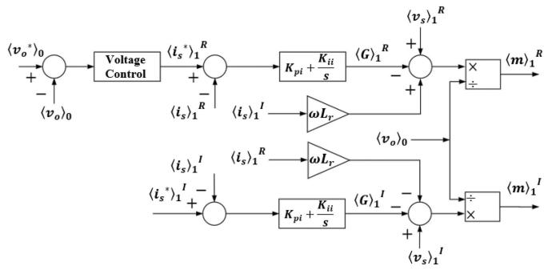  
FIGURE 2. The equivalent control structure of cascaded dual-control loop of a single-phase boost PFC converter in the DP domain.

loop in the detailed time-domain model is transformed into a two-controller-based inner current loop in the DP domain, as shown in Fig. 2 [16]. This results in an 8th-order (10th-order with the notch filter) DP model. In contrast, the detailed model is 4th-order (6th-order with the notch filter).

# III. SMALL-SIGNAL MODEL OF A SINGLE-PHASE BOOSTPFC CONVERTER

This section describes the application of the small-signal method to both the average-value time-domain and DP models of a single-phase boost PFC converter to derive open- and closed-loop control transfer functions suitable for control design. Both small-signal models are then compared.

# A. SMALL-SIGNAL MODEL FOR THE DETAILED BOOST PFC CONVERTER

The linearization of (4) around an operating point gives:

$$
L _ {r} \frac {d \widetilde {i _ {r}}}{d t} = \widetilde {v} _ {r} - \widetilde {i _ {r}} R _ {r} - (1 - D) \widetilde {v} _ {o} + \tilde {d V} _ {o} \tag {26a}
$$

$$
C _ {o} \frac {d \widetilde {v _ {o}}}{d t} = (1 - D) \widetilde {t _ {r}} - \tilde {d I} _ {r} - \widetilde {v _ {o}} / R _ {o} \tag {26b}
$$

where variables with tilde denote perturbations around the operating point and variables in caps are values of the variables at equilibrium or steady state.

Assuming that $v _ { r }$ is constant over a switching cycle (note that this assumption is true if the switching frequency $> > \omega )$ , the closed-loop transfer function of the current loop is [16]:

$$
\begin{array}{l} G _ {c i} ^ {s w} (s) = \frac {\widetilde {i _ {r}} (s)}{\widetilde {i _ {r}} ^ {*} (s)} = \frac {V _ {o} (s K _ {p i} + K _ {i i})}{L _ {r} s ^ {2} + (R _ {r} + K _ {p i} V _ {o}) s + K _ {i i} V _ {o}} \\ = \frac {\left(V _ {o} / L _ {r}\right) \left(s K _ {p i} + K _ {i i}\right)}{s ^ {2} + \left(\frac {R _ {r} + K _ {p i} V _ {o}}{L _ {r}}\right) s + \frac {K _ {i i} V _ {o}}{L _ {r}}} \tag {27} \\ \end{array}
$$

The voltage closed-loop transfer function is given by [16]:

$$
G _ {c v} ^ {s w} (s) = \frac {\widetilde {v _ {o}} (s)}{\widetilde {v _ {o}} ^ {*} (s)} = \frac {\lambda_ {2} \left(s K _ {p v} + K _ {i v}\right)}{s ^ {2} + \left(\omega_ {R C} + \lambda_ {2} K _ {p v}\right) s + \lambda_ {2} K _ {i v}} \tag {28}
$$

where $\begin{array} { r } { \lambda _ { 2 } = \frac { V _ { r } } { 2 V _ { o } C _ { o } } , \omega _ { R C } = \frac { 1 } { R _ { o } C _ { o } } } \end{array}$ , and $V _ { r } \approx V _ { s }$ . Comparing (28)

to a standard second-order function, Gsv = a1(s + a2 )s2 + 2ε ω s + ω 2 $\begin{array} { r } { G _ { s v } = \frac { a _ { 1 } ( s + a _ { 2 } ) } { s ^ { 2 } + 2 \varepsilon _ { v } \omega _ { b v } s + \omega _ { b v } { } ^ { 2 } } } \end{array}$

(where $\omega _ { b v }$ is the voltage-loop bandwidth) results in:

$$
\left\{ \begin{array}{c} K _ {p v} = \frac {1}{\lambda_ {2}} \left(2 \varepsilon_ {v} \omega_ {b v} - \omega_ {R C}\right) \\ K _ {i v} = \omega_ {b v} ^ {2} / \lambda_ {2} \end{array} , \right. \tag {29}
$$

To ensure that the voltage-loop attenuates 2ω (120 Hz in this paper) ripples, $\omega _ { b v }$ is set to be one-tenth to one-fifth of 2ω [27]. A bandwidth of ∼5–15 Hz will ensure that the voltageloop will be static over the 50–60 Hz cycle thereby preventing the distortion of the boost inductor current [28].

# B. SMALL-SIGNAL MODEL FOR THE DP-BASED BOOST PFC CONVERTER

Assuming the cross-coupling terms are well-compensated, and the grid voltage remains constant $( \langle \widetilde { v _ { s } } \rangle _ { 1 } { } ^ { R } = \langle \widetilde { v _ { s } } \rangle _ { 1 } { } ^ { I } = 0 )$ , applying small-signal perturbations to (10a)–(10b) results in:

$$
L _ {r} \left\langle \dot {\tilde {i _ {s}}} \right\rangle_ {1} ^ {R} = - \left\langle \tilde {i _ {s}} \right\rangle_ {1} ^ {R} R _ {r} - \left\langle \tilde {m} \right\rangle_ {1} ^ {R} \left\langle v _ {o e} \right\rangle_ {0} \tag {30a}
$$

$$
L _ {r} \left\langle \dot {\widetilde {i}} _ {s} \right\rangle_ {1} ^ {I} = - \left\langle \widetilde {i} _ {s} \right\rangle_ {1} ^ {I} R _ {r} - \left\langle \tilde {m} \right\rangle_ {1} ^ {I} \left\langle v _ {o e} \right\rangle_ {0} \tag {30b}
$$

where variables with the subscript $\cdot _ { \mathrm { e } } ,$ are steady-state values.

The plant models for the inner current loop are:

$$
G _ {o i, \Re} ^ {d p} (s) = \frac {\left\langle \widetilde {i _ {s}} \right\rangle_ {1} ^ {R}}{\left\langle \tilde {m} \right\rangle_ {1} ^ {R}} = \frac {- \left\langle v _ {o e} \right\rangle_ {0}}{\left(s L _ {r} + R _ {r}\right)} \tag {31a}
$$

$$
G _ {o i, \mathfrak {I}} ^ {d p} (s) = \frac {\left\langle \widetilde {i _ {s}} \right\rangle_ {1} ^ {I}}{\left\langle \tilde {m} \right\rangle_ {1} ^ {I}} = \frac {- \left\langle v _ {o e} \right\rangle_ {0}}{\left(s L _ {r} + R _ {r}\right)} \tag {31b}
$$

Comparing (31) with the current-loop plant model given in [15], reveals that the DP model-based current loop is equivalent to the detailed model-based current loop.

For the output voltage $v _ { o }$ loop, two assumptions are made; $( 1 ) \ \langle i _ { s } \rangle _ { 1 } \dot { I }$ is small compared to $\langle i _ { s } \rangle _ { 1 } { } ^ { R } ; ( 2 ) \ \overline { { { \langle m \rangle } } } _ { 1 } { } ^ { R }$ and m I variables do not affect the voltage-loop dynamics.

Linearization of (10c) yields:

$$
C _ {o} \left\langle \tilde {v _ {o}} \right\rangle_ {0} = 2 \left\langle m _ {e} \right\rangle_ {1} ^ {R} \left\langle \tilde {i _ {s}} \right\rangle_ {1} ^ {R} - \left\langle \tilde {v _ {o}} \right\rangle_ {0} / R _ {o} \tag {32}
$$

$$
\frac {\left\langle \widetilde {v} _ {o} \right\rangle_ {0}}{\left\langle \widetilde {i} _ {s} \right\rangle_ {1} ^ {R}} = \frac {2 \left\langle m _ {e} \right\rangle_ {1} ^ {R}}{\left(s C _ {o} + \frac {1}{R _ {o}}\right)} \tag {33}
$$

Zeroing the derivative in (20a) results in:

$$
- \left\langle v _ {s e} \right\rangle_ {1} ^ {R} = - \left\langle i _ {s e} \right\rangle_ {1} ^ {R} R _ {r} - \left\langle m _ {e} \right\rangle_ {1} ^ {R} \left\langle v _ {o e} \right\rangle_ {0} + \omega L _ {r} \left\langle i _ {s e} \right\rangle_ {1} ^ {I} \tag {34}
$$

Assume that ${ R _ { r } } = { \langle i _ { s e } \rangle _ { 1 } } ^ { I } = 0 , { \langle m _ { e } \rangle _ { 1 } } ^ { R }$ is obtained as:

$$
\langle m _ {e} \rangle_ {1} ^ {R} = \left\langle v _ {s e} \right\rangle_ {1} ^ {R} / \left\langle v _ {o e} \right\rangle_ {0} \tag {35}
$$

Substituting (35) into (33) results in:

$$
\begin{array}{l} G _ {o v, \Re} ^ {d p} (s) = \frac {\langle \widetilde {v _ {o}} \rangle_ {0}}{\left\langle \widetilde {i _ {s}} \right\rangle_ {1} ^ {R}} = \frac {2 \left(\langle v _ {s e} \rangle_ {1} ^ {R} / \langle v _ {o e} \rangle_ {0}\right)}{\left(s C _ {o} + \frac {1}{R _ {o}}\right)} = \frac {V _ {s} / \langle v _ {o e} \rangle_ {0}}{\left(s C _ {o} + \frac {1}{R _ {o}}\right)} \\ = \frac {V _ {r} / V _ {o}}{\left(s C _ {o} + \frac {1}{R _ {o}}\right)} \tag {36} \\ \end{array}
$$

Comparing (36) with the voltage open-loop transfer function derived from an average-value model in [15], [16] shows that the DP model’s voltage loop structure and the conventional detailed model’s voltage loop structure are equivalent.

# 1) CLOSED-LOOP MODEL FOR THE CURRENT LOOP

Equation (31) shows that the -axis current loop and the - axis current loop are identical. Thus, deriving one closed-loop transfer function for either of the loops is enough. The current closed-loop transfer function of the -axis loop is:

$$
\begin{array}{l} G _ {c i, \Re} ^ {d p} (s) = \frac {\left\langle \widetilde {i _ {s}} \right\rangle_ {1} ^ {R} (s)}{\left\langle \widetilde {i _ {s}} ^ {*} \right\rangle_ {1} ^ {R} (s)} \\ = \frac {\left(K _ {p i} + \frac {K _ {i i}}{s}\right) (- 1 / \langle v _ {o e} \rangle_ {0}) . G _ {o i , \Re} ^ {d p} (s)}{1 + \left(K _ {p i} + \frac {K _ {i i}}{s}\right) (- 1 / \langle v _ {o e} \rangle_ {0}) . G _ {o i , \Re} ^ {d p} (s)}, \\ \end{array}
$$

$$
G _ {c i, \Re} ^ {d p} (s) = \frac {\left(s K _ {p i} + K _ {i i}\right)}{L _ {r} s ^ {2} + \left(R _ {r} + K _ {p i}\right) s + K _ {i i}} \tag {37}
$$

A comparison of (27) and (37) shows that the equations used to calculate the voltage-loop PI gains for the DP model differ from those for the detailed model by a factor of $1 / V _ { o }$ $( = 1 / \langle v _ { o e } \rangle _ { 0 } )$ [15], [16]. This difference arises because the output of the current controller in the DP model is scaled by $1 / \langle v _ { o e } \rangle _ { 0 }$ whereas no such scaling is applied in the detailed model. Applying the same scaling factor to the output of the current controller in the detailed model would equalize the current-loop control gain between the DP & detailed models.

# 2) CLOSED-LOOP MODEL FOR THE VOLTAGE LOOP

The voltage closed-loop equation for the DP model is:

$$
\begin{array}{l} G _ {c v} ^ {d p} (s) = \frac {\langle \widetilde {v _ {o}} \rangle_ {0} (s)}{\left\langle \widetilde {v _ {o}} ^ {*} \right\rangle_ {0} (s)} = \frac {\left(K _ {p v} + \frac {K _ {i v}}{s}\right) G _ {o v , \Re} ^ {d p} (s)}{1 + \left(K _ {p v} + \frac {K _ {i v}}{s}\right) G _ {o v , \Re} ^ {d p} (s)}, \\ G _ {c v} ^ {d p} (s) = \frac {\lambda_ {3} \left(s K _ {p v} + K _ {i v}\right)}{s ^ {2} + \left(\omega_ {R C} + \lambda_ {3} K _ {p v}\right) s + \lambda_ {3} K _ {i v}}, \tag {38} \\ \end{array}
$$

where λ = $\begin{array} { r } { \lambda _ { 3 } = \frac { 2 \langle v _ { s e } \rangle _ { 1 } { } ^ { R } } { \langle v _ { o e } \rangle _ { 0 } C _ { o } } = \frac { V _ { r } } { V _ { o } C _ { o } } } \end{array}$ . Comparing (38) to $G _ { s v }$ yields

$$
\left\{ \begin{array}{c} K _ {p v} = \frac {1}{\lambda_ {3}} \left(2 \varepsilon_ {v} \omega_ {b v} - \omega_ {R C}\right) \\ K _ {i v} = \omega_ {b v} ^ {2} / \lambda_ {3} \end{array} , \right. \tag {39}
$$

A comparison of (29) and (39), reveals that the voltage-loop control gains of the DP model are about one-half of detailed model-based voltage-loop control gains [16]. The procedure to derive the DP model’s control scheme is given in Fig. 3.

# IV. SIMULATION RESULTS

This section validates the accuracy and simulation speed of the proposed DP model for a single-phase boost PFC converter, against the detailed switching (SW) model results. The SW model is developed in Simulink based on Fig. 1(a), while the DP model’s differential-algebraic equations, derived

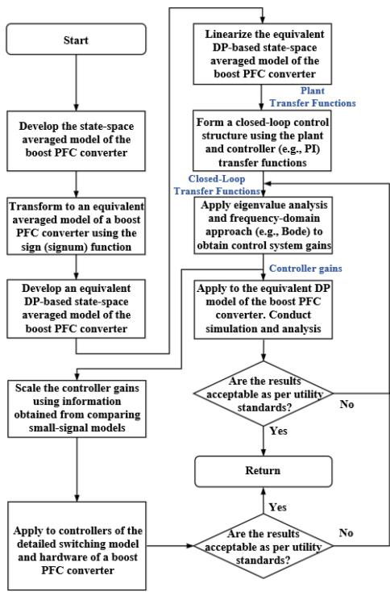  
FIGURE 3. Proposed methodology for developing control system structure and calculating the controller gains of the DP domain-based single-phase boost PFC converter model. The procedure to use in mapping the control gains of the DP model to the control gains of the detailed switching model and the experimental hardware is also provided.

TABLE 1. Basic System Parameters   

<table><tr><td>Parameters</td><td>Value</td><td>Parameters</td><td>Value</td></tr><tr><td>Rr</td><td>0.4 Ω</td><td>Vs</td><td>169.7 V</td></tr><tr><td>Lr</td><td>5 mH</td><td>ω</td><td>120π rad/s</td></tr><tr><td>Ro</td><td>25 Ω</td><td>ωsw</td><td>628.3 krad/s</td></tr><tr><td>Co</td><td>2200 μF</td><td>fsw</td><td>100 kHz</td></tr></table>

in Sections II and III, are scripted in MATLAB and solved using MATLAB’s ordinary differential equation (ODE) solver algorithm-ode15s (For guidelines on integrating the DP model with an EMT or traditional phasor solver, see Appendix C). The outer and inner loop controllers of the SW and DP boost PFC models are tuned by using the small-signal models derived in Section III. The key parameters used in the simulations are summarized in Table 1. The initial capacitor voltage is set to 108 V. To account for the maximum frequencies in the SW and DP models, simulation step sizes of 0.1 $\mu \mathrm { s }$ and 0.5 ms are primarily used for the SW and DP models, respectively. Simulations were conducted on an HP Envy Windows 10 laptop with Intel CoreTM i5-7200U and CPU @ 2.50 GHz.

# A. CONTROL SYSTEM TUNING

# 1) CURRENT LOOP CONTROLLER TUNING

The current-loop bandwidth should be at most one-tenth of the switching frequency to ensure a good dynamic response. Assuming the operating point output voltage, $V _ { o }$ is 250 V

(equals the maximum voltage reference used for transient studies in this chapter), and the grid voltage amplitude, $V _ { r } =$ $V _ { s }$ is 169.7 V. Using the current closed-loop transfer functions developed in Section IV (see (27) & (37)) to construct a Bode plot in MATLAB, the current-loop PI controller gains of the detailed switching model are chosen to be: $K _ { p i } = 1$ and $K _ { i i } = 5 0 0$ . Furthermore, the current loop PI controller gains of the DP model are chosen as $K _ { p i } = 2 5 0$ and $K _ { i i } = 1 2 5 0 0 0$ . The current-loop’s PI controller gains result in a gain crossover frequency (approx. bandwidth) of 50 krad/s (7.96 kHz) and open-loop phase margin of 89.5o.

# 2) VOLTAGE LOOP CONTROLLER TUNING

The voltage-loop’s response should be at least 10 times slower than that of the current loop. Furthermore, to ensure that the voltage-control-loop’s dynamics does not distort the boost inductor current’s waveform, the voltage-closed-loop pole frequency $\omega _ { b v }$ and damping $\varepsilon _ { v }$ are set as 55.55 rad/s (8.84 Hz) and 0.441, respectively. Assuming the operating point output voltage, $V _ { o }$ equal to 250 V and the grid voltage amplitude, $V _ { r } = V _ { s }$ equal to 169.7 V. Using the expressions given by (29) and (39), the voltage loop PI controller gains of the SW model are obtained as: $K _ { p v } = 0 . 2$ and $K _ { i v } = 2 0$ . The voltage loop PI gains of the DP model are: $K _ { p v } = 0 . 1$ and $K _ { i v } = 1 0$ . These gains result in a gain crossover frequency of 58.4 rad/s (9.29 Hz) and open-loop phase margin of 47.6 degrees.

# B. TRANSIENT BEHAVIOR ANALYSIS OF A DC VOLTAGE CONTROL LOOP EXCLUDING A NOTCH FILTER

To evaluate the fidelity of the proposed DP model, numerical simulation-based transient studies involving step changes in ${ v _ { o } } ^ { * }$ and $R _ { o }$ are conducted for the case where the DC voltage control loop in both the SW and DP models does not include a notch filter to remove the 2ω ripple in $v _ { o }$ .

# 1) CHANGE IN OUTPUT VOLTAGE REFERENCE

$\mathrm { A t } t = 0 . 3 \mathrm { s }$ , the output (load) voltage reference, ${ v _ { o } } ^ { * }$ is ramped up from 200 V to 250 V with $R _ { o } = 2 5 ~ \Omega$ . Fig. 4 shows the waveforms obtained from the SW and DP models. The DP and SW model results are well-matched. The AC current (see Fig. 4(a)) is sinusoidal in both models because the dual-loop control strategy is effective in making the DBR load to appear resistive to the AC voltage source. Additionally, a closer look at the rectified current waveform (see Fig. 4(b)) from both models reveals a 120 Hz harmonic component. However, the cusp distortion or detuning phenomenon observed in the rectified current waveform from the SW model of a single-phase boost PFC is not reflected in the DP model [14], [29]. This is because the proposed DP model does not account for switching effects. Note that cusp distortion is a temporary loss of current-tracking capability at zero-crossings of the source AC voltage, where the AC current fails to match its reference [29]. Practically, cusp distortion is reduced by proper adjustment of the load voltage through a control loop or choice of inductor size.

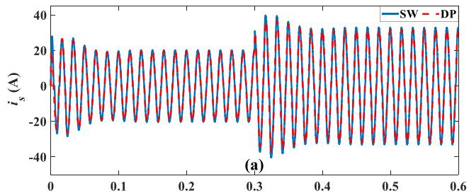

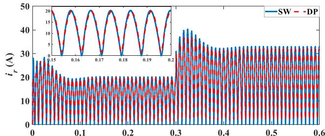

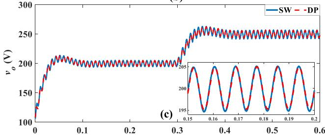  
(b)

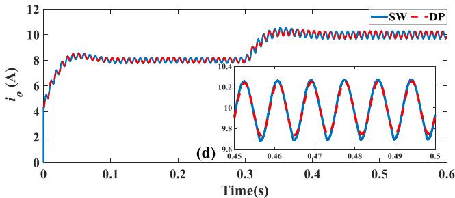  
FIGURE 4. Waveforms obtained from the simulation of detailed and DP models of a single-phase boost PFC converter with a dual-loop linear control scheme featuring no notch filter during a step change in load (output) voltage setpoint: (a) AC current (b) rectified (inductor) current (c) load voltage (d) load current.

Fig. 4(c) shows the output (load) voltage waveform. It is obvious that the 120 Hz harmonic component is dominant in the load voltage waveform obtained from the DP and SW models. This result justifies the decision to consider the 120 Hz harmonic component of the load voltage in addition to the DC component, while formulating the DP model. Due to the high inertia of the load capacitance and the low bandwidth of the load voltage loop, the load voltage loop responds slowly. Note also that the response of the outer voltage loop impacts the ac (grid) current response, as the outer loop controls the amplitude of the rectified current, which in turn affects the magnitude of $i _ { s }$ .

Fig. 4(d) depicts the load current waveform. It is evident that the load current is a linearly scaled version of the load (output) voltage. This is because the load is a resistive (linear)

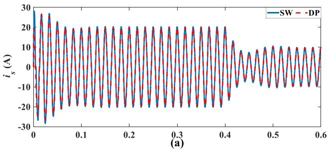

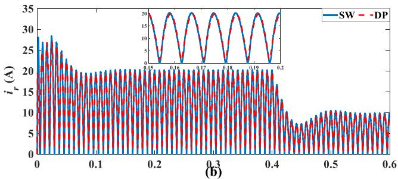

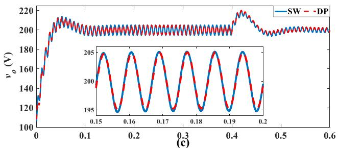

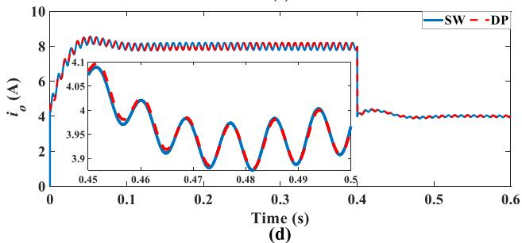  
FIGURE 5. Waveforms obtained from the simulation of detailed and DP models of a single-phase boost PFC converter with a dual-loop linear control scheme featuring no notch filter during a step change in load resistance: (a) AC current (b) rectified (inductor) current (c) load voltage (d) load current.

load. Overall, the proposed DP model replicates the dominant dynamics of the studied system.

# 2) CHANGE IN LOAD RESISTANCE (RO)

The DP model’s fidelity during dynamic operation is further tested by changing the load resistance from 25  to 50  at t = 0.4 s while keeping ${ v _ { o } } ^ { * }$ at 200 V. Fig. 5(a), (b), (c), and (5d) depict the AC current, rectified current, load voltage, and load current. The results from the DP model during transient and steady-state regimes strongly correlate with the SW model’s results. These results confirm the high fidelity of the proposed DP model. Due to the change in $R _ { o } ,$ the transient behaviour of $C _ { o }$ is modified (i.e., when $R _ { o }$ is

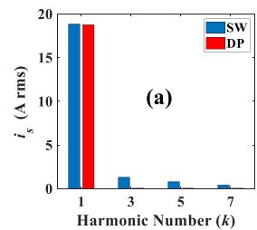

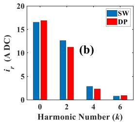

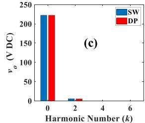

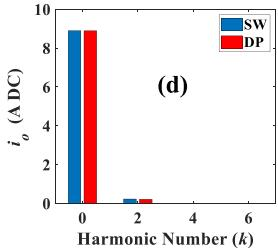  
FIGURE 6. Harmonic content of variables obtained from the SW and DP models of a single-phase boost PFC converter with no notch filter for a step change in load (output) voltage setpoint: (a) AC (grid) current (b) rectified (inductor) current (c) load voltage (d) load current.

increased, the waveforms become sluggish (poorly damped) due to the increase in the capacitor’s time constant). The sluggish behaviour of the load voltage is in turn reflected in the load current, rectified current, and AC current. Notice that the ripples in the load (capacitor) voltage and load current reduces following the increase in $R _ { o }$ . This demonstrates the attenuation property of $R _ { o }$ . Thus, the load voltage ripples can also be reduced by increasing $R _ { o }$ though at the expense of poor damping during dynamic operations. Note that increasing the value of $C _ { o }$ also reduces the amount of ripple in $v _ { o } .$ .

# 3) HARMONIC STUDIES

To evaluate the fidelity of the proposed DP model in predicting harmonic components, fast Fourier Transform (FFT) of the current and voltage variables of the DP and SW models during step changes in load voltage reference were conducted by using the FFT tool in Simulink [16]. Fig. 6 shows the FFT results. Note that the harmonic magnitudes in Fig. 6 represent the average current (or voltage) during the duration of the simulation. For the AC (grid) current (Fig. 5(a)), we observe that the DP model can predict with a high degree of accuracy the fundamental harmonic magnitude. However, the 3rd, 5th, and 7th harmonics are not predicted by the DP model. This discrepancy is likely: (1) due to the non-inclusion of the 2ω harmonic component of $v _ { o }$ (which is non-negligible in this case study) in the DP model’s voltage control loop unlike in the detailed model; and (2) non-representation of high-order harmonics of $i _ { s }$ in the DP model’s current loop. Allowing 2ω harmonic component of $v _ { o }$ in the voltage loop control system will induce high-order harmonics in the AC current. To solve this problem, two methods can be explored. The first method is to include the 2ω harmonic component of $v _ { o }$ in the DP model’s voltage loop control scheme, and the 3rd, 5th, and 7th harmonic components of $i _ { s }$ in the DP model’s current loop. This entails developing DP equations

for $k = \{ 3 , 5 , 7 \}$ using (9a) and for $k = \{ 4 , 6 \}$ using (9b). However, including high-order harmonic components of the state variables in the DP model could increase computational burden and complexity. The second (less complex but maybe inaccurate) method involves using the average value of $v _ { o }$ in the voltage control loop of the SW model to ensure that the control system in both the SW and DP models see similar harmonic components of current and voltage. This method will be examined in Section IV-C.

For the rectified (inductor) current (Fig. 6(b)), the DP model predicts the 1st, 3rd, 5th, and 7th harmonics but with a low percentage error when compared with the SW model results. The error is due to the non-representation of high-order harmonics of $i _ { s }$ in the DP model’s current loop. For the load voltage (Fig. 6(c)) and load current (Fig. 6(d)), the DP model results match well with those from the SW model because the representation of the DC and 2nd harmonic components of $v _ { o }$ in the DP model is enough to predict accurately the load voltage and load current waveforms.

# 4) ERROR CALCULATION

To assess the accuracy of the proposed DP model, the coefficient of variance (CV) of the root-mean-square-error (RMSE) [16] is calculated for the DP model’s variables relative to those of the SW model. The statistical range is used to normalize the RMSE values. Note that only the simulation results during a step change in ${ v _ { o } } ^ { * }$ are used to obtain error results due to space limitations. Table 2 shows the CV(RMSE) of the DP model variables with respect to the results from the SW model. When the SW and DP models are simulated with step sizes of 0.1 μs and 0.5 ms, respectively, the CV(RMSE) values for $i _ { s } , i _ { r }$ , vo, and $i _ { o }$ are 2.69%, 5.34%, 0.54%, and 1.23%, respectively. These CV(RMSE) values align with the harmonic amplitudes presented in Fig. 5, where the DP model demonstrates high accuracy in predicting the dominant harmonics in $v _ { o }$ and $i _ { o } ,$ but less accuracy in predicting the harmonics in $i _ { s }$ and ir.When the DP and SW models are simulated with a step size of 0.1 μs, the change in error values is minimal. Therefore, simulating the DP model with a step size smaller than necessary offers no significant advantage.

# C. TRANSIENT BEHAVIOR ANALYSIS OF A DC VOLTAGE CONTROL LOOP INCORPORATING A NOTCH FILTER

To further evaluate the fidelity of the proposed DP model, numerical simulation-based transient studies involving step changes in ${ v _ { o } } ^ { * }$ and $R _ { o }$ are conducted for the scenario wherein the output voltage control loop contains a notch filter to remove 2ω ripple in $v _ { o } .$ . The objective of this study is to ascertain if making the dc voltage loop controller of both models to work with a pure average DC voltage, $\langle v _ { o } \rangle _ { 0 }$ will increase the accuracy of the proposed DP model. For this scenario, the notch filter (with parameters, $\varepsilon _ { 1 } = 2 . 5 \mathrm { e } ^ { - 4 } \varepsilon _ { 2 } = 0 . 2 5$ . See Appendix B) is only used in the SW model since the average DC voltage is explicit in the DP model (i.e., we do not need a notch filter to obtain $\langle v _ { o } \rangle _ { 0 }$ in the DP model). Including the

TABLE 2. CV(RMSE) Values for the DP Model of a Single-Phase Boost PFC Converter   

<table><tr><td rowspan="2">Variables</td><td colspan="2">Notch Filter</td><td rowspan="2">DP Model&#x27;s Simulation Step Size (μs)</td><td rowspan="2">CV(RMSE) (%)</td></tr><tr><td>DP</td><td>SW</td></tr><tr><td rowspan="6">is</td><td>No</td><td>No</td><td>500</td><td>2.69</td></tr><tr><td>No</td><td>No</td><td>0.1</td><td>2.71</td></tr><tr><td>Yes</td><td>Yes</td><td>500</td><td>2.62</td></tr><tr><td>Yes</td><td>Yes</td><td>0.1</td><td>2.65</td></tr><tr><td>No</td><td>Yes</td><td>500</td><td>2.47</td></tr><tr><td>No</td><td>Yes</td><td>0.1</td><td>2.50</td></tr><tr><td rowspan="6">ir</td><td>No</td><td>No</td><td>500</td><td>5.34</td></tr><tr><td>No</td><td>No</td><td>0.1</td><td>5.38</td></tr><tr><td>Yes</td><td>Yes</td><td>500</td><td>5.23</td></tr><tr><td>Yes</td><td>Yes</td><td>0.1</td><td>5.27</td></tr><tr><td>No</td><td>Yes</td><td>500</td><td>4.92</td></tr><tr><td>No</td><td>Yes</td><td>0.1</td><td>4.97</td></tr><tr><td rowspan="6">vo</td><td>No</td><td>No</td><td>500</td><td>0.54</td></tr><tr><td>No</td><td>No</td><td>0.1</td><td>0.54</td></tr><tr><td>Yes</td><td>Yes</td><td>500</td><td>0.60</td></tr><tr><td>Yes</td><td>Yes</td><td>0.1</td><td>0.60</td></tr><tr><td>No</td><td>Yes</td><td>500</td><td>0.51</td></tr><tr><td>No</td><td>Yes</td><td>0.1</td><td>0.51</td></tr><tr><td rowspan="6">io</td><td>No</td><td>No</td><td>500</td><td>1.23</td></tr><tr><td>No</td><td>No</td><td>0.1</td><td>0.32</td></tr><tr><td>Yes</td><td>Yes</td><td>500</td><td>1.24</td></tr><tr><td>Yes</td><td>Yes</td><td>0.1</td><td>0.36</td></tr><tr><td>No</td><td>Yes</td><td>500</td><td>1.22</td></tr><tr><td>No</td><td>Yes</td><td>0.1</td><td>0.30</td></tr></table>

notch filter in the DP model’s voltage loop may not significantly improve the accuracy of the DP model.

# 1) CHANGE IN OUTPUT VOLTAGE REFERENCE

Fig. 7 shows the results obtained from the proposed DP model (with no notch filter) and the SW model (with a notch filter) when $R _ { o } = 2 5 \ \Omega$ and the output (load) voltage reference, ${ v _ { o } } ^ { * }$ is ramped up from 200 V to 250 V at $t = 0 . 3 \mathrm { ~ s ~ }$ . It is evident that the waveforms shown in Fig. 7 are similar to those displayed in Fig. 4.

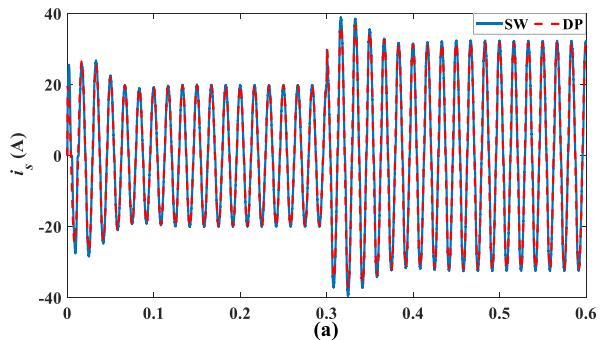

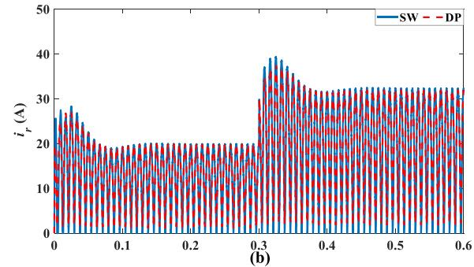

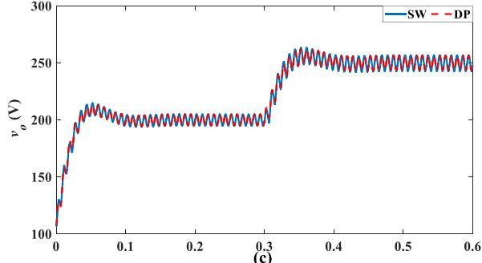

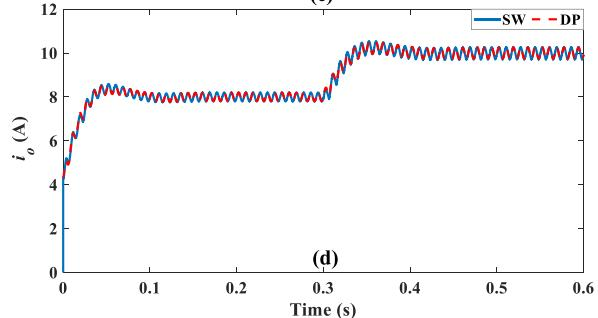  
FIGURE 7. Waveforms obtained from the simulation of detailed and DP models of a single-phase boost PFC converter with a dual-loop linear control scheme featuring a notch filter during a step change in load (output) voltage setpoint: (a) AC current (b) rectified (inductor) current (c) load voltage (d) load current.

# 2) CHANGE IN LOAD RESISTANCE (RO)

For this case, the load resistance is increased from 25  to 50  at $t = 0 . 4 ~ \mathrm { s }$ while keeping ${ v _ { o } } ^ { * }$ at 200 V. This scenario yielded results that were similar to those shown in Fig. 5. For the sake of conciseness, we will not be showing these results. The results from two these scenarios indicate that configuring the DC voltage loop controllers of the DP and SW models to process $v _ { o }$ with the same harmonic content does not significantly enhance the accuracy of the proposed DP model. The discrepancy between the harmonic results of $i _ { s }$

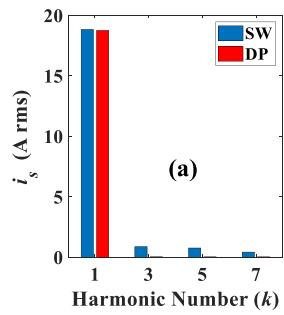

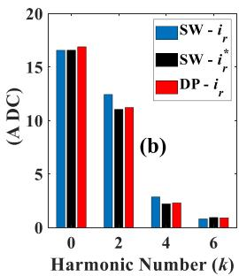

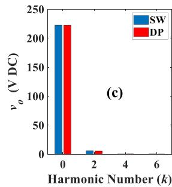

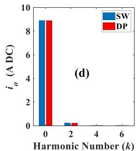  
FIGURE 8. Harmonic content of variables obtained from the SW and DP models of a single-phase boost PFC converter with a notch filter for a step change in load (output) voltage setpoint: (a) AC (grid) current (b) rectified (inductor) current (c) load voltage (d) load current.

and $i _ { r }$ obtained from the DP model and those from the SW model is likely attributed to differences in the current loop implementation between the two models. This hypothesis is examined through harmonic spectrum analysis and error analysis in Sections IV-C3 and IV-C4.

# 3) HARMONIC STUDIES

Fig. 8 displays the harmonic results obtained from the case study wherein the notch filter is included in the SW model’s voltage control loop but not in the DP model’s voltage control loop. The harmonic spectrum results look like those depicted in Fig. 6, which were obtained from the SW and DP models, both of which excludes the notch filter. Hence, the voltage loop is not responsible for the inaccuracy of the harmonic amplitudes of $i _ { s }$ and $i _ { r }$ obtained from the DP model. Examining the SW model’s $i _ { r } { ^ * }$ harmonic amplitudes (Fig. 8(a), black bars) reveals that the SW model’s current loop struggles to match its current reference due to cusp distortion. In contrast, the DP model achieves this alignment because cusp distortion is not represented in its structure. This holds true as the harmonic content of $i _ { r } { ^ * }$ from the SW model closely match that of $i _ { r }$ produced by the DP model. Ensuring that the current control loop is identical in both models can help mitigate this issue. A potential solution is to implement a dq reference frame-based vector current control strategy (similar to the DP model’s current control loop. See Fig. 2.) in the SW model. Implementing the vector current control strategy in the SW model can eliminate the nonlinearity [30] and cusp distortion introduced by the use of $i _ { r } { ^ * }$ generated from the product of reference current amplitude, $I _ { r } { ^ { * } }$ and |cos(ωt )|. See the proposed dq frame-based control structure in Appendix D.

TABLE 3. Simulation Execution Time   

<table><tr><td>Model [Order]</td><td>Notch Filter</td><td>Step Size</td><td>Solver Algorithm</td><td>Execution Time</td><td>Speed-up Factor</td></tr><tr><td>SW [4th]</td><td>No</td><td>0.1 μs</td><td>ode8</td><td>89,94 s</td><td>1</td></tr><tr><td>DP [8th]</td><td>No</td><td>0.1 μs</td><td>ode15s</td><td>21.17 s</td><td>4.25</td></tr><tr><td>DP [8th]</td><td>No</td><td>500 μs</td><td>ode15s</td><td>0.24 s</td><td>374.75</td></tr><tr><td>SW [6th]</td><td>Yes</td><td>0.1 μs</td><td>ode8</td><td>119.17 s</td><td>1</td></tr><tr><td>DP [10th]</td><td>Yes</td><td>0.1 μs</td><td>ode15s</td><td>21.71 s</td><td>5.49</td></tr><tr><td>DP [10th]</td><td>Yes</td><td>500 μs</td><td>ode15s</td><td>0.25 s</td><td>476.68</td></tr></table>

# 4) ERROR CALCULATION

Table 2 presents the RMSE results for two scenarios: when the notch filter is included in both the SW and DP models, and when it is included only in the SW model. The results show that including the notch filter in both models slightly improves DP model accuracy, while using it only in the SW model offers a marginally greater improvement. The key insight from these error results is that the discrepancy in the harmonic content of $i _ { s }$ and i between the SW model and the DP model arises from differences in their current loop implementations, rather than from variations in their DC voltage loop implementations. Incorporating $\langle v _ { o } \rangle _ { 0 }$ into both models’ outer loop control slightly improves DP model’s accuracy.

# D. TESTING THE BORDERLINE VALIDITY OF THE PROPOSED DP MODEL FOR LOW INDUCTANCE SCENARIO

The test cases conducted Section IV-B and C have been based on a single-phase boost PFC converter with a very low current ripple factor of 0.0042 (see Appendix E for the calculations) [31]. In this section, we examine the borderline validity of the proposed DP model by simulating two cases where the current ripple factor is high resulting in a low value of $L _ { r }$ . Results are shown and analyzed in Appendix E.

# E. COMPARISON OF SIMULATION EXECUTION TIME

The simulation execution times and model order of the SW and DP models for a single-phase boost PFC converter are summarized in Table 3. For the scenario without a notch filter, the results demonstrate that the proposed DP model executes faster than the SW model, even when both models use the same step size. When a notch filter is included, the order of both models increases by 2, leading to a significant rise in the computation time of the SW model. In contrast, the DP model experiences only a slight increase in computation time. This discrepancy arises because, in the DP model, the additional states manage a single harmonic (dc) component, whereas in the SW model, the extra states are required to handle multiple harmonics, resulting in a more substantial computational burden. However, if additional harmonics $( \mathrm { e . g . }$ ., the 3rd, 5th, and 7th harmonics of $i _ { s }$ and the 4th and 6th harmonics of $v _ { o } )$ are incorporated into the DP model, its computational efficiency is expected to decline. This trade-off occurs because the inclusion of more harmonics increases the complexity of the model, thereby requiring more computational resources.

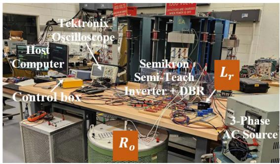  
FIGURE 9. Experimental setup of a single-phase boost PFC converter in the lab.

Nonetheless, this comes with the advantage of enhanced accuracy, as the model becomes capable of capturing a broader range of system dynamics and harmonic interactions.

Given the small CV(RMSE) values of the DP model results, it can be concluded that the proposed DP model offers substantial advantages over the SW model in terms of simulation efficiency. Its faster computational speed makes it particularly well-suited for rapid validation and tuning of control systems, analyzing low-order harmonic content, and optimizing the sizing of load bus capacitors. Additionally, the DP model serves as a reliable approximate tool for studying dynamic interactions and system behavior in scenarios involving multiple single-phase boost PFC converters, such as a fleet of electric vehicles charging from a low-voltage distribution network and a cluster of information technology (IT) equipment in the power distribution unit of a data center. How to incorporate the proposed DP model of a single-phase PFC converter in such systems is described in Appendix C.

# V. EXPERIMENTAL RESULTS

To demonstrate the high fidelity of the proposed DP model, in addition to verifying the theoretical approaches, a scaleddown experimental testbed of a single-phase boost PFC converter is set up in the laboratory as shown in Fig. 9.

The single-phase DBR and boost DC-DC converter are respectively obtained by reconfiguring the three-phase DBR and inverter modules in a Semikron Semi-Teach inverter. The control algorithms were implemented on a Texas Instruments Real-Time DSP Microcontroller F2833. The AC source is obtained from an autotransformer. The AC voltage and the nominal dc load voltage are both scaled down to one-sixth of the values used in simulation for uniformity purposes. Hence, $v _ { s }$ is $2 0 \cos ( \omega t )$ V rms and $v _ { o }$ is 33.33 V. The $C _ { o } , L _ { r } .$ , and $R _ { r }$ values are as listed on Table 1. The switching frequency of the boost converter is $0 . 2 2 f _ { s w }$ .

By leveraging the small-signal models and closed-loop transfer functions provided in Section IV, in addition to parameters of the components used in the experimental hardware setup, the control gains used were: $K _ { p i } = 1 , K _ { i i } = 5 0 0$ , $K _ { p v } = 0 . 2$ and $K _ { i i } = 2 0$ . Notice that the control gains are exactly the same as the parameters (gains) used for the detailed

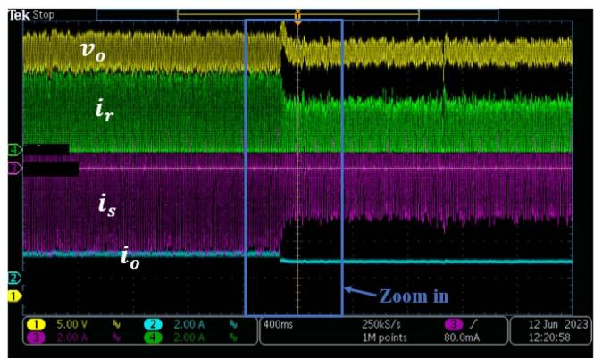  
(a)

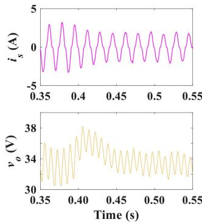

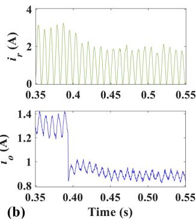  
FIGURE 10. Experimental results for a step change in $\pmb { R _ { o } }$ from 25 - to 37.5 - with ${ v _ { 0 } } ^ { * } = 3 3 . 3 3 \ : \mathsf { v } .$ (a) Scope waveforms (b) Zoomed-in view of the scope waveforms.

simulation model. This is due to the uniform scaling of the $v _ { s }$ and $v _ { o }$ nominal values in the experimental tests.

For the experimental validation, test results corresponding to distinct steady-state operating points are obtained. In addition, test results are obtained for transient studies involving a step change in load voltage setpoint and load resistance. For comparison, simulation results for the selected operating points are also obtained from the proposed DP model and the conventional detailed model, both of which exclude the notch filter. All experimental results are visualized and recorded using a Tektronix oscilloscope.

# A. CHANGE IN LOAD RESISTANCE $( R _ { O } )$

Fig. 10 shows the experimental results for the case wherein $R _ { o }$ is changed from 25  to 37.5  with ${ v _ { o } } ^ { * } = 3 3 . 3 3$ V. Fig. 11 shows the corresponding DP and SW model results. It is obvious that the DP model results align very well with the experimental results and detailed model results before, during, and after the step changes. The control gains for the DP and SW models were derived using the small-signal models and closed-loop transfer functions presented in Section IV, along with the parameters of the components from the experimental setup. Due to the uniform scaling of $v _ { s }$ and $v _ { o } ,$ the control gains in the experimental-parameters-based DP model are identical to those used for generating the SW model results in Section IV.

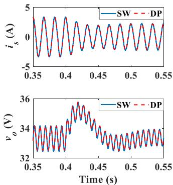

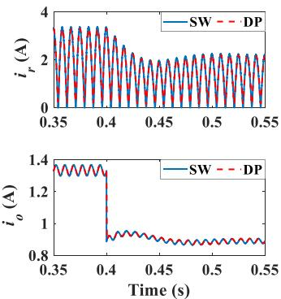  
FIGURE 11. Simulation results obtained from DP and SW models when $\pmb { R _ { o } }$ changes from 25 - to 37.5 - with $v _ { 0 } { } ^ { * } = 3 3 . 3 3 \mathtt { V } .$ .

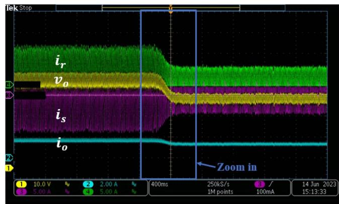

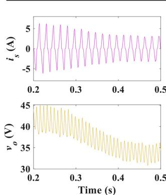

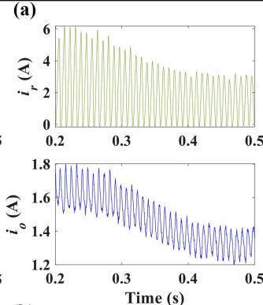  
FIGURE 12. Experimental results for a step-change in ${ v _ { 0 } } ^ { * }$ from 41.67 V to 33.33 V with $\begin{array} { r } { R _ { o } = 2 5 \ \Omega . } \end{array}$ . (a) Scope waveforms (b) Zoomed-in view of the scope waveforms.

# B. CHANGE IN OUTPUT VOLTAGE REFERENCE

Fig. 12 depicts the experimental results when ${ v _ { o } } ^ { * }$ is ramped from 41.67 V to 33.33 V, with $R _ { o } = 2 5 \Omega$ . The corresponding DP and SW model results are shown in Fig. 13. The DP model results are in close agreement with the experimental results. The experimental results validate the suitability of the proposed DP models of power and control stages of a singlephase boost PFC converter for transient studies. Thus, the DP model is useful for fast-paced validation of the performance of control schemes deployed in practical single-phase boost PFC converters.

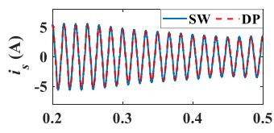

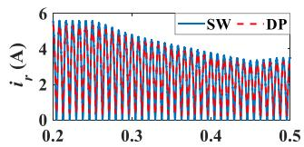

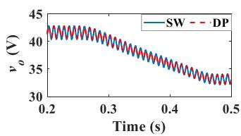

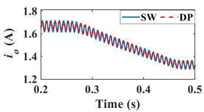  
FIGURE 13. Simulation results obtained from the DP and SW models when ${ v _ { 0 } } ^ { * }$ is ramped from 41.67 V to 33.33 V with $\begin{array} { r } { R _ { o } = 2 5 \ \Omega . } \end{array}$ .

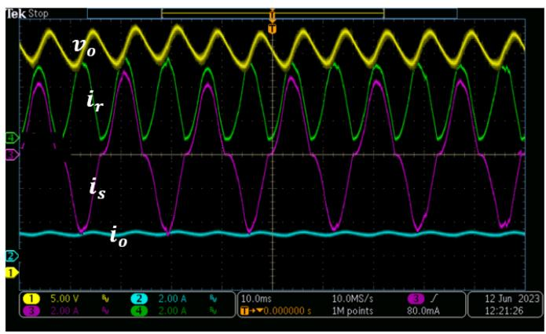  
FIGURE 14. Experimental results for a steady-state operating point wherein $\pmb { R _ { 0 } } = 2 5 ~ \Omega$ and $v _ { 0 } { } ^ { * } = 3 3 . 3 3 \mathtt { V } .$

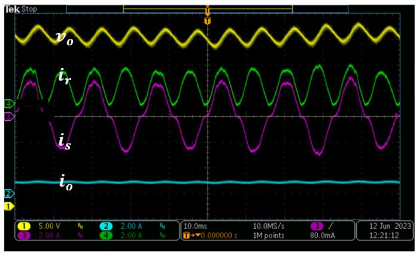  
FIGURE 15. Experimental results for a steady-state operating point wherein $\pmb { R _ { o } } = \bar { \mathbf { 3 7 } } . 5 \ \Omega$ and $v _ { 0 } { } ^ { * } = 3 3 . 3 3 \mathtt { V } .$

# C. STEADY-STATE OPERATING POINT

The steady-state performance of the proposed DP model of a single-phase boost PFC converter is evaluated experimentally by using two distinct load resistances: $R _ { o } = \{ 2 5 , \ 3 7 . 5 \}$ with ${ v _ { o } } ^ { * } = 3 3 . 3 3 \mathrm { ~ V ~ }$ .

Fig. 14 shows experimental results when $R _ { o } = 2 5$ and ${ v _ { o } } ^ { * } = 3 3 . 3 3$ V. There is a 120 Hz ripple in $i _ { r } , \ v _ { o } ,$ and $i _ { o }$ while $i _ { s }$ is mainly composed of the fundamental component. This result corresponds with the behavior of the DP model

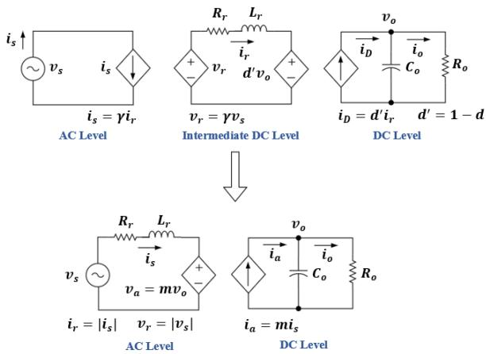  
FIGURE 16. Illustrating the conversion of the average-value model of a single-phase boost PFC converter to an equivalent average-value model of a single-phase active (full-bridge) rectifier.

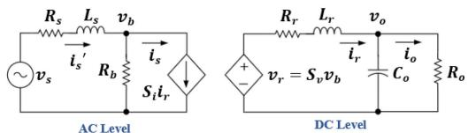

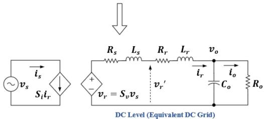  
FIGURE 17. Illustrating the conversion of the average-value model of a single-phase DBR with/without commutation inductance to an equivalent dc-grid.

before and after the step change in $R _ { o }$ as illustrated by Fig. 11. Fig. 15 depicts experimental results when $R _ { o } = 3 7 . 5 ~ \Omega$ and ${ v _ { o } } ^ { * } = 3 3 . 3 3 \mathrm { ~ V ~ }$ . The same ripple components in $i _ { r } , v _ { o } , i _ { o }$ and $i _ { s }$ observed in Fig. 14 are prevalent. However, the peak level of $i _ { r } , i _ { o }$ and $i _ { s }$ is reduced compared to Fig. 14, due to a reduction in $R _ { o } .$ . A close look at Fig. 11 reveals that the DP model results highly correlate with the experimental results.

# VI. CONCLUSION

In this paper, a new single-phase boost PFC converter model based on DPs is presented, along with guidelines for integrating it with EMT and traditional phasor simulation platforms. To address the challenge of modeling two cascaded converters with different driving frequencies in the DP domain, an equivalent average-value-based single-phase active rectifier model using the sign function is derived. The resulting equivalent model is converted to a DP model assuming the dominance of the fundamental harmonic on the ac side and dc and 2nd harmonic components on the dc side. By analyzing smallsignal models and conducting comparative studies, this paper demonstrates that control gains derived from the DP model can be easily scaled and applied to the control systems of both

the detailed switching model and an experimental prototype of a single-phase boost PFC converter. Time-domain simulation results show a close match between the detailed switching and DP model outcomes, alongside the faster execution speed of the DP model. Experimental results further validate the suitability of the proposed DP model for control tuning and transient studies of a practical single-phase boost PFC converter. Detailed harmonic analyses confirm that the proposed DP model accurately captures the dominant harmonics of the load voltage but does not fully represent the 3rd, 5th, and 7th harmonic content of the PFC converter’s input current when the power factor is not nearly unity. However, this limitation can be addressed by either reformulating the DP model to accurately account for the 3rd, 5th, and 7th harmonic components of the input current and the 2nd, 4th, and 6th harmonics of the load voltage in the control system, or by implementing a current control strategy for the detailed switching model that mirrors the structure of the DP model.

# APPENDIX

# A. COMPARISON BETWEEN THE PROPOSED SIMPLIFIEDMODEL OF A SINGLE-PHASE BOOST PFC CONVERTER ANDTHE SIMPLIFIED MODEL OF A SINGLE-PHASE DBR

Fig. 16 illustrates the conversion of the average-value model of a single-phase boost PFC converter to an equivalent model of a single-phase active (full-bridge) rectifier. Notice that the intermediate dc level is eliminated during the conversion process by moving the boost inductor to the ac part of the model. Consequently, the variables of the intermediate dc level (i.e., $v _ { r }$ and $i _ { r } )$ are determined after solving the equations describing the equivalent model.

Fig. 17 elucidates the approach used in converting the average-value model of a single-phase DBR to an equivalent dc-grid model [32], [33], [34]. Unlike the approach shown in Fig. 16, the ac-side circuit is moved to the dc-side to reduce math complexity. As a result, the ac-side variables are only calculated after solving the dc-grid equations.

The equations describing the equivalent dc-grid are:

$$
\left(L _ {s} + L _ {r}\right) \frac {d i _ {r}}{d t} = v _ {r} - \left(R _ {s} + R _ {r}\right) i _ {r} - v _ {o} \tag {A1}
$$

Case 1: Commutation effects considered.

If $R _ { s } = 0$ and $L _ { s } \neq 0$ , then the actual dc voltage, ${ v _ { r } } ^ { \prime }$ is:

$$
v _ {r} ^ {\prime} = v _ {r} - L _ {s} \frac {d i _ {r}}{d t} = \frac {L _ {r} v _ {r}}{L _ {r} + L _ {s}} + \frac {L _ {s} v _ {o} + i _ {r} R _ {r} L _ {s}}{L _ {r} + L _ {s}} \tag {A2}
$$

$$
v _ {r} ^ {\prime} = \left(\frac {L _ {r}}{L _ {r} + L _ {s}}\right) v _ {r} + \left(\frac {L _ {s}}{L _ {r} + L _ {s}}\right) (v _ {o} + i _ {r} R _ {r}) \qquad (\mathrm {A 3})
$$

If $R _ { s } \neq 0$ and $L _ { s } \neq 0 \colon$

$$
v _ {r} ^ {\prime} = v _ {r} - L _ {s} \frac {d i _ {r}}{d t} - R _ {s} i _ {r} = \frac {L _ {r} v _ {r}}{L _ {r} + L _ {s}} + \frac {L _ {s} v _ {o} + i _ {r} \left(R _ {r} L _ {s} - R _ {s} L _ {r}\right)}{L _ {r} + L _ {s}} \tag {A4}
$$

$$
v _ {r} ^ {\prime} = \left(\frac {L _ {r}}{L _ {r} + L _ {s}}\right) \left(v _ {r} - i _ {r} R _ {s}\right) + \left(\frac {L _ {s}}{L _ {r} + L _ {s}}\right) \left(v _ {o} + i _ {r} R _ {r}\right) \tag {A5}
$$

where commutation overlap angle, σ is given by:

$$
\sigma = \cos^ {- 1} \left(1 - \frac {2 \omega L _ {s} \langle i _ {r} \rangle_ {0}}{V _ {s}}\right) \tag {A6}
$$

Case 2: Commutation effects neglected.

If $R _ { s } = 0$ and $L _ { s } = 0 \colon$

$$
v _ {r} ^ {\prime} = v _ {r} \tag {A7}
$$

The variables, $v _ { r }$ and $i _ { s }$ are computed from:

$$
v _ {r} = S _ {v} v _ {s} \tag {A8a}
$$

$$
i _ {s} = S _ {i} i _ {r} \tag {A8b}
$$

where:

$$
S _ {v} = 4 \sum_ {k = 1, 3, 5, 7} ^ {\infty} \frac {\sin (k \pi / 2) \cos (k \sigma / 2)}{k \pi} \cos \left(k \omega t - \frac {k \sigma}{2}\right) \tag {A8c}
$$

$$
S _ {i} = 4 \sum_ {k = 1, 3, 5, 7} ^ {\infty} \frac {\sin (k \pi / 2)}{k \pi} \frac {\sin (k \sigma / 2)}{(k \sigma / 2)} \cos \left(k \omega t - \frac {k \sigma}{2}\right) \tag {A8d}
$$

In the DP domain, if $R _ { s } = 0$ and $L _ { s } \neq 0 \colon$

$$
\left\langle v _ {r} ^ {\prime} \right\rangle_ {k} = \left(\frac {L _ {r}}{L _ {r} + L _ {s}}\right) \left\langle v _ {r} \right\rangle_ {k} + \left(\frac {L _ {s}}{L _ {r} + L _ {s}}\right) \left(\left\langle v _ {o} \right\rangle_ {k} + \left\langle i _ {r} \right\rangle_ {k} R _ {r}\right) \tag {A9}
$$

If $R _ { s } \neq 0$ and $L _ { s } \neq 0 \colon$

$$
\begin{array}{l} \left\langle v _ {r} ^ {\prime} \right\rangle_ {k} = \left(\frac {L _ {r}}{L _ {r} + L _ {s}}\right) \left(\left\langle v _ {r} \right\rangle_ {k} - \left\langle i _ {r} \right\rangle_ {k} R _ {s}\right) \\ + \left(\frac {L _ {s}}{L _ {r} + L _ {s}}\right) \left(\langle v _ {o} \rangle_ {k} + \langle i _ {r} \rangle_ {k} R _ {r}\right) \tag {A10} \\ \end{array}
$$

$\mathrm { I f } R _ { s } = 0 \mathrm { a n d } L _ { s } = 0 \colon$

$$
\left\langle v _ {r} ^ {\prime} \right\rangle_ {k} = \left\langle v _ {r} \right\rangle_ {k} \tag {A11}
$$

The variables, $\langle v _ { r } \rangle _ { k }$ and $\langle i _ { s } \rangle _ { k }$ are computed from:

$$
\langle v _ {r} \rangle_ {k} = \langle S _ {v} v _ {s} \rangle_ {k} = \sum_ {i = - \infty} ^ {i = + \infty} \langle v _ {s} \rangle_ {k - i} \langle S _ {v} \rangle_ {i} \tag {A12a}
$$

$$
\langle i _ {s} \rangle_ {k} = \langle S _ {i} i _ {r} \rangle_ {k} = \sum_ {i = - \infty} ^ {i = + \infty} \langle i _ {r} \rangle_ {k - i} \langle S _ {i} \rangle_ {i} \tag {A12b}
$$

where $k = \{ 0 , 2 , 4 , 6 \} , k + i \in 2  { \mathbb { Z } } + 1 ( o d d ) , k - i \in 2  { \mathbb { Z } } + 1$ (odd ) for (A12a),

$k = \{ 1 , 3 , 5 , 7 \} , \ k + i \in 2  { \mathbb { Z } } \ ( e v e n ) , \ k - i \in 2  { \mathbb { Z } } \ ( e v e n )$ for (A12b) with:

$$
\langle S _ {v} \rangle_ {k} = 2 \sum_ {k = 1} ^ {\infty} \frac {\sin (k \pi / 2) \cos (k \sigma / 2)}{k \pi} e ^ {- j \frac {k \sigma}{2}} \tag {A12c}
$$

$$
\langle S _ {i} \rangle_ {k} = 2 \sum_ {k = 1} ^ {\infty} \frac {\sin (k \pi / 2)}{k \pi} \frac {\sin (k \sigma / 2)}{(k \sigma / 2)} e ^ {- j \frac {k \sigma}{2}} \tag {A12d}
$$

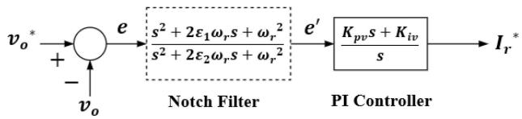  
FIGURE 18. Modified output dc voltage control scheme. To remove the notch filter, make $\varepsilon _ { 2 } = \varepsilon _ { 1 }$ (which leads to ${ \pmb e } ^ { \prime } = { \pmb e } )$ .

# B. MODELING THE OUTPUT DC VOLTAGE CONTROL LOOP WITH OR WITHOUT A NOTCH FILTER

Fig. 18 shows the topology of an output dc voltage controller consisting of a notch filter in series with a PI controller. The notch filter can be represented in the Laplace domain [35], [36] as:

$$
N (s) = \frac {e ^ {\prime}}{e} = \frac {s ^ {2} + 2 \varepsilon_ {1} \omega_ {r} s + \omega_ {r} ^ {2}}{s ^ {2} + 2 \varepsilon_ {2} \omega_ {r} s + \omega_ {r} ^ {2}} = 1 + \frac {2 (\varepsilon_ {1} - \varepsilon_ {2}) \omega_ {r} s}{s ^ {2} + 2 \varepsilon_ {2} \omega_ {r} s + \omega_ {r} ^ {2}} \tag {B1}
$$

where $\varepsilon _ { 1 }$ and $\varepsilon _ { 2 }$ are damping ratios that determine the bandwidth and notch depth of the notch filter [35], $\omega _ { r }$ is the ripple frequency (240π rad/s in this study), $e = { v _ { o } } ^ { * } - v _ { o }$ is the error between the reference dc output voltage and the actual dc output voltage, and $e ^ { \prime }$ is the filtered error voltage.

We can rewrite (B1) as:

$$
e ^ {\prime} = e + x _ {1} \tag {B2}
$$

where:

$$
x _ {1} = \frac {2 \left(\varepsilon_ {1} - \varepsilon_ {2}\right) e \omega_ {r} s}{s ^ {2} + 2 \varepsilon_ {2} \omega_ {r} s + \omega_ {r} ^ {2}} \tag {B3}
$$

Simplifying (B3) further produces:

$$
s x _ {1} = 2 \left(\varepsilon_ {1} - \varepsilon_ {2}\right) e \omega_ {r} - 2 \varepsilon_ {2} \omega_ {r} x _ {1} - \omega_ {r} ^ {2} x _ {2} \tag {B4}
$$

$$
x _ {2} = x _ {1} / s \tag {B5}
$$

where $x _ { 1 }$ and x are the states associated with the notch filter.

In the time domain, (B4) and (B5) can be represented as:

$$
\frac {d x _ {1}}{d t} = 2 \left(\varepsilon_ {1} - \varepsilon_ {2}\right) e \omega_ {r} - 2 \varepsilon_ {2} \omega_ {r} x _ {1} - \omega_ {r} ^ {2} x _ {2} \tag {B6}
$$

$$
\frac {d x _ {2}}{d t} = x _ {1} \tag {B7}
$$

The dynamic model for the PI controller with the inclusion of a notch filter in the voltage control loop becomes:

$$
\left\{ \begin{array}{c} \frac {d \psi}{d t} = e ^ {\prime} \\ I _ {r} ^ {*} = K _ {p v} e ^ {\prime} + \psi K _ {i v} \end{array} \right. \tag {B8}
$$

In the DP domain, the notch filter dynamic equations can be easily written by considering only the zeroth DP component of (B2), (B6), and (B7):

$$
\left\langle e ^ {\prime} \right\rangle_ {0} = \langle e \rangle_ {0} + \langle x _ {1} \rangle_ {0} = v _ {o} ^ {*} - \langle v _ {o} \rangle_ {0} + \langle x _ {1} \rangle_ {0} \tag {B9}
$$

$$
\frac {d \langle x _ {1} \rangle_ {0}}{d t} = 2 \left(\varepsilon_ {1} - \varepsilon_ {2}\right) \omega_ {r} \langle e \rangle_ {0} - 2 \varepsilon_ {2} \omega_ {r} \langle x _ {1} \rangle_ {0} - \omega_ {r} ^ {2} \langle x _ {2} \rangle_ {0} \tag {B10}
$$

$$
\frac {d \langle x _ {2} \rangle_ {0}}{d t} = \langle x _ {1} \rangle_ {0} \tag {B11}
$$

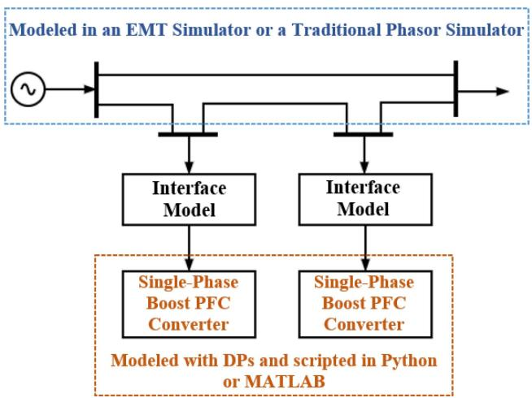  
FIGURE 19. A test system illustrating the integration of DP models with existing simulation platforms.

The PI controller’s dynamic equations in the DP domain given by (19) are rewritten in terms of $\langle e ^ { \prime } \rangle _ { 0 }$ to produce:

$$
\left\{ \begin{array}{c} \frac {d \langle \rho \rangle_ {0}}{d t} = \left\langle e ^ {\prime} \right\rangle_ {0} \\ \left\langle i _ {s} ^ {*} \right\rangle_ {1} ^ {R} = K _ {p v} \left\langle e ^ {\prime} \right\rangle_ {0} + \left\langle \rho \right\rangle_ {0} K _ {i v} \end{array} \right. \tag {B12}
$$

Note that the inclusion of the notch filter’s dynamic model is not necessary in the DP model since $\langle v _ { o } \rangle _ { 0 }$ is explicit in the DP domain. However, the notch filter dynamic model may be included in the DP model to ensure uniformity between transient responses of the DP model and the SW model.

# C. INTERFACING DYNAMIC PHASOR MODELS WITH EXISTING SIMULATION PLATFORMS

Fig. 19 shows a single-line diagram of a test distribution system incorporating two single-phase boost PFC converters. It is assumed that these two boost PFC converters are modeled with dynamic phasors while the rest of the system is modeled in either an EMT simulator (e.g., Simulink, PSCAD) or a traditional phasor simulator (e.g., GridLAB-D, OpenDSS). For single-phase DP models, a per-phase phasor simulator should be used rather than a positive sequence phasor simulator (e.g., PSS/E, PSLF). To integrate the DP-based single-phase boost PFC converters with either an EMT simulator or a traditional phasor simulator, an electrical interface model is required. The most common choice is controllable voltage/current sources.

For the case study in which the DP models are integrated with a traditional phasor simulator, the electrical interface model shown in Fig. 20(a) is used. The boundary bus in the traditional phasor simulator is represented as a controllable voltage source in the DP model side whereas the boundary bus in the DP model is represented as a controllable current source in the traditional phasor simulator side. Note that the traditional phasor simulator is configured to handle only fundamental frequency phasors $( \mathrm { i } . \mathrm { e } . , n { = } 1 )$ . Hence, this setup is suitable for studying steady-state and low-frequency transient behavior of the single-phase PFC converter but not its detailed harmonic behavior.

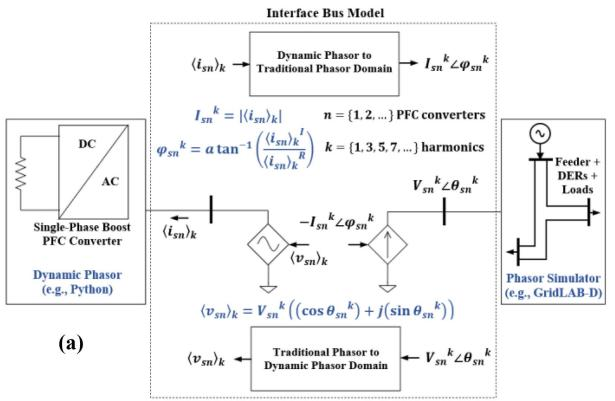

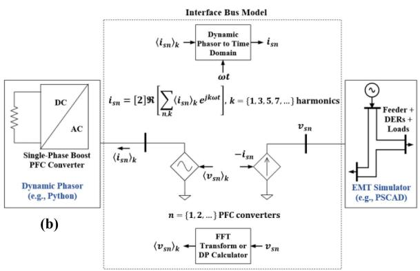  
FIGURE 20. Electrical interface model (a) DP/traditional phasor (b) DP/EMT.

For the case study in which the DP models are integrated with an EMT simulator, the electrical interface model shown in Fig. 20(b) is used. Unlike the DP/traditional phasor case, the electrical interface model for the DP/EMT hybrid simulation can handle harmonic signals. Hence, the harmonic DPs of the DP model’s output can be easily converted into harmonic time-domain signals for the EMT simulator, while harmonic time-domain signals from the EMT simulator can be decomposed into DPs using FFT or discrete Fourier transform.

To ensure seamless interaction between the DP model (typically simulated with a time step of less than 0.2 ms) and either the EMT simulator (with a time step ranging from 5–50 µs) or the traditional phasor simulator (with a time step of 1–4 ms), a serial or parallel communication protocol (e.g., HELICS) is used.

Figs. 21 and 22 illustrate DP model integration with a traditional phasor simulator and an EMT simulator, respectively, via HELICS. For detailed information on using HELICS for hybrid simulation, refer to [37].

# D. MODELING THE CONTROL STRUCTURE OF CASCADED DUAL-CONTROL LOOP OF A SINGLE-PHASE BOOST PFC CONVERTER IN THE DQ DOMAIN

In Fig. 2, the cascaded PI-controller based dual-control loop for regulating a single-phase boost PFC converter is transformed into a structure within the DP domain, aligning with

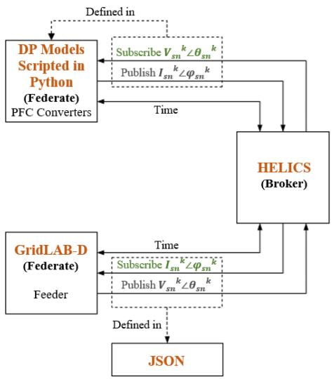  
FIGURE 21. Integration of a DP model with a phasor simulator via HELICS.

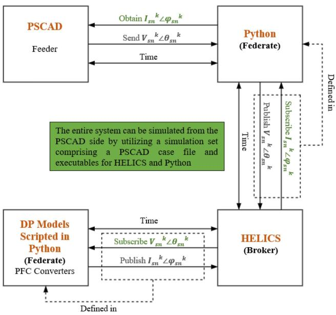  
FIGURE 22. Integration of a DP model with an EMT simulator via HELICS.

the power stage model of the DP model. During this transformation, the nonlinearity resulting from the multiplication of the current reference, $I _ { r } { ^ { * } }$ by | cos ωt |, was effectively removed [30]. This explains why the cusp distortion (current zero-crossing distortion), which typically affects the performance of the conventional single-phase boost PFC converter, was absent in the results from the DP model. To achieve results from the detailed switching model that exhibit nearly the same harmonic content as those from the DP model, an equivalent control structure of the cascaded dual-control loop in the dq domain is proposed, as shown in Fig. 23. Comparing Fig. 2 with Fig. 23, it is evident that the two control structures are largely similar, with the primary difference lying in the

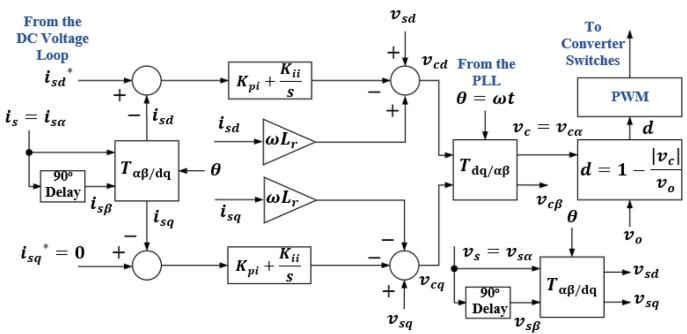  
FIGURE 23. The control structure of cascaded dual-control loop of a single-phase boost PFC converter in the dq-domain.

transformation equations and the method used to calculate the duty cycle (or modulation index). Note that the $9 0 ^ { \mathrm { o } }$ delay used in generating the $\beta$ component from the α component can be obtained from a transport delay block or an all-pass filter $\textstyle { \big ( } { \frac { \omega - s } { \omega + s } } { \big ) }$ . The amplitude invariant transformation matrix and its

$$
\mathrm {T} _ {\alpha \beta / \mathrm {d q}} = \frac {1}{2} \left[ \begin{array}{l l} \cos \theta & \sin \theta \\ - \sin \theta & \cos \theta \end{array} \right] \tag {D1}
$$

$$
\mathrm {T} _ {\mathrm {d q} / \alpha \beta} = 2 \left[ \begin{array}{c c} \cos \theta & - \sin \theta \\ \sin \theta & \cos \theta \end{array} \right] \tag {D2}
$$

# E. CHECKING THE VALIDITY BORDER OF THE PROPOSED DP MODEL WITH RESPECT TO THE INDUCTOR CURRENT RIPPLE AND SELECTED BOOST INDUCTANCE

According to [31], the inductor current ripple $\Delta I _ { \mathrm { r } }$ can be obtained from:

$$
\Delta I _ {\mathrm {r}} = k _ {\text {r i p p l e}} \hat {I} _ {\mathrm {s}} \tag {E1}
$$

where $k _ { \mathrm { r i p p l e } }$ is the current ripple factor, $\hat { I _ { \mathrm { s } } } = 2 P _ { o } / \hat { V } _ { \mathrm { s } }$ is the rated peak input ac current, $P _ { o }$ is the rated power, and $\hat { V } _ { \mathrm { s } }$ is the peak input ac voltage. The boost inductance $L _ { r }$ is:

$$
L _ {r} = \frac {V _ {o}}{4 \Delta I _ {\mathrm {r}} f _ {s w}} \tag {E2}
$$

With a rated $V _ { o } = 3 0 0 ~ \mathrm { V } , P _ { o } = 2 . 5 ~ \mathrm { k W }$ , and considering parameters in Table 1, the current ripple factor is:

$$
k _ {\text {r i p p l e}} = \frac {\hat {V} _ {\mathrm {s}}}{8 L _ {r} f _ {s w} P _ {o}} = 0. 0 0 4 2
$$

The calculated $k _ { \mathrm { r i p p l e } }$ indicates that low current ripple was prioritized over cost and size in determining the value of $L _ { r }$ in Table 1. In practice, the $k _ { \mathrm { r i p p l e } }$ value is chosen to be in the range of 0.2-0.5 to ensure a good trade-off between inductor core losses, inductor size, and input filter cutoff frequency [31]. Assuming $k _ { \mathrm { r i p p l e } } = 0 . 2 5$ ,

$$
L _ {r} = \frac {V _ {o} \hat {V} _ {\mathrm {s}}}{8 k _ {\mathrm {r i p p l e}} f _ {s w} P _ {o}} = 1 0 2 \mu \mathrm {H}
$$

We will use this value of $L _ { r }$ (together with parameters in Table 1) to check the borderline validity of the proposed DP

  
FIGURE 24. Case 1: DP and SW model simulation results for a step-change in ${ v _ { 0 } } ^ { * }$ from 250 V to 300 V with $\pmb { R _ { 0 } } = 2 5 ~ \pmb { \Omega }$ - and $\begin{array} { r } { L _ { r } = 1 0 2 \ \mu \mathsf { H } . } \end{array}$ .

  
FIGURE 25. Case 1: DP and SW model simulation results for a step-change in $\pmb { R _ { o } }$ from 25 - to 50 - with $v _ { 0 } { } ^ { * } = 3 0 0 \mathrm { ~ V ~ }$ and $\pmb { L _ { r } = 1 0 2 \mu \mathsf { H } }$ .

model. We will also be simulating the DP model with the $L _ { r }$ value and other parameters used in [15] which were based on a $k _ { \mathrm { r i p p l e } }$ value of 0.24, in accordance with (E1)–(E2).

Case $I \colon L _ { r } = 1 0 2 \ \mu \mathrm { H } , C _ { o } = 2 5 0 0 \ \mu \mathrm { F } , R _ { o } = 2 5 \ \Omega , V _ { o } =$ 300 V, fsw = 100 kHz, f = 60 Hz, $\hat { V } _ { \mathrm { s } } = 1 6 9 . 7 \ : \mathrm { V } .$

Fig. 24 demonstrates the response to a step change in ${ v _ { o } } ^ { * }$ from 250 V to 300 V with $R _ { o } = 2 5 \Omega$ and $L _ { r } = 1 0 2 \mu H$ . The DP model accurately replicates the system dynamics observed in the detailed switching model. Similarly, Fig. 25 showcases the case where the load resistance, $R _ { o }$ is stepped from 25 to 50  with ${ v _ { o } } ^ { * } = 3 0 0 \mathrm { V }$ and $L _ { r } = 1 0 2 \mu \mathrm { H }$ . In this scenario, the DP model again closely aligns with the dynamics of the detailed model.

Case $2 \colon L _ { r } = 4 8 6 \mu \mathrm { H } , C _ { o } = 9 9 0 \mu \mathrm { F } , R _ { o } = 9 0 \Omega , V _ { o } =$ 300 V, $f _ { s w } = 5 0 \mathrm { k H z } , f = 5 0 \mathrm { H z } , \hat { V } _ { \mathrm { s } } = 1 5 5 . 6 \mathrm { V } [ 1 5 ] .$ .

In this case study, a lower line frequency and switching frequency are employed compared to Case 1, but with a higher boost inductance. The controller parameters from [15] were adopted for the simulations. Fig. 26 illustrates the system response to a step-change in ${ v _ { o } } ^ { * }$ from 300 V to 250 V with $R _ { o } = 9 0 \Omega$ and $L _ { r } = 4 8 6 \mu \mathrm { H }$ . Fig. 27 presents the response to

  
FIGURE 26. Case 2: DP and SW model simulation results for a step-change in ${ v _ { 0 } } ^ { * }$ from 300 V to 250 V with $\pmb { R _ { 0 } } = \pmb { 9 0 } \ \Omega$ and $\pmb { L _ { r } = 4 8 6 \mu \mathsf { H } } .$

  
FIGURE 27. Case 2: DP and SW model simulation results for a step-change in $\pmb { R _ { o } }$ from 90 - to 180 - with $v _ { 0 } { } ^ { * } = 2 5 0 \mathrm { ~ } \mathsf { v }$ and $\pmb { L _ { r } = 4 8 6 \mu \mathsf { H } } .$

a step change in $R _ { o }$ from 90  to 180 , with ${ v _ { o } } ^ { * } = 2 5 0 ~ \mathrm { V }$ and $L _ { r } = 4 8 6 ~ \mu \mathrm { H }$ . The results exhibit significant ripples in the ac source and inductor currents due to the small boost inductance and load capacitance. However, the proposed DP model successfully replicates the system dynamics and the fundamental components of the AC and boost inductor currents. Note that augmenting the DP model for high-frequency harmonics enables it to replicate high-order harmonics in AC and inductor currents.

The outcomes of Case 1 and Case 2 collectively validate the effectiveness of the proposed DP model, demonstrating its ability to achieve accuracy comparable to the detailed switching model even in scenarios where small boost inductance is utilized for economic and size-related considerations.

# REFERENCES

[1] Limits for Harmonic Current Emissions (Equipment Input Current 16 a Per Phase), IEC Standard 61000-3-2, International Electrotechnical Commission, Geneva, Switzerland, Nov. 2005.   
[2] J. R. Rodriguez, J. W. Dixon, J. R. Espinoza, J. Pontt, and P. Lezana, “PWM regenerative rectifiers: State of the art,” IEEE Trans. Ind. Electron., vol. 52, no. 1, pp. 5–22, Feb. 2005.   
[3] C. Qiao and K. M. Smedley, “A topology survey of single-stage power factor corrector with a boost type input-current-shaper,” IEEE Trans. Power Electron., vol. 16, no. 3, pp. 360–368, May 2001.

[4] Y. Wang, Y. Guan, J. Huang, W. Wang, and D. Xu, “A single-stage LED driver based on interleaved buck-boost circuit and LLC resonant converter,” IEEE J. Emerg. Sel. Topics Power Electron., vol. 3, no. 3, pp. 732–741, Sep. 2015.   
[5] S. Li, W. Qi, S.-C. Tan, and S. Y. R. Hui, “A single-stage two-switch PFC rectifier with wide output voltage range and automatic AC ripple power decoupling,” IEEE Trans. Power Electron., vol. 32, no. 9, pp. 6971–6982, Sep. 2017.   
[6] G. Moschopoulos and P. Jain, “Single-phase single-stage powerfactorcorrected converter topologies,” IEEE Trans. Ind. Electron., vol. 52, no. 1, pp. 23–35, Feb. 2005.   
[7] J.-Y. Chai and C.-M. Liaw, “Development of a switched-reluctance motor drive with PFC front end,” IEEE Trans. Energy Convers., vol. 24, no. 1, pp. 30–42, Mar. 2009.   
[8] Z. Zhang, Z. Deng, C. Gu, Q. Sun, C. Peng, and G. Pang, “Reduction of rotor harmonic eddy-current loss of high-speed PM BLDC motors by using a split-phase winding method,” IEEE Trans. Energy Convers., vol. 34, no. 3, pp. 1593–1602, Sep. 2019.   
[9] M. Mohamadi, A. Rashidi, S. M. S. Nejad, and M. Ebrahimi, “A switched reluctance motor drive based on quasi-Z-source converter with voltage regulation and power factor correction,” IEEE Trans. Ind. Electron., vol. 65, no. 10, pp. 8330–8339, Oct. 2018.   
[10] Y. Tang, Y. He, F. Wang, G. Lin, J. Rodríguez, and R. Kennel, “A centralized control strategy for grid-connected high-speed switched reluctance motor drive system with power factor correction,” IEEE Trans. Energy Convers., vol. 36, no. 3, pp. 2163–2172, Sep. 2021.   
[11] W. Ma, M. Wang, S. Liu, S. Li, and P. Yu, “Stabilizing the averagecurrent-mode-controlled boost PFC converter via washout-filter-aided method,” IEEE Trans. Circuits Syst. II: Exp. Briefs, vol. 58, no. 9, pp. 595–599, Sep. 2011.   
[12] K. J. P. Veeramraju, J. A. Mueller, and J. W. Kimball, “An extended generalized average modeling framework for power converters,” IEEE Trans. Power Electron., vol. 38, no. 8, pp. 9581–9592, Aug. 2023.   
[13] V. J. Thottuvelil, D. Chin, and G. C. Verghese, “Hierarchical approaches to modeling high-power-factor AC-DC converters,” IEEE Trans. Power Electron., vol. 6, no. 2, pp. 179–187, Apr. 1991.   
[14] S. Bacha, I. Munteanu, and A. I. Bratcu, Power Electronic Converters Modeling and Control (Advanced Textbooks in Control and Signal Processing Series), vol. 454. Berlin, Germany: Springer, 2014, ch. 9, doi: 10.1007/978-1-4471-5478-5.   
[15] H. Zhang, H. Li, J. Mao, C. Pan, and Z. Luan, “Model-free control of single-phase boost AC/DC converters,” IEEE Trans. Power Electron., vol. 37, no. 10, pp. 11828–11838, Oct. 2022.   
[16] U. C. Nwaneto, “Modeling and control of single-phase power electronic converters and islanded microgrids using the dynamic phasor method,” Ph.D. dissertation, Univ. of Calgary, Calgary, AB, Canada, 2022.   
[17] S. R. Sanders, J. M. Noworolski, X. Z. Liu, and G. C. Verghese, “Generalized averaging method for power conversion circuits,” IEEE Trans. Power Electron., vol. 6, no. 2, pp. 251–259, Apr. 1991.   
[18] Y. Huang, L. Dong, S. Ebrahimi, N. Amiri, and J. Jatskevich, “Dynamic phasor modeling of line-commutated rectifiers with harmonics using analytical and parametric approaches,” IEEE Trans. Energy Convers., vol. 32, no. 2, pp. 534–547, Jun. 2017.   
[19] P. Chen, P. Zhao, L. Lu, X. Ruan, and C. Luo, “Dynamic phasorbased stochastic transient simulation method for MTDC distribution system,” IEEE Trans. Ind. Electron., vol. 70, no. 11, pp. 11516–11526, Nov. 2023.   
[20] M. Daryabak et al., “Modeling of LCC-HVDC systems using dynamic phasors,” IEEE Trans. Power Del., vol. 29, no. 4, pp. 1989–1998, Aug. 2014.   
[21] Z. Shuai, Y. Peng, J. M. Guerrero, Y. Li, and Z. J. Shen, “Transient response analysis of inverter-based microgrids under unbalanced conditions using a dynamic phasor model,” IEEE Trans. Ind. Electron., vol. 66, no. 4, pp. 2868–2879, Apr. 2019.   
[22] A. M. Stankovic, S. R. Sanders, and T. Aydin, “Dynamic phasors in modeling and analysis of unbalanced polyphase AC machines,” IEEE Trans. Energy Convers., vol. 17, no. 1, pp. 107–113, Mar. 2002.   
[23] A. Emadi, “Modeling and analysis of multiconverter DC power electronic systems using the generalized state-space averaging method,” IEEE Trans. Ind. Electron., vol. 51, no. 3, pp. 661–668, Jun. 2004.   
[24] J. Sun and K. J. Karimi, “Small-signal input impedance modeling of line-frequency rectifiers,” IEEE Trans. Aerosp. Electron. Syst., vol. 44, no. 4, pp. 1489–1497, Oct. 2008.

[25] S. Li, W. Lu, S. Yan, and Z. Zhao, “Improving dynamic performance of boost PFC converter using current-harmonic feedforward compensation in synchronous reference frame,” IEEE Trans. Ind. Electron., vol. 67, no. 6, pp. 4857–4866, Jun. 2020.   
[26] S. Li, W. Lu, S. Yan, Z. Zhao, and L. Zhou, “Lyapunov controlled boost PFC converter using D-Q coordinate transformation,” in Proc. 2018 IEEE Int. Power Electron. Appl. Conf. Expo., 2018, pp. 1–4.   
[27] P. Frgal, “Average current mode interleaved PFC control: Theory of operation and the control loops design,” Application Note AN5257, Freescale Semicon, Inc, Feb. 2016. [Online]. Available: https://www. nxp.com/docs/en/application-note/AN5257.pdf   
[28] R. Valascho and S. Abdel-Rahman, Digital PFC CCM Boost Converter. Munich, Germany: Infineon Technologies, Nov. 2016, Accessed: Jun. 06, 2022. [Online]. Available: https://www.infineon.com/dgdl   
[29] H. Y. Kanaan and K. Al-Haddad, “AC-to-DC three-phase/switch/level PWM boost converter: Design, modeling, and control,” in Power Electron. Motor Drives, Boca Raton, MA, USA: CRC Press, 2017.   
[30] Y. Tian, X. Xu, W. Liu, and Y. Wang, “PWM rectifier imitating linearization control for diode rectifier through a boost-PFC circuit with improved controllability and suppressed harmonics,” IEEE Trans. Power Electron., vol. 39, no. 10, pp. 12667–12677, Oct. 2024, doi: 10.1109/TPEL.2024.3405077.   
[31] Plexim GmbH, “Modeling a PFC controller using PLECS,” Accessed: Dec. 29, 2024. [Online]. Available: https://www.plexim.com/ sites/default/files/plecs_pfc.pdf   
[32] U. C. Nwaneto and A. M. Knight, “Dynamic phasor-based modeling and simulation of a single-phase diode-bridge rectifier,” IEEE Trans. Power Electron., vol. 38, no. 4, pp. 4921–4936, Apr. 2023, doi: 10.1109/TPEL.2022.3227250.   
[33] U. C. Nwaneto and A. M. Knight, “Using dynamic phasors to model and analyze selective harmonic compensated single-phase gridforming inverter connected to nonlinear and resistive loads,” IEEE Trans. Ind. Appl., vol. 59, no. 5, pp. 6136–6154, Sep./Oct. 2023, doi: 10.1109/TIA.2023.3282925.   
[34] P. Liutanakul, A.-B. Awan, S. Pierfederici, B. Nahid-Mobarakeh, and F. Meibody-Tabar, “Linear stabilization of a DC bus supplying a constant power load: A general design approach,” IEEE Trans. Power Electron., vol. 25, no. 2, pp. 475–488, Feb. 2010, doi: 10.1109/TPEL.2009.2025274.   
[35] V. Salis, A. Costabeber, S. M. Cox, A. Formentini, and P. Zanchetta, “Stability assessment of high-bandwidth DC voltage controllers in single-phase active front ends: LTI versus LTP models,” IEEE J. Emerg. Sel. Topics Power Electron., vol. 6, no. 4, pp. 2147–2158, Dec. 2018, doi: 10.1109/JESTPE.2018.2810282.   
[36] L. Yang, Y. Chen, A. Luo, and K. Huai, “Stability enhancement for parallel grid-connected inverters by improved notch filter,” IEEE Access, vol. 7, pp. 65667–65678, 2019, doi: 10.1109/ACCESS.2019.2917533   
[37] Y. Liu, W. Du, and S. G. Abhyankar, “An electromagnetic transient and three-phase phasor co-simulation platform for studying distribution system transients with high penetration of DERs,” in Proc. 2023 IEEE Power Energy Soc. Gen. Meeting, Orlando, FL, USA, 2023, pp. 1–5, doi: 10.1109/PESGM52003.2023.10253236.   
[38] Z. Luan, H. Li, H. Zhang, J. Gu, and C. Pan, “Model-free current control of boost PFC converters in synchronous reference frame,” in Proc. 24th Int. Conf. Elect. Machines Syst., Gyeongju, Korea, Republic of, 2021, pp. 2045–2049, doi: 10.23919/ICEMS52562.2021.9634207.

UDOKA C. NWANETO (Senior Member, IEEE) received the B.Eng. degree in electrical engineering (with First Class Hons.) from the University of Nigeria, Nsukka, Nigeria, in 2013, the M.Sc. degree in new and renewable energy (with Distinction) from St. Hild and St. Bede College, Durham University, Durham, U.K., in 2018, and the Ph.D. degree in electrical and computer engineering from the University of Calgary, Calgary, AB, Canada, in 2022. From 2016 to 2018, he was a Graduate Assistant with the Department of Electrical Engi-

neering, University of Nigeria. From April 2020 to November 2020, he was a Mitacs Accelerate Intern with Audacious Energy Inc., Calgary, where he conducted industry-based research focused on the development of Internet of Things based microgrid control products. Since 2018, he has been a Lecturer II with the Department of Electrical Engineering, University of Nigeria. He is currently a Research Engineer with the Pacific Northwest National Laboratory. He is the author of ten conference papers and four journal articles and a contributor to the development of Western Electricity Coordinating Council (WECC) approved REGFM_B1 model that was recently implemented in commercial simulation software tools. He is also a major contributor to the development of WECC-approved REGFM_C1 and REPCGFM_C1 models, which are currently being implemented in commercial simulation software tools. His main research interests include dynamic and static phasor-based modeling of power systems, co-simulation of electrical distribution and transmission systems, the control of renewable energy systems, modular multilevel converters, and Internet of Things enabled microgrids. Dr. Nwaneto was the recipient of numerous awards including Outstanding Performance Award (OPA) from the Pacific Northwest National Laboratory, NSERC Alexander Graham Bell Doctoral Scholarship, Commonwealth Shared Scholarship, and Alberta Innovates Graduate Student Doctoral Scholarship.

SEYED ALI SEIF KASHANI (Graduate Student Member, IEEE) is currently working toward the Ph.D. degree in electrical and computer engineering with the University of Calgary, Calgary, AB, Canada.

ANDREW M. KNIGHT (Senior Member, IEEE) received the B.A. degree in electrical and information sciences and the Ph.D. degree in engineering from the University of Cambridge, Cambridge, U.K., in 1994 and 1998, respectively. He is currently a Professor with the Department of Electrical and Software Engineering, University of Calgary, Calgary, AB, Canada. His research interests include energy conversion and clean and efficient energy utilization. Dr. Knight was a recipient of the IEEE PES Prize Paper Award and three

Best Paper Awards from IEEE IAS. He was the IAS Publications Chair, the Steering Committee Chair of the IEEE ECCE and IEEE IEMDC, and the Chair of the IEEE Smart Grid Research and Development Committee. He is also the former President of the IEEE IAS. He is a Professional Engineer registered in the Province of Alberta, Canada.