Received October 5, 2014, accepted November 13, 2013, date of publication November 24, 2014, date of current version December 9, 2014.

Digital Object Identifier 10.1109/ACCESS.2014.2374195

# Design and Construction of Arduino-Hacked Variable Gating Distortion Pedal

ANARGHYA ANANDA MURTHY1, NITISH RAO2, YATHEESHA RANGANAHALLI BEEMAIAH3, SUSHANTH D. SHANDILYA4, AND RANJITH BADARMANAHALLI SIDDEGOWDA5

1Department of Mechatronics, Manipal Institute of Technology, Manipal University, Manipal 576104, India   
2Automotive Technology, Technical University Eindhoven, Eindhoven 5612 AZ, The Netherlands   
3Department of Mechanical, Don Bosco Institute of Technology, Visvesvaraya Technological University, Bangalore 560059, India   
4Department of Mechanical, JSS Academy of Technical Education, Visvesvaraya Technological University, Bangalore 560059, India   
5Department of Mechatronics, Manipal Institute of Technology, Manipal University, Bangalore 134113, India

Corresponding author: A. A. Murthy (anarghya.murthy@yahoo.com)

ABSTRACT This paper describes the distortion effects often used in an electric guitar. Distortion is an added effect in an electric guitar, which compresses the peaks of the sound waves produced by the musical instrument, to produce a large number of added overtones, which here is done by rigging up a circuit in collaboration with the Arduino UNO circuit board. The digital potentiometer controlled by the Arduino (microcontroller) was an improvement and was able to produce satisfactory results, as compared with the analog potentiometer without the Arduino control. The complex circuitry of a three-stage distortion circuit with the analog potentiometer was replaced by a digital potentiometer controlled by a microcontroller, with better results. This variable-gating distortion pedal has an added advantage of being compact, light, and inexpensive.

INDEX TERMS Amplifier, Arduino, digital potentiometer, distortion, microcontroller.

# I.INTRODUCTION

Distortion effects in an electric guitar is an additional sound effect, wherein the sound waves of the instruments are altered accordingly. The peaks of the sound waves are compressed during distortion effect, which results in adding more overtones to the system. Over-driving of the tube amplifiers result in the producing of the distorted guitar sounds, and hence the name gain is also given to the distortion effects.

Distortion effects are most commonly produced by effects pedal, also known as the distortion pedal which usually uses an analog circuitry to modify the electric guitar signals such as clipping and harmonic multiplication to result in a wide range of sounds. Modifying of the waveforms are generally termed as distortion, which is usually associated with having a negative consequence. But, in the context of music, distortion would refer to addition of newer frequencies by clipping of the amplifier circuits.

Clipping is a non-linear process such that the sound waves which are clipped would have varied values of amplitude and hence the newer frequencies are added to the system which were not present originally. There are two ways to achieve the clipping in an audio signal. Hard clipping and soft clipping. Hard clippings are used to clip the peak values of the amplitude, to abruptly flatten out the waveform resulting in

harsh sounding at higher amplitudes, while the soft clippings are used to flatten the peaks gradually taking care of not including the harshness in sound and hence the name [1].

The stereo speakers are technically designed differently due to their mode of application as compared to the guitar speakers. The stereo speaker, including the public address speaker systems are required to produce the sound as clearly as possible, or in other words, with as little distortion as possible. On the other hand, the guitar speakers would want to only highlight some of the frequencies to bring in the effects and the tone of the distortion of the electric guitar, by enhancing those frequencies while the other unwanted frequencies are attenuated. As the power delivered to the guitar speaker system tends towards the maximum rated power of the system, interference of noise signals and fading of the tones are observed. A distortion pedal circumvents these problems by modifying the signal before it reaches the amplifier as the distortion circuit is placed before the main amplifier, hence fulfilling the job of a pre-amp. Overdrive circuits are also used to obtain the distortion effects in an electric guitar. The overdrive circuits amplifies the signals to such a high level that they exceed the ordinary input signal amplitude. Overdriving of the amplifier, results in clipping of the waveforms at the peak values and thus flattening them.

The one main difference between the distortion circuit and the overdrive circuit is that, irrespective of the level of volume, the distortion circuit clips and distorts the signal, whereas, the overdrive circuit gives clean sound for quieter volumes, and more harsh and distorted sound for higher volumes. Fig. 1, shows the classic distortion pedal, with the capabilities of reproducing dynamics of playing, from soft to hard distortions, and level and tone control to tailor the overall sound as desired.

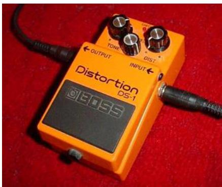  
FIGURE 1. BOSS Distortion DS – 1 distortion pedal (Photo courtesy: Wikipedia).

An equalizer is used to adjust the frequency response in a number of different frequency bands. To adjust the frequency response there are a few ways, such as the sliding control and the rotary control. A graphic equalizer provides slider controls for a number of frequency region. These bands of frequency have a fixed width and a fixed center frequency, but the slider will only be able to change the level of the frequency band and no changes can be made on the width and the center frequency. The tone controls on guitar uses rotary control rather than sliding controls, to change the level of frequency, while maintaining the fixed width and the center frequency [2].

According to the previous works by R.C.D. Paiva [3] a generic model was constructed to emulate distortion circuits using operational amplifiers and diodes. This model consisted of basic electronic analog components, resulting in a highly dense and complex structure of the circuit. On the other hand, Alfred Hanssen [4] analyzed the amplification of sound of an electric guitar by a high-quality all-tube amplifier which was emitted by means of a speaker cabinet. He used three different preamplifier gain settings: one clean, one half-distorted, and one massively distorted to analyze the sound spectrum, and found that only the high frequency part of the spectrum was boosted by an increase in the distortion levels. D.T. Yeh [5] has presented a procedural approach to derive nonlinear filters from schematics of audio circuits for the purpose of digitally emulating analog musical effects circuits in real time. Jiming Fan [6] proposes a solution to design a new type of guitar effectors integrating a MIDI synthesizer function based on ADSP-BF533. He introduced the algorithm of the basic functions of guitar effectors such as distortion

and equalization. Experimental result shows that the system can be used as a MIDI synthesizer as well as a traditional guitar effector. While according to M Karjalainen [7] there is a need of a virtual analog modelling for the simulation of classic analog circuitry by DSP. He showed the use of wave digital filters in real-time simulation of vacuum-tube amplifier stages. D.J. Gillespie [8] introduced a novel method for the solution of guitar distortion circuits based on the use of kernels. The algorithm he proposed uses a kernel regression framework to linearize the inherent nonlinear dynamical systems created by such circuits and proposes data and kernel selection algorithms well suited to learn the required regression parameters. Examples are presented using the One Capacitor Diode Clipper and the Common-Cathode Tube Amplifier.

# A. AMPLIFIER MODELLING

The digital emulation of a physical amplifier is referred to as amplifier modelling. An amplifier is often used to recreate the sound of a specific model of vacuum tube amplifiers. This process of recreation of sound can add the effect of distortion to the recording in the otherwise undistorted recording. The dynamic behaviour of the amplifier modelling, renders it useful, as the amplifier setting can be modified instantaneously without undergoing the trouble of re-recording the audio. Digital Signal Processing (DSP) is generally used in the process of amplifier modelling to recreate the sound of plugging into analog pedals and overdriving the valve amplifiers [9].

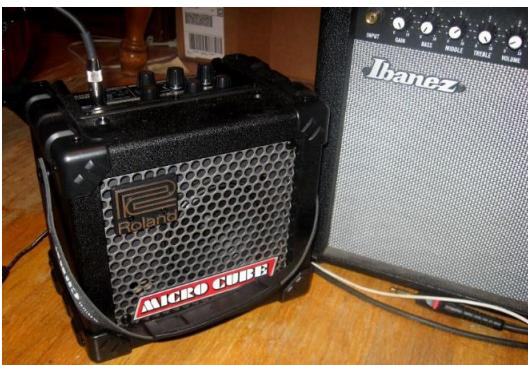  
FIGURE 2. Roland Micro Cube Amplifier (Photo courtesy: Wikipedia).

Fig. 2 shows the classic solid state Roland Micro Cube Amplifier, having the capability to amplify the sound waves of the guitar to a desired level with an input power consumption of 2W, and nominal input level being 10dBu.

The extreme heavy overdriving of the amplifier tubes creates the sound effects with high gains essentially used in Heavy metal concerts. The essential component of such a high gain is the loud, harmonically rich, and the sustaining quality of the tone. The distortion effects often produces sounds which are not possible to be produced any other way.

# B. SOLID STATE DISTORTION

Solid-state amplifiers incorporate transistors and operational amplifiers (op-amps) to produce hard clipped and

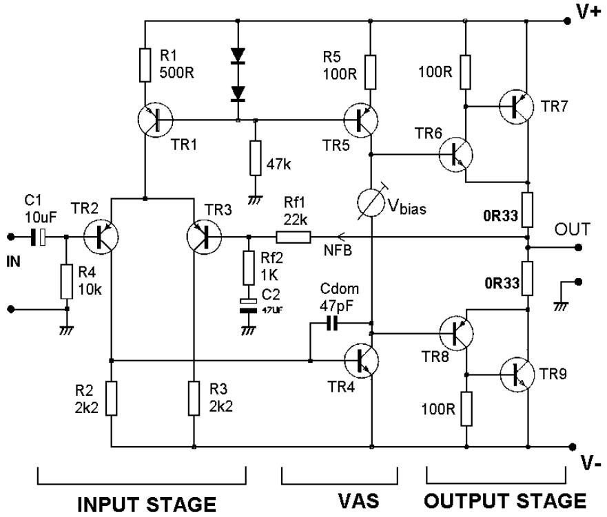

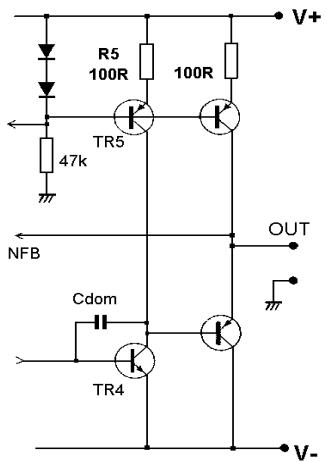  
(a)   
(b)   
FIGURE 3. (a) The Solid state amplifier. (b) The output stage of the Solid State Amplifier.

distorted waves. There are two methods to achieve this distortion using hard clipping. One is by either amplifying the signal to such an extent that the signals get flattened by clipping due to crossing the threshold value, or by clipping the signal across diodes, which is a simpler method.

A typical circuit of the solid state amplifier is as shown in the figure above. The circuit mainly consists of solid state devices like transistors and op-amps. The open loop gain of the circuit is calculated based on the values of the resistances and the capacitances, and the required gain at the output is obtained by designing the circuit with modified

values of these components. Therefore, there is a need for a quick and convenient method of measuring the open loop gain, so that the circuit is designed with expected output. Manipulating of the closed loop gains and breaking of the feedback loops within the circuit is the standard method for obtaining the open loop gain of an op-amp circuit. This procedural method has a very low success rate with the average power amplifier, and hence is not adopted due to the inconsistencies.

For the amplifier shown in Fig 3, the open-loop gain is the voltage at the output divided by the differential voltage at the input.

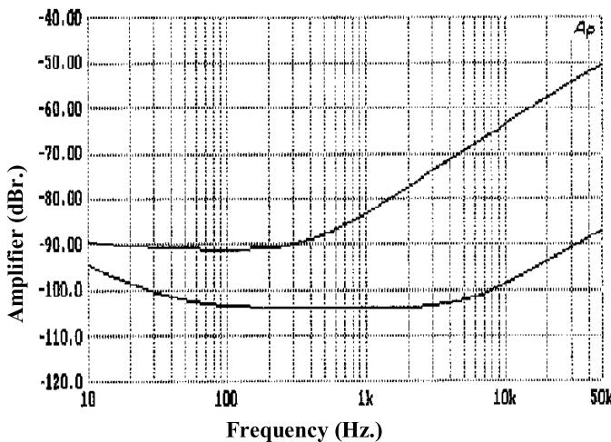  
FIGURE 4. Open Loop Gain – Frequency (Hz.) v/s Amplifier (dBr.).   
Fig 4 shows Open Loop gain of the amplifier shown in Fig. 3.

# II. WORKING OF THE PRESENT SYSTEM

During the early days when the Rock and Jazz music were at their peak, distortion was introduced in the composition primarily by overdriving the power valves. Most of the guitarists who followed the early classic concerts used to appreciate this type of distortion and this choice followed ever since. As they have become so much accustomed to this sound, they prefer to obtain this particular distortion sound by driving the power section hard by setting the amplifiers at their peak levels.

When the power valves are driven this hard, by setting the amplifiers at their peak levels, consequently the intensity of the volume rises considerably. This high intensity volume was difficult to manage in the space of recording. An alternative solution was required to lower the volume without any changes on the distortion being produced. Some solutions suggested the option of diverting of the power valve from the speaker in order to keep the volume within limits. Such diverting of the power valve from the speakers required the use of built-in or separate power attenuators and power-supply-based power attenuation. These components would help to subside the effect of volume coming out of the speakers. These components are used in a system called Voltage Variable Regulator (VVR), which drops the voltage across the valve’s plates in order to reduce the volume while still maintaining the same level of distortion [10].

Another alternative to reduce the volume was the modular rack mount setup. The modular rack mount setup consists of a rack mount preamp, a rack mount valve power amplifier, and a rack mount dummy load which is used to attenuate the output to desired volume levels.

The distortion pedal for an electric guitar was based on the following circuit diagram with the following components on the circuit board [11]:

# Resistors

1. 2.2k (3)   
2. 51k (3)   
3. 100k (3)   
4. 1M   
5. 50k trim potentiometers (3)   
6. 100k potentiometer, audio taper.   
7. 500k potentiometer, audio taper.

# Capacitors

1. 200nF   
2. 4.7uF (3)   
3. 22uF (3)   
4. 220uF

# Semiconductors

1. J201JFETs (3)

# Miscellaneous

1. 9V battery   
2. Clip for said battery   
3. Breadboard/Strip board   
4. Jacks for input and output (2)

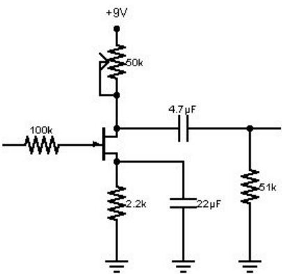  
FIGURE 5. The basic stage of the distortion circuit (Photo courtesy: Instructables, FET distortion pedal).

The left most part of the circuit shown Fig. 5, is the input stage, this is followed by a 100K resistor, called as the input resistor which limits the forward gate current, protecting the FET. Since, the FETs are voltage controlled devices, this has absolutely no impact on gain, like it would be in a BJT.

The center part of the circuit is the FET (Field effective transistor), on top of which is a 50K trim potentiometer which acts as a drain resistor. It sets the bias and gain and therefore, the distortion characteristics. The analog potentiometer is a three-terminal resistor with a sliding contact that forms an adjustable voltage divider.

Potentiometers is used for :

1) Volume controls on audio equipment.   
2) Control the amplifier Gain and offset .

and many other applications.

Below the FET is the 2.2K source resistor, it sets the gain along with drain resistor. Followed by the FET at the center of the circuit is a 4.7 µF coupling capacitor which is used to block the DC component of the FETs output, and below that

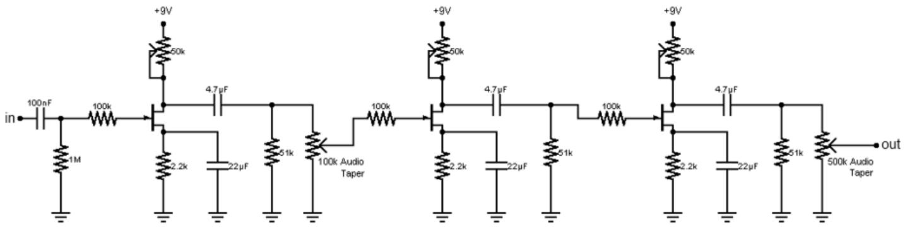  
FIGURE 6. The basic stage of the circuit is cascaded to form a 3 stage distortion circuit to obtain the required tone (Photo courtesy: Instructables, FET distortion pedal).

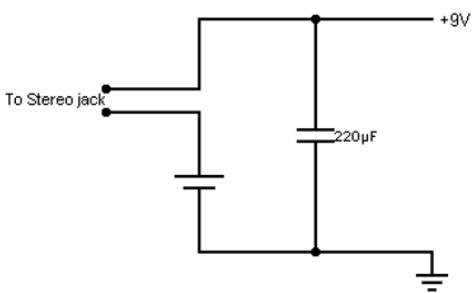  
FIGURE 7. Circuit showing the connection to the stereo jack, (Photo courtesy: Instructables, FET distortion pedal).

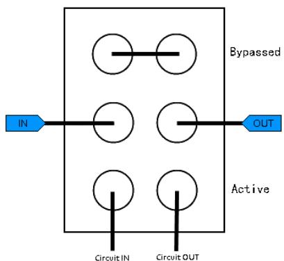  
FIGURE 8. True Bypass switch, Double Pole Double Throw (DPDT), (Photo courtesy: Instructables, FET distortion pedal).

is a 22 µF capacitor, which is used to boost the overall gain of the stage.

This basic circuit is cascaded (input to output) in stages three times to form a 3 stage distortion circuit as shown in the Fig. 6.

The Fig. 7 shown above is the overall circuit with connection to the stereo jack. The battery shown is the 9V battery and the 9V potential is maintained on the overall top side of the circuit, whereas all the grounding of the circuit is shown by the earthing (grounding) symbol. At the center of the circuit is the 220 µF capacitor connected to boost the overall gain.

The above shown Fig. 8 depicts a bypass switch, the input of the circuit is connected to the Circuit IN, and the output of the circuit is connected to the circuit OUT on this switch.

The circuit consists of several fairly standard JFET common-source amplifier ‘‘stages’’ cascaded one after the other. JFETs work in depletion mode, in a manner very similar to vacuum tubes. Because of this, by carefully controlling the gain of each stage, asymmetrical, soft clipping can be achieved. Each stage inverts the signal it is fed, so if asymmetrical clipping is required, then cascading of the alternate high gain and low gain stages is required. The overall effect depends on the number of stages used. One stage adds a boost with a mild crunch when driven hard, two will give a bluesy overdrive. Making it to three stages, varying levels of distortion is obtained, depending on the gain settings of the individual stages. The input capacitor also plays a significant role in the overall tone of the effect. Larger values mean more bass, yielding a darker sound, while lower values will give a brighter sound.

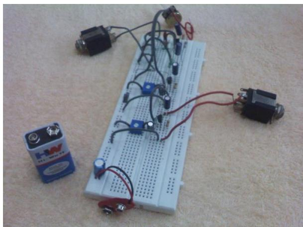  
FIGURE 9. Circuit connected on the bread board, (Photo courtesy: Instructables, FET distortion pedal).

The disadvantages of the circuit shown in Fig. 9 is as follows:

• JFETs are hopelessly inconsistent from one device to the next. This inconsistency is one of the reasons for the three trim potentiometers in the circuit.

• The analog potentiometer had issues while interfacing with a microcontroller, and hence the circuit is not controlled by a microcontroller.   
• Also, variable gating was not possible with the simple analog potentiometers.   
• Complex circuitry involving three stages, to obtain the required distortion.

# III. OBJECTIVES

• To assemble and construct a varying gate distortion pedal for the electric guitar.   
• To utilize a microcontroller to feed in a signal waveform to influence the output of the pedal, reducing the complex circuitry of 3 stage.

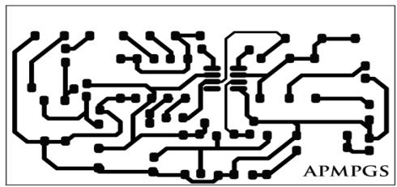

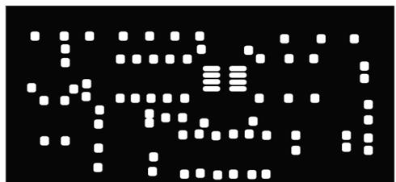  
FIGURE 10. Circuit design for PCB manufacturing.

# IV. METHODOLOGY

1) Constructing the PCB using toner transfer method. Fig. 10 depicts the circuit design for the PCB manufacturing.

# A. MAINTAINING THE INTEGRITY OF THE SPECIFICATIONS

• Layout   
The Layout should be mirrored.   
• Crop and align

The dust and fingerprints on the board are removed with acetone. The layout is then cut and applied with the printed side on the board. If necessary, the layout is fixed with Scotch Tape.

• Ironing

A linen cloth is put on the board. The layout on the board is ironed with circling movements and light pressure. Thereby the correct temperature is important. If it is too high, the toner becomes too liquid and the strip lines become blurred. If it is too low, the toner does not retain on the copper. So, maintaining of the correct temperature while ironing is of the utmost importance.

• Removing the paper

The board has to be cooled down. It is put on a plate with cold water and a little soap. After some time the paper can be removed by rubbing it. The toner should remain on the board. If not, the toner can be removed using Acetone and the whole process is repeated.

• Etching

1) Designing the circuit, with digital potentiometer controlled by Arduino UNO (Microcontroller).

• The circuitry to be designed requires that input waveforms be hard clipped, to achieve a distorted sound.   
• The resulting circuit consists of a series of smaller circuits, such as a high pass filter, integrator, etc.   
• Components required are:   
• Mylar, ceramic and electrolytic capacitors (at least 12V, 0.1 uF)   
• Transistors (2N5458)   
• Diodes (1N914, 1N4002)   
• 1% metal film resistors   
• Input and output jacks   
• LEDs and holders   
• 9V power supply   
• 22 gauge wire   
• Power input connector   
• 8 pin DIP IC socket for LM308 IC   
• Blank copper clad circuit board   
• 100 K-A potentiometers   
• Metal casing   
• MCP41100 IC.

In the circuit diagram shown in Fig. 11, a digital potentiometer – MCP41100 IC along with Arduino circuit board has been used, to obtain the required tone as an output. It is easy and better to control the resistance value by Microcontroller instead of using an analog one. Analog potentiometers have some problem with Micro Controller Unit. Microcontroller doesn’t have an easy way to interface with them. The Digital Potentiometer, gives an ability to adjust the resistance, allowing to control a voltage splitter with digital signals, hence variation in the voltage is obtained at a faster rate, producing the required distortion as and when required. The Fig. 12 is a representation of the pin configuration of the digital potentiometer – MCP41100.

From the above Fig. 13, it is clear that the wiper is moved over the length of the wire to vary the resistance, and hence the potential. The wiper movement is controlled by the digital control of the Arduino UNO circuit board as shown in the Fig. 14. Hence, the effective variation of the potential in the digital potentiometer (MCP41100) is done by the microcontroller, Arduino UNO.

The Arduino UNO has the following specifications: -

 Processor: ATmega328 (8-bit CPU, 16MHz clock speed, 2KB SRAM, 32KB flash storage)   
 Features: 14 digital I/O pins, 6 analog input pins, removable microcontroller   
 Form Factor: 2.7’’ x 2.1’’ rectangle [12].

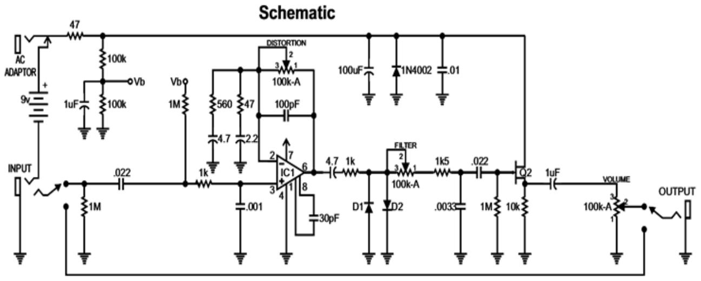  
FIGURE 11. Circuit diagram showing the layout of the various components.

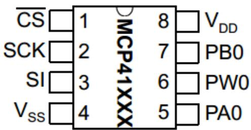

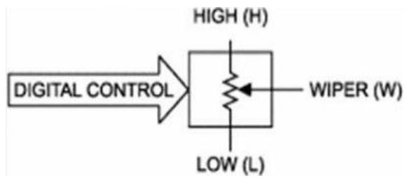  
FIGURE 12. The pin diagram of the digital potentiometer – MCP41100.   
FIGURE 13. Digital Potentiometer.

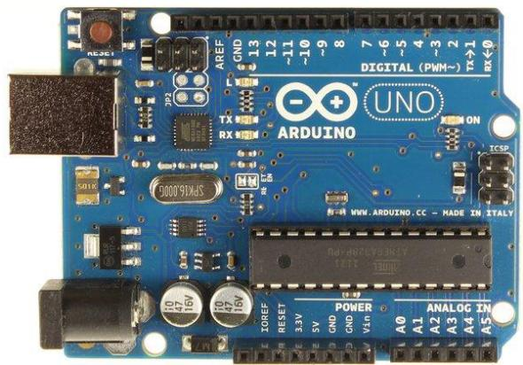  
FIGURE 14. Arduino UNO circuit board.

The connection of the Arduino UNO circuit board to the digital potentiometer is as shown in the Fig. 15. The variation in the potential of the digital potentiometer is smoothly

controlled using the microcontroller - Arduino UNO. A microcontroller, has the ability to adjust the resistance, to control a voltage splitter with digital signals.

1) Making external connections with switches as shown in the Fig. 16.   
2) Using a microcontroller and digital potentiometer to input new signal waveforms.   
3) Testing with various waveforms.   
4) Making of preset outputs.

# V. OBSERVATIONS:-

1. The setup is connected properly on the bread board, with the specific components working in the similar range of operating parameters, and the connection is rigged to the input supply on one side, and a Cathode Ray Oscilloscope (CRO) on the other side for obtaining the output wave form.   
2. The Arduino Microcontroller circuit board is used to obtain the variation in the waveform of the distortion produced, as seen in the output waveform of the CRO.   
3. The original input signal is a sinusoidal signal, varying with respect to time, whose upper and lower limits are set with the help of a potentiometer.   
4. Fig. 17 shows the input sinusoidal waveform applied to the circuit for which distortion has to be introduced by hard clipping.   
5. Fig. 18 shows the output waveform which is hard clipped and the distortion which has been applied to it is clearly visible.

# VI.RESULTS ANDDISCUSSIONS

1. The use of digital potentiometer (MCP41100) controlled by the Arduino UNO Microcontroller for designing the variable gating distortion pedal, has yielded satisfactory results, as seen from the output waveform in the Cathode Ray Oscilloscope (CRO).

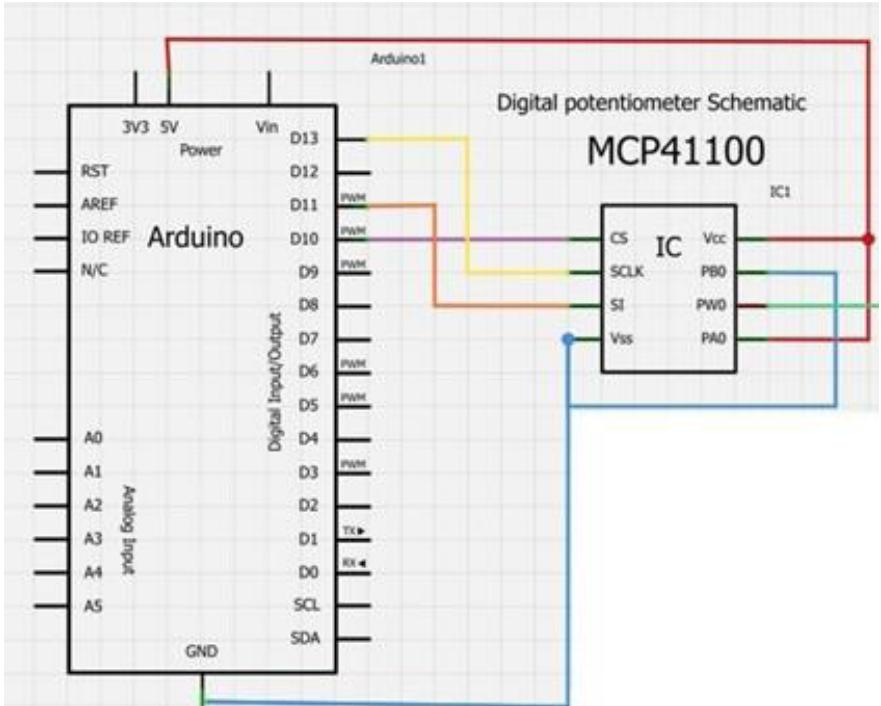  
FIGURE 15. Connection of the Arduino to the Digital Potentiometer.

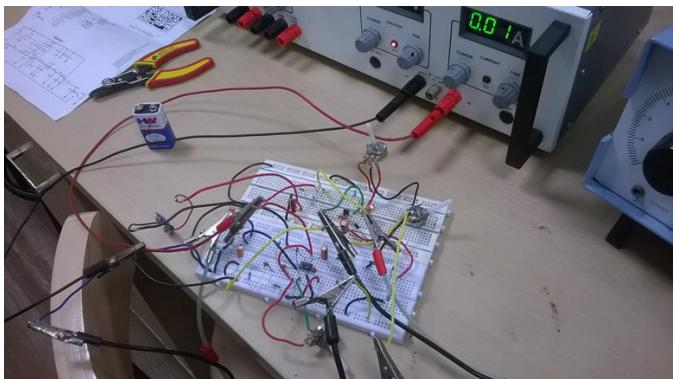  
FIGURE 16. Circuit prototyping with breadboard.

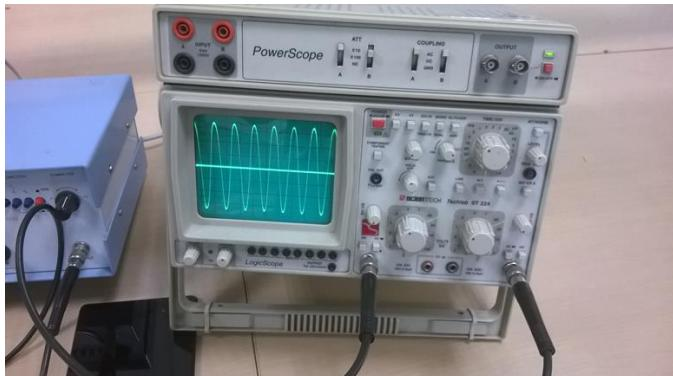  
FIGURE 17. Input waveform using CRO.

2. Controlling of the analog potentiometer by a microcontroller had issues, in the interfacing stage. So a digital potentiometer was used, and also better results in the

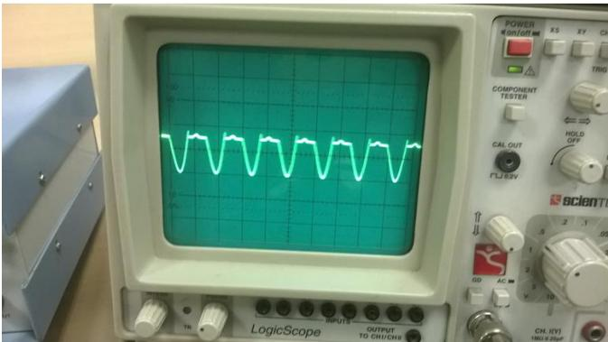  
FIGURE 18. Output hard clipped waveform with distortion.

distortion of the waveforms were observed as compared to the conventional distortion pedal.

3. Since, the digital potentiometer was controlled by the microcontroller, hard clippings of the input sinusoidal signal was obtained at a much faster rate, with high gain. The signal is then distorted, at any time period t, to provide the effect of the electric guitar, and to utilize the full potential in terms of frequency and pitch of the guitar.   
4. The complex circuitry of 3 stage gain to obtain the required tone of distortion from an analog potentiometer was replaced with a circuit having a digital potentiometer controlled by a microcontroller.   
5. The overdriving of the power valve to obtain the distortion, had a consequence of higher volume problems, which is not in picture at all with this circuit controlled by the microcontroller.

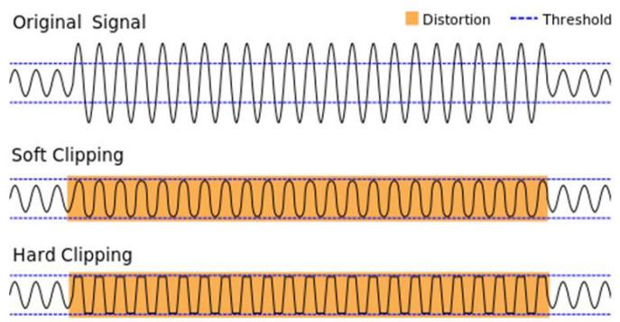  
FIGURE 19. The output waveform hard clipped with the introduction of distortion. (Photo courtesy: Wikipedia).

6. To minimize the noise level during distortion a certain threshold level is set as shown in the Fig. 19, and the circuit on the bread board clips the original signal to obtain hard clipping within the threshold region. By varying the potentiometer the threshold levels can be varied.   
7. It is economically inexpensive as compared to a full effects pedal board.   
8. Maintenance, repair, and debugging of such a circuit is easy because the circuitry is simple, as compared to the circuitry of a full effects pedal board.

# VII. CONCLUSIONS

In this paper, a distortion pedal with a variable gating effect has been described in detail. A variable gating distortion pedal has the distinct advantage of being able to completely replace a full effects pedal board with a compact device. A full effects pedal board is expensive and heavy, whereas a variable gating distortion pedal is compact and light, because of the use of modern and better components like the digital potentiometer, controlled by Arduino UNO (Microcontroller).

# ACKNOWLEDGMENT

The authors would like to thank the Manipal Institute of Technology for conducting this research in the Integrated Electronics Laboratory of Electronics Department (Manipal Institute of Technology, Manipal) for sharing their expertise and equipment.

# REFERENCES

[1] B. Duncan, High Performance Audio Power Amplifiers. Oxford, U.K.: Newnes, 1996, pp. 79–80.   
[2] G. Ballou, ‘‘Filters and equalizers,’’ in Handbook for Sound Engineers, 4th ed. Waltham, MA, USA: Focal Press, 2008.   
[3] R. C. D. Paiva, S. D’Angelo, J. Pakarinen, and V. Valimaki, ‘‘Emulation of operational amplifiers and diodes in audio distortion circuits,’’ IEEE Trans. Circuits Syst., vol. 59, no. 10, pp. 688–692, Oct. 2013.   
[4] A. Hanssen, T. A. Oigard, and Y. Birkelund, ‘‘Spectral, bispectral, and dualfrequency analysis of tube amplified electric guitar sound,’’ in Proc. IEEE Workshop Appl. Signal Process. Audio Acoust., Oct. 2005, pp. 295–298.   
[5] D. T. Yeh, J. S. Abel, and J. O. Smith, ‘‘Automated physical modeling of nonlinear audio circuits for real-time audio effects—Part I: Theoretical development,’’ IEEE Trans. Audio, Speech, Lang. Process., vol. 18, no. 4, pp. 728–737, May 2010.   
[6] J. Fan, Y. Chen, and R. Liu, ‘‘The realization of multifunctional guitar effectors&synthesizer based on ADSP-BF533,’’ in Proc. 11th IEEE Singapore Int. Conf. Commun. Syst. (ICCS), Nov. 2008, pp. 199–202.

[7] M. Karjalainen and J. Pakarinen, ‘‘Wave digital simulation of a vacuumtube amplifier,’’ in Proc. IEEE Int. Conf. Acoust., Speech Signal Process. (ICASSP), May 2006, pp. 2–3.   
[8] D. J. Gillespie and D. P. W. Ellis, ‘‘Modeling nonlinear circuits with linearized dynamical models via kernel regression,’’ in Proc. IEEE Workshop Appl. Signal Process. Audio Acoust. (WASPAA), Oct. 2013, pp. 1–4.   
[9] Amplifier Modelling. [Online]. Available: http://en.wikipedia.org/ wiki/Amplifier_modeling, accessed Mar. 2011.   
[10] D. M. Brewster, Introduction to Guitar Tone and Effects: A Manual for Getting the Sounds from Electric Guitars, Amplifiers, Effects Pedals and Processors. Miulwaukee, WI, USA: Hal Leonard, 2001.   
[11] Instructables. FET Distortion Pedal. [Online]. Available: http://www. instructables.com/id/FET-Distortion-Pedal/Building-It/, accessed 2011.   
[12] Tested. Know Your Arduino: A Practical Guide to the Most Common Boards. [Online]. Available: http://www.tested.com/tech/robots/456466- know-your-arduino-guide-most-common-boards, accessed Jun. 12, 2013.

ANARGHYA ANANDA MURTHY received the bachelor’s degree in mechatronics engineering from the Manipal Institute of Technology, Manipal, India. He is currently a Research Scholar with the Centre for Manufacturing Research and Technological Utilization, Rashtreeya Vidyalaya College of Engineering, Bangalore, India. His current research works are focused on structural analysis of experimental validation of underwater pressure vehicles.

NITISH RAO received the bachelor’s degree in mechatronics engineering from the Manipal Institute of Technology, Manipal, India. He is currently pursuing the M.Sc. degree in automotive technology with the Eindhoven University of Technology, Eindhoven, The Netherlands. His current research interests include automotive control systems and powertrain components.

YATHEESHA RANGANAHALLI BEEMAIAH is currently an Assistant Professor with the Don Bosco Institute of Technology, Bangalore, India. He received the M.Tech. degree from the National Institute of Engineering, Mysore, India, and the bachelor’s degree in mechanical engineering from the B.M.S. College of Engineering, Bangalore, India. His current research interests include polymer composites, thin-film sensors, and material metal matrix.

SUSHANTH D. SHANDILYA is currently a Research Scholar with the Centre for Manufacturing Research and Technological Utilization, Rashtreeya Vidyalaya College of Engineering, Bangalore, India. He received the bachelor’s degree in mechanical engineering from the Jagadguru Sri Shivarathreeshwara Academy of Technical Education, Bangalore. His current research works are focused on the development and characterization of thin-film sensors for gas

turbine application and material science.

RANJITH BADARMANAHALLI SIDDEGOWDA received the bachelor’s degree in mechanical engineering from the Manipal Institute of Technology, Manipal, India. His current research works are focused on thin-film transistors, thin-film sensors, and nanocomposite materials.