# Evaluation of the extended modal-domain model in the calculation of lightning-induced voltages on parallel and double-circuit distribution line configurations

Osis E.S. Leal b,* , Alberto De Conti a

a Department of Electrical Engineering (DEE), Federal University of Minas Gerais (UFMG), Brazil   
b UTFPR – Federal University of Technology – Parana, ´ Pato Branco, Brazil

# A R T I C L E I N F O

Keywords:

Lightning-induced voltages

Distribution lines

Transmission line modeling

Electromagnetic transient simulators

Extended modal-domain model

# A B S T R A C T

This paper evaluates the applicability of the extended modal-domain (EMD) model in the calculation of lightning-induced voltages on parallel and double-circuit distribution lines. The influence of a real and constant transformation matrix and of the fitting technique required in the model on the induced-voltage waveforms is also investigated. It is shown that the EMD model presents good accuracy in most of the tested configurations. Also, in most cases the influence of the frequency selected for the calculation of the transformation matrix required in the EMD model is minimal. On the other hand, the requirement of using strictly real poles and residues and the use of the built-in fitting tool available in the Alternative Transients Program (ATP) have both a detrimental influence on the accuracy of the EMD model, at least in the investigated cases.

# 1. Introduction

Lightning-induced voltage calculations on overhead distribution lines are mostly performed using transmission line theory, which is motivated by features like efficiency, accuracy, and possibility of implementation in electromagnetic transient (EMT) simulators [1-3]. Although the latter feature is of particular importance for the simulation of realistic networks including laterals, surge arresters, and transformers [4,5], it can actually be quite a demanding task because the user is expected to implement not only a code for the calculation of lightning electromagnetic fields and their coupling with the illuminated line, but also a lossy transmission line model for the calculation of the resulting transients [6]. In a recent paper, De Conti and Leal [6] proposed two models that make it possible to calculate lightning-induced voltages simply by adding independent current sources to both ends of lossy transmission line models that are already available in the libraries of EMT simulators. By using the proposed models, the user does not need to implement a dedicated transmission line model to solve the transients on the line, which greatly simplifies the process.

One of the models proposed in [6], called extended phase-domain

(EPD) model, solves telegrapher’s equations including the influence of external electromagnetic fields directly in the phase domain and is compatible with the universal line model (ULM) [7]. The EPD model can be used to calculate lightning-induced voltages on overhead distribution lines with arbitrary configuration even if the associated eigenvectors present a large variation with frequency, which is a characteristic commonly observed in lines with strongly asymmetric configuration and underground cables [6-8].

The other model proposed in [6], called extended modal-domain (EMD) model, uses modal decomposition techniques assuming a real and constant transformation matrix to solve telegrapher’s equations including the influence of external electromagnetic fields. This model is compatible with Marti’s model [9], which is expected to perform accurately as long as the line geometry is not strongly asymmetric. If this assumption is violated, the associated eigenvectors present a stronger variation with frequency and, consequently, the assumption of a real and constant transformation matrix may no longer hold. In practice, however, it is often difficult to characterize the line configuration simply in terms of its asymmetry. In fact, it was demonstrated in [10] that Marti’s model can be used to simulate transients with accuracy at least

comparable to ULM for a wide range of transmission line configurations. However, the analysis was restricted to switching transients on high-voltage lines. No similar study has been presented so far dealing with voltages induced by nearby lightning strikes on distribution lines.

In [6] and [11] it was shown that the EMD model predicts lightning-induced voltage waveforms in excellent agreement with the EPD model and the finite-difference time-domain (FDTD) method. However, the investigated cases were restricted to a single-circuit compact distribution line [11] and a typical medium-voltage (MV)/low-voltage (LV) line configuration [6]. It is still unclear whether the EMD model could be used to calculate lightning-induced voltages on double-circuit and parallel distribution line configurations with sufficient accuracy. Verifying this point is important because the calculation of the external current sources required in the EMD model is more efficient than in its phase-domain counterpart, the EPD model. It is also of great interest to identify in which cases the EMD model would ultimately fail to provide accurate lightning-induced voltage estimates, thus requiring the use of the EPD model.

In this paper, the use of the EMD model is investigated for different MV distribution lines used in Brazil, with focus on double-circuit and parallel line configurations. The idea of investigating such cases is to push the EMD model to critical conditions in which the assumption of a real and constant transformation matrix could possibly fail. It is also investigated how sensitive the model is to different fitting techniques, especially by the restriction imposed by Marti’s model available in the Alternative Transients Program (ATP) regarding the use of strictly real poles and residues. This is important to delimit the model’s ability to calculate lightning-induced voltages under different conditions in practical cases.

This paper is organized as follows. Section II describes the modeling details. Section III presents the tested configurations. In section IV, the results are presented and discussed. Finally, the conclusions are presented in section V.

# 2. Modeling details

In order to investigate the accuracy of the EMD model in the lightning-induced voltage calculations presented in this paper, the EPD model (coupled with ULM) is taken as reference for being a more general model developed directly in the phase domain. A shown in [6], the EMD and EPD models represent the influence of incident lightning electromagnetic fields via independent current sources that are connected to the terminations of lossy transmission line models available in EMT-type programs. The sources are described by pairs of time/current points that are independent of the boundary conditions of the line. A detailed discussion on the EMD and EPD models is found in [6] and [8].

In this paper, the current sources are calculated with a MATLAB code implemented by the authors using the compact matrix formulation proposed by Leal and De Conti [8]. For testing the EMD model, two different implementations of Marti’s transmission line model were considered. The first is a code written by the authors in MATLAB and validated in [8] and [11]. It allows the use of complex poles and residues in the fitting of the characteristic impedance and the propagation function of the line. The second implementation is Marti’s model available in ATP, in which the fitting is limited to real poles and residues. In the simulations performed in ATP with Marti’s model, the current sources calculated with the EMD model were connected to the line terminations through current sources controlled by MODELS. The reference models ULM and EPD were implemented in MATLAB and validated in [8].

The internal impedance of the line conductors was calculated with the exact formulation for solid conductors based on Bessel’s equations [12], while the ground-return impedance was determined with Carson’s equations [13]. Despite the existence of more accurate ground-return impedance expressions [14], Carson’s equations were adopted to ensure compatibility with Marti’s model available in ATP.

For the calculation of the incident electromagnetic fields, Barbosa and Paulino’s equations [15-17] that include the influence of a lossy ground on the horizontal component of the incident electric field were used. The formulation is written directly in the time domain assuming the transmission line (TL) return-stroke model [18] to represent the return-stroke current propagation. The channel-base current was modeled as the sum of two Heidler functions whose parameters are described in [19], taking as reference the median parameters of subsequent currents measured at Morro do Cachimbo, Brazil. It has a peak value of 16 kA, a maximum time derivative of 29.5 kA/μs, and a virtual front time of 0.73 μs.

# 3. Case studies

In all investigated cases, a 3 km-long line above a lossy ground with 0.001-S/m conductivity and relative permittivity of 10 was considered. Except otherwise noted, all conductors were terminated at 500-Ω resistors, which approach the characteristic impedance of the lines. The stroke location is 100 m far from terminal k, as shown in Fig. 1, taking as reference the point marking the mean horizontal separation between the line conductors. This particular stroke location was chosen for stressing propagation effects on the voltages induced on terminal m. In the following sections, the investigated parallel and double-circuit line configurations are presented. Except otherwise noted, the stroke location is assumed to be facing either line 1 or circuit 1.

# 3.1. Case A: parallel conventional lines

The first case study considers two parallel 15-kV class conventional distribution lines as shown in Fig. 2. Each line consists of three horizontally-aligned phase conductors above a neutral conductor. The lines are 13 m apart from each other and the rated voltage is 13.8 kV. This case emulates a practical condition in which the lines are built on opposite sides of the road. In [11], it was shown that the EPD and EMD models lead to lightning-induced voltages in excellent agreement when one of the lines shown in Fig. 2 is considered, even in the presence of an LV line sharing the same pole. The characteristics of the conductors are given in Table I.

# 3.2. Case B: parallel conventional and compact lines

In case study B, line 1 of case A (see Fig. 2) is replaced by a 15-kV class compact distribution line as shown in Fig. 3. The compact line consists of five conductors, namely a neutral conductor (N), a messenger conductor (M), and three phase conductors (A, B, and C). The neutral and the messenger are bare conductors, while the phase conductors are covered by a layer of extruded polyethylene (XLPE) with relative permittivity equal to 2.3 and thickness δ. The rated voltage is 13.8 kV. The conductor characteristics of the compact distribution line are given in Table II.

# 3.3. Case C: horizontal double-circuit compact distribution lines

In case C, a horizontal double-circuit compact distribution line with the configuration shown in Fig. 4(a) is considered. Each circuit is identical with line 1 of case B. The distances between circuits 1 and 2 are shown in Fig. 4(a).

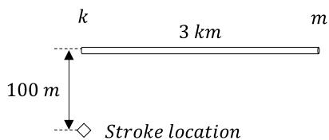  
Fig. 1. Upper view of the simulated line.

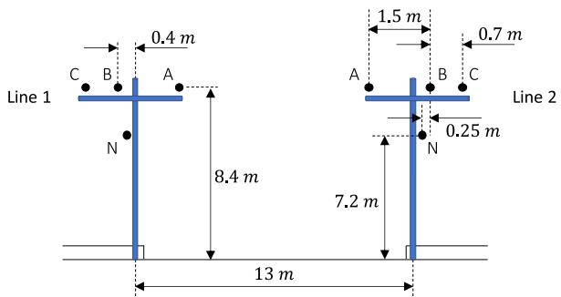  
Fig. 2. Parallel 13.8-kV conventional distribution lines.

Table I Conductor parameters of the conventional distribution lines.   

<table><tr><td>Conductors</td><td>r(mm)</td><td>Rdc(Ω/km)</td></tr><tr><td>A, B and C</td><td>4.1</td><td>0.11872</td></tr><tr><td>N</td><td>3.72</td><td>1.0949</td></tr></table>

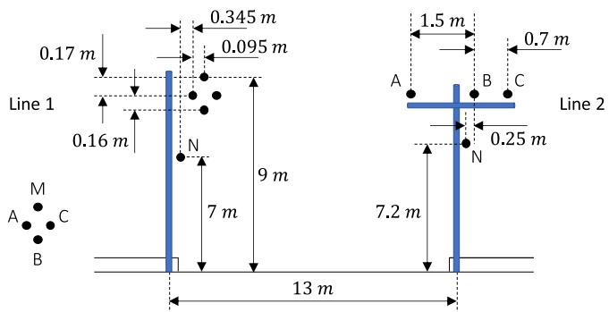  
Fig. 3. Parallel conventional and compact lines.

Table II Conductor parameters for the compact distribution line.   

<table><tr><td>Conductors</td><td>r(mm)</td><td>δ(mm)</td><td>Rdc(Ω/km)</td></tr><tr><td>A, B and C</td><td>4.1</td><td>3.5</td><td>0.822</td></tr><tr><td>N</td><td>3.72</td><td>-</td><td>1.0949</td></tr><tr><td>M</td><td>4.75</td><td>-</td><td>4.5239</td></tr></table>

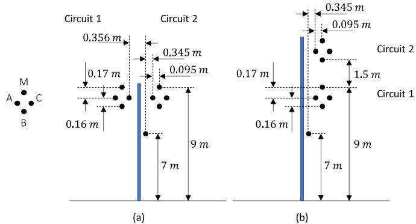  
Fig. 4. Double-circuit compact distribution lines; (a) horizontally-aligned circuits; (b) vertically-aligned circuits.

# 3.4. Case D: vertical double-circuit compact distribution line

Case D considers the vertical double-circuit compact distribution line shown in Fig. 4(b). The properties of each circuit are identical with line 1 of case B.

# 3.5. Case E: double-circuit 69 kV/15 kV lines

Case E considers the double-circuit line shown in Fig. 5(a), which includes a 69-kV power line and a 15-kV class compact distribution line with rated voltage of 13.8 kV. This configuration is the same investigated in [20] with the LIOV code, which is based on the FDTD method [21]. The 69-kV line consists of three phase conductors, labeled A, B, and C, and a shield wire, labeled SW. Conductor details of the compact line are the same of Table II, except that the neutral is now absent. The characteristics of the 69-kV line conductors are shown in Table III.

# 3.6. Case F: double-circuit 138 kV/15 kV lines

Case F is similar to case E, but now the 69-kV line is replaced by a 138-kV line as shown in Fig. 5(b). Also, an additional shield wire was inserted between the high-voltage circuit and the MV line. The lightning performance of this particular configuration was investigated in [20] using the LIOV code [21].

# 3.7. Case G: rural distribution line parallel with a fence

Finally, case G represents a rural distribution line located close to a fence. The spatial distribution of the conductors is shown in Fig. 6. The parameters of the MV line conductors are the same given in Table I, whereas the fence conductors have a radius of 1.2 mm and a DC resistance of 2 Ω/km. In this particular configuration, the influence of the distance between the fence and the line on the accuracy of the EMD model is also evaluated. The fence conductors were left open-ended at both terminations and the stroke location is 100 m far from the fence, on the fence side.

# 4. Results and analysis

# 4.1. Comparison of different models

Fig. 7 shows lightning-induced voltages on nodes k and m of phase A of either line 1 or circuit 1 with the EMD model (coupled with Marti’s model) and the EPD model (coupled with ULM) considering the line

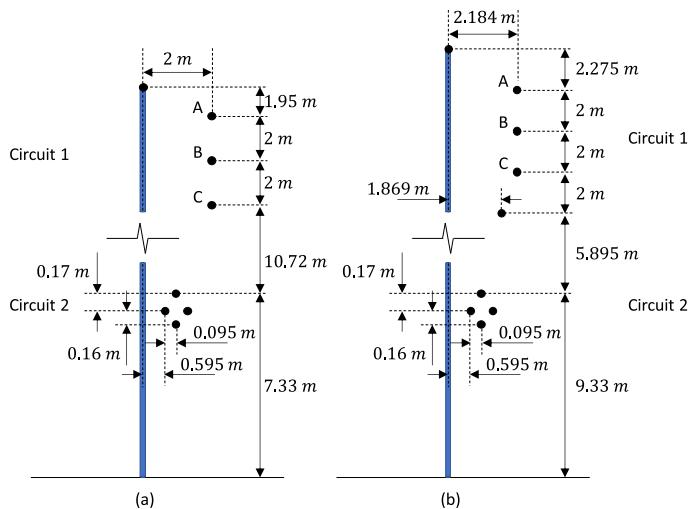  
Fig. 5. (a) Double-circuit 69 kV/15 kV lines and (b) double-circuit 138 kV /15 kV lines.

Table III Conductor parameters of the 69-kV and 138-kV Lines.   

<table><tr><td>Conductors</td><td>r1(mm)</td><td>r(mm)</td><td>Rdc(Ω/km)</td></tr><tr><td>A, B and C</td><td>3.37</td><td>9.145</td><td>0.2002</td></tr><tr><td>SW</td><td>-</td><td>4.76</td><td>4.5815</td></tr></table>

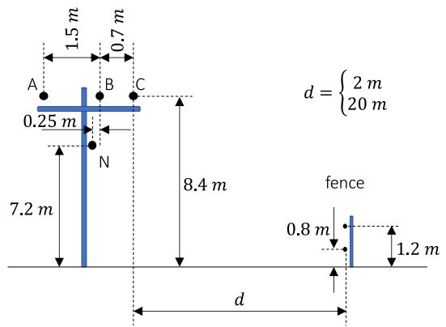  
Fig. 6. Rural distribution line parallel to a fence.

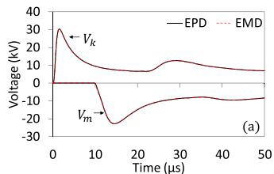

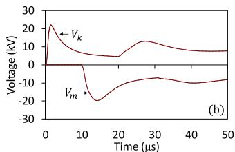

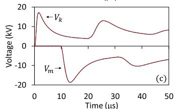

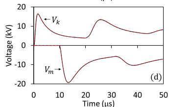

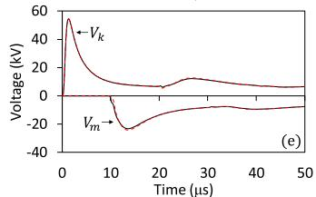

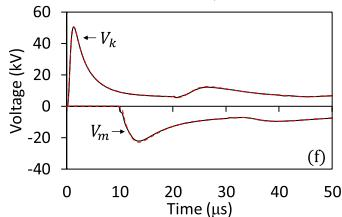

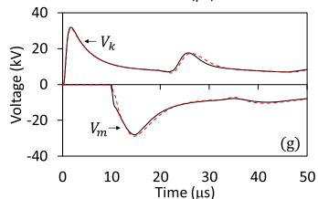

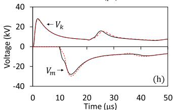  
Fig. 7. Lightning-induced voltages calculated on phase A of line 1 or circuit 1 considering the EMD and EPD models for cases (a) A, (b) B, (c) C, (d) D, (e) E, (f) F, (g) G assuming $d = 2 \ m ,$ , and (h) G assuming $d = 2 0 \mathrm { ~ m ~ }$ .

configurations shown in Section III. The simulations were performed in MATLAB in order to have full control over the model parameters and to avoid the restriction of using strictly real poles in Marti’s model available in ATP. The parameter calculation was performed from 0.1 Hz to 10 MHz. The number of poles considered in the fitting of the characteristic admittance or impedance of each line configuration ranged from

9 to 22. The fitting of the propagation function required 4 to 13 poles depending on the considered mode. The propagation function of the short elementary segment required in both the EPD and EMD models [8] demanded 10 poles on average. In the EMD model, the frequency of 10 kHz was used to calculate the transformation matrix. Although only the results referring to phase A of either line 1 or circuit 1 are shown, similar results were obtained for the other conductors.

As seen in Fig. 7, except for case G the behavior of the EPD and EMD models is equivalent. This means that, in principle, the EMD model could be used to calculate lightning-induced voltages on cases A-F even if some of the associated line geometries are clearly asymmetric. The greater deviations observed in case G are associated with the fact that the transformation matrix cannot be considered real and constant. In fact, by selecting a different frequency for calculating the transformation matrix the results would be different, as shown in the next section. Even greater deviations are observed if the fence voltages calculated on node m are now considered, which is shown in Fig. 8. This indicates that the use of the EMD model in the simulation of case G must be viewed with caution.

# 4.2. Influence of the transformation matrix

As the EMD model assumes a real and constant transformation matrix to solve telegrapher’s equations in modal domain, it is important to evaluate the influence of the frequency selected for calculating this matrix for each tested configuration. For this, the simulations of the previous section were repeated considering only the EMD model with the transformation matrix calculated at three different frequencies, namely 10 kHz, 100 kHz and 1 MHz. All selected frequencies are within the range of lightning overvoltages.

The results shown in Fig. 9 demonstrate that for cases A, B, and C the EMD model is insensitive to the frequency of calculation of the transformation matrix. For cases D and F, minor differences are observed in the calculated waveforms, but the consequences for the estimation of the peak values are minimal. For case E, a 10.9% variation in the peak value calculated on the messenger and a 7.4% variation on phase B, both pertaining to circuit 2, were observed considering transformation matrices calculated at 100 kHz and 1 MHz, as shown in Fig. 10. This means that applying the EMD model to investigate the double-circuit 69 kV/15 kV line shown in Fig. 5(a) requires a judicious choice of the transformation matrix, with the 10 kHz frequency leading to the best results among the tested frequencies. As expected, more significant deviations are observed for case G with d = 2 m and $d = 2 0 \mathrm { ~ m ~ }$ . In these cases, which are shown in Fig. 9(g) and (h), the EMD model is more sensitive to the frequency adopted for calculating the transformation matrix. However, no significant variation is observed on the peak values of the voltages calculated on the line conductors, which are taken as reference for the estimation of the indirect lightning performance of distribution lines [22]. Nonetheless, as seen in Fig. 11, for the fence conductors in case G the EMD model can only estimate the peak value at node k with sufficient accuracy.

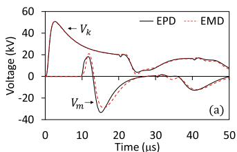

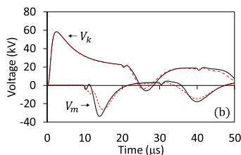  
Fig. 8. Lightning-induced voltages calculated at the top fence conductor for case G assuming (a) d = 2 m and (b) d = 20 m.

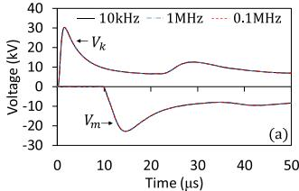

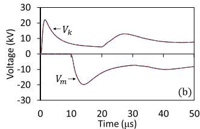

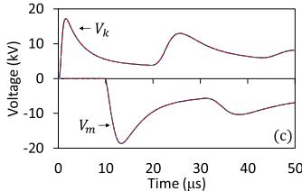

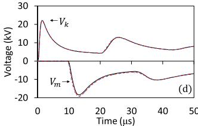

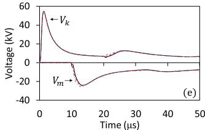

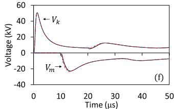

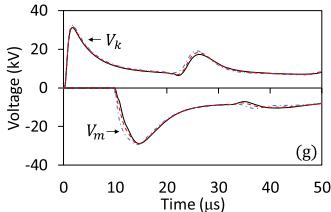

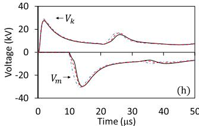  
Fig. 9. Lightning-induced voltages on phase A of line 1 or circuit 1 calculated with the EMD model assuming a real transformation matrix determined at three different frequencies for cases (a) A, (b) B, (c) C, (d) D, (e) E, (f) F, (g) G assuming d = 2 m, and (h) G assuming d = 20 m.

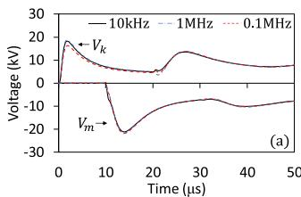

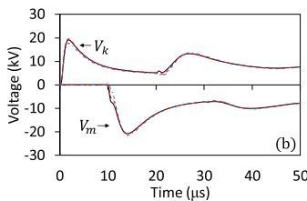  
Fig. 10. Lightning-induced voltages calculated for case E for the circuit 2 on the (a) messenger and (b) phase B.

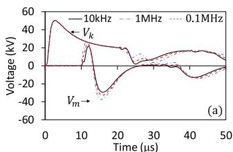

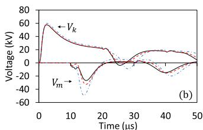  
Fig. 11. Lightning-induced voltages calculated at the top fence conductor for case G assuming (a) d = 2 m and (b) d = 20 m.

# 4.3. Influence of the fitting method

The results presented in the previous sections indicate that the EMD model can be accurately used for the calculation of lightning-induced voltages on configurations A, B, C, D, and F. For cases E and ${ \bf G } ,$ a greater sensitivity is observed on the frequency selected for the transformation matrix and, as a consequence, the application of the EMD

model must be viewed with caution. In the simulations, no restrictions were imposed on the nature of the poles and residues to be used in the model, which could be either real, complex or both. However, Marti’s model available in ATP deals with real poles only. For this reason, it is important to evaluate whether the accuracy of the EMD model is affected when only real poles and residues are used. In this section, two different fitting methods are considered with this purpose. The first is the vector fitting method assuming that only real poles can be used, called “VF (real)”, and the second is the built-in fitting tool available at ATP, based on Bode’s asymptotic method [9], referred to as “Bode”. In both cases, the independent current sources of the EMD model were calculated in MATLAB and were coupled with Marti’s transmission line model available in ATP. The results are compared with those obtained with the vector fitting technique considering complex poles, referred to as “VF”, which were obtained in MATLAB and are used as a reference.

Fig. 12 illustrates lightning-induced voltages calculated with the EMD model considering the three different fitting methods. An apparent loss of accuracy is observed when real poles are used. In any case, this loss of accuracy is not very critical for cases A-F when real poles calculated with the vector fitting technique are used [case VF(real)], especially if first peak values are considered.

If the built-in fitting tool available in ATP is used to determine the real poles required both in the EMD model and in the line simulated with Marti’s model (case labeled as “Bode”), the deviations are very significant. In fact, for case D the fitting algorithm in ATP did not even converge. Such difficulties with ATP’s fitting method are similar to those indicated in [11] for the calculation of lightning-induced voltages on a single-circuit compact distribution line with the EMD model.

The results obtained for case G, shown in Fig. 12(g) and (h), are even more sensitive to the fitting method, which means that using real poles is

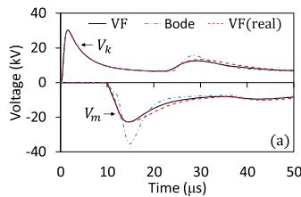

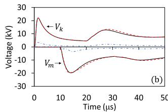

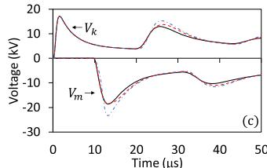

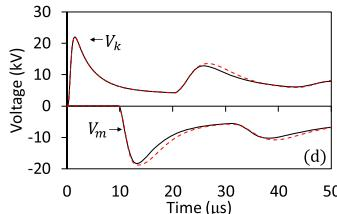

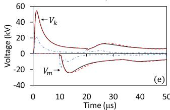

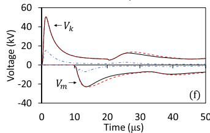

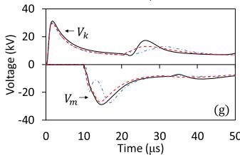

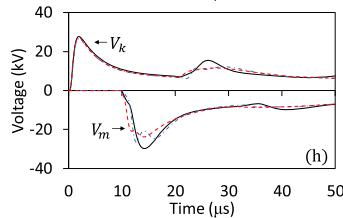  
Fig. 12. Lightning-induced voltages on phase A of line 1 or circuit 1 calculated with the EMD model assuming three different fitting methods for cases (a) A, (b) B, (c) C, (d) D, (e) E, (f) F, (g) G assuming d = 2 m, and (h) G assuming d = 20 m.

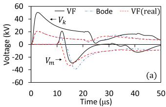

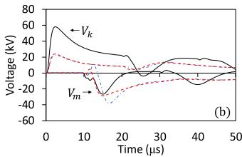  
Fig. 13. Lightning-induced voltages calculated at the top fence conductor for case G considering different fitting methods (a) d = 2 m and (b) d = 20 m.

not recommended in this case. This is confirmed if the voltages calculated on the top fence conductor are compared for the different fitting methods, as shown in Fig. 13.

# 5. Conclusions

The results indicate that the EMD model is sufficiently accurate for the calculation of lightning-induced voltages on most of the parallel and double-circuit distribution lines investigated in this paper, even if some of the tested conductor configurations are strongly asymmetric. For the different line configurations studied in cases A, B, C, D, and F, the response of the EMD model is minimally affected by the frequency of calculation of the transformation matrix. Only in two of the tested cases, namely cases E and G (especially the latter), the EMD model ultimately fail. This happens because in both cases the transformation matrix cannot be considered strictly real and constant. The analyses show that for the parallel and double-circuit lines considered in this paper it is recommended to use complex poles in the fitting of the model parameters for best accuracy. Also, results obtained using Bode’s asymptotic method were seen to be inaccurate in all cases. Overall, it can be concluded that the EMD model can be potentially used in the investigation of lightning-induced voltages on most MV lines of practical interest as long as proper care is taken in the fitting of the model parameters. As the EMD model is independent of the terminal conditions of the line [8], similar conclusions are expected if the model is used for calculating lightning-induced voltages on more realistic distribution networks involving laterals, surge arresters and transformers.

# CRediT authorship contribution statement

Osis E.S. Leal: Conceptualization, Methodology, Software, Formal analysis, Writing - original draft, Visualization. Alberto De Conti: Conceptualization, Methodology, Formal analysis, Writing - original draft, Visualization, Supervision, Funding acquisition.

# Declaration of Competing Interest

The authors declare that they have no known competing financial interests or personal relationshipsthat could have appeared to influence the work reported in this paper.

# References

[1] C.R. Paul, A SPICE model for multiconductor transmission lines excited by an incident electromagnetic field, IEEE Trans. Electromagn. Compat. 36 (4) (1994) 342–354.   
[2] H.K. Høidalen, Analytical formulation of lightning-induced voltages on multiconductor overhead lines above lossy ground, IEEE Trans. Electromagn. Compat. 45 (1) (2003) 92–100.   
[3] A. De Conti, S. Visacro, Calculation of lightning-induced voltages on low-voltage distribution networks, in: Proceedings of the VIII International Symposium on Lightning Protection SIPDA, Sao ˜ Paulo, 2005.   
[4] A. Borghetti, J.A. Gutierrez, C.A. Nucci, M. Paolone, E. Petrache, F. Rachidi, Lightning-induced voltages on complex distribution systems: models, advanced software tools and experimental validation, J. Electrostat. 60 (2–4) (2004) 163–174.   
[5] M. Brignone, F. Delfino, R. Procopio, M. Rossi, F. Rachidi, Evaluation of power system lightning performance – part I: model and numerical solution using the PSCAD-EMTDC platform, IEEE Trans. Electromagn. Compat. 59 (1) (2017) 137–145.   
[6] A. De Conti, O.E.S. Leal, Time-domain procedures for lightning-induced voltage calculation in electromagnetic transient simulators, IEEE Trans. Power Deliv. 36 (1) (2021) 397–405, in press.   
[7] A. Morched, B. Gustavsen, M. Tartibi, A universal model for accurate calculation of electromagnetic transients on overhead lines and underground cables, IEEE Trans. Power Deliv. 14 (3) (1999) 1032–1038.   
[8] O.E.S. Leal, A. De Conti, Compact matrix formulation for calculating lightninginduced voltages on electromagnetic transient simulators, IEEE Trans. Power Deliv. (2020), https://doi.org/10.1109/TPWRD.2020.2982306 in press.   
[9] J.R. Marti, Accurate modelling of frequency-dependent transmission lines in electromagnetic transient simulations, IEEE Trans. Power Appar. Syst. PAS-101 (1) (1982) 147–157.   
[10] A. Tavighi, J.R. Martí, J.A.G. Robles, Comparison of the fdLine and ULM frequency dependent EMTP line models with a reference laplace solution, in: Proceedings of the International Conference Power Systems Transients, Cavtat, Croatia, 2015, pp. 1–8.   
[11] A. De Conti, O.E.S. Leal, A.C. Silva, Lightning-induced voltage analysis on a threephase compact distribution line considering different line models, Electr. Power Syst. Res. 187 (106429) (2020) 1–7.   
[12] C.R. Paul, Analysis of Multiconductor Transmission Lines, 2nd ed., John Wiley & Sons, New Jersey, 2007.   
[13] J.R. Carson, Wave propagation in overhead wires with ground return, Bell Syst. Tech. J. 5 (4) (1926) 539–554.   
[14] E.D. Sunde, Earth Conduction Effects in Transmission Systems, Dover Publications, New York, 1968.   
[15] C.F. Barbosa, J.O.S. Paulino, An approximate time-domain formula for the calculation of the horizontal electric field from lightning, IEEE Trans. Electromagn. Compat. 49 (3) (2007) 593–601.   
[16] C.F. Barbosa, J.O.S. Paulino, Time-domain analysis of rocket-triggered lightninginduced surges on an overhead line, IEEE Trans. Electromagn. Compat. 51 (3) (2009) 725–732.   
[17] C.F. Barbosa, J.O.S. Paulino, A time-domain formula for the horizontal electric field at the earth surface in the vicinity of lightning, IEEE Trans. Electromagn. Compat. 52 (3) (2010) 403–426.   
[18] V.A. Rakov, M.A. Uman, Review and evaluation of lightning return stroke models including some aspects of their application, IEEE Trans. Electromagn. Compat 40 (4) (1998) 403–426.   
[19] A. De Conti, S. Visacro, Analytical representation of single- and double-peaked lightning current waveforms, IEEE Trans. Electromagn. Compat. 49 (2) (2007) 448–451.   
[20] A. Borghetti, G.M. Ferraz, F. Napolitano, C.A. Nucci, A. Piantini, F. Tossani, Lightning protection of a compact MV power line sharing the same poles of a HV line, in: Proceedings of the 34th International Conference on Lightning Protection, Rzeszow, 2018, pp. 1–7.   
[21] F. Napolitano, A. Borghetti, C.A. Nucci, M. Paolone, F. Rachidi, J. Mahseredjian, An advanced interface between the LIOV code and the EMTP-RV, in: Proceedings of the 29th International Conference on Lightning Protection, Sweden, 2008, pp. 6b-6-1-6b-6-12.   
[22] F. Napolitano, D. Messori, A. Borghetti, C.A. Nucci, G. Lopes, M. Martinez, J. Uchoa, Assessment of the lightning performance of compact overhead distribution lines, IEEJ Trans. Power Energy 133 (12) (2013) 1–7.