# A Flux-Defined PMSM Model Based on FEA Results for Real-Time EMT Simulation

Dong Li a,* , Ali B. Dehkordi a,b , Yi Zhang a,b

a RTDS Technologies Inc., Winnipeg, Canada   
b University of Manitoba, Winnipeg, Canada

# A R T I C L E I N F O

Keywords:

Finite element analysis

Look-up table

Permanent magnet synchronous machine

Reduced-order-model

Real time simulation

# A B S T R A C T

To expedite the PMSM design and test process, high-fidelity PMSM model derived from Finite Element Analysis (FEA) has been studied by many researchers. This paper proposed a new approach to calculate derivatives of currents with flux linkage data, which does not require taking hours to inverse the data table. Detailed mathematical proof is reported, based on which the implementation is explained, including presenting an efficient trilinear interpolation method. Simulation stability issue in the extrapolated range is also discussed and a solution is provided. The proposed method was implemented on RTDS hardware and can run in real time with the simulation time step of less than 1 µs. The test results of the proposed model are compared with FEA and conventional lumped-parameter PMSM model. An EV powertrain test case is also used to demonstrate the new model.

# 1. Introduction

Permanent Magnet Synchronous Machines (PMSM) are widely used in various industries, due to efficiency, power density, precision, and reliability in electromechanical systems.

The inherent characteristics of magnet form, stator winding geometry, and the variable air gap length in a PMSM can lead to notable spatial harmonics, potentially influencing the machine’s performance, efficiency, and noise characteristics. In certain applications like EV powertrains, it’s crucial to take into account the impact of spatial harmonics due to their potential effects on the performance and even control behaviors [1–3]. To study the PMSM high-frequency transients, especially when interaction with power electronics and machine nonlinearity are involved, Electromagnetic Transients (EMT) type simulation is essential. However, most conventional PMSM models used in EMT simulations are lumped parameter models which ignore the effect of spatial harmonics [2]. As a result, the potential influence of spatial harmonics would be omitted in the simulation study.

On the other hand, Finite Element Method tools are widely used in machine design, due to their ability to analyze complex geometries and materials with high precision. Given a machine 2d or 3d design and

excitation, Finite Element Analysis (FEA) tools can generate accurate flux distribution and torque due to any instantaneous condition, which naturally considers spatial harmonics, cogging torques and saturation effects [4–6]. However, the computation cost of FEA is heavy, thus this method is not commonly used in EMT simulation.

To take advantage of high accuracy of FEA and apply it into EMT type simulation, one way is to use co-simulation by interfacing an FEA tool and an EMT circuit simulator. However, the co-simulation is usually computationally heavy and is not suitable for real-time simulation. Authors in [7] implemented real time FEA based on additional FPGA hardware, where interfacing the FEA model with the rest of network becomes challenging. Another approach is to use FEA-based Reduced-Order-Models (ROMs) [8,9]. By using pre-computed FEA sweeping tabular data, it is possible to run a model, like PMSM, in EMT study with level of accuracy close to FEA, in a computation-cost friendly manner, even possible in real time. The accuracy depends on the granularity of the pre-computed FEA tabular data. Such model would be especially useful in control design including Hardware-In-the-Loop (HIL) studies, which has become a typical procedure in developing EV powertrain [10, 11].

With such a PMSM model that runs in real time and utilizes data

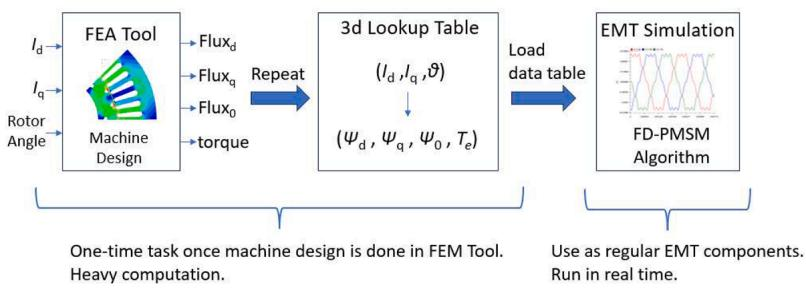  
Fig. 1. The process of using FEA results in the proposed FD-PMSM model.

generated from FEA design, the drivetrain design process can be significantly simplified. While the conventional PMSM model relying on lumped parameters obtained from test measurements and estimations of a real machine, the PMSM model derived from the FEA design could be tested with real control hardware, and accurately includes spatial harmonics, cogging torque and saturation effects without manufacturing the machine. In this way, the motor design, motor drive design, testing and optimization processes can be integrated [12].

Authors in [2] introduced the classic constant dq inductance PMSM model for real time simulation, where saturation and spatial harmonics are not included. Authors in [9] and [13] included saturation and slotting effects by using Look-Up Tables (LUTs) of pre-stored inductance matrices and excitation fluxes from a previous FEA. Authors in [2] and [14] proposed an efficient inductance-based model without storing the whole table but the harmonics of inductances up to a certain order. Instead of inductance matrix, in some research, LUTs of flux-linkages are used for the PMSM model [8,15–17]. The flux-based model considers combined permanent flux linkage and stator-generated flux linkage naturally, instead of self and mutual inductances, which means less LUT data to be stored, and could provide better numerical stability in step-based simulation [15,16]. Methods in [8,15–17] are all implemented based on inverting the current-flux correlation, which firstly use the voltage and current from last time step to update the flux linkage, then use the flux linkage to search for the corresponding currents. However, to inverse the LUT, iterative methods like interior point method will be used, which could take hours to build the inversed LUT

[17].

In this paper, a Flux-Defined PMSM (FD-PMSM) model is introduced and implemented on a real-time simulator hardware platform. Instead of inverting the LUTs to have a flux – current correlation, this paper utilized a different approach which solves the derivative of currents first to form a current – flux – current derivative correlation, which can save hours of time building the inversed LUT. This paper also provides details on implementing the proposed method including a trilinear interpolation and an extrapolation method to maximize the efficiency for real time simulation. Fig. 1 shows the process of using FEA results in the proposed FD-PMSM model. The procedure also applies to some research work in the literature review but may with different LUT format and EMT algorithm.

# 2. Tabular data from finite element analysis

FEA tools can use highly accurate finite element methods to solve electromagnetic and electric fields. As shown in the first box in Fig. 1, for a given set of excitation currents (d-axis and q-axis currents) and rotor position for a PMSM, FEA can compute the flux distribution and torque. The flux result can be stored in the format of dq0 fluxes. By gradually changing $i _ { d } , i _ { q }$ and rotor position, then performing FEA and store the corresponding dq0 fluxes and torque result for each combination, a 3d lookup table can be generated, which then can be used for EMT simulation. The index of the lookup table would be $i _ { d } , i _ { q }$ and rotor position θ. The output of the lookup table would be $\varphi _ { d } , \varphi _ { q } ,$ φ0 and $T _ { e } ,$ .

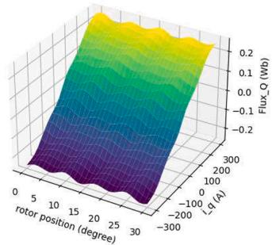

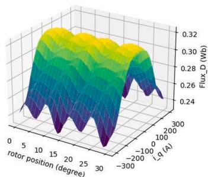

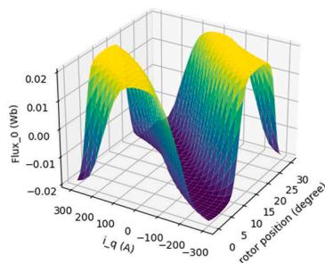

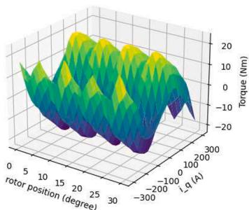  
  
Fig. 2. Plots versus $i _ { q }$ and rotor position, with $i _ { d }$ fixed, (a) q-axis flux, (b) d-axis flux, (c) zero-sequence flux, (d) torque.

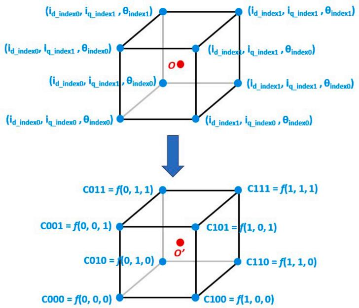  
Fig. 3. Coordinate transformation for simplifying trilinear interpolation.

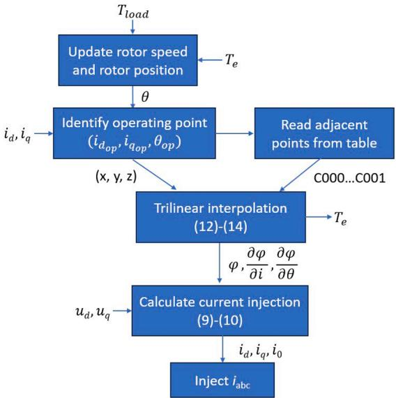  
Fig. 4. Flow chart of FD-PMSM EMT model.

The current and rotor position sweeping can be achieved by using script with FEA tools. Some commercial FEA software also provides built-in sweeping functions, e.g. Ansys Maxwell.

While the PMSM is rotational symmetry, it is not necessary to perform rotor angle sweeping on 360 degrees. For a three-phase one pole pair machine, 120 degrees sweeping would be sufficient. For PMSM with multiple pole pairs, $\frac { 1 2 0 } { p }$ degrees would be sufficient, where p is number of pole pairs. With more slots and phases, an even smaller range could be used. Without sweeping the whole 360 degrees, the size of the tabular data can then be significantly reduced.

In the example used in this paper in the later sections, the number of pole pairs is 2 and the $i _ { d } , i _ { q }$ and rotor position indexes used are,

$$
\left\{ \begin{array}{l} i _ {d \_ i n d e x} = [ - 1 5 0, - 1 2 0, - 9 0 \dots 1 2 0, 1 5 0 ] (A m p) \\ i _ {q \_ i n d e x} = [ - 1 5 0, - 1 2 0, - 9 0 \dots 1 2 0, 1 5 0 ] (A m p) \\ \theta_ {i n d e x} = [ 0, 1, 2, 3, 4 \dots 5 7, 5 8, 5 9, 6 0 ] (\text {d e g r e e}) \end{array} \right. \tag {1}
$$

Since $i _ { d \_ i n d e x }$ and $i _ { q \_ i n d e x }$ contains 11 elements and $\theta _ { i n d e x }$ contains 61

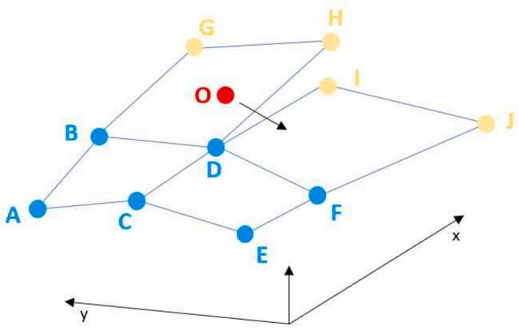

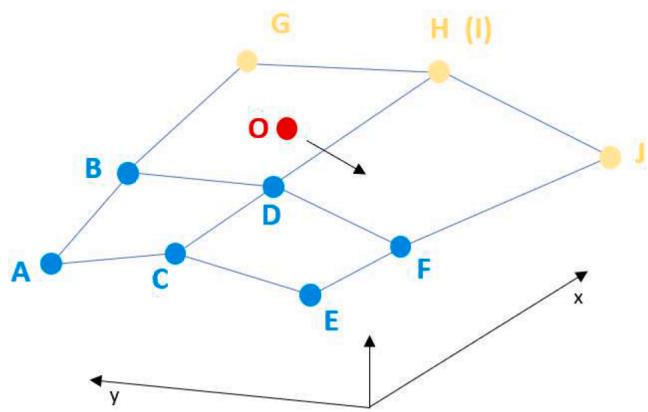  
(a)   
(b)   
Fig. 5. 2d demonstration of extrapolation methods (a) Simple extrapolation, (b) pre-smoothed extrapolation.

elements, the tabular data will have $1 1 \times 1 1 \times 6 1 = 7 3 8 1$ records, and each record contains corresponding values of $\varphi _ { d } , \varphi _ { q } , \varphi _ { 0 }$ and $T _ { e } .$ . It also means - to generate this data table, the FEA tool needs to run over 7381

Table 1 PMSM Parameters in Simulation Verification.   

<table><tr><td>PMSM Number of pole pairs</td><td>2</td></tr><tr><td>PMSM LUT Id Iq index interval</td><td>30 A</td></tr><tr><td>PMSM Number of Id or Iq intervals</td><td>10</td></tr><tr><td>PMSM LUT rotor position index interval</td><td>1 degree</td></tr><tr><td>PMSM Number of rotor position intervals</td><td>60</td></tr><tr><td>Ideal velocity source speed</td><td>1000 rad/s</td></tr><tr><td>Simulation time step</td><td>1.5 μs</td></tr></table>

variations. Each run in FEA tool would take around 1 - 2 s for computation (2-d design, 988 mesh element), which gives a general idea on the computation cost of FEA.

It is important to note that higher data granularity generally leads to more accurate results but comes at the cost of increased FEA computation and larger LUT storage. However, as long as the current intervals are small enough to accurately capture saturation effects and the angle intervals are fine enough to clearly reflect spatial harmonics, the data granularity is considered sufficient. Fig. 2 shows some plots taken from the data table generated by FEA tool. It is clear to see that with current interval of 30 A and angle interval of 1 degree, both the spatial harmonics and saturation effects can be modeled smoothly.

# 3. FD-PMSM mathematical model

A PMSM can be described by the following equations: flux equation, voltage equation, torque equation and rotor motion Eq. (2) - (5) [8,18].

$\operatorname { E q . }$ (2) is the flux equation, where $\varphi _ { d }$ and $\varphi _ { q }$ are flux linkages of daxis and q-axis respectively; $i _ { d }$ and $i _ { q }$ are stator d-axis current and q-axis

current respectively; $L _ { d }$ and $L _ { q }$ are d-axis and q-axis equivalent inductance respectively; $\varphi _ { f }$ is the permeant magnet strength.

$$
\left\{ \begin{array}{c} \varphi_ {d} = L _ {d} i _ {d} + \varphi_ {f} \\ \varphi_ {q} = L _ {q} i _ {q} \end{array} \right. \tag {2}
$$

Stator voltage equations are shown in (3). Here, $u _ { d }$ and $u _ { q }$ are stator d-axis voltage and q-axis voltage respectively; $R _ { s }$ is stator resistance; ωe is the electric angular speed.

$$
\left\{ \begin{array}{l} u _ {d} = R _ {s} i _ {d} + \frac {d \varphi_ {d}}{d t} - \omega_ {e} \varphi_ {q} \\ u _ {q} = R _ {s} i _ {q} + \frac {d \varphi_ {q}}{d t} + \omega_ {e} \varphi_ {d} \end{array} \right. \tag {3}
$$

Torque equation is shown in (4), where $T _ { e }$ is the electric torque and p is number of pole pairs.

$$
T _ {e} = 1. 5 p \left[ \varphi_ {f} i _ {q} + \left(L _ {d} - L _ {q}\right) i _ {d} i _ {q} \right] \tag {4}
$$

Rotor motion equation is shown in (5), which describes the mechanical behavior of the rotor, where J is the inertia; D is the damping factor; $T _ { l o a d }$ is the load torque.

$$
\frac {1}{p} \frac {d \omega_ {e}}{d t} = \frac {1}{J} \left(T _ {e} - \frac {D}{p} \omega_ {e} - T _ {\text {l o a d}}\right) \tag {5}
$$

# 3.1. Conventional PMSM model

If lumped parameters $L _ { d } , L _ { q }$ and $\varphi _ { f }$ are considered to be constants, ideal lumped-parameter PMSM model can be simply modeled based on Eq. (2) - (5). If the saturation effect is considered, $L _ { d } , L _ { q }$ and $\varphi _ { f }$ become

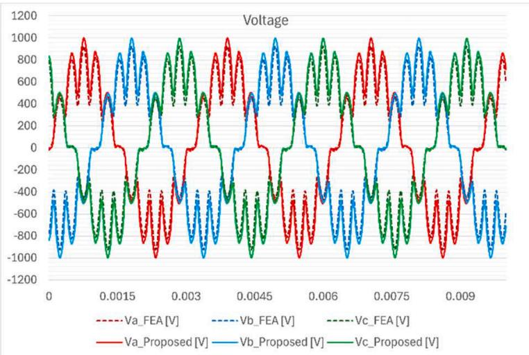

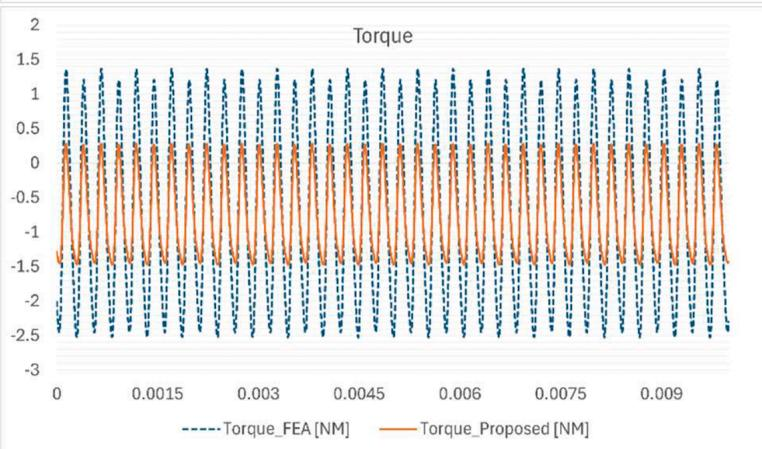  
Fig. 6. Benchmark with FEA tool - OC voltage and torque of the machine (1000 Ω line-to-ground resistors at machine terminal).

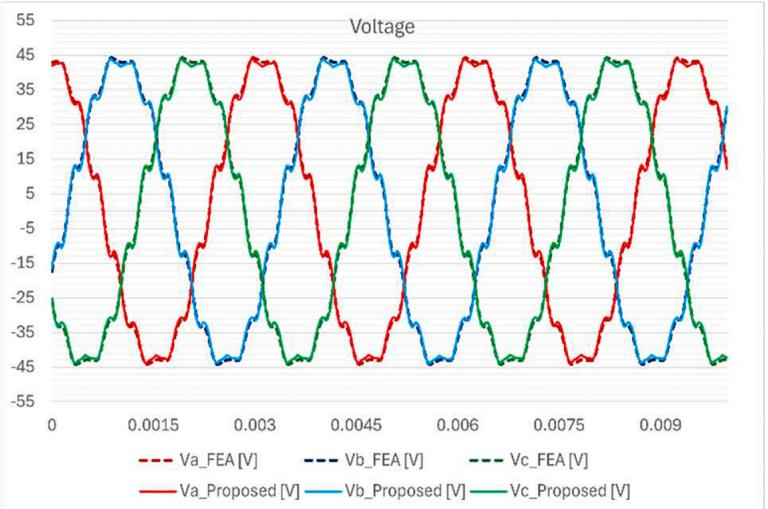

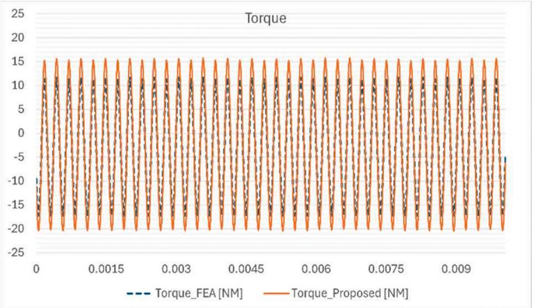  
Fig. 7. Benchmark with FEA tool - SC voltage and torque of the machine (1 Ω line-to-ground resistors at machine terminal).

functions of $i _ { d }$ and $i _ { q } .$

# 3.2. Proposed Flux-Defined PMSM model

When considering spatial harmonics, dq transformation no longer decouple machine equations like (2). In the proposed Flux-Defined PMSM, instead of using $L _ { d } , L _ { q }$ and $\varphi _ { f }$ to calculate flux and torque with $\operatorname { E q . } \ ( 2 )$ and (4), direct accurate values of $\varphi _ { d } , \varphi _ { q }$ and $T _ { e }$ can be found in the LUTs generated by FEA. While considering spatial harmonics, $\varphi _ { d } , \varphi _ { q }$ and $T _ { e }$ are functions of $i _ { d } , i _ { q }$ and rotor position θ. Rotor position θ has the following relationship with the electric angular speed.

$$
\omega_ {e} = p \frac {d \theta}{d t} \tag {6}
$$

To solve the current derivatives first, rewrite Eq. (3):

$$
\left\{ \begin{array}{l} u _ {d} = R _ {s} i _ {d} + \frac {d \varphi_ {d} \left(i _ {d} , i _ {q} , \theta\right)}{d t} - \omega_ {e} \varphi_ {q} \left(i _ {d}, i _ {q}, \theta\right) \\ u _ {q} = R _ {s} i _ {q} + \frac {d \varphi_ {q} \left(i _ {d} , i _ {q} , \theta\right)}{d t} + \omega_ {e} \varphi_ {d} \left(i _ {d}, i _ {q}, \theta\right) \end{array} \right. \tag {7}
$$

Apply total derivative to (7):

$$
\left\{ \begin{array}{l} u _ {d} = R _ {s} i _ {d} + \frac {\partial \varphi_ {d}}{\partial i _ {d}} \frac {d i _ {d}}{d t} + \frac {\partial \varphi_ {d}}{\partial i _ {q}} \frac {d i _ {q}}{d t} + \frac {\partial \varphi_ {d}}{\partial \theta} \frac {d \theta}{d t} - \omega_ {e} \varphi_ {q} \\ u _ {q} = R _ {s} i _ {q} + \frac {\partial \varphi_ {q}}{\partial i _ {d}} \frac {d i _ {d}}{d t} + \frac {\partial \varphi_ {q}}{\partial i _ {q}} \frac {d i _ {q}}{d t} + \frac {\partial \varphi_ {q}}{\partial \theta} \frac {d \theta}{d t} + \omega_ {e} \varphi_ {d} \end{array} \right. \tag {8}
$$

Replace $\frac { d \theta } { d t }$ in (8) with 1pωe:

$$
\left\{ \begin{array}{l} u _ {d} = R _ {s} i _ {d} + \frac {\partial \varphi_ {d}}{\partial i _ {d}} \frac {d i _ {d}}{d t} + \frac {\partial \varphi_ {d}}{\partial i _ {q}} \frac {d i _ {q}}{d t} + \omega_ {e} \left(\frac {1}{p} \frac {\partial \varphi_ {d}}{\partial \theta} - \varphi_ {q}\right) \\ u _ {q} = R _ {s} i _ {q} + \frac {\partial \varphi_ {q}}{\partial i _ {d}} \frac {d i _ {d}}{d t} + \frac {\partial \varphi_ {q}}{\partial i _ {q}} \frac {d i _ {q}}{d t} + \omega_ {e} \left(\frac {1}{p} \frac {\partial \varphi_ {q}}{\partial \theta} + \varphi_ {d}\right) \end{array} \right. \tag {9}
$$

The φ , φ , ∂φ $\varphi _ { d } , \varphi _ { q } , \frac { \partial \varphi } { \partial i }$ and $\frac { \partial \varphi } { \partial \theta }$ terms in (9) all can be obtained from tabular data pre-generated by FEA tools with certain interpolation methods. While value of $i _ { d }$ and $i _ { q }$ from the last time step can be used, $\operatorname { E q } .$ . (9) becomes a function of $\frac { d i _ { d } } { d t }$ and $\frac { d i _ { q } } { d t }$ . With $\frac { d i _ { d } } { d t }$ and $\frac { d i _ { q } } { d t }$ solved from (9), current injection into the machine terminal in each time step can then be calculated.

To consider the effect of zero sequence, similarly, Eq. (10) can be derived. While $\frac { d i _ { d } } { d t }$ dt id and d $\frac { d i _ { q } } { d t }$ are solved by (9), $i _ { 0 }$ can be simply calculated by solving Eq. (10).

$$
u _ {0} = R _ {s} i _ {0} + \frac {\partial \varphi_ {0}}{\partial i _ {d}} \frac {d i _ {d}}{d t} + \frac {\partial \varphi_ {q}}{\partial i _ {q}} \frac {d i _ {q}}{d t} + \frac {\omega_ {e}}{p} \frac {\partial \varphi_ {0}}{\partial \theta} \tag {10}
$$

# 4. Trilinear interpolation of tabular data

To implement the algorithm introduced in section III, we need to obtain the $\begin{array} { r } { \varphi , \frac { \partial \varphi } { \partial i } , \frac { \partial \varphi } { \partial \theta } } \end{array}$ and $T _ { e }$ values from the tabular data generated from Thus, interpolation is necessary for correctly implementing the proposed model.

While the lookup table has indexes on three dimensions $\boldsymbol { \cdot } \dot { \iota } _ { d } , \dot { \iota } _ { q }$ and rotor position, 3d interpolation should be carried out. For a given operating point $O = \left( i _ { d _ { - } o p } , i _ { q _ { - } o p } , \theta _ { o p } \right)$ , assume:

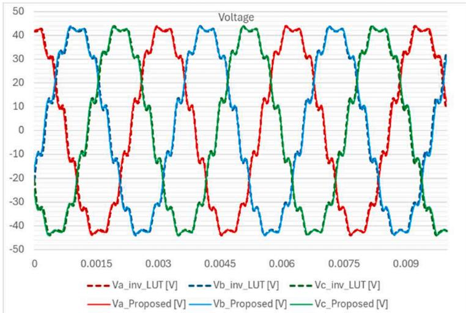

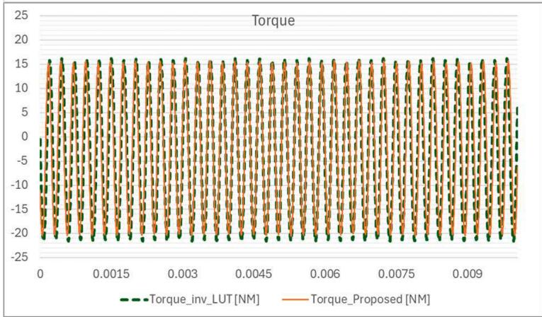  
Fig. 8. Benchmark with model using inverted LUT - SC voltage and torque of the machine (1 Ω line-to-ground resistors at machine terminal).

$$
\left\{ \begin{array}{c} i _ {d - i n d e x 0} <   i _ {d - o p} <   i _ {d - i n d e x 1} \\ i _ {q - i n d e x 0} <   i _ {q - o p} <   i _ {q - i n d e x 1} \\ \theta_ {i n d e x 0} <   \theta_ {o p} <   \theta_ {i n d e x 1} \end{array} \right. \tag {11}
$$

Where $i _ { \mathrm { d . i n d e x } \ 0 }$ and $i _ { \mathrm { d \_ i n d e x \ 1 } }$ are consecutive elements belonging to i $_ { i n d e x }$ in (1) and similarly for $i _ { q \_ i n d e x }$ and $\theta _ { i n d e x }$ . The position of point O and the adjacent tabular data points are shown in Fig. 3 top.

The original $i _ { d }$ and $i _ { q }$ index increment is 30A, rotor position index increment is 1 degree as given in (1). To simplify the computation, firstly we need to scale the index increment to 1 and align the lower index to 0. With a linear coordinate transformation, the operating point under new coordinate would be,

$$
O ^ {\prime} = \left(\frac {i _ {d - o p} - i _ {d - i n d e x 0}}{i _ {d - i n d e x 1} - i _ {d - i n d e x 0}}, \frac {i _ {q - o p} - i _ {q - i n d e x 0}}{i _ {q - i n d e x 1} - i _ {q - i n d e x 0}}, \frac {\theta_ {o p} - \theta_ {i n d e x 0}}{\theta_ {i n d e x 1} - \theta_ {i n d e x 0}}\right) = (x, y, z) \tag {12}
$$

While (11) is true, $0 < x < 1 , 0 < y < 1$ and $0 < z < 1$ . Same transformation is also done on the eight vertices. O and the vertices in the new coordinate are shown in Fig. 3 bottom.

Since the value corresponds to the vertices, C000…C111 are known, which can be read from the lookup table, interpolated value of point Oʹ or O can be calculated using the trilinear interpolation equation,

$$
\begin{array}{l} f (O ^ {\prime}) = C 0 0 0 (1 - x) (1 - y) (1 - z) + C 1 0 0 (x) (1 - y) (1 - z) \\ + C 0 1 0 (1 - x) (y) (1 - z) + C 0 0 1 (1 - x) (1 - y) (z) (13) \\ + C 1 0 1 (x) (1 - y) (z) + C 0 1 1 (1 - x) (y) (z) (13) \\ + C 1 1 0 (x) (y) (1 - z) + C 1 1 1 (x) (y) (z) \\ \end{array}
$$

For the derivative terms,

$$
\begin{array}{l} \frac {\partial f (O ^ {\prime})}{\partial x} = C 0 0 0 (- 1) (1 - y) (1 - z) + C 1 0 0 (1) (1 - y) (1 - z) \\ + C 0 1 0 (- 1) (y) (1 - z) + C 0 0 1 (- 1) (1 - y) (z) \\ + C 1 0 1 (1) (1 - y) (z) + C 0 1 1 (- 1) (y) (z) \\ + C 1 1 0 (1) (y) (1 - z) + C 1 1 1 (1) (y) (z) \\ \end{array}
$$

$$
\begin{array}{l} \frac {\partial f (O ^ {\prime})}{\partial y} = C 0 0 0 (1 - x) (- 1) (1 - z) + C 1 0 0 (x) (- 1) (1 - z) \\ + C 0 1 0 (1 - x) (1) (1 - z) + C 0 0 1 (1 - x) (- 1) (z) \\ + C 1 0 1 (x) (- 1) (z) + C 0 1 1 (1 - x) (1) (z) \\ + C 1 1 0 (x) (1) (1 - z) + C 1 1 1 (x) (1) (z) \\ \end{array}
$$

$$
\begin{array}{l} \frac {\partial f (O ^ {\prime})}{\partial z} = C 0 0 0 (1 - x) (1 - y) (- 1) + C 1 0 0 (x) (1 - y) (- 1) \\ + C 0 1 0 (1 - x) (y) (- 1) + C 0 0 1 (1 - x) (1 - y) (1) \tag {14} \\ + C 1 0 1 (x) (1 - y) (1) + C 0 1 1 (1 - x) (y) (1) \\ + C 1 1 0 (x) (y) (- 1) + C 1 1 1 (x) (y) (1) \\ \end{array}
$$

It can be noticed that the calculations of derivative terms in (14) are actually simpler than calculating the interpolation in (13). The intermediate variables in calculating in (14) can be directly used in (13) to reduce computation cost.

Eq. (12)-(14) can be used on any type of table data - $\cdot \varphi _ { d } , \varphi _ { q } , \varphi _ { 0 }$ or $T _ { e } .$ . Thus, the interpolated values of $\varphi , { \frac { \partial \varphi } { \partial i } } , { \frac { \partial \varphi } { \partial \theta } }$ and $T _ { e }$ can be calculated from the FEA tabular data and then can be used for calculations in Eq. (9) and (10).

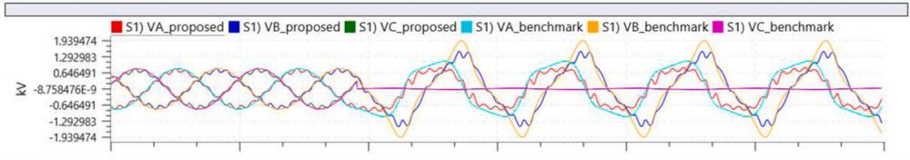

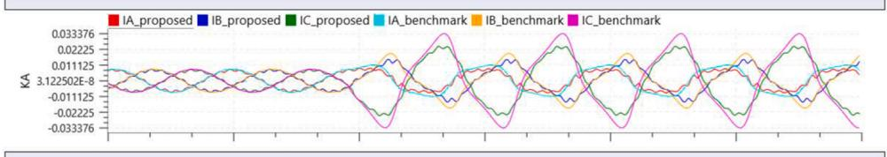

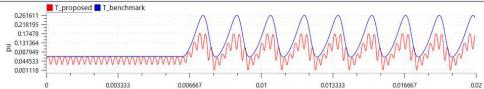  
Fig. 9. Waveforms showing transient of phase C load changing from 100 Ω to 1 Ω, where “proposed” is from proposed FD-PMSM model and “benchmark” is from the RSCAD regular PMSM model.

# 5. Flow chart of the EMT model

Fig. 4 shows the flow chart of implementing the proposed FD-PMSM in EMT simulation. The model is interfaced with the rest of the network as a controlled current source. To be noticed, the voltage $u _ { d }$ and $u _ { q }$ used for calculation is from the previous timestep. For stability purposes, the compensation approach described in [19] is used.

It can be seen from Fig. 4, compared to conventional lumped parameter PMSM model, the proposed model would require additional computation cost to perform data interpolation in each time step. With optimized algorithm mentioned in Section IV, the proposed model can still run in real time with less than 1 µs time step while keeping high fidelity including spatial harmonics and saturation effect.

# 6. Extrapolation of tabular data

Since the FEA data table has a limited size, it only contains data in the range specified by the sweeping range, for example, the indexes shown in (1). However, in an EMT simulation, inevitably, the currents may go beyond the specified range, especially when performing a transient test, e.g. fault tests. It is necessary for the proposed model to be able to run in an extrapolated range.

# 6.1. Issue of simple extrapolation

To perform a simple extrapolation, one can simply put operating point O in Fig. 3 out of the cube and do the same calculations using (13) and (14). By doing so, simple trilinear extrapolation would be done for operating point O outside the range specified in (1). However, the continuity of the data will be affected. For example, when $i _ { d }$ is out of the data range, the model is operating depending on extrapolated data on $i _ { d } .$ . The current $i _ { d }$ extrapolation is calculated based on vertices adjacent to current $i _ { q }$ and rotor angle (C000, C001… C111). If the other two index $( { \dot { \iota } } _ { q }$ or rotor angle) changes to the next interval, the extrapolation calculation will be based on a new set of vertex values, a large step change might occur on the extrapolated data and cause stability issues.

While the lookup table used by FD-PMSM is a 3d table, which is hard to be visualized, Fig. 5 uses a 2d plane to better demonstrate the issue mentioned above. In Fig. 5(a), surface ABCD and CDEF are formed by original data obtained from FEA. When the operating point goes out of table range on the x-axis direction, surface BDGH is extrapolated from

surface ABCD and surface DFIJ is extrapolated from surface CDEF. Because the extrapolations of ABCD and CDEF are independent, the boundary between the extrapolated surfaces BDGH and DFIJ becomes inconsistent. When the operating point crossing boarder DH/DI, stability issues might arise.

# 6.2. Pre-extrapolation

To overcome the stability issue mentioned above, a pre-extrapolation method is introduced to enable the FD-PMSM model to operate in a wider current range while keeping good stability. The process is done by pre-calculating the extrapolated data and expanding the original table with the extrapolated data; the EMT simulation still performs interpolation algorithm (13)-(14) even in the extrapolated range. The extrapolated data table index becomes (15), where extra data points are added as the lowest and highest indexes of i and $i _ { q } .$ In the implementation, the value of extp can be set to large enough (e.g. 106) to guarantee the range covers EMT test.

$$
\left\{ \begin{array}{c} i _ {d \_ i n d e x} = [ - e x t p, - 1 5 0, - 1 2 0 \dots 1 2 0, 1 5 0, e x t p ] (A m p) \\ i _ {q \_ i n d e x} = [ - e x t p, - 1 5 0, - 1 2 0 \dots 1 2 0, 1 5 0, e x t p ] (A m p) \\ \theta_ {i n d e x} = [ 0, 1, 2, 3, 4 \dots 5 7, 5 8, 5 9, 6 0 ] (\text {d e g r e e}) \end{array} \right. \tag {15}
$$

In Fig. 5(b), which shows the extrapolated plane of method B, the extrapolation is pre-calculated, and the boundary points which had confliction (H and I), are replaced by a single point with the average value. Thus, the extrapolated plane is still “smooth” and continuous. All the calculations are done prior to the EMT simulation, which would not add additional computation cost during running the simulation.

To be noticed, though, with proper extrapolation method, the model can be used when current goes beyond the original FEA sweeping range, the accuracy of the result in the extrapolated range cannot be guaranteed since the behavior is generated by linear extrapolation, which could be different from the actual behavior. It is the user’s due diligence to judge if the extrapolated result is acceptable or they need to re-generate the tubular data of a larger range.

# 7. Simulation results

# 7.1. Model verification

The proposed FD-PMSM model was implemented using RSCAD

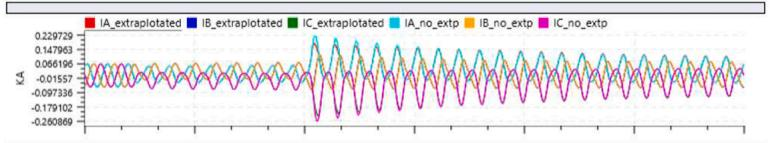

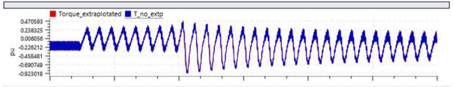

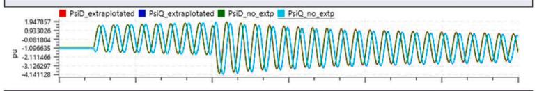

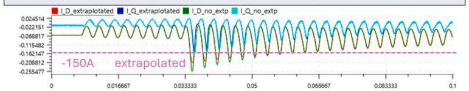  
(a)

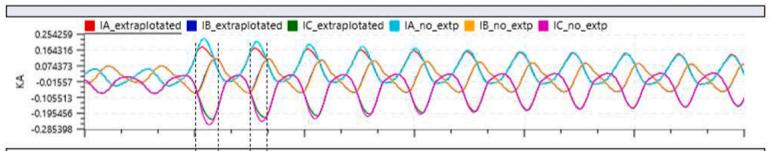

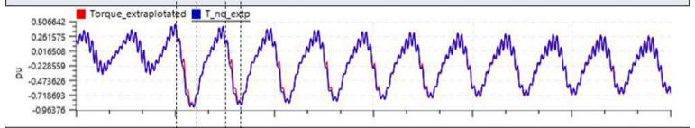

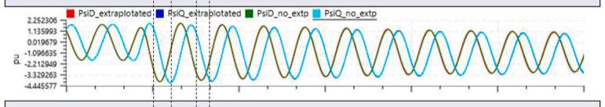

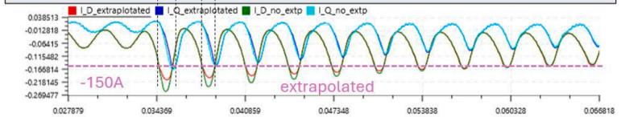  
(b)   
Fig. 10. Waveforms showing 0.025 s 3phase to ground fault at machine terminal, currents fall into extrapolation range when fault cleared, (a) full range of waveforms, (b) zoomed in waveforms around fault clearing (_extrapolated waveforms are from model using LUT data with ±150 A range, _no_extp waveforms are from model using LUT data with ±300 A range).

FX2.4 and runs on the RTDS Novacor 2.0 platform substep environment. The model can run in real time at lower than 1.0 µs timestep with a basic test circuit. In this section, simulation results are shown to demonstrate the accuracy and performance of the proposed model. Major parameters for the verification test are listed in Table 1.

Fig. 6 and Fig. 7 show the simulation result of proposed PMSM driven by an ideal velocity source in RTDS, benchmarked with Ansys/Maxwell FEA transient analysis result at nearly open circuit (1000 Ω line-toground resistors at machine terminal) and short circuit conditions (1 Ω line-to-ground resistors at machine terminal), respectively. The dashed lines are results from FEA and the solid lines are results from proposed model implemented in RTDS. The voltage waveforms with spatial harmonics are matched very well. Though, a little mismatch can be found on the size of torque ripple due to the linear interpolation method used in the proposed model, the root mean square value of torque still matches very well with the FEA benchmark.

The proposed model is then compared with the model based on inverting LUTs. Fig. 8 shows the benchmarking result. The waveforms of the proposed method and inverting LUT method are almost identical, since the data and adopted interpolation methods are the same. The computational cost of the two methods in each simulation time step are around the same since the major computation both still are on calculating the interpolation. The proposed method does not require inverting the LUTs and successfully maintains the same level of accuracy.

The model is also compared with the regular PMSM model _rtds_PD_PMSM_light provided in RSCAD, which adopts the phasedomain embedded modeling method explained in [2]. In this test, the PMSM is kept at constant speed; the neutral point of PMSM is grounded with a 100 Ω resistor; the output connects to a 3-phase balanced resistive load of 100 Ω. A transient of phase C load changing from 100 Ω to 1 Ω is tested. Fig. 9 shows the simulation results. The low-frequency behavior of voltages, currents and torques from the two model are matched very

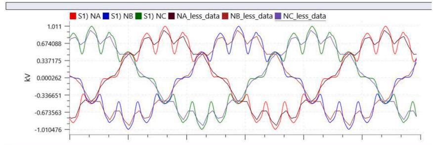

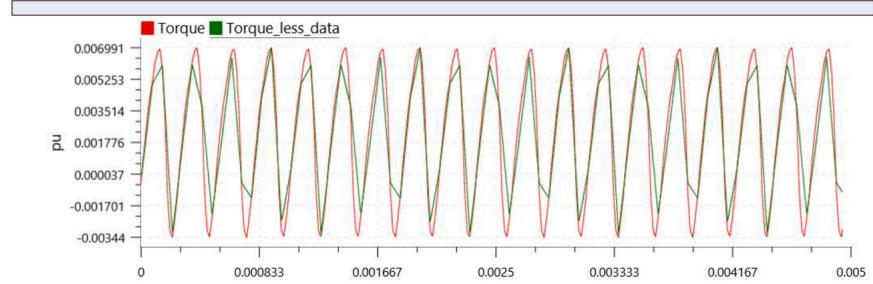  
Fig. 11. Waveforms showing open circuit simulation results when using high data granularity and low data granularity.

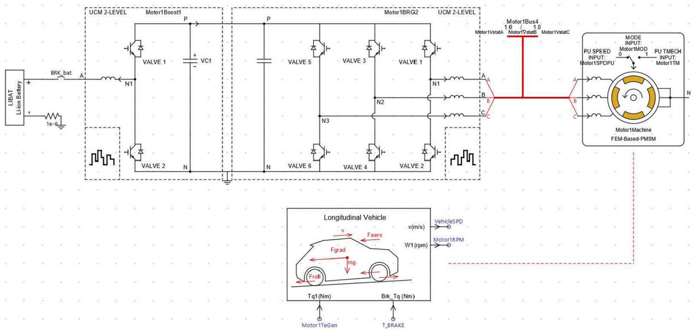  
Fig. 12. EV drivetrain simulation model in RSCAD.

well including the behavior of zero-sequence, while the proposed model contains more details including high order spatial harmonics and torque ripples.

To test the performance of the proposed model operating in the extrapolation range, a 0.025 s three-phase to ground fault was applied at the machine terminal while the PMSM being supplied by an ideal voltage source. When the fault is cleared, very large transient currents

Table 2 Parameters in Case Study.   

<table><tr><td>PMSM Number of pole pairs</td><td>4</td></tr><tr><td>PMSM LUT Id Iq index interval</td><td>30 A</td></tr><tr><td>PMSM LUT Number of Id or Iq intervals</td><td>20</td></tr><tr><td>PMSM LUT rotor position index interval</td><td>1 degree</td></tr><tr><td>PMSM LUT Number of rotor position intervals</td><td>30</td></tr><tr><td>Simulation time step</td><td>2.0 μs</td></tr><tr><td>Switching frequency of dc-dc stage</td><td>10 kHz</td></tr><tr><td>Switching frequency of dc-ac stage</td><td>10 kHz</td></tr><tr><td>Rated power of the EV powertrain</td><td>150 kW</td></tr><tr><td>Dc link voltage of the EV powertrain</td><td>1000 V</td></tr></table>

will occur. Fig. 10 shows both waveforms of the model using LUT data with ±150 A range and ±300 A range. The peak transient current would reach around 200–250 A. As a result, at the transient peaks, the model with ±150 A data would operate in the extrapolated range and the model with ±300 A data would operate normally without any extrapolation. Fig. 10(a) shows the simulation waveforms of three phase currents, electric torque, dq axis fluxes and dq axis currents and Fig. 10(b) shows waveforms zoomed in around the moment of fault clearing. It can be seen, when the $i _ { d }$ or $i _ { q }$ went into the extrapolation range, the waveforms are still very close to the one using larger size LUTs. Though a little mismatch can be observed due to extrapolation, the waveforms still show correct trends and overlay perfectly after getting back to normal range.

As mentioned earlier, the granularity of data stored in LUT would affect the accuracy of the proposed model. A test was also done to show the effect of data granularity. While the LUT data used for previous tests in this section, has a current interval of 30A and rotor position interval of 1 degree, Fig. 11 shows the comparison to the model using LUT data with current interval of 60A and rotor position interval of 4 degree.

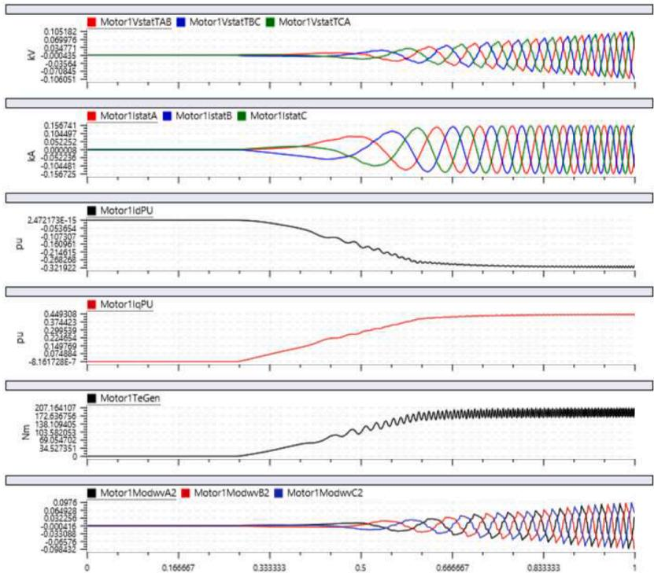  
Fig. 13. Waveforms of EV accelerating from static.

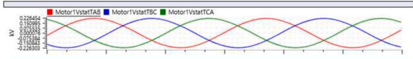

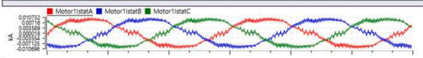

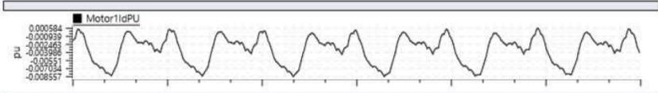

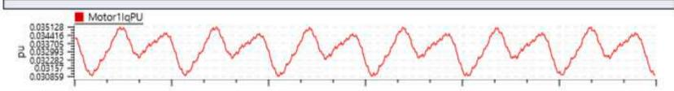

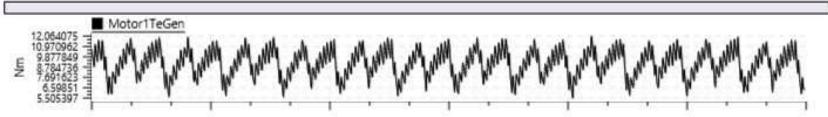

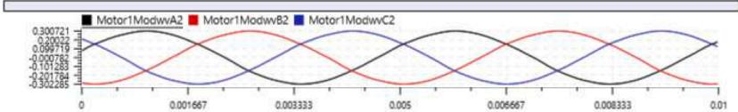  
Fig. 14. Waveforms of EV running at a steady speed.

# 7.2. EV case study

The model was tested with a full EV drivetrain system built with RSCAD. The main circuit is shown in Fig. 12 and the main parameters of the case are shown in Table 2. The control of the drivetrain utilizes the classic Field Oriented Control with Maximum Torque Per Amp logic.

Fig. 13 shows waveforms of EV accelerating from static. Fig. 14 shows waveforms of EV running at a steady speed of 50km/h. Relatively low frequency harmonics can be found on terminal voltages, currents, torque and modulation waveforms, which can greatly affect the performance of an EV powertrain. For example, the harmonics on the modulation waveform could cause unexpected overmodulation, the torque ripple should be considered when designing the torque control loop. This shows the necessity of modeling PMSM spatial harmonics in EMT simulation studies.

# 8. Conclusions

This paper introduced a Flux-Defined PMSM (FD-PMSM) model for real time EMT simulation. The proposed model is based on the concept of FEA-based Reduced-Order-Model (ROM), which uses pre-calculated FEA tabular data to achieve very high accuracy in EMT simulation on PMSM. The new model took a different approach to use the current–- flux–current derivative to form the mathematical equations instead of inverting the current–flux correlation which could save hours of time. Details of efficient interpolation and extrapolation methods are also presented. The model was implemented to run in real time using RSCAD and on RTDS Novacor 2.0 hardware and can run in real time with 1 µs timestep. The results are compared with FEA and show great consistency. A test of EV drivetrain simulation using the proposed model is also conducted. The test results indicate that the proposed model demonstrates both accuracy and efficiency, and it is promising to close the gap between machine design and drivetrain design.

# Declaration of competing interest

The authors declare that they have no known competing financial

interests or personal relationships that could have appeared to influence the work reported in this paper.

# References

[1] J. Lee, Y.-C. Kwon, S.-K. Sul, Experimental identification of IPMSM Flux-Linkage considering spatial harmonics for high-accuracy simulation of IPMSM drives, in: 2018 IEEE Energy Conversion Congress and Exposition (ECCE), Portland, OR, USA, 2018, pp. 5804–5809.   
[2] A. Dehkordi, A. Gole, T. Maguire, Permanent magnet synchronous machine model for real-time simulation, in: International Conference on Power Systems Transients (IPST’05), 2005.   
[3] Y. Lv, S. Cheng, Z. Ji, X. Li, D. Wang, Y. Wei, X. Wang, W. Liu, Spatial-harmonic modeling and analysis of high-frequency electromagnetic vibrations of multiphase surface permanent-magnet motors, IEEE Trans. Ind. Electron. 70 (12) (Dec. 2023) 11865–11875.   
[4] C. Di, X. Bao, A FEA-based fast AC steady-state algorithm for a voltage-driven PMSM by a novel voltage-flux-driven model, IEEE Trans. Ind. Electron. 71 (4) (April 2024) 3935–3943.   
[5] A.B. Heider, D. Stanojevic, Deriving a Fast and Accurate PMSM Motor Model from Finite Element Analysis, MathWorks, 2017 [Online]. Available: https://www.math works.com.   
[6] J. Zhou, M. Cheng, W. Hua, W. Yu, Z. Ma, C. Zhao, Mechanism and characteristics of cogging torque in surface-mounted PMSM: a general airgap field modulation theory approach, IEEE Trans. Ind. Electron. 71 (10) (Oct. 2024) 11888–11897.   
[7] P. Liu, V. Dinavahi, Real-time finite-element simulation of electromagnetic transients of transformer on FPGA, IEEE Trans. Power Deliv. 33 (4) (Aug. 2018) 1991–1999.   
[8] D.E. Pinto, A.-C. Pop, J. Kempkes, J. Gyselinck, dq0-modeling of interior permanent-magnet synchronous machines for high-fidelity model order reduction, in: 2017 International Conference on Optimization of Electrical and Electronic Equipment (OPTIM) & 2017 Intl Aegean Conference on Electrical Machines and Power Electronics (ACEMP), Brasov, Romania, 2017, pp. 357–363.   
[9] C. Dufour, J. Belanger, S. Abourida, V. Lapointe, Real-time simulation of finiteelement analysis permanent magnet synchronous machine drives on a FPGA card, in: 2007 European Conference on Power Electronics and Applications, Aalborg, Denmark, 2007, pp. 1–10.   
[10] A.S. Abdelrahman, K.S. Algarny, M.Z. Youssef, A novel platform for powertrain the loop (HIL): a case study of GM second generation chevrolet volt, IEEE Trans.   
[11] W. Gong, C. Liu, X. Zhao, S. Xu, A model review for controller-hardware-in-theloop simulation in EV powertrain application, IEEE Trans. Transp. Electrif. 10 (1) (March 2024) 925–937.   
[12] S. Abourida, C. Dufour, J. Belanger, T. Yamada, T. Arasawa, Hardware-In-the-loop simulation of finite-element based motor drives with RT-LAB and JMAG, in: 2006

IEEE International Symposium on Industrial Electronics, Montreal, QC, Canada, 2006, pp. 2462–2466.   
[13] T. Herold, D. Franck, E. Lange, K. Hameyer, Extension of a D-q model of a permanent magnet excited synchronous machine by including saturation, crosscoupling and slotting effects, in: 2011 IEEE International Electric Machines & Drives Conference (IEMDC), Niagara Falls, ON, Canada, 2011, pp. 1363–1367.   
[14] A. Griffo, D. Salt, R. Wrobel, D. Drury, Computationally efficient modelling of permanent magnet synchronous motor drives for real-time Hardware-in-the-Loop simulation, in: IECON 2013 - 39th Annual Conference of the IEEE Industrial Electronics Society, Vienna, Austria, 2013, pp. 5368–5373.   
[15] G. Weidenholzer, S. Silber, G. Jungmayr, G. Bramerdorfer, H. Grabner, W. Amrhein, A flux-based PMSM motor model using RBF interpolation for timestepping simulations, in: 2013 International Electric Machines & Drives Conference, Chicago, IL, USA, 2013, pp. 1418–1423.

[16] R. Scheer, Y. Bergheim, D. Heintges, N. Rahner, R. Gries, J. Andert, An FPGA-Based Real-Time Spatial Harmonics Model of a PMSM Considering Iron Losses and the Thermal Impact, IEEE Trans. Transp. Electrif. 8 (1) (March 2022) 1289–1301.   
[17] X. Chen, J. Wang, B. Sen, P. Lazari, T. Sun, A high-fidelity and computationally efficient model for interior permanent-magnet machines considering the magnetic saturation, spatial harmonics, and iron loss effect, IEEE Trans. Ind. Electron. 62 (7) (July 2015) 4044–4055.   
[18] A.Banitalebi Dehkordi, Ph.D. dissertation, Dept. Electrical and Computer Eng., Univ. of Manitoba, Winnipeg, Manitoba, Canada, 2010.   
[19] A.M. Gole, R.W. Menzies, H.M. Turanli, D.A. Woodford, Improved interfacing of electrical machine models to electromagnetic transients programs, IEEE Trans. Power Appar. Syst. PAS-103 (9) (Sept. 1984) 2446–2451.