# Electromagnetic transient modeling and surge analysis of overhead power lines above two-layer earth✩

A.G. Martins-Britto a , T.A. Papadopoulos b ,∗, A.I. Chrysochos c s D

a KU Leuven, division Electa & the Etch Competence Hub of EnergyVille, Genk, Belgium   
b School of Electrical & Computer Engineering, Aristotle University of Thessaloniki, 54124, Thessaloniki, Greece   
c R&D Department, Hellenic Cables, Maroussi, 15125 Athens, Greece

# A R T I C L E I N F O

Keywords:

Electromagnetic transients

Equivalent homogeneous earth

LineCableLab

Overhead lines

Propagation characteristics

Two-layered earth

# A B S T R A C T

Accurate modeling of earth conduction effects on line parameters is important for electromagnetic transient (EMT) studies and surge analysis of overhead lines (OHLs). Several earth formulations have been proposed, with their majority presuming earth homogeneous. Rigorous formulations for the earth impedance and admittance terms of two-layered earth structures involve complex integrals which may cause a series of numerical issues. Therefore, equivalent homogeneous earth models (EHEMs) can be considered as satisfactory substitutes. In this article, the impact of different earth modeling approaches is investigated on the EMT modeling of a double-circuit OHL. These include a rigorous two-layered earth formulation, different EHEMs and simplified homogeneous representations. The analysis is performed using the LineCableLab toolbox applying different soil cases and simulation models.

# 1. Introduction

Accurate modeling of transmission line parameters remains fundamental for a variety of electromagnetic transient (EMT) studies and surge analysis, especially in systems involving overhead lines (OHLs) with ground-return paths. The earth parameters (impedance and admittance) directly affect the self- and mutual- components, which in turn influence wave propagation characteristics and power system transient behaviors. Classical approaches, derived from the original Carson’s formulation and subsequently enhanced by Wise and others, assume the earth to be homogeneous and semi-infinite [1–4]. However, this assumption fails to account for the complexities of real soils, which are highly heterogeneous, often represented by horizontally-stratified layers with distinct electrical properties [5–7]. These variations are reported to significantly impact electromagnetic (EM) propagation and transient responses [8–11].

In transmission line design engineering, it is well established that soil resistivity measurement campaigns must be conducted to evaluate the safety levels of grounding systems, including conductors used in tower footings [5,12]. The necessity and practical procedures to perform such measurements are widely recognized across engineering

standards and technical literature, ensuring that system designs adhere to best practices for safety and operational reliability.

Furthermore, the impact of multilayered soil characteristics on grounding effectiveness, including the influence of surface and deep layers, is a well-documented aspect of power grounding and lowfrequency electromagnetic interference (EMI) studies. The relevance of horizontally stratified soil modeling has been extensively addressed in the literature, particularly in the seminal works of Dawalibi et al. [11, 13–16]. These studies have demonstrated the necessity of accurate soil characterization and numerical modeling techniques for reliable grounding system performance, EMI-related hazard assessments, and precise estimation of line parameters.

Rigorous formulations for earth impedance and/or admittance in multilayered earth models, such as those developed in [9,10,17,18], offer numerical accuracy but may be impractical from the power engineering perspective and prone to numerical instabilities due to the complexity of the integral solutions involved. To overcome these issues, researchers have been dedicating considerable efforts to approximate multilayered soil structures with equivalent homogeneous earth model (EHEM) representations. Tsiamitros introduced the concept by proposing an equivalent resistivity approach for two-layer soils [19], which

was later generalized by Martins-Britto for ??-layer structures [20]. Subsequently, Xue refined these models further by incorporating displacement current effects, improving their accuracy across a wider frequency range and extending computations to line admittances [21].

Despite these advancements and the advantages of the EHEM approach, the practical implications of soil modeling for EMT analysis remain insufficiently explored. In particular, there is a need to evaluate how different formulations – rigorous analytical methods, EHEMs, and simplified homogeneous representations – affect the propagation characteristics and transient behavior of OHLs.

To address this gap, this paper investigates soil modeling approaches for EMT analysis, comparing the rigorous analytical solution for two-layer earth [17,18], the equivalent resistivity approximation of [10,20], the equivalent propagation constant [21], and simplified homogeneous representations using upper and lower layer resistivities. These methods are applied to a double-circuit OHL across different two-layer soil cases, analyzing propagation characteristics and surge responses via numerical frequency-domain (FD) [22] and phase-based time-domain (TD) methods [23].

To support these evaluations, a complete MATLAB open-source toolbox is introduced — LineCableLab [24], for calculating line parameters, modal propagation characteristics, FD and TD simulations, while also being compatible with the ATPDraw, i.e., the graphical preprocessor of the Alternative Transients Program (ATP) [25], and the Electromagnetic Transients Program (EMTP) [26]. This work combines theoretical evaluations with real-world case studies and practical software, offering methodological insights and tools for advancing EMT analysis of OHLs over layered soils.

# 2. Earth impedance and admittance parameters

# 2.1. Two-layer and homogeneous earth formulations

Considering two conductors located at heights $h _ { i }$ and $h _ { j } ,$ respectively, as shown in Fig. 1, the influence of the two-layer stratified earth on their per-unit-length parameters is represented by means of the selfand mutual impedance and admittance terms of the earth. These can be assembled in matrices $\mathbf { Z _ { g } }$ and ${ \bf Y _ { g } } = j \omega { \bf P _ { g } ^ { - 1 } }$ , where $\mathbf { P _ { g } }$ is the potential coefficient matrix. The off-diagonal terms of $\mathbf { Z _ { g } } ,$ , i.e., the mutual earth impedance $( Z _ { g _ { i i } } )$ , and of $\mathbf { P _ { g } } , \mathbf { i . e . } ,$ , mutual potential coefficient $( P _ { g _ { i j } } ) _ { : }$ , are given in the general form of (1)–(4) [17,18]:

$$
Z _ {g _ {i j}} = \frac {j \omega \mu_ {0}}{2 \pi} \ln \frac {D _ {i j}}{d _ {i j}} + \frac {j \omega \mu_ {0}}{\pi} M _ {i j}, \tag {1}
$$

with

$$
M _ {i j} = \int_ {0} ^ {\infty} F (\lambda) e ^ {- \lambda \left(h _ {i} + h _ {j}\right)} \cos \left(y _ {i j} \lambda\right) d \lambda , \tag {2}
$$

$$
P _ {g _ {i j}} = \frac {1}{2 \pi \varepsilon_ {0}} \ln \frac {D _ {i j}}{d _ {i j}} + \frac {1}{\pi \varepsilon_ {0}} Q _ {i j}, \tag {3}
$$

with

$$
Q _ {i j} = \int_ {0} ^ {\infty} [ F (\lambda) + G (\lambda) ] e ^ {- \lambda \left(h _ {i} + h _ {j}\right)} \cos \left(y _ {i j} \lambda\right) d \lambda . \tag {4}
$$

Functions ?? (??) and ??(??) are defined as:

$$
F (\lambda) = \frac {A _ {1}}{A _ {2}} \tag {5}
$$

$$
G (\lambda) = \lambda \frac {A _ {3} A _ {4} A _ {5} - A _ {6}}{A _ {7} A _ {8}}. \tag {6}
$$

Terms $A _ { 1 } - A _ { 8 }$ are given in detail in the Appendix with:

$$
a _ {m} = \sqrt {\lambda^ {2} + \gamma_ {m} ^ {2} - \gamma_ {0} ^ {2}} \tag {7}
$$

$$
\gamma_ {m} = \sqrt {j \omega \mu_ {m} \left(\sigma_ {m} + j \omega \varepsilon_ {m}\right)} \tag {8}
$$

where indices $m , n$ take values of 0, 1, 2 related to air, the upper and the bottom earth layer, respectively, and $\omega = 2 \pi f$ . The EM properties

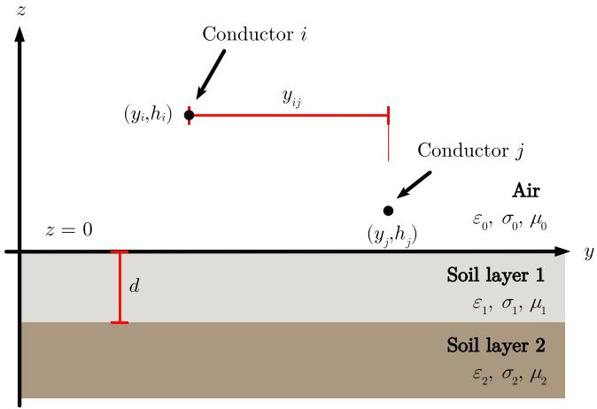  
Fig. 1. Overhead conductors above a two-layer earth.

?? , ?? , $\sigma _ { 0 }$ are the permittivity, permeability and conductivity of $\mathsf { a i r } ,$ respectively. The upper layer of finite-thickness, $d ,$ is described by $\varepsilon _ { 1 } = \varepsilon _ { r 1 } \varepsilon _ { 0 } , \mu _ { 1 } = \mu _ { r 1 } \mu _ { 0 } , \sigma _ { 1 } = 1 / \rho _ { 1 }$ , and the bottom semi-infinite earth layer by the corresponding EM properties, $\varepsilon _ { 2 } = \varepsilon _ { r 2 } \varepsilon _ { 0 } , \mu _ { 2 } = \mu _ { r 2 } \mu _ { 0 }$ and $\sigma _ { 2 } = 1 / \rho _ { 2 }$ . The self-parameters of conductor ?? are derived by replacing $h _ { j }$ with $h _ { i }$ and $y _ { i j }$ with the conductor outer radius.

Assuming that the two earth layers have identical EM properties, $\mathrm { i . e . , } \varepsilon _ { r 1 } = \varepsilon _ { r 2 } , \mu _ { r 1 } = \mu _ { r 2 } , \rho _ { 1 } = \rho _ { 2 } $ , expressions (2) and (4) reduce to Wise’s formulas [3,4], respectively, for the homogeneous earth case described by:

$$
M _ {i j} = \frac {j \omega \mu_ {0}}{\pi} \int_ {0} ^ {\infty} \frac {\mu_ {1} e ^ {- (h _ {i} + h _ {j}) a _ {0}}}{a _ {1} \mu_ {0} + a _ {0} \mu_ {1}} \cos \left(y _ {i j} \lambda\right) d \lambda , \tag {9}
$$

$$
Q _ {i j} = \frac {1}{\pi \varepsilon_ {0}} \int_ {0} ^ {\infty} \frac {\left(a _ {0} + a _ {1} \frac {\mu_ {1}}{\mu_ {0}}\right) e ^ {- \left(h _ {i} + h _ {j}\right) a _ {0}}}{\left(a _ {0} + a _ {1} \frac {\mu_ {0}}{\mu_ {1}}\right) \left(a _ {0} \frac {\gamma_ {1} ^ {2}}{\gamma_ {0} ^ {2}} + a _ {1} \frac {\mu_ {1}}{\mu_ {0}}\right)} \cos \left(y _ {i j} \lambda\right) d \lambda . \tag {10}
$$

# 2.2. Equivalent homogeneous earth approximation

Evidently, the calculation of the semi-infinite integrals in (1) - (4) involves rather complex terms. An alternative approach to account for the influence of the two-layer earth on OHLs is by means of the EHEM approach. In this context, the calculation of the two-layer earth impedance and potential coefficient of (1) and (3) reduces to that of (9) and (10), respectively, assuming that $\mu _ { 1 } = \mu _ { 0 }$ and replacing $\gamma _ { 1 }$ with the equivalent propagation constant, $\gamma _ { e q } ,$ defined as [21]:

$$
\gamma_ {e q} = \gamma_ {e 1} \frac {\gamma_ {e 1} + \gamma_ {e 2} - \left(\gamma_ {e 1} - \gamma_ {e 2}\right) e ^ {- 2 d \gamma_ {e 1}}}{\gamma_ {e 1} + \gamma_ {e 2} + \left(\gamma_ {e 1} - \gamma_ {e 2}\right) e ^ {- 2 d \gamma_ {e 1}}}, \tag {11}
$$

where

$$
\gamma_ {e 1} = \sqrt {\gamma_ {1} ^ {2} - \gamma_ {0} ^ {2}}. \tag {12}
$$

$$
\gamma_ {e 2} = \sqrt {\gamma_ {2} ^ {2} - \gamma_ {0} ^ {2}}. \tag {13}
$$

Furthermore, if the influence of earth permittivity is disregarded, the equivalent earth resistivity, $\sigma _ { e q } ,$ , is derived [19,20]:

$$
\sigma_ {e q} = \sigma_ {1} \frac {\sqrt {\sigma_ {1}} + \sqrt {\sigma_ {2}} - (\sqrt {\sigma_ {1}} - \sqrt {\sigma_ {2}}) e ^ {- 2 d \sqrt {\pi f \mu_ {1} \sigma_ {1}}}}{\sqrt {\sigma_ {1}} + \sqrt {\sigma_ {2}} + (\sqrt {\sigma_ {1}} - \sqrt {\sigma_ {2}}) e ^ {- 2 d \sqrt {\pi f \mu_ {1} \sigma_ {1}}}}. \tag {14}
$$

For completeness, it is noted that the equivalent conductivity may be also extracted directly from (11), along with the equivalent permittivity:

$$
\sigma_ {e q} = \Im \left\{\frac {\gamma_ {e q} ^ {2}}{\omega \mu_ {0}} \right\}, \tag {15}
$$

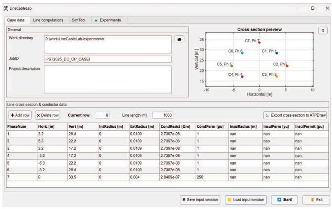  
Fig. 2. Case data tab.

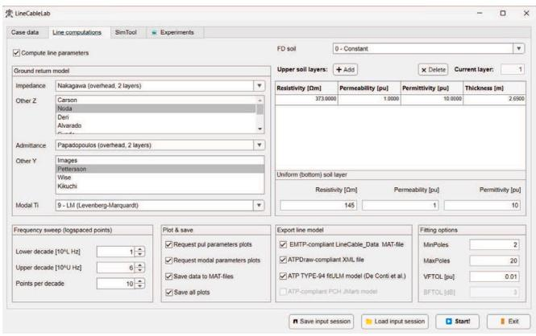  
Fig. 3. Line computations tab.

$$
\varepsilon_ {e q} = \Re \left\{\frac {- \gamma_ {e q} ^ {2}}{\omega^ {2} \mu_ {0}} \right\}, \tag {16}
$$

where ℑ and ℜ denote the imaginary and real part operators, respectively. The practical relevance of decomposing (11) into (15) and (16) lies in the possibility to further extend the applicability of EHEM, enabling its integration into virtually any formulation or software applicable to overhead conductors and not only Wise’s equations. Note that hereinafter, the EHEM of (11) is notated as ‘‘EHEM $( \gamma _ { e q } ) ^ { , , }$ , and the EHEM of (14) as ‘‘EHEM $( \sigma _ { e q } ) ^ { \prime }$ ’.

# 3. LineCableLab toolbox

The impact of the two-layer earth on EMT is investigated by using different earth formulations and EHEMs as well as state-of-the-art EMT simulations models, using the LineCableLab toolbox [24]. The toolbox is developed in the MATLAB programming language and is supported by a complete graphical user interface (GUI).

The user enters the transmission line data in the ‘‘Case data’’ tab as depicted in Fig. 2. In the second step, the earth impedance and admittance formulation is selected considering proper soil models, i.e., homogeneous and multi-layer (see Fig. 3). The LineCableLab toolbox readily supports several earth formulations for OHL, underground cable systems and OHL/underground configurations. The associated code is responsible for calculating the per-unit-length line parameters and the modal propagation characteristics from a selection of different methods.

The calculated transmission line parameters and propagation characteristics can be used for the simulation of EMT. Two options are available in the LineCableLab toolbox: (i) FD and (ii) TD modeling as illustrated in the ‘‘Line computations’’ tab of the toolbox in Fig. 3.

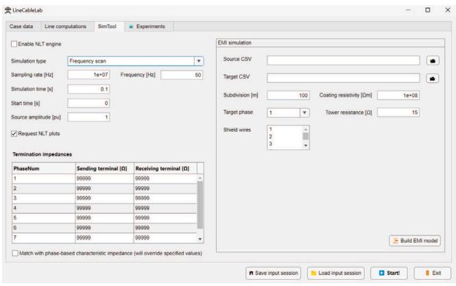  
Fig. 4. SimTool tab.

# 3.1. Frequency-domain modeling

The FD approach is considered as reference for evaluation and testing of transmission line simulation models. In fact, FD models simulate the transmission line by calculating the line characteristics over a frequency range, and transform the frequency spectrum into a time response using time-frequency transformations.

Currently, the Laplace transform-based model of [22] is directly implemented in the LineCableLab toolbox and can be parameterized via the ‘‘SimTool’’ tab (see Fig. 4). In this model, a high precision interpolation routine for the formulation of the nodal admittance matrix is combined with the utilization of a flexible sampling scheme. These features provide high accuracy and great computational efficiency in any type of EMT simulation [27].

# 3.2. Wideband/universal line modeling

The wideband (WB) or universal line model (ULM) is a TD model that accounts for full frequency dependency of OHL and cable system phase-based parameters [23]. In terms of the WB/ULM modeling approach, the propagation and characteristic admittance functions are initially sampled for a frequency range. In the next step the phase quantities are fitted directly using complex poles and zeros in their rational-function approximation form by means of the vector fitting algorithm [28].

The WB/ULM has been continuously improving since its original development in 1999. Recent advancements suggest that the time delays of the propagation function must be concurrently computed along with an optimization algorithm to minimize the fitting error [29]. Additionally, for cases with passivity violations, a grouping criterion can be introduced aiming to reduce the pole/residue ratio of the model. The above techniques are included in the ‘‘advanced fitter’’ feature of the EMTP software [26].

Despite that currently WB/ULM accounts for more than two decades of development, only very recently an implementation of it in ATP [25] was available as a foreign model by using the Type-94 component [30]. Eventually, the WB/ULM has been fully supported in version 7.5 of ATPDraw [31].

In the LineCableLab toolbox an interface with EMT simulation platforms is provided. The user can select to export the computed data as: (i) XML file compatible with ATPDraw 7.5 (per-unit-length impedance and admittance matrices), (ii) fitULM.dat file ATP-ULM 3.2 [30], available in ATPDraw 7.5 or later, or (iii) EMTP-compliant MAT-file that can be imported in the Line/Cable Data routine of EMTP [26].

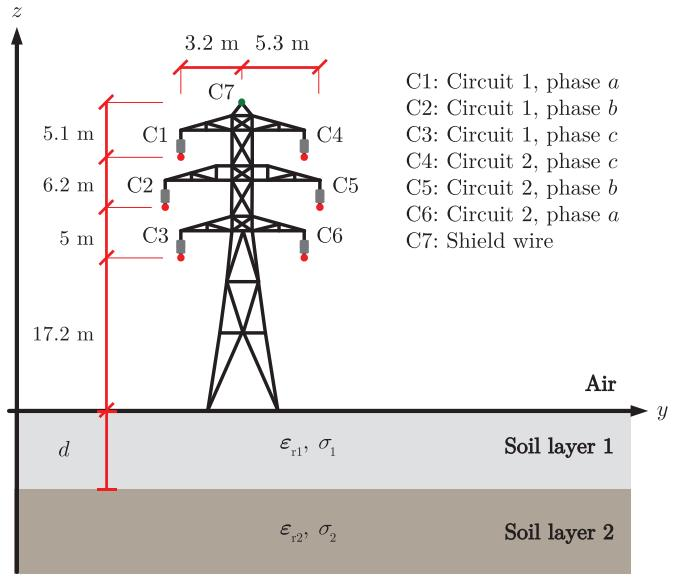  
Fig. 5. Cross-section of the 110 kV OHL.

Table 1 Two-layer soil cases.   

<table><tr><td>Case</td><td>I</td><td>II</td><td>III</td><td>IV</td></tr><tr><td>ρ1(Ω m)</td><td>372.729</td><td>246.841</td><td>494.883</td><td>125.526</td></tr><tr><td>ρ2(Ω m)</td><td>145.259</td><td>1058.79</td><td>93.663</td><td>1093.08</td></tr><tr><td>d1(m)</td><td>2.69</td><td>2.139</td><td>4.37</td><td>2.713</td></tr></table>

# 4. Case study

To evaluate the influence of earth stratification in terms of propagation characteristics and transient voltages, the 110 kV double-circuit power line of Fig. 5 is examined. The resistivity of the phase conductors is $2 . 7 3 9 7 \times 1 0 ^ { - 8 }$ Ω m and their diameter is 21.8 mm. Accordingly, the shield wire resistivity is 2.8409 × 10−8 Ω m with diameter 8 mm [32].

Table 1 shows the resistivity and upper earth layer depth of the investigated two-layer soil cases reported in the literature [11]. It should be indicated that in all cases $\mu _ { r 1 } = \mu _ { r 2 } = 1$ , as most soil types are nonmagnetic [11]. Regarding $\epsilon _ { r 1 }$ and $\epsilon _ { r 2 } ,$ a value equal to 10 is considered [18].

# 5. Propagation characteristics

Computations of the modal propagation characteristics of the OHL of Fig. 5 are carried out over frequencies ranging from 1 kHz to 1 MHz [33] for the two-layer soil cases of Table 1. The ground mode attenuation constant and velocity using the two-layer earth formulation of (1) - (4) are compared with those obtained by EHEM $( \gamma _ { e q } ) _ { : }$ , and EHEM $( \sigma _ { e q } ) ,$ , in Figs. 6 and 7, respectively. To further evaluate the effect of earth stratification, the ground mode propagation characteristics for homogeneous earth cases are juxtaposed in the corresponding plots. Specifically, the homogeneous earth resistivity is assumed equal to that of the upper and the bottom earth layer, herein, ‘‘homogeneous $( \rho _ { 1 } ) ^ { \dag }$ and ‘‘homogeneous $( \rho _ { 2 } ) ^ { \dag }$ , respectively. In addition, to establish a better understanding of the results, the attenuation constant and phase velocity of $\gamma _ { e q }$ along with the upper and bottom earth layer parameters are plotted for the examined frequency range in Fig. 8 and Fig. 9, respectively.

Generally, results in Figs. 6 and 7 show that the propagation characteristics of the two-layer earth model and the two EHEM are between the ‘‘homogeneous $( \rho _ { 1 } ) ^ { \dag }$ and ‘‘homogeneous $( \rho _ { 2 } ) ^ { \dag }$ calculations. This is also justified by the analysis of the attenuation constant and phase velocity of the propagation constants in Figs. 8 and 9. In more specific,

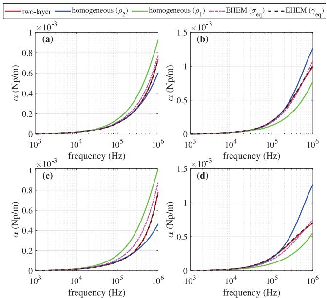  
Fig. 6. Ground mode attenuation constant for soil (a) Case I, (b) Case II, (c) Case III, (d) Case IV.

for frequencies up to some hundreds of kHz, the propagation characteristics of the two-layer earth are essentially the same to ‘‘homogeneous $( \rho _ { 2 } ) ^ { \dag } .$ . At lower frequencies the skin depth extends in both earth layers and may reach depths hundreds of times higher than the depth of the upper earth layer, depending on the soil EM properties. This implies that the semi-infinite bottom layer has a predominant influence on the OHL propagation characteristics in this frequency spectrum [20]. Conversely, at higher frequencies, the skin depth reduces and approaches the depth of the upper earth layer [11]; thus the flow of return currents is gradually limited to the upper earth layer [34]. Evidently, at the high frequency region, i.e., above 500 kHz, despite that the deeper soil layer is still important, the influence of the upper earth layer EM properties on the propagation characteristics becomes more marked, especially for the ground mode velocity. The results also indicate that the predictions of the EHEM $( \gamma _ { e q } )$ and the EHEM $( \sigma _ { e q } )$ generally agree with the twolayer earth calculations. This is especially true for the EHEM $( \gamma _ { e q } )$ as small differences are obtained for all examined cases.

# 6. Transient responses

The OHL system in Fig. 5 is energized with a 1.2/50 μs double exponential voltage source of 1 pu amplitude, to simulate lightning surges. As shown in Fig. 10, the source is applied to the sending end of the OHL phase a conductor at t = 0 s. All conductors are nearly matched with their characteristic impedance, i.e., 600 Ω for the phase conductors and 660 Ω for the shield wire. The examined line section has a length of 1000 m. The transient responses are computed using the FD model of [22] as well as the WB/ULM model in ATP and EMTP using the corresponding features of the LineCableLab toolbox. In all examined cases, the propagation characteristics are calculated for the frequency range from 0.1 Hz up to 1 MHz with a sampling rate of 20 points/decade.

# 6.1. Assessment of simulation models

The three simulation models are compared directly in Fig. 11 where the voltage is calculated at the sending and receiving end of various phases at both OHL circuits assuming soil Case I. The transient responses are simulated following the two-layer earth approach of (1)–(4).

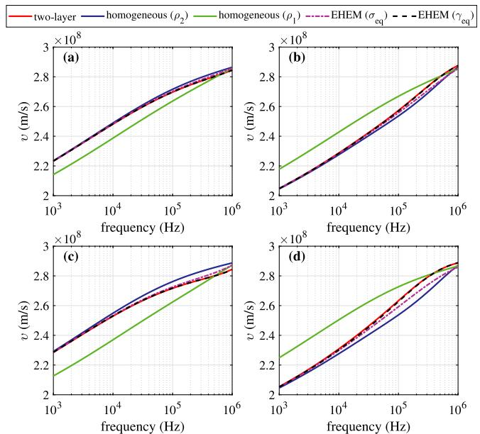  
Fig. 7. Ground mode velocity for soil (a) Case I, (b) Case II, (c) Case III, (d) Case IV.

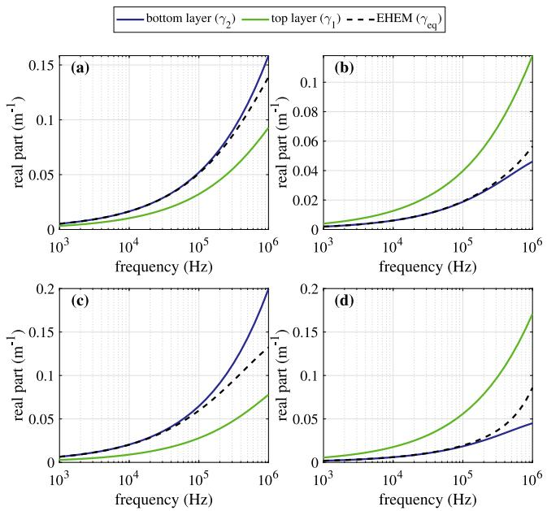  
Fig. 8. Attenuation constant for soil (a) Case I, (b) Case II, (c) Case III, (d) Case IV.

More specifically, the results of Fig. 11a present the voltage at the receiving end of phase a of circuit L1, where the lightning impulse occurs. The overvoltage at this end, which is greater than 1 p.u., is mainly determined by the aerial modes and the wave propagation along the transmission line. It is evident that all simulation models are in very good agreement, validating their accuracy. The remaining subplots present the voltage in the other phases, which are of much lower amplitude since they are primarily determined by the induction effect and all propagation modes. Again, the three models are in good agreement, with the exception of a different voltage spike using the ATP model.

Fig. 12 presents the induced voltage at the receiving end of phase b of circuit L1 for all soil cases of Table 1 using the three simulation models. The level of the voltage is again much lower than 1 p.u. in all cases, while the amplitude is related to the depth of the first layer and

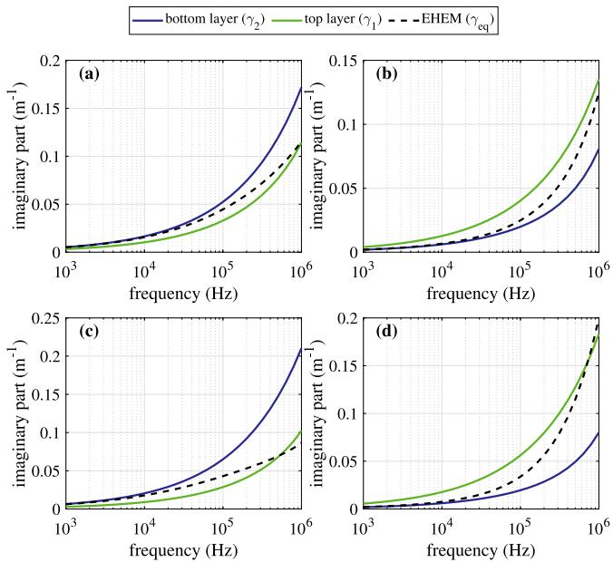  
Fig. 9. Phase constant for soil (a) Case I, (b) Case II, (c) Case III, (d) Case IV.

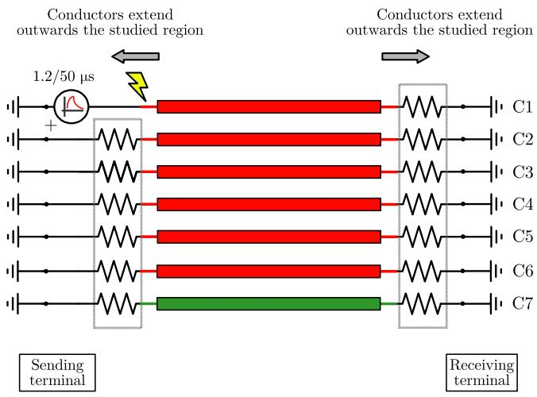  
Fig. 10. Circuit model.

the soil resistivity values of both layers. The three models yield again the same results except for the voltage spike by the ATP model.

Marginal amplitude differences are observed between the Laplace and the WB/ULM responses in Figs. 11a and 11c, as well as in the dominant peaks when comparing the ATP and EMTP responses in Fig. 12. The Laplace transform-based approach derives the time-domain solution directly from the primitive frequency-dependent line quantities (i.e., impedance and admittance), making it arguably the most accurate response, provided appropriate sampling is performed. In contrast, EMT-type solutions rely on the rational fitting of the auxiliary quantities used by the WB/ULM, i.e., phase-based propagation functions and characteristic admittances. The numerical fitting procedure, which minimizes the RMS error between estimated and theoretical quantities, inherently introduces deviations from the Laplace transform response. Additionally, variations in vector-fitting implementations, optimal delay extraction strategies, and choices of pole/residue thresholds contribute to the discrepancies between the ATP curve (open-source vector-fitting routine in [24]) and EMTP (proprietary software). These inherent numerical characteristics are recurring in WB/ULM modeling and have been systematically investigated in [35].

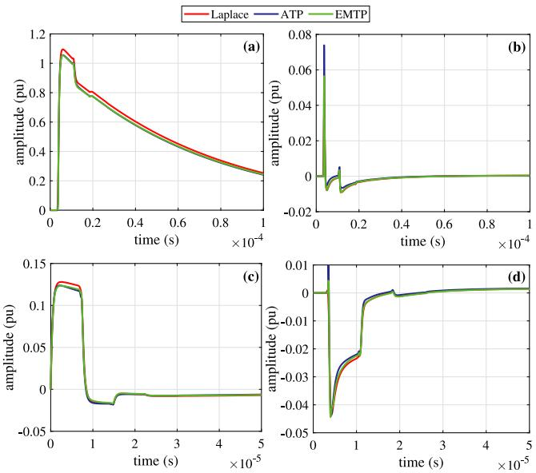  
Fig. 11. Transient responses of (a) voltage at the receiving end of phase a of circuit L1, (b) induced voltage at the receiving end of phase b of circuit L1, (c) induced voltage at the sending end of phase b of circuit L1, (d) induced voltage at the receiving end of phase a of circuit L2. Soil Case I.

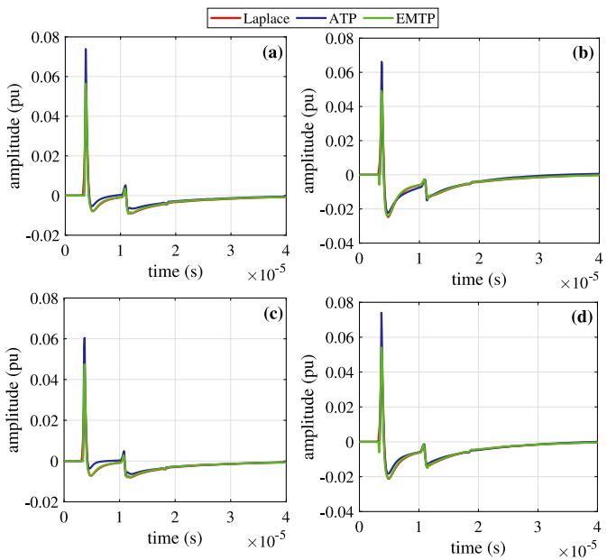  
Fig. 12. Transient induced voltage at the receiving end of phase b of circuit L1 for soil (a) Case I, (b) Case II, (c) Case III, (d) Case IV.

# 6.2. Effect of earth stratification on transient responses

Focusing on the Laplace transform-based model of [22], Figs. 13 and 14 present the calculated voltage at the receiving end of phase a of circuits L1 and L2, respectively, assuming all soil cases and earth approaches. Since the overvoltage at L1 is mainly determined by the aerial modes, earth conduction effects are minimal, thus the results obtained with the different earth approximations seem to virtually agree. However, this is not the case for the induced voltage at L2, which is greatly influenced by the ground mode. In this case, differences are observed between the earth approximations, and most importantly with the homogeneous soil representation set equal to $\rho _ { 1 }$ . The transients using EHEM $( \gamma _ { e q } )$ and EHEM $( \sigma _ { e q } )$ formulations generally match with the

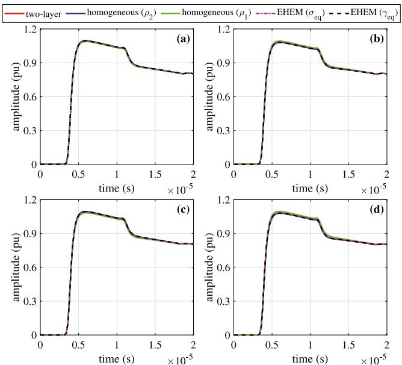  
Fig. 13. Comparison of transient induced voltage at the receiving end of phase a of circuit L1 for different earth approaches: (a) Case I, (b) Case II, (c) Case III, (d) Case IV.

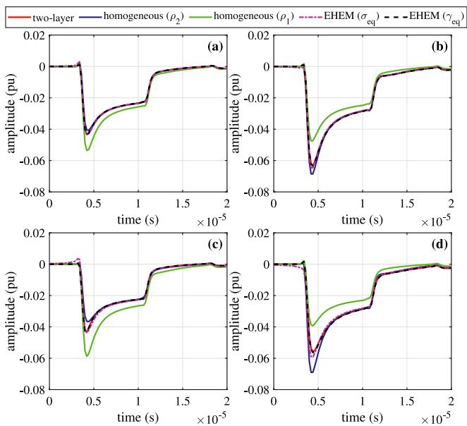  
Fig. 14. Comparison of transient voltage at the receiving end of phase a of circuit L2 for different earth approaches: (a) Case I, (b) Case II, (c) Case III, (d) Case IV.

ones of the two-layer earth calculation, validating their applicability for the simplification of the stratified earth.

# 7. Conclusions

The effect of earth stratification on the propagation characteristics and surge responses of a double-circuit OHL has been investigated. A rigorous two-layer earth formulation for the calculation of the earth impedance and admittance as well as different EHEMs and simplified homogeneous representations have been applied. Evaluations were carried out using the LineCableLab toolbox and the ATP and EMTP software.

From the comparative analysis it is shown that for a two-layer, differences in the ground mode propagation characteristics from the

homogeneous earth cases are considerable in the frequency range of 10 kHz - 1 MHz, as a result of the EM skin depth variation with frequency. Eventually, significant differences in the transient responses, and most importantly in induced voltage computations also occur. Moreover, the OHL ground mode propagation characteristics and transient responses, calculated using the two-layer earth model and the two EHEMs are generally in agreement, verifying their use in surge analysis of OHLs.

Regarding the FD simulation model and the WB/ULM implementations in ATP and EMTP, it can be deduced that the three models generally yield same results, indicating their validity for advanced EMT analysis of OHLs involving two-layer earth structures.

Further analysis can investigate the effect of line length, soil frequency-dependency in two-layer earth structures as well as the extension of the EHEM to underground and submarine cable systems.

# CRediT authorship contribution statement

A.G. Martins-Britto: Conceptualization, Writing – original draft, Methodology, Formal analysis. T.A. Papadopoulos: Conceptualization, Writing – original draft, Formal analysis, Investigation. A.I. Chrysochos: Formal analysis, Writing – original draft, Investigation.

# Declaration of competing interest

The authors declare that they have no known competing financial interests or personal relationships that could have appeared to influence the work reported in this paper.

# Appendix

The terms of (5)–(6) are defined as:

$$
A _ {1} = \mu_ {1} \left(s _ {1 2} + d _ {1 2} e ^ {- 2 a _ {1} d}\right), \tag {17a}
$$

$$
A _ {2} = s _ {0 1} s _ {1 2} + d _ {0 1} d _ {1 2} e ^ {- 2 a _ {1} d}, \tag {17b}
$$

$$
A _ {3} = \mu_ {0} \mu_ {1} \left(\gamma_ {0} ^ {2} - \gamma_ {1} ^ {2}\right), \tag {17c}
$$

$$
A _ {4} = s _ {1 2} + d _ {1 2} e ^ {- 2 a _ {1} d}, \tag {17d}
$$

$$
A _ {5} = S _ {1 2} + D _ {1 2} e ^ {- 2 a _ {1} d}, \tag {17e}
$$

$$
A _ {6} = - 4 \mu_ {0} \mu_ {1} ^ {2} \mu_ {2} a _ {1} ^ {2} \gamma_ {0} ^ {2} \left(\gamma_ {2} ^ {2} - \gamma_ {1} ^ {2}\right) e ^ {- 2 a _ {1} d}, \tag {17f}
$$

$$
A _ {7} = s _ {0 1} s _ {1 2} + d _ {0 1} d _ {1 2} e ^ {- 2 a _ {1} d}, \tag {17g}
$$

$$
A _ {8} = S _ {0 1} S _ {1 2} + D _ {0 1} D _ {1 2} e ^ {- 2 a _ {1} d}, \tag {17h}
$$

with:

$$
s _ {m n} = a _ {m} \mu_ {n} + a _ {n} \mu_ {m}, \tag {18a}
$$

$$
d _ {m n} = a _ {m} \mu_ {n} - a _ {n} \mu_ {m}, \tag {18b}
$$

$$
S _ {m n} = \mu_ {m} \gamma_ {n} ^ {2} a _ {m} + \mu_ {n} \gamma_ {m} ^ {2} a _ {n}, \tag {18c}
$$

$$
D _ {m n} = \mu_ {m} \gamma_ {n} ^ {2} a _ {m} - \mu_ {n} \gamma_ {m} ^ {2} a _ {n}. \tag {18d}
$$

# Data availability

No data was used for the research described in the article.

# References

[1] J. Carson, Wave propagation in overhead wires with ground return, Bell Syst. Tech. J. (1926) 539–554.   
[2] E. Sunde, Earth Conduction Effects in Transmission Systems, second ed., Dover Publications, New York, NY, USA, 1968.   
[3] W.H. Wise, Propagation of high-frequency currents in ground return circuits, Proc. Inst. Radio Eng. 22 (4) (1934) 522–527.   
[4] W.H. Wise, Potential coefficients for ground return circuits, Bell Syst. Tech. J. 27 (2) (1948) 365–371.

[5] IEEE Std. 81, IEEE Guide for Measuring Earth Resistivity, Ground Impedance, and Earth Surface Potentials of a Ground System, The Institte of Electrical and Electronics Engineers, Inc., New York, NY, 1984, p. 54.   
[6] J. Lee, J. Zou, B. Li, M. Ju, Efficient evaluation of the earth return mutual impedance of overhead conductors over a horizontally multilayered soil, COMPEL 33 (4) (2013) 1379–1395.   
[7] T. Elkateb, R. Chalaturnyk, P.K. Robertson, An overview of soil heterogeneity: Quantification and implications on geotechnical field problems, Can. Geotech. J. 40 (2003) 1–15.   
[8] A. Ametani, T. Yoneda, Y. Baba, N. Nagaoka, An investigation of earthreturn impedance between overhead and underground conductors and its approximation, IEEE Trans. Electromagn. Compat. 51 (3) (2009) 860–867.   
[9] M. Nakagawa, A. Ametani, K. Iwamoto, Further studies on wave propagation in overhead lines with earth return: Impedance of stratified earth, Proc. Inst. Electr. Eng. 120 (12) (1973) 1521.   
[10] D.A. Tsiamitros, G.K. Papagiannis, P.S. Dokopoulos, Earth return impedances of conductor arrangements in multilayer soils—Part I: Theoretical model, IEEE Trans. Power Deliv. 23 (4) (2008) 2392–2400.   
[11] G. Papagiannis, D. Tsiamitros, D. Labridis, P. Dokopoulos, A systematic approach to the evaluation of the influence of multilayered Earth on overhead power transmission lines, IEEE Trans. Power Deliv. 20 (4) (2005) 2594–2601.   
[12] IEEE Std. 80, IEEE Std 80-2013 (Revision of IEEE Std 80-2000/ Incorporates IEEE Std 80-2013/Cor 1-2015), 2015, pp. 1–226.   
[13] F. Dawalibi, R.D. Southey, Y. Malric, W. Tavcar, Power Line Fault Current Coupling to Nearby Natural Gas Pipelines: Volume 1, Analytic Methods and Graphical Techniques: Final Report. [Electromagnetic and Conductive Coupling Analysis of Powerlines and Pipelines (ECCAPP)], Tech. Rep., Electric Power Research Institute, 1987.   
[14] R. Southey, F. Dawalibi, Improving the reliability of power systems with more accurate grounding system resistance estimates, in: Proceedings. International Conference on Power System Technology, vol. 1, 2002, pp. 98–105.   
[15] C.M. Moraes, G.H.d.S. Matos, A.G. Martins-Britto, K.M. Silva, F.V. Lopes, Total AC interferences between a power line subject to a single-phase fault and a nearby pipeline with multilayered soil, IEEE Trans. Electromagn. Compat. 65 (2) (2023) 585–594.   
[16] J. He, R. Zeng, B. Zhang, Methodology and Technology for Power System Grounding, Wiley, 2012, p. 566.   
[17] T.A. Papadopoulos, G.K. Papagiannis, D.A. Labridis, Wave propagation characteristics of overhead conductors above imperfect stratified earth for a wide frequency range, IEEE Trans. Magn. 45 (3) (2009) 1064–1067.   
[18] T.A. Papadopoulos, G.K. Papagiannis, D.P. Labridis, A generalized model for the calculation of the impedances and admittances of overhead power lines above stratified earth, Electr. Power Syst. Res. 80 (9) (2010) 1160–1170.   
[19] D.A. Tsiamitros, G.K. Papagiannis, P.S. Dokopoulos, Homogenous earth approximation of two-layer earth structures: An equivalent resistivity approach, IEEE Trans. Power Deliv. 22 (1) (2007) 658–666.   
[20] A.G. Martins-Britto, F.V. Lopes, S.R.M.J. Rondineau, Multilayer earth structure approximation by a homogeneous conductivity soil for ground return impedance calculations, IEEE Trans. Power Deliv. 35 (2) (2020) 881–891.   
[21] H. Xue, J. Mahseredjian, A. Ametani, J. Morales, I. Kocar, Generalized formulation and surge analysis on overhead lines: Impedance/admittance of a multi-layer earth, IEEE Trans. Power Deliv. 36 (6) (2021) 3834–3845.   
[22] A.I. Chrysochos, T.A. Papadopoulos, G.K. Papagiannis, Enhancing the frequencydomain calculation of transients in multiconductor power transmission lines, Electr. Power Syst. Res. 122 (2015) 56–64.   
[23] A. Morched, B. Gustavsen, M. Tartibi, A universal model for accurate calculation of electromagnetic transients on overhead lines and underground cables, IEEE Trans. Power Deliv. 14 (3) (1999) 1032–1038.   
[24] A. Martins-Britto, T. Papadopoulos, A. Chrysochos, LineCableLab, 2024, [Online]. Available: URL https://mathworks.com/matlabcentral/fileexchange/ 130914-linecablelab.   
[25] H.W. Dommel, Electromagnetic Transients Program Reference Manual, Boneville Power Administration, Portland, OR, 1986.   
[26] J. Mahseredjian, S. Dennetière, L. Dubé, B. Khodabakhchian, L. Gérin-Lajoie, On a new approach for the simulation of transients in power systems, Electr. Power Syst. Res. 77 (11) (2007) 1514–1520.   
[27] T. Papadopoulos, Z. Datsios, A. Chrysochos, A. Martins-Britto, G. Papagiannis, Transient induced voltages on aboveground pipelines parallel to overhead transmission lines, Electr. Power Syst. Res. 223 (2023) 109631.   
[28] B. Gustavsen, A. Semlyen, Rational approximation of frequency domain responses by vector fitting, IEEE Trans. Power Deliv. 14 (3) (1999) 1052–1061.   
[29] A. Ramirez, J. Morales, J. Mahseredjian, I. Kocar, Advanced wideband line/cable modeling for transient studies, IEEE Trans. Power Deliv. 39 (5) (2024) 2956–2964.   
[30] F.O. Zanon, O.E. Leal, A. De Conti, Implementation of the universal line model in the alternative transients program, Electr. Power Syst. Res. 197 (2021) 107311.   
[31] H.K. Hoidalen, L. Prikler, F. Penaloza, ATPDraw version 7.5 for windows: User’s manual, 2023.   
[32] D.D. Micu, G.C. Christoforidis, L. Czumbil, AC interference on pipelines due to double circuit power lines: A detailed study, Electr. Power Syst. Res. 103 (2013) 1–8.

[33] A.I. Chrysochos, T.A. Papadopoulos, G.K. Papagiannis, Robust calculation of frequency-dependent transmission-line transformation matrices using the Levenberg-Marquardt method, IEEE Trans. Power Deliv. 29 (4) (2014) 1621–1629.

[34] T.A. Papadopoulos, A.I. Chrysochos, G.K. Papagiannis, Analytical study of the frequency-dependent earth conduction effects on underground power cables, IET Gener. Transm. Distrib. 7 (3) (2013) 276–287.   
[35] M.A.B. Ribeiro, A.G. Martins-Britto, Comparative analysis of J. Marti and Universal Line Models for pipeline coupling effects, in: 2024 Workshop on Communication Networks and Power Systems, WCNPS, 2024, pp. 1–6.