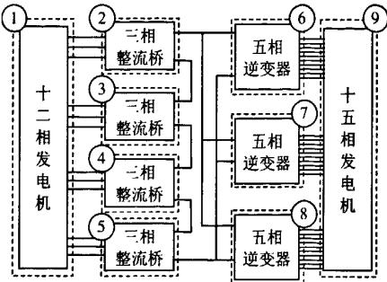
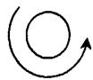
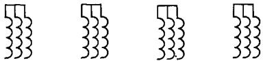
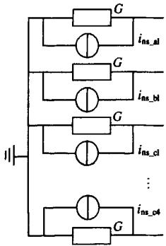
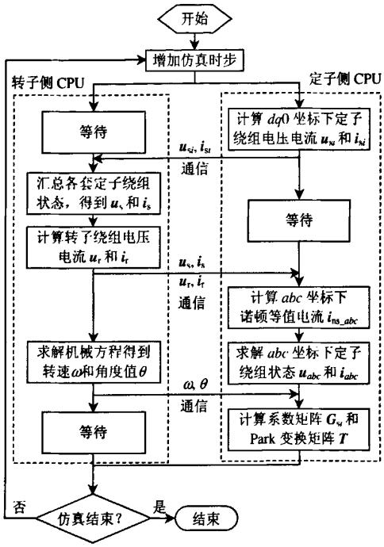
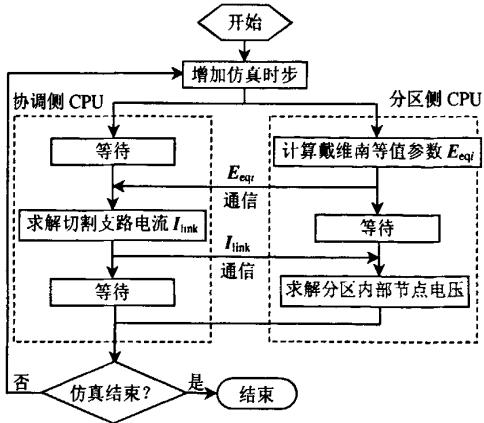
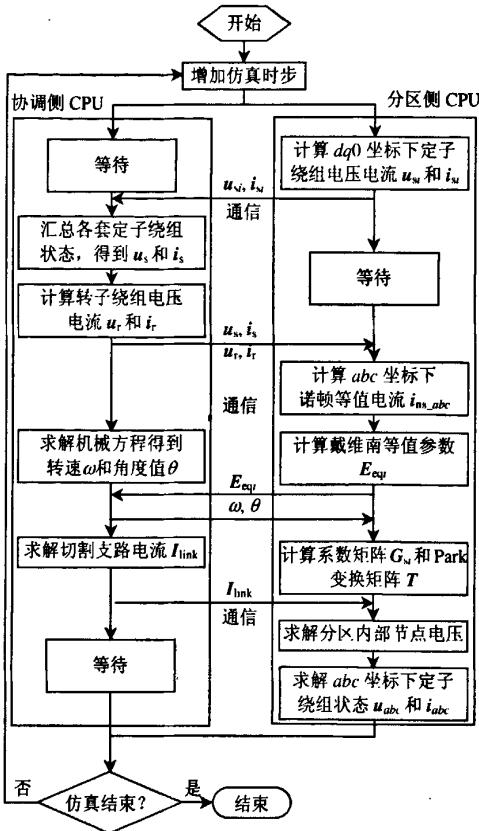
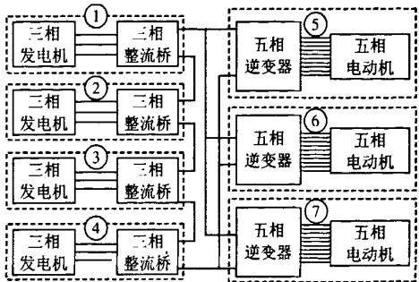
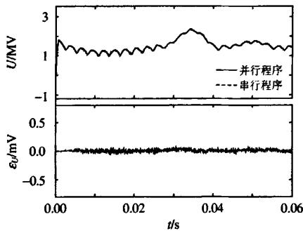
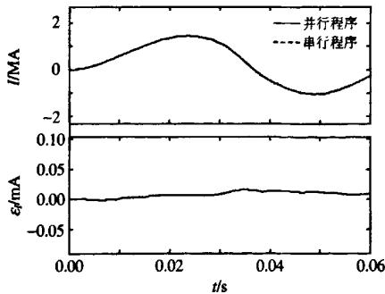

# 一种混合并行算法及其在多相交直流混合电力系统中的应用

陈来军1, 陈颖1, 梅生伟1, 许寅1, 付立军2, 纪锋2

(1.电力系统及发电设备控制和仿真国家重点实验室(清华大学电机系)，北京市海淀区100084;

2. 舰船综合电力技术国防科技重点实验室(海军工程大学), 湖北省 武汉市 430033)

# A Hybrid Parallel Computation Algorithm and Its Application to Multi-phase Hybrid AC/DC Power Systems

CHEN Laijun1, CHEN Ying1, MEI Shengwei1, XU Yin1, FU Lijun2, JI Feng2

(1. State Key Lab of Control and Simulation of Power Systems and Generation Equipments (Dept. of Electrical Engineering, Tsinghua University), Haidian District, Beijing 100084, China; 2. National Key Lab for Vessel Integrated Power System Technology (Naval University of Engineering), Wuhan 430033, Hubei Province, China)

ABSTRACT: The integrated power system is a typical hybrid AC/DC power system, which usually consists of multi-phase motors and power electronic devices. Because of the many electrical ports used, the multi-phase motors are hard to be decomposed optimally for parallel computing, which limit the speedup of the electromagnetic transients simulation of the integrated power system. In this work, a hybrid parallel simulation algorithm was proposed, which is based on both component and network decomposition. Through dividing multi-phase motor into several small motors, the proposed algorithm makes the overall system partitioned more flexibly and balanced. Furthermore, the parallel computation flow is optimized also to reduce the synchronization costs and make full use of the computational resources. Test results of a typical integrated power system were presented to validate the efficiency and accuracy of the proposed algorithm.

KEY WORDS: parallel computation; component level parallelization; hybrid parallel algorithm; integrated power system; electromagnetic transient

摘要：综合电力系统是典型的多相交直流混合电力系统，多由多相电机和电力电子设备构成。由于多相电机计算量大、端口数多，采用传统并行算法难以提高综合电力系统电磁暂

态仿真效率，为此提出一种混合并行算法，该算法由元件级并行和网络级并行2部分组成。其中前者通过将计算量大的多相电机元件分拆为多个互相耦合的电机，以大幅减少单个元件的计算量和显著提高系统分区的灵活性；后者则利用元件级并行实现系统切分方案的优化设计和计算流程中等待时间的高效利用，从而显著提高网络并行计算的总体效率。典型综合电力系统算例的仿真结果验证了所提出算法的正确性和有效性。

关键词：并行计算；元件级并行；混合并行算法；综合电力系统；电磁暂态

# 0 引言

近年来，并行计算技术作为重要的加速手段，在电力系统仿真和分析中得到了广泛的应用[1-6]。并行计算的基本思想是将规模较大的原问题分解为几个规模较小的子问题，各子问题间通过协调侧交互信息完成各自计算，从而实现原问题的整体求解。由于子问题的规模一般较小，且可以同时展开计算，因此往往可以获得较高的计算效率。

系统切分方案是影响并行计算效率的一个重要因素。经典的系统切分方法是利用长传输线对系统中的各区域进行解耦[7-9]，该方法广泛应用于包含远距离输电线路的大规模电力系统的并行计算。由于在该方法中系统必须在长输电线处解开，使得系统的分区数量和各分区的计算规模均受到输电线数量和位置的限制，往往很难达到较高的并行效率。文献[10-11]将电力系统分层分区的特性与并行

计算领域的图划分算法相结合，提出了一种优化的任务划分策略。文献[12-15]研究了基于多端口戴维南等效(multi-area Thevenin equivalent, MATE)的并行仿真算法，该方法通过对系统的各个部分进行戴维南等效，使用常规元件支路即可实现系统的分解，扩展了并行算法在电力系统中的应用范围。

综合电力系统(integrated power system，IPS)是近年来舰船电力系统研究的热点之一，多由多相电机和电力电子设备组成，并具有功率密度大、可靠性高等特点[16]。由于综合电力系统为交直流紧凑型系统，系统中没有长传输线，且分层分区的特性并不明显，这使得经典的系统切分方法不再适用，相应的优化切分策略也难以实施。而当采用多端口戴维南等效的方法对综合电力系统进行并行仿真时，由于多相电机仿真计算量大、端口多，使得并行仿真时的系统切分较为困难，并行仿真总体效率难以提高。

针对上述难题，本文提出一种混合并行算法。该算法包含元件级并行和网络级并行2个部分。其中，元件级并行算法可实现多相电机元件仿真的分解协调计算，既可降低单个元件的计算量，又可提高系统分区的灵活性。而考虑了元件级并行的网络级并行算法则可通过改变常规的系统切分方式，使得分区侧和协调侧计算规模同时降低成为可能。进一步，通过合理分配元件级并行中的计算任务，可有效减少网络级并行中计算资源的浪费和同步等待时间的消耗。本文采用典型的综合电力系统构建仿真算例，测试结果表明，本文所提出的混合并行算法可显著提高综合电力系统的并行仿真效率。

# 1 问题的提出

采用传统并行算法实现电磁暂态仿真，其仿真耗时主要由各子分区并发计算的最大耗时和协调计算耗时2部分组成。其中，分区侧的计算耗时主要由分区所包含的节点数决定，而协调侧的计算耗时则由协调侧所包含的切割支路数或分裂节点数决定。因此，并行电磁暂态仿真中的系统切分目标是有效降低每个时步中串行部分的计算量、减少通信耗时和各分区计算的不平衡度，具体可归纳为2个方面：1）降低协调系统规模；2）尽量保持各分区计算负载均衡，同时减小最大分区计算负载比重和由计算负载不平衡所引入的同步等待对计算性能的影响。

综合电力系统一般由多相电机和整流、逆变桥

路组成[16]。下文以一个由十二相发电机、整流桥、逆变器和十五相电动机组成的典型综合电力系统为例，说明使用传统算法对其进行并行仿真时所遇到的困难。

针对图1所示的综合电力系统，若采用传统的MATE算法进行并行计算，则一般有表1所示的2种典型系统分区方案。表中数字1—9分别代表图1中对应标号的区域。

  
图1典型综合电力系统结构图  
Fig.1 Typical integrated power system topology

表 1 典型的系统分区方案  
Tab. 1 Typical system partitioning schemas   

<table><tr><td>分区方案</td><td>分区数目</td><td>分区结果</td><td>切割支路数</td></tr><tr><td>方案1</td><td>2</td><td>{1 2 3 4 5; 6 7 8 9}</td><td>2</td></tr><tr><td>方案2</td><td>9</td><td>{1; 2; 3; 4; 5; 6; 7; 8; 9}</td><td>51</td></tr></table>

方案1中，分区数目仅为2，虽然有效控制了协调侧的计算规模，但每个分区的计算量都很大，导致并行仿真整体效率不高，加速比一般很难超过2，因此，难以应用于对计算效率要求较高的场合。

方案2中，系统被分为9个子分区。其中，十二相发电机和十五相电动机分别被作为一个单独的分区来进行处理，单个分区的计算规模较方案1有所降低。但该方案仍然存在2个不足：1）由于该方案在多相电机的机端处进行系统切分，需切割较多联接支路，例如，从十二相发电机和十五相电动机端口处对系统进行切分时，会使协调侧计算规模分别增加12和30维，导致协调侧计算规模过大，从而限制了并行计算效率的提高；2）由于各元件的计算复杂度不尽相同，使得各分区的计算负载不均衡，进而增大了并行计算中同步过程的时间开销，最终降低并行程序的整体效率。

# 2 混合并行仿真算法

# 2.1 元件级并行计算

以文献[17]中十二相发电机的电磁暂态串行仿真模型为例，说明本文提出的元件级并行算法的具体流程。十二相发电机由4套三相绕组构成，其结

构如图2所示。

  
定子绕组Y1定子绕组Y2定子绕组Y3定子绕组Y4  
图2 十二相发电机结构  
Fig. 2 Twelve-phase generator structure

忽略0轴绕组和 $g$ 轴绕组，十二相发电机 $dq0$ 坐标下标幺值形式的磁链方程和电压方程分别为

$$
\boldsymbol {\psi} _ {d q f D Q} = \boldsymbol {X} _ {d q f D Q} \boldsymbol {i} _ {d q f D Q} \tag {1}
$$

$$
\boldsymbol {u} _ {d q f D Q} = \dot {\boldsymbol {\psi}} _ {d q f D Q} + A \boldsymbol {\psi} _ {d q f D Q} + \boldsymbol {R} _ {d q f D Q} \boldsymbol {i} _ {d q f D Q} \tag {2}
$$

式中： $\pmb{\psi}_{dqFQ}$ 、 $\pmb{u}_{dqFQ}$ 和 $\pmb{i}_{dqFQ}$ 分别对应各绕组的磁链、电压和电流； $\pmb{R}_{dqFQ}$ 和 $\pmb{X}_{dqFQ}$ 分别为各绕组的电阻和电抗矩阵； $\pmb{A}$ 为系数矩阵，具体表达式可参考文献[17]。

采用隐式梯形积分法建立用于电磁暂态仿真的十二相发电机诺顿等效电路模型，具体推导过程见附录A。推导得到的 $abc$ 坐标下十二相发电机的诺顿等效电路方程为

$$
\boldsymbol {i} _ {a b c} (t) = \boldsymbol {Y} _ {\mathrm {s s} _ {-} a b c} \boldsymbol {u} _ {a b c} (t) + \boldsymbol {i} _ {\mathrm {n s} _ {-} a b c} (t) \tag {3}
$$

式中： $Y_{\mathrm{ss\_abc}} = \mathrm{diag}(G,G,\dots,G)_{12\times 12}$ 为等效导纳矩阵， $G$ 为各相等效导纳； $i_{\mathrm{ns\_abc}} = T[G_{\mathrm{s}1}i_{\mathrm{s}}(t) + G_{\mathrm{s}3}i_{\mathrm{s}}(t - \Delta t) + G_{\mathrm{s}6}i_{\mathrm{s}}(t - \Delta t) + G_{\mathrm{s}4}i_{\mathrm{r}}(t - \Delta t) + G_{\mathrm{s}5}u_{\mathrm{r}}(t - \Delta t) + G_{\mathrm{s}2}i_{\mathrm{r}}(t - \Delta t)]$ 为发电机的诺顿等效电流向量， $u_{s}$ 和 $u_{\mathrm{r}}$ 分别为定子绕组和转子绕组电压向量； $i_{s}$ 和 $i_{\mathrm{r}}$ 分别为定子绕组和转子绕组电流向量， $G_{\mathrm{si}}(i = 1,2,\ldots ,6)$ 为计算诺顿等效电流向量相关的系数矩阵，与角速度 $\omega$ 有关， $T$ 为Park变换矩阵，与角度 $\theta$ 有关； $u_{abc}$ 和 $i_{abc}$ 分别为各相端口电压和电流向量。

由式(3)可得十二相发电机的诺顿等效电路，如图3所示。

  
图3十二相发电机诺顿等效电路  
Fig. 3 Norton-equivalent circuit of 12-phase generator

从图3中等效电路可看出，十二相发电机各相等效导纳相互解耦，而对应的诺顿等效电流则相互耦合，其耦合关系包括：1）每套定子绕组计算本套绕组诺顿等效电流时需要其他各套定子绕组的电压和电流，如 $\pmb{u}_{\mathrm{s}}$ 和 $i_{s}$ ；2）每套绕组的等效电流计算均需要转子绕组的电压、电流信息以及转子的机械状态信息，包括 $\pmb{u}_{\mathrm{r}}$ 、 $i_{\mathrm{r}}$ 、 $\omega$ 和 $\theta$ 。若能合理处理上述耦合关系，则可实现十二相发电机的元件级并行仿真，其计算流程如图4所示。

  
图4元件级并行流程图  
Fig. 4 Flow chart of component level parallel computation

图4中，根据十二相发电机的物理结构将其分解为4套三相绕组，由4个定子侧CPU分别计算，并由1个转子侧CPU来处理各套绕组之间的耦合关系。具体来说，转子侧CPU的任务包括：1）在每个时步仿真开始时后，收集各定子侧CPU计算得到的定子绕组电压电流，如 $u_{si}$ 和 $i_{si}(i = 1,2,3,4)$ ，并在全局共享这部分信息；2）完成转子电气量的计算和机械量的求解，并将结果发送给定子侧CPU，使其可计算下一个时步仿真所需Park变换矩阵和定子绕组系数矩阵。

同理，十五相电动机的电磁暂态仿真也可以通过分解协调计算来实现元件级的并行，具体思路与十二相发电机的处理类似。

# 2.2 网络级并行计算

混合并行算法中的网络级并行采用MATE算

法为框架，其基本计算流程如图5所示。

  
图5网络级并行计算流程图  
Fig. 5 Flow chart of network level parallel computation

图5中， $E_{\mathrm{eqi}}$ 为分区侧发送给协调侧的戴维南等效电压向量， $\pmb{I}_{\mathrm{link}}$ 为协调侧发送给分区侧的切割支路电流向量。

从图5中可看出，协调侧切割支路的求解是传统算法中的固有串行部分，其计算规模越大，分区侧等待时间就越长。因此，若不能对该等待时间加以有效利用，则会造成计算资源的浪费以及因同步通信带来的额外开销。在引入元件级并行后，可以有效地解决上述问题。首先，利用元件级并行将多相电机拆分为多个小电机后，在网络级层面可以将多相电机看作多个“独立”的元件，从而使系统切分方案的选择更加灵活，最终使得同时减少协调侧计算规模和分区侧计算规模成为可能；其次，元件级并行和网络级并行均采用分解协调计算模式，将二者合并时，可以通过合理分配计算任务来实现网络级并行中计算资源利用率的提高以及同步开销的减小。

# 2.3 混合并行仿真算法的实现

将图4、5所示的元件级和网络级并行仿真流程合并，并对计算任务进行合理分配，即可得到本文所提出的混合并行仿真算法流程，如图6所示。

从图6中可看出，为保证计算结果的正确性及合理利用计算资源和减少同步等待，混合并行仿真实现中有以下要点：1）按照电磁暂态程序仿真流程，多相电机诺顿等效电流向量的计算应在所在分区计算戴维南等效参数之前完成，而定子绕组状态的计算则需要放在所在分区内部状态求解之后进行；2）由于计算任务可依次执行，可将元件级并行中转子侧和定子侧的计算任务分别由网络级并行中协调侧CPU和对应分区的分区侧CPU来承担，

  
图6 混合并行算法的计算流程图  
Fig. 6 Flow chart of hybrid parallel computation

从而提高计算资源利用率；3）将多相电机系数矩阵和Park变换矩阵的计算安排在协调侧计算网络边界电流的过程中进行，同时，将多相电机机械方程的求解安排在分区侧计算戴维南等效参数的过程中进行，分别如图6中①和②所示。如此，可在同步等待过程中执行有效的任务，尽可能提高总体并行计算效率。

# 3 算例分析

为验证本文提出的混合并行算法的正确性和高效性，在SGI Altix450计算服务器上对图1所示的综合电力系统进行并行计算。系统中的十二相发电机和十五相电动机分别采用前文提到的元件级并行方式建模，系统频率基值为 $20\mathrm{Hz}$ 。开关元件采用 $R_{\mathrm{on}}$ 和 $R_{\mathrm{off}}$ 的建模方式进行描述，即开关导通时电阻为 $1.0\times 10^{-3}\Omega$ ，关断时电阻为 $1.0\times 10^{6}\Omega$ ，整流桥为三相不控整流桥，逆变器采用正弦脉宽调制控制，脉宽调制频率为 $2\mathrm{kHz}$ 。仿真步长设置为 $50~\mu \mathrm{s}$ 。混合并行算法采用的系统切分方案如图7所示。

上述切分方案一共包含7个子分区。其中，十二相发电机被切分为4个“三相发电机”，并与对

  
图7 混合并行算法系统切分示意图  
Fig. 7 System partitioning schema of hybrid parallel computation algorithm

应的整流桥组成一个分区，而十五相电动机被切分为3个“五相电动机”，并与对应的逆变桥组成一个分区。

# 1）正确性验证。

采用串行电磁暂态仿真程序对上述系统进行仿真，并以其结果检验混合并行算法的正确性。图8是分区4中整流桥直流侧输出电压 $U$ 及其误差 $\varepsilon_{U}$ 的波形。图9是分区5中“五相电动机”A相端口处电流 $\pmb{I}$ 及其误差 $\varepsilon_{I}$ 的波形。

从图8、9可看出，本文所提出的混合并行算法的计算误差在 $1 \times 10^{-4}$ 量级以内，验证了本文算法的正确性。

  
图8 整流桥直流侧输出电压

  
Fig. 8 DC side voltage of rectifier   
图9 “五相电动机”端口电流  
Fig. 9 AC side current of 5-phase motor

# 2）高效性验证。

采用同样的编译和测试环境，比较MATE算法和本文所提出的混合并行算法在对图1所示系统进行并行仿真时的耗时情况。不同算法和切分方案下，各分区的计算耗时统计结果如表2所示。

表 2 不同并行计算模式下的耗时统计  
Tab. 2 Time statistics of different computation modes   

<table><tr><td rowspan="2">分
区</td><td colspan="2">MATE+方案1</td><td colspan="2">MATE+方案2</td><td colspan="2">混合并行+图7</td></tr><tr><td>m</td><td>t/s</td><td>m</td><td>t/s</td><td>m</td><td>t/s</td></tr><tr><td>0</td><td>2</td><td>0.16</td><td>51</td><td>10.50</td><td>9</td><td>0.50</td></tr><tr><td>1</td><td>36</td><td>8.24</td><td>30</td><td>2.14</td><td>11</td><td>0.54</td></tr><tr><td>2</td><td>41</td><td>7.48</td><td>12</td><td>0.68</td><td>11</td><td>0.54</td></tr><tr><td>3</td><td>-</td><td>-</td><td>12</td><td>0.68</td><td>11</td><td>0.54</td></tr><tr><td>4</td><td>-</td><td>-</td><td>12</td><td>0.68</td><td>11</td><td>0.54</td></tr><tr><td>5</td><td>-</td><td>-</td><td>5</td><td>0.28</td><td>12</td><td>0.68</td></tr><tr><td>6</td><td>-</td><td>-</td><td>5</td><td>0.28</td><td>12</td><td>0.68</td></tr><tr><td>7</td><td>-</td><td>-</td><td>5</td><td>0.28</td><td>12</td><td>0.68</td></tr><tr><td>8</td><td>-</td><td>-</td><td>5</td><td>0.28</td><td>-</td><td>-</td></tr><tr><td>9</td><td>-</td><td>-</td><td>24</td><td>1.64</td><td>-</td><td>-</td></tr></table>

表2中，分区0表示协调分区， $m$ 为对应分区求解的方程维数， $\pmb{t}$ 为该分区计算耗时统计结果。从表2中可看出：采用切分方案1实施MATE算法时，协调侧规模较小，计算耗时仅需要 $0.16\mathrm{s}$ ，但由于分区数目仅为2，各分区的计算量很大，分区计算耗时远大于协调侧计算耗时，并行计算效率较低；采用切分方案2时，虽然MATE算法执行过程中各分区计算耗时较小，但作为总计算耗时中串行部分的协调侧的计算耗时过高，导致并行效率很低。另外，由于以元件为单位进行系统切分，各分区的计算量受所在分区元件复杂度的影响较为明显，包含十二相发电机和十五相电动机的分区计算耗时明显比其他分区计算耗时多，使得系统在并行计算过程中存在较多的同步等待，计算资源没有得到充分利用，这也在一定程度上降低了总体并行仿真效率。而当采用本文所提出的混合并行算法时，由于可以采用较为灵活的系统切分方式，图7中的分区数量适中，协调分区的维数仅为9。而且，由于对多相电机采用了均分的方式，各子分区的计算规模比较均匀，“三相发电机”和“五相电动机”所在分区的计算规模均在0.6s左右，并行计算中的同步等待大大减少。

对以上并行算法和切分方案下的计算和通信总耗时进行测试，并和串行程序耗时结果进行比较。设置仿真时长为1s，可以得到并行效率分析结果，如表3所示。

表3中， $t_{\mathrm{all}}$ 为仿真程序总耗时， $\pmb{p}$ 为并行仿真

表 3 并行效率分析结果  
Tab. 3 Speedup efficiency analysis   

<table><tr><td>仿真程序</td><td>\( t_{\text{all}}/s \)</td><td>p</td></tr><tr><td>串行程序</td><td>4.62</td><td>—</td></tr><tr><td>MATE+方案1</td><td>8.42</td><td>0.56</td></tr><tr><td>MATE+方案2</td><td>11.58</td><td>0.41</td></tr><tr><td>混合并行+图7</td><td>0.90</td><td>5.20</td></tr></table>

加速比，即并行程序耗时与串行程序耗时之比。从表中可看到，采用MATE算法时，2种典型切分方案下的并行仿真耗时均大于串行程序仿真耗时，没有起到加速仿真的效果，而采用本文所提出的混合并行算法时，并行加速比高达5.20，仿真耗时仅为0.9s，实现了超实时仿真。

# 4 结论

由于传统并行算法在对包含计算量巨大、端口众多的多相电机元件的综合电力系统进行仿真时效率较低，本文提出了一种混合并行算法，通过对复杂元件进行元件级并行，避免了从元件端口处切分系统带来的协调侧维数过大以及将复杂元件作为整体计算时单分区计算复杂度较高等问题。进一步，对包含多相电机的交直流混合综合电力系统进行了仿真，仿真结果验证了所提出的混合并行算法的正确性和高效性。

本文提出的混合并行算法不仅适用于包含十二相发电机和十五相电动机元件的系统的并行计算，也适用于包含其他多端口复杂元件的系统的并行计算。

# 参考文献

[1] 范文涛，薛禹胜．并行处理在电力系统分析中的应用[J].电力系统自动化，1998，22(2)：64-67.  
Fan Wentao, Xue Yusheng. The application of parallel processing in power system[J]. Automation of Electric Power Systems, 1998, 22(2): 64-67(in Chinese).   
[2] 吉兴全，王成山．电力系统并行计算方法比较研究[J].电网技术，2003，27(4)：22-26.  
Ji Xingquan, Wang Chengshan. A comparative study on parallel processing applied in power system[J]. Power System Technology, 2003, 27(4): 22-26(in Chinese).   
[3] 程新功，厉吉文，曹立霞，等．电力系统最优潮流的分布式并行算法[J].电力系统自动化，2003，27(24)：23-27.  
Cheng Xingong, Li Jiwen, Cao Lixia, et al. Distributed and parallel optimal power flow solution[J]. Automation of Electric Power Systems, 2003, 27(24): 23-27(in Chinese).   
[4] 李芳，郭剑，吴中习，等．基于PC机群的电力系统小干扰稳定分布式并行算法[J].中国电机工程学报，2007，27(31)：7-13.  
Li Fang, Guo Jian, Wu Zhongxi, et al. Distributed parallel computing algorithms for power system small signal stability based on PC

clusters[J]. Proceedings of the CSEE, 2007, 27(31): 7-13(in Chinese).   
[5] 贺仁睦，周庆捷，郝玉国．电力系统机-网暂态仿真的并行算法[J].中国电机工程学报，1995，15(3)：179-184.  
He Renmu, Zhou Qingjie, Hao Yuguo. Paralell algorithm for generator-network transient real-time simulation[J]. Proceedings of the CSEE, 1995, 15(3): 179-184(in Chinese).   
[6] 李亚楼，周孝信，吴中习．基于PC机群的电力系统机电暂态仿真并行算法[J].电网技术，2003，27(11)：6-12.  
Li Yalou, Zhou Xiaoxin, Wu Zhongxi. Personal computer cluster based parallel algorithms for power system electromechanical transient stability simulation[J]. Power System Technology, 2003, 27(11): 6-12(in Chinese).   
[7] Watson N, Arrillaga J. Power systems electromagnetic transients simulation[M]. London: The Institution of Electrical Engineers, 2003: 73-76.   
[8] Kuffel R, Giesbrecht J, Maguire T, et al. RTDS: a fully digital power system simulator operating in real time[C]/WESCANEX 95. New York: Institute of Electrical and Electronics Engineers, 1995: 300-305.   
[9] 周保荣，房大中，Laurence A S，等．全数字实时仿真器：HYPERSIM[J].电力系统自动化，2003，27(19)：79-82.  
Zhou Baorong, Fang Dazhong, Laurence A S, et al. The fully digital real-time simulator: HYPERSIM[J]. Automation of Electric Power Systems, 2003, 27(19): 79-82(in Chinese).   
[10] 薛巍，舒继武，严剑峰，等．基于集群机的大规模电力系统暂态过程并行仿真[J]. 中国电机工程学报，2003，23(8)：38-43.  
Xue Wei, Shu Jiwu, Yan Jianfeng, et al. Cluster-based parallel simulation for power system transient stability analysis [J]. Proceedings of the CSEE, 2003, 23(8): 38-43 (in Chinese).   
[11] 舒继武，薛巍，郑纬民．一种电力系统暂态稳定并行计算的优化分区策略[J].电力系统自动化，2003，27(19)：6-10.  
Shu Jiwu, Xue Wei, Zheng Weimin. An optimal partition scheme of parallel computing power system transient stability[J]. Automation of Electric Power Systems, 2003, 27(19): 6-10(in Chinese).   
[12] Marti J R, Linares L R, Calvino J, et al. OVNI: an object approach to real-time power system simulators[C]//POWERCON'98. New York: Institute of Electrical and Electronics Engineers, 1998: 977-981.   
[13] Marti J R, Hollman J A, Fraga C. Implementation of a real-time distributed network simulator with PC-cluster[C]//PARELEC 2000.   
New York: Institute of Electrical and Electronics Engineers, 2000: 223-227.   
[14] Armstrong M, Marti JR, Linares LR, et al. Multilevel MATE for efficient simultaneous solution of control systems and nonlinearities in the OVNI simulator[J]. IEEE Transactions on Power Systems, 2006, 21(3): 1250-1259(in Chinese).   
[15] 岳程燕，周孝信，李若梅．电力系统电磁暂态实时仿真中并行算法的研究[J].中国电机工程学报，2004，24(12)：1-7.  
Yue Chengyan, Zhou Xiaoxin, Li Ruomei. Study of parallel approaches to power system electromagnetic transient real-time simulation[J]. Proceedings of the CSEE, 2004, 24(12): 1-7(in Chinese).   
[16] 马伟明. 舰船动力发展的方向: 综合电力系统[J]. 上海海运学院学报, 2004, 25(1): 1-11.  
Ma Weiming. Development direction of power device in ship:

integrated power system[J]. Journal of Shanghai Maritime University, 2004, 25(1): 1-11(in Chinese).

[17] 付立军，马伟明，刘德志．十二/三相感应发电机的数值仿真与试验[J].电工技术学报，2005，20(6)：6-10.

Fu Lijun, Ma Weiming, Liu Dezhi. Digital simulation and experiment of 12/3 phase induction generators[J]. Transactions of China Electrotechnical Society, 2005, 20(6): 6-10 (in Chinese).

附录A

将十二相发电机的磁链方程代入电压方程，可得

$$
\boldsymbol {u} _ {d q D Q} = X _ {d q D Q} \dot {\boldsymbol {i}} _ {d q D Q} + \boldsymbol {R} _ {c} \boldsymbol {i} _ {d q D Q} \tag {A1}
$$

式中 $R_{e} = AX_{dqDQ} + R_{dqDQ}$ 。采用带阻尼的隐式梯形积分法对式(A1)进行处理，取阻尼系数 $\alpha = 99 / 101$ ，频率基值 $a_{\mathrm{B}} = 2\pi f$ 整理可得

$$
\begin{array}{l} u _ {d q \mathrm {f} Q} (t) = Z _ {\mathrm {a}} i _ {d q \mathrm {f} Q} (t) + Z _ {\mathrm {b}} i _ {d q \mathrm {f} Q} (t - \Delta t) - \\ \alpha u _ {d q D Q} (t - \Delta t) \tag {A2} \\ \end{array}
$$

式中： $Z_{\mathrm{a}} = R_{\mathrm{e}} + kX_{dqfDQ}$ ； $Z_{\mathrm{b}} = \alpha R_{\mathrm{e}} - kX_{dqfDQ}$ ；常系数 $k = \frac{1 + \alpha}{\omega_{\mathrm{b}}\Delta t}$ 。

将式(A2)写为按定子和转子分块描述的形式：

$$
\begin{array}{l} \left[ \begin{array}{l} u _ {s} (t) \\ u _ {r} (t) \end{array} \right] = \left[ \begin{array}{l l} Z _ {\mathrm {a s s}} & Z _ {\mathrm {a s r}} \\ Z _ {\mathrm {a r s}} & Z _ {\mathrm {a r r}} \end{array} \right] \left[ \begin{array}{l} i _ {s} (t) \\ i _ {r} (t) \end{array} \right] + \left[ \begin{array}{l l} Z _ {\mathrm {b s s}} & Z _ {\mathrm {b s r}} \\ Z _ {\mathrm {b r s}} & Z _ {\mathrm {b r r}} \end{array} \right] \left[ \begin{array}{l} i _ {s} (t - \Delta t) \\ i _ {r} (t - \Delta t) \end{array} \right] - \\ \alpha \left[ \begin{array}{l} u _ {\mathrm {s}} (t - \Delta t) \\ u _ {\mathrm {r}} (t - \Delta t) \end{array} \right] \tag {A3} \\ \end{array}
$$

从式(A3)中解出定子电压，有

$$
\begin{array}{l} \boldsymbol {u} _ {s} (t) = \left(\boldsymbol {Z} _ {\text {a s s}} - \boldsymbol {Z} _ {\text {a s r}} \boldsymbol {Z} _ {\text {a r r}} ^ {- 1} \boldsymbol {Z} _ {\text {a r r}}\right) \boldsymbol {i} _ {s} (t) + \boldsymbol {Z} _ {\text {a s r}} \boldsymbol {Z} _ {\text {a r r}} ^ {- 1} \boldsymbol {u} _ {r} (t) + \\ \left(\mathbf {Z} _ {\mathrm {b s s}} - \mathbf {Z} _ {\mathrm {a s r}} \mathbf {Z} _ {\mathrm {a r r}} ^ {- 1} \mathbf {Z} _ {\mathrm {b r s}}\right) i _ {5} (t - \Delta t) + \left(\mathbf {Z} _ {\mathrm {b s r}} - \mathbf {Z} _ {\mathrm {b s r}} \mathbf {Z} _ {\mathrm {a r r}} ^ {- 1} \mathbf {Z} _ {\mathrm {b r r}}\right). \\ i _ {r} (t - \Delta t) + \alpha Z _ {\mathrm {a s r}} Z _ {\mathrm {a r r}} ^ {- 1} u _ {r} (t - \Delta t) - \alpha u _ {s} (t - \Delta t) \tag {A4} \\ \end{array}
$$

为了便于各套绕组在形式上解耦，定义式(A4)中右端第1项的系数矩阵为 $\pmb{R}_{s}$ ，并将其表示成常数部分和时变部

分之和，即 $R_{s} = R_{\mathrm{ave}} + R_{\mathrm{res}}$ ，其中， $R_{\mathrm{ave}} = \mathrm{diag}(r_{\mathrm{ave}}, r_{\mathrm{ave}}, \ldots, r_{\mathrm{ave}})_{8 \times 8},$ $r_{\mathrm{ave}} = \{R_s(1,1) + R_s(2,2) + \ldots + R_s(8,8)\} / 8.$

如此，则式(A4)可整理为如下形式：

$$
\dot {\boldsymbol {i}} _ {s} (t) = \boldsymbol {Y} _ {s s} \boldsymbol {u} _ {s} (t) + \boldsymbol {i} _ {n s} \tag {A5}
$$

其中

$$
\boldsymbol {Y} _ {\mathrm {s s}} = \boldsymbol {R} _ {\mathrm {a v e}} ^ {- 1}
$$

$$
\begin{array}{l} \mathbf {i} _ {\mathrm {a s}} (t) = G _ {\mathrm {s} 1} \mathbf {i} _ {\mathrm {s}} (t) + G _ {\mathrm {s} 2} \mathbf {u} _ {\mathrm {r}} (t) + G _ {\mathrm {s} 3} \mathbf {i} _ {\mathrm {s}} (t - \Delta t) + G _ {\mathrm {s} 4} \mathbf {i} _ {\mathrm {r}} (t - \Delta t) + \\ G _ {s 5} u _ {\mathrm {r}} (t - \Delta t) + G _ {s 6} u _ {\mathrm {s}} (t - \Delta t) \\ \end{array}
$$

$$
\begin{array}{l} G _ {\mathrm {s f}} = - R _ {\mathrm {a v c}} ^ {- 1} R _ {\mathrm {r e s}} \\ G _ {s 2} = - R _ {\mathrm {a v e}} ^ {- 1} Z _ {\mathrm {a s r}} Z _ {\mathrm {a r r}} ^ {- 1} \\ \boldsymbol {G} _ {\mathrm {s 3}} = - \boldsymbol {R} _ {\mathrm {a v c}} ^ {- 1} \left(\boldsymbol {Z} _ {\mathrm {b s s}} - \boldsymbol {Z} _ {\mathrm {a r t}} \boldsymbol {Z} _ {\mathrm {a r r}} ^ {- 1} \boldsymbol {Z} _ {\mathrm {b r s}}\right) \\ \boldsymbol {G} _ {\mathrm {s 4}} = - \boldsymbol {R} _ {\mathrm {a v e}} ^ {- 1} \left(\boldsymbol {Z} _ {\mathrm {b r r}} - \boldsymbol {Z} _ {\mathrm {a s r}} \boldsymbol {Z} _ {\mathrm {a r r}} ^ {- 1} \boldsymbol {Z} _ {\mathrm {b r r}}\right) \\ G _ {5 5} = - \alpha R _ {\mathrm {a v e}} ^ {- 1} Z _ {\mathrm {a s r}} Z _ {\mathrm {a r r}} ^ {- 1} \\ G _ {s 6} = - \alpha R _ {\mathrm {s v}} ^ {- 1} \\ \end{array}
$$

在式(A5)中补入0轴分量后转换到 $abc$ 坐标下即可得本文中所用十二相发电机诺顿等效电路方程。

  
陈来车

收稿日期：2010-07-30。

作者简介：

陈来军(1984)，男，博士研究生，研究方向为电力系统并行计算，chenlj2011@gmail.com;

陈颖(1979)，男，博士，讲师，研究方向为电力系统动态仿真、并行和分布式计算；

梅生伟(1964)，男，博士，教授，长江学者，研究方向为电力系统分析与控制。

(责任编辑 谷子)