# Magnetically-Saturable Voltage-Behind-Reactance Synchronous Machine Model for EMTP-Type Solution

Liwei Wang, Member, IEEE, and Juri Jatskevich, Senior Member, IEEE

Abstract—A so-called voltage-behind-reactance (VBR) machine model has recently been proposed for the electro-magnetic transient programs (EMTP) as an advantageous alternative to the conventional and phase-domain models. This paper extends the previous research and proposes a magnetically saturable VBR synchronous machine model for EMTP-type solutions. The proposed saturable VBR model utilizes the saliency factor approach to represent main-flux saturation for the salient-pole synchronous machines with the axes static and dynamic cross saturation included. An efficient piecewise-linear method is used for representing the nonlinear saturation characteristic within the discretized EMTP solution. Case studies verify that the new model maintains the improved numerical accuracy in steady state and transients even with large time step.

Index Terms—Electro-magnetic transient programs (EMTP), magnetic saturation, phase-domain model, synchronous machine modeling, voltage-behind-reactance model.

# I. INTRODUCTION

N UMEROUS machine models [1]–[17] were proposed de-pending on required modeling fidelity and applications. pending on required modeling fidelity and applications. This paper focuses on the synchronous machine models that are suitable for the power systems electro-magnetic transient programs (EMTP) [18]. EMTP-like programs are extensively used in industry and academia as powerful and standard transient simulation tools. Therein, the so-called general-purpose models of electrical machines are based on the classical reference frame theory [19] and are readily available as built-in library components.

For the salient-pole synchronous machines, the existence of anisotropic rotor structure causes difficulties for the determination of the -axis saturation characteristic and generally complicates the modeling. Consequently, depending on the required accuracy and acceptable model complexity, in typical

Manuscript received September 06, 2010; revised September 23, 2010; accepted January 04, 2011. Date of publication February 24, 2011; date of current version October 21, 2011. This work was supported in part by the Natural Science and Engineering Research Council (NSERC) of Canada under the Discovery Grant, and in part by the Power Engineering Grant-In-Aid from BC Hydro and Powertech Labs, Inc. Paper no. TPWRS-00713-2010.

L. Wang is with ABB Sweden Corporate Research, SE-721 78 Västerås, Sweden (e-mail: liwei.wang@se.abb.com).

J. Jatskevich is with the Department of Electrical and Computer Engineering, University of British Columbia, Vancouver, BC V6T 1Z4, Canada (e-mail: jurij@ece.ubc.ca).

Color versions of one or more of the figures in this paper are available online at http://ieeexplore.ieee.org.

Digital Object Identifier 10.1109/TPWRS.2011.2107755

models used in EMTP, magnetic saturation may be included along -axis only; or along both axes separately ignoring cross saturation; or more accurately along the main flux path taking axes cross saturation into account. In order to incorporate magnetic saturation into the salient-pole synchronous machine model, single-saturation factor [1], [7], [9]–[11] or two-saturation factor approaches [4], [5], [8] can be utilized depending on the availability of the -axis and/or intermediate directions of the saturation characteristic [14], [17].

Magnetic saturation in machine models has been implemented for various EMTP software packages [20]–[23]. These implementations include the saturable Type-59 machine model [24], where the main flux saturation is accounted for round-rotor and salient-pole synchronous machines with cross saturation included. The Universal Machine (UM) models [25] in ATP also includes magnetic saturation, wherein for the salient-pole synchronous machines, the saturation along axes is considered separately, and for the round-rotor synchronous machines, the saturation of the main flux is considered. In PSCAD/EMTDC, a typical built-in synchronous machine model permits only -axis saturation [22]. In EMTP-RV [23], the main flux saturation is assumed for the round-rotor synchronous machines, while for the salient-pole machines, the saturation is represented along and axes separately.

As an alternative to conventional model, the so-called phase-domain (PD) models were also proposed for simulations of electromagnetic transients [12], [26]–[28]. However, the complexity of representing magnetic saturation using PD formulation is much higher than that of the classical models. The voltage-behind-reactance (VBR) machine models have been proposed recently for state-variable-based simulation languages [29], [30] and EMTP-type programs [31]–[33] as a computationally efficient alternative to the PD models. As has been documented in a number of recent publications, the VBR model formulation achieves many advantageous properties such as direct model interface with the external network, significantly improved numerical efficiency and accuracy. The interested reader will find detailed analysis and comparisons of , PD, and VBR models in [29]–[33] which is not repeated here due to limited space.

A VBR synchronous machine model that includes the -axis saturation was implemented in [34] using state-space modeling approach. A high-order VBR synchronous machine model for representing arbitrary rotor network and saturation effects was proposed in [35]. The VBR induction machine model that includes main flux saturation was recently implemented for the

EMTP-type solution [36]. This paper extends the previous work on VBR model formulation [31] and representation of magnetic saturation [36] to provide a new saturable VBR salient-pole synchronous machine model for the EMTP-type programs. The overall contributions of this paper can be summarized as follows.

We present VBR model of a salient-pole synchronous machine that includes saturation of the main flux path using the saliency factor approach. The new VBR model accurately represents the axes cross saturation in steady state and transients.   
• We utilize a piecewise-linear representation of the nonlinear saturation characteristic, which makes the proposed model very efficient for the discretized EMTP solution. The proposed model allows an arbitrary number of piecewise-linear segments to approximate a smooth saturation characteristic with desirable accuracy.   
• We provide extensive studies comparing the proposed saturable VBR model and several established models to verify that the new model accurately accounts for the -axis cross saturation in steady state and transients. We also show that numerical accuracy of the new model is well preserved even for large time steps, which represents an advantage over commonly used existing EMTP models.

# II. SYNCHRONOUS-MACHINE SATURATION REPRESENTATION

Without loss of generality, a three-phase salient-pole synchronous machine with one field winding, $f d ,$ and one damper winding in the -axis, and two damper windings kq1 and kq2 in the -axis, is considered in this paper. The round-rotor machines can be obtained as a special case with equal magnetizing inductances in and axes. It is assumed that the reader is familiar with all relevant equations describing voltages, flux linkages, and torque for the magnetically-linear and VBR models which can be found in [19] and [31].

# A. Saliency Factor Approach

For the purpose of this paper, we assume the saliency factor (SF) approach [10], [11]. The -axis saturation characteristic is typically considered readily available as it can be measured using an open-circuit test [16]. However, the saturation characteristic along the -axis is generally not measurable through simple experiments, and instead it is approximated. The approach makes use of such indirect approximation. In particular, the saliency factor $S _ { F }$ is defined as

$$
S _ {F} = \sqrt {\frac {L _ {m q u}}{L _ {m d u}}} = \sqrt {\frac {L _ {m q s}}{L _ {m d s}}} (1)
$$

where $L _ { m q u } , L _ { m d u } , L _ { m q s }$ , and $L _ { m d s }$ are the unsaturated and saturated axes magnetizing inductances, respectively.

Furthermore, it is assumed that the saliency factor $S _ { F }$ remains constant at all saturation levels. This commonly-used assumption allows the anisotropic salient-pole machine to be converted into an equivalent isotropic machine. Thereby, the main

flux vector $\lambda _ { m }$ and the magnetizing current $i _ { m }$ of the equivalent isotropic machine are defined as [10], [11]

$$
\lambda_ {m} = \sqrt {\left(\frac {\lambda_ {m q}}{S _ {F}}\right) ^ {2} + \lambda_ {m d} ^ {2}} \tag {2}
$$

$$
i _ {m} = \sqrt {(S _ {F} i _ {m q}) ^ {2} + i _ {m d} ^ {2}}. (3)
$$

A similar approach has also been used in [24] for salient-pole synchronous machines in EMTP, where the equivalent magnetizing flux $\lambda _ { m }$ was expressed by $\lambda _ { m } = \sqrt { \lambda _ { m q } ^ { 2 } + \lambda _ { m d } ^ { 2 } }$ X2nqg instead of (2). This suggests that the SF approach was not correctly implemented in [24], as it was pointed out in [10].

# B. Piecewise Linear Method

Numerous methods were proposed to integrate magnetic saturation into the $q d$ machine models. For example, in the case of the state-variable-based models, the flux correction methods [5], [19], and the generalized flux space vector approaches [9]–[11] are often used to integrate the saturation into machine’s state-space equations. However, in EMTP software packages [20]–[23], the machine equations have to be discretized for interfacing with the nodal equations of the external circuit-network, which generally assumes a linear circuit within a given time-step in order to achieve a non-iterative network solution [18]. For this purpose, the piecewise linear methods of representing the nonlinear elements are widely used and preferred for computational efficiency.

Thus, it is assumed that the -axis magnetic saturation characteristic is represented by a nonlinear monotonic saturation function $\Lambda _ { d } .$ . Based on the SF approach, the main-flux magnetic saturation characteristic of an equivalent isotropic machine may also be represented by the -axis characteristic as follows:

$$
\lambda_ {m} = \Lambda_ {d} (i _ {m}). \tag {4}
$$

Furthermore, calculating the partial derivative of (4) with respect to magnetizing current $i _ { m } .$ , the so-called dynamic or incremental inductance is obtained as

$$
L = \frac {\partial \lambda_ {m}}{\partial i _ {m}}. \tag {5}
$$

For the EMTP solution, this partial differentiation is then approximated within a given integration time step as

$$
L _ {D} = \frac {\Delta \lambda_ {m}}{\Delta i _ {m}}. \tag {6}
$$

Approximation of the nonlinear characteristic in (5) by (6) is also shown in Fig. 1, and it assumes a very small range $\Delta i _ { m } .$ . Therefore, the nonlinear saturation function (4) may be represented within a time step $\Delta t$ by the following linear relationship:

$$
\lambda_ {m} = L _ {D} i _ {m} + \lambda_ {r e s} \tag {7}
$$

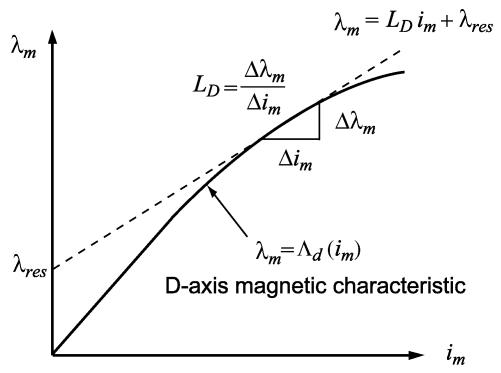  
Fig. 1. Piecewise linear representation of magnetic saturation.

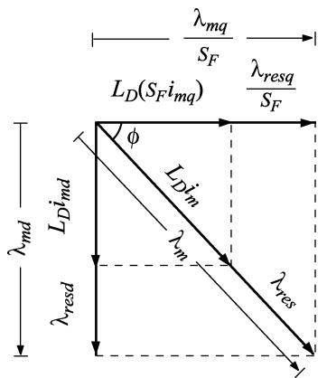  
Fig. 2. Projections of the magnetizing and residual fluxes onto - axes.

where $\lambda _ { r e s }$ is the residual flux, and $L _ { D }$ is the local slope, the incremental inductance, as defined by (6).

As the machine equations are expressed in coordinates, the linear relationship (7) is projected into the axes as shown in Fig. 2. Thus, according to Fig. 2, the projections of the main magnetizing flux is found as

$$
\frac {\lambda_ {m q}}{S _ {F}} = L _ {D} \left(S _ {F} i _ {m q}\right) + \frac {\lambda_ {r e s q}}{S _ {F}} \tag {8}
$$

$$
\lambda_ {m d} = L _ {D} i _ {m d} + \lambda_ {r e s d} \tag {9}
$$

where residual fluxes are also found as

$$
\lambda_ {r e s q} = \lambda_ {r e s} \cos \phi \cdot S _ {F} \tag {10}
$$

$$
\lambda_ {r e s d} = \lambda_ {r e s} \sin \phi . \tag {11}
$$

Here, the angle takes into account the position of the main flux within the rotor reference frame, coordinates.

# III. SATURABLE VOLTAGE-BEHIND-REACTANCE MODEL

The saturable VBR synchronous machine model is derived based on the model given in [29] (see [29, (17)–(26)]) and the piecewise linear representation of the saturation described in Section II. The magnetizing currents $i _ { m q }$ and $i _ { m d }$ in (8) and (9) are first replaced by the corresponding winding currents as

$$
\lambda_ {m q} = L _ {D} S _ {F} ^ {2} \left(i _ {q s} + i _ {k q 1} + i _ {k q 2}\right) + \lambda_ {r e s q} \tag {12}
$$

$$
\lambda_ {m d} = L _ {D} \left(i _ {d s} + i _ {f d} + i _ {k d}\right) + \lambda_ {r e s d}. \tag {13}
$$

Based on the model given in [29], the rotor currents are solved from the rotor flux linkage equations (see [29, (23) and (24)]) and substituting them into (12) and (13), the axes magnetizing flux linkages (12) and (13) are expressed in terms of stator currents and rotor flux linkages as

$$
\lambda_ {m q} = L _ {m q} ^ {\prime \prime} \left(i _ {q s} + \frac {\lambda_ {k q 1}}{L _ {l k q 1}} + \frac {\lambda_ {k q 2}}{L _ {l k q 2}}\right) + \frac {L _ {m q} ^ {\prime \prime}}{L _ {D} S _ {F} ^ {2}} \lambda_ {r e s q} \tag {14}
$$

$$
\lambda_ {m d} = L _ {m d} ^ {\prime \prime} \left(i _ {d s} + \frac {\lambda_ {f d}}{L _ {l f d}} + \frac {\lambda_ {k d}}{L _ {l k d}}\right) + \frac {L _ {m d} ^ {\prime \prime}}{L _ {D}} \lambda_ {r e s d} \tag {15}
$$

where

$$
L _ {m q} ^ {\prime \prime} = \left(\frac {1}{L _ {D} S _ {F} ^ {2}} + \frac {1}{L _ {l k q 1}} + \frac {1}{L _ {l k q 2}}\right) ^ {- 1} \tag {16}
$$

$$
L _ {m d} ^ {\prime \prime} = \left(\frac {1}{L _ {D}} + \frac {1}{L _ {l f d}} + \frac {1}{L _ {l k d}}\right) ^ {- 1}. \tag {17}
$$

Therefore, the stator flux linkages can be reformulated by substituting (14) and (15) into the stator flux linkage equations (see [29, (21) and (22)]), respectively, which gives

$$
\lambda_ {q s} = L _ {q} ^ {\prime \prime} i _ {q s} + \lambda_ {q} ^ {\prime \prime} \tag {18}
$$

$$
\lambda_ {d s} = L _ {d} ^ {\prime \prime} i _ {d s} + \lambda_ {d} ^ {\prime \prime} \tag {19}
$$

where

$$
L _ {q} ^ {\prime \prime} = L _ {l s} + L _ {m q} ^ {\prime \prime} \tag {20}
$$

$$
L _ {d} ^ {\prime \prime} = L _ {l s} + L _ {m d} ^ {\prime \prime} \tag {21}
$$

and

$$
\lambda_ {q} ^ {\prime \prime} = L _ {m q} ^ {\prime \prime} \left(\frac {\lambda_ {k q 1}}{L _ {l k q 1}} + \frac {\lambda_ {k q 2}}{L _ {l k q 2}} + \frac {\lambda_ {r e s q}}{L _ {D} S _ {F} ^ {2}}\right) \tag {22}
$$

$$
\lambda_ {d} ^ {\prime \prime} = L _ {m d} ^ {\prime \prime} \left(\frac {\lambda_ {f d}}{L _ {l f d}} + \frac {\lambda_ {k d}}{L _ {l k d}} + \frac {\lambda_ {r e s d}}{L _ {D}}\right). \tag {23}
$$

Solving the rotor flux linkage equations (see [29, (23) and (24)]) for rotor currents and substituting them into the rotor voltage equation (see [29, (20)]), the rotor state-space equations are therefore formulated as

$$
p \lambda_ {j} = - \frac {r _ {j}}{L _ {l j}} \left(\lambda_ {j} - \lambda_ {m q}\right) + v _ {j}; \quad j = k q 1, k q 2 \tag {24}
$$

$$
p \lambda_ {j} = - \frac {r _ {j}}{L _ {l j}} \left(\lambda_ {j} - \lambda_ {m d}\right) + v _ {j}; \quad j = f d, k d. \tag {25}
$$

Substituting (18) and (19) into the stator voltage equations (see [29, (17) and (18)]), respectively, the stator voltage equations can be rewritten as

$$
v _ {q s} = r _ {s} i _ {q s} + \omega_ {r} L _ {d} ^ {\prime \prime} i _ {d s} + p L _ {q} ^ {\prime \prime} i _ {q s} + \omega_ {r} \lambda_ {d} ^ {\prime \prime} + p \lambda_ {q} ^ {\prime \prime} \tag {26}
$$

$$
v _ {d s} = r _ {s} i _ {d s} - \omega_ {r} L _ {q} ^ {\prime \prime} i _ {q s} + p L _ {d} ^ {\prime \prime} i _ {d s} - \omega_ {r} \lambda_ {q} ^ {\prime \prime} + p \lambda_ {d} ^ {\prime \prime}. \tag {27}
$$

The terms $p \lambda _ { q } ^ { \prime \prime }$ in (26) is calculated by taking the derivatives of (22) as

$$
p \lambda_ {q} ^ {\prime \prime} = \frac {L _ {m q} ^ {\prime \prime}}{L _ {l k q 1}} p \lambda_ {k q 1} + \frac {L _ {m q} ^ {\prime \prime}}{L _ {l k q 2}} p \lambda_ {k q 2} + \frac {L _ {m q} ^ {\prime \prime}}{L _ {D} S _ {F} ^ {2}} p \lambda_ {r e s q}. (2 8)
$$

In (28), $p \lambda _ { k q 1 }$ and $p \lambda _ { k q 2 }$ are eliminated by substituting the rotor state (24) and $p \lambda _ { r e s q }$ is derived by calculating the derivative of (10). These manipulations lead to

$$
\begin{array}{l} p \lambda_ {q} ^ {\prime \prime} = \frac {L _ {m q} ^ {\prime \prime} r _ {k q 1}}{L _ {l k q 1} ^ {2}} \left(\lambda_ {q} ^ {\prime \prime} - \lambda_ {k q 1}\right) + \frac {L _ {m q} ^ {\prime \prime} r _ {k q 2}}{L _ {l k q 2} ^ {2}} \left(\lambda_ {q} ^ {\prime \prime} - \lambda_ {k q 2}\right) \\ + L _ {m q} ^ {\prime \prime 2} \left(\frac {r _ {k q 1}}{L _ {l k q 1} ^ {2}} + \frac {r _ {k q 2}}{L _ {l k q 2} ^ {2}}\right) i _ {q s} - \frac {L _ {m q} ^ {\prime \prime}}{L _ {D} S _ {F}} \lambda_ {r e s d} \frac {d \phi}{d t}. \tag {29} \\ \end{array}
$$

Similar procedure is applied to $p \lambda _ { d } ^ { \prime \prime }$ which gives the following result:

$$
\begin{array}{l} p \lambda_ {d} ^ {\prime \prime} = \frac {L _ {m d} ^ {\prime \prime} r _ {f d}}{L _ {l f d} ^ {2}} (\lambda_ {d} ^ {\prime \prime} - \lambda_ {f d}) + \frac {L _ {m d} ^ {\prime \prime} r _ {k d}}{L _ {l k d} ^ {2}} (\lambda_ {d} ^ {\prime \prime} - \lambda_ {k d}) \\ + L _ {m d} ^ {\prime \prime 2} \left(\frac {r _ {f d}}{L _ {l f d} ^ {2}} + \frac {r _ {k d}}{L _ {l k d} ^ {2}}\right) i _ {d s} + \frac {L _ {m d} ^ {\prime \prime}}{L _ {D} S _ {F}} \lambda_ {r e s q} \frac {d \phi}{d t} + \frac {L _ {m d} ^ {\prime \prime}}{L _ {l f d}} v _ {f d}. \tag {30} \\ \end{array}
$$

The stator voltage equations are then expressed by substituting (29), (30) into (26) and (27), respectively, as

$$
v _ {q s} = r _ {s} i _ {q s} + \omega_ {r} L _ {d} ^ {\prime \prime} i _ {d s} + p L _ {q} ^ {\prime \prime} i _ {q s} + v _ {q} ^ {\prime \prime} \tag {31}
$$

$$
v _ {d s} = r _ {s} i _ {d s} - \omega_ {r} L _ {q} ^ {\prime \prime} i _ {q s} + p L _ {d} ^ {\prime \prime} i _ {d s} + v _ {d} ^ {\prime \prime} \tag {32}
$$

where the subtransient voltages are

$$
\begin{array}{l} v _ {q} ^ {\prime \prime} = \omega_ {r} \lambda_ {d} ^ {\prime \prime} + \frac {L _ {m q} ^ {\prime \prime} r _ {k q 1}}{L _ {l k q 1} ^ {2}} \left(\lambda_ {q} ^ {\prime \prime} - \lambda_ {k q 1}\right) + \frac {L _ {m q} ^ {\prime \prime} r _ {k q 2}}{L _ {l k q 2} ^ {2}} \left(\lambda_ {q} ^ {\prime \prime} - \lambda_ {k q 2}\right) \\ + L _ {m q} ^ {\prime \prime 2} \left(\frac {r _ {k q 1}}{L _ {l k q 1} ^ {2}} + \frac {r _ {k q 2}}{L _ {l k q 2} ^ {2}}\right) i _ {q s} - \frac {\omega_ {\phi} L _ {m q} ^ {\prime \prime}}{L _ {D} S _ {F}} \lambda_ {r e s d} \tag {33} \\ \end{array}
$$

$$
\begin{array}{l} v _ {d} ^ {\prime \prime} = - \omega_ {r} \lambda_ {q} ^ {\prime \prime} + \frac {L _ {m d} ^ {\prime \prime} r _ {f d}}{L _ {l f d} ^ {2}} (\lambda_ {d} ^ {\prime \prime} - \lambda_ {f d}) + \frac {L _ {m d} ^ {\prime \prime} r _ {k d}}{L _ {l k d} ^ {2}} (\lambda_ {d} ^ {\prime \prime} - \lambda_ {k d}) \\ + L _ {m d} ^ {\prime \prime 2} \left(\frac {r _ {f d}}{L _ {l f d} ^ {2}} + \frac {r _ {k d}}{L _ {l k d} ^ {2}}\right) i _ {d s} + \frac {\omega_ {\phi} L _ {m d} ^ {\prime \prime}}{L _ {D} S _ {F}} \lambda_ {r e s q} \\ + \frac {L _ {m d} ^ {\prime \prime}}{L _ {l f d}} v _ {f d} \tag {34} \\ \end{array}
$$

with the rate of change of the magnetizing flux angle given as

$$
\omega_ {\phi} = \frac {d \phi}{d t}. \tag {35}
$$

The stator voltage equations of the VBR model are obtained by transforming (31) and (32) back to coordinates as

$$
\mathbf {v} _ {a b c s} = \mathbf {r} _ {s} \mathbf {i} _ {a b c s} + p \left[ \mathbf {L} _ {a b c s a t} ^ {\prime \prime} \left(\theta_ {r}\right) \mathbf {i} _ {a b c s} \right] + \mathbf {v} _ {a b c s} ^ {\prime \prime} \tag {36}
$$

where

$$
\begin{array}{l} \mathbf {L} _ {a b c s a t} ^ {\prime \prime} (\theta_ {r}) \\ = \left[ \begin{array}{c c c} L _ {S} \left(2 \theta_ {r}\right) & L _ {M} \left(2 \theta_ {r} - \frac {2 \pi}{3}\right) & L _ {M} \left(2 \theta_ {r} + \frac {2 \pi}{3}\right) \\ L _ {M} \left(2 \theta_ {r} - \frac {2 \pi}{3}\right) & L _ {S} \left(2 \theta_ {r} - \frac {4 \pi}{3}\right) & L _ {M} \left(2 \theta_ {r}\right) \\ L _ {M} \left(2 \theta_ {r} + \frac {2 \pi}{3}\right) & L _ {M} \left(2 \theta_ {r}\right) & L _ {S} \left(2 \theta_ {r} + \frac {4 \pi}{3}\right) \end{array} \right]. \tag {37} \\ \end{array}
$$

Here, $L _ { S }$ and $L _ { M }$ are saturation dependent and have the similar form as the magnetically linear VBR model documented in [29]. The subtransient back emfs in coordinates are given as

$$
\mathbf {v} _ {a b c s} ^ {\prime \prime} = \left[ \mathbf {K} _ {s} ^ {r} \left(\theta_ {r}\right) \right] ^ {- 1} \left[ v _ {q} ^ {\prime \prime} \quad v _ {d} ^ {\prime \prime} \quad 0 \right] ^ {T}. \tag {38}
$$

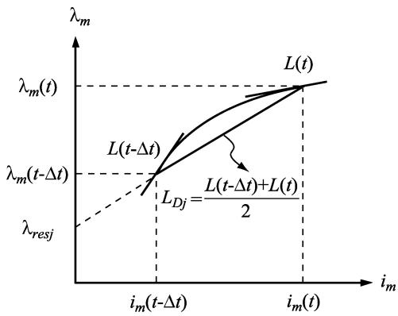  
Fig. 3. Piecewise-linear representation of the saturation characteristic using implicit trapezoidal rule.

Therefore, the stator voltage (36)–(38), the rotor state equations (24) and (25) along with the magnetizing flux linkages given by (14)–(17), the back emf (33) and (34), and the mechanical equations [31, (1) and (2)] defined the saturable VBR model.

# IV. MODEL IMPLEMENTATION

The implementation of saturable VBR synchronous machine model is similar to that of the original magnetically linear EMTP model [31] with additional challenges due to representation of nonlinear magnetic characteristic. Discretizing the stator voltage (31) using implicit trapezoidal rule with time step $\Delta t .$ the stator equation becomes

$$
\mathbf {v} _ {a b c s} (t) = \left(\mathbf {r} _ {s} + \frac {2}{\Delta t} \mathbf {L} _ {a b c s a t} ^ {\prime \prime} (t)\right) \mathbf {i} _ {a b c s} (t) + \mathbf {v} _ {a b c s} ^ {\prime \prime} (t) + \mathbf {e} _ {s h} (t) \tag {39}
$$

where the stator equivalent history voltage source is given as

$$
\begin{array}{l} \mathbf {e} _ {s h} (t) = \left(\mathbf {r} _ {s} - \frac {2}{\Delta t} \mathbf {L} _ {a b c s a t} ^ {\prime \prime} (t - \Delta t)\right) \mathbf {i} _ {a b c s} (t - \Delta t) \\ + \mathbf {v} _ {a b c s} ^ {\prime \prime} (t - \Delta t) - \mathbf {v} _ {a b c s} (t - \Delta t). \tag {40} \\ \end{array}
$$

In contrast to the model in [31], the subtransient inductance matrix $\mathbf { L } _ { a b c s a t } ^ { \prime \prime }$ in (39) is not only a function of the rotor displacement as shown in (37), but also depends on the magnetic saturation as indicated by (16) and (17). Therefore, the saturation characteristic (5) is also discretized using the implicit trapezoidal rule as

$$
\frac {L (t) + L (t - \Delta t)}{2} = \frac {\lambda_ {m} (t) - \lambda_ {m} (t - \Delta t)}{i _ {m} (t) - i _ {m} (t - \Delta t)}. \tag {41}
$$

This discretization step results in piecewise linear relationship shown in Fig. 3.

Based on (41) and (7), the piecewise linear saturation representation at the time point can be expressed as

$$
\lambda_ {m} (t) = L _ {D j} i _ {m} (t) + \lambda_ {r e s j} \tag {42}
$$

where

$$
L _ {D j} = \frac {L (t) + L (t - \Delta t)}{2} \tag {43}
$$

and

$$
\lambda_ {r e s j} = \lambda_ {m} (t - \Delta t) - L _ {D j} i _ {m} (t - \Delta t). \tag {44}
$$

Here, the equivalent dynamic magnetizing inductance $L _ { D j }$ represents the average of the magnetizing inductances $L ( t - \Delta t )$ and $L ( t )$ within one time step $\Delta t .$ . The residual flux $\lambda _ { r e s j }$ represents the contribution of the history terms $\lambda _ { m } ( t - \Delta i )$ and $i _ { m } ( t - \Delta t )$ . The subscript in (42)–(44) represents an arbitrary operating point corresponding to the discrete-time at time .

It is noted in (43) that $L _ { D j }$ is unknown for the solution at time as the magnetizing inductance $L ( t )$ depends on the magnetizing current or flux linkage at the same time step, which forms a nonlinear implicit relationship. To avoid solving the system of nonlinear equations using iterative methods, a linear extrapolation of the main flux linkage $\lambda _ { m } ( t )$ is used. Thus, the magnetizing inductance $L ( t )$ can be calculated using the magnetic saturation characteristic (5).

The next step requires discretizing the rotor state equations (24) and (25) using implicit trapezoidal rule. After substituting $\lambda _ { m q }$ and $\lambda _ { m d }$ in (24) and (25) with magnetizing flux linkages (14) and (15) and rearranging terms, we get

$$
\begin{array}{l} \left[ \begin{array}{c} \lambda_ {k q 1} (t) \\ \lambda_ {k q 2} (t) \end{array} \right] = \mathbf {E} _ {1} i _ {q s} (t) + \mathbf {E} _ {2} \left[ \begin{array}{c} \lambda_ {k q 1} (t - \Delta t) \\ \lambda_ {k q 2} (t - \Delta t) \end{array} \right] \\ + \mathbf {E} _ {1} i _ {q s} (t - \Delta t) + \mathbf {E} _ {3} \lambda_ {r e s j q} (t) \tag {45} \\ \end{array}
$$

$$
\begin{array}{l} \left[ \begin{array}{c} \lambda_ {f d} (t) \\ \lambda_ {k d} (t) \end{array} \right] = \mathbf {F} _ {1} i _ {d s} (t) + \mathbf {F} _ {2} \left[ \begin{array}{c} \lambda_ {f d} (t - \Delta t) \\ \lambda_ {k d} (t - \Delta t) \end{array} \right] + \mathbf {F} _ {1} i _ {d s} (t - \Delta t) \\ + \mathbf {F} _ {3} \lambda_ {r e s j d} (t) + \mathbf {F} _ {4} v _ {f d} \tag {46} \\ \end{array}
$$

where the coefficient matrices $\mathbf { E } _ { 1 } , \mathbf { E } _ { 2 } , \mathbf { E } _ { 3 } , \mathbf { F } _ { 1 } , \mathbf { F } _ { 2 } , \mathbf { F } _ { 3 } .$ , and $\mathbf { F } _ { 4 }$ are defined for compactness similar to [31, Appendix $\mathbf { A } ]$ .

In order to calculate $\lambda _ { r e s j q } ( t )$ and $\lambda _ { r e s j d } ( t )$ in (45) and (46), the residual flux $\lambda _ { r e s j } ( t )$ is projected along the axes as shown in Fig. 2. Here, $\lambda _ { r e s j } ( t )$ is a known quantity calculated according to (44). The angle $\phi$ between $\lambda _ { m q }$ and $\lambda _ { m }$ is also required so that (10) and (11) may be calculated. This angle $\phi$ is calculated by discretizing (35) using trapezoidal rule as

$$
\phi (t) = \phi (t - \Delta t) + \frac {\Delta t}{2} \left(\omega_ {\phi} (t) + \omega_ {\phi} (t - \Delta t)\right) \tag {47}
$$

where the rotating speed $\omega _ { \phi } ( t )$ of the flux angle $\phi$ is predicted by the linear extrapolation.

The subtransient voltages are considered next. In particular, $\mathbf { v } _ { q d } ^ { \prime \prime }$ are formulated by substituting (45) and (46) into (33) and (34) as

$$
\mathbf {v} _ {q d} ^ {\prime \prime} (t) = \left[ \begin{array}{l l} \mathbf {k} _ {1} \left(\omega_ {r}\right) & \mathbf {k} _ {2} \left(\omega_ {r}\right) \end{array} \right] \mathbf {i} _ {q d s} (t) + \mathbf {h} _ {q d r} (t). \tag {48}
$$

Here, the coefficient vectors $\mathbf { k } _ { 1 } ( \omega _ { r } ) , \mathbf { k } _ { 2 } ( \omega _ { r } )$ , and $\mathbf { h } _ { q d r } ( t )$ are defined similarly to [31, Appendix A]. These subtransient voltages are then transformed back to coordinates, which gives the following result:

$$
\mathbf {v} _ {a b c s} ^ {\prime \prime} (t) = \mathbf {K} (t) \mathbf {i} _ {a b c s} (t) + \mathbf {e} _ {r} (t) \tag {49}
$$

where

$$
\mathbf {K} (t) = \left[ \mathbf {K} _ {s} ^ {r} \left(\theta_ {r}\right) \right] ^ {- 1} \left[ \begin{array}{c c c} \mathbf {k} _ {1} \left(\omega_ {r}\right) & \mathbf {k} _ {2} \left(\omega_ {r}\right) & 0 _ {2 \times 1} \\ 0 & 0 & 0 \end{array} \right] \mathbf {K} _ {s} ^ {r} \left(\theta_ {r}\right) \tag {50}
$$

and

$$
\mathbf {e} _ {r} (t) = \left[ \mathbf {K} _ {s} ^ {r} \left(\theta_ {r}\right) \right] ^ {- 1} \left[ \begin{array}{c} \mathbf {h} _ {q d r} (t) \\ 0 \end{array} \right]. \tag {51}
$$

Substituting (49) into the stator voltage (39), the saturable VBR model has the following standard form:

$$
\mathbf {v} _ {a b c s} (t) = \mathbf {R} _ {e q} (t) \mathbf {i} _ {a b c s} (t) + \mathbf {e} _ {h} (t) \tag {52}
$$

which is used for interfacing with the external network. Here, the final equivalent resistance matrix and the history terms are

$$
\mathbf {R} _ {e q} (t) = \mathbf {r} _ {s} + \frac {2}{\Delta t} \mathbf {L} _ {a b c s a t} ^ {\prime \prime} (t) + \mathbf {K} (t) \tag {53}
$$

and

$$
\mathbf {e} _ {h} (t) = \mathbf {e} _ {r} (t) + \mathbf {e} _ {s h} (t). \tag {54}
$$

The discretization of mechanical equations can be found in [31], and is not included here due to space considerations.

# V. CASE STUDIES

The proposed model has been implemented according to the EMTP solution methodology. For comparison purpose, a statevariable saturable synchronous machine model, based on the generalized flux space vector concept [9]–[11], has also been implemented in MATLAB/Simulink. Without loss of generality, the model using $i _ { d s } , i _ { q s } , \lambda _ { m d } , \lambda _ { m q } , i _ { k d }$ , and $i _ { k q 2 }$ as state variables [10, Section $4 . 2 ]$ is chosen here. This model has been implemented without any approximation to include both steadystate and dynamic -axes cross saturation. This model is solved using fourth-order Runge-Kutta method with a very small time step of 1 to obtain very accurate numerical solutions, which are used as a reference. A synchronous-machine infinite-bus system is considered here. A salient-pole hydro turbine machine is used and the machine parameters are given in [19, Table 5.10-1].

# A. Change of Excitation Voltage Without Load

A case of unloaded synchronous machine is considered first as to verify the model when the rotor is aligned with the main magnetizing flux. In addition to the proposed saturable VBR model and the reference model [10], the built-in synchronous machine model in EMTP-RV (linear and saturable) is used as well. As the salient-pole synchronous machine model in EMTP-RV uses two independent saturation representations for $q$ and axes, the $q d$ cross saturation is ignored. For the purpose of model verification, without loss of generality, the two-slope saturation curve is used here for consistency with EMTP-RV’s piecewise linear saturation representation. This makes it easier to define the same operating point for various models when

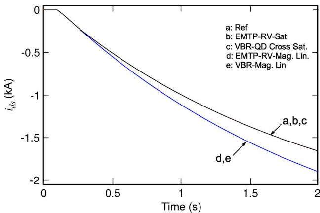  
Fig. 4. Response of the stator -axis currents $i _ { d s }$ to the change in excitation under no load conditions.

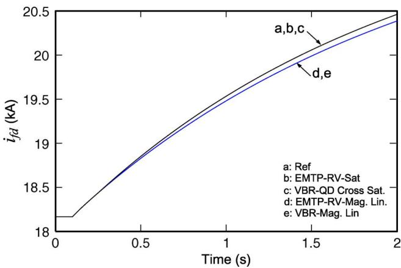  
Fig. 5. Response of the field winding currents $i _ { f d }$ to the change in excitation under no load conditions.

machine operates in unsaturated region. The typical EMTP time step of 50 is used for all the subject models.

Initially, the synchronous machine is assumed to operate in steady state with the field excitation voltage $E _ { f }$ set to 1 pu, (i.e., 16.33 kV) and zero mechanical torque. ${ \mathrm { A t ~ } } t = 0 . 1 { \mathrm { s } } .$ , the excitation voltage $E _ { f }$ is stepped up to 1.2 pu (i.e., 19.6 kV) so that the machine starts to operate in overexcited mode. As the machine operates without load, it is appropriate to look into the effect of -axis saturation only. The predicted transient responses are shown in Figs. 4–6, respectively.

It is observed in Figs. 4–6 that initially all models (linear and saturable) predict the same operating condition. After $t ~ = ~ 0 . 1 ~ \mathrm { s } .$ , the saturable VBR (VBR-QD-CrossSat.) and EMTP-RV’s models (EMTP-RV-Sat) give the identical transient responses that are consistent with the reference model [10]. At the same time, the two linear models (VBR-Mag.Lin) and (EMTP-RV-Mag.Lin) also predict consistent and matching transient responses that visibly deviate from the saturable models as shown in Figs. 4–6. It is also noted that to obtain the results of Figs. 4–6 using the EMTP-RV, the stator current $i _ { d s }$ and the magnetizing flux $\lambda _ { m d }$ had to be rescaled by a factor of $\sqrt { 2 / 3 }$ since this program uses a power invariant transformation matrix [23].

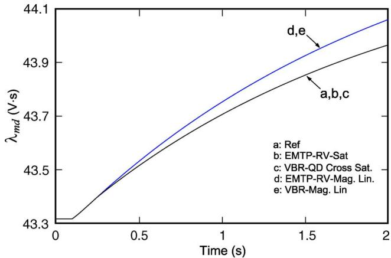  
Fig. 6. Response in magnetizing flux in -axis $\lambda _ { m d }$ to the change in excitation under no load conditions.

# B. Change of Load Torque

In this subsection, the impact of including the -axis and -axis cross saturation on the accuracy of machine modeling is studied. The saturable VBR model is implemented using the method described in Sections II–IV. The smooth saturation curve is used for the studies considered herein to demonstrate the generality and effectiveness of the proposed saturation modeling method. The linear VBR model is also considered for comparison. In addition to that, a VBR model that includes the saturation along the -axis only has also been implemented. Such model can represent the PSCAD built-in model, where only the -axis saturation is included.

In the following transient study, the machine initially operates under no-load steady state with the field excitation $E _ { f }$ set to 1 pu (i.e., 16.33 kV). As the smooth saturation curve is used, this operating condition corresponds to under-excited mode $( i _ { d s } < 0 )$ due to the reduced -axis magnetizing flux $\lambda _ { m d }$ . To achieve the same initial operating point for the magnetically linear model, the modified-air-gap-line with $L _ { m d } ~ = ~ 2 . 2 0 4 4$ is used. Similar approach has been used in [10] for achieving the same steady-state operating condition for the unsaturated model. At $t = 0 . 1 \ : \mathrm { s } ,$ a mechanical load torque $T _ { m } = 1$ is applied, bringing the machine into the motor operation. As the rotor angle becomes significant, the -axis currents, and the importance of including -axis and -axes cross saturation become apparent. The transient responses of the stator currents $i _ { q s }$ and $i _ { d s }$ , the magnetizing flux linkages $\lambda _ { m q }$ and $\lambda _ { m d } .$ and the rotor angle predicted by various models are shown in Figs. 7–11.

It is seen in Figs. 7 and 9 that the -axis current $i _ { q s }$ and the flux linkage $\lambda _ { m q }$ are increased significantly due to the applied load torque. At the same time, the -axis magnetizing flux linkage is slightly reduced as shown in Fig. 10. Therefore, it can be verified that the main flux of the equivalent isotropic machine, represented by (2), has shifted its direction and now has significant projections onto both and axes. This new operating condition corresponds to a different saturation level as well. It is also observed in Figs. 7–11 that the saturable VBR model (VBR-QD-CrossSat.) including the -axis cross saturation predicted transient responses identical the reference model [10]. However, the -axis saturable (Sat. D-axis only) and magnetically linear

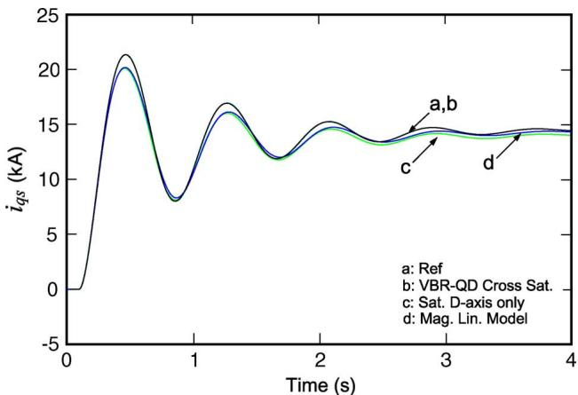  
Fig. 7. Response in stator -axis currents $i _ { q s }$ to change in load torque.

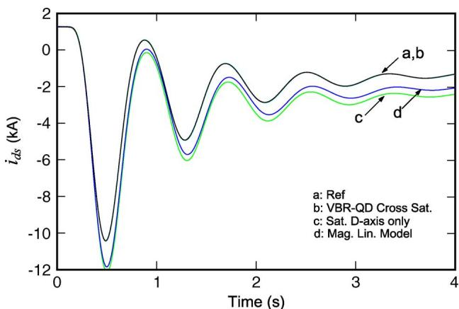  
Fig. 8. Response in stator -axis currents $i _ { d , s }$ to change in load torque.

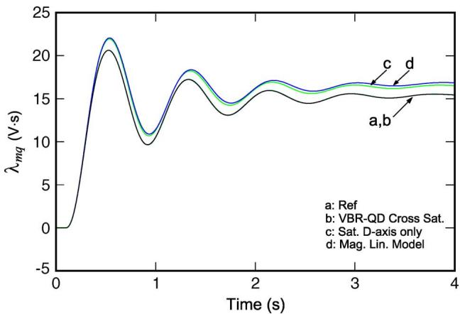  
Fig. 9. Response in magnetizing flux linkages along -axis $\lambda _ { m q }$

(Mag. Lin. Model) models predict visibly different transient responses compared with the reference. In fact, the performance of the -axis saturable model is very close to the magnetically linear model in terms of predicting the -axis current and flux linkage in Figs. 7 and 9, respectively. For predicting the -axis current and flux, the -axis saturable (Sat. D-axis only) is also less accurate than the full saturable VBR model. The omission of the -axis saturation (Sat. D-axis only) may lead to a noticeable error in predicting the rotor angle as shown in Fig. 11.

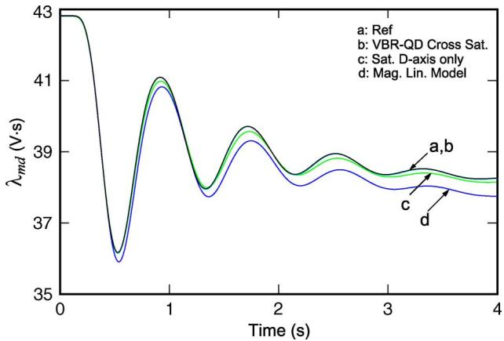  
Fig. 10. Response in magnetizing flux linkages along -axis $\lambda _ { m d }$

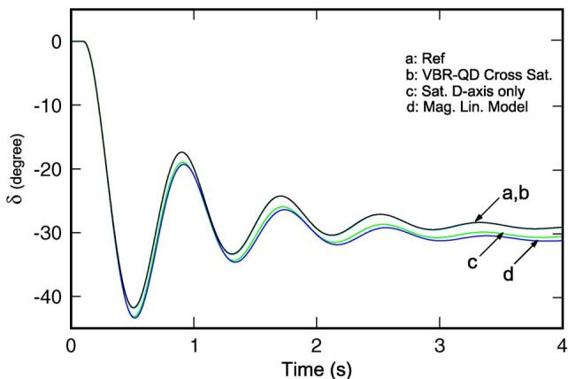  
Fig. 11. Response in rotor angles  to the change in load torque.

# C. Change of Stator Terminal Voltage Under Full Load

In order to verify the accuracy of the proposed saturation modeling approach for large integration time steps, the same saturable VBR model has been implemented with the time step of 50 and $5 0 0 ~ \mu \mathrm { s }$ in this subsection. The synchronous machine is initially operated at full load, $T _ { m } = 1 \mathrm { p u }$ , with the rated field voltage, $E _ { f } = 1$ . For the purpose of comparison, the magnetically linear VBR model is implemented again, wherein the modified-air-gap-line magnetizing inductances $L _ { m d } = 2 . 1 6 9$ and $L _ { m q } = 1 . 0 7$ are used so that the same initial steady-state operating point is established for all machine models. The smooth saturation characteristic is used here for all saturable models. $\mathrm { A t } t = 0 . 2 \mathrm { s } ,$ the stator terminal voltages are increased from 1 pu to 1.05 pu. Similar case studies have been also used in [10] and [11] for investigating synchronous machine saturation modeling and are considered very appropriate and informative.

Figs. 12–14 show the transient responses of the stator currents $i _ { q s }$ and $i _ { d s } ,$ , and the rotor angle , as predicted by various models considered in this subsection. As it can be clearly seen in Figs. 12–14, the transient responses produced by the saturable models are visibly different from those produced by the magnetically linear model (which converges to a slightly different operating point). At the same time, the responses produced by the saturable VBR model, even with a large time step of 500 $\mu \mathrm { s } ,$ closely follow the solutions produced by the reference model

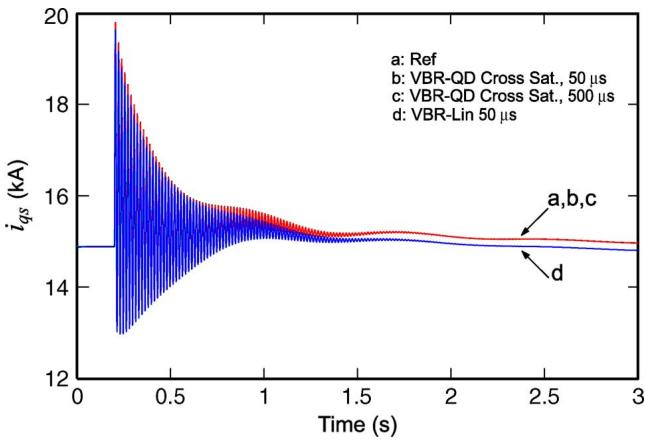  
Fig. 12. Response in stator -axis currents $i _ { q s }$ under full load conditions.

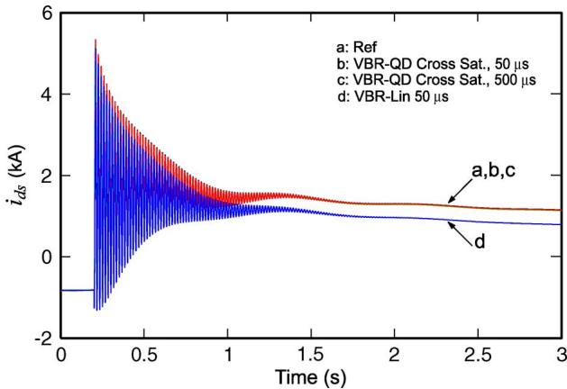  
Fig. 13. Response in stator -axis currents $i _ { d s }$ under full load conditions.

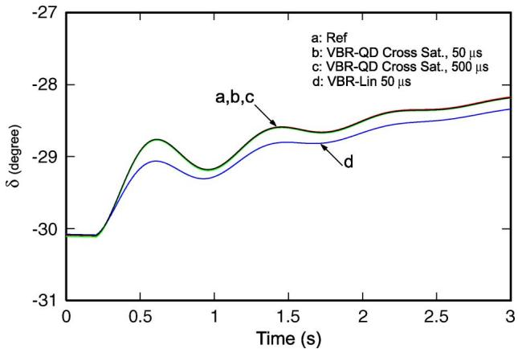  
Fig. 14. Response in rotor angles  under full load conditions.

[10]. This confirms the ability of the proposed saturable VBR model to use a large time step, which is consistent with what has been demonstrated previously for the magnetically linear VBR models [31], [33].

# VI. CONCLUSION

This paper extends the previous work and proposes a magnetically saturable VBR synchronous machine model that achieves a direct interface for EMTP-type solution. The model is very flexible and can be applied to synchronous machines

with salient or round rotors. The piecewise linear representation of the saturation curve is used, which provides a convenient means to implement the nonlinear magnetic characteristic in a non-iterative EMTP-type solution. A saliency factor approach is applied, which enables proper representation of the -axis cross saturation in steady state and transients with the accuracy sufficient for most power systems studies and is an improvement over considering -axis saturation only. Case studies demonstrate that proposed saturable VBR synchronous machine model also maintains its numerical accuracy at large time steps. This should further extend the range of application of machine models used in EMTP in terms of maintaining good accuracy for systems studies where a use of large time step may be desirable.

# APPENDIX

-axis saturation data for the arctangent function representation [13]: $\lambda _ { T } = 4 3 . 3 9 6 2 \mathrm { V } \cdot \mathrm { s } , \tau _ { T } = 0 . 3 ( 1 / \mathrm { V } \cdot \mathrm { s } ) , M _ { a } =$ 730.58 $\mathrm { ( 1 / H ) } , M _ { d } = 3 3 1 . 1 6 5 \ : \mathrm { ( 1 / H ) }$ .

-axis saturation data for the two-slope piecewise linear representation: $I _ { s a t } = 1 8 . 2 \mathrm { k A } , L _ { m d s a t } = 0 . 9 5 3 8$ .

# REFERENCES

[1] J. E. Brown, K. P. Kovacs, and P. Vas, “A method of including the effects of main flux path saturation in the generalized equations of AC machines,” IEEE Trans. Power App. Syst., vol. PAS-102, no. 1, pp. 96–103, Jan. 1983.   
[2] F. P. de Mello and L. N. Hannett, “Representation of saturation in synchronous machines,” IEEE Trans. Power Syst., vol. 1, no. 4, pp. 8–18, Nov. 1986.   
[3] I. Boldea and S. A. Nasar, “A general equivalent circuit of electric machines including crosscoupling saturation and frequency effects,” IEEE Trans. Energy Convers., vol. 3, no. 3, pp. 689–695, Sep. 1988.   
[4] A. M. El-Serafi, A. S. Abdallah, M. K. El-Sherbiny, and E. H. Badawy, “Experimental study of the saturation and the cross-magnetizing phenomenon in saturated synchronous machines,” IEEE Trans. Energy Convers., vol. 3, no. 4, pp. 815–823, Dec. 1988.   
[5] J. O. Ojo and T. A. Lipo, “An improved model for saturated salient pole synchronous motors,” IEEE Trans. Energy Convers., vol. 4, no. 1, pp. 135–142, Mar. 1989.   
[6] G. R. Slemon, “An equivalent circuit approach to analysis of synchronous machines with saliency and saturation,” IEEE Trans. Energy Convers., vol. 5, no. 3, pp. 538–545, Sep. 1990.   
[7] K. Hirayama, “Practical detailed model for generators,” IEEE Trans. Energy Convers., vol. 10, no. 1, pp. 105–110, Mar. 1995.   
[8] S.-A. Tahan and I. Kamwa, “A two-factor saturation model for synchronous machines with multiple rotor circuits,” IEEE Trans. Energy Convers., vol. 10, no. 4, pp. 609–616, Dec. 1995.   
[9] E. Levi, “Modelling of magnetic saturation in smooth air-gap synchronous machines,” IEEE Trans. Energy Convers., vol. 12, no. 2, pp. 151–156, Jun. 1995.   
[10] E. Levi, “State-space d-q axis models of saturated salient pole synchronous machines,” Proc. Inst. Elect. Eng., Elect. Power Appl., vol. 145, no. 3, pp. 206–216, May 1998.   
[11] E. Levi, “Saturation modeling in D-Q axis models of salient pole synchronous machines,” IEEE Trans. Energy Convers., vol. 14, no. 1, pp. 44–50, Mar. 1999.   
[12] J. R. Marti and K. W. Louie, “A phase-domain synchronous generator model including saturation effects,” IEEE Trans. Power Syst., vol. 12, no. 1, pp. 222–229, Feb. 1997.   
[13] K. A. Corzine, B. T. Kuhn, S. D. Sudhoff, and H. J. Hegner, “An improved method for incorporating magnetic saturation in the q-d synchronous machine model,” IEEE Trans. Energy Convers., vol. 13, no. 3, pp. 270–275, Sep. 1998.   
[14] A. M. El-Serafi and N. C. Kar, “Methods for determining the intermediate-axis saturation characteristics of salient-pole synchronous machines from the measured d-axis characteristics,” IEEE Trans. Energy Convers., vol. 20, no. 1, pp. 88–97, Mar. 2005.

[15] D. C. Aliprantis, S. D. Sudhoff, and B. T. Kuhn, “A synchronous machine model with saturation and arbitrary rotor network representation,” IEEE Trans. Energy Convers., vol. 20, no. 3, pp. 584–594, Sep. 2005.   
[16] D. C. Aliprantis, S. D. Sudhoff, and B. T. Kuhn, “Experimental characterization procedure for a synchronous machine model with saturation and arbitrary rotor network representation,” IEEE Trans. Energy Convers., vol. 20, no. 3, pp. 595–603, Sep. 2005.   
[17] N. C. Kar and A. M. El-Serafi, “Measurement of the saturation characteristics in the quadrature axis of synchronous machines,” IEEE Trans. Energy Convers., vol. 21, no. 3, pp. 690–698, Sep. 2006.   
[18] H. W. Dommel, EMTP Theory Book. Vancouver, BC, Canada: MicroTran Power System Analysis Corp., May 1992.   
[19] P. C. Krause, O. Wasynczuk, and S. D. Sudhoff, Analysis of Electric Machine, 2nd ed. Piscataway, NJ: IEEE Press, 2002.   
[20] “Alternative Transients Programs,” ATP-EMTP, ATP User Group,, 2007. [Online]. Available: http://www.emtp.org.   
[21] “MicroTran Reference Manual,” MicroTran Power System Analysis Corp., Vancouver, BC, Canada, 1997. [Online]. Available: http://www. microtran.com.   
[22] “PSCAD/EMTDC V4.2 On-Line Help,” Manitoba HVDC Research Centre and RTDS Technologies Inc., 2009.   
[23] “Electromagnetic Transient Program,” EMTP RV, CEA Technologies Inc., 2007. [Online]. Available: http://www.emtp.com.   
[24] V. Brandwajn, “Representation of magnetic saturation in the synchronous machine model in an electro-magnetic transients program,” IEEE Trans. Power App. Syst., vol. PAS-99, no. 5, pp. 1996–2002, Sep./Oct. 1980.   
[25] H. K. Lauw and W. S. Meyer, “Universal machine modeling for the representation of rotating electrical machinery in an electromagnetic transients program,” IEEE Trans. Power App. Syst., vol. PAS-101, pp. 1342–1351, 1982.   
[26] A. B. Dehkordi, P. Neti, A. M. Gole, and T. L. Maguire, “Development and validation of a comprehensive synchronous machine model for a real-time environment,” IEEE Trans. Energy Convers., vol. 25, no. 1, pp. 34–48, Mar. 2010.   
[27] A. B. Dehkordi, D. S. Ouellette, and P. A. Forsyth, “Protection testing of a 100% stator ground fault using a phase domain synchronous machine model in real time,” in Proc. 10th IET Int. Conf. Developments in Power System Protection (DPSP 2010), 2000, pp. 1–5.   
[28] A. B. Dehkordi, A. M. Gole, and T. L. Maguire, “Permanent magnet synchronous machine model for real-time simulation,” in Proc. Int. Conference on Power Systems Transients (IPST’05), Montreal, QC, Canada, Jun. 2005.   
[29] S. D. Pekarek, O. Wasynczuk, and H. J. Hegner, “An efficient and accurate model for the simulation and analysis of synchronous machine/converter systems,” IEEE Trans. Energy Convers., vol. 13, no. 1, pp. 42–48, Mar. 1998.   
[30] L. Wang, J. Jatskevich, and S. Pekarek, “Modeling of induction machines using a voltage-behind-reactance formulation,” IEEE Trans. Energy Convers., vol. 23, no. 2, pp. 382–392, Jun. 2008.   
[31] L. Wang and J. Jatskevich, “A voltage-behind-reactance synchronous machine model for the EMTP-type solution,” IEEE Trans. Power Syst., vol. 21, no. 4, pp. 1539–1549, Nov. 2006.   
[32] L. Wang, J. Jatskevich, C. Wang, and P. Li, “A voltage-behind-reactance induction machine model for the EMTP-type solution,” IEEE Trans. Power Syst., vol. 23, no. 3, pp. 1226–1238, Aug. 2008.

[33] L. Wang, J. Jatskevich, and H. W. Dommel, “Reexamination of synchronous machine modeling techniques for electromagnetic transient simulations,” IEEE Trans. Power Syst., vol. 22, no. 3, pp. 1221–1230, Aug. 2007.   
[34] S. D. Pekarek, E. A. Walters, and B. T. Kuhn, “An efficient and accurate method of representing magnetic saturation in physical-variable models of synchronous machines,” IEEE Trans. Energy Convers., vol. 14, no. 1, pp. 72–79, Mar. 1999.   
[35] D. C. Aliprantis, O. Wasynczuk, and C. D. Rodriguez Valdez, “A voltage-behind-reactance synchronous machine model with saturation and arbitrary rotor network representation,” IEEE Trans. Energy Convers., vol. 23, no. 2, pp. 499–508, Jun. 2008.   
[36] L. Wang and J. Jatskevich, “Including magnetic saturation in voltagebehind-reactance induction machine model for EMTP-type solution,” IEEE Trans. Power Syst., vol. 25, no. 2, pp. 975–987, May 2010.

Liwei Wang (S’04–M’10) received the M.S. degree in electrical engineering from Tianjin University, Tianjin, China, and the Ph.D. degree in electrical and computer engineering from the University of British Columbia, Vancouver, BC, Canada, in 2004 and 2010, respectively.

In 2009, he was an internship researcher at the ABB Switzerland Corporate Research, Baden, Switzerland. Until August 2010, he was a Postdoctoral Research Fellow in the Department of Electrical and Computer Engineering, University of

British Columbia, after which he joined the ABB Sweden Corporate Research, Västerås, Sweden. His research interests include power system analysis and operation, electrical machine and drives, power electronic system and controls, HVDC systems, renewable energy sources, and distributed generation.

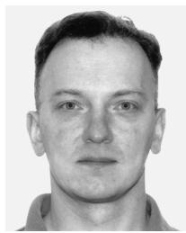

Juri Jatskevich (M’99–SM’07) received the M.S.E.E. and Ph.D. degrees in electrical engineering from Purdue University, West Lafayette, IN, in 1997 and 1999, respectively.

Since 2002, he has been a faculty member at the University of British Columbia, Vancouver, BC, Canada, where he is now an Associate Professor of electrical and computer engineering. His research interests include energy grids, power electronic systems, electrical machines and drives, and modeling and simulation of electromagnetic transients.

Dr. Jatskevich is presently an Editor of the IEEE TRANSACTIONS ON ENERGY CONVERSION, an Editor of IEEE POWER ENGINEERING LETTERS, and an Associate Editor of IEEE POWER ELECTRONICS. He chaired the IEEE CAS Power Systems & Power Electronic Circuits Technical Committee in 2009–2010. He is also chairing the IEEE Task Force on Dynamic Average Modeling, under Working Group on Modeling and Analysis of System Transients Using Digital Programs.