# An Improved Low-Frequency Transformer Model for Use in GIC Studies

W. Chandrasena, P. G. McLaren, Fellow, IEEE, U. D. Annakkage, Member, IEEE, and R. P. Jayasinghe, Member, IEEE

Abstract—A hysteresis model based on the Jiles–Atherton theory is incorporated into a power transformer model in an electromagnetic transient program (EMTP)-type program. The eddy current effects are also included in the same model. Comparisons are made between recorded and simulated waveforms using a single-phase distribution transformer. A good agreement is achieved between recorded and simulated data.

Index Terms—Eddy currents, hysteresis, losses, power transformers, simulation.

# I. INTRODUCTION

EOMAGNETICALLY induced currents (GICs) are the G ground effect of a complicated space weather chain that originates in the sun. The flow of GIC through power transformers has been the root cause of operational and equipment problems in power systems during a geomagnetic disturbance or geomagnetic storm [1].

At steady state, the magnetizing current of a power transformer is generally insignificant to the operation of power systems. However, during a GIC event current that flows through grounded-wye transformers results in a quasi dc current in the transformer high-voltage windings and, hence, results in severe half cycle saturation. Because of the half-cycle saturation, the transformer draws a large asymmetrical exciting current and it results in increased reactive power consumption as well as the generation of significant levels of harmonic currents [1]–[4]. The extent of the half-cycle saturation also depends on the history of the state of the magnetic core. Therefore, an electromagnetic transient simulation to analyze the effects of GIC on power systems requires accurate representation of the magnetizing characteristics of transformers. The correct representation of the hysteresis loop is important so that it handles long-term remanence and recoil loops [3]. In short time simulations, the piecewise linear solutions of saturation can give the impression that they handle remanence because the system time constants maintain the magnetization over several hundreds of milliseconds. However, over time scales of seconds, the flux will decay to zero. It is usually possible to initialize the remanence in a typical transformer model;

Manuscript received December 13, 2002. This work was supported by Manitoba Hydro. W. Chandrasena and U. D. Annakkage are with the Department of Electrical and Computer Engineering, University of Manitoba, Winnipeg, MB R3T 5V6, Canada. P. G. McLaren is with the Center for Advanced Power Systems, Florida State University, Tallahassee, FL 32310 USA. R. P. Jayasinghe is with Manitoba HVDC Research Centre, Winnipeg, MB R3J 3W1, Canada. Digital Object Identifier 10.1109/TPWRD.2004.824429

however, it requires outside intervention whereas our method presented in this paper will do it automatically.

During the past decade, a considerable effort has been devoted to the development of simulation models of power transformers [5]–[9]. These models contain a wide range of modeling details of the iron core of the transformer with varying degree of complexities.

There have been numerous approaches to modeling ferromagnetic hysteresis loops. A bibliographic review of the hysteresis models presented during the past three decades is given in [10]. Many of these attempts are curve fits, which ignore the underlying physics of the material behavior. At the other extreme, micromagnetic methods consider all known energies on a very small scale and find the domain configuration that gives the minimum energy. In general intermediate solutions models, which can relate microstructural parameters to the macroscopic responses of the material to outside fields, are more suitable for time-domain simulations [11]. Four magnetization models are now considered as classical. They are the Stoner–Wolhfarth model, the Jiles–Atherton (JA) model, the Globus model, and the Preisach model. The methods each model uses to simulate the magnetization mechanisms, their advantages, and disadvantages are discussed in [11].

This paper describes a hysteresis model based on the JA phenomenological model of a ferromagnetic material [12]. This has been used in [13] in the simulation of current transformers, and it has been shown that the hysteresis model based on the JA theory accurately represents the remanence flux in the transformer cores.

There exists a wide variety of representations for hysteresis and eddy current losses in transformer models used for power system transient studies. The most commonly used method to represent losses is to add a shunt resistance across one winding as in [7]. A frequency-dependent resistance matrix is used in [14] to model the effects produced by eddy currents. A different approach is used in [15], where the relationship between an equivalent eddy current field and the rate of change of flux density has been experimentally obtained to represent losses in current transformers. In the model presented in this paper, we have extended the hysteresis model based on the JA theory to incorporate the effects of classical eddy current loss and excess or anomalous loss [16]–[18].

The simulation model of a single-phase two winding transformer is presented to describe the details of the new hysteresis model. However, this algorithm is capable of representing the hysteresis characteristic of a multilimb multiwinding transformer. The new transformer model was implemented in the electromagnetic transient simulation program EMTDC.

In the present study, the winding capacitance is neglected, because the GIC phenomena studied are of low frequency. Thus, the transformer core model presented in [9] was used as the basis of this work.

# II. REVIEW OF THE TRANSFORMER CORE MODEL

A brief review of the transformer core model described in [9] is presented in this section, and it also explains how the new hysteresis model is incorporated into this core model.

The core model for a single-phase two winding transformer uses the magnetic circuit shown in Fig. 1. The two windings of the transformer are drawn on separate limbs of the core for clarity whereas, in reality, both windings are wound on the same limb. The magnetic equivalent circuit of the transformer is given in Fig. 2. The branches of magnetic equivalent circuit represent the assumed paths of flux [i.e., the transformer winding limbs $( \phi _ { 1 }$ and $\phi _ { 2 } )$ , the leakage $( \phi _ { 3 }$ and $\phi _ { 4 } )$ , and the yokes $( \phi _ { 5 } ) ]$ . The two winding transformer has two magnetomotive-force (MMF) sources $N _ { 1 } i _ { 1 } ( t )$ and $N _ { 2 } i _ { 2 } \left( t \right)$ to represent individual windings. $P _ { 1 }$ and $P _ { 2 }$ represent the permeance of the transformer winding limbs and $P _ { 5 }$ represents the permeance of the transformer yokes. $P _ { 3 }$ and $P _ { 4 }$ represent the permeances of the leakage paths.

# A. Transformer Inductance Matrix

In an electromagnetic transient simulation program, the representation of a transformer begins with the calculation of the transformer inductance matrix ( ). In this model, the transformer inductance matrix has been derived using the magnetic equivalent circuit in Fig. 2 and is given by (1). $\mathbf { N } _ { s s }$ is a diagonal matrix which contains the number of turns in each winding. is the branch connection matrix, which represents the configuration of the transformer core, and is a diagonal matrix which contains the permeance of each branch. The transformer admittance matrix is calculated using the transformer inductance matrix as in (3)

$$
\mathbf {L} = \mathbf {N} _ {s s} \mathbf {M} _ {s s} \mathbf {N} _ {s s} \tag {1}
$$

$$
w h e r e \mathbf {M} _ {s s} = \mathbf {P} - \mathbf {P A} \left(\mathbf {A} ^ {T} \mathbf {P A}\right) ^ {- 1} \mathbf {A} ^ {T} \mathbf {P} \tag {2}
$$

$$
\mathbf {Y} _ {s s} = \frac {\Delta t}{2} \left(\mathbf {N} _ {s s} \mathbf {M} _ {s s} \mathbf {N} _ {s s}\right) ^ {- 1}. \tag {3}
$$

A further development to this transformer model has been presented [19], in which the necessity to input detailed core data such as the lengths ( ) and the cross-sectional areas ( ) of each limb, and the actual number of turns ( ) in each winding has been eliminated. In this method, instead of calculating the transformer inductance matrix using the actual values of , , and $l ,$ an equivalent inductance matrix is calculated by fixing the value of , and calculating the appropriate values of and $l ,$ such that the original inductance matrix is obtained. In order to illustrate this method, let us consider two inductors $L _ { 1 }$ and $L _ { 2 }$ (Fig. 3). The permeance $P _ { 1 }$ of the inductor $L _ { 1 }$ is different from the permeance $P _ { 2 }$ of the inductor $L _ { 2 }$ , because of the different number of turns $[ N _ { 1 }$ and $N _ { 2 } ]$ , different cross-sectional area $( A _ { 1 }$ and $A _ { 2 } )$ , and different lengths $( l _ { 1 }$ and $l _ { 2 } )$ . However, the two inductors can exhibit the same inductance if both inductors have the same values for the product of and the ratio of $N / l$ . Thus, in this representation, the number of turns has

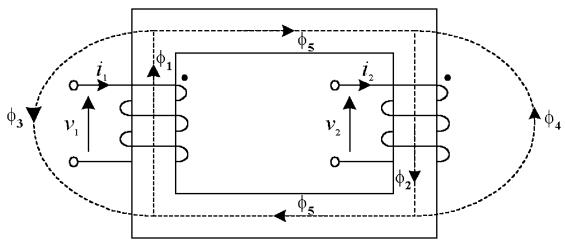  
Fig. 1. Single-phase two winding transformer flux paths.

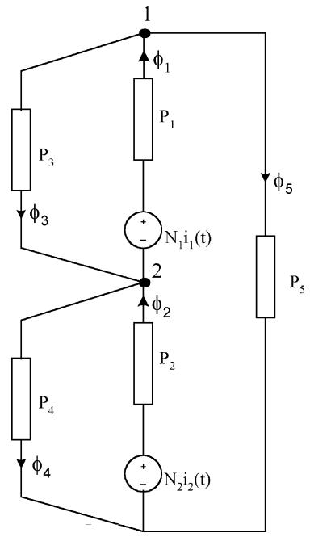  
Fig. 2. Magnetic equivalent circuit for a single-phase two winding transformer.

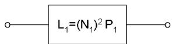  
(a)

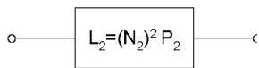  
(b)   
Fig. 3. Matched inductors.

been assigned the values of the primary and secondary winding voltages and the corresponding values of and are calculated appropriately.

# B. Existing Model

In the existing transformer model of EMTDC, the saturation is represented by a current source connected across each winding. A piece-wise linearly interpolated - characteristic curve has been used to model the saturation in the transformer core [20].

The simulation algorithm begins with the calculation of the winding-limb fluxes $( \phi _ { i } )$ using the winding voltages ( ), where $i = 1 \ldots$ number of windings. The fluxes in each branch and the flux densities $( B _ { i } )$ of winding limbs and the yoke are calculated using the calculated values of flux $( \phi _ { i } )$ . The differential permeability $( \mu _ { \mathrm { d i f } } )$ and the magnetic field strength $( H _ { i } )$ of the branches representing the iron core are calculated using the piece-wise linear - curve at the flux density $B _ { i }$ . Then, the permeance of these branches is calculated to update the branch

permeance matrix . Finally, the magnitudes of the current injected for the present time step are calculated using (4)

$$
\mathbf {i} _ {s} = \boldsymbol {\phi} _ {s} \left(\mathrm {M} _ {s s} \mathrm {N} _ {s s}\right) ^ {- 1}. \tag {4}
$$

# C. New Model: Incorporating the JA Theory

The aim of this work is to develop an improved transformer model to be used in GIC studies. The piece-wise linear representation of saturation does not properly represent the reactive power consumption and the increased levels of harmonic current when the transformer undergoes half-cycle saturation.

The saturation model described in the previous section uses the piece-wise linear - characteristics to calculate the differential permeability $( \mu _ { \mathrm { d i f } } )$ and the magnetic field strength ( ) of the branches representing the iron core. Then, the branch MMFs are calculated and the simulation algorithm continues until the magnitudes of the current injected are calculated using (1), (3), and (4).

The new model presented in this paper uses the JA theory of a ferromagnetic material to represent the hysteresis characteristics of the transformer core. Instead of using a piece-wise linearly interpolated curve to model the - characteristics, we have incorporated the differential equations described in the JA theory to model the hysteresis characteristics of the transformer core. The differential permeability ( ) and the magnetic field strength ( ) of the winding limbs and the yoke are calculated using the new hysteresis model.

A brief review of the JA theory is presented in the following section, which describes the expressions for differential susceptibility $( d M / d H )$ . In Section IV, the hysteresis model is extended to include the eddy current effects. Section V describes the new simulation algorithm, in which the equations described in the following section are used to find the differential permeability $( \mu _ { \mathrm { d i f } } )$ , the magnetic field strength ( ), and the branch MMFs.

These calculated values are fed as the input to the existing transformer model and, therefore, the simulation algorithm continues to use (1), (3), and (4) to calculate the magnitudes of the current injected.

# III. JILES–ATHERTON THEORY

The JA theory describes the relationship between the magnetization and the magnetic field intensity for the core material. The relationship between the flux density , , and is given by (5)

$$
B = \mu_ {0} (M + H). \tag {5}
$$

The magnetization characteristic is defined by the anhysteretic magnetization function $M _ { \mathrm { a n } }$ . The anhysteretic magnetization $M _ { \mathrm { a n } }$ at a given field $H _ { e }$ represents the global minimum energy state, where $H _ { e } ~ = ~ H + \alpha M . ~ H _ { e }$ is the effective field, and is a parameter which represents the inter domain-coupling. The anhysteretic magnetization $M _ { \mathrm { a n } }$ can be expressed as $M _ { \mathrm { a n } } = M _ { \mathrm { s a t } } \ f ( H _ { e } )$ , where $M _ { \mathrm { s a t } }$ is the saturation magnetization and $f$ is an arbitrary function of the effective field [12]. The function given in (6) has been used in [13] in the simulation of current transformers, where $a _ { 1 } , a _ { 2 }$ , and

$a _ { 3 }$ are constants and $a _ { \mathrm { 2 } } \ > \ a _ { \mathrm { 1 } }$ . The same function is used to represent the anhysteretic characteristics of the core of the power transformer model, on the basis that the characteristics of the material is likely to be the same (i.e., grain oriented silicon steel)

$$
M _ {\mathrm {a n}} = M _ {\mathrm {s a t}} \frac {a _ {1} H _ {e} + H _ {e} ^ {2}}{a _ {3} + a _ {2} H _ {e} + H _ {e} ^ {2}}. \tag {6}
$$

The JA theory leads to two components in as follows:

$$
M = M _ {\text {i r r}} + M _ {\text {r e v}}. \tag {7}
$$

The first component, irreversible magnetization, is due to pinning of the magnetic domains by discontinuities in the material structure. The second term, reversible magnetization, is due to domain wall bending in an elastic manner. The JA theory builds on these fundamental relationships and the derivative of with respect to can be represented as in (8). , , and are constants for the material being used and takes the value 1 or based on the sign of . This equation takes a modified form as in (9) when $( M _ { \mathrm { a n } } - M ) \delta$ becomes negative

$$
\frac {d M}{d H} = \frac {c \frac {d M _ {\mathrm {a n}}}{d H _ {e}} + \frac {M _ {\mathrm {a n}} - M}{\frac {\delta k}{\mu_ {0}} - \frac {\alpha (M _ {\mathrm {a n}} - M)}{1 - C}}}{1 - \alpha c \frac {d M _ {\mathrm {a n}}}{d H _ {e}}} \tag {8}
$$

$$
\frac {d M}{d H} = \frac {c \frac {d M _ {\mathrm {a n}}}{d H _ {e}}}{1 - \alpha c \frac {d M _ {\mathrm {a n}}}{d H _ {e}}}. \tag {9}
$$

# IV. CORE LOSS

The area of the hysteresis loop has an important physical meaning. It represents the amount of energy transformed into heat during one cycle of magnetization as given in (10), where is the power loss per unit volume and is the frequency of magnetization. If the area of the loop is measured on the same specimen for different magnetization frequencies , a substantial increase in the area and change in the shape of the loop can be observed with increasing

$$
\frac {P}{f} = \oint_ {\text {l o o p}} H d B. \tag {10}
$$

# A. Background

The most important advancement in understanding of losses in a ferromagnetic material dates back to the 1940s. During this period, it was generally recognized that the domains exist in an unmagnetized material, however, the shapes of domains, the ways in which the boundaries form and move with field and stress was first established experimentally in [21]. Since then, all attempts to deal with the physical origin of magnetic losses have taken domain wall motion explicitly into account.

The loss for a single moving wall was experimentally evaluated with a single domain boundary in a crystal of silicon iron in [22]. The results showed that the total losses in a ferromagnetic material are often several times greater than the eddy current and hysteresis losses calculated assuming a uniform and isotropic permeability. It was also reported that the difference between calculated and measured losses, which was known as

the eddy current anomaly, could, in principle, be accounted for if the domain structure of the magnetic material was considered in the calculation of losses. Reference [23] calculated energy losses from eddy currents for magnetic sheet materials with a simple domain configuration. Since then, this model has served as the foundation for most of the work in this field.

# B. Loss Separation

The concept of loss separation describes the total power loss at a given magnetizing frequency as in (11), where the total losses are divided into three parts $P _ { \mathrm { h y s } } , P _ { \mathrm { c l s } }$ , and $P _ { \mathrm { e x c } } . \ : P _ { \mathrm { h y s } }$ is the hysteresis loss and $P _ { \mathrm { c l s } }$ is known as the classical eddy current loss and is calculated assuming a uniform magnetization. When the calculated values of hysteresis and classical eddy current losses are added, their sum is significantly less than the measured losses. This difference is known as the excess or anomalous losses $( P _ { \mathrm { e x c } } )$

$$
P _ {\text {t o t a l}} = P _ {\text {h y s}} + P _ {\text {c l s}} + P _ {\text {e x c}}. \tag {11}
$$

Excess loss arises due to the fact that any ferromagnetic material is made up of self-saturated domains, and, hence, the microscopic magnetic flux pattern in the material is not smooth and continuous as assumed in calculating the classical eddy current losses. Magnetization proceeds by a movement of domain boundaries and, if the domains are relatively large, the eddy currents induced in the neighborhood of the moving boundaries will differ from the simple classical pattern [16], [17].

# C. Incorporating Losses

In the transformer model proposed here, the JA model is used to represent the hysteresis characteristics of the core and, hence, it properly represents the hysteresis loss of a transformer core. The effects of classical eddy current and excess losses are incorporated as described below.

The total magnetic field intensity $H _ { \mathrm { t o t } }$ can be expressed as in (12), where $H _ { \mathrm { h y s t } }$ is calculated with the JA model and the sum of $H _ { \mathrm { c l s } }$ and $H _ { \mathrm { e x c } }$ is added to represent the eddy current effects [24]–[26].

$$
H _ {\mathrm {t o t}} = H _ {\mathrm {h y s t}} + H _ {\mathrm {c l s}} + H _ {\mathrm {e x c}}. \tag {12}
$$

The instantaneous power loss per unit volume due to classical eddy currents is proportional to the rate of change of magnetization [27]. This can be expressed as in (13), where $W _ { \mathrm { c l s } }$ is the energy lost per cycle per unit volume, is the flux density, is the thickness of laminations, is the resistivity, and $\beta$ is a constant [18]. From (10) and (13), it is clear that the energy lost due to classical eddy currents per cycle per unit volume can be represented in the model with an equivalent magnetic field proportional to $d B / d t$ . In our model, $H _ { \mathrm { c l s } }$ represents a magnetic field intensity equivalent to the classical eddy current losses. Therefore, $H _ { \mathrm { c l s } }$ in (12) can be expressed as $H _ { c l s } = k _ { 1 } ( d B / d t )$ , where $k _ { 1 }$ is a constant

$$
\frac {d W _ {\mathrm {c l s}}}{d t} = \frac {D ^ {2}}{2 \rho \beta} \left(\frac {d B}{d t}\right) ^ {2}. \tag {13}
$$

The instantaneous excess power loss can be expressed as in (14), where is a constant, is the cross-sectional area, and $H _ { o }$ is a parameter representing the internal potential experienced by domain walls [18]. From (10) and (14), it is clear that this energy loss can be represented by an equivalent magnetic field proportional to $( d B / d t ) ^ { 1 / 2 }$ . Thus, $H _ { \mathrm { e x c } }$ in (12) can be expressed as $H _ { \mathrm { e x c } } = \dot { k _ { 2 } } ( \dot { d B } / \dot { d t } ) ^ { 1 / 2 }$ , where $k _ { 2 }$ is a constant

$$
\frac {d W _ {\text {e x c}}}{d t} = \left(\frac {G A H _ {o}}{\rho}\right) ^ {1 / 2} \left(\frac {d B}{d t}\right) ^ {3 / 2}. \tag {14}
$$

Therefore, in the time-domain simulations, the total magnetic field intensity $H _ { \mathrm { t o t } }$ can be expressed as in (15), where $k _ { 1 }$ and $k _ { 2 }$ are constants for a given transformer. The initial values of $k _ { 1 }$ and $k _ { 2 }$ are calculated using (13) and (14), respectively, and these values are tuned to simulate the core loss at the rated conditions using measured data

$$
H _ {\mathrm {t o t}} = H _ {\mathrm {h y s t}} + k _ {1} \frac {d B}{d t} + k _ {2} \left(\frac {d B}{d t}\right) ^ {1 / 2}. \tag {15}
$$

# V. SIMULATION MODEL

The simulation algorithm of the transformer model uses the slope of the - curve $( \mu _ { \mathrm { d i f } } )$ to update the branch permeance matrix and the transformer inductance matrix, and, hence, to calculate the magnitudes of the current injected. However, the slope of the - loop described in the JA model is related to the slope of the - loop as in (16). Hence, the - relationship described in the JA theory (8) can be used for this purpose. Therefore, during each time step, the slope of the - loop is used in the process of updating the branch permeance matrix. Thus, the new hysteresis model is incorporated into the simulation algorithm of the power transformer as described below

$$
\mu_ {\mathrm {d i f}} = \mu_ {0} \left(\frac {d M}{d H} + 1\right). \tag {16}
$$

During each time step, the transformer model calculates the flux ( ) and the incremental flux $( \Delta \phi )$ in winding limbs using the winding voltages ( ) and the values from the previous time step. Then, the flux and the incremental flux in the rest of the branches in the magnetic equivalent circuit are calculated.

The input to the hysteresis model is the flux ( ) and the incremental flux $( \Delta \phi )$ of the winding limbs and the yoke. For each magnetic branch under consideration, the increment in ( ) and the increment in ( ) are estimated using as in (17) and (19), respectively. Using the estimates of $\Delta H$ and $\Delta M .$ , the new values of and are updated as in (20) and (21). $H _ { \mathrm { o l d } }$ and $M _ { \mathrm { o l d } }$ are the and values of the previous time step. The parameter , which indicates the direction the magnetization is obtained from (22)

$$
\Delta H = Q \Delta H _ {\max } \text {w h e r e} (0 \leq Q \leq 1) \tag {17}
$$

$$
\Delta H _ {\max } = \frac {\Delta \phi}{A \mu_ {0}} \tag {18}
$$

$$
\Delta M = \frac {\Delta \phi}{A \mu_ {0}} - \Delta H \tag {19}
$$

$$
H = H _ {\text {o l d}} + \Delta H \tag {20}
$$

$$
M = M _ {\text {o l d}} + \Delta M \tag {21}
$$

$$
\delta = \operatorname {s i g n} (\Delta H) = \operatorname {s i g n} (\Delta \phi). \tag {22}
$$

Using the values obtained from (20), (21), and (22), the current value of $d M / d H$ is calculated using (8). A numerical iterative method is used to reduce the error in the calculated value of by varying .

In order to incorporate losses, the magnitude of calculated in (20) is modified using (15). Finally, the calculated $H _ { \mathrm { t o t } }$ value is used to find the branch MMF, and the branch permeance $P .$ This process is repeated for all of the branches in the equivalent circuit which represent a winding or a yoke. The transformer inductance matrix is updated with the new values of $P$ using (1), and the magnitudes of the current injected across each winding are calculated using (4).

# VI. COMPARISON OF SIMULATION AND TEST RESULTS

A series of tests was carried out to validate the new transformer model using a 3-kVA, 115-V/2300-V, 60-Hz single-phase distribution transformer. Details of the test system are given in the Appendix .

# A. Determination of Parameters

The parameters of the JA model using the anhysteretic function represented with (6) were estimated such that the measured saturation characteristic $( V _ { \mathrm { r m s } } / I _ { \mathrm { r m s } } )$ and the recorded waveforms are reasonably accurately produced using the new model.

1) Parameters for the JA Model: The numerical determination of the parameters for the anhysteretic magnetization curve from experimental measurements has been presented in [28]. This process has been adopted in [13] to calculate parameters for the current transformer model. The same methodology was used to derive the parameters for the power transformer model presented here. The - characteristics of the core material M4 is used for the comparisons with a distribution transformer [29]. The derived parameters are given in Table I.   
2) Parameters for a Given Transformer: The actual number of turns in the windings is not commonly available. Therefore, the number of turns $N _ { 1 }$ and $N _ { 2 }$ are set equal to the rated voltage of the windings. Then, the magnitude of is calculated assuming a peak operating flux density $( B _ { \mathrm { m a x } } )$ of $1 . 6 \sim 1 . 7 \ : \mathrm { T }$ at the rated conditions, so that the actual value of the product of is matched by the product of used in the simulation model.   
Once the parameters of the anhysteretic magnetization curve and the magnitude of the cross-sectional area are found, the length of the winding limb is calculated using the root mean square (rms) value of the magnetizing current at the rated voltage, so that the correct $N / l$ ratio is used in the simulation model. A simulation of an open circuit test is carried out to measure the core loss at the rated conditions. This is followed by the tuning of the constants $k _ { 1 }$ and $k _ { 2 }$ in (15) and the length of the winding limb , such that the correct magnitude of the magnetizing current and the power loss are simulated at the rated conditions (Table II). The slope of the anhysteretic curve in the saturation region and the width of the - loop in the shoulder region may be slightly modified to match the characteristics of a given transformer [13].

TABLE I PARAMETERS FOR THE HYSTERESIS MODEL BASED ON THE CORE MATERIAL M4   

<table><tr><td>α</td><td>M sat</td><td>k</td><td>c</td><td>a1</td><td>a2</td><td>a3</td></tr><tr><td>3.90e-6</td><td>1.71e6</td><td>8.96e-6</td><td>0.1</td><td>60</td><td>96</td><td>93</td></tr></table>

TABLE II PARAMETERS FOR A 3-kVA DISTRIBUTION TRANSFORMER   

<table><tr><td>Bmax</td><td>A</td><td>l</td><td>k1</td><td>k2</td></tr><tr><td>1.65</td><td>2.27</td><td>0.717</td><td>3.5e-3</td><td>0.79</td></tr></table>

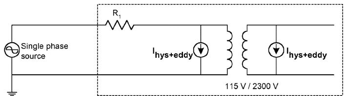  
(a)

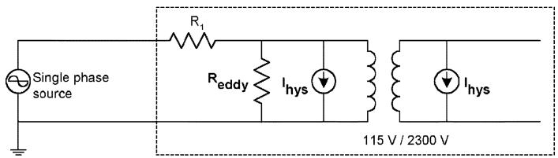  
(b)   
Fig. 4. Simulation models; (a) with the new algorithm, and (b) with an external resistor representing losses.

# B. Comparisons With Recorded Waveforms

Simulation results for open-circuit tests on a single-phase 2 winding transformer model are compared with test results. Simulations were carried out with the electromagnetic transient program (EMTP) PSCAD/EMTDC.

The single-phase two-winding model used has a current source across each winding to represent the saturation. In the new model, the eddy current effects are also incorporated into the same algorithm. Thus, the calculated value of the saturation current injected across each winding also contains the effects of eddy currents [Fig. 4(a)].

1) Comparisons : Open Circuit Tests at 60 Hz: Fig. 5 shows the comparison of the simulated waveform and the recorded waveform at the rated voltage and frequency. A close comparison is seen between the simulation and the recorded waveform.

Figs. 6 and 7 show the comparison of the magnetizing current at 0.9-p.u. and 1.1-p.u. voltages, respectively. A slight difference is seen between the measured and the simulated waveforms, which can be due to a slight mismatch in the shoulder region of the simulated - loop.

Simulations were also carried out to compare the new model with a more commonly used approach of representing eddy current losses using a shunt resistor as shown in Fig. 4(b). In this “resistor model,” hysteresis characteristics are represented by the JA theory, and the eddy current effects are represented with an external resistor connected across the terminals. The magnitude of this resistor is calculated to match the measured core loss at the nominal frequency.

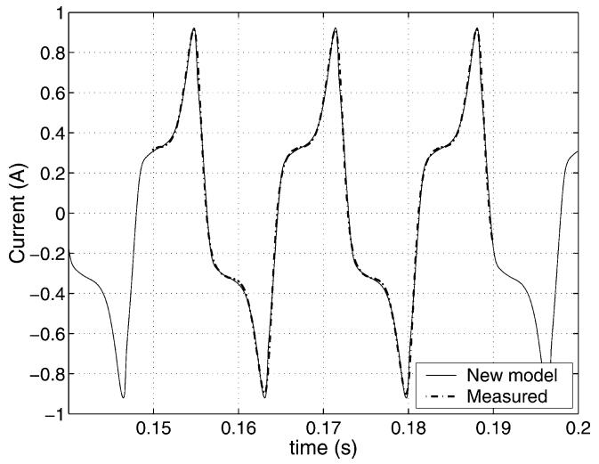

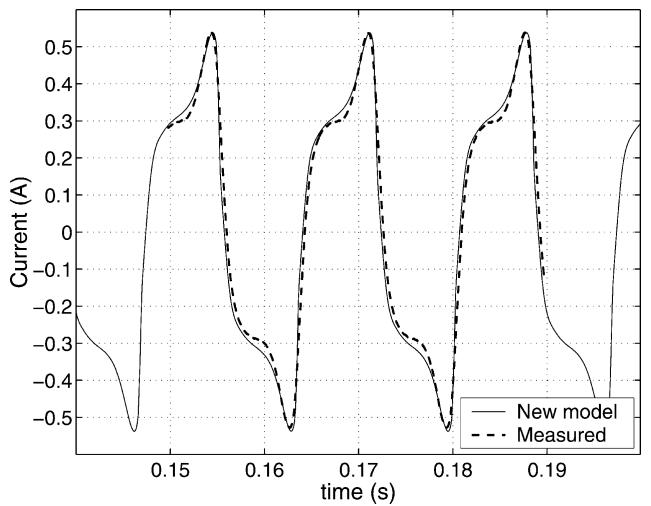  
Fig. 5. Magnetizing current at the rated conditions.   
Fig. 6. Magnetizing current at 0.9-p.u. voltage.

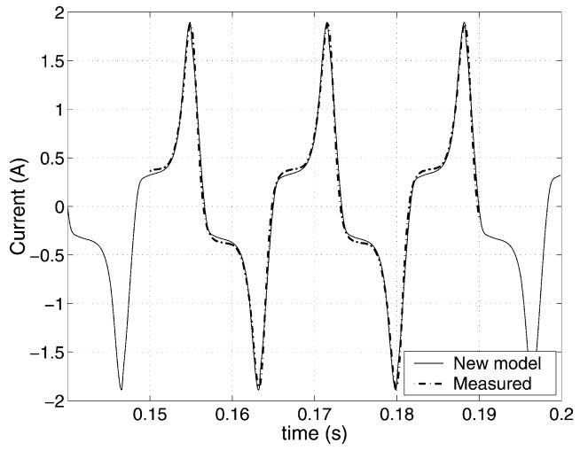  
Fig. 7. Magnetizing current at 1.1-p.u. voltage.

Fig. 8 shows the variation of the rms magnetizing current for different excitation voltages. The percentage error in the rms value of the magnetizing current produced by the new model is at the rated conditions. A maximum error of 5.38% is produced by the new model at 0.9-p.u. voltage whereas the

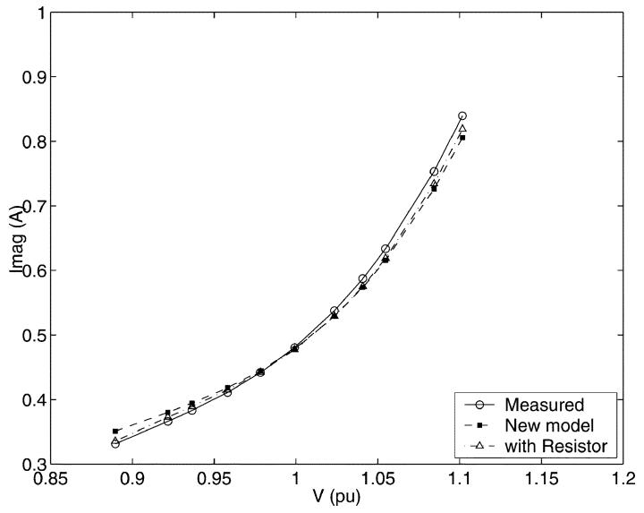  
Fig. 8. Magnetizing current at different excitation voltages at 60 Hz.

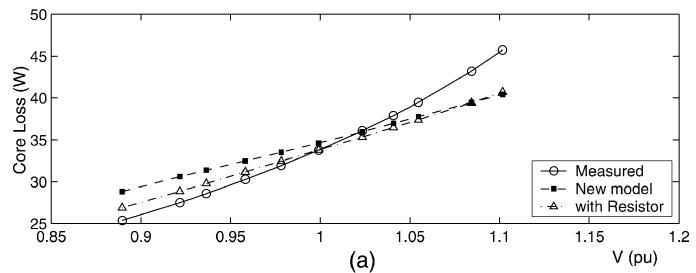

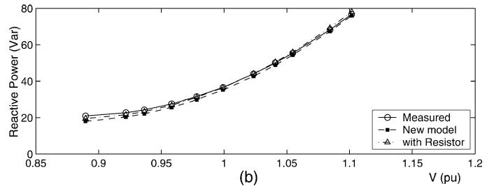  
Fig. 9. Comparison of the active power and the reactive power at 60 Hz.

resistor model produced only 1.19%. The variation of the core loss (active power) is shown in Fig. 9(a). The parameters of the new model were tuned so that an accurate representation is obtained at the rated conditions. Thus, the minimum error is seen at the rated conditions (i.e., 1.98%). A maximum error of 13.5% is produced by the new model at 0.9-p.u. voltage where as, the resistor model produced 11.25%. The variation of the reactive power consumption shows a closer match than does the variation of active power [Fig. 9(b)].

The representation of hysteresis is common for the two models discussed and, hence, any mismatch in the simulated - loop could affect the accuracy of both models. The variation of the phase angle of the fundamental component of the magnetizing current, and the power factor are shown in Fig. 10(a) and (b), respectively. These figures explain the differences seen in the active power and reactive power consumption simulated by the new model. For example, at $1 . 0 \mathfrak { p } . \mathtt { u } .$ ., the magnitude of the phase angles of simulated and the recorded waveforms are $4 6 . 1 6 ^ { \circ }$ and 47.7 , respectively (phase

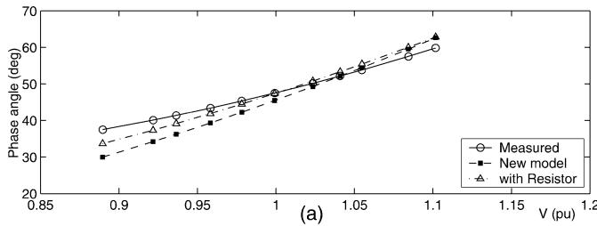

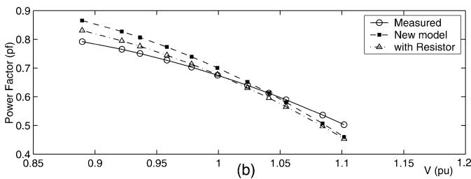  
Fig. 10. Comparison of the phase angle and the power factor at 60 Hz.

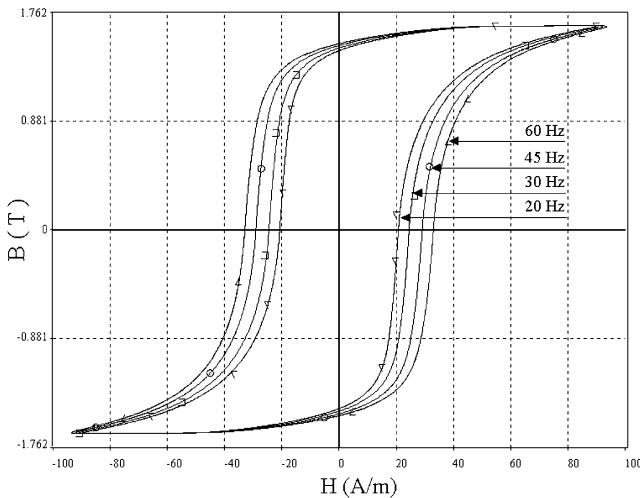  
Fig. 11. BH loops at different frequencies.

difference 1.54 ). This represents a 0.692 and 0.672 in power factors (3% error). However, at 1.1 p.u., this phase difference increases to $2 . 5 7 ^ { \circ }$ . The resulting power factors are 0.463 and 0.504, respectively ( error). With an error in the power factor and $\mathrm { a - 4 . 0 4 \% }$ error in the fundamental component of current, the total power loss simulated has an error greater than 12%. The phase angle error and, hence, the error in the power factor can be attributed to a mismatch in the simulated - loop and - loop of the core material.

All of the above comparisons show that the resistor model produces a closer match than does the new model. This is due to the fact that the magnitude of the core loss resistor in the resistor model was calculated at 60 Hz and all of the comparisons were carried out at the same frequency. However, the eddy current effects included in the new model are capable of representing the frequency dependency of the - characteristics.

2) Comparisons at Different Frequencies: A variable frequency, variable voltage supply was generated to excite the test transformer so that a constant $V / f ,$ thus a constant flux level, is maintained in the core. Details of the test system are given in the Appendix . Fig. 11 shows the comparison of the simulated - loops produced with the new model at different excitation

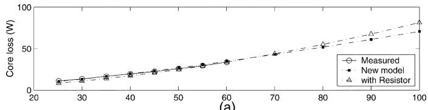

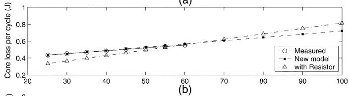

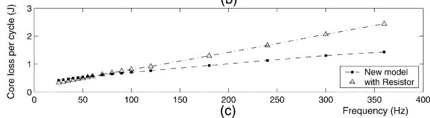  
Fig. 12. Comparison of the core loss and the core loss per cycle at different frequencies.

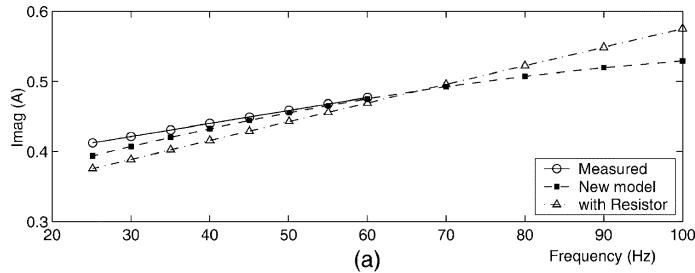

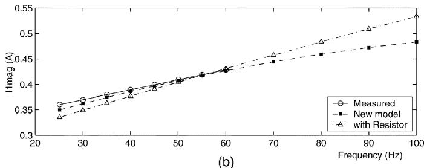  
Fig. 13. Comparison of the magnetizing current $( I _ { \mathrm { m a g } } )$ and the fundamental component of $I _ { \mathrm { m a g } }$ at different frequencies.

frequencies. It shows that the width of the - loop increases as the frequency is increased.

Fig. 12(a) shows the comparison of the core loss at different frequencies. A maximum error of is produced by the new model at 25 Hz whereas the resistor model showed significant deviations with the maximum error of at 25 Hz. Similar observations can be made with the variation of core loss per cycle for frequencies [Fig. 12(b)] and [Fig. 12(c)]. Fig. 13(a) and (b) show the comparison of the magnetizing current, and the fundamental component of the magnetizing current at different frequencies.

These comparisons show that the resistor model may cause significant errors as the frequency is decreased. The same trend can be seen when the frequency is increased (70–360 Hz). This range could not be verified due to lack of recorded data. However, Fig. 12(b) shows that the new model has a slope much closer to the measured curve and also previous work in this area has indicated a linear variation in this region [16], [17]. This

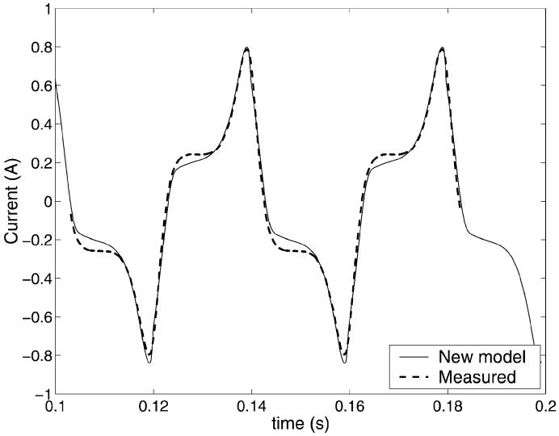  
Fig. 14. Magnetizing current at 25 Hz, at the rated flux.

confirms that the new model is capable of simulating the magnetizing current and the power losses more accurately than does the commonly used approach of a shunt resistor. In addition, it highlights the importance of modeling the frequency dependency of the - loop. Instantaneous waveforms for the comparisons at 25 Hz are presented in Fig. 14.

# VII. CONCLUSION

The JA phenomenological model of a ferromagnetic material has been successfully incorporated into a transformer model of an electromagnetic transient simulation program. The new model includes the eddy current effects. This representation incorporates losses within the transformer model and, hence, this method is useful in the simulation of multiwinding transformers. Simulation results for open-circuit tests on a single phase 2 winding transformer model are compared with test results. Comparisons carried out at different frequencies of excitation have highlighted the importance of modeling the frequency dependency of the - loop.

# APPENDIX

Details of the laboratory test setup are as follows.

• Transformer: 3 kVA, 115 V/2300 V, 60-Hz single-phase distribution transformer. The magnitude of the external resistor used in Fig. 4(b) was calculated at 60 Hz, so that the measured power loss is matched; $R _ { \mathrm { e d d y } } = 5 4 8 \Omega$ referred to 115 V;   
• Synchronous generator: Three phase, 3 kVA, 208 V, 1800 r/min; Field circuit 120 V dc, 1.25 A;   
• DC motor : 2.5 kW, 110 V, 20 A, 1750 r/min; field circuit 110 V, 1.5 A.

# REFERENCES

[1] V. D. Albertson et al., “Geomagnetic disturbance effects on power systems,” IEEE Trans. Power Delivery, vol. 8, pp. 1206–1216, July 1993.   
[2] R. J. Ringlee and J. R. Stewart, “Geomagnetic effects on power systems,” IEEE Power Eng. Rev., pp. 6–9, July 1989.

[3] R. P. Jayasinghe, P. G. McLaren, and T. Gouldsborough, “Effect of GIC on overcurrent protection for filter banks,” in Proc. IEEE Western Can. Conf. Exhibition, 1993, pp. 36–42.   
[4] M. Lahtinen and J. Elovaara, “GIC occurrences and GIC test for 400 kV system transformer,” IEEE Trans. Power Delivery, vol. 17, pp. 555–56, Apr. 2002.   
[5] F. de Leon and A. Semlyen, “Complete transformer model for electromagnetic transients,” IEEE Trans. Power Delivery, vol. 9, pp. 231–239, Jan. 1994.   
[6] B. A. Mork, “Five legged wound core transformer model: Derivation, parameters, implementation, and evaluation,” IEEE Trans. Power Delivery, vol. 14, pp. 1519–1526, Oct. 1999.   
[7] X. Chen, “A three phase multi-legged transformer model in ATP using the directly formed inverse inductance matrix,” IEEE Trans. Power Delivery, vol. 11, pp. 1554–1562, July 1996.   
[8] C. M. Arturi, “Transient simulation of a three phase five limb step up transformer following an out of phase synchronization,” IEEE Trans. Power Delivery, vol. 6, pp. 196–207, Jan. 1991.   
[9] J. Arrillaga, W. Enright, N. R. Watson, and A. R. Woods, “Improved simulation of HVDC converter transformers in electromagnetic transient programs,” Proc. Inst. Elect. Eng., Gen. Transm. Dist., vol. 144, pp. 100–106, Mar. 1997.   
[10] F. de Leon and A. Semlyen, “A simple representation of dynamic hysteresis losses in power transformers,” IEEE Trans. Power Delivery, vol. 10, pp. 315–321, Jan. 1995.   
[11] F. Liorzou, B. Phelps, and D. L. Atherton, “Macroscopic models of magnetization,” IEEE Trans. Magn., vol. 36, pp. 418–428, Mar. 2000.   
[12] D. C. Jiles and D. L. Atherton, “Theory of ferromagnetic hysteresis,” J. Magnetism Magn. Mat., vol. 61, pp. 48–60, 1986.   
[13] U. D. Annakkage, P. G. McLaren, E. Dirks, R. P. Jayasinghe, and A. D. Parker, “A current transformer model based on the Jiles-Atherton theory of ferromagnetic hysteresis,” IEEE Trans. Power Delivery, vol. 15, pp. 57–61, Jan. 2000.   
[14] F. de Leon and A. Semlyen, “Detailed modeling of Eddy current effects for transformer transients,” IEEE Trans. Power Delivery, vol. 9, pp. 1143–1150, Apr. 1994.   
[15] T. Fujiwara and R. Tahara, “Eddy current modeling of silicon steel for use on SPICE,” IEEE Trans. Magn., vol. 31, pp. 4059–4061, Nov. 1995.   
[16] C. D. Graham Jr., “Physical origin of losses in conducting ferromagnetic materials,” J. Appl. Phys., vol. 53, no. 11, pp. 8276–8280, Nov. 1982.   
[17] G. Bertotti, “General properties of power losses in soft ferromagnetic materials,” IEEE Trans. Magn., vol. 24, pp. 621–630, Jan. 1988.   
[18] D. C. Jiles, “Modeling the effects of Eddy current losses on frequency dependent hysteresis in electrically conducting media,” IEEE Trans. Magn., vol. 30, pp. 4326–4328, Nov. 1994.   
[19] W. Enright, O. B. Nayak, G. D. Irwin, and J. Arrillaga, “An electromagnetic transient model of multi-limb transformers using normalized core concept,” in Proc. Int. Conf. Power Syst. Transients, June 1997, pp. 93–98.   
[20] W. Enright, O. Nayak, and N. R. Watson, “Three phase five-limb unified magnetic equivalent circuit transformer models for PSCAD V3,” in Proc. Int. Conf. Power Syst. Transients, 1999, pp. 462–467.   
[21] H. J. Williams, R. M. Bozorth, and W. Shockley, “Magnetic domain patterns on single crystal of silicon iron,” Phys. Rev., vol. 75, pp. 155–177, 1949.   
[22] H. J. Williams, W. Shockley, and C. Kittel, “Studies of the propagation velocity of a ferromagnetic domain boundary,” Phys. Rev., vol. 80, pp. 1090–1094, 1950.   
[23] R. H. Pry and C. P. Bean, “Calculation of the energy loss in magnetic sheet materials using a domain model,” J. Appl. Phys., vol. 29, pp. 532–533, Mar. 1958.   
[24] J. W. Shilling and G. L. Houze Jr., “Magnetic properties and domain structure in grain-oriented 3% Si-Fe,” IEEE Trans. Magn., vol. MAG-10, pp. 195–222, June 1974.   
[25] G. Bertotti, “Physical interpretation of Eddy current losses in ferromagnetic materials I. Theoretical considerations,” J. Appl. Phys., vol. 57, pp. 2110–2117, Mar. 1985.   
[26] , “Physical interpretation of Eddy current losses in ferromagnetic materials II. Theoretical considerations,” J. Appl. Phys., vol. 57, pp. 2118–2126, Mar. 1985.   
[27] S. Chikazumi, Physics of Magnetism, New York: Wiley, 1964.   
[28] D. C. Jiles, J. B. Thoelke, and M. K. Devine, “Numerical determination of hysteresis parameters for the modeling of magnetic properties using the theory of ferromagnetic hysteresis,” IEEE Trans. Magn., vol. 28, pp. 27–35, Jan. 1992.   
[29] R. Hasegawa, “Metallic glasses in devices for energy conversion and conservation,” J. Non-Cryst. Solids, vol. 61&62, pp. 725–736, 1984.

W. Chandrasena (S’99) received the B.Sc degree (Hons.) in electrical engineering from the University of Moratuwa, Sri Lanka, in 1997. He is currently pursuing the Ph.D. degree at the University of Manitoba, Winnipeg, MB, Canada.   
P. G. McLaren (F’98) received the B.Sc. degree in electrical engineering and the Ph.D. degree in power system protection from the University of St. Andrews, St. Andrews, U.K.   
Currently, he is the Director of the Center for Advanced Power Systems (CAPS) and a Professor at Florida State University, Tallahassee. Following 20 years as a Fellow of Churchill College, Cambridge, U.K., he moved to the University of Manitoba, Winnipeg, MB, Canada, in 1988 to become the NSERC Industrial Research Chair in Power Systems.   
Dr. McLaren is a Fellow of the IEE.

U. D. Annakkage (M’95) received the B.Sc. (Eng.) degree in electrical engineering from the University of Moratuwa, Sri Lanka, in 1981, and the M.Sc. and Ph.D. degrees from the University of Manchester Institute of Science and Technology (UMIST), Manchester, U.K., in 1984 and 1987, respectively.   
He was a Lecturer at the University of Moratuwa, Sri Lanka, and a Senior Lecturer at the University of Auckland, New Zealand. He then became Associate Professor at the University of Manitoba, Winnipeg, MB, Canada. His research interests include power system modeling, control, and optimization.   
R. P. Jayasinghe (M’97) received the bachelor’s degree (Hons.) in electrical engineering from the University of Moratuwa, Sri Lanka, in 1987, and the Ph.D. degree in power systems from the University of Manitoba, Winnipeg, MB, Canada, in 1997.   
Currently, he is an Engineer at the Manitoba HVDC Research Center, Winnipeg.