# 有源型模块化多电平换流器桥臂全状态平均值仿真模型

唐英杰，张哲任，徐 政

（浙江大学电气工程学院，浙江省杭州市 310027）

摘要：为了提高有源型模块化多电平换流器（MMC）的仿真效率并保证足够的计算精度，提出一种适用于有源型MMC的桥臂全状态平均值仿真模型。基于动态平均化理论，首先推导了有源型MMC的桥臂平均值数学模型及等效电路模型。然后，结合装置离散化伴随模型，建立了不同运行状态下的桥臂平均值仿真模型。最后，通过电路整合和化简，得出桥臂全状态平均值模型。该模型聚焦于桥臂内部子模块的低频动态共性，能够准确反映桥臂整体暂态特性，其计算速度不受子模块个数的影响。此外，该模型还能够用于有源型 MMC 闭锁状态下的仿真研究。基于 PSCAD/EMTDC建立的仿真实例验证了所提模型的有效性。

关键词：有源型模块化多电平换流器；储能单元；电磁暂态仿真；平均值模型；换流器闭锁；全状态仿真模型；柔性直流输电

# 0 引 言

随着能源结构的转型和电力系统运行要求的提高，储能在电网规划中的地位愈发重要，其典型应用场景包括新能源功率波动抑制［1］ 、交直流系统功率解耦［2］ 以及电网频率支撑［3］ 等。考虑到电网侧储能设备额定容量大、运行电压高的工作特点，多电平换流器技术［4］ 在该领域得到充分应用。通过在模块化多电平换流器（modular multilevel converter，MMC）的子模块中集成储能单元得到的有源型MMC可同时充当柔性直流换流器和储能功率变换器，具备占地面积小、运行效率高、可拓展性强等显著优势，近年来已成为国内外的研究热点。文献［5］最早提出适用于风电场直流送出系统的有源型 拓扑结构；文献［6］采用基于有源型MMC的海上风电场混合直流送出系统以减轻风电功率扰动对陆上主网造成的影响；文献［7］以换流器经济性优化为目标，提出一种混合式有源型 MMC。一方面，现有技术条件下在柔性直流换流器中直接集成储能电池会面临诸多问题，例如储能电池体积过大、设备绝缘设计困难等，这些问题还需要在未来做进一步研究。另一方面，基于有源型 MMC的柔性直流输电系统在所连接电网比较薄弱的场景下具有较为显著的技术优

势；如文献［8-9］所述，有源型 MMC可以实现交直流系统间的功率解耦控制，并提供电网频率支撑和交直流故障隔离等辅助功能。此外，与独立设置储能装置相比，基于有源型 MMC的有源型柔性直流输电系统充分利用了原有换流器的拓扑结构，能够进一步降低系统投资成本和运行损耗。

建立有源型 MMC的电磁暂态仿真模型，是研究系统运行特性和控保策略的基础。完整详细模型（full detailed model，FDM）是一种简单的多电平换流器建模方法，但是其仿真效率随子模块数目的增大显著减低［10］ 。在以往的电力系统仿真研究中，通常需要采用更为高效的换流器仿真模型，如详细等效 模 型（detailed equivalent model，DEM）和 平 均 值模 型（average value model，AVM）［11-12］。 DEM 以Dommel仿真算法和嵌套快速同时求解算法为建模理论基础［13-18］，虽然可保留所有电气节点的动态信息，但实际效率仍会受到子模块数目的影响。与DEM相比，基于动态平均化理论的AVM的计算速度得到显著提升，但无法准确反映 MMC子模块电容电压和内部环流［19-23］，这一缺陷可通过在传统AVM中引入桥臂子模块开关函数平均值和可控电压源进行改进［24-25］ 。

与常规 MMC 相比，有源型 MMC 在子模块中增加了额外的储能单元和功率控制电路，而目前关于有源型MMC电磁暂态建模研究的文献还较为匮乏。为此，本文提出了一种适用于有源型 MMC高效仿真的桥臂全状态平均值模型（full-state arm

average value model，FSAAVM）。与已有关于有源型 MMC的电磁暂态仿真模型相比，本文所提模型的特点如下：

1）本文所提模型继承了常规 AVM 的效率优势，同时也具备与DEM相近的仿真精度，能够较为准确地反映以子模块电容电压波动和桥臂环流为代表的换流器内部暂态特性。  
2）与文献［26-27］中的 DEM 相比，本文所提模型在保证足够计算精度的同时具备更高的仿真效率，适用于大规模交直流电力系统动态仿真研究。  
3）与文献［28］中的 AVM 相比，本文所提模型考虑了储能模块的功率控制电路，更加符合实际情况，同时也无须考虑因引入可控电压、电流源在数值计算中的延时问题［29］ 。  
4）本文所提模型通过设置功能性电路解决了闭锁工况下的二极管插值问题，因而可应用于有源型MMC闭锁状态下的仿真研究，而文献［26-28］中的模型均无法做到。

# 1 有源型MMC基本原理

有源型MMC采用与常规MMC相同的三相六桥臂拓扑结构，如图 1（a）和（b）所示，每个桥臂由N 个级联子模块 $( \mathrm { S M } _ { 1 } { \sim } \mathrm { S M } _ { N } )$ 和桥臂电抗器构成。有源型半桥子模块由常规半桥子模块衍生而来，其中双向 Buck-Boost变换器和滤波电感 L 构成储能电池与子模块电容C之间的功率控制电路，可以有效抑制储能侧低频电流波动［30］ 。图1中：下标i表示子模块序号， $1 { \leqslant } i { \leqslant } N ; U _ { \mathrm { a r m } }$ 和 $i _ { \mathrm { a r m } }$ 分别表示桥臂输出电压和流入电流； $U _ { \mathrm { c } }$ 和 $i _ { \mathrm { c } , i }$ 分别表示子模块电容电压和充电电流； $U _ { \mathrm { b a t , } }$ 和 $i _ { \mathrm { L } , }$ 分别表示储能电池模块输出电压和电流。

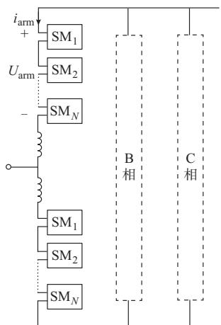  
(a) 有源型MMC的拓扑结构

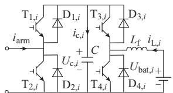  
(b) 有源型半桥子模块

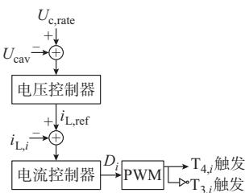  
(c) 储能单元控制系统  
图1 有源型MMC的基本原理图  
Fig. 1 Basic schematic diagram of active MMC

储能模块以有源型MMC子模块电容电压平均值 $U _ { \mathrm { c a v } }$ 为控制目标，其控制结构如图 1（c）所示。 $U _ { \mathrm { c a v } }$ 与子模块电容电压额定值 $U _ { \mathrm { c , r a t e } }$ 之差送入电压控制器生成储能电流参考值 $i _ { \mathrm { L , r e f } } ,$ ，然后经电流控制器得到占空比信号 D，最后通过脉宽调制（PWM）环节产生双向Buck-Boost变换器的互补开关触发信号。

# 2 桥臂 AVM

# 2. 1 桥臂平均值数学模型

定义 $S _ { \mathrm { a r m } , i } ( t )$ 为子模块桥臂侧开关函数，当子模块上桥臂开关组 $\mathrm { T } _ { 1 , i \setminus } \mathrm { D } _ { 1 , i }$ 导通时， $S _ { \mathrm { a r m } , i } ( t ) { = } 1 ;$ ；当子模块下桥臂开关组 $\mathrm { T } _ { 2 , i \setminus } \mathrm { D } _ { 2 , i }$ 导通时， $S _ { \mathrm { a r m } , i } ( t ) { = } 0 _ { \circ }$ 。同理，定义 $S _ { \mathrm { b a t } , i } ( t )$ 为子模块储能侧开关函数，当子模块上桥臂开关组 $\mathrm { T } _ { 3 , i \setminus } \mathrm { D } _ { 3 , i }$ 导通时， $S _ { \mathrm { b a t } , i } ( t ) = 1$ ；当子模块下桥臂开关组 $\mathrm { T } _ { 4 , i \setminus D _ { 4 , i } }$ 导通时， $S _ { \mathrm { b a t } , i } ( \mathbf { \Omega } t ) { = } 0 ,$ 。

记开关器件的导通电阻为 $R _ { \mathrm { o n } }$ ，关断电阻近似用无穷大电阻等效，则子模块电容和滤波电感的动态特性可由式（1）、式（2）表示：

$$
C \frac {\mathrm {d} U _ {\mathrm {c} , i} (t)}{\mathrm {d} t} = S _ {\mathrm {a r m}, i} (t) i _ {\mathrm {a r m}} (t) + S _ {\mathrm {b a t}, i} (t) i _ {\mathrm {L}, i} (t) \tag {1}
$$

$$
L _ {\mathrm {f}} \frac {\mathrm {d} i _ {\mathrm {L} , i} (t)}{\mathrm {d} t} = U _ {\text {b a t}, i} (t) - R _ {\text {o n}} i _ {\mathrm {L}, i} (t) - S _ {\text {b a t}, i} (t) U _ {\mathrm {c}, i} (t) \tag {2}
$$

桥臂输出电压 $U _ { \mathrm { a r m } } ( t )$ 可写作：

$$
U _ {\mathrm {a r m}} (t) = N R _ {\mathrm {o n}} i _ {\mathrm {a r m}} (t) + \sum_ {i = 1} ^ {N} S _ {\mathrm {a r m}, i} (t) U _ {\mathrm {c}, i} (t) \tag {3}
$$

假设电容电压均衡控制策略充分发挥作用，可以认为桥臂内各子模块电容电压 $U _ { \mathrm { c } , i }$ 近似相等。同时，由于各储能模块的电压控制外环具有相同的输入信号 $U _ { \mathrm { c a v } \setminus U _ { \mathrm { c , r a t e } } }$ ，当采用相同的电压控制器结构及参数时，其输出的电流内环参考值 $i _ { \mathrm { L , r e f } } \mathrm { - } \Re$ 。进一步，假设桥臂内各子模块电路参数相同，且储能电池模块的荷电状态（state of charge，SOC）已通过相应的桥臂内SOC平衡控制策略达到平衡［31］ ，当采用相同的电流控制器结构及参数时，则各储能模块的电流控制内环具有相同的传递函数和近似相等的干扰信号 $U _ { \mathrm { c } , i }$ ，其输出变量 $i _ { \mathrm { L } , \ast }$ 基本相等。可以推断，各子模块内部双向 - 变换器接收的开关触发信号和储能电池输出电压也基本相等。

据此，定义桥臂级电容电压 $U _ { \mathrm { s c } } ( t )$ 、桥臂级储能电流 $i _ { \mathrm { L } } ( t )$ 、桥臂级储能电池输出电压 $U _ { \mathrm { s b a t } } ( t )$ 为：

$$
\left\{ \begin{array}{l} U _ {\mathrm {s c}} (t) = N U _ {\mathrm {c}, 1} (t) = N U _ {\mathrm {c}, 2} (t) = \dots = N U _ {\mathrm {c}, N} (t) \\ i _ {\mathrm {L}} (t) = i _ {\mathrm {L}, 1} (t) = i _ {\mathrm {L}, 2} (t) = \dots = i _ {\mathrm {L}, N} (t) \\ U _ {\mathrm {s b a t}} (t) = N U _ {\mathrm {b a t}, 1} (t) = N U _ {\mathrm {b a t}, 2} (t) = \dots = N U _ {\mathrm {b a t}, N} (t) \end{array} \right. \tag {4}
$$

同 时 ，定 义 子 模 块 桥 臂 侧 开 关 函 数 平 均 值$S _ { \mathrm { a r m } } ( t )$ 和桥臂级储能侧开关函数 $S _ { \mathrm { b a t } } ( t )$ 为：

$$
\left\{ \begin{array}{l} S _ {\mathrm {a r m}} (t) = \frac {1}{N} \sum_ {i = 1} ^ {N} S _ {\mathrm {a r m}, i} (t) \\ S _ {\mathrm {b a t}} (t) = S _ {\mathrm {b a t}, 1} (t) = S _ {\mathrm {b a t}, 2} (t) = \dots = S _ {\mathrm {b a t}, N} (t) \end{array} \right. \tag {5}
$$

结合式（1）—式（5），可以得到如式（6）—式（8）所示的有源型MMC桥臂平均值数学模型：

$$
\frac {\mathrm {d} U _ {\mathrm {s c}} (t)}{\mathrm {d} t} = \frac {S _ {\mathrm {a r m}} (t) i _ {\mathrm {a r m}} (t) + S _ {\mathrm {b a t}} (t) i _ {\mathrm {L}} (t)}{C _ {\mathrm {a r m}}} \tag {6}
$$

$$
\frac {\mathrm {d} i _ {\mathrm {L}} (t)}{\mathrm {d} t} = \frac {U _ {\text {s b a t}} (t) - N R _ {\text {o n}} i _ {\mathrm {L}} (t) - S _ {\text {b a t}} (t) U _ {\text {s c}} (t)}{L _ {\text {s f}}} \tag {7}
$$

$$
U _ {\text {a r m}} (t) = N R _ {\text {o n}} i _ {\text {a r m}} (t) + S _ {\text {a r m}} (t) U _ {\text {s c}} (t) \tag {8}
$$

式中： $C _ { \mathrm { a r m } }$ 为桥臂串联电容值， ${ C _ { \mathrm { a r m } } { = } } C / N ; L _ { \mathrm { s f } }$ 为桥臂级储能侧等效滤波电感， $L _ { \mathrm { s f } } { = } N L _ { \mathrm { f } }$ 。

# 2. 2 桥臂平均值电路模型

当有源型 MMC处于非闭锁状态时，子模块桥臂侧开关函数由桥臂输出电压参考值 $U _ { \mathrm { a r m , r e f } } ( t )$ 和所采 用 的 调 制 方 式 决 定 。 以 最 近 电 平 逼 近 调 制（nearest level modulation，NLM）为例进行分析：

$$
N _ {\mathrm {i n}} (t) = \text {N I N T} \left(\frac {U _ {\mathrm {a r m , r e f}} (t)}{U _ {\mathrm {c , r e f}}}\right) = \sum_ {i = 1} ^ {N} S _ {\mathrm {a r m}, i} (t) = N S _ {\mathrm {a r m}} (t) \tag {9}
$$

式中： $N _ { \mathrm { i n } } ( t )$ 为t时刻桥臂投入子模块个数；NINT(⋅)为最近取整函数； $U _ { \mathrm { c , r e f } }$ 为子模块电容电压参考值。对于直接电压调制策略， $U _ { \mathrm { c , r e f } } { = } U _ { \mathrm { c , r a t e } } ;$ ；对于间接电压调制策略， $U _ { \mathrm { c , r e f } } { = } U _ { \mathrm { c a v } } ( t )$ 。此处，考虑调制比小于1，且 $N _ { \mathrm { i n } } ( t ) \geqslant 1$ 。

当有源型MMC闭锁后， $\Gamma _ { 1 , i \setminus } \mathrm { T } _ { 2 , i }$ 均处于关断状态，桥臂电流的流通路径完全依赖于反并联二极管$\mathrm { D } _ { 1 , i \setminus } \mathrm { D } _ { 2 , i \circ }$ 。此时，桥臂子模块电容同时接入或切出主回路，桥臂侧开关函数的取值由 $i _ { \mathrm { a r m } } ( t )$ 的极性决定：

$$
S _ {\mathrm {a r m}} (t) = \left\{ \begin{array}{l l} 1 & i _ {\mathrm {a r m}} (t) \geqslant 0 \\ 0 & i _ {\mathrm {a r m}} (t) <   0 \end{array} \right. \tag {10}
$$

当储能模块处于非闭锁状态时，子模块储能侧开关函数由储能控制系统输出的占空比信号 D（t）与载波信号 $S _ { \mathrm { c w } } ( t )$ 的比较结果决定。基于前述桥臂平均值数学模型，可以认为各储能控制系统输出的占空比信号近似相同。与式（4）类似，定义式（11）所示的桥臂级储能侧占空比信号D（t）：

$$
D (t) = D _ {1} (t) = D _ {2} (t) = \dots = D _ {N} (t) \tag {11}
$$

则有

$$
S _ {\mathrm {b a t}} (t) = \left\{ \begin{array}{l l} 1 & D (t) \geqslant S _ {\mathrm {c w}} (t) \\ 0 & D (t) <   S _ {\mathrm {c w}} (t) \end{array} \right. \tag {12}
$$

当储能闭锁后， $\mathrm { T } _ { 3 , i \setminus } \mathrm { T } _ { 4 , }$ 均处于关断状态，储能电流的流通路径完全依赖于反并联二极管 $\mathrm { D } _ { 3 , i \setminus } \mathrm { D } _ { 4 , i \circ }$ 。类似地，储能侧开关函数的取值由式（13）给出：

$$
S _ {\mathrm {b a t}} (t) = \left\{ \begin{array}{l l} 1 & i _ {\mathrm {L}} (t) \leqslant 0 \\ 0 & i _ {\mathrm {L}} (t) > 0 \end{array} \right. \tag {13}
$$

结合式（6）—式（13），可以得到有源型MMC在不同状态下的桥臂平均值等效电路模型，如图 2所示。非闭锁状态下，串联子模块电容与桥臂之间的耦合作用可由变比为 $N _ { \mathrm { i n } } ( \mathrm { \Omega } _ { t } ) / N$ 的变压器表示；储能系统与串联子模块电容之间的耦合作用采用双向选择开关表示，当 $S _ { \mathrm { b a t } } ( t ) { = } 1$ 时储能系统与桥臂电容直接相连，当 $S _ { \mathrm { b a t } } ( t ) { = } 0$ 时储能支路短接。闭锁状态下，上述耦合作用仅与电流极性相关，故而采用二极管半桥电路替代。图2中： $U _ { \mathrm { s c } }$ 表示串联子模块电容电压；i 表示串联子模块电容输入电流； $U _ { \mathrm { s L } }$ 表示桥臂级储能侧等效滤波电感电压。

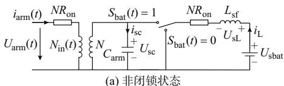

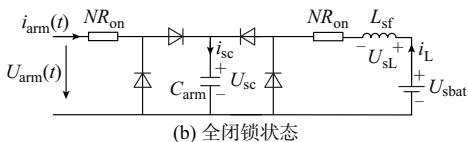

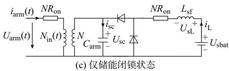

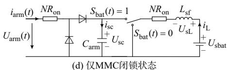  
图2 不同运行状态下有源型MMC桥臂平均值电路模型  
Fig. 2 Arm average value circuit models of active MMC in different operation states

与以往文献中普遍采用微分方程组模型不同，本文以等效电路的形式对桥臂AVM中的子模块电容电压与桥臂电流以及储能侧电流之间的循环耦合作用进行描述，更加直观且清晰。由于有源型MMC在常规子模块拓扑的基础上还增加了储能侧功率变换器和储能单元，若采用传统的微分方程组模型进行电磁暂态建模会非常复杂，尤其是在考虑MMC或者储能装置闭锁的情况时。而在图2所示的桥臂平均值电路模型基础上，能够轻松地推导出可以描述各种换流器运行状态的桥臂平均值仿真模型，明显简化了有源型MMC平均值建模的难度。

# 3 全状态平均值仿真模型

# 3. 1 桥臂全状态仿真模型

假设仿真步长为Δt，采用梯形积分法对描述桥臂串联电容和桥臂级储能侧等效滤波电感的微分方程进行离散化，可得：

$$
\left\{ \begin{array}{l} U _ {\mathrm {s c}} (t) = R _ {\mathrm {c e q}} i _ {\mathrm {s c}} (t) + E _ {\mathrm {c e q}} (t) \\ R _ {\mathrm {c e q}} = \frac {\Delta t}{2 C _ {\mathrm {a r m}}} \\ E _ {\mathrm {c e q}} (t) = U _ {\mathrm {s c}} (t - \Delta t) + R _ {\mathrm {c e q}} i _ {\mathrm {s c}} (t - \Delta t) \end{array} \right. \tag {14}
$$

$$
\left\{ \begin{array}{l} U _ {\mathrm {s L}} (t) = R _ {\mathrm {L e q}} i _ {\mathrm {L}} (t) + E _ {\mathrm {L e q}} (t) \\ R _ {\mathrm {L e q}} = \frac {2 L _ {\mathrm {s f}}}{\Delta t} \\ E _ {\mathrm {L e q}} (t) = - U _ {\mathrm {s L}} (t - \Delta t) - R _ {\mathrm {L e q}} i _ {\mathrm {L}} (t - \Delta t) \end{array} \right. \tag {15}
$$

由式（14）和式（15）可知，桥臂串联电容和等效滤波电感的离散化伴随模型均可采用戴维南等效电路形式；其中，等效电阻 $R _ { \mathrm { c e q } }$ 和 $R _ { \mathrm { L e q } }$ 由主回路参数和仿真步长决定，而等效电压源 $E _ { \mathrm { c e q } } ( t )$ ）和 $E _ { \mathrm { { L e q } } } ( t )$ 则由$R _ { \mathrm { c e q } } \setminus R _ { \mathrm { L e q } }$ 以及上一步长中得到的元件电压、电流值决定。

附 录 A 中 推 导 了 由 串 联 电 阻 $R _ { \mathrm { b a t e q } }$ 及 电 压 源$E _ { \mathrm { b a t e q } } ( t )$ ）构成的戴维南等效电路形式的电池储能离散化伴随模型［32］ ，其在桥臂级等效电路模型中的戴维南等效电路形式如（16）所示：

$$
\left\{ \begin{array}{l} U _ {\mathrm {s b a t}} (t) = R _ {\mathrm {s b a t e q}} i _ {\mathrm {L}} (t) + E _ {\mathrm {s b a t e q}} (t) \\ R _ {\mathrm {s b a t e q}} = N R _ {\mathrm {b a t e q}} \\ E _ {\mathrm {s b a t e q}} (t) = N E _ {\mathrm {b a t e q}} (t) \end{array} \right. \tag {16}
$$

式中： $R _ { \mathrm { s b a t e q } }$ 和 $E _ { \mathrm { s b a t e q } } ( t )$ 分别表示桥臂级电池储能戴维南等效电路的串联电阻和电压源。

将式（14）—式（16）中的元件离散化伴随模型代入图2所示的桥臂平均值电路模型中，即可得到图3所示的桥臂离散化伴随模型。 $R _ { \mathrm { e q 1 } } \setminus E _ { \mathrm { e q 1 } } ( \mathit { t } )$ 和 $R _ { \mathrm { e q 2 } }$ 、$E _ { \mathrm { e q 2 } } ( t )$ 分别表示不同等效支路上的戴维南等效电阻和等效电压源，其计算方法与有源型 MMC的运行状态有关。

1）考虑有源型MMC非闭锁状态。当 $S _ { \mathrm { b a t } } ( t ) { = } 1$ 时，等效储能支路与串联电容支路并联，并通过变压器耦合至桥臂。将电容侧和储能侧变量折算到桥臂侧并化简，可以得到 $R _ { \mathrm { e q 1 } }$ 和 $E _ { \mathrm { e q 1 } } ( t )$ 的表达式：

$$
\left\{ \begin{array}{l} R _ {\mathrm {e q 1}} = \left(\frac {N _ {\mathrm {i n}} (t)}{N}\right) ^ {2} \frac {R _ {\mathrm {c e q}} \left(N R _ {\mathrm {o n}} + R _ {\mathrm {L e q}} + R _ {\mathrm {s b a t e q}}\right)}{R _ {\mathrm {c e q}} + N R _ {\mathrm {o n}} + R _ {\mathrm {L e q}} + R _ {\mathrm {s b a t e q}}} \\ E _ {\mathrm {e q 1}} (t) = \frac {N _ {\mathrm {i n}} (t)}{N} \left[ \frac {\left(N R _ {\mathrm {o n}} + R _ {\mathrm {L e q}} + R _ {\mathrm {s b a t e q}}\right) E _ {\mathrm {c e q}} (t)}{R _ {\mathrm {c e q}} + N R _ {\mathrm {o n}} + R _ {\mathrm {L e q}} + R _ {\mathrm {s b a t e q}}} + \right. \\ \left. \frac {R _ {\mathrm {c e q}} \left(E _ {\mathrm {L e q}} (t) + E _ {\mathrm {s b a t e q}} (t)\right)}{R _ {\mathrm {c e q}} + N R _ {\mathrm {o n}} + R _ {\mathrm {L e q}} + R _ {\mathrm {s b a t e q}}} \right] \end{array} \right. \tag {17}
$$

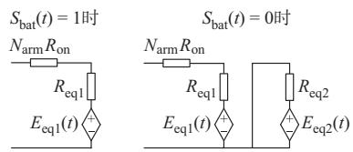  
(a) 非闭锁状态

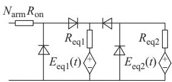  
(b) 全闭锁状态

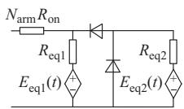  
Sbat(t) = 0时

(c) 仅储能闭锁状态

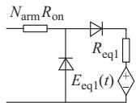  
Sbat(t) = 1时

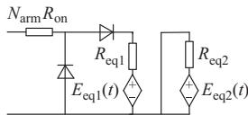  
(d) 仅MMC闭锁状态   
图3 不同运行状态下有源型MMC桥臂离散化伴随模型  
Fig. 3 Arm discretized companion models of active MMC under different operation conditions

当 $S _ { \mathrm { b a t } } ( t ) { = } 0$ 时，等效储能支路短接，串联电容支路独自通过变压器耦合至桥臂。将电容侧变量折算到桥臂侧并化简，得到串联电容支路戴维南等效电路参数，如式（18）所示：

$$
\left\{ \begin{array}{l} R _ {\mathrm {e q 1}} = \left(\frac {N _ {\mathrm {i n}} (t)}{N}\right) ^ {2} R _ {\mathrm {c e q}} \\ E _ {\mathrm {e q 1}} (t) = \frac {N _ {\mathrm {i n}} (t)}{N} E _ {\mathrm {c e q}} (t) \end{array} \right. \tag {18}
$$

等效储能支路戴维南等效电路参数由式（19）确定。

$$
\left\{ \begin{array}{l} R _ {\mathrm {e q 2}} = N R _ {\mathrm {o n}} + R _ {\mathrm {L e q}} + R _ {\mathrm {s b a t e q}} \\ E _ {\mathrm {e q 2}} (t) = E _ {\mathrm {L e q}} (t) + E _ {\mathrm {s b a t e q}} (t) \end{array} \right. \tag {19}
$$

考虑有源型MMC全闭锁状态。桥臂与串联电容支路和等效储能支路之间通过二极管半桥相互连接，此时串联电容支路戴维南等效电路参数为：

$$
\left\{ \begin{array}{l} R _ {\mathrm {e q 1}} = R _ {\mathrm {c e q}} \\ E _ {\mathrm {e q 1}} (t) = E _ {\mathrm {c e q}} (t) \end{array} \right. \tag {20}
$$

储能支路戴维南等效参数的计算公式与式（19）一致。

2）考虑仅储能闭锁状态。等效储能支路通过二极管半桥接入串联电容支路，并通过变压器耦合至桥臂。此时，串联电容支路戴维南等效电路参数计算公式与式（18）一致，而储能支路戴维南等效电路参数可由式（21）计算得到：

$$
\left\{ \begin{array}{l} R _ {\mathrm {e q} 2} = \left(\frac {N _ {\mathrm {i n}} (t)}{N}\right) ^ {2} \left(N R _ {\mathrm {o n}} + R _ {\mathrm {L e q}} + R _ {\mathrm {s b a t e q}}\right) \\ E _ {\mathrm {e q} 2} (t) = \frac {N _ {\mathrm {i n}} (t)}{N} \left(E _ {\mathrm {L e q}} (t) + E _ {\mathrm {s b a t e q}} (t)\right) \end{array} \right. \tag {21}
$$

考虑仅MMC闭锁状态。当 $S _ { \mathrm { b a t } } ( t ) = 1$ 时，等效储能支路与串联电容支路并联，然后通过二极管半桥 接 入 桥 臂 。 由 此 可 以 得 到 $R _ { \mathrm { e q 1 } }$ 和 $E _ { \mathrm { e q 1 } } ( t )$ 的 表 达式，如式（22）所示。当 $S _ { \mathrm { b a t } } ( t ) { = } 0$ 时，等效储能支路短接，则 $R _ { \mathrm { e q 1 } }$ 和 $E _ { \mathrm { e q 1 } } ( t )$ 的表达式与式（20）一致， $R _ { \mathrm { e q 2 } }$ 和 $E _ { \mathrm { e q 2 } } ( t )$ ）的表达式与式（19）一致。

$$
\left\{ \begin{array}{l} R _ {\mathrm {e q 1}} = \frac {R _ {\mathrm {c e q}} \left(N R _ {\mathrm {o n}} + R _ {\mathrm {L e q}} + R _ {\mathrm {s b a t e q}}\right)}{R _ {\mathrm {c e q}} + N R _ {\mathrm {o n}} + R _ {\mathrm {L e q}} + R _ {\mathrm {s b a t e q}}} \\ E _ {\mathrm {e q 1}} (t) = \frac {\left(N R _ {\mathrm {o n}} + R _ {\mathrm {L e q}} + R _ {\mathrm {s b a t e q}}\right) E _ {\mathrm {c e q}} (t)}{R _ {\mathrm {c e q}} + N R _ {\mathrm {o n}} + R _ {\mathrm {L e q}} + R _ {\mathrm {s b a t e q}}} + \end{array} \right. \tag {22}
$$

综合不同状态下的桥臂等效模型，本文提出FSAAVM，如图 4所示，以实现有源型 MMC 的高效仿真。其中， $R _ { \mathrm { e q 1 } } \setminus E _ { \mathrm { e q 1 } } ( t )$ 和 $R _ { \mathrm { e q 2 } } \setminus E _ { \mathrm { e q 2 } } ( t )$ 的计算方法已于前文阐明； $i _ { \mathrm { e q 1 } } ( t )$ 和 $i _ { \mathrm { e q 2 } } ( t )$ 为等效支路电流测量值。二极管插值问题是影响电力电子器件仿真精度的重要因素，决定了仿真模型是否能够精确反映换流器闭锁状态下的运行特性。考虑到常规电磁暂态仿真软件，如PSCAD，并未提供方便的变步长程序接口，本文所提模型保留了半桥不控子模块的拓扑结构，借助电磁暂态仿真软件内置算法解决二极管插值问题［33］ ，避免了传统快速等效模型采用可变电阻模拟二极管开关状态时出现的仿真计算畸变点［18］ 。为了能够进行不同运行状态下的电路切换，模型中添加了辅助开关S 和 $\mathrm { S } _ { 2 }$ ，其控制信号分别为$g _ { 1 } ( t )$ 和 $g _ { 2 } ( t )$ 。容易验证，当采用如表1所示的辅助开 关 控 制 信 号 取 值 时 ，不 同 运 行 状 态 下 的FSAAVM 正好对应图 3（a）至（d）所示的独立状态平均值仿真模型。

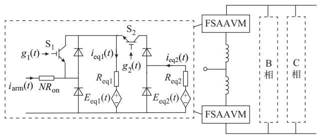  
图4 有源型MMC的FSAAVM  
Fig. 4 FSAAVM for active MMC

表1 辅助开关控制信号  
Table 1 Control signals for auxiliary switches   

<table><tr><td>运行状态</td><td>g1(t)</td><td>g2(t)</td></tr><tr><td>正常运行状态</td><td>1</td><td>0</td></tr><tr><td>全闭锁状态</td><td>0</td><td>1</td></tr><tr><td>仅储能闭锁状态</td><td>1</td><td>1</td></tr><tr><td>仅MMC闭锁状态</td><td>0</td><td>0</td></tr></table>

# 3. 2 桥臂内部电气量求解

在确定等效电路参数和辅助开关控制信号后，由电磁暂态仿真软件求解当前时刻的电气网络，得到桥臂电流 $i _ { \mathrm { a r m } } ( t )$ 和等效支路电流 $i _ { \mathrm { e q 1 } } ( t ) \setminus i _ { \mathrm { e q 2 } } ( t )$ ），进而可以计算当前时刻的串联电容支路电流和等效储能支路的电流。

考虑有源型 MMC非闭锁状态，此时等效桥臂平均值电路如图 2（a）所示。则当 $S _ { \mathrm { b a t } } ( t ) { = } 1$ 时，有

$$
\left\{ \begin{array}{l} i _ {\mathrm {s c}} (t) = \frac {N R _ {\mathrm {o n}} + R _ {\mathrm {L e q}} + R _ {\mathrm {s b a t e q}}}{R _ {\mathrm {c e q}} + N R _ {\mathrm {o n}} + R _ {\mathrm {L e q}} + R _ {\mathrm {s b a t e q}}} \frac {N _ {\mathrm {i n}} (t)}{N} i _ {\mathrm {e q 1}} (t) \\ i _ {\mathrm {L}} (t) = - \left(i _ {\mathrm {e q 1}} (t) - i _ {\mathrm {s c}} (t)\right) \end{array} \right. \tag {23}
$$

当 $S _ { \mathrm { b a t } } ( t ) { = } 0$ 时，则有

$$
\left\{ \begin{array}{l} i _ {\mathrm {s c}} (t) = \frac {N _ {\mathrm {i n}} (t)}{N} i _ {\mathrm {e q 1}} (t) \\ i _ {\mathrm {L}} (t) = \frac {E _ {\mathrm {e q 2}} (t)}{R _ {\mathrm {e q 2}}} \end{array} \right. \tag {24}
$$

考虑有源型 MMC全闭锁状态，此时等效桥臂平均值电路如图2（b）所示，则有

$$
\left\{ \begin{array}{l} i _ {\mathrm {s c}} (t) = i _ {\mathrm {e q 1}} (t) \\ i _ {\mathrm {L}} (t) = i _ {\mathrm {e q 2}} (t) \end{array} \right. \tag {25}
$$

考虑仅储能闭锁状态，此时等效桥臂平均值电路如图 $2 ( \mathrm { c } )$ 所示，则有

$$
\left\{ \begin{array}{l} i _ {\mathrm {s c}} (t) = \frac {N _ {\mathrm {i n}} (t)}{N} i _ {\mathrm {e q 1}} (t) \\ i _ {\mathrm {L}} (t) = \frac {N _ {\mathrm {i n}} (t)}{N} i _ {\mathrm {e q 2}} (t) \end{array} \right. \tag {26}
$$

考虑仅 MMC闭锁状态，此时等效桥臂平均值电路如图2（d）所示，则当 $S _ { \mathrm { b a t } } ( t ) { = } 1$ 时，有

$$
\left\{ \begin{array}{l} i _ {\mathrm {s c}} (t) = \frac {N R _ {\mathrm {o n}} + R _ {\mathrm {L e q}} + R _ {\mathrm {s b a t e q}}}{R _ {\mathrm {c e q}} + N R _ {\mathrm {o n}} + R _ {\mathrm {L e q}} + R _ {\mathrm {s b a t e q}}} i _ {\mathrm {e q 1}} (t) \\ i _ {\mathrm {L}} (t) = - \left(i _ {\mathrm {e q 1}} (t) - i _ {\mathrm {s c}} (t)\right) \end{array} \right. \tag {27}
$$

当 $S _ { \mathrm { b a t } } ( t ) { = } 0$ 时，则有

$$
\left\{ \begin{array}{l} i _ {\mathrm {s c}} (t) = i _ {\mathrm {e q 1}} (t) \\ i _ {\mathrm {L}} (t) = \frac {E _ {\mathrm {e q 2}} (t)}{R _ {\mathrm {e q 2}}} \end{array} \right. \tag {28}
$$

将根据式（ ）—式（ ）解得的 $i _ { \mathrm { s c } } ( t )$ 和 $i _ { \mathrm { L } } ( t )$ 代入式（14）—式（16）中，即可算出当前时刻的 $U _ { \mathrm { s c } } ( t )$ 、$U _ { \mathrm { L } } ( t )$ 以及 $U _ { \mathrm { s b a t } } ( t )$ 。这些结果在作为输出变量的同时，也将作为历史电压、电流值应用于下一个仿真步长中的等效电路参数的计算。

# 4 仿真验证

为验证所提模型的有效性，本文在电磁暂态仿真软件 PSCAD/EMTDC 中搭建了如附录 B 图 B1

所示的两端有源型柔性直流输电系统仿真模型。其中，送端换流站采用有源型MMC，受端换流站采用常规 MMC，详细的仿真系统参数见附录 B 表 B1。在本章测试算例中，分别采用FDM和FSAAVM对换流站进行仿真建模，仿真计算过程中重点关注的对象包括以子模块电容电压、桥臂电流和储能电池输出电流为代表的有源型 MMC内部电气量，以交流侧电压、电流和输入功率为代表的有源型 MMC交流侧外特性，以及以直流侧电压、电流和输出功率为代表的有源型MMC直流侧外特性。考虑到有源型 MMC各桥臂具有结构对称性和参数一致性，仿真结果中仅以a相上桥臂电气量作为内部电气量的代表。

在实际直流工程中，有源型 MMC桥臂子模块数目会达到数百个。但是，由于本文采用 FDM 对所提出的AVM的精度进行验证，而基于FDM建模方法对桥臂子模块数量达到数百个的MMC进行电磁暂态仿真计算则需要占据巨大的计算机内存空间和仿真时间。因此，在进行模型精度验证时，借鉴同领域相关研究［10，16，32］ 的做法，将MMC的桥臂子模块数目设置为 20。更高电平数目的仿真计算将采用DEM和FSAAVM实现，用于体现本文所提平均值仿真模型的效率。

# 4. 1 正常运行状态

当交直流输电系统运行状态良好时，为减少换流器内部开关损耗将储能闭锁，则此时有源型MMC仅充当常规柔性直流换流器。考虑柔性直流输电系统已经稳定运行在额定工作点，且其有功功率指令在 t=1.5 s时刻从额定值降低至 0.8 p.u.，然后在 t=2.0 s时刻恢复至 1.0 p.u.，其仿真结果于附录B图B2给出。可以看到，无论是处于稳态运行点还是功率暂态变化过程中，分别采用 FSAAVM 和FDM得到的仿真结果基本吻合。

# 4. 2 交流侧三相故障

假定在t=1.0 s时刻，送端交流系统母线发生三相短路故障；100 ms后故障清除。在交流系统故障期间，送端换流站无法继续从交流侧吸收额定有功功率。为了防止功率传输中断对受端交流系统的安全稳定运行造成影响，有源型 MMC在检测到交流电压跌落后立即调用内置储能，为柔性直流输电系统提供短时功率支撑。附录 图 给出了交流侧三相短路故障期间的系统内各电气量的仿真曲线。可以看到，采用FSAAVM计算得到的结果与FDM能够较好地吻合；尽管仿真得到的直流电压和直流电流并未完全贴合，但是在毫秒数量级的时间尺度内仍具有相同的变化趋势，且误差大小不超过2%。

# 4. 3 直流侧故障

假定在t=1.0 s时刻，柔性直流输电系统的直流线路发生对地短路故障。为抑制直流侧短路电流的迅速增长，两端换流器在 2 ms后闭锁，两侧交流断路器在100 ms后跳开。附录B图B4所示为直流故障期间有源型柔性直流输电系统的动态特性仿真曲线。可以看到，采用 FSAAVM 计算得到的结果与FDM能够较好地吻合。

# 4. 4 仿真效率对比

为体现本文所提模型的仿真效率，表 2总结了分别采用 FDM、DEM 和 FSAAVM 时的仿真系统计算时间，参考工况为正常运行工况，仿真总时长为3 s，仿真步长为20 μs。从表2可以看出，FDM的仿真效率极低，FSAAVM 的仿真效率最高。当子模块数目达到 200个时，FSAAVM 与 DEM 相比仿真速度提高 3倍以上，FSAAVM 与 FDM 相比仿真速度提高 3个数量级以上。容易推断，本文提出的模型在应用于子模块数目特别庞大的基于有源型MMC的多端柔性直流输电系统暂态研究时，将具有极大的效率优势。

表2 采用不同有源型MMC模型时的系统仿真效率  
Table 2 Effeciency of system simulations with different active MMC models   

<table><tr><td>子模块数目</td><td>FDM仿真时间/s</td><td>DEM 仿真 时间/s</td><td>FSAAVM 仿真 时间/s</td></tr><tr><td>20</td><td>1717.26</td><td>42.77</td><td>30.70</td></tr><tr><td>50</td><td>≥1717.26</td><td>54.05</td><td>34.45</td></tr><tr><td>100</td><td>≥1717.26</td><td>75.02</td><td>38.99</td></tr><tr><td>200</td><td>≥1717.26</td><td>121.52</td><td>44.92</td></tr></table>

# 4. 5 模型适用性说明

根据 FDM、DEM 和 FSAAVM 的建模原理，并结合 3种模型的仿真对比结果，可以简单归纳不同仿真模型的技术特点及适用场景：

1）FDM无须用户自定义，操作简单，能够精确地模拟换流器的内外特性和子模块投切过程；通过添加反映开关器件物理特性的控制回路，FDM还可以用于精确计算开关损耗。但是FDM所占的计算资源过于庞大，一般用于验证DEM和AVM的有效性而不是直接用于系统级仿真。  
2）DEM理论上可以与仅采用开关器件二值电阻模型的 FDM 具有相同的仿真精度，但计算速度显著提升，被广泛应用于小规模交直流系统电磁暂态仿真研究。然而，DEM以桥臂为基本结构单元进行封装，不能直接应用于桥臂内部故障仿真。而且，DEM仿真速度仍会受到子模块数量的影响，不适用

于大规模交直流电网的电磁暂态仿真研究。

3）FSAAVM的仿真速度基本不受子模块数目的影响，因而当仿真对象中包含大量换流器时，例如含多端换流站的大规模直流电网，其相较于 DEM的效率优势能够得到充分体现。FSAAVM忽略了桥臂内部各子模块参数及动态特性的差异，这在一般的系统级研究条件下是允许的；但是，若想要研究器件一致性无法得到满足或是电容电压平衡控制策略失效时的桥臂运行特性，则无法采用 FSAAVM实现。

# 5 结 语

有源型MMC在柔性直流输电领域具有广阔的应用前景，建立有源型 MMC高效电磁暂态仿真模型有利于对该项技术的深入研究。本文从推导有源型 MMC桥臂平均值等效电路出发，结合离散化伴随模型法，得出了一种适用于有源型 MMC仿真研究的 FSAAVM。通过 PSCAD/EMTDC 中的算例可以看出，本文所提模型同时具备高精度和高效率；与已有的详细暂态模型和 AVM 相比，本文所提模型考虑了子模块储能侧DC/DC变换器及其控制系统的作用，可以准确反映有源型 MMC闭锁和非闭锁状态下的内外部电气特性，适用范围得到进一步拓宽。

然而，目前关于有源型 MMC在柔性直流输电系统中应用所面临的实际问题及解决方案还缺乏系统性的研究，基于有源型 MMC的柔性直流输电方案在拓扑结构、控制策略和绝缘配合等方面还需要进行大量工作以满足工程实用需求。在此基础上，开发适用于多时间尺度分析的两端及多端有源型柔性直流系统仿真平台，可以为电力系统设计提供有力支持，也是未来有源型 MMC建模领域的工作重点之一。

附录见本刊网络版（http：//www.aeps-info.com/aeps/ch/index.aspx），扫英文摘要后二维码可以阅读网络全文。

# 参 考 文 献

［1］BARRA P H A，DE CARVALHO W C，MENEZES T S，et al. A review on wind power smoothing using high-power energy storage systems ［J］. Renewable and Sustainable Energy Reviews，2021，137：110455.   
［ ］刘耀，吴佳玮，肖晋宇，等 有源型柔性直流输电技术在全球能源互联网背景下的应用研究［J］.全球能源互联网，2020，3（2）：107-116.  
LIU Yao，WU Jiawei，XIAO Jinyu，et al. Application of active MMC-HVDC in the background of global energy interconnection

［J］. Journal of Global Energy Interconnection，2020，3（2）：107-116.  
［3］李军徽，侯涛，穆钢，等 .基于权重因子和荷电状态恢复的储能系统参与一次调频策略［J］.电力系统自动化 ，2020，44（19）：63-72.  
LI Junhui， HOU Tao， MU Gang， et al. Primary frequency regulation strategy with energy storage system based on weight factors and state of charge recovery［J］. Automation of Electric Power Systems，2020，44（19）：63-72.   
［4］李永东，徐杰彦，杨涵棣，等 .多电平变换器拓扑结构综述及展望［J］.电机与控制学报，2020，24（9）：1-12.  
LI Yongdong，XU Jieyan，YANG Handi，et al. Overview andprospect of multilevel converter topology［J］. Electric Machinesand Control，2020，24（9）：1-12.  
［5］TRINTIS I，MUNK-NIELSEN S，TEODORESCU R. A new modular multilevel converter with integrated energy storage ［C］// 37th Annual Conference of the IEEE Industrial Electronics Society， November 7-10， 2011， Melbourne， Australia：1075-1080.   
［6］GUO J，JIANG D Z，ZHOU Y B，et al. Energy storable VSC-HVDC system based on modular multilevel converter ［J］. International Journal of Electrical Power & Energy Systems， 2016，78：269-276.   
［7］ZENG W， LI R， CAI X. A new hybrid modular multilevelconverter with integrated energy storage［J］. IEEE Access，2019，7：172981-172993.  
［8］JUDGE P D，GREEN T C. Modular multilevel converter with partially rated integrated energy storage suitable for frequency support and ancillary service provision［J］. IEEE Transactions on Power Delivery，2018，34（1）：208-219.   
［9］XU Yuzhe，ZHANG Zheren，WANG Guoteng，et al. Modular multilevel converter with embedded energy storage for bidirectional fault isolation ［J/OL］. IEEE Transactions on Power Delivery ［2021-01-25］. https：//ieeexplore. ieee. org/ document/9335543.   
［10］管敏渊，徐政.模块化多电平换流器的快速电磁暂态仿真方法［J］. 电力自动化设备，2012，32（6）：36-40.  
GUAN Minyuan，XU Zheng. Fast electro-magnetic transient simulation method for modular multilevel converter［J］. Electric Power Automation Equipment，2012，32（6）：36-40.   
［11］CIGRE Working Group B4-57. Guide for the development of models for HVDC converters in a HVDC grid［EB/OL］.［2020- 12-20］. https：//www. researchgate. net/publication/ 318960759_Guide_for_the_Development_of_Models_for_HVD C_Converters_in_a_HVDC_Grid.   
［ ］陈武晖，吴明哲，张军，等 模块化多电平换流器电磁暂态模型研究综述［］电网技术， ，（ ）： -  
CHEN Wuhui，WU Mingzhe，ZHANG Jun，et al. Review ofelectromagnetic transient modeling of modular multilevelconverters［J］. Power System Technology，2020，44（12）：4755-4765.  
［13］GNANARATHNA U N，GOLE A M，JAYASINGHE R P.Efficient modeling of modular multilevel HVDC converters（MMC） on electromagnetic transient simulation programs［J］.IEEE Transactions on Power Delivery， 2011， 26 （1） ：

316-324.   
［14］张芳，黄维持，李传栋.适用于多种子模块拓扑的MMC通用化快速仿真模型［J］.电力自动化设备，2019，39（5）：129-136.  
ZHANG Fang，HUANG Weichi，LI Chuandong. General fastsimulation model applicable to multiple sub-module topologiesof MMC［J］. Electric Power Automation Equipment，2019，39（5）：129-136.  
［15］丁江萍，樊强，林畅，等.采用二值开关电阻的MMC等效模型在阀内故障仿真中的适用性［J］.电网技术，2020，44（7）：2701-2709.  
DING Jiangping，FAN Qiang，LIN Chang，et al. Applicability of MMC equivalent model based on two-value switched resistance in internal valve fault simulation［J］. Power System Technology，2020，44（7）：2701-2709.   
［ ］许建中，赵成勇，刘文静 超大规模 电磁暂态仿真提速模型［J］. 中国电机工程学报，2013，33（10）：114-120.  
XU Jianzhong，ZHAO Chengyong，LIU Wenjing. Acceleratedmodel of ultra-large scale MMC in electromagnetic transientsimulations［J］. Proceedings of the CSEE，2013，33（10）：114-120.  
［17］XU J Z，ZHAO C Y，LIU W J，et al. Accelerated model ofmodular multilevel converters in PSCAD/EMTDC［J］. IEEETransactions on Power Delivery，2013，28（1）：129-136.  
［18］ADAM G P，WILLIAMS B W. Half- and full-bridge modular multilevel converter models for simulations of full-scale HVDC links and multiterminal DC grids ［J］. IEEE Journal of Emerging and Selected Topics in Power Electronics，2014，2 （4）：1089-1108.   
［19］PERALTA J，SAAD H，DENNETIERE S，et al. Detailedand averaged models for a 401-level MMC-HVDC system［J］.IEEE Transactions on Power Delivery，2012，27（3）：1501-1508.  
［20］SAAD H，PERALTA J，DENNETIÈRE S，et al. Dynamic averaged and simplified models for MMC-based HVDC transmission systems ［J］. IEEE Transactions on Power Delivery，2013，28（3）：1723-1730.   
［21］SAAD H，DENNETIÈRE S，MAHSEREDJIAN J，et al.Modular multilevel converter models for electromagnetictransients［J］. IEEE Transactions on Power Delivery，2014，29（3）：1481-1489.  
［22］XU J Z，GOLE A M，ZHAO C Y. The use of averaged-valuemodel of modular multilevel converter in DC grid［J］. IEEETransactions on Power Delivery，2015，30（2）：519-528.  
［23］BEDDARD A， SHERIDAN C E， BARNES M， et al.Improved accuracy average value models of modular multilevelconverters［J］. IEEE Transactions on Power Delivery，2016，（ ）： -  
［ ］胡应宏，谢小荣，李笑倩，等 通用快速仿真模型及其在多端直流系统中的应用［］南方电网技术， ，（ ）： -HU Yinghong，XIE Xiaorong，LI Xiaoqian，et al. Universalfast simulation model of MMC and its applications in multi-terminal DC systems［J］. Southern Power System Technology，2019，13（3）：33-39.  
［25］李亚楼，孙谦浩，孟经伟，等.多样性子模块混合型MMC统一外特性高效电磁暂态模型［］电力系统自动化， ， （ ）：

138-145.   
LI Yalou， SUN Qianhao， MENG Jingwei， et al. Unifiedterminal and highly efficient electromagnetic transient model ofhybrid modular multilevel converter with various sub-modules［J］. Automation of Electric Power Systems，2020，44（5）：138-145.  
［26］HERATH N，FILIZADEH S，TOULABI M S. Modeling of a modular multilevel converter with embedded energy storage for electromagnetic transient simulations ［J］. IEEE Transactions on Energy Conversion，2019，34（4）：2096-2105.   
［27］刘耀，吴佳玮，赵小令，等.基于电池储能的MMC-HVDC系统的建模与仿真［J］.电力工程技术，2020，39（4）：48-54.  
LIU Yao，WU Jiawei，ZHAO Xiaoling，et al. Modeling and simulation of battery energy storage system based on MMC-HVDC［J］. Electric Power Engineering Technology，2020，39 （4）：48-54.   
［28］CUPERTINO A F，AMORIM W C S，PEREIRA H A，etal. High performance simulation models for ES-STATCOMbased on modular multilevel converters［J］. IEEE Transactionson Energy Conversion，2020，35（1）：474-483.  
［29］程志伟，薛毓强，郑文迪，等.模块化多电平换流器快速能量等效建模［J］. 电网技术，2019，43（3）：1066-1072.  
CHENG Zhiwei，XUE Yuqiang，ZHENG Wendi，et al. Fastenergy equivalent modeling of modular multilevel converter［J］.Power System Technology，2019，43（3）：1066-1072.  
［30］PURANIK I，ZHANG L，QIN J C. Impact of low-frequencyripple on lifetime of battery in MMC-based battery storagesystems［C］// 2018 IEEE Energy Conversion Congress andExposition （ECCE） ， September 23-27， 2018， Portland，USA：2748-2752.  
［31］郭龙，梁晖，张维戈 .基于模块化多电平变流器的电池储能系统荷电状态均衡控制策略［J］.电网技术，2017，41（8）：2688-2697.  
GUO Long， LIANG Hui， ZHANG Weige. State-of-chargebalancing control strategy for battery energy storage systembased on modular multi-level converter［J］. Power SystemTechnology，2017，41（8）：2688-2697.  
［ ］陆秋瑜，胡伟，郑乐，等 多时间尺度的电池储能系统建模及分析应用［］中国电机工程学报， ，（ ）： -  
LU Qiuyu，HU Wei，ZHENG Le，et al. Modeling and analysis of battery energy storage systems in multi-time scales application ［J］. Proceedings of the CSEE，2013，33（16）：86-93.   
［33］唐庚，徐政，刘昇 .改进式模块化多电平换流器快速仿真方法［］电力系统自动化， ，（ ）： -  
TANG Geng，XU Zheng，LIU Sheng. Improved fast model ofthe modular multilevel converter［J］. Automation of Electric， ， （ ）： -

徐 政(1962—)，男，通信作者，博士，教授，博士生导师，主要研究方向：大规模交直流电力系统分析、直流输电与柔性交流输电、风力发电技术与风电场并网技术。E-mail：

xuzheng007@zju.edu.cn

（编辑 蔡静雯）

# Full-state Arm Average Value Model for Simulation of Active Modular Multilevel Converter

TANG Yingjie，ZHANG Zheren，XU Zheng

(College of Electrical Engineering, Zhejiang University, Hangzhou 310027, China)

Abstract: To improve the simulation efficiency of the active modular multilevel converter (MMC) with enough computational accuracy, this paper proposes a full-state arm average value model appropriate for the simulation of the active MMC. Based on the dynamic averaging theory, this paper firstly deduces the average value mathematical model and the equivalent circuit model for the arms of the active MMC. Combined with the device discretized companion model, the average value models are established for the simulation of the arm in different operation states. Finally, the full-state arm average value model is obtained by the integration and simplification of circuits. This model focuses on the low-frequency dynamic commonalities of the submodules inside the arm, and can accurately reflect the overall transient characteristics of the arm. The simulation speed of this model is not affected by the number of submodules. Besides, the proposed model can also be used in the simulation of the active MMC in the blocking state. The simulation examples based on PSCAD/EMTDC verifies the validity of the proposed model.

This work is supported by the Fundamental Research Funds for the Central Universities (No. 2021QNA4014).

Key words: active modular multilevel converter (MMC); energy storage unit; electromagnetic transient simulation; average value model; converter blocking; full-state simulation model; flexible DC transmission

