# Portal Analysis Approach Used for the Efficient Electromagnetic Transient (EMT) Simulation of Power Electronic Systems

Chenxiang Gao , Jin Xu , Keyou Wang , Member, IEEE, Pan Wu , Zirun Li , Jianqi Zhou and Ryuichi Yokoyama, Life Fellow, IEEE

Abstract—Efficient electromagnetic transient (EMT) simulation is crucial for addressing the challenges associated with the modularity, cascading, and complex topologies of power electronics (PE) systems. This article introduces a novel portal analysis (PA) approach that adopts a unique “port-component” view, leveraging the characteristics of “ports”. Different from the classic nodal analysis (NA) method, the networks and the components are described based on the portal voltage equations with lower orders. Furthermore, a port tearing method is introduced to partition the circuit, resulting in a block-bordered-diagonal (BBD) matrix and a small number of boundary variables in the extended port equation. The parallel processing of the network solution is implemented by utilizing the BBD forms and the band features. To validate the effectiveness of the proposed PA approach in capturing dynamics, a down-scale dual active bridge (DAB) prototype is constructed. Additionally, a simulated microgrid comprising cascaded H-bridge-type-DAB (CHB-DAB), solar photovoltaic (PV), and energy storage system (ESS) is used to furtherly verify the accuracy and efficiency. The results demonstrate that compared with the NA-based methods, the proposed models exhibit high precision under various transient conditions, with maximum relative errors of less than 2%. Moreover, they achieve a remarkable acceleration of one to two orders of magnitude.

Index Terms—Power electronic system, electromagnetic transient (EMT) simulation, portal analysis, port tearing approach, parallel processing.

# I. INTRODUCTION

W ITH the remarkable increase of the renewable energyintegration, the proportion and scales of the power elec- integration, the proportion and scales of the power electronic (PE) equipment are experiencing an upward trend [1], [2],

Manuscript received 24 February 2023; revised 2 July 2023; accepted 11 August 2023. Date of publication 15 August 2023; date of current version 22 November 2023. This work was supported in part by the National Key R&D Program of China under Grant 2022YFE0105200 and in part by State Grid Zhejiang Electric Power Company Science and Technology Program under Grant 5211JX230004. Paper no. TPWRD-00228-2023. (Corresponding authors: Keyou Wang.)

Chenxiang Gao, Jin Xu, Keyou Wang, Pan Wu, and Zirun Li are with the Key Laboratory of Control of Power Transmission and Conversion, Ministry of Education, Shanghai Jiao Tong University, Shanghai 200240, China (e-mail: gaocx_22@sjtu.edu.cn; xujin20506@sjtu.edu.cn; wangkeyou@sjtu. edu.cn; panghuwu@sjtu.edu.cn; lzr9602@sjtu.edu.cn).

Jianqi Zhou is with the State Grid Jiaxing Power Supply Company, Jiaxing 314000, China (e-mail: zhoucity@vip.sina.com).

Ryuichi Yokoyama is with the Waseda University, Tokyo 169-8555, Japan (e-mail: yokoyama-ryuichi@waseda.jp).

Color versions of one or more figures in this article are available at https://doi.org/10.1109/TPWRD.2023.3305035.

Digital Object Identifier 10.1109/TPWRD.2023.3305035

[3]. The utilization of high-frequency switching techniques and fast control strategies in PE devices has led to transient processes with time scales ranging from microseconds to seconds. Consequently, accurately capturing the dynamic phenomena necessitates detailed electromagnetic transient (EMT) simulation [4], [5], [6]. However, in high voltage and large capacity scenarios, various power converters with modular, cascading, and complex topologies come into play. Examples of such converters include widely used modular multilevel converters (MMCs) [7] and power electronic transformers (PETs) [8], [9]. Performing EMT simulations of these networks using commercial software like PSCAD/EMTDC often requires a simulation time step at the microsecond level and the inversion of a high-order time-varying node admittance matrix [10], [11]. Unfortunately, this combination results in unacceptably long computing times.

Efficient EMT simulation technologies and algorithms for the PE systems attract widespread attention in recent years. These developments can be categorized as follows:

1) Circuit equivalent algorithms: These algorithms draw inspiration from generalized Thevenin equivalent methods. By eliminating internal nodes, such as those in MMCs and PETs [12], [13], [14], accelerated models are obtained. While these models exhibit high efficiency, they require complicated manual programming efforts and lack applicability to changing topologies.   
2) Partitioning technologies: Circuit partitioning methods divide the large-scale network into smaller subsystems based on the natural or artificial latencies. Examples include the Transmission-line model (TLM) [15], the latency insertion method (LIM) [16], [17], and the controlled-source decoupling models [18], [19]. However, these methods may introduce numerical instability and compromise accuracy. Numerical partitioning methods, such as multi-area Thevenin equivalent (MATE) [20] and nodal-splitting approach [21], [22], directly transform the admittance matrices into block-bordered-diagonal (BBD) forms through branch tearing or zero-admittance tearing. These methods are generally more flexible and accurate than the circuit partitioning methods, but their efficiency is influenced by the number of boundary variables.   
3) Sparsity technologies: The node admittance matrices are highly sparse and diagonally dominant. Thus, sparse LU factorization algorithms, such as the Minimum Degree

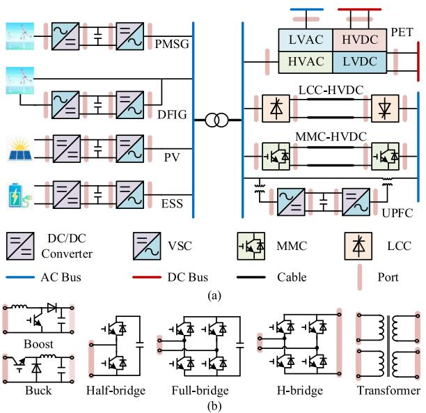  
Fig. 1. Schematic of the “port” in the power electronic systems: (a) Ports of the converters; (b) ports of the circuit components.

(MD) [23], Minimum Fill-in (MF) [24] and KLU algorithm [25], are employed to expedite the solution of algebraic equations Although these methods are more complex than straightforward approaches, they significantly reduce computing time and storage requirements [26], [27].

However, all these algorithms mentioned above are based on the nodal analysis (NA) method, which overlooks the “port” characteristic in the PE system. An illustrative example of a PE system incorporating renewable energy generation and integration is depicted in Fig. 1(a). The permanent-magnet synchronous generators (PMSG), the doubly fed induction generators (DFIG), the solar photovoltaic (PV), and the energy storage system (ESS) are integrated by the DC/DC converters and the voltage source converters (VSC) [5], [28]. Additionally, power flows are transformed using PET, the line-commutated converter-based HVDC (LCC-HVDC) [29], the MMC-HVDC, and the unified power flow controller (UPFC) [30]. The “port” characteristic, which refers to a pair of terminals enabling a single flow and across which there is a single voltage exists (the three-phase interfaces are considered as a generalized threeorder ports), is prevalent at the interfaces of different converters and basic circuit components, as indicated by the pink rectangle in Fig. 1. This characteristic leads to redundant computations and storage of the NA-based EMT solutions, which is extensively discussed in Section II-A.

Furthermore, the components shown in Fig. 1(b) typically consist of multiple branches, with examples like the fourwingding transformer model contains 28 branches [31]. In the system-level simulation, the external characteristics of the components hold more significance than the internal branch information. Hence, efficiency can be enhanced by minimizing the unnecessary updates of voltages and currents within the internal branches during each simulation loop.

In this article, a portal analysis (PA) algorithm is proposed to realize efficient EMT simulation for the PE system with

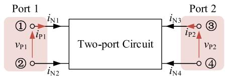  
Fig. 2. Topology of two-port circuit.

“port” characteristics. Compared with the NA method, the PA algorithm effectively reduces the matrix order and improves efficiency without sacrificing accuracy. Additionally, the partitioning and sparse technologies, previously proposed for the NA method, have been further modified and seamlessly integrated with the PA to further accelerate the simulation. The main theoretical contributions of the PA algorithm are outlined below:

1) A novel “port-component” view is adopted to represent the basic circuit units and the networks. It avoids redundant calculations stemming from the “port” characteristics and eliminates the need for updating information on numerous branches. Furthermore, a flexible “stamp” feature has been introduced to facilitate seamless modifications to the circuit, enabling adaptable changes in system topologies.   
2) The portal tearing approach is employed to establish the extended portal equation. By introducing only a few boundary variables, including the currents of serial ports and the voltages of parallel ports, the simulation efficiency is enhanced without compromising accuracy.   
3) Leveraging the BBD structure of portal matrices, parallel processing techniques are implemented to accelerate the network solution for the portal equation.

This article is organized as follows. Section II provides a portal description of the entire network and basic components. Section III presents the establishment of the extended portal equation using the port tearing methods. Section IV outlines the parallel solving process of the portal equation. Section V demonstrate the accuracy and efficiency of the proposed method through hardware experiments and simulations. Finally, conclusions are drawn in Section VI.

# II. DESCRIPTION OF THE NETWORKS AND COMPONENTSBASED ON THE PORTAL ANALYSIS APPROACH

Firstly, the advantages of the portal equation are demonstrated by comparing it with the nodal equation. Subsequently, the description of the networks based on the PA methods is introduced. This approach involves classifying and representing different components using a uniform portal equation. The contributions of these components to the overall system are represented using component “stamps”.

# A. Comparison of the Portal Equation and Nodal Equation

Without loss of generality, a two-port circuit shown in Fig. 2 is discussed as an example.

The nodal voltage equation and port equation based on the Y parameters (also known as admittance parameters or shortcircuit parameters) are expressed as [32]

$$
\boldsymbol {Y} _ {\mathrm {N}} \boldsymbol {v} _ {\mathrm {N}} = \boldsymbol {i} _ {\mathrm {N}} + \boldsymbol {j} _ {\mathrm {N}}, \tag {1}
$$

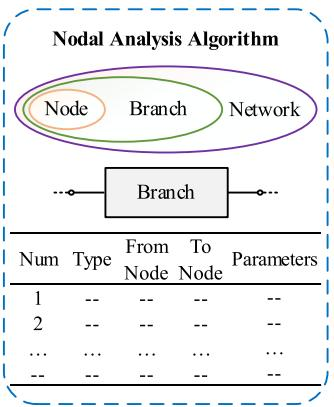

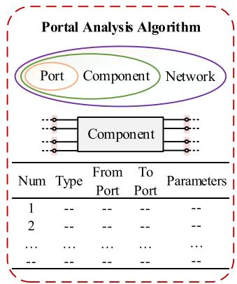  
Fig. 3. Description of the network in different algorithms.

$$
\boldsymbol {Y} _ {\mathrm {P}} \boldsymbol {v} _ {\mathrm {P}} = \boldsymbol {i} _ {\mathrm {P}} + \boldsymbol {j} _ {\mathrm {P}}, \tag {2}
$$

where the subscripts “N” and $\mathrm { ^ { 6 6 } P ^ { \ 9 } }$ denote the nodal and portal equations, respectively. The vector j represents the equivalent current sources (CS), which includes the history current sources from numerical integration, independent CS, and current sources of independent voltage sources (VS).

The circuit in Fig. 2 consists of 4 nodes and 2 ports, the nodal equation is of 4th order, while the portal equation is of 2nd order. According to the port characteristics, the relationships between vN and vP, iN and $i _ { \mathrm { P } }$ can be expressed as

$$
\left\{ \begin{array}{l} \boldsymbol {M} \cdot \boldsymbol {v} _ {\mathrm {N}} = \boldsymbol {v} _ {\mathrm {P}} \\ \boldsymbol {M} ^ {\mathrm {T}} \cdot \boldsymbol {i} _ {\mathrm {P}} = \boldsymbol {i} _ {\mathrm {N}} \\ \boldsymbol {M} = \left[ \begin{array}{c c c c} 1 & - 1 & 0 & 0 \\ 0 & 0 & 1 & - 1 \end{array} \right] \end{array} \right. \tag {3}
$$

where M is the port-node incidence matrix comprising elements of 1, 0, and 1.

Hence, YN and jN can be obtained from $Y _ { \mathrm { P } }$ and $j _ { \mathrm { P } }$ by combining (1)–(3),

$$
\left\{ \begin{array}{l} \boldsymbol {Y} _ {\mathrm {N}} = \boldsymbol {M} ^ {\mathrm {T}} \cdot \boldsymbol {Y} _ {\mathrm {P}} \cdot \boldsymbol {M} \\ = \left[ \begin{array}{c c c} y _ {\mathrm {P} 1 1} \cdot \left[ \begin{array}{c c} 1 & - 1 \\ - 1 & 1 \end{array} \right] & y _ {\mathrm {P} 1 2} \cdot \left[ \begin{array}{c c} 1 & - 1 \\ - 1 & 1 \end{array} \right] \\ \dots \dots \dots \dots \dots \dots \dots \dots \dots \dots \dots \dots \dots \dots \dots \dots \dots \dots \dots \dots \dots \dots \dots \dots \dots \dots \dots \dots \dots \dots \dots \dots \dots \dots \dots \dots \dots \dots \dots \dots \dots \dots \dots \dots \dots \dots \dots \dots \dots \dots \tag {4} \\ j _ {\mathrm {N}} = \boldsymbol {M} ^ {\mathrm {T}} \cdot j _ {\mathrm {P}} = [ j _ {\mathrm {P} 1} \cdot [1 - 1 ] \cdot j _ {\mathrm {P} 2} \cdot [1 - 1 ] ] ^ {\mathrm {T}} \end{array} . \right.
$$

In which, $y _ { \mathrm { p 1 1 } } , y _ { \mathrm { p 1 2 } } , y _ { \mathrm { p 2 1 } }$ , and $y _ { \mathrm { p 2 2 } }$ are the elements of $Y _ { \mathrm { P } }$ $j _ { \mathrm { p 1 } }$ and $j _ { \mathrm { p 2 } }$ are the parameters in jP.

From (4), it is evident that when solving circuits with port characteristics using NA algorithm, unnecessary computing time and storage resources are consumed. In contrast, the PA approach is more suitable in such cases.

# B. Description of the Network

In the NA method, the network consists of nodes and branches. The process begins by assigning numbers to the nodes in a specified order. The entire network is then represented using an input netlist, where each branch is mapped to a data structure containing its serial number, type, from node, to node, and parameters. This is illustrated in the blue box of Fig. 3.

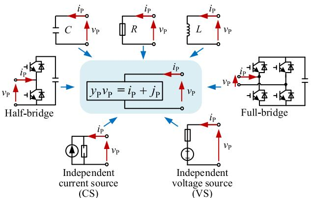  
(@)

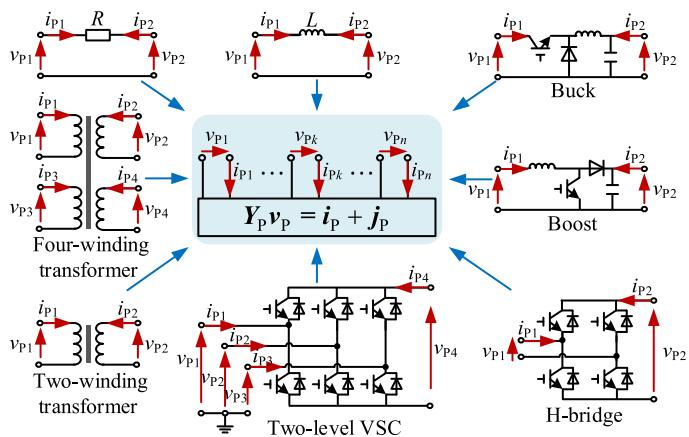  
(b）  
Fig. 4. Uniform description of different components: (a) Single-port components; (b) multi-port components.

The proposed PA algorithm introduces a “port-component” view to replace the traditional “node-branch” concept, as depicted in the red box of Fig. 3. And the nodes are weakened to the elements of the ports. Unlike the NA method, the PA algorithm incorporates single-port components (SP-Cs) and multi-port components (MP-Cs). As a result, the “From Port” and “To Port” of the MP-Cs may contain more than one element, and the “To Port” of the SP-Cs is designated as -1.

# C. Description of the Components

Using numerical integration based on the Dommel method [33], the differential equations of dynamic elements are treated as Norton equivalent circuits. The IGBT/diodes are modeled as admittances controlled by firing pulses, representing their on-state or off-state behavior. Subsequently, the branches are described using branch equations, which involve branch currents and nodal voltages in the NA method.

In contrast, the PA algorithm, replaces the branch equations with uniform port voltage equations, as defined in (2), to represent the components.

For SP-Cs illustrated in Fig. 4(a), (e.g., R, L, C, independent CS, independent VS, etc.), the port equations are t are equivalent to the branch equations since the branch currents and voltages align with the port information. In the case of complex SP-Cs like the full-bridges and half-bridges, the port equations are

obtained using Thevenin/ Norton equivalent method presented in [12].

However, obtaining the port equations for MP-Cs depicted in Fig. 4(b) is more challenging due to the coupling of ports. Therefore, this section presents two user-friendly approaches to address this issue.

a) Direct obtainment according to the definition: For a specific N-port component without internal resources $( j = 0 )$ , the input admittance $y _ { i i }$ of port i and the transfer admittance $y _ { i j }$ from port i to port j are obtained by applying a current source at the port $i \ ( i { \in } [ 1 , N ] )$ , while short-circuiting the other ports simultaneously:

$$
\left\{ \begin{array}{l} y _ {i i} = \left. \frac {I _ {i}}{V _ {i}} \right| _ {V _ {k} = 0, k \neq i} \\ y _ {i j} = \left. \frac {I _ {i}}{V _ {j}} \right| _ {V _ {k} = 0, k \neq i} \end{array} . \right. \tag {5}
$$

Then the elements of $Y _ { \mathrm { P } }$ are determined by alternately considering port i and the other short-circuited ports [32], [34].

The vector of $j _ { \mathrm { P } }$ is non-zero only when there are dynamic elements or independent sources within the components. It can be easily obtained by short-circuiting all ports.

$$
j _ {\mathrm {P} i} = - I _ {i} \mid_ {V _ {k = 0, k \in [ 1, N ]}}. \tag {6}
$$

b) Indirect obtainment transferring from the nodal equation: The parameters of the port equations can also be transferred from the nodal equations. Combine (1)–(3),

$$
\left[ \begin{array}{c c} \boldsymbol {Y} _ {\mathrm {N}} & - \boldsymbol {M} ^ {\mathrm {T}} \\ \boldsymbol {M} & \boldsymbol {0} \end{array} \right] \left[ \begin{array}{l} \boldsymbol {v} _ {\mathrm {N}} \\ \boldsymbol {i} _ {\mathrm {P}} \end{array} \right] = \left[ \begin{array}{l} \boldsymbol {j} _ {\mathrm {N}} \\ \boldsymbol {v} _ {\mathrm {P}} \end{array} \right]. \tag {7}
$$

Eliminate the vN, (7) is rewritten as

$$
\left\{ \begin{array}{l} \boldsymbol {Y} _ {\mathrm {P}} = \left(\boldsymbol {M} \boldsymbol {Y} _ {\mathrm {N}} ^ {- 1} \boldsymbol {M} ^ {\mathrm {T}}\right) ^ {- 1} \\ \boldsymbol {j} _ {\mathrm {P}} = \left(\boldsymbol {M} \boldsymbol {Y} _ {\mathrm {N}} ^ {- 1} \boldsymbol {M} ^ {\mathrm {T}}\right) ^ {- 1} \boldsymbol {M} \boldsymbol {Y} _ {\mathrm {N}} ^ {- 1} \cdot \boldsymbol {j} _ {\mathrm {N}} \end{array} . \right. \tag {8}
$$

Because the number of nodes is not equal to the number of ports, M is singular and (8) is typically irreducible. However, since (8) is only used to derive the port equation of individual components, employing low-order matrix operations is considered acceptable.

For clarity, two acquisition methods for the Boost converter are provided in Appendix. It is obvious that the direct method involves more complex acquisition procedures compared to the indirect method, but it yields a more concise expression.

When switches exist within the components, $Y _ { \mathrm { P } }$ and the coefficients $\mathrm { o f } j _ { \mathrm { P } }$ become time-varying. To reduce the computational burden, it is feasible to pre-compute and store all potential values during program initialization.

# D. Component Stamps for the Overall Circuit

Based on the network descriptions in Fig. 3 and the uniform port voltage equations of components in (2), the contribution of each component to the entire system can be represented as “component stamps” as shown in Table I. These stamps are similar to the “branch stamps” used in the NA-based method [35]. The component stamps offer two main benefits in the manipulation of system matrices:

TABLE I COMPONENT STAMPS FOR CONSTRUCTING PORTAL VOLTAGE EQUATION   

<table><tr><td>Type</td><td>Stamp for the port admittance matrix</td><td>Stamp for the vector of history resources</td></tr><tr><td>Port m
SP-C
yPvP=iP+jP</td><td>m
m[···yP···]</td><td>m[···jP···]</td></tr><tr><td>Port n
TP-C
[yP11 yP12 yP21 yP22][vP1 vP2]=[iP1 iP2]+[jP1 jP2]</td><td>n
n[···yP11···yP12···]</td><td>n[···jP1···jP2]</td></tr><tr><td>......</td><td>......</td><td>......</td></tr></table>

1) Modularity and connectivity in system establishment. The stamp feature enables a modular representation of each component’s contribution to the overall system, where the elements are solely associated with its specific component type and parameters. By considering the “from port” and “to port” numbers, the elements within the stamps can be precisely positioned in the corresponding locations of the system matrices.   
2) Efficiency and flexibility in system modification. The representation of each component’s contribution through stamped elements allows for easy modification of the system. By simply modifying the corresponding elements in the system matrices, specific components can be added or removed without the need for a complete reconfiguration of the entire matrices. This design ensures efficiency and flexibility in system modification.

# III. PORT TEARING BASED EXTENDED PORTAL EQUATION

Different from the simple connection between branches through shared nodes, the ports in adjacent components can be connected in series or parallel, resulting in complex topologies such as the input-series-output-parallel (ISOP) structure [9]. By analogy with the formation of the nodal voltage equation, the global portal voltage equation is obtained. Port tearing is then introduced to obtain extended port equations in BBD forms, which exhibit high parallelism.

# A. Forming of the Portal Voltage Equation

The port admittance equation of the network follows the same format as the components, as described in (2). By utilizing the “stamp” feature discussed in Section II-D, the diagonal elements $Y _ { \mathrm { i i } }$ and the non-diagonal elements $Y _ { \mathrm { i j } }$ in the global $Y _ { \mathrm { P } }$ can be calculated as follows:

$$
\left\{ \begin{array}{l} Y _ {i i} = \sum \left(y _ {i i}\right) _ {k}, \text {i f} k \\ - \text {t h c o m p o n e n t c o n t a i n s p o r t} i \\ Y _ {i j} = \sum \left(y _ {i j}\right) _ {k}, \text {i f} k \\ - \text {t h c o m p o n e n t c o n t a i n s p o r t} i \text {a n d p o r t} j \end{array} . \right. \tag {9}
$$

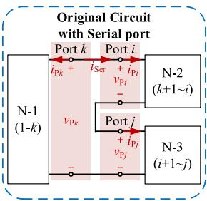

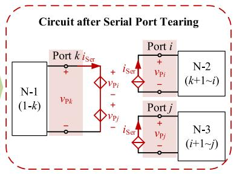  
Fig. 5. Schematic of the serial port tearing.

where $( y _ { i i } ) _ { k }$ and $( y _ { i j } ) _ { k }$ are the local Y parameters of k-th component as shown in Table I.

Because only a few ports are connected through components, $Y _ { \mathrm { P } }$ exhibits similar diagonal dominance and sparsity characteristics as the node admittance matrix $Y _ { \mathrm { N } }$ .

Likewise, $j _ { \mathrm { P } }$ can be obtained by summering $j _ { i }$ of all the components that contains port i

$$
J _ {i} = \sum \left(j _ {i}\right) _ {k}, \text {i f} k - \text {t h c o m p o n e n t c o n t a i n s p o r t} i. \tag {10}
$$

# B. Serial Portal Tearing

Considering that series-connected ports do not share port voltages, the port voltage equation cannot be directly obtained in this scenario. To address this challenge, the serial portal tearing method is proposed below. It also improves the parallelism of the equation.

A schematic diagram of the system consisting of three seriesconnected networks is illustrated in Fig. 5. In which, the ports are labeled 1 to $k ,$ k+1 to i, and i+1 to j, respectively.

Then the port voltage equation of each network can be obtained using (9) and (10):

$$
\left[ \begin{array}{l l} \mathbf {Y} _ {\mathrm {P} _ {-} \mathrm {I I}} ^ {r} & \mathbf {Y} _ {\mathrm {P} _ {-} \mathrm {I} x} ^ {r} \\ \mathbf {Y} _ {\mathrm {P} _ {-} x \mathrm {I}} ^ {r} & Y _ {\mathrm {P} _ {-} x x} ^ {r} \end{array} \right] \cdot \left[ \begin{array}{l} \boldsymbol {v} _ {\mathrm {P} _ {-} \mathrm {I}} ^ {r} \\ v _ {\mathrm {P} x} \end{array} \right] = \left[ \begin{array}{l} \boldsymbol {0} \\ i _ {\mathrm {P} x} \end{array} \right] + \left[ \begin{array}{l} \boldsymbol {j} _ {\mathrm {P} _ {-} \mathrm {I}} ^ {r} \\ j _ {\mathrm {P} x} \end{array} \right], \tag {11}
$$

$$
\boldsymbol {Y} _ {\mathrm {P}} ^ {r} \boldsymbol {v} _ {\mathrm {P}} ^ {r} = \left[ \begin{array}{l} \boldsymbol {0} \\ i _ {\mathrm {P} x} \end{array} \right] + \boldsymbol {j} _ {\mathrm {P}} ^ {r} \tag {12}
$$

where r- [1], [3] is the num of network, and x represents the number of the serial port $i , j$ or k, $ { v _ { \mathrm { P ~ I } } ^ { r } }$ and $j _ { \mathrm { P \perp } } ^ { r }$ are the vector of the internal port voltages and current sources.

According to Kirchhoff’s current law (KCL) and Kirchhoff’s voltage law (KVL), the relationships between the voltages and currents of port $i , j ,$ and k are

$$
\left\{ \begin{array}{l} i _ {\mathrm {P} i} = i _ {\mathrm {P} j} = - i _ {\mathrm {P} k} = i _ {\mathrm {S e r}} \\ v _ {\mathrm {P} k} = v _ {\mathrm {P} i} + v _ {\mathrm {P} j} \end{array} \right.. \tag {13}
$$

where $i _ { \mathrm { S e r } }$ is the serial current shared by the three ports.

Draw on the idea of the node tearing method in [21], an additional variable $i _ { \mathrm { S e r } }$ is added to the portal voltage equation:

$$
\left[ \begin{array}{c c c c} \mathbf {Y} _ {\mathrm {P} 1} & & & Q _ {1} \\ & \mathbf {Y} _ {\mathrm {P} 2} & & Q _ {2} \\ & & \mathbf {Y} _ {\mathrm {P} 3} & Q _ {3} \\ \cdot \bar {Q} _ {1} ^ {\mathrm {T r}} & \bar {Q} _ {2} ^ {\mathrm {T r}} & \bar {Q} _ {3} ^ {\mathrm {T r}} & 0 \end{array} \right] \left[ \begin{array}{l} \boldsymbol {v} _ {\mathrm {P} 1} \\ \boldsymbol {v} _ {\mathrm {P} 2} \\ \boldsymbol {v} _ {\mathrm {P} 3} \\ i _ {\text {S e r}} \end{array} \right] = \left[ \begin{array}{l} j _ {\mathrm {P} 1} \\ j _ {\mathrm {P} 2} \\ j _ {\mathrm {P} 3} \\ 0 \end{array} \right], \tag {14}
$$

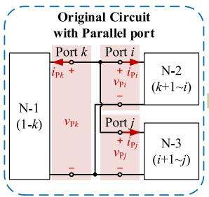

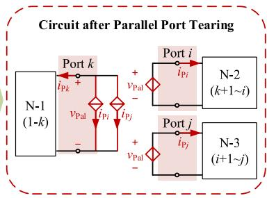  
Fig. 6. Schematic of the parallel port tearing.

The details of (14) are shown in (15):

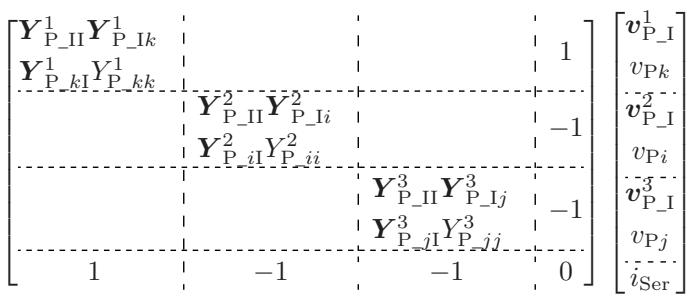

$$
= \left[ \begin{array}{l} j _ {\mathrm {P} - \mathrm {I}} ^ {1} \\ j _ {\mathrm {P} k} \\ j _ {\mathrm {P} - \mathrm {I}} ^ {2} \\ \vdots \\ j _ {\mathrm {P} i} \\ j _ {\mathrm {P} - \mathrm {I}} ^ {3} \\ j _ {\mathrm {P} - \mathrm {I}} \\ j _ {\mathrm {P} j} \\ 0 \end{array} \right], \tag {15}
$$

where $Q _ { r }$ is the incidence matrix reflects KCL, and $Q _ { r } ^ { \mathrm { T } }$ corresponds to the KVL shown in (13).

Through the serial port tearing, the circuit is partitioned as the right half in Fig. 5. The resulting extended port equation in (15) takes the form of BBD with only one boundary variable. It needs to be emphasized that the controlled sources in Fig. 5 are employed solely for the purpose of concise expression and do not introduce any latency.

# C. Parallel Portal Tearing

The three parallel-connected networks are drawn in Fig. $^ { 6 , }$ and their corresponding port constraints are described in (16).

$$
\left\{ \begin{array}{l} v _ {P i} = v _ {P j} = v _ {P k} = v _ {\text {P a r}} \\ i _ {P k} = - i _ {P i} - i _ {P j} \end{array} \right.. \tag {16}
$$

It is obvious that the port currents $i _ { \mathrm { P i } } .$ , $i _ { \mathrm { P j } }$ and iPk are constrained by the KCL in (16), indicating the need for two independent current variables to represent the entire system.

Similar to (15), the networks can be represented as:

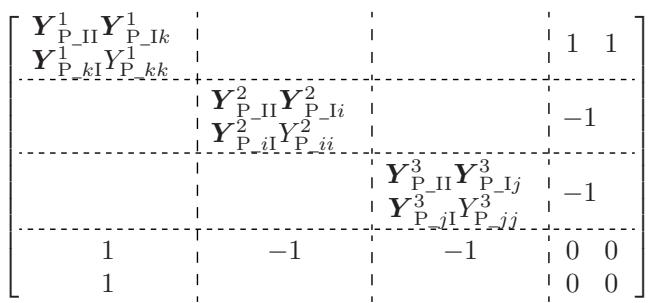

$$
\times \left[ \begin{array}{l} \boldsymbol {v} _ {\mathrm {P} - \mathrm {I}} ^ {1} \\ v _ {\mathrm {P} k} \\ \boldsymbol {v} _ {\mathrm {P} - \mathrm {I}} ^ {2} \\ v _ {\mathrm {P} i} \\ \boldsymbol {v} _ {\mathrm {P} - \mathrm {I}} ^ {3} \\ v _ {\mathrm {P} j} \\ i _ {\mathrm {P} i} \\ i _ {\mathrm {P} j} \end{array} \right] = \left[ \begin{array}{l} \boldsymbol {j} _ {\mathrm {P} - \mathrm {I}} ^ {1} \\ \boldsymbol {j} _ {\mathrm {P} k} \\ \boldsymbol {j} _ {\mathrm {P} - \mathrm {I}} ^ {2} \\ \boldsymbol {j} _ {\mathrm {P} i} \\ \boldsymbol {j} _ {\mathrm {P} - \mathrm {I}} ^ {3} \\ j _ {\mathrm {P} j} \\ 0 \\ 0 \end{array} \right]. \tag {17}
$$

However, as the number of parallel networks increases to M, the required number of boundary current variables in (17) also increases to M-1. Hence, the current tearing method becomes less efficient for parallel-connected networks.

To address this, considering that parallel-connected ports share a common voltage $\nu _ { \mathrm { P a r } } ,$ the inverse hybrid parameters (i.e., G parameters) [33], [36] are introduced to modify the port voltage equation of each network in (11) as follows:

$$
\begin{array}{l} \left[ \begin{array}{c c} \det  \left| \boldsymbol {Y} _ {\mathrm {P}} ^ {r} \right| & \boldsymbol {Y} _ {\mathrm {P - I x}} ^ {r} \\ \hline \boldsymbol {Y} _ {\mathrm {P - x x}} ^ {r} & \frac {\boldsymbol {Y} _ {\mathrm {P - x x}} ^ {r}}{\boldsymbol {Y} _ {\mathrm {P - x x}} ^ {r}} \\ - \frac {\boldsymbol {Y} _ {\mathrm {P - x I}} ^ {r}}{\boldsymbol {Y} _ {\mathrm {P - x x}} ^ {r}} & \frac {1}{\boldsymbol {Y} _ {\mathrm {P - x x}} ^ {r}} \end{array} \right]. \left[ \begin{array}{c} \boldsymbol {v} _ {\mathrm {P - I}} ^ {r} \\ i _ {\mathrm {P x}} \end{array} \right] = \left[ \begin{array}{c} \boldsymbol {0} \\ v _ {\mathrm {P x}} \end{array} \right] \\ + \left[ \begin{array}{c} \boldsymbol {j} _ {\mathrm {P} _ {-} \mathrm {I}} ^ {r} - \frac {j _ {\mathrm {P} _ {-}}}{Y _ {\mathrm {P} _ {-} x x} ^ {r}} \mathbf {Y} _ {\mathrm {P} _ {-} \mathrm {I} x} ^ {r} \\ \frac {- j _ {\mathrm {P} _ {-}}}{Y _ {\mathrm {P} _ {-} x x} ^ {r}} \end{array} \right]. \tag {18} \\ \end{array}
$$

$$
\begin{array}{l} \left[ \begin{array}{c c} G _ {\mathrm {P} _ {-} \mathrm {I I}} ^ {r} & G _ {\mathrm {P} _ {-} \mathrm {I} x} ^ {r} \\ G _ {\mathrm {P} _ {-} x \mathrm {I}} ^ {r} & G _ {\mathrm {P} _ {-} x x} ^ {r} \end{array} \right] \cdot \left[ \begin{array}{c} \boldsymbol {v} _ {\mathrm {P} _ {-} \mathrm {I}} ^ {r} \\ i _ {\mathrm {P} x} \end{array} \right] = \left[ \begin{array}{c} \mathbf {0} \\ v _ {\mathrm {P} x} \end{array} \right] + \left[ \begin{array}{c} j _ {\mathrm {P I} _ {-} \mathrm {e q}} ^ {r} \\ v _ {\mathrm {P e q} _ {-} x} \end{array} \right] \\ \triangleq G _ {\mathrm {P}} ^ {r} \cdot \boldsymbol {p} _ {\mathrm {P}} ^ {r} = \left[ \begin{array}{l} \mathbf {0} \\ v _ {\mathrm {P} x} \end{array} \right] + \boldsymbol {s} _ {\mathrm {P} - \mathrm {e q}} ^ {r}. \tag {19} \\ \end{array}
$$

where det $| { Y } _ { \mathrm { P } } ^ { r } |$ represents the determinant of $Y _ { \mathrm { P } } ^ { r } , G _ { \mathrm { P } } ^ { r }$ is the inverse hybrid parameter matrix, $p _ { \mathrm { P } } ^ { r }$ is the undetermined variables, and $s _ { \mathrm { P _ { - } e q } } ^ { r }$ is the equivalent sources of the equation.

Then, combining (16), (18) and (19), the networks are rewritten as (20) using the G parameters.

$$
\left[ \begin{array}{c c c c} \boldsymbol {G} _ {\mathrm {P} 1} & & & \boldsymbol {Q} _ {1} \\ & \boldsymbol {G} _ {\mathrm {P} 2} & & \boldsymbol {Q} _ {1} \\ & & \boldsymbol {G} _ {\mathrm {P} 3} & \boldsymbol {Q} _ {3} \\ \dots \dots \dots \dots \dots \dots \dots \dots \dots \dots \dots \dots \dots \dots \dots \dots \dots \dots \dots \dots \dots \dots \dots \dots \dots \dots \dots \dots \dots \dots \dots \dots \dots \dots \dots \dots \dots \dots \dots \dots \dots \dots \dots \end{array} \right] \left[ \begin{array}{c} \boldsymbol {p} _ {\mathrm {P} 1} \\ \boldsymbol {p} _ {\mathrm {P} 2} \\ \boldsymbol {p} _ {\mathrm {P} 3} \\ v _ {\text {P a r}} \end{array} \right] = \left[ \begin{array}{c} s _ {\mathrm {P} 1} \\ s _ {\mathrm {P} 2} \\ s _ {\mathrm {P} 3} \\ 0 \end{array} \right]. \tag {20}
$$

The detailed expression of (20) is given in (21):

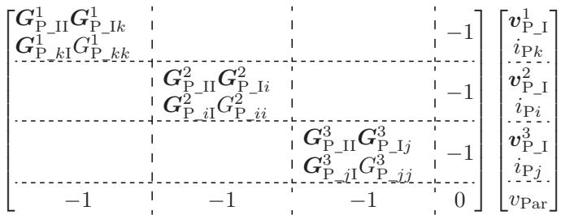

$$
= \left[ \begin{array}{l} j _ {\mathrm {P I} _ {-} \mathrm {e q}} ^ {1} \\ v _ {\mathrm {P e q} - k} \\ \bar {j} _ {\mathrm {P I} _ {-} \mathrm {e q}} ^ {3} \\ v _ {\mathrm {P e q} - i} \\ \bar {j} _ {\mathrm {P I} _ {-} \mathrm {e q}} ^ {3} \\ v _ {\mathrm {P e q} - j}. \\ 0 \end{array} \right]. \tag {21}
$$

The parallel port tearing method ensures that the number of additional boundary variables is always 1, regardless of the number of parallel networks. This aspect is of great significance in enhancing simulation efficiency.

Combining the series and parallel port tearing methods, the networks are spitted with final extended port equation as

$$
\left[ \begin{array}{c c c c} G _ {\mathrm {P} 1} & & & Q _ {1} \\ & G _ {\mathrm {P} 1} & & Q _ {2} \\ & & \ddots & \vdots \\ & & & G _ {\mathrm {P m}} \\ \dots \dots \dots \dots \dots \dots \dots \dots \dots \dots \dots \dots \dots \dots \dots \dots \dots \dots \dots \dots \dots \dots \dots \dots \dots \dots \dots \dots \dots \dots \dots \dots \dots \dots \dots \dots \dots \dots \dots \dots \dots \dots \dots \dots \dots \dots \end{array} \right] \left[ \begin{array}{l} p _ {\mathrm {P} 1} \\ p _ {\mathrm {P} 2} \\ \vdots \\ p _ {\mathrm {P m}} \\ l _ {\mathrm {S P}} \end{array} \right] = \left[ \begin{array}{l} s _ {\mathrm {P} 1} \\ s _ {\mathrm {P} 2} \\ \vdots \\ s _ {\mathrm {P m}} \\ 0 \end{array} \right], \tag {22}
$$

$$
\left[ \begin{array}{c c} G _ {\mathrm {P} \text {b l o c k}} & Q \\ \bar {Q} ^ {\mathrm {T}} & 0 \end{array} \right] \left[ \begin{array}{l} p _ {\mathrm {P}} \\ l _ {\mathrm {S P}} \end{array} \right] = \left[ \begin{array}{l} s _ {\mathrm {P}} \\ 0 \end{array} \right], \tag {23}
$$

where $\begin{array} { r } { \boldsymbol { l } _ { \mathrm { S P } } = [ \boldsymbol { i } _ { \mathrm { S e r } } , \nu _ { \mathrm { P a r } } ] ^ { \mathrm { T } } } \end{array}$ is the vector of the serial port currents and parallel port voltages, and m is the number of partitions.

# IV. PARALLEL PROCESSING OF NETWORK SOLUTION

# A. Parallel Calculation of the Extended Portal Equation

Make use of the BBD forms, the extended portal equation in (23) is solved using Diakoptics method [22] as (24), where the $p _ { \mathrm { P 1 } } \sim p _ { \mathrm { P m } }$ are independently calculated in parallel.

$$
\left\{ \begin{array}{l} \boldsymbol {l} _ {\mathrm {S P}} = \left(\boldsymbol {Q} ^ {\mathrm {T}} \boldsymbol {G} _ {\mathrm {P} _ {-} \text {b l o c k}} ^ {- 1} \boldsymbol {Q}\right) ^ {- 1} \boldsymbol {Q} ^ {\mathrm {T}} \boldsymbol {G} _ {\mathrm {P} _ {-} \text {b l o c k}} ^ {- 1} \cdot \boldsymbol {s} _ {\mathrm {P}} \\ \boldsymbol {p} _ {\mathrm {P}} = \left[ \begin{array}{c} \boldsymbol {p} _ {\mathrm {P} 1} \\ \boldsymbol {p} _ {\mathrm {P} 1} \\ \vdots \\ \boldsymbol {p} _ {\mathrm {P} _ {\mathrm {m}}} \end{array} \right] = \left[ \begin{array}{c} \boldsymbol {G} _ {\mathrm {P} 1} ^ {- 1} \boldsymbol {s} _ {\mathrm {P} 1} \\ \boldsymbol {G} _ {\mathrm {P} 2} ^ {- 1} \boldsymbol {s} _ {\mathrm {P} 2} \\ \vdots \\ \boldsymbol {G} _ {\mathrm {P} _ {\mathrm {m}}} ^ {- 1} \boldsymbol {s} _ {\mathrm {P} _ {\mathrm {m}}} \end{array} \right] - \left[ \begin{array}{c} \boldsymbol {G} _ {\mathrm {P} 1} ^ {- 1} \boldsymbol {Q} _ {\mathrm {P} 1} \\ \boldsymbol {G} _ {\mathrm {P} 2} ^ {- 1} \boldsymbol {Q} _ {\mathrm {P} 2} \\ \vdots \\ \boldsymbol {G} _ {\mathrm {P} _ {\mathrm {m}}} ^ {- 1} \boldsymbol {Q} _ {\mathrm {P} _ {\mathrm {m}}} \end{array} \right] \cdot \boldsymbol {l} _ {\mathrm {S P}} \quad , \end{array} \right.
$$

The solution of $\boldsymbol { l } _ { \mathrm { S F } }$ is rewritten as (25) to furtherly reduce calculations.

$$
\boldsymbol {l} _ {\mathrm {S P}} = \left(\boldsymbol {Q} ^ {\mathrm {T}} \boldsymbol {G} _ {\mathrm {P} _ {-} \text {b l o c k}} ^ {- 1} \boldsymbol {Q}\right) ^ {- 1} \boldsymbol {Q} ^ {\mathrm {T}} \boldsymbol {G} _ {\mathrm {P} _ {-} \text {b l o c k}} ^ {- 1} \cdot \boldsymbol {s} _ {\mathrm {P}}
$$

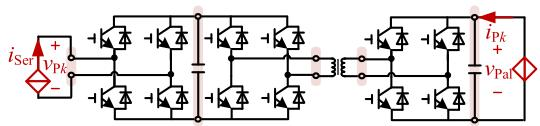

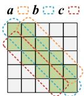

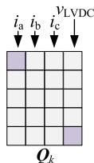  
(b)   
Fig. 7. Matrix characteristics of CHB-DAB-based PET: (a) Topology of partitioned CHB-DAB PMs; (b) $G _ { \mathrm { P } }$ and Q of the kth CHB-DAB in phase A.

$$
= \left(\sum_ {k = 1} ^ {\mathrm {m}} \left(\boldsymbol {Q} _ {k} ^ {\mathrm {T}} \boldsymbol {G} _ {\mathrm {P} k} ^ {- 1} \boldsymbol {Q} _ {k}\right)\right) ^ {- 1} \left(\sum_ {k = 1} ^ {\mathrm {m}} \left(\boldsymbol {Q} _ {k} ^ {\mathrm {T}} \boldsymbol {G} _ {\mathrm {P} k} ^ {- 1} \boldsymbol {s} _ {k}\right)\right). \tag {25}
$$

In which, the global $G _ { \mathrm { P \_ b l o c k } }$ is replaced by small partitioned matrices $G _ { \mathrm { P } r } ,$ thereby transforming high-order matrix calculations into operations with lower-order matrices.

# B. Efficient Solution Based on the Band Matrix Characteristic

Interestingly, each ${ \bf G } _ { \mathrm { P } r }$ exhibits a special characteristic through the PA approach. Let us consider the cascaded Hbridge-type dual active bridge (CHB-DAB) based PET [8] as an example. As depicted in Fig. 7(a), the CHB-DAB power modules (PMs) are regarded as fundamental subsystems, with the input and output sides segregated through the utilization of the serial and parallel port tearing methods, respectively. Hence, the boundary variables $\boldsymbol { l } _ { \mathrm { S P } }$ in (23) correspond to the phase currents $i _ { \mathrm { a } } , i _ { \mathrm { b } } , i _ { \mathrm { c } } .$ , and the voltage of the LVDC bus vLVDC.

Since there are 5 ports and 6 components in each PM, the matrices $G _ { \mathrm { P } }$ and Q of the $k ^ { \mathrm { t h } }$ CHB-DAB in phase A are illustrated in Fig. 7(b). Due to the existence of single-port or two-port components in each PM, only the elements of $G _ { \mathrm { P } k }$ above and below the main diagonal are non-zero (highlighted in green), resulting in a tridiagonal matrix or 1-band matrix structure [37]. The banded property of $G _ { \mathrm { P } }$ is also maintained when MP-Cs are incorporated into the circuits.

Exploiting the banded characteristics, the solution of $p _ { \mathrm { P } }$ in (24) can be further expedited by utilizing band-based sparse LU factorization techniques, such as the renowned tridiagonal matrix algorithm (TDMA) with a time complexity of O(n) [38]. Moreover, the storage requirements can be reduced by storing the vectors a, b and c instead of the full $G _ { \mathrm { P } }$ matrix.

Furthermore, it is worth noting that $Q _ { k }$ is also very sparse with only 2 non-zero elements (depicted in light purple), which facilitates the solution of (24).

# C. The Overall Process and Implementation of the Portal Analysis Algorithm

The overall process of the proposed portal analysis algorithm is summarized in Fig. 8.

At the beginning of the simulation, the circuit is initialized according to the input netlist as shown in Section II-B. Then the

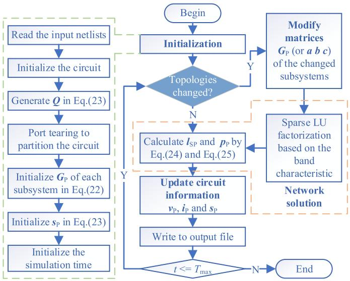  
Fig. 8. Procedures of the proposed portal analysis approach.

entire network undergoes partitioning at the serial and parallel ports utilizing the port tearing method, with the incidence matrix Q given in (23). Following this, $G _ { \mathrm { P } }$ and sP are generated for each subsystem in preparation for the initial simulation step.

Each simulation step consists of three main stages. Firstly, localized modifications are made to the corresponding elements in the $G _ { \mathrm { P } }$ to accommodate changes in topologies and firing pulses. Secondly, leveraging the BBDF of $G _ { \mathrm { P _ { \mathrm { - } } b l o c k } }$ in (22) and utilizing the band characteristic depicted in Fig. 7(b), the network solution for $\boldsymbol { l } _ { \mathrm { S P } }$ and $p _ { \mathrm { P } }$ is efficiently executed using the parallel framework outlined in (24) and (25). Finally, the circuit information $\nu _ { \mathrm { P } } , i _ { \mathrm { P } }$ and $s _ { \mathrm { P } }$ are updated based on the port equations of the different components, which are also performed in parallel.

The principles and procedures of the proposed PA approach closely resemble those of the NA method, with the additional requirement of the “port” characteristics within the circuits. Taking advantage of the encapsulation, inheritance, and polymorphism in object-oriented programming (OOP), the PA algorithm is implemented using the C++ languages based on Visual Studio 2022 (VS2022).

# V. CASE STUDIES AND RESULT ANALYSIS

In this section, the proposed PA approach is applied to a down-scaled DAB prototype and a complex microgrid system to verify its accuracy in Part A by comparisons with experimental waveforms and simulated waveforms of PSCAD/EMTDC. Its efficiency is then evaluated in Part B by comparisons with the computing time of different methods. Finally, its advantages and limitations are discussed in Part C.

# A. Verification of the Simulation Accuracy

a) Comparisons with experiments of down-scaled prototype: Fig. 9 illustrates the principle and setup of the down-scaled DAB prototype. It employs a proportional control scheme to

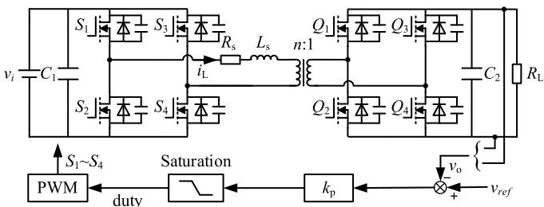

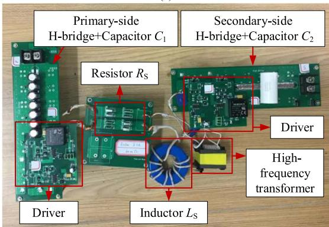  
  
Fig. 9. Principle and setup of the experimental platform: (a) Topology and control diagram; (b) prototype.

TABLE II PARAMETERS OF THE EXPERIMENTAL PLATFORM   

<table><tr><td>Symbol</td><td>Parameter</td><td>Value</td></tr><tr><td>vi</td><td>Input DC voltage (V)</td><td>30</td></tr><tr><td>C1</td><td>Capacitance of primary-side (μF)</td><td>700</td></tr><tr><td>RS</td><td>Resistance (mΩ)</td><td>60</td></tr><tr><td>LS</td><td>Inductance (μH)</td><td>51.4</td></tr><tr><td>C2</td><td>Capacitance of secondary-side (μF)</td><td>198.9</td></tr><tr><td>HF</td><td>Switching frequency (kHz)</td><td>20</td></tr><tr><td>n</td><td>Transformer ratio</td><td>1</td></tr><tr><td>RL</td><td>DC load (Ω)</td><td>10.1</td></tr><tr><td>vref</td><td>Reference of the output voltage (V)</td><td>30</td></tr><tr><td>kP</td><td>Coefficient of the controller</td><td>0.4</td></tr></table>

generate the duty cycle, and a single-phase shift control technique is employed to balance the output voltage. The circuit and controller parameters are listed in Table II.

The inductance current plays a crucial role in the DAB, as it directly affects the current stress and power losses. Therefore, a comparison between the experimental and simulated results is conducted for the output voltages $\nu _ { \mathrm { O } }$ and inductance currents $i _ { \mathrm { L } }$ , as illustrated in Fig. 10.

Both in the experimental and simulated results, the output voltages $\nu _ { \mathrm { O } }$ closely track the reference value of 30V, and the inductance currents $i _ { \mathrm { L } }$ exhibit a periodicity of 20kHz. The peak values of $i _ { \mathrm { L } }$ obtained from the experimental and simulated results are 4.5A and 4.38A respectively, resulting in a relative error of 2.67%.

b) Comparisons with commercial software simulations of complex microgrid system: To further evaluate the accuracy of

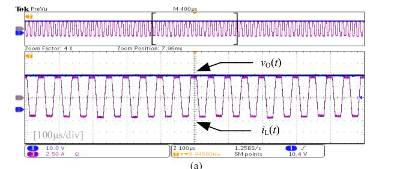

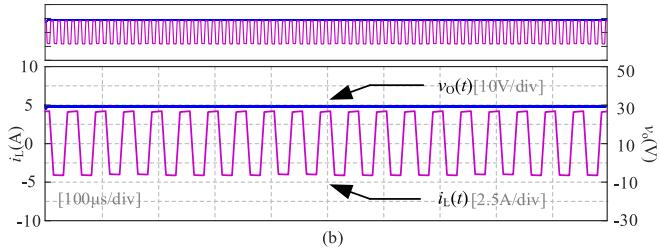  
Fig. 10. Comparison between the experimental and simulated results: (a) Experimental results; (b) simulated results.

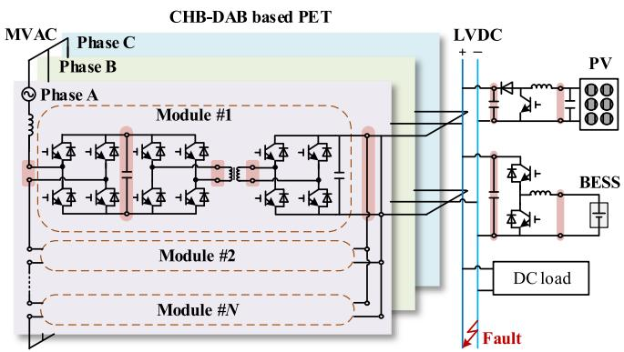  
Fig. 11. Topologies of the tested microgrids.

the proposed PA algorithm in complex systems, a microgrid composed of a three-phase CHB-DAB-based PET, a PV system, and a battery ESS (BESS) is conducted, as depicted in Fig. 11. The detailed models (DMs) of this microgrid are established in PSCAD/EMTDC as the benchmark.

The parameters utilized are based on the Gen-I PET prototype discussed in [39], and are provided in Table III for reference. And the PET contains 3 CHB-DAB PMs in each phase, while the DC load is represented by a 0.1 Ω resistance. The capacitor voltages on the output sides of the CHB and DAB modules are individually balanced using outer loop control and dual phase shift techniques [40]. The classic perturbs and observe (P&O) methods based on maximum power point tracking (MPPT) techniques [41] are adopted in the controller of the PV. Additionally, the constant power control strategies are employed for the BESS.

During 0 1 s, the PET operates independently under the following conditions: 1) During 0 0.04 s, PET starts with the LVDC output voltage reference remaining at 1.0 pu; 2) At t = 0.2 s, the LVDC bus is shorted by a small resistance, and the fault is cleared after 2 ms; 3) At t = 0.35 s, a power change occurs by adjusting the LVDC output voltage reference from 1.0 pu to 0.8 pu.

TABLE III MAIN PARAMETERS OF THE MICROGRIDS   

<table><tr><td>Parameter</td><td>Value</td></tr><tr><td>Phase voltage of the MVAC bus (kV)</td><td>7.2</td></tr><tr><td>Frequency of AC voltage (Hz)</td><td>60</td></tr><tr><td>Inductor of the AC side (mH)</td><td>6.4</td></tr><tr><td>Switching frequency for the CHB (kHz)</td><td>1</td></tr><tr><td>Switching frequency for the DAB (kHz)</td><td>10</td></tr><tr><td>Ratio of the transformer</td><td>10:1</td></tr><tr><td>Leakage inductance of transformer (μH)</td><td>100</td></tr><tr><td>Capacitor between CHB and DAB (μF)</td><td>3000</td></tr><tr><td>Capacitor in the output side of DAB (μF)</td><td>1000</td></tr><tr><td>Reference output voltage of CHB (kV)</td><td>3.8</td></tr><tr><td>Reference output voltage of LVDC bus (kV)</td><td>0.4</td></tr><tr><td>Number of modules connected in series per array</td><td>8</td></tr><tr><td>Number of module strings in parallel per array</td><td>250</td></tr><tr><td>Number of cells connected in series per module</td><td>36</td></tr><tr><td>Number of cell strings in parallel per module</td><td>4</td></tr><tr><td>Reference irradiation of PV array (W/m2)</td><td>1000</td></tr><tr><td>Reference temperature of PV array (°C)</td><td>25</td></tr><tr><td>Initial state of charge of the battery (%)</td><td>50</td></tr><tr><td>Battery nominal voltage (V)</td><td>200</td></tr></table>

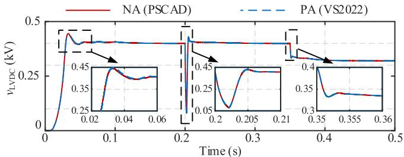

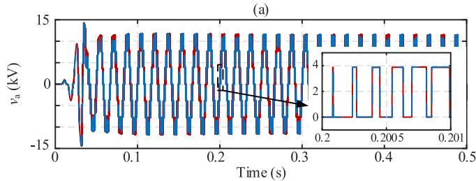

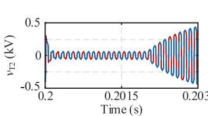

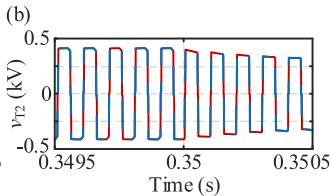  
(d)   
Fig. 12. Simulation results of PET under multi-states: (a) LVDC bus voltage; (b) the input PWM voltage in phase A; (c) secondary side voltage of transformer during DC fault stage; (d) secondary side voltage of transformer during power changing stage.

Fig. 12(a) illustrates the voltages of the LVDC bus vLVDC, with a partial enlarged view. Under different transient conditions, the maximum relative error (MRE) of vLVDC is only 1.57%, where the MRE of variable x is defined as:

$$
\mathrm {M R E} = \max  \left(\frac {\left| x _ {\mathrm {P A}} - x _ {\mathrm {P S C A D}} \right|}{x _ {\mathrm {P S C A D}}}\right) \tag {26}
$$

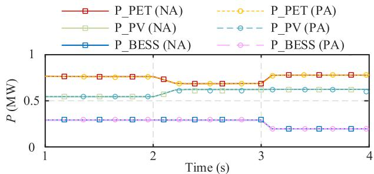  
Fig. 13. Simulation results of the power redistribution.

Moreover, the input PWM voltage $\nu _ { \mathrm { a } }$ containing 7 levels is shown in Fig. 12(b). And the secondary side voltages of transformer vT2 are depicted in Fig. 12(c) and (d) during the DC fault and power changing stages, respectively. Despite these waveforms change at high frequencies, the MRE of the proposed PA models remains consistently low, at less than 2%.

$\mathrm { A t } ~ t = 0 . 5 ~ \mathrm { s } ,$ The LVDC output voltage reference changes to 1.0 pu to provide the rated bus voltage. After that, at $t = 0 . 8 \ \mathrm { s } ,$ the PV system and BESS connect to the LVDC bus, while the DC load remains constant at 1.6 MW.

Fig. 13 shows the dynamics of power redistribution following certain conditions: an increase in irradiation at the PV station from 1000 $\mathrm { W } / \mathrm { m } ^ { 2 }$ to 1200 $\mathrm { W } / \mathrm { m } ^ { 2 }$ at $t = 2 . 0 ~ \mathrm { s }$ , and a decrease in the power reference of the BESS from 0.3 MW to 0.2 MW at $t = 3 . 0 ~ \mathrm { s } .$ It can be seen that the PA-based model matches well with the NA-based model during dynamics.

The experimental and simulation results above indicate that the proposed PA approach has high precision to describe the dynamic characteristics of the power electric systems.

# B. Verification of the Simulation Efficiency

In this section, the efficiency of the PA methods is evaluated using a three-phase PET with varying numbers of CHB-DAB PMs from 9 to 45. And the evaluation is conducted over a duration of 1 s. All these simulations are carried out on the computer with Intel(R) Core (TM) i9-12900H 2.50 GHz and 16.0 GB RAM, and the simulation time step is set to 1 μs.

It is worth noting that the comparison of efficiency between the different models may be influenced by many factors such as programming languages and implementation environments. Therefore, for a fair comparison, the PET models based on NA method are also developed in the VS2022 environment using C++ languages. This enables us to clearly observe the efficiency enhancements achieved through the utilization of the PA method. The computing times of the NA-based and PA-based models are listed in Tables IV and V.

It is obvious that the network solution contributes the largest portion of the overall CPU time in both NA- and PA-based models. As the number of CHB-DAB PMs increases, the computation times for the network solution in NA-based models exhibit exponential growth, as illustrated in Fig. 14. It results in a total simulation time of approximately 1000s for the models with 45 PMs.

TABLE IVCOMPUTING TIME OF THE NA-BASED PET MODELS IN VS2022  

<table><tr><td>Number of PMs</td><td>Total CPU Time (s)</td><td>Network solution (s)</td><td>Modify matrices (s)</td><td>Update circuit information (s)</td><td>Control and others (s)</td></tr><tr><td>9</td><td>16.105</td><td>13.632</td><td>0.495</td><td>1.521</td><td>0.457</td></tr><tr><td>18</td><td>51.751</td><td>46.906</td><td>0.953</td><td>3.122</td><td>0.770</td></tr><tr><td>27</td><td>183.026</td><td>174.940</td><td>2.157</td><td>4.902</td><td>1.027</td></tr><tr><td>36</td><td>317.088</td><td>306.417</td><td>2.858</td><td>6.521</td><td>1.292</td></tr><tr><td>45</td><td>974.406</td><td>959.411</td><td>4.424</td><td>8.796</td><td>1.775</td></tr></table>

TABLE V COMPUTING TIME OF THE PA-BASED PET MODELS IN VS2022   

<table><tr><td>Number of PMs</td><td>Total CPU Time (s)</td><td>Network solution (s)</td><td>Modify matrices (s)</td><td>Update circuit information (s)</td><td>Control and others (s)</td></tr><tr><td>9</td><td>2.168</td><td>1.234</td><td>0.266</td><td>0.486</td><td>0.182</td></tr><tr><td>18</td><td>3.732</td><td>2.012</td><td>0.512</td><td>0.946</td><td>0.262</td></tr><tr><td>27</td><td>6.660</td><td>3.728</td><td>0.926</td><td>1.572</td><td>0.434</td></tr><tr><td>36</td><td>8.954</td><td>4.956</td><td>1.176</td><td>2.244</td><td>0.578</td></tr><tr><td>45</td><td>12.836</td><td>7.966</td><td>1.402</td><td>2.944</td><td>0.524</td></tr></table>

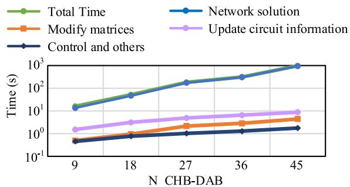  
Fig. 14. Computing time of different steps in NA-based models vary with the number of PMs.

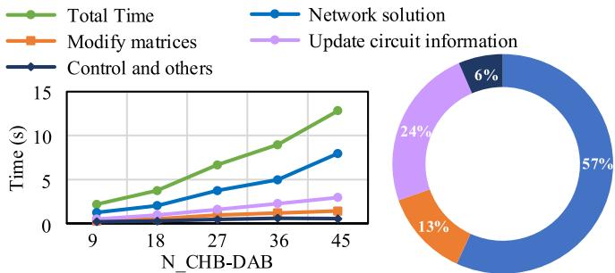  
Fig. 15. Computing time and proportion of different steps in PA-based models vary with the number of PMs.

In contrast to the exponential growth observed in Table IV and Fig. 14, the computing time of the network solution using PA method increases linearly with the number of PMs. This linear trend accounts for approximately 57% of the total CPU time, as depicted in Fig.15.

The computing time comparisons of different simulation links of PET with 27 PMs are illustrated in Fig. 16. Compared with the NA-based models, the total CPU time of PA-based models

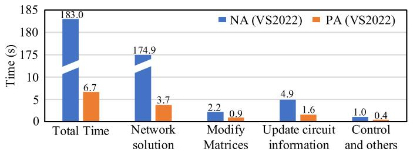  
Fig. 16. Comparisons between NA and PA methods for the CHB-DAB-based PET containing 27 PMs.

TABLE VI CHARACTERISTICS OF THE NA AND PA EQUATION   

<table><tr><td rowspan="2">Number of PMs</td><td colspan="2">Order of matrices</td><td colspan="2">Number of basic circuit units</td></tr><tr><td>NA</td><td>PA</td><td>NA</td><td>PA</td></tr><tr><td>9</td><td>69</td><td>56</td><td>187</td><td>61</td></tr><tr><td>18</td><td>132</td><td>101</td><td>367</td><td>115</td></tr><tr><td>27</td><td>195</td><td>146</td><td>547</td><td>169</td></tr><tr><td>36</td><td>258</td><td>191</td><td>727</td><td>223</td></tr><tr><td>45</td><td>321</td><td>236</td><td>907</td><td>277</td></tr></table>

TABLE VII SIMULATION EFFICIENCY ANALYSIS OF DIFFERENT METHODS   

<table><tr><td rowspan="2">Number of PMs</td><td rowspan="2">CPU Time of NA (PSCAD) (s)</td><td colspan="2">NA (VS 2022)</td><td colspan="2">EHM (PSCAD)</td><td colspan="2">PA (VS 2022)</td></tr><tr><td>CPU Time (s)</td><td>Speedup factor</td><td>CPU Time (s)</td><td>Speedup factor</td><td>CPU Time (s)</td><td>Speedup factor</td></tr><tr><td>9</td><td>127.5</td><td>16.1</td><td>7.9</td><td>17.7</td><td>7.2</td><td>2.2</td><td>58.8</td></tr><tr><td>18</td><td>263.7</td><td>51.8</td><td>5.1</td><td>20.7</td><td>12.7</td><td>3.7</td><td>70.7</td></tr><tr><td>27</td><td>668.1</td><td>183.0</td><td>3.7</td><td>28.0</td><td>23.8</td><td>6.7</td><td>100.3</td></tr><tr><td>36</td><td>1232.1</td><td>317.1</td><td>3.9</td><td>35.5</td><td>34.7</td><td>9.0</td><td>137.6</td></tr><tr><td>45</td><td>2619.0</td><td>974.4</td><td>2.7</td><td>63.1</td><td>41.5</td><td>12.8</td><td>204.0</td></tr></table>

is significantly decreased from 183.0 s to 6.7 s. Notably, the computing time of the network solution experiences a sharp decline from 174.9 s to 3.7 s. This improvement can be attributed to the reduced matrix orders, as shown in Table VI, and the parallel processing techniques described in Section IV. Furthermore, the number of basic circuit units (branches in NA and components in PA) is scaled down by approximately three times, resulting in a proportional reduction in the computing time for the update circuit information step.

To furtherly demonstrate the efficiency of the proposed method, a comparison is made with the DMs in PSCAD as the benchmark, as well as the NA-based models in VS2022 and the equivalent hierarchical models (EHMs) in [42]. The results are presented in Table VII and Fig. 17. In which, the speedup factors, defined as the ratio of the CPU time of the DMs to the other models, provide a measure of efficiency.

The speedup factors of the PA-based models are gradually increasing with the number of CHB-DAB PMs. When the PMs reach 45, the proposed models demonstrate a speedup of more than 200 times compared to the DMs. Besides, even when compared to the NA-based models and EHMs, the proposed models maintain a high level of efficiency.

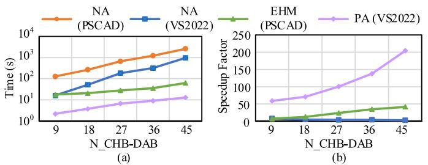  
Fig. 17. Efficiency analysis of different methods: (a) CPU time; (b) speedup factors.

# C. Discussions

This section aims to comprehensively discuss the advantages and limitations of the proposed PA approach, clearing its innovation and application scenarios.

The significant features of the proposed PA approach can be summarized as follows:

1) The PA approach employs low-order portal equations instead of high-order equations used in the NA method. This eliminates redundant calculations and enables fast and efficient simulation of large-scale PE systems with port characteristics.   
2) The PA approach inherits the important “stamp” feature from the NA method. This enhances modularity, efficiency, and flexibility in the establishment and modification of complex systems.   
3) The accelerated simulation technologies proposed for the NA method can be easily enhanced for higher efficiency in PA approach. This article demonstrates successful implementations using port tearing methods, Diacoptics algorithm, and TDMA technology.

When considering three-phase ports under asymmetrical conditions, there is no redundancy in the nodal equations, and the PA method does not result in a reduction in matrix order. Therefore, the proposed PA approach is especially effective in PE systems characterized by a high proportion of single-phase AC or DC ports, such as PETs and MMCs. However, in systems with a significant presence of three-phase ports, although there is still a speedup factor compared to the NA method due to the introduced port tearing and parallel framework, the efficiency is weakened.

It should be clarified that the proposed PA algorithm is designed for simulation of linear time-invariant (LTI) systems. Simulation of nonlinear and other complex characteristics, such as magnetic saturation effects in transformers or transmission line distribution, cannot be directly performed. To address these challenges, more complex component models need to be considered, such as saturable transformer models [43], Bergeron models [15], and the multiple T or π section network models [44]. But these changes to component models will not affect the overall simulation framework.

# VI. CONCLUSION

In this article, a PA approach is proposed to address the demand for efficient simulation in PE systems. Leveraging the analogy with the NA method, the networks are described using

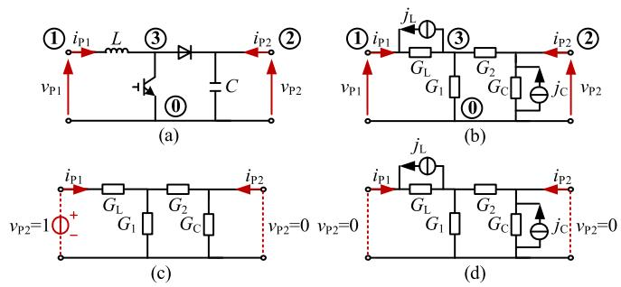  
Fig. 18. Obtainment of portal equation parameters of boost converter: (a) topology; (b) companion circuit; (c) obtainment of the admittance matrix; (d) obtainment of the vector of history sources.

input netlists in a novel “port-component” view, while components are represented by uniform portal voltage equations. Through circuit partitioning at serial and parallel ports, extended portal equations are derived by introducing a few boundary variables. The network solution is then executed in parallel using sparse LU factorization, taking advantage of the BBD forms of the global matrices and the band characteristics of the partition matrices.

To validate the proposed PA algorithm, hardware experiments with a down-scaled DAB prototype and simulations of a microgrid comprising a CHB-DAB-based PET, PV, and BESS are conducted. The results demonstrate the accuracy of the proposed models in capturing dynamic characteristics under various conditions. Notably, as the simulation scales increase, the computational time exhibits a significant reduction, transitioning from an exponential trend observed in the NA method to a linear trend observed in the PA method, resulting in a substantial speedup factor.

The versatility of the proposed PA approach lies in its language and hardware platform independence, making it applicable to networks with “port” characteristics. Meanwhile, the precise matrix partitioning and efficient parallel architecture offer support for system-level analysis and have potential for real-time simulation applications.

# APPENDIX

The direct and indirect methods to obtain the port equations of the MP-Cs are given in Section II-C. To further clarify the implementation and distinctions between these two methods, the procedures are supplemented, using the Boost converter given in Fig. 18(a) as an illustrative example.

The inductor L and capacitor C are equivalented to the Norton equivalent circuits $G _ { \mathrm { { L } } } / / j _ { \mathrm { { L } } }$ and $G _ { \mathrm { C } } / / j _ { \mathrm { C } }$ in Fig. 18(b), respectively [33]. Additionally, the IGBT and diode components are represented by binary admittances $G _ { 1 }$ and G2, which are controlled by the firing pulse.

# A. Direct Obtainment According to the Definition

By applying (5), the admittance parameters $y _ { 1 1 }$ and $y _ { 1 2 }$ are obtained by setting $\nu _ { \mathrm { P 1 } } = 1 \mathrm { a n d } \nu _ { \mathrm { P 2 } } = 0 \mathrm { . }$ , as shown in Fig. 18(c):

$$
\left\{ \begin{array}{l} y _ {1 1} = \frac {i _ {\mathrm {P} 1}}{v _ {\mathrm {P} 1}} = i _ {\mathrm {P} 1} = \frac {\left(G _ {1} + G _ {2}\right) G _ {\mathrm {L}}}{G _ {1} + G _ {2} + G _ {\mathrm {L}}} \\ y _ {1 2} = \frac {i _ {\mathrm {P} 2}}{v _ {\mathrm {P} 1}} = i _ {\mathrm {P} 2} = - \frac {G _ {2} G _ {\mathrm {L}}}{G _ {1} + G _ {2} + G _ {\mathrm {L}}} \end{array} . \right. \tag {27}
$$

Similarly, $y _ { 1 1 }$ and $y _ { 1 2 }$ are gained by setting $\nu _ { \mathrm { P 1 } } = 0$ and $\nu _ { \mathrm { P 2 } }$ $= 1$ :

$$
\left\{ \begin{array}{l} y _ {2 1} = \frac {i _ {\mathrm {P} 1}}{v _ {\mathrm {P} 2}} = i _ {\mathrm {P} 1} = - \frac {G _ {2} G _ {\mathrm {L}}}{G _ {1} + G _ {2} + G _ {\mathrm {L}}} \\ y _ {1 2} = \frac {i _ {\mathrm {P} 2}}{v _ {\mathrm {P} 2}} = i _ {\mathrm {P} 2} = \frac {(G _ {1} + G _ {\mathrm {L}}) G _ {2}}{G _ {1} + G _ {2} + G _ {\mathrm {L}}} + G _ {\mathrm {C}} \end{array} . \right. \tag {28}
$$

Furthermore, the vector of $j _ { \mathrm { P } }$ in (6) can be derived from Fig. 18(d) by short-circuiting all the ports:

$$
\left\{ \begin{array}{l} j _ {\mathrm {P} 1} = - i _ {\mathrm {P} 1} = j _ {\mathrm {L}} \cdot \frac {G _ {2} G _ {\mathrm {L}}}{G _ {1} + G _ {2} + G _ {\mathrm {L}}} \\ j _ {\mathrm {P} 2} = - i _ {\mathrm {P} 2} = j _ {\mathrm {C}} - j _ {\mathrm {L}} \cdot \frac {G _ {2}}{G _ {1} + G _ {2} + G _ {\mathrm {L}}} \end{array} \right.. \tag {29}
$$

# B. Indirect Obtainment Transferring from the Nodal Equation

The node admittance matrix $Y _ { \mathrm { N } }$ and the vector of the history current $j _ { \mathrm { N } }$ can be obtained from Fig. 18(a) as follows:

$$
\mathbf {Y} _ {\mathrm {N}} = \left[ \begin{array}{c c c} G _ {\mathrm {L}} & 0 & - G _ {\mathrm {L}} \\ 0 & G _ {\mathrm {C}} + G _ {2} & - G _ {2} \\ - G _ {\mathrm {L}} & - G _ {2} & G _ {\mathrm {L}} + G _ {2} + G _ {1} \end{array} \right], \mathbf {j} _ {\mathrm {N}} = \left[ \begin{array}{c} j _ {\mathrm {L}} \\ j _ {\mathrm {C}} \\ - j _ {\mathrm {L}} \end{array} \right]. \tag {30}
$$

Regarding the relationship between the nodes and the ports, the port-node incidence matrix M in (7) is formulated as:

$$
M = \left[ \begin{array}{l l l} 1 & 0 & 0 \\ 0 & 1 & 0 \end{array} \right]. \tag {31}
$$

Consequently, the $Y _ { \mathrm { p } }$ and $j _ { \mathrm { p } }$ can be obtained by (8).

Noted that the firing pulse variations cause $G _ { 1 }$ and $G _ { 2 }$ to alternate between on-state and off-state admittances, resulting in two sets of $Y _ { \mathrm { p } }$ and the coefficients o $\dot { \boldsymbol { { y } } } _ { \mathrm { p } }$ .

# REFERENCE

[1] Z. Tang, Y. Yang, and F. Blaabjerg, “Power electronics: The enabling technology for renewable energy integration,” CSEE J. Power Energy Syst., vol. 8, no. 1, pp. 39–52, Jan. 2022.   
[2] A. Monti, “Low inertia grids: Towards a power electronics-based power system,” in Proc. IEEE 21st Eur. Conf. Power Electron. Appl., 2019, p. 1.   
[3] IEEE Draft Standard Conformance Test Procedures for Equipment Interconnecting Distributed Energy Resources with Electric Power Systems and Associated Interfaces,” IEEE Standard P1547.1/D9.5, May 2019.   
[4] A. Kurita et al., “Multiple time-scale power system dynamic simulation,” IEEE Trans. Power Syst., vol. 8, no. 1, pp. 216–223, Feb. 1993.   
[5] L. Xiong, X. Liu, Y. Liu, and F. Zhuo, “Modeling and stability issues of voltage-source converter dominated power systems: A review,” CSEE J. Power Energy Syst., vol. 8, no. 6, pp. 1530–1549, Nov. 2022.   
[6] K. Strunz, K. Almunem, C. Wulkow, M. Kuschke, M. Valescudero, and X. Guillaud, “Enabling 100% renewable power systems through power electronic grid-forming converter and control: System integration for security, stability, and application to Europe,” Proc. IEEE, vol. 111, no. 7, pp. 891–915, Jul. 2023.   
[7] H. Alyami and Y. Mohamed, “Review and development of MMC employed in VSC-HVDC systems,” in Proc. IEEE 30th Can. Conf. Elect. Comput. Eng., 2017, pp. 1–6.   
[8] L. F. Costa, G. de Carne, G. Buticchi, and M. Liserre, “The smart transformer: A solid-state transformer tailored to provide ancillary services to the distribution grid,” IEEE Power Electron. Mag., vol. 4, no. 2, pp. 56–67, Jun. 2017.   
[9] X. She, A. Q. Huang, and R. Burgos, “Review of solid-state transformer technologies and their application in power distribution systems,” IEEE J. Emerg. Sel. Topics Power Electron., vol. 1, no. 3, pp. 186–198, Sep. 2013.   
[10] N. Watson and J. Arrillaga, Power Systems Electromagnetic Transients’ Simulation. London, U.K.: IET, 2003.   
[11] 211 Commerce Drive, Winnipeg, Manitoba, Canada R3P 1A3, “PSCAD v4.2 book,” Feb. 2010. [Online]. Available: https://www.pscad.com/ uploads/ck/files/reference_material/PSCAD_User_Guide_v4_3_1.pdf

[12] U. N. Gnanarathna, A. M. Gole, and R. P. Jayasinghe, “Efficient modeling of modular multilevel HVDC converters (MMC) on electromagnetic transient simulation programs,” IEEE Trans. Power Del., vol. 26, no. 1, pp. 316–324, Jan. 2011.   
[13] C. Gao et al., “Accelerated electromagnetic transient (EMT) equivalent model of solid-state transformer,” IEEE J. Emerg. Sel. Topics Power Electron., vol. 10, no. 4, pp. 3721–3732, Aug. 2022.   
[14] Z. Li, J. Xu, K. Wang, G. Li, P. Wu, and L. Zhang, “An FPGA-based hierarchical parallel real-time simulation method for cascaded solid-state transformer,” IEEE Trans. Ind. Electron., vol. 70, no. 4, pp. 3847–3856, Apr. 2023.   
[15] H. V. Nguyen, H. W. Dommel, and J. R. Marti, “Modelling of single-phase nonuniform transmission lines in electromagnetic transient simulations,” IEEE Trans. Power Del., vol. 12, no. 2, pp. 916–921, Apr. 1997.   
[16] J. E. Schutt-Aine, “Latency insertion method (LIM) for the fast transient simulation of large networks,” IEEE Trans. Circuits Syst. I, Fundam. Theory Appl., vol. 48, no. 1, pp. 81–89, Jan. 2001.   
[17] A. Benigni, A. Monti, and R. A. Dougal, “Latency-based approach to the simulation of large power electronics systems,” IEEE Trans. Power Electron., vol. 29, no. 6, pp. 3201–3213, Jun. 2014.   
[18] J. Xu, C. Zhao, W. Liu, and C. Guo, “Accelerated model of modular multilevel converters in PSCAD/EMTDC,” IEEE Trans. Power Del., vol. 28, no. 1, pp. 129–136, Jan. 2013.   
[19] J. Xu et al., “FPGA-based sub microsecond-level real-time simulation of solid-state transformer with a switching frequency of 50 kHz,” IEEE J. Emerg. Sel. Topics Power Electron., vol. 9, no. 4, pp. 4212–4224, Aug. 2021.   
[20] J. R. Marti, L. R. Linares, J. A. Hollman, and F. A. Moreira, “OVNI: Integrated software/hardware solution for real-time simulation of large power systems,” in Proc. Power Syst. Computation Conf., 2002, pp. 1–7.   
[21] C. Yue, X. Zhou, and R. Li, “Node-splitting approach used for network partition and parallel processing in electromagnetic transient simulation,” in Proc. IEEE Int. Conf. Power System Technol., 2004, pp. 425–430.   
[22] F. M. Uriarte, “On Kron’s diakoptics,” Electric Power Syst. Res., vol. 88, pp. 146–150, Jul. 2012.   
[23] J. Guo, H. Liang, S. Ai, C. Lu, H. Hua, and J. Cao, “Improved approximate minimum degree ordering method and its application for electrical power network analysis and computation,” Tsinghua Sci. Technol., vol. 26, no. 4, pp. 464–474, Aug. 2021.   
[24] J. Dobeš, D. Cerny, and D. Biolek, “Efficient procedure for solving circuit algebraic-differential equations with modified sparse LU factorization improving fill-in suppression,” in Proc. IEEE 20th Eur. Conf. Circuit Theory Des., 2011, pp. 689–692.   
[25] T. A. Davis and E. P. Natarajan, “Algorithm 907: KLU, a direct sparse solver for circuit simulation problems,” Assoc. Comput. Machinery Trans. Math. Softw., vol. 37, pp. 1–7, Sep. 2010.   
[26] X. Chen, Y. Wang, and H. Yang, Parallel Sparse Direct Solver for Integrated Circuit Simulation. Berlin, Germany: Springer, 2017.   
[27] J. Vlach and K. Singhal, Computer Methods for Circuit Analysis and Design. Berlin, Germany: Springer, 1983.   
[28] A. Gómez-Expósito, J. M. Mauricio, and J. M. Maza-Ortega, “VSC-based MVDC railway electrification system,” IEEE Trans. Power Del., vol. 29, no. 1, pp. 422–431, Feb. 2014.   
[29] O. E. Oni, I. E. Davidson, and K. N. I. Mbangula, “A review of LCC-HVDC and VSC-HVDC technologies and applications,” in Proc. IEEE 16th Int. Conf. Environ. Elect. Eng., 2016, pp. 1–7.   
[30] S. D. Choudante and A. A. Bhole, “A review: Voltage stability and power flow improvement by using UPFC controller,” in Proc. Int. Conf. Computation Power, Energy, Inf. Commun., 2018, pp. 462–465.   
[31] M. Feng, C. Gao, J. Xu, C. Zhao, and G. Li, “Modeling for complex modular power electronic transformers using parallel computing,” IEEE Trans. Ind. Electron., vol. 70, no. 3, pp. 2639–2651, Mar. 2023.   
[32] N. Balabanian, T. A. Bickart, and S. Seshu, Electrical Network Theory. Hoboken, NJ, USA: Wiley, 1969.   
[33] H. W. Dommel, “Digital computer solution of electromagnetic transients in single-and multiphase networks,” IEEE Trans. Power App. Syst., vol. PAS-88, no. 4, pp. 388–399, Apr. 1969.   
[34] Electrical4U, “How to find Y parameters of two port network (examples),” Oct. 2020. [Online]. Available: https://www.electrical4u. com/admittance-parameters-or-y-parameters/   
[35] C.-W. Ho, A. Ruehli, and P. Brennan, “The modified nodal approach to network analysis,” IEEE Trans. Circuits Syst., vol. 22, no. 6, pp. 504–509, Jun. 1975.   
[36] Electrical4U, “H parameters (hybrid parameters) in two port networks,” Nov. 2020. [Online]. Available: https://www.electrical4u.com/hybridparameters-or-h-parameters/

[37] L. Halada, “A parallel algorithm for solving band systems and matrix inversion,” Banach Center Pub., vol. 13, no. 1, pp. 535–541, 1984.   
[38] L. K. Bieniasz, “Extension of the Thomas algorithm to a class of algebraic linear equation systems involving quasi-block-tridiagonal matrices with isolated block-pentadiagonal rows,” Assuming Variable Block Dimens. Comput., vol. 67, no. 4, pp. 269–285, 2001.   
[39] A. Q. Huang, M. L. Crow, G. T. Heydt, J. P. Zheng, and S. J. Dale, “The future renewable electric energy delivery and management (FREEDM) system: The energy internet,” Proc. IEEE, vol. 99, no. 1, pp. 133–148, Jan. 2011.   
[40] B. Zhao, Q. Song, W. Liu, and Y. Sun, “Overview of dual-active bridge isolated bidirectional DC–DC converter for high-frequency-link power-conversion system,” IEEE Trans. Power Electron., vol. 29, no. 8, pp. 4091–4106, Aug. 2014.   
[41] T. Esram and P. L. Chapman, “Comparison of photovoltaic array maximum power point tracking techniques,” IEEE Trans. Energy Convers., vol. 22, no. 2, pp. 439–449, Jun. 2007.   
[42] M. Feng, C. Gao, J. Ding, H. Ding, J. Xu, and C. Zhao, “Hierarchical modeling scheme for high-speed electromagnetic transient simulations of power electronic transformers,” IEEE Trans. Power Electron., vol. 36, no. 9, pp. 9994–10004, Sep. 2021.   
[43] J. A. Martinez and B. A. Mork, “Transformer modeling for low- and midfrequency transients - A review,” IEEE Trans. Power Del., vol. 20, no. 2, pp. 1625–1632, Apr. 2005.   
[44] R. M. Nelms, G. B. Sheble, S. R. Newton, and L. L. Grigsby, “Using a personal computer to teach power system transients,” IEEE Trans. Power Syst., vol. 4, no. 3, pp. 1293–1294, Aug. 1989.

  
Chenxiang Gao was born in Shanxi, China. He received the B.S. and master‘s degree from North China Electric Power University, Beijing, China, in 2019 and 2022, respectively. He is working toward the Ph.D. degree with Shanghai Jiao Tong University, Shanghai, China. His research interests include electromagnetic transient equivalent modeling, real-time simulation, and power system stability analysis.

  
Jin Xu received the B.S. degree in electrical engineering from Sichuan University, Chengdu, China, in 2013, and the Ph.D. degree from Shanghai Jiao Tong University, Shanghai, China, in 2019. He is currently an Assistant Professor with Shanghai Jiao Tong University. His research interests include power system stability analysis, power electronic modeling, and real-time simulation.

  
Keyou Wang (Member, IEEE) received the B.S. and M.S. degrees in electrical engineering from Shanghai Jiao Tong University, Shanghai, China, in 2001 and 2004, respectively, and the Ph.D. degree from the Missouri S&T (formerly University of Missouri-Rolla) in 2008. He is currently a Professor and the Vice Department Chair of electrical engineering with Shanghai Jiao Tong University. His research interests include power system dynamic and stability, renewable energy integration, and converter dominated power systems. He is an Associate Editor for the Protection

and Control of Modern Power System and CSEE Journal of Power and Energy Systems.

  
Pan Wu received the B.S. and M.S. degrees in electrical engineering in 2017 and 2020, respectively, from Shanghai Jiaotong University, Shanghai, China, where he is currently working toward the Ph.D. degree in electrical engineering. His research interests include renewable energy control and real-time simulation.

  
Zirun Li received the B.S. degree in electrical engineering from the Beijing Institute of Technology, Beijing, China, in 2018, and the Ph.D. degree from Shanghai Jiao Tong University, Shanghai, China, in 2023. His research interests include power electronic system modeling and real-time simulation.

  
Jianqi Zhou received the B.S. degree. He is currently a Senior Engineer. His research interests include smart grid, electromagnetic transient simulation, and distribution network planning.

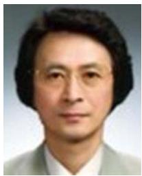  
Ryuichi Yokoyama (Life Fellow, IEEE) received the B.S., M.S., and Ph.D. degrees in electrical engineering from Waseda University, Tokyo, Japan, in 1968, 1970, and 1974, respectively. He is currently a Professor with the Graduate School of Environment and Energy Engineering, Waseda University, Tokyo, Japan. His research interests include planning, operation, control and optimization of large-scale environment and energy systems, and economic analysis and risk management of energy systems and markets. He is a Life Senior Member of IEE of Japan, a Member of CI-

GRE, the Chairman of the Standardization Commissions of Electric Apparatus in METI Japan, and the President of Consortium of Power System Technology of Japan.