# A High Frequency Transformer Model for the EMTP

A. Morched (SM)

L. Martí (M)

J. Ottevangers

Ontario Hydro, Canada

Abstract - A model to simulate the high frequency behaviour of a power transformer is presented. This model is based on the frequency characteristics of the transformer admittance matrix between its terminals over a given range of frequencies. The transformer admittance characteristics can be obtained from measurements or from detailed internal models based on the physical layout of the transformer. The elements of the nodal admittance matrix are approximated with rational functions consisting of real as well as complex conjugate poles and zeroes. These approximations are realized in the form of an RLC network in a format suitable for direct use with EMTP. The high frequency transformer model can be used as a stand-alone linear model or as an add-on module of a more comprehensive model where iron core nonlinearities are represented in detail.

Keywords - Transformer, High frequency, Frequency dependence, Electromagnetic transients, EMTP.

# 1. INTRODUCTION

The transformer is probably one of the most familiar components of a power system, but it is also one of the most difficult to model accurately. A recent survey comparing EMTP simulations with field measurements indicates that studies where transformer behaviour has the greatest influence on the results are those where EMTP simulations tend to be the least accurate1.

To model a transformer in a transient simulation, nonlinear behaviour as well as frequency-dependent effects must be taken into account. Standard EMTP transformer models such as BCTRAN and TRELEG2 can accurately reproduce the response of a transformer at the frequency at which the short-circuit and open-circuit tests are made; namely, at power frequency. However, these models do not account for the frequency dependence of copper and iron losses, or the effect of stray capacitances.

The behaviour of the transformer at higher frequencies can be approximated, to some extent, by modelling the distributed stray capacitances along the windings with lumped capacitances connected across the terminals of the transformer. This type of representation cannot reproduce the behaviour of the transformer beyond the first resonance frequencies. The calculation of the capacitances is not straightforward, and it is difficult to obtain accurate values, except for simple transformer designs3,4.

92 SM 359-0 PWRD A paper recommended and approved by the IEEE Transformers Committee of the IEEE Power Engineering Society for presentation at the IEEE/PES 1992 Summer Meeting, Seattle, WA, July 12-16, 1992. Manuscript submitted February 3, 1992; made available for printing May 1, 1992.

A substantial number of transformer models have been proposed to date. While it is probably inaccurate to categorize all work done in high frequency transformer modelling, it is convenient to identify two broad trends to describe the model presented in this paper within the context of earlier work.

1) Detailed internal winding models. This type of model consists of large networks of capacitances and coupled inductances obtained from the discretization of distributed self and mutual winding inductances and capacitances5,6. The calculation of these parameters involves the solution of complex field problems and requires information on the physical layout and construction details of the transformer. This information is not generally available as it is considered proprietary by transformer manufacturers. These models have the advantage of allowing access to internal points along the winding, making it possible to assess internal winding stresses. In general, internal winding models can predict transformer resonances but cannot reproduce the associated damping. This makes this class of models suitable for the calculation of initial voltage distribution along a winding due to impulse excitation, but unsuitable for the calculation of transients involving the interaction between the system and the transformer. Furthermore, the size of the matrices involved (typically $100 \times 100$ or larger) makes this kind of representation impractical for EMTP system studies.

2) Terminal models. Models belonging to this class are based on the simulation of the frequency and/or time domain characteristics at the terminals of the transformer by means of complex equivalent circuits or other closed-form representations $^{7-11}$ . These "terminal" models have had varying degrees of success in reproducing the frequency behaviour of single-phase transformers accurately. The main drawback of the methods proposed to date appears to be that they are not sufficiently general to be applicable to three-phase transformers.

The high-frequency transformer model described here belongs to the class of models where the frequency dependent response at the terminals of the transformer is reproduced by means of equivalent networks. Unlike earlier frequency-dependent transformer models, the new model can simulate any type of multi-phase, multi-winding transformer as long as its frequency characteristics are known either from measurements or from calculations based on the physical layout of the transformer. The generation of the parameters for the model is automatic, and it does not require special skills on the part of the user. This model has been developed and implemented at Ontario Hydro as part of a new and comprehensive transformer model sponsored by the EMTP Development Coordination Group - DCG for the DCG/EPRI version of the EMTP. Although originally developed as a high-frequency representation, this model can also be used as a stand-alone linear model, if the frequency characteristics of the transformer are known over a sufficiently broad frequency range.

# 2. OVERVIEW

Consider a multi-phase, multi-winding transformer. The nodal equations which relate the voltages and currents at the accessible terminals of the transformer can be expressed as

$$
[ Y ] [ V ] = [ I ] \tag {1}
$$

where the nodal admittance matrix [Y] is complex, symmetric, and frequency dependent. In a three-phase system, equation (1) can be expressed as

$$
\left[ \begin{array}{l l l l} Y _ {1 1} & Y _ {1 2} & \dots & Y _ {1 m} \\ Y _ {2 1} & Y _ {2 2} & \dots & Y _ {2 m} \\ \vdots & \vdots & & \vdots \\ Y _ {m 1} & Y _ {m 2} & \dots & Y _ {m m} \end{array} \right] \left[ \begin{array}{l} V _ {1} \\ V _ {2} \\ \vdots \\ V _ {m} \end{array} \right] = \left[ \begin{array}{l} I _ {1} \\ I _ {2} \\ \vdots \\ I _ {m} \end{array} \right] \tag {2}
$$

$$
\left[ Y _ {i j} \right] = \left[ \begin{array}{l l l} y _ {i j, a a} & y _ {i j, a b} & y _ {i j, a c} \\ y _ {i j, b a} & y _ {i j, b b} & y _ {i j, b c} \\ y _ {i j, c a} & y _ {i j, c b} & y _ {i j, c c} \end{array} \right] \tag {3}
$$

where $[\mathbf{Y}_{\mathrm{ij}}]$ is a $3\times 3$ sub-matrix and $m$ is the number of three-phase terminals under consideration. For example, the [Y] matrix for a two-winding, three-phase, Y-Y transformer with grounded neutrals would be of order six, with $3\mathfrak{m}\cdot (3\mathfrak{m} + 1) / 2 = 21$ distinct elements. The elements of the nodal admittance matrix can be obtained from measurements, or they can be calculated from a detailed winding model over a given frequency range.

The basic idea behind the new transformer model is to produce an equivalent network whose nodal admittance matrix matches the nodal admittance matrix of the original transformer over the frequency range of interest. Such representation would correctly reproduce the transient response of the transformer at its terminals. Consider then the multi-phase network shown in Figure 1. This network will be referred to as a multi-terminal $\pi$ -equivalent. The parameters of this circuit can be calculated from its nodal admittance matrix using the well-known relationships

$$
[ Y _ {i, \pi} ] = \sum_ {j = 1} ^ {m} [ Y _ {i j} ] \tag {4}
$$

and

$$
\left[ Y _ {i, \pi} \right] = - \left[ Y _ {i j} \right] \tag {5}
$$

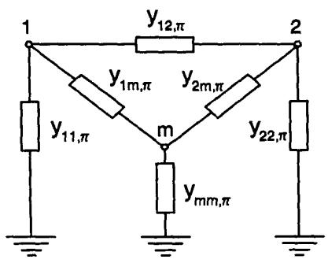  
Fig. 1: Single-line diagram of a multi-terminal $\pi$ -equivalent.

The elements of $\left[\mathbf{Y}_{\mathbf{ij},\pi}\right]$ are approximated with rational functions which contain real as well as complex conjugate poles and zeroes. The rational functions can then be realized with RLC networks which can be combined using (4) and (5) to produce the parameters of the equivalent $\pi$ -circuit.

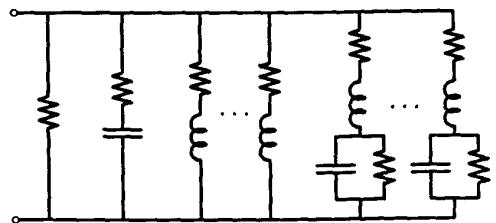  
Fig: 2: Structure of an RLC module.

A typical RLC network used in the approximation of the elements of $\left[\mathbf{Y}_{\mathrm{ij},\pi}\right]$ is shown in Figure 2. The general structure of these RLC networks reflects the known frequency characteristics of the admittance functions of a transformer:

- Inductive behaviour at low frequencies which includes frequency dependent effects due to skin effect in the windings and iron core eddy current losses. These are simulated by the RL branches.   
- Series and parallel resonances from mid to high frequencies caused by winding-to-winding and winding-to-ground stray capacitances. These are reproduced by the RLC branches.   
- Predominantly capacitive behaviour at high frequencies, represented by the single RC branch.

# 3. PRACTICAL CONSIDERATIONS

The transformer model must be sufficiently robust to produce consistent and numerically stable equivalent networks even when data are obtained from noisy or inconsistent measurements. To this effect, the following steps are taken:

- Fitting the elements of $\left[\mathbf{Y}_{\mathbf{ij}}\right]$ and calculating $\left[\mathbf{Y}_{\mathbf{ii},\pi}\right]$ by adding the fitted functions using (4), instead of fitting $\left[\mathbf{Y}_{\mathbf{ii},\pi}\right]$ directly.   
- Averaging the diagonal and off-diagonal elements of $\left[\mathbf{Y}_{\mathfrak{H}}\right]$ so that $\left[\mathbf{Y}_{\mathfrak{H}}\right]$ become balanced matrices.

The explicit approximation of the elements $[\mathbf{Y}_{\mathrm{ii},\star}]$ , would result in models of lower order than those obtained by first approximating $[\mathbf{Y}_{\mathrm{ij}}]$ and then adding the results. However, it has been found that models obtained by fitting $[\mathbf{Y}_{\mathrm{ii},\star}]$ directly may be numerically unstable.

Averaging the diagonal and off-diagonal elements of $\left[\mathbf{Y}_{\mathrm{ij}}\right]$ results in

$$
\left[ Y _ {i j} \right] = \left[ \begin{array}{l l l} y _ {i j, a a} & y _ {i j, a b} & y _ {i j, a c} \\ y _ {i j, b a} & y _ {i j, b b} & y _ {i j, b c} \\ y _ {i j, c a} & y _ {i j, c b} & y _ {i j, c c} \end{array} \right] = \left[ \begin{array}{l l l} y _ {i j, a} & y _ {i j, a a} & y _ {i j, a a} \\ y _ {i j, m} & y _ {i j, s} & y _ {i j, m} \\ y _ {i j, m} & y _ {i j, m} & y _ {i j, s} \end{array} \right] \tag {6}
$$

If the sub-matrices of [Y] are balanced, they can be diagonalized by a constant transformation [Q] such that

$$
[ Q ] ^ {- 1} [ Y _ {y} ] [ Q ] = [ Y _ {y, m o d e} ]
$$

$$
\left[ Y _ {i j, \text {m o d e}} \right] = \left[ \begin{array}{l l l} y _ {i j, 0} & 0 & 0 \\ 0 & y _ {i j, 1} & 0 \\ 0 & 0 & y _ {i j, 1} \end{array} \right] \tag {7}
$$

Subscripts $s$ and $m$ in (6) stand for "self" and "mutual", respectively; subscripts "o" and "1" in (7) stand for the familiar zero and positive sequence components. Matrix [Q] could be any of a number of transformation matrices which diagonalize a balanced matrix. Note that even though each sub-matrix in [Y] can be diagonalized, [Y] itself will not be diagonal. For example, for a three-phase, two-winding transformer

$$
\begin{array}{l} \left[ Y _ {\text {m o d e}} \right] = \left[ \begin{array}{l l} Q ^ {- 1} & 0 \\ 0 & Q ^ {- 1} \end{array} \right] \left[ \begin{array}{l l} Y _ {H H} & Y _ {H L} \\ Y _ {L H} & Y _ {L L} \end{array} \right] \left[ \begin{array}{l l} Q & 0 \\ 0 & Q \end{array} \right] = \left[ \begin{array}{l l} Y _ {H H, \text {m o d e}} & Y _ {H L, \text {m o d e}} \\ Y _ {L H, \text {m o d e}} & Y _ {L L, \text {m o d e}} \end{array} \right] \\ \left[ Y _ {\text {m o d e}} \right] = \left[ \begin{array}{c c c c c c} y _ {H H, \rho} & 0 & 0 & y _ {H L, \rho} & 0 & 0 \\ 0 & y _ {H H, 1} & 0 & 0 & y _ {H L, 1} & 0 \\ 0 & 0 & y _ {H H, 1} & 0 & 0 & y _ {H L, 1} \\ y _ {L H, \rho} & 0 & 0 & y _ {L L, \rho} & 0 & 0 \\ 0 & y _ {L H, 1} & 0 & 0 & y _ {L L, 1} & 0 \\ 0 & 0 & y _ {L H, 1} & 0 & 0 & y _ {L L, 1} \end{array} \right] \tag {8} \\ \end{array}
$$

Introducing into equation (2) we finally obtain

$$
\left[ \begin{array}{l l} Y _ {H H, \text {m o d e}} & Y _ {H L, \text {m o d e}} \\ Y _ {L H, \text {m o d e}} & Y _ {L L, \text {m o d e}} \end{array} \right] \left[ \begin{array}{l} V _ {H, \text {m o d e}} \\ V _ {L, \text {m o d e}} \end{array} \right] = \left[ \begin{array}{l} I _ {H, \text {m o d e}} \\ I _ {L, \text {m o d e}} \end{array} \right] \tag {9}
$$

where

$$
[ Q ] ^ {- 1} V _ {H} = V _ {H, \text {m o d e}}; \quad [ Q ] ^ {- 1} I _ {H} = I _ {H, \text {m o d e}}
$$

$$
[ Q ] ^ {- 1} V _ {L} = V _ {L, \text {m o d e}}; [ Q ] ^ {- 1} I _ {L} = I _ {L, \text {m o d e}}
$$

The admittances to be approximated with rational functions are now the elements of $\left[\mathbf{Y}_{\mathrm{model}}\right]$ , instead of that the elements of $\left[\mathbf{Y}_{\mathrm{ij}}\right]$ . Since the parameters of the positive and negative sequence networks are identical, the problem reduces to the fitting of only $m \cdot (m + 1)$ distinct admittance elements, rather than $3m \cdot (3m + 1)/2$ .

Averaging the elements of $\left[\mathbf{Y}_{\mathbf{ij}}\right]$ to produce balanced matrices has obvious merits from the point of view of computational speed. For example, for a two-winding, three-phase transformer, 6 rather than 21 distinct functions would have to be approximated with RLC networks. Also, the time-step loop calculations in the EMTP are also substantially reduced. Averaging the elements of $\left[\mathbf{Y}_{\mathbf{ij}}\right]$ also adds some robustness and consistency to the raw measurements, and contributes further to the numerical stability of the model. While averaging may, in some instances, mask the effect of legitimate asymmetries in the transformer, the differences observed in the transformers studied appear to be relatively small (see Figure 3).

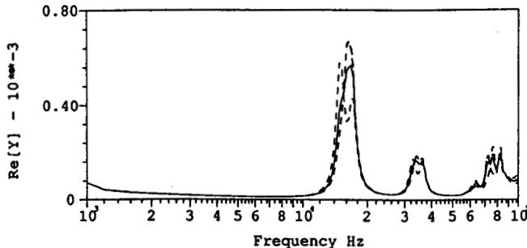

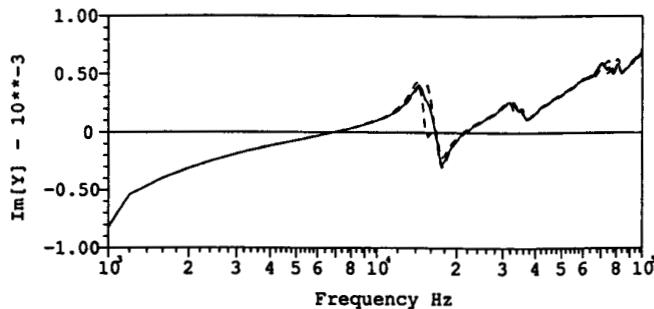  
Fig. 3: Diagonal elements of $[Y_{HH}]$ . Solid trace: $y_{HH,n}$ : Dashed traces: $y_{HH,aa}, y_{HH,bb}, y_{HH,cc}$

To validate the transformer model, frequency domain as well as time domain measurements were conducted on a 125 MVA, $215 / 44\mathrm{kV}$ three-limbed core-type transformer. The transformer is YYconnected with grounded neutrals at the high and low voltage sides. The transformer has a delta-connected tertiary winding with no accessible terminals.

The effect of averaging the elements of $\left[\mathbf{Y}_{ij}\right]$ for the transformer indicated above, is illustrated in Figure 3, where the solid trace corresponds to the averaged functions, and the dashed traces correspond to the raw measurements.

# 4. FITTING PROCESS

The elements of $\left[\mathbf{Y}_{\mathrm{mode}}\right]$ in (8) are approximated with rational functions given by

$$
Y (s) = Y _ {a} (s) = Y _ {R L} (s) + Y _ {R C} (s) + Y _ {R L C} (s) \tag {10}
$$

$$
Y _ {R L} (s) = k _ {o} + \sum_ {j = 1} ^ {N R} \frac {k _ {R L j}}{s - p _ {R L j}} \tag {11}
$$

$$
Y _ {R C} (s) = \frac {s k _ {R C}}{s - p _ {R C}} \tag {12}
$$

$$
Y _ {R L C} (s) = \frac {k _ {R L C} \left(s - \gamma_ {e}\right)}{\left(s - p _ {N C}\right) \left(s - p _ {N C} ^ {*}\right)} \cdot \prod_ {i = 1} ^ {N C - 1} \left(\frac {\left(s - z _ {i}\right) \left(s - z _ {i} ^ {*}\right)}{\left(s - p _ {i}\right) \left(s - p _ {i} ^ {*}\right)}\right) \tag {13}
$$

where $\mathbf{k}_0$ , $\mathbf{k}_{\mathrm{RL},\mathrm{j}}$ , $\mathbf{k}_{\mathrm{RC}}$ and $\mathbf{k}_{\mathrm{RLC}}$ are real constants; $\mathbf{p}_{\mathrm{RL}}$ and $\mathbf{p}_{\mathrm{RC}}$ are real poles; $\gamma_0$ is a real zero; $\mathbf{p_i}$ and $\mathbf{z_i}$ are complex poles and zeroes, and $\mathbf{p_i^*}$ and $\mathbf{z_i^*}$ are their respective complex conjugates. For

the practical example given, the number of real poles NR and the number of complex conjugate poles NC in (11) and (13) are typically 6 and 15, respectively. All poles are confined to the left hand side of the complex plane and $s = j\omega$ . $Y_{a}(s)$ can be described with the equivalent circuit shown in Figure 2, where $Y_{RL}$ corresponds to the RL branches, $Y_{RC}$ corresponds to the RC branch and $Y_{RLC}$ corresponds to the RLC branches. The single resistive branch comes from $k_{o}$ in equation (11), and its conductance is normally very small.

Let us now define $f_{\text{out}}$ as the frequency where the first parallel resonance of $Y(s)$ occurs (see Figure 4). At frequencies below $f_{\text{out}}$ , the admittance functions behave as combinations of RL branches without resonances. At frequencies above $f_{\text{out}}$ , stray capacitances come into play and a number of resonances are present. Therefore, for an initial estimate of $F_{a}(s)$ , it is assumed that the region between the first measured data point $f_{\text{min}}$ and $f_{\text{out}}$ contains real poles only, while the region from $f_{\text{out}}$ to the last measured point $f_{\text{max}}$ contains complex conjugate pairs only.

The steps followed in the approximation of $\mathbf{Y}(\mathbf{s})$ are:

1) Numerical noise in $\mathbf{Y}(\mathbf{s})$ is removed. Peaks whose magnitude fall below a user-controlled percentage of the largest peak in $\mathbf{Y}(\mathbf{s})$ are dismissed.   
2) Initialize $\mathbf{Y}_{\mathbf{RC}}$ . The response of an RC branch is

$$
R e \left\{Y _ {R C} (s) \right\} = \frac {R (\omega C) ^ {2}}{1 + (\omega R C) ^ {2}}
$$

$$
I m \left\{Y _ {R C} (s) \right\} = \frac {\omega C}{1 + (\omega R C) ^ {2}}
$$

The RC branch represents the asymptotic behaviour of the transformer at very high frequency. To calculate R and C, it is assumed that for the frequency range of interest $\omega \mathbf{RC} <   <   1$ and that the imaginary part of $\mathbf{Y}_{\mathrm{RC}}\approx \omega \mathbf{C}$ . The value of C is found by

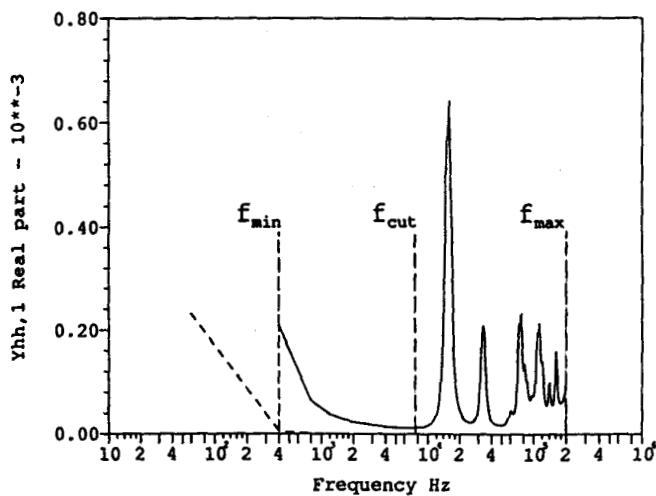

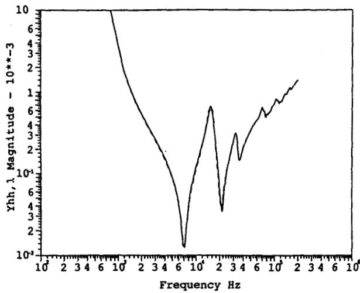  
Fig. 5: Approximation of $y_{H\ell,1}$ : Solid trace: fitted function; Dashed trace: raw data.

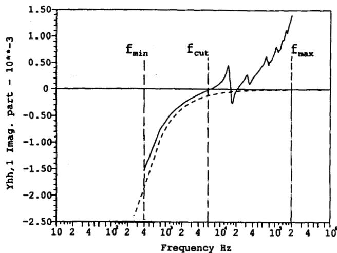  
Fig. 4: Element $y_{\text{HH},1}$ . Solid trace: raw data; Dashed trace: low frequency model.

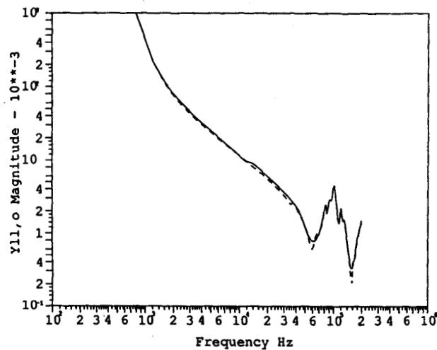  
Fig. 6: Approximation of $y_{LL,o}$ . Solid trace: fitted function; Dashed trace: raw data.

fitting the imaginary part of $\mathbf{Y}(\mathbf{s})$ with $\omega \mathbf{C}$ in the least squares sense. With C known, R is found by matching $\mathbf{Y}_{\mathbf{RC}}$ to a point on the lower envelope of the real part of $\mathbf{Y}(\mathbf{s})$ . This technique is very simple but surprisingly effective: optimization seldom changes this initial estimate by more than five percent.

3) Initialize $\mathbf{Y}_{\mathrm{RLC}}$ by identifying the local maxima and minima of the magnitude of the real part of $\mathbf{Y}(\mathbf{s})$ . Each local maximum or peak corresponds to a complex conjugate pole $p_{1} = \alpha_{1} + j\beta_{1}$ , and each local minimum or valley corresponds to a complex conjugate zero $z_{i} = \gamma_{i} + j\delta_{i}$ . The angular frequency at which a maximum and minimum occurs determines $\beta_{1}$ and $\delta_{1}$ ( $\beta_{1} = 2\pi f_{\mathrm{peak}}, \delta_{1} = 2\pi f_{\mathrm{valley}}$ ). The real parts are arbitrarily initialized to $2.5\%$ of their corresponding imaginary parts. The real zero $\gamma_{0}$ is initialized to $\gamma_{0} = 2\pi f_{\mathrm{out}}$ . The number of poles and zeroes assigned is determined by the shape of $\mathbf{Y}(\mathbf{s})$ and by the tolerance that determines which peaks are considered meaningful.   
3) Optimize the initial guess of $\mathbf{Y}_{\mathbf{s}}(\mathbf{s}) = \mathbf{Y}_{\mathbf{RC}} + \mathbf{Y}_{\mathbf{RLC}}$ , assuming $\mathbf{Y}_{\mathbf{RL}} = 0$ , over the frequency range from $f_{\mathrm{out}}$ to $f_{\mathrm{max}}$ using a modified Marquardt algorithm12. The error function is defined as the magnitude of the difference function $\mathbf{Y}(\mathbf{s}) - \mathbf{Y}_{\mathbf{s}}(\mathbf{s})$ .   
4) Initialize $\mathbf{Y}_{\mathrm{RL}}(\mathbf{s})$ from $60\mathrm{Hz}$ to $\mathbf{f}_{\mathrm{out}}$ using the asymptotic fitting procedure described in the Appendix. This initialization algorithm does not require that the function to be approximated be a minimum phase-shift function in order to produce an accurate initial fit. The default number of poles is four, but this number is under user's control.   
5) Optimize the entire function $\mathbf{Y}_{\mathbf{s}}(\mathbf{s})$ from 60 Hz to $\mathbf{f}_{\max}$ using the same optimization algorithm indicated in item 3 above.

During the optimization process, all poles are confined to the left hand side of the complex plane. Zeroes are not so constrained. This often leads to the realization of branches with negative values of R, L and C. Nevertheless, because of the constraints indicated above, these branches still have a positively damped response.

The entire fitting process is fully automatic and no user input or special skills are necessary to initialize it. Some of the fitting parameters can be overridden by the user to control the number of poles and zeroes of $\mathbf{Y}_{\mathbf{a}}(\mathbf{s})$ and to control the desirable error levels in the approximations.

# 5. USAGE AS AN ADD-ON MODULE

When the high frequency model is used as an add-on module of a more complex representation with linear and nonlinear components, the response of the low frequency components $\mathbf{Y}_{\mathrm{low}}$ must be subtracted from the measured response $\mathbf{Y}_{\mathrm{raw}}$ before it is approximated. In a typical application, the frequency response of the low frequency nameplate model (e.g., BCTRAN or TRELEG), including iron core losses, is subtracted.

The subtraction of the effect of the low frequency models introduces some complications if the difference between their low frequency response and the measurements is not negligible in the transition region around the lowest measured frequency $\mathbf{f}_{\mathrm{min}}$ (see Figure 4). Ideally, an add-on high frequency model should have no effect on the response at power frequency. If the difference at $\mathbf{f}_{\mathrm{min}}$ is too

large, no causal rational function will be able to approximate the transition region and still produce a negligible contribution at $60\mathrm{Hz}$ . In these cases, the approximation in the neighbourhood of $\mathbf{f}_{\min}$ will be somewhat degraded.

When the response of the low frequency model is subtracted from the measured data, the region between $60\mathrm{Hz}$ and $\mathbf{f}_{\min}$ defines a transition area where the magnitude of $\mathbf{Y}(\mathbf{s}) = \mathbf{Y}_{\mathrm{raw}} - \mathbf{Y}_{\mathrm{low}}$ is determined by the consistency between measured data and the low frequency model and where the magnitude of $\mathbf{Y}(\mathbf{s})$ at $60\mathrm{Hz}$ should be zero. If the low frequency model were accurate from $60\mathrm{Hz}$ to $\mathbf{f}_{\min}$ and the measurements were error free, then the magnitude of $\mathbf{F}(\mathbf{s})$ would be very small at $\mathbf{f}_{\min}$ . The smaller the difference the better the fit around $\mathbf{f}_{\mathrm{cut}}$ . If the difference is very large, then it is not possible to approximate this transition region accurately and some compromises are necessary, namely, a larger error between $\mathbf{f}_{\min}$ and $\mathbf{f}_{\mathrm{cut}}$ and a relatively large $\mathbf{Y}_{\mathrm{s}}(\mathbf{s})$ .

A high frequency model was developed for the measured transformer as an add-on module to a TRELEG model of the same transformer. Figures 5 and 6 show the approximation of the elements $\mathbf{Y}_{\mathrm{HH},\mathbf{o}}$ and $\mathbf{Y}_{\mathrm{LL},1}$ produced by the combined model. These illustrate the best and the worst fits, respectively, obtained for this particular transformer.

# 6. TRANSIENT RESPONSE

With the elements of [Y] available in a closed form, inclusion of the high frequency model in the EMTP is conceptually straightforward. Each branch in the equivalent network shown in Figure 1 is represented by a constant conductance matrix in parallel with a past history current source. During a transient simulation, modal voltages and currents are calculated from terminal voltages and the uncoupled sequence networks are solved to produce an updated set of modal history current sources. These current sources are transformed into phase quantities and used by the EMTP for the solution of the system in the next time step.

The approximations generated with the techniques described above, are ultimately combined using equations (1) and (2) to produce the branches of the equivalent sequence representation of the transformer. These networks can be simulated in the EMTP by means of the new FDB (Frequency Dependent Branch) model. This model was designed as a general-purpose tool to simulate multi-phase coupled RLC networks in the EMTP. The type of networks which can be modelled with the FDB model are more general than those required by the high frequency transformer model. In fact, even the EMTP implementation of the FDNE (Frequency dependent Network Equivalent) is a sub-set of the FDB model.

It is not within the scope of this paper to describe the implementation of the FDB model in the EMTP or Ontario Hydro's experience with the new high frequency transformer model. Due to space limitations these topics will have to be part of a separate paper.

To verify the EMTP implementation and to validate the developed model, a comparison between simulated versus measured transients on the same 125 MVA, $215 / 44\mathrm{kV}$ unit used earlier was conducted. Figure 7 shows the measured response of the transformer measured on phase 1 of the high voltage terminals when a step voltage is applied on phase 3 of the high voltage terminals. All other terminals are grounded. Figure 8 shows the results of the corresponding EMTP

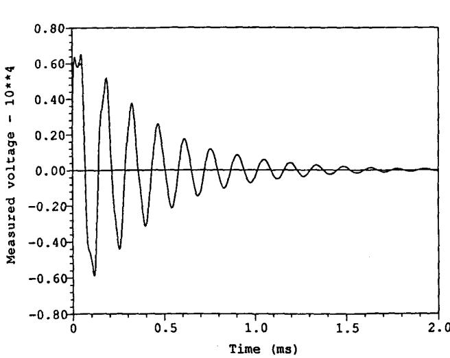  
Fig. 7: Step response. Field test.

transient simulation. Numerical stability has been verified for this and other similar tests by allowing the simulation to run for extremely long times (several seconds).

# 7. CONCLUSIONS

This paper presents a model to simulate the behaviour of a multiphase, multi-winding transformer over a wide frequency range. This model reproduces the behaviour of the transformer by means of combinations of RLC networks that match the frequency response of the transformer at its terminals. The frequency response of the transformer is assumed to be known from measurements, or from calculations with models based on geometry and construction details. Its most important features are:

1) It can be used to model multi-winding, multi-phase transformers for which the frequency response is known.   
2) It can be used as an add-on module for a more complex transformer representation. It can also be used as a stand-alone linear model if the frequency response of the transformer is known over a sufficiently wide frequency range.   
3) The fitting techniques developed to approximate the admittance functions of the transformer produce approximations of exceptional quality.   
4) Validation tests performed indicate that the models produced are accurate and numerically stable.   
5) The process to generate parameters for the model is completely automatic: no special skills or experience are required from the user.

# Acknowledgements

The authors would like to acknowledge the use of the Marquardt optimization routine from the Harwell Subroutine Library. Also we

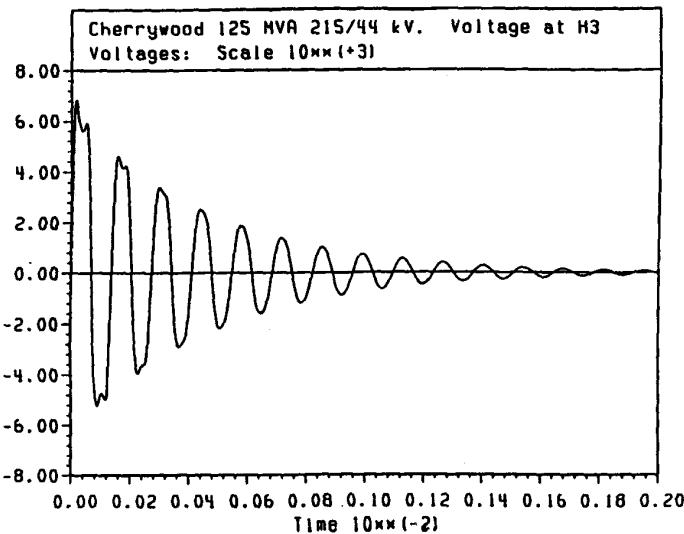  
Fig. 8: Step response. EMTP simulation.

would like to thank A. Narang from Ontario Hydro's Electrical Research Division for providing the measurements for the transformer used in the numerical examples. Thanks are also due to CEA for permission, on behalf of DCG, to publish this work. Funding for this project was provided by DCG.

# REFERENCES

[1] J. Skliutas, and J. Panek, "Electromagnetic Transients Program (EMTP) - Field Test Comparisons". EPRI EL-6768, March 1990.   
[2] H. W. Dommel, Electromagnetic Transients Program Reference Manual (EMTP THEORY BOOK), Printed by The University of British Columbia, Vancouver B.C., Canada, August 1986, pp. 6-62 - 6-63.   
[3] R. C Degeneff, "A Method for Calculating Terminal Models of Single Phase n-winding transformers". Paper No. A 78 539-9 presented at the IEEE PES Summer meeting in Los Angeles, July 1978.   
[4] T. Adielson, A. Carlson, H. B. Margolis, and J. A. Hallady, "Resonant Overvoltages in EHV Transformers - Modelling and Application", IEEE Transactions on Power Apparatus and Systems, vol. PAS-100, pp. 3563-3572, July 1981.   
[5] P. I. Fegerstad and T. Henriksen, "Inductances for the Calculation of Transient Oscillations in Transformers", IEEE Transactions on Power Apparatus and Systems, vol. PAS-93, No. 2, pp. 500-509, March/April 1974.   
[6] R. C. Degeneff, "A General Method for Determining Resonances in Transformer Windings", IEEE Transactions on Power Apparatus and Systems, vol. PAS-96, No., pp. 423-430, March/April 1977.   
[7] R. C. Degeneff, W. S. McNult, W. Neugebauer, J. Panek, M. E. McCallum, and C. C. Honey, "Transformer Response to System Switching Voltages", IEEE Transactions on Power Apparatus and Systems, vol. PAS, No. 6, pp. 1457-1470, June 1982.   
[8] P. T. M. Vaessen, "Transformer Model for High Frequencies", IEEE Transactions on Power Delivery, vol. 3, No. 4, pp. 1761-1768, October 1988.

[9] Q. Su, R. E. James, and D. Sutanto, "A Z-Transform Model of Transformers for the Study of Electromagnetic Transients in Power Systems", IEEE Transactions on Power Systems, vol. 5, No. 1, pp. 27-33, February 1990.   
[10] A. Keyhani, H. Tesai, and A. Abur, "Maximum Likelyhood Estimation of High Frequency Machine and Transformer Winding Parameters", IEEE Transactions on Power Systems, vol. 5, No. 1, pp. 212-219, January 1990.   
[11] A. Keyhani, S. Chua, and S. Sebo, "Maximum Likelihood Estimation of Transformer High Frequency Parameters from Test Data", IEEE Transactions on Power Delivery, vol. 6, No. 2, pp. 858-865, April 1991.   
[12] D. W. Marquardt, "An Algorithm for Least-Square Estimation of Nonlinear Parameters", J. Soc. Indust. Appl. Math, vol. 11, No. 2, pp. 431-441, June 1963.   
[13] J. R. Martí, "Accurate Modelling of Frequency-Dependent Transmission Lines in Electromagnetic Transient Calculations". IEEE Transactions on Power Apparatus and Systems, pp. 147-157, January 1982.   
[14] L. Martí, "Low-order approximation of Transmission Line Parameters for Frequency-Dependent Models". IEEE Transactions on Power Apparatus and Systems, pp. 3584-3589, November 1983.

# APPENDIX

To approximate a minimum phase-shift function $\mathbf{H}(\mathbf{s})$ with a rational function $\mathbf{P}(\mathbf{s})$ that contains only real poles and zeroes which lie in the left hand side of the complex plane, it is sufficient to match the magnitude functions of $\mathbf{H}(\mathbf{s})$ and $\mathbf{P}(\mathbf{s})$ . This is possible because the phase angle of a minimum phase-shift function is uniquely determined by its magnitude function: if $|\mathbf{H}(\mathbf{s})|$ and $|\mathbf{P}(\mathbf{s})|$ match, their phase angles will also match.

$$
H (s) \approx P (s) = k _ {o} \prod_ {i = 1} ^ {N} \frac {(s - z _ {i})}{(s - p _ {i})}
$$

A very effective technique to match the magnitude of a minimum phase-shift function is suggested in [13] and [14]:

1) Subdivide the magnitude function into $\mathbf{N}$ equally-spaced segments. These segments define the location of the horizontal asymptotes $\mathbf{h}_i$ , $(i = 1, \dots, N + 1)$ of $|\mathbf{P}(s)|$ .   
2) Place the corresponding vertical asymptotes at the frequency where $|\mathrm{H}(\mathrm{s})|$ equals the geometric mean of two adjacent horizontal asymptotes.   
3) The initial location of poles and zeroes is defined by the intersection of vertical and horizontal asymptotes.   
4) Optimize the initial location of the poles and zeroes by reducing the error function in the least squares sense.

This technique can be extended to approximate any analytical, non-minimum phase-shift function. The basic premise is that the imaginary part of an analytical function is uniquely determined by its real part. The modified method proceeds as follows:

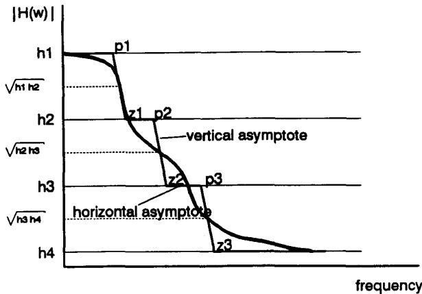

1) Calculate $\mathbf{R}(\mathbf{s})$ , where

$$
R (s) = \sqrt {R e \{H (s) \} - C}
$$

where $\mathbf{C}$ is an arbitrary constant such that $\operatorname{Re}\left\{\mathrm{H}(\mathbf{s})\right\} > 0 \vee \omega \geq 0$ .

2) Use the fitting technique described above to approximate $\mathbf{R}(s)$ with $\mathbf{R}'(s)$ .   
3) Calculate the partial fraction expansion of the rational function $\mathbf{R}^{\prime}(\mathbf{s})$

$$
R ^ {\prime} (s) = k _ {o} + \sum_ {i = 1} ^ {N} \frac {k _ {i}}{(s - p _ {i})}
$$

4) The approximation of $\mathbf{H}(\mathbf{s})$ is then given by

$$
H (s) \approx k ^ {\prime} _ {0} + \sum_ {i = 1} ^ {N} \frac {k _ {i} / p _ {i}}{(s - p _ {i})}
$$

where $k_{\delta}^{\prime} = k_{o} + C$

# BIOGRAPHIES

Atef S. Morched (M'77-SM'90) received a B.Sc. in Electrical Engineering from Cairo University in 1964, a Ph.D. and a D.Sc. from the Norwegian Institute of Technology in Trodheim in 1970 and 1972. He has been with Ontario Hydro since 1975 where he currently holds the position of Section Head - Electromagnetic Transients in the Power System Planning Division.

Luis Martí (M'79) received an undergraduate degree in Electrical Engineering from the Central University of Venezuela in 1979, MASc and PhD degrees in Electrical Engineering in 1983 and 1987, respectively, from The University of British Columbia. He did postdoctoral work in cable modelling in 1987-1988, and joined Ontario Hydro in 1989, where he is currently working in the Analytical Methods & Specialized Studies Department of the Power System Planning Division.

Jan H. Ottevangers received an MSc. in Electrical Engineering from the Delft Institute of Technology in 1956. He has been with Ontario Hydro since 1967 where he is currently working in the Analytical Methods and Specialized Studies Department of the Power System Planning Division.

# Discussion

Q. Su (Monash University, Clayton, Australia): The authors are to be congratulated in having presented a comprehensive high frequency transformer model of equivalent networks. In electrical power systems, the transient overvoltages of high voltage power transformers, either at the terminals or inside the windings, are of great importance for the reliability of electricity supply. The model developed by the authors will be useful for the study of system transients in which the high frequency characteristics of transformer winding are to be considered.

Obviously, the model represented by a number of R, L, C components can easily fit in EMTP programs. For a detailed internal winding model, several hundred components may be used resulting in a large size of matrix impractical for EMTP system studies, as mentioned in the paper. The authors' RLC module in Figure 2 consists of at least 15 components and 12 such modules are used to represent a three-phase, two-winding transformer. It is therefore necessary to simulate each transformer of interest in power system with a network of 180 or more RLC components. Would this be a problem with EMTP system studies?

In my previous papers [1,2], a closed-form transformer high frequency model was presented, as shown in Figure A(a). Extended to the mode form in Figure A(b), the model has also been used for three phase transformers. From my experience, the computing time for system transient studies increases significantly for a transformer represented by RLC networks rather than closed-form models.

Another question concerns the higher frequency response of a transformer under step voltages. The functions in Figures 5 and 6 fit measured data up to about $200\mathrm{kHz}$ and the calculated step voltage response in Figure 8 agrees with the measured in Figure 7. This confirms the fitting accuracy of the authors' method. Could the authors indicate the rise time of the step voltage and the time step interval used for the calculations of the step voltage responses?

# References

[1] Q. Su, R. E. James and D. Sutanto, “A Z-transform Model of Transformers for the Study of Electromagnetic Transients in Power Systems”, Co-authored with R. E. James and D. Sutanto, IEEE Transactions on Power System, No. 1, Vol. 5, 1990, pp. 27-33.   
[2] Q. Su and T. Blackburn, "Application of Z-Transform Method for Study of Lightning Protection in Electrical Power Systems," Proceedings of the 7th International Symposium on High Voltage Engineering, Dresden, Germany, Aug. 26-30, 1991, pp. 139-142.

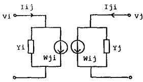  
(a)

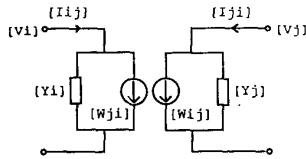  
(b)   
Fig. A A close-form high frequency model for two-winding, (a) single-phase and (b) three-phase transformers.

Adam Semlyen (University of Toronto): This is an interesting and useful paper as it solves the problem of providing a realistic model for multi-phase transformers for the purpose of EMTP simulations. It has benefited of the authors' expertise and experience in fitting stable circuit models to frequency domain data [A]. One of its outstanding features is the modal decomposition they have used: it has not only simplified the problem of fitting but, more importantly, it has reduced the dynamic size of the model to that of a minimal realization. The following remarks and questions are mainly related to the problem of modal decomposition.

I note that the authors assume that the off-diagonal block $[Y_{ij}]$ can be adjusted to become a balanced matrix. This, of course, implies an approximation. (The central phase may, for instance, have somewhat

different parameters than the other two phases.) Then, as a result of the balancing, a real, constant, transformation $[Q]$ can be used to obtain the desired modes. After fitting, the modal approximations are transformed back to the original phase domain. They now correspond to the given matrix $[Y]$ of frequency domain measurements. My first question is whether a final refinement of the fitted results is performed or contemplated for obtaining a best match with the original set of data, in order to compensate for the approximation made by the initial balancing process?

The transformer connection used in the paper is Y-Y, with the particular feature that the $[Y_{ij}]$ block can in fact be balanced by a small adjustment. This is so because the connection does not produce an internal phase shift. When this is not the case, for instance in the important class of Y- or Y-Z (zig-zag) connected transformers, the off-diagonal block $[Y_{ij}]$ has cyclic symmetry. For instance, in one particular Y-connection (with an admittance $y$ associated to each phase of the Y-connected winding), we have

$$
\left[ Y _ {1 2} \right] = y \left[ \begin{array}{c c c} 0 & 1 & - 1 \\ - 1 & 0 & 1 \\ 1 & - 1 & 0 \end{array} \right], \quad \left[ Y _ {2 t} \right] = \left[ Y _ {t 2} \right] ^ {T}
$$

Eigenanalysis of this matrix leads to the symmetrical component transformation matrix with three, rather two, decoupled modes. Balancing would yield the zero matrix. An $\alpha$ -type input gives a $\beta$ -type output and vice versa (as expected, see for instance [B]; thus the (real) Clarke transformation does not result in modal decoupling). Positive or negative sequence voltages result in currents of the same sequence with the expected phase rotation. In the modal domain there is of course no strict symmetry, as reciprocity now implies a rotation in the opposite direction if the voltages are applied to the secondary rather than to the primary winding.

Clearly, transformers with internal phase shifting effects pose more complex problems. Could the authors please elaborate on their thoughts regarding the solution of these problems?

Finally, I wish to reassert my appreciation regarding the merits of this paper and would like to congratulate the authors for their fine contribution.

[A] A.S. Morched, J.H. Ottevangers, and L. Marti, "Multi-Port Frequency Dependent Network Equivalents for the EMTP", IEEE paper no. 92 SM 461-4 PWRD, presented at the 1992 IEEE/PES Summer Meeting, in Seattle, WA.   
[B] Edith Clarke, "Circuit Analysis of A-C Power Systems, Volume I: Symmetrical and Related Components", John Wiley & Sons, Inc., New York, 1943.

Manuscript received July 27, 1992.

X. Chen (Department of Electrical Engineering, Seattle University, Seattle, WA): This paper is very impressive in scope and in detail. The authors and their organization must be commended for their contributions to the accurate modeling of the high frequency behavior of multi-winding, multi-phase transformers. The fitting techniques to approximate the admittance functions of a transformer is both novel and practical. This discussor has learned a lot from their paper and the authors' earlier papers on transformer modeling. I would appreciate the authors' comments on the following questions:

(a) I have developed a computer program which can form the inductance matrix for a two-winding, three-phase, multi-legged transformer.   
The inductance matrix for the primary winding of an unsaturated three-phase three-legged transformer computed by BC-TRAN (pages XIX-C-15 to 20, ATP Rule Book, 1987-1992, BPA) is shown in Eqn. (A).

$$
\left( \begin{array}{l l l} L _ {a a} & L _ {a b} & L _ {a c} \\ L _ {b a} & L _ {b b} & L _ {b c} \\ L _ {c a} & L _ {c b} & L _ {c c} \end{array} \right) = \left( \begin{array}{r r r} 8 7 9. 7 2 & - 4 3 8. 0 2 & - 4 8 3. 0 2 \\ - 4 3 8. 0 2 & 8 7 9. 7 2 & - 4 3 8. 0 2 \\ - 4 3 8. 0 2 & - 4 3 8. 0 2 & 8 7 9. 7 2 \end{array} \right) H e n r y (A)
$$

The inductance matrix computed by my program is shown in Eqn. (B).

$$
\left( \begin{array}{l l l} L _ {a a} & L _ {a b} & L _ {a c} \\ L _ {b a} & L _ {b b} & L _ {b c} \\ L _ {c a} & L _ {c b} & L _ {c c} \end{array} \right) = \left( \begin{array}{r r r} 8 7 9. 8 0 & - 5 8 4. 6 8 & - 2 9 2. 1 4 \\ - 5 8 4. 6 8 & 1 1 7 2. 0 6 & - 5 8 4. 6 8 \\ - 2 9 2. 1 4 & - 5 8 4. 6 8 & 8 7 9. 8 0 \end{array} \right) \textbf {H e n r y (B)}
$$

It is striking to note that $L_{ab}$ is two times greater than $L_{ac}$ , and $L_{bb}$ is 1.33 times greater than $L_{aa}$ and $L_{cc}$ . Because of the asymmetry of the iron core of a three-legged, core-type transformer, my work is very possibly correct. If this is the case, then Eqs. (6) to (8) of the authors' paper might not be valid. It is common practice to represent a transformer by its sequence impedances for short circuit analysis. To apply the symmetrical components method to an unloaded three-phase core-type transformer is not always valid, even if there is no saturation involved.  
(b) Figures 7 and 8 of the paper showed the comparison between the computed and measured step response of a 125 MVA, 215/44 kV transformer. The applied step voltage is much lower than the rated voltage of the high voltage terminals. The main objective of developing high frequency transformer models is to study transformer overvoltages caused by switching and lightning. Although many researchers claimed that magnetic saturation of the core has minor influence on fast transients, and therefore can be disregarded, this discussion is interested in knowing if the authors have compared the results of their model to the field test or measurements for overvoltages caused by a lightning surge on a transmission line which is connected to a transformer and operating at rated voltage. This discussor has a strong opinion that harmonic analysis is valid for linear and slightly nonlinear systems. Wherever severe nonlinearity is involved, differential equations should be used and nothing else.

Again, the authors are to be congratulated for their effort in developing a comprehensive transformer model.

Manuscript received August 7, 1992.

H. M. Beides and A. P. Sakis Meliopoulos (Georgia Institute of Technology). The authors should be commended for revisiting the problem of power transformer modeling. As it is widely known, a comprehensive and generally acceptable transformer model for transient simulation does not exist. One of the reasons is that transformers come in different designs and configurations and with different parameters of parasitic capacitances, etc. We would appreciate the authors response to the following comments and questions:

Has the proposed modeling method been tested using transformers with tertiary windings? If yes, the authors' comments on the accuracy and performance of the derived models will be appreciated. What are the effects of hysteresis losses and skin effect on the accuracy of the estimated resistive components of the transformer model?

The method requires measuring the frequency response of the transformers. Is the frequency response dependent on the design of the transformer alone (i.e. two transformers of the same manufacturer and type will have identical frequency response)? If this is not the case, it appears to us that it will be necessary to measure the frequency response of each transformer to be modeled.

Manuscript received August 11, 1992.

R. Malewski (Westmount, Quebec, Canada): This study can serve as an excellent example of successful and realistic approach to modeling of a large HV power transformer complex internal circuit. The authors recognize a necessity of taking measurements of the examined transformer characteristics in order to develop the EMTP model. As an alternative, they refer to the transformer design parameters; these however, are considered proprietary by the manufacturer and not accessible to the utility engineers.

The paper title includes the mention of high frequency, and at the end of paragraph #2 a statement is made on the predominantly capacitive behavior of the winding at high frequencies. This is correct if the $f_{\mathrm{max}}$ is set at some 200 kHz, as indicated in Fig. 1. After all, it

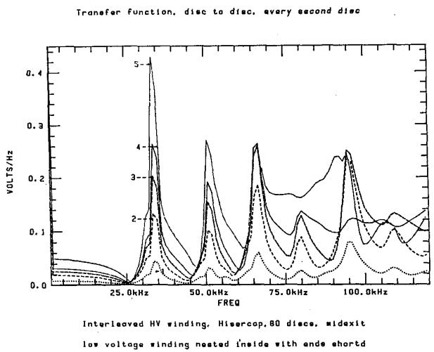

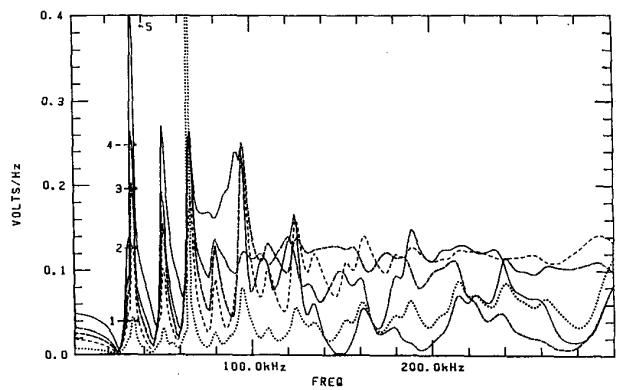

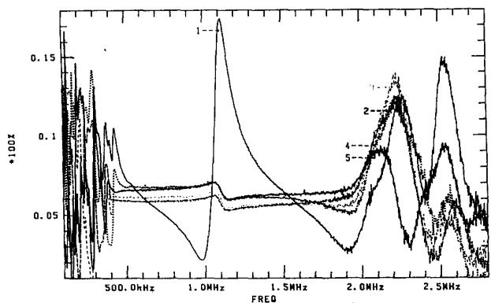  
Fig. 1. Transfer function of five first discs of an interleaved HV transformer winding presented at three frequency scales. These transfer functions were deconvoluted in frequency domain from transients recorded on the untanked winding.

has been known since the time of Wagner [1] that the "standing wave" type of resonant frequencies is confined to a few hundred kilohertz interval.

A distinctly different behavior of typical HV transformer windings starts some 2 to $5\mathrm{MHz}$ , where the internal disc resonances come to play. It may be of interest to inspect a typical winding transfer function spanning all the four frequency intervals. Such a graph was obtained from an impulse voltage distribution measured along the discs on an untanked medium voltage unit. The transfer function was deconvoluted from the digitally recorded transients and the applied (low voltage) impulse. First five disc characteristic is shown in Fig. 1 at three frequency scales: $125\mathrm{kHz}$ , $300\mathrm{kHz}$ and $2.8\mathrm{MHz}$ . It can be seen that the interval from some $500\mathrm{kHz}$ to nearly $2\mathrm{MHz}$ can be modeled by a real pole circuit, but beyond that limit a different representation is required.

Clearly, this paper does not address the issue of very high frequency phenomena, although they are of practical importance for transformers directly connected to SF6 insulated bus bars [2].

Practical implementation of the EMTP model presented in this paper calls for measurements of the transformer transfer function in the frequency range of at least $200\mathrm{kHz}$ . Such measurements can not be easily taken on a large unit in substation, but the required measured characteristics can be obtained from an industrial laboratory performing the acceptance test of new transformers. At present, many laboratories use a digital recorder for monitoring the impulse test [3,4]. The obtained records are usually processed in order to enhance the efficiency of fault detection. The processing often includes calculation of the frequency spectrum of the output and input impulses, and finding the transformer transfer function as quotient of these two spectra.

An analysis of the transfer function required for the dielectric fault detection, is not pertinent to the study presented by the authors. However, at a reduced voltage level, additional records can be taken during the impulse test, if requested by the utility purchasing the transformer. Such additional measurements can be included in the test program, on demand of the utility system planning department. An incremental cost of the additional measurement is negligible, since the impulse generator and recording system are anyhow prepared for the acceptance test.

The algorithms for measuring the HV to LV transfer function, and for retrieving the parameters required for modeling can be implemented on existing commercial digital impulse recorders, or a specialized recording and signal processing system can be developed using the accumulated experience in high frequency measurement of transformer winding characteristics.

# References

[1] Wagner, K. "Das Eindringen einer electromagnetischen Welle in eine Spule mit Windungkapazitat," Elektrotechnik und Maschinenbau, 1915, p. 89.   
[2] Müller, W. "Fast Transients in Transformers," CIGRE SC12, WG12.11 Report presented at the Transformer Colloquim in Graz, 1990.   
[3] Malewski, R., Poulin, B., "Impulse Testing of Power Transformers using the Transfer Function Method," IEEE Trans. Vol. PWRD-3, 1988, p. 476.   
[4] Malewski, R., Gockenbach, E., Maier, R., Fellmann, K. H., Claudi, A., “Five Years of Monitoring the Impulse Test of Power Transformers with Digital Recorders and the Transfer Function Method”, CIGRE Paper 12-201, 1992.

Manuscript received August 21, 1992.

A. Keyhani and T. Tsai (The Ohio State University, Electrical Engr., Columbus, OH): We would like to commend the authors for a well-written paper and for their efforts to develop a practical high frequency transformer model for the EMTP.

The essential ingredient of high frequency transformer modeling is to represent the transformer admittances as frequency dependent nonlinear functions. In general, these transfer functions are nonminimum phase system. Therefore both magnitude and phase of the transfer function are needed to uniquely identify the transfer function model. In this paper, since only the magnitude data were used for the transfer function identification, the transfer function model had to be modified into a minimum-phase plant. It is our belief that such

practice may not be necessary and the phase data of the measured transformer admittances should be used for the transfer function estimation, because by including the phase data in the estimation process does not increase the number of unknown parameters which determines the size of the estimation problem. Furthermore it adds an important constraint on the variation of the estimated parameters.

Another important aspect of the high frequency transfer function estimation is the numerical stiffness problem. This problem becomes more severe if the resonant points are spreaded in a wide frequency range. In general, this problem can be resolved if a proper scaling scheme is adopted during the curve fitting. It would be interesting to know if any frequency scaling was performed or needed for this particular study.

The authors have provided the power industry with a valuable and practical technique for modeling the transformer high frequency dynamics for the EMTP. We would appreciate the authors' comments concerning the questions and issues raised in this discussion.

Manuscript received October 16, 1992.

A. S. Morched, L. Martí, and J. Ottevangers: We would like to thank the discussers for their interest and their many relevant questions presented.

Regarding Dr. Su's questions, we would like to make the following comments: After the admittance functions are approximated with rational functions, they become closed-form representations of the original functions. Expressing the admittance functions in terms of RLC modules is a convenient form of visualization and it does not imply that a number of RLC branches have to be connected explicitly in the EMTP. Inside the EMTP, the fitted functions are modeled with FDB modules. Each $n$ -phase FDB module consists of a constant conductance matrix and a set of past history current sources. Figure I illustrates the EMTP representation of a two-winding transformer using FDB modules.

Therefore, the presence of a high frequency transformer (HFT) in the EMTP does not increase the size of the nodal admittance matrix of the system modeled, and it only adds $n$ entries to the EMTP branch tables for each $n$ -phase FDB module. For example, the transformer shown in Figure I only adds 9 branches to the EMTP branch tables. Additional storage is needed to keep track of the updating of the past history current sources. In broad terms, this additional storage amounts to 2 cells for each complex conjugate pole in (13) and one cell for each real pole in (11) and (12).

The computational burden of Dr. Su's transformer model should be comparable with that of the HFT model. For a single-phase, two-winding transformer Dr. Su's model requires the approximation of three functions and four numerical convolutions per time step of a transient solution. The HFT model, also requires the approximation of three distinct functions, but only three numerical convolutions per time step are needed. A comparison of the performance of both representations will depend largely on the number of terms needed in the fitting process.

The time step used in the EMTP simulation of the step response shown in Figures 7 and 8 of the paper, was the sampling rate used in the field measurement, i.e., $0.5\mu s$ . An EMTP step function was used in the simulation ( $\Delta t$ rise time). In the field test, the input step reached $95\%$ of its peak value in $1\mu s$ .

We agree with Messrs Keyhani and Tsai when they indicate that a non-minimum phase shift function cannot be described uniquely with the magnitude function alone. However, any causal function is uniquely defined if its real part is known. In the identification/optimization process described in the paper, both real and imaginary parts are used to compensate for possible inconsistencies in measured data. Fre

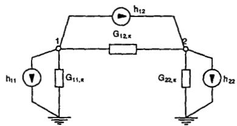  
Fig. I. Single-line diagram representation of a two-winding transformer with the FDB model.

quency scaling is commonly used in the solution of least squares optimization problems. However, its use would not be advantageous within the context of the modified Marquardt optimization algorithm.

Messrs Beides and Meliopoulos ask whether the frequency response of a transformer depends on its design alone. We have observed that transformers of the same design and make show essentially the same frequency behaviour. It is unclear to us, at this point in time, how far to generalize these observations. In absence of actual measurements, it might be better to use the HFT model of a similar transformer than to use no high frequency model at all. While the transformer used in the paper has a buried delta winding, we have not yet modeled a delta-connected tertiary winding explicitly. This requires some special considerations which will be explained in more detail in our response to Prof. Semlyen's questions. Hysteresis and eddy current effects are normally taken into account by dedicated models (e.g., [i]) when the HFT is used as an add-on module. In this case, the HFT model will match the difference between the measured data and the frequency response of the linear portions of these models.

We will now address Dr. Malewski's comments. The choice of 200 kHz as the maximum frequency was based on the simulation needs of the transient simulations for which the transformer model was required. Figure II shows the magnitude of $y_{h|h}$ from 400 Hz to 1 MHz. Other than additional poles and zeros and the added computational burden, we do not feel that the extended frequency range presents a problem that the HFT model cannot handle. The graphs shown by Dr. Malewski also suggest to us that frequency range beyond 1 MHz does not pose any special problems either.

With regard to the techniques used to obtain the frequency responses, we feel that direct, low voltage frequency domain admittance measurements are probably simpler, cheaper and more reliable for the purposes of the HFT model. This type of measurements can be made with relative ease in the field. It would probably be difficult to persuade manufacturers to perform all the full scale chopped-wave tests required to obtain all the data required by the HFT model. Nevertheless, Dr. Malewski's measurement techniques could provide an alternative way to obtain data for the HFT model since some of them are normally done in acceptance tests anyway.

Professor Semlyen suggests an adjustment of the final fitted functions to account for phase asymmetries. It is not clear to us how this adjustment could be made after the fitted functions are obtained. It should be possible, however, to choose a real constant transformation matrix other than $\alpha$ , $\beta$ , $o$ to account for unbalances. This would be roughly the same type of approximation used to model frequency dependent unbalanced lines. Whether this constant transformation matrix would also give acceptable answers at higher frequencies is probably a subject of further research. Another possibility is to approximate each element of the $Y$ matrix. This would not rely on any assumptions of symmetry, but the additional computational burden would be substantial.

Professor Semlyen correctly points out that in the case of $Y-D$ or $Y-Z$ -connections, the off-diagonal $[Y_{ij}]$ sub-matrices do not lend themselves to be approximated by a balanced matrix. Depending on the type of delta connection and node numbering scheme, variations of a cyclic matrix can be obtained. For instance,

$$
\begin{array}{l} \left[ Y _ {i j} \right] = \left[ \begin{array}{l l l} y _ {i j, a a} & y _ {i j, a b} & y _ {i j, a c} \\ y _ {i j, b a} & y _ {i j, b b} & y _ {i j, b c} \\ y _ {i j, c a} & y _ {i j, c b} & y _ {i j, c c} \end{array} \right] \\ \approx y _ {a} (\omega) \cdot \left[ \begin{array}{c c c} 0 & - 1 & + 1 \\ + 1 & 0 & - 1 \\ - 1 & + 1 & 0 \end{array} \right] \tag {i} \\ \end{array}
$$

There are several ways in which this situation can be handled: The most obvious one is to fall back on the approximation of every element of $[Y]$ . On the other hand, it might be more practical to use a constant transformation matrix $[Q]$ whose elements $q_{i,k}$ for a $n$ -phase system are given by

$$
q _ {i, k} = \frac {1}{\sqrt {n}} e ^ {- j \frac {2 \pi}{n} (i - 1) (k - 1)} \tag {ii}
$$

The well-known symmetrical components transformation matrix is just a special case of the matrix defined by equation (ii). The resulting modal admittance matrix only has two non-zero elements, and these

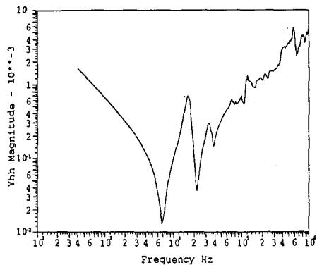  
Fig. II. Magnitude of $y_{h|h'}$ .

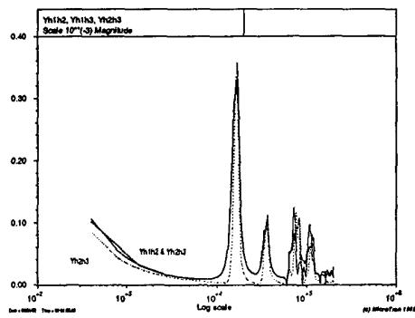  
Fig. III. Off-diagonal elements of $[Y_H]$ .

differ only by a constant. For example,

$$
[ Q ] ^ {- 1} [ Y _ {i j} ] [ Q ] = [ Y _ {\text {m o d a l}} ] \tag {iii}
$$

$$
\left[ Y _ {m o d a l} \right] = y _ {a} (\omega) \cdot j \sqrt {3} \left[ \begin{array}{c c c} 0 & 0 & 0 \\ 0 & 1 & 0 \\ 0 & 0 & - 1 \end{array} \right] \tag {iv}
$$

In this case, only one admittance function $y_{a}(\omega)$ has to be approximated. In the time-step loop of the EMTP the complex algebra does not present a problem because even if intermediate functions are nominally complex, the final phase voltages and currents are always real. In other words, the existing FDB model can easily be modified to account for cyclic symmetric modules.

Professor Chen correctly points out that a multi-legged transformer should show some asymmetry, which would degrade the accuracy of the assumption that the sub-matrices of $[Y]$ are balanced. However, the measurements available to us do not show the severe asymmetry indicated in Prof. Chen's calculations. Figure 3 in the paper shows that the diagonal elements of the high voltage winding block are nearly identical over a wide frequency range. Figure III below, shows the measured off-diagonal elements of the same sub-matrix.

From this plot it can be seen that while one element is indeed different, the unbalance ratio at low frequencies is in the order of 1.2 to 1.3 rather, 2.0 as Professor Chen's calculations suggest. Based on these measurements we are inclined to accept the balancing procedure as a reasonable simplification. It is clear, however, that the use of modal transformation matrix that accounts for center phase asymmetries would be desirable. Strictly speaking, this transformation matrix would also be frequency dependent. Therefore, further investigation would be needed to find what constant transformation matrix would represent an acceptable compromise over the entire frequency range of interest.

The question of the validity of superimposing linear high frequency behaviour on the nonlinear response due to saturation does not have a simple answer. Short of solving the nonlinear field problem with

detailed knowledge of core and winding design, accounting for nonlinear and frequency dependent effects will always involve a certain degree of approximation. If the transformer is unsaturated, high frequency excitation cannot drive the transformer into saturation as the flux produced by a voltage input is inversely proportional to its frequency. If a transient of sufficient magnitude is impressed on a transformer which is already saturated or near saturation, then superposition is not strictly valid. On the other hand, situations where a transient is impressed on a transformer which is already in saturation may not be all that common. It is Ontario Hydro's practice not no operate transformers near saturation because of acoustic pollution

requirements. This may contribute to the lack of field measurements that would validate the assumption of superposition under near-saturation conditions.

# Reference

[i] E. Tarasiewicz, A. S. Morched, A. Narang and E. P. Dick, "Frequency Dependent Eddy Current Models for Nonlinear Iron Cores," Paper No. 92 WM 177-6 PwRS, Presented at the IEEE-PES Winter Meeting, New York, Feb. 1992.

Manuscript received October 16, 1992.