# Sparse solver application for parallel real-time electromagnetic transient simulations✰

B. Bruned a,* , J. Mahseredjian b , S. Denneti`ere a , A. Abusalah b , O. Saad c

a RTE, Jonage, France   
b Polytechnique Montr´eal, Qu´ebec, Canada   
c Hydro-Qu´ebec, Varennes, Qu´ebec, Canada

# A R T I C L E I N F O

Keywords:

EMT simulation

Real-time

Hardware-in-the-loop

Direct sparse linear solver

Parallelization

Compensation method

# A B S T R A C T

The main purpose of this research is to speed up real-time simulations of electromagnetic transients (EMTs) using sparse linear solver techniques. This paper presents the integration of a direct sparse linear solver (KLU) into a real-time software for EMT simulation. This solver is combined with parallelization of network solution. Fill-in reduction techniques are investigated as well as partial refactorization to speed up computations. The pivoting technique during refactorization is asserted in terms of simulation stability as compared to existing sparse solver based on code generation without pivoting. Performance and validation are studied on practical power system cases with real-time Hardware-In-the-Loop (HIL) simulation. Substantial performance gains, up to 50%, are obtained using fill-in reduction and partial refactorization. Pivoting is necessary to maintain numerical stability.

# 1. Introduction

Energy Transition raises important challenges for grid operators to integrate renewable energy sources [1]. This involves more power electronics equipment in the grid and new interaction problems that must be simulated and studied. The circuit-based electromagnetic transient (EMT) simulation approach is currently increasingly used to study the integration of renewable energy sources [2]. It is able to deliver highly accurate computations. Moreover, real-time hardware-in-the-loop (HIL) EMT simulation can be used for accurate simulations with actual controller replicas [1]. The computation time is an important factor for HIL and parallelization of solution method is essential.

The traditional line-delay (LD) technique parallelization, is based on the propagation delay of transmission lines or cables. If this delay is greater than the numerical integration time-step, the network solution can be decoupled without any loss of accuracy. This technique has been implemented in both offline [3,4] and real-time environments [5]. When there is no LD, other techniques have to be implemented. One of such techniques is the compensation method (CM) [6,7]. In recent works [8,9] the CM has been programmed and tested in real-time mode with demonstrated advantages.

In addition to parallelization, sparse linear solvers [10] can be used

to improve numerical performance. The nodal formulation of network equations involves the solution of sparse linear systems. Sparse LU decomposition is commonly used to solve such systems in EMT-type software. Previous works [4] have studied and integrated an efficient sparse LU decomposition solver named KLU [11,12], for parallel offline simulation. A modified version of KLU (MKLU) has been used to benefit from partial refactorization techniques.

The first contribution of this paper is to integrate and test MKLU into the real-time environment HYPERSIM [5], as a replacement of an existing legacy sparse solver (GenCode) based on code generation. It is the first time that such a solver is integrated into an industrial real-time simulation environment. The second contribution is to identify the most efficient sparse solver techniques to speed up real-time EMT simulation: fill-in reduction, partial refactorization and pivoting strategy. All are available in MKLU. Fill-in reduction and partial refactorization are combined for best efficiency. The third contribution is to combine these sparse solver techniques with parallelization techniques to speed up even more the simulation. Two kinds of parallelization technique are used in this paper, namely LD and CM. The performance of MKLU is compared with GenCode for practical power system cases.

This paper is organized as follows. The integration of MKLU solver is described in Section II. Through each step of the sparse linear solver,

speed-up techniques are identified (fill-in reduction, partial refactorization). In Section III, a detailed comparison is performed between MKLU and GenCode on the impact of fill-in reduction, pivoting strategy and real-time performance for practical power system cases with HIL.

# 2. Direct sparse linear solver

Using classic nodal (modified-augmented-nodal analysis is not available in HYPERSIM) formulation with companion circuit models, network equations can be written in a linear form to be solved at each time-point:

$$
Y _ {n} v _ {n} = i _ {n} \tag {1}
$$

where $Y _ { n }$ is the admittance matrix of the network, $\nu _ { n }$ the vector of node voltages and $i _ { n }$ the known vector of current sources that include history term injections from companion circuit equivalents. For the nonlinear case, a linearized Norton equivalent $[ 3 , 1 3 ]$ is provided and updated at each iteration. The linear system of (1) is generally sparse and $Y _ { n }$ is not necessarily symmetric. Traditionally, direct LU sparse decomposition [10] is used to solve (1). It is preferred over iterative methods [14] for performance, robustness and predictability. The nodal admittance matrix is factorized as

$$
Y _ {\mathrm {n}} = L _ {\mathrm {n}} U _ {\mathrm {n}} \tag {2}
$$

As well known, a forward substitution is first performed

$$
L _ {n} x _ {n} = i _ {n} \tag {3}
$$

and followed by backward substitution

$$
U _ {n} v _ {n} = x _ {n} \tag {4}
$$

As $Y _ { n }$ is sparse, a sparse matrix format is adopted, using the standard Yale format (CSC) [15].

Once the sparse matrix has been defined, the sparse linear system solution proceeds as follows: symbolic analysis, factorization, and solution (forward and backward and substitutions). The first two steps will be detailed below, along with the integration of the KLU solver into a real-time environment.

# 2.1. Symbolic analysis

The symbolic analysis step memorizes the sparse structure of the LU decomposition for the numerical factorizations. Indeed, the sparse structure of $Y _ { n }$ remains fixed throughout the computation steps. Ordering methods are used during this phase to minimize fill-in. Indeed, a permutation of the elements of the matrix is sought to reduce the number of non-zero values in the factorization. The obvious objective is to save time during the solution phase. Finding an ordering is to compute permutation matrices $P _ { n }$ and $Q _ { n }$ such as:

$$
\tilde {Y} _ {n} = P _ {n} Y _ {n} Q _ {n} \tag {5}
$$

where the fill-in of the LU decomposition of $\tilde { Y } _ { n }$ is less than $Y _ { n } .$

There are two main families of ordering methods to reduce fill-in [10]: local and global methods. One the most used local methods is the minimum degree [16] ordering. It selects at each stage of Gaussian elimination the node which has a minimum number of neighbors (if the sparse matrix is seen as a graph). This method has been applied to electrical networks and showed its effectiveness in the symmetrical case. The approximate minimum degree ordering (AMD) method [17] is an improvement. Other ordering techniques have been used in solvers like COLAMD (Column Approximate Minimum Degree) [18].

Global methods are based on Nested Dissection [10] which applies the principle of divide-and-conquer heuristics. The graph associated with the sparse matrix is partitioned into sub-graphs. By following the recursive structure of the partition (binary tree), the two sub-graphs are

factorized followed by the interface variables between the two graphs. Graph partitioning algorithms are used, like Metis [19] or Scotch [20]. Nested Dissection amounts to formulating the solved matrix into a bordered-block-diagonal form.

# 2.2. Factorization

Factorization is the main element of the resolution of a linear system and consists in numerically factoring the sparse matrix into the LU form. Different strategies can be chosen regarding scaling, pivoting and decomposition.

Scaling can be used to improve matrix conditioning. Scaling does not necessarily contribute in terms of accuracy and stability for the simulation of power systems. Indeed, as an example, switch modelling as $R _ { o p e n } / R _ { c l o s e }$ resistors can create a wide range of values in the admittance matrix, in which case scaling can make things worse.

The choice of pivot in the Gaussian elimination, is important for the stability of factorization. There are three strategies for pivoting. Without pivoting the elimination is processed using the matrix diagonal elements. This can cause stability issues due to errors caused by large/small values in the matrix. The pivot may become invalid (close to zero) and make the decomposition unstable.

With partial pivoting, during factorization, the selected pivot is the maximum absolute value of the considered column and allows to prevent numerical instabilities. With full pivoting, the pivot is selected based on the maximum absolute value considering rows and columns.

Full pivoting is very rarely used. It is more expensive in terms of computing times and does not necessarily provide better stability for power system matrices. Instead, partial pivoting is preferred. During factorization, it is also possible to check if the previously calculated pivot is valid. If the pivot is still valid, there is no need to modify it. Otherwise, a full factorization must be performed.

The type of LU factorization may differ between solvers. Two main factorization strategies are used. In the right-looking [21] factorization, the matrix is factorized from top left to bottom right. The left-looking approach [11,12] is more advantageous for sparse power system matrices. The matrix is factorized along the columns from left to right.

# 2.3. Partial refactorization

The following changes have been made in [4] to optimize the KLU solver (MKLU, modified KLU) for EMT simulations and parallelization.

The first one is the pivot validity test. If the pivot is no longer valid, the refactorization is stopped and a full factorization is performed. This avoids performing full factorization when the pivot remains valid in switching networks.

The second enhancement is partial refactorization. It is applied only on the values of the matrix which have changed. First, fill-in reduction ordering is applied to $Y _ { n }$ . Then, at each time-step, the minimal column index, , where there is a value change in $Y _ { n } ,$ is computed. Benefiting from the left-looking LU decomposition, refactorization is only proceeded for columns between $n _ { c h g }$ and (size of $Y _ { n } )$ . This technique is named, hereinafter, RefactChg.

In order to make $n _ { c h g }$ as high as possible at each solution time-point, it is possible to order first the nodes which belong to linear elements and then the ones which come from time-varying elements (switches or nonlinear elements). Eq. (6) below depicts this ordering.

$$
Y _ {n} = \left[ \begin{array}{l l} Y _ {f} & Y _ {f v} \\ Y _ {v f} & Y _ {v} \end{array} \right] \tag {6}
$$

Where $Y _ { f }$ is the fixed part of $Y _ { n } , Y _ { \nu }$ contains the time-varying elements of $Y _ { n }$ and is determined only for $Y _ { \nu }$ . This technique is named, hereinafter, RefactVar. It is noticed that it can conflict with the fill-in reduction ordering, since it can break the fill-in optimization. To resolve this conflict between the two ordering approaches (fill-in

reduction and partial refactorization), RefactVarOpt method is introduced in this paper. It proceeds by creating (6) and then applying fill-in reduction only on $Y _ { f } .$ . The efficiencies of RefactChg and RefactVarOpt are compared below.

The limitation of partial refactorization used in this section is that all columns from $n _ { c h g }$ to n have to be refactorized although only few of them may need it. Possible improvements based on [22,23] are left for further works.

# 2.4. Integration into parallel real-time environment

Two parallelization techniques are considered in real-time mode. The first one is delay-based. Network analysis identifies the decoupling elements which are the power transmission lines (or cables) with propagation delays higher than the numerical integration time-step. Stublines with artificial delays can be inserted for artificial decoupling when actual lines do not exist. Then, an automatic task mapper assigns subnetworks with their control system equations to processor units [24]. Each subnetwork is solved independently using the selected sparse solver.

The second parallelization technique is CM, which has been recently tested in real-time [8,9] simulations. It does not create inaccuracies as with stublines and delivers a simultaneous solution for network equations. The Fig. 1 recalls the three steps of CM for two subnetworks $( N _ { 1 }$ and ) which have been decoupled through wires. $Y _ { 1 }$ and $Y _ { 2 }$ are admittance matrices, $i _ { 1 }$ and $i _ { 2 }$ the known or historic nodal current injections, $i _ { \mathrm { c } }$ is for compensation branch currents, $( Z _ { t h 1 } , \nu _ { t h 1 } )$ and $( Z _ { t h 2 } , \nu _ { t h 2 } )$ are the Thevenin equivalents along the cutting branches. The two parallel steps, Thevenin equivalent computations (step-1) and superposition (step-3), involve the solution of linear systems with subnetwork admittance matrices. MKLU or GenCode can be used in step-1. The sequential step-2, deals with dense impedance matrices for which LAPACK [21] can be used. In this paper, the GenCode solver is preferred over LAPACK for performance, with only non-zero operations printed in the generated code.

The integration of MKLU into the real-time environment is done as follows. First, MKLU is pre-compiled as a static library on the real-time simulator. Then, its include files allow to call its functions and use its data structures directly on the generated code of the simulated network. Also, a standard Yale format (CSC) is used to represent sparse matrices in the simulation code. Finally, the simulation code is compiled, linking with the static MKLU library.

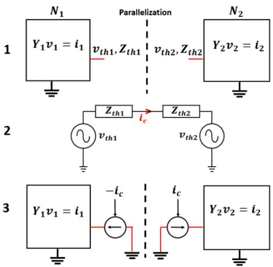  
Fig. 1. Overview of CM steps for parallelization.

# 3. Performance and validation analysis

Two sparse linear solvers are tested in this section: the legacy solver GenCode and MKLU with RefactChg and RefactVarOpt. Table 1 summarizes the characteristics of each solver. The performances are compared in terms of fill-in reduction, partial refactorization efficiency, pivoting and real-time performance on HIL setup. The applied parallelization techniques are listed in Table 2.

# 3.1. Fill-in reduction performance

Fill-in reduction is tested on two large linear distribution networks.

Case-1 is the Xavier distribution network [8], with 619 nodes. The simulation interval is 1 s with a time-step of 50 μs, for studying a single-phase-to-ground fault.

Case-2 is the GHOST microgrid case from [25] with 663 nodes. The simulation interval is 90 s with a time-step of 100 μs to simulate a grid fault that provokes an islanded mode.

For these two networks, the main computation effort is on the solution part (backward and forward substitution). Very few refactorizations are required for each case. As there are no natural propagation delay lines for parallel decoupling, the CM is used to accelerate the simulation. Table 3 presents the maximum sizes of subnetwork admittance matrices before/after CM decoupling for each test case. Figs. 2 and 3 show the CM decoupling locations for each test case.

Three fill-in techniques are tested with the MKLU solver: AMD, COLAMD and Metis. Figs. 4 and 5 display the sparsity patterns of the admittance matrix of each test case and the number of non-zero elements (nz) when using AMD. A lesser non-zero value dispersion from AMD ordering will reduce the fill-in LU factors.

RefactChg is chosen for the refactorization strategy. Offline and realtime simulations are run on an OP5031 target 64 bits Linux with 32 cores (2 CPU Intel Xeon E5 3.2 GHz – 16 cores). Tables 4 and 5 display performance results for each fill-in reduction technique. The offline average time-step (Δt) is equal to the measured execution time over the total number of time-steps. The related speed-up ratio $( \overline { { S } } )$ is computed against the GenCode solution. For the real-time simulation, no physical hardware is interfaced to the simulator, but the real-time constraint is ensured. The second-last column displays the minimum time-step $( \overline { { \Delta t } } _ { R T } )$ to avoid continuous overruns during the real-time simulation. The last column presents the related speed-up ratio $( \overline { { S } } _ { R T } )$ .

The presented results demonstrate the efficiency of fill-in reduction techniques. The performance gain can reach 26% in real-time for Xavier network. As expected, efficiency tends to decrease with decreasing network size. The parallelized version of Xavier network, for example, is less impacted with fill-in reduction.

The combination of MKLU fill-in reduction and CM reaches respectively, for case-1 and case-2, speed-up ratios of 3.5 $( \overline { { \Delta t } } _ { R T _ { S E Q + G e n C o d e } } /$ $\overline { { \Delta t } } _ { R T _ { C M 4 t a s k s + M K L U } } )$ and 1.9 $( \overline { { \Delta t } } _ { R T _ { S E Q + G e n C o d e } } / \overline { { \Delta t } } _ { R T _ { C M + M K L U } } )$ over the legacy solution (SEQ+GenCode). All fill-in reduction techniques give approximately the same performance gain as matrix sizes are not huge. Also, for other cases with transmission lines, LD decouples the network each time a transmission line long enough for decoupling is detected. This limits the maximum size of subnetwork admittance matrices. For the rest of the paper, AMD ordering is kept.

Table 1 Compared solvers.   

<table><tr><td>Solvers</td><td>Analysis options</td><td>Factorization</td></tr><tr><td rowspan="2">GenCode</td><td rowspan="2">RefactVar (no fill-in reduction)</td><td>No pivoting</td></tr><tr><td>Partial-refactorization</td></tr><tr><td rowspan="2">MKLU</td><td>AMD, COLAMD or Metis</td><td>Partial Pivoting, Partial-refactorization or full refactorization according to pivot validity test</td></tr><tr><td>RefactChg or RefactVarOpt</td><td></td></tr></table>

Table 2 Parallelization techniques.   

<table><tr><td>Name</td><td>Solution methods</td></tr><tr><td>SEQ</td><td>Sequential solution of network equations without any decoupling</td></tr><tr><td>CM</td><td>Compensation Method</td></tr><tr><td>LD</td><td>Line-Delay method based on the propagation delay of power transmission lines</td></tr><tr><td>LD+CM</td><td>Combination of Line-Delay and Compensation Method decoupling</td></tr></table>

Table 3 Admittance matrix sizes before and after CM decoupling.   

<table><tr><td>Case</td><td>Parallel solver</td><td>Number of tasks</td><td>Max Size</td></tr><tr><td rowspan="3">Xavier</td><td>SEQ</td><td>1</td><td>619</td></tr><tr><td>CM</td><td>2</td><td>318</td></tr><tr><td>CM</td><td>4</td><td>186</td></tr><tr><td rowspan="2">GHOST</td><td>SEQ</td><td>1</td><td>663</td></tr><tr><td>CM</td><td>5</td><td>238</td></tr></table>

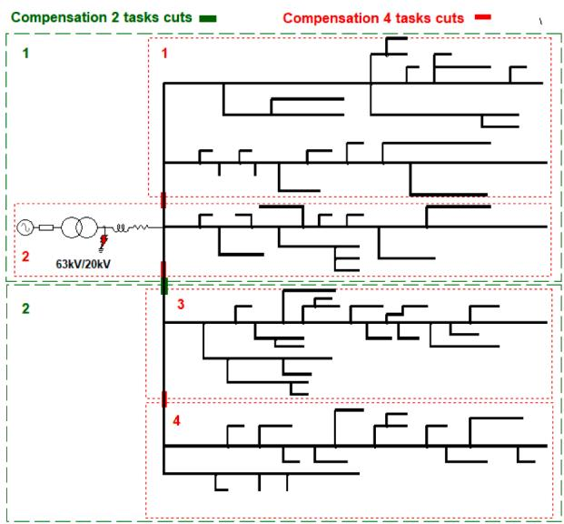  
Fig. 2. Xavier distribution test case with CM parallelization.

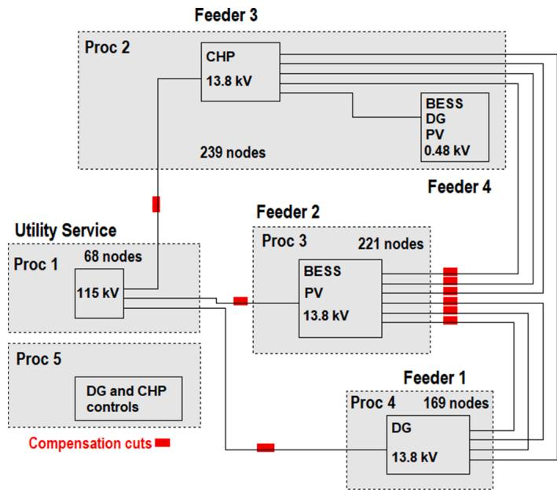  
Fig. 3. GHOST microgrid test case with CM parallelization.

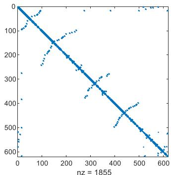

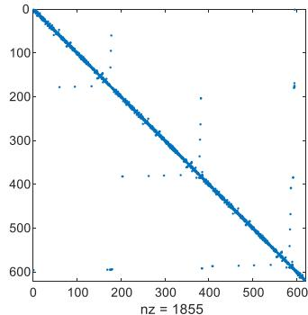  
Fig. 4. Sparsity structures before (left) and after (right) AMD ordering for Xavier distribution network.

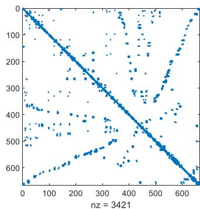

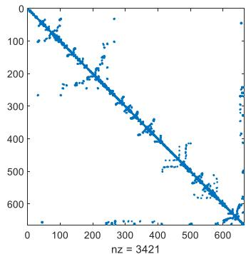  
Fig. 5. Sparsity structures before (left) and after (right) AMD ordering for GHOST microgrid.

Table 4 Performance results, Xavier distribution network.   

<table><tr><td>Parallelization</td><td>Solver</td><td>Δt</td><td>S</td><td>ΔtRT</td><td>SRT</td></tr><tr><td rowspan="4">SEQ</td><td>GenCode</td><td>117.1 μs</td><td>1</td><td>121 μs</td><td>1</td></tr><tr><td>MKLU +AMD</td><td>91.7 μs</td><td>1.28</td><td>96 μs</td><td>1.26</td></tr><tr><td>MKLU+COLAMD</td><td>91.5 μs</td><td>1.28</td><td>97 μs</td><td>1.25</td></tr><tr><td>MKLU+Metis</td><td>92.8 μs</td><td>1.26</td><td>97 μs</td><td>1.25</td></tr><tr><td rowspan="4">CM 2 tasks</td><td>GenCode</td><td>61.4 μs</td><td>1</td><td>64 μs</td><td>1</td></tr><tr><td>MKLU +AMD</td><td>52.1 μs</td><td>1.18</td><td>57 μs</td><td>1.12</td></tr><tr><td>MKLU+COLAMD</td><td>50.6 μs</td><td>1.21</td><td>57 μs</td><td>1.12</td></tr><tr><td>MKLU+Metis</td><td>51.6 μs</td><td>1.19</td><td>56 μs</td><td>1.14</td></tr><tr><td rowspan="4">CM 4 tasks</td><td>GenCode</td><td>35.3 μs</td><td>1</td><td>37 μs</td><td>1</td></tr><tr><td>MKLU +AMD</td><td>32.7 μs</td><td>1.08</td><td>35 μs</td><td>1.06</td></tr><tr><td>MKLU+COLAMD</td><td>33.4 μs</td><td>1.06</td><td>35 μs</td><td>1.06</td></tr><tr><td>MKLU+Metis</td><td>33.1 μs</td><td>1.07</td><td>35 μs</td><td>1.06</td></tr></table>

Table 5 Performance results, ghost microgrid.   

<table><tr><td>Parallelization</td><td>Solver</td><td>Δt</td><td>S</td><td>ΔtRT</td><td>SRT</td></tr><tr><td rowspan="4">SEQ</td><td>GenCode</td><td>64.5 μs</td><td>1</td><td>68 μs</td><td>1</td></tr><tr><td>MKLU +AMD</td><td>60.4 μs</td><td>1.07</td><td>63 μs</td><td>1.08</td></tr><tr><td>MKLU+COLAMD</td><td>59.9 μs</td><td>1.08</td><td>63 μs</td><td>1.08</td></tr><tr><td>MKLU+Metis</td><td>59.3 μs</td><td>1.09</td><td>61 μs</td><td>1.12</td></tr><tr><td rowspan="4">CM</td><td>GenCode</td><td>32 μs</td><td>1</td><td>38 μs</td><td>1</td></tr><tr><td>MKLU +AMD</td><td>30.7 μs</td><td>1.04</td><td>36 μs</td><td>1.06</td></tr><tr><td>MKLU+COLAMD</td><td>30.6 μs</td><td>1.05</td><td>36 μs</td><td>1.06</td></tr><tr><td>MKLU+Metis</td><td>31.4 μs</td><td>1.02</td><td>36 μs</td><td>1.06</td></tr></table>

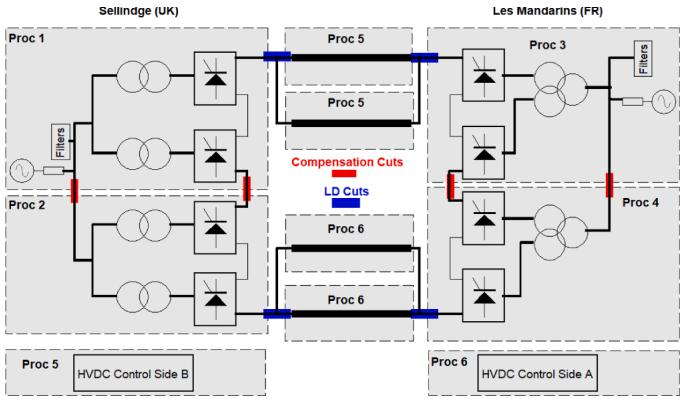  
Fig. 6. Overview of IFA2000 modelling and parallel decoupling.

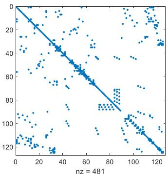

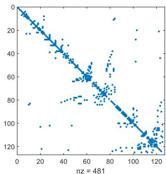  
Fig. 7. Sparsity structure before (left) and after (right) AMD ordering for IFA2000 Sellindge subnetwork.

# 3.2. Partial refactorization

The test case IFA2000, is an HVDC interconnection between France (Les Mandarins) and United Kingdom (Sellindge). It is used here to assert the efficiency of partial refactorization. The modelling presented in [8] is used. Each LCC pole (Line Commutated Converter) is represented by two detailed 6-pulse bridges. Fig. 6 shows the LD (4 cores) and LD+CM (6 cores) parallel decoupling methods. Several refactorizations are required when the link is in operation which comes from repetitive thyristor commutations. The time-step is set to 30 μs. The 10 s starting sequence real-time software-in-the-loop (SIL) simulation is run on an OP5031 target 32 bits Linux with 32 cores (2 CPU Intel Xeon E5 3.2 GHz - 16 cores).

For LD decoupling, the larger subnetwork is Sellindge side. The total size of the admittance matrix is $1 2 5 \times 1 2 5 .$ . The size of the fixed part (linear elements) is 33 × 33. Fig. 7 shows the sparsity structure of the admittance matrix and fill-in reduction ordering.

Fig. 8 displays the execution times of the most loaded processor which runs Sellindge side subnetwork. Prior the start of the stations, GenCode is more efficient than MKLU. Fill-in reduction delivers computation gains mainly during the solution phase (backward and forward substitution) as the converter stations have not yet started. This is not enough to over perform the code generation optimization of GenCode. After station start (t>6.4 s), fill-in reduction is very effective on the partial factorization stage. MKLU shows performance gains over GenCode. It is even better to applied fill-in reduction to the entire matrix. Indeed, MKLU+RefactChg improves by 50% the performance of GenCode solver. It is the only method with an execution time per timestep far below the 30 μs of the simulation time-step which guarantees a real-time simulation with no overruns. As a counterpart, the solution with this method needs three full refactorizations to cope with pivot invalidity. Applying fill-in reduction in the whole matrix requires pivoting to achieve a stable simulation.

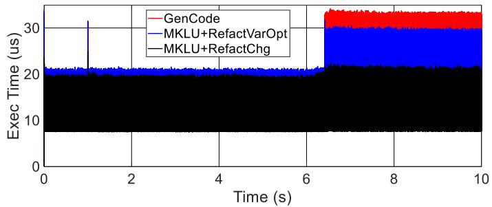  
Fig. 8. Execution time of the most loaded processor, LD using various solvers for a 10 s SIL real-time simulation.

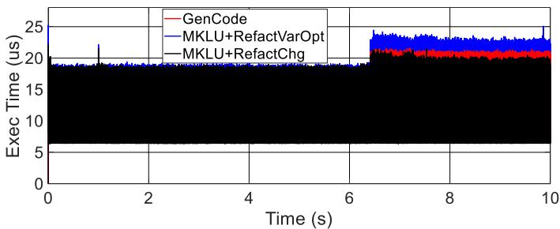  
Fig. 9. Execution time of the most loaded processor, LD+CM using various solvers for a 10 s SIL real-time simulation.

With LD+CM decoupling, the maximum matrix size is reduced to 77 $\times 7 7$ with a fixed part of 21 × 21. In that case, as depicted by Fig. 9, the effect of fill-in reduction on performance is less important. RefactVarChg is still more efficient than RefactVarOpt. However, the performances are similar with GenCode. Only 5% of performance gain are obtained when converters are in operation. Code generation optimization avoids less function calls and extra programming structures in comparison with MKLU solver. This counterbalances the fill-in reduction performance gains which are less important with lower matrix dimensions. In that case, the trade-off between fill-in reduction and further CM parallelization is in favour of fill-in reduction. CM decoupling improves a little over fill-in reduction while using two extra simulation cores.

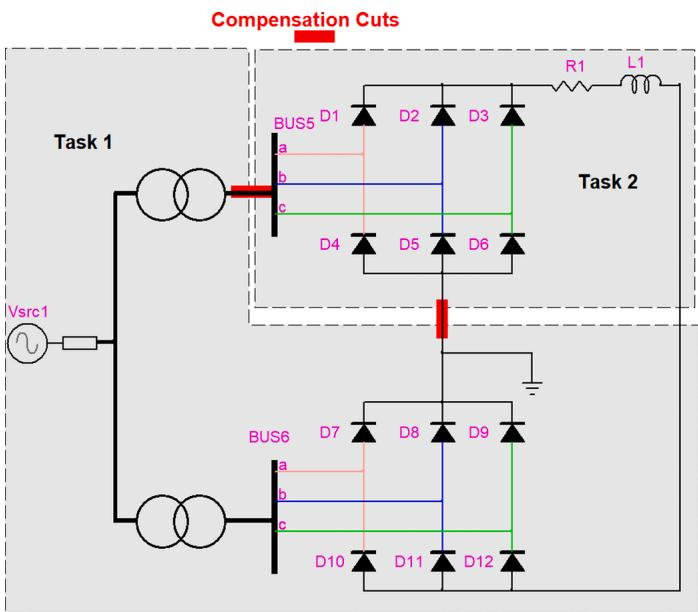  
Fig. 10. CM decoupling of two 6-pulse bridges.

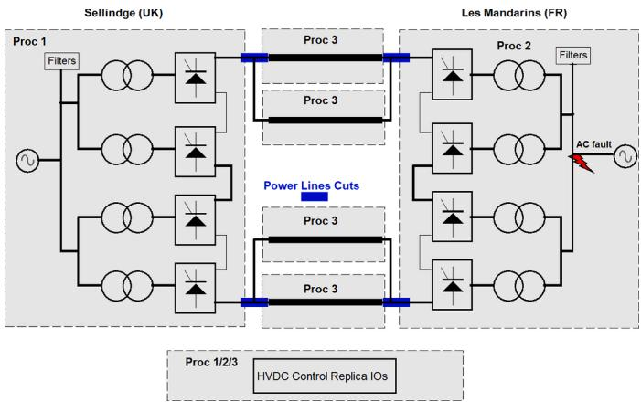  
Fig. 11. IFA2000 HIL setup with LD decoupling.

# 3.3. Pivoting efficiency

The previous part has shown the utility of pivoting when fill-in reduction is applied to the whole matrix. Another example comes from the CM decoupling. It has been already shown in [8,9] that the open circuit solutions for subnetworks may not be stable. The two 6-pulse bridges case (Fig. 10) show this kind of instability. CM decouples each 6-pulse bridge into two subnetworks (Task 1 and Task 2). With this decoupling, the simulation is unstable with GenCode. However, using MKLU helps to achieve a stable simulation. Several pivot changes are required during the computations. MKLU benefits from pivoting to strengthen the stability of CM decoupling. Test case data can be found in the Appendix.

# 3.4. HIL real-time performance

For real-time HIL simulation, the test case of IFA2000 is considered with the physical cubicles and protections replicas in the simulation

loop. The real-time setup is the same as [26]. As depicted in Fig. 11, LD decoupling is used to parallelize the network solution. The simulation runs in real-time with 40 μs time-step on three cores on an OP5031 target 64 bits Linux with 16 cores (CPU Intel Xeon E5 3.2 GHz – 16 cores). The power transit is set to 1000 MW from Les Mandarins to Sellindge. A single phase-to-ground fault occurs on the Les Mandarins side. It is eliminated after a duration of 40 ms. The maximum admittance matrix size (Sellindge subnetwork simulated on Proc 1, see Fig. 11) is 131 × 131 with a fixed part of 30 × 30.

Fig. 12 shows similar performance gains as for the SIL simulation of section III.B. Fill-in reduction applied to the whole matrix (RefactChg) is still the best strategy to save computing times. Pivoting is still necessary for a stable simulation. MKLU+RefactChg reaches a performance gain of 14% over GenCode during HIL real-time simulation. Fig. 13 demonstrates that MKLU gives the same results as GenCode.

# 4. Conclusion

This paper presented the integration of a direct sparse linear solver, named modified KLU (MKLU), for parallel real-time electromagnetic transient simulations.

First, fill-in reduction techniques embedded in MKLU have provided performance gains of 26% over an existing code generation solver (GenCode) for linear networks. With the compensation method (CM) parallelization technique, fill-in reduction applied to the whole admittance matrix allows reaching a speed-up of 3.9 over the sequential solution with GenCode. For an HVDC network example, the combination with partial refactorization (MKLU+RefactChg) improves by 50% over GenCode when several repetitive refactorizations are required. When the matrix size decreases with further parallel decoupling using LD+CM, fill-in reduction techniques are less effective.

Second, MKLU offers pivoting which is required to have fill-in reduction over the whole matrix combined with partial refactorization (RefactChg). Without this technique, some simulation cases can become unstable. Additionally, changing the pivot improves the robustness of CM decoupling.

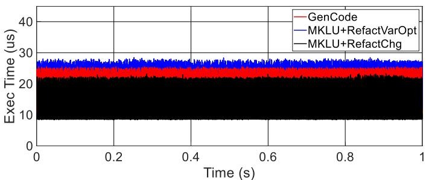  
Fig. 12. Execution time of the most loaded processor, LD using various solvers for HIL real-time simulation.

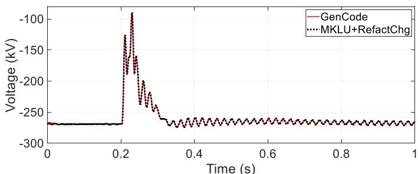  
Fig. 13. DC voltage validation during single-phase-to-ground fault.

Lastly, a performance gain of 14% has been observed for MKLU+RefactChg for HIL real-time simulation.

Further research is needed to improve the efficiency of partial refactorization.

# CRediT authorship contribution statement

B. Bruned: Conceptualization, Investigation, Software, Validation, Visualization, Writing – original draft, Writing – review & editing. J. Mahseredjian: Supervision, Conceptualization, Writing – original draft, Writing – review & editing. S. Dennetiere: ` Supervision, Conceptualization, Writing – review & editing. A. Abusalah: Resources,

# Appendix

Data of the test case presented in Fig. 10:

- For the voltage source, $V _ { s r c } = 8 6 . 6 k V , R _ { s r c } = 1 . 5 , L _ { s r c } = 0 . 0 4 3 \ : m H$   
- R = 0.01 Ω, L = 0.1 H   
- For each diode, $R _ { o p e n } = 1 0 ^ { - 3 } ~ \Omega , ~ R _ { c l o s e } = 1 0 ^ { 6 } ~ \Omega , ~ R _ { s n u b b e r } = 1 0 0 ~ \Omega , ~ C _ { s n u b b e r } = 1 0 ^ { - 6 } ~ \Omega , ~ V _ { m i n } = 0 . 8 ~ V _ { c l o s e } = 1 0 ^ { - 6 } ~ \Omega , ~ R _ { c l o s e } = 1 . 8 ~ V _ { c l o s e }$   
- For Transformers, Y ground for primary side, Y floating for secondary, $V _ { p r i m } = 8 6 . 6 ~ k V , R _ { p r i m } = 0 . 4 3 ~ \Omega , L _ { p r i m } = 0 . 4 5 8 ~ m H , V _ { s e c o n d } = 8 . 6 6 ~ k V , R _ { s e c o n d } = 0 . 0 9 ~ 0$ $= 0 . 2 3 8 \Omega , L _ { s e c o n d } = 0 . 0 2 5 m H ,$ , for the magnetization branch $R _ { m } = 1 . 0 8 { \ : } M \Omega , L _ { m } = 2 . 8 6 \times 1 0 ^ { 3 } { \ : } H .$ .

# References

[1] S. Dennetiere, H. Saad, Y. Vernay, P. Rault, C. Martin, B. Clerc, Supporting energy transition in transmission systems: an operator’s experience using electromagnetic transient simulation, IEEE Power Energy Magaz. 17 (3) (May-June 2019) 48–60.   
[2] H. Saad, P. Rault, S. Denneti`ere, M. Schudel, C. Wikstrom, K. Sharifabadi, HIL simulation to assess interaction risks of HVDC systems for upcoming grid development, in: Proc. Conf. IEEE Indus. Electron. Soc. (IECON), Singapore, 2020, pp. 5041–5048.   
[3] J. Mahseredjian, S. Denneti`ere, L. Dub´e, B. Khodabakhchian, L. G´erin-Lajoie, On a new approach for the simulation of transients in power systems, Electr. Power Syst. Res. 77 (11) (2007) 1514–1520.   
[4] A. Abusalah, O. Saad, J. Mahseredjian, U. Karaagac, I. Kocar, Accelerated sparse matrix-based computation of electromagnetic transients, IEEE Open Access J. Power Energy 7 (2020) 13–21.   
[5] V.Q. Do, J.C. Soumagne, G. Sybille, G. Turmel, P. Giroux, G. Cloutier, S. Poulin, Hypersim, an integrated real-time simulator for power networks and control systems, in: Proc. ICDS’99, Vasteras, Sweden, May 1999, pp. 1–6.   
[6] W.F. Tinney, Compensation methods for network solutions by optimally ordered triangular factorization, IEEE Trans. Power App. Syst. PAS-91 (1) (Jan. 1972) 123–127.   
[7] O. Alsac, B. Stott, W.F. Tinney, Sparsity-oriented compensation methods for modified network solutions, IEEE Trans. Power App. Syst. PAS-102 (5) (May 1983) 1050–1060.   
[8] B. Bruned, S. Denneti`ere, J. Michel, M. Schudel, J. Mahseredjian, N. Bracikowski, Compensation method for parallel real-time EMT studies, Elect. Power Syst. Res. 198 (Sep. 2021).   
[9] B. Bruned, J. Mahseredjian, S. Denneti`ere, J. Michel, M. Schudel, N. Bracikowski, Compensation method for parallel and iterative real-time simulation of electromagnetic transients, IEEE Trans. Power Del. (2023), https://doi.org/ 10.1109/TPWRD.2023.3238422.   
[10] I.S. Duff, A.M. Erisman, J.K. Reid, Direct Methods for Sparse Matrices Second Edition, Oxford University Press, New York, 2017.   
[11] T.A. Davis, E.P. Natarajan, Algorithm 907: KLU, a direct sparse solver for circuit simulation problems, ACM Trans. Math. Soft. 37 (3) (Sep. 2010) 36:1–36:17.   
[12] E.P. Natarajan, “KLU A high Performance Sparse Linear Solver For Circuit Simulation problems." M.S. Thesis, Uniy. Florida. Gainesyille. FL, USA. 2005.

Conceptualization, Writing – review & editing. O. Saad: Resources, Conceptualization, Writing – review & editing.

# Declaration of Competing Interest

The authors declare that they have no known competing financial interests or personal relationships that could have appeared to influence the work reported in this paper.

# Data availability

Data will be made available on request.

[13] J. Mahseredjian, I. Kocar, U. Karaagac, Solution techniques for electromagnetic transients in power systems. Transient Analysis of Power Systems: Solution Techniques, Tools and Applications, Wiley, 2014, pp. 9–38, https://doi.org 10.1002/9781118694190.ch2.   
[14] Y. Saad, Iterative Methods for Sparse Linear Systems, 2nd edition, SIAM, Philadelphia, PA, 2003.   
[15] S.C. Eisenstat, M.C. Gursky, M.H. Schultz, A.H. Sherman, Yale sparse matrix package, I: the symmetric codes, Internat. J. Nurner. Methods Engrg 18 (1982) 1145–1151 (Cited on pp. 66, 131.).   
[16] A. George, J.W.H. Liu, The evolution of the minimum degree ordering algorithm, SIAM Rev. 31 (1) (Mar. 1989) 1–19.   
[17] P.R. Amestoy, T.A. Davis, I.S. Duff, An approximate minimum degree ordering algorithm, SIAM J. Matrix Anal. Applic. 17 (4) (Dec.1996) 886–905.   
[18] T.A. Davis, J.R. Gilbert, S.I. Larimore, Esmond G. Ng, A Column approximate minimum degree ordering algorithm, ACM Trans. Math. Softw. 30 (3) (Sept. 2004) 281–376.   
[19] G. Karypis, V. Kumar, Multilevel k-way partitioning scheme for irregular graphs, J. Parallel Distrib. Comput. 48 (1) (1998) 96–129.   
[20] F. Pellegrini, J. Roman, SCOTCH: a software package for static mapping by dual recursive bipartitioning of process and architecture graphs, in: Proc. HPCN’96,   
[21] E. Anderson, Z. Bai, C. Bischof, L.S. Blackford, J. Demmel, Jack J. Dongarra, J. Du Croz, S. Hammarling, A. Greenbaum, A. McKenney, D. Sorensen, LAPACK Users’ Guide, 3rd ed., Society for Industrial and Applied Mathematics, USA, 1999.   
[22] S.M. Chan, V. Brandwajn, Partial matrix refactorization, IEEE Trans. Power Syst. 1 (1) (Feb. 1986) 193–199.   
[23] J. Dinkelbach, L. Schumacher, L. Razik, A. Benigni, A. Monti, Factorisation path based refactorisation for high-performance LU decomposition in real-time power system simulation, Energies 14 (23) (Nov. 2021) 7989.   
[24] B. Bruned, I.M. Martins, P. Rault, S. Denneti`ere, Use of efficient task allocation algorithm for parallel real-time EMT simulation, Elect. Power Syst. Res. 189 (Dec. 2020).   
[25] R. Salcedo, et al., Banshee distribution network benchmark and prototyping platform for hardware-in-the-loop integration of microgrid and device controllers, J. Eng. 2019 (8) (Aug. 2019) 5365–5373.   
[26] Y. Vernay, A. Drouet D’Aubigny, Z. Benalla, S. Denneti`ere, New HVDC LCC replica platform to improve the study and maintenance of the IFA2000 link, in: Proc. Int. Conf. Power Syst. Transients (IPST), Seoul, Republic of Korea, 2017, pp. 1–6.