# 基于CPU-FPGA异构平台的虚拟同步并网逆变器实时仿真算法设计

吴盼，汪可友，徐晋，李国杰

(电力传输与功率变换控制教育部重点实验室(上海交通大学), 上海 200240)

摘要：随着电力系统中电力电子器件的广泛应用，对于小步长 $(\leq 2\mu s)$ 电磁暂态实时仿真的需求逐渐增加。此时，单独依靠CPU已难以满足其要求，转而结合现场可编程门阵列(FieldProgrammableGateArray,FPGA)来实现是一大趋势。搭建了适用于虚拟同步并网逆变器系统实时仿真的CPU-FPGA异构计算平台。其中，FPGA电路部分采用优化EMTP(Electro-MagneticTransientProgram)流程实现，综合利用恒导纳开关建模、支路拆分并行处理及矩阵化流程计算来优化仿真实时性能。CPU控制部分采用虚拟同步控制，并设计了与FPGA异步通信的数据交互接口。最后，针对该并网逆变器系统进行小步长实时仿真，与Simulink离线仿真结果相对比，同时分析平台实时性能与FPGA上资源消耗，验证了基于所提平台实现虚拟同步并网逆变器系统实时仿真的准确性与有效性。

关键词：并网逆变器系统；实时仿真；虚拟同步控制；电磁暂态仿真算法；现场可编程门阵列

# Real-time simulation algorithm design of a virtual synchronous grid-connected inverter system based on a CPU-FPGA heterogeneous platform

WU Pan, WANG Keyou, XU Jin, LI Guojie

(Key Laboratory of Control of Power Transmission and Conversion, Ministry of Education

(Shanghai Jiao Tong University), Shanghai 200240, China

Abstract: With the wide application of power electronic devices in power systems, the demand for small time-step $(\leqslant 2\mu s)$ electromagnetic transient real-time simulation increases. While a CPU is unable to meet the demand alone, there is a trend to complement it with a Field Programmable Gate Array (FPGA). A CPU-FPGA heterogeneous computing platform available for real-time simulation of virtual synchronous grid-connected inverter system is built. Within it, the circuit part on the FPGA is implemented with an optimized Electro-Magnetic Transient Program (EMTP) algorithm. Constant admittance switch modeling, branch division with parallel processing and high efficiency matrix operation are used to improve real-time performance. The control part on the CPU adopts virtual synchronization control and designs a data interaction interface for asynchronous communication with the FPGA. A small step real-time simulation of the grid-connected inverter system is conducted and compared with the results of a Simulink offline simulation. At the same time, the real-time performance of the platform and resource consumption on FPGA is analyzed. All results above can verify the accuracy and effectiveness of a real-time simulation of the virtual synchronous grid-connected inverter system based on the proposed platform.

This work is supported by National Natural Science Foundation of China (No. 51877133).

Key words: grid-connected inverter system; real-time simulation; virtual synchronization control; electromagnetic transient simulation algorithm; field programmable gate array

# 0 引言

对电力系统动态过程做准确、详细、快速的仿

真分析有助于保障系统安全稳定运行[1]。随着新能源和分布式发电技术的快速发展，以逆变器为代表的电力电子设备已深入到电力系统各方面[2-3]，其保护控制系统也越来越复杂。此时，电磁暂态小步长实时仿真凭借计算效率高、精度好、交互性强等特

点[4]，能适应电力电子器件的快速动态[5]，逐渐得到广泛研究与应用。针对虚拟同步并网逆变器开展控制与故障特性仿真研究，可为研制相关控制与保护装置提供参考，降低试验成本。

离线电磁暂态仿真和传统实时仿真大多基于通用计算机或高性能计算机，以多核CPU为主要计算单元。随着高频动作电力电子开关的引入，离线仿真尚可采用插值算法重新计算开关动作的精确时刻[6-8]，而实时仿真中插值算法较难实现，只能采用更小的仿真步长，给CPU带来极大的计算负担。

当前，以RTDS、RT-LAB为代表的商业化实时仿真软件已在电力领域获得了广泛应用[9-10]，且开始采用FPGA实现电力电子器件的小步长实时仿真。相比CPU，FPGA具有计算能力强、高并行度、深度流水线等优势，更适合电磁暂态小步长实时仿真的实现。围绕基于FPGA的实时仿真实现，国内外已有相关研究。文献[11-12]提出了适用于FPGA的伴随离散电路(Associated Discrete Circuit, ADC)开关模型，该模型具备开关动作前后导纳矩阵不变的特点，有助于改善EMTP算法的实时性能。文献[13-14]采用小步长ADC开关模型，开发了基于FPGA的实时仿真器；国内研究则关注故障保护[15]、分布式发电[16-17]、有源配网[18]等多场景应用，并构建有FPGA-RTDS[19]、多FPGA并行[18,20]等架构。然而，基于FPGA的电力电子实时仿真仍存在以下问题：1)传统ADC开关模型在高频开关动作下，存在显著开关虚拟损耗，严重影响仿真精度；2)传统EMTP算法串行程度高，难以发挥FPGA高度并行的天然优势；3)由于电力电子设备控制系统的多样性和复杂度，在FPGA上同时实现电路与控制系统的小步长实时仿真，将极大地限制仿真规模。

考虑到虚拟同步并网逆变器系统中虚拟同步控制环节的复杂性与慢动态，本文将系统控制部分与电路部分拆开分别以大、小步长进行仿真，并基于NI-PXI系统搭建了一种CPU-FPGA异构计算平台用于上述系统的实时仿真实现。其中，针对现存问题，FPGA电路部分采用了优化EMTP流程实现，利用广义ADC开关建模、支路拆分并行处理及矩阵化流程计算来优化仿真实时性能；CPU控制部分采用虚拟同步控制，并设计了基于PXIe总线的数据交互接口与FPGA进行异步通信。最后，针对该并网逆变器系统进行算例分析，与Simulink离线仿真相对比，同时分析平台实时性能与FPGA上资源消耗，验证了基于本平台实现虚拟同步并网逆变器系统实时仿真的准确性与有效性。

# 1 基于NI-PXI的CPU-FPGA异构计算平台

离线的电磁暂态仿真软件，如Simulink、PSCAD等，一般运行在通用计算机CPU上，其模型和算法设计通常无需考虑底层硬件实现。相比之下，小步长实时仿真出于仿真速度的需要，其模型和算法往往需要结合硬件计算平台的特点进行设计CPU和FPGA两种计算单元的对比,如表1所示。

表 1 CPU 和 FPGA 架构对比  
Table 1 Framework contrast between CPU and FPGA   

<table><tr><td>平台</td><td>架构特点</td><td>优缺点</td><td>适用场合</td></tr><tr><td>CPU</td><td>通用型设计，兼顾计算与控制，串行架构</td><td>可处理复杂逻辑，计算效率一般</td><td>上层控制和调度处理</td></tr><tr><td>FPGA</td><td>可编程逻辑，计算能力强，并行架构</td><td>运算效率高，不适用复杂流程</td><td>并行高速运算</td></tr></table>

可见，FPGA 适合处理算法流程简单、运算量大、对运算速率要求高的计算任务；而 CPU 则适合处理算法流程复杂、运算量不大、对运算速率要求不高的计算任务。本文研究虚拟同步并网逆变器系统的实时仿真，其中包含逆变器在内的拓扑电路仿真需要小步长的高速运算，而上层逆变器控制环节流程复杂，但无需很高的处理速率，兼有上述两种计算任务，所以考虑设计一种 CPU+FPGA 异构计算的实时仿真平台。

美国国家仪器公司(National Instruments, NI)开发的 PXI 系统, 是一种集成 PXIe 总线、嵌入式 CPU 控制器和可扩展 FPGA 模块的自动化平台, 灵活性和可扩展性好、可靠性高。基于该 NI-PXI 平台, 可搭建适用于虚拟同步并网逆变器系统实时仿真的 CPU-FPGA 异构计算平台, 如图 1 所示。

图1中并网逆变器采用文献[21-23]所述虚拟同步发电机控制，采集逆变器出口电流 $i_{\mathrm{oabc}}$ 及滤波后电压 $u_{\mathrm{abc}}$ 、电流 $i_{\mathrm{abc}}$ 作为控制输入，结合即时功率指令 $P_{\mathrm{ref}}$ 、 $Q_{\mathrm{ref}}$ ，在 $dq$ 坐标系下进行解耦控制，输出逆变器所需PWM调制波 $m_{\mathrm{pwm}}$ 。

所搭建的基于NI-PXI的CPU-FPGA实时仿真平台由上位机、PXI机箱组件和相关外设硬件组成。图1中，机箱CPU控制器(NIPX1e-8135)运行控制部分，仿真步长取为 $100\mu s$ ；机箱FPGA模块(NIPX1e-7975R，Kintex-7XC7K410T)基于优化EMTP算法进行小步长电气拓扑仿真，仿真步长为 $1\mu s$ ，以满足精度与实时性要求；上位机人机界面与CPU控制器进行观测量和控制指令交互，时间尺度设为 $500~\mu s$ ，满足观测需求；外设硬件经FPGAIO模块进行实时波形观测及闭环控制(可选)。

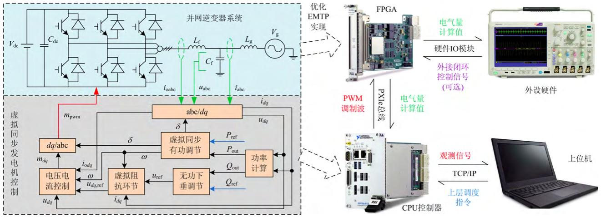  
图1适用于虚拟同步并网逆变器系统实时仿真的CPU-FPGA异构平台  
Fig. 1 CPU-FPGA heterogeneous platform for real-time simulation of virtual synchronous grid-connected inverter system

各组件具体说明如表2所示。

表 2 实时仿真平台各部分介绍  
Table 2 Introduction to real-time simulation platform   

<table><tr><td colspan="2">组成部分</td><td>时间尺度/μs</td><td>承担功能</td></tr><tr><td>上位机</td><td>人机界面</td><td>500</td><td>设置仿真参数,主导仿真进程,波形监测</td></tr><tr><td rowspan="3">PXI机箱</td><td>控制器CPU</td><td>100</td><td>运行大步长控制部分,生成PWM调制波</td></tr><tr><td>FPGA模块</td><td>1</td><td>运行小步长电气拓扑部分,采集电气观测量</td></tr><tr><td>硬件IO</td><td>-</td><td>连接外设硬件,支撑必要的输入输出</td></tr><tr><td colspan="2">外设硬件(示波器、外置闭环控制器)</td><td>-</td><td>实时波形输出观测或外接闭环控制</td></tr></table>

# 2 基于FPGA的优化EMTP算法实现

传统适用于CPU架构的EMTP算法高度串行化，对开关动作简单处理为二值电阻 $R_{\mathrm{on}} / R_{\mathrm{off}}$ 等效，其大致流程如图2所示。

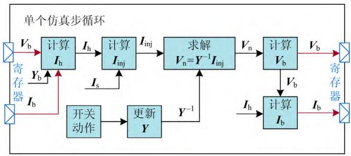  
图2传统EMTP算法示意图  
Fig. 2 Flow diagram of traditional EMTP algorithm

上述流程若直接移植到FPGA上，具有如下几点缺陷：

1) 每次开关动作都需更新网络导纳矩阵，严重

影响仿真效率；

2) 算法串行度高，各环节计算需要大量循环遍历等串行操作，计算时间长；  
3) FPGA 上多采用定点数据类型，为兼顾不同支路类型的数据长度，传统算法往往会牺牲部分仿真精度或是增加计算量，降低效率。

图2中： $V_{\mathrm{b}}$ 、 $\pmb{I}_{\mathrm{b}}$ 为支路电压、电流向量； $Y_{\mathrm{b}}$ 为支路自导纳向量； $I_{\mathrm{h}}$ 为支路历史电流向量； $I_{s}$ 为外接电源(电流源等效)输入向量； $I_{\mathrm{inj}}$ 为节点注入电流向量； $V_{\mathrm{n}}$ 为节点电压向量； $\pmb{Y}$ 为拓扑网络导纳矩阵。

受以上因素影响，传统EMTP流程难以满足小步长实时仿真要求，需要针对FPGA进行流程优化。2.1适用于FPGA的优化EMTP流程

本文开关建模考虑采用广义ADC(G-ADC)开关模型[24-25]。此时开关历史电流计算如下。

$$
I _ {\mathrm {h}, i} = \left\{ \begin{array}{l} \alpha_ {\text {o n}} Y _ {\mathrm {S W}} V _ {\mathrm {b}, i} + I _ {\mathrm {b}, i}, S _ {i} = \text {o n} \\ - Y _ {\mathrm {S W}} V _ {\mathrm {b}, i} + \beta_ {\text {o f f}} I _ {\mathrm {b}, i}, S _ {i} = \text {o f f} \end{array} \right. \tag {1}
$$

式中： $i$ 为该开关支路的支路编号； $I_{\mathrm{h},i}$ 、 $V_{\mathrm{b},i}$ 、 $I_{\mathrm{b},i}$ 、 $S_{i}$ 、 $Y_{\mathrm{SW}}$ 分别为其支路历史电流、支路电压、支路电流、开关状态及固定导纳； $\alpha_{\mathrm{on}}$ 、 $\beta_{\mathrm{off}}$ 为待定的最优广义开关模型参数。

基于该模型，开关动作前后其支路导纳维持不变，从而无需更改系统网络导纳矩阵，使计算量大大降低。同时，根据文献[24-25]，在满足相应暂、稳态特性约束及系统稳定的前提下，可确定最优阻尼 $\alpha_{\mathrm{on}}$ 、 $\beta_{\mathrm{off}}$ 参数，如式(2)。再配合历史电流源重新初始化(HCRI)算法，有助于开关动作暂态过程中开关支路电压、电流的快速稳定，并减少初始过冲误差与开关虚拟损耗，可提高仿真精度。

$$
\left\{ \begin{array}{l} \alpha_ {\text {o n}} = (- 1 + \sqrt {2}) \\ \beta_ {\text {o f f}} = (1 + \sqrt {2}) \end{array} \right. \tag {2}
$$

另外，按支路类型做拆分并行计算。以计算支路历史电流 $I_{\mathrm{h}}$ 环节为例，如图3(左)所示，在传统EMTP算法中，通过遍历支路来串行地计算各支路历史电流。然而，注意到拓扑一旦确定(编号固定)，各支路的类型也即确定，那么完全可以在开始仿真之前就将所有支路按类型进行拆分，后续计算即按类型各自独立计算。此时，各部分支路类型一致，计算方式一致，便可以做批量计算，如图3(右)所示。图中，将支路按电阻R、电感L、电容C、开关SW和电源SC等进行拆分，最终得到各支路类型对应的 $I_{\mathrm{h}}$ 分量集合 $\{I_{\mathrm{h}}\}$ 。

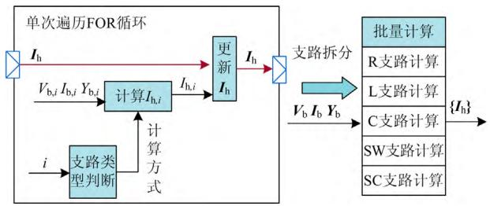  
图3支路拆分效果图  
Fig. 3 Effect diagram after branch division

基于支路类型拆分并行处理，可以明显提升算法的并行度，改善实时性能。同时，采用支路拆分处理还能解决前述定点数据类型问题，各支路类型分量可分别选用合适的数据长度，从而能减少计算资源消耗和计算时间，优化定时。

上述支路拆分后各部分的批量计算均为向量运算。事实上，可将整个流程都优化为矩阵(向量)运算以提升计算效率。以计算节点注入电流 $I_{\mathrm{inj}}$ 环节为例，如图4(左)所示，传统EMTP算法通过遍历各支路历史电流(外接电源注入电流)，累加得到各节点注入电流，其中 $n_{1,i} \sim n_{2,i}$ 为支路 $i$ 的首末端节点编号。本质上，由支路电流计算节点注入电流反应的是网络中节点与支路的连接关系，也即关联矩阵。那么，根据已知的拓扑结构预先得出网络关联矩阵 $M$ ，再与 $I_{\mathrm{h}}$ 进行矩阵运算，即能快速得到节点注入电流 $I_{\mathrm{inj}}$ ，如图4(右)所示。

同时,为配合前级 $I_{\mathrm{h}}$ 环节的支路拆分并行运算,这里关联矩阵也需按支路拆分。此时,原始规模的矩阵运算拆成了若干较小规模矩阵运算的并行处理,进一步提升了算法并行度与仿真效率。另外,结合支路拆分并行处理,还能避免各计算环节中无关支路的冗余计算。

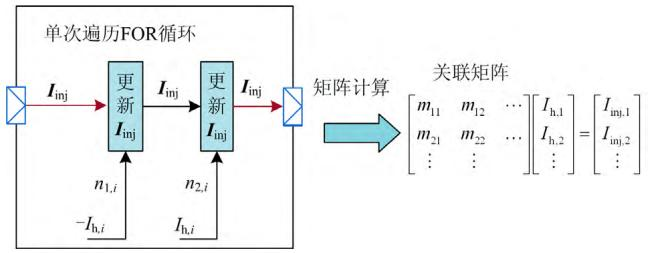  
图4矩阵化计算效果示意图  
Fig. 4 Effect diagram of matrix operation

综合上述流程优化处理，可设计完整的优化EMTP算法流程，如图5所示。

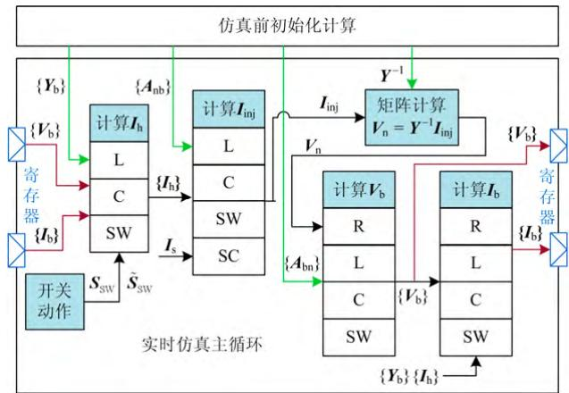  
图5优化EMTP算法流程示意图  
Fig. 5 Optimized EMTP algorithm flow diagram

# 2.2 初始化计算

如前所述，一旦仿真拓扑确定，系统导纳矩阵及关联矩阵等可唯一确定且仿真中不会改变。那么可以在实时仿真前通过离线初始化计算来求得这些参量，再作为固定参数输入参与后续实时仿真，以减少实时仿真环节的计算量，节约资源与时间。

系统导纳矩阵 $\mathbf{Y}$ , 可经由输入拓扑的节点、支路数据计算得到, 同时需计算逆矩阵 $\mathbf{Y}^{-1}$ 并提取出各支路类型自导纳向量集合 $\{\mathbf{Y}_{\mathrm{b}}\}$ 。

考虑以行为节点、列为支路的关联矩阵，用于节点注入电流 $I_{\mathrm{inj}}$ 的计算，只与L、C、SW、SC支路有关，则该四种子关联矩阵以电感支路关联矩阵为例，定义如下。

$$
\boldsymbol {A} _ {\mathrm {n b}, \mathrm {L}} = \left[ \begin{array}{c c c} a _ {\mathrm {n b}, \mathrm {L}, 1 1} & \dots & a _ {\mathrm {n b}, \mathrm {L}, 1 N _ {\mathrm {L}}} \\ \vdots & & \vdots \\ a _ {\mathrm {n b}, \mathrm {L}, N _ {\mathrm {n}} 1} & \dots & a _ {\mathrm {n b}, \mathrm {L}, N _ {\mathrm {n}}, N _ {\mathrm {L}}} \end{array} \right] \tag {3}
$$

$$
a _ {\mathrm {n b}, \mathrm {L}, i j} = \left\{ \begin{array}{l} - 1, \text {节 点} i \text {为 支 路} j \text {的 首 端 点} \\ 0, \text {节 点} i \text {不 为 支 路} j \text {的 端 点} \\ 1, \text {节 点} i \text {为 支 路} j \text {的 末 端 点} \end{array} \right. \tag {4}
$$

式中： $N_{\mathrm{n}}$ 为总的节点数； $N_{\mathrm{L}}$ 为电感支路数； $A_{\mathrm{nb,L}}$ 为计算 $I_{\mathrm{inj}}$ 时的 L 支路关联矩阵，其余 C、SW、SC 支路关联矩阵 $A_{\mathrm{nb,C}}$ 、 $A_{\mathrm{nb,SW}}$ 、 $A_{\mathrm{nb,SC}}$ 可类似式(3)、式(4)定义。

另外，以行为支路、列为节点的关联矩阵则用于支路电压 $V_{\mathrm{b}}$ 的计算，且只与R、L、C、SW支路有关。事实上，两类关联矩阵紧密联系，以电感支路关联矩阵为例，有如下定义。

$$
\boldsymbol {A} _ {\mathrm {b n}, \mathrm {L}} = - \left(\boldsymbol {A} _ {\mathrm {n b}, \mathrm {L}}\right) ^ {\mathrm {T}} \tag {5}
$$

式中： $A_{\mathrm{bn,L}}$ 为计算 $V_{\mathrm{b}}$ 时的L支路关联矩阵，其余R、C、SW支路关联矩阵 $A_{\mathrm{bn,R}}$ 、 $A_{\mathrm{bn,C}}$ 、 $A_{\mathrm{bn,SW}}$ 可结合式(3)一式(5)类似定义。

完成以上初始化计算，所得拓扑相关参量作为后续EMTP实时仿真主循环参数输入。

# 2.3 实时仿真主循环

优化EMTP算法流程主循环中各计算环节均采用矩阵(向量)运算，以高度并行计算保证仿真实时性能。具体的全矩阵化运算流程如下(其中 $\{I_{\mathrm{h}}\}$ 、 $\{V_{\mathrm{b}}\}$ 、 $\{I_{\mathrm{b}}\}$ 、 $\{Y_{\mathrm{b}}\}$ 均为各类型支路对应向量的集合)。

1)计算各支路历史电流 $\{I_{\mathrm{h}}\}$ ，与L、C、SW支路有关。

$$
\left\{ \begin{array}{l} \boldsymbol {I} _ {\mathrm {h}, \mathrm {L}} = \boldsymbol {I} _ {\mathrm {b}, \mathrm {L}}; \boldsymbol {I} _ {\mathrm {h}, \mathrm {C}} = - \boldsymbol {Y} _ {\mathrm {b}, \mathrm {C}} \circ \boldsymbol {V} _ {\mathrm {b}, \mathrm {C}} \\ \boldsymbol {I} _ {\mathrm {h}, \mathrm {S W}} = \left(\alpha_ {\text {o n}} Y _ {\mathrm {S W}} \boldsymbol {V} _ {\mathrm {b}, \mathrm {S W}} + \boldsymbol {I} _ {\mathrm {b}, \mathrm {S W}}\right) \circ \boldsymbol {S} _ {\mathrm {S W}} + \\ (- Y _ {\mathrm {S W}} \boldsymbol {V} _ {\mathrm {b}, \mathrm {S W}} + \beta_ {\text {o f f}} \boldsymbol {I} _ {\mathrm {b}, \mathrm {S W}}) \circ \tilde {\boldsymbol {S}} _ {\mathrm {S W}} \end{array} \right. \tag {6}
$$

式中： $I_{\mathrm{h,L}}$ 为支路历史电流向量集 $\{I_{\mathrm{h}}\}$ 中电感支路对应的分量，其他如 $V_{\mathrm{b,C}}$ 、 $I_{\mathrm{b,SW}}$ 等均为类似含义，下同，不再一一指明； $S_{\mathrm{SW}}$ 、 $\tilde{S}_{\mathrm{SW}}$ 为开关支路开关状态向量和其按位取反向量，运算中均换算为“1/0”数值向量；向量乘法“0”定义为向量元素一一对

应相乘，结果为同样大小的向量。

2) 计算节点注入电流 $I_{\mathrm{inj}}$ ，与 L、C、SW、SC 支路有关。

$$
\left\{ \begin{array}{l} I _ {\text {i n j , L}} = A _ {\mathrm {n b , L}} I _ {\mathrm {h , L}}; I _ {\text {i n j , C}} = A _ {\mathrm {n b , C}} I _ {\mathrm {h , C}} \\ I _ {\text {i n j , S W}} = A _ {\mathrm {n b , S W}} I _ {\mathrm {h , S W}}; I _ {\text {i n j , S C}} = - A _ {\mathrm {n b , S C}} I _ {\mathrm {s}} \\ I _ {\text {i n j}} = I _ {\text {i n j , L}} + I _ {\text {i n j , C}} + I _ {\text {i n j , S W}} + I _ {\text {i n j , S C}} \end{array} \right. \tag {7}
$$

3)计算节点电压 $V_{\mathrm{n}}$

$$
\boldsymbol {V} _ {\mathrm {n}} = \boldsymbol {Y} ^ {- 1} \boldsymbol {I} _ {\text {i n j}} \tag {8}
$$

4) 更新支路电压 $\{V_{\mathrm{b}}\}$ ，与 R、L、C、SW 支路有关。

$$
\left\{ \begin{array}{l} V _ {\mathrm {b}, \mathrm {R}} = A _ {\mathrm {b n}, \mathrm {R}} V _ {\mathrm {n}}; V _ {\mathrm {b}, \mathrm {L}} = A _ {\mathrm {b n}, \mathrm {L}} V _ {\mathrm {n}} \\ V _ {\mathrm {b}, \mathrm {C}} = A _ {\mathrm {b n}, \mathrm {C}} V _ {\mathrm {n}}; V _ {\mathrm {b}, \mathrm {S W}} = A _ {\mathrm {b n}, \mathrm {S W}} V _ {\mathrm {n}} \end{array} \right. \tag {9}
$$

5) 更新支路电流 $\{I_{\mathrm{b}}\}$ ，与 R、L、C、SW 支路有关。

$$
\left\{ \begin{array}{l} \boldsymbol {I} _ {\mathrm {b}, \mathrm {R}} = \boldsymbol {Y} _ {\mathrm {b}, \mathrm {R}} \circ \boldsymbol {V} _ {\mathrm {b}, \mathrm {R}}; \boldsymbol {I} _ {\mathrm {b}, \mathrm {L}} = \boldsymbol {Y} _ {\mathrm {b}, \mathrm {L}} \circ \boldsymbol {V} _ {\mathrm {b}, \mathrm {L}} + \boldsymbol {I} _ {\mathrm {h}, \mathrm {L}} \\ \boldsymbol {I} _ {\mathrm {b}, \mathrm {C}} = \boldsymbol {Y} _ {\mathrm {b}, \mathrm {C}} \circ \boldsymbol {V} _ {\mathrm {b}, \mathrm {C}} + \boldsymbol {I} _ {\mathrm {h}, \mathrm {C}} \\ \boldsymbol {I} _ {\mathrm {b}, \mathrm {S W}} = \boldsymbol {Y} _ {\mathrm {b}, \mathrm {S W}} \circ \boldsymbol {V} _ {\mathrm {b}, \mathrm {S W}} + \boldsymbol {I} _ {\mathrm {h}, \mathrm {S W}} \end{array} \right. \tag {10}
$$

6) 返回 1), 执行下一步仿真循环, 直至结束。基于以上流程, 最终可在 FPGA 上实现小步长电磁暂态实时仿真。

# 3 基于CPU的控制系统与接口设计

如前所述，所建CPU-FPGA异构计算平台中，PXI机箱CPU控制器中运行系统仿真的控制部分，即针对并网逆变器的虚拟同步发电机控制模块，同时作为数据调度处理中心，兼顾与上位机PC和机箱FPGA的数据交互，其主循环如图6所示。

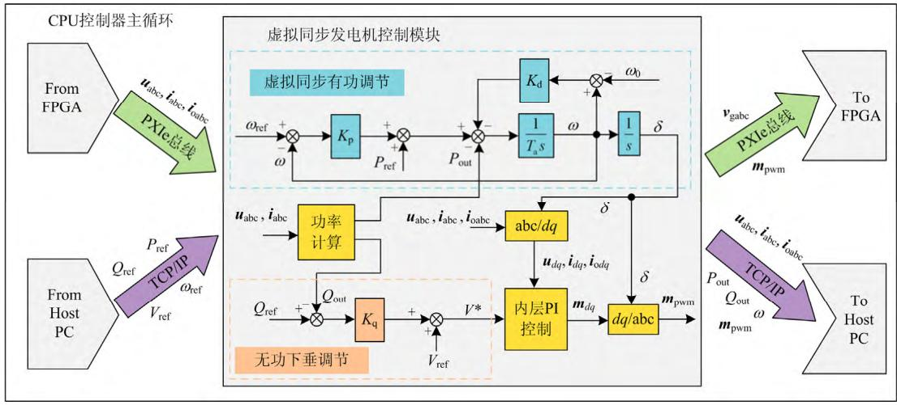  
图6CPU上控制系统框图  
Fig. 6 Block diagram of control system on CPU

图6中，虚拟同步发电机控制模块接收逆变器出口电流 $i_{\mathrm{oabc}}$ 及滤波后电压 $u_{\mathrm{abc}}$ 、电流 $i_{\mathrm{abc}}$ 作为控制输入，结合上位机参考值指令，在 $dq$ 坐标系下进行解耦控制，输出PWM调制波 $m_{\mathrm{pwm}}$ 到FPGA控制逆变器开关。整体控制策略为双层控制，其中外层为功率控制，包括虚拟同步有功调节和无功下垂调节，分别如式(11)、式(12)所示；内层PI控制包括虚拟阻抗环节和电压电流控制环。

$$
\left\{ \begin{array}{l} \dot {\omega} = \frac {1}{T _ {\mathrm {a}}} \left[ K _ {\mathrm {p}} \left(\omega_ {\text {r e f}} - \omega\right) + P _ {\text {r e f}} - P _ {\text {o u t}} - K _ {\mathrm {d}} \left(\omega - \omega_ {0}\right) \right] \\ \dot {\delta} = \omega \end{array} \right. \tag {11}
$$

式中： $\omega$ 、 $\delta$ 分别为逆变器虚拟转子角速度、功角； $P_{\mathrm{ref}}$ 、 $\omega_{\mathrm{ref}}$ 分别为上层有功、角速度参考值； $T_{\mathrm{a}}$ 为虚拟惯性时间常数； $K_{\mathrm{p}}$ 为有功下垂控制系数； $K_{\mathrm{d}}$ 为阻尼系数； $P_{\mathrm{out}}$ 为逆变器输出有功； $\omega_0$ 为同步角速度。

$$
V ^ {*} = V _ {\text {r e f}} + K _ {\mathrm {q}} \left(Q _ {\text {r e f}} - Q _ {\text {o u t}}\right) \tag {12}
$$

式中： $V^{*}$ 为后续内层控制的电压参考值； $V_{\mathrm{ref}}$ 为上层端口电压参考值； $Q_{\mathrm{ref}}$ 、 $Q_{\mathrm{out}}$ 分别为上层无功参考值和逆变器输出无功； $K_{\mathrm{q}}$ 为无功下垂控制系数。

CPU 控制主循环中还需兼顾与上位机 PC、机箱 FPGA 间的数据交互，具体包括：从 FPGA 获取拓扑电气量计算值、从上位机加载上层控制指令；然后将 PWM 调制波 $m_{\mathrm{pwm}}$ 、并网侧电压 $\nu_{\mathrm{gabc}}$ 送至 FPGA，并将相关电气量和控制中间量送至上位机观测。需要指出的是，受限于开关频率，PWM生成环节必须放在 FPGA 中执行(对应图 5 中开关动作模块)，则 CPU 侧传送 PWM 调制波即可。另外，考虑到 FPGA 上计算三角函数的复杂性和高代价以及并网侧电压的慢动态，将其放在 CPU 循环中计算再传入 FPGA 是可取的。

仿真中，CPU控制部分与FPGA电路部分基于PXIe总线进行数据交互，由于仿真速率不同，数据接口采用异步通信，交互时序如图7所示。

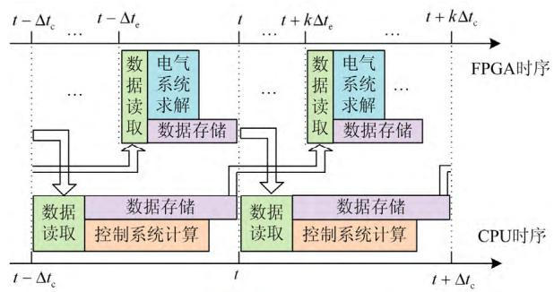  
图7 CPU与FPGA异步交互时序图  
Fig. 7 Time sequence diagram of asynchronous interaction between CPU and FPGA

图7中： $t$ 为某仿真时刻； $\Delta t_{\mathrm{c}}$ 、 $\Delta t_{\mathrm{e}}$ 分别为CPU控制部分与FPGA电路部分仿真步长。电气系统从 $t$ 到 $t + \Delta t_{\mathrm{c}}$ 间的多个仿真步内，均采用 $t$ 时刻的控制系统输出作为计算输入，而控制系统同样直接采用 $t$ 时刻的电气系统输出量(之前最后一个仿真步结果)作为控制输入，后续 $t$ 到 $t + \Delta t_{\mathrm{c}}$ 时刻内双方求解过程独立进行，且均在各自的一个仿真步长内完成，保证仿真实时性。

# 4 仿真分析

基于所建CPU-FPGA异构计算平台，对图1中的虚拟同步并网逆变器系统进行实时仿真分析。相应拓扑参数与控制参数见表3。

表 3 实时仿真参数设置  
Table 3 Real-time simulation parameters   

<table><tr><td>拓扑参数</td><td>数值</td><td>控制参数</td><td>数值/p.u.</td></tr><tr><td>电压基准值 Vn/V</td><td>380</td><td>虚拟惯性时间常数 Ta</td><td>2</td></tr><tr><td>功率基准值 Sn/kVA</td><td>65</td><td>阻尼系数 Kd</td><td>100</td></tr><tr><td>频率基准值 fn/Hz</td><td>50</td><td>有功下垂控制系数 Kp</td><td>100</td></tr><tr><td>直流电压 Vdc/V</td><td>750</td><td>无功下垂控制系数 Kq</td><td>3</td></tr><tr><td>直流侧电容 Cdc/μF</td><td>2000</td><td>电压PI控制比例系数 Kpv</td><td>0.1</td></tr><tr><td>滤波电感值 Lf/mH</td><td>1.5</td><td>电压PI控制积分系数 Kiv</td><td>100</td></tr><tr><td>滤波电容值 Cf/μF</td><td>50</td><td>电流PI控制比例系数 Kpc</td><td>0.1</td></tr><tr><td>线路电感值 Lg/mH</td><td>2.3</td><td>电流PI控制积分系数 Kic</td><td>1</td></tr><tr><td>网侧线电压有效值 Vg/V</td><td>380</td><td>-</td><td>-</td></tr></table>

# 4.1 实时仿真效果验证

本节在Simulink中搭建了具有相同电路拓扑和控制参数的虚拟同步并网逆变器系统，作为基于异构计算平台的实时仿真精度测试参照，分别针对以下两个场景进行实验对比分析。

场景1：控制系统功率指令突变

仿真中设定指令(均为标幺值)如下。

(1) 有功设定值 $P_{\mathrm{ref}}$ : 初始为 0.4, $t = 10 \mathrm{~s}$ 阶跃至 0.6;  
(2) 无功设定值 $Q_{\mathrm{ref}}$ ：初始为0.1， $t = 14 \mathrm{~s}$ 阶跃至0.2；  
(3) 频率参考值 $\omega_{\mathrm{ref}} = 1$ ；端口电压参考值 $V_{\mathrm{ref}} = 1$ 。场景2：网侧单相接地故障

仿真中设定如下。

(1) $P_{\mathrm{ref}} = 0.4$ ， $Q_{\mathrm{ref}} = 0.1$ ， $\omega_{\mathrm{ref}} = 1$ ， $V_{\mathrm{ref}} = 1$   
(2) $t = 4 \mathrm{~s}$ 时网侧电压源 A 相接地故障，持续 $0.1 \mathrm{~s}$ 。

实验结果分别如图8、图9所示。

由图 8 可见, 控制系统指令突变后, 有功功率和无功功率都能较好地跟踪参考值的变化, 虚拟角频率能较好地稳定在额定值附近, 实时仿真和离线

仿真的结果基本一致，验证了异构计算平台中控制系统实时仿真的准确性。另外，可通过示波器观察逆变器并网点电压电流实时波形如图10所示。

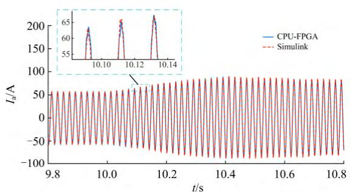

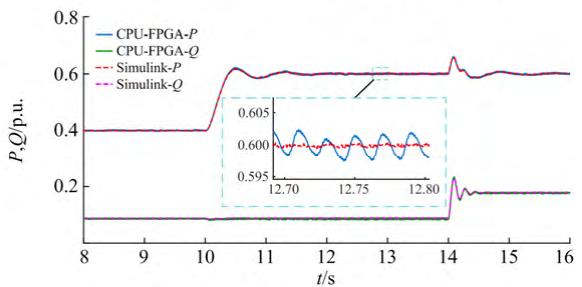  
(a)逆变器并网点A相输出电流波形对比  
(b) 逆变器输出功率波形对比

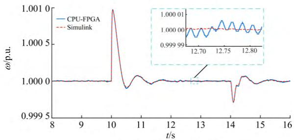  
(c) 虚拟角频率波形对比   
图8场景1实时仿真与Simulink波形对比  
Fig. 8 Waveforms contrast between real-time simulation and Simulink simulation in case 1

图9中，网侧单相接地故障后，并网点发生电压跌落、电流突增，伴随输出功率和系统频率波动；故障消失后，均能较快恢复正常稳定。实时仿真和离线仿真的结果基本一致，验证了异构计算平台中电路拓扑部分实时仿真的准确性。

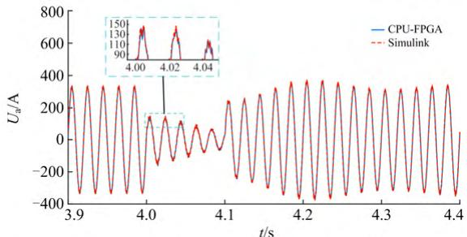  
(a)逆变器并网点A相电压波形对比

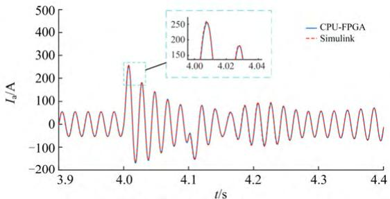  
(b)逆变器并网点A相输出电流波形对比

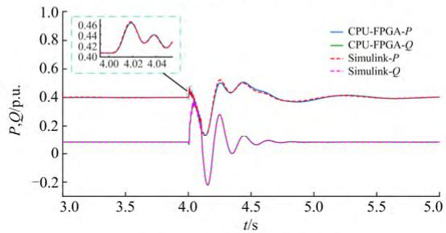  
(c)逆变器输出功率波形对比

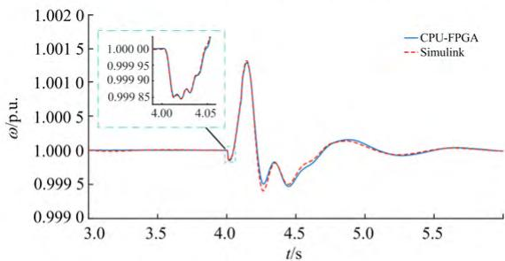  
(d) 虚拟角频率波形对比   
图9场景2实时仿真与Simulink波形对比

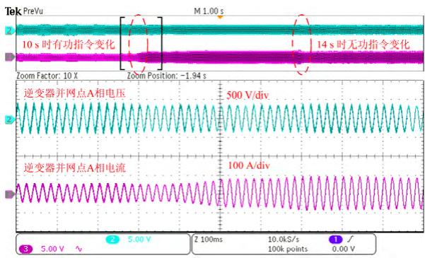  
Fig. 9 Waveforms contrast between real-time simulation and Simulink simulation in case 2   
图10 场景1逆变器并网点电压电流实时波形  
Fig. 10 Real-time waveforms of voltage and current at the grid connection point of the inverter in case 1

# 4.2 异构计算平台实时性能及FPGA资源消耗

在FPGA上实现小步长实时仿真，需要重点考虑FPGA的实时性能，同时兼顾其资源消耗。一般

而言，采用串行的EMTP算法能节省资源消耗，但实时性能较差；相反，算法的并行程度越高，其实时性能就越好，越容易保证实时性，但往往意味着更多的资源消耗。下面就从这两方面展开分析。

# 1) 平台实时性能

本平台仿真中CPU控制部分和FPGA电路部分仿真步长分别为 $100\mu \mathrm{s}$ 和 $1\mu \mathrm{s}$ ，FPGA编译时钟频率为 $120\mathrm{MHz}$ 。FPGA上EMTP算法流程中，只有所有环节用时之和不超过仿真步长才能满足实时性要求，表4为平台实时性能的具体表现。

表 4 CPU-FPGA 平台实时性能  
Table 4 Real-time performance of the CPU-FPGA platform   

<table><tr><td rowspan="2">流程环节
用时/μs</td><td colspan="2">FPGA 电路部分</td><td rowspan="2">CPU 控制
部分</td></tr><tr><td>传统 EMTP</td><td>优化 EMTP</td></tr><tr><td>计算 Ih</td><td>1.20</td><td>0.17</td><td></td></tr><tr><td>计算 Inj</td><td>4.85</td><td>0.18</td><td></td></tr><tr><td>计算 Vn</td><td>4.45</td><td>0.14</td><td rowspan="2">89</td></tr><tr><td>更新 Vb</td><td>0.90</td><td>0.11</td></tr><tr><td>更新 Ib</td><td>0.75</td><td>0.07</td><td></td></tr><tr><td>其余</td><td>-</td><td>0.07</td><td></td></tr><tr><td>空闲</td><td>0.00</td><td>0.26</td><td>11</td></tr><tr><td>总共</td><td>12.15</td><td>1.00</td><td>100</td></tr></table>

表4中，FPGA电路部分分别采用传统EMTP和优化EMTP实现作对比，其中前者为低并行度实现，各环节用时都比较高，导致总用时大大超出，不满足实时性要求，此时只能通过提高FPGA编译频率来缓解，实现难度较大。相比之下，优化后实现并行度高，基于支路拆分并行处理与全矩阵化运算流程，各环节用时均大大降低，使总用时小于仿真步长，且留有一定裕度，满足了实时性要求。CPU控制部分仿真同样留有空闲，能满足实时仿真需求。

# 2) 资源消耗情况

FPGA 资源可分为逻辑片 RAM 内存和 DSP48 乘法器三部分，表 5 为优化 EMTP 流程前后 FPGA 资源消耗情况对比。

表 5 FPGA 资源消耗情况对比  
Table 5 Comparison of FPGA resource consumption   

<table><tr><td>资源项目</td><td>资源总量</td><td>传统EMTP</td><td>优化EMTP</td></tr><tr><td>逻辑片总数</td><td>63550</td><td>47.30%</td><td>38.00%</td></tr><tr><td>逻辑片寄存器</td><td>508400</td><td>17.00%</td><td>14.60%</td></tr><tr><td>逻辑片LUT</td><td>254200</td><td>29.10%</td><td>25.30%</td></tr><tr><td>RAM块</td><td>795</td><td>11.40%</td><td>11.40%</td></tr><tr><td>DSP48(25×18)</td><td>1540</td><td>4.60%</td><td>8.10%</td></tr></table>

表5中，EMTP流程优化前后，随着算法并行程度的提高，逻辑片资源消耗小幅降低，RAM内

存消耗不变，而乘法器消耗却明显增加。如前述分析，算法并行度越高，势必会消耗更多的FPGA资源，尤其是乘法器，这一点与表5中结果相印证。另外，注意到逻辑片资源消耗反而有小幅的降低，这与矩阵化流程大大简化了算法中逻辑处理部分有关，但综合考虑来看，高并行度算法还是会消耗稍多的FPGA资源。

上述结果表明，FPGA上采用优化EMTP流程实现能大大提升实时性能同时仅增加少量资源消耗，效果显著，验证了实时仿真的有效性。

# 5 结论

本文基于 NI-PXI 系统搭建了适用于虚拟同步并网逆变器系统实时仿真的 CPU-FPGA 异构计算平台，包含小步长 FPGA 电路部分与大步长 CPU 控制部分，仿真步长分别设为 $1\mu \mathrm{s}$ 和 $100\mu \mathrm{s}$ 。其中，FPGA 上电路部分采用优化 EMTP 流程实现，综合利用 G-ADC 开关建模、支路拆分并行处理及矩阵化流程计算等优化技术，有效提升了算法并行度，且显著缩短流程用时以满足实时性要求。CPU 控制部分则采用虚拟同步控制，同时与上位机以及 FPGA 间进行数据交互，基于 PXIe 总线设计了与 FPGA 电路部分异步通信的数据交互接口。

最后，基于上述CPU-FPGA平台针对虚拟同步并网逆变器系统进行算例分析，分别对上层功率指令突变与系统网侧单相故障两种场景进行仿真，并与Simulink离线仿真结果相对比，两次结果对比基本一致，并符合控制特性与故障特性，验证了异构计算平台中CPU控制系统与FPGA电路实时仿真的准确性；同时分析了仿真中平台实时性能与FPGA上资源消耗，结果表明FPGA上采用优化EMTP流程实现能明显提升实时性能同时仅增加少量资源消耗，进一步验证了基于本平台实现虚拟同步并网逆变器系统实时仿真的可行性与有效性。后续考虑研究具有非线性特性元件乃至更大范围电网多种类器件的混合仿真实现。

# 参考文献

[1] 陈来军，陈颖，许寅，等. 基于GPU的电磁暂态仿真可行性研究[J]. 电力系统保护与控制，2013, 41(2): 107-112.  
CHEN Laijun, CHEN Ying, XU Yin, et al. Feasibility study of GPU based electromagnetic transient simulation[J]. Power System Protection and Control, 2013, 41(2): 107-112.

[2] 康晴，罗奕，卢新佳，等. 基于变流器控制策略的微电网故障特性仿真研究[J]. 电力系统保护与控制，2019, 47(2): 147-153.  
KANG Qing, LUO Yi, LU Xinjia, et al. Simulation study on microgrid fault characteristics based on converters control strategy[J]. Power System Protection and Control, 2019, 47(2): 147-153.   
[3] HAIDER S, LI G, WANG K. A dual control strategy for power sharing improvement in islanded mode of AC microgrid[J]. Protection and Control of Modern Power Systems, 2018, 3(2): 111-118. DOI: 10.1186/s41601-018-0084-2.   
[4] WANG X, WOODFORD D A, KUFFEL R, et al. A real-time transmission line model for a digital TNA[J]. IEEE Transactions on Power Delivery, 1996, 11(2): 1092-1097.   
[5] 丁茂生, 王辉, 舒兵成, 等. 含风电场的多直流送出电网电磁暂态仿真建模[J]. 电力系统保护与控制, 2015, 43(23): 63-70.  
DING Maosheng, WANG Hui, SHU Bingcheng, et al. Electromagnetic transient simulation model of multi-send HVDC system with wind plants[J]. Power System Protection and Control, 2015, 43(23): 63-70.   
[6] 黄宇鹏，汪可友，李国杰. 基于权重数值积分的电力电子开关仿真插值算法[J]. 电网技术，2015，39(1): 150-155.  
HUANG Yupeng, WANG Keyou, LI Guojie. A weight-numerical integration based interpolation algorithm for simulation of power electronic circuit[J]. Power System Technology, 2015, 39(1): 150-155.   
[7] 姬伟江, 汪可友, 李国杰, 等. 计及多重开关的电力电子实时仿真算法及其基于 PXI 平台的实现[J]. 电网技术, 2017, 41(2): 588-596.  
JI Weijiang, WANG Keyou, LI Guojie, et al. A real-timesimulation algorithm for power electronics circuit considering multiple switching events and its implementation on PXI platform[J]. Power System Technology, 2017, 41(2): 588-596.   
[8] 舒德兀, 张春朋, 姜齐荣, 等. 电力电子仿真中开关时刻自校正插值算法[J]. 电网技术, 2016, 40(5): 1455-1461.  
SHU Dewu, ZHANG Chunpeng, JIANG Qirong, et al. A switching point self-correction interpolation algorithm for power electronic simulations[J]. Power System Technology, 2016, 40(5): 1455-1461.   
[9] 宋杰辉，杨炳元，吴俊杰. 双馈风场进线对 $220\mathrm{kV}$ 母线采样值差动保护的影响[J]. 电力系统保护与控制，

2019, 47(13): 100-106.   
SONG Jiehui, YANG Bingyuan, WU Junjie. Influence of double fed wind field incoming line on sampled value differential protection of $220\mathrm{kV}$ bus[J]. Power System Protection and Control, 2019, 47(13): 100-106.   
[10] 朱谷雨，王致杰，邹毅军，等. 永磁直驱风机的小步长硬件在环仿真研究[J]. 电力系统保护与控制，2018, 46(23): 111-117.  
ZHU Guyu, WANG Zhijie, ZOU Yijun, et al. Research on HIL simulation of direct-driven permanent magnet synchronous generator[J]. Power System Protection and Control, 2018, 46(23): 111-117.   
[11] HUI S Y R, MORRALL S. Generalized associated discrete circuit model for switching devices[J]. IEE Proceedings-Science, Measurement and Technology, 1994, 141(1): 57-64.   
[12] PEJOVIĆ P, MAKSIMOVIC D. A method for fast time-domain simulation of networks with switches[J]. IEEE Transactions on Power Electronics, 1994, 9(4): 449-456.   
[13] DAGBAGI M, HEMDANI A, IDKHAJINE L, et al. ADC-based embedded real-time simulator of a power converter implemented in a low-cost FPGA: application to a fault-tolerant control of a grid-connected voltage-source rectifier[J]. IEEE Transactions on Industrial Electronics, 2016, 62(2): 1179-1190.   
[14] MATAR M, IRAVANI R. FPGA implementation of the power electronic converter model for real-time simulation of electromagnetic transients[J]. IEEE Transactions on Power Delivery, 2010, 25(2): 852-860.   
[15] 曾钰, 邹贵彬, 孙辰军, 等. 一种柔性直流配电网直流侧故障保护方法[J]. 电力信息与通信技术, 2018, 16(7): 80-86.  
ZENG Yu, ZOU Guibin, SUN Chenjun, et al. A DC side fault protection method for a flexible DC distribution network[J]. Electric Power Information and Communication Technology, 2018, 16(7): 80-86.   
[16] 王成山，丁承第，李鹏，等. 基于FPGA的光伏发电系统暂态实时仿真[J]. 电力系统自动化，2015, 39(12): 13-20.  
WANG Chengshan, DING Chengdi, LI Peng, et al. FPGA-based real-time transient simulation of photovoltaic generation system[J]. Automation of Electric Power Systems, 2015, 39(12): 13-20.   
[17] 徐珂, 聂萌, 王洋, 等. OpenDSS 在分布式光伏接入配电网仿真分析中的应用[J]. 电力信息与通信技术,

2018, 16(11): 88-92.   
XU Ke, NIE Meng, WANG Yang, et al. Application of OpenDSS in simulation and analysis of distributed photovoltaic connected to distribution network[J]. Electric Power Information and Communication Technology, 2018, 16(11): 88-92.   
[18] 王智颖. 基于多 FPGA 的有源配电网可扩展实时仿真方法与系统设计[D]. 天津: 天津大学, 2018.  
WANG Zhiying. Extendable real-time simulation method and simulator design of active distribution networks based on FPGAs[D]. Tianjin: Tianjin University, 2018.   
[19] 林雪华, 郭琦, 郭海平, 等. 基于FPGA的柔性直流实时仿真技术及试验系统[J]. 电力系统自动化, 2017, 41(12): 33-39.  
LIN Xuehua, GUO Qi, GUO Haiping, et al. FPGA based real-time simulation technology and test system of flexible DC[J]. Automation of Electric Power Systems, 2017, 41(12): 33-39.   
[20] 朱建鑫, 滕国栋, 秦阳, 等. 基于多FPGA的电力电子实时仿真系统[J]. 电力系统自动化, 2017, 41(9): 137-143.  
ZHU Jianxin, TENG Guodong, QIN Yang, et al. MultiFPGA based real-time simulation system for power electronics[J]. Automation of Electric Power Systems, 2017, 41(9): 137-143.   
[21] SALVATORE D A, JON A S, OLAV B F. A virtual synchronous machine implementation for distributed control of power converters in smart grids[J]. Electric Power Systems Research, 2015, 122: 180-197.   
[22] 霍现旭, 吴盼, 黄鑫, 等. 基于自适应参数虚拟同步机的微电网稳定控制[J]. 电力建设, 2019, 40(2): 79-86.  
HUO Xianxu, WU Pan, HUANG Xin, et al. Research on

stability control of microgrid based on virtual synchronous generator with adaptive parameters[J]. Electric Power Construction, 2019, 40(2): 79-86.   
[23] LIU J, YANG D, YAO W, et al. PV-based virtual synchronous generator with variable inertia to enhance power system transient stability utilizing the energy storage system[J]. Protection and Control of Modern Power Systems, 2017, 2(4): 429-437. DOI: 10.1186/s41601-017-0070-0.   
[24] 徐晋，汪可友，李国杰，等. 基于参数化历史电流源的广义小步长开关模型[J]. 中国电机工程学报，2018, 38(6): 1647-1654, 1901.  
XU Jin, WANG Keyou, LI Guojie, et al. A general small time-step model based on the parameterized history current sources[J]. Proceedings of the CSEE, 2018, 38(6): 1647-1654, 1901.   
[25] WANG K, XU J, LI G, et al. A generalized associated discrete circuit model of power converters in real-time simulation[J]. IEEE Transactions on Power Electronics, 2019, 34(3): 2220-2233.

收稿日期：2019-08-18； 修回日期：2019-10-24

作者简介：

吴盼(1995一)，男，硕士研究生，研究方向为新能源并网控制与建模仿真；E-mail: Panghuwu@sjtu.edu.cn

汪可友（1979—），男，通信作者，博士，教授，博士生导师，研究方向为电力系统动态与稳定计算方法、电力电子化电力系统；E-mail: wangkeyou@sjtu.edu.cn

徐晋(1991—)，男，博士研究生，研究方向为电力系统分析、新能源接入、实时仿真与建模。E-mail:xujin20506@qq.com

(编辑 许威)