# Type-3 wind turbine generator model with generic high-level control for electromagnetic transient simulations

Anton Stepanov a,* , Hossein Ashourian a , Henry Gras a , Jean Mahseredjian b

a PGSTech, Montreal, QC, Canada   
b Polytechnique Montreal, Canada

# A R T I C L E I N F O

Keywords:

EMT simulation

DFIG

IBR

Modeling

WECC

Wind turbine

# A B S T R A C T

Electromagnetic transient (EMT) simulations are instrumental in providing researchers and engineers with detailed data about the dynamic behavior of power grids, necessary for analysis, planning, and risk mitigation. Such simulation studies become even more relevant with the increased number of inverter-based resources integrated into the grid. To achieve reliable simulation results, accurate and accessible models are needed, since existing generic models do not always provide accurate transient response, especially during fast transients. This paper proposes a model for the type-3 wind turbine generator, otherwise known as doubly-fed induction generator (DFIG), that combines the benefits of the generic wind turbine model developed by the Western Electricity Coordinating Council (WECC), with the extra accuracy of a detailed electrical model for the DFIG. WECC models are widely used by planners in their phasor-domain model databases. The proposed WECC-DFIG model is designed to be used in EMT-type software, and due its inheritance of the high-level control system, it can reuse control settings from an existing WECC model without re-tuning. It improves accuracy during transients, such as balanced and unbalanced faults.

# 1. Introduction

A considerable proportion of existing and currently installed wind parks are based on type-3 wind turbine generators (WTGs), also called doubly-fed induction generators (DFIG) [1–4]. A typical DFIG wind turbine system is shown in Fig. 1.

Significant efforts have been made in the last decades in the development of various inverter-based resources (IBRs), including DFIG wind turbine models with various levels of detail and field of applications, including protection studies, electromagnetic transient simulations (EMT) studies, frequency domain modeling and more [5–9].

Specifically in the area of EMT simulations, various WTGs models have been proposed in the literature, focusing on different aspects, ranging from the detailed representation of mechanical systems and associated controls [10,11], numerical efficiency [12,13], to real-time modeling and WTG emulators [14,15]. Despite possible simplifications, such models typically provide a high level of detail at the expense of increased computational burden.

One of the most widely used generic models is the model developed

by the Western Electricity Coordinating Council, referred to in this paper as the WECC model [16,17]. A similar generic model has been developed by the IEC [18,19]. These models are often used by electrical power system planners in phasor-domain simulations. They do not accurately represent fast transients, especially during non-nominal operating conditions, such as operation under partial load or unbalanced conditions. This is due to the fact that the mechanical, electrical and control system representations in these models are greatly simplified. The DFIG model, for example, is represented by a full converter. However, they result in faster simulations and have increased ease of use due to the reduced amount of detail, unified design, and well-developed documentation. Despite initially being proposed for phasor-domain simulations, such simplified generic models are also used in EMT simulation software packages [17,20,21].

To obtain an EMT model of their grid, it is not uncommon for transmission system operators to transpose an existing grid, which may already contain numerous generic IBR models with project-specific parameters, from an RMS simulation software to EMT. However, directly replacing such IBR models by the default detailed models from the EMT

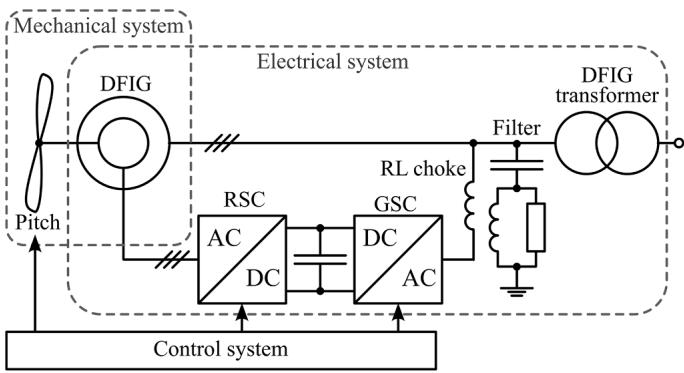  
Fig. 1. DFIG wind turbine.

simulation software libraries can become quite challenging and timeconsuming. It is due to the fact that they would often have a different control structure compared to their RMS counterparts, thus requiring retuning. Implementing manufacturer-specific detailed models may not be possible due to the lack of available data or confidentiality issues [9,22]. The choice is therefore often made to keep the generic IBR models in the EMT grid, which can lead to reducing the accuracy of simulation results, especially in simulation studies involving weak grids and/or unbalanced faults [9].

This paper proposes a DFIG wind turbine model that combines the interface and high-level controls of a generic model (such the WECC model), and the accuracy of a detailed model. Thus, it can be used anywhere the WECC model has been applied to obtain more accurate results without re-tuning.

The paper is organized as follows: section 2 describes the DFIG wind turbine and its typical control system as well as the WECC model. Section 3 develops the proposed WECC-DFIG model. Simulation results and analysis are given in section 4.

# 2. Overview and modeling of DFIG wind turbines

This section presents and recalls the details of the DFIG wind turbine, describing the existing WECC model for the convenience of readers and does not contain new developments.

# 2.1. DFIG wind turbine and control

A typical DFIG wind turbine, such as shown in Fig. 1, can be represented by a combination of a mechanical, electrical, and control systems. The mechanical system includes the blades, the shaft and the rotor of the DFIG. The electrical system typically consists of the rotor-side and gridside converters (RSC and GSC, respectively), DC link, AC harmonic filters, crowbar protection and the coupling transformer.

The control system of the wind turbine includes the RSC and GSC control blocks, shown in Figs. 2 and 3, respectively, as well as the pitch controller for the angle of the blades, shown in Fig. 4. Typically, the converter control system is cascaded, where the slower outer loop generates the reference currents for the faster inner loop, which in turn generates the modulation signals that are used to produce the gating commands for the power electronic switches. The GSC is responsible for

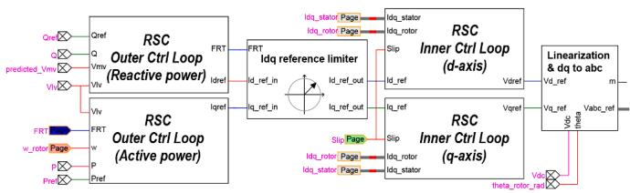  
Fig. 2. RSC control system of a DFIG turbine.

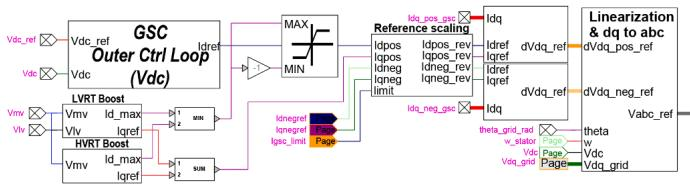  
Fig. 3. GSC control system of a DFIG turbine.

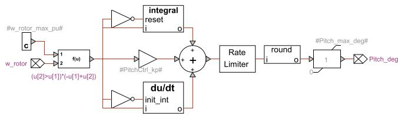  
Fig. 4. Mechanical control system of a DFIG turbine.

the DC voltage control and AC voltage boost during disturbances, whereas the RSC is responsible for regulating the active and reactive powers, voltage, and power factor of the turbine.

It should be noted that the current limiter block in the RSC control system acts on the rotor currents and does not have a direct impact on the output currents of the installation, contrary to many other IBRs such as full-converter wind turbines, PVs, etc. This makes it more challenging to develop simplified models that would capture this behavior.

The frequency of the AC voltages generated by the RSC is controlled so that under steady state conditions, the combined speed of the rotor plus the rotational speed of the rotor flux vector matches that of the synchronously rotating stator flux vector fixed by the network frequency. Manipulation of the rotor voltage permits to control the generator operating conditions.

It should be noted that when multiple turbines are assembled in a wind park, the references for individual turbines come from the park controller.

# 2.2. WECC model overview

While the WECC wind turbine model represents the DFIG mechanical, electrical and control systems, these systems are greatly simplified. For example, the electrical system neglects all machine fluxes and DC link dynamics. The WECC model contains four main elements [16]:

• Renewable energy generator controller (REGC).   
• Renewable energy electrical controller (REEC).   
• Renewable energy plant controller (REPC).   
• Mechanical system and its controllers.

REGC allows to represent the converter either with controlled current or controlled voltage source (REGC_A and REGC_C, respectively) [16].

REEC represents the outer loop of the converter control system. It receives the active and reactive power references and calculates the reference values of active and reactive currents for REGC. It contains extended voltage-dependent current limit tables (VDLp, VDLq), current compensation, reactive droop compensation, reactive current injection algorithm, model inverter blocking logic, etc. [16].

REPC monitors conditions at the point of interconnection (POI) and sends active and reactive power commands to REEC to achieve the desired real and reactive powers, voltage and power factor at the POI [16].

The mechanical system includes the wind turbine generator aerodynamics model (WTGA), drivetrain model (WTGT), pitch controller model (WTGP) and torque controller model (WTGQ) [16].

A quadratic equation Eq. 1 describes the WTGA block that defines the relation between the output mechanical power and the pitch angle [16, 23]:

$$
P _ {m} (t) = P _ {m} (0) - K _ {a} \Theta (t) [ \Theta (t) - \Theta_ {0} ] \tag {1}
$$

where $P _ { m }$ is the mechanical power, Θ is the pitch angle, $\Theta _ { 0 }$ is the initial pitch angle, and $K _ { a }$ is the aerodynamic gain factor which defines the slope $d P _ { m } / d \Theta \ [ 1 6 , 2 3 ]$ .

The WTGP block consists of two PI controllers with anti-windup limiters and a low-pass filter for the output signal (pitch angle). It is shown schematically in Fig. 5, where $\omega _ { t }$ is the mechanical speed of the turbine, $\omega _ { r e f }$ is the reference speed, $P _ { r e f }$ is the active power reference, $P _ { o r d }$ is the active power order [16].

The connection of the blocks of the model is shown schematically in Fig. 6 (note that not all signals are shown between blocks) [16]. The blocks with gray background will be modified in the proposed WECC-DFIG model in section 3. In Fig. $6 , I _ { p c m d }$ and $I _ { q c m d }$ are the active and reactive channel current commands of the $\mathrm { R E E C } , \omega _ { g }$ is the generator speed, $Q _ { r e f }$ is the reactive power reference.

# 3. Proposed WECC-DFIG model

# 3.1. Mechanical system

The mechanical system model represents the aerodynamics of the blades pitch angle and the dynamics of the drivetrain, as well as the pitch controller similarly to the WECC model, i.e. it is based on the WTGA, WTGT, WTGQ and WTGP modules described in section 2.2 with the following improvements.

# 3.1.1. WTGA

It can be observed that mechanical power in the WECC model Eq. 1 is capped at

$$
\max  \left\{P _ {m} \right\} = P _ {m} (0) + K _ {a} \Theta_ {0} ^ {2} / 4 \tag {2}
$$

Depending on the initial value of power $P _ { m } ( 0 )$ and initial pitch angle $\Theta _ { 0 } ,$ this maximum value may be below the nominal power of the WTG. Besides, the maximum power Eq. 2 will be obtained at $\Theta _ { 0 } / 2 ,$ whereas it is typically obtained at the minimum value of Θ for the given wind and turbine speeds within a reasonable operation range [23].

To provide more flexibility for the adjustment of the $P _ { m }$ curve, in the proposed model the user can set the value of the available mechanical power $P _ { a v a i l a b l e }$ and the $\Theta _ { 0 }$ angle to obtain a desired characteristic of mechanical power as a function of pitch angle $P _ { m } = f ( \Theta )$ in the WTGA aerodynamics block as shown in Eq. 3:

$$
P _ {m} = P _ {\text {a v a i l a b l e}} - K _ {a} \Theta [ \Theta - \Theta_ {0} ] \tag {3}
$$

This can be useful to model the events where more power is available but it has to be limited (such as wind energy curtailment or operation under strong winds [24–26]) with more flexibility for the adjustment of the $P _ { m }$ curve. Contrary to the original equation, it does not have a hard upper limit of Eq. 2 since it does not directly depend on the initial power $P _ { m } ( 0 )$ and maximum power can be obtained at minimum Θ (by setting

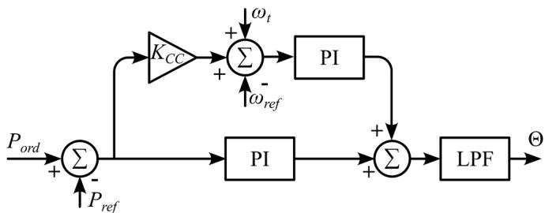  
Fig. 5. Schematic diagram of pitch controller block (WTGP).

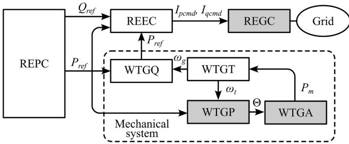  
Fig. 6. Simplified schematic diagram of WECC type-3 model.

$$
\Theta_ {0} = 0).
$$

The initial pitch angle in the proposed model Θ(0) is not equal to $\Theta _ { 0 }$ and is calculated to match the actual and available powers and $\Theta _ { 0 }$ as in (4) below, which is derived directly from Eq. 3. Only the positive solution of Eq. 4 should be considered assuming that $\Theta \ge 0$ and $P _ { a \nu a i l a b l e } \geq P _ { m } .$ .

$$
\Theta (0) = \frac {\Theta_ {0} + \sqrt {\Theta_ {0} ^ {2} - 4 \frac {P _ {m} (0) - P _ {\text {a v a i l a b l e}}}{K _ {a}}}}{2} \tag {4}
$$

# 3.1.2. WTGP

In the WTGP block of the default WECC model Fig. 5, two PI controllers act on a single variable Θ, one of them is responsible for angular speed control, and the other is for power order. This combination results in an infinite amount of possible history values of the integrals, especially in cases where $\Theta ( 0 ) > 0 .$ In the proposed model, the history term of the PI controller responsible for the power order is always initialized to zero to avoid any ambiguity, whereas the one for the angular speed is initialized to match Θ(0).

# 3.2. Electrical system

The electrical system of the WECC DFIG model contains detailed models for the generator, transformer (including iron core saturation), AC filters and converters, Fig. 7. The speed of the generator is given by the WTGT block [16].

The proposed model allows to represent the GSC and the RSC converters using power semiconductors with nonlinear v-i characteristics or use the average-value model (AVM) where the converters are represented as controlled voltage sources with the references coming from the inner control loop of the control system.

# 3.3. Control system

# 3.3.1. Overview

The proposed WECC-DFIG model reuses the plant controller and the outer control loop from the WECC model (REPC and REEC, respectively) and the inner current control of a detailed model of DFIG for the RSC control.

The control system for the GSC is a generic cascaded control system,

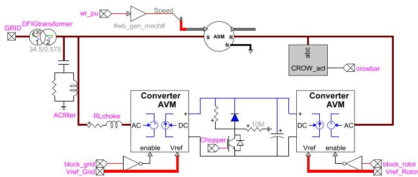  
Fig. 7. Electrical diagram of the proposed model.

as explained in the subsection 2.1. It includes decoupled sequence inner current control for unbalanced grid conditions such as asymmetrical faults.

It should be noted that the WECC model regulates stator currents in the grid voltage reference frame, whereas the RSC in the detailed model regulates rotor currents in the rotor reference frame. Therefore, to link REEC and inner control loops, there is an additional block in the proposed model, dedicated to the transition of the REEC output current reference values to the inner current controller reference frame as explained in subsection 3.3.2). While it is possible to directly connect REEC to the inner current controller without re-tuning any settings, this would likely trigger limiters and/or protections because the VDL and other settings of the WECC model are tuned based on the stator current values. Since the aim of the proposed WECC-DFIG model is to be able to directly substitute the WECC model without the need to re-tune its parameters, this approach is not advisable.

# 3.3.2. Linking REEC and inner current control

Linking the REEC outputs to the inner current controller is performed in two steps: changing the reference frame and adding the contribution of the magnetizing current. This can be explained using the DFIG electrical diagram of Fig. 8.

The rotor current $i _ { R }$ can be represented as a combination of the magnetizing current iM and the stator current $i _ { S } .$ . REEC only considers the stator current, therefore, to obtain the rotor current references for the RSC controller the magnetizing current contribution must be added to the current references from the REEC.

Assuming the magnetization branch is composed only of an inductance, it is easy to consider its contribution in a reference frame aligned with the magnetizing flux of the machine since the current and the flux vectors are aligned with each other. Therefore, in the proposed WECC-DFIG model, the output current commands of the REEC $( I _ { p c m d }$ and $I _ { q c m d } )$ are first transposed to the flux-synchronous reference frame using the flux angle $\Theta _ { f l u x }$ from the REEC reference frame, Eqs. 5 and 6:

$$
I _ {p c m d} ^ {\prime} = \cos (- \Theta_ {f l u x}) I _ {p c m d} + \sin (- \Theta_ {f l u x}) I _ {q c m d} \tag {5}
$$

$$
I _ {q c m d} ^ {\prime} = \sin (- \Theta_ {f l u x}) I _ {p c m d} - \cos (- \Theta_ {f l u x}) I _ {q c m d} \tag {6}
$$

To obtain references for the inner current controller, the magnetizing current is then estimated from the measurements at the terminals of the machine and added to the transposed REEC outputs, Fig. 9, Eqs. 7 and 8:

$$
I _ {d r e f} = I _ {p c m d} ^ {\prime} + I _ {M} ^ {\prime} = I _ {p c m d} ^ {\prime} + \left(v _ {S} - i _ {S q} L _ {S}\right) / L _ {M} \tag {7}
$$

$$
I _ {q r e f} = I ^ {\prime} _ {q c m d} \tag {8}
$$

where $I _ { M }$ is the approximation of the magnetizing current, $\nu _ { S }$ is voltage at stator terminals, $i _ { S \mathrm { ~ } q }$ is q-axis projection of the stator current, $L _ { S }$ is stator leakage inductance, and $L _ { M }$ is magnetizing inductance.

# 4. Simulation results

A set of simulation studies has been conducted to evaluate the performance of the proposed model. The simulations were conducted in

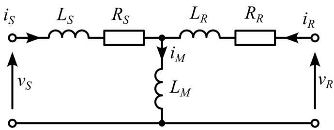  
Fig. 8. DFIG electrical diagram.

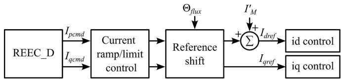  
Fig. 9. WECC-DFIG linked control system.

EMTP® [27]. The selected tests (voltage regulation, undervoltage response/LVRT) are in agreement with typical model verification requirements set forth by TSOs for variable generation [28–30]. The compared models are two WECC models (one with REGC_A and the other with REGC_C), the proposed WECC-DFIG model and the detailed EMT library DFIG model available in EMTP® which serves as the reference. The EMT library DFIG model uses MPPT for the active power control channel, AVM for converters, and has detailed aerodynamics model that considers wind speed and power coefficient $C _ { p }$ [31]. Other models use direct active power control. Reactive power reference in all models is controlled to zero.

A 60 Hz 120 kV system shown in Fig. 10 (EPRI benchmark system [32–34]) is used for testing wind park models behavior. Parameters not shown in Fig. 10 are given in Table 1.

# 4.1. 3-phase fault

A symmetrical fault with 1Ω resistance is applied at BUS3 for 500 ms. A relatively long fault duration is used to demonstrate both the transient and steady-state behavior during a fault. The active and reactive powers and positive sequence voltage of different models are shown in Fig. 11. All models generally follow the reference DFIG model. Difference in the active power output after fault clearance can be attributed to the different upper-level controls and MPPT vs. direct active power control in all other models. The active power behavior of WECC-DFIG during the fault matches best with the reference waveform. Reactive power increases to 10 Mvars, proportional to the voltage deviation.

The instantaneous values of phase A voltage and current at the POI and the corresponding errors relative to EMT library DFIG are shown in Figs. 12 and 13. Voltage and current signals of WECC-DFIG have the smallest deviation from the reference model, as demonstrated by the corresponding error signals. It can also be noted that REGC_A waveforms exhibit more oscillatory behavior and its maximum overvoltage is also overestimated (EMT library DFIG: 1.39 pu., WECC-DFIG: 1.39 pu., REGC_A: 1.73 pu., REGC_C: 1.39 pu.).

WTG rotor speed is shown in Fig. 14. EMT library DFIG model has higher rotor speed because it is defined by the detailed aerodynamics model that considers wind speed and power coefficient $C _ { p }$ [31]. WECC-based models do not consider wind speed, but only the available mechanical power, which is quasi-constant (see subsections II.B and III. A for details), and nominal speed is assumed for normal operation.

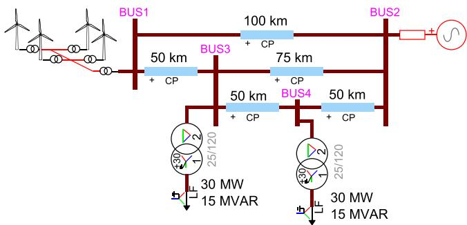  
Fig. 10. Test network.

Table 1 System parameters.   

<table><tr><td>Parameter</td><td colspan="2">Value</td></tr><tr><td>DFIG nominal power</td><td colspan="2">1 MW</td></tr><tr><td>DFIG nominal voltage</td><td colspan="2">0.575 kV</td></tr><tr><td>DFIG stator impedance</td><td colspan="2">0.033 + j0.18 pu</td></tr><tr><td>DFIG magnetization inductance</td><td colspan="2">2.9 pu</td></tr><tr><td>DFIG rotor inductance</td><td colspan="2">0.026 + j0.16 pu</td></tr><tr><td>DFIG transformer nominal power</td><td colspan="2">1.75 MVA</td></tr><tr><td>DFIG transformer nominal voltages</td><td colspan="2">0.575 / 34.5 kV</td></tr><tr><td>DFIG transformer impedance</td><td colspan="2">0.002 + j0.06 pu</td></tr><tr><td>Wind park transformer nominal power</td><td colspan="2">75 MVA</td></tr><tr><td>Wind park transformer nominal voltages</td><td colspan="2">120 / 34.5 kV</td></tr><tr><td>Wind park transformer impedance</td><td colspan="2">0.003 + j0.12 pu</td></tr><tr><td>Number of turbines (aggregated)</td><td colspan="2">45</td></tr><tr><td>Load transformer power</td><td colspan="2">50 MVA</td></tr><tr><td>Load transformer impedance</td><td colspan="2">0.00375 + j0.1578</td></tr><tr><td></td><td colspan="2">pu</td></tr><tr><td>Transformer magnetization (wind park and load transformers)</td><td>I (pu)</td><td>Flux (pu)</td></tr><tr><td></td><td>0.01</td><td>1.075</td></tr><tr><td></td><td>0.025</td><td>1.15</td></tr><tr><td></td><td>0.05</td><td>1.2</td></tr><tr><td></td><td>0.1</td><td>1.23</td></tr><tr><td></td><td>2.0</td><td>1.72</td></tr><tr><td>Line data (per km)</td><td colspan="2">R&#x27;0 = 0.313 Ω; R&#x27;1 = 0.127 Ω</td></tr><tr><td></td><td colspan="2">L&#x27;0 = 1.66 Ω; L&#x27;1 = 0.479 Ω</td></tr><tr><td></td><td colspan="2">C&#x27;0 = 1.82 μS; C&#x27;1 = 3.48 μS</td></tr><tr><td>Slack bus impedance</td><td colspan="2">Z0 = 3 + j30 Ω; Z1 = Z2 = 1 + j9 Ω</td></tr></table>

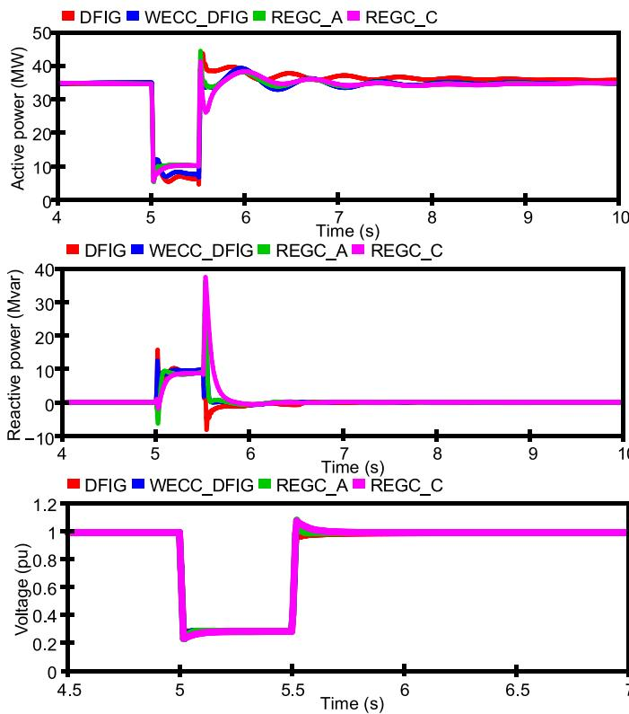  
Fig. 11. POI powers and voltage during a 3-phase fault at BUS3.

# 4.2. 2-phase fault

A two-phase ideal fault is applied at BUS3 for 500 ms. The active and reactive powers and positive sequence voltage of different models are shown in Fig. 15. It can be observed that the reactive power of the WECC-DFIG model is much closer to the reference compared to REGC_A

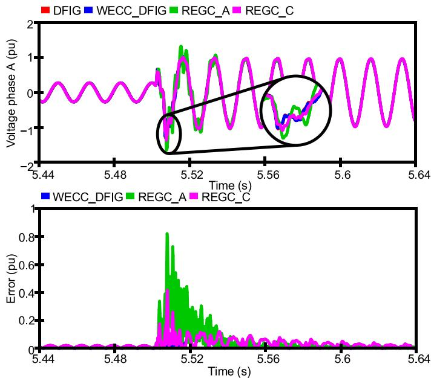  
Fig. 12. Phase A voltage and error relative to DFIG during 3-phase fault at BUS3.

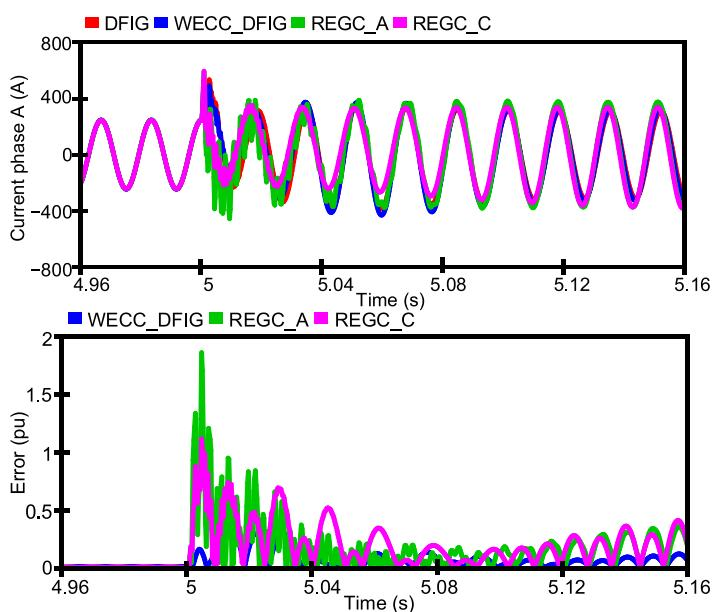  
Fig. 13. Phase A current and error relative to DFIG during 3-phase fault at BUS3.

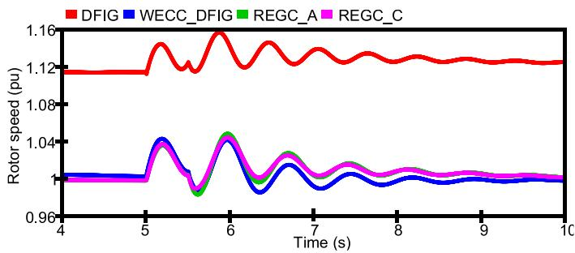  
Fig. 14. WTG rotor speed during 3-phase fault at BUS3.

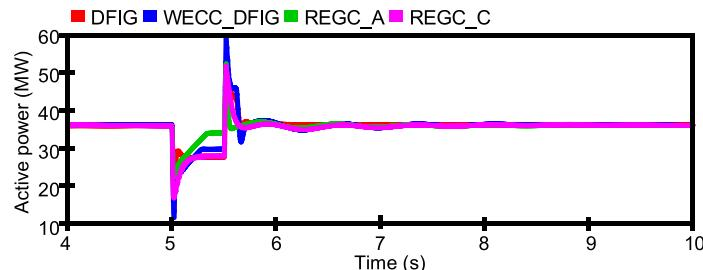

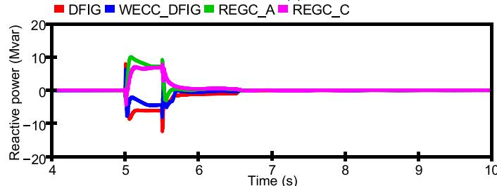

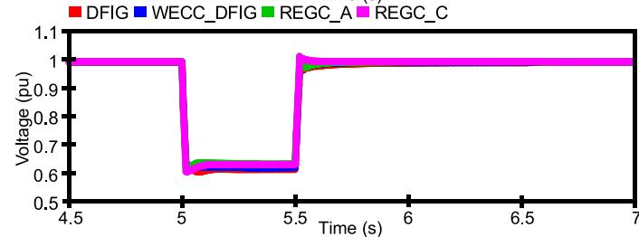  
Fig. 15. POI powers and voltage during a 2-phase fault at BUS3.

# and REGC_C.

Instantaneous phase B voltage and current at the POI and the corresponding errors relative to EMT library DFIG are shown in Figs. 16 and 17. WECC-DFIG error signals are the smallest. REGC_A and REGC_C models are developed for balanced RMS simulations, so do not represent well the currents in unbalanced faults. The response during the first 100 ms after the fault is represented accurately only with WECC-DFIG.

Voltage waveforms of the WECC-DFIG and REGC_C models match relatively well with the reference during the transient as well as in the peak overvoltage value (EMT library DFIG: 1.25 pu., WECC-DFIG: 1.24 pu., RECG_C: 1.24 pu.). The REGC_A model exhibits more oscillations and a larger maximum overvoltage (1.4 pu.).

DC voltages of the EMT library DFIG and WECC-DFIG models are

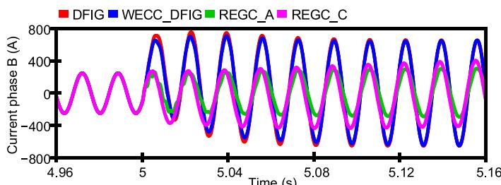

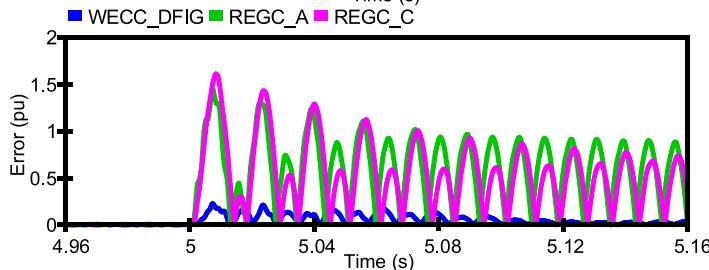  
Fig. 16. Phase B current and error relative to DFIG during 2-phase fault at BUS3.

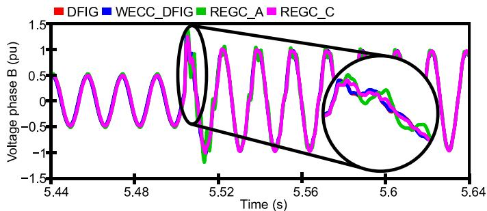

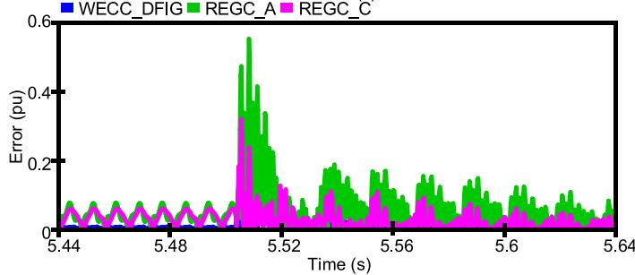  
Fig. 17. Phase B voltage and error relative to DFIG during 2-phase fault at BUS3.

shown in Fig. 18 (REGC_A and REGC_C lack the DC link). Both models exhibit similar behavior and represent the double-fundamental frequency oscillations caused by the unbalance. WECC-DFIG model oscillations are slightly higher.

# 4.3. 1-phase fault

A single-phase fault is applied at BUS3 for 150 ms. The active and reactive powers and positive sequence voltage of different models are shown in Fig. 19. All models generally follow the EMT library DFIG waveforms, although some deviations are observed at fault recovery. The reactive power of the proposed WECC-DFIG model is closer to the reference than REGC_A and REGC_C.

Instantaneous voltage and current of the faulted phase A and the corresponding errors relative to EMT library DFIG are shown in Figs. 20 and 21. The proposed WECC-DFIG model waveforms have the smallest deviation from the reference, compared to the REGC_A and REGC_C models. Contrary to previous cases, REGC_A and REGC_C models do not significantly overestimate the voltages at fault recovery since a relatively distant 1-phase fault is a small disturbance.

# 4.4. Voltage regulation test

In this test, all models are set to voltage control mode with 2 % droop on reactive power. A voltage step of 1 % is applied at 10 s. The reactive powers and voltage at the POI of all models are shown in Figs. 22 and 23 respectively. All models exhibit very similar behavior and follow the

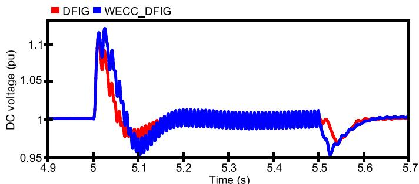  
Fig. 18. DC voltage during 2-phase fault at BUS3.

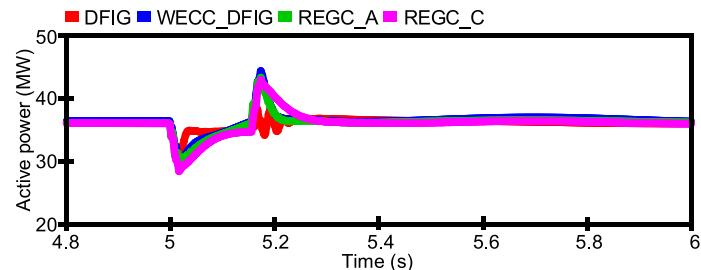

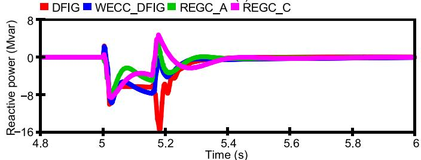

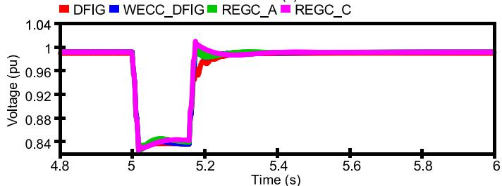  
Fig. 19. POI powers and voltage during a 1-phase fault at BUS3.

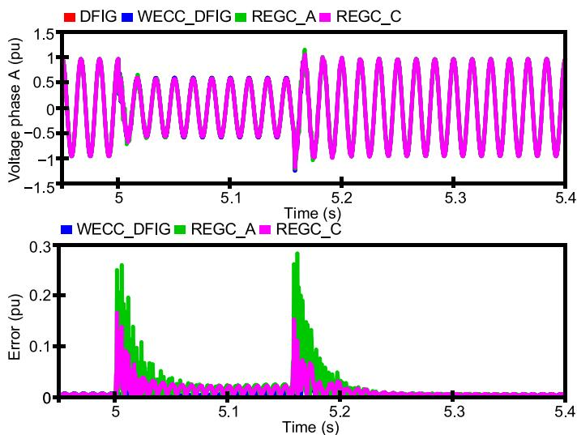  
Fig. 20. Phase A voltage and error relative to DFIG during 1-phase fault at BUS3.

reference model closely. This is the expected behavior since the test is performed in balanced conditions and represents a slow transient.

# 4.5. Timings

In this test, the discussed wind park models were simulated for 1 s without faults. The CPU times (1-core) required to perform the simulations are given in Table 2. It can be seen that the proposed WECC-DFIG model is slower than REGC_A and REGC_C models and is on par with the EMT library DFIG model, which is expected because the accurate representation of the electrical machine requires solving more equations.

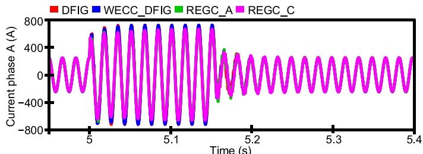

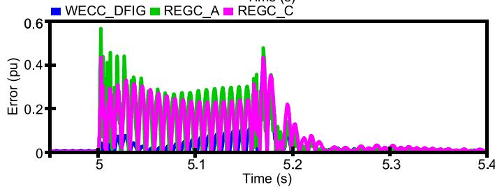  
Fig. 21. Phase A current and error relative to DFIG during 1-phase fault at BUS3.

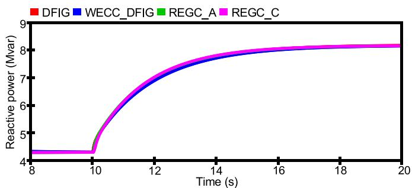  
Fig. 22. Wind park reactive power during voltage step.

# 5. Conclusions

The paper presented a WECC-DFIG model suitable for electromagnetic transient simulations, which is obtained by combining the highlevel control from the generic WECC wind park model and the inner control as well as the electrical system from the EMT library DFIG model. The resulting model allows to simulate transients with high level of accuracy and has an interface that uses the same parameters as the generic WECC model. This allows to directly replace the WECC models in a network by the proposed WECC-DFIG model without re-tuning, thus allowing for an easier database migration from RMS to EMT. The proposed model purposefully inherits high-level control of the existing generic WECC model in an attempt to bridge the gap between RMS and EMT models while providing more accurate simulation results.

Performed simulation studies demonstrated that the proposed model follows well the responses of the reference EMT library DFIG model while using the same settings as the WECC model in balanced and unbalanced conditions, during slow and fast transients, including the initiation of the fault and during fault recovery. The REGC_A and REGC_C WECC models match with the detailed reference model best in slow balanced transients and in steady-state before and after the fault. The proposed WECC-DFIG model has consistently demonstrated considerably smaller deviations in instantaneous voltages and currents from the reference model in all performed fault tests compared to the original WECC model, thus confirming its improved accuracy.

# CRediT authorship contribution statement

Anton Stepanov: Writing – original draft, Visualization, Methodology, Investigation, Conceptualization. Hossein Ashourian: Writing –

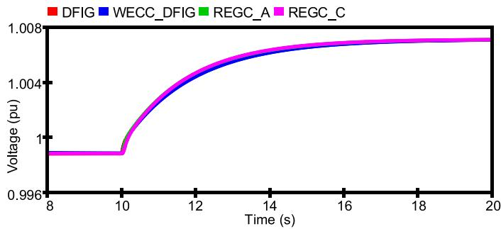  
Fig. 23. POI voltage during voltage step.

Table 2   
Timings.   

<table><tr><td>Model</td><td>Time, s</td></tr><tr><td>EMT library DFIG</td><td>6.6</td></tr><tr><td>Proposed WECC-DFIG</td><td>6.3</td></tr><tr><td>WECC with REGC_A</td><td>2.5</td></tr><tr><td>WECC with REGC_C</td><td>2.3</td></tr></table>

review & editing, Methodology, Investigation, Conceptualization. Henry Gras: Writing – review & editing, Conceptualization. Jean Mahseredjian: Supervision, Resources.

# Declaration of competing interest

The authors declare that they have no known competing financial interests or personal relationships that could have appeared to influence the work reported in this paper.

# Data availability

No data was used for the research described in the article.

# References

[1] P. Catalan, Y. Wang, J. Arza, Z. Chen, A comprehensive overview of power converter applied in high-power wind turbine: key challenges and potential solutions, IEEE Trans. Power Electron. 38 (5) (2023) 6169–6195, https://doi.org/ 10.1109/TPEL.2023.3234221.   
[2] T. Telsnig, Wind Energy - Technology Development Report 2020, Publications Office of the European Union, 2020, https://doi.org/10.2760/742137.   
[3] C.C.W. Chang, T.J. Ding, T.J. Ping, K.C. Chao, M.A.S. Bhuiyan, Getting more from the wind: recent advancements and challenges in generators development for wind turbines, Sustain. Energy Technol. Assess. 53 (2022) 102731.   
[4] E. Tapoglou, et al., Clean energy technology observatory: wind energy in the european union - 2023 status report on technology development, trends, value chains and markets, Publications Office of the European Union, 2023, https://doi.   
[5] P. Ledesma, J. Usaola, Doubly fed induction generator model for transient stability analysis, IEEE Trans. Energy Convers. 20 (2) (2005) 388–397, https://doi.org/ 10.1109/TEC.2005.845523.   
[6] T. Kauffmann, U. Karaagac, I. Kocar, S. Jensen, J. Mahseredjian, E. Farantatos, An accurate type III wind turbine generator short circuit model for protection applications, IEEE Trans. Power Deliv. 32 (6) (2017) 2370–2379, https://doi.org/ 10.1109/TPWRD.2016.2614620.   
[7] D.N. Hussein, M. Matar, R. Iravani, A wideband equivalent model of type-3 wind power plants for EMT studies, IEEE Trans. Power Deliv. 31 (5) (2016) 2322–2331, https://doi.org/10.1109/TPWRD.2016.2551287.   
[8] M. Liu, et al., An electromagnetic transient analysis model for DFIG considering LVRT hardware protection, IEEE Access 9 (2021) 32591–32598, https://doi.org/   
[9] A. Honrubia-Escribano, E. Gomez-L´ ´azaro, J. Fortmann, P. Sørensen, S. Martin-Martinez, Generic dynamic wind turbine models for power system stability

analysis: a comprehensive review, Renew. Sustain. Energy Rev. 81 (2018) 1939–1952, https://doi.org/10.1016/j.rser.2017.06.005, 2018/01/01/.   
[10] A.I. Estanqueiro, A dynamic wind generation model for power systems studies, IEEE Trans. Power Syst. 22 (3) (2007) 920–928, https://doi.org/10.1109/ TPWRS.2007.901654.   
[11] L. Lin, J. Zhang, Y. Yang, Comparison of pitch angle control models of wind farm for power system analysis, in: 2009 IEEE Power & Energy Society General Meeting, 26-30 July 2009, 2009, pp. 1–7, https://doi.org/10.1109/PES.2009.5275517.   
[12] M. Zou, Y. Wang, C. Zhao, J. Xu, X. Guo, X. Sun, Integrated equivalent model of permanent magnet synchronous generator based wind turbine for large-scale Offshore wind farm simulation, J. Mod. Power Syst. Clean Energy. 11 (5) (2023) 1415–1426, https://doi.org/10.35833/MPCE.2022.000495.   
[13] D.N. Hussein, M. Matar, R. Iravani, A type-4 wind power plant equivalent model for the analysis of electromagnetic transients in power systems, IEEE Trans. Power Syst. 28 (3) (2013) 3096–3104, https://doi.org/10.1109/TPWRS.2012.2227845.   
[14] S. Shah, I. Vieto, H. Nian, J. Sun, Real-time simulation of wind turbine convertergrid systems, in: 2014 International Power Electronics Conference (IPEC-Hiroshima 2014 - ECCE ASIA), 18-21 May 2014, 2014, pp. 843–849, https://doi. org/10.1109/IPEC.2014.6869686.   
[15] Z. Maheshwari, K. Kengne, O. Bhat, A comprehensive review on wind turbine emulators, Renew. Sustain. Energy Rev. 180 (2023) 113297, https://doi.org/ 10.1016/j.rser.2023.113297, 2023/07/01/.   
[16] EPRI, "WECC Type 3 wind turbine generator model - Phase II," 2014.   
[17] EPRI, "Model User Guide For Generic Renewable Energy System Models," Palo Alto, CA, USA, 2023, vol. 3002027129.   
[18] IEC, "Wind energy generation systems - part 27-1: electrical simulation models - generic models," 2020.   
[19] A. Lorenzo-Bonache, A. Honrubia-Escribano, J. Fortmann, E. Gomez-L ´ azaro,´ Generic type 3 WT models: comparison between IEC and WECC approaches, IET Renew. Power Gener. 13 (7) (2019) 1168–1178.   
[20] R. Villena-Ruiz, A. Honrubia-Escribano, J. Fortmann, E. Gomez-L´ azaro, ´ Field validation of a standard type 3 wind turbine model implemented in DIgSILENT-PowerFactory following IEC 61400-27-1 guidelines, Int. J. Electr. Power Energy Syst. 116 (2020) 105553, https://doi.org/10.1016/j.ijepes.2019.105553, 2020/ 03/01/.   
[21] M. Jin, Z. Dawei, Y. Liangzhong, Q. Minhui, Y. Koji, Z. Lingzhi, Analysis on application of a current-source based DFIG wind generator model, CSEE J. Power Energy Syst. 4 (3) (2018) 352–361, https://doi.org/10.17775/ CSEEJPES.2018.00060.   
[22] I.A. Hiskens, Dynamics of type-3 wind turbine generator models, IEEE Trans. Power Syst. 27 (1) (2012) 465–474, https://doi.org/10.1109/ TPWRS.2011.2161347.   
[23] W.W. Price, J.J. Sanchez-Gasca, Simplified wind turbine generator aerodynamic models for transient stability studies, in: 2006 IEEE PES Power Systems Conference and Exposition, 29 Oct.-1 Nov. 2006, 2006, pp. 986–992, https://doi.org/10.1109/ PSCE.2006.296446.   
[24] Z. Zhou, W. C, L. Ge, Operation of stand-alone microgrids considering the load following of biomass power plants and the power curtailment control optimization of wind turbines, IEEE Access 7 (2019) 186115–186125, https://doi.org/10.1109/ ACCESS.2019.2958678.   
[25] L. Bird, et al., Wind and solar energy curtailment: a review of international experience, Renew. Sustain. Energy Rev. 65 (2016) 577–586, https://doi.org/ 10.1016/j.rser.2016.06.082, 2016/11/01/.   
[26] A. Gambier, Control of Large Wind Energy Systems, Springer, 2022.   
[27] J. Mahseredjian, S. Denneti`ere, L. Dub´e, B. Khodabakhchian, L. G´erin-Lajoie, On a new approach for the simulation of transients in power systems (in English), Electr. Power Syst. Res. 77 (11) (Sep. 2007) 1514–1520, https://doi.org/10.1016/j. epsr.2006.08.027.   
[28] HydroQuebec, "Technical Requirements for the Connection of Generating Stations to the Hydro-Qu´ebec Transmission System," QC, Canada, 2022.   
[29] HydroQuebec, "General Validation Test Program for Wind Power Plants Connected to the Hydro-Qu´ebec Transmission System," QC, Canada, 2011.   
[30] M. Asmine, C.-E. ´ Langlois, Wind power plants grid code compliance tests – Hydro-Qu´ebec TransEnergie ´ experience, IET Renew. Power Gener. 11 (3) (2017) 202–209, https://doi.org/10.1049/iet-rpg.2016.0252.   
[31] U. Karaagac, H. Ashourian, A. Stepanov, H. Gras, J. Mahseredjian, Wind park and Wind turbine models in EMTP®, EMTP Softw. Doc. (2021).   
[32] U. Karaagac, et al., A generic EMT-type model for wind parks with permanent magnet synchronous generator full size converter wind turbines, IEEE Power Energy Technol. Syst. J. 6 (3) (2019) 131–141, https://doi.org/10.1109/ JPETS.2019.2928013.   
[33] Y. Chang, I. Kocar, E. Farantatos, A. Haddadi, M. Patel, Short-circuit modeling of DFIG-based WTG in sequence domain considering various fault- ride-through requirements and solutions, IEEE Trans. Power Deliv. 38 (3) (2023) 2088–2100, https://doi.org/10.1109/TPWRD.2023.3235985.   
[34] EPRI, "Impact of Renewables on System Protection: Short-Circuit Phasor Models of Converter Interfaced Renewable Resources and Performance of Transmission Line Distance Protection," Palo Alto, CA, USA, 2015, vol. 3002005765.