# Fast Voltage-Balancing Control and Fast Numerical Simulation Model for the Modular Multilevel Converter

Feng Yu, Weixing Lin, Member, IEEE, Xitian Wang, Member, IEEE, and Da Xie, Member, IEEE

Abstract—A methodology of fast voltage-balancing control based on average comparison and a fast numerical simulation model for the modular multilevel converter are proposed. In each control cycle, the average voltage of all the submodules (SMs) in an arm is calculated. The switching state of each SM will be determined by comparing the capacitor voltage of each SM with this average value. Little sorting of the capacitor voltages is required; therefore, the calculation burden on the controller is significantly reduced. The previous switching state of each SM will be mostly retained. Two variables and are introduced to adjust the equivalent switching frequency of each SM. Simulation results verified the effectiveness of the proposed voltage-balancing control in normal and fault conditions. A fast numerical simulation model for MMC on PSCAD/EMTDC is also proposed. The dynamics of each SM are sufficiently represented in the proposed model. A hybrid simulation model is further developed to incorporate the detailed switching dynamics of specific interested SMs. The simulation results show that the proposed models give almost identical results as the detailed switching models while the simulation speed of the proposed model is approximately 5000 times faster than the detailed switching model.

Index Terms—Electromagnetic transients (EMT) simulation, HVDC transmission, modular multilevel converter (MMC), nearest level control, voltage-balancing control.

# I. INTRODUCTION

HE MODULAR multilevel converter (MMC) has been making its way toward wide applications in mediumand high-voltage fields [1]–[6]. The converter arm of an MMC is constructed by series connection of a number of submodules (SMs). The typical dc voltage rating for a half-bridge SM (HBSM) is 2 kV. To make the dc voltage level of MMC suitable for HVDC transmission, hundreds of SMs are required to be connected in series [1]–[6]. The Trans Bay Cable Project, as an example, employs 216 SMs per arm for 200-kV dc voltage.

Manuscript received December 26, 2013; revised July 10, 2014; accepted August 15, 2014. This paper was supported by the National Natural Science Foundation of China (51277119). Paper no. TPWRD-01456-2013.

F. Yu, X. Wang, and D. Xie are with the School of Electronic and Electrical Engineering, Shanghai Jiaotong University, Shanghai 200240, China (e-mail: darall@sjtu.edu.cn; x.t.wang@sjtu.edu.cn; xieda@sjtu.edu.cn).

W. Lin is with the School of Electrical and Electronic Engineering, Huazhong University of Science and Technology, Wuhan 430074, China, and also with the School of Engineering, University of Aberdeen, Aberdeen AB24 3UE, U.K. (e-mail: weixinglin@foxmail.com; weixinglin@abdn.ac.uk).

Color versions of one or more of the figures in this paper are available online at http://ieeexplore.ieee.org.

Digital Object Identifier 10.1109/TPWRD.2014.2351397

The large number of SMs (therefore power-electronic devices) in an MMC brings challenges to the simulation and control of MMC as follows.

1) Electromagnetic transient simulation are usually adopted to study the dynamic of MMCs. As the number of powerelectronic switches increases, the simulation speed of the MMC becomes extremely low, typically one week for 5-s dynamics for a 201-level MMC.

2) Excessive computation is required in the controller of the MMC if typical voltage-balancing control based on voltage sorting is adopted.

A number of simplified/equivalent model of MMC have been proposed in the literature [3]–[8] that could significantly increase the simulation speed of MMC.

A continuous model was proposed in [3] where the total output voltage of the SMs in each arm is represented by a controlled voltage source. The output characteristics and the circulating current could be well represented by the model of [3]. However, the dynamics of each SM are not represented.

Reference [4] presented a modeling method of MMC that is mathematically identical to the detailed switching models in PSCAD/EMTDC. Each arm of the MMC is modelled as a single 2-node element and interfaced with the electromagnetic transient (EMT) solver in order to solve the MMC and external networks simultaneously. The drawback of this method in [4] is that the method needs to change the source code of PSCAD/ EMTDC to interface with the EMT solver, which is inaccessible to the public. Therefore, the method of [4] is not user friendly. Users can only use the few preset functions of the modeling component set by the developers.

Reference [5] proposed an average value model of the MMC that simplified each arm to a controlled voltage source. Similar to the method of [3], the dynamics of each SM are also not represented.

Reference [6] proposed an accelerated model of MMC based on the idea that inverting several small matrices is much faster than inverting one big matrix of the same dimension due to the total dimension of all small matrices [7]. In [6], each SM is modelled by an independent circuit supplied with the same current source with the current magnitude equal to arm current. Since each SM is still represented by a detailed switching model, simulation speed is slower than the model of [4].

Reference [8] gave a summary and comparison of the available simplified/equivalent model for MMC.

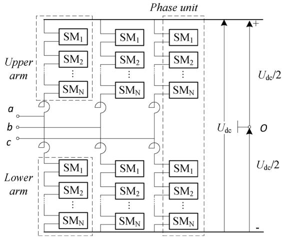  
Fig. 1. Basic structure of the MMC.

This paper proposes further progress on this field, aiming at developing a simplified model of MMC that is of similar accuracy as detailed switching model, with simulation speed similar to [4] and in the meantime user friendly.

Modulation methods of MMC can be classified into two categories: 1) the pulsewidth modulation (PWM) at a high switching frequency and staircase modulation at the low switching frequency [9]–[12]. Due to its lower equivalent switching frequency, the nearest-level modulation (NLM) is one of the preferred methods among the staircase modulations.

Voltage-balancing control is one of the key functions of a controller for MMC. Most of the existing voltage-balancing algorithms are based on the capacitor voltage sorting [4]–[6], [10]–[12]. The sorting of the capacitor voltages will consume a large amount of computation time on the central controller. To improve the efficiency of voltage-balancing control, the voltage-balancing control is only executed once the required number of on-state SMs of an arm changes [8], [11], [12].

There has been great interest in developing the dc/dc converter for use in future dc grids [13]–[15]. A general concept for the high-voltage dc/dc converter is to use dc/ac/dc conversion. The high-frequency ac circuit is likely to be used inside dc/ac/dc conversion to reduce the size of the dc/dc converter.

Because of its superior advantages over two- and three-level VSC converters, the MMC will be likely to realize the ac/dc transformation in those dc/dc converters. The voltage sorting in voltage-balancing control will become rather cumbersome in MMC if the voltage sorting needs to be executed frequently in those high-frequency dc/dc converters with a frequency up to several kilohertz [13]–[15].

To reduce the calculation burden on the controller of an MMC, voltage-balancing control based on the average comparison is proposed.

# II. BASIC OPERATING PRINCIPLES OF MMC

# A. Topology of MMC

Fig. 1 shows the topology of a three-phase MMC. A three-phase MMC consists of three-phase units and six con-

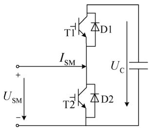  
Fig. 2. Structure of a general half-bridge SM.

verter arms. Each arm has SMs (denoted as $\mathrm { S M _ { 1 } { - } S M _ { N } ) }$ i n series. An upper arm and a lower arm comprise a phase unit.

Fig. 2 shows the circuit diagram of the half-bridge SM (HBSM), which is comprised by two insulated-gate bipolar transistors insulated-gate bipolar transistors (IGBTs) $( T _ { 1 }$ and $T _ { 2 } )$ , two antiparallel diodes $( D _ { 1 }$ and $D _ { 2 } )$ , and a dc capacitor.

# B. Working Principle of a Submodule

A switching state $S _ { C }$ is defined to determine the operating state of an SM. In steady state, $S _ { C } = 1$ if the upper IGBT $T _ { 1 }$ is triggered and $T _ { 2 }$ is blocked. The output voltage of the SM in such casees is $U _ { \mathrm { S M } } = S _ { C } * U _ { C } = U _ { C }$ . Similarly, $S _ { C } = 0$ i f $T _ { 1 }$ is blocked and $T _ { 2 }$ is triggered. The output voltage of the SM becomes $U _ { \mathrm { S M } } = S _ { C } * U _ { C } = 0$ .

From the aforementioned analysis, we can use the following equation to describe the switching state of an SM shown in Fig. 2:

$$
U _ {\mathrm {S M}} = S _ {C} * U _ {C} \left(S _ {C} = 0, 1\right). \tag {1}
$$

# III. FAST NUMERICAL SIMULATION MODEL OF THE MMC

# A. Modeling of Power-Electronic Switches in the Proposed Model

By linearizing the onstate characteristic curve of an IGBT or the forward characteristic curve of a diode, the voltage across a power-electronic switch can be approximated by [16] and [17]

$$
U _ {\text {c o n , x}} = R _ {\text {c o n , x}} * I _ {\mathrm {S M}} + U _ {\mathrm {F D}, \mathrm {x}} \tag {2}
$$

where $I _ { \mathrm { S M } }$ is the current through the semiconductor, $U _ { \mathrm { F D } }$ and $R _ { \mathrm { c o n } }$ are the onstate threshold voltage and onstate resistance of the power switch, and denotes the device type (i.e., IGBT or diode).

Equation (2) is quite similar to the modeling of the powerelectronic device in PSCAD/EMTDC. In PSCAD/EMTDC , power-electronic devices are mainly represented as a two-state resistive switch $( R _ { \mathrm { O N } }$ and $R _ { \mathrm { O F F } } )$ and a forward voltage drop $( U _ { \mathrm { F D } } )$ in series[7]. The offstate resistance $R _ { \mathrm { O F F } }$ is typically set to a much higher value, such as $\mathrm { 1 e ^ { 6 } }$ compared with the typical value $\mathrm { 1 e ^ { - 2 } }$ of the onstate resistance $R _ { \mathrm { O N } } .$ , so the power-electronic switch can be simplified to an open circuit in the offstate while $R _ { \mathrm { O N } }$ and $U _ { \mathrm { F D } }$ of the power-electronic modelling components provided in PSCAD/EMTDC are set by using exactly the same methods as the $R _ { c o n , x }$ and $U _ { F D , x }$ in (2).

Other parameters, such as forward break over voltage, minimum extinction time, etc. are also considered in the detailed switching modelling in PSCAD/EMTDC. However, these parameters will not have a significant impact on the operation of a power-electronic switch from the grid point of view and will not be considered in the proposed model.

# B. Modeling of SMs and Arm in the Proposed Model

The voltage of the dc capacitor of an SM at time step can be calculated by [4]

$$
U _ {C} (t) = U _ {C} (t - \Delta t) + \frac {S _ {C}}{C} \int_ {t - \Delta T} ^ {t} I _ {S M} (\tau) d \tau \tag {3}
$$

where $\Delta t$ is the simulation step, $U _ { C } ( t )$ represents the capacitor voltage at the present time step , and ${ U _ { C } ( t - \Delta t ) }$ represents the capacitor voltage of the previous time step. Equation (3) will be solved using the trapezoidal integration method in the numerical model, namely

$$
U _ {C} (t) = U _ {C} (t - \Delta T) + \frac {S _ {C}}{C} \frac {I _ {\mathrm {R M}} (t) + I _ {\mathrm {R M}} (t - \Delta T)}{2} \Delta T. \tag {4}
$$

The output voltage of an SM is then calculated by

$$
U _ {\mathrm {S M} - i} = U _ {\text {c o n} - i} + U _ {C - i} * S _ {C - i} \tag {5}
$$

where $S _ { C , i }$ is the operating state of the th SM defined in (1), $U _ { C , i }$ is the capacitor voltage calculated by (4), and $U _ { \mathrm { c o n } _ { - } i }$ is the voltage across the conducting power-electronic switch by (2).

The voltage $U _ { \mathrm { c o n } , i }$ varies with the switching state and direction of arm current. It is summarized in the following equation for HBSM:

$$
\begin{array}{l} U _ {\text {c o n} - i} \\ = \left\{ \begin{array}{l} R _ {\text {c o n}, \text {d i o d e}} \cdot I _ {\mathrm {S M}} + U _ {\mathrm {F D}, \text {d i o d e}}, I _ {\mathrm {S M}} > 0 \text {a n d} S _ {C} = 1 \\ R _ {\text {c o n}, \text {i g b t}} \cdot I _ {\mathrm {S M}} - U _ {\mathrm {F D}, \text {i g b t}}, I _ {\mathrm {S M}} <   0 \text {a n d} S _ {C} = 1 \\ R _ {\text {c o n}, \text {i g b t}} \cdot I _ {\mathrm {S M}} + U _ {\mathrm {F D}, \text {i g b t}}, I _ {\mathrm {S M}} > 0 \text {a n d} S _ {C} = 0 \\ R _ {\text {c o n}, \text {d i o d e}} \cdot I _ {\mathrm {S M}} - U _ {\mathrm {F D}, \text {d i o d e}}, I _ {\mathrm {S M}} <   0 \text {a n d} S _ {C} = 0 \end{array} . \right. \end{array} \tag {6}
$$

The output voltage of an arm is the sum of outputs of all SMs

$$
U _ {\mathrm {R M}} = \sum_ {i = 1} ^ {N} U _ {\mathrm {S M} - i} = \sum_ {i = 1} ^ {N} \left(U _ {\text {c o n} - i} + U _ {C - i} * S _ {C - i}\right). \tag {7}
$$

Fig. 3 shows the schematic of the proposed numerical calculation model. Six numerical calculation components are used to calculate the dynamics of the SMs in six arms of a threephase MMC. The numerical calculation component takes the switching state of each SM $\left( S _ { C \left( 1 : \mathrm { N } \right) } \right)$ and the arm current $I _ { \mathrm { R M } }$ as inputs. The outputs of the component are the capacitor voltages of all SMs for voltage-balancing control $[ U _ { C \left( 1 : \mathrm { N } \right) }$ calculated according to (4)] and arm voltage for the controlled voltage source [ , calculated according to (5)–(7)].

The proposed numerical simulation model is implemented by using a user-defined component with FORTRAN code in

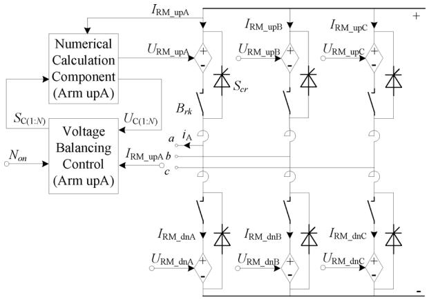  
Fig. 3. Schematic of the proposed numerical simulation model.

PSCAD/EMTDC. Fig. 3 only displays the numerical calculation component and the voltage-balancing control for the upper arm of Phase A for convenience; the other five arms also include similar components.

The voltage-balancing control takes the capacitor voltages $U _ { C \left( 1 : \mathrm { N } \right) }$ , the arm current $I _ { \mathrm { R M } }$ , and the number $( N _ { \mathrm { o n } } )$ of desired onstate SMs as inputs. The outputs of the voltage-balancing control are the switching state of each SM $( S _ { C ( 1 : N ) } )$ .

During dc faults, all of the IGBTs of the MMC should be blocked and MMC functions as a three-phase diode bridge. To simulate the blocking situation, switches $( B _ { \mathrm { r k } } )$ and thyristors $( S _ { \mathrm { c r } } )$ are added in the numerical simulation model, referring to the modeling method presented in [5]. The controlled voltage sources, which represent the output voltage of each arm, are disconnected by the series switches, while the parallel thyristors are persistently triggered after the blocking of IGBTs to make the MMC function as a three-phase diode bridge.

Since the capacitor voltage and the firing pulses of each SM are retained in the proposed numerical calculation component, the proposed model can be used extensively in fields, such as research of voltage-balancing control, design of the modulation methods, harmonic analysis, loss analysis, etc. We can envisage that the performance of the proposed model will be in high accordance with the detailed switching model except the switching dynamic of each SM.

# C. Hybrid Simulation Model

To represent the detailed switching dynamics of specific interested SMs, a hybrid simulation model as shown in Fig. 4 is proposed. Fig. 4 shows an arm schematic of the proposed hybrid simulation model. Suppose we are interested in observing the detailed switching dynamics of an $\mathrm { S M _ { j } }$ , the $\mathrm { S M _ { j } }$ will be modelled using the detailed switching model, as shown inside the dashed box of Fig. 4.

A controlled current source $I _ { \mathrm { R M } }$ is connected at the terminal of $S M _ { \mathrm { j } }$ to represent the arm current. The capacitor voltage and the output of $S M _ { \mathrm { j } }$ will not be calculated inside the numerical calculation component but directly using the measured capacitor voltage $U _ { C j }$ and the terminal voltage $U _ { S M j }$ from the detailed switching model.

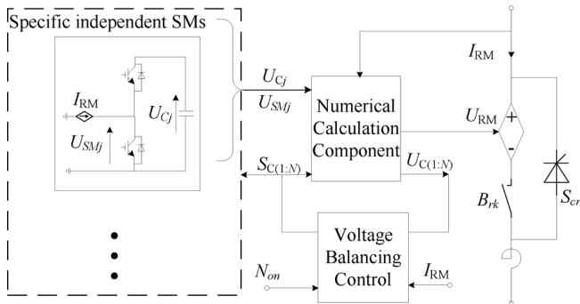  
Fig. 4. Schematic of the proposed hybrid simulation model.

# IV. VOLTAGE-BALANCING ALGORITHM BASED ON AVERAGE COMPARISON

# A. Nearest Level Modulation

The nearest-level modulation (NLM) is usually used to determine the number of SMs that need to be switched on in order to make the ac terminal voltage of a phase unit approximate the desired voltage $u _ { \mathrm { r e f } }$ [4]–[12].

Equation (8) gives the desired onstate SMs on the upper arm and lower arm under a given sinusoidal reference voltage $u _ { \mathrm { r e f } }$ $n _ { \mathrm { u } }$ and $n _ { d }$ represent the onstate number of SMs in the upper arm and lower arm, respectively

$$
\left\{ \begin{array}{l} n _ {\mathrm {u}} = \frac {N}{2} - \operatorname {r o u n d} \left(\frac {u _ {\text {r e f}}}{U _ {C 0}}\right) \\ n _ {d} = \frac {N}{2} + \operatorname {r o u n d} \left(\frac {u _ {\text {r e f}}}{U _ {C 0}}\right) \end{array} \right. \tag {8}
$$

where is the nearest integer of . $U _ { C 0 }$ is the rated capacitor voltage of each SM. The NLM ensures that the difference between the actual output voltage and $u _ { \mathrm { r e f } }$ stays within $\pm U _ { C 0 } / 2$ .

# B. Basic Idea of the Proposed Voltage Balancing Based on Average Comparison

The NLM only determines the number of desired onstate SMs in an arm but does not determine which specific SMs need to be switched on. So a balancing control algorithm (BCA) needs to be employed to determine the switching state of each SM [4]–[6], [8].

A common idea of traditional BCA is to measure capacitor voltages at each time instant and sort them in descending order. Take the upper arm as an example, if $I _ { \mathrm { R M } } > 0$ , the $n _ { \mathrm { u } }$ SMs at the bottom of the sorted list will be switched on so that these $n _ { \mathrm { u } }$ SMs with the lowest voltages will be charged up and increase their capacitor voltages. Similarly, if $I _ { \mathrm { R M } } < 0$ , the $n _ { \mathrm { u } }$ SMs at the top of the sorted list will be switched on so that these $n _ { \mathrm { u } }$ SMs with the highest voltages will be discharged and reduce their capacitor voltages [11].

The voltage sorting in the traditional BCA will consume a large portion of the computation resources. To improve the efficiency of the BCA, the BCA will be activated only when $n _ { \mathrm { u } }$ or $n _ { d }$ changes [4], [5], [8], [12].

To further improve the efficiency of BCA, a BCA with significantly fewer sorting compared with the traditional BCA is

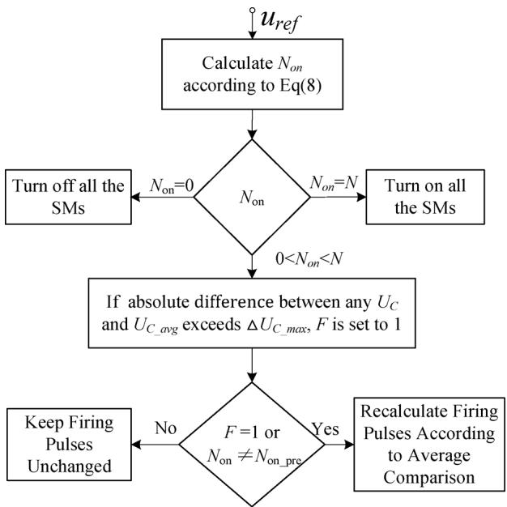  
Fig. 5. Flowchart of the proposed voltage balancing based on average comparison.

proposed in this paper. Fig. 5 shows the flowchart of the proposed BCA based on average comparison.

The number of SMs that need to be switched on $( N _ { \mathrm { o n } } )$ in the present control cycle will be calculated according to (8). If $N _ { \mathrm { o n } }$ is equal to 0, all of the SMs in the arm will be switched off. If $N _ { \mathrm { o n } }$ is equal to $N _ { ; }$ , all of the SMs in the arm will be switched on. If $N _ { \mathrm { o n } }$ is between 0 and , more determination logic is required to decide whether the firing pulse of each SM needs to be recalculated.

The average voltage $U _ { C _ { \mathrm { - a v g } } }$ of all the capacitor voltages in an arm will be calculated in each control cycle. If the absolute difference between any capacitor voltage and $U _ { C _ { \mathrm { - a v g } } }$ is greater than the defined maximum difference $\Delta U _ { C , \mathrm { { m a x } } } ,$ a flag $F$ is set to 1 and the firing pulses need to be recalculated.

Alternatively, if $N _ { \mathrm { o n } }$ is different from the number of onstate SMs in the previous control cycle $( N _ { \mathrm { o n \_ p r e } } )$ , the firing pulses will also be recalculated.

# C. Calculating Firing Pulses Based on Average Comparison

Fig. 6 shows the procedures of calculating firing pulses based on average comparison. Two arrays idx and idx2 are used to record the sequence of SMs.

The sequence of the previous control cycle is stored in idx while the sequence of the present control cycle will be calculated and stored in idx2. The first $N _ { \mathrm { o n - p r e } }$ SMs recorded in idx were switched on in the previous control cycle while the first $N _ { \mathrm { o n } }$ SMs with the index recorded in the idx2 will be switched on in the present control cycle.

In each control cycle, all of the capacitor voltages will be measured, and the average voltage of all the capacitors of each arm $U _ { C \_ a v g }$ will be calculated. A threshold value $\Delta U _ { C , \mathrm { s o r t } }$ is defined for comparison.

If the arm current is in the direction of charging the SM (i.e., $I _ { \mathrm { R M } } > 0 )$ , the reference value for comparison is defined as

$$
U _ {C - \text {r e f}} = U _ {C - \text {a v g}} + \Delta U _ {C - \text {s o r t}}. \tag {9}
$$

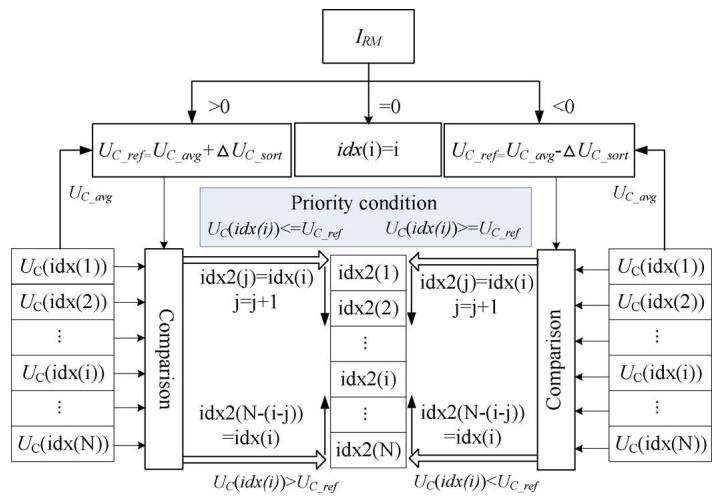  
Fig. 6. Calculation of the firing pulses.

The priority for each SM to be switched on in the case of $I _ { \mathrm { R M } } > 0$ is

$$
U _ {C} (i d x (i)) \leq U _ {C - \text {r e f}}. \tag {10}
$$

Therefore, the will be stored into idx2 from forward to backward if (10) is satisfied. Otherwise, if $U _ { C } ( i d x ( i ) ) ~ >$ $U _ { C , \mathrm { r e f } } , i d x ( i )$ will be stored into idx2 from backward to forward.

If the arm current is in the direction of discharging the SM $( \mathrm { i . e . , } I _ { \mathrm { R M } } < 0 )$ , the reference value for comparison is defined as

$$
U _ {C - \text {r e f}} = U _ {C - \text {a v g}} - \Delta U _ {C - \text {s o r t}}. \tag {11}
$$

The priority for each SM to be switched on in the case of $I _ { \mathrm { R M } } < 0$ is

$$
U _ {C} (i d x (i)) \geq U _ {C - \text {r e f}}. \tag {12}
$$

Therefore, the $i d x ( i )$ will be stored into idx2 from forward to backward if (12) is satisfied. Otherwise, if $U _ { C } ( i d x ( i ) ) ~ < ~ U _ { C \mathrm { - r e f } }$ , will be stored into idx2 from backward to forward.

From the aforementioned analysis, we can see that if the firing pulses should be recalculated, there needs times of comparison operation for calculating the flag $F \left( { \mathrm { F i g . ~ } } 5 \right)$ and times comparing operations for calculating the priority condition according to Fig. 6. The total comparing operation is while the required comparing operation of the traditional BCA as proposed in [18] is $N ( N - 1 ) / 2$ . The required calculation of the proposed BCA is significantly lower than a traditional BCA.

Fig. 7 gives a demonstration of calculating the firing pulses for a 9-level MMC. The priority array idx is initialized as 1:8 before the system starts. The value of idx is supposed to be [4 $5 \mathrm { ~ l ~ } 3 \mathrm { ~ 6 ~ 2 ~ 8 ~ 7 ~ }$ in the th control cycle, where $[ 4 5 , \ldots , 7 ]$ denotes $\left[ S M _ { 4 } S M _ { 5 } , \ldots , S M _ { 7 } \right]$ . In the $( n + 1 ) \mathrm { t h }$ control cycle, $S M _ { 1 }$ and $S M _ { 2 }$ do not meet the priority condition while other SMs meet the priority condition. The calculated idx2 is shown

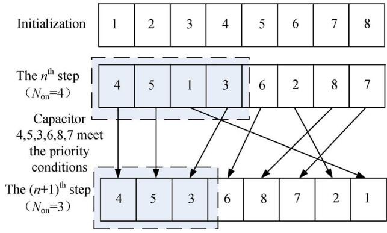  
Fig. 7. Demonstration of the calculating results.

TABLE I EQUIVALENT SWITCHING FREQUENCY VERSUS $\Delta U _ { C , \mathrm { { m a x } } }$ AND $\Delta U _ { C , \mathrm { s o r t } }$   

<table><tr><td>△UCmax(kV)△UCsort(kV)</td><td>0.1</td><td>0.2</td><td>0.3</td><td>0.5</td><td>1</td></tr><tr><td>0.05</td><td>284</td><td>214</td><td>195</td><td>195</td><td>195</td></tr><tr><td>0.1</td><td>214</td><td>173</td><td>147</td><td>136</td><td>136</td></tr><tr><td>0.2</td><td>119</td><td>119</td><td>118</td><td>105</td><td>93</td></tr><tr><td>0.3</td><td>86</td><td>86</td><td>86</td><td>85</td><td>75</td></tr></table>

at the bottom line of Fig. 7. Since three SMs are required to be switched on, the first three SMs recorded in idx2 $( S M _ { 4 } , S M _ { 5 } )$ , and $S M _ { 3 } )$ will be switched on.

With the aforementioned calculation mechanisms, the switching states of the SMs calculated in the previous control cycle will be mostly retained in the present control cycle. The equivalent switching frequency will be reduced as a result.

# D. Adjusting the Equivalent Switching Frequency

The two parameters $\Delta U _ { C , \mathrm { s o r t } }$ and $\Delta U _ { C , \mathrm { { m a x } } }$ are used to adjust the equivalent switching frequency. The equivalent switching frequency is defined as [19]

$$
f _ {\mathrm {s w}} = \frac {1}{2} \frac {n _ {\mathrm {s w}}}{N} \tag {13}
$$

where $n _ { \mathrm { s w } }$ is the total number of switching times of all the $T _ { 1 }$ (or $T _ { 2 } )$ in an arm, and is the number of SMs per arm.

Table I summarizes the changes of equivalent switching frequency with the changes of $\Delta U _ { C , \mathrm { { m a x } } }$ and $\Delta U _ { C , \mathrm { s o r t } }$ . These results are simulated on the study system which is presented in Section V and using a detailed switching model. The following conclusions are drawn from Table I.

1) If $\Delta U _ { C , \mathrm { s o r t } }$ is kept constant, increasing $\Delta U _ { C , \mathrm { { m a x } } }$ decreases the equivalent switching frequency.   
2) If $\Delta U _ { C , \mathrm { { m a x } } }$ is kept constant, increasing $\Delta U _ { C , s o r t }$ also decreases the equivalent switching frequency.   
3) If the $\Delta U _ { C , \mathrm { s o r t } }$ is greater than $\Delta U _ { C , \mathrm { { m a x } } }$ , the equivalent switching frequency is almost irrelevant to $\Delta U _ { C , \mathrm { { m a x } } }$ .   
4) $\Delta U _ { C , s o r t }$ has more of an impact on equivalent switching frequency than $\Delta U _ { C }$ .

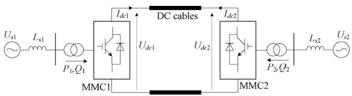  
Fig. 8. Circuit configuration of the studied system.

TABLE II PARAMETERS OF THE MMC CONVERTER   

<table><tr><td>Items</td><td>Values</td></tr><tr><td>Active Power P</td><td>600MW</td></tr><tr><td>Ac System Voltage Us1,Us2</td><td>220kV</td></tr><tr><td>Ac System Inductance Ls1,Ls2</td><td>43mH</td></tr><tr><td>DC Bus Voltage</td><td>±200kV</td></tr><tr><td>Length of DC cable</td><td>200km</td></tr><tr><td>Number of SMs per arm N</td><td>20</td></tr><tr><td>SM Capacitance</td><td>3000μF</td></tr><tr><td>SM Capacitor Voltage</td><td>20kV</td></tr><tr><td>Arm Inductance</td><td>0.04H</td></tr></table>

# V. PSCAD/EMTDC SIMULATION RESULTS

To verify the proposed numerical calculation model and the proposed voltage-balancing control, simulations are carried out in PSCAD/EMTDC. The circuit configuration of the studied system is shown in Fig. 8. Parameters of the MMC converter are listed in Table II. The dc line is modeled using a wideband line model [20]. The circulating current suppressing control (CCSC) proposed in [21] is adopted to suppress the circulating current. The proposed BCA is applied through this entire section except part , where the traditional BCA is also employed to be compared with the proposed BCA.

In total, three models of the MMC are developed and compared: the detailed switching model (traditional model), the proposed numerical calculation model, and the accelerated model of [6].

# A. Verifying the Accuracy of the Proposed Model Against the Detailed Switching Model

Fig. 9 compares the performance of the proposed numerical calculation model with the detailed switching model in steady state. From top to bottom are the average voltage and the number of onstate SMs of the upper arm in phase A of MMC1. We can see from Fig. 9 that the proposed numerical calculation model gives almost identical results as the detailed switching model in steady state.

Fig. 10 compares the proposed model with the detailed switching model during ac faults. A temporary three-phase-to-ground fault with a duration of 0.2 s is applied to the ac bus of MMC1 at 1 s. Fig. 10 shows the waveforms of the active power, reactive power, and phase A voltage of MMC1 from top to bottom. We can see from Fig. 10 that the proposed numerical calculating model still gives almost the same results as the detailed switching model during large transients, such as ac faults.

Fig. 11 compares the proposed model with the detailed switching model during a permanent pole-to-pole dc fault at

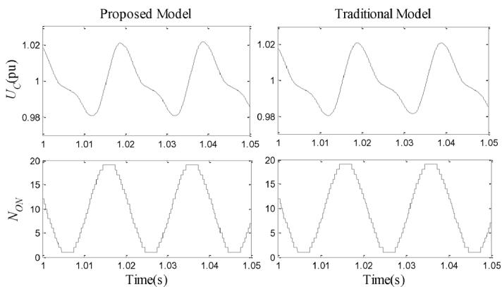  
Fig. 9. Steady-state comparison.

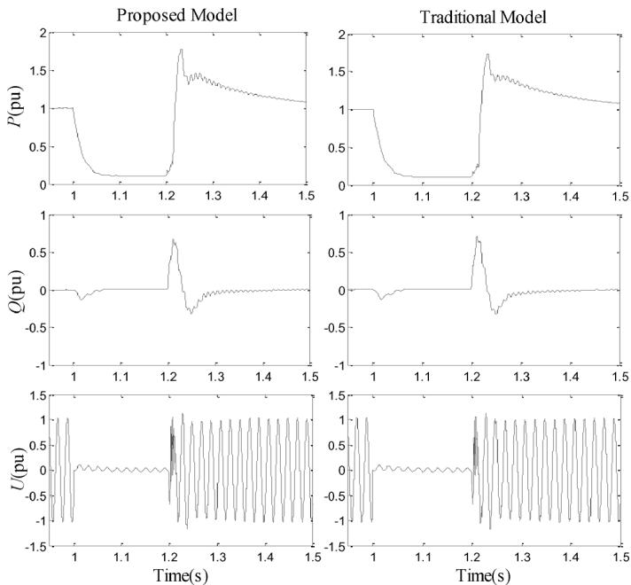  
Fig. 10. Transient state comparison during ac system fault.

the dc terminal of MMC2. The fault is applied at 1 s, and the fault clearing method presented in [22] is adopted. All of the IGBTs are blocked while the bypass thyristors shown in Fig. 3 are fired 40 s after fault occurrence. At 50 ms later, the ac circuit breakers (CBs) at both terminals of the MMC-HVDC are tripped. The dc current, ac current , and output ac voltage of phase A in MMC1 are compared in Fig. 11. It can be seen that the proposed model is capable of simulating the dc fault conditions with high accuracy.

# B. Verification of the Proposed Hybrid Simulation Model

Fig. 12 verifies the proposed hybrid simulation model. Each arm of the studied MMC is composed of 20 normal SMs and one redundant SM. The capacitor voltage of the redundant SM stays zero before it is switched on. The redundant protection control presented in [23] is adopted.

At 1 s, a fault occurs at an SM of phase A. The faulted SM is isolated from the main circuit within 5 ms after a fault occurs. Meanwhile, the redundant SM is switched on and charged from zero to the rated capacitor voltage. The top graph of Fig. 12

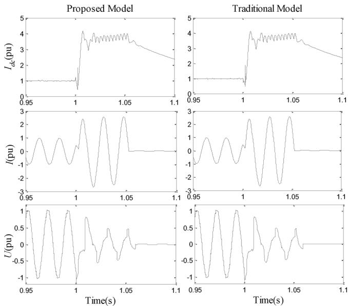  
Fig. 11. Transient state comparison during the dc fault.

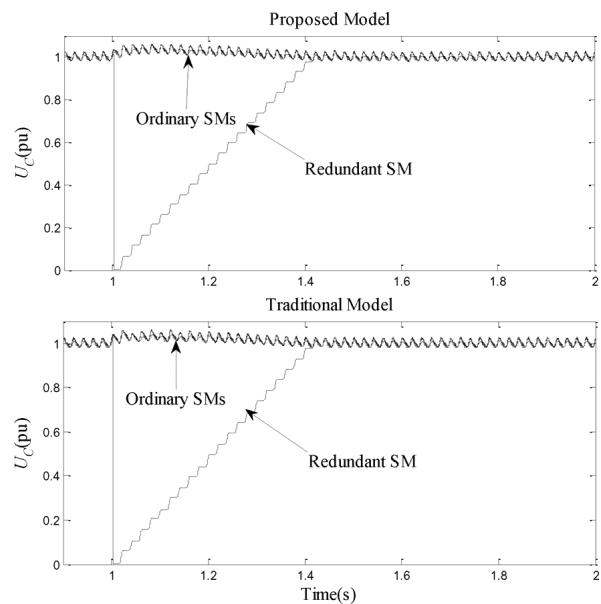  
Fig. 12. Waveforms of SM capacitor voltages in the fault phase.

shows the capacitor voltages of the normal SMs and the redundant SM in the proposed hybrid numerical model while the corresponding curves calculated using the detailed switching model are shown on the lower graph of Fig. 12.

We can see from Fig. 12 that the proposed hybrid model gives almost identical results as the detailed switching model. The hybrid model can be used as a complement to the numerical calculation model to investigate the detailed switching dynamic of specific SMs.

# C. Verification of the Voltage-Balancing Algorithm

Figs. 13 and 14 show the performance of the proposed voltage-balancing control using the detailed switching model.

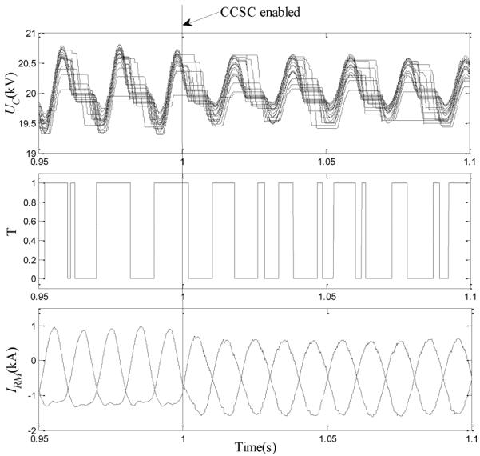  
Fig. 13. Verification of the voltage-balancing control in steady state.

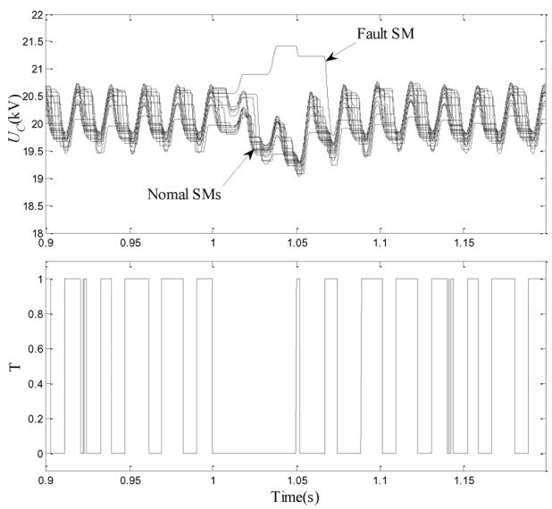  
Fig. 14. Verification of the voltage-balancing control in the SM fault.

The two parameters for average comparison are selected to be $\Delta U _ { C , s o r t } = 0 . 3 \mathrm { k V }$ and $\Delta U _ { C , \mathrm { m a x } } = 0 . 5 \mathrm { k V }$ .

From top to bottom, Fig. 13 shows the capacitor voltages, firing pulse of an SM, and upper and lower arm current of phase A in MMC1. The CCSC presented in [21] is initially disabled and then enabled at 1 s. We can see from Fig. 13 that the proposed voltage-balancing control performs correctly with and without CCSC. Capacitor voltages of all SMs are well maintained around their rated values. The equivalent switching frequency of an SM is about 85 Hz, which is a relatively low switching frequency.

Fig. 14 shows the performance of the proposed voltage-balancing control during faults. At 1 s, the upper IGBT of an SM fails to switch on and the fault is removed at 1.05 s. The upper graph of Fig. 14 shows the capacitor voltages and the lower graph of Fig. 14 shows the firing pulse of the fault SM. We can see that the proposed voltage-balancing control also functions well during the fault situation.

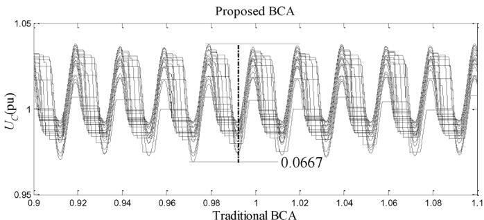

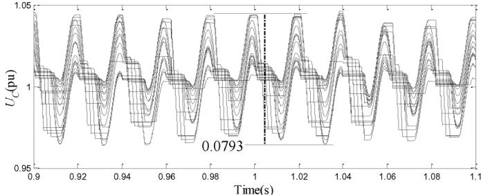

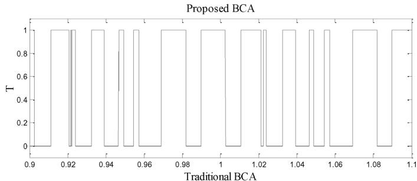

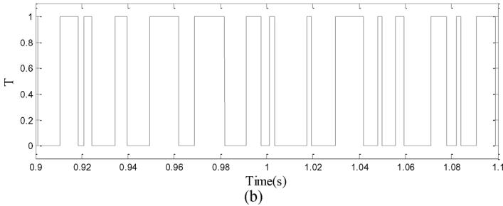  
Fig. 15. Comparison of simulation results using the proposed BCA and traditional BCA. (a) Capacitor voltages of the upper arm of phase A. (b) Firing pulses of the same SM of the upper arm of phase A.

To further verify the effectiveness of the proposed BCA, a comparison of simulation results using the proposed BCA and the traditional BCA reported in [11] are conducted as shown in Fig. 15. The results are simulated on the detailed switching model, and the equivalent switching frequencies are adjusted to be almost the same (about 85 Hz).

Fig. 15(a) shows the capacitor voltages of the upper arm in phase A. As shown in Fig. 15(a), the capacitor voltages using both BCAs are stable. Also, the maximum deviation of capacitor voltages using the proposed BCA is smaller than the maximum deviation using the traditional BCA. The proposed BCA is able to achieve better dynamics than the traditional BCA at even less calculation time.

Fig. 15(b) shows the firing pulses of the same SM of the upper arm in phase A. Fig. 15(b) verified that the capacitor voltages

TABLE III RUNNING TIME COMPARISON   

<table><tr><td rowspan="3">Levels of MMC</td><td colspan="4">Run Time (s)</td></tr><tr><td colspan="3">Proposed BCA</td><td>Standard BCA</td></tr><tr><td>Detailed Switching Model</td><td>Accelerated Model</td><td colspan="2">Proposed Model</td></tr><tr><td>9</td><td>22</td><td>7.8</td><td>3.0</td><td>3.5</td></tr><tr><td>21</td><td>97</td><td>43.1</td><td>3.8</td><td>4.8</td></tr><tr><td>51</td><td>1401</td><td>104.5</td><td>5.5</td><td>9.1</td></tr><tr><td>101</td><td>9744</td><td>148.5</td><td>9.3</td><td>20.5</td></tr><tr><td>201</td><td>72261</td><td>264.6</td><td>14.0</td><td>46.5</td></tr></table>

displayed in Fig. 15(a) are obtained using the same equivalent switching frequency.

# D. Comparison of Simulation Speeds

Table III compares the simulation speed among the proposed numerical calculation model, the speed of the detailed switching model and the accelerated model presented in [6]. Since simulation on the detailed switching model would have required extremely large CPU time, the comparison is only conducted for MMC1 of the test system shown in Fig. 8. MMC2 is represented by a dc voltage source. MMC with a different number of levels is simulated. The total simulation duration is 1 s, and the simulation step and plotting step are the same and selected to be 20 s. The simulations are conducted on the operating system of Microsoft Windows 7 Professional with a 3.00-GHz Inter Core i7-3770 CPU, 8 GB of RAM. The EMT simulation software is PSCAD/EMTDC (V4.2.0).

We can see from Table III that the proposed numerical calculation model could significantly improve the simulation speed of MMC. As the number of levels increases, acceleration of the simulation speed becomes more significant. It takes approximately one day to simulate 1-s dynamics of 201-level MMCs using the detailed switching model while only 14 s is required for the proposed numerical calculation model.

# E. Comparison of the Efficiency of the Proposed BCA

The last two columns of Table III compare the calculation speed of the proposed BCA and the traditional BCA reported in [11]. The comparison is conducted on the proposed fast numerical simulation model. Equivalent switching frequencies for both BCAs are adjusted to be the same. Because of the requirement for sorting capacitor voltages, the speed of the traditional BCA is lower than the proposed BCA. For a 201-level MMC, the proposed BCA is about 3 times faster than the traditional BCA.

# VI. CONCLUSION

A fast numerical simulation model for the MMC is proposed. The proposed model is capable of calculating dynamics (except the detailed switching dynamics) of each SM. The entire arm is equivalent to a controlled voltage source. To investigate the detailed switching dynamics of specific SMs, a hybrid simulation model that enables modelling specific SMs is proposed. The

comparisons show that the proposed models give almost identical results as detailed switching models in steady-state operation and during faults. The simulation speed of the proposed model is about 5000 times faster than the detailed switching model for a 201-level MMC.

A new voltage-balancing control based on average comparison is proposed. Capacitor voltages of SMs in one arm will be compared with their average voltage to determine the switching state of each SM. Minimum sorting of the capacitor voltages is required; therefore, the requirement on computation is significantly reduced. Two parameters $\Delta U _ { C , \mathrm { { m a x } } }$ and $\Delta U _ { C , \mathrm { s o r t } }$ are introduced to adjust the equivalent switching frequency of MMCs. Feasibility of the proposed control is verified by normal operation and during SM faults.

# REFERENCES

[1] H. Abu-Rub, J. Holtz, J. Rodriguez, and B. Ge, “Medium-voltage multilevel converters—State of the art, challenges, and requirements in industrial applications,” IEEE Trans. Ind. Electron., vol. 57, no. 8, pp. 2581–2596, Aug. 2010.   
[2] L. G. Franquelo, J. Rodriguez, J. I. Leon, S. Kouro, R. Portillo, and M. A. M. Prats, “The age of multilevel converters arrives,” IEEE Ind. Electron. Mag., vol. 2, no. 2, pp. 28–39, Jun. 2008.   
[3] A. Antonopoulos, L. Angquist, and H.-P. Nee, “On dynamics and voltage control of the modular multilevel converter,” presented at the Eur. Conf. Power Electron. Appl., Barcelona, Spain, 2009.   
[4] U. N. Gnanarathna, A. M. Gole, and R. P. Jayasinghe, “Efficient modeling of modular multilevel HVDC Converters (MMC) on electromagnetic transient simulation programs,” IEEE Trans. Power Del., vol. 26, no. 1, pp. 316–324, Jan. 2011.   
[5] J. Peralta, H. Saad, S. Dennetière, J. Mahseredjian, and S. Nguefeu, “Detailed and averaged models for a 401-level MMC-HVDC system,” IEEE Trans. Power Del., vol. 27, no. 3, pp. 1501–1508, Jul. 2012.   
[6] J. Xu, C. Zhao, W. Liu, and C. Guo, “Accelerated model of modular multilevel converters in PSCAD/EMTDC,” IEEE Trans. Power Del., vol. 28, no. 1, pp. 129–136, Jan. 2013.   
[7] K. Strunz and E. Carlson, “Nested fast and simultaneous solution for time-domain simulation of integrative power-electric and electronic systems,” IEEE Trans. Power Del., vol. 22, no. 1, pp. 277–287, Jan. 2007.   
[8] H. Saad, J. Peralta, S. Dennetière, J. Mahseredjian, J. Jatskevich, J. A. Martinez, A. Davoudi, M. Saeedifard, V. Sood, X. Wang, J. Cano, and A. Mehrizi-Sani, “Dynamic averaged and simplified models for MMC-based HVDC transmission systems,” IEEE Trans. Power Del., vol. 28, no. 3, pp. 1723–1730, Jul. 2013.   
[9] M. Glinka and R. Marquardt, “A new AC/AC-multilevel converter family applied to a single-phase converter,” in Proc. PEDS, Nov. 2003, vol. 1, pp. 16–23.   
[10] M. Saeedifard and R. Iravani, “Dynamic performance of a modular multilevel back-to-back HVDC system,” IEEE Trans. Power Del., vol. 25, no. 4, pp. 2903–2912, Oct. 2010.   
[11] Q. Tu and Z. Xu, “Impact of sampling frequency on harmonic distortion for modular multilevel converter,” IEEE Trans. Power Del., vol. 26, no. 1, pp. 298–306, Jan. 2011.   
[12] Q. Tu, Z. Xu, and L. Xu, “Reduced switching-frequency modulation and circulating current suppression for modular multilevel converters,” IEEE Trans. Power Del., vol. 26, no. 3, pp. 2009–2017, Jul. 2011.   
[13] D. Jovcic and W. Lin, “Multiport high-power LCL DC hub for use in DC transmission grids,” IEEE Trans. Power Del., vol. 29, no. 2, pp. 760–768, Apr. 2014.   
[14] CIGRE Working Group B4-52, “HVDC grid feasibility study,” Jun. 2012, CIGRE brochure 533.   
[15] H. Behjati and A. Davodi, “A multiple-Input multiple-output DC-DC converter,” IEEE Trans. Ind. Appl., vol. 49, no. 3, pp. 1464–1479, May/ Jun. 2013.   
[16] S. Rohner, S. Bernet, M. Hiller, and R. Sommer, “Modulation, losses, and semiconductor requirements of modular multilevel converters,” IEEE Trans. Ind. Electron., vol. 57, no. 8, pp. 2633–2642, Aug. 2010.   
[17] B. Backlund, R. Schnell, U. Schlapbach, R. Fischer, and E. Tsyplakov, “Applying IGBTs,” ABB Switzerland Ltd., 5SYA2053-04, Apr. 2009 [Online]. Available: http://www05.abb.com

[18] T. C. Chen and H. Chang, “Magnetic bubble memory and logic,” in Advances in Computers. London, U.K.: Academic, 1978, pp. 224–279.   
[19] W. Bin, High-Power Converters and AC Drives[M]. Hoboken, NJ, USA: Wiley, 2006.   
[20] A. Morched, B. Gustavsen, and M. Tartibi, “A universal model for accurate calculation of electromagnetic transients on overhead lines and underground cables[J],” IEEE Trans. Power Del., vol. 14, no. 3, pp. 1032–1038, Jul. 1999.   
[21] M. Ji-Woo, K. Chun-Sung, P. Jung-Woo, K. Dea-Wook, and K. Jang-Mok, “Circulating current control in MMC under the unbalanced voltage,” IEEE Trans. Power Del., vol. 28, no. 3, pp. 1952–1959, Jul. 2013.   
[22] G. Pinares, N. Ullah, M. Lindgren, P. Brunnegård, J. C. G. Alonso, F. Mosallat, and R. Wachal, “Fault analysis of a multilevel-voltagesource-converter-based multi-terminal HVDC system,” presented at the CIGRÉ Colloq. HVDC Power Electron. Syst. Overhead Line and Insulated Cable, San Francisco, CA, USA, Feb. 2010.   
[23] S. G. Tae et al., “Design and control of a modular multilevel HVDC converter with redundant power modules for noninterruptible energy transfer,” IEEE Trans. Power Del., vol. 27, no. 3, pp. 1611–1619, Jul. 2012.

Feng Yu received the B.Sc. degree in electrical engineering from Huazhong University of Science and Technology (HUST), Wuhan, China, in 2008 and is currently pursuing the M.Sc. degree in electrical engineeering at Shanghai Jiao Tong University (SJTU), Shanghai, China.

His research interests are transient simulation of power systems and the application of VSC-HVDC.

Weixing Lin (S’11–M’13) received the B.E. and Ph.D. degrees in electrical engineering from Huazhong University of Science and Technology (HUST), Wuhan, China, in 2008 and 2014, respectively.

Currently, he is a Research Fellow at the University of Aberdeen, Aberdeen, U.K. and HUST. His research interests are the high-power dc/dc converters, dc grids, and wind power.

Xitian Wang (M’02) received the B.E. and Ph.D. degrees in power engineering from Harbin Institute of Technology, Harbin, China, in 1995 and 2001, respectively.

Currently, he is an Associate Professor in the Department of Electrical Engineering, Shanghai Jiao Tong University, Shanghai, China. His research interests include dynamics, simulation, and control of electromechanical interactions in power systems and microgrid distributed energy systems.

Da Xie (M’02) received the B.E. and Ph.D. degrees in electrical engineering from Shanghai Jiao Tong University, Shanghai, China, in 1991 and 1999, respectively.

Currently, he is an Associate Professor in the Department of Electrical Engineering at Shanghai Jiao Tong University. His research interests cover the application of flexible alternative current transmission systems, analysis, and simulation of power systems and the development of power system analysis software.