# Time-domain modeling of a subsea buried cable✩,✩✩

Felipe Camara a, Antonio C.S. Lima b,∗, Maria Teresa Correia de Barros c, Filipe M. Faria da Silva d, Claus L. Bak d

a DNV, Oslo, Norway   
b Federal University of Rio de Janeiro (UFRJ), Rio de Janeiro, Brazil   
c University of Lisbon (ULisboa), Lisbon, Portugal   
d Aalborg University, Aalborg, Denmark

# A R T I C L E I N F O

Keywords:

Submarine cables

Transient analysis

Time-domain modeling

HVDC

# A B S T R A C T

Traditionally, electromagnetic transient (EMT) programs in the time domain cannot deal with submarine cables buried in the seabed, as available routines demand one medium to be lossless to derive per unit length impedance and admittance matrices. This paper proposes a suitable approach for modeling of HVDC submarine cables, i.e., single-pole, single-core cables with thick armors, in EMT-type programs to allow an accurate representation of the seabed buried cables. The expressions for evaluating pul parameters are based on a quasitransverse electromagnetic (quasi-TEM) approximation of a full-wave formulation. Two distinct approaches are considered for time-domain modeling. The first one is based on the Method of Characteristics (MoC) and relies on the main structure of the so-called universal line model (ULM), harnessing its implementation in an EMT program. The second approach is based on the rational fitting of the cable nodal admittance matrix using the Folded Line Equivalent (FLE). The time responses of both approaches are compared with the one obtained using the Numerical Laplace Transform (NLT), and an excellent agreement was found.

# 1. Introduction

There has been a growing interest in developing and analyzing submarine power systems. In the recent past, the focus has been on power interconnections [1] and submarine pumping of oil systems based on voltage-source inverters [2]. The deployment of offshore wind farms [3] has drawn a renewed interest in the usage of submarine cables and the concept of energy islands [4] being designed in some countries, e.g., Denmark and Singapore. The latter has announced an intention to build a very long submarine transmission system, over 3700 km, to harvest energy from a solar farm in Australia [5].

In recent years, there has been an expressive effort to improve the available routines for the calculation of the internal parameters of cables to include twisting, proximity, and skin effects and a more detailed representation of the armor [6–11]. Unfortunately, with a few exceptions, most of the offshore wind farm studies present some rather crude cable models [12] and this might be related to the fact that a

cable buried in the seabed represents a challenge as both media are lossy, and thick armor is involved.

Submarine cables buried in the seabed may share some commonalities with underground facilities, some features are unique to such systems as specific bonding schemes, construction issues, surrounding medium, and trenching [13]. For instance, TenneT buried a cable more than 5 m below the seabed to connect a new offshore wind farm [14]. The majority of commercial offshore wind power plants that are operational to date has been installed at a maximum water depth of 30 m with an average of 17 m [15], while offshore oil exploitation units operate in water depths greater than 1000 m [16]. Even for the average offshore windfarm scenario, and considering a burial depth of 1 m, the electromagnetic field decay is such that the external field generated by a cable buried below the seabed will fail to reach the water surface (see Appendix for details). Thus, there is no need for a 3-layer configuration. Nevertheless, one has to deal with a structure where both media are lossy, affecting mainly the behavior of the return impedance and admittance per unit of length. This scenario

is distinct from those found in embedded cable parameters routines in EMT (Electromagnetic Transient) programs such as PSCAD, EMTP, or even ATP, where one medium is assumed lossless.

Previously, a seabed buried cable was presented in [17] based on a quasi-TEM (Transverse Electromagnetic) simplification of a full-wave modeling [18]. It relied on the frequency domain using the Numerical Laplace Transform (NLT) [19–23] to obtain the time responses. This work investigates the challenges associated with the time-domain modeling of such cable configuration for transient analysis. A discussion of the rational approximation and the numerical stability is presented. A procedure detailing the implementation of such a model in EMT-program is shown. Two distinct time-domain formulations are evaluated. The first is based on the Method of Characteristics (MoC), and the other is based on the rational approximation of the nodal admittance matrix.

The paper is organized as follows: the mathematical modeling and the associated evaluation of the external per-unit-length parameters are discussed in Section 2. The rational approximation, together with the discussion of the time-delay identification is presented in Section 3. The set of test cases are shown in Section 4 and the main conclusions of this work are presented in Section 6.

# 2. Mathematical modeling

# 2.1. Per-unit-length parameter determination

A key aspect in the assessment of the transient and steady-state performance of any system involving overhead lines or cables is the determination of the per-unit-length parameters (pul-parameters), i.e., ?? and ?? matrices. Typically, we may write,

$$
\mathbf {Z} = \mathbf {Z} _ {i n} + \mathbf {Z} _ {0} \tag {1}
$$

where $\mathbf { Z } _ { i n }$ is the internal impedance matrix of the cable, with its dimensions defined by the number of conducting layers the cable might present, and $\mathbf { Z } _ { 0 }$ is the external media impedance matrix. In the case of a single-core armored cable or a pipe-type cable

$$
\mathbf {Z} _ {0} = z _ {0} \mathbf {1} \tag {2}
$$

where ?? is a unit matrix [24] with a rank equal to the number of conductors in the cable. For the shunt admittance matrix, the procedure is similar, $\mathbf { i . e . , }$ ,

$$
\mathbf {Y} = \left(\mathbf {Y} _ {i n} ^ {- 1} + \frac {1}{y _ {0}} \mathbf {1}\right) ^ {- 1} \tag {3}
$$

where $\mathbf { Y } _ { i n }$ is the admittance matrix associated with the insulation layers. For an insulated cable, the number of conducting and insulating layers need to be identical, e.g., if a cable has a core, sheath, and armor, it also has three insulation layers: one separating the core conductor and sheath, the other between sheath and armor, and the last one separates armor from external media. The expressions for $z _ { 0 }$ and ??0 are as follows, assuming a quasi-TEM (Transverse Electromagnetic) propagation

$$
z _ {0} = \frac {j \omega \mu}{2 \pi} [ \Lambda + S _ {1} ] \tag {4}
$$

$$
y _ {0} = 2 \pi (\sigma_ {1} + j \omega \varepsilon_ {1}) [ \Lambda - S _ {3} ] ^ {- 1}
$$

where

$$
\Lambda = K _ {0} \left(\gamma_ {1} r _ {j}\right) + K _ {0} \left(\gamma_ {1} \sqrt {4 h ^ {2} + r _ {j} ^ {2}}\right)
$$

$$
S _ {1} = \int_ {- \infty} ^ {\infty} \frac {\exp (- 2 h \bar {u} _ {1})}{\bar {u} _ {1} + \bar {u} _ {2}} \exp (j r _ {j} \lambda) d \lambda \tag {5}
$$

$$
S _ {3} = \int_ {- \infty} ^ {\infty} \frac {\bar {u} _ {2}}{\bar {u} _ {1}} \frac {\exp (- h \bar {u} _ {1}) - \exp (- 2 h \bar {u} _ {1})}{n ^ {2} \bar {u} _ {1} + \bar {u} _ {2}} \exp (j r _ {j} \lambda) d \lambda
$$

with $\bar { u } _ { 1 } \ = \ \sqrt { \lambda ^ { 2 } + \gamma _ { 1 } ^ { 2 } } , \ \bar { u } _ { 2 } \ = \ \sqrt { \lambda ^ { 2 } + \gamma _ { 2 } ^ { 2 } } , \ n \ = \ \gamma _ { 2 } / \gamma _ { 1 } . \ S _ { i }$ is the so-called 1 2  Sommerfeld integrals, evaluated at the conductor coordinates $( r _ { j } , h ) ,$ ,

and ??(.) is a Bessel Function. In Appendix, we detail the procedure for obtaining external media impedance and admittance expressions.

For an accurate representation of ${ \bf Z } _ { i n } ,$ , in HVDC or HVAC cable, a Finite-Element Method (FEM) would be preferred for the inclusion of helical effects due to conductor twisting in screen and armor, although recently, it was shown that the so-called MoM-SO could provide accurate results with considerable less computation time [8,10,11]. However, a common characteristic of these two approaches is that a detailed representation of the cable conductors is needed, i.e., one must know the exact amount of wires and their spacing in the cable screen, and accurate information regarding the electrical and thermal properties of the wires would also play an important aspect. For those dealing with earlier stages where there is no actual definition of the characteristics of the cable to be used, and given the low accuracy of seabed data, for a first investigation of the behavior of a submarine cable either using MoM-SO or FEM seems that it would add more uncertainties to the analysis. Another issue would be the required background to handle these special-purpose tools and the fact that any EMT-type studies, e.g., Insulation Coordination, cannot be performed using FEM. As the main focus here is to investigate the transient behavior of a submarine cable considering the two external media to be lossy, we adopted a more conservative approach for the inclusion of the inner impedance. Here, we consider a modified version of the cable parameters routine available in commercial EMT programs should have checks and controls to avoid numerical instabilities in evaluating the internal impedance. This approach is similar to the one used in [17] for the transient evaluation considering the NLT.

# 2.2. Propagation parameters

The propagation parameters are the characteristic admittance $\mathbf { Y } _ { c }$ and the propagation function ?? defined as

$$
\mathbf {Y} _ {c} = \mathbf {Z} ^ {- 1} \sqrt {\mathbf {Z} \cdot \mathbf {Y}} \tag {6}
$$

$$
\mathbf {H} = \exp \left(- \ell \sqrt {\mathbf {Y} \cdot \mathbf {Z}}\right)
$$

where ?? and ?? are the pul parameters defined in the previous section and ?? is the total length of the circuit. Eigenvalue decomposition is used to obtain the modal components of both matrices. The modal components for both ?? and ?? are obtained from

$$
\mathbf {H} = \mathbf {T} _ {v} \cdot \mathbf {H} _ {m} \cdot \mathbf {T} _ {v} ^ {- 1} \quad \mathbf {Y} _ {c} = \mathbf {T} _ {v} \cdot \mathbf {Y} _ {c _ {m}} \cdot \mathbf {T} _ {v} ^ {T} \tag {7}
$$

where $\mathbf { T } _ { v }$ is the voltage transformation matrix obtained from the right eigenvector of ?? ⋅ ??. Alternatively, we could use ?? which is current transformation matrix obtained from the right eigenvector of ?? ⋅ ??.

# 2.3. Nodal admittance formulation

The nodal admittance matrix $\mathbf { Y } _ { n }$ can then be written as

$$
\mathbf {Y} _ {n} = \left[ \begin{array}{l l} \mathbf {Y} _ {s} & \mathbf {Y} _ {m} \\ \mathbf {Y} _ {m} & \mathbf {Y} _ {s} \end{array} \right] \tag {8}
$$

where

$$
\mathbf {Y} _ {s} = \mathbf {Y} _ {c} \cdot \left(\mathbf {I} _ {n} + \mathbf {H} ^ {2}\right) \cdot \left(\mathbf {I} _ {n} - \mathbf {H} ^ {2}\right) ^ {- 1} \tag {9}
$$

$$
\mathbf {Y} _ {m} = - 2 \mathbf {Y} _ {c} \cdot \mathbf {H} \cdot \left(\mathbf {I} _ {n} - \mathbf {H} ^ {2}\right) ^ {- 1}
$$

and ${ \mathbf I } _ { n }$ is an identity matrix of order ?? equal to the number of conductors. Thus, for an armored single core cable ?? = 3.

The direct fitting of $\mathbf { Y } _ { n }$ typically leads to inaccurate results for the smallest eigenvalues at the lower frequency range. This can be overcome if we consider the so-called Folded Line Equivalent proposed in [25] and later extended in [26] to allow latency exploitation. This implies in rewriting (8) as

$$
\mathbf {Y} _ {n} = \mathbf {K} \cdot \left[ \begin{array}{c c} \mathbf {Y} _ {o c} & \mathbf {0} \\ \mathbf {0} & \mathbf {Y} _ {s c} \end{array} \right] \cdot \mathbf {K} ^ {- 1} \tag {10}
$$

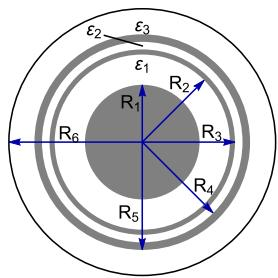  
Fig. 1. Configuration of a 75 kV HVDC subsea cable.

Table 1 Data for 75 kV subsea cable.   

<table><tr><td>Core conductor</td><td>R1= 18.95 mm</td><td>ρc= 1.723 · 10-8Ω m</td></tr><tr><td>Insulation layer 1</td><td>R2= 28.95 mm</td><td>ε1= 2.5</td></tr><tr><td>Sheath</td><td>R3= 30.65 mm</td><td>ρs= 22 · 10-8Ω m</td></tr><tr><td>Insulation layer 2</td><td>R4= 33.15 mm</td><td>ε2= 2.5</td></tr><tr><td>Armor (μa= 90)</td><td>R5= 35.65 mm</td><td>ρa= 11 · 10-8Ω m</td></tr><tr><td>Armor insulation</td><td>R6= 44.10 mm</td><td>ε3= 2.5</td></tr></table>

where ${ \mathbf Y } _ { o c } = { \mathbf Y } _ { s } + { \mathbf Y } _ { m }$ is the admittance associated with the open circuit current response and ${ \bf Y } _ { s c } = { \bf Y } _ { s } - { \bf Y } _ { m }$ stands for the admittance related to the short-circuit current response, and

$$
\mathbf {K} = \left[ \begin{array}{c c} \mathbf {I} _ {n} & \mathbf {I} _ {n} \\ \mathbf {I} _ {n} & - \mathbf {I} _ {n} \end{array} \right] \tag {11}
$$

where ${ \mathbf I } _ { n }$ is the same as before. It should be pointed out that while $\mathbf { Y } _ { n }$ has a dimension $2 n \times 2 n ,$ with ?? being the number of conductors, $\mathbf { Y } _ { o c }$ and $\mathbf { Y } _ { s c }$ are ?? × ?? matrices and can be fitted separately.

# 3. Rational approximation and time-delay identification

If we consider the Method of Characteristics (MoC) for the conventional time-domain modeling of transmission lines and cables, we need to find a pole-residue realization of $\mathbf { Y } _ { c }$ and ??, and for the latter we need to fit the modal parameters and extract the time delays associated with the modes. There are some alternatives for the frequency domain realization of the involved matrices such as the matrix pencil method [27] or the pole relocation algorithm is widely known as Vector Fitting (VF) [27–29]. Concerning the time-domain modeling exploiting the nodal admittance matrix $\mathbf { Y } _ { n } ,$ the FLE decomposition will be employed given its utmost feature of being able to accurately represent the smallest eigenvalues in the lower frequency range.

To illustrate the behavior of the functions above, consider a 75 kV single-core (SC) armored submarine cable employed in a VSC-HVDC application used in [30]. The cable is assumed to be buried 1.5 m below the seabed and with a length of 2.5 km. The cable configuration is depicted in Fig. 1, and its data is given in Table 1.

# 3.1. Fitting propagation parameters

Here, we adopt a relatively straightforward formulation, i.e., the pul parameters computed by a user-defined routine is fed into an EMT program that uses a particular implementation of the VF and a timedelay identification and extraction based on the formulation proposed in [31]. The frequency range from 0.1 Hz up to 10 MHz was considered for the rational approximation of $\mathbf { Y } _ { c }$ and ??. Fig. 2(a) depicts the behavior of characteristic admittance $\mathbf { Y } _ { c } .$ For the propagation function $\mathbf { H } ,$ Fig. 2(b) depicts the behavior of all its elements in the frequency range of interest.

The elements in modal propagation function matrix $\mathbf { H } _ { m }$ are shown in Fig. 3, in this case, there are only three modes. An interesting aspect appears in this scenario. Firstly, the time delay was calculated using [31], indicating that the two modes are somewhat similar, as

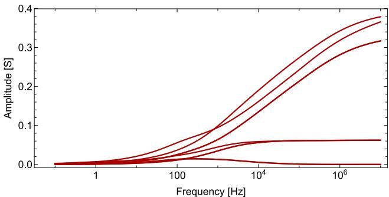  
(a) Characteristic admittance ${ \bf Y } _ { c }$

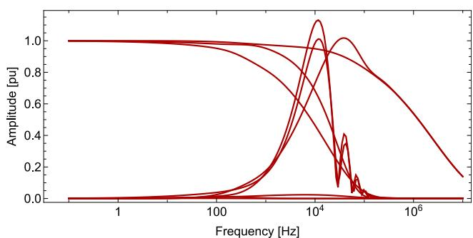  
(b) Propagation function H

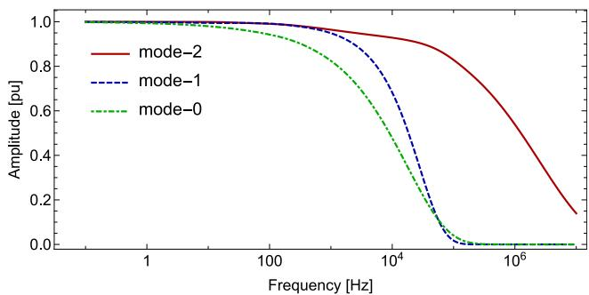  
Fig. 2. Fitting of characteristic admittance ?? and propagation function ??.   
Fig. 3. Modal propagation function $\mathbf { H } _ { m } .$

seen in Fig. 3. Thus, it could adopt the modal grouping as in the original proposition of the so-called Universal Line Model (ULM) [32]. However, a poor fitting is obtained in this case despite the similar time delay, as the two modes present distinct magnitudes in most of the frequency range considered. Thus, each mode is independently fitted. Another issue considered in the fitting results is the pole-residue ratio, as it can lead to numerical instabilities in the time-domain response, see [33]. In this case, the maximum pole-residue ratio found was 1.2481, while for ?? the maximum absolute error was 0.00856%, and for the characteristic admittance $\mathbf { Y } _ { c } ,$ the maximum relative error was 0.00688. If, however, the modal grouping is allowed the maximum absolute error increases to 2% and the pole-residue ratio reaches 85.7.

A passivity assessment was carried out based on the formulation presented [34]. Two small passivity violations occurred for ?? in the lower frequency range, $\mathrm { i . e . , }$ below 10 Hz. The tolerance considered for the eigenvalues was 1E–6. The passivity enforcement proposed in [34] was able to eliminate these violations.

# 3.2. Fitting $\mathbf { Y } _ { o c }$ and $\mathbf { Y } _ { s c }$

The nodal admittance matrix $\mathbf { Y } _ { n } ,$ which establishes the relation between current and voltage terminals in the frequency domain is

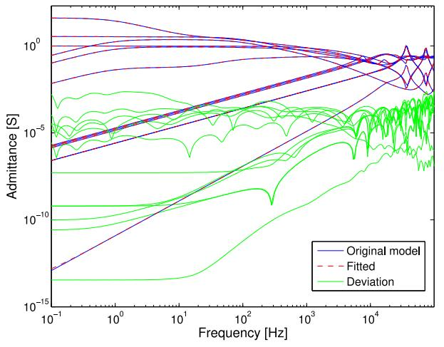  
(a) Fitting of $\mathbf { Y } _ { o c }$ and $\mathbf { Y } _ { s c }$

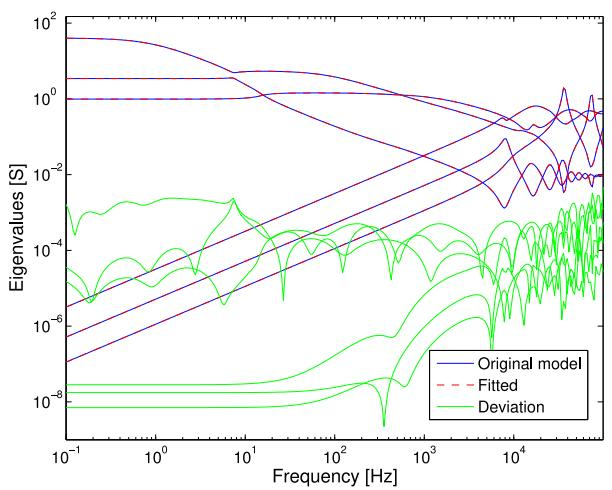  
(b) Eigenvalues of $\mathbf { Y } _ { o c }$ and $\mathbf { Y } _ { s c }$   
Fig. 4. Fitting results (75 kV submarine cable)

computed in the frequency range from 0.1 Hz to 1 MHz and then decomposed into $\mathbf { Y } _ { o c }$ and $\mathbf { Y } _ { s c }$ counterparts as stated in (10), namely, open-circuit and short-circuit responses, respectively, and subjected to rational approximation with the Vector Fitting routine. The fitting results for the FLE model and their eigenvalues are shown in Fig. 4 and the resulting rational model was achieved with 82 poles for $\mathbf { Y } _ { o c }$ and 80 poles for $\mathbf { Y } _ { s c } .$ Aiming to guarantee a stable time-domain simulation, the post-processing algorithm for passivity enforcement [35] identified two passivity violations in $\mathbf { Y } _ { o c }$ and no violation in $\mathbf { Y } _ { s c }$ matrices. Although this approach leads to a considerably larger number of poles when compared with MoC, the FLE does not require to consider interpolations due to time-step and propagation delay mismatches to avoid numerical instabilities [33] and the convolutions are simpler. An excellent agreement can be observed in the frequency range of interest.

# 4. Test cases

The scheme in Fig. 5 depicts a voltage source connected to the core conductor ramped up linearly to 1 V in 50 μs. The sheath and armor are grounded at both terminals through a grounding resistance $R _ { g } ~ = ~ 1 0 \Omega$ as this is typically the practical scenario as the seawater in the seabed ‘‘grounds’’ the armor.

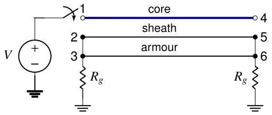  
Fig. 5. Circuit for time-domain simulation.

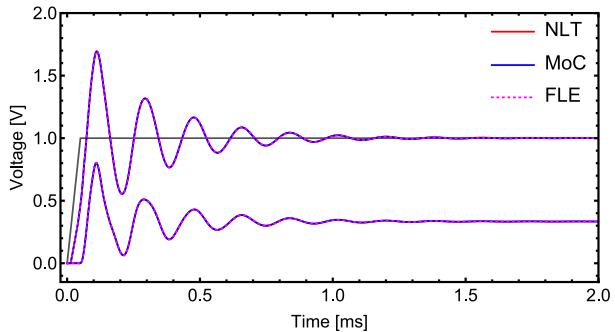  
(a) core and sheath voltages

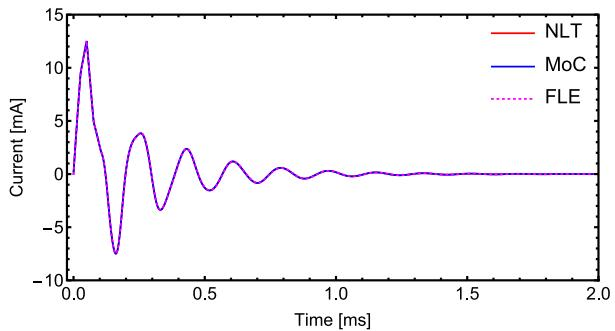  
(b) core current   
Fig. 6. Time responses of step like input voltage.

Aiming to provide an accurate approach for modeling submarine cables, this paper addressed two feasible alternatives for implementation in time-domain EMT-type solvers: the MoC-based and the admittancebased representation.

The commercial EMT software allows a straightforward interface with the derived pul cable data, taking advantage of its ULM implementation. As mentioned before, the modal grouping proposed in [32] was not used, and each mode is represented independently. Thus, commercial EMT software was used to obtain the time responses considering the MoC approach. The scenario is somewhat distinct for the Folded Line Equivalent (FLE) model. To the authors’ knowledge, no commercial EMT software exists where FLE is available. Thus FLE was implemented in an EMT-like program within the Mathematica environment. Alternatively, the FLE model can be interfaced with EMT-type software exploiting the so-called FDNE component, which is available in some commercial EMT-software. Additional manipulation shall be carried out to tackle the transformation between phase to FLE quantities and vice versa.

The simulated core and sheath voltages at the receiving end are depicted in Fig. 6(a) considering a time-step $\Delta t \ : = \ : 0 . 0 5$ μs. Similarly, the current in the core conductor is shown in Fig. 6(b), and again, a very accurate match is attained. The reference waveform for validation of the time-domain results was obtained via the implementation of a Numeric Laplace Transform (NLT) algorithm [19,20,22,36] which is an analytical approach without approximation.

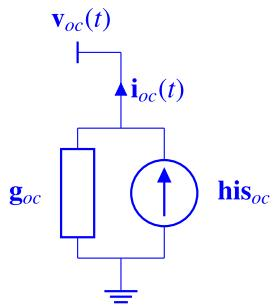

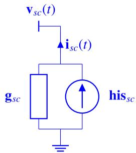  
Fig. 7. Time-domain realization of the FLE model.

# 5. EMT-Implementation

For the MoC model, the EMT Implementation is rather straightforward as commercial EMT-software allows the user to specify an external file. This should be an ASCII file containing the frequency samples, the total number of conductors, and all the impedance and admittance elements in a given format and structure. In PSCAD this is called YZ Data File Format. A similar approach exists in EMTP, but the file is slightly different. In ATP, the scenario is distinct as no built-in ULM is available. One has to resort to MODELS to connect an external file containing the fitting of both ?? and ?? and follow the approach proposed in [37]. In the case of FLE, since ${ \bf Y } _ { n }$ was decomposed into a sum of $\mathbf { Y } _ { o c }$ and $\mathbf { Y } _ { s c }$ matrices, the time-domain implementation of the FLE model resorts to two companion networks using the recursive convolution [38] approach, as depicted in Fig. 7. Then, the Norton equivalent is achieved by a proper combination of each counterpart through Eqs. (12) and (13).

$$
\mathbf {g} = \mathbf {K} \cdot \left[ \begin{array}{l l} \mathbf {Y} _ {o c} & 0 \\ 0 & \mathbf {Y} _ {s c} \end{array} \right] \cdot \mathbf {K} ^ {- 1} \tag {12}
$$

$$
\mathbf {h i s} = \mathbf {K} \cdot \left[ \begin{array}{l} \mathbf {h i s} _ {o c} \\ \mathbf {h i s} _ {s c} \end{array} \right] \tag {13}
$$

# 6. Conclusions

A seabed-buried cable model is unavailable in traditional EMT programs as both media are lossy. Thus, this work proposes a time-domain modeling of seabed-buried single-core cables, for wind off-shore and oil exploitation, where the seabed is below a couple of meters of the air–sea interface. To stress the peculiarities of this configuration, a rather simple HVDC cable was considered. Two distinct approaches are considered for the time-domain modeling. The first one is based on the Method of Characteristics (MoC), while the second uses the Folded Line Equivalent (FLE), which considers the rational approximation of short and open circuit admittance matrices. An accurate pul-parameter formulation based on quasi-TEM approximation of full-wave modeling was used to derive the pul impedance and admittance matrices. MoC and FLE modeling presented very accurate rational approximation for transient analysis in the frequency range of interest. A step-like response test was carried out to assess the accuracy of both approaches compared to those obtained using NLT. The comparison indicated a suitable accuracy of both approaches.

# CRediT authorship contribution statement

Felipe Camara: Conceptualization, Formal analysis, Investigation, Methodology, Project administration, Software, Validation, Visualization, Writing – original draft, Writing – review & editing. Antonio C.S. Lima: Conceptualization, Funding acquisition, Methodology, Supervision, Writing – original draft, Writing – review & editing. Maria Teresa Correia de Barros: Conceptualization, Formal analysis, Investigation,

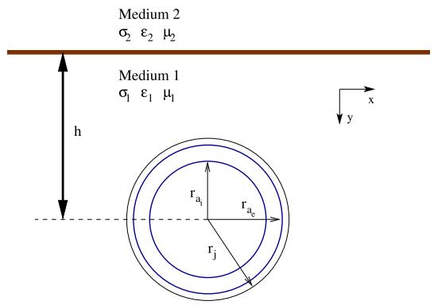  
Fig. A.8. An insulated cable parallel to the interface of two media: armour (inner radius $r _ { a _ { i } } ,$ , outer radius $r _ { a _ { e } } )$ , and insulated layer with outermost radius $r _ { j } .$

Methodology, Project administration, Writing – original draft, Writing – review & editing. Filipe M. Faria da Silva: Conceptualization, Investigation, Methodology, Supervision, Writing – original draft, Writing – review & editing. Claus L. Bak: Data curation, Formal analysis, Supervision, Writing – original draft, Writing – review & editing.

# Declaration of competing interest

The authors declare the following financial interests/personal relationships which may be considered as potential competing interests: Antonio C S Lima reports financial support was provided in part by the Coordenação de Aperfeiçoamento de Pessoal de Nível Superior - Brasil (CAPES), Finance Code 001. It also was partially supported by INERGE (Instituto Nacional de Energia Elétrica), CNPq (Conselho Nacional de esenvolvimento Científico e Tecnológico), and FAPERJ (Fundação Carlos Chagas Filho de Amparo à Pesquisa do Estado do Rio de Janeiro). Felipe Camara reports financial support was provided via funding from the European Union’s Horizon 2020 research and innovation programme under the Marie Skłodowska-Curie grant agreement No 101031088. by Coordination of Higher Education Personnel Improvement.

# Data availability

No data was used for the research described in the article.

# Appendix. External pul parameters based on full-wave modeling

For defining the per unit length external parameter considering the more general case of interest of two lossy media, we assume an armored cable buried in the seabed (‘‘medium 1’’) in Fig. A.8, with the sea as ‘‘medium 2’’. In a full-wave modeling approach, we must calculate the propagation constant associated with the external media. Thus one only needs to consider the component of current flowing in the outer surface of the armor and returning externally, which defines the return or ‘‘ground’’ mode, named mode-0. In this perspective, it would be closely equivalent to consider the cable as being formed only by its outermost layer, i.e., the armor as also depicted in Fig. A.8. Modeling the behavior of the cable, to the wave propagation through its length, by equations in the quasi-stationary mode (valid for a wide range of frequencies, including those of electromagnetic transient phenomena in power systems), and considering, without loss of generalization, a timeharmonic source, the current injected in the armor can be described as $I _ { a } = I _ { m } e ^ { ( - \gamma z + j \omega t ) }$ , where only one direction of the traveling wave, forward, for instance, is sufficient for the determination of the unknown propagation constant, ??.

To obtain $\gamma ,$ one may impose the continuity of the longitudinal electric field at the interface between the armor outer sheath and the

surrounding medium. The external electric field, $\mathbf { E } ,$ can be calculated from the electric scalar potential $\varphi$ and the magnetic vector potential ??. Since $\mathbf { E } = - \nabla \varphi - j \omega \mathbf { A }$ and $\mathbf { H } = 1 / \mu \left( \pmb { \nabla } \mathbf { \times } \mathbf { A } \right) ,$ , it is possible to write:

$$
\begin{array}{l} \left(\nabla^ {2} + \gamma^ {2} - \gamma_ {1} ^ {2}\right) \mathbf {A} _ {1} = - \mu I _ {m} e ^ {j \omega t - \gamma z} \delta (x - x _ {c}) \delta (y - y _ {c}) \\ \left(\nabla^ {2} + \gamma^ {2} - \gamma_ {2} ^ {2}\right) \mathbf {A} _ {2} = 0 \\ \left(\nabla^ {2} + \gamma^ {2} - \gamma_ {1} ^ {2}\right) \varphi_ {1} = - \frac {\gamma I _ {m} e ^ {j \omega t - \gamma z}}{\sigma_ {1} + j \omega \varepsilon_ {1}} \delta \left(x - x _ {c}\right) \delta \left(y - y _ {c}\right) \tag {A.1} \\ \left(\nabla^ {2} + \gamma^ {2} - \gamma_ {2} ^ {2}\right) \varphi_ {2} = 0 \\ \end{array}
$$

where $\mathbf { A } _ { i }$ is the magnetic vector potential and $\varphi _ { i }$ is the electric scalar potential in medium $i ,$ ?? is the Dirac impulse function (implying thin wire assumption), $x _ { c }$ and $y _ { c }$ are the coordinates of the center of the conductor, $\gamma _ { i } = \sqrt { j \omega \mu ( \sigma _ { i } + j \omega \varepsilon _ { i } ) }$ is the propagation constant of medium $i ,$ and it is assumed that $\mu _ { 1 } = \mu _ { 2 } = \mu _ { 0 }$ is the magnetic permeability of the vacuum.

The formulation in (A.1) is a direct extension of the one presented in [39], now considering that both media are lossy. A solution to (A.1) can be found using double exponential Fourier Transform (see [39,40] for details).

For the magnetic vector potential, we have ${ \cal A } _ { 1 x } = { \cal A } _ { 2 x } = 0 ,$ , and

$$
A _ {1 _ {z}} = \frac {\mu J _ {s}}{2 \pi} \left[ K _ {0} (\eta d) - K _ {0} (\eta D) + \int_ {- \infty} ^ {\infty} \frac {\exp (- u _ {1} (y + h) + j x \lambda)}{u _ {1} + u _ {2}} d \lambda \right] \tag {A.2}
$$

$$
A _ {1 _ {y}} \approx 0
$$

where $d = { \sqrt { x ^ { 2 } + ( y - h ) ^ { 2 } } } , D = { \sqrt { x ^ { 2 } + ( y + h ) ^ { 2 } } } ,$ , ℎ and $u _ { i }$ are the same as before and $J _ { s } = I _ { 0 } \exp ( j \omega t - \gamma z ) \delta ( x - x _ { c } ) \delta ( y - y _ { c } )$ .

In medium $" 2 >$ we have (note that in this case $y < 0 )$ ,

$$
A _ {2 z} = \frac {J _ {s}}{2 \pi} \int_ {- \infty} ^ {\infty} \frac {\exp (- u _ {1} h + u _ {2} y + j x \lambda)}{u _ {1} + u _ {2}} d \lambda \tag {A.3}
$$

$$
A _ {2 _ {v}} \approx 0
$$

For the electric scalar potential, we have

$$
\varphi_ {1} = \frac {\gamma J _ {s}}{2 \pi (\sigma_ {1} + j \omega \varepsilon_ {1})} [ K _ {0} (\eta d) - K _ {0} (\eta D) + \Delta_ {1} ] \tag {A.4}
$$

$$
\varphi_ {2} = \frac {\gamma J _ {s}}{2 \pi (\sigma_ {1} + j \omega \varepsilon_ {1})} \Delta_ {2} \tag {X.4}
$$

where

$$
\Delta_ {1} = \int_ {- \infty} ^ {\infty} \frac {\exp (- u _ {1} (h + y) + j x \lambda)}{n ^ {2} u _ {1} + u _ {2}} d \lambda \tag {A.5}
$$

$$
\varDelta_ {2} = \int_ {- \infty} ^ {\infty} \frac {\exp (- h u _ {1} + y u _ {2} + j x \lambda)}{n ^ {2} u _ {1} + u _ {2}} d \lambda
$$

It is worth mentioning that as shown first in [41], the full-wave approach proposed in [39] leads to the same integral equation as the formulations proposed in [42]. Later, in [43], it was shown that both approaches lead to the same results if the formulation proposed in [40] is used. The external longitudinal field $\bf { E _ { 0 } }$ tangent to the outermost armour sheath, at the point $( r _ { j } , h ) _ { : }$ , can then be calculated according to the following expression [44]:

$$
\mathbf {E} _ {\mathbf {0}} = \frac {2 \pi}{j \omega \mu} \left[ \left(1 - \frac {\gamma^ {2}}{\gamma_ {1} ^ {2}}\right) \Lambda + \left(S _ {1} - \frac {\gamma^ {2}}{\gamma_ {1} ^ {2}} S _ {2}\right) \right] I _ {0} \tag {A.6}
$$

being $I _ { 0 }$ the external return current, which, together with ??, are shown in $( \mathsf { A } . 7 )$ ,with $u _ { 1 } = \sqrt { \lambda ^ { 2 } + \gamma _ { 1 } ^ { 2 } - \gamma ^ { 2 } } , u _ { 2 } = \sqrt { \lambda ^ { 2 } + \gamma _ { 2 } ^ { 2 } - \gamma ^ { 2 } }$ , and $n = \gamma _ { 2 } / \gamma _ { 1 }$ .

$$
\begin{array}{l} \Lambda = K _ {0} \left(\eta r _ {j}\right) - K _ {0} \left(\eta \sqrt {4 h ^ {2} + r _ {j} ^ {2}}\right) \quad \text {w i t h} \quad \eta = \sqrt {\gamma_ {1} ^ {2} - \gamma^ {2}} \\ S _ {1} = \int_ {- \infty} ^ {\infty} \frac {\exp (- 2 h u _ {1}) \exp (j \lambda r _ {j})}{u _ {1} + u _ {2}} d \lambda \tag {A.7} \\ S _ {2} = \int_ {- \infty} ^ {\infty} \frac {\exp (- 2 h u _ {1}) \exp (j \lambda r _ {j})}{n ^ {2} u _ {1} + u _ {2}} d \lambda \\ \end{array}
$$

The longitudinal electric field at the outer surface of the armor sheath, $\bf { E _ { o s } }$ can be given by [45]:

$$
\mathbf {E} _ {\mathbf {o s}} = \left(z _ {a e} + z _ {d} - \gamma^ {2} y _ {d} ^ {- 1}\right) I _ {a} \tag {A.8}
$$

where $I _ { a }$ is the current injected in the armor, as defined before. In $( \mathsf { A } . 8 ) ,$ , $z _ { a e }$ is the impedance, per unit length, of the external surface of the armor, coming from the continuity of the field at the interface between armor and its sheath, being given by:

$$
z _ {a e} = \frac {\gamma_ {a}}{2 \pi \sigma_ {a} r _ {a e}} \left[ \frac {I _ {0} \left(\gamma_ {a} r _ {a e}\right) K _ {1} \left(\gamma_ {a} r _ {a i}\right) + K _ {0} \left(\gamma_ {a} r _ {a e}\right) I _ {1} \left(\gamma_ {a} r _ {a i}\right)}{I _ {1} \left(\gamma_ {a} r _ {a e}\right) K _ {1} \left(\gamma_ {a} r _ {a i}\right) - K _ {1} \left(\gamma_ {a} r _ {a e}\right) I _ {1} \left(\gamma_ {a} r _ {a i}\right)} \right] \tag {A.9}
$$

where $\gamma _ { a }$ is the propagation constant of the armor, $I _ { i }$ and $K _ { i }$ are modified Bessel functions, $\sigma _ { a }$ is the conductivity of the armor, and $z _ { d }$ and $y _ { d }$ are, respectively, the impedance and admittance per unit length due to the magnetic flux linkage in the armor insulation sheath for the former and to the transverse electric field in the same layer, for the latter, with:

$$
z _ {d} = \frac {j \omega \mu}{2 \pi} \ln \frac {r _ {j}}{r _ {a e}} \quad y _ {d} = 2 \pi \left(\sigma_ {j} + j \omega \varepsilon_ {j}\right) \left(\ln \frac {r _ {j}}{r _ {a e}}\right) ^ {- 1} \tag {A.10}
$$

where $\varepsilon _ { j }$ is the insulation layer permittivity and $\sigma _ { j }$ stands for dielectric losses (thus, if the water contamination is disregarded, then $\sigma _ { j }$ is null).

As $\bf { E _ { 0 } }$ and $\bf { E _ { o s } }$ must equal, and as $I _ { 0 } = - I _ { a } ,$ then one may write: $M = \mathbf { E _ { 0 } } - \mathbf { E _ { 0 s } } = 0 ,$ , where ?? is defined as the so-called full-wave modal equation, formulated as:

$$
M = \frac {2 \pi}{j \omega \mu} \left(z _ {a e} + z _ {d} - \gamma^ {2} y _ {d} ^ {- 1}\right) + \left(1 - \frac {\gamma^ {2}}{\gamma_ {1} ^ {2}}\right) \Lambda + \left(S _ {1} - \frac {\gamma^ {2}}{\gamma_ {1} ^ {2}} S _ {2}\right) \tag {A.11}
$$

The solution of (A.6) demands a root-finding scheme based on Newton– Raphson procedure as this equation can be classified as an integral equation [46], $\mathbf a \mathbf s \ \gamma$ is an argument of the infinite integrals $S _ { 1 }$ and $S _ { 2 } ,$ see [18] for details.

The external media series impedance, $z _ { 0 } ,$ and shunt admittance, ??0, (both per unit length - pul) can be obtained from the characteristic impedance $Z _ { c }$ associated with mode- $^ { - 0 , }$ as $z _ { 0 } = \gamma Z _ { c }$ and $y _ { 0 } = \gamma Z _ { c } ^ { - 1 }$ . Th e expression for $Z _ { c }$ can be obtained from the ratio between the forward or backward (forward in this case) traveling waves of cable voltage ?? and injected current $I ,$ as shown below in (A.12),

$$
\begin{array}{l} Z _ {c} = - \frac {1}{I} \int_ {0} ^ {h} E _ {y _ {1}} (r _ {j}, \xi) d \xi \tag {A.12} \\ = \frac {1}{I} \left(\varphi_ {1 _ {h}} - \varphi_ {1 _ {0}} + j \omega \int_ {0} ^ {h} A _ {1 _ {y}} (r _ {j}, \xi) d \xi\right) \\ \end{array}
$$

where $\varphi _ { 1 _ { h } }$ is the electric scalar potential evaluated at the outermost coordinate of the cable $( r _ { j } , h ) , \varphi _ { 1 _ { 0 } }$ is the same potential evaluated at media separation, $\mathrm { i . e . , }$ , seabed-sea interface $( r _ { j } , y = 0 )$ , where

$$
\varphi_ {1} = \frac {\gamma I _ {m} \left[ K _ {0} (\eta d) - K _ {0} (\eta D) + \int_ {- \infty} ^ {\infty} \frac {e ^ {- u _ {1} (h + y)} e ^ {j x \lambda}}{n ^ {2} u _ {1} + u _ {2}} d \lambda \right]}{2 \pi \left(\sigma_ {1} + j \omega \varepsilon_ {1}\right)} \tag {A.13}
$$

and $A _ { 1 _ { v } }$ is the vertical component of the magnetic vector potential given by

$$
A _ {1 _ {y}} = - \left(\gamma_ {2} ^ {2} - \gamma_ {1} ^ {2}\right) \frac {\mu \gamma I _ {m}}{2 \pi} \int_ {- \infty} ^ {\infty} \frac {e ^ {- u _ {1} (y + h)} e ^ {j x \lambda}}{\left(\gamma_ {2} ^ {2} u _ {1} + \gamma_ {1} ^ {2} u _ {2}\right) \left(u _ {1} + u _ {2}\right)} d \lambda \tag {A.14}
$$

After some manipulation, we obtain

$$
z _ {0} = \frac {j \omega \mu}{2 \pi} \left[ \Lambda + S _ {1} - \left(\frac {\gamma}{\gamma_ {1}}\right) ^ {2} \left(S _ {3} + S _ {2}\right) \right] \tag {A.15}
$$

$$
y _ {0} = 2 \pi (\sigma_ {1} + j \omega \varepsilon_ {1}) [ \Lambda - S _ {3} ] ^ {- 1}
$$

where $S _ { 1 }$ , ?? and $S _ { 2 }$ are shown in (A.7) and

$$
S _ {3} = \int_ {- \infty} ^ {\infty} \frac {u _ {2}}{u _ {1}} \frac {\exp (- h u _ {1}) - \exp (- 2 h u _ {1})}{n ^ {2} u _ {1} + u _ {2}} \exp (j r _ {j} \lambda) d \lambda . \tag {A.16}
$$

A comparison of the behavior of the ?? throughout the frequency range of interest has shown that a quasi-TEM approximation can be obtained considering |??| $\ll \left| \gamma _ { 1 } \right|$ | and $| \gamma | \ll | \gamma _ { 2 } |$ in (A.15) leading to the expressions presented in Section 2.

# References

[1] S.P. Teeuwsen, Modeling the trans bay cable project as voltage-sourced converter with modular multilevel converter design, in: 2011 IEEE Power and Energy Society General Meeting, IEEE, 2011, pp. 1–8.   
[2] A.C.S. Lima, H. Dommel, R. Stephan, Modelling adjustable speed drives with long feeders, IEEE Trans. Ind. Electron. 47 (3) (2000) 549–556.   
[3] P. Bresesti, W.L. Kling, R.L. Hendriks, R. Vailati, HVDC connection of offshore wind farms to the transmission system, IEEE Trans. Energy Convers. 22 (1) (2007) 37–43.   
[4] Reuters, Denmark plans to create energy islands in baltic and north sea, 2020, URL https://reut.rs/3ujwkAA.   
[5] R. Hind, ’World’s largest solar farm’ near tiny NT town could help power Singapore via 4, 500km undersea cable, 2020, URL https: //www.abc.net.au/news/2020-07-30/nt-sun-cables-australia-project-awardedmajor-project-status/12506516.   
[6] U.R. Patel, B. Gustavsen, P. Triverio, An equivalent surface current approach for the computation of the series impedance of power cables with inclusion of skin and proximity effects, IEEE Trans. Power Deliv. 28 (4) (2013) 2474–2482.   
[7] U.R. Patel, B. Gustavsen, P. Triverio, Proximity-aware calculation of cable series impedance for systems of solid and hollow conductors, IEEE Trans. Power Deliv. 29 (5) (2014) 2101–2109.   
[8] U.R. Patel, P. Triverio, MoM-SO: a complete method for computing the impedance of cable systems including skin, proximity, and ground return effects, IEEE Trans. Power Deliv. 30 (5) (2014) 2110–2118.   
[9] U.S. Gudmundsdottir, Proximity effect in fast transient simulations of an underground transmission cable, Electr. Power Syst. Res. 115 (2014) 50–56.   
[10] U.R. Patel, P. Triverio, Accurate impedance calculation for underground and submarine power cables using MoM-SO and a multilayer ground model, IEEE Trans. Power Deliv. 31 (3) (2015) 1233–1241.   
[11] B. Gustavsen, M. Høyer-Hansen, P. Triverio, U.R. Patel, Inclusion of wire twisting effects in cable impedance calculations, IEEE Trans. Power Deliv. 31 (6) (2016) 2520–2529.   
[12] Ł.H. Kocewiak, I.A. Aristi, B. Gustavsen, A. Hołdyk, Modelling of wind power plant transmission system for harmonic propagation and small-signal stability studies, IET Renew. Power Gener. 13 (5) (2019) 717–724.   
[13] T. Worzyk, Submarine Power Cables: Design, Installation, Repair, Environmental Aspects, Springer Science & Business Media, 2009.   
[14] Tennet, Deep dig-it trencher buries cables to 5 5metres depth for offshore grid connection, 2020, URL https://www.tennet.eu/news/detail/deep-dig-it-trencherburies-cables-to-55-metres-depth-for-offshore-grid-connection/.   
[15] H. Díaz, C. Guedes Soares, Review of the current status, technology and future trends of offshore wind farms, Ocean Eng. 209 (2020) http://dx.doi.org/10. 1016/j.oceaneng.2020.107381.   
[16] BOEM, Offshore statistics by water depth, 2023, URL https://www.data.boem. gov/Leasing/OffshoreStatsbyWD/Default.aspx.   
[17] J.C.L.V. Silva, A.C.S. Lima, A.P.C. Magalhães, M.T.C. de Barros, Modelling seabed buried cables for electromagnetic transient analysis, IET Gener. Transm. Distrib. 11 (6) (2017) 1575–1582.   
[18] A.P.C. Magalhães, J.C.L.V. Silva, A.C. Lima, M.T.C. de Barros, Validation limits of quasi-tem approximation for buried bare and insulated cables, IEEE Trans. Electromagn. Compat. 57 (6) (2015) 1690–1697.   
[19] L.M. Wedepohl, S.E.T. Mohamed, Multiconductor transmission lines, theory of natural modes and Fourier integral applied to transient analysis, Proc. Inst. Electr. Eng. 116 (9) (1969) 1553–1563, http://dx.doi.org/10.1049/piee.1969. 0281.   
[20] D.J. Wilcox, Numerical Laplace transformation and inversion, Int. J. Electr. Eng. 15 (1978) 247–265.   
[21] F.A. Uribe, J.L. Naredo, P. Moreno, L. Guardado, Electromagnetic transients in underground transmission systems through the Numerical Laplace Transform, Elsevier Electr. Power Energy Syst. 24 (2002) 215–221.   
[22] P. Moreno, A. Ramirez, Implementation of the Numerical Laplace Transform: A review task force on frequency domain methods for EMT studies, IEEE Trans. Power Deliv. 23 (4) (2008) 2599–2609.   
[23] P. Gomez, F.A. Uribe, The Numerical Laplace Transform: An accurate technique for analyzing electromagnetic transients on power system devices, Int. J. Electr. Power Energy Syst. 31 (2–3) (2009) 116–123, http://dx.doi.org/10.1016/j.ijepes. 2008.10.006.

[24] E.W. Weisstein, Unit Matrix, from Mathworld–a Wolfram Web Resource, Wolfram, 2016, http://mathworld.wolfram.com/unitmatrix.html.   
[25] B. Gustavsen, A. Semlyen, Admittance-based modeling of transmission lines by a folded line equivalent, IEEE Trans. Power Deliv. 24 (1) (2009) 231–239.   
[26] F. Camara, A.C. Lima, F.A. Moreira, A full frequency dependent line model based on folded line equivalencing and latency exploitation, Electr. Power Syst. Res. 154 (2018) 352–360.   
[27] K. Sheshyekani, H.R. Karami, P. Dehkhoda, M. Paolone, F. Rachidi, Application of the matrix pencil method to rational fitting of frequency-domain responses, IEEE Trans. Power Deliv. 27 (4) (2012) 2399–2408.   
[28] B. Gustavsen, A. Semlyen, Rational approximation of frequency domain responses by vector fitting, IEEE Trans. Power Deliv. 14 (3) (1999) 1052–1061, http: //dx.doi.org/10.1109/61.772353.   
[29] B. Gustavsen, Improving the pole relocation properties of vector fitting, IEEE Trans. Power Deliv. 21 (3) (2006) 1587–1592.   
[30] C.H. Chien, R.W. Bucknall, Analysis of harmonics in subsea power transmission cables used in vsc–hvdc transmission systems operating under steady-state conditions, IEEE Trans. Power Deliv. 22 (4) (2007) 2489–2497.   
[31] I. Kocar, J. Mahseredjian, New procedure for computation of time delays in propagation function fitting for transient modeling of cables, IEEE Trans. Power Deliv. 31 (2) (2015) 613–621.   
[32] A. Morched, B. Gustavsen, M. Tartibi, A universal model for accurate calculation of electromagnetic transients on overhead lines and underground cables, IEEE Trans. Power Deliv. 14 (3) (1999) 1032–1038.   
[33] B. Gustavsen, Avoiding numerical instabilities in the universal line model by a two-segment interpolation scheme, IEEE Trans. Power Deliv. 28 (3) (2013) 1643–1651.   
[34] H.M.J. De Silva, A.M. Gole, J.E. Nordstrom, L.M. Wedepohl, Robust passivity enforcement scheme for time-domain simulation of multi-conductor transmission lines and cables, IEEE Trans. Power Deliv. 25 (2) (2010) 930–938, http://dx.doi. org/10.1109/TPWRD.2009.2035916.   
[35] B. Gustavsen, A. Semlyen, Enforcing passivity for admittance matrices approximated by rational functions, IEEE Trans. Power Syst. 16 (1) (2001) 97–104, http://dx.doi.org/10.1109/59.910786.   
[36] L.M. Wedepohl, Power system transients: Errors incurred in the numerical inversion of the Laplace transform, in: 26th Midwest Symp. Circuits and Syst, 1983, pp. 174–178.   
[37] F.O. Zanon, O.E. Leal, A. De Conti, Implementation of the universal line model in the alternative transients program, Electr. Power Syst. Res. 197 (2021) 107311, http://dx.doi.org/10.1016/j.epsr.2021.107311, URL https://www.sciencedirect. com/science/article/pii/S0378779621002923.   
[38] A. Semlyen, A. Dabuleanu, Fast and accurate switching transient calculations on transmission lines with ground return using recursive convolutions, IEEE Trans. Power Appar. Syst. 94 (2) (1975) 561–571, http://dx.doi.org/10.1109/T-PAS.1975.31884.   
[39] H. Kikuchi, Wave propagation along an infinite wire above ground at high frequencies, Proc. Electrotech. J. 2 (1956) 73–78.   
[40] L. Wedepohl, A. Efthymiadis, Wave propagation in transmission lines over lossy ground: a new, complete field solution, Proc. Inst. Electr. Eng. 125 (6) (1978) 505–510, http://dx.doi.org/10.1049/piee.1978.0123.   
[41] P. Pettersson, Propagation of waves on a wire above a lossy ground - different formulations with approximations, IEEE Trans. Power Deliv. 14 (3) (1999) 1173–1180, http://dx.doi.org/10.1109/61.772389.   
[42] J.R. Wait, Theory of wave propagation along a thin wire parallel to an interface, Radio Sci.7 (6) (1972) 675-679.   
[43] A.C.S. de Lima, A.P.C. Magalhães, P.E.D. Rocha, R.A. Meyberg, M.T.C. de Barros, A noniterative approximation of a full-wave model of thin wire above and buried in a lossy ground, IEEE Trans. Electromagn. Compat. 60 (6) (2018) 1873–1881.   
[44] A.C. Lima, M. Tomasevich, Numerical issues in line models based on a thin wire above a lossy ground, IEEE Trans. Electromagn. Compat. 57 (3) (2015).   
[45] S. Schelkunoff, The electromagnetic theory of coaxial transmission line and cylindrical shields, Bell Syst. Technol. J. 13 (1934) 532–579.   
[46] M. Trott, The Mathematica Guidebook for Symbolics, Springer Science & Business Media, 2007.