# 考虑任意重事件发生的多步变步长电磁暂态仿真算法

刘文焯，汤涌，侯俊贤，宋新立，万磊

(中国电力科学研究院，北京市 海淀区 100192)

# Simulation Algorithm for Multi Variable-step Electromagnetic Transient Considering Multiple Events

LIU Wen-zhuo, TANG Yong, HOU Jun-xian, SONG Xin-li, WAN Lei

(China Electric Power Research Institute, Haidian District, Beijing 100192, China)

ABSTRACT: This paper analyses the deficiencies of existing electromagnetic transient programmes in dealing with numerical oscillation and continuous events. A variable-step algorithm, which considers random simultaneous events and can deal with the fast switching of power electronic elements, is put forward. The algorithm can calculate the event time accurately, and give the precise result. It’s not required to interpolate complex control systems, so programming is simple and flexible. The algorithm is adaptable to the step time, and the results for different step times are close to each other. The numerical stability is perfect. The effectiveness and feasibility of the algorithm have been verified by a great number of electronics simulation tests. The algorithm can improve the accuracy of the power electronic element simulation.

KEY WORDS: power system; electromagnetic transient; simulation algorithm; numerical oscillation; backward Euler method; HVDC

摘要：分析现有的电磁暂态仿真程序处理数值振荡以及连续事件发生情况的不足，提出一套能胜任电力电子元件快速开断的考虑任意重事件发生的多步变步长电磁暂态仿真算法。采用该算法，对于事件发生的时刻搜索准确，计算结果精确；不需要对于情况更为复杂的控制系统部分进行插值处理，编程简单灵活；并且对仿真步长具有很大的适应性，不同步长的计算结果相差不大，数值稳定性好。大量电力电子仿真计算测试表明，该算法是有效、可行的，它提高了电磁暂态仿真程序对电力电子元器件模拟的准确性和仿真能力。

关键词：电力系统；电磁暂态；仿真算法；数值振荡；后退欧拉法；高压直流

# 0 引言

电力系统电磁暂态仿真计算主要采用隐式梯形积分算法。由于开关和器械动作，网络结构变化，如含有电感的电路直接断开、电力电子器件的导通与截止等，引起非状态变量在事件发生后在真解附近不正常地摆动，这是电磁暂态仿真中的数值振荡现象[1-4]。例如：开关断开电感支路电流时，电感两端电压会围绕正确值数值振荡；同样，当某一电压源通过开关向电容器突然充电时，电容器电流也会呈现类似的数值振荡现象；此外，在非线性电感的工作状态发生变化(如从饱和至不饱和区，或者相反)时也会出现数值振荡现象。

在电力电子仿真中，有许多电力电子器件的关断和闭合互为因果关系。例如，门极可关断晶闸管(gate turn-off thyristor，GTO)的关断造成其他电力电子器件，如二极管的闭合。他们虽为因果关系，但很可能是在同一瞬间完成，因此应把它看成同一瞬间的行为，完全有必要发展一种事件搜索方法，以检测不同电力电子器件之间的相互动作关系[5]。

为解决局部系统详细电磁暂态仿真与大电网仿真之间的矛盾，电力系统电磁暂态和机电暂态混合仿真的研究工作已在国内得到迅速开展[6-18]。中国电力科学研究院研制开发的大规模交直流系统的电磁暂态–机电暂态混合仿真程序——PSModel，既可以独立运行，完成局部系统的电磁暂态仿真任务；也可以与现有的国内广泛使用的电力系统机电

暂态仿真软件— PSD-BPA 暂态稳定程序联合仿真，完成任意故障形式下的电磁暂态–机电暂态混合仿真研究工作。

为了能胜任电力电子的仿真研究，PSModel 提出一套考虑任意重事件发生的多步变步长电磁暂态仿真算法，从而彻底解决电力电子仿真中的数值振荡问题。

# 1 现有电磁暂态程序的数值振荡处理方法

# 1.1 数值振荡产生的原因

已有大量文章[19-22]分析电磁暂态程序中数值振荡产生的原因，此处只做简单叙述。

以图 1 所示的电感支路为例，已知 t−∆t 时刻的电压和电流，计算 t 时刻的电压和电流。

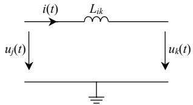  
图1 电感支路  
Fig. 1 Inductance branch

采用隐式梯形公式或欧拉法的离散差分方程可表示电流为

$$
\left\{ \begin{array}{l} i _ {L _ {j k}} (t) = \frac {\Delta t (1 + \alpha)}{2 L _ {j k}} u _ {j k} (t) + i _ {\text {h i s t}, j k} \\ i _ {\text {h i s t}, j k} = i _ {L _ {j k}} (t - \Delta t) + \frac {\Delta t (1 - \alpha)}{2 L _ {j k}} u _ {j k} (t - \Delta t) \end{array} \right. \tag {1}
$$

式中：系数 $\scriptstyle \alpha = 0$ 时，采用隐式梯形积分法计算式(1)，历史项 $i _ { \mathrm { h i s t } , j k }$ 与上一步的状态量和非状态量都有关；$\alpha = 1$ 时，采用后退欧拉法计算式(1)， $i _ { \mathrm { h i s t } , j k }$ 步的非状态量无关。

电磁暂态仿真计算中，在遇到网络发生突变时，非状态变量一般无法通过计算准确得到。考察式(1)的电感仿真差分方程式，如果采用隐式梯形积分，由于历史项与上一步的非状态量(两端电压)有关，并且两端电压在 0+ 瞬间计算不正确，这将使网络突变时隐式梯形算法产生数值振荡。

图 2 是一个简单的电感支路开断的例子，图 3是开断后，电感两端电压出现的数值振荡现象。

在对大功率电力电子系统进行仿真时，例如一个双极双桥直流输电系统由 48 个可控硅构成，一个周波内有 96 次动作，平均动作时间约 0.2ms，如果不对数值进行处理，或者不能完全消除数值振荡(数值振荡只能缓慢衰减)，将直接影响诸如熄弧时间、开通时间等重要测量，使控制系统计算结果差

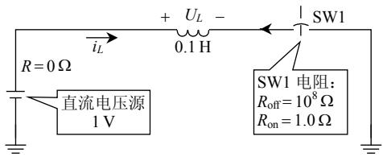  
图2 一个直接开断电感支路的例子

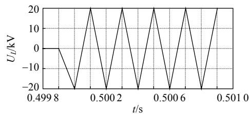  
Fig. 2 An example of switching on/off an inductance   
图3 电感两端电压的数值振荡  
Fig. 3 Numerical oscillation of inductance voltage距很大，可见对数值振荡进行处理极其重要。

为解决这一问题，要么求出突变后的非状态变量，要么采取好的积分算法，而在网络结构突变时回避非状态变量。

对于文献[19]给出的方法，由于实际电力系统是极其复杂的系统，元件很多，想以此法求解突变后的非状态变量是不切实际的，所以现实中一般不采用此法。

而如果采用后退欧拉法，历史项与上一步的非状态量(两端电压)无关，从而不会有数值振荡的问题。后退欧拉法的这个独特的优势，成为许多采用隐式梯形算法的电磁暂态程序在消除数值振荡问题时的主要算法[20-25]。 。

# 1.2 数值临界阻尼法

中国电力科学研究院和加拿大大不列颠哥伦比亚大学(UBC)合作共同提出的数值临界阻尼法(critical damp adjustment，CDA)[20-21]，其主要原理就是利用后退欧拉法的优势——后退欧拉法能避开非状态变量在突变时刻的值，从而不会产生数值振荡。其计算步骤为：

1）在一般情况下仍然使用隐式梯形积分法，其时间步长为 $\Delta t .$ 。  
2）若在 $t = t _ { z }$ 时刻网络发生突变，采用后退欧拉法，其步长改为 $\Delta t / 2$ ，共进行 2 次步长为 $\Delta t / 2$ 的后退欧拉法积分计算。  
3）在 $t _ { \mathrm { z } } + \Delta t$ 后，继续采用隐式梯形积分法计算，其步长恢复到∆t。

研究表明，2 个半步长的后退欧拉法基本可以消除数值振荡，而且，也必须要经过 2 次后退欧拉法才能消除网络突变引起的数值振荡，主要原

因是：

l）第1 个半步长后退欧拉法，计算出了正确的状态变量，而非状态变量可能是一个冲击响应，并且在某些特殊算例中，需要根据这个非状态变量的冲击响应进行网络突变的判断和操作。  
2）第 2 个半步长后退欧拉法才是真正消除数值振荡的有效步骤。

最初在进行 CDA 算法研究时，研究人员认为第1个半步后退欧拉法的作用只是为第2个半步后退欧拉法提供初值，其本身没有物理意义，因此在第1个半步长后退欧拉法结束时不进行网络突变判断，而将它留到整数步长时刻进行判断。后来才发现这个观点是错误的，第 1 个半步长后退欧拉法的结果反映了瞬变过程的冲激信号特性，其物理意义十分明显，结果不可忽略，必须进行网络突变的判断和操作。中国电力科学研究院林集明教授等在其开发的电磁暂态程序 EMTPE 中，应用该思路改进了电磁暂态程序，并将这种改进后的能反映冲激信号特性的 CDA 法称为改进的 CDA 法(improvedCDA，ICDA)[5]。

CDA法(包括ICDA法)既保留了隐式梯形积分精度高、稳定性好、编程简单的优点，又能消除数值振荡，已经作为 EMTPE 和 EMTP-RV 缺省使用的算法；而电磁暂态程序 ATP没有任何处理数值振荡的方法，其数值振荡严重，因此 ATP不适合具有快速开断电力电子器件的柔性交流输电系统和高压直流系统的电磁暂态仿真。

# 2 具有相互关联的连续事件处理

# 2.1 开关的动作次序

在电力电子仿真中，有许多电力电子器件的关断和闭合互为因果关系，例如，GTO的关断造成其他电力电子器件(如二极管)的闭合。他们虽为因果关系，但很可能是在同一瞬间完成，因此应把它看成同一瞬间的行为，完全有必要发展一种事件搜索方法，以检测不同电力电子器件之间的相互动作关系。

一个具有相互关联的连续事件如图 4 所示，开关 SW1 常闭，GTO 先截止，1.1s 时 GTO 导通，电感电流很快达到稳定运行值2A；1.2s时GTO断开，断开瞬间二极管导通，电感电流有通路，不会产生一个很大的脉冲，图 5 是其仿真波形。

但是如果电磁暂态程序不能正确处理连续的

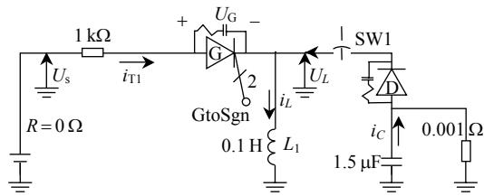  
图4 具有相互关联的连续事件

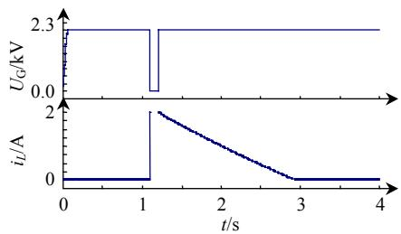  
Fig. 4 Continuous events in causality   
图 5 GTO 两端电压 $U _ { \mathbf { G } }$ 及流过电感 $L _ { 1 }$ 的电流 $i _ { L }$

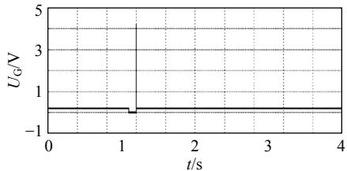  
Fig. 5 Terminal voltage of GTO and current of inductance事件序列，很可能得到错误的结果。例如，某电磁暂态程序的计算结果如图6所示，可见是不正确的；而高压直流电磁暂态仿真软件EMTDC如果不能根据不同算例的特点对算法进行正确设置，同样也会得到图 6 的结果。其错误的原因是在 GTO 断开同时，二极管不能正确导通，引起 GTO 两端电压出现很大的冲击。  
图 6 GTO 两端电压  
Fig. 6 Terminal voltage of GTO

# 2.2 同步响应法

林集明教授在其开发的 EMTPE 程序中，提出了同步响应法(simultaneous response procedure，SRP)[5]，其主要处理过程为：

1）在 $t = t _ { \mathrm { Z } }$ 时刻求解网络方程，得到 $t _ { \mathrm { z } }$ 时刻各元件的电压、电流等物理量。  
2）根据 $t _ { z }$ 时刻的电压、电流等物理量，找出是否有开关和电力电子器件需要改变其状态，如果没有就退出搜索过程，转向步骤 5）。  
3）如果需要改变状态，就根据其状态修改节点导纳阵、历史项及外部电流源，保持 $t = t _ { z }$ 不变，再次求解方程，得到 $t = t _ { \mathrm { Z } }$ 时刻其他各支路的电压、电流等物理量。  
4）重新启动搜索过程，转向步骤 2），直至没

有新的元件和新的状态发生改变为止。

5）退出 $t = t _ { z }$ 计算，按正常方式进入下一个时间步的计算。

EMTPE 中的SRP，附加的计算工作量并不多，计算速度快，仿真结果准确，尤其在处理电力电子仿真中，复杂动作的处理符合逻辑，非常有效。

# 3 考虑任意重事件发生的多步变步长电磁暂态仿真算法

# 3.1 多步变步长后退欧拉法

CDA 法(或 ICDA 法)采用连续 2 次半步后退欧拉法来消除数值振荡，要采用半步的主要原因是，采用隐式梯形算法步长取∆t/2 后，后退欧拉法的导纳阵和步长为∆t的隐式梯形积分公式一致，因此在后退欧拉法转向隐式梯形积分公式时，不需要再对导纳阵修改分解，只需要修改历史项，计算速度快。但是如果单纯从消除数值振荡角度来看，后退欧拉法采用多大步长都能消除数值振荡，并不一定必须为半步。

表1是图2所示算例采用2次不同步长的后退欧拉法(步长分别为0.35∆t和0.48∆t)的部分计算结果。虽然 2 次后退欧拉法的步长(分别为 0.35∆t 和0.48∆t)并不相等，也不等于半个正常的步长，但是同样可以基本有效地消除数值振荡。

表1 采用不同步长的后退欧拉法计算结果  
Tab. 1 Results of the variable-step backward Euler method   

<table><tr><td>时刻/ms</td><td>步长/ms</td><td>计算方法</td><td>电压/V</td></tr><tr><td>500.0000</td><td>0.0100</td><td>隐式梯形</td><td>0.006741</td></tr><tr><td>500.0035</td><td>0.0035</td><td>后退欧拉法</td><td>-28378.819720</td></tr><tr><td>500.0083</td><td>0.0048</td><td>后退欧拉法</td><td>0.000000</td></tr><tr><td>500.0183</td><td>0.0100</td><td>隐式梯形</td><td>-0.000000</td></tr><tr><td>500.0283</td><td>0.0100</td><td>隐式梯形</td><td>0.000000</td></tr></table>

在图 7 所示的数值振荡测试算例中，如果只采用 2 次后退欧拉法，GTO 两端电压在断点处的计算结果仍然有较为明显的数值振荡现象(电压振幅达到将近 9.2V 左右)，如图 8 所示。但如果采用 3步后退欧拉法，GTO 两端电压在断点处的部分计算结果如表 2 所示。从表 2 中可以看出，这时数值振荡抑制得很好，只有 0.0026 振幅，抑制效果明显。

本文提出了具有以下技术特点的多步变步长后退欧拉法：l）采用后退欧拉法的次数为 3 次及以上，次数可由用户自行调节；2）步长可根据计算的要求进行调整，不一定就必须为正常仿真步长的

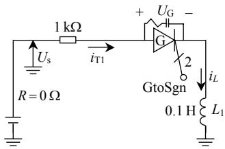  
图 7 数值振荡的测试例子

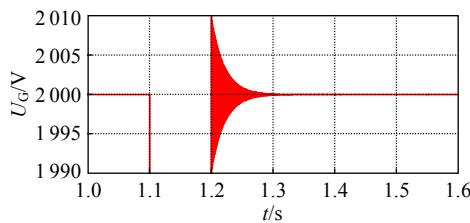  
Fig. 7 Test example of numerical oscillation   
图 8 2 步后退欧拉法计算结果  
Fig. 8 Results of the two-step backward Euler method

表2 采用多步后退欧拉法的计算结果  
Tab. 2 Results of the multistep backward Euler method   

<table><tr><td>时刻/s</td><td>步长/ms</td><td>计算方法</td><td>电压/V</td></tr><tr><td>1.200 000</td><td>0.010</td><td>隐式梯形</td><td>0.119999</td></tr><tr><td>1.200 005</td><td>0.005</td><td>后退欧拉法</td><td>41987.022816</td></tr><tr><td>1.200 010</td><td>0.005</td><td>后退欧拉法</td><td>2009.570641</td></tr><tr><td>1.200 015</td><td>0.005</td><td>后退欧拉法</td><td>1999.978470</td></tr><tr><td>1.200 025</td><td>0.010</td><td>隐式梯形</td><td>1999.973867</td></tr><tr><td>1.200 035</td><td>0.010</td><td>隐式梯形</td><td>1999.978468</td></tr><tr><td>1.200 045</td><td>0.010</td><td>隐式梯形</td><td>1999.973869</td></tr></table>

一半；3）改变算法和仿真步长时，根据 $\Delta t ( 1 + \alpha )$ 是否改变来判断是否需要重新修改导纳阵；4）该算法能彻底消除数值振荡，且计算灵活。

# 3.2 任意重发生的事件搜索与处理功能

在 PSModel电磁暂态计算中，事件主要指元件的开断操作、网络故障及变压器、发电机等饱和段的改变等。

每一步计算完毕后，PSModel都要检测是否有事件发生：如果在这一步没有事件发生，就表明计算成功，可进入下一步计算；如果有事件发生，就需要对事件进行处理。以仿真时间段 $t \sim t + \Delta t$ 为例，假设事件发生在中间时刻 $t { + } \Delta t ^ { \prime } .$ ，处理过程如图9所示。

具体的处理步骤为：

1）时段 $t \sim t + \Delta t$ 计算后，判断在时刻 $t + \Delta t ^ { \prime } ( \Delta t ^ { \prime } <$

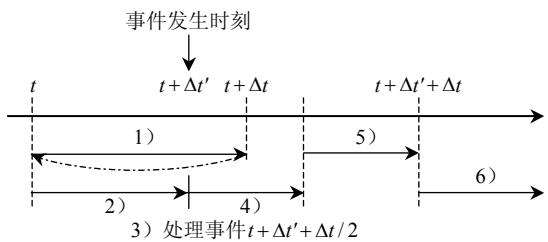  
图 9 事件处理过程  
Fig. 9 Event-handling process

∆t)是否发生事件，这一步计算抛弃。

2）回退到时刻 t，以时刻t 的网络状态计算 t~$t + \Delta t ^ { \prime }$ 时段，由于这一步计算的步长由∆t 变为∆t'，导纳阵的值也会发生改变，需要重新形成和分解方程式。  
3）在 $t + \Delta t ^ { \prime }$ 时刻处理事件，改变网络状态可能会改变导纳阵的值或结构。  
4）用新的网络状态和导纳阵的值，采用后退欧拉法和 $\Delta t / 2$ 步长，对时段 $t + \Delta t ^ { \prime } { \sim } t + \Delta t ^ { \prime } + \Delta t ^ { \prime } / 2$ 进行仿真。  
5）再次采用后退欧拉法和 $\Delta t / 2$ 步长，对时段$t + \Delta t ^ { \prime } + \Delta t / 2 \sim t + \Delta t ^ { \prime } + \Delta t$ 进行仿真。  
6）计算成功后，可采用后退欧拉法或隐式梯形公式继续进行下一步计算。

在复杂系统的计算中，很可能在应用后退欧拉法处理断点时，又发生了事件。PSModel 只需调整事件发生的时间，仍然多次继续使用后退欧拉法，就可应付任意复杂连续事件发生的情况。

# 3.3 算法计算流程

计算流程如图 10 所示。

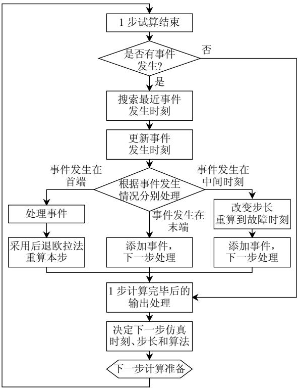  
图10 算法计算流程  
Fig. 10 Flow chart of the calculation

# 3.4 新算法的优点

考虑任意重事件发生的多步变步长电磁暂态算法，具有以下优点：

1）在网络发生改变后，一般地，可采用后退

欧拉法，用来消除数值振荡。如果后退欧拉法的步长是正常步长的一半，在转向正常步长隐式梯形算法后，不需要修改导纳阵，计算速度快。

2）发生事件后，使用后退欧拉法计算次数可由用户来调节，经过研究认为，使用 3 次及以上的后退欧拉法具有更好的消除数值振荡的效果，这是对 CDA(或 ICDA 法)的改进。  
3）在每一步计算后，不管是采用后退欧拉法还是隐式梯形算法，都要进行事件搜索和处理，该功能使电磁暂态程序在处理同时发生的事件或时间间隔非常短的事件方面，能力很强。  
4）如果在使用后退欧拉法的过程中，继续有事件发生，后退欧拉法就不可能再严格保持半个步长，只要遵循“发生事件后一定要使用 3 次及以上后退欧拉法”这一原则，就不会影响电磁暂态程序消除数值振荡的效果，因此本算法的重要特点是采用了多步可变步长的后退欧拉法，计算灵活，这也是与 CDA(或 ICDA 法)的不同之处。  
5）发生事件后，PSModel 采取与同步响应法不同的处理方法：PSModel 不是通过插值的方法来求取断点处的状态量和非状态量的值，而是采用抛弃上一次计算结果，然后重新计算至断点处的方法。这种处理策略计算量稍大一些。但是：对于事件发生的时刻搜索准确，计算结果精确；不需要对于情况更为复杂的控制部分进行插值处理，编程简单；并且对步长具有很大的适应性，不同步长的计算结果相差不大。

# 4 采用新算法的仿真结果

# 4.1 高压直流输电系统仿真计算

采用 CIGRE 提供的高压直流输电标准测试系统，图 11、12 为使用新算法后，将仿真步长分别设为 2µs 和 2ms，逆变侧换流阀的阀电压和阀电流波形对比。

从图 11、12 的结果可看出，本算法的计算结果正确，能彻底消除数值振荡问题；并且对于仿真步长有非常好的适应性：用户选择 $2 { \sim } 2 0 0 0 { \mu \mathrm { s } }$ 不同的步长，该算法都能自动根据开关动作情况调整步长，从而计算结果几乎没有区别。这就是采用本算法后电磁暂态程序体现出的优势。

表 3 是采用不同步长时计算速度和效率的对比。由于算法自动搜索“过零点”，在 CIGRE 直流标准测试系统这个算例中，步长取 200µs，将具有

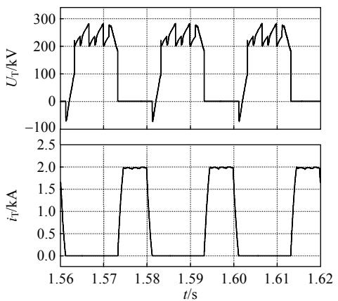  
图11 步长为2 µs 时逆变侧阀电压及阀电流波形

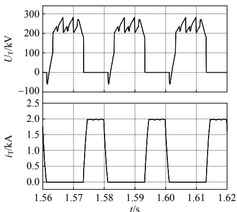  
Fig. 11 Curve of the valve voltage and valve current of the inverter at the step of 2 µs   
图12 步长为2 ms 时逆变侧阀电压及阀电流波形  
Fig. 12 Curve of the valve voltage and valve current of the inverter at the step of 2 ms

表 3 取不同步长时计算速度的对比  
Tab. 3 Comparison of computing speeds for different steps   

<table><tr><td>步长/μs</td><td>计算步数</td><td>平均步长/μs</td><td>总计算时间/s</td></tr><tr><td>2</td><td>1008990</td><td>1.98</td><td>168.40</td></tr><tr><td>5</td><td>406939</td><td>4.90</td><td>42.00</td></tr><tr><td>10</td><td>206955</td><td>9.70</td><td>18.04</td></tr><tr><td>20</td><td>106907</td><td>18.30</td><td>8.84</td></tr><tr><td>50</td><td>46833</td><td>42.70</td><td>4.40</td></tr><tr><td>100</td><td>26850</td><td>74.50</td><td>3.10</td></tr><tr><td>200</td><td>16222</td><td>123.20</td><td>2.60</td></tr><tr><td>500</td><td>13552</td><td>147.60</td><td>2.94</td></tr><tr><td>1000</td><td>13559</td><td>147.50</td><td>3.26</td></tr><tr><td>2000</td><td>13552</td><td>147.60</td><td>3.40</td></tr></table>

最快的仿真速度，步长过长将反而增加“过零点”的搜索次数，从而影响整体计算效率。

# 4.2 GTO 快速开断算例

在图 6 所示的算例中，让 GTO 快速开断(频率达到 2 kHz)，考察 GTO 两端电压和电感电流，如图 13 所示。图 13 表明新算法具有非常好的计算稳定性，完全适用于具有快速开断的电力电子器件电路的仿真计算。

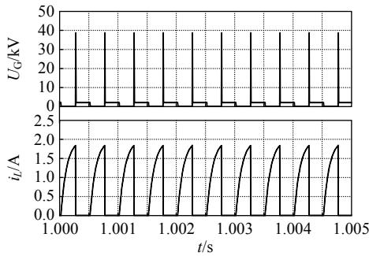  
图 13 GTO 两端电压及流过 GTO 的电流  
Fig. 13 Curve of terminal voltage and current of GTO

# 5 结论

本文提出了一套在电磁暂态计算中能应用于大规模电力电子仿真的考虑任意重事件发生的多步变步长电磁暂态仿真算法，能很好地处理数值振荡和任意多重事件同时发生的问题。

采用该算法，虽然计算量稍大一些。但是：对于事件发生的时刻搜索准确，计算结果精确；不需要对于情况更为复杂的控制部分进行插值处理，编程简单灵活；并且对步长具有很大的适应性，不同步长的计算结果相差不大，数值稳定性好。从而大大提高了电力系统电磁暂态程序对电力电子元器件模拟的准确性和仿真能力。

# 致 谢

在本算法开展研究过程中，得到了中国电力科学研究院的电磁暂态专家林集明教授、李永庄教授以及电磁暂态研究室的同志，在电磁暂态算法方面的指导和帮助，特此表示感谢。

# 参考文献

[1] Dommel H W．EMTP theory book[M]．Vancouver，Canada：MicrotranPower System Analysis Corparation，1992：14-17．  
[2] Dommel H W．电力系统电磁暂态计算理论[M]．李永庄，林集明，曾昭华，译．北京：水利电力出版社，1991：14-17  
[3] Manitoba HVDC Research Centre．EMTDC 用户手册[R]．Winnipeg，Manitoba，Canada：Manitoba HVDC Research Centre，2003  
[4] Manitoba HVDC Research Centre．PSCAD 用户手册[R]．Winnipeg，Manitoba，Canada：Manitoba HVDC Research Centre，2003  
[5] 林集明，陈珍珍．Windows 版电力电子与电磁暂态仿真软件包EMTPE的研究与开发(上)：计算方法与数学模型[R]．北京：中国电力科学研究院，2000  
[6] 刘文焯，汤涌，万磊，等．大电网特高压直流系统建模与仿真技术[J]．电网技术，2008，32(22)：1-3，7Liu Wenzhuo，Tang Yong，Wan Lei，et al．Modeling and simulationtechnologies for large UHVDC power grid[J] ． Power SystemTechnology，2008，32(22)：1-3，7(in Chinese)  
[7] 刘文焯，郭小江，张键，等．大规模交直流系统全暂态数字仿真研究报告之1：电磁暂态计算程序PSModel技术报告[R]．北京：中国电力科学研究院，2005

[8] 岳程燕，田芳，周孝信，等．大规模交直流系统全暂态数字仿真研究报告之 2：算法、模型和对比分析[R]．北京：中国电力科学研究院，2005．  
[9] 岳程燕，田芳，周孝信，等．电力系统电磁暂态–机电暂态混合仿真接口原理[J]．电网技术，2006，30(1)：23-27Yue Chengyan，Tian Fang，Zhou Xiaoxin，et a1．Principle of interfacesfor hybrid simulation of power system electromagnetic-electromechanical transient process[J]．Power System Technology，2006，30(1)：23-27(in Chinese)  
[10] 岳程燕，田芳，周孝信，等．电力系统电磁暂态–机电暂态混合仿真的应用[J]．电网技术，2006，30(11)：1-5Yue Chengyan，Tian Fang，Zhou Xiaoxin，et a1．Application ofinterfaces for hybrid simulation of power system electromagnetic-electromechanical transient process[J]．Power System Technology，2006，30(11)：1-5(in Chinese)  
[11] 岳程燕，田芳，周孝信，等．电力系统电磁暂态–机电暂态混合仿真接口实现[J]．电网技术，2006，33(4)：6-10Yue Chengyan，Tian Fang，Zhou Xiaoxin，et a1．Implementation ofinterfaces for hybrid simulation of power system electromagnetic-electromechanical transient process[J]．Power System Technology，2006，33(4)：6-10(in Chinese)  
[12] 刘皓明，朱浩骏，严正，等．含统一潮流控制器装置的电力系统动态混合仿真接口算法研究[J]．中国电机工程学报，2005，25(16)：1-7．Liu Haoming，Zhu Haojun，Yan Zheng，et a1．Study on interfacealgorithm for power system transient stability hybrid-modelsimulation with UPFC device[J]．Proceedings of the CSEE，2005，25(16)：1-7(in Chinese)  
[13] 王栋，童陆园，洪潮．数字计算机机电暂态与 RTDS 电磁暂态混合实时仿真系统[J]．电网技术，2008，32(6)：42-46Wang Dong ， Tong Luyuan ， Hong Chao ． Digital computerelectromechanical transient and RTDS electromagnetic transienthybrid real-time simulation system[J]．Power System Technology，2008，32(6)：42-46(in Chinese)  
[14] 王路，李兴源，罗凯明，等．关于电力系统电磁与机电暂态混合仿真的研究[J]．电网技术，2005，29(15)：23-27Wang Lu，Li Xingyuan，Luo Kaiming，et al．Study on multirate hybridsimulation technology for AC/DC power system[J]．Power SystemTechnology，2005，29(15)：23-27(in Chinese)  
[15] 柳勇军，梁旭，闵勇，等．电力系统混合仿真的接口算法[J]．电力系统自动化，2006，30(11)：44-48Liu Yongjun，Liang Xu，Min Yong，et a1．Interface algorithm in powersystem electromechanical transient and electromagnetic transienthybrid simulation[J]．Automation of Electric Power Systems，2006，30(11)：44-48(in Chinese)  
[16] 宋强，刘文华，范子超．大功率电力电子装置的混合实时仿真[J]清华大学学报：自然科学版，2008，48(7)：1069-1072Song Qiang，Liu Wenhua，Fan Zichao．Real-time hybrid simulationfor high power electronic system[J]．Journal of Tsinghua University：Science and Technology，2008，48(7)：1069-1072(in Chinese)  
[17] 贺洋，李兴源．关于电力系统电磁与机电暂态混合仿真的研究[J]现代电力，2008，25(5)：20-24

He Yang，Li Xingyuan．Hybrid simulation of power system based on electromagnetic and electromechanical transient simulation[J] ． Modern Electric Power，2008，25(5)：20-24(in Chinese)   
[18] 于庆广，胥埴伦．大功率电力电子装置的混合实时仿真[J]．中国电力，2007，40(11)：38-41Yu Qingguang ， Xu Zhilun ． Electromagnetic-electromechanicaltransient hybrid simulation in power system[J]．Electric Power，2007，40(11)：38-41(in Chinese)  
[19] 陈超英，贺家李．电力系统数字仿真中消除非原型振荡的一种新方法：龙–库–梯法[J]．中国电机工程学报，1995，15(3)：210-216Chen Chaoying，He Jiali．New method for eliminating nonprototypeoscillations in digital simulation of power system：R-K-T method[J]Proceedings of the CSEE，1995，15(3)：210-216(in Chinese)  
[20] Marti H，Lin Jiming．Suppression of numerical oscillation in the EMTP[J]．IEEE Trans. on Power Systems，1989，4(4)：739-747．   
[21] Lin Jiming，Marti H．Implementation of the CDA procedure in the EMTP[J]．IEEE Trans. on Power Systems，1990，5(2)：394-402   
[22] Brandwajn V．Damping of numerical noise in the EMTP solution[J]EMTP Newsletter，1982，2(3)：10-19  
[23] Alvarado F L，Lasseter R H，Sanchz J J．Testing of trapezoidal integration with damping for the solution of power transient problems [J]．IEEE Trans. on Power Apparatus and Systems，1983，102(12)： 3783-3790   
[24] 刘益青，陈超英．用以消除数值振荡的阻尼梯形法误差分析与修正[J]．中国电机工程学报，2003，23(7)：57-61．Liu Yiqing ， Chen Chaoying ． Errors analysis and correction ofdamping trapezoidal intergration for eliminating numericaloscillations[J]．Proceedings of the CSEE，2003，23(7)：57-61(inChinese)  
[25] 张益，周群．电力系统数字仿真中的数值振荡及对策[J]．上海交通大学学报，1999，33(12)：1545-1549Zhang Yi，Zhou Qun．Numerical oscillation and its counter measuresin power system simulation[J] ． Journal of Shanghai JiaotongUniversity，1999，33(12)：1545-1549(in Chinese)

  
刘文焯

收稿日期：2009-07-09。

作者简介：

刘文焯(1972—)，男，硕士，高级工程师，长期从事电力系统仿真与分析技术研究、软件开发工作，liuwzh@epri.ac.cn；

汤涌(1959—)，男，博士，教授级高级工程师，博士生导师，主要从事电力系统仿真与分析技术研究；

侯俊贤(1978—)，男，硕士，高级工程师，长期从事电力系统仿真与分析技术研究、软件开发工作；宋新立(1971—)，男，硕士研究生，高级工程师，长期从事电力系统仿真与分析技术研究、软件开发工作；

万磊(1984—)，男，硕士研究生，研究方向为FACTS 电磁暂态与机电暂态混合仿真。

(责任编辑 谷子)