Received 12 August 2025, accepted 18 September 2025, date of publication 6 October 2025, date of current version 10 October 2025.

Digital Object Identifier 10.1109/ACCESS.2025.3617222

# RESEARCH ARTICLE

# Electromagnetic Transient Model Reconstruction of Generalized Power Transmission Lines Based on Time-Synchronized Waveform Measurements

PABLO GOMEZ , (Senior Member, IEEE)

Department of Electrical and Computer Engineering, Western Michigan University, Kalamazoo, MI 49008, USA

e-mail: pablo.gomez@wmich.edu

With utmost respect and admiration, this article is dedicated to the memory of Prof. Hermann Dommel.

ABSTRACT Thanks to the novel technology of waveform measurement units (WMUs), it is now possible to record time-synchronized waveforms (synchro-waveforms) at different power system locations. Leveraging these new opportunities, this paper introduces a method for accurate wideband measurement-based reconstruction of single- and three-phase frequency-dependent transmission line models for electromagnetic transient (EMT) studies. This method also accommodates hybrid (overhead-underground) systems and longitudinal parameter variations (nonuniformities). A 2-port line model is generated across a broad frequency spectrum using WMU terminal recordings and the numerical Laplace transform. For single-phase uniform lines, one transient recording set is sufficient for model reconstruction; this extends to ideally transposed three-phase lines. For single-phase nonuniform and three-phase uniform and nonuniform untransposed lines, a minimum norm least-squares method is applied to solve an overdetermined system from multiple recordings with linearly independent responses. Simulated measurements from ATP (Alternative Transient Program) are used for three test cases: a three-phase balanced uniform line, a single-phase hybrid system, and a three-phase unbalanced nonuniform line. The reconstructed model responses are compared with ATP simulations, confirming the technique’s accuracy and robustness. Furthermore, the impact of practical signal conditions on reconstruction accuracy is analyzed in detail, including noise, resolution, and ratio and phase displacement errors from instrument transformers.

INDEX TERMS Black-box modeling, electromagnetic transients, Laplace transforms, two-port model reconstruction, synchro-waveforms, transmission line modeling, wideband.

# I. INTRODUCTION

Transmission line modeling for electromagnetic transient (EMT) analysis has reached an exceptional level of maturity. Existing line models are capable of introducing many aspects of their behavior, such as different geometrical and electrical configurations with diverse conductors’ dispositions, distributed nature of their parameters, frequency dependence, among other factors [1].

Notwithstanding the level of modeling detail currently achievable, several real-world situations that occur over the lifespan of a transmission line, and that are generally

The associate editor coordinating the review of this manuscript and approving it for publication was Elisabetta Tedeschi .

neglected by existing models, can reduce the line modeling accuracy when applied to practical studies, such as environmental and weather conditions (e.g., contamination, icing, seasonal variation of ground resistivity, vegetation encroachment); aging effects (e.g., material degradation, corrosion, increased sagging, decrease in connection integrity); mechanical stresses; system upgrades or modifications; or even partial or full damage.

On the other hand, EMT models of transmission lines are now deemed necessary to analyze power grids incorporating distributed generation (DG), even for studies traditionally reliant on phasor models [2]. This shift arises from the rapid dynamics of contemporary power electronic devices employed in the integration of DG, which

operate across a broad frequency spectrum beyond the nominal frequency [3]. For example, research indicates that incorporating wideband frequency-dependent transmission line parameters can be critical for the accurate prediction of dynamic grid-converter interactions that can trigger transient instability [3], [4].

Considering the aforementioned challenges, a new modeling framework is necessary to complement existing analytical approaches used in commercial software tools to enable the study of wideband EMT interactions between transmission lines and other components in an accurate, realistic and adaptive manner.

Efforts have been made to derive transmission line models and/or their parameters from measurement data rather than relying solely on analytical derivations [5], [6], [7], [8], [9]. Such efforts have focused primarily on steady-state studies and fault detection, severely limiting their applicability to EMT analysis. Recent work from our group has used terminal measurements to estimate the parameters of uniform overhead transmission lines over a wide frequency range [10], [11].

On the other hand, measurement-based approaches for frequency-dependent black-box modeling have been proposed for transformers [12], and more recently for shielded cables [13], focused on their use in EMT studies. These contributions can have great practical value if expanded to other devices and systems, opening the door to continue exploring the use of measurement-based approaches to account for realistic topological and operating conditions of power grid components over a wide frequency band.

Nonetheless, measurement-based modeling approaches for power components and systems are challenging due to the limited availability of data and the time-misalignment between measurements at different locations, among other factors. First, voltage and current data from power systems are commonly obtained as magnitude and phase angle from phasor measurement units (PMUs), which offer a great insight into the presence of power system disturbances for monitoring, protection and control purposes [14], but do not provide detailed time-domain information regarding the transient response and frequency content during such events. Second, although PMUs are capable of time synchronization between remote locations using GPS (Global Positioning System) or PTP (Precision Time Protocol) [15], this was previously regarded as unattainable for time domain waveforms. Both of these challenges have been overcome with the advent of devices capable of recording time synchronized waveforms (synchro-waveforms) with precise time stamps, known as waveform measurement units (WMUs) [16]. WMUs are expected to be widely deployed over the next years with applications in condition monitoring, protection, situational awareness, asset management, fault detection and location, among others. Some recent works investigating such applications of WMUs can be found in [17], [18], [19], [20], [21], and [22].

Exploring the opportunities lying ahead with the deployment of WMUs, and expanding upon our preliminary work that proposed a transmission line parameter estimation approach from transient measurements [10], [11], as well as a similar reconstruction approach applied to power-electronic converters [23], [24], [25], our present paper aims to contribute to the state of the art on transmission line modeling by establishing a novel and general methodology for the use of WMU-based terminal measurements for the reconstruction of wideband line models. Our methodology can consider single- and three-phase systems, as well as hybrid line-cable topologies and systems with arbitrary variation of parameters along their length.

This paper is organized as follows: Section II describes the mathematical methodology for transmission line model reconstruction for different line configurations. Section III shows the application of the proposed methodology in three different cases with diverse levels of complexity. Section IV discusses the effect of practical measurement factors, such as sampling resolution and signal noise, and describes future steps to be followed for further evaluation and practical implementation of the proposed methodology. Section V provides concluding remarks of this paper. An Appendix is also included for a brief explanation of the numerical Laplace transform.

# II. GENERAL METHODOLOGY

For the remainder of this section, we assume that WMU-based time domain current and voltage measurements are available at the terminals of a transmission system, as shown in Fig. 1. It is also assumed that the transmission line 2-port model is linear, which is a very common assumption in transmission line modeling, but would preclude the application of the proposed method if the measurements are affected by nonlinear conditions, such as the presence of corona.

# A. SINGLE-PHASE SYSTEM–SYMMETRICAL 2-PORTMODEL

To describe the proposed model reconstruction method, we start by establishing the relationship between voltages and currents measured at the sending (S) and receiving (R) terminals of a transmission line by means of a Laplace-domain admittance (nodal) model. For a line with uniform parameters (i.e., space independent) this can be defined as

$$
\left[ \begin{array}{l} I _ {S} (s) \\ I _ {R} (s) \end{array} \right] = \left[ \begin{array}{c c} A (s) & B (s) \\ B (s) & A (s) \end{array} \right] \left[ \begin{array}{l} V _ {S} (s) \\ V _ {R} (s) \end{array} \right], \tag {1}
$$

where $s = c + j \omega$ is the Laplace (complex) variable; A(s) and B(s) are the self and mutual elements of the admittance matrix of the line; $I _ { S } ( s ) , I _ { R } ( s ) , V _ { S } ( s )$ and $V _ { R } ( s )$ are terminal (S and R) currents and voltages obtained by applying the numerical Laplace transform (NLT) [26] to the transient (time-domain) measurements $i _ { S } ( t ) , i _ { R } ( t ) , \nu _ { S } ( t )$ and $\nu _ { R } ( t )$ as follows:

$$
I _ {S, R} (s) = \operatorname {N L T} \left\{i _ {S, R} (t) \right\}, \tag {2a}
$$

$$
V _ {S, R} (s) = \operatorname {N L T} \left\{v _ {S, R} (t) \right\}. \tag {2b}
$$

Details of the NLT algorithm are included in the Appendix. Simple algebraic manipulation of (1) results in its solution for A(s) and B(s):

$$
\left[ \begin{array}{l} A (s) \\ B (s) \end{array} \right] = \left[ \begin{array}{l l} V _ {S} (s) & V _ {R} (s) \\ V _ {R} (s) & V _ {S} (s) \end{array} \right] ^ {- 1} \left[ \begin{array}{l} I _ {S} (s) \\ I _ {R} (s) \end{array} \right]. \tag {3}
$$

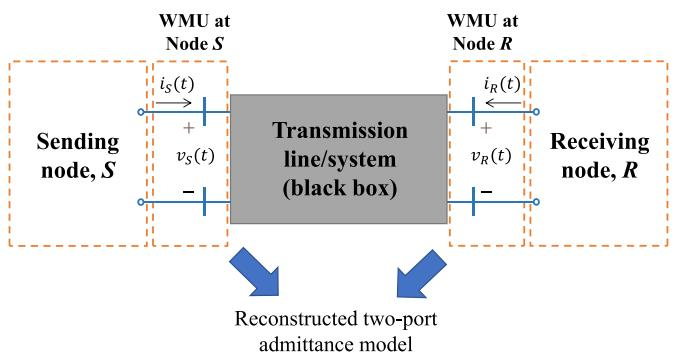  
FIGURE 1. Schematic representation of the proposed model reconstruction method.

Eq. (3) shows that the two-port model of a single-phase line can be fully characterized from its terminal voltage and current relationships as a function of the complex frequency s. We presented a similar approach in [10] to estimate the frequency dependent parameters of single-phase lines.

The procedure in this subsection assumes that the two-port model of the line is symmetrical, meaning that the sending and receiving nodes of the line are indiscernible, i.e., they can be interchanged without any effect [27]. This is applicable to uniform lines, as well as nonuniform lines with longitudinal symmetry (e.g., symmetrical sagging between two towers). Model reconstruction for nonsymmetrical 2-port models is treated in Sections II-C and II-E.

It is very important to reiterate at this point that, as in [27], the term symmetry is used in this paper to identify longitudinal symmetry of the line rather than any kind of lateral symmetry of the transmission system (e.g., symmetrical disposition of phases in a tower). The proposed reconstruction procedure does not require any assumption of lateral symmetry for 3-phase systems, as will be explained in the Sections II-D and II-E. However, a particular solution can be defined for ideally transposed lines, as explained in the next section.

# B. BALANCED THREE-PHASE SYSTEM–SYMMETRICAL 2-PORT MODEL

The method described in Section II-A for single-phase uniform lines can be further extended to the case of balanced and (longitudinally) symmetrical n-conductor transmission systems that can be decoupled into n independent single-phase systems, such as an ideally transposed three-phase overhead line that can be decoupled using Clarke’s transformation matrix [28]. This matrix results in exact modal decoupling for ideally transposed lines using real and constant values.

The reconstruction approach in this case starts from a similar system to (1), but now defined by submatrices and subvectors as follows:

$$
\left[ \begin{array}{l} \mathbf {I} _ {S} \\ \mathbf {I} _ {R} \end{array} \right] = \left[ \begin{array}{l l} \mathbf {A} & \mathbf {B} \\ \mathbf {B} & \mathbf {A} \end{array} \right] \left[ \begin{array}{l} \mathbf {V} _ {S} \\ \mathbf {V} _ {R} \end{array} \right], \tag {4}
$$

where $\mathbf { I } _ { S } , \mathbf { I } _ { R } , \mathbf { V } _ { S }$ and $\mathbf { V } _ { R }$ are Laplace-domain $3 \times 1$ phase current and voltage subvectors, obtained by applying the NLT to the corresponding transient measurements for each phase:

$$
\mathbf {I} _ {S} = \mathrm {N L T} \left\{\left[ i _ {S A} (t) \quad i _ {S B} (t) \quad i _ {S C} (t) \right] ^ {\mathrm {t}} \right\}, \tag {5a}
$$

$$
\mathbf {I} _ {R} = \mathrm {N L T} \left\{\left[ i _ {R A} (t) \quad i _ {R B} (t) \quad i _ {R C} (t) \right] ^ {\mathrm {t}} \right\}, \tag {5b}
$$

$$
\mathbf {V} _ {S} = \mathrm {N L T} \left\{\left[ v _ {S A} (t) \quad v _ {S B} (t) \quad v _ {S C} (t) \right] ^ {\mathrm {t}} \right\}, \tag {5c}
$$

$$
\mathbf {V} _ {R} = \mathrm {N L T} \left\{\left[ v _ {R A} (t) \quad v _ {R B} (t) \quad v _ {R C} (t) \right] ^ {\mathrm {t}} \right\}, \tag {5d}
$$

while A and Bare admittance submatrices of size $3 \times 3 .$ . The superscript $\mathbf { \ddot { r } } ( \mathbf { \dot { r } } ) $ in (5a) to (5d) represents transpose operation to obtain column vectors. Unless otherwise noted, all quantities in (4) and in the rest of the derivations in this section are Laplace functions, but the term ‘‘(s)’’ is omitted for the remainder of the section to simplify the notation.

Assuming ideal transposition, the Clarke transformation of phase voltages and currents at the sending and receiving nodes is given as follows:

$$
\mathbf {V} _ {S} ^ {\alpha \beta} = \mathbf {T V} _ {S}, \mathbf {V} _ {R} ^ {\alpha \beta} = \mathbf {T V} _ {R}, \tag {6a,b}
$$

$$
\mathbf {I} _ {S} ^ {\alpha \beta} = \mathbf {T I} _ {S}, \mathbf {I} _ {R} ^ {\alpha \beta} = \mathbf {T I} _ {R}, \tag {6c,d}
$$

where the $\alpha \beta$ superscript denotes quantities in the Clarke’s domain, and T is the Clarke’s transformation matrix. Substituting (6a,b) in (4), we obtain the following decoupled system in Clarke’s domain:

$$
\left[ \begin{array}{l} \mathbf {I} _ {S} ^ {\alpha \beta} \\ \mathbf {I} _ {R} ^ {\alpha \beta} \end{array} \right] = \left[ \begin{array}{l l} \mathbf {A} ^ {\alpha \beta} & \mathbf {B} ^ {\alpha \beta} \\ \mathbf {B} ^ {\alpha \beta} & \mathbf {A} ^ {\alpha \beta} \end{array} \right] \left[ \begin{array}{l} \mathbf {V} _ {S} ^ {\alpha \beta} \\ \mathbf {V} _ {R} ^ {\alpha \beta} \end{array} \right], \tag {7}
$$

where $\mathbf { A } ^ { \alpha \beta }$ and $\mathbf { B } ^ { \alpha \beta }$ are diagonalized matrices given by

$$
\mathbf {A} ^ {\alpha \beta} = \mathbf {T A T} ^ {- 1}, \mathbf {B} ^ {\alpha \beta} = \mathbf {T B T} ^ {- 1}. \tag {8a.b}
$$

Further algebraic manipulation of $( 7 )$ results in the following direct solution for the elements of $\mathbf { A } ^ { \alpha \beta }$ and $\mathbf { B } ^ { \alpha \beta }$ :

$$
\left[ \begin{array}{l} \mathbf {A} _ {V} ^ {\alpha \beta} \\ \mathbf {B} _ {V} ^ {\alpha \beta} \end{array} \right] = \left[ \begin{array}{c c} \mathbf {V} _ {S M} ^ {\alpha \beta} & \mathbf {V} _ {R M} ^ {\alpha \beta} \\ \mathbf {V} _ {R M} ^ {\alpha \beta} & \mathbf {V} _ {S M} ^ {\alpha \beta} \end{array} \right] ^ {- 1} \left[ \begin{array}{l} \mathbf {I} _ {s} ^ {\alpha \beta} \\ \mathbf {I} _ {R} ^ {\alpha \beta} \end{array} \right]. \tag {9}
$$

Voltage submatrices in (9) are diagonal matrices constructed from the elements of VαβS a ${ \bf V } _ { S } ^ { \alpha \beta }$ nd αβ $\bar { \mathbf { V } } _ { R } ^ { \alpha \beta }$

$$
\mathbf {V} _ {S M} ^ {\alpha \beta} = \operatorname {d i a g} \left(\mathbf {V} _ {S} ^ {\alpha \beta}\right), \mathbf {V} _ {R M} ^ {\alpha \beta} = \operatorname {d i a g} \left(\mathbf {V} _ {R} ^ {\alpha \beta}\right), \tag {10a,b}
$$

while $\mathbf { A } _ { V }$ and $\mathbf { B } _ { V }$ correspond to the elements of (8a) and (8b) arranged as column vectors:

$$
\mathbf {A} _ {V} ^ {\alpha \beta} = \left[ \begin{array}{l l l} A _ {\alpha} & A _ {\beta} & A _ {0} \end{array} \right] ^ {\mathrm {t}}, \tag {11a}
$$

$$
\mathbf {B} _ {V} ^ {\alpha \beta} = \left[ \begin{array}{l l l} B _ {\alpha} & B _ {\beta} & B _ {0} \end{array} \right] ^ {\mathrm {t}}. \tag {11b}
$$

Once (9) is computed, the admittance model of the line is obtained by solving (8a) and (8b) for A and B, thus returning to the phase domain.

# C. SINGLE-PHASE SYSTEM-NONSYMMETRICAL 2-PORTMODEL

To extend this approach to lines with general space dependence, let us consider first the case of a single-phase line described by a two-port system where no assumptions of symmetry of the admittance matrix are made:

$$
\left[ \begin{array}{l} I _ {S} \\ I _ {R} \end{array} \right] = \left[ \begin{array}{c c} A & B \\ C & D \end{array} \right] \left[ \begin{array}{l} V _ {S} \\ V _ {R} \end{array} \right]. \tag {12}
$$

The definition of a nonsymmetrical admittance matrix in (12) with 4 different elements (different self elements and different mutual elements) assumes that the space dependence of the line results in unequal forward and backward characteristics. This behavior is due to the fact that uneven distributed shunt admittance and series impedance along the line creates asymmetric characteristic impedance profiles for forward wave and backward wave propagation [27].

Rewriting (12) to solve for $A , B , C$ and D results in the following underdetermined algebraic system [23]:

$$
\left[ \begin{array}{l} I _ {S} \\ I _ {R} \end{array} \right] = \left[ \begin{array}{c c c c} V _ {S} & V _ {R} & 0 & 0 \\ 0 & 0 & V _ {S} & V _ {R} \end{array} \right] \left[ \begin{array}{l} A \\ B \\ C \\ D \end{array} \right]. \tag {13}
$$

Eq. (13) has either no solution or an infinite number of solutions for the admittance column vector. Thus, a procedure similar to the one proposed in [23] for model reconstruction of DC-DC power converters is applied here, where more than one distinct terminal voltage-current measurement set is considered. For instance, considering two distinct recordings $T _ { 1 }$ and $T _ { 2 }$ that produce different transient voltage and current responses, we obtain the following:

$$
\left[ \begin{array}{l} \mathbf {I} ^ {T _ {1}} \\ \mathbf {I} ^ {T _ {2}} \end{array} \right] _ {4 \times 1} = \left[ \begin{array}{l} \mathbf {V} ^ {T _ {1}} \\ \mathbf {V} ^ {T _ {2}} \end{array} \right] _ {4 \times 4} [ \mathbf {Y} ] _ {4 \times 1}, \tag {14}
$$

where Y is a column vector containing the elements of the reconstructed two-port model, while the current subvectors and voltage submatrices in (14) are defined as follows:

$$
\mathbf {I} ^ {T _ {\mathrm {i}}} = \left[ \begin{array}{l} I _ {S} ^ {T _ {\mathrm {i}}} \\ I _ {R} ^ {T _ {\mathrm {i}}} \end{array} \right], \tag {15a}
$$

$$
\mathbf {V} ^ {T _ {\mathrm {i}}} = \left[ \begin{array}{c c c c} V _ {S} ^ {T _ {\mathrm {i}}} & V _ {R} ^ {T _ {\mathrm {i}}} & 0 & 0 \\ 0 & 0 & V _ {S} ^ {T _ {\mathrm {i}}} & V _ {R} ^ {T _ {\mathrm {i}}} \end{array} \right], \tag {15b}
$$

for i = 1, 2. However, it has been observed that the 4×4 voltage matrix in (14) is ill-conditioned in general, precluding the direct solution of (14) for vector Y. An alternative solution to (14) can be found by introducing additional transient recordings that generate more sets of voltage-current terminal measurements, thus producing an overdetermined system of the form

$$
\left[ \begin{array}{l} \mathbf {I} ^ {T _ {1}} \\ \mathbf {I} ^ {T _ {2}} \\ \vdots \\ \mathbf {I} ^ {T _ {\mathrm {n}}} \end{array} \right] _ {2 \mathrm {n} \times 1} = \left[ \begin{array}{l} \mathbf {V} ^ {T _ {1}} \\ \mathbf {V} ^ {T _ {2}} \\ \vdots \\ \mathbf {V} ^ {T _ {\mathrm {n}}} \end{array} \right] _ {2 \mathrm {n} \times 4} [ \mathbf {Y} ] _ {4 \times 1}, \tag {16}
$$

where $\mathtt { n } \ge 3$ is the minimum number of transient recordings needed. Eq. (16) can be solved by employing the minimum norm least-squares (MNLS) method [29], which computes Y such that ||VY − I|| is minimized, thus approximating the admittance matrix of the transmission line under test.

The general idea of the MNLS solution of (16), which is extended to unbalanced uniform and nonuniform three-phase systems in the next subsections, is that an admittance model can be reconstructed from a number of distinct voltage-current terminal measurements that result in a unique black-box representation.

An important issue that may arise when considering this approach is the possibility of multicollinearity, which refers to the degree of intercorrelation between input variables [30]. Highly collinear variables can lead to large variances in the reconstructed model, making it unstable and very sensitive to small changes in the input data, which in turn would make the reconstructed model unreliable and prone to numerical issues. To assess potential multicollinearity, we use Pearson’s linear correlation coefficient [31], which is computed as follows:

$$
\rho \left(\mathbf {D} ^ {T _ {\mathrm {j}}}, \mathbf {D} ^ {T _ {\mathrm {k}}}\right) = \frac {\operatorname {c o v} \left(\mathbf {D} ^ {T _ {\mathrm {j}}} , \mathbf {D} ^ {T _ {\mathrm {k}}}\right)}{\sigma \left(\mathbf {D} ^ {T _ {\mathrm {j}}}\right) \sigma \left(\mathbf {D} ^ {T _ {\mathrm {k}}}\right)}, \tag {17}
$$

where $\mathbf { D } ^ { T _ { \mathrm { j } } }$ and $\mathbf { D } ^ { T _ { \mathrm { k } } }$ are the time domain datasets corresponding to the j-th and k-th voltage and current recordings, defined as

$$
\mathbf {D} ^ {T _ {\mathrm {j}}} = \left[ v _ {S} (t) v _ {R} (t) i _ {S} (t) i _ {R} (t) \right] ^ {T _ {\mathrm {j}}}, \tag {18a}
$$

$$
\mathbf {D} ^ {T _ {\mathrm {k}}} = \left[ v _ {S} (t) v _ {R} (t) i _ {S} (t) i _ {R} (t) \right] ^ {T _ {\mathrm {k}}}. \tag {18b}
$$

Also, $\mathrm { c o v } ( \mathbf { D } ^ { T _ { \mathrm { j } } } , \mathbf { D } ^ { T _ { \mathrm { k } } } )$ is the covariance of $\mathbf { D } ^ { T _ { \mathrm { j } } }$ and $\mathbf { D } ^ { T _ { \mathrm { k } } }$ , while $\sigma ( \mathbf { D } ^ { T _ { \mathrm { j } } } )$ and $\sigma ( { \bf D } ^ { T _ { \mathrm { k } } } )$ are the standard deviations of $\mathbf { D } ^ { T _ { \mathrm { j } } }$ and $\mathbf { D } ^ { T _ { \mathrm { k } } }$ . $\mathbf { A }$ dataset is stored and used for the reconstruction approach only if its correlation coefficient with respect to any other dataset, as defined in (17), is less than 0.8, as suggested in [32]. Otherwise, the dataset is discarded. Datasets with negative correlation coefficients (regardless of their value) are also discarded since it was observed that they can produce misleading results when assessing multicollinearity. This is attributed to the fact that a low but negative correlation coefficient between two time-domain datasets may be due to phase shift between signals even when strong linear dependence is present.

This approach, and its extension to three-phases cases described in Sections II-D and II-E, results in very accurate and robust model reconstruction, as shown in Section III.

# D. UNBALANCED THREE-PHASE SYSTEM–SYMMETRICAL 2-PORT MODEL

For the case of unbalanced transmission systems, such as an untransposed three-phase line, the type of system decoupling applied in Section II-B for ideally transposed lines is not directly possible without knowledge of the transmission line parameter matrices (series impedance and shunt admittance matrices) needed to define the frequency dependent modal decomposition matrix. Therefore, we propose to

apply an alternative approach similar to the one followed in Section II-C. This avoids the need for modal decoupling by defining an overdetermined system directly in the phase domain, as described next. For untransposed 3-phase lines, admittance submatrices A and B are given by

$$
\mathbf {A} = \left[ \begin{array}{l l l} A _ {1 1} & A _ {1 2} & A _ {1 3} \\ A _ {1 2} & A _ {2 2} & A _ {2 3} \\ A _ {1 3} & A _ {2 3} & A _ {3 3} \end{array} \right], \tag {19a}
$$

$$
\mathbf {B} = \left[ \begin{array}{l l l} B _ {1 1} & B _ {1 2} & B _ {1 3} \\ B _ {1 2} & B _ {2 2} & B _ {2 3} \\ B _ {1 3} & B _ {2 3} & B _ {3 3} \end{array} \right]. \tag {19b}
$$

Since A and B are symmetrical matrices, only six of their nine elements are different. Therefore, (4) is given in this case by the following algebraic system of equations:

$$
\begin{array}{l} I _ {S A} = A _ {1 1} V _ {S A} + A _ {1 2} V _ {S B} + A _ {1 3} V _ {S C} + B _ {1 1} V _ {R A} \\ + B _ {1 2} V _ {R B} + B _ {1 3} V _ {R C} \tag {20a} \\ \end{array}
$$

$$
\begin{array}{l} I _ {S B} = A _ {1 2} V _ {S A} + A _ {2 2} V _ {S B} + A _ {2 3} V _ {S C} \\ + B _ {1 2} V _ {R A} + B _ {2 2} V _ {R B} + B _ {2 3} V _ {R C} \tag {20b} \\ \end{array}
$$

$$
\begin{array}{l} I _ {S C} = A _ {1 3} V _ {S A} + A _ {2 3} V _ {S B} + A _ {3 3} V _ {S C} \\ + B _ {1 3} V _ {R A} + B _ {2 3} V _ {R B} + B _ {3 3} V _ {R C} \tag {20c} \\ \end{array}
$$

$$
\begin{array}{l} I _ {R A} = B _ {1 1} V _ {S A} + B _ {1 2} V _ {S B} + B _ {1 3} V _ {S C} \\ + A _ {1 1} V _ {R A} + A _ {1 2} V _ {R B} + A _ {1 3} V _ {R C} \tag {20d} \\ \end{array}
$$

$$
\begin{array}{l} I _ {R B} = B _ {1 2} V _ {S A} + B _ {2 2} V _ {S B} + B _ {2 3} V _ {S C} \\ + A _ {1 2} V _ {R A} + A _ {2 2} V _ {R B} + A _ {2 3} V _ {R C} \tag {20e} \\ \end{array}
$$

$$
\begin{array}{l} I _ {R C} = B _ {1 3} V _ {S A} + B _ {2 3} V _ {S B} + B _ {3 3} V _ {S C} \\ + A _ {1 3} V _ {R A} + A _ {2 3} V _ {R B} + A _ {3 3} V _ {R C} \tag {20f} \\ \end{array}
$$

Since the voltages and currents are known, while the admittance components are unknown, the set of equations (20a)- (20f) can be stated in matrix form as follows:

$$
\left[ \begin{array}{l} \mathbf {I} _ {S} \\ \mathbf {I} _ {R} \end{array} \right] = \left[ \begin{array}{c c} \mathbf {V} _ {S M} & \mathbf {V} _ {R M} \\ \mathbf {V} _ {R M} & \mathbf {V} _ {S M} \end{array} \right] \left[ \begin{array}{l} \mathbf {A} _ {V} \\ \mathbf {B} _ {V} \end{array} \right], \tag {21}
$$

where the voltage submatrices in (21) are defined as

$$
\begin{array}{l} \mathbf {V} _ {S M} = \left[ \begin{array}{c c c c c c} V _ {S A} & V _ {S B} & V _ {S C} & 0 & 0 & 0 \\ 0 & V _ {S A} & 0 & V _ {S B} & V _ {S C} & 0 \\ 0 & 0 & V _ {S A} & 0 & V _ {S B} & V _ {S C} \end{array} \right], (22a) \\ \mathbf {V} _ {R M} = \left[ \begin{array}{c c c c c c} V _ {R A} & V _ {R B} & V _ {R C} & 0 & 0 & 0 \\ 0 & V _ {R A} & 0 & V _ {R B} & V _ {R C} & 0 \\ 0 & 0 & V _ {R A} & 0 & V _ {R B} & V _ {R B} \end{array} \right], (22b) \\ \end{array}
$$

while $\mathbf { A } _ { V }$ and $\mathbf { B } _ { V }$ are column vectors containing the 6 distinct elements of (19a) and (19b):.

$$
\mathbf {A} _ {V} = \left[ \begin{array}{l l l l l} A _ {1 1} & A _ {1 2} & A _ {1 3} A _ {2 2} & A _ {2 3} & A _ {3 3} \end{array} \right] ^ {\mathrm {t}}, \tag {23a}
$$

$$
\mathbf {B} _ {V} = \left[ \begin{array}{l l l l l} B _ {1 1} & B _ {1 2} & B _ {1 3} B _ {2 2} & B _ {2 3} & B _ {3 3} \end{array} \right] ^ {\mathrm {t}}. \tag {23b}
$$

Eq. (21) can be represented in compact form as:

$$
[ \mathbf {I} ] _ {6 \times 1} = [ \mathbf {V} ] _ {6 \times 1 2} [ \mathbf {Y} ] _ {1 2 \times 1}. \tag {24}
$$

Eq. (24) defines an underdetermined system, so following the approach described in Section II-C we can add more sets of transient measurements to achieve the following overdetermined system to be solved by applying MNLS:

$$
\left[ \begin{array}{l} \mathbf {I} ^ {T 1} \\ \mathbf {I} ^ {T 2} \\ \vdots \\ \mathbf {I} ^ {T n} \end{array} \right] _ {6 n \times 1} = \left[ \begin{array}{l} \mathbf {V} ^ {T 1} \\ \mathbf {V} ^ {T 2} \\ \vdots \\ \mathbf {V} ^ {T n} \end{array} \right] _ {6 n \times 1 2} [ \mathbf {Y} ] _ {1 2 \times 1}, \tag {25}
$$

where $\mathbf { I } ^ { T \mathrm { i } }$ and $\mathbf { V } ^ { T \mathrm { i } }$ represent the three-phase currents and voltages for the i-th measurement set, and $\mathrm { ~ \tt ~ n ~ } \geq \mathrm { ~ \tt ~ 3 ~ }$ is the minimum number of transient recordings needed. We introduced an earlier version of this approach in [11] for parameter estimation of 3-phase untransposed lines.

Multicollinearity is avoided in a similar way to the singlephase case, except that the time domain datasets consider each phase of the terminal voltages and currents as follows:

$$
\begin{array}{l} \mathbf {D} ^ {T _ {\mathrm {j}}} = \left[ v _ {S A} v _ {S B} v _ {S C} v _ {R A} v _ {R B} v _ {R C} i _ {S A} i _ {S B} i _ {S C} i _ {R A} i _ {R B} i _ {R C} \right] ^ {T _ {\mathrm {j}}}, (26a) \\ \mathbf {D} ^ {T _ {k}} = \left[ v _ {S A} v _ {S B} v _ {S C} v _ {R A} v _ {R B} v _ {R C} i _ {S A} i _ {S B} i _ {S C} i _ {R A} i _ {R B} i _ {R C} \right] ^ {T _ {k}}. (26b) \\ \end{array}
$$

# E. UNBALANCED THREE-PHASE

# SYSTEM–NONSYMMETRICAL 2-PORT MODEL

The proposed approach is extended to lines with general space dependence by considering a three-phase line described by a two-port system where no assumptions of symmetry of the admittance matrix are made:

$$
\left[ \begin{array}{l} \mathbf {I} _ {S} \\ \mathbf {I} _ {R} \end{array} \right] = \left[ \begin{array}{c c} \mathbf {A} & \mathbf {B} \\ \mathbf {C} & \mathbf {D} \end{array} \right] \left[ \begin{array}{l} \mathbf {V} _ {S} \\ \mathbf {V} _ {R} \end{array} \right]. \tag {27}
$$

Submatrices A, B, C and D have similar structures than those defined in (19a) and (19b) (symmetrical $3 \times 3$ matrices). By algebraic manipulation of (27), we can produce an underdetermined system similar to (21) as follows:

$$
\left[ \begin{array}{l} \mathbf {I} _ {S} \\ \mathbf {I} _ {R} \end{array} \right] = \left[ \begin{array}{c c c} \mathbf {V} _ {S M} & \mathbf {V} _ {R M} & \mathbf {0} _ {3 \times 6} \\ \mathbf {0} _ {3 \times 6} & \mathbf {0} _ {3 \times 6} & \mathbf {V} _ {S M} \end{array} \quad \mathbf {0} _ {3 \times 6} \right] \left[ \begin{array}{l} \mathbf {A} _ {V} \\ \mathbf {B} _ {V} \\ \mathbf {C} _ {V} \\ \mathbf {D} _ {V} \end{array} \right], \tag {28}
$$

where $\mathbf { V } _ { S M }$ and $\mathbf { V } _ { R M }$ are given by (22a) and (22b); $\mathbf { C } _ { V }$ and $\mathbf { D } _ { V }$ have similar form to $\mathbf { A } _ { V }$ and $\mathbf { B } _ { V }$ ((23a) and (23b)); and $\mathbf { 0 } _ { 3 \times 6 ^ { \mathrm { i s } } } \mathrm { ~ a ~ } 3 \times 6$ matrix of zeros. The size of (28) is given by

$$
[ \mathbf {I} ] _ {6 \times 1} = [ \mathbf {V} ] _ {6 \times 2 4} [ \mathbf {Y} ] _ {2 4 \times 1}. \tag {29}
$$

Constructing an overdetermined system to solve via MNLS requires in this case of $\mathtt { n } \ge 5$ sets of recordings. This yields

$$
\left[ \begin{array}{l} \mathbf {I} ^ {T 1} \\ \mathbf {I} ^ {T 2} \\ \vdots \\ \mathbf {I} ^ {T n} \end{array} \right] _ {6 n \times 1} = \left[ \begin{array}{l} \mathbf {V} ^ {T 1} \\ \mathbf {V} ^ {T 2} \\ \vdots \\ \mathbf {V} ^ {T n} \end{array} \right] _ {6 n \times 2 4} [ \mathbf {Y} ] _ {2 4 \times 1}. \tag {30}
$$

Multicollinearity is evaluated as described in Section II-D.

# F. TRANSMISSION SYSTEM SOLUTION

Once an admittance matrix-based reconstructed model is obtained for any of the cases described in this section, the transient response of the corresponding transmission system can be obtained by adding terminal conditions to the admittance matrix and solving for the nodal voltages vector [33]. It should be noted here that prior knowledge of the terminal conditions is not necessary for reconstruction; this is applied after reconstruction to obtain the transient response of the model to arbitrary terminal conditions. For instance, for an unbalanced three-phase line with nonsymmetrical conditions, we have the following system:

$$
\left[ \begin{array}{c} \mathbf {V} _ {S, n e w} \\ \mathbf {V} _ {R, n e w} \end{array} \right] = \left[ \begin{array}{c c} \mathbf {A} + \mathbf {Y} _ {S} & \mathbf {B} \\ \mathbf {C} & \mathbf {D} + \mathbf {Y} _ {L} \end{array} \right] ^ {- 1} \left[ \begin{array}{c} \mathbf {I} _ {S, i n} \\ \mathbf {I} _ {R, i n} \end{array} \right], \tag {31}
$$

where ${ \bf V } _ { S , n e w }$ and $\mathbf { V } _ { R , n e w }$ are the sending and receiving nodal voltages obtained by the injection of the arbitrary Norton equivalent currents ${ \mathbf { I } } _ { S , i n }$ and $\mathbf { I } _ { R , i n }$ to the reconstructed admittance system formed by the submatrices A, B, C and D with terminal conditions defined by the source and load admittance submatrices $\mathbf { Y } _ { S }$ and $\mathbf { Y } _ { L }$ . If the system is properly reconstructed, the terminal (source and load) conditions can be completely different from those considered in the tests. Furthermore, the terminal currents are simply found as

$$
\left[ \begin{array}{l} \mathbf {I} _ {S, n e w} \\ \mathbf {I} _ {R, n e w} \end{array} \right] = \left[ \begin{array}{l l} \mathbf {A} & \mathbf {B} \\ \mathbf {C} & \mathbf {D} \end{array} \right] \left[ \begin{array}{l} \mathbf {V} _ {S, n e w} \\ \mathbf {V} _ {R, n e w} \end{array} \right]. \tag {32}
$$

The time domain response is obtained by applying the inverse numerical Laplace transform (INLT) [26] to the Laplace domain voltages and currents obtained from (31) and (32). The INLT is briefly described in the Appendix. Alternatively, matrix fitting can be used for the rational approximation of the 2-port admittance matrix of the system [34], which allows its introduction into EMTP-type software as a frequency dependent network equivalent (FDNE) [35], [36]. Only the former approach is applied in this paper, leaving the latter approach for future investigation.

# III. TEST CASES

The results of the transmission line model reconstruction method introduced in Section II are presented here. ATP (Alternative Transient Program) [37] is used to generate simulated terminal transient recordings for three different cases, as described below. However, other EMTP-type tools can be used for the same purpose, since the software is only needed to provide input signals to the proposed method (emulated measurements).

Considering that the proposed modeling approach is tested using emulated measurements, Section IV evaluates and discusses practical aspects of measured signals and their effects on model reconstruction. These aspects include signal noise, sampling resolution, as well as ratio and phase errors from instrument transformers.

# A. CASE A-THREE-PHASE UNIFORM IDEALLYTRANSPOSED LINE

The topology and data for this example are shown in Fig. 2. The tower configuration is taken from [38]. The line is assumed to be fully transposed, so only one set of recordings is needed in this case for a complete model reconstruction, as explained in Sections II-A and II-B. The simulation chosen is a unit-step energization of phase A at $t { \bf \Pi } = 0$ with a resistive source impedance of 1 /phase and a resistive load of 1000 /phase. The sampling resolution used for this example is 50 kHz, as employed by a commercially available WMU [39]. The effect of resolution is further discussed in Section IV.

After the model was obtained, it was tested for completely different terminal conditions to demonstrate the generality of the reconstruction. Thus, the results in Fig. 3 correspond to the same line but with a three-phase 60 Hz AC source with inductive series impedance of 10 mH/phase (energized at $t = 0 )$ and a single-phase capacitive load of 5 $\mu \mathrm { F }$ on phase A, with phases B and C left open ended. This scenario is chosen since it provides a complex transient response with a wide range of frequencies involved, as shown in Fig. 3. This figure includes a comparison with the transient response of ATP under the same conditions, showcasing the accuracy and robustness of the reconstructed model.

The results using the reconstructed model are denoted by RecM in all plots. For this and the next cases in this paper, the reconstructed line model was tested for many other source and load conditions (not shown due to space limitations), and the results were always very close to ATP simulations.

Further quantitative evaluation of the accuracy of the proposed method is obtained by calculating the normalized root mean square deviation (NMRSD) between the results of the reconstructed model and those from ATP as follows:

$$
\mathrm{NRMSD}\% = 100 \times \frac{\sqrt{\operatorname{mean} \left[ (X_{RecM} - X_{ATP})^{2} \right]}}{\operatorname{max} (X_{ATP}) - \operatorname{min}(X_{ATP})}, \tag{33}
$$

where $X _ { R e c M }$ is the time domain quantity under comparison from the reconstructed model and $X _ { A T P }$ is the same quantity as obtained by ATP. Table 1 illustrates this comparison, including the percentage of NRMSD for sending and receiving voltages and currents, as well as the phase at which the maximum deviation was obtained.

The results for this example demonstrate the accuracy and applicability of the reconstruction approach for three-phase fully transposed systems using the method described in Section II-B, which only requires one set of terminal measurements. Notably, the normalized RMS deviations were lower than 0.56% for all voltage and current comparisons.

# B. CASE B-SINGLE-PHASE HYBRID OVERHEADLINE-UNDERGROUND CABLE SYST

The topology and data for this example can be found in Fig. 4. The underground cable topology has been modified from [26]. Three sets of distinct transient recordings are produced, all considering 1 p.u. square pulse voltage excitations

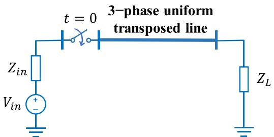  
(a)

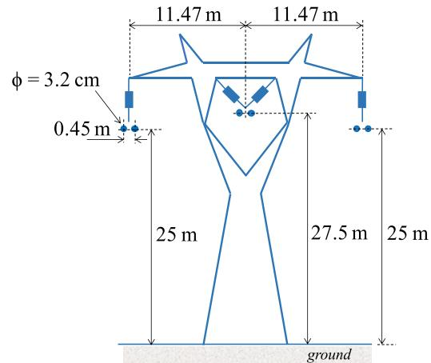  
(b)   
FIGURE 2. Transmission line topology for ideally transposed line (case A): (a) simplified circuit, (b) tower configuration (in meters unless otherwise noted).

applied at t = 0 with resistive source impedance of 1  and with varying widths and resistive loads as follows: 1) pulse width: 1 ms, load: 5 ; 2) pulse width: 2 ms, load: 25 ; and 3) pulse width: 3 ms, load: 1000 . The sampling resolution is 50 kHz.

TABLE 1. Normalized RMS deviation for case A.   

<table><tr><td>Quantity</td><td>NRMSD [%]</td><td>Phase of Max.</td></tr><tr><td>vS(t)</td><td>0.3148</td><td>A</td></tr><tr><td>VR(t)</td><td>0.3414</td><td>B</td></tr><tr><td>iS(t)</td><td>0.5592</td><td>B</td></tr><tr><td>iR(t)</td><td>0.3414</td><td>B</td></tr></table>

Similar to the previous example, the model obtained in this case was tested considering entirely different terminal conditions than those used to extract the transient recordings. The results in Fig. 4 show the transient voltage and current responses of the hybrid system to a unit-step excitation at $t = 1 . 7 5 \mathrm { m s }$ , series RL source impedance of $5 + j 0 . 9 4 2 5 \Omega .$ , and series RL load impedance of $7 5 + j 1 8 . 5 \Omega$ .

The comparison is also summarized in Table 2, which lists the percentage NRMSD for the sending and receiving voltages and currents of this test system. The results obtained are very close to those achieved by ATP under the same terminal conditions, with all deviations lower than 0.31%,

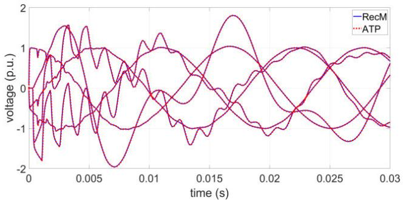  
(a)

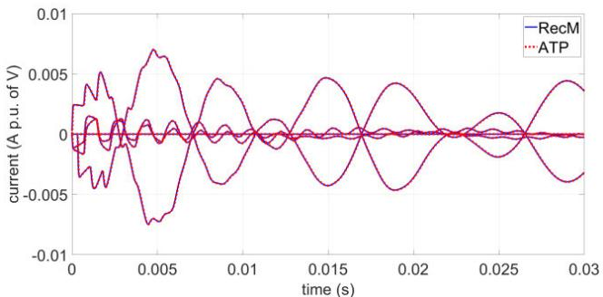  
(b)   
FIGURE 3. Comparison between the results of the reconstructed model (RecM) and those obtained using ATP for a three-phase ideally transposed line (case A): (a) voltage response, (c) current response.

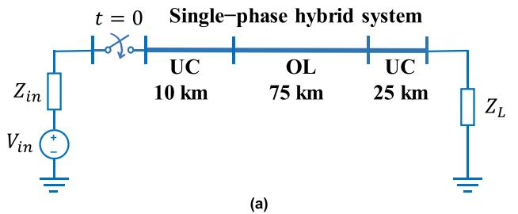

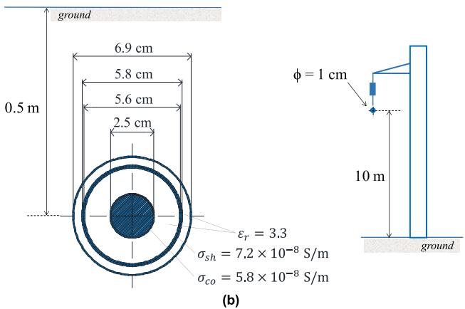  
FIGURE 4. Transmission system topology for single-phase hybrid system (case B): (a) simplified circuit, (b) geometrical configuration of underground cable, (c) geometrical configuration of overhead line.

demonstrating the applicability of the model reconstruction approach to single-phase nonsymmetrical systems following the procedure described in Section II-C.

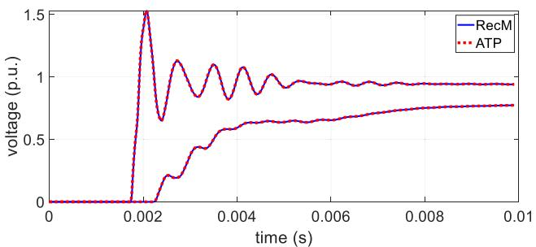  
(a)

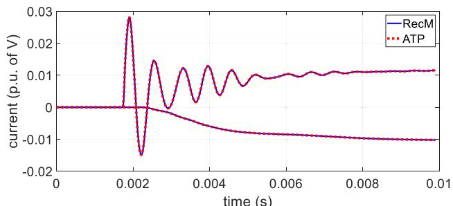  
  
FIGURE 5. Comparison between the results of the reconstructed model (RecM) and those obtained using ATP for a single-phase hybrid system (case B): (a) voltage response, (b) current response.

Furthermore, Table 3 shows the Person’s correlation coefficients between tests, which are all lower than 0.8 to avoid collinearity between datasets.

TABLE 2. Normalized RMS deviation for case B.   

<table><tr><td>Quantity</td><td>NRMSD, [%]</td></tr><tr><td>vS(t)</td><td>0.2374</td></tr><tr><td>VR(t)</td><td>0.0868</td></tr><tr><td>iS(t)</td><td>0.3094</td></tr><tr><td>iR(t)</td><td>0.0684</td></tr></table>

TABLE 3. Matrix of Pearson’s correlation coefficients for case B.   

<table><tr><td>Test</td><td>1</td><td>2</td><td>3</td></tr><tr><td>1</td><td>*</td><td>0.6812</td><td>0.3254</td></tr><tr><td>2</td><td>0.6812</td><td>*</td><td>0.5506</td></tr><tr><td>3</td><td>0.3254</td><td>0.5506</td><td>*</td></tr></table>

# C. CASE C-THREE-PHASE UNTRANSPOSED ANDNONUNIFORM LINE WITH HIGHLYNONSYMMETRICAL PROFILE

The case studied here is the well-known river crossing line topology taken from [40], which has been used extensively to evaluate nonuniform transmission line models (see for instance [41]). The noticeable sagging exhibited in this case, shown in Fig. 6, results in a very interesting transient behavior, and is an excellent example of a nonsymmetrical 2-port

system that can showcase the capabilities of the modeling reconstruction approach. Besides its highly nonuniform profile, the line has 3 phases without transpositions.

Since ATP does not directly consider line sagging (besides height approximation for conventional catenary), the nonuniform line is modeled using line segmentation as done in [41]. Specifically, 20 line segments, each with a length of 30 m and different heights, are connected in series to approximate the nonuniform profile shown in Fig 6. Due to the short length of each segment and the need by ATP to define a time step smaller than the traveling time of each segment, the time step for this example is substantially smaller than the resolution of current WMUs, making this a theoretical example that showcases to potential of the proposed model reconstruction approach as WMU technology progresses. For this case, six sets of transient recordings are produced to capture a representative variety of line conditions, considering the following events: single-phase (A), two-phase (AB) and twophase (AC) unit-step energizations with low (5 /phase), and high (1000 /phase) load impedances. The source impedance is 5  per phase for all tests.

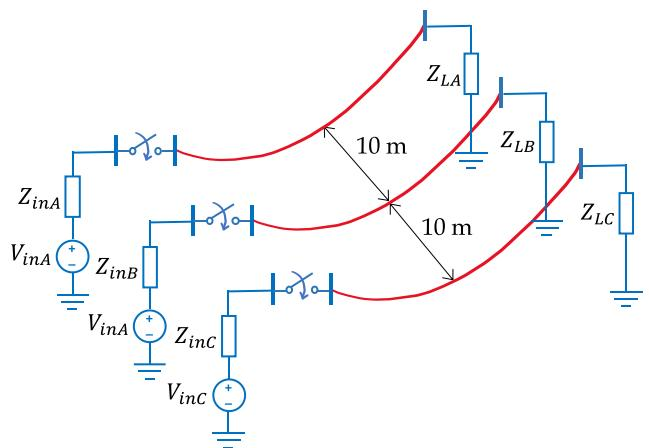

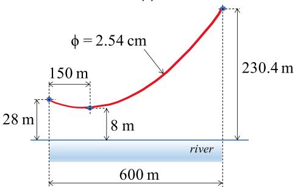  
  
  
FIGURE 6. Three-phase nonuniform transmission line (case C): (a) terminal conditions, (b) river crossing profile.

As in the previous examples, once the reconstructed model is obtained, it is tested for completely different terminal conditions than those used in the tests. The conditions chosen in this case emulate a lightning event on phase C of the sending node by means of a 1.2/50 µs 2-slope ramp voltage waveform with peak value of 1 p.u. and series resistance of 10 .

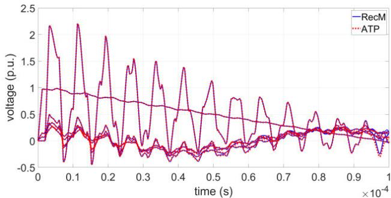

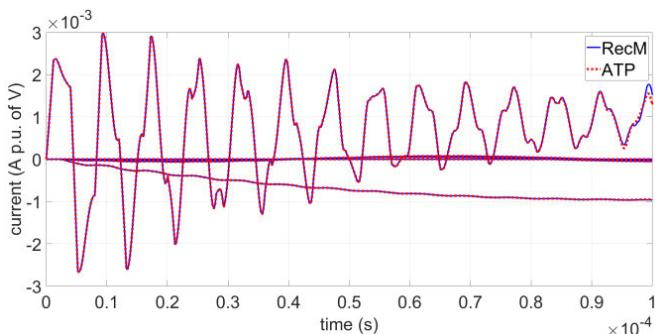  
  
  
FIGURE 7. Comparison between the results of the reconstructed model (RecM) and those obtained using ATP for a three-phase nonuniform line (case C): (a) voltage response, (b) current response.

The remaining phases of the sending node are open ended. The line is terminated by a purely inductive load of 50 mH/phase.

The close agreement with ATP results, shown in Fig. 7 and reflected in deviations lower than 1.54% for all responses in Table 4, demonstrate that the model reconstruction approach is able to consider the general case of unbalanced, nonuniform, and longitudinally nonsymmetrical three-phase systems accurately, following the procedure described in Section II-E. Table 5 shows that the Person’s correlation coefficients between tests for this case are all lower than 0.8.

TABLE 4. Normalized RMS deviation for case C.   

<table><tr><td>Quantity</td><td>NRMSD [%]</td><td>Phase of max.</td></tr><tr><td>vS(t)</td><td>1.2826</td><td>B</td></tr><tr><td>VR(t)</td><td>1.5399</td><td>B</td></tr><tr><td>iS(t)</td><td>1.2826</td><td>B</td></tr><tr><td>iR(t)</td><td>0.1950</td><td>A</td></tr></table>

# IV. DISCUSSION

Since the proposed modeling approach was tested using emulated measurements, there are several aspects that should be taken into account for its practical application. In this section we discuss the effects of signal noise and sampling resolution, as well as ratio and phase errors from instrument transformers, given their well-known practical relevance.

TABLE 5. Matrix of Pearson’s correlation coefficients for case C.   

<table><tr><td>Test</td><td>1</td><td>2</td><td>3</td><td>4</td><td>5</td><td>6</td></tr><tr><td>1</td><td>*</td><td>0.7851</td><td>0.7536</td><td>0.7660</td><td>0.5758</td><td>0.5393</td></tr><tr><td>2</td><td>0.7851</td><td>*</td><td>0.6970</td><td>0.4581</td><td>0.7164</td><td>0.3034</td></tr><tr><td>3</td><td>0.7536</td><td>0.6970</td><td>*</td><td>0.4510</td><td>0.3228</td><td>0.7088</td></tr><tr><td>4</td><td>0.7660</td><td>0.4581</td><td>0.4510</td><td>*</td><td>0.6407</td><td>0.6370</td></tr><tr><td>5</td><td>0.5758</td><td>0.7164</td><td>0.3228</td><td>0.6407</td><td>*</td><td>0.2760</td></tr><tr><td>6</td><td>0.5393</td><td>0.3034</td><td>0.7088</td><td>0.6370</td><td>0.2760</td><td>*</td></tr></table>

# A. EFFECT OF NOISE ON TERMINAL MEASUREMENTS

Field measurements will inevitably include noise, which ATP simulations do not include. To study the effect of signal noise on the applicability of the proposed method, we consider the inclusion of additive white Gaussian noise (AWGN) into the emulated measurements used for the cases reviewed in Section III. This is shown in Tables 6, 7 and 8 for cases A, B and C, respectively. For this evaluation, we consider a similar noise classification related to their SNR (signal-tonoise ratio) as in [17]: 30 to 50 dB: very noisy; 60 to 75 dB: noisy; and 100+ dB: less noisy.

TABLE 6. NRMS deviation as a function of noise level for case A.   

<table><tr><td rowspan="2">SNR [dB]</td><td colspan="4">NRMSD [%], phase of max.</td></tr><tr><td>vS(t)</td><td>vR(t)</td><td>iS(t)</td><td>iR(t)</td></tr><tr><td>100</td><td>0.3148, A</td><td>0.3416, B</td><td>0.5596, B</td><td>0.3416, B</td></tr><tr><td>75</td><td>0.3150, A</td><td>0.3458, B</td><td>0.5688, B</td><td>0.3458, B</td></tr><tr><td>60</td><td>0.3242, A</td><td>0.4087, B</td><td>0.6828, B</td><td>0.4257, A</td></tr><tr><td>50</td><td>0.4042, A</td><td>0.7799, A</td><td>1.2745, B</td><td>1.2257, A</td></tr><tr><td>40</td><td>1.2574, A</td><td>2.6123, A</td><td>4.5211, B</td><td>4.0872, A</td></tr><tr><td>30</td><td>*</td><td>*</td><td>*</td><td>*</td></tr></table>

*Deviation is higher than 10%.

TABLE 7. NRMS deviation as a function of noise level for case B.   

<table><tr><td rowspan="2">SNR [dB]</td><td colspan="4">NRMSD [%]</td></tr><tr><td>vS(t)</td><td>VR(t)</td><td>iS(t)</td><td>iR(t)</td></tr><tr><td>100</td><td>0.2374</td><td>0.0867</td><td>0.3093</td><td>0.0684</td></tr><tr><td>75</td><td>0.2364</td><td>0.0860</td><td>0.3077</td><td>0.0680</td></tr><tr><td>60</td><td>0.2343</td><td>0.0984</td><td>0.3018</td><td>0.0680</td></tr><tr><td>50</td><td>0.3143</td><td>0.2397</td><td>0.3006</td><td>0.0839</td></tr><tr><td>40</td><td>1.1142</td><td>1.8464</td><td>0.3906</td><td>0.1949</td></tr><tr><td>30</td><td>3.0066</td><td>6.4025</td><td>1.9585</td><td>0.6188</td></tr></table>

For case A, the results are almost unaffected by noise with SNR between 60 to 100 dB. Then, between 40 and 50 dB, there is a slight effect of noise, with deviations up to 4.5%. For SNR in the order of 30 dB, the reconstruction method presents large deviations (higher than 10%). Thus, for the case corresponding to ideally transposed lines (which only needs one set of transient recordings), the method is able to handle less

TABLE 8. NRMS deviation as a function of noise level for case C.   

<table><tr><td rowspan="2">SNR [dB]</td><td colspan="4">NRMSD [%], phase of max.</td></tr><tr><td>vS(t)</td><td>VR(t)</td><td>iS(t)</td><td>iR(t)</td></tr><tr><td>100</td><td>1.2944, B</td><td>1.5384, B</td><td>1.2944, B</td><td>0.1940, A</td></tr><tr><td>75</td><td>1.5732, B</td><td>1.5323, B</td><td>1.5732, B</td><td>0.1824, A</td></tr><tr><td>60</td><td>4.6074, A</td><td>2.7333, A</td><td>4.6074, A</td><td>0.2576, A</td></tr><tr><td>50</td><td>*</td><td>9.2606, A</td><td>*</td><td>0.7652, A</td></tr><tr><td>40</td><td>*</td><td>*</td><td>*</td><td>2.8144, A</td></tr><tr><td>30</td><td>*</td><td>*</td><td>*</td><td>7.9960, A</td></tr></table>

*Deviation is higher than 10%.

noisy to noisy measurements, but may struggle with very noisy measurements. For case B, the reconstruction is barely affected by noise with SNR between 50 and 100 dB, but large deviations appear for noise with lower SNR. So, similar to case A, the method for single-phase nonuniform systems (which used 3 sets of tests) works very well for less noisy to noisy measurements, but may not produce correct results for very noisy measurements. Finally, for case C, corresponding to the most general topology (three-phase, untransposed and nonuniform), the model reconstruction produces acceptable deviations for 60 to 100 dB (less noisy to noisy), but struggles for 50 dB and lower (very noisy). This case uses 9 transient recording sets.

Overall, the results show that the methodology is capable of handling noisy measurements up to a certain level, so the use of filtering techniques may be required if highly noisy recordings are expected. On the other hand, a comparison between the three cases under study indicates that the sensitivity to noise may increase as more transient recordings are required for the model reconstruction, which is an expected result and further reinforces the potential need for noise filtering techniques in practical applications.

# B. EFFECT OF SAMPLING RESOLUTION OF TERMINAL MEASUREMENTS

The sampling frequency for cases A and B in Section III is 50 kHz, which was chosen considering existing WMU devices [39]. However, this resolution may vary depending on the technology used, with expected improvements as WMU technology progresses and becomes more prevalent in power systems. It should also be observed that a 50 kHz resolution may not be achievable at present considering not only WMU limitations, but also those from other existing HV measurement components, such as instrument transformers.

To study sampling resolution effect, we reevaluated cases A and B with sampling frequencies of 12.5, 25, 50 and 100 kHz. Case C is not considered since the sampling frequency in this case is substantially higher to account for the short length of each segment used to approximate the nonuniform line model, as explained in Section III-C. According to the results shown in Tables 9 and 10, the RMS deviation is inversely proportional to the sampling frequency, i.e., a lower

deviation is observed as the resolution increases, which is an anticipated behavior.

TABLE 9. Normalized RMS deviation as a function of sampling frequency for case A.   

<table><tr><td rowspan="2">Sampling freq. [kHz]</td><td colspan="4">NRMSD [%], phase of max.</td></tr><tr><td>vS(t)</td><td>VR(t)</td><td>iS(t)</td><td>iR(t)</td></tr><tr><td>100</td><td>0.1637, A</td><td>0.1776, B</td><td>0.2871, B</td><td>0.1776, B</td></tr><tr><td>50</td><td>0.3148, A</td><td>0.3414, B</td><td>0.5592, B</td><td>0.3414, B</td></tr><tr><td>25</td><td>0.5707, A</td><td>0.6240, B</td><td>1.0230, B</td><td>0.6240, B</td></tr><tr><td>12.5</td><td>0.9593, A</td><td>1.1259, B</td><td>1.7074, B</td><td>1.1259, B</td></tr></table>

TABLE 10. NRMS deviation as a function of sampling frequency for case B.   

<table><tr><td rowspan="2">Sampling freq. [kHz]</td><td colspan="4">NRMSD [%]</td></tr><tr><td>vS(t)</td><td>VR(t)</td><td>iS(t)</td><td>iR(t)</td></tr><tr><td>100</td><td>0.5302</td><td>0.1910</td><td>0.6877</td><td>0.1189</td></tr><tr><td>50</td><td>0.2374</td><td>0.0868</td><td>0.3094</td><td>0.0684</td></tr><tr><td>25</td><td>1.1552</td><td>0.4007</td><td>1.5294</td><td>0.2908</td></tr><tr><td>12.5</td><td>*</td><td>*</td><td>*</td><td>*</td></tr></table>

*The time step is larger than the travel tme of the shortest line in the system. ATP is unable to run case.

∗ The time step is larger than the travel time of the shortest line in the system. ATP is unable to run case.

It is noteworthy that the deviations are kept very low for one half (25 kHz) or even one quarter (12.5 kHz) of the original sampling rate of 50 kHz. This was not fully assessed for case B since the time step at 12.5 kHz is larger than the traveling time of the shortest line (80 $\mu \mathrm { s } > 6 0 . 5 5 ~ \mu \mathrm { s } )$ , precluding a successful ATP simulation. It is also worth noting that the proposed approach is only able to provide accurate reconstruction up to the sampling frequency of the WMUs used. In this case, the oscillatory behavior between the ends of the 10 km underground cable can only be captured with a sampling rate of 16.51 kHz or higher (1/60.55 µs). As WMU technology progresses, transient recordings reaching 1 MHz or even higher are expected, since such recording rates are already available in modern traveling-wave based transmission line protection technology [42].

# C. EFFECT OF RATIO AND PHASE-DISPLACEMENT ERRORS FROM INSTRUMENT TRANSFORMERS

Besides the challenges of signal noise and resolution discussed above, the use of voltage and current transformers to capture terminal responses introduces systematic errors due to small deviations in the turns’ ratio and phase displacement between primary and secondary windings. The IEC standards 61869-1 [43], 61869-2 [44] and 61869-3 [45] define the accuracy classes of voltage and current instrument transformers according to the aforementioned deviations. In particular, the newest version of IEC 61869-1 [43] expands upon such accuracy classes for the measurement of signals at different frequency ranges above nominal frequency.

Of particular interest to the present paper is classification WB4, which provides accuracy class extensions for wide bandwidth applications up to 500 kHz, including traveling wave protection and fault location. Each class for WB4 is further divided into 3 groups depending on frequency range, as shown in Tables 11 and 12. In these tables, $f _ { r }$ is the reference frequency (above nominal) at which the instrument transformer’s performance is defined and guaranteed [43].

For instance, according to Tables 11 and 12 an accuracy class of 0.1-WB4 for frequencies from $f _ { r }$ to 50 kHz corresponds to a maximum ratio error of ±1% and a maximum phase displacement of ±1 degree (27.78 µs assuming a frequency $f _ { r }$ of 100 Hz). Similarly, an accuracy class of 0.2-WB4 for frequencies from 50 kHz to 150 kHz corresponds to a maximum ratio error of 4% and a maximum phase displacement of ±4 degrees (0.22 µs for a frequency of 50 kHz). Notice that both cases consider the lowest frequency to evaluate the worst-case scenario corresponding to the highest possible delay acceptable for the instrument transformer used.

To evaluate the effect of instrument transformers on the proposed line model reconstruction approach under practical conditions, our study considers mean and opposite values of ratio errors for voltage and current transformers (one positive and one negative), and the same for phase displacements. In addition, we focus on frequencies up to 50 kHz since this covers current operating capabilities of WMUs.

TABLE 11. Accuracy class extensions of instrument transformers for wide bandwidth applications – Ratio error [43].   

<table><tr><td>Accuracy class</td><td colspan="3">Ratio error [± %]</td></tr><tr><td>WB4 group</td><td>fr&lt; f ≤ 50 kHz</td><td>50 kHz &lt; f ≤ 150 kHz</td><td>150 kHz &lt; f ≤ 500 kHz</td></tr><tr><td>0.1</td><td>1</td><td>2</td><td>5</td></tr><tr><td>0.2</td><td>2</td><td>4</td><td>5</td></tr><tr><td>0.5</td><td>5</td><td>10</td><td>10</td></tr><tr><td>1</td><td>10</td><td>20</td><td>20</td></tr></table>

TABLE 12. Accuracy class extensions of instrument transformers for wide bandwidth applications – Displacement error [43].   

<table><tr><td>Accuracy class</td><td colspan="3">Phase displacement error [± degrees]</td></tr><tr><td>WB4 group</td><td>fr&lt; f ≤ 50 kHz</td><td>50 kHz &lt; f ≤ 150 kHz</td><td>150 kHz &lt; f ≤ 500 kHz</td></tr><tr><td>0.1</td><td>1</td><td>2</td><td>5</td></tr><tr><td>0.2</td><td>2</td><td>4</td><td>5</td></tr><tr><td>0.5</td><td>5</td><td>10</td><td>20</td></tr><tr><td>1</td><td>10</td><td>20</td><td>20</td></tr></table>

As an example, according to Table 11, the ratio error for class 0.1-WB4 and frequencies up to 50 kHz ranges from 0 to ±1% corresponding to a mean ratio error of ±0.5%,

so assuming a positive ratio error for voltage and a negative error for current, the corresponding ratios of voltage and current would be 1.05 and 0.95. Similar results were obtained considering positive ratio error for current and negative ratio error for voltage. Furthermore, from Table 12 the range of phase displacement for the same class is 0 to ±1 degree corresponding to a mean displacement of ±0.5 degrees, so assuming that the displacements of voltage and current are opposite, this would generate a mean phase delay of 1 degree between voltage and current.

The ratio errors and phase delays between voltages and currents tested in this paper are shown in the second column of Tables 13 and 14. In addition, these tables show the results obtained in terms of normalized rms deviation for Case B, including the original results without ratio or phase displacement errors in the first row of the results (listed as ‘‘Ref.’’). The remaining results correspond to the NRSMD obtained for each accuracy class. For this case, $, f _ { r }$ is defined as 100 Hz calculated as the lowest frequency captured for the time window of observation $( f _ { r } = 1 / 0 . 0 1 \mathrm { s } )$ .

According to Table 13, the results of the reconstruction method are marginally affected by the ratio errors of the instrument transformers, with NRMSDs lower than 5% for all accuracy classes. However, as seen in Table 14, the reconstruction process is more sensitive to phase displacement errors, showing NRMSDs of 8% and 10% for accuracy classes of 0.5 and 1, respectively. This indicates that WMU-based model reconstruction may require instrument transformers of higher accuracy classes, such as 0.1 or 0.2.

TABLE 13. Normalized RMS deviation as a function of mean ratio error of instrument transformers for case B.   

<table><tr><td rowspan="2">Accuracy class</td><td rowspan="2">Mean ratio error, % 
Pos. error for v and neg. error for i</td><td colspan="4">NRMSD [%]</td></tr><tr><td>vS(t)</td><td>VR(t)</td><td>iS(t)</td><td>iR(t)</td></tr><tr><td>Ref.</td><td>0</td><td>0.2374</td><td>0.0868</td><td>0.3094</td><td>0.0684</td></tr><tr><td>0.1</td><td>0.5</td><td>0.1812</td><td>0.3065</td><td>0.2781</td><td>0.3053</td></tr><tr><td>0.2</td><td>1</td><td>0.2544</td><td>0.5847</td><td>0.4517</td><td>0.5678</td></tr><tr><td>0.5</td><td>2.5</td><td>0.6924</td><td>1.4375</td><td>1.1868</td><td>1.3653</td></tr><tr><td>1</td><td>5</td><td>1.4619</td><td>2.8775</td><td>2.4210</td><td>2.7103</td></tr></table>

TABLE 14. Normalized RMS deviation as a function of mean phase delay between instrument transformers for case B.   

<table><tr><td rowspan="2">Accuracy class</td><td rowspan="2">Mean phase delay (V vs I) [μs]</td><td colspan="4">NRMSD [%]</td></tr><tr><td>vS(t)</td><td>VR(t)</td><td>iS(t)</td><td>iR(t)</td></tr><tr><td>Ref.</td><td>0</td><td>0.2374</td><td>0.0868</td><td>0.3094</td><td>0.0684</td></tr><tr><td>0.1</td><td>1°@100Hz = 27.78</td><td>2.2352</td><td>0.7044</td><td>3.3102</td><td>0.2889</td></tr><tr><td>0.2</td><td>2°@100Hz = 55.56</td><td>3.4356</td><td>1.1521</td><td>5.0753</td><td>0.5149</td></tr><tr><td>0.5</td><td>5°@100Hz = 138.89</td><td>5.4108</td><td>2.2966</td><td>8.1776</td><td>1.3616</td></tr><tr><td>1</td><td>10°@100Hz = 277.78</td><td>6.6325</td><td>3.8428</td><td>10.2805</td><td>2.7237</td></tr></table>

# D. FUTURE STEPS

As an initial research effort exploring the use of WMUs to reconstruct transmission system models from transient

measurements, this work lays the foundation for future studies that will address the many aspects required for practical implementation. With this in mind, near-future plans include the following:

•Evaluating the effect of the type of excitation used to generate transient recordings (beyond the unit-step and square-wave excitations used so far), so that more realistic grid events can be captured for practical applications.   
•Developing a real-time hardware-in-the-loop (HIL) testbed that includes actual WMUs receiving signals from an emulated system in a time-synchronized manner. This will allow considering more realistic signal processing from WMUs, as well as noise and resolution constraints.   
•Using the HIL testbed to further explore the effect of different transient conditions used for model reconstruction.   
•Once the bridge between simulation and actual field testing, provided by the HIL testbed, is assessed in detail, the use of real utility measurements can be explored.

# V. CONCLUSION

In this paper we proposed a simple and efficient methodology to utilize transient recordings for the reconstruction of two-port models of transmission lines with consideration of their frequency dependence and longitudinal variation of their electrical parameters. The purpose of this methodology is to provide an alternative to analytical modeling methods that can adapt to changes in the line conditions during their lifetime, while also extracting their wideband behavior, so that potential dynamic interactions with other grid elements, such as power electronic components for DER integration, can be studied with accuracy.

The results are very promising, demonstrating high accuracy and robustness of the proposed method for several cases with different levels of complexity. Furthermore, we showed that the proposed method supports realistic sampling resolutions keeping in mind that, as expected, the maximum frequency of the reconstructed model will depend on the sampling rate of the WMU device used.

The proposed method is also able to handle noisy measurements without significant effect on its performance. However, for SNR of 50 dB or lower, reconstruction issues start to arise, suggesting that signal filtering techniques may need to be introduced for highly noisy measurements.

Additionally, the effect of instrument transformer accuracy was explored with respect to standardized requirements. It was shown that turns ratio errors do not constitute a significant issue for the proposed model reconstruction approach, whereas phase displacement errors can be challenging and may require the use of high accuracy class instrument transformers.

Future work will involve developing a real-time HIL testbed that integrates WMU technology with different emulated transmission systems to further assess the practical implementation of the proposed model reconstruction method. In addition, the use of different fitting approaches for the introduction of the reconstructed models into EMTP-type

software as frequency dependent network equivalents will be examined.

# APPENDIX–NUMERICAL LAPLACE TRANSFORMS

For completeness of the paper, this Appendix provides brief definitions of the numerical Laplace transforms, as applied in this work. More details of this technique can be found in [26].

# A. DIRECT NUMERICAL LAPLACE TRANSFORM

The direct numerical Laplace transform NLT is applied in this paper to convert time domain voltages and currents acquired from WMUs to the Laplace domain in order to construct admittance representations. The application of the Laplace transform to a real and causal function f (t) with an observation time T results in its Laplace domain image F (s) as follows:

$$
F (s) = \int_ {0} ^ {T} [ f (t) e ^ {- c t} ] e ^ {- j \omega t} d t \tag {A.1}
$$

The numerical form of (A.1), following an odd sampling of the frequency spectrum, is given by

$$
F _ {m} = \sum_ {n = 0} ^ {N - 1} f _ {n} D _ {n} \exp \left(- \frac {j 2 \pi m n}{N}\right) \tag {A.2}
$$

where

$$
m, n = 0, 1, 2 \dots , N - 1 \tag {A.3}
$$

$$
F _ {m} = F [ c + j (2 m + 1) \Delta \omega ] \tag {A.4}
$$

$$
f _ {n} = f (n \Delta t) \tag {A.5}
$$

$$
D _ {n} = \Delta t \exp \left(- c n \Delta t - \frac {j \pi n}{N}\right) \tag {A.6}
$$

$$
\Delta t = \frac {T}{N}, \Delta \omega = \frac {\pi}{T}. \tag {A.7}
$$

$$
c = - \ln (1 0 ^ {- 4}) / T \tag {A.8}
$$

In (A.3)-(A.8), 1ω is the integration step of the frequency spectrum for odd sampling, 1t is the discrete time step (defined by the sampling rate of the WMU), N is the number of samples of the WMU recordings, and c is a damping factor included to minimize the aliasing errors produced by the discretization of the frequency spectrum.

# B. INVERSE NUMERICAL LAPLACE TRANSFORM

The inverse numerical Laplace transform (INLT) is used to transform Laplace domain voltages and currents to the time domain once the system is solved (see Section II-F). The inverse Laplace transform of a function F (s) truncated to a maximum angular frequency  is given by

$$
f (t) \cong \frac {e ^ {c t}}{\pi} R e \left\{\int_ {0} ^ {\Omega} F (s) e ^ {j \omega t} d \omega \right\} \tag {A.9}
$$

Including a discrete window function $\sigma _ { m }$ to reduce truncation errors, the discrete form of (A.9) is defined as

$$
f _ {n} = \operatorname {R e} \left\{C _ {n} \left[ \frac {1}{N} \sum_ {m = 1} ^ {N} F _ {m} \sigma_ {m} \exp \left(\frac {j 2 \pi m n}{N}\right) \right] \right\} \tag {A.10}
$$

where

$$
C _ {n} = \frac {2}{\Delta t} \exp \left(c n \Delta t + \frac {j \pi n}{N}\right) \tag {A.11}
$$

$$
\sigma_ {m} = 0. 5 \left[ 1 + \cos \left(\frac {0 . 5 \pi m}{N}\right) \right] \tag {A.12}
$$

The function defined in (A.12) is the Hanning window, which has shown great performance for INLT application.

# ACKNOWLEDGMENT

The author acknowledges the inspiration to pursue this work from several preliminary research efforts by former and current Western Michigan University Power Lab members, including A. Alshawawreh, F. Alqahtani, H. Alameri, and O. Olagbemi.

# REFERENCES

[1] J. A. Martinez-Velasco, A. Ramirez, and M. Davila, ‘‘Overhead lines,’’ in Power System Transients—Parameter Determination. Boca Raton, FL, USA: CRC Press, 2010, pp. 17–136.   
[2] S. Debnath, M. Elizondo Y. Liu, P. Marthi, W. Du, S. Marti, and Q. Huang, ‘‘High penetration power electronics grid: Modeling and simulation gap analysis,’’ Oak Ridge National Laboratory, Oak Ridge, TN, USA, Tech. Rep. ORNL/TM-2020/1580, Aug. 2020.   
[3] J. Segundo-Ramirez, A. Bayo-Salas, M. Esparza, J. Beerten, and P. Gómez, ‘‘Frequency domain methods for accuracy assessment of wideband models in electromagnetic transient stability studies,’’ IEEE Trans. Power Del., vol. 35, no. 1, pp. 71–83, Feb. 2020.   
[4] J. Hernández-Ramírez, J. Segundo-Ramírez, and M. Molinas, ‘‘Comprehensive DQ impedance modeling of AC power-electronics-based power systems with frequency-dependent transmission lines,’’ Electr. Power Syst. Res., vol. 235, Oct. 2024, Art. no. 110847.   
[5] R. K. Gupta, F. Sossan, J.-Y. Le Boudec, and M. Paolone, ‘‘Compound admittance matrix estimation of three-phase untransposed power distribution grids using synchrophasor measurements,’’ IEEE Trans. Instrum. Meas., vol. 70, pp. 1–13, 2021.   
[6] D. Lu, Y. Liu, D. Lu, B. Wang, and X. Zheng, ‘‘Unsynchronized fault location on untransposed transmission lines with fully distributed parameter model considering line parameter uncertainties,’’ Electr. Power Syst. Res., vol. 202, Jan. 2022, Art. no. 107622.   
[7] R. F. R. Pereira, F. P. Albuquerque, L. H. B. Liboni, E. C. M. Costa, and J. H. A. Monteiro, ‘‘Estimation of the electrical parameters of overhead transmission lines using Kalman filtering with particle swarm optimization,’’ IET Gener., Transmiss. Distrib., vol. 17, no. 1, pp. 27–38, Nov. 2022.   
[8] P. Ren, H. Lev-Ari, and A. Abur, ‘‘Tracking three-phase untransposed transmission line parameters using synchronized measurements,’’ IEEE Trans. Power Syst., vol. 33, no. 4, pp. 4155–4163, Jul. 2018.   
[9] A. M. A. Wehenkel, J.-Y. L. Boudec, and M. Paolone, ‘‘Parameter estimation of three-phase untransposed short transmission lines from synchrophasor measurements,’’ IEEE Trans. Instrum. Meas., vol. 69, no. 9, pp. 6143–6154, Sep. 2020.   
[10] F. Alqahtani, A. Alshawawreh, and P. Gomez, ‘‘Wideband parameter estimation of single-phase frequency dependent transmission lines,’’ in Proc. North Amer. Power Symp. (NAPS), College Station, TX, USA, Nov. 2021, pp. 1–6.   
[11] F. Alqahtani and P. Gómez, ‘‘Wideband parameter estimation of threephase untransposed frequency-dependent transmission lines from terminal measurements,’’ TechRxiv, Feb. 2023.   
[12] A. Holdyk, B. Gustavsen, I. Arana, and J. Holboell, ‘‘Wideband modeling of power transformers using commercial sFRA equipment,’’ IEEE Trans. Power Del., vol. 29, no. 3, pp. 1446–1453, Jun. 2014.

[13] B. Gustavsen, ‘‘Cable modeling for very fast transient simulation studies using one-sided voltage transfer function measurements,’’ IEEE Trans. Power Del., vol. 38, no. 2, pp. 1129–1137, Apr. 2023.   
[14] J. De La Ree, V. Centeno, J. S. Thorp, and A. G. Phadke, ‘‘Synchronized phasor measurement applications in power systems,’’ IEEE Trans. Smart Grid, vol. 1, no. 1, pp. 20–27, Jun. 2010.   
[15] R. S. Singh, H. Hooshyar, and L. Vanfretti, ‘‘Assessment of time synchronization requirements for phasor measurement units,’’ in Proc. IEEE Eindhoven PowerTech, Eindhoven, Netherlands, Jun. 2015, pp. 1–6.   
[16] H. Mohsenian-Rad and W. Xu, ‘‘Synchro-waveforms: A window to the future of power systems data analytics,’’ IEEE Power Energy Mag., vol. 21, no. 5, pp. 68–77, Sep. 2023.   
[17] M. Izadi and H. Mohsenian-Rad, ‘‘A synchronized lissajous-based method to detect and classify events in synchro-waveform measurements in power distribution networks,’’ IEEE Trans. Smart Grid, vol. 13, no. 3, pp. 2170–2184, May 2022.   
[18] M. MansourLakouraj, H. Hosseinpour, H. Livani, and M. Benidris, ‘‘Waveform measurement unit-based fault location in distribution feeders via short-time matrix pencil method and graph neural network,’’ IEEE Trans. Ind. Appl., vol. 59, no. 2, pp. 2661–2670, Mar. 2023.   
[19] I. Niazazari, H. Livani, A. Ghasemkhani, Y. Liu, and L. Yang, ‘‘Event cause analysis in distribution networks using synchro waveform measurements,’’ in Proc. 52nd North Amer. Power Symp. (NAPS), Tempe, AZ, USA, Apr. 2021, pp. 1–5.   
[20] D. Sun, H. Liu, S. Liu, and T. Bi, ‘‘Development of synchronized waveform measurement and its application on fault detection,’’ IEEE Trans. Instrum. Meas., vol. 72, pp. 1–11, 2023.   
[21] H. Mohsenian-Rad, M. Kezunovic, and F. Rahmatian, ‘‘Synchrowaveforms in wide-area monitoring, control, and protection: Real-world examples and future opportunities,’’ IEEE Power Energy Mag., vol. 23, no. 1, pp. 69–80, Jan. 2025.   
[22] T. Shen, H. Ma, C. Ekanayake, and H. Jiang, ‘‘On synchro-waveform data analytics for high impedance fault identification in distribution networks,’’ in Proc. IEEE PES 16th Asia Pacific Power Energy Eng. Conf. (APPEEC), Nanjing, China, Oct. 2024, pp. 1–5.   
[23] H. Alameri and P. Gomez, ‘‘Analytical and measurement-based wideband two-port modeling of DC–DC converters for electromagnetic transient studies,’’ Electr. Power Syst. Res., vol. 220, Jul. 2023, Art. no. 109305.   
[24] O. O. Olagbemi and P. Gómez, ‘‘Inverter model reconstruction from terminal measurements for electromagnetic transient studies,’’ in Proc. 56th North Amer. Power Symp. (NAPS), El Paso, TX, USA, Oct. 2024, pp. 1–6.   
[25] T. J. Rosenthal, J. L. Rio, O. O. Olagbemi, and P. Gómez, ‘‘Accurate estimation of passive component defect and degradation in DC–DC power converters from transient terminal responses,’’ Electr. Power Syst. Res., vol. 250, Jan. 2026, Art. no. 112137.   
[26] P. Gómez and F. A. Uribe, ‘‘The numerical Laplace transform: An accurate technique for analyzing electromagnetic transients on power system devices,’’ Int. J. Electr. Power Energy Syst., vol. 31, nos. 2–3, pp. 116–123, Feb. 2009.   
[27] J. A. B. Faria and R. Araneo, ‘‘Computation, properties, and realizability of the characteristic immittance matrices of nonuniform multiconductor transmission lines,’’ IEEE Trans. Power Del., vol. 33, no. 4, pp. 1885–1894, Aug. 2018.   
[28] E. Clarke, Circuit Analysis of AC Power Systems. Hoboken, NJ, USA: Wiley, 1950.   
[29] MathWorks. Lsqminnorm—Minimum Norm Least-Squares Solution to Linear Equation. Accessed: Aug. 1, 2025. [Online]. Available: https://www.mathworks.com/help/MATLAB/ref/lsqminnorm.html   
[30] J. H. Kim, ‘‘Multicollinearity and misleading statistical results,’’ Korean J. Anesthesiology, vol. 72, no. 6, pp. 558–569, Dec. 2019.   
[31] MathWorks. Corrcoef—Correlation Coefficients. Accessed: Aug. 1, 2025. [Online]. Available: https://www.mathworks.com/help/MATLAB/ref/ lsqminnorm.html   
[32] F. P. de Albuquerque, F. R. Lemes, R. Nascimento, E. C. M. Costa, and P. T. Caballero, ‘‘Comprehensive analysis of admittance matrix estimation considering different noise models,’’ IET Gener., Transmiss. Distrib., vol. 19, no. 1, Jan. 2025, Art. no. e70011.   
[33] G. Bilal, P. Gomez, R. Salcedo, and J. M. Villanueva-Ramirez, ‘‘Electromagnetic transient studies of large distribution systems using frequency domain modeling methods and network reduction techniques,’’ Int. J. Electr. Power Energy Syst., vol. 110, pp. 11–20, Sep. 2019.

[34] B. Gustavsen, ‘‘Computer code for rational approximation of frequency dependent admittance matrices,’’ IEEE Trans. Power Del., vol. 17, no. 4, pp. 1093–1098, Oct. 2002.   
[35] B. Gustavsen and H. M. J. De Silva, ‘‘Inclusion of rational models in an electromagnetic transients program: Y-parameters, Z-parameters, Sparameters, transfer functions,’’ IEEE Trans. Power Del., vol. 28, no. 2, pp. 1164–1174, Apr. 2013.   
[36] T. M. Campello, S. L. Varricchio, and G. N. Taranto, ‘‘Three-phase frequency-dependent network equivalents in the ATP for lumped parameter systems using descriptor formulation, rational models, and symmetrical component data,’’ J. Control, Autom. Electr. Syst., vol. 32, no. 6, pp. 1690–1703, Dec. 2021.   
[37] EEUG. (2025). ATP—EMTP. Accessed: Aug. 1, 2025. [Online]. Available: http://www.emtp.org/   
[38] P. Gómez and J. Segundo-Ramírez, ‘‘Frequency domain approach for statistical switching studies: Computational efficiency and effect of network equivalents,’’ Electric Power Syst. Res., vol. 196, Jul. 2021, Art. no. 107257.   
[39] (2024). VECTO 3-VECTO System. Accessed: Aug. 1, 2025. [Online]. Available: https://vectosystem.com/vecto-3/   
[40] A. Semlyen, ‘‘Some frequency domain aspects of wave propagation on nonuniform lines,’’ IEEE Trans. Power Del., vol. 18, no. 1, pp. 315–322, Jan. 2003.   
[41] P. Gomez, P. Moreno, and J. L. Naredo, ‘‘Frequency-domain transient analysis of nonuniform lines with incident field excitation,’’ IEEE Trans. Power Del., vol. 20, no. 3, pp. 2273–2280, Jul. 2005.   
[42] Schweitzer Eng. Laboratories. (2024). Traveling-Wave Fault Location. Accessed: Dec. 1, 2024. [Online]. Available: https://selinc.com/solutions/ transmission/traveling-wave-fault-location/   
[43] Instrument Transformers—Part 1: General Requirements, Standard IEC 61869-1, International Electrotechnical Commission, Geneva, Switzerland, 2023.

[44] Instrument Transformers—Part 2: Additional Requirements for Current Transformers, Standard IEC 61869-2, International Electrotechnical Commission, Geneva, Switzerland, 2012.   
[45] Instrument Transformers—Part 3: Additional Requirements for Inductive Voltage Transformers, Standard IEC 61869-3, International Electrotechnical Commission, Geneva, Switzerland, 2011.

PABLO GOMEZ (Senior Member, IEEE) received the B.Sc. degree in mechanical and electrical engineering from the Autonomous University of Coahuila, Monclova, Mexico, in 1999, and the M.Sc. and Ph.D. degrees in electrical engineering from Cinvestav, Guadalajara, Mexico, in 2002 and 2005, respectively.

From 2005 to 2014, he was a full-time Professor with the Electrical Engineering Department of SEPI-ESIME Zacatenco, National Polytechnic

Institute, Mexico. From 2008 to 2010, he was on the postdoctoral leave with Tandon School of Engineering of New York University (formerly Polytechnic Institute of New York University), Brooklyn, NY, USA. He is currently a Professor with the Department of Electrical and Computer Engineering, Western Michigan University, Kalamazoo, MI, USA. His research interests include modeling of power equipment, transient analysis of electrical components and networks, high voltage engineering, and electromagnetic design optimization of power components.

Dr. Gomez is the Chair of the Working Group of Modeling and Analysis of Systems Transients Using Digital Programs of the IEEE Power and Energy Society. He is an Associate Editor of IEEE TRANSACTIONS ON POWER DELIVERY.