# Adaptive Heterogeneous Transient Analysis of Wind Farm Integrated Comprehensive AC/DC Grids

Ning Lin , Member, IEEE, Shiqi Cao , Graduate Student Member, IEEE, and Venkata Dinavahi , Fellow, IEEE

Abstract—The increasingly complex AC/DC network as a result of the massive integration of wind farms manifests the significance of a comprehensive transient study. In this work, the wind turbine (WT) and the DC grid are modeled in detail for the electromagnetic transient (EMT) simulation to maximize its fidelity, whilst the AC grid transient stability is analyzed by dynamic simulation (DS). An interactive EMT-DS interface is thus introduced to enable their concurrency and subsequently form a co-simulation. The CPU which is dominant in system study faces a tremendous challenge in handling a great number of components albeit they exhibit homogeneity. The many-core graphics processing unit (GPU) featuring massive parallelism is therefore exploited and following the definition of an adaptive computing boundary, a flexible heterogeneous sequential-parallel processing architecture is proposed for efficient analysis of the wind-farm-integrated AC/DC grid. Topological reconfiguration of WTs is specifically carried out to reduce the numerical order whilst enhancing system homogeneity that enables the GPU to thoroughly utilize its peculiar property of single-instruction multiple-thread (SIMT) compute paradigm. Consequently, significant speedups can be attained by the proposed computing framework over pure CPU computation, while its accuracy is validated by the commercial EMT and dynamic security analysis tools PSCAD/EMTDC and DSATools, respectively.

Index Terms—AC/DC grid, doubly-fed induction generator, dynamic simulation, electromagnetic transients, graphics processing unit, multi -terminal DC, parallel processing, power system stability, wind farm.

# I. INTRODUCTION

W ORLD-WIDE wind energy has witnessed a dramaticlevel of penetration into the power system in a boom of level of penetration into the power system in a boom of energy supply diversification [1]. While alleviating a tremendous energy demand on the grid, the stochastic attribute of wind resources poses a practical challenge which turns out to be a major concern regarding the dynamic security of transmission and distribution networks [2]–[5]. The high-voltage direct current (HVDC) transmission has proven to be a promising solution for interlinking wind farms (WFs) and the AC grid, for merits such as high efficiency, and a grid-forming capability that enables the WFs to be independent of the main grid [6]–[8].

Manuscript received August 16, 2020; revised October 11, 2020 and November 3, 2020; accepted December 5, 2020. Date of publication December 8, 2020; date of current version August 20, 2021. This work was supported by the Natural Science and Engineering Research Council of Canada (NSERC). Paper no. TEC-00821-2020. (Corresponding author: Ning Lin.)

The authors are with the Department of Electrical and Computer Engineering, University of Alberta, Edmonton, Alberta T6G 2V4, Canada (e-mail: ning3@ualberta.ca; sc5@ualberta.ca; dinavahi@ualberta.ca).

Color versions of one or more figures in this article are available at https: //doi.org/10.1109/TEC.2020.3043307.

Digital Object Identifier 10.1109/TEC.2020.3043307

Electromagnetic transient (EMT) simulation based on timedomain model discretization and linearization is an accurate computer-based approach for complex AC and DC systems study, and the dynamic simulation (DS) conducted using complex number calculations is adequate for power system electromechanical interaction analysis. Therefore, these simulations are intensively carried out to acquire system operation information that could be utilized to safeguard the grid against a variety of contingencies [9]–[12]. Hitherto, both methods have successfully fulfilled transient analysis with model simplification, such as aggregating the wind farms without considering the individuality of each wind turbine and its converter system [13], [14]. The pursuit of an accurate dynamic security assessment of the power system requires higher modeling fidelity, especially for the wind farm since its turbines distributed over a vast area are subject to distinct wind speed characteristics and the aggregation falls short of revealing the actual power surplus or deficiency in the AC/DC grid, other than dynamics of each turbine.

A heavy computational burden on the CPU, to some extent, justifies aggregating wind turbines (WTs) [15]–[17] or using simplified converter models [18], [19] in EMT and dynamic simulations, as a shortage of parallel processing capability would otherwise force repetitive computations of components even when they are topologically identical. The graphics processing unit (GPU) technology has made enormous strides over the past few years, and so has its application in high-performance computing of electric power systems [20]–[22]. Remarkable speedups over CPU computation were attained due to an extensive homogeneity in circuit elements, which far outweigh the opposite. Nevertheless, the GPU’s speed margin shrinks when irregularities grow and neutralize concurrency. For example, the HVDC converter could dilute the regularity of the integrated AC/DC grid contributed by thousands of wind turbines. The fact that various modern electric power systems will not always be efficiently handled by a single type of processor or even multiple processors loaded with fixed tasks prompts flexible coordination between CPU and GPU for transient analysis on heterogeneous sequential-parallel computing architecture as in this work.

Consequently, aiming to thoroughly exploit the available computing resources in a computer equipped with a standalone GPU, the two processors are flexibly assigned with different tasks: the CPU handles the AC/DC grid wherein its repetitiveness is inadequate to support massive parallelism; and the GPU is in charge of components with a large quantity, such as the wind turbines. To improve the homogeneity, topological reconfiguration is carried out to create a substantial number of

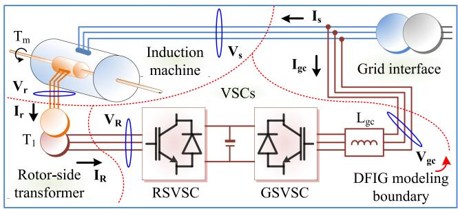  
Fig. 1. Doubly-fed induction machine computational boundary definition.

small-dimension subsystems which are then written into various kernels using CUDA C++ programming language to cater to the parallel processor’s single-instruction multiple-thread (SIMT) paradigm [23]. Several boundaries and interfaces are defined in the EMT-dynamic co-simulation to allow their coexistence while retaining independence.

The rest of the paper is organized as follows: Section II introduces fine-grained reconfiguration of the doubly-fed induction machine (DFIG), followed by respective dynamic and electromagnetic transient modeling of the AC and DC grids in Section III. Section IV specifies the realization of adaptive heterogeneous CPU-GPU computation for transient analysis of the integrated AC/DC grid. The comprehensive co-simulation study results are analyzed in Section V, and Section VI provides the conclusion.

# II. WIND GENERATION MODEL RECONFIGURATION

Fig. 1 shows the configuration of a typical DFIG system, which contains components with various numerical forms in terms of transient modeling. For instance, the induction machine is generally modeled by the state-space equation, and differential equations apply to the 2 transformers. Computation structure optimization by internal decoupling is carried out to enable different types of models to be compatible in the same simulation, in addition to reducing the processing burden induced by a large-dimension admittance matrix established based on electrical nodes of the overall system.

The prevalent EMT model formulas of the induction machine, transformer, and the power converter imply that the DFIG can be internally partitioned into 4 subsystems which can be computed independently, as illustrated in Fig. 1. For an arbitrary subsystem, the impact of its neighboring counterparts can be deemed as equivalent current or voltage sources on the boundaries, whereas a specific selection of the type conforms to the general principle that the lumped high-order model has a higher priority over discrete low-order components.

# A. Induction Generator Model

The original 5th-order state-space equation of an induction machine takes the form of

$$
\dot {\mathbf {x}} (t) = \mathbf {A} \mathbf {x} (t) + \mathbf {B} \mathbf {u} (t), \tag {1}
$$

$$
\mathbf {y} (t) = \mathbf {C x} (t), \tag {2}
$$

where , , and  are the vector of fluxes, currents, and input x y uvoltages, respectively. Applying the $\alpha \cdot \beta$ transformation, these vectors, uniformly represented by ν, can be organized as

$$
\nu (1: 4) = \left[ \nu_ {s \alpha}, \nu_ {s \beta}, \nu_ {r \alpha}, \nu_ {r \beta} \right] ^ {T}, \tag {3}
$$

where subscriptions s and r denote quantities of the stator and rotor. Therefore, when partitioning the DFIG, the 3-phase stator and rotor voltages ${ \bf V _ { s } }$ and $\mathbf { V _ { r } }$ are retained within the boundary Vs Vrof induction machine, and consequently, it can be computed by its original form. Following the solution, the stator and rotor currents in vector  are restored into the 3-phase domain and sent to neighboring transformers.

Regarding the coefficients, whilst the input matrix  is a B4 × 4 identity matrix and the output matrix  is purely based on the magnetizing, stator and rotor inductance, the state matrix reflects electro-mechanical coupling since it contains the Aelectrical angular velocity $\omega _ { r }$ in addition to those stator and rotor electrical parameters.

The fifth differential equation describes the electromechanical interaction, expressed as

$$
\frac {d \omega_ {r} (t)}{d t} = - F \frac {P}{J} \omega_ {r} + \frac {P}{J} \left(T _ {e} (t) - T _ {m} (t)\right), \tag {4}
$$

where $P$ is the pole pair number, J denotes inertia, $F$ is a friction coefficient, the electromagnetic torque is obtained by

$$
T _ {e} = \frac {3}{2} P (\mathbf {x} (1) \mathbf {y} (2) - \mathbf {x} (2) \mathbf {y} (1)), \tag {5}
$$

and the mechanical torque $T _ { m }$ is a nonlinear function of $\omega _ { r }$ and the wind speed $v _ { w }$ [24],

$$
T _ {m} = \frac {1}{2} \rho \pi r _ {T} ^ {3} v _ {w} ^ {2} F \left(r _ {T}, v _ {w}, \omega_ {r}\right), \tag {6}
$$

where ρ denotes the air density, and $r _ { T }$ the wind turbine radius.

The model equations should be discretized before EMT simulation. At time t, using the Trapezoidal rule, a general equation can be obtained for an n-order differential equation

$$
\begin{array}{l} \nu (t) = \left(\mathbf {I} - \frac {\mathbf {A} \Delta t}{2}\right) ^ {- 1} \cdot \left[ \left(\mathbf {I} + \frac {\mathbf {A} \Delta t}{2}\right) \nu (t - \Delta t) \right. \\ \left. + \frac {\mathbf {B} \Delta t}{2} (\mathbf {u} (t) + \mathbf {u} (t - \Delta t)) \right], \tag {7} \\ \end{array}
$$

where $\Delta t$ denotes the simulation time-step. The above equation is applicable to (4), when , , and the identity matrix reduce to the coefficients of $\omega _ { r } , ( T _ { e } ( t ) - T _ { m } ( t ) )$ I), and constant 1, respectively.

Hence, the induction machine simulation commences with solving the state-space equation, followed by (5), and the present time-step ends with the derivation of $\omega _ { r }$ , which is an essential element in the input matrix .

# B. Three-Phase Transformer

Though the 2 transformers are separated in boundary definition attributing to indirect connection, they share an identical model, which is described by the relation between the terminal

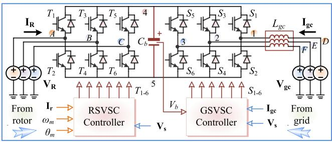  
Fig. 2. Decoupled DFIG converter system model.

voltage $\mathbf { v _ { T } }$ and current $\mathbf { i _ { T } }$ in the differential equation,

$$
\mathbf {v} _ {\mathbf {T}} (t) = \mathbf {i} _ {\mathbf {T}} (t) \mathbf {R} + \mathbf {L} \frac {d}{d t} \mathbf {i} _ {\mathbf {T}} (t), \tag {8}
$$

where  is a diagonal matrix of winding resistances, and  is Rthe matrix for self- and mutual-inductance.

Following the inclusion of stator and rotor voltages into the induction machine subsystem, the corresponding currents $\mathbf { I _ { s } }$ and $\mathbf { I _ { r } }$ Isare left for the 2 transformers. On the other winding, Iras the transformer has a higher priority over a voltage-source converter (VSC) regarding boundary source type selection, the converter-side 3-phase currents $\mathbf { I _ { g c } }$ and $\mathbf { I _ { R } }$ are taken respectively as inputs of the grid-interface transformer and rotor-side transformer when establishing the matrix equation.

Discretization of the transformer model by applying the universal form (7) leads to

$$
\mathbf {i} _ {\mathbf {T}} (t) = \mathbf {G} _ {\mathbf {T}} \mathbf {v} _ {\mathbf {T}} (t) + \mathbf {I} _ {\mathbf {h i s}} (t - \Delta t), \tag {9}
$$

where the equivalent admittance matrix and recursive history current are

$$
\mathbf {G} _ {\mathbf {T}} = \left(\mathbf {I} + \frac {\Delta t}{2} \mathbf {L} ^ {- 1} \mathbf {R}\right) ^ {- 1} \cdot \frac {\Delta t}{2} \mathbf {L} ^ {- 1}, \tag {10}
$$

$$
\mathbf {I} _ {\mathbf {h i s}} (t) = 2 \mathbf {G} _ {\mathbf {T}} (\mathbf {I} - \mathbf {R} \mathbf {G} _ {\mathbf {T}}) \mathbf {v} _ {\mathbf {T}} (t) + (\mathbf {I} - 2 \mathbf {R} \mathbf {G} _ {\mathbf {T}}) \mathbf {I} _ {\mathbf {h i s}} (t - \Delta t). \tag {11}
$$

In the DFIG system, the current vector $\mathbf { i _ { T } }$ is known since it is iTformed by the boundary currents, and the nodal voltage vector can be solved after multiplying the reversed equivalent advTmittance matrix $\mathbf { G } _ { \mathbf { T } } { } ^ { - 1 }$ with $( \mathbf { i } _ { \mathbf { T } } \mathbf { - I } _ { \mathbf { h } \mathbf { i } \mathbf { s } } )$ . Then, the nodal voltages are sent to other subsystems, e.g., ${ \bf V _ { s } }$ and $\mathbf { V _ { r } }$ to the induction Vsmachine and grouped as vector  after $\alpha \mathrm { - } \beta$ Vrtransformation, for utheir solution in the next time-step.

# C. DFIG Converter System

The rotor-side VSC (RSVSC) and grid-side VSC (GSVSC) are formed by discrete low-order reactive components and switches. The converter system after DFIG internal partitioning is given in Fig. 2, where $\mathbf { V _ { g c } }$ and $\mathbf { V _ { R } }$ are the 3-phase boundary Vgc VRvoltage sources on the grid side and rotor side. The power semiconductor switches $T _ { 1 } – T _ { 6 }$ and $S _ { 1 } – S _ { 6 }$ can be deemed as two-state resistors, i.e., small resistance and high impedance representing the ON- and OFF-state, respectively. When establishing the admittance matrix of the converter system, the resistance is converted into admittance.

Node reduction is performed to reduce the dimension of the admittance matrix. The fundamental EMT theory allows elimination of internal nodes $D _ { - } F$ by merging $\mathbf { V _ { g c } }$ and the 3-phase inductor $L _ { g c } .$ Vgc Meanwhile, the voltages at Nodes $A { - } C$ are exactly $\mathbf { V _ { R } }$ solved in the transformer by (9), and can thus VRbe excluded from the following nodal voltage equation

$$
\mathbf {V} = \mathbf {G} ^ {- 1} \mathbf {J}, \tag {12}
$$

where vectors  and  denote nodal voltages and equivalent cur-V Jrent injections, and  is the admittance matrix. The remaining G5 nodal voltages can then be solved efficiently.

The 2 controllers involve in nodal voltage solution indirectly by determining the conductance of switches in the converter system. The RSVSC controller receives 3 rotor signals and the stator voltage for generating switch gate pulses, and the GSVSC controller decides the status of corresponding switches based on the DC bus voltage it regulates, along with grid-side 3-phase voltage and current [25].

# III. INTEGRATED AC/DC GRID MODELING

Fig. 3 shows an AC/DC grid integrated with wind farms. The AC grid undergoing dynamic simulation is based on the IEEE 39-bus system, whose Bus 20 and 39 connect to DCS3 and DCS2 of a benchmark CIGRÉ B4 DC Grid, which is analyzed by EMT simulation due to a significant impact the HVDC converter has on the entire grid. Different modeling approaches are adopted and an EMT-DS interface is required to enable their compatibility and consequently form an electromagneticelectromechanical transient co-simulation. The wind farm composing of an array of DFIGs is modeled in detail to reveal the exact impact of wind speeds on its overall output, and it can also be scaled down or even lumped. Various contingencies such as F1-F3 can be conducted in the interactive grids for a comprehensive study.

# A. AC Grid Electro-Mechanical Modeling

The AC grid dynamic simulation is mainly based on a set of differential-algebraic equations,

$$
\dot {\mathbf {x}} (t) = \mathbf {f} (\mathbf {x} (t), \mathbf {u} (t)), \tag {13}
$$

$$
\mathbf {g} (\mathbf {x} (t), \mathbf {u} (t)) = 0. \tag {14}
$$

The differential equation depicts the dynamics of synchronous generators in the AC/DC grid. The rotor contributes 6 fundamental states, and therefore, the vector  is written as

$$
\mathbf {x} (t) = [ \delta (t), \Delta \omega (t), \psi_ {f d} (t), \psi_ {1 d} (t), \psi_ {1 q} (t), \psi_ {2 q} (t), \dots ], \tag {15}
$$

where the first 2 states are related to rotor motion and the rest for the electrical circuit.

Taking the following s-domain forms of

$$
v _ {1} = v _ {t} \cdot (1 + s T _ {R}) ^ {- 1}, \tag {16}
$$

$$
v _ {2} = s K _ {W} T _ {W} \left(1 + s T _ {W}\right) ^ {- 1} \Delta \omega , \tag {17}
$$

$$
v _ {3} = (1 + s T _ {1}) (1 + s T _ {2}) ^ {- 1} v _ {2}, \tag {18}
$$

where $v _ { t }$ is the terminal voltage of the synchronous generator, and $T _ { R } , K _ { W } , T _ { W } , T _ { 1 }$ , and $T _ { 2 }$ are constants, the excitation system

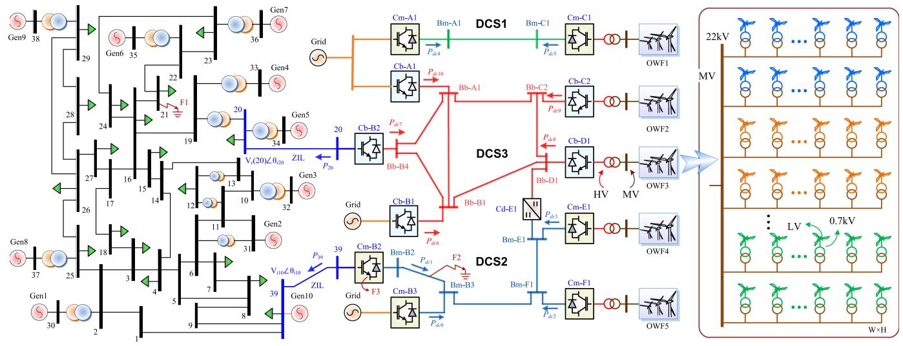  
Fig. 3. Comprehensive AC/DC grid integrated with wind farms.

contributes an additional 3 states, i.e., $v _ { 1 } ( t ) , v _ { 2 } ( t )$ , and $v _ { 3 } ( t )$ , to after the Inverse Laplace Transform.

The stator of the synchronous machine is solved as part of the AC network in the algebraic equation. Considering the buses can be categorized according to the injection, the following matrix equation is established,

$$
\left[ \begin{array}{l} \mathbf {J} _ {\mathrm {i}} \\ \mathbf {0} \end{array} \right] = \left[ \begin{array}{l l} \mathbf {Y} _ {\mathrm {i i}} & \mathbf {Y} _ {\mathrm {i r}} \\ \mathbf {Y} _ {\mathrm {r i}} & \mathbf {Y} _ {\mathrm {r r}} \end{array} \right] \left[ \begin{array}{l} \mathbf {V} _ {\mathrm {i}} \\ \mathbf {V} _ {\mathrm {r}} \end{array} \right], \tag {19}
$$

where subscription i denotes buses with current injections, r represents the remaining nodes. Manipulation of the matrix equation results in

$$
\mathbf {V} _ {\mathrm {i}} = \left(\mathbf {Y} _ {\mathrm {i i}} - \mathbf {Y} _ {\mathrm {i r}} \mathbf {Y} _ {\mathrm {r r}} ^ {- 1} \mathbf {Y} _ {\mathrm {r i}}\right) ^ {- 1} \mathbf {J} _ {\mathrm {i}}, \tag {20}
$$

which guarantees an independent solution of the stator without involving network elements, and a further substitution into (19) derives the network nodal voltages.

The AC grid provides bus voltages for the DC converters, and buses with the same number on the 2 sides are thus connected by a zero-impedance line (ZIL), which provides an interface between the DS and EMT simulation. Solution of the AC network equation (19) results in bus voltages in p.u. and their phases $V _ { i , r } \angle \theta _ { i , r }$ , which are then converted into time-domain sinusoidal functions $V _ { i , r } V _ { r t } \mathrm { s i n } ( \omega t + \theta _ { i , r } )$ by multiplying the voltage rating $V _ { r t }$ . In the meantime, transient computation of the DC grid yields the injected power from converters under the exact voltages, so its AC counterpart can proceed network solution in the next time-step.

# B. Detailed EMT Modeling

Fig. 4 shows the full-scale of a half-bridge submodule (SM)- based modular multilevel converter (MMC) operating as a DC grid terminal, where hundreds of submodules are usually deployed to sustain high voltages. A remarkable fidelity can be achieved when an exact number of SMs in the converter are taken into account, while modeling of the IGBT module, especially its

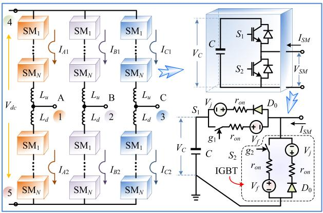  
Fig. 4. Three-phase MMC topology and detailed submodule circuit model.

anti-parallel freewheeling diode, further affects the computation accuracy of a detailed MMC.

As depicted, the IGBT is generally modeled as a combination of a switch whose ON/OFF state is controlled by the gate signal $^ { g , }$ forward voltage drop represented by $V _ { f }$ , and the on-state resistance $r _ { o n }$ . The freewheeling diode consists of the p-n junction voltage $V _ { j }$ , on-state resistance, and an ideal diode $D _ { 0 }$ representing its unidirectional conduction. When $S _ { 1 }$ is turned on and its complementary switch $S _ { 2 }$ is under OFF state, determined by the direction of arm current, the capacitor is either charging or discharging; otherwise, the SM is bypassed by $S _ { 2 }$ . Therefore, when the MMC is under normal operation, the $\mathbf { S M s } ^ { \prime }$ status can be summarized as

$$
\begin{array}{l} v _ {S M} = i _ {S M} r _ {o n} + g _ {1} \int \left(\frac {i _ {S M}}{C}\right) d t + (g _ {1} - s g n (i _ {S M})) ^ {2} V _ {f} \\ + \left(g _ {1} + s g n \left(i _ {S M}\right) - 1\right) V _ {j}, \tag {21} \\ \end{array}
$$

where $g _ { 1 }$ is a binary denoting the ON/OFF state of switch $S _ { 1 }$ by 1 and 0, the sign function sgn( ) yields 1 and 0 for positive and negative values, respectively.

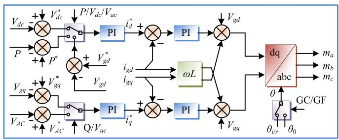  
Fig. 5. General d-q frame GC/GF MMC controller.

Deemed as a time-varying voltage source, the derivation of $v _ { S M }$ decouples all SMs from the remaining circuit and therefore dramatically reduces the computational burden of a detailed MMC, which, from a mathematical point of view, contains a huge number of electrical nodes contributed by cascaded submodules. Each of the 6 arms is then turned into a Thévenin equivalent circuit, and discretizing the arm inductor yields the following formula,

$$
\begin{array}{l} v _ {a r m} (t) = (Z _ {L _ {u / d}} + R _ {L _ {u / d}}) i _ {a r m} (t) \\ + \left(\sum_ {1} ^ {N} v _ {S M} (t - \Delta) + 2 v _ {L _ {u / d}} ^ {i} (t)\right), \tag {22} \\ \end{array}
$$

where ZLu,d and viLu,d $Z _ { L _ { u , d } }$ $v _ { L _ { u , d } } ^ { i }$ denote the impedance and incident pulse respectively after taking an inductor as a section of lossless transmission line [26], and $R _ { L _ { u , d } }$ is the parasitic resistance of the arm inductor.

By converting the arms into their Norton equivalent circuits, only 5 essential nodes are left on the AC and DC ports, as shown in the figure, and consequently, the MMC circuit yields a $5 \times 5$ admittance matrix. Then, the solution of a corresponding matrix equation gives the arm currents, which are also the submodule terminal currents $i _ { S M }$ , and the computation repeats by calculating the submodule voltage in the next time-step.

It can be inferred from Fig. 3 that 2 types of converter control schemes, i.e., grid-connected (GC) and grid-forming (GF), exist in the DC grid. As mentioned, the solution of (19) in the AC grid dynamic simulation provides the grid-connected MMCs with voltage $V _ { i , \tau }$ and phase angle reference $\theta _ { i , r } . \mathrm { A }$ phase-locked loop (PLL) is included to track the grid phase for the controller, which regulates DC voltage or active power on the d-axis, and AC bus voltage or reactive power on the q-axis. A grid-forming inverter, on the other hand, generates voltage and phase angle reference for the wind farms to support the operation of induction machines. The d-and q-axis control AC voltage magnitude and reactive power, respectively, and control target can be on both sides of the transformer, i.e., the high-voltage (HV) and mediumvoltage (MV) buses. Though the specific control quantities vary, they share an identical scheme, as shown in Fig. 5. Thus, a GF-MMC provides a stable voltage for an array of $W \times H$ DFIGs

$$
v _ {G F} (t) = \sqrt {V _ {g d} ^ {2} + V _ {g q} ^ {2}} \cdot \sin \left(\int \omega_ {0} d t + k \frac {2}{3} \pi\right), k = 0, 1, 2 \tag {23}
$$

where $V _ { g d }$ and $V _ { g q }$ are the three-phase voltages in $d \ – q$ frame, and ω0 is the desired angular frequency.

With the low voltage (LV) boosted by grid-interface transformers, all DFIGs are connected to a common MV bus. The availability of $v _ { G F }$ thus enables the solution of induction machines’ state-space equations, and following converting ( ) y tinto the 3-phase domain, the currents are aggregated on the MV bus and fed into the GF-MMC for its computation.

In EMT simulation, the transmission lines or cables linking a WF to the MMC provide a natural partitioning scheme following discretization, and therefore, all DFIGs are physically independent and can be computed in parallel. As the distance between each turbine is normally a few hundred meters, the transmission delay is considered identical, or in other words, the transmission from all WTs to the MV/HV transformer and vice versa are completed within the same time-step. At an arbitrary grid interface, the transmission line, which adopts the traveling wave model, is involved in the formation of admittance matrix and history current,

$$
\begin{array}{l} \mathbf {V} _ {\mathbf {T}} (t) = \left(\mathbf {G} _ {\mathbf {T}} + \left[ \begin{array}{c c} \frac {1}{Z _ {C}} \mathbf {I} _ {3 \times 3} & \mathbf {0} _ {3 \times 3} \\ \mathbf {0} _ {3 \times 3} & \mathbf {0} _ {3 \times 3} \end{array} \right]\right) ^ {- 1} (\mathbf {I} _ {\mathbf {h i s}} (t - \Delta t) \\ \left. + \left[ \mathbf {I} _ {\mathbf {m}} (\mathbf {t} - \boldsymbol {\Delta}), - \mathbf {I} _ {\mathbf {s}} (\mathbf {t}) - \mathbf {I} _ {\mathbf {g c}} (\mathbf {t}) \right] ^ {T}\right), \tag {24} \\ \end{array}
$$

where $Z _ { C }$ is the characteristic impedance of the line, and $\mathbf { I _ { m } }$ Imrepresents the 3-phase history current of the transmission line at LV/MV transformer side. Similarly, the line elements also participate in the formation of an 8 × 8 MMC matrix equation along with the HV/MV transformer.

# IV. ADAPTIVE SEQUENTIAL-PARALLEL PROCESSING

# A. Heterogeneous CPU-GPU Processing Boundary Definition

The scale of EMT simulation varies from case to case, and generally, the computational burden may also differ significantly even for the same system due to the flexibility of choosing a component with distinct model complexities. The subsequent uncertainty in computational burden is handled by adaptive sequential-parallel processing (ASP2) which automatically shifts the transient analysis between CPU and GPU, termed as host and device, respectively. The fact that both processors are individually capable of processing any number of components indicates the ASP2 can split into heterogeneous sequential-parallel computing, pure CPU execution, and GPU implementation, and the quantity of a certain type of subsystem – a component or a group of components that could be written as a function by programming languages – is a major criterion for the mode selection. In the comprehensive AC/DC grid, the MMC submodules and DFIGs are potential sources of massively parallel computing.

Grid-connection and pursuit of high power quality propel full-scale MMC modeling with a sufficient number of submodules, alongside the demand for very detailed converter internal phenomena study. Based on its element quantities, the MMC can be internally divided into 2 parts, as illustrated in Fig. 6. A 3-phase high-voltage-oriented MMC contains hundreds or even thousands of submodules, and a further multiplied quantity due to the existence of a few terminals in the DC grid caters to the concept of massive parallelism and manifests the SIMT

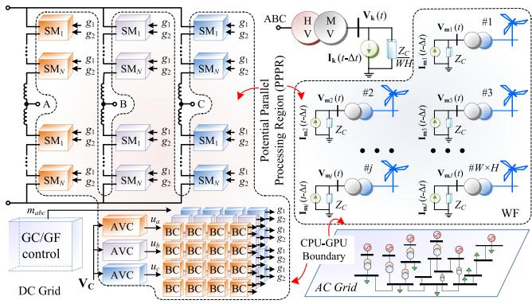  
Fig. 6. Sequential and potential parallel processing boundary definition in wind-farm-integrated AC/DC grid.

paradigm. While only 1 outer-loop GC/GF controller is required for each MMC, the inner-loop counterpart has a dramatic difference, the average-voltage control (AVC) and balancing control (BC) correspond to each phase and submodule [27], respectively. Therefore, the BC blocks are allocated within a potential parallel processing region (PPPR), and the AVC is also included there to facilitate reading the capacitor voltage from each submodule.

The remaining parts, including the MMC frame and the GC/GF controller, as well as DC lines linking a station to its counterparts, are processed on the CPU, as their numbers in a regular DC grid are inadequate to support massively parallel processing. The HV/MV transformer is solved along with the MMC frame and is thus separated from the WF, and the transmission line between them provides an inherent boundary. For an arbitrary phase, the DFIG-side transmission lines have a simultaneous history current update; in contrast, their MMC-side counterpart is a sum of all secondary side quantities, as given by

$$
I _ {m} [ i ] (t) = - I _ {k} (t - \Delta t) - \frac {2}{Z _ {C}} V _ {k} (t - \Delta t), i \in [ 0, 3 W H) \tag {25}
$$

$$
\begin{array}{l} I _ {k} (t) = - \sum_ {k = 3 i + 0 / 1 / 2} ^ {3 W H} \left(I _ {m} [ k ] (t - \Delta t) + \frac {2}{Z _ {C}} V _ {m} [ k ] (t - \Delta t)\right). \\ i \in [ 0, W H) \tag {26} \\ \end{array}
$$

The concurrency of DFIG computation is therefore ensured by (25), and the sum operation is conducted on the CPU along with other processes to form an EMT-dynamic co-simulation on a heterogeneous sequential-parallel computing architecture.

It should be pointed out that the CPU-GPU processing boundary is not definitive and shifts according to the computational burden induced by system scale in conjunction with the prevalence of homogeneity or its opposite. For instance, when a low-level MMC is configured, or the WF is largely aggregated, the CPU outperforms its many-core counterpart in handling equipment originally in the PPPR, and therefore, the ASP2 will eventually regress to conventional CPU simulation to maintain high efficiency. On the other hand, if the numbers of MMC converter stations, synchronous generators, and AC buses keep increasing, the hybrid simulation will ultimately evolve into pure massively parallel processing.

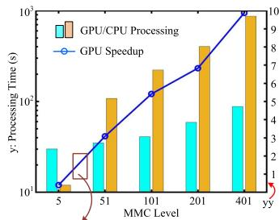

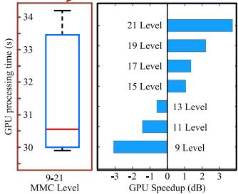

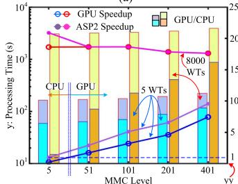

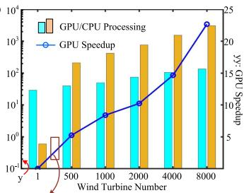

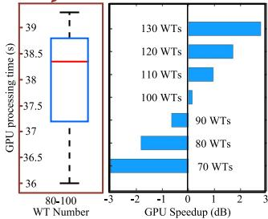

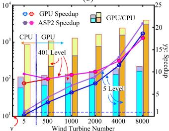  
  
(d)   
Fig. 7. CPU and GPU computational efficiency comparison and threshold identification for (a) MMC, (b) WT, and ASP2 computational efficiency under various (c) MMC levels and (d) WT numbers.

Fig. 7(a)–(b) compares the processing efficiency of CPU and GPU to ascertain an approximate boundary, based on 10-sec simulations of the optimized AC/DC grid on a server with 192 GB RAM, 20-core Intel Xeon E5-2698 v4 CPU, and NVIDIA Tesla V100 GPU. Fig. 7(a) shows that the CPU is more efficient in simulating the DC grid when the MMC voltage level is 5; nevertheless, its many-core counterpart gains a high speedup with practical voltage levels for HVDC grid, e.g., 10 times under 401-level MMCs. Estimation based on linear interpolation indicates that the crossover occurs near 15-level MMC, and therefore, neighboring levels ranging from 9 to 21 are also tested to obtain an accurate threshold $N _ { t h }$ . Since the computational capability of GPU is below its limit in these cases, the parallel execution time falls within a small range of 29 to 35 seconds despite different levels. Based on 70 samples in total, the box-plot is drawn to extract the median value, which is 30.6 sec, and subsequently, the threshold can be ascertained as 15-level in the horizontal bar graph following comparisons with CPU execution time. Similarly, it can be found that the GPU enables a remarkable speedup over CPU and the threshold is around 100 wind turbines. In both cases, the threshold can be slightly higher than the statistically obtained value since the CPU is still efficient.

The computational efficiency of the ASP2 framework, represented by the speedup over pure CPU execution, is depicted in Fig. 7(c)–(d), which indicates that with more cores to share the computational burden, the time GPU requires to complete its

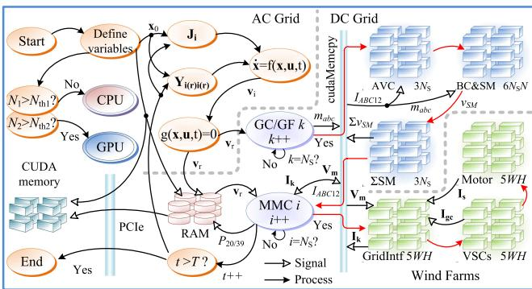  
Fig. 8. Adaptive sequential parallel processing scheme of WF-integrated AC/DC grid on heterogeneous CPU-GPU computing architecture.

tasks remain relatively stable and thus the speedup climbs. With the 5 wind farms in Fig. 3 aggregated as 5 separate DFIGs, the GPU’s speedup rises alongside the MMC level, and it fluctuates around 20 when 8000 WTs account for the major computational burden, as shown in Fig. 7(c). Meanwhile, a growing WT number leads to an increasingly evident GPU performance enhancement in Fig. 7(d). The adaptability of the proposed framework is manifested by the fact that its efficiency curve is constantly above or overlapping that of CPU and GPU. As an optimum solution, the ASP2 can flexibly switch among its 3 processing modes to maintain the efficiency maximum possible, i.e., regression to pure CPU execution when the GPU’s speedup is below 1 under the 5-level-MMC and 5-WT scenario, proceeding with GPU’s massive parallelism for high-level MMCs and large groups of WTs when the ASP2’s efficiency curve overlaps with that of the GPU, and a joint CPU-GPU processing with the efficiency higher than that of GPU and CPU if the system possesses substantial homogeneity and inhomogeneity.

# B. Adaptive Sequential-Parallel Processing Framework

In the adaptive heterogeneous transient analysis of the WFintegrated hybrid AC/DC grid, various block types located in the PPPR are designed into kernels, i.e., global functions programmed by CUDA C++, for massively parallel implementation using the single-instruction multiple thread manner. In the meantime, they are also written into C++ functions along with the remaining components for potential sequential execution. The EMT-dynamic co-simulation is always initiated on the CPU where variables of C++ functions and GPU kernels are defined in the host and device memory, respectively. The ASP2 distinguishes itself from single processor computation by identifying tasks that should be assigned to the GPU according to the threshold before analyzing the system, as shown in Fig. 8, and in this case variables corresponding to kernel inputs and outputs should be copied to CUDA memory via PCIe, which is a common channel for signal exchange between the two processors.

The co-simulation formally commences with AC grid transient stability analysis on the CPU, and as implied by (20), the generator is solved first after establishing the Jacobian matrix, followed by network solution. Though no definitive computing

boundary exists between the AC and DC grids, the MMC d-q frame controllers always operate on the CPU one after another till all $N _ { S }$ stations are completed, and under ASP2 scheme, the output modulation signals denoted by $m _ { a b c }$ are copied to CUDA memory and starting from the inner-loop controller, the program enters parallel computing stage, albeit the implementation of different kernels is still sequential.

The number of threads invoked by each kernel using a single CUDA C++ command is exactly the actual component quantity, and this concurrency ensures a remarkable efficiency improvement. Each AVC and BC corresponds to an MMC phase and submodule, respectively, and consequently their thread numbers are $3 N _ { S }$ and $3 N _ { S } \cdot 2 N$ . As each SM proceeds independently, the output voltage vSM is summed up with its counterparts in another kernel before returning to the CPU temporarily to handle MMC linear part, which derives the medium voltage for wind farms. Then, the process moves onto the GPU again so that the DFIG kernels can eventually yield the injection current into the DC grid. In the meantime, the CPU counts the simulation time, the program should either continue as the next time-step or end.

On the other hand, if the scale of either – or both – of MMC and DFIG is insufficient, CPU will take charge of computation, and memory copy between the 2 processors’ physical layer is no longer necessary for that equipment. All of its components corresponding to CUDA kernels are implemented as C++ functions repeatedly in a sequential manner instead of SIMT-based massive parallelism.

It can be seen from the ASP2 framework that all AC/DC grid components and control sections are implemented in the form of C++ functions or CUDA C++ kernels, and this modularized style prevailing in time-domain simulations facilitates allocating a component type to either the parallel processing region or outside it based on its quantity during the program initialization stage.

# V. EMT-DYNAMIC CO-SIMULATION RESULTS

The proposed detailed modeling methodology provides an insight into intricate interactions within the WF-integrated AC/DC grids that is otherwise unavailable in general modeling and simulation where identical components are aggregated or averaged. The consequent computational burden is, as indicated in Fig. 7, alleviated by the adaptive sequential-parallel processing. In the proposed heterogeneous co-simulation, the EMT and dynamic simulations adopt a time-step of 20 $\mu \mathrm { s }$ and 5 ms, respectively. Thus, for results validation, PSCAD/EMTDC and DSATools/TSAT simulations are conducted under the same time-steps, i.e., 20 $\mu \mathrm { s }$ and 5 ms.

Distributed over a wide area, the turbines are subjected to different wind speeds, and Fig. 9(a) gives the probability density function by Weibull distribution,

$$
D \left(v _ {w}; \alpha , \beta , \gamma\right) = \frac {\alpha}{\beta} \left(\frac {v _ {w} - \gamma}{\beta}\right) ^ {\alpha - 1} e ^ {- \left(\frac {v _ {w} - \gamma}{\beta}\right) ^ {\alpha}}, v _ {w} \geq \gamma \tag {27}
$$

where $\alpha , \beta ,$ , and $\gamma$ are shape, scale, and location parameters, respectively. Starting at t = 10 s, the wind intensifies at a rate of 1 m/s in the following 5 seconds, i.e., γ rises from 0

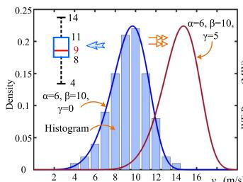

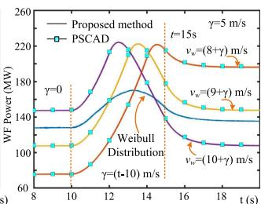

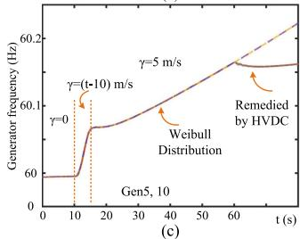

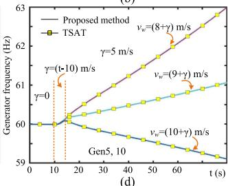  
Fig. 9. Impact of WF modeling on AC/DC grid dynamics: (a) wind speed, (b) OWF4-5 output power and Generator 5 and 10 frequency under (c) Weibull Distribution and (d) unified wind speeds.

to 5 m/s, and the function is discretized as the histogram to calculate the exact output power of two 100-DFIG wind farms OWF4 and OWF5, as shown in Fig. 9(b). The huge disparities among these curves indicate that adopting a uniform wind speed, either the median from box-plot or its neighboring values, falls short of precise power calculation under the entire operation stage. Hence, the AC grid exhibits distinct dynamic responses in Fig. 9(c)-(d). The converter station Cm-B2 controlling the DC voltage witnesses a slight power injection increase into Bus 39, and the consequent surplus induces a slow frequency ramp, which leaves sufficient time for the HVDC to take remedial actions to enter a new stable system operating point. In contrast, the simulation yields incorrect generator frequency response without distinguishing each DFIG, as it will induce either a dramatic increase or decrease.

Fig. 10 depicts the AC grid stability following internal contingencies. The 3-phase fault at Bus 21 incurs a significant voltage drop at Generators 4-7, along with large rotor angle and power oscillations, yet the AC grid can restore steady-state operation once it is eliminated 50 ms later, and its impact on the DC system is negligible. At t = 60 s, Bus 39 has a sudden 100 MW load increase, and the DC grid is ordered to take remedial actions. Fig. 10(d)–(f) demonstrates that with a corresponding 100 MW step by the HVDC station Cm-B2, the IEEE 39-bus system stabilizes instantly. However, it is unstable if the same amount of power ramp occurs in 20 seconds as the grid frequency keeps decreasing, an approximate 104 MW is required in power ramp Scheme 2 to maintain stability.

The proposed EMT-dynamic co-simulation exhibits a good agreement with the selected TSAT results in Fig. 10. For a comprehensive analysis of the modeling accuracy, the deviations of quantities in the AC grid are given in Fig. 11. The terminal voltage, rotor angle, and frequency of all generators are identical to DSATools/TSAT simulation results since the errors are virtually negligible. The active power of the generator on Bus

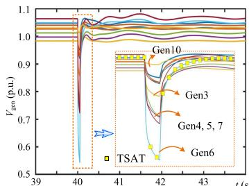  
(a)

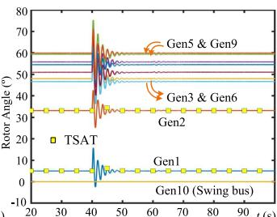  
(b）

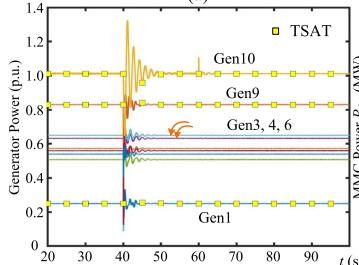

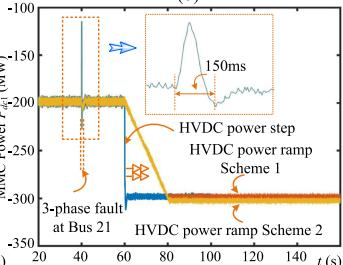

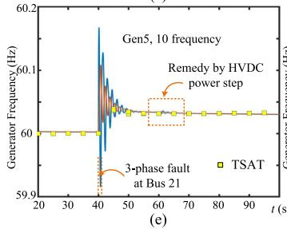

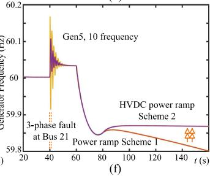  
Fig. 10. AC grid-side contingency: (a)–(c) generator voltage, rotor angle, and output power, (d) Cm-B2 power, (e)–(f) generator frequency.

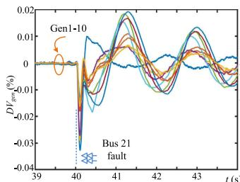  
(a

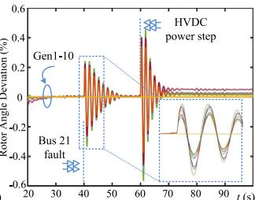

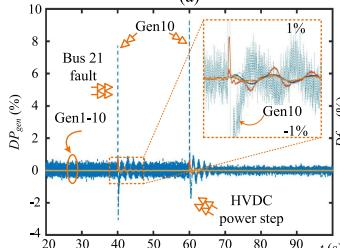  
(（C）

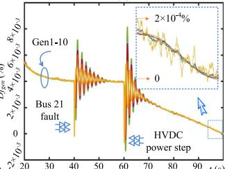  
  
Fig. 11. Deviations of the proposed heterogeneous ASP2-based EMTdynamic co-simulation of the AC/DC grid.

39 has around 8% and 9% mismatches shortly after the 3-phase fault on Bus 21 and power injection step of HVDC converter Cm-B2 on Bus 39 at t = 40 s and 60 s, respectively. Different modeling methodologies account for this phenomenon, since in the AC/DC grid co-simulation, the controller of Cm-B2 has a response time, and in TSAT the analysis is merely applied to the AC grid where equivalent loads are used to represent the

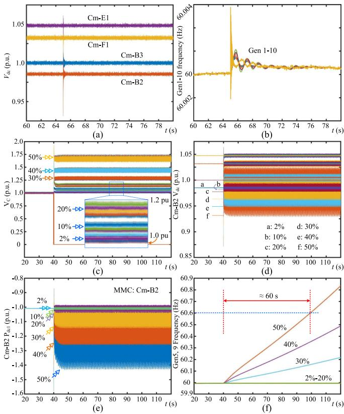  
Fig. 12. AC/DC grid response to DC-side contingency: (a)–(b) converter power and generator frequencies under DC line fault F2, (c)–(f) SM capacitor voltage, MMC DC voltage and power, and generator frequencies under Cm-B2 internal fault F3.

converter stations. It, therefore, indicates better fidelity of the EMT-dynamic co-simulation which is compatible with versatile models, and the results can be used for accurate dynamic security assessment of complex power systems.

Fig. 12 shows the impact of DC-side faults on system stability. When the middle of DC line touches the ground for 1 ms, the fault F2 causes minor perturbations to the DC voltages, and its impact on AC grid transient stability is insignificant since the generators are able to maintain at 60 Hz, as given in Fig. 12(a)-(b). In contrast, the MMC internal fault F3, depending on the percentage of faulty submodules in an arm, could have a remarkable disturbance to both AC and DC grids, as depicted in Fig. 12(c)-(f). A proportion below 10% indicates a continuation of the normal operation of the entire hybrid grid; nevertheless, its further increase results in a more vulnerable system. The DC capacitor voltages $V _ { C }$ on the remaining submodules have to rise to sustain the DC grid voltage, accompanied by a higher chance of equipment breakdown; yet the ripples enlarge and the DC grid voltages are subjected to severer oscillations, and so are the transferred powers. Meanwhile, the AC grid will also quickly lose stability, e.g., it takes around 1 minute when half of all submodules in an MMC arm are internally short-circuited. Thus, from an operation perspective, the MMC should be blocked once the faulty SM percentage in an arbitrary arm exceeds 10% to protect equipment from over-current.

# VI. CONCLUSION

This work investigates the feasibility of adaptive sequential parallel processing for detailed and efficient transient analysis of modern complex power systems integrated with power converters and a significant amount of distributed energy resources. Topological optimization by internal component-level partitioning towards the modular multilevel converter and doublyfed induction generator reduces the dimension of their matrix equations, whilst creating a sufficient number of physically separated subsystems which could consequently be processed by a corresponding number threads invoked by CUDA C++ kernels using the single-instruction multiple thread manner. The external system-grade division, on the other hand, enables the compatibility of dynamic and EMT simulations, in addition to contributing to independent sequential and parallel computing. The proposal of a flexible CPU-GPU processing boundary yields a generic heterogeneous transient analysis methodology which maintains the highest possible simulation efficiency regardless of the system scale following a combination of merits of available computational hardware resources, i.e., the massive parallelism capability of many-core GPU and the excellent single-thread processing feature of CPU. Test results demonstrate that a comprehensive study is able to reveal the interaction of various sections within the AC/DC grid and thus provides critical information for power system planning and operation.

# REFERENCES

[1] S. Koebrich, T. Bowen, and A. Sharpe, Renewable Energy Data Book. Office of Energy Efficiency & Renewable Energy, Washington, DC, USA: U.S. Department of Energy, 2018. [Online]. Available: https://www.nrel. gov/analysis/energy-data-books.html   
[2] N. W. Miller, “Keeping it together: Transient stability in a world of wind and solar generation,” IEEE Power Energy Mag., vol. 13, no. 6, pp. 31–39, Dec. 2015.   
[3] M. Amin, A. Rygg, and M. Molinas, “Self-synchronization of wind farm in an MMC-based HVDC system: A stability investigation,” IEEE Trans. Energy Convers., vol. 32, no. 2, pp. 458–470, Jun. 2017.   
[4] T. M. L. Assis, S. Kuenzel, and B. C. Pal, “Impact of multi-terminal HVDC grids on enhancing dynamic power transfer capability,” IEEE Trans. Power Syst., vol. 32, no. 4, pp. 2652–2662, Jul. 2017.   
[5] Y. Wu, S. Chang, and P. Mandal, “Grid-connected wind power plants: A survey on the integration requirements in modern grid codes,” IEEE Trans. Ind Appl., vol. 55, no. 6, pp. 5584–5593, Dec. 2019.   
[6] L. Xu, L. Yao, and C. Sasse, “Grid integration of large DFIG-based wind farms using VSC transmission,” IEEE Trans. Power Syst., vol. 22, no. 3, pp. 976–984, Aug. 2007.   
[7] S. M. Muyeen, R. Takahashi, and J. Tamura, “Operation and control of HVDC-connected offshore wind farm,” IEEE Trans. Sustain. Energy, vol. 1, no. 1, pp. 30–37, Apr. 2010.   
[8] Y. Li, Z. Xu, J. Ostergaard, and D. J. Hill, “Coordinated control strategies for offshore wind farm integration via VSC-HVDC for system frequency support,” IEEE Trans. Energy Convers., vol. 32, no. 3, pp. 843–856, Sep. 2017.   
[9] G. Pinares and M. Bongiorno, “Modeling and analysis of VSC-based HVDC systems for DC network stability studies,” IEEE Trans. Power Del., vol. 31, no. 2, pp. 848–856, Apr. 2016.   
[10] J. Renedo, A. García-Cerrada, and L. Rouco, “Active power control strategies for transient stability enhancement of AC/DC grids with VSC-HVDC multi-terminal systems,” IEEE Trans. Power Syst., vol. 31, no. 6, pp. 4595–4604, Nov. 2016.   
[11] Y. Huang and D. Wang, “Effect of control-loops interactions on power stability limits of VSC integrated to AC system,” IEEE Trans. Power Del., vol. 33, no. 1, pp. 301–310, Feb. 2018.

[12] P. Kou, D. Liang, Z. Wu, Q. Ze, and L. Gao, “Frequency support from a DC-Grid offshore wind farm connected through an HVDC link: A communication-free approach,” IEEE Trans. Energy Convers., vol. 33, no. 3, pp. 1297–1310, Sep. 2018.   
[13] X. Zha, S. Liao, M. Huang, Z. Yang, and J. Sun, “Dynamic aggregation modeling of grid-connected inverters using Hamilton’s-actionbased coherent equivalence,” IEEE Trans. Ind. Electron., vol. 66, no. 8, pp. 6437–6448, Aug. 2019.   
[14] W. Du, W. Dong, H. Wang, and J. Cao, “Dynamic aggregation of same wind turbine generators in parallel connection for studying oscillation stability of a wind farm,” IEEE Trans. Power Syst., vol. 34, no. 6, pp. 4694–4705, Nov. 2019.   
[15] L. P. Kunjumuhammed, B. C. Pal, C. Oates, and K. J. Dyke, “The adequacy of the present practice in dynamic aggregated modeling of wind farm systems,” IEEE Trans. Sustain. Energy, vol. 8, no. 1, pp. 23–32, Jan. 2017.   
[16] P. Wang, Z. Zhang, Q. Huang, N. Wang, X. Zhang, and W. Lee, “Improved wind farm aggregated modeling method for large-scale power system stability studies,” IEEE Trans. Power Syst., vol. 33, no. 6, pp. 6332–6342, Nov. 2018.   
[17] Y. Zhou, L. Zhao, I. B. M. Matsuo, and W. Lee, “A dynamic weighted aggregation equivalent modeling approach for the DFIG wind farm considering the Weibull distribution for fault analysis,” IEEE Trans. Ind Appl., vol. 55, no. 6, pp. 5514–5523, Dec. 2019.   
[18] N. Trinh, M. Zeller, K. Wuerflinger, and I. Erlich, “Generic model of MMC-VSC-HVDC for interaction study with AC power system,” IEEE Trans. Power Syst., vol. 31, no. 1, pp. 27–34, Jan. 2016.   
[19] A. F. Cupertino, W. C. S. Amorim, H. A. Pereira, S. I. Seleme Junior, S. K. Chaudhary, and R. Teodorescu, “High performance simulation models for ES-STATCOM based on modular multilevel converters,” IEEE Trans. Energy Convers., vol. 35, no. 1, pp. 474–483, Mar. 2020.   
[20] R. C. Green, L. Wang, and M. Alam, “Applications and trends of high performance computing for electric power systems: Focusing on smart grid,” IEEE Trans. Smart Grid, vol. 4, no. 2, pp. 922–931, Jun. 2013.   
[21] Z. Zhou and V. Dinavahi, “Parallel massive-thread electromagnetic transient simulation on GPU,” IEEE Trans. Power Del., vol. 29, no. 3, pp. 1045–1053, Jun. 2014.   
[22] D. Chen, H. Jiang, Y. Li, and D. Xu, “A two-layered parallel static security assessment for large-scale grids based on GPU,” IEEE Trans. Smart Grid, vol. 8, no. 3, pp. 1396–1405, May 2017.   
[23] NVIDIA Corp., CUDA C++ Programming Guide, Aug. 2020.   
[24] G. Abad, J. López, M. Rodríguez, L. Marroyo, and G. Iwanski, Doubly Fed Induction Machine: Modeling and Control for Wind Energy Generation Applications. Hoboken, NJ, USA: Wiley, 2011.   
[25] H. Abu-Rub, M. Malinowski, and K. Al-Haddad, Power Electronics for Renewable Energy Systems, Transportation and Industrial Applications. Hoboken, NJ, USA: Wiley, 2014.   
[26] H. Selhi, C. Christopoulos, A. F. Howe, and S. Y. R. Hui, “The application of transmission-line modelling to the simulation of an induction motor drive,” IEEE Trans. Energy Convers., vol. 11, no. 2, pp. 287–297, Jun. 1996.   
[27] M. Hagiwara and H. Akagi, “Control and experiment of pulsewidthmodulated modular multilevel converters,” IEEE Trans. Power Electron., vol. 24, no. 7, pp. 1737–1746, Jul. 2009.

Ning Lin (Member, IEEE) received the B.Sc. and M.Sc. degrees in electrical engineering from Zhejiang University, China, in 2008 and 2011, respectively, and the Ph.D. degree in electrical and computer engineering from the University of Alberta, Edmonton, AB, Canada, in 2018. From 2011 to 2014, he was an Engineer on flexible AC transmission system (FACTS) and high-voltage direct current (HVDC) transmission. His research interests include electromagnetic transient simulation, transient stability analysis, realtime simulation, device-level modeling, integrated

AC/DC grids, massively parallel processing, heterogeneous high-performance computing of power systems and power electronics.

Shiqi Cao (Graduate Student Member, IEEE) received the B.Eng. degree in electrical engineering and automation from the East China University of Science and Technology, China, in 2015, and the M.Eng. degree in power system from Western University, Canada, in 2017. He is currently working toward the Ph.D. degree in electrical and computer engineering with the University of Alberta, Canada. His research interests include power system dynamic simulation and stability analysis.

Venkata Dinavahi (Fellow, IEEE) received the B.Eng. degree in electrical engineering from the Visveswaraya National Institute of Technology (VNIT), Nagpur, India, in 1993, the M.Tech. degree in electrical engineering from the Indian Institute of Technology (IIT) Kanpur, India, in 1996, and the Ph.D. degree in electrical and computer engineering from the University of Toronto, Ontario, Canada, in 2000. He is currently a Professor with the Department of Electrical and Computer Engineering, University of Alberta, Edmonton, AB, Canada. His research

interests include real-time simulation of power systems and power electronic systems, electromagnetic transients, device-level modeling, large-scale systems, and parallel and distributed computing.