# Multi-Port Frequency Dependent Network Equivalents for the EMTP

A. S. Morched Senior member

J. H. Ottevangers

L. Martf  
Member

Ontario Hydro. Ontario, Canada

Abstract - A method is developed to reduce large power systems to single and multi-port frequency dependent equivalents. These equivalents consist of simple RLC modules that faithfully reproduce the frequency characteristics of the network. The method is implemented in the EMTP and has been extensively tested at Ontario Hydro. The implementation involves a pre-processor program to generate the model: the Frequency Dependent Equivalent (FDNE), and a EMTP timestep loop module to calculate the transient response. The use of the FDNE results in major reductions in computer time and is especially beneficial for multi-case statistical EMTP studies. An example showing the accuracy and efficiency of the FDNE when used to reduce a large 500 kV network is presented.

Keywords - Network equivalent, Multi-port, Frequency dependence, Electromagnetic transients, EMTP.

# 1. INTRODUCTION

The study of Electromagnetic transients often requires the detailed modelling of complex transmission networks. However, detailed representations may require prohibitive amounts of computer time, especially when statistical analysis is involved. It is, therefore, a common practice to represent in detail only a small portion of the system and to model the rest using equivalent networks.

Until very recently, only simplified equivalents have been used in transient studies. The most common representation consists of simple inductances derived from the short circuit impedances at the terminal buses evaluated at power frequency. A better representation, in terms of frequency response, can be obtained by shunting the power frequency impedances with the equivalent surge impedances of the lines attached to the buses. This produces improved first reflections, but degraded low frequency behaviour, and incorrect steady-state solutions.

Since these representations are only adequate for very simple transient studies, it has been necessary to represent in detail large portions of the system behind the terminal buses. The correct assessment of how much of the system should be modelled explicitly, is as much an art as it is the result of experience.

Efforts to establish rules for the size of the networks to be represented have been made. Notably, the work of the CIGRE Working Group 13.051, which recommends the use of detailed representation of the system up to two buses behind the terminal buses. However, in dense networks with many transmission lines, even a two-bus explicit representation can be computationally prohibitive. If these dense networks also contain many short lines, the two-bus rule may not guarantee the accuracy of the results, and the detailed modelling of larger portions of the system could be required.

The use of the frequency dependent equivalents for power networks goes as far back as the late sixties and early seventies. Pioneering work in this area was conducted by N. Hingorani2 and A. Clerici3. More recent work4,5,6 attempted to establish systematic procedures to generate frequency dependent network equivalents. Morched and Brandwajn4 proposed an approach to produce single-port equivalents with models that only matched the network admittances at the series resonant frequencies. Do and Gavrilovic5,6 proposed a procedure where the component modules used to represent each of the admittance series resonances are selected by inspection, and a least squares method is used to match the network admittances over a range of frequencies. While they presented methods for generating multi-port equivalents, the treatment was not sufficiently general.

This paper describes an efficient method to calculate network equivalent admittances as seen from one or more ports. It describes the extension of the concepts developed in [4] to multi-port equivalents and the improvement of the fitting technique to match the admittances over a wide range of frequencies.

The application of these techniques has resulted in the development of the Frequency Dependent Network Equivalent (FDNE) program and its subsequent implementation in the EMTP. The FDNE can simulate any type of network, and the generation of its parameters is automatic and does not require special skills on the part of the user.

The FDNE is a stand-alone program which uses a description of the network similar to the one used by the EMTP. It evaluates the nodal admittance matrix seen from multi-port terminals over a user-specified frequency range. On output, the FDNE produces a number of modules consisting of RLC branches (in EMTP-compatible format) whose frequency response matches that of the system seen from the terminals.

The FDNE allows the modelling of large portions of the system at a small fraction of the computational cost required to model them explicitly. This results in more reliable simulations as the need to estimate what portion of the system should be modelled in detail becomes less crucial.

# 2. NETWORK COMPONENT MODELS

The first step in the creation of a network equivalent is to build the nodal admittance matrix of the portion of the system to be represented over a given frequency range. Rather than using the EMTP itself to produce frequency scans of the entire network, the FDNE calculates the admittance matrix of each system component independently according to its mathematical description. This is more efficient from a computational point of view, and it does not tie the FDNE to a given version of the EMTP. The representations used in the FDNE to model the major system components are described below.

# 2.1 Transmission Lines

The representation of transmission lines used in the FDNE is based on the following assumptions:

1) The line parameters are distributed and their dependence on frequency due to skin effect and finite earth resistivity is taken into account.   
2) A transmission line consisting of only one circuit is forced to be balanced by averaging the diagonal and off-diagonal elements of the series impedance matrix [Z] and the shunt admittance matrix [Y] per unit length.   
3) In the case of a multi-circuit line, or of several single-circuit lines sharing the same right-of-way, the zero sequence coupling between circuits is taken into account.

The relationships between voltages and currents at both ends of the line, in nodal admittance matrix form, are given in the Appendix. In its most general form, voltages and currents at sending and receiving ends of the line can be described with equation (A.4); namely,

$$
\left[ \begin{array}{l} \vec {I} _ {i} \\ \vec {I} _ {j} \end{array} \right] = \left[ \begin{array}{c c} \boldsymbol {Y} _ {i i} & \boldsymbol {Y} _ {i j} \\ \boldsymbol {Y} _ {j i} & \boldsymbol {Y} _ {j j} \end{array} \right] \left[ \begin{array}{l} \vec {V} _ {i} \\ \vec {V} _ {j} \end{array} \right]
$$

The evaluation of $[\mathbf{Y}_{\mathrm{ij}}]$ and $[\mathbf{Y}_{\mathrm{ij}}]$ requires the calculation of the eigenvalues and the associated eigenvector matrix of $[\mathbf{Z}][\mathbf{Y}]$ for each right-of-way at each frequency. This can result in excessive computation times, especially for crowded right-of-ways.

Since the area of interest in a transient simulation is normally modelled in detail and not included in a network equivalent, it is possible to assume symmetry among the phases of the circuits forming the equivalent without significant loss of accuracy.

As can be seen from the Appendix, this assumption results in two identical uncoupled networks (positive and negative sequence) and a third network (zero sequence), which would be coupled in the case of multi-circuit right-of-ways, and uncoupled in the case of isolated single-circuit lines.

For each right-of-way, the FDNE calculates the positive sequence parameters for each circuit using the single-conductor equations (A.2) and (A.3). The only frequency dependent parameter in these equations is the transmission coefficient $\lambda$ . Given that $\lambda$ is a very smooth function of frequency, it is only

calculated explicitly at 10 frequencies over the entire frequency range; intermediate values of $\lambda$ are calculated by interpolation.

The zero sequence admittance matrices are calculated using (A.5) and (A.6), where the transmission coefficients as well as the modal transformation matrix $\left[\mathrm{T}_{\nu}\right]$ are frequency dependent. For the purposes of the FDNE, the eigenvector matrix $\left[\mathrm{T}_{\nu_0}\right]$ evaluated at $10\mathrm{kHz}$ is used to diagonalize $[\Lambda]^2$ over the entire frequency range with acceptable accuracy. As in the case of the positive sequence calculations, $[\Lambda]^2$ is evaluated explicitly at only 10 frequency points. The zero sequence admittance matrices are calculated with (A.5) and (A.6) with $[\Lambda]$ obtained using interpolation. The use of $\left[\mathrm{T}_{\nu_0}\right]$ instead of solving the eigenvalue problem at each frequency results in significant savings in computer time and in preserving the continuity of the eigenvalue functions.

# 2.2 Linear branches

Power system components other than transmission lines are normally represented as concentrated-parameter, single or multi-phase elements. For the purposes of the FDNE, symmetry among the phases of three-phase components is assumed.

# Series Elements

In power networks, series elements appear as capacitive compensation of long lines, current limiting reactors or transformers (in their simplest representation).

The admittance $[\mathbf{Y}_{\mathbf{ij}}]$ of a series element can be calculated from its equivalent circuit, or it can be measured at the required frequencies. The nodal admittance matrix of a series element connected between buses $i$ and $j$ is given by

$$
\left[ \begin{array}{l} \vec {I} _ {i} \\ \vec {I} _ {j} \end{array} \right] = \left[ \begin{array}{c c} Y _ {i j} & - Y _ {i j} \\ - Y _ {i j} & Y _ {i j} \end{array} \right] \left[ \begin{array}{l} \vec {V} _ {i} \\ \vec {V} _ {j} \end{array} \right] \tag {1}
$$

# Shunt Elements

Shunt elements appear as generators, loads, and inductive or capacitive shunt compensation. The admittance matrix $\left[\mathbf{Y}_{ii}\right]$ which describes the shunt element connected at bus $i$ can be calculated from equivalent circuits or can be measured at the required frequencies.

# 3. NETWORK REDUCTION

The nodal admittance matrices of the network have to be calculated at every frequency, and decomposed into positive and zero sequence networks using the well-known Karrenbauer modal transformation matrix. In the case of multi-circuit right-of-ways, the contribution to the zero sequence network will be a matrix, rather than a scalar. The sequence admittance matrices are then reduced between a given number of terminals, or ports, producing a family of frequency-dependent reduced-order admittance matrices.

In the FDNE, the admittance matrices of the entire network are

never fully calculated: only partial matrices including two bus layers beyond the reference ports are formed. In this process, the network is divided in layers. All transmission circuits and linear branches connected to the first reference port are counted in layer 1. The reference port is considered to be the 'from' bus. Corresponding 'to' buses are designated as layer 1 buses. All circuits of a right-of-way must be assigned to the same layer in order to account for the ground mode coupling between the circuits. The second layer consists of all remaining circuits connected to layer 1 buses.

The admittance matrix for the partial network consisting of the first two layers, and complemented by all shunts added to layer 1 and layer 2 buses, can now be reduced by eliminating the rows and columns corresponding to layer 1 buses. Any reference ports that might appear in layer 1 are retained.

The next stage is to extend the reduced admittance matrix by including buses belonging to a new layer, e.g., layer 3. This new layer consists of all remaining circuits connected between layer 2 and layer 3 buses, and circuits between layer 3 buses, including shunts. Matrix reduction will eliminate the now redundant layer 2 buses, with the exception of reference ports. This process of adding layers, followed by reducing the matrix is repeated until all circuits and shunts are included. In this context, linear branches are treated the same way as transmission circuits.

The network admittance matrix is kept to a relatively small size during this process and the final reduction produces an $\mathbf{N} \times \mathbf{N}$ matrix for a network with $\mathbf{N}$ reference ports. The matrix is symmetrical with $\mathrm{N}(\mathrm{N} + 1)/2$ distinct elements. The admittance matrix is calculated over a range of frequencies. Each element of the matrix produces a frequency response curve, to be matched by a multi-branch linear network.

The described process is more efficient than the direct reduction of the admittance matrix of the full system because it confines the operations to low order, almost full, matrices. It also eliminates the need to store large complex matrices and would allow the program to run on small computers with limited memory regardless of the size of the network modelled.

# 4. FREQUENCY DEPENDENT EQUIVALENTS

Once the equivalent positive and zero sequence admittance matrices are calculated as functions of frequency, their elements are fitted using modules of the type shown in Figure 1. Each module consists of a number of parallel RLC branches.

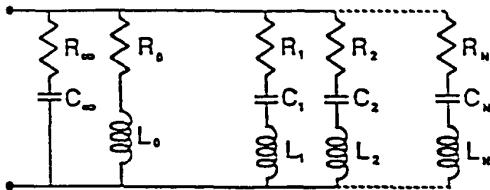  
Fig. 1: Structure of an FDNE module.

Before proceeding with the description of the fitting procedure, the main differences between single and multi-port equivalents should be pointed out.

# 4.1 Single-Port Equivalents

The realization of the single-port equivalent is straightforward. The stability of the model is not an issue, provided that each of the fitted RLC branches has a positively-damped response.

Reduced-order models are obtained by the rejection of less significant admittance peaks as compared to the largest peak of the fitted frequency characteristic.

# 4.2 Multi-Port Equivalents

The multi-port equivalent is realized in the form of the multiterminal $\pi$ -equivalent shown in Figure 2. The components of this $\pi$ -equivalent are easily calculated from the nodal admittance matrix of the reduced network. The admittance $y_{ii,\pi}$ of the component connected between node $i$ and ground is given by the sum of the elements of the row $i$ of the nodal admittance matrix.

$$
y _ {i i, \pi} = \sum_ {j = 1} ^ {N} y _ {i j} \tag {2}
$$

The component connected between nodes $i$ and $j$ of the $\pi$ -circuit is given by the negative of the corresponding off-diagonal element of the reduced-order nodal admittance matrix.

$$
y _ {i j, \pi} = - y _ {i j} \tag {3}
$$

Each component of the positive and zero sequence $\pi$ -equivalents has to be fitted to an RLC module for both positive and zero sequence networks.

A number of factors have to be taken into consideration during the realization of the multi-port equivalent:

a. The real part of the equivalent transfer admittances $y_{ij,\pi}$ have negative peaks. These can only be reproduced by negative RLC branches. This is not a problem, provided that each RLC branch has a positively damped response.   
b. The shunt components of the $\pi$ -equivalent can be produced by fitting them directly, or by fitting each of

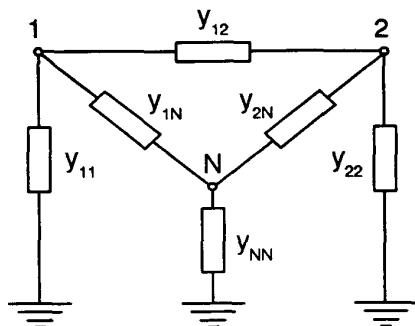  
Fig. 2: Equivalent $\pi$ -representation

the elements of the reduced nodal admittance matrix and then adding the approximations according to equation (2). The former procedure produces a lower order model but it may not be numerically stable.

These factors are taken into consideration when multi-port equivalents are produced. The process starts with scanning the frequency characteristics of each of the diagonal and off-diagonal elements of the reduced matrices. Series and parallel resonance frequencies and the corresponding admittances are identified. Peaks whose magnitudes are small compared to the magnitude of the largest resonance peak in all the elements are rejected. A list of all retained resonance frequencies is prepared. A second scan is made through each of the matrix elements, and peaks corresponding to any of the listed frequencies are retained regardless of their magnitude. This process is carried out on the positive and zero sequence equivalent networks.

# 5. CALCULATION OF THE RLC MODULES

Each matrix element is approximated by an RLC module whose frequency response matches that of the matrix element. An RLC module consists of one RC branch $(\mathbb{R}_{\infty},\mathbb{C}_{\infty})$ ,one RL branch $(\mathbf{R}_{\mathrm{o}},\mathbf{L}_{\mathrm{o}})$ , and a number of RLC branches $(\mathbb{R}_{\mathbf{k}},\mathbb{L}_{\mathbf{k}}$ $C_{\mathbf{k}}$ $\mathbf{k} = 1,\dots ,\mathbf{M})$ connected in parallel (see Figure 1). The method described in [4] is used to generate a module that matches the frequency characteristic at series resonance frequencies only. This is then used as an initial guess for an optimization process to minimize the mean square of the error over the entire frequency range. An iterative procedure is followed where the parameters of the module are adjusted one branch at a time. The process is based on a steepest decent approach with the following steps:

a. The partial derivatives of the square of the error function with respect to $\mathbf{L}_{\mathbf{k}}$ and the resonance frequency $\omega_{\mathbf{o},\mathbf{k}}$ of each RLC branch are calculated over a limited frequency range. This establishes the direction in which to change each parameter in order to reduce the error. The influence of $\mathbb{R}_k$ , $\mathbf{L}_{\mathbf{k}}$ , and $\mathbf{C_k}$ on the value of the admittance at frequencies which are not close to the resonance frequency of branch $k$ is small. Therefore, the frequency range used in the optimization of branch $k$ , extends only to the neighbouring parallel resonance frequencies.   
b. The inductance of branch $k$ is changed first. The change is carried out in two steps. On each step, $L_{k}$ is changed by $20\%$ of the value obtained in the previous iteration. The second step is carried out only if the first step results in a lower error. A linear search using the Fibonacci's ratio is conducted to locate the value of $L_{k}$ that produces the lowest error within the frequency range.   
c. The resonance frequency $\omega_{\mathbf{o,k}}$ of branch $k$ is the second parameter to be adjusted, and the change is limited to $1\%$ of the resonance frequency calculated in the initialization process. A linear search is then carried out to establish the resonance frequency corresponding to the minimum error within the frequency range. The capacitance of the branch is updated using the new values of $\mathbf{L_k}$ and $\omega_{\mathbf{o,k}}$ .   
d. The resistance of branch $k$ is calculated by matching the equivalent system admittance at the series resonance frequency.

e. The value of $C_{\infty}$ is adjusted by minimizing the square of the error of over the whole frequency range, and $R_{\infty}$ is selected by matching the power system admittance at a very high frequency (default value 500 kHz).   
f. The values of $\mathbf{R}_0$ and $\mathbf{L}_0$ are selected to match the admittance of the system at power frequency.

These steps are repeated until the error falls within acceptable limits, or until the maximum number of permissible iterations is reached. During this optimization process, the parameters of each branch are constrained to produce positively damped responses.

# 6. THE FDNE PROGRAM

The implementation of the Frequency Dependent Network Equivalents in the EMTP involves:

1) An auxiliary routine to calculate the model parameters.   
2) A time step loop module to calculate the transient response.

# 6.1 The FDNE Auxiliary Routine

The FDNE auxiliary routine carries out the network reduction and the fitting procedures described above. The description of the network is similar to the one used in the EMTP and the resulting model can be included directly into an EMTP data case.

There are no intrinsic constraints regarding the size of the system that can be modelled. With default dimensions, a system may contain: 60 right-of-ways with 20 circuits each; 250 circuits connected between 250 busbars; 100 series elements, and 50 shunt elements. The default number of ports is 5. The number of frequencies for which the matching is attempted can be as high as 1000, either linearly or logarithmically spaced. These defaults can easily be changed as required.

# 6.2 The Time Step Loop Module

The time step loop module implemented in the EMTP as part of the work described in [4] can also be used to model multiport equivalents, given that the original implementation allowed the connection of an RLC module between any two buses (rather than just between a bus and ground). Only minor coding changes were required to allow modules with negative R, L, and C.

# 7. EXAMPLE

The $500\mathrm{kV}$ system shown in Figure 3 is used to illustrate use of the FDNE. It consists of 41 transmission circuits connected between 20 busbars, with many circuits sharing the same tower or right-of-way. The $60\mathrm{Hz}$ self and transfer impedances of the underlying $230\mathrm{kV}$ system are connected to the terminal buses (not shown in Figure 3).

A two-port equivalent between busbars ES and HN was produced with the FDNE. Comparisons between system and

model admittance characteristics are shown in Figures 4, 5 and 6. The figures illustrate the good agreement between the model and system characteristics.

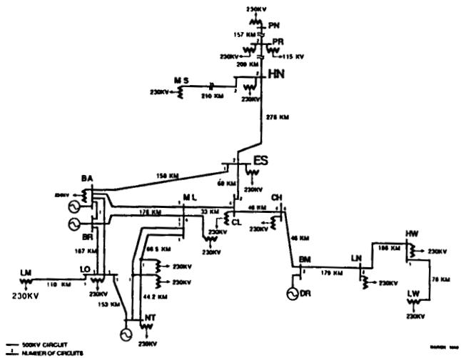

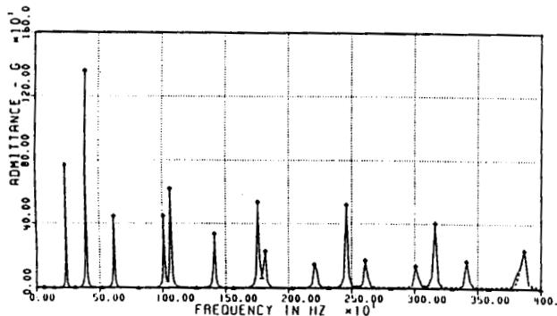  
Fig. 3: $500\mathrm{kV}$ test system.

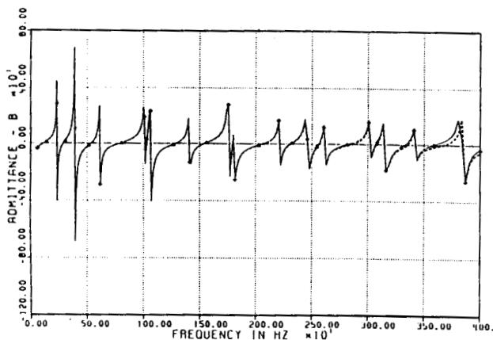  
(a)   
Fig. 4: Positive sequence admittance from bus HN to ground.

(a) Real part.   
(b) Imaginary part.

The effect of different network representations on the switching surges caused by the energization of one circuit of the double-circuit line between buses HN and ES was examined. Figure 7 shows the voltages at bus ES calculated with the full system representation, and with the two-port equivalent between the buses ES and HN.

The full system simulation requires 30 minutes of CPU time on a VAX 8600, whereas the FDNE simulation requires only 4 minutes. Preparation time to generate the FDNE equivalent is 23 minutes, while the time required to generate 41 JMARTI line models is $2 \frac{1}{2}$ hours.

The results obtained using a simple $60\mathrm{Hz}$ equivalent (with and without surge impedance in parallel) are shown in Figure 8. CPU time for each of these runs was slightly under 4 minutes.

In the assessment of switching surge levels at Ontario Hydro, it is a standard procedure to carry out statistical studies based on a set of 100 switching operations. Considering the results shown, it would be impractical to use the full system representation and it would be inaccurate to use the simple equivalents. The use of the FDNE solves this problem.

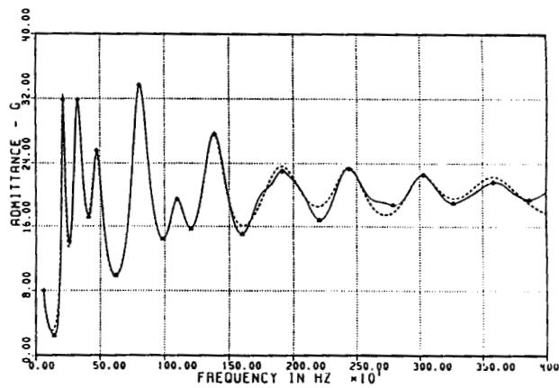  
Fig. 5: Zero sequence admittance from bus $HN$ to ground (real part only).

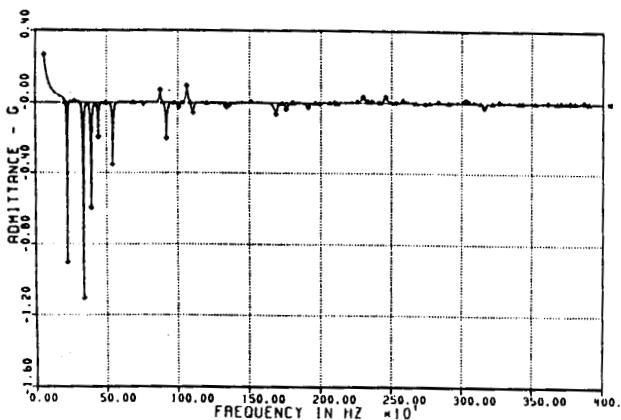  
Fig. 6: Positive sequence admittance between buses $HN$ and $ES$ (real part only).

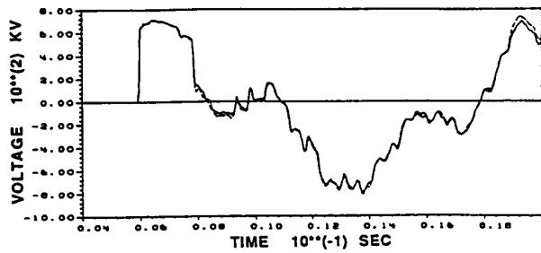  
Fig. 7: Transient simulation. Solid trace: Full system Dashed trace: FDNE equivalent.

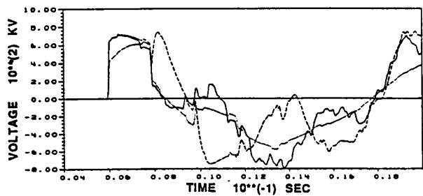  
Fig. 8: Results with conventional equivalents. Solid trace: Full system; Dashed trace: $60\mathrm{Hz}$ equivalent; Dotted trace: $60\mathrm{Hz}$ equivalent and surge impedance.

# 8. CONCLUSIONS

1. This paper describes the procedures developed to produce equivalent networks whose frequency response matches that of a much larger portion of a power system as seen from one or more terminals. These network equivalents make it unnecessary to use detailed but computationally expensive models to represent those parts of the system which are not the prime concern of a given transient simulation. Furthermore, since the FDNE does not use travelling wave representations of transmission lines, the time step of an EMTP simulation does not have to be smaller than the travel time of the shortest line in the equivalenced system. These computational advantages are specially beneficial for multi-case EMTP statistical studies.   
2. The FDNE uses robust analytical techniques and has been extensively tested at Ontario Hydro. Input data is in the form of a network description similar to the one used in the EMTP. On output, the FDNE produces a series of RLC modules which can be included directly into an EMTP data case.   
3. From the point of view of EMTP users, the FDNE may,

in many instances, eliminate the need to re-dimension the EMTP to accommodate a large system. While dimensioning the EMTP is not difficult, it is a task which may involve system administrators, access privileges, and other time consuming details. Also, the FDNE makes possible the simulation of very large systems using computers with relatively modest memory and CPU resources.

# REFERENCES

[1] GIGRE WG 13-05 III. "Transmission Line Representation for Energization and Re-energization Studies with Complex Feeding Networks", Electra Vol. 62, pp. 45-78, Jan. 1979.   
[2] N.G. Hingorani, and M.F. Burbery, "Simulation of AC System Impedance in HVDC System Studies", IEEE Trans. Power App. Syst., Vol. PAS-89, PP. 820-28, May/June 1970.   
[3] A. Clerici, and L. Marzio, "Coordinated use of TNA and Digital Computer for Switching Surge Studies: Transient Equivalent of a Complex Network", IEEE Trans., Power App. Syst., Vol. PAS-89, PP. 1717-26, Nov./Dec. 1970.   
[4] A.S. Morched, and V. Brandwajn, "Transmission Network Equivalents for Electromagnetic Transients Studies", IEEE Trans., Power App. Syst., Vol. PAS-102, PP. 2984-90, Sept. 1983.   
[5] V.Q. Do, and M.M. Gavrilovic, "An Interactive Pole-Removal Method for Synthesis of Power System Equivalent Networks", IEEE Trans. Power App. Syst., Vol. PAS-103, PP. 2065-70, August 1984.   
[6] V.Q. Do, and M.M. Gavrilovic, "A Synthesis Method for One Port and Multi-Port Equivalent Networks for Analysis of Power System Transients", T-PWRD, Vol. 1, PP. 103-11, Apr. 1985.

# APPENDIX

# LINE EQUATIONS IN ADMITTANCE MATRIX FORM

# A.1 Single Conductor Relationships

The relationship between voltages and currents at both ends $i$ and $j$ of a single conductor transmission line of length $l$ at any frequency is given by

$$
\left[ \begin{array}{l} I _ {t} \\ I _ {j} \end{array} \right] = \left[ \begin{array}{l l} y _ {i t} & y _ {i j} \\ y _ {j t} & y _ {j j} \end{array} \right] \left[ \begin{array}{l} V _ {t} \\ V _ {j} \end{array} \right] \tag {A.1}
$$

where

$$
\begin{array}{l} \mathbf {y} _ {H} = \mathbf {y} _ {H} = \lambda / y \cdot \operatorname {c o t h} (\lambda l) (A.2) \\ y _ {i j} = y _ {j i} ^ {\prime} = \lambda / y \cdot c s c h (\lambda l) (A.3) \\ \end{array}
$$

z and y are the longitudinal impedance and transverse admittance of the line per unit length, and the transmission coefficient $\lambda$ is the square root of $zy$ .

# A.2 Multi-Conductor Lines

The admittance matrix of a multi-conductor line is similar to that given in (A.1) where scalars are replaced with matrices.

$$
\left[ \begin{array}{l} \tilde {I} _ {i} \\ \tilde {I} _ {j} \end{array} \right] = \left[ \begin{array}{l l} Y _ {i i} & Y _ {i j} \\ Y _ {j i} & Y _ {j j} \end{array} \right] \left[ \begin{array}{l} \tilde {V} _ {i} \\ \tilde {V} _ {j} \end{array} \right] \tag {A.4}
$$

where

$$
\begin{array}{l} [ Y _ {\mu} ] = [ Y _ {\mu} ] = [ Y ] \left[ T _ {v} \right] [ \Lambda ] ^ {- 1} \coth ([ \Lambda ] l) \left[ T _ {v} \right] ^ {- 1} (A.5) \\ [ Y _ {i j} ] = [ Y _ {j k} ] = - [ Y ] [ T _ {v} ] [ \Lambda ] ^ {- 1} c s c h ([ \Lambda ] l) [ T _ {v} ] ^ {- 1} (A.6) \\ [ \mathrm {A} ] ^ {2} = [ T _ {\nu} ] ^ {- 1} [ Z ] [ Y ] [ T _ {\nu} ] (A.7) \\ \end{array}
$$

[Z] and [Y] are the longitudinal impedance and transverse admittance matrices of the multi-conductor line per unit length. $\Lambda$ is a diagonal matrix containing the modal transmission coefficients of the line; that is, the square root of the eigenvalues of the product [Z][Y]. Matrix $[\mathbf{T}_{\nu}]$ is the corresponding eigenvector matrix. Both $[\Lambda]$ and [Q] are complex and frequency dependent.

# A.3 Single-Circuit Lines

Matrices [Z], [Y], and [Z][Y] associated with a balanced three-phase single-circuit line can be diagonalized by a family of constant transformation matrices. Symmetrical components, Clarke, and Karrenbauer transformations are examples of these. For a balanced three-phase line, the following relationships hold:

$$
[ \Lambda ] ^ {2} = [ H ] ^ {- 1} [ Z ] [ Y ] [ H ] = \left[ \begin{array}{l l l} \lambda_ {\varphi} ^ {2} & 0 & 0 \\ 0 & \lambda_ {1} ^ {2} & 0 \\ 0 & 0 & \lambda_ {2} ^ {2} \end{array} \right] \tag {A.8}
$$

where

$$
\begin{array}{l} [ Z ] = \left[ \begin{array}{l l l} z _ {s} & z _ {m} & z _ {m} \\ z _ {m} & z _ {s} & z _ {m} \\ z _ {m} & z _ {m} & z _ {s} \end{array} \right] \quad [ Y ] = \left[ \begin{array}{l l l} y _ {s} & y _ {m} & y _ {m} \\ y _ {m} & y _ {s} & y _ {m} \\ y _ {m} & y _ {m} & y _ {s} \end{array} \right] \tag {A.9} \\ \lambda_ {o} ^ {2} = z _ {o} y _ {o} = (z _ {s} + 2 z _ {m}) (y _ {s} + 2 y _ {m}) \\ \lambda_ {1} ^ {2} = \lambda_ {2} ^ {2} = z _ {1} y _ {1} = (z _ {s} - z _ {m}) (y _ {s} - y _ {m}) \\ \end{array}
$$

The transformation matrix [H] in (A.8) reduces the coupled relationships of a three-phase balanced line to three uncoupled relationships among the transformed quantities. The transformed quantities are referred to as a ground mode (zero sequence) and two identical sky modes (positive and negative sequence). Single-conductor relationships given in (A.1) are applicable for each of these modes.

# A.4 Multi-Circuit Lines (or right-of-ways)

Consider two three-phase circuits sharing the same right-of-way; then

$$
\left[ \begin{array}{l l} \Lambda_ {1} ^ {2} & \Lambda_ {c} ^ {2} \\ \Lambda_ {c} ^ {2} & \Lambda_ {2} ^ {2} \end{array} \right] = \left[ \begin{array}{l l} H ^ {- 1} & 0 \\ 0 & H ^ {- 1} \end{array} \right] \left[ \begin{array}{l l} Z _ {1 1} & Z _ {1 2} \\ Z _ {2 1} & Z _ {2 2} \end{array} \right] \left[ \begin{array}{l l} Y _ {1 1} & Y _ {1 2} \\ Y _ {2 1} & Y _ {2 2} \end{array} \right] \left[ \begin{array}{l l} H & O \\ O & H \end{array} \right] \tag {A.10}
$$

$\left[\mathbf{Z}_{11}\right]$ and $\left[\mathrm{Y}_{11}\right]$ are the longitudinal impedance and transverse admittance matrices per unit length of circuit 1. Similarly $\left[\mathbf{Z}_{22}\right]$ and $\left[\mathrm{Y}_{22}\right]$ are the longitudinal impedance and transverse admittance matrices per unit length of circuit 2. If each circuit is assumed to be balanced,

$$
\left[ Z _ {1 1} \right] = \left[ \begin{array}{l l l} z _ {s 1} & z _ {m 1} & z _ {m 1} \\ z _ {m 1} & z _ {s 1} & z _ {m 1} \\ z _ {m 1} & z _ {m 1} & z _ {s 1} \end{array} \right]; \quad a n d \quad \left[ Y _ {1 1} \right] = \left[ \begin{array}{l l l} y _ {s 1} & y _ {m 1} & y _ {m 1} \\ y _ {m 1} & y _ {s 1} & y _ {m 1} \\ y _ {m 1} & y _ {m 1} & y _ {s 1} \end{array} \right] (A. 1 1)
$$

$\left[\mathbf{Z}_{12}\right] = \left[\mathbf{Z}_{21}\right]$ and $\left[\mathbf{Y}_{12}\right] = \left[\mathbf{Y}_{21}\right]$ are the longitudinal impedance and transverse admittance matrices per unit length representing the coupling between circuits 1 and 2. If the coupling between the phases of both circuits is assumed to be constant

$$
\left[ Z _ {1 2} \right] = \left[ \begin{array}{l l l} z _ {c} & z _ {c} & z _ {c} \\ z _ {c} & z _ {c} & z _ {c} \\ z _ {c} & z _ {c} & z _ {c} \end{array} \right]; \quad a n d \quad \left[ Y _ {1 2} \right] = \left[ \begin{array}{l l l} y _ {c} & y _ {c} & y _ {c} \\ y _ {c} & y _ {c} & y _ {c} \\ y _ {c} & y _ {c} & y _ {c} \end{array} \right] \tag {A.12}
$$

Introducing (A.11) and (A.12) into (A.10) gives

$$
[ \Lambda ] ^ {2} = \left[ \begin{array}{l l} \Lambda_ {1} ^ {2} & \Lambda_ {c} ^ {2} \\ \Lambda_ {c} ^ {2} & \Lambda_ {2} ^ {2} \end{array} \right] = \left[ \begin{array}{l l l l l l} \lambda_ {1 o} ^ {2} & 0 & 0 & \lambda_ {c} ^ {2} & 0 & 0 \\ 0 & \lambda_ {1 1} ^ {2} & 0 & 0 & 0 & 0 \\ 0 & 0 & \lambda_ {1 2} ^ {2} & 0 & 0 & 0 \\ \lambda_ {c} ^ {2} & 0 & 0 & \lambda_ {2 e} ^ {2} & 0 & 0 \\ 0 & 0 & 0 & 0 & \lambda_ {2 1} ^ {2} & 0 \\ 0 & 0 & 0 & 0 & 0 & \lambda_ {2 2} ^ {2} \end{array} \right] \tag {A.13}
$$

where

$$
\begin{array}{l} \lambda_ {1 0} ^ {2} = \left(z _ {s 1} + 2 z _ {m 1}\right) \left(y _ {s 1} + 2 y _ {m 1}\right) \\ \lambda_ {1 0} ^ {2} = \lambda_ {1 2} ^ {2} = (z _ {z 1} - z _ {m 1}) (y _ {z 1} - y _ {m 1}) \\ \lambda_ {c} ^ {2} = 3 z _ {c} y _ {c} \\ \end{array}
$$

For the uncoupled sky modes (A.1) is applicable, while for the coupled zero sequence mode (A.4) should be used instead.

# BIOGRAPHIES

Atef S. Morched (M'77-SM'90) received a B.Sc. in Electrical Engineering from Cairo University in 1964, a Ph.D. and a D.Sc. from the Norwegian Institute of Technology in Trodheim in 1970 and 1972. He has been with Ontario Hydro since 1975 where he currently holds the position of Section Head - Electromagnetic Transients in the Power System Planning Division.

Jan H. Ottevangers received an MSc. in Electrical Engineering from the Delft Institute of Technology in 1956. He has been with Ontario Hydro since 1967 where he is currently working in the Analytical Methods and Specialized Studies Department of the Power System Planning Division.

Luis Martí (M'79) received an undergraduate degree in Electrical Engineering from the Central University of Venezuela in 1979, MASc and PhD degrees in Electrical Engineering in 1983 and 1987, respectively, from The University of British Columbia. He did postdoctoral work in cable modelling in 1987-1988, and joined Ontario Hydro in 1989, where he is currently working in the Analytical Methods & Specialized Studies Department of the Power System Planning Division.

# Discussion

Adam Semlyen (University of Toronto): This is a well written, interesting and useful paper. It gives a comprehensive description of a methodology for obtaining external system equivalents for the EMTP for the general case when there are several connecting buses between the study zone and the external system.

One particular procedure has caught my attention: it is the building of the reduced external system in the frequency domain in a gradual, sequential manner. I believe the method represents a useful alternative to sparsity techniques and would appreciate it if the authors would provide a more detailed description of the procedure.

In closing, I wish to commend the authors for their fine paper.

Manuscript received July 27, 1992.

N. R. Watson (University of Canterbury, New Zealand): I would like to congratulate the authors on a very useful and interesting paper. I was interested to note that the matching was performed on the admittance matrix elements, whereas we have tended to invert this and match the elements of the impedance matrix. Also we use a state variable implementation (TCS) [1, 2], which is computationally more expensive than the EMTP approach, therefore comparison of the computation times using the different equivalents cannot be directly made. The reason for using state variable approach is the accuracy obtained when modelling HVDC systems as it does not suffer from the same numerical oscillation problems that electromagnetic transient programs experience, due to frequent switchings.

I would be grateful if the authors would comment on the following questions:

1. At how many frequencies is the error between the equivalent and system evaluated when calculating the mean square error over a limited frequency range? Is there a fixed interval between each error evaluation or a fixed number of evaluations?   
2. What error function is used, i.e., is the error in the admittance magnitude minimized, or a combination of magnitude and angle (or equivalently conductance and susceptance)?   
3. Typically how many iterations (of steps a, b, c, d and e) are required to reach convergence and what is the convergence criteria?   
4. Please clarify what is meant by constrained to produce positively damped response and how does this relate to the networks representing mutual terms (which will have some negative R, L and C values).   
5. The Fibonacci's search requires the two initial points to bracket the minimum and this is achieved by the stepping procedure (by $20\%$ in inductance) prior to the search. However, there is the possibility of local minimum being found rather than global being found. This is probably more likely when an optimization is performed over the full frequency range (such as performed for $C_{\infty}$ ) rather than limited frequency range (as for $L_{k}$ ). Has any such problem been experienced?   
6. Can you comment on why $500\mathrm{kHz}$ was chosen as the very high frequency to determine $R_{\infty}$ ?   
7. Although a multi-port $\pi$ representation is shown, it is not clear how this is actually implemented since the aerial and ground mode admittances are used for the matching process. The use of a Y-D transformer is made when one port equivalent is used, however, how is this extended to multi-port, and in particular the incorporation of the mutual admittances between ports?

# References

[1] Watson N. R. and Arrillaga J., "Frequency-Dependent A. C. System Equivalents for Harmonic Studies and Transient Converter Simulation," IEEE Trans. on Power Delivery, Vol. 3, No. 3, July 1988, pp. 1196-1203.   
[2] Watson N. R., Arrillaga J., and Arnold C. P. "Simulation of HV DC System Disturbances with Frequency-Dependent AC-System Models IEEE Proc., Vol. 136, Pt. C, No. 1, January 1989, pp. 9-14.

Manuscript received August 6, 1992.

M. C. Kieny (Électricité de France, France): I would like first to congratulate the authors for their detailed presentation and excellent results obtained with a method both efficient and rigorous. I also would like to point out the usefulness of the routines implemented on EMTP.

My questions are:

- The structure of the RLC network to model an FDNE branch is slightly different from the ones you use to model the High Frequency Transformer Model described in [A]. Can you comment on that? Also, is your fitting method appropriate for highly resistive networks which exhibit, for instance, many real poles?   
- How do you model rotating machines? I guess you use $\mathbf{X}_{\mathrm{d}}^{\prime \prime}$ in series with a resistance and a voltage source. But how would you represent a machine in a longer simulation involving $\mathbf{X}_{\mathrm{d}}^{\prime}$ and/or including 50 Hz (60 Hz) steady state? I am thinking of load rejection or line tripping studies.   
- I am interested in using your equivalent to study nonlinear phenomena such as ferroresonance. How would you deal with the case where one or several nonlinear elements are connected to nodes inside the reduced part of the network? Could you define one or more equivalent nonlinear elements connected to the remaining nodes?

# Reference

[A] A. S. Morched, L. Martí, J. H. Ottevagers, “A High Frequency Transformer Model for The EMTP,” Presented to IEEE/PES 1992 Summer Meeting, Seattle, WA, July 12–16, 1992.

Manuscript received August 10, 1992.

HARI SINGH, Texas A & M University, College Station, Texas; The authors have presented a systematic method of obtaining multi-port frequency-dependent network equivalents useful for studying switching transients in electric power systems. The method is implemented as FDNE program in the DCG/EPRI EMTP and is a useful tool, particularly because it requires minimal intervention and judgmental decisions by the user. However, the user will always have to specify the desired frequency range (bandwidth) for which the equivalent produced is valid and, therefore, it is under user control in FDNE. Since the method involves obtaining the frequency response of the network's driving-point and transfer admittances in the specified bandwidth, which is highly oscillatory in nature, the frequency resolution, $\Delta f$ , used to obtain the response is a very important parameter. The FDNE provides user control over this by allowing upto a maximum of 1000 points within the bandwidth of interest. Since switching transients in power systems have frequencies in the range of $3\mathrm{Hz} - 30\mathrm{kHz}$ [A], equivalents which are valid (atleast) uptil 30 kHz will usually be required. This constrains the best possible resolution for this typical equivalencing problem to $\Delta f = 30Hz$ .

The frequency response of the admittances consists of multiple series and parallel resonances (poles and zeros) and is influenced by the topology (sparse or dense) and the elements (low-loss or high-loss) of the network to be equivalenced. Therefore, whether a particular value of frequency resolution is "good" or "bad" will depend on the characteristic of the network. Specifically, a worst-case situation will be one where the resonance peaks have a high Q-factor (low-loss network) and/or the response consists of many closely-spaced series/parallel resonance frequencies. In that case, even a $\triangle f$ of $30\mathrm{Hz}$ may not be good enough since there is a high likelihood that the true resonance frequencies of the network will not be detected unless most of them are an integral multiple of $\triangle f$ . If this error occurs for many of the dominant resonance frequencies, it will result in "capturing" a frequency response very different from the true response of the network. Consequently, FDNE will generate an inaccurate equivalent.

In view of the above, the authors' comments on the following questions will help in providing better guidelines for use of FDNE.

- During their extensive testing of FDNE, have the authors encountered any networks whose frequency response approaches the worst-case described above? If not, is there anything inherent in the topology and elements of physical power system networks which precludes such a case from arising?   
- As a practical guideline for FDNE use, can the authors suggest some criteria for a priori selection of frequency resolution that will ensure accurate equivalencing? Also, in the same vein, can the authors comment on the factor(s) influencing the choice of logarithmic or linear spacing of frequency points in the bandwidth of interest? In the limited experience provided by a few studies using FDNE, little difference in results was observed by us using either selection!

[A] EMTP Application Guide, EPRI Publication No. EL-4650, Chap. 1, pp. 7.

Manuscript received August 17, 1992.

A.S. Morched, J. Ottevangers, L. Martí: We would like to thank the discussers for their interest and their many thought-provoking questions presented.

We agree with Professor Watson when he indicates that a direct comparison between the FDNE and network equivalencing methods implemented in different platforms is indeed very difficult to make. We have not had the opportunity to evaluate the state variable approach mentioned by Prof. Watson and its advantages in terms of speed and accuracy as compared to the FDNE. However, we would like to point out that while it is true that in the past the EMTP has had problems in the simulation of HVDC and power electronics because of numerical oscillations, these restrictions have been overcome in recent years by different means. The Critical Damping Adjustment (CDA) procedure [a], developed at the University of British Columbia, is an example of a successful implementation of a numerical oscillation suppression method in the EMTP. The CDA procedure has already been implemented in some versions of the EMTP [b].

In the fitting of an admittance function in the FDNE, the error function is defined as

$$
\begin{array}{l} \varepsilon^ {2} (\omega) = \sum_ {n = 1} ^ {N} \left[ R e \left\{Y \left(\omega_ {n}\right) \right\} - R e \left\{Y _ {a} \left(\omega_ {n}\right) \right\} \right] ^ {2} + \\ \left[ I m \{Y (\omega_ {n}) \} - I m \{Y _ {a} (\omega_ {n}) \} \right] ^ {2} \\ \end{array}
$$

where $\mathbf{Y}(\omega)$ and $\mathbf{Y}_{\mathbf{a}}(\omega)$ are the actual and approximating admittance functions, respectively. The error function is calculated at all data points within a given frequency range. The number of data points is controlled by the user. The present implementation allows a maximum of 1000 points in either linear or logarithmic scales. A typical application will use 500 points in a linear scale, and convergence generally occurs within 3 to 8 iterations. Convergence is assumed when the error function decreases less than $0.5\%$ between two consecutive iterations (maximum number of iterations allowed is 30). As indicated in the paper, the fitting algorithm is constrained to produce a positively damped response. This is achieved by forcing the R, L and C elements of a given RLC

branch to have the same sign (an RLC branch where R, L, and C have the same sign is always stable). The choice of $500\mathrm{kHz}$ as the "high frequency" for asymptotic calculations is an anachronism from early FDNE days. It was dictated by the largest argument of the hyperbolic tangent that the compiler allowed in those days.

The Fibonacci search used in the optimization process can converge to a local rather than to a global minimum in a given iteration. In practice, obvious occurrences of this situation seldom happen. Perhaps this is the case because the initial guess is relatively close to the final solution. If the optimization process does become locked in a local minimum, and a satisfactory fit cannot be obtained, the best alternative is to disturb the problem slightly, by either using a different number of points per function or by changing the distribution of the data points (e.g., using a logarithmic, rather than a linear scale).

The last question posed by Prof. Watson can best be answered by an example. Assume a two-port equivalent between buses 1 and 2. The nodal admittance matrix will be given by

$$
[ Y ] = \left[ \begin{array}{l l} Y _ {1, 1} & Y _ {1, 2} \\ Y _ {2, 1} & Y _ {2, 2} \end{array} \right]
$$

where each $\mathbf{Y}_{ij}$ represents a 3x3 matrix. The "one-line diagram" of the multi-port $\pi$ for this matrix is shown in Figure I.a., Each "element" of this circuit is a 3-phase sub-network. The nodal admittance matrix of each of these sub-networks is then diagonalized with a modal transformation matrix. The resulting zero and positive sequence admittances are then fitted in the FDNE. In the EMTP, these modal networks are not modelled explicitly with series RLC branches and transformers, but with a dedicated model for each sub-network. This model consists of a constant conductance matrix and past history current sources, as illustrated in Figure I.b. These current sources are updated at each time step of the transient simulation based on the sequence networks fitted outside the EMTP.

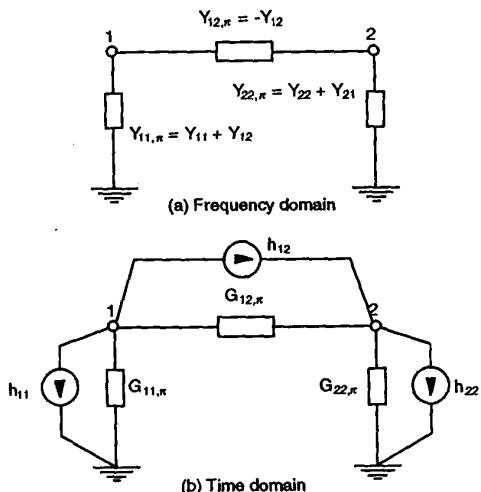  
Fig I: Single-line diagram, multiphase $\pi$ -circuit

We will now address the questions asked by Mr. Kieny. The structure of an FDNE branch is shown in Figure 1 of the paper. The structure of a branch used in the High Frequency

Transformer (HFT) model to which Mr. Kieny refers is shown in Figure II below.

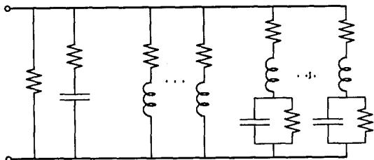  
Fig II: RLC module of the HFT model.

The reason for the differences in structure is that in the development of the HFT model it was felt that a larger degree of freedom in the fitting process would be beneficial in the approximation of measured data. To achieve this additional flexibility, the following steps were taken: (a) adding a resistance across the capacitance (since this is the most general realization of a complex conjugate pole); (b) optimizing poles and zeros (rather than the R, L, and C components of each branch); (c) adding more than one RL branch. In the FDNE, only two real poles (the RL and RC branches) must provide the dynamics that cannot be accounted for by using complex conjugate poles alone. While this provides good overall answers over a wide frequency range, we feel that quality of the approximations at lower frequencies (e.g., between $60\mathrm{Hz}$ and $1\mathrm{kHz}$ ) would improve with the addition of extra real poles and zeros. Part of the ongoing FDNE development is concerned with the addition of these extra poles and zeros.

If the behaviour of a network element like a machine is important to the outcome of a transient simulation, the best approach is not to include it inside the network equivalent. As Mr. Kieny correctly points out, there is no simple way to account for the behaviour of a rotating machine over a broad range of operating conditions by using only an impedance behind an infinite bus. Likewise, if the nonlinear behaviour of a transformer is important, it should not be included inside the equivalent. There are, however, no restrictions regarding what type or how many elements are connected to the external nodes of the FDNE equivalent, or to the number of FDNE equivalents in a given simulation.

Mr. Singh's concerns regarding the number of points required to obtain reasonable resolution for fitting purposes are legitimate, although his conclusions require further examination. The limit of 1000 points indicated in the paper is strictly a programming limit and it does not reflect any inherent FDNE limit. This number was chosen to give ample leeway in the resolution required in all the practical cases examined. The highest Q we have observed in most practical positive sequence networks lies between 80 and 100, which, depending on the resonant frequency, results in a bandwidth between 70 and 150 Hz. A 30 Hz resolution would be sufficient in these cases since to identify and to fit a complex conjugate pole/zero, very few points are really necessary. If a peak is missed because a 30 Hz resolution is not sufficient to identify them, chances are that their effect in a transient simulation would be minimal: closely-packed peaks generally result from transmission lines with small differences in length, and the resulting differences in a transient simulation would only become evident after a relatively long time.

If the FDNE approximations are not acceptable, there are two courses of action: reduce the tolerance in the identification of

resonances and/or increase the number of frequency points. Experience, however, suggests that the number of frequency points is less critical than the tolerance in the initial identification of resonant points. A linear scale effectively increases the resolution at high frequencies while a logarithmic scale increases the resolution at lower frequencies. The fact that linear/logarithmic options yielded similar answers in Mr. Sigh's tests, suggests that the high frequency poles were well separated and that the selected number of frequency points specified was sufficient.

Professor Semlyen's interest in the network reduction technique used in the FDNE is gratifying. We did not place too much emphasis in the description because we felt that in today's world of vast computer resources such an algorithm would not be as important as it was when it was first developed. Perhaps the best way to clarify the process is by means of a small example: Consider the network shown in Figure III. Layer 1 consists of all branches connected between layer 1 buses and/or between layer 1 buses and the reference bus. Layer 2 consists of all remaining branches connected between layer 1 and layer 2 buses. The nodal admittance matrix involving these nodes is formed. Once formed, the buses corresponding to layer 1 can be eliminated. Any reference buses that might appear in layer 1 are retained. Next, the reduced admittance matrix is extended to include layer 3 buses, as shown in Figure III. This new layer consists of all remaining circuits connected between layer 2 and layer 3 buses, and circuits between layer 3 buses. Again, matrix reduction will eliminate the now redundant layer 2 buses, with the exception of reference ports. This process of adding layers, followed by matrix reduction is repeated until all buses are included.

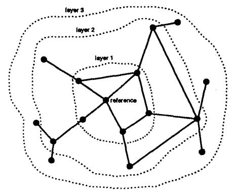

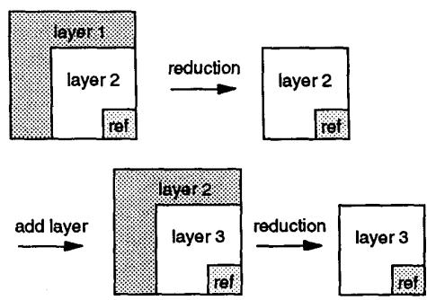  
Fig III: Network reduction

1412   
Some sparsity techniques are also used throughout the process, such as keeping track of zero elements. However, the reduced matrix rapidly becomes full and sparsity techniques are only effective when a new layer is added.   
References   
[a] J. R. Marti and Jimin Lin, "Suppression of Numerical

Oscillations in the EMTP". IEEE Transactions on Power Systems, pp. 739-747, May 1989.   
[b] Jimin Lin and J. R. Martíf, "Implementation of the CDA Procedure in the EMTP". IEEE Transactions on Power Systems, Vol. 5, No. 2, pp. 394-402, May 1990.

Manuscript received September 28, 1992.