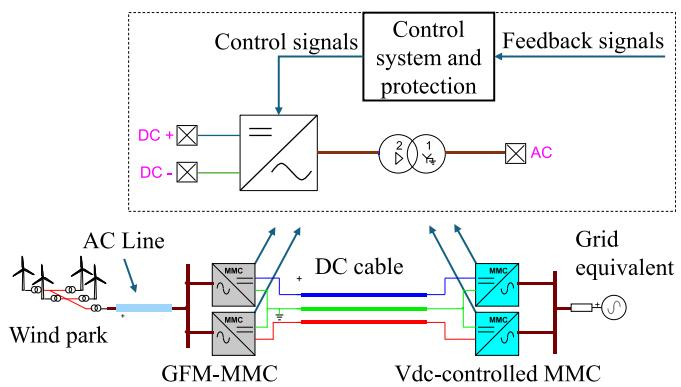
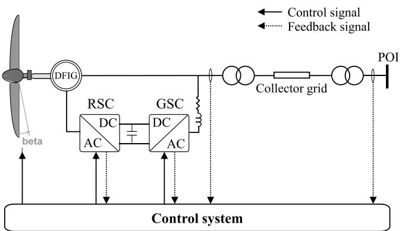
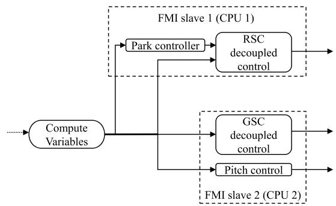
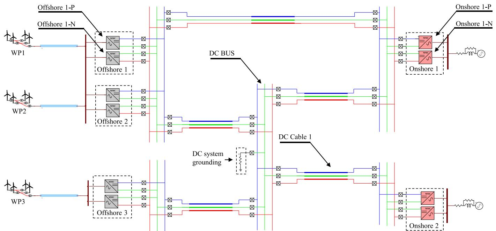
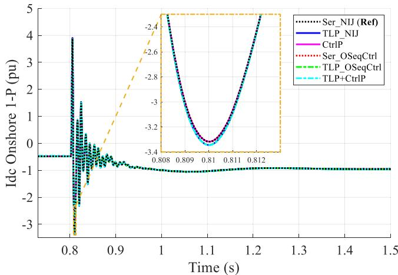
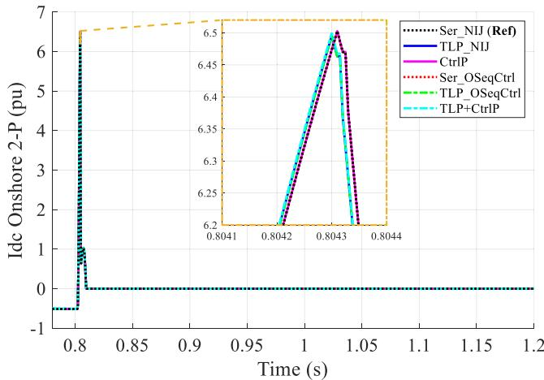
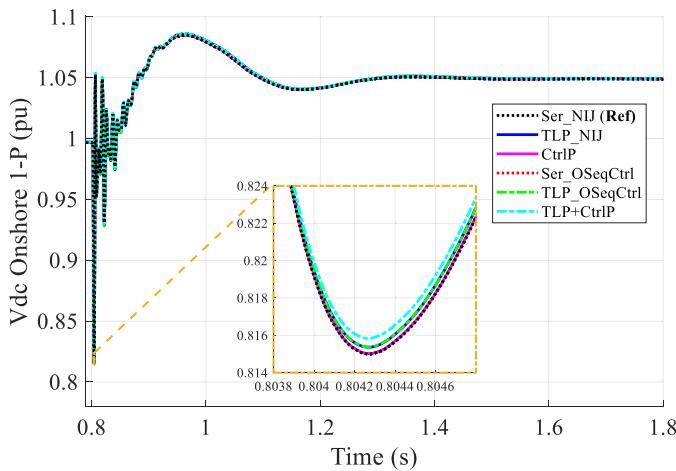

# Acceleration strategies for EMT Simulation of HVDC systems☆,☆☆,★,★★

A. Allabadi a,* , J. Mahseredjian a , S. Denneti`ere b , A. Abusalah a , I. Kocar a , T. Ould-Bachir D

a Polytechnique Montr´eal, Montreal, QC H3T 1J4, Canada   
b R´eseau de Transport d’Electricit´e, Paris 92932, France

# ARTICLEINFO

Keywords:

EMT

HVDC

MTDC

Offline simulation

and Parallel computing

# ABSTRACT

This paper investigates electromagnetic transient (EMT) simulation of large-scale multiterminal HVDC (MTDC) networks, focusing on methods for significant computational acceleration. Three key techniques are evaluated for their applicability: network parallelization, which exploits the natural decoupling properties of transmission lines; control system parallelization, which leverages modularity in converter and inverter-based resource controls; and optimized sequential solvers for control systems. Additionally, two hybrid approaches that integrate these strategies are proposed, achieving substantial speedups in simulation performance. Using the InterOPERA benchmark system modelled in EMTP®, the proposed approaches achieve up to 23x acceleration without compromising accuracy.

# 1. Introduction

With the growing integration of renewable energy sources and the need for flexible, long-distance power transmission, high-voltage direct current (HVDC) technology has become a vital component of modern power grids [1]. HVDC systems are particularly well-suited for transmitting large amounts of power over long distances with minimal losses, making them essential for interconnecting remote renewable energy sources, stabilizing grid operations, and supporting cross-regional power transfer. Traditional point-to-point HVDC systems are widely implemented; however, as renewable energy adoption increases, there is a shift towards multi-terminal HVDC (MTDC) systems to facilitate greater network flexibility and interconnectivity [2].

EMT simulations of large-scale MTDC systems can be computationally expensive due to the intense computational loads of solving control and power system equations at each time-point.

Several strategies have been proposed to accelerate EMT simulations, specifically targeting computationally intensive components in HVDC systems, such as the Modular Multilevel Converter (MMC). For example, optimized models for MMCs have been introduced in [3,4].

Parallel processing strategies enable efficient computations with MMC equivalent models [5]. Initialization techniques further expedite simulations by minimizing simulation time to reach steady-state, with schemes developed specifically for the MMC model [6] and for generic MTDC systems [7].

Other acceleration techniques are more generic, addressing EMT simulations broadly rather than focusing exclusively on HVDC or MTDC systems. One example is transmission line-based parallelization (TLP), which exploits transmission line propagation delays to decouple and parallelize segments of the power network [8].

Given the complexity of control systems in EMT simulations, where control system computations can represent a substantial part of the load, control system parallelization (CtrlP) methods have been proven effective. For instance, A functional mock-up interface (FMI) was used to distribute control system tasks across processors in [9].

In addition to CtrlP, altering the control system solution method offers further potential for improvement. Traditionally, control system solvers introduce an artificial delay of one time-step to break feedback loops. While this sequential solution approach provides acceptable results in several cases, especially with small numerical integration time-

steps, it can become problematic in large-scale systems dominated by IBRs and power electronic devices. In such systems, particularly in sensitive control subsystems, artificial delays can lead to numerical instabilities, as demonstrated in [10]. Simultaneous control solvers avoid the introduction of artificial delays by using Jacobian matrix-based iterations [10]. However, in large-scale MTDC systems, such methods may limit computational performance. Alternatively, a non-iterative Jacobian-based approach (NIJ) is proposed in [10]. It is based on successive (at each time-point) linearizations. This NIJ approach provides acceptable performance for most cases. To address the computational burden more efficiently, optimized sequential control solvers (OSeqCtrl) have been introduced. These solvers demonstrated significant speed improvements in solving control systems with feedback loops [11].

This paper investigates three techniques to accelerate EMT simulations for large-scale MTDC systems: TLP, CtrlP, and OSeqCtrl. The study aims to demonstrate each technique’s potential to reduce simulation time while maintaining model fidelity. An enhanced CtrlP strategy is proposed along with OSeqCtrl. The evaluation of these methods is presented across different scales of MTDC networks, including both a small point-to-point HVDC system and the large-scale MTDC system represented by the InterOPERA benchmark [12]. In addition, hybrid acceleration strategies that combine TLP, CtrlP, and OSeqCtrl are proposed to leverage both network and control system parallelization.

This paper is structured as follows. Sections II to IV introduce the three key acceleration methods—TLP, CtrlP, and OSeqCtrl variants—and evaluate their performances individually on a small-scale HVDC test system. Section V expands the analysis by applying these methods to a large-scale MTDC network. Finally, Section VI concludes by summarizing the key findings and contributions of this paper.

# 2. Transmission line based parallelization, TLP

In large-scale EMT simulations, network parallelization leverages the natural decoupling effect of transmission lines, where propagation delays allow different network segments to be simulated in parallel. This approach can significantly reduce the computational burden.

In [8], the FMI is used as an interoperability standard with a master-slave configuration to create a co-simulation setup of multiple simulation instants. This allows parallel execution of decoupled subsystems using transmission line propagation delays. Therefore, it is particularly effective for networks involving long transmission lines and multiple IBRs, where the computational load can be offloaded across parallel simulation instances. The communication protocol for synchronizing parallel instances is established using low-level primitives. This setup enables efficient and scalable simulations without compromising accuracy.

# 2.1. Performance evaluation

The TLP method in [8] is applied to the test system shown in Fig 1.

  
Fig. 1. Bipolar point-to-point HVDC test system.

The system consists of a bipolar MMC-based point-to-point HVDC system. It includes two MMCs for collecting and transmitting offshore wind power. Table I details simulation models and parameters.

The system is decoupled into three subsystems using the available lines. Each subsystem is simulated on separate CPUs using EMTP® [14]. In this paper, all simulations were conducted on Intel® Xeon® Gold 6258R CPU.

Table II shows the computational results, comparing the TLP approach to the default serial simulation (Ser). Here, both the TLP and Ser use the default control solver in EMTP®, which uses NIJ approach [10], therefore, they are tagged as (TLP_NIJ) and (Ser_NIJ), respectively. By decoupling the system into parallel subsystems, TLP inherently parallelizes the control systems, leading to significant reductions in total simulation time.

The control system gets the highest acceleration, with a speedup factor of 2.1 compared to Ser_NIJ, followed by the power system equations, which achieved a speedup of 1.5. As the computational load is predominantly concentrated in the control systems, accounting for approximately 87 % of the total computational load, their acceleration contributes the most to the overall simulation acceleration, resulting in a total speedup of 2.0. The accuracy of this method is validated in Section V.B.

The TLP method holds the potential for even greater performance improvements in scenarios where the power system computational load is more substantial. Given that the control system represents most of the computational burden, the next sections explore methods to further accelerate control system solutions.

# 3. Control system parallelization, CTRLP

While TLP is highly effective for systems with abundant transmission lines, many large-scale EMT simulations require additional techniques to achieve further computational efficiency, particularly when dealing with complex control systems. In both small and large-scale HVDC systems, a significant portion of the computational load arises from solving control system equations, especially due to integrating IBRs. Therefore, accelerating the control system solution can substantially speed up the simulation process. Generic IBR models are considered in this paper.

One promising approach is the parallelization of control systems, which has been explored in [9] using a co-simulation-based method. In EMT simulations, the solutions of power system and control system equations alternate, with a one-time-step buffer between them. The MTDC control systems usually have several modular and identical subsystems. For example, as illustrated in Fig 1, each MMC block contains

Table I Simulation and Model Details for The HVDC system in Fig 1.   

<table><tr><td></td><td></td><td>Details</td></tr><tr><td rowspan="4">Component model</td><td>Grid equivalents</td><td>Voltage sources with impedance</td></tr><tr><td>MMC</td><td>Generic 401-level, half-bridge, arm equivalent model (Model 3) [15]. GFM-MMC operates in V/f control mode. More details about V/f and Vdc-control can be found in [16].</td></tr><tr><td>Wind parks</td><td>Generic aggregated DFIG models with controls. Contains 1200 wind turbines, 1.5 MW each.</td></tr><tr><td>Lines /cables</td><td>Wideband models [17] DC cable: 70 km, ±640 kV</td></tr><tr><td rowspan="4">Simulation details</td><td>Total number of simulation nodes</td><td>318</td></tr><tr><td>Total number of control devices</td><td>3617</td></tr><tr><td>Simulation interval (s)</td><td>10</td></tr><tr><td>Time-step (μs)</td><td>50</td></tr></table>

Table II Computational performance comparison, TLP.   

<table><tr><td>Equations</td><td>Ser_NIJ simulation time (s)</td><td>TLP_NIJ simulation time (s) 3 CPUs</td><td>Speedup factor</td></tr><tr><td>Power system</td><td>27.1</td><td>18.1</td><td>1.5</td></tr><tr><td>Control system</td><td>188.5</td><td>87.7</td><td>2.1</td></tr><tr><td>Total simulation</td><td>215.6</td><td>105.8</td><td>2.0</td></tr></table>

the same control system. The solution of each control module is independent of the others at any given discrete time-point, making it possible to parallelize these solutions across multiple CPUs. By assigning the control subsystems to different processors (e.g., 4 CPUs), the computational load can be distributed, thus accelerating the simulation process. A similar approach can be applied to IBR controls when having multiple IBRs.

As suggested in [9], the FMI standard can be employed for this parallelization under a master-slave configuration. In this setup, each control subsystem is treated as a slave FMU, communicating with a master that handles synchronization across all time-points.

Some IBR models have control systems that can be further decoupled into independent branches. For instance, in the DFIG model shown in Fig 2, the rotor control (RSC), grid-side converter (GSC) control, and pitch control are decoupled. This gives the potential to achieve further acceleration by parallelizing them. However, as the RSC and GSC controls have a significant relative burden, they can be combined, as shown in Fig 2(b). This combination balances the parallel loads across CPUs.

# 3.1. Performance evaluation

In this subsection, CtrlP is tested on the system depicted in Fig 1 using EMTP® [14]. Each MMC converter control system is allocated to individual CPUs, while the control of the wind park is split and parallelized over two slave FMUs. This configuration effectively distributes

  
(a)   
(b)   
Fig. 2. (a) DFIG model and its (b) Control system.

the computational load across 6 CPUs. The default control solver in EMTP® is used (NIJ) [10].

As shown in Table III, the CtrlP achieved notable improvements in overall simulation speed. The control system computations substantially reduced from 188.5 s to 37.5 s. This significant acceleration, with a speed-up factor of 5.02, highlights the method’s effectiveness in reducing control solution times. Consequently, the total simulation time decreased from 215.6 s in the Ser_NIJ setup to 64.6 s with CtrlP, yielding an overall speedup of 3.33 across 6 CPUs. The accuracy of this method is validated in Section V.B.

# 4. Sequential control solver, OSeqCtrl

As demonstrated in the previous section, control systems contribute significantly to the overall computational load in EMT simulations, forming a primary bottleneck to simulation speed. This is largely due to their complexity and the presence of nonlinear feedback loops, which are computationally intensive to solve. Although TLP or CtrlP significantly accelerated the process, the control system solution remains a considerable bottleneck, emphasizing the need for exploring other control accelerating techniques.

The reduced Jacobian matrix approach [13] and its optimized version [11] allow to significantly improve computational performance while maintaining the highest accuracy for a given time-step. As demonstrated in [11], it is also possible to apply an optimized sequential solution (see SEQ+DFSOpt method in [11]) that reduces the number of delays and delay impacts on accuracy within an optimized ordering approach. It is tagged in this paper as OSeqCtrl. The OSeqCtrl approach is tested below for its performance. It maintains acceptable accuracy for the tested cases of this paper but should remain optional and can be used regionally since its accuracy is not guaranteed. Its general applicability depends on the complexity of the control system. In systems with highly nonlinear controllers or strong feedback interactions, numerical approximations introduced by OSeqCtrl may lead to deviations. One such case was observed in [11]. Therefore, while OSeqCtrl is a powerful tool for accelerating EMT simulations, it should be applied cautiously in systems with fast-changing states or complex nonlinear interactions. It can also be sensitive to larger time-step utilization and should be compared with the Jacobian matrix-based approach to validate its accuracy. A regional application is another option.

# 4.1. Performance evaluation

For the system of Fig 1, Table IV provides a breakdown of CPU times for solving the control and power system equations using Ser_NIJ and OSeqCtrl. OSeqCtrl achieves massive gains over the NIJ method. OSeqCtrl accelerates the control solution by 14.7 times compared to the NIJ, which shrinks the control part to form only 30 % of the total simulation time. Consequently, OSeqCtrl accelerates the overall simulation 5.4 times using one CPU only. The accuracy of this method is validated in Section V.B.

# 5. Performance evaluation, InterOPERA

This section evaluates the performance of the acceleration

Table III Computational performance comparison, CtrlP.   

<table><tr><td>Equations</td><td>Ser_NIJ simulation Time (s)</td><td>CtrlP simulation Time (s) 6 CPUs</td><td>Speedup factor</td></tr><tr><td>Power system</td><td>27.1</td><td>27.1</td><td>1.00</td></tr><tr><td>Control system</td><td>188.5</td><td>37.5</td><td>5.02</td></tr><tr><td>Total simulation</td><td>215.6</td><td>64.6</td><td>3.33</td></tr></table>

Table IV Computational Performance Comparison, OSeqCtrl.   

<table><tr><td>Equations</td><td>Ser_NIJ simulation time (s)</td><td>Ser_OSeqCtrl Simulation time (s) 1 CPU</td><td>Speedup factor</td></tr><tr><td>Power system</td><td>27.1</td><td>27.1</td><td>1</td></tr><tr><td>Control system</td><td>188.5</td><td>12.8</td><td>14.7</td></tr><tr><td>Total simulation</td><td>215.6</td><td>39.9</td><td>5.4</td></tr></table>

techniques presented above on a large-scale MTDC system. The evaluation uses the InterOPERA system [12], a European-funded benchmark topology developed to ensure interoperability between multi-vendor HVDC grids and facilitate the integration of renewable energy. For this evaluation, InterOPERA variant 1, named "Meshed offshore grid for wind export," [18] is selected.

As shown in Fig 3, this system comprises five MMC bipolar converters interconnected within a meshed DC network. This configuration is designed to efficiently collect and transmit power from offshore renewable resources to onshore receiving stations, providing a realistic test case for assessing HVDC grid control and simulation acceleration techniques. The system is modelled in EMTP® [14]. The detailed specifications of the model are summarized in Table V.

# 5.1. Computing time gains

Firstly, the three main setups, TLP_NIJ, CtrlP, and Ser_OSeqCtrl, are tested individually against the baseline, Ser_NIJ. Secondly, two hybrid setups are introduced: TLP+CtrlP, which combines the TLP and CtrlP methods using the NIJ solver, and TLP_OSeqCtrl, which applies the TLP method with the OSeqCtrl solver.

Each method is configured to fully utilize its computational capabilities, ensuring that parallel computing methods achieve maximum parallelism. While this results in different CPU allocations across methods, the evaluation framework is based on the highest speedup factor each approach can attain within the benchmark system. This ensures a practical comparison that accounts for each method’s scalability and inherent constraints.

The TLP method parallelizes the test system depicted in Fig 3 across 8

Table V Simulation and model details for InterOPERA variant 1.   

<table><tr><td>Aspect</td><td></td><td>Details</td></tr><tr><td rowspan="7">Component model</td><td>Grid equivalents</td><td>Voltage sources with impedance</td></tr><tr><td>MMC</td><td>Generic 401-level, half-bridge, arm equivalent model (Model 3) [15]</td></tr><tr><td></td><td>Offshore stations operate in V/f control mode [16].</td></tr><tr><td></td><td>Onshore stations operate in DC Droop control mode [16].</td></tr><tr><td>Wind parks</td><td>Generic aggregated DFIG models with controls.</td></tr><tr><td>Lines /cables</td><td>Wideband models [17].</td></tr><tr><td>Loads</td><td>Fixed impedance.</td></tr><tr><td rowspan="4">Simulation details</td><td>Total number of simulation nodes</td><td>1016</td></tr><tr><td>Total number of control devices</td><td>9754</td></tr><tr><td>Simulation interval (s)</td><td>10</td></tr><tr><td>Time-step (μs)</td><td>50</td></tr></table>

CPUs, allocated as follows:

• Wind parks: 3 CPUs.   
• DC network: 1 CPU.   
• MMCs: 4 CPUs; Offshore 1 and Offshore 2 share one CPU as they lack a separating transmission line delay.

As shown in Table VI, TLP_NIJ significantly reduces CPU time, achieving an acceleration factor of 5.6.

To parallelize the control systems using the CtrlP method, 16 CPUs

Table VI Performance evaluation of simulation techniques.   

<table><tr><td>Simulation technique</td><td>Number of CPUs</td><td>CPU time (s)</td><td>Acceleration factor</td></tr><tr><td>Ser_NIJ (Ref)</td><td>1</td><td>615.6</td><td>-</td></tr><tr><td>TLP_NIJ</td><td>8</td><td>109.9</td><td>5.60</td></tr><tr><td>CtrlP</td><td>16</td><td>142.1</td><td>4.33</td></tr><tr><td>Ser_OSeqCtrl</td><td>1</td><td>149.2</td><td>4.13</td></tr><tr><td>TLP+CtrlP</td><td>24</td><td>85.2</td><td>7.23</td></tr><tr><td>TLP_OSeqCtrl</td><td>8</td><td>26.0</td><td>23.65</td></tr></table>

  
Fig. 3. InterOPERA’s variant 1 test system schematic.

are utilized: 10 for the MMCs and 6 for the wind parks. The configurations remain consistent with those outlined in Section III. When using CtrlP, the CPU time decreases by a factor of 4.33, as shown in Table VI. Substituting the control solver in the Ser_NIJ case with OSeqCtrl (Ser_OSeqCtrl) yields significant CPU time reduction, achieving an acceleration factor of 4.13. Notably, this performance is achieved using just one CPU.

The hybrid setups further enhance computational efficiency. TLP+CtrlP, combining TLP and CtrlP with the NIJ solver across 24 CPUs, achieves an acceleration factor of 7.23. The most efficient approach, TLP_OSeqCtrl, combines TLP with OSeqCtrl across 8 CPUs, achieving the highest acceleration factor of 23.65. This combination minimizes total iterations and delivers the most significant reduction in CPU time.

# 5.2. Error analysis

To evaluate the accuracy of the acceleration techniques, a DC fault simulation on the InterOPERA system in Fig 3 is performed using EMTP® [14]. Simulation details are listed in Table VII. The fault is cleared by tripping the faulty pole of DC Cable 1.

Fig 4 shows the DC fault current contributions from Onshore 1 and Onshore 2, specifically the Idc of Onshore 1-P and Onshore 2-P, under Ser_NIJ and all accelerated techniques. Additionally, the DC voltage (Vdc) at the Onshore 1-P terminals is presented in Fig 5. All acceleration methods demonstrated high accuracy, delivering near-identical transient responses. A zoomed-in view of the initial fault instants, where potential errors are most observable, is included in both figures to validate the accuracies of the methods.

All methods exhibit high accuracy. However, referring to Fig 5, it is noteworthy that switching the solver to OSeqCtrl introduces no deviation. In other words, Ser_NIJ and Ser_OSeqCtrl match identically, similarly also for TLP_NIJ and TLP_OSeqCtrl. Among all techniques, TLP configurations, such as TLP_NIJ, TLP_OSeqCtrl, and TLP+CtrlP, show slightly higher errors compared to other methods.

# 6. Conclusion

This paper presents the evaluation of three simulation methods for accelerating EMT simulations of HVDC systems. These methods are: transmission line-based parallelization (TLP), control system paralleli zation (CtrlP), and optimized sequential control solver (OSeqCtrl). Using maximum attainable acceleration as the primary comparison criterion, the methods were tested on both a small-scale HVDC system and a largescale MTDC benchmark (InterOPERA).

In the small-scale case, all methods showed observable gains, with TLP achieving up to 2.0 times acceleration, CtrlP reaching 3.33 times, and OSeqCtrl obtaining the highest speedup of 5.4 times using a single CPU. However, scalability limitations affected their relative effectiveness, particularly for TLP, which was constrained by the available transmission lines. For the large-scale system, results demonstrated significantly higher acceleration. TLP achieved up to 5.6 times acceleration, CtrlP 4.33 times, and OSeqCtrl 4.13 times. Each method presents trade-offs: TLP is efficient but limited by system topology, CtrlP scales well but requires more CPUs, and OSeqCtrl provides substantial gains on a single core but does not guarantee accuracy in all cases,

Table VII   
Key parameters of the fault simulation scenario.   

<table><tr><td>Parameter</td><td>Details</td></tr><tr><td>Fault Resistance (Ω)</td><td>1</td></tr><tr><td>Fault location</td><td>Mid-point of DC cable 1, tagged in Fig 3. (Positive pole)</td></tr><tr><td>Fault type</td><td>Pole to ground</td></tr><tr><td>Fault instant (s)</td><td>0.8</td></tr><tr><td>Fault clearing time (ms)</td><td>5</td></tr><tr><td>Time-step (μs)</td><td>10</td></tr></table>

  
(a)

  
(b)   
Fig. 4. DC fault current contribution from (a) Onshore 1-P (b) Onshore 2-P.

  
Fig. 5. DC voltage response at Onshore 1-P terminals (Vdc) during the fault event.

requiring careful application.

Two hybrid techniques are proposed. The most efficient configuration is TLP combined with OSeqCtrl (TLP_OSeqCtrl) for an acceleration of 23.65 times. All methods preserved high accuracy and were validated by DC fault simulations.

# CRediT authorship contribution statement

A. Allabadi: Data curation, Software, Writing – review & editing, Conceptualization, Writing – original draft, Methodology. J. Mahseredjian: Supervision, Methodology, Writing – review & editing, Software, Validation, Conceptualization. S. Dennetiere: ` Writing – review & editing, Supervision, Validation. A. Abusalah: Software, Methodology, Writing – review & editing, Conceptualization. I. Kocar: Writing – review & editing, Supervision. T. Ould-Bachir: Supervision, Writing – review & editing.

# Declaration of competing interest

The authors declare that they have no known competing financial interests or personal relationships that could have appeared to influence the work reported in this paper.

# Data availability

Data will be made available on request.

# References

[1] D. Jovcic, High Voltage Direct Current transmission: converters, Systems and DC Grids, John Wiley & Sons, 2019.   
[2] DC grid benchmark models for system studies, CIGRE Technical Brochure, vol. 804, June 2020.   
[3] S. Yu, S. Zhang, Y. Wei, Y. Zhu, Y. Sun, Efficient and accurate hybrid model of modular multilevel converters for large MTDC systems, IET Gener. Transm. Distrib. 12 (7) (2018) 1565–1572.   
[4] A. Stepanov, J. Mahseredjian, U. Karaagac, H. Saad, Adaptive modular multilevel converter model for electromagnetic transient simulations, IEEE Trans. Power Deliv. 36 (2) (2020) 803–813.   
[5] A. Stepanov, J. Mahseredjian, H. Saad, U. Karaagac, Parallelization of MMC detailed equivalent model, Electr. Power Syst. Res. 195 (2021) 107168, https:// doi.org/10.1016/j.epsr.2021.107168, 2021/06/01/.

[6] A. Stepanov, H. Saad, U. Karaagac, J. Mahseredjian, Initialization of modular multilevel converter models for the simulation of electromagnetic transients, IEEE Trans. Power Deliv. 34 (1) (2018) 290–300.   
[7] A. Allabadi, J. Mahseredjian, K. Jacobs, S. Denneti`ere, I. Kocar, T. Ould-Bachir, Initializing large-scale multi-terminal HVDC systems using decoupling interface, IEEE Trans. Power Deliv. 39 (3) (June 2024) 1600–1609, https://doi.org/10.1109/ TPWRD.2024.3373657.   
[8] M. Ouafi, J. Mahseredjian, J. Peralta, H. Gras, S. Denneti`ere, B. Bruned, Parallelization of EMT simulations for integration of inverter-based resources, Electr. Power Syst. Res. 223 (2023) 109641, https://doi.org/10.1016/j. epsr.2023.109641. ISSN 0378-7796.   
[9] M. Cai, J. Mahseredjian, U. Karaagac, A. El-Akoum, X. Fu, Functional mock-up interface based parallel multistep approach with signal correction for electromagnetic transients simulations, IEEe Trans. Power. Syst. 34 (3) (2019) 2482–2484, https://doi.org/10.1109/TPWRS.2019.2902740.   
[10] J. Mahseredjian, L. Dube, Ming Zou, S. Dennetiere, G. Joos, Simultaneous solution of control system equations in EMTP, IEEe Trans. Power. Syst. 21 (1) (Feb. 2006) 117–124, https://doi.org/10.1109/TPWRS.2005.860925.   
[11] B. Bruned, J. Mahseredjian, S. Denneti`ere, N. Bracikowski, Optimized reduced jacobian formulation for simultaneous solution of control systems in electromagnetic transient simulations, IEEE Trans. Power Deliv. 38 (5) (2023) 3366–3374.   
[12] InterOPERA, Publications, [Online], available: https://interopera.eu/publ ications/.   
[13] C.F. Mugombozi, J. Mahseredjian, O. Saad, Efficient computation of feedbackbased control system equations for electromagnetic transients, IEEE Trans. Power Deliv. 30 (6) (Dec. 2015) 2501–2509, https://doi.org/10.1109/ TPWRD.2015.2446532.   
[14] J. Mahseredjian, S. Denneti`ere, L. Dub´e, B. Khodabakhchian, L. G´erin-Lajoie, On a new approach for the simulation of transients in power systems, Electr. Power Syst. Res. 77 (11) (2007) 1514–1520.   
[15] H. Saad, S. Denneti`ere, J. Mahseredjian, P. Delarue, X. Guillaud, J. Peralta, S. Nguefeu, Modular multilevel converter models for electromagnetic transients, IEEE Trans. Power Deliv. 29 (3) (2014) 1481–1489, https://doi.org/10.1109/ TPWRD.2013.2285633.   
[16] Guide for the development of models for HVDC converters in a HVDC grid, CIGRE Tech. Broch. 604 (2014).   
[17] I. Kocar, J. Mahseredjian, Accurate frequency dependent cable model for electromagnetic transients, IEEE Trans. Power Del 31 (3) (Jun. 2016) 1281–1288.   
[18] InterOPERA, "WP3 Demonstrator definition & system design studies", [Online], Available: https://interopera.eu/wp-content/uploads/files/deliverables/D3 .1-Demonstrator-definition-and-preliminary-conceptual-system-design-studies.pdf.